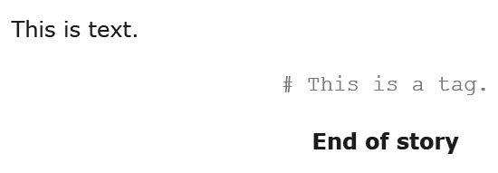
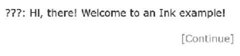
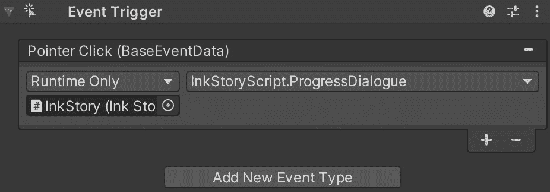
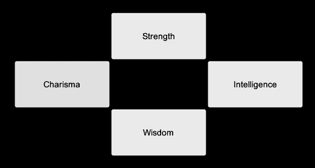

# 第十章：*第十章*: 使用 ink 的对话系统

在本章中，我们将探讨三种不同的方法来创建与故事中特定角色关联的 ink 中的不同行（`#`），然后我们将讨论标签的替代方案，即说话者的名字位于其对话之前。最后，我们将通过回顾标签的使用方法和两种方法的结合来结束第一部分。

在第二个主题中，我们将探讨如何使用 ink 重现许多视频游戏中常见的**点击继续**对话模式。我们将通过使用隧道在不同节点之间移动并在 ink 项目中保存时间与精力来探索各种节省时间与精力的方法。在此之后，我们将检查 ink 中生成对话树的不同方法，玩家可以通过扩展的对话分支探索不同的路径。

在第三个也是最后一个主题中，我们将探讨两种常见的视觉模式，用于向玩家展示对话选项，即列表和环形菜单，以及它们如何影响 ink 代码的编写和 Unity 中向玩家显示信息的方式。我们将从列表的视觉模式开始，其中所有选项都按垂直模式向玩家展示。然后，我们将检查**环形菜单模式**，其中选项限制在更少的选项中，这些选项以特定的、视觉的方式排列。

在本章中，我们将涵盖以下主题：

+   使用标签在 ink 中编写对话

+   对话循环和故事节点

+   对话的用户界面模型

    注意

    与前几章不同，前几章的章节是朝着完成的项目构建的，而本章将探讨更多视觉复杂系统的不同方法。每个章节中涵盖的方法都可以在 GitHub 上作为完成的项目找到。本章中仅展示与每个章节方法相关的选定文件和代码。每个示例的具体文件也已在每个章节中注明。

# 技术要求

本章不同部分的完成代码可以在 GitHub 上找到，网址为[`github.com/PacktPublishing/Dynamic-Story-Scripting-with-the-ink-Scripting-Language/tree/main/Chapter10`](https://github.com/PacktPublishing/Dynamic-Story-Scripting-with-the-ink-Scripting-Language/tree/main/Chapter10)。

# 使用标签在 ink 中编写对话

当 ink 首次在*第一章*中介绍时，*文本、流程、选择和编织*，也讨论了单行的重要性。ink 中的每一行可以由代码、文本或两者的组合组成。根据其他概念的使用，如粘合剂或注释，单行可以由多个文本块组成，或者包括作为单行一部分的作者注释。然而，除了之前审查的概念之外，还有一个之前未讨论的概念：**标签**。

在墨水（ink）中，当在任意文本前使用哈希符号（`#`）时，会创建一个新的单个 *标签*。从哈希符号（`#`）开始，直到该行的末尾，出现在这两个符号之间的任何文本都被视为单个 *标签* 的部分：

```cs
This is text. #This is a tag.
```

墨水中的标签专门设计用来与其他系统协同工作。在 Inky 本身中它们没有意义，并且在输出中间显示：



图 10.1 – Inky 中使用的哈希标签

当与其他系统（如 Unity）一起工作时，标签可以用来在墨水单行中添加额外数据。加载的墨水故事块当前标签存在于 Story API 提供的属性中，称为 `currentTags`，它包含一个 `List<string>`，其中包含在最后一次加载故事内容中检测到的所有标签。与其他文本相关内容一样，`currentTags` 属性也会受到 `Continue()` 或 `ContinueMaximally()` 方法的任何使用的影响。

我们将首先学习如何在墨水中使用标签。我们将使用 Unity 中的 `currentTags` 属性来检索它们的值，以构建一个简单的对话系统，其中每条说话的行都与一个与之通信的人的名字相关联。接下来，我们将检查使用文本前的语音标签来处理相同对话系统的不同方法。本主题的最后一部分将比较这两种方法，并回顾何时一个方法可能比另一个方法更好，或者是否需要两种方法的组合。

## 标记墨水文本

在墨水中，标签是按行使用的。它们仅存在于该行，但在使用 `Continue()` 或 `ContinueMaximally()` 方法加载故事的下一部分之前，仍然是当前标签的一部分。在本节中，我们将回顾一个使用标签和说话者名字作为墨水单行一部分的示例。我们将学习如何使用 `Continue()` 和 `ContinueMaximally()` 方法来影响 `currentTags` 属性。

提醒

本节完成的项目的示例可以在 GitHub 上的 *第十章* 找到；这些示例以 *Chapter10-TaggingInkText* 的名称命名。只会展示与本章探讨的概念相关的代码部分。

对话行如果没有指明是某个角色所说的话，则没有意义。这有助于确定谁在进行交流，并使你能够在故事中建立连贯性。在 `Chapter10-TaggingInkText` 示例中，每条对话的末尾都以其说话者的名字作为墨水中的标签结束。这有助于确定每条对话的说话者：

示例 1（InkDialogueTags.ink）：

```cs
Hi, there! Welcome to an Ink example! #???
* [\[Continue\]]
- 
My name is Narrator! I will be guiding you through this example.
.. #Narrator
* [\[Continue\]]
- 
My name is Dan. #Dan
* [\[Continue\]]
-
I'm another character in this example! #Dan
```

*示例 1* 的墨水代码包含了每条对话的行和说话者的名字。在 Unity 中，这转化为使用 `currentTags` 属性在至少使用一次 `Continue()` 或 `ContinueMaximally()` 方法后访问标签：

示例 2（InkStoryScript.cs）：

```cs
void UpdatePanel()
{
DestroyChildren(OptionsPanel.transform);
InkOutputText.text = InkStory.ContinueMaximally();
SpeakerNameText.text = InkStory.currentTags[0];
}
```

在*示例 2*中，因为`currentTags`属性是一个`List<string>`，所以可以使用其索引的数量来检索第一个（`0`）位置。结果是，尽管在墨迹中它们被写为同一行，但在 Unity 中仍然可以分离标记的说话者和他们的台词。

哈希标签是一种强大的工具，可以在墨迹中为单行添加额外数据。正如本节所示，它们可以用来在每次结束时添加传达该行的角色的名字。然而，还有另一种实现相同结果的方法。在下一节中，我们将重复相同的通用代码，但将在每行前面使用*语标*。

## 使用语标

在创意写作中，一个**语标**出现在某些对话之前或之后，并表明谁在进行交流。例如，在许多小说中常见的例子可能会用以下方式使用单词*说*：

```cs
"Hello," Dan said.
```

“Dan 说”作为引用中话语的*标签*。它表明谁在说话（*Dan*）以及说了什么（*Hello*）。

通常，许多为游戏或其他交互式项目写作的人遵循一种略微不同的格式，其中说话者的名字出现在台词之前。这种风格借鉴了剧本中的惯例。在先前的示例中使用的相同词语可能如下所示：

```cs
Dan: Hello
```

在更新形式中，省略了引号的使用，说话者的名字出现在他们的话语之前。还有一个冒号（`:`）的引入。这标志着说话者的结束和话语的开始。在剧本中，说话者的名字和他们的对话都将居中。然而，在更常见地作为游戏写作一部分的更新形式中，这种格式被省略，文本作为一行的一部分出现。

提醒

本节完成的项目的示例可以在 GitHub 上的*第十章*示例中找到，名称为`Chapter10-UsingSpeechTags`。将仅展示与本章探讨的概念相关的代码部分。

在`Chapter10-UsingSpeechTags`章节中的 ink 代码与上一节中找到的模式不同。它不再将说话者的名字作为哈希标签包含在对话行之后，而是现在在它之前。通常，这种格式被视频游戏和其他交互式项目的作家用于对话：

示例 3（InkSpeechTags.ink）：

```cs
???: Hi, there! Welcome to an Ink example!
* [\[Continue\]]
- 
Narrator: My name is Narrator! I will be guiding you through this example.
* [\[Continue\]]
- 
Dan: My name is Dan.
* [\[Continue\]]
-
Dan: I'm another character in this example!
```

当在 Inky 中运行*示例 3*代码时，因为代码不再使用哈希标签，所以第一个输出和编织将被更新：



图 10.2 – Inky 中的语标使用

立即，使用墨迹井号和用语音标签格式化对话之间存在视觉差异。在 Inky 中测试代码时，很明显谁在交流，因为他们的名字将出现在文本之前。然而，尽管在 Inky 中测试更容易，但墨迹代码中井号的移除意味着无法使用`currentTags`属性。相反，必须添加更多的 C#代码来从每行文本中解析名字。

要检测、解析和删除墨迹输出中的冒号（`:`）的使用，需要多行 C#代码：

示例 4（InkStoryScript.cs）：

```cs
void UpdatePanel()
{
DestroyChildren(OptionsPanel.transform);

string inkOutput = InkStory.ContinueMaximally();
if(inkOutput.Contains(":"))
{
string[] splitInkOutput = inkOutput.Split(':');
splitInkOutput[0] = splitInkOutput[0].TrimEnd(':');
SpeakerNameText.text = splitInkOutput[0];
InkOutputText.text = splitInkOutput[1];
}
else
{
SpeakerNameText.text = "";
InkOutputText.text = inkOutput;
}
}
```

*示例 4*现在使用`Contains()`方法检测输出中是否存在冒号（`:`）。如果存在，则使用`Split()`方法将字符串分成两部分。然后使用`Trim()`方法从第一个（`0`）字符串中去除冒号（`:`），其值随后用于演讲者的名字。第二个（`1`）字符串用于墨迹的输出。

这段新代码的结果看起来与上一节相同。然而，它使用语音标签来标记谁在说话以及何时说话。这使得在 Unity 之外测试墨迹代码变得更加容易，因为在 Inky 中墨迹的井号没有意义。然而，这种方法也带来了一个问题，即冒号（`:`）只能作为语音标签的一部分出现。如果文本中包含冒号，C#代码可能会困惑并尝试将文本分割成似乎包含语音标签的样子。

在下一节中，我们将比较之前概述的每种方法：

+   第一种方法，使用墨迹中的井号，允许我们在单行中添加额外数据，然后使用`currentTags`属性在 C#代码中检索这些数据。

+   第二种方法，直接在文本中使用语音标签，使得墨迹代码更容易测试，但需要更多的 C#代码来解析生成的墨迹。

正如我们将在下一节中提到的，可能存在两种方法都可以结合使用的情况。

## 检查标记对话的方法

在墨迹中，每个井号都会为每行添加额外数据。正如我们在*标记墨迹文本*部分所学，它们可以用来给每行对话添加井号，然后使用 C#代码中的`currentTags`属性作为 Unity 项目的一部分来检索这些数据。然而，墨迹中的井号有两个问题。第一个是它们只能*按行使用*。第二个是每次只能使用*一个标签*。这使得井号非常有用，例如，在添加谁在交流到行中的任务中，但也意味着它们只能每行使用一次。

对话可以直接在文本中使用语音标签进行标记。正如我们在*使用语音标签*部分所学，冒号可以用来标记说话者是谁以及他们正在传达什么。这对于在 Inky 中进行测试非常有用，因为说话者和他们的台词紧密相连，并一起出现。然而，在墨水中使用语音标签需要额外的 C#代码来理解输出。此外，这意味着冒号只能作为语音标签的一部分使用，因为任何其他用户都可能会造成混淆。

当单独使用时，这两种方法都有其优点和潜在障碍。然而，在某些情况下，这两种方法可以结合使用，以语音标签的形式呈现说话者姓名，并使用墨水中的标签同时传达额外数据。例如，许多游戏不仅向玩家展示文本，还使用音频、视频或与文本本身紧密相关的某种类型的动画。在这些情况下，文本可以包含语音标签，墨水代码也可以使用标签来指示应作为对话向玩家传达的合并交付的一部分播放的额外媒体。

对于有语音对话行的游戏，使用数据库或电子表格来存储文本行及其对应的音频，并根据命名约定作为同一行的一部分是非常常见的。根据团队、公司和其他因素，命名约定可能使用特定的格式或数字，但一个一般示例可能包括音频类型、角色姓名、他们的心理状态或情绪以及与游戏上下文、级别或区域相关的任何其他信息：

```cs
dialogue_diana_happy_desert.mp3
```

由于墨水标签可以添加额外数据，墨水代码中的一行可以使用语音标签来标记谁在交流，然后在该行的媒体文件标签后使用标签来播放。此类代码将结合两种方法。

提醒

本节完成的工程可以在 GitHub 上的*第十章*示例中找到，名称为`Chapter10-CombiningTags`。由于与本章探讨的概念相关，只会展示代码的部分内容。

`Chapter10-CombiningTags`示例中的墨水代码使用的是结合方法。它包括对话行前的说话者姓名以及当行显示时使用的对应媒体文件或引用的标签：

示例 5 (InkCombiningTags.ink):

```cs
Diana: I love the desert! #dialogue_diana_happy_desert
* [\[Continue\]]
- 
Diana: But I hate how hot it gets! #dialogue_diana_sad_desert
* [\[Continue\]]
- 
Diana: Perhaps I'm just fickle. #dialogue_diana_shrug_desert
* [\[Continue\]]
-
```

为了简化，本节的工程只显示标签的文本。通过添加一个额外的`Text`游戏对象并将其与现有属性关联，调整后的 C#代码将包含对解析语音标签的使用以及`currentTags`属性的用法：

示例 6 (InkStoryScript.cs):

```cs
if(InkStory.currentTags.Count > 0)
{
MediaText.text = InkStory.currentTags[0];
}
else
{
MediaText.text = "";
}
```

在 *示例 6* 中，新的代码测试 `currentTags` 属性中的条目数量。如果它至少包含一个标签，则第一个（`0`）条目用作 `Text` 游戏对象的文本。运行项目时，项目将显示说话者、他们的交流以及将要播放或作为对话一部分使用的媒体文件的名称，字体较小。

在下一个主题中，我们将重新创建一些在视频游戏对话中常见的模式。我们将学习如何创建点击继续模式以及更复杂的对话树供玩家探索。同时，也会为那些开始新项目的人提供如何规划和允许 ink 中的代码引导你创建 Unity 界面的建议。

# 对话循环和故事节点

在 ink 中编写对话通常意味着要意识到它将如何与其他系统一起使用。在前一节中，我们研究了在编写单行对话时使用标签的两种方法。在本主题中，我们将从关注单个行转向处理 ink 项目中的更大结构。通过检查两种向玩家呈现选择时的常见模式，我们将学习 ink 中的节点如何在项目中重用以节省未来的时间和精力。本主题的最后一部分还包括有关开始新项目或使用 ink 转换项目的建议。

因为它出现得最频繁，所以我们将从一个出现在 ink 代码示例中的*使用标签编写 ink 中的对话*部分的模式开始，该模式是作为点击继续的一部分：点击继续。

## 点击继续

提醒

本节完成的项目的示例可以在 GitHub 上的*第十章*示例中找到，名称为 `Chapter10-ClickToContinue`。将仅展示与本章探讨的概念相关的代码部分。

在视频游戏写作中可以发现许多重复的模式。其中最常见的是**点击继续**模式。这是将信息通过一系列消息呈现给玩家，他们必须按下按钮或点击屏幕才能继续的过程。

在 ink 中，创建点击继续模式的一种方法是通过一个单一的选择，然后通常是一个聚集点，在它之后立即折叠编织。在其最简单的形式中，它只包含这些概念和一个表示动作的单个单词，例如 *继续*：

```cs
* [\[Continue\]]
-
```

将点击继续的代码拆分成一个节点允许作者通过一次编写并在需要时通过隧道进入和返回来多次重用相同的部分。在一个扩展的例子中，用于此目的的特定节点出现的次数越多，节省的代码行数就越多：

示例 7 (InkClickToContinue.ink):

```cs
Guard: Sir! A dragon! There's a dragon!
-> continue ->
King: What? Are you sure?
-> continue ->
Guard: Let me check!
-> continue ->
Guard: Just a large bird, turns out.
-> continue ->
Guard: Sorry, sir.
-> continue ->
== continue ==
+ [\[Continue\]]
-
->->
```

在 *示例 7* 的代码中，`continue` ink 节点被多次重用。每次使用都会进入节点并返回。这使得代码可以减少总行数。

根据墨水的结构，C#代码的数量也可以减少。墨水代码中的模式可以通过提供一个方法和将其附加到包含两个`Text`游戏对象的整个面板上来反映在 C#代码中的简化技术：

示例 8（InkStoryScript.cs）:

```cs
void UpdatePanel()
{
SpeakerNameText.text = "";
InkOutputText.text = "";
string inkOutput = "";
if (InkStory.canContinue)
{
inkOutput = InkStory.ContinueMaximally();
}
if (inkOutput.Contains(":"))
{
string[] splitInkOutput = inkOutput.Split(':');
splitInkOutput[0] = splitInkOutput[0].TrimEnd(':');
SpeakerNameText.text = splitInkOutput[0];
InkOutputText.text = splitInkOutput[1];
}
else
{
SpeakerNameText.text = "";
InkOutputText.text = inkOutput;
}
}
public void ProgressDialogue()
{
if(InkStory.currentChoices.Count > 0)
{
InkStory.ChooseChoiceIndex(0);
}
UpdatePanel();
}
```

在新的**示例 8**代码中，`ProgressDialogue()`方法被一个`Panel`游戏对象作为**事件触发（EventTrigger**）组件的一部分使用：



图 10.3 – 面板游戏对象的触发事件

通过将`ProgressDialogue()`方法与`Panel`游戏对象关联，你可以点击对话的视觉表示。然后根据墨水代码加载点击继续模式的下一部分。

虽然点击继续模式是最常见的，但在许多角色扮演游戏和叙事密集型交互项目中，还存在另一种更高级的模式：对话树。在这个模式中，会展示多个选项，每个选项都扩展成独立的对话分支供玩家探索。在下一节中，我们将学习如何在墨水中创建这种模式以及如何轻松地将新选项添加到分支中。

## 对话树的选择计数

在墨水（ink）中，一个编织（weave）由一个或多个选择（choices）组成。根据每个选择后的代码，可以创建多个层级，墨水故事的流程可以分支成不同的路径。当涉及到展示选项时，通常会有这样的上下文：用户会通过所谓的**对话树（dialogue tree**）来推进。使用“树”这个词是为了描述由不同部分或分支形成的形状，所有这些分支共同构成一个单一的树干。

在角色扮演和叙事密集型游戏中，这种模式通常作为场景的一部分出现，其中包含有关事件的信息，或者作为角色向玩家解释某事的一部分。在这些场景中，正常使用编织并不完全符合预期。我们不需要在集合中选择一个单一的选择，而是需要**跨过**集合前进。为此，需要一个特殊的内置墨水函数：`CHOICE_COUNT()`。

墨水运行时跟踪加载块中当前选项的数量。这个数字可以作为`CHOICE_COUNT()`墨水函数的一部分访问。当作为墨水中的条件选项的一部分使用时，这允许作者通过将当前计数与`CHOICE_COUNT()`函数返回的值进行比较来限制向读者展示的选项数量。然而，为了在循环之间跟踪值，需要一个变量：

示例 9（oneBranch.ink）:

```cs
VAR count = 0
-> loop
== loop
~ count = CHOICE_COUNT()
* {limitChoice(count)} This is the first
* {limitChoice(count)} This is the second
* {limitChoice(count)} This is the third
+ Return
- -> loop
== function limitChoice(localCount) ==
~ return localCount == CHOICE_COUNT()
```

在 *示例 9* 中使用 `count` 变量记录循环开始时的当前选择计数。然后，对于每个选择依次，将值与比较之前选择使用增加的数量进行比较。结果是依次从集合中加载每个选择。在循环开始时，将提供“这是第一个”选项。使用集合点将自动循环代码。这将一直持续到除了“返回”的粘性选择之外没有其他选项。最后一个选择将始终保留，并允许玩家关闭对话或 *返回* 到先前的位置。

此模型也可以扩展为多个分支。对于每一棵树，都需要一个单独的结或缝合点，使用隧道在它们之间移动以保持墨水故事的流动。使用具有其选择计数的多个部分还意味着使用另一个墨水概念：临时变量。`temp` 关键字可以在任何结或缝合点内部使用来创建一个在它之外不存在的变量：

示例 10 (multipleBranches.ink):

```cs
-> loop
== loop
<- tree1.branch1
<- tree1.branch2
+ \[Close\]
    -> DONE
- -> loop
== tree1
= branch1
~ temp count = CHOICE_COUNT()
* {limitChoice(count)} Branch 1, first
* {limitChoice(count)} Branch 1, second
* {limitChoice(count)} Branch 1, third
- -> loop
= branch2
~ temp count = CHOICE_COUNT()
* {limitChoice(count)} Branch 2, first
* {limitChoice(count)} Branch 2, second
* {limitChoice(count)} Branch 2, third
- -> loop
== function limitChoice(localCount) ==
~ return localCount == CHOICE_COUNT()
```

在 *示例 10* 的前述代码中，每个分支都被拆分到更大的集合结内的单独缝合点中。从 `loop` 结开始，使用线将两个缝合点拉入并创建来自代码两个不同部分的选项的统一外观。

根据项目的结构，可以使用 `CHOICE_COUNT()` 墨水函数来限制每个集合中按顺序的一个选择，或者创建一个更传统的集合。这些方法中的每一个都提供了为玩家创建对话树的不同方式。他们可以依次耗尽每个选项，或者使用隧道将流程传递到包含树结构的结，然后再返回。

在本节中，我们考察了两种不同的对话系统结构：点击继续和对话树。在本章的最后一个主题中，我们将最终从墨水结构过渡到它们在 Unity 中的视觉表示。我们将考察两种向用户展示选项的模型：列表和径向菜单。我们将确定何时使用每个模型最佳，以及这些模型如何影响墨水中的结构和 Unity 中的设计。

# 对话的用户界面模型

在电子游戏和其他交互式项目中向玩家展示对话选项有着悠久的历史。从最早期的文本提示到更现代电子游戏中复杂的菜单层，每一代电子游戏系统都引入了不同的信息展示方法。然而，在许多游戏中出现了两种通用模型：列表和径向菜单。它们可以这样解释：

+   基于一个接一个的垂直排列中的原始选择展示，**列表模式**首先出现在早期的计算机游戏中，并在有更多空间展示各种较长的文本选项给玩家的视觉设计中继续存在。

+   第二种模型，**环形菜单模式**，通常出现在视频游戏机或移动游戏空间中的角色扮演游戏中，在这些游戏中，视觉空间有限，因此选项以圆形排列，以便在控制器使用时易于访问。

在第一部分，我们将从列表开始。正如我们在本书中的多个 Unity 示例中提到的，以及在本章早期主题中提到的，选项的垂直排列是一种非常常见的方法。然而，在我们转向介绍环形菜单模型之前，我们将讨论使用此模型时的一些常见陷阱，并回顾一些最佳使用和可能需要避免使用的示例。

## 列出对话选项

当考虑列表的用户界面模型时，我们应该问一个问题：每个选项允许多少视觉间距？在以文本为重点或叙事设计较重的计算机游戏中，列表模型通常是最佳选择。然而，这并非基于计算机游戏本身，而是基于假设的系统输入外围设备。通常，计算机游戏使用鼠标作为主要输入。这意味着用户可以点击各种东西，并滚动通过一个长长的*列表*选项。因为用户习惯了这种输入方式，并且愿意通过较长的文本展示进行移动，所以列表通常是一个很好的模型。

提醒

本节完成的项目的示例可以在 GitHub 上的*第十章*中找到，名称为`Chapter10-ListingOptions`。将仅展示与本章探讨的概念相关的代码部分。

在一些角色扮演或视觉小说为基础的视频游戏中，玩家可能会根据他们与其他角色、政党或组织的过去关联，面对许多选项。选项的数量也可能受到某些技能、特质或其他游戏中给予玩家额外对话选择利益的特权的影响。`Chapter10-ListingOptions`项目就是基于这样的前提。

在墨迹代码中展示的对话中，玩家在一艘客船上，正在前往另一个城市，在那里他们在船员专用区域遇到了另一个角色。玩家有多种程序化的选项可以考虑，如下所示：

示例 11（InkListingOptions.ink）：

```cs
You sneak into the crew-only area. After you close the door, a man quickly stands up from what he was doing on the floor. Behind him seems to be a corpse on the floor.
* "Just give me any money you have, and I won't tell the captain you have been murdering on his ship."
* "Is that dark magic!? I'll go to report you to the captain right now!"
* "I don't care what you are doing in here. Leave. Now."
* \[Necromancer\] "Praise the Bone Mother! What foul sorcery have you been up to? And can I help?"
* "Oh, gosh. I totally forgot to clean up that body earlier. I guess I must kill you now too."
* \[Ignore them.\]
```

由于代码中*示例 11*的对话选择占用的视觉空间量，多个选项延伸到了屏幕之外。玩家必须向下滚动并仔细阅读列表，以便考虑他们的选择。这种界面在注重叙事的视觉设计中工作得很好，或者在桌面计算机等平台上，用户可能在通过对话树进行决策之前感到舒适地回顾一切。然而，这并不是开发者想要使用的唯一模型。

在下一节中，我们将探讨径向菜单模式。这种模式在视频游戏控制台上的角色扮演游戏中流行起来，因为输入的数量有限。径向菜单模式不仅提出了设计挑战，也提出了写作挑战。正如我们将更详细地探讨的那样，径向菜单模式限制了屏幕上显示的文本量，迫使开发者确保单个单词或短语的意图传达了玩家选择选项时将体验到的结果。

## 展示对话的径向菜单

许多视频游戏控制器至少有一个摇杆和有限数量的按钮。由于这个输入集的减少，为玩家设计用户界面以在多个选项之间进行选择通常意味着在屏幕上以顺时针模式展示选项。更常见的是，这种视觉设计模式被称为**径向菜单**。这个术语的名字来源于数学概念*半径*，即从圆心到圆周的距离。*径向*菜单基于圆形模式展示选项。

提醒

本节完成的项目可以在 GitHub 上的*第十章*示例中找到，名称为`Chapter10-OptionWheel`。由于与本章探讨的概念相关，只会展示代码的部分内容。

通过展示径向菜单的常见用法，`Chapter10-OptionWheel`示例呈现了一个场景，玩家必须面对一扇门，并基于他们在游戏中的统计数据拥有多种技能。每个选项的结果由统计数据的名称表示：

示例 12（InkOptionWheel.ink）：

```cs
* [Strength]
    You kick the door down.
* [Intelligence]
    With a careful touch to two places where the wood has       rotted, the door falls flat.
* [Wisdom]
    You reach over and turn the knob. The door opens.
* [Charisma]
    You turn to your companions and nod towards the door. One       of them opens it for you.
```

在*示例 12*的代码中，有四个选项，每个选项都有一个示例游戏统计数据的名称。当以简化的*径向*模式排列时，它们在 Unity 中可能看起来如下：



图 10.4 – 对话选项的简化径向菜单排列

**径向菜单模式**自带减少视觉空间的内置限制。正如在*列出对话选项*部分中提到的，分配给选项展示的视觉空间决定了信息如何呈现。对于径向菜单模型，这一点尤为重要。

与*示例 12*的代码一样，屏幕上显示的选项必须与游戏中的统计数据或玩家已知的结局相匹配。例如，玩家可能知道如果他们选择某个图标，它将匹配某个动作。在这些情况下，他们将在 Ink 中无法用文字表示选项，Unity 将承担更多责任，将选项作为用户界面的一部分呈现给玩家。

在本节中，我们回顾了环形菜单模式。以顺时针排列呈现选项，这种模式通常作为具有控制器或有限视觉空间的视觉设计的一部分出现在视频游戏控制台对话系统中。然而，该模式的使用直接影响到 ink 中选项的编写。在一个模式中，即列表，可以包含较长的句子，但玩家可能一次看不到所有这些。对于另一种模式，即环形菜单模式，选项仅是单个单词或甚至代表更复杂反应的图标。

# 摘要

在本章中，我们探讨了三种不同的对话系统方法。在第一种方法中，我们通过标签和语音标签进行了操作。在 ink 中，我们可以在一行的末尾添加一个标签。这允许你为每行添加额外信息，例如对话的说话者或为该行播放的媒体文件。使用语音标签，可以在对话前添加一个冒号（`:`）来标记说话者。语音标签有助于使用 Inky 进行测试，但需要在 Unity 中编写更多的 C#代码。在可以结合各种上下文的情况下，标签和语音标签可以组合使用，其中标签可以代表媒体文件或开发者的额外数据，而语音标签包含谁在传达该行。

在第二种方法中，我们从带有标签的逐行强调扩展到 ink 中的结构。为了复制点击继续模式，我们可以结合 ink 中的节点和隧道的使用。这也适用于对话树，我们可以将其从更大的节点中分离出来作为自己的线。我们还学习了`CHOICE_COUNT()` ink 函数的使用以及如何遍历一系列选项。

在最终的方法中，我们从墨迹扩展到考虑 Unity 中的视觉设计以及它们如何影响对话的编写。所使用的模式，无论是列表还是环形菜单，都将决定在 ink 中如何创建对话。对于列表，其中每个选项可以包含多行文本，玩家一次只能看到有限的选择。对于环形菜单模式，其中选项在屏幕上以顺时针模式呈现，ink 中的对话将受到限制或不存在。在任一情况下，用户界面元素的视觉空间直接影响到选项如何呈现给玩家。

在*第十一章* *任务追踪和分支叙事*中，我们将从较小的对话系统转向更大的任务追踪和创建分支叙事。虽然许多视频游戏经常向玩家呈现对话，但一些游戏会在较长时间内跟踪多个值。我们将研究如何使用`LIST` ink 关键字来跟踪任务进度，以及如何将较大的 ink 项目拆分为多个文件以简化资产维护。

# 问题

1.  ink 中的标签是什么？

1.  标签和语音标签之间的区别是什么？

1.  “**对话树**”这个术语是如何得名的？

1.  什么是**列表模式**？

1.  什么是**径向菜单模式**？
