# 一、设计和构建企业应用

企业应用是为企业组织解决大型复杂问题而设计的软件解决方案。它们为信息技术、政府、教育和公共部门的企业客户提供*订单到履行*功能，并使他们能够通过产品购买、支付处理、自动计费和客户管理等功能实现业务数字化转型。企业应用的集成数量非常多，用户数量也非常多，因为此类应用通常面向全球受众。为了确保企业系统保持高可靠性、高可用性和高性能，正确的设计和架构非常重要。设计和架构是任何好软件的基础。它们构成了软件开发生命周期剩余部分的基础，因此，正确地进行并避免以后的任何返工是非常重要的，根据所需的更改，这可能会非常昂贵。因此，您需要灵活、可扩展、可扩展和可维护的设计和架构。

在本章中，我们将涵盖以下主题:

*   通用设计原则和模式入门
*   了解常见的企业架构
*   确定企业应用需求(业务和技术)
*   设计企业应用
*   企业应用的解决方案结构

到本章结束时，您将能够遵循正确的设计原则来设计和构建应用。

# 技术要求

你需要对……有一个基本的了解.NET Core、C#和 Azure。

# 常见设计原则和模式的入门

世界上的每一个软件都解决了一个或另一个现实世界的问题。随着时间的推移，事情发生了变化，包括我们对任何特定软件的期望。为了管理这种变化并处理软件的各个方面，工程师们开发了许多编程范例、框架、工具、技术、过程和原则。随着时间的推移，这些原则和模式已经被证明是工程师们用来协作和构建高质量软件的指路之星。

我们将在本章中讨论**面向对象编程(OOP** )，这是一种基于“对象”概念及其状态、行为和相互作用的范式。我们还将介绍一些常见的设计原则和模式。

原则是设计时要遵循的高级抽象准则；无论使用何种编程语言，它们都是适用的。它们没有提供实施指南。

模式是低层次的特定实现指南，是针对重复出现的问题的经过验证的、可重用的解决方案。我们先从设计原则说起。

## 设计原则

如果技术被广泛接受、实践并被证明在任何行业都有用，它们就会成为原则。这些原则成为使软件设计更容易理解、更灵活、更易维护的解决方案。我们将在这一部分介绍固体、KISS 和干燥设计原则。

### 固体

固体原则是由美国软件工程师兼讲师罗伯特·c·马丁提出的许多原则的子集。这些原则已经成为面向对象世界中事实上的标准原则，并且已经成为其他方法和范例的核心哲学的一部分。

固体是以下五个原则的缩写:

1.  **Single responsibility principle** (**SRP**): An entity or software module should only have a single responsibility. You should avoid granting one entity multiple responsibilities:

    

    图 1.1-SRP

2.  **Open-closed principle** (**OCP**): Entities should be designed in such a way that they are open for extension but closed for modification. This means regression testing of existing behaviors can be avoided; only extensions need to be tested:

    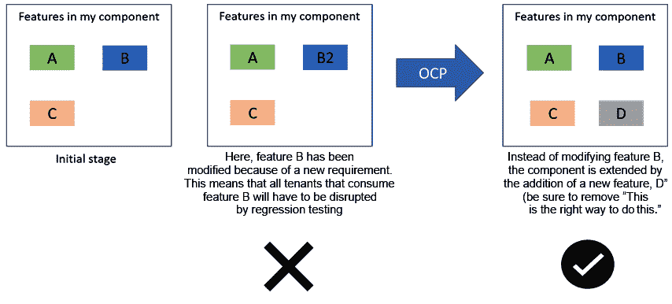

    图 1.2–OCP

3.  **Liskov substitution principle** (**LSP**): Parent or base class instances should be replaceable with instances of their derived classes or subtypes without altering the sanity of the program:

    

    图 1.3–LSP

4.  **Interface segregation principle** (**ISP**): Instead of one common large interface, you should plan multiple, scenario-specific interfaces for better decoupling and change management:

    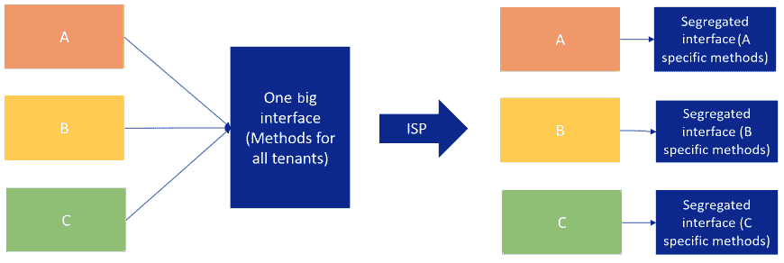

    图 1.4–互联网服务提供商

5.  **依赖倒置原则** ( **DIP** ):应该避免对具体实现有任何直接依赖。高级模块和低级模块不应该直接相互依赖，相反，两者应该尽可能依赖于抽象。抽象不应该依赖于细节，细节应该依赖于抽象。

图 1.5–DIP

### 不要重复自己(干)

有了 DRY，一个系统的设计应该使得一个特性或一个模式的实现不应该在多个地方重复。这将导致维护开销，因为需求的变化将导致需要在多个地方进行修改。如果您错误地在一个地方没有进行必要的更新，系统的行为将变得不一致。相反，该特性应该被打包成一个包，并且应该在所有地方重用。对于数据库，您应该考虑使用数据规范化来减少冗余:

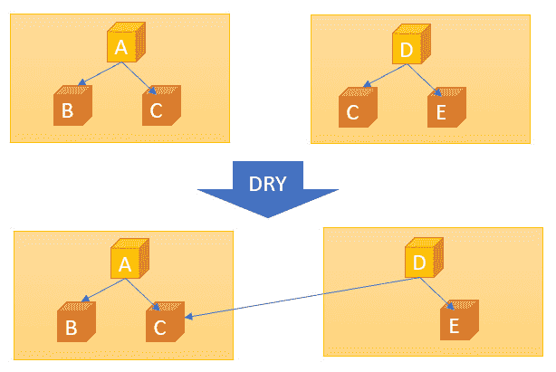

图 1.6–干燥

这个策略有助于减少冗余和促进重用。这个原则也有助于组织的文化，鼓励更多的合作。

### 保持简单，愚蠢(KISS)

有了 KISS，一个系统应该是设计得尽可能简单，避免复杂的设计、算法、新的未尝试的技术等等。您应该专注于利用正确的面向对象概念，并重用经验证的模式和原则。只有在必要时才包含新的或非简单的东西，并为实现增加价值。

当您保持简单时，您将能够更好地完成以下工作:

*   设计/开发时避免错误
*   保持列车运行(总有一个团队的工作是维护系统，尽管他们不是最初开发系统的团队)
*   阅读并理解您的系统和代码(您的系统和代码需要能够被新用户或未来使用它的人理解)
*   做得更好，不容易出错的变更管理

有了这些，我们就完成了普通设计原理的入门；我们已经学习了固体、干燥和 KISS。在下一节中，我们将在现实世界的例子中查看一些常见的设计模式，以帮助您理解原则和模式之间的区别，以及何时利用哪种模式，这是优秀设计和架构必不可少的技能。

## 设计图案

在遵循 OOP 范式中的设计原则时，您可能会看到相同的结构和模式一遍又一遍地重复。这些重复的结构和技术是常见问题的成熟解决方案，被称为设计模式。经验证的设计模式易于重用、实现、更改和测试。著名的书籍*设计模式:可重用面向对象软件的元素*，包括被称为**四人组** ( **GOF** )的设计模式，被认为是模式的圣经。

我们可以将 GOF 模式分类如下:

*   **创意**:有助于创建对象
*   **结构性**:有助于处理物体的构成
*   **行为**:有助于定义对象之间的交互和分配责任

让我们用一些现实生活中的例子来看看模式。

### 创新设计模式

让我们看看一些创造性设计模式以及下表中的相关例子:

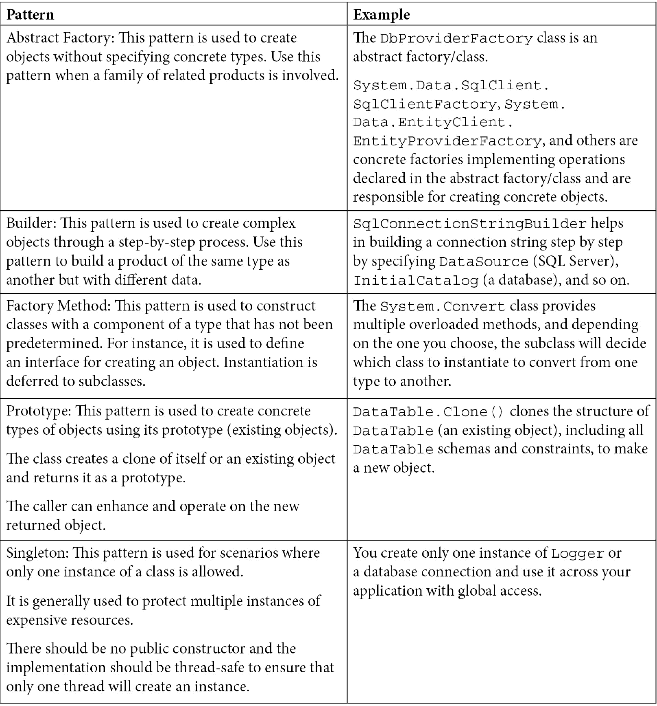

表 1.1

### 结构设计模式

下表包括一些结构设计模式的例子:

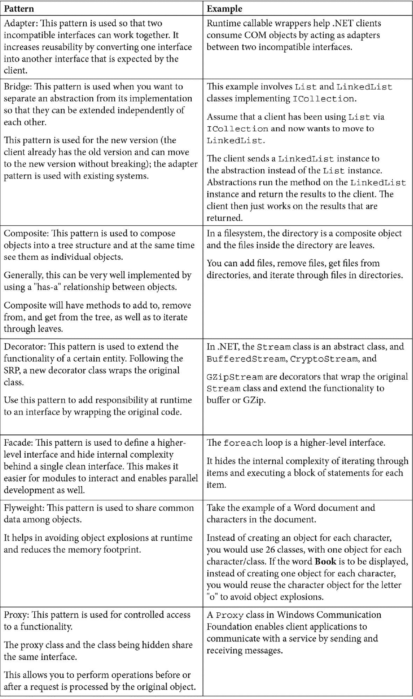

表 1.2

### 行为设计图案

下表包括一些行为设计模式的示例:

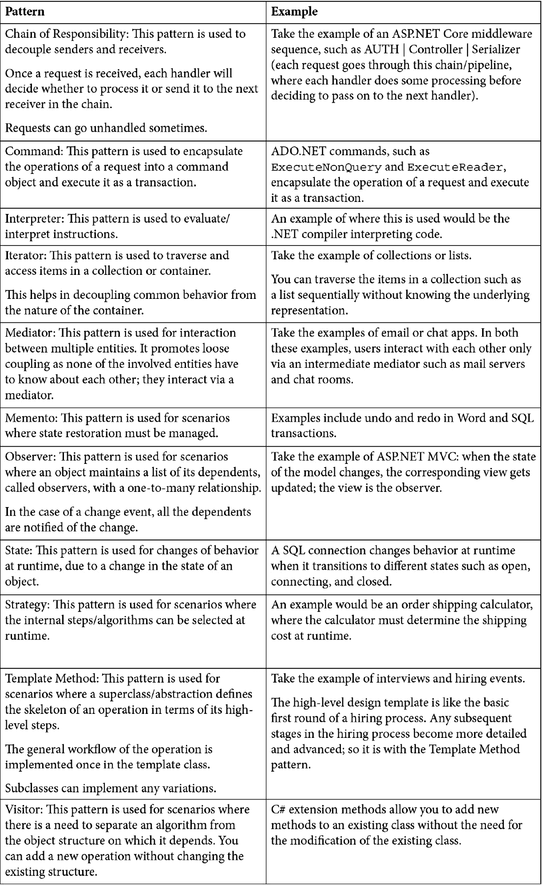

表 1.3

有时候，你可能会被摆在桌面上的所有这些模式淹没，但实际上，任何设计都是好的设计，直到它违反了基本原则。我们可以使用的一个经验法则是*回到基础*，在设计中，原则是基础。

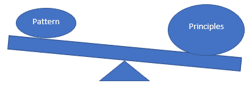

图 1.7–模式与原则

这样，我们就完成了普通设计原则和模式的入门。到目前为止，您应该已经很好地理解了不同的原则和模式，在哪里使用它们，以及构建一个伟大的解决方案需要什么。现在让我们花一些时间来看看常见的企业架构。

# 了解常见的企业架构

在设计企业应用时，通常会实践一些原则和架构。首先，任何架构的目标都是以尽可能低的成本(时间和资源成本)支持业务需求。企业希望软件能够支持它，而不是成为瓶颈。在当今世界，可用性、可靠性和性能是任何系统的三个关键绩效指标。

在这一节中，我们将首先研究单块架构的问题，然后我们将了解如何避免使用广泛采用且经过验证的架构来开发企业应用。

考虑一个经典的整体式电子商务网站应用，如下图所示，所有业务提供商和功能都在一个应用中，数据存储在一个经典的 SQL 数据库中:

图 1.8–单片应用

单片架构在 15-20 年前被广泛采用，但是随着时间的推移，当系统增长和业务需求扩展时，软件工程团队会遇到很多问题。让我们看看这种方法的一些常见问题。

## 单一应用的常见问题

让我们来看看缩放问题:

*   在单一应用中，水平扩展的唯一方法是向系统添加更多计算。这导致更高的运营成本和未优化的资源利用率。有时，由于资源方面的需求冲突，扩展变得不可能。
*   由于所有功能大多使用单个存储，因此存在锁导致高延迟的可能性，并且单个存储实例的扩展范围也存在物理限制。

以下是一些与可用性、可靠性和性能相关的问题:

*   系统的任何变化都需要重新部署所有组件，导致停机和低可用性。
*   任何非持久状态，如存储在网络应用中的会话，在每次部署后都会丢失。这将导致放弃用户触发的所有工作流。
*   模块中的任何错误，如内存泄漏或安全错误，都会使所有模块变得脆弱，并有可能影响整个系统。
*   由于模块内资源的高度耦合性和共享性，总是会出现资源的非优化使用，导致系统的高延迟。

最后，让我们看看对业务和工程团队的影响:

*   变更的影响很难量化，需要广泛的测试。因此，它降低了交付生产的速度。即使是很小的改变也需要重新部署整个系统。
*   在一个高度耦合的系统中，跨团队协作交付任何功能总是有物理限制的。
*   移动应用、聊天机器人和分析引擎等新场景将需要更多的努力，因为没有独立的可重用组件或服务。
*   连续部署几乎不可能。

让我们通过采用一些成熟的原则/架构来尝试解决这些常见问题。

## 关注点分离/单一责任架构

软件应根据其执行的工作类型划分为组件或模块。每个模块或组件都应该有一个单一的职责。组件之间的交互应该通过接口或消息传递系统进行。让我们看看 n 层和微服务架构，以及如何处理关注点分离。

### 多层体系结构

n 层架构将系统的应用划分为三个(或 *n* 层:

*   呈现(称为 UX 层、用户界面层或工作表面)
*   业务(称为业务规则层或服务层)
*   数据(称为数据存储和访问层)

图 1.9–N 层架构

这些层可以单独拥有/管理/部署。例如，多个表示层，如 web、移动和 bot 层，可以利用相同的业务和数据层。

### 微服务架构

微服务架构由小型、松散耦合、独立和自治的服务组成。让我们看看它们的好处:

*   服务可以独立部署和扩展。一个服务中的问题会对本地产生影响，只需部署受影响的服务即可解决。不需要共享技术或框架。
*   服务通过定义良好的应用编程接口或消息传递系统(如 Azure 服务总线)相互通信:

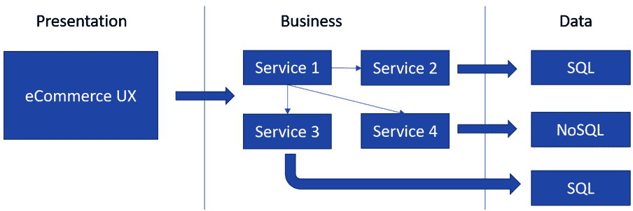

图 1.10–微服务架构

如上图所示，服务可以由独立的团队拥有，并且可以有自己的周期。服务负责管理自己的数据存储。要求更低延迟的场景可以通过引入缓存或高性能 NoSQL 存储来优化。

## 领域驱动架构

每个逻辑模块不应直接依赖于另一个模块。每个模块或组件应该服务于单个域。

围绕一个域建模服务可以防止服务爆炸。模块应该是松散耦合的，可能一起改变的模块可以组合在一起。

## 无状态服务架构

服务不应该有任何状态。状态和数据应该独立于服务进行管理，即在外部进行管理。通过向外部委托状态，服务将有资源以高可靠性服务更多的请求。

不应启用会话关联性，因为它会导致粘性会话问题，并会阻止您获得负载平衡、可伸缩性和流量分布的好处。

## 事件驱动架构

事件驱动架构的主要特点如下:

*   在事件驱动架构中，模块之间的通信(通常称为发布者-订阅者通信)主要是异步的，并且通过事件来实现。生产者和消费者是完全分离的。事件的结构是他们之间交换的唯一契约。
*   同一事件可以有多个消费者负责他们的特定操作；理想情况下，他们甚至不会意识到对方。生产者可以持续推动事件，而不用担心消费者的可用性。
*   发布者通过消息传递基础设施(如队列或服务总线)发布事件。发布事件后，消息传递基础结构负责将事件发送给符合条件的订户:

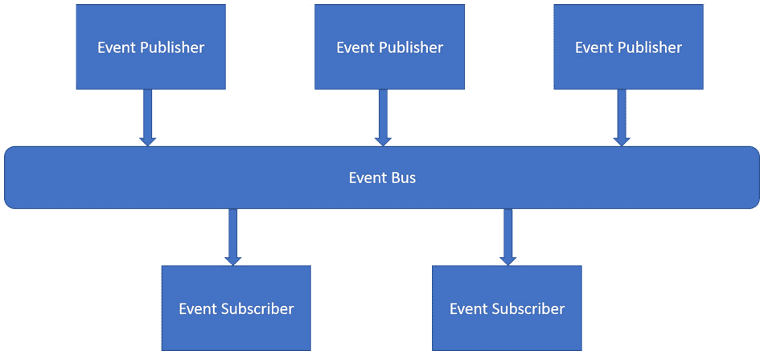

图 1.11–事件驱动架构

这种架构最适合本质上异步的场景。例如，长时间运行的操作可以排队等待处理。客户端可能会轮询状态，甚至充当事件的订阅者。

## 数据存储和访问架构

数据存储和访问架构在整个系统的可扩展性、可用性和可靠性方面发挥着至关重要的作用:

*   服务应该根据操作的需要来决定数据存储的类型。
*   应该根据给定操作的需要对数据进行分区和建模。无论如何都应该避免热分区。如果您需要来自同一数据的多种类型的结构，应该选择复制。
*   应该选择正确的一致性模型来降低延迟。例如，能够承受一段时间的陈旧数据的操作应该使用弱/最终一致性。有可能改变状态并需要实时数据的操作应该选择更强的一致性。
*   缓存适合服务的数据有助于服务的性能。应该确定可以缓存数据的区域。根据给定的需要，可以选择内存内或内存外缓存。

## 弹性架构

组件之间的通信越多，发生故障的可能性也越大。一个系统应该被设计成能从任何类型的故障中恢复。我们将介绍一些构建容错系统的策略，该系统可以在出现故障时自我修复。

如果您熟悉 Azure，您会知道应用、服务和数据应该在至少两个 Azure 区域中进行全局复制，以应对计划内停机和计划外的暂时或永久故障。在这些场景中，选择 Azure 应用服务来托管网络应用、使用 REST APIs 以及选择一个全球分布式数据库服务(如 Azure Cosmos DB)是明智的。选择 Azure 成对区域将有助于**业务连续性和灾难恢复** ( **BCDR** )，因为如果停机影响多个区域，每对区域中至少有一个区域将优先恢复。现在，让我们看看如何处理不同类型的故障。

瞬时故障可能发生在任何类型的通信或服务中。您需要有一个从瞬时故障中恢复的策略，例如:

*   识别瞬时故障的操作和类型，然后确定适当的重试次数和时间间隔。
*   避免反模式，如具有有限重试次数的无限重试机制或断路器。

如果故障不是暂时的，您应该通过选择以下选项来优雅地响应故障:

*   失败
*   补偿任何失败的操作
*   抑制/阻止不良客户端/参与者
*   在失败的情况下使用领导人选举来选择领导人

遥测在这里起着很大的作用；您应该有自定义的指标来记录任何组件的运行状况。当自定义事件发生或特定指标达到特定阈值时，可以发出警报。

## 进化和运营架构

演进和运营在持续集成、部署、阶段性功能推出以及减少停机时间和成本方面发挥着至关重要的作用:

*   服务应该独立部署。
*   设计一个可扩展的生态系统，使企业能够随着时间的推移而发展和变化。
*   松散耦合的系统最适合企业，因为任何变更或特性都可以以良好的速度和质量交付。变更可以被管理并限定在单个组件的范围内。
*   规模的弹性导致更好的资源管理，进而降低运营成本。
*   持续的构建和发布管道以及蓝绿色的部署策略有助于在系统早期识别问题。这也使得能够在减少生产流量的情况下测试某些假设。

这样，我们就完成了对常见企业架构的覆盖。接下来，我们将通过我们所了解的设计原则和常见架构的镜头来看看企业应用需求和不同的架构。

# 识别企业应用需求(业务和技术)

在接下来的几章中，我们将构建一个工作的电子商务应用。它将是一个三层应用，由用户界面层、服务层和数据库组成。让我们看看这个电子商务应用的需求。

解决方案需求是要在产品中实现并可用的解决问题或实现目标的能力。

业务需求只是最终客户的需求。在 IT 界，“业务”一般指“客户”这些需求是从不同的利益相关者那里收集的，并作为单一的真实来源记录下来，供大家参考。这最终成为待完成工作的积压和范围。

技术要求是系统应该实现的技术方面，例如可靠性、可用性、性能和 BCDR。这些都是又称**服务质量** ( **QOS** )的要求。

让我们将电子商务应用网站的典型业务需求细分为以下几类:**史诗级**、**特色**和**用户故事**。

## 应用的业务需求

以下来自 Azure DevOps 的截图显示了我们业务需求的积压汇总。您可以看到我们的应用中预期的不同特性以及用户故事:

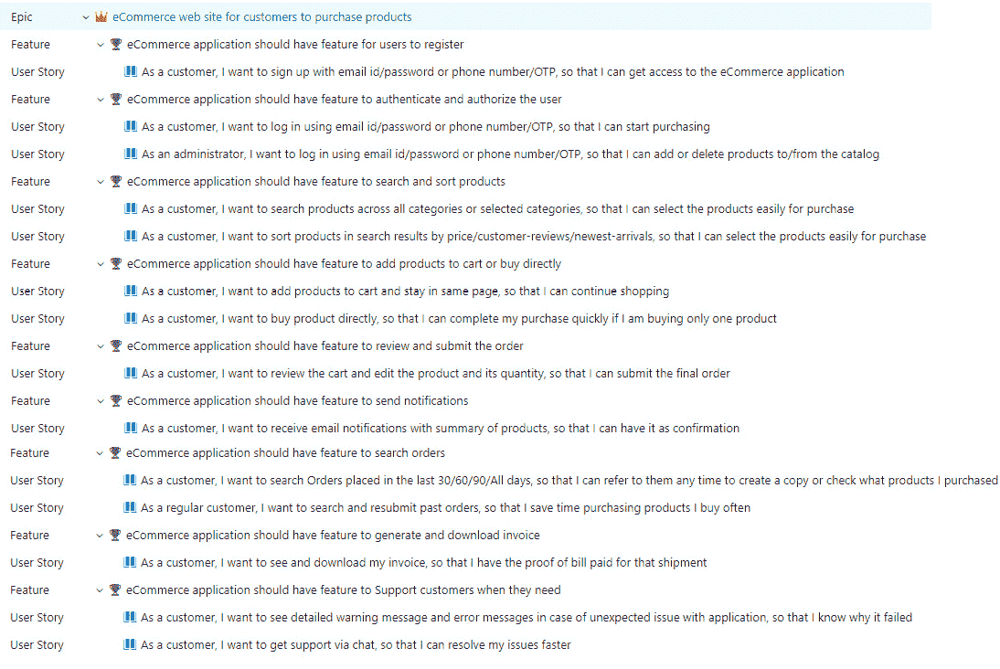

图 1.12–Azure DevOps 的需求积压

## 应用的技术要求

看了业务需求，现在来看技术需求:

*   电商应用应该是**高可用**，即任何 24 小时周期 99.99%的时间可用。
*   电商应用应该是**高可靠**，即任何 24 小时周期 99.99%的时间是可靠的。
*   电子商务应用应该是**高性能的** : 95%的操作应该用时小于等于 3 秒。
*   电子商务应用应该是**高度可扩展的**:它应该根据变化的负载自动上/下扩展。
*   电子商务应用应该有**监控和警报**:如果出现任何系统故障，应该向支持工程师发送警报。

以下是为电子商务应用确定的**技术方面**及其要求:

#### 前端

*   使用 ASP.NET 5.0 的网络应用(电子商务)

#### 核心组件

*   C# 9.0 和中的日志/缓存/配置.NET 5.0

#### 中间层

*   实现身份验证的 Azure 应用编程接口网关
*   通过 ASP.NET 5.0 网络应用编程接口添加/删除用户的用户管理服务
*   通过 ASP.NET 5.0 网络应用编程接口提供产品和定价服务，从数据存储中获取产品
*   通过 ASP.NET 5.0 网络应用编程接口获取域数据(如国家数据)的域数据服务。
*   通过 ASP.NET 5.0 网络应用编程接口完成支付的支付服务
*   通过 ASP.NET 5.0 网络应用编程接口提交和搜索订单的订单处理服务
*   通过 ASP.NET 5.0 网络应用编程接口生成发票的发票处理服务
*   通知服务通过 ASP.NET 5.0 网络应用编程接口发送电子邮件等通知

#### 数据层

*   数据访问服务，通过 ASP.NET 5.0 网络应用编程接口与 Azure 宇宙数据库进行对话，以读取/写入数据
*   实体框架访问数据的核心

#### 天蓝色堆栈

*   Azure 宇宙数据库作为后端数据存储
*   异步消息处理的 Azure 服务总线
*   承载网络应用和网络应用接口的 Azure 应用服务
*   Azure 流量管理器可实现高可用性和高响应性
*   用于诊断和遥测的 Azure 应用洞察
*   天蓝色配对区域可获得更好的弹性
*   Azure 资源组创建 **Azure 资源管理器** (ARM)模板并部署到 Azure 订阅
*   用于**持续集成和持续部署的 azure Pipelines**(**CI/CD**)

我们现在已经完成了企业应用需求。接下来，我们将研究企业应用的架构。

# 架构企业应用

下面的架构图描述了我们正在构建的东西。当我们设计和开发应用时，我们需要记住我们在本章中看到的所有设计原则、模式和需求。下图显示了我们的电子商务企业应用的建议架构图:

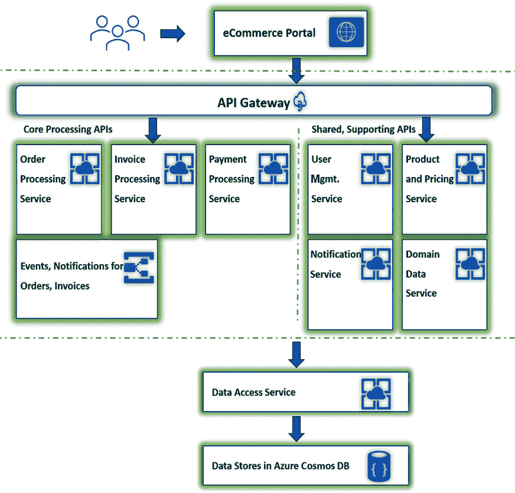

图 1.13–我们的电子商务应用的三层架构图

**关注点/SRP 的分离**在每一层都得到了处理。包含用户界面的表示层与包含业务逻辑的服务层分开，后者又与包含数据存储的数据访问层分开。

高级组件不知道使用它们的低级组件。数据访问层不知道使用它的服务，服务也不知道使用它们的 UX 层。

每个服务都根据它应该执行的业务逻辑和功能进行分离。

**封装**已经在架构级别得到了的处理，在开发过程中也应该得到处理。架构中的每个组件都将通过定义良好的接口和契约与其他组件进行交互。如果符合契约，我们应该能够替换图中的任何组件，而不用担心它的内部实现。

这里松散耦合的架构也有助于客户更快地开发和部署到市场。多个团队可以独立地并行处理每个组件。他们在开始时共享集成测试的合同和时间表，一旦内部实现和单元测试完成，他们就可以开始集成测试。

请参考下图:

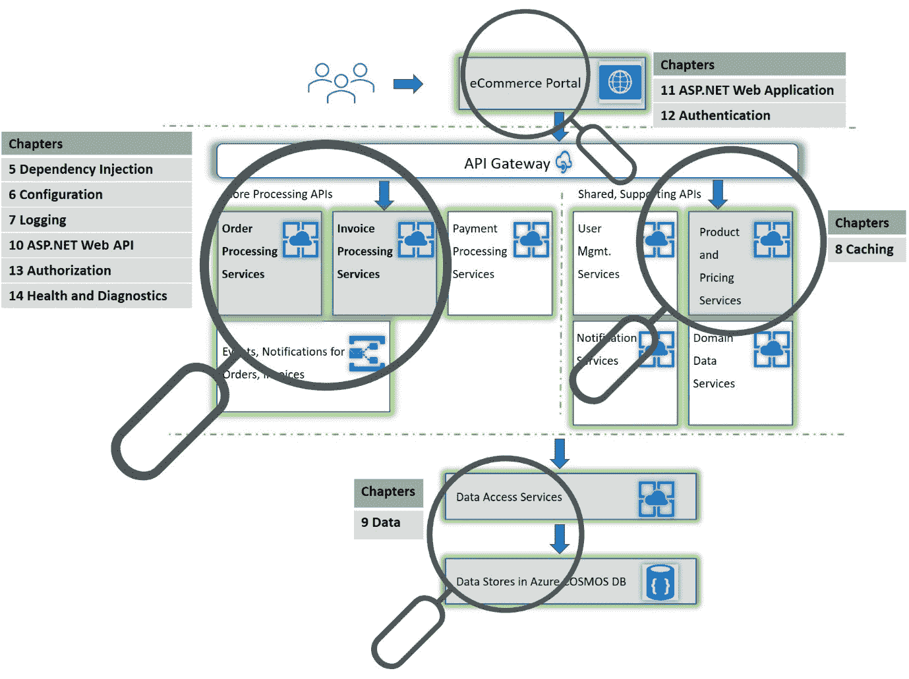

图 1.14–我们的电子商务应用组件，按章节细分

从图中，我们确定了我们将构建的电子商务应用的不同部分将涵盖的章节，解释如下:

*   创建 ASP.NET 网络应用(我们的电子商务门户)将作为第 11 章*创建 ASP.NET Core 5 网络应用*的一部分进行介绍。
*   认证将作为第 12 章*理解认证*的一部分。
*   订单处理服务和发票处理服务是生成订单和开具发票的两个核心服务。他们将是电子商务应用的核心，因为他们是负责收入的人。创建 ASP.NET Core web API 将作为第 10 章*的一部分，创建 ASP.NET Core 5 Web API* 将作为第 5 章**依赖注入的一部分.NET* 、 [*第六章*、](06.html#_idTextAnchor125)、*配置中.NET Core、*[*第七章*](07.html#_idTextAnchor141)*登录.NET 5、*分别为。DRY 原则将通过重用核心组件和交叉关注来处理，而不是重复实现。*
**   在 [*第 8 章*](08.html#_idTextAnchor156)*了解缓存*中，缓存将作为产品定价服务的一部分。缓存将有助于提高我们系统的性能和可伸缩性，经常访问的数据的临时副本在内存中可用。*   数据存储、访问和提供者将作为数据访问层的一部分包含在 [*第 9 章*](09.html#_idTextAnchor177)*中.NET 5* 。我们采用的体系结构将数据和对数据的访问与应用的其他部分分开，这种体系结构为我们提供了更好的维护。Azure Cosmos DB 是我们的选择，可在全球任意数量的 Azure 地区弹性、独立地扩展吞吐量和存储。默认情况下，它也是安全的，企业级的。*

 *我们关于构建企业应用的讨论到此结束。接下来，我们将看看我们企业应用的解决方案结构。

# 企业应用的解决方案结构

我们将为所有项目提供一个单一的解决方案，以保持简单，如下图所示。当解决方案中的项目数量激增并导致维护问题时，也可以考虑为用户界面、共享组件、网络应用编程接口等提供单独解决方案的另一种方法。下面的截图显示了我们应用的解决方案结构:

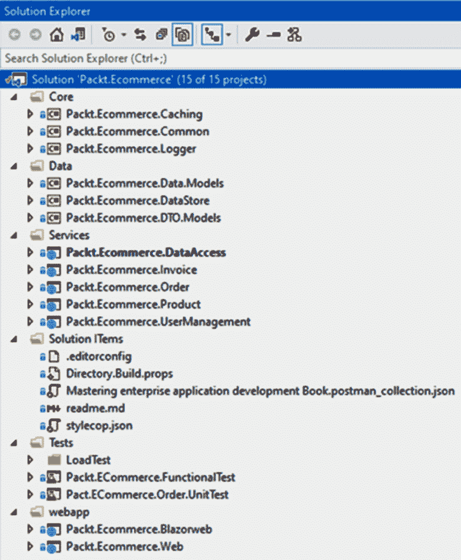

图 1.15–电子商务应用的解决方案结构

# 总结

在这一章中，我们学习了常见的设计原则，如固体、干燥和 KISS。我们还用现实世界的例子研究了各种设计模式。然后，我们查看了不同的企业架构，确定了我们将要构建的电子商务应用的需求，并应用我们所学的知识来构建我们的电子商务应用。现在，当您设计任何应用时，您都可以应用在这里学到的知识。在下一章中，我们将了解.NET 5 核心和标准。

# 问题

1.  What is the LSP?

    a.基类实例应该可以用其派生类型的实例替换。

    b.派生类实例应该可以用其基类型的实例替换。

    c.设计可以处理任何数据类型的泛型。

2.  What is the SRP?

    a.不要有一个通用的大型接口，而是计划多个场景特定的接口，以实现更好的解耦和变更管理。

    b.您应该避免直接依赖于具体的实现；相反，你应该尽可能依赖抽象。

    c.一个实体应该只有单一的责任。你应该避免给一个实体多重责任。

    d.实体应该以这样的方式设计，它们应该对扩展开放，但对修改关闭。

3.  What is the OCP?

    a.实体应该对修改开放，但对扩展关闭。

    b.实体应该对扩展开放，但对修改关闭。

    c.实体应该对组合开放，但对扩展关闭。

    d.实体应该对抽象开放，但对继承关闭。

4.  Which pattern is used to make two incompatible interfaces work together?

    a.代理

    b.桥

    c.迭代程序

    d.介面卡

5.  Which principle ensures that services can be deployed and scaled independently and that an issue in one service will have a local impact and can be fixed by just redeploying the impacted service?

    a.领域驱动设计原则

    b.单一责任原则

    c.无状态服务原则

    d.弹性原则*