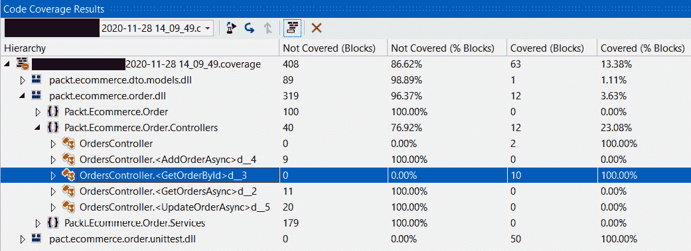
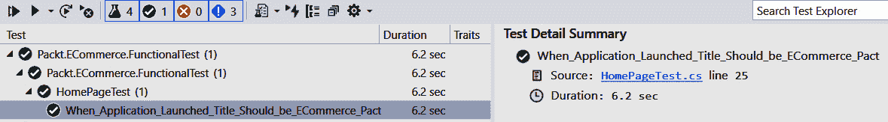

# 第十五章：*第十五章*：测试

任何应用程序的成功取决于用户使用它的难易程度。任何软件产品的寿命直接取决于产品的质量。

测试是**软件开发生命周期**（**SDLC**）的一个重要方面，并确保产品满足客户的要求和质量要求。测试同样重要，因为随着我们进入 SDLC 的后期阶段，修复错误的成本会增加。

在本章中，我们将学习不同类型的测试以及 Visual Studio 为测试提供的工具，以及查看我们可以使用的第三方工具，以确保我们在.NET 6 中构建的产品质量。

在本章中，我们将学习以下内容：

+   测试类型

+   单元测试

+   功能测试

+   理解负载测试的重要性

到本章结束时，您将了解确保产品质量所需的一切知识。

# 技术要求

您将需要 Visual Studio 2022 社区版。（某些部分需要企业版。）

除了 Visual Studio，您还需要 JMeter，可以从这里下载：[`jmeter.apache.org/download_jmeter.cgi`](https://jmeter.apache.org/download_jmeter.cgi)。您还需要对 Microsoft .NET 有基本的了解。

# 介绍测试

软件测试是一种检查应用程序是否按预期执行的方法。这些期望可能与功能、响应性或软件在运行时消耗的资源有关。

根据执行方式，软件测试可以大致分为以下两类：

+   **手动测试**：在手动测试中，测试人员通过使用测试的应用程序手动执行测试用例，并验证预期的结果。手动测试比替代方案需要更多的努力。

+   **自动化测试**：自动化测试由专门的自动化测试软件执行。此自动化软件在测试的应用程序中运行于特定环境中，并验证预期的输出。自动化测试可以节省大量时间和人力。在某些情况下，实现 100%的自动化可能需要付出很多努力，并且以相对较低的**投资回报率**（**ROI**）来维护自动化。

根据对测试应用程序内部信息（如代码流和依赖模块集成）的了解，软件测试也可以广泛地按以下方式进行分类：

+   **黑盒测试**：在黑盒测试中，负责测试的个人没有关于系统内部的信息。这里的重点是系统的行为。

+   **白盒测试**：在白盒测试中，测试人员了解系统的内部结构、设计和实现。白盒测试的重点是测试实现中存在的替代路径。

在软件测试中，我们验证应用程序的不同方面。软件测试还有以下变体，基于它验证的应用程序方面以及它使用的工具或框架：

+   **单元测试**：单元测试关注应用程序的最小单元。在这里，我们验证单个类或函数。这通常在开发阶段完成。

+   **功能测试**：这通常被称为**集成测试**。其主要目的是确保应用程序按要求执行。

+   **回归测试**：回归测试确保任何最近的变化都没有对应用程序性能产生不利影响，并且现有功能没有受到任何变化的影响。在回归测试中，根据应用程序中引入的变化，执行所有或部分功能测试用例。

+   **烟雾测试**：在每次部署后进行烟雾测试，以确保应用程序稳定且准备就绪。这也被称为**构建验证测试**（**BVT**）。

+   **负载测试**：负载测试用于确定系统的整体有效性。在负载测试期间，我们模拟集成系统上的预期负载。

+   **压力测试**：在压力测试中，我们将系统推到预期容量或负载之外。这有助于我们识别系统中的瓶颈和故障点。性能测试是用于压力测试和负载测试的通用术语。

+   **安全测试**：安全测试是为了确保应用程序的完美执行。在安全测试中，我们专注于评估安全方面的各种元素，如完整性、机密性和真实性等。

+   **可访问性测试**：可访问性测试旨在确定不同能力的人是否能够使用应用程序。

现在我们已经看到了不同类型的测试，在接下来的章节中，我们将详细介绍单元测试、功能测试和负载测试，因为它们对于确保应用程序的稳定性至关重要。

注意

要深入了解安全方面，请尝试使用静态代码分析工具进行安全测试：[`docs.microsoft.com/en-us/azure/security/develop/security-code-analysis-overview`](https://docs.microsoft.com/en-us/azure/security/develop/security-code-analysis-overview)。更多关于可访问性的信息可以在这里找到：[`accessibilityinsights.io/`](https://accessibilityinsights.io/)。

性能测试、可访问性测试和安全测试是我们执行以评估应用程序非功能性方面的测试，例如性能、可用性、可靠性、安全性和可访问性。

现在，让我们看看如何为我们电子商务应用程序执行单元测试。

# 单元测试

单元测试是测试应用程序最小隔离单元的一种方式。它是软件开发中的重要步骤，有助于早期隔离问题。

单元测试对我们构建的软件质量有直接影响。建议在编写任何方法后立即编写单元测试。如果我们遵循**测试驱动开发**（**TDD**）的方法论，我们首先编写测试用例，然后继续实现功能。

在下一节中，我们将学习如何在 Visual Studio 中创建单元测试并运行它们。

## Visual Studio 中的单元测试

我们选择使用 Visual Studio，因为它具有创建和管理测试用例的强大工具。

使用 Visual Studio，我们可以创建、调试和运行单元测试用例。我们还可以检查已执行的测试的代码覆盖率。此外，它还具有**实时单元测试**功能，在修改代码的同时运行单元测试，并将结果实时显示。

我们将在接下来的章节中探讨所有这些功能。

### 创建和运行单元测试

让我们继续创建一个单元测试项目，以对`Packt.ECommerce.Order`项目进行单元测试。

执行以下步骤以创建单元测试用例：

1.  在`Tests`文件夹中添加一个新的项目，并将其命名为`Packt.ECommerce.Order.UnitTest`：

![Figure 15.1 – Visual Studio xUnit 测试项目

![img/Figure_15.1_B18507.jpg]

图 15.1 – Visual Studio xUnit 测试项目

1.  将`Packt.ECommerce.Order`项目添加到新创建的测试项目中。

1.  向测试项目添加一个新类，并将其命名为`OrdersControllerTest`。我们将在这个类中添加所有与`OrdersController`相关的测试用例。

1.  现在，让我们添加一个简单的测试来测试`OrdersController`控制器的构造函数。我们将进行的测试是断言成功创建`OrderController`控制器。现在让我们添加测试，如下面的代码所示：

    ```cs
    [Fact]
    public async Task Create_Object_OfType_OrderController ()
    {
    OrdersController testObject = new 
            OrdersController(null);
          Assert.NotNull(testObject);
    }
    ```

`Create_Object_OfType_OrderController`测试方法被赋予`Fact`属性；这是`xUnit`框架发现测试方法所必需的。在这里，我们通过检查创建的对象的`null`条件来进行断言。

1.  Visual Studio 提供**测试资源管理器**来管理和运行测试。让我们通过转到**测试** | **测试资源管理器**来打开它。

1.  构建解决方案以在**测试资源管理器**中查看测试。

1.  在通过右键单击并从上下文菜单中选择**运行**创建的`OrderController_Constructor`测试中：

![Figure 15.2 – 从测试资源管理器窗口的测试运行上下文菜单

![img/Figure_15.2_B18507.jpg]

图 15.2 – 从测试资源管理器窗口的测试运行上下文菜单

1.  一旦测试执行完毕，我们可以在右侧窗格中看到测试结果。从结果中，我们可以看到测试已成功执行，如下所示：

![Figure 15.3 – 从测试资源管理器获取的测试结果

![img/Figure_15.3_B18507.jpg]

图 15.3 – 从测试资源管理器获取的测试结果

我们已经在 Visual Studio 中创建并执行了一个简单的测试。在下一节中，我们将学习如何模拟`OrdersController`的依赖项以验证功能。

### 使用 Moq 模拟依赖项

通常，被测试的方法会调用其他外部方法或服务，我们称之为依赖项。为了确保被测试方法的函数性，我们通过为依赖项创建模拟对象来隔离依赖项的行为。

在一个应用程序中，类可能依赖于其他类；例如，我们的`OrdersController`类依赖于`OrderService`。在测试`OrdersController`时，我们应该隔离`OrderService`的行为。

为了理解模拟，让我们为`OrdersController`的`GetOrdersAsync`操作方法创建单元测试。

让我们看看我们正在为其编写单元测试用例的`GetOrderById`方法：

```cs
//This is the GetOrderById action method in OrdersController.cs
```

```cs
[HttpGet]
```

```cs
[Route("{id}")]
```

```cs
public async Task<IActionResult> GetOrderById(string id)
```

```cs
{
```

```cs
     var order = await 
```

```cs
       this.orderService.GetOrderByIdAsync(id)
```

```cs
       .ConfigureAwait(false);
```

```cs
     if (order != null)
```

```cs
     {
```

```cs
          return this.Ok(order);
```

```cs
     }
```

```cs
     else
```

```cs
     {
```

```cs
          return this.NotFound();
```

```cs
     }
```

```cs
}
```

在这个方法中，调用`orderService`的`GetOrderByIdAsync`以根据传入的`id`实例获取订单。控制器操作将返回从`OrderService`检索到的订单`id`；否则，返回`NotFound`操作。

正如我们所看到的，代码流有两个路径：

+   一条路径是当订单存在时。

+   另一条路径是当订单不存在时。

通过单元测试，我们应该能够覆盖这两个路径。所以，现在出现的问题是，我们如何模拟这两个情况？

我们想要在这里模拟`OrderService`的响应。为了模拟`OrderService`的响应，我们可以利用`Moq`库。为了利用 Moq，我们需要将`Moq`包的 NuGet 引用添加到`Packt.ECommerce.Order.UnitTest`测试项目中。

让我们在`OrdersControllerTest`类中添加测试方法，如下所示，以测试`OrdersController`的`GetOrderById`方法，以验证当`OrderService`返回订单对象的情况：

```cs
[TestMethod]
```

```cs
public async Task When_GetOrdersAsync_with_ExistingOrder_receive_OkObjectResult()
```

```cs
{
```

```cs
     var stub = new Mock<IOrderService>();
```

```cs
    stub.Setup(x => x.GetOrderByIdAsync(
```

```cs
It.IsAny<string>())).Returns(Task.FromResult(new 
```

```cs
      OrderDetailsViewModel { Id = "1" }));
```

```cs
    OrdersController testObject = new 
```

```cs
      OrdersController(stub.Object);
```

```cs
    var order = await 
```

```cs
      testObject.GetOrderById("1").ConfigureAwait(false);
```

```cs
    Assert.IsType<OkObjectResult>(order, 
```

```cs
      typeof(OkObjectResult));
```

```cs
}
```

从代码中，我们可以观察到以下内容：

+   由于`IOrderService`通过控制器注入注入到`OrderController`中，我们可以向`OrderController`注入一个模拟的`OrderService`，这将帮助我们通过改变模拟对象的行为来测试`OrderController`的所有代码路径。

+   我们利用`Mock`类为`IOrderService`创建一个存根（也称为模拟），并覆盖前面的代码中的`GetOrderByIdAsync`行为。

+   我们为`IOrderService`接口创建一个`Mock`对象实例，并通过在`Mock`对象上调用`Setup`方法来设置`GetOrderByIdAsync`的行为。

+   `GetOrderByIdAsync`方法被模拟，使得对于它接收到的任何参数值，`mock`对象将返回具有`Id`为`1`的`OrderDetailsViewModel`对象。

+   由于我们通过构造函数注入将模拟对象注入到`OrderService`中，因此每当调用`IOrderService`中的任何方法时，调用将转到`IOrderService`的模拟实现。

+   最后，我们通过验证从`OrderController`返回到`OkObjectResult`的结果类型来断言测试结果。

现在，让我们添加一个测试用例来验证当订单不存在时接收`NotFound`结果的行为，如下所示：

```cs
[TestMethod]
```

```cs
public async Task When_GetOrdersAsync_with_No_ExistingOrder_receive_NotFoundResult()
```

```cs
{
```

```cs
     var stub = new Mock<IOrderService>();
```

```cs
stub.Setup(x => 
```

```cs
     x.GetOrderByIdAsync(It.IsAny<string>()))
```

```cs
    .Returns(Task.FromResult<OrderDetailsViewModel>(null));
```

```cs
     OrdersController testObject = new 
```

```cs
       OrdersController(stub.Object);
```

```cs
     var order = await testObject
```

```cs
       .GetOrderById("1").ConfigureAwait(false);
```

```cs
Assert.IsType<NotFoundResult>(order, 
```

```cs
       typeof(NotFoundResult));
```

```cs
}
```

在这个测试用例中，我们通过从`OrderService`存根返回一个`null`值来模拟订单不存在的行为。这将使`OrdersController`的`GetOrderById`操作方法返回`NotFoundResult`，并在测试用例中进行验证。

注意

`OrderService`类依赖于`IHttpClientFactory`、`IOptions`、`Mapper`和`DistributedCacheService`。因此，为了为这个添加单元测试，我们应该模拟它们所有。您可以在 GitHub 代码示例的`OrderServiceTest`测试类中的`When_GetOrderByIdAsync_with_ExistingOrder_receive_Order`测试方法中查看更多详细信息。

在本节中，我们看到了如何利用`xUnit`框架创建单元测试。还有几个其他测试框架可用于在.NET 中创建单元测试。这里值得提到的两个框架是 MSTest 和 NUnit。尽管这些框架在测试执行方式上存在一些差异，但所有这些框架都非常出色，并提供诸如模拟和并行执行等功能。由于其简单性和可扩展性，xUnit 相对于竞争框架有一定的优势。我们还可以使用 xUnit 中的`Theory`编写数据驱动测试，如下面的代码片段所示：

```cs
[Theory]
```

```cs
[InlineData(999, 19.98)]
```

```cs
[InlineData(2000, 100)]
```

```cs
public void When_ComputeTotalDiscount_with_OrderTotalAmount(double number, double expectedResult)
```

```cs
{
```

```cs
<<Code removed for brevity>>
```

```cs
   OrdersService testObject = new 
```

```cs
     OrdersService(httpClientFactory, mockOptions, mapper, 
```

```cs
     mockCacheService.Object);
```

```cs
   var result = testObject.ComputeTotalDiscount(number);
```

```cs
   Assert.Equal(result, expectedResult);
```

```cs
}
```

在前面的代码片段中，测试方法通过`InlineData`属性传递的测试数据执行。

在单元测试中，我们的目标是通过对依赖类的行为进行模拟来测试一个特定的类。如果我们与其他依赖类一起测试这些类，我们称之为**集成测试**。我们在各种级别编写集成测试：在特定模块或程序集的级别，在微服务级别，或在整个应用级别。

现在我们已经为我们的电子商务解决方案添加了单元测试用例，在下一节中，我们将检查这些测试的代码覆盖率。

## 代码覆盖率

代码覆盖率是衡量我们的测试用例覆盖了多少代码的一个指标。Visual Studio 提供了一个工具来查找单元测试的代码覆盖率。我们可以运行**测试** | **分析代码覆盖率**来对所有测试进行操作，如下所示：

![图 15.4 – 文本探索器中的“分析代码覆盖率”上下文选项]

](img/Figure_15.4_B18507.jpg)

图 15.4 – 文本探索器中的“分析代码覆盖率”上下文选项

这也可以从**测试资源管理器**的**上下文**菜单中完成。

注意

**分析代码覆盖率**功能仅在 Visual Studio 的企业版中可用。如果您使用的是社区版，您可以使用 Visual Studio 免费扩展程序，[`marketplace.visualstudio.com/items?itemName=FortuneNgwenya.FineCodeCoverage`](https://marketplace.visualstudio.com/items?itemName=FortuneNgwenya.FineCodeCoverage)，来查看代码覆盖率结果。

这将运行所有测试用例并识别任何未测试的代码块。我们可以在以下**代码覆盖率结果**窗口中查看代码覆盖率结果：

![图 15.5 – Visual Studio 代码覆盖率结果窗口]



图 15.5 – Visual Studio Code 覆盖率结果窗口

`GetOrderByIdAsync`，该方法的代码覆盖率是`GetOrdersAsync`为**0.00**%，因为我们没有测试用例来测试它。代码覆盖率为我们提供了关于我们的单元测试有效性的良好指示。

建议为解决方案中的所有类创建单元测试用例。通过添加单元测试来验证所有类和功能，将会有更高比例的代码被单元测试用例覆盖。随着代码覆盖率的提高，我们将在开发过程中对解决方案进行更改时能够更早地捕获更多错误。我们应该在提交更改之前确保所有测试用例都通过。在下一章，*第十六章*，*在 Azure 中部署应用程序*，我们将学习如何将运行测试用例与 Azure DevOps 管道集成。

到目前为止，我们已经通过模拟依赖关系和编写单元测试用例来测试单个模块或类。在集成和部署整个解决方案后测试功能也很重要。在下一节中，我们将学习如何为我们电子商务应用执行功能测试。

小贴士

Visual Studio 的代码指标和代码分析工具对于确保我们编写的代码的可维护性和可读性非常有用。您可以在以下位置找到有关代码指标的信息：[`docs.microsoft.com/en-us/visualstudio/code-quality/code-metrics-values?view=vs-2022`](https://docs.microsoft.com/en-us/visualstudio/code-quality/code-metrics-values?view=vs-2022)。

对于代码分析，请访问此处：[`docs.microsoft.com/en-us/dotnet/fundamentals/code-analysis/overview`](https://docs.microsoft.com/en-us/dotnet/fundamentals/code-analysis/overview)。

# 功能测试

在功能测试中，我们验证我们构建的应用是否符合功能需求。功能测试通过提供一些输入并断言应用的响应或输出来进行。在进行功能测试时，我们将应用视为一个整体；我们不是验证单个内部组件。

功能测试可以分为三个任务：

1.  识别待测试系统的功能

1.  确定具有预期输出的输入

1.  执行这些测试以评估系统是否按预期响应

功能测试的执行可以通过在应用上执行测试步骤手动进行，或者我们可以使用工具来自动化它们。通过自动化功能测试，可以显著缩短应用的上市时间。

在下一节中，我们将学习如何自动化功能测试用例。

## 自动化功能测试用例

手动执行功能测试用例在应用程序测试中仍然相关。然而，考虑到更短的部署周期和客户对快速获取新功能的期望，手动测试可能会非常耗时且效率低下，尤其是在早期识别缺陷方面。使用自动化，我们可以获得新的效率，加速测试过程，并提高软件质量。有多种工具和框架可用于自动化功能测试用例。

在本节中，我们将了解最受欢迎的自动化框架 **Selenium**。让我们开始：

1.  首先，让我们创建一个名为 `MSTest` 的项目，并将其命名为 `Packt.ECommerce.FunctionalTest`。

1.  向此项目添加 `Selenium.WebDriver`、`Selenium.WebDriver.ChromeDriver` 和 `WebDriverManager` NuGet 包。这些包是我们运行 Selenium 测试所必需的。

1.  让我们从一项简单的测试开始，以验证我们电子商务应用程序的标题。为此，创建一个名为 `HomePageTest` 的测试类和一个名为 `When_Application_Launched_Title_Should_be_ECommerce_Packt` 的测试方法，就像我们在 *单元测试* 部分所做的那样，如下面的代码所示：

    ```cs
    [TestClass]
    public class HomePageTest
    {
       [TestMethod]
        public void When_Application_Launched_Title
          _Should_be_ECommerce_Packt()
    {
    }
    }
    ```

1.  要执行我们的功能测试，我们应该启动一个浏览器并使用该浏览器导航到电子商务应用程序。`MSTest` 框架提供了一个特殊函数来执行测试所需的初始化和清理操作。我们将创建一个 Chrome 网络驱动程序来执行功能测试。

让我们继续添加初始化和清理方法，如下面的代码所示：

```cs
[TestClass]
public class HomePageTest
{
     ChromeDriver _webDriver = null;
     [TestInitialize]
public void InitializeWebDriver()
     {
            var d = new DriverManager();
            d.SetUpDriver(new ChromeConfig());
            _webDriver = new ChromeDriver();
     }
     [TestMethod]
     public void When_Application_Launched_Title
       _Should_be_ECommerce_Packt()
     {
     }
     [TestCleanup]
     public void WebDriverCleanup()
     {
            _webDriver.Quit();
     }
}
```

在前面的代码中，`InitializeDriver` 方法被赋予 `TestInitialize` 属性，以通知框架这是一个测试初始化方法。在测试初始化中，我们创建 `ChromeDriver` 并初始化类变量。测试用例完成后，我们应该关闭浏览器实例；我们通过在 `WebDriverCleanup` 方法中调用 `Quit` 方法来完成此操作。为了通知测试框架这是一个清理方法，它应该被赋予 `TestCleanup` 属性。

1.  现在，让我们添加测试用例以导航到电子商务应用程序并验证标题，如下面的代码所示：

    ```cs
    [TestMethod]
    public void When_Application_Launched_Title_Should_be_ECommerce_Packt()
    {
         _webDriver.Navigate().GoToUrl("https://localhost:
           44365/");
    Assert.AreEqual("Ecommerce Packt", 
           _webDriver.Title);
    }
    ```

在我们的 Chrome 网络驱动程序上调用 `GoToUrl` 以导航到电子商务应用程序。一旦导航成功，我们可以通过断言网络驱动程序的 `Title` 属性来验证页面标题。

1.  从 `When_Application_Launched_Title_Should_be_ECommerce_Pact` 测试用例运行测试用例，并选择 **运行**。这将打开 Chrome 浏览器并导航到指定的电子商务 URL，然后断言页面标题。测试用例执行完毕后，浏览器将被关闭。我们可以在 **测试资源管理器** 中看到结果，如下面的截图所示：



图 15.6 – 创建测试项目后的解决方案结构

1.  现在，我们将扩展功能测试以验证搜索功能。为了测试这个功能，我们应该在搜索框中输入文本并点击**搜索**按钮。然后，检查结果以查看返回的测试结果是否仅针对搜索的产品。

1.  让我们通过添加`When_Searched_For_Item`测试方法来自动化测试用例，如下面的代码所示：

    ```cs
    [TestMethod]
    public void When_Searched_For_Item()
    {
          _webDriver.Navigate().GoToUrl("https://localhost
            :44365/");
          var searchTextBox = 
          _webDriver.FindElement(By.Name("SearchString"));
           searchTextBox.SendKeys("Orange Shirt");
           _webDriver.FindElement(By.Name("searchButton"))
             .Click();
           var items = 
            _webDriver.FindElements(By.ClassName("product-
            description"));
           var invaidProductCout = items.Where(e => e.Text 
            != "Orange Shirt").Count();
           Assert.AreEqual(0, invaidProductCout);
    }
    ```

在这个测试用例中，在导航到主页后，在`search`字符串中输入搜索文本。

Selenium 使得编写功能测试变得非常简单。我们应该尝试自动化所有功能测试用例，例如用户管理、将产品添加到购物车和下订单。当所有功能测试用例都自动化后，我们将处于更好的位置来测试和验证新版本的功能，并保持我们应用程序的质量。还有其他功能测试工具可用，例如 QTP 和 Visual Studio Coded UI 测试。

我们已经了解了功能测试，它验证了应用程序的功能。同样重要的是评估应用程序对特定负载的响应能力。在下一节中，我们将学习如何在我们的电子商务应用程序上执行性能测试。我们可以利用自动化的功能测试用例来执行 BVT 或回归测试。

注意

请参阅文档以了解更多关于 Selenium 测试的信息：[`www.selenium.dev/documentation/en/`](https://www.selenium.dev/documentation/en/)。

# 压力测试

用户期望应用程序能够快速响应用户的操作。任何响应缓慢都会导致用户沮丧，最终我们可能会失去他们。即使应用程序在正常负载下运行良好，我们也应该知道我们的应用程序在需求突然增加时的表现，并为此做好准备。

压力测试的主要目标不是寻找错误，而是消除应用程序的性能瓶颈。进行压力测试是为了向利益相关者提供有关其应用程序速度、可扩展性和稳定性的信息。在下一节中，我们将学习如何使用 JMeter 进行压力测试。

## 使用 JMeter 进行压力测试

**JMeter** 是由 Apache 软件基金会构建的开源测试工具。它是用于执行压力测试的最受欢迎的工具之一。JMeter 可以通过创建虚拟并发用户来模拟对应用程序的重负载。

让我们继续创建我们的电子商务应用程序的 JMeter 压力测试。

要了解如何使用 JMeter 进行压力测试，我们将创建一个包含两个主页和产品搜索页面的测试。尝试以下步骤来创建压力测试：

1.  从下载位置启动 Apache JMeter。我们将看到如下窗口：

![Figure 15.7 – Apache JMeter]

![img/Figure_15.7_B18507.jpg]

Figure 15.7 – Apache JMeter

1.  通过在左侧面板的**测试计划**上右键单击并选择**添加** | **线程（用户）** | **线程组**，添加一个线程组。线程组定义了将执行测试用例的用户池。有了它，我们可以配置模拟的用户数量、启动所有用户的时长以及执行测试的次数。

1.  让我们命名线程组为`Load and Query Products`并将用户数量设置为`30`。设置`5`秒，如下截图所示：

![Figure 15.8 – Adding a thread group in Apache JMeter

![img/Image87474.jpg]

图 15.8 – 在 Apache JMeter 中添加线程组

这将在`5`秒内模拟`30`个用户负载。使用**线程组**，我们还可以控制测试应该运行多少次。

1.  要添加测试请求，右键单击**线程组**并选择**添加** | **采样器** | **HTTP 请求**。

让我们设置`https`、`localhost`和`44365`（本地运行的电子商务门户的端口号）。将此测试命名为`Home Page`，如下截图所示：

![Figure 15.9 – Adding the Home Page HTTP request in JMeter

![img/Image87486.jpg]

图 15.9 – 在 JMeter 中添加主页面的 HTTP 请求

让我们再添加一个 HTTP 请求采样器来获取特定产品的详细信息。对于此请求，将`productId`查询参数设置为`Cloth.3`，将`productName`设置为`Orange%20Shirt`，如下截图所示：

![Figure 15.10 – Adding the Product Details page HTTP request in JMeter

![img/Figure_15.10_B18507.jpg]

图 15.10 – 在 JMeter 中添加产品详情页面的 HTTP 请求

1.  通过点击`ECommerce`保存此测试计划。

1.  要查看结果，我们应该为此测试添加一个监听器。右键单击测试组并选择**添加** | **监听器** | **以表格形式查看结果**。

1.  一旦添加了监听器，就可以通过选择**运行** | **开始**来运行测试。

1.  测试运行完成后，你将看到如下截图所示的结果。这将给我们每个请求的响应时间：

![Figure 15.11 – Test results table in JMeter

![img/Figure_15.11_B18507.jpg]

图 15.11 – JMeter 中的测试结果表格

JMeter 提供了多种监听器来查看结果，例如**摘要报告**和**图形结果**，它们将以另一种方式展示测试结果。我们可以轻松地使用 JMeter 配置不同类型的采样器，以及配置使用不同 HTTP 方法和动态测试的请求，其中请求依赖于另一个 API 的响应。一旦测试计划在 JMeter 中，我们可以利用 JMeter 命令行工具从多个数据中心运行它，以模拟地理分布的负载并汇总结果。

JMeter 提供的灵活性，以及其广泛的文档，使其成为最常用的性能测试工具。JMeter 还可以用于执行功能测试。

我们可以使用 Azure 负载测试服务来生成高负载，使用我们在本节中创建的 JMeter 测试。Azure 负载测试抽象化了执行 JMeter 脚本和负载测试应用程序所需的基础设施。Azure 负载测试收集基于 Azure 的应用程序的确切资源数据，以帮助您识别 Azure 应用程序组件中的性能瓶颈。

注意

在撰写本书时，Azure 负载测试处于预览阶段。有关负载测试的更多详细信息，请参阅 Azure 文档中的[`docs.microsoft.com/en-us/azure/load-testing/overview-what-is-azure-load-testing`](https://docs.microsoft.com/en-us/azure/load-testing/overview-what-is-azure-load-testing)。建议使用预期负载的一倍半到两倍进行负载测试。在运行性能测试后，建议使用**Application Insights**来分析请求的服务器响应时间，API 在负载条件下的响应依赖性，以及更重要的是，测试进行过程中发生的任何故障。

小贴士

建议使用 Azure DevOps 管道运行自动化测试。使用文档了解如何将测试与 Azure DevOps 管道集成：

Selenium：[`docs.microsoft.com/en-us/azure/devops/pipelines/test/continuous-test-selenium?view=azure-devops`](https://docs.microsoft.com/en-us/azure/devops/pipelines/test/continuous-test-selenium?view=azure-devops)

JMeter 测试：[`github.com/Azure-Samples/jmeter-aci-terraform`](https://github.com/Azure-Samples/jmeter-aci-terraform)

# 摘要

在本章中，我们探讨了软件开发的一个重要方面：测试。我们学习了不同类型的测试以及我们在 SDLC 中应该使用它们的阶段。

我们学习了单元测试的概念以及如何通过使用`Moq`框架模拟依赖项来关注特定的调用进行测试。我们还介绍了使用 Selenium 创建自动化功能测试，以在将电子商务应用程序发布到生产之前测试其功能。

最后，我们学习了 JMeter，这是进行负载测试最常用的工具。下一章将专注于在 Azure 中部署应用程序。

# 问题

1.  正误判断？我们只有在应用程序开发完成后才开始考虑测试。

a. 正确

b. 错误

**答案：b**

1.  以下哪一项是软件测试的一种类型？

a. 安全测试

b. 功能测试

c. 可访问性测试

d. 所有上述选项

**答案：d**

1.  正误判断？单元测试的更高代码覆盖率百分比有助于缩短上市时间。

a. 正确

b. 错误

**答案：a**
