# 第十六章：*第十六章*：在 Azure 中部署应用程序

部署是一系列我们执行的活动，以使软件应用程序可供使用。一般方法是从代码开始，然后构建、测试并将其部署到目标系统。根据应用程序类型和业务需求，你采取的代码部署方法可能会有所不同。它可能像将目标系统关闭，用新版本替换现有代码，然后重新启动系统那样简单；或者，它可能涉及其他更复杂的方法，如蓝绿部署，其中你将代码部署到一个与生产环境相同的预发布环境，运行测试，然后将流量重定向到预发布环境以使其达到生产状态。

现代软件开发采用敏捷和 DevOps 来缩短开发周期，并频繁且可靠地交付新功能、更新和错误，以向客户提供更多价值。为此，你需要一套工具来规划、协作、开发、测试、部署和监控。

在本章中，我们将学习 Azure DevOps 是什么，以及它提供的用于快速可靠交付的工具。

本章涵盖了以下主题：

+   介绍 Azure DevOps

+   理解 CI 管道

+   理解 CD 管道

+   部署 ASP.NET 6 应用程序

# 技术要求

对于本章，你需要具备 Azure、Visual Studio 2022、Git 的基本知识，以及一个具有贡献者角色的活跃 Azure 订阅。如果你没有，你可以在[`azure.microsoft.com/en-in/free`](https://azure.microsoft.com/en-in/free)注册一个免费账户。

本章的代码可以在以下位置找到：https://github.com/PacktPublishing/Enterprise-Application-Development-with-C-10-and-.NET-6-Second-Edition/tree/main/Chapter16。

# 介绍 Azure DevOps

要将产品理念付诸实践，无论团队规模大小，你都需要一种高效的方式来规划你的工作，在团队内部进行协作，并构建、测试和部署。Azure DevOps 可以帮助你解决这些挑战，并提供各种服务和工具以助你成功。Azure DevOps 服务可以通过网页或从流行的开发 IDE，如 Visual Studio、Visual Studio Code 和 Eclipse 访问。Azure DevOps 服务既可在云端使用，也可在本地使用 Azure DevOps Server。

Azure DevOps 提供以下服务：

+   **看板**：提供一套工具，使用 Scrum 和 Kanban 方法来规划和工作、缺陷和问题的跟踪

+   **仓库**：提供源代码管理，使用 Git 或**团队基础版本控制**（**TFVC**）来管理你的代码

+   **管道**：提供一系列服务以支持**持续集成**（**CI**）和**持续交付**（**CD**）

+   **测试计划**：提供一套测试管理工具，以推动应用程序的质量，并实现端到端的可追溯性

+   **工件**：允许你从公共和私有源共享包，以及与 CI 和 CD 管道集成

除了这些服务之外，Azure DevOps 还帮助您管理团队的知识库，管理仪表板，使用小部件共享进度和趋势，并配置通知。它还允许您添加或开发自定义扩展，并与流行的第三方服务（如 Campfire、Slack 和 Trello）集成。

Azure DevOps 服务提供免费和付费订阅。要注册免费账户，请按照[`docs.microsoft.com/en-us/azure/devops/user-guide/sign-up-invite-teammates?view=azure-devops`](https://docs.microsoft.com/en-us/azure/devops/user-guide/sign-up-invite-teammates?view=azure-devops)中概述的步骤操作。

以下是从一个示例项目中截取的主屏幕截图：

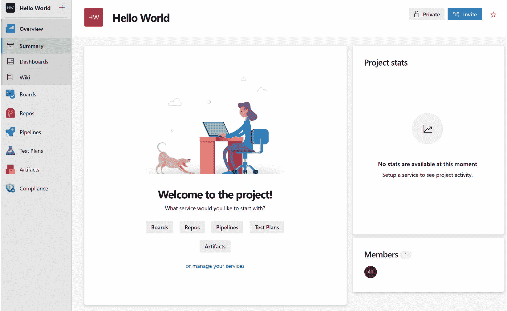

图 16.1 – Azure DevOps 主页

让我们详细了解 Azure DevOps 及其每个服务。

## 看板

**看板**帮助您为项目定义一个流程并跟踪工作。当您在 Azure DevOps 中创建一个新的项目时，您可以选择一个流程模板，如敏捷、基本、Scrum 或**能力成熟度模型集成**（**CMMI**）流程。流程模板决定了您可以在项目中使用的工项类型和工作流程。工项帮助您跟踪工作，而工作流程帮助您跟踪工项的进度。以下图显示了工项的层次结构以及 Scrum 流程模板的工作流程：

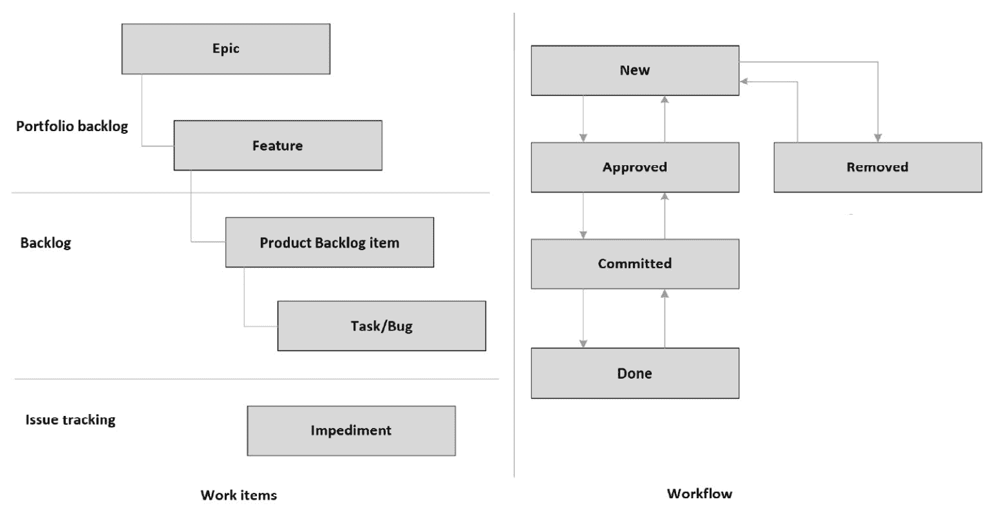

图 16.2 – 工作项层次结构及 Scrum 流程的工作流程

要进一步自定义或定义您的工作流程和工项类型，您可以选择基于之前提到的流程模板创建自己的流程模板。

让我们更深入地了解工作项和工作流程。

### 工作项

工作项帮助您跟踪项目中的功能、需求和错误。您可以在层次结构中对需求进行分组。通常，我们从称为**史诗**的高级需求开始，它可以进一步分解为**功能**和**产品待办事项**。产品待办事项是优先级较高、分配给团队成员并在冲刺中交付的可交付成果。**任务**是为待办事项和错误创建的，以跟踪对产品待办事项的缺陷。

协作功能允许您通过在工作项上讨论或提问来在团队内部进行沟通。您可以提及团队成员或链接另一个工作项，并随时查看所有操作或讨论的历史记录。您还可以选择关注工作项，以便在它更新时收到警报。

### 工作流程

工作流可以帮助您审查项目的进度和健康状况。例如，产品待办事项项以**新**状态创建。一旦它被产品负责人审查和批准，它就被移动到**已批准**，然后它被优先排序并分配给冲刺中的团队成员，并移动到**已承诺**，当它完成时，它被移动到**完成**。工作流可以帮助您跟踪项目的健康状况。

您可以使用 Kanban 板查看所有工作项的状态，并使用拖放功能轻松地将工作项移动到不同的状态。以下截图展示了由不同状态的工作项组成的 Kanban 板：

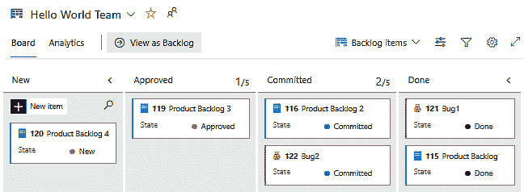

图 16.3 – Kanban 看板

注意

如果您创建自己的流程模板，您可以自定义工作项或创建新的工作项，并自定义或定义工作流以满足您的业务需求。

要了解有关流程模板及其差异的更多信息，您可以参考[`docs.microsoft.com/en-us/azure/devops/boards/get-started/what-is-azure-boards?view=azure-devops&tabs=scrum-process#work-item-types`](https://docs.microsoft.com/en-us/azure/devops/boards/get-started/what-is-azure-boards?view=azure-devops&tabs=scrum-process#work-item-types)。

接下来，让我们更深入地了解代码库。

## 代码库

**代码库**提供版本控制工具，您可以使用这些工具来管理您的代码。版本控制系统允许您跟踪团队对代码所做的更改。它为每个更改创建快照，您可以在任何时间审查它，并在需要时回滚到它。Azure DevOps 提供**Git**和**TFVC**作为您的版本控制系统。

Git 是目前最广泛使用的版本控制系统，并且越来越成为版本控制系统的标准。Git 是一个分布式版本控制系统，其中包含版本控制系统的本地副本，您可以在本地查看历史记录或提交更改，即使您离线，一旦连接到网络，它将同步到服务器。然而，TFVC 是一个集中式版本控制系统，每个文件在开发机器上只有一个版本，历史记录保存在服务器上。有关 Git 的更多信息，您可以参考[`docs.microsoft.com/en-in/azure/devops/repos/git/?view=azure-devops`](https://docs.microsoft.com/en-in/azure/devops/repos/git/?view=azure-devops)，有关 TFVC，您可以参考[`docs.microsoft.com/en-in/azure/devops/repos/tfvc/?view=azure-devops`](https://docs.microsoft.com/en-in/azure/devops/repos/tfvc/?view=azure-devops)。

以下为**代码库**的关键服务：

+   `main`或`master`，您可以从它创建另一个分支。这样，您可以隔离您的更改以进行功能开发或错误修复。您可以创建任意数量的分支，与团队成员共享，提交您的更改，并安全地将它们合并回`master`。

+   **分支策略**帮助您在开发过程中保护分支。当您在分支上启用分支策略时，任何更改都必须通过提交请求进行，这样您就可以进行审查、提供反馈和批准更改。作为分支策略，您可以配置所需的最小批准者数量，检查链接的工作项和评论解决情况，并强制构建成功以完成提交请求。

以下屏幕截图展示了在分支上定义的策略：

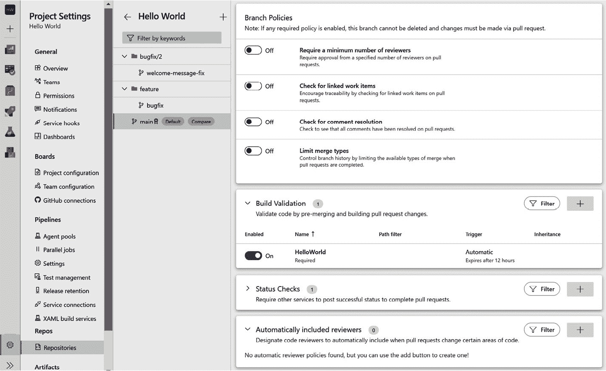

图 16.4 – 分支策略

在这里，创建了一个策略来验证在代码合并到分支之前构建。

+   **提交请求**允许您审查代码、添加评论，并确保在代码合并到分支之前得到解决。根据配置的分支策略，您可以添加强制审查员来审查和批准更改。您可以将工作项关联到提交请求以启用更改的可追溯性。以下屏幕截图展示了示例提交请求：

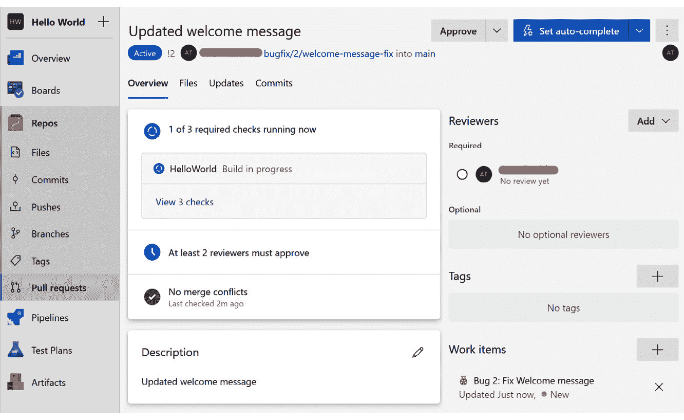

图 16.5 – 提交请求

提交请求有一个标题和描述，用户可以审查文件并比较它们与之前的版本，检查构建状态和链接的工作项，并进行批准。

接下来，让我们了解管道。

## 管道

**管道**允许您配置、构建、测试并将代码部署到任何目标系统。使用管道，您可以为代码的持续集成和持续部署启用一致性和质量交付。您可以使用针对使用流行语言（如.NET、Java、JavaScript、Node.js、PHP 和 C++）构建的许多应用程序类型的管道，并将它们部署到云或本地服务器。您可以使用 YAML 文件或基于 UI 的经典编辑器定义管道。

CI 自动化构建和测试您的项目以确保质量和一致性。CI 可以配置为按计划运行或当新代码合并到您的分支时运行，或者两者都运行。CI 生成由 CD 管道用于部署到目标系统的工件。

CD 使您能够自动将代码部署到目标系统并运行测试。CD 可以配置为按计划运行。

接下来，让我们更深入地了解测试计划。

## 测试计划

Azure DevOps 提供了一套工具来提高您项目中的质量。它提供基于浏览器的测试管理解决方案，具有所有手动和探索性测试所需的功能。它提供了在**测试套件**或**测试计划**下组织**测试用例**的能力，您可以使用它们来跟踪功能或发布的质量。以下是对这些功能的解释：

+   **测试用例**用于验证应用程序的各个部分。它们包含测试步骤，您可以使用它们来断言需求。您可以通过将其导入测试套件或测试计划来重用测试用例。

+   **测试套件**是一组执行以验证功能或组件的测试用例。您可以创建静态测试套件、基于需求的套件和基于查询的套件。

+   **测试计划**是一组测试套件或测试用例，用于跟踪每个发布迭代的每个迭代的质量。

接下来，让我们更深入地了解工件。

## 工件

**工件**使得在团队之间共享代码变得容易。您可以从公共和私有源轻松创建和共享 Maven、npm 或 NuGet 包源，它们在 CI 和 CD 流水线中易于使用。工件基于标准打包格式，可以轻松集成到开发 IDE 中，如 Visual Studio，作为包源。

Azure DevOps 使团队内部能够协调和协作，并帮助您以高质量一致地交付项目。使用 CI 和 CD，您可以自动化代码的构建和部署。

在下一节中，让我们了解 CI 流水线。

# 理解 CI 流水线

CI 是一种实践，您在其中自动化代码的构建和测试。在 Azure DevOps 中，您可以创建流水线并将它们配置为在代码合并到您的目标（master/main）分支时自动触发，按计划运行，或两者兼而有之。您可以选择使用 YAML 文件或基于 UI 的经典编辑器创建流水线。

下图说明了从开发者的机器到云的代码典型流程：

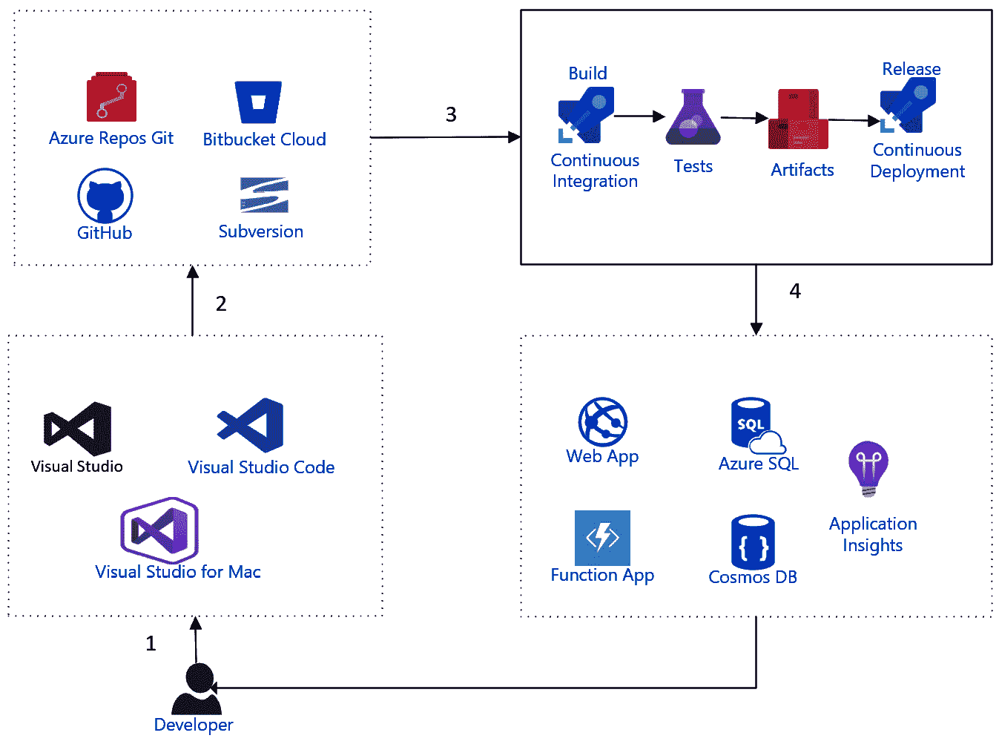


图 16.6 – 代码的典型流程

从前面的截图，我们可以看到以下内容：

1.  开发者使用 Visual Studio、Visual Studio Code 或 Visual Studio for Mac 等开发工具来编写代码。

1.  代码更改被移动到仓库中。

1.  CI 流水线被触发，验证构建，运行测试，并发布工件。CD 流水线被触发，并将代码部署到目标系统。

1.  开发者使用 Application Insights 来持续监控和改进应用程序。

    注意

    **YAML**（代表**YAML Ain't Markup Language**）是定义流水线的首选方式。它提供了与经典编辑器相同的功能。您可以将这些文件检查到仓库中，并像管理任何其他源文件一样管理它们。有关更多详细信息，您可以参考[`docs.microsoft.com/en-us/azure/devops/pipelines/yaml-schema?view=azure-devops&tabs=schema%2Cparameter-schema`](https://docs.microsoft.com/en-us/azure/devops/pipelines/yaml-schema?view=azure-devops&tabs=schema%2Cparameter-schema)。

让我们了解流水线的核心组件和流程。

## 理解流水线的流程和组件

**流水线**是一组定义，用于执行构建和测试代码的操作。流水线定义包含**触发器**、**变量**、**阶段**、**作业**、**步骤**和**任务**。当我们运行流水线时，它会执行流水线定义中定义的**任务**。以下各节中，我们将了解这些组件的每个部分。

### 触发器

流水线的 `trigger` 部分。

在以下代码片段中，流水线被配置为在代码推送到 `master` 分支或 `releases` 文件夹下的任何分支时触发。可选地，我们还可以在流水线中指定路径过滤器，以便仅在代码更改满足路径条件时触发：

```cs
trigger:
```

```cs
  branches:
```

```cs
    include:
```

```cs
    - master
```

```cs
    - releases/*
```

```cs
  paths:
```

```cs
    include:
```

```cs
    - web
```

```cs
    exclude:
```

```cs
    - docs/README.md
```

您还可以配置流水线根据计划自动运行。在以下代码片段中，流水线被配置为每天上午 9:30 运行。计划使用 `cron` 表达式指定，并且您可以指定多个计划。如果将 `always` 设置为 `true`，即使代码没有更改，也会触发构建：

```cs
schedules:
```

```cs
- cron: "30 9 * * *"
```

```cs
  displayName: Daily build
```

```cs
  branches:
```

```cs
    include:
```

```cs
    - master
```

```cs
  always: false
```

### 变量

**变量**可以通过赋予值并在流水线中的多个位置重用来定义。您可以在根目录、阶段或作业中定义变量。在流水线中可以使用三种不同类型的变量 – 用户定义的变量、系统变量和环境变量：

```cs
variables:
```

```cs
 buildConfiguration: 'Release'
```

```cs
. . . .
```

```cs
. . . .
```

```cs
- task: DotNetCoreCLI@2
```

```cs
  displayName: Publish
```

```cs
  inputs:
```

```cs
   command: 'publish'
```

```cs
   publishWebProjects: false
```

```cs
   projects: '**/*HelloWorld.csproj'
```

```cs
   arguments: '--configuration $(BuildConfiguration) --output $(build.artifactstagingdirectory)/web'
```

在前面的代码片段中，`buildConfiguration` 变量被定义为 `Release` 值，并在任务的 `arguments` 部分中使用。`build.artifactstagingdirectory` 系统变量包含工件目录的位置。

### 阶段

**阶段**是一组默认按顺序运行的作业。您也可以指定前一个阶段执行状态的条件，或添加审批检查以控制阶段何时运行。

以下是一个具有多个阶段的示例流水线定义：

```cs
stages:
```

```cs
- stage: Build
```

```cs
  jobs:
```

```cs
  - job: build
```

```cs
    steps:
```

```cs
    - script: echo building code
```

```cs
- stage: Test
```

```cs
  jobs:
```

```cs
  - job: windows
```

```cs
    steps:
```

```cs
    - script: echo running tests on windows
```

```cs
  - job: linux
```

```cs
    steps:
```

```cs
    - script: echo running tests on Linux
```

```cs
- stage: Deploy
```

```cs
  dependsOn: Test
```

```cs
  jobs:
```

```cs
  - job: deploy
```

```cs
    steps:
```

```cs
    - script: echo deploying code
```

在前面的示例中，配置了三个阶段，它们按顺序依次运行。`Test` 阶段包含两个可以并行运行的作业，而 `Deploy` 阶段依赖于 `Test` 阶段。

以下是对前面示例的流水线执行摘要的截图，您可以通过点击每个阶段来查看日志：

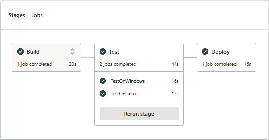

图 16.7 – 流水线运行摘要

### 作业

`testNull` 变量：

```cs
variables:
```

```cs
- name: testNull
```

```cs
  value: ''
```

```cs
jobs:
```

```cs
  - job: BuildJob
```

```cs
    steps:
```

```cs
    - script: echo Building!
```

```cs
    condition: eq('${{ variables.testNull }}', '')
```

在前面的代码中，作业被配置为仅在 `testNull` 为空时运行。

#### 步骤和任务

**步骤**是您流水线中的任务组。这些可能是构建您的代码、运行测试或发布工件。每个步骤都在代理上执行，并可以访问流水线工作区。

`DotNetCoreCLI@2` 任务构建 `csproj`：

```cs
- task: DotNetCoreCLI@2
```

```cs
  displayName: build
```

```cs
  inputs:
```

```cs
   command: 'build'
```

```cs
   projects: '**/*.csproj'
```

```cs
   arguments: '--configuration $(BuildConfiguration)'
```

要了解更多关于流水线的知识，您可以参考 [`docs.microsoft.com/en-in/azure/devops/pipelines/create-first-pipeline?view=azure-devops&tabs=java%2Ctfs-2018-2%2Cbrowser`](https://docs.microsoft.com/en-in/azure/devops/pipelines/create-first-pipeline?view=azure-devops&tabs=java%2Ctfs-2018-2%2Cbrowser)。

在下一节中，让我们更深入地了解 CD 流水线。

# 理解 CD 流水线

CD 是一个自动化将代码部署到目标环境的流程。CD 管道使用 CI 管道产生的工件并部署到一个或多个环境。像 CI 管道一样，我们可以使用 YAML 文件或经典编辑器来定义 CD 管道。您可以为前一个阶段的执行状态指定条件或添加批准检查以部署，这在生产部署中是一个非常常见的场景。

您还可以配置运行自动化的 UI 测试以在部署后进行合理性检查。根据合理性检查的结果，您可以配置它自动将代码提升到更高环境。

在任何时间点，如果某个阶段的部署失败，我们可以从之前的版本重新部署代码。根据项目设置下配置的保留策略，Azure DevOps 会保留构建工件，以便可以轻松地在任何时间部署任何版本的代码。如果您在部署后发现应用程序有任何问题，您可以轻松地找到最后一个已知的好版本，并部署代码以最小化业务影响。

让我们在下一节中更深入地了解这个内容。

## 持续部署与 CD 对比

持续部署是在将新代码合并到您的存储库时自动部署到目标系统，而 CD 使应用程序在任何时间都可以部署到目标系统。Azure DevOps 提供多阶段管道；您可以通过配置具有阶段的管道来实现这一点。

持续部署通常配置在较低的环境，如开发或测试，而对于较高环境，如预发布或生产，您应该考虑 CD，以便您可以在较低环境中验证更改并批准将代码部署到较高环境。

以下屏幕截图展示了多阶段管道，其中自动构建和发布到开发环境，并在测试阶段等待批准。在这种情况下，将代码发布到测试需要批准：

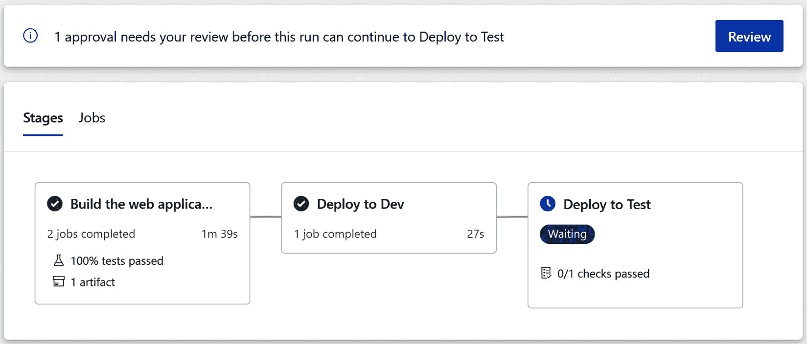

图 16.8 – 待批准的多阶段管道

要了解如何配置 Azure 管道中的批准和检查的更多信息，您可以参考[`docs.microsoft.com/en-in/azure/devops/pipelines/process/approvals?view=azure-devops&tabs=check-pass`](https://docs.microsoft.com/en-in/azure/devops/pipelines/process/approvals?view=azure-devops&tabs=check-pass)。

要查看管道运行的详细信息，您可以点击任何阶段来查看该运行的日志。日志帮助我们排查部署失败的问题。以下屏幕截图展示了管道运行的日志：


图 16.9 – 管道执行细节

在前面的屏幕截图中，您会注意到您可以查看管道中配置的阶段、作业和任务，并且您可以点击任务来查看日志。

在下一节中，我们将学习如何创建一个构建和部署应用程序的管道。

# 部署 ASP.NET 6 应用程序

到目前为止，在本章中，我们已经探讨了 Azure DevOps，了解了它提供的工具和服务，然后学习了 CI 和 CD 管道。在本节中，我们将学习如何创建 Azure DevOps 项目，克隆存储库，将代码推送到存储库，并创建 CI 和 CD 管道以将代码部署到 Azure App Service。

注意

在部署示例应用程序之前，请务必检查 *技术要求* 部分，以确保您已设置好所有内容。

您可以按照以下步骤部署 ASP.NET 6 应用程序到 Azure：

1.  登录到您的 Azure DevOps 账户。如果您还没有 Azure DevOps 账户，可以按照[`docs.microsoft.com/en-us/azure/devops/user-guide/sign-up-invite-teammates?view=azure-devops`](https://docs.microsoft.com/en-us/azure/devops/user-guide/sign-up-invite-teammates?view=azure-devops)中给出的步骤创建一个；您也可以按照以下步骤进行操作：

1.  在 Azure DevOps 的主页上，为您的项目提供一个名称，例如 `HelloWorld`，然后对于 **版本控制**，选择 **Git**，对于 **工作项流程**，您可以选择 **敏捷**：


图 16.10 – 新的 Azure DevOps 项目

1.  现在，让我们创建一个服务连接，我们将在管道中使用它来连接和部署代码到 Azure App Service。

从左侧菜单导航到 **项目设置** | **服务连接** | **创建服务连接** | **Azure 资源管理器** | **服务主体（自动）**：

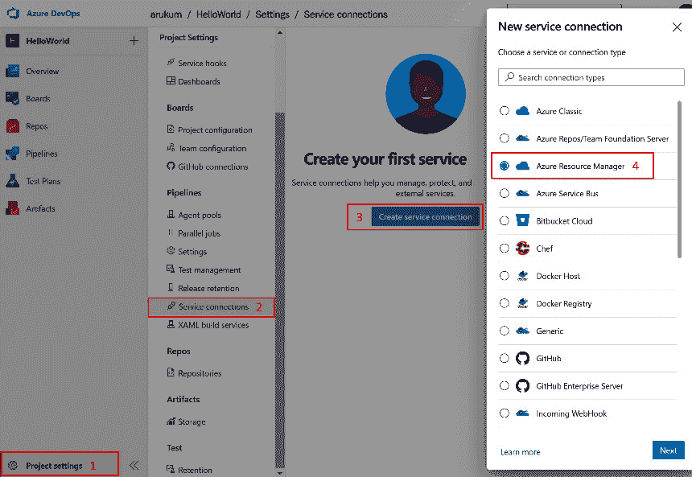


图 16.11 – 新的服务主体

服务主体使管道能够连接到您的 Azure 订阅以管理资源或将您的代码部署到 Azure 服务。

1.  选择一个订阅并为创建服务连接的连接提供一个名称。Azure DevOps 使用此服务连接来连接 Azure 资源并部署代码：

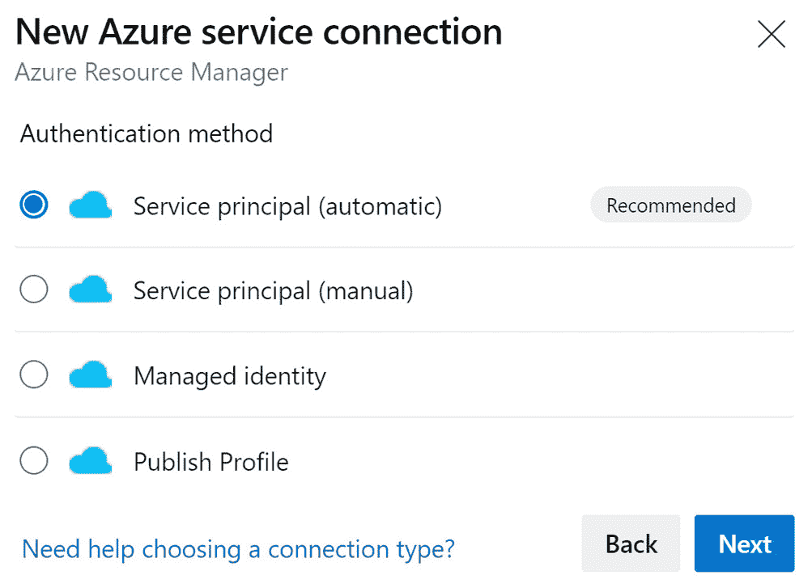


图 16.12 – 新的服务主体

1.  一旦创建项目，您应该会看到一个类似于以下页面的页面。从左侧菜单中，在 **仓库** 下选择 **分支**：

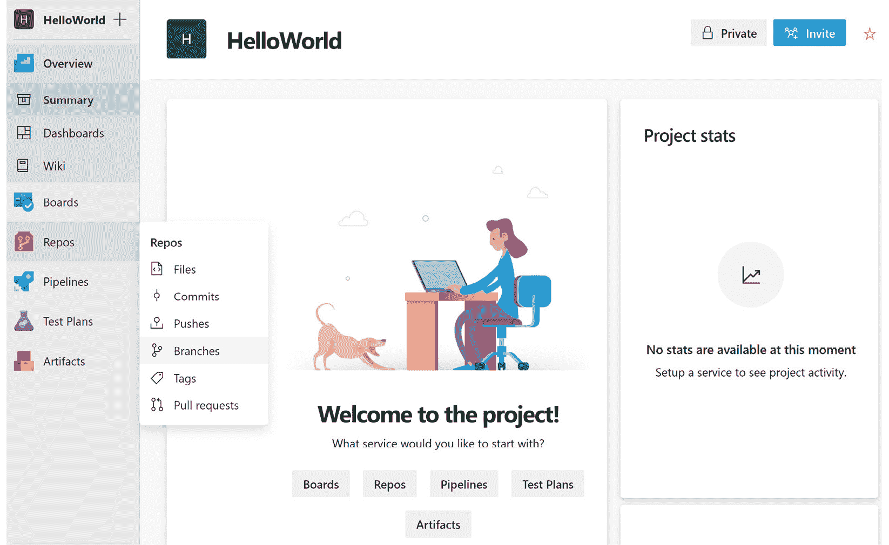


图 16.13 – Azure DevOps 主页 | 仓库屏幕

1.  复制以下链接，我们将使用它来克隆存储库到本地计算机：

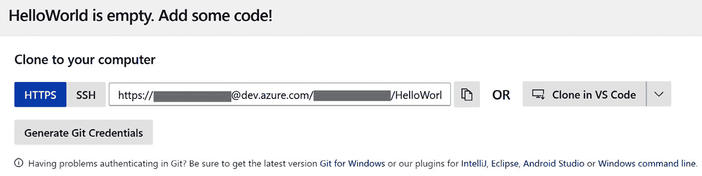


图 16.14 – 克隆仓库

1.  要将存储库克隆到您的系统，请打开命令提示符并导航到您想要克隆代码的文件夹，然后运行以下命令。

将 `<organization>` 替换为您的 Azure DevOps 组织：

```cs
git clone https://<organization>@dev.azure.com/<organization>/HelloWorld/_git/HelloWorld
```

1.  由于我们的存储库是新的且为空，我们需要向其中添加代码。以下 `dotnet` CLI 命令可以帮助我们创建一个 ASP.NET 6 应用程序和一个 xUnit 项目，创建一个解决方案文件，并将一个 Web 和测试项目添加到其中。按顺序运行每个命令以继续：

    ```cs
    dotnet new mvc --auth Individual -o HelloWorld
    dotnet new xunit -o HelloWorld.Tests
    dotnet new sln
    dotnet sln add HelloWorld/HelloWorld.csproj
    dotnet sln add HelloWorld.Tests/HelloWorld.Tests.csproj
    ```

1.  运行以下命令来构建代码并运行测试以验证是否一切正常：

    ```cs
    dotnet build
    dotnet test
    ```

现在我们已经测试了代码，接下来让我们看看如何为使用代码创建 CI/CD 管道。

## 创建 CI/CD 管道

在运行测试后，我们需要查看 CI/CD 管道是如何创建的。执行以下步骤：

1.  接下来，我们需要创建一个 CI/CD 的管道。你可以使用在 [`github.com/PacktPublishing/Enterprise-Application-Development-with-C-10-and-.NET-6-Second-Edition/blob/master/Chapter16/Pipelines/HelloWorld/azure-ci-pipeline.yml`](https://github.com/PacktPublishing/Enterprise-Application-Development-with-C-10-and-.NET-6-Second-Edition/blob/master/Chapter16/Pipelines/HelloWorld/azure-ci-pipeline.yml) 可用的代码，并将其保存到存储库的根目录中。让我们称它为 `azure-ci-pipeline.yml`。

此管道被配置为在新代码合并到 `main` 分支时触发。

1.  它被配置为有三个阶段——构建、开发和测试——其中构建阶段被配置为构建代码、运行单元测试和发布工件。开发和测试阶段被配置为将代码部署到 Azure App Service。

1.  依赖关系在开发和测试阶段进行配置，其中开发阶段依赖于构建，测试依赖于开发阶段。

让我们检查这个 YAML 文件的一些重要部分。

以下片段包含一个定义变量的部分：

```cs
trigger:
- main
variables:
  BuildConfiguration: 'Release'
  buildPlatform: 'Any CPU'
  solution: '**/*.sln'
  azureSubscription: 'HelloWorld-Con' # replace this
  # with your service connection name to connect Azure 
  #subscription
  devAppServiceName: 'webSitejtrb7psidvozs' # replace 
  #this with your app service name
  testAppServiceName: 'webSitejtrb8psidvozs' # replace 
  #this with your app service name
```

你会注意到在 YAML 文件中声明了三个变量。在保存文件之前，请提供适当的值：

+   `azureSubscription`：提供你的服务连接名称。

+   `devAppServiceName`：提供开发部署的应用服务名称。

+   `testAppServiceName`：提供测试部署的应用服务名称。

要构建代码，我们使用 `DotNetCoreCLI@2` 任务并配置 `command`、`projects` 和可选的 `arguments`：

```cs
- task: DotNetCoreCLI@2
  displayName: Build
  inputs:
    command: 'build'
    projects: '**/*.csproj'
```

`command` 被配置为 `build`，路径设置为 `csproj` 以构建 `projects` 中的代码。此任务运行 .NET CLI 命令，因此我们也可以使用其他 .NET CLI 命令配置此任务，例如 `run`、`test`、`publish`、`restore` 等。

1.  要发布代码，使用 `PublishBuildArtifacts@1` 任务。它配置了 `PathtoPublish`、`ArtifactName` 和 `publishLocation`：

    ```cs
    - task: PublishBuildArtifacts@1
      inputs:
        PathtoPublish: 
          '$(Build.ArtifactStagingDirectory)/web'
        ArtifactName: 'drop'
        publishLocation: 'Container'
    ```

`PathtoPublish` 被配置为工件目录的位置，其中包含可用的构建工件，`ArtifactName` 为 `drop`，`publishLocation` 为 `Container` 以将工件发布到 Azure Pipelines。或者，我们也可以将 `publishLocation` 配置为 `FileShare`。

以下代码片段执行所需的操作以部署代码：

```cs
- download: current
  artifact: drop
- task: AzureWebApp@1
  displayName: 'Azure App Service Deploy: website'
  inputs:
    azureSubscription: '$(azureSubscription)'
    appType: 'webApp'
    appName: '$(devAppServiceName)'
    package: '$(Pipeline.Workspace)/drop/*.zip'
    deploymentMethod: 'auto'
```

在部署作业中，第一步是下载工件，并且工件的名称应该与在 `PublishBuildArtifacts@1` 任务中配置的名称相同，在这种情况下，是 `drop`。

`AzureWebApp@1` 任务用于将工件部署到 Azure App Service。所需的参数包括 `azureSubscription`、`appType`、`appName`、`package` 和 `deploymentMethod`（作为 `auto`）。

现在工件已经准备好了，我们可以看到代码是如何被提交的，以及代码更改是如何被推送到远程仓库的。

### 推送代码

现在代码和流水线都已经准备好了，下一步是将这些更改提交并推送到 Azure DevOps 仓库：

1.  在命令提示符中，运行以下命令以在本地提交更改并将它们推送到 Azure DevOps：

    ```cs
    git add .
    git commit -m "Initial Commit"
    git push
    ```

1.  在 Azure DevOps 中，导航到 **流水线** 并点击 **创建流水线** 来创建一个新的流水线：

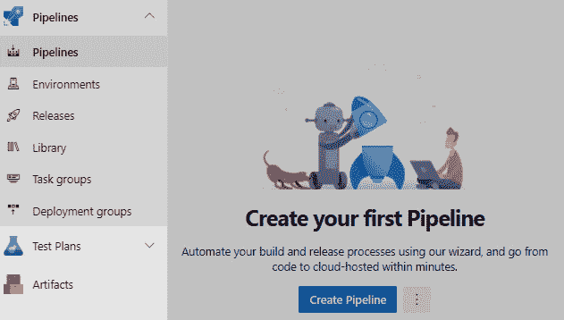

图 16.15 – 新建流水线

1.  要配置流水线，我们需要执行四个步骤。选择你的仓库所在的云服务，选择仓库，配置流水线，然后保存。对于此实现，选择 **Azure Repos Git** 以继续，然后选择你的仓库：

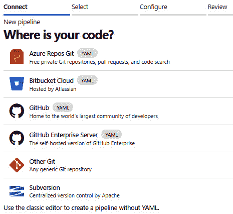

图 16.16 – 源代码选择

1.  在 **配置** 选项卡中，选择 **现有 Azure 流水线 YAML 文件** 以继续：

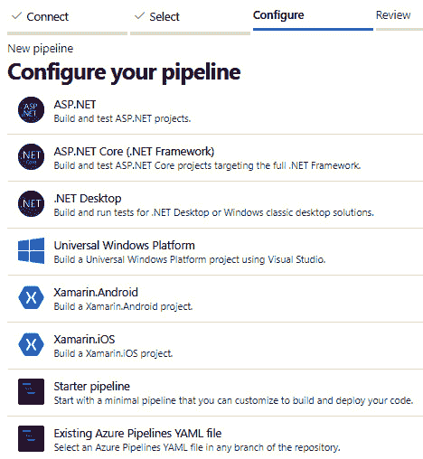

图 16.17 – 配置流水线

1.  选择我们在仓库中保存的流水线文件，然后点击 **继续**，然后点击 **运行** 来触发流水线：

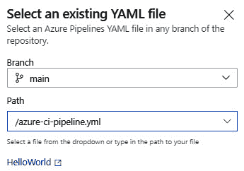

图 16.18 – YAML 文件选择

1.  这将打开一个页面，我们可以看到流水线的状态。以下截图是从流水线运行中获取的。你会注意到已经创建了三个阶段：

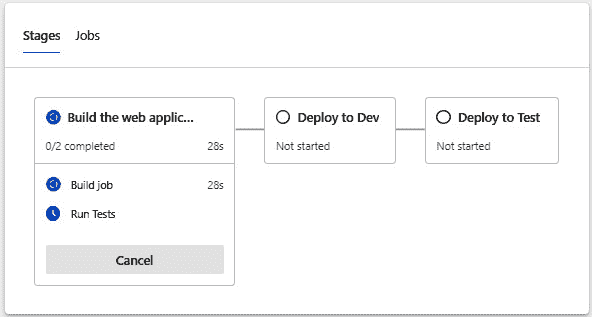

图 16.19 – 流水线运行摘要

在构建阶段，你会注意到有两个正在进行的作业。

开发阶段和测试阶段正在等待构建完成。

可选地，你可以在 Azure App Service 上启用部署槽位，并配置流水线以将代码部署到非生产部署槽位，例如，*预生产*。一旦你检查了已部署代码的合理性，你可以将 *生产* 槽位与 *预生产* 槽位交换。交换是瞬时的，并且没有任何停机时间，你可以将最新的更改提供给用户。如果你发现任何问题，你可以交换回先前的槽位以回到最后一个已知的好版本。有关更多信息，你可以参考 [`docs.microsoft.com/en-us/azure/app-service/deploy-staging-slots`](https://docs.microsoft.com/en-us/azure/app-service/deploy-staging-slots)。

1.  流水线执行完成后，从左侧菜单导航到 **流水线** 下的 **环境**。你会注意到已经创建了开发和测试环境：

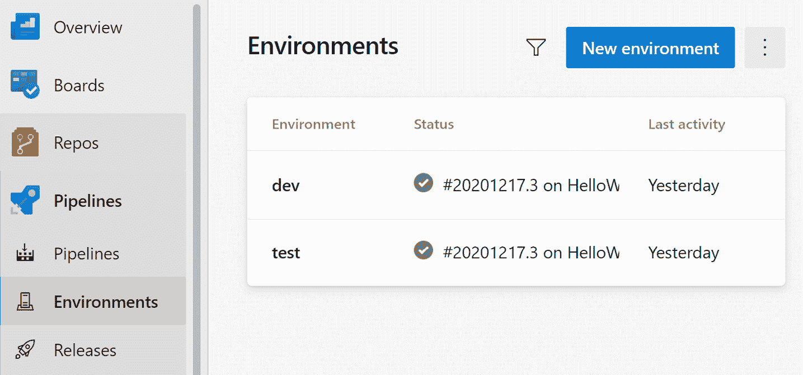

图 16.20 – 环境

1.  点击 **测试** 阶段，在更多操作选择中，选择 **审批和检查** 以继续：

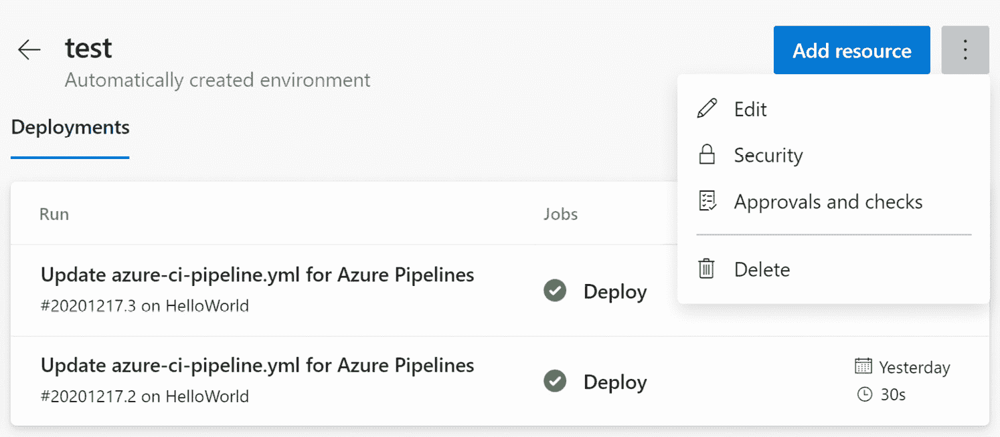

图 16.21 – 批准和检查

1.  您将找到许多可供选择的功能，例如**批准**、**分支控制**、**工作日**等：

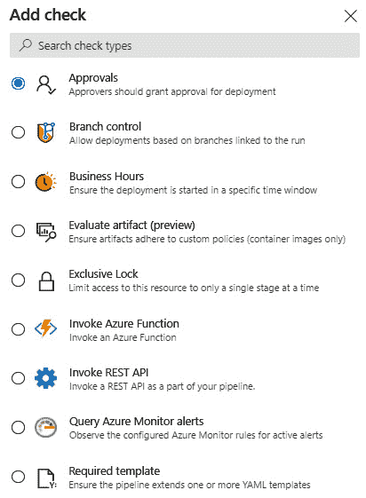

图 16.22 – 添加检查

1.  选择**批准**以继续，它将打开一个对话框，我们可以选择用户/组作为审批者。提供必要的详细信息并点击**创建**：

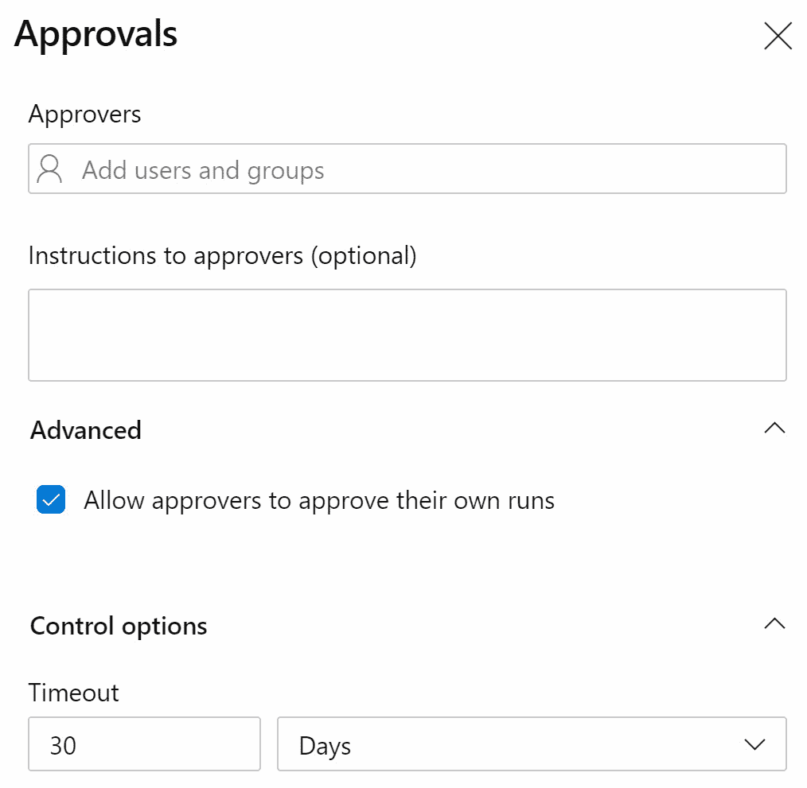

图 16.23 – 添加批准

1.  重新运行管道以测试更改。您将注意到管道在测试阶段等待执行：


图 16.24 – 具有挂起批准的多阶段管道

1.  点击**审查**，这将打开一个对话框以批准或拒绝。点击**批准**以完成部署：

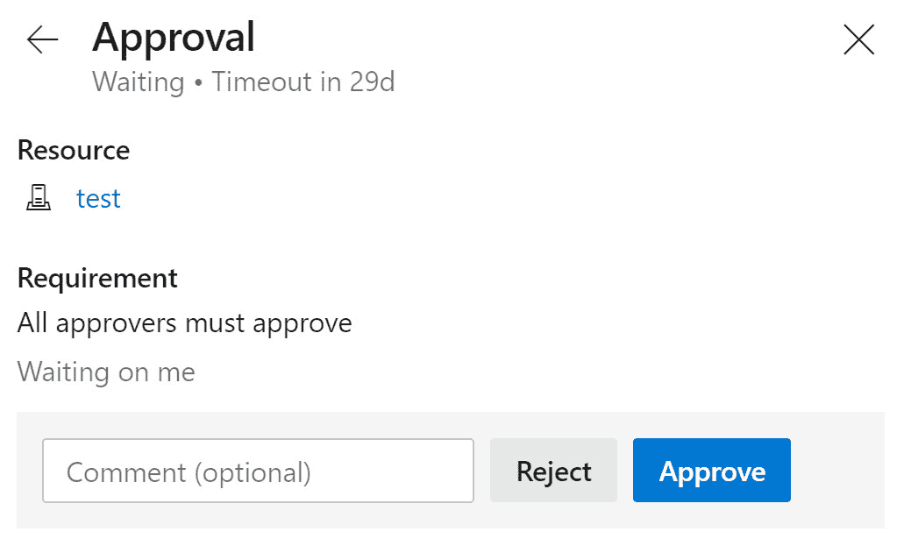

图 16.25 – 批准或拒绝

总结来说，在本节中，我们从在 Azure DevOps 中创建新项目开始，然后克隆仓库到本地系统，使用.NET CLI 创建了一个简单的 ASP.NET Core 应用程序，创建了一个 YAML 管道来构建、测试和发布工件并将它们部署到 Azure App Service，并将代码提交并推送到仓库。接下来，我们通过在仓库中选择 YAML 文件创建了一个新的 CI/CD 管道，并触发了管道。在**环境**中，我们配置了批准检查并触发了管道以查看其工作情况。

# 摘要

在本章中，我们了解了 Azure DevOps 是什么，以及它提供的工具和服务。我们了解了服务如看板、代码库、管道、测试计划和工件如何帮助我们高效地执行项目。

接下来，我们探讨了 CI 和 CD 管道及其核心组件。我们还学习了它们如何帮助我们自动化代码的构建和部署。通过学习如何创建 ASP.NET 6 应用程序以及使用 CI 和 CD 管道构建和部署到 Azure App Service 的管道，我们结束了本章。

我希望这本书能帮助您提高.NET 技能，并激励您尝试构建更多其应用。您可以通过参考章节的笔记和**进一步阅读**部分来探索更多主题。

对于企业应用，我们还涵盖了典型电子商务应用的快乐路径场景，并且可以根据在*第一章*中定义的需求进一步扩展，即**设计和架构企业应用**。有示例扩展端到端流程的认证/授权，使用 API 网关进行服务间通信和认证，并实现通知服务，以便您了解更多。

我们祝愿您在 C#和.NET 项目中一切顺利。祝您学习愉快！

# 问题

1.  持续部署与 CD 有何不同？

a. CD 与数据库协同工作，而持续部署支持 Web 应用程序。

b. 持续部署每次都发布到环境，而 CD 在任何一次都发布到环境。

c. 持续部署需要云服务，而 CD 与本地服务器协同工作。

d. 持续部署在任何一次都发布到环境，而 CD 每次都发布到环境。

**答案：b**

1.  持续部署方法的特点是什么？（选择两个）

a. 专注于缩短周期时间

b. 少量复杂发布

c. 基于资源的流程管理

d. 自我管理和响应性团队

**答案：a 和 d**

1.  哪个组件提供了对提交的应用代码更改质量的首次反馈？

a. 自动部署

b. 自动配置

c. 自动构建

d. 自动测试

**答案：c**

# 进一步阅读

想了解更多关于 Azure DevOps 的信息，您可以参考[`docs.microsoft.com/en-in/azure/devops/user-guide/services?view=azure-devops`](https://docs.microsoft.com/en-in/azure/devops/user-guide/services?view=azure-devops)，以及关于管道，您可以参考[`docs.microsoft.com/en-in/azure/devops/pipelines/get-started/pipelines-get-started?view=azure-devops`](https://docs.microsoft.com/en-in/azure/devops/pipelines/get-started/pipelines-get-started?view=azure-devops).
