# 第二章：Unity AR 开发入门

本章将向您介绍 Unity，这是一个实时 3D 开发平台，已成为多平台**增强现实**（**AR**）开发的主要工具之一。其多功能性、广泛的文档和活跃的论坛使得学习曲线快速，并且其 Asset Store 中已创建的场景、示例和多样化的资源将帮助您以快速简单的方式创建令人惊叹的 AR 体验。

本章的主要目标是让您在使用 AR 项目之前对 Unity 感到舒适。您将学习如何安装和使用 Unity，了解用户界面的分布，以及主要组件的名称和用途。然后，您将创建一个简单的 C#脚本，以了解脚本编写的强大功能，以便能够自定义 3D 场景。到本章结束时，您将掌握基本知识，以便可以通过集成和与以下章节中将要介绍的 AR**软件开发工具包**（**SDKs**）一起工作来进一步探索 Unity。

Unity 是 AR 开发中最强大的工具之一；它是跨平台的，大多数 AR SDKs 都有与 Unity 兼容的特定包。在本书中，第五章，*使用 EasyAR 进行营销的 AR*，第六章，*使用 Vuforia 进行零售的 AR*，和第七章，*使用 Vuforia 和 Epson 眼镜进行自动化的 AR*，将使用 Unity 开发，尽管它们的示例项目是在 Android 设备上实现的，但它们也可以构建（Epson 眼镜除外，它只能在 Android 操作系统上运行）为 iOS 设备，几乎不需要代码更改。此外，第三章，*使用 ARCore 进行制造的 AR*，和第八章，*使用 ARKit 进行旅游的 AR*，也可以在 Unity 中实现。

因此，本章的重要性在于，您将学习如何创建 Unity 3D 项目并为特定平台构建它，这将为更复杂的项目奠定基础。

在本章中，我们将涵盖以下主题：

+   介绍 Unity

+   为 Unity 准备您的系统

+   理解 Unity 界面

+   Unity 主要组件

+   脚本编写 – 第一个 C#示例

# 技术要求

本章的技术要求如下：

硬件（从[`docs.unity3d.com/2019.1/Documentation/Manual/system-requirements.html`](https://docs.unity3d.com/2019.1/Documentation/Manual/system-requirements.html)）：

+   CPU：支持 SSE2 指令集

+   GPU：具有 DX10（着色器模型 4.0）功能的显卡

操作系统：

+   Windows: 7 SP1+，8，10，仅限 64 位版本

+   macOS: 10.12+

+   Linux: 固定在 Ubuntu 16.04，18.04 和 CentOS 7

Android 开发软件：

+   Java 开发工具包（本书中为 1.8.0）

+   Unity 3D（本书中为 2019.1.2f1）

+   Android SDK（包含在 Unity 安装中）

+   Microsoft Visual Studio Community 2017（包含在 Unity 安装中）

本章的资源和相关代码文件可以在以下链接找到：[`github.com/PacktPublishing/Enterprise-Augmented-Reality-Projects/tree/master/Chapter02`](https://github.com/PacktPublishing/Enterprise-Augmented-Reality-Projects/tree/master/Chapter02)。

虽然我们将为 Android 设备开发 Unity 项目，但你也可以为 iOS 构建它们。在这种情况下，要求是 macOS 和 Xcode 9.4 或更高版本。

# 介绍 Unity

当我们想到近年来对游戏开发产生重大影响的工具时，一个名字脱颖而出：Unity。Unity 是一个图形引擎，帮助我们开发视频游戏、交互式项目、可视化以及在不同平台上进行实时 2D 和 3D 动画。Unity 提供了一个完整的可视化编辑器和脚本，使我们能够创建具有专业完成度的应用程序。

为了这个目的，Unity 由一系列旨在简化设计游戏的不同方面的任务（包括图形、物理、动画和人工智能）的工具包组成。Unity 是一个独特的开发系统，它专注于资产而不是像其他类似的 3D 建模应用程序那样关注代码。游戏内容是从编辑器构建的，游戏则是使用 C# 脚本语言编写的。

Unity 还包括一个地形编辑器，你可以在这里使用可视化工具、绘画或纹理创建地形（例如空白纸张），还可以添加从 3D 应用程序（如 Blender、3ds Max 和 Maya）导入的其他元素。

Unity 在市场上迅速增长，并因其某些特性而被公司和专业人士采用，这些特性使 Unity 在其他游戏引擎中脱颖而出：

+   Unity 是一个多平台工具，允许我们为多个平台发布 2D 和 3D 内容，例如 Windows、OS X、GNU/Linux、Flash、Xbox One、PS4、Nintendo Switch、Android 和 iOS，包括基于 **Web 图形库**（**WebGL**）技术的网络游戏（这是一个在任何网络浏览器中渲染 3D 图形的标准规范）。

+   Unity 为学习和独立开发者提供了一套完整的免费许可证，以及根据开发者公司业务量不同而具有不同可扩展定价计划的许可证。

+   Unity 是最受欢迎的 AR 和 **虚拟现实**（**VR**）开发引擎之一，从早期就支持行业发展。市场上三分之二以上的 AR 和 VR 应用都是使用 Unity 开发的。

+   Unity 是一个可扩展的环境，可以通过我们自己的或第三方插件进行扩展，并且以可扩展的方式随着新元素和功能的发展而增长，这些元素和功能并非它最初创建时设计的。

+   Unity 提供了一个门户，我们可以用它来购买和销售各种免费和付费的扩展和资源，称为 Asset Store。这个门户不仅对开发者有用，还让商业市场能够创建特定的公司，这些公司的商业模式是创建工具和内容，以便他们可以在这个在线商店中销售自己的资源。

+   Unity 集成了额外的服务，其中大部分是免费的，使我们能够在不同的视频游戏世界的商业模式中产生利润。例如，这些服务包括 Unity Ads，允许您添加广告；Unity Analytics，提供有关用户互动的信息；以及 Unity Networking，为在线游戏开发提供基础设施。

现在我们已经了解了 Unity 是什么以及它的众多特性，我们可以开始准备我们的系统，以便安装必要的软件。

# 为 Unity 准备您的系统

在这本书中，我们将使用 Unity 来开发 Android 移动应用程序。为了创建 Android 应用程序，我们需要安装**Java 开发工具包**（**JDK**）和 Android**软件开发工具包**（**SDK**）。

正如我们在*技术要求*部分提到的，如果我们在一个运行 macOS 计算机上的 Xcode 上运行 Unity，我们可以轻松地运行相同的项目用于 iOS。

由于 Unity 直接提供 Android SDK 安装，我们将首先安装 JDK，然后继续在我们的计算机上安装 Unity。

# 安装 Java 开发工具包（JDK）

要安装 JDK，请按照以下步骤操作：

1.  访问 Oracle 的下载页面[`www.oracle.com/technetwork/java/javase/downloads/jdk8-downloads-2133151.html`](https://www.oracle.com/technetwork/java/javase/downloads/jdk8-downloads-2133151.html)：

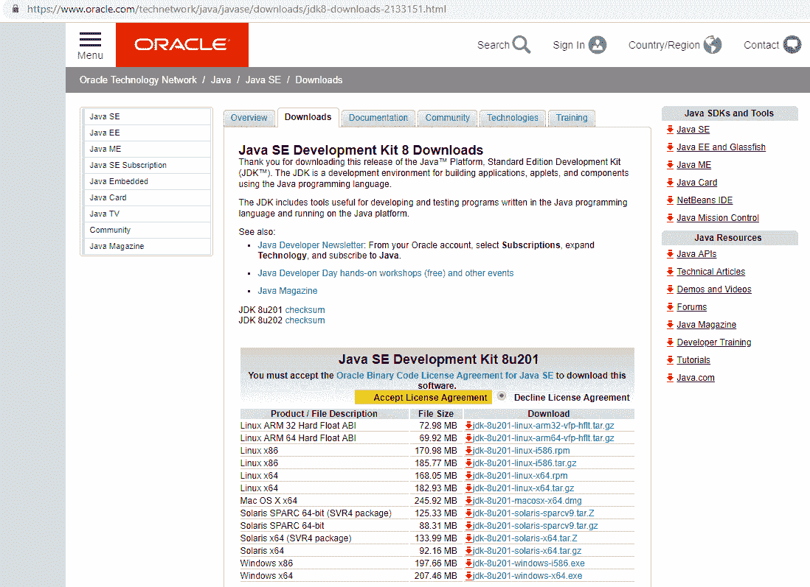

1.  确保您接受 Java SE 的二进制代码许可协议。

1.  选择最新的 Java SE 开发工具包（在我们的例子中，这是 Java SE 开发工具包 8u201）。

1.  下载后，运行安装文件，并让它将 JDK 和 JRE 安装到默认文件夹中。

从 Unity 2019.2 版本开始，Unity 安装允许您在 Android 构建支持选项中安装 OpenJDK（请参阅*安装 Unity*部分）。

现在您已经安装了 JDK，让我们安装 Unity。

# 安装 Unity

我们将使用 Unity Hub 安装 Unity，这是一个允许我们在计算机上安装和管理不同版本的 Unity 的工具。您可以从[`unity3d.com/get-unity/download`](https://unity3d.com/get-unity/download)下载 Unity Hub。

按照以下步骤安装 Unity：

1.  下载并安装 Unity Hub。

1.  运行 Unity Hub。第一次运行时，它会通知您缺少许可证，如下面的截图所示。点击**管理许可证**：

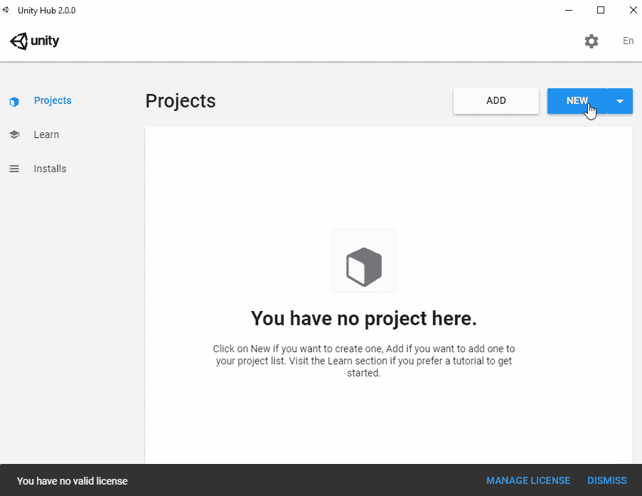

无有效许可证信息

1.  在许可窗口中，将出现另一条消息，要求你登录以添加许可。点击登录：

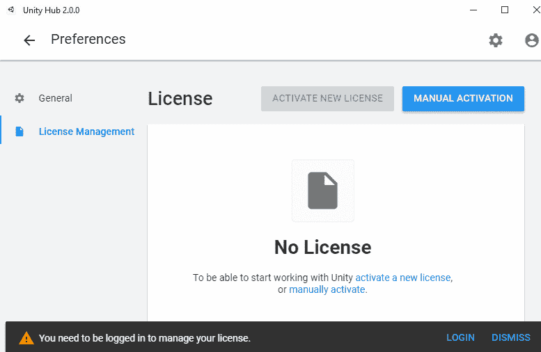

许可窗口中的登录消息

1.  将会出现一个弹出窗口，要求你输入电子邮件和密码。如果你没有账户，你可以通过点击创建一个账户来创建一个账户。你也可以使用谷歌或 Facebook 登录：

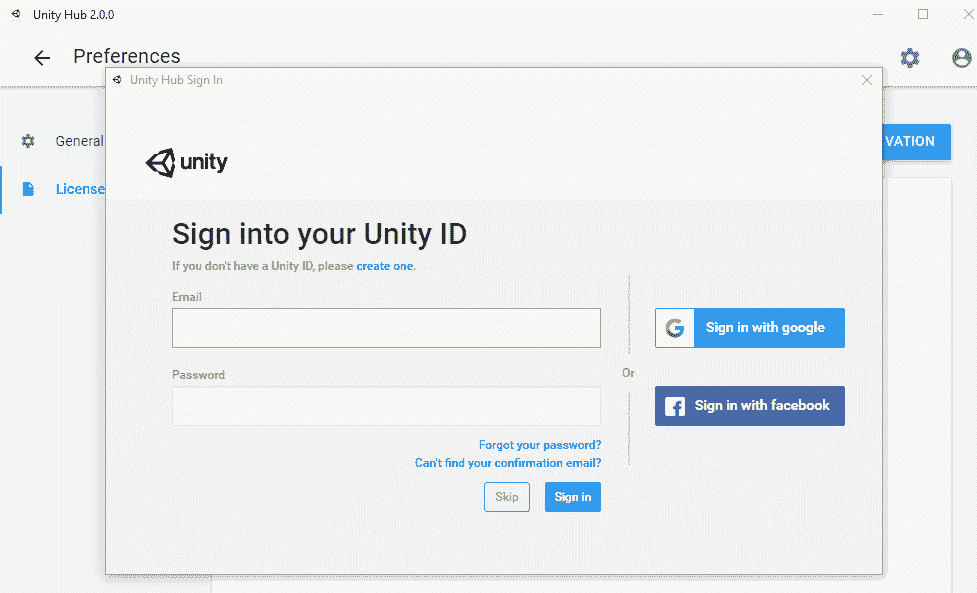

登录 Unity

1.  现在，选择一个许可选项，然后点击完成。(如果你符合要求，可以使用个人许可免费使用 Unity。如果不满足条件，你必须在他们的网页上购买 Unity Plus 或 Pro ([`store.unity.com`](https://store.unity.com))。)

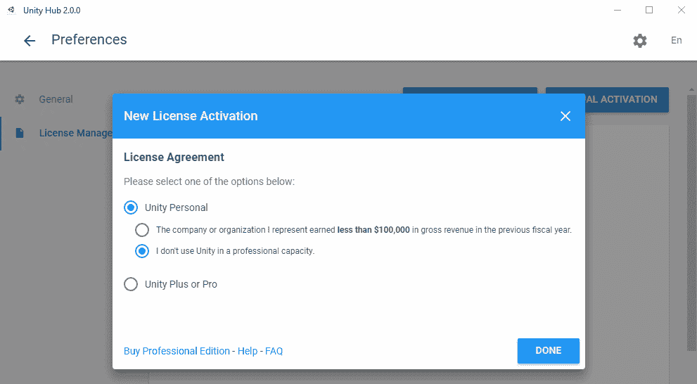

选择产品的许可

1.  现在，返回，点击安装选项卡，然后点击添加以添加新的 Unity 安装：

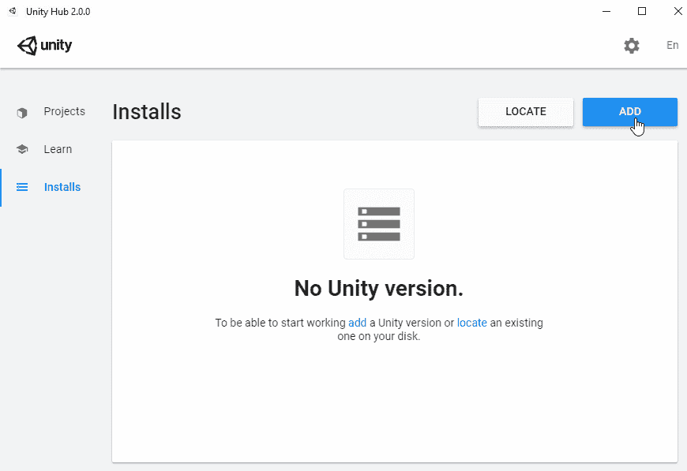

添加新的 Unity 版本

1.  在出现的弹出窗口中，选择你想要安装的 Unity 版本和要添加的模块。在我们的例子中，我们使用的是 2019.1.2f1 版本，我们将安装 Microsoft Visual Studio Community 2017 进行编码和 Android 构建支持，以及 Android SDK & NDK Tools 进行 Android 开发，如下面的截图所示：

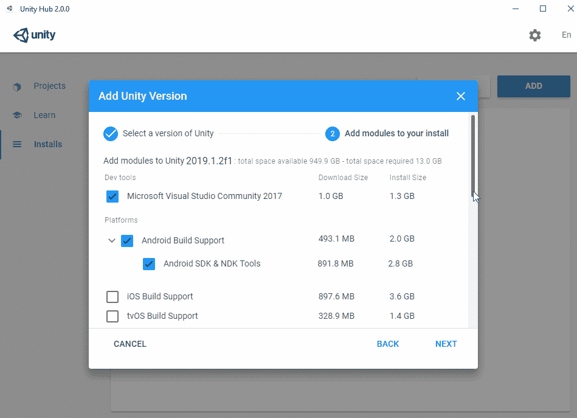

选择 Unity 版本和模块

Unity Hub 总是显示每个版本的最新编译版本。如果你想安装特定版本，例如我们在这里使用的版本，你可以在 Unity 存档中找到它并通过 Hub 安装：[`unity3d.com/es/get-unity/download/archive`](https://unity3d.com/es/get-unity/download/archive)。

从 Unity 2019.2 版本开始，在 Android 构建支持下出现了一个新选项，可以直接安装 OpenJDK。

1.  如果你计划使用 Vuforia 进行开发，正如我们在第六章 AR for Retail with Vuforia 和第七章 AR for Automation with Vuforia and Epson Glasses 中将要做的，请检查以下截图中的 Vuforia 增强现实支持选项。然后，点击下一步并完成安装：

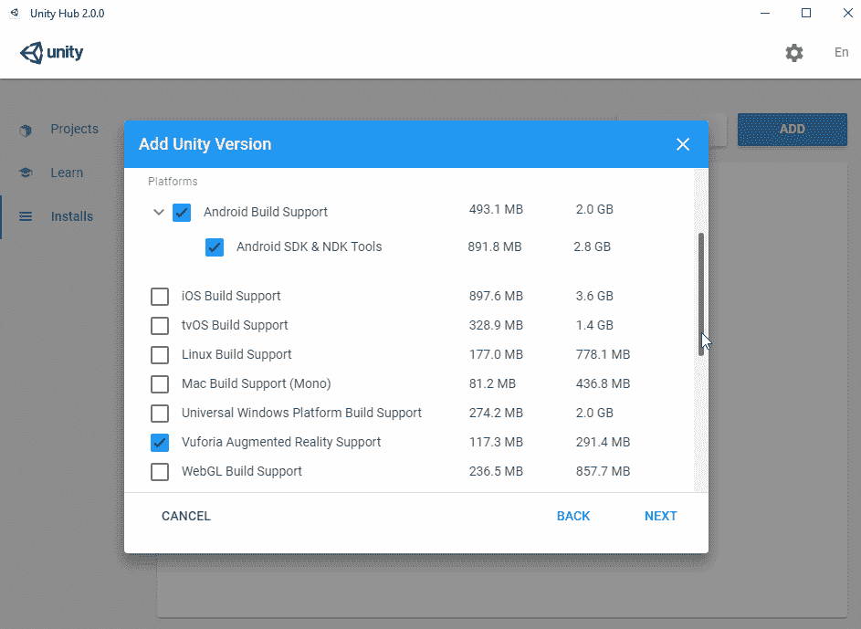

选择 Vuforia 增强现实支持

Unity 的最新版本可能并不总是支持 Vuforia。如果你在列表中没有看到 Vuforia，不要慌张！这是因为最新的 Unity 版本还没有支持它，你应该安装一个支持 Vuforia 的旧版本。

1.  安装完成后，你将被送回到安装窗口，在那里你会看到新版本和已安装的模块，如下面的截图所示：

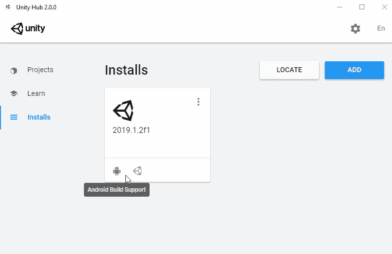

新 Unity 版本的安装窗口

1.  如果在安装过程中你忘记添加一个模块或者你想稍后添加，你只需点击右上角的三点按钮，然后选择添加模块，如下所示：

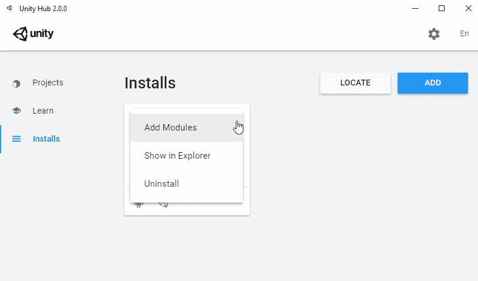

安装完成后添加新模块

1.  现在，点击“项目”标签页。在这里，我们将通过点击 NEW 按钮来创建一个新的项目，如下所示：

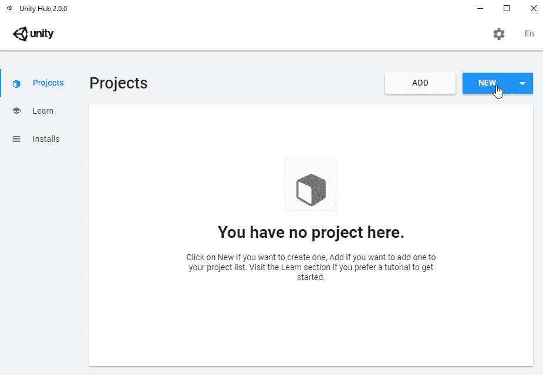

创建新项目

1.  我们将创建一个 3D 项目（已经选中）。在设置面板中，给项目命名并设置位置，如下面的截图所示。然后，点击 CREATE：

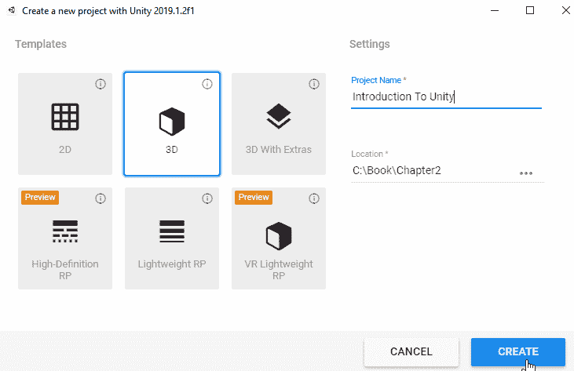

设置新的 Unity 项目

1.  现在，Unity 将打开新项目，你可以开始使用它。如果你关闭 Unity 窗口，你可以通过从 Unity Hub 的项目窗口中选择它来重新打开项目，如下面的截图所示：

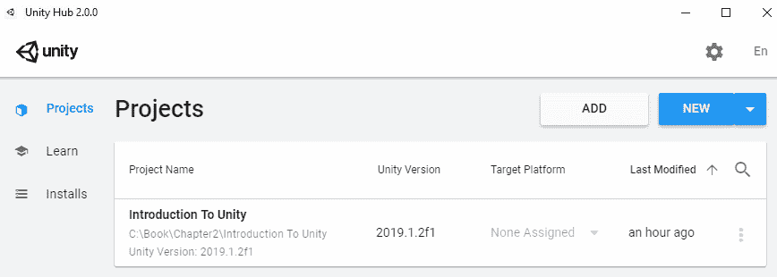

新项目出现在项目窗口中

就这样。现在，你已经将 Unity 安装到你的电脑上，你的第一个项目已经打开，你可以开始使用它了。在下一节中，我们将提供 Unity 界面的导游，以便了解 Unity 提供的可能性以及如何使用每个工具。

# 理解 Unity 界面

第一次打开 Unity 编辑器时，你会看到一个带有不同栏和窗口的布局，类似于以下截图所示：

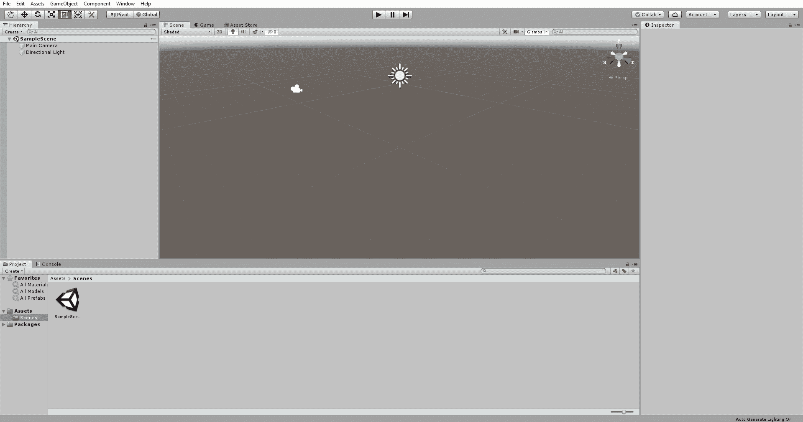

初始 Unity 布局

初看之下，Unity 的配置略带 3D 建模工具的感觉，中间是 3D 场景，尽管它比建模工具多了几个面板。如果你不熟悉 3D 工具，可能会觉得理解所有内容有些令人畏惧，但 Unity 的界面相当直观，并且在 Unity 各个版本中保持得很一致。前一个截图中所看到的主要组件如下（从左上角到右下角）：

+   **工具栏**：在这里，我们有主要的按钮，以便我们可以在场景视图中操作对象以测试场景。

+   **层次结构窗口**：层次结构窗口按层次顺序显示场景视图中的元素。

+   **场景视图、游戏视图和资产商店窗口**：这三个标签页有不同的用途。场景视图显示 3D 场景中的所有元素。游戏视图从摄像机的视角显示场景构建后的样子。资产商店窗口可以用来从 Unity 商店下载包和资产，以便我们可以将它们包含在我们的项目中。

+   **检查器窗口**：当在层次结构窗口或场景视图中选择一个元素时，其特性和组件将显示在这个窗口中。

+   **项目窗口和控制台窗口**：前者显示项目中所有目录和文件，我们可以（或不能）在场景中使用，而后者显示日志消息。

现在，我们将详细探讨每个组件，并学习如何根据我们的需求和喜好更改此布局。

# 工具栏

此工具栏固定在屏幕上，使我们能够访问 Unity 的主要功能。它分为三个部分：用于操作场景中对象的工具、游戏视图控件以及一组按钮，用于访问 Unity 服务和管理图层和 UI 布局：

在左侧，我们可以看到我们可以用来操作场景视图及其上对象的工具。以下是这些工具：

+   手动工具

+   移动工具

+   旋转工具

+   缩放工具

+   矩形工具

+   组合工具

+   中心/旋转点按钮

+   本地/全局按钮：

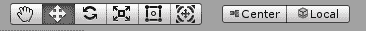

工具栏左侧的按钮

让我们逐一查看这些工具：

+   **手动工具**：这是场景的导航工具。它有三个用途：

    +   **移动**：左键点击 + 拖动以在场景中移动而不会更改其任何对象。工具栏和场景视图中出现一个手形图标。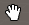

    +   **环绕**：*Alt* + 左键点击 + 拖动以在场景中环绕。工具栏和场景视图中出现一个眼睛图标。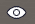

    +   **缩放**：*Alt* + 右键点击 + 拖动以在场景中缩放和缩小。工具栏和场景视图中出现一个放大镜图标。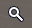

您可以通过按鼠标滚轮并拖动来随时使用移动功能。您还可以使用鼠标滚轮进行缩放和缩小。

+   **移动工具**：当选择此按钮时，您可以通过拖动相应的箭头将场景中的对象移动到三个轴上。您还可以拖动出现在箭头交点上的小正方形，将对象移动到平面（两个轴）而不是单个轴上：

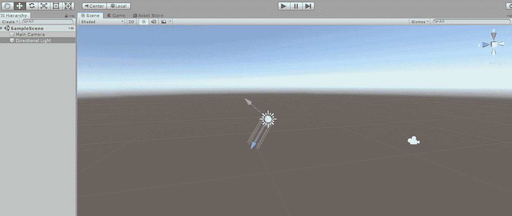

移动 3D 元素

+   **旋转工具**：当选择此按钮时，您可以通过拖动相应的圆圈在三个轴上旋转场景中的对象：


旋转 3D 元素

+   **缩放工具**：当选择此按钮时，您可以通过拖动相应的箭头（以小立方体结束）在三个轴上缩放场景中的对象。您还可以拖动中心立方体以在三个轴上均匀缩放对象：

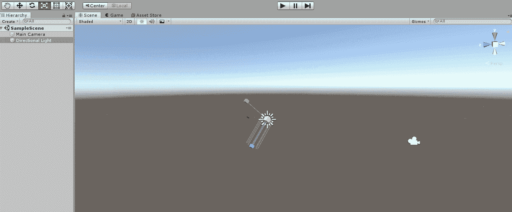

缩放 3D 元素

+   **矩形工具**：我们之前看到的工具被认为是用来操作 3D 模型的。然而，矩形工具专门用于场景中的**用户界面（UI**）元素，并且它在二维空间中工作。在以下屏幕截图中，我们正在操作一个按钮：

    +   您可以通过拖动来移动 UI 元素：

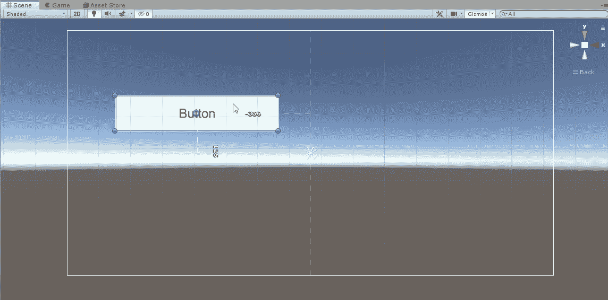

移动 UI 元素

+   +   要旋转一个元素，将鼠标悬停在角落直到出现旋转图标。然后，点击并拖动：

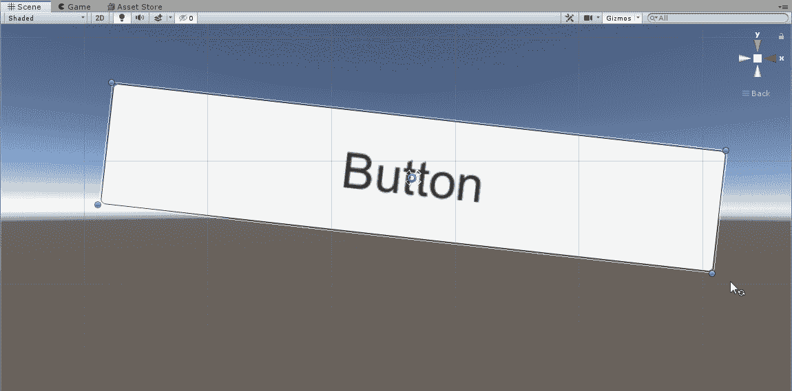

旋转 UI 元素

+   +   您可以通过从角落拖动来缩放元素：

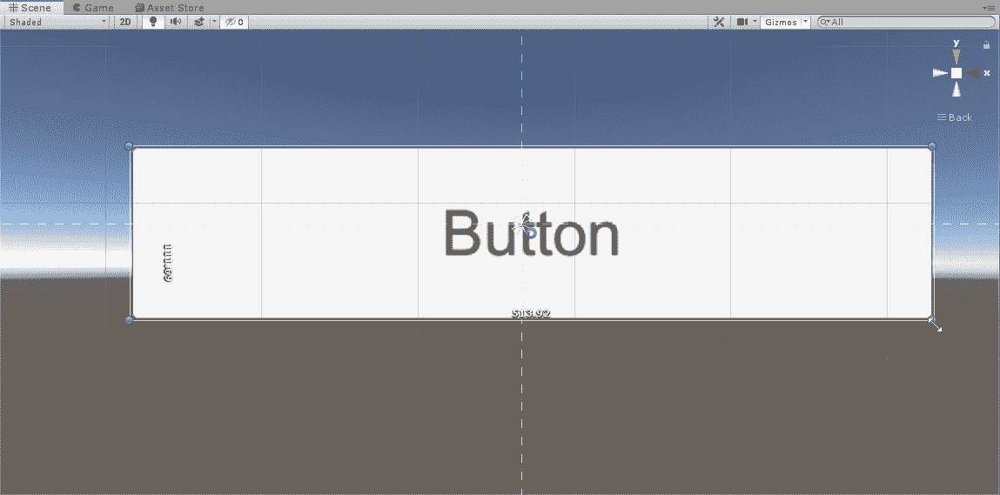

缩放 UI 元素

+   **组合移动、旋转和缩放工具**：此按钮组合了移动、旋转和缩放选项：

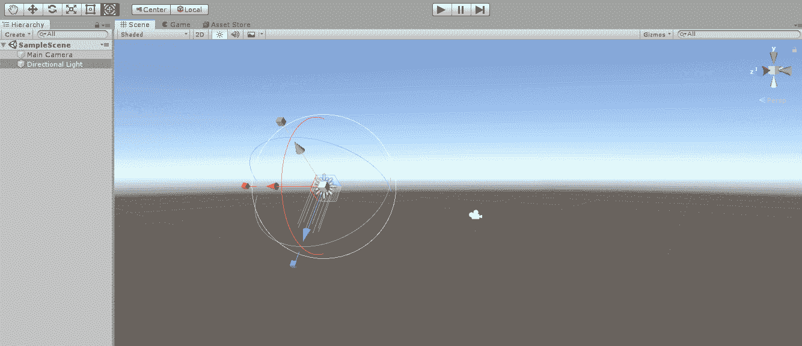

所有引导线一起出现以操纵对象

+   **中心**/**轴点按钮**：当选择中心时，平移、旋转和缩放操作将从对象的中心点执行。在以下截图中，相机和方向光被选中，引导线出现在结果组的中心点。在这种情况下，相机和灯光*将围绕该中心点旋转*：

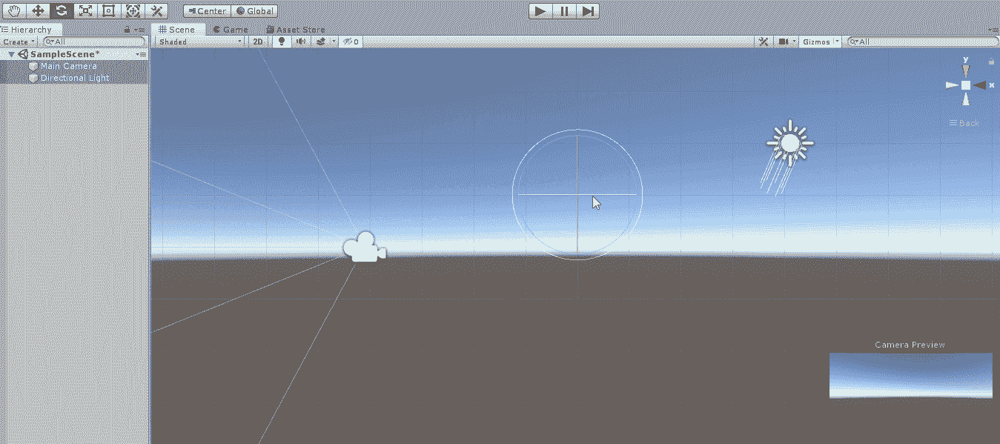

中心选项已激活

当选择轴点时，操作将从每个轴点执行。在这种情况下，相机和灯光*将围绕各自的轴点旋转*：

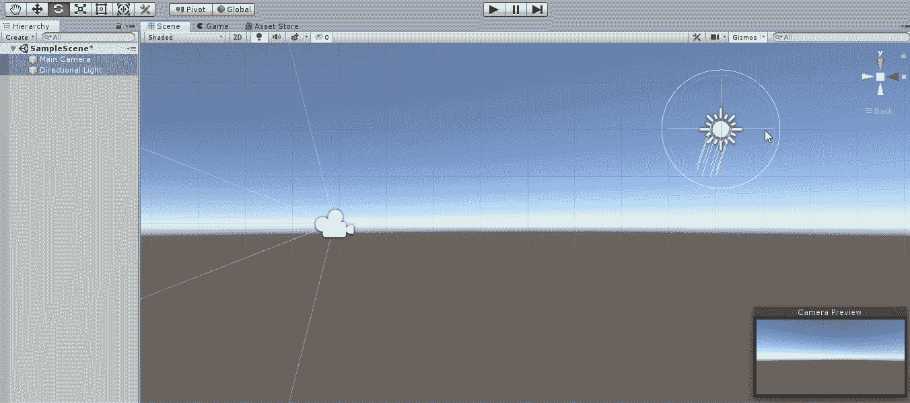

轴点选项已激活

+   **本地**/**全局按钮**：当选择本地时，平移、旋转和缩放操作将相对于所选对象的起点执行。在以下截图中，灯光被旋转，其坐标系也相应旋转：

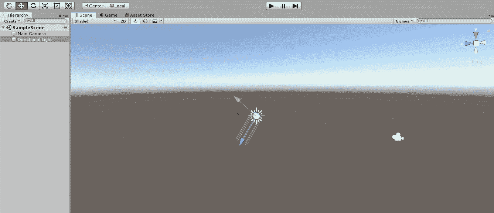

本地选项已选择

当选择全局时，操作将相对于世界原点执行：

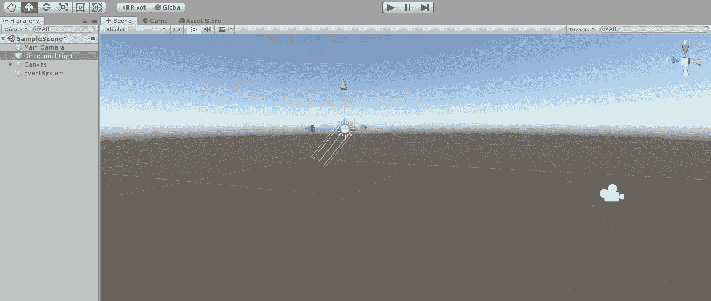

全局选项已选择

在工具栏的中心，我们有播放、暂停和步进按钮，我们可以使用它们来控制游戏视图：


中心位置的按钮

在右侧，我们有几个按钮，我们可以使用它们来访问 Unity 协作服务、Unity 云服务（云图标）、我们的 Unity 账户、图层可见性菜单和布局菜单。我们将在本节后面使用布局菜单来为我们的项目创建自定义布局：


右侧的按钮

现在我们已经看到了工具栏的功能，让我们看看场景视图。

# 场景视图

场景视图是您将与当前场景以及您在上面创建的 3D 世界交互的窗口。在这里，您将拥有构成场景的所有内容，您将能够使用工具栏上的命令直观地操纵它们。使用此视图，我们可以导航整个场景，从所有角度查看它，以便我们可以放置 3D 对象并确保它们处于正确的位置。在此视图中，我们还可以操纵 UI 元素。在这个窗口中，我们想要讨论的主要元素是 Gizmo，它位于窗口的右上角。

**Gizmo**：您可以使用 Gizmo 快速更改视图（顶部、底部、右侧、左侧、前视图、后视图）并在透视和等距（正交）模式之间切换。在更改视图时，Gizmo 中的*x*、*y*和*z*箭头将指向每个轴的方向：

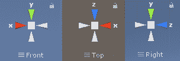

前视图、顶视图和右视图上具有不同箭头的 Gizmo

视图名称左侧的小图标显示它是一个透视或等距（正交）视图，如下面的屏幕截图所示。您可以通过单击小图标在它们之间切换：

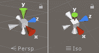

透视和等距（正交）视图允许我们调整场景中的对象

现在，让我们来看看层级窗口以及它是如何工作的。

# 层级窗口

这个窗口是场景视图中元素的分层视图，这些元素通过它们的名称来表示。在顶部，我们始终会有场景，并且我们添加到场景中的所有对象都将悬挂在它上面。在下面的屏幕截图中，我们有不同的元素，其中一些元素（立方体、画布）包含更多的元素。

分层视图使我们能够轻松找到元素及其之间的关系（父子关系），这些关系会影响它们的行为方式。例如，如果我们移动立方体元素，它的子对象 ChildOfCube 将随之一同移动。然而，如果我们只想移动 ChildOfCube 元素，我们会在层级窗口中选择它并移动它，而不会影响其父对象立方体。在上一节中我们解释的*局部/全局*定位方面，子对象的局部位置、旋转和缩放将相对于父对象：

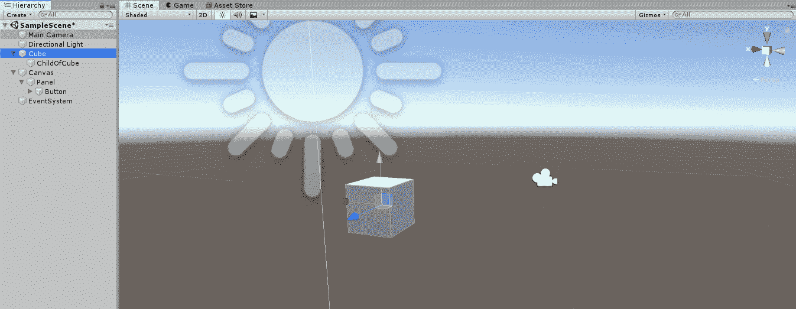

在层级窗口和场景视图中选中的立方体对象

我们还将使用此窗口通过右键单击并选择我们想要添加到场景中的元素来快速添加新元素。

另一方面，可以通过在场景视图中或层级窗口中单击对象来选择场景中的对象。当对象有多个子对象时，后者非常有用，因为我们可以确保我们选择了正确的元素。在场景视图中，它们可能会重叠。

一个小技巧：在层级窗口中双击对象的名称可以使场景缩放到该对象。

场景视图和层级窗口是我们可以使用来操作场景中元素的两个窗口，即我们将构建到我们的设备中的元素。现在，我们将学习当场景中的一个元素被选中时，检查器窗口是如何工作的。

# 检查器窗口

此窗口显示当前选中对象的属性和组件。从这里，你可以编辑、删除和向对象添加新组件。由于场景中的不同对象将具有不同的属性，检查器窗口将相应地改变，以在每个时刻显示对应的信息。此窗口可以在以下屏幕截图中看到：

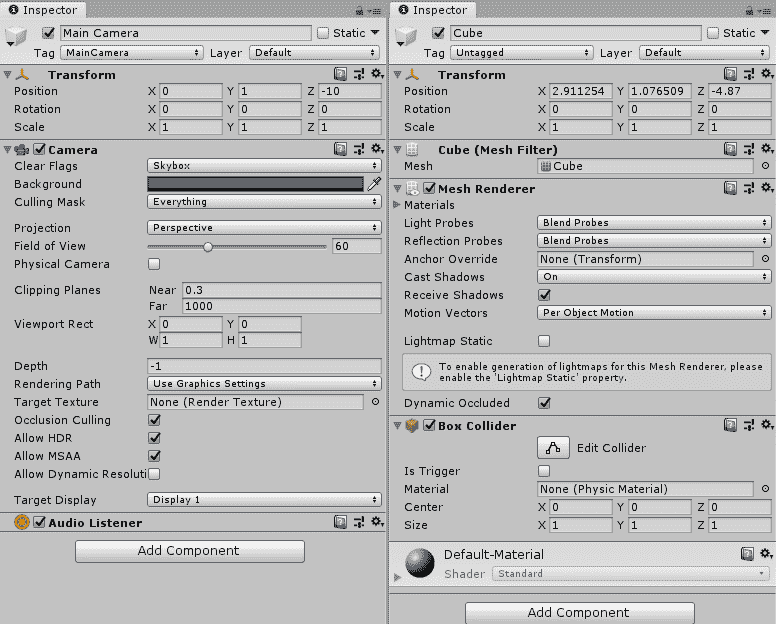

主摄像机和立方体的两个不同的检查器窗口

如前一个屏幕截图所示，场景中的每个元素都将有一个变换组件，以便它可以移动、旋转和缩放场景中的该元素。然而，除了这个之外，图像中的主摄像机和立方体元素没有更多共同的组件。对于摄像机来说，它有一个预期的摄像机组件，而立方体有一个网格、一个渲染器（用于可视化对象）和一个标记该对象物理边界的碰撞器。

检查器窗口中的组件可以被最大化或最小化，这样我们就可以组织视图。这样，如果我们有一个 GameObject 中有许多组件，我们只看到在每一时刻所需的那些。为此，我们可以使用每个组件旁边的小箭头，如以下屏幕截图所示，其中相同的 Main Camera 已将其组件折叠：

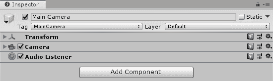

主摄像机及其组件已折叠

现在，让我们看看项目窗口是如何工作的。

# 项目窗口

此窗口显示了项目中所有可用的资产。当你将新资产导入到项目中时，它将出现在此窗口上，从这里，你可以将其拖动到你的场景中。这是一个层次视图，文件按文件夹组织：

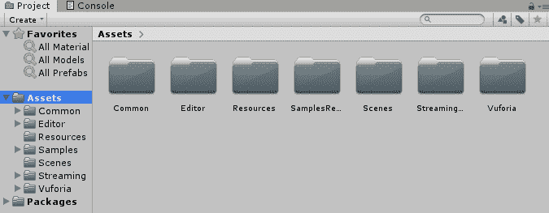

显示资产文件夹中主要文件夹的项目窗口

**重要！** 在构建应用程序时，并非项目窗口中出现的每个资产都会被构建进去。除了一些特殊文件夹，可以在以下位置找到：[`docs.unity3d.com/Manual/SpecialFolders.html`](https://docs.unity3d.com/Manual/SpecialFolders.html)。只有当资产与场景连接时（直接出现在场景上、通过脚本调用等），它们才会被包含在最终的包中。

现在，我们将看看游戏视图，正如我们在本节开头提到的，它位于场景视图旁边的标签中。

# 游戏视图

此窗口显示了场景是如何由你世界中的摄像机（们）渲染的。你可以使用工具栏中的播放、暂停和步进按钮来播放你的场景，并查看发布后的外观：

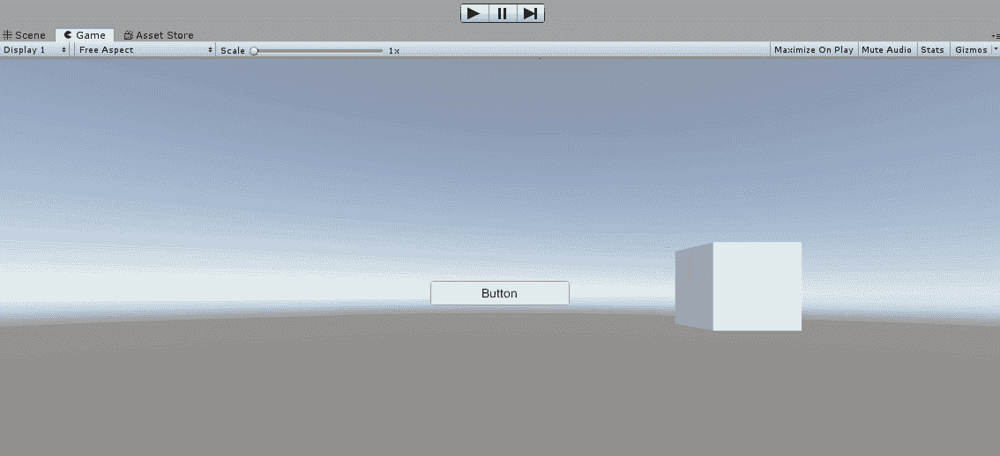

从主摄像机对象的视角看，按钮和立方体对象

**重要！**在播放模式下所做的任何更改都是临时的，并且*将在您再次点击播放按钮退出此模式时消失*。当您想尝试不同的方法（例如，对象旋转或颜色）以选择适合您的方法时，这很有用，但请确保您没有丢失重要的工作，因为您忘记关闭播放模式了！

此窗口旁边的标签是资产商店窗口。让我们看看。

# 资产商店窗口

此窗口连接到 Unity 资产商店，这是开发者和设计师上传他们的资产的地方。您可以从此窗口下载并导入资产商店中的任何资产到您的项目中：

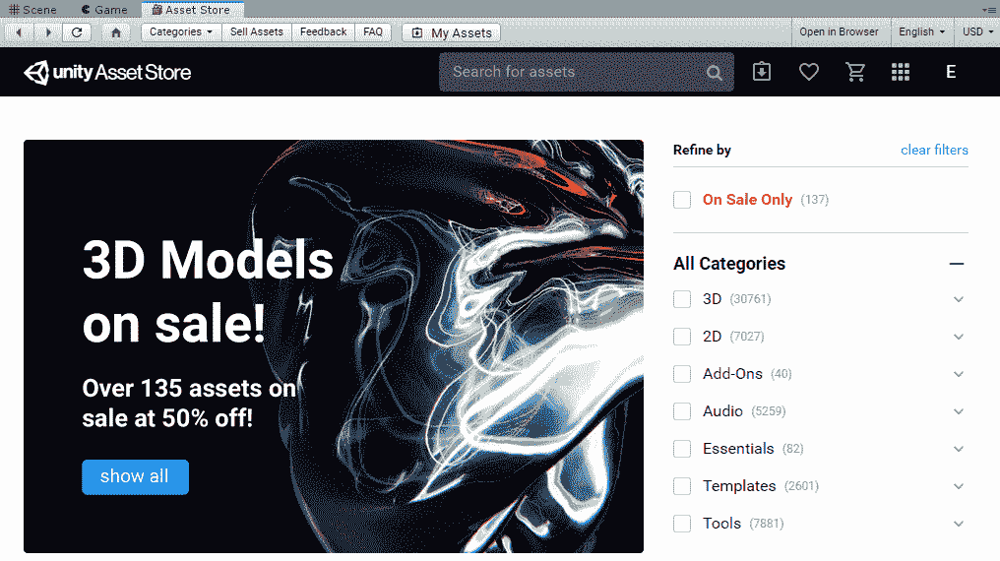

Unity 中的资产商店窗口

资产商店提供免费和付费内容，如 2D 和 3D 模型和场景、音频文件、模板、完整项目等，您可以直接将这些资产下载并导入到您的项目中。所有这些资产都使创建项目的过程更加容易和快速。

最后但同样重要的是，让我们学习控制台窗口的工作原理及其用途。

# 控制台窗口

在这里，您可以找到您项目的日志。此窗口显示有关项目的警告、错误和信息日志，如下面的截图所示。如果您在调试错误代码时遇到困难，Unity 论坛（[`forum.unity.com/`](https://forum.unity.com/））是一个非常有用的工具，您可以搜索类似案例并寻求帮助：

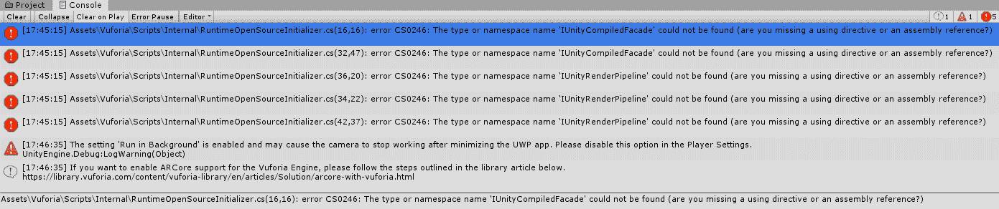

显示不同类型信息、警告消息和错误的控制台窗口

本窗口的主要元素及其功能如下：

+   清除按钮移除所有消息（除了编译错误）。您必须在更改当前场景或播放它之前纠正这些错误。

+   您可以使用折叠功能将相同的消息合并成一条消息行。

+   使用“在播放时清除”来删除您在工具栏上点击播放按钮时产生的所有消息。

+   错误暂停允许在发生错误时暂停场景的执行。

+   使用右侧的三个按钮来显示/隐藏不同类型的消息（信息、警告和错误）。

到目前为止，你应该已经对 Unity 界面的工作方式有了相当的了解。然而，在继续之前，我们将学习如何更改布局配置。根据我们的需求和喜好自定义各种窗口既简单又实用。

# 更改布局

现在我们已经了解了主要窗口及其功能，我们将首先做的是调整这些窗口在屏幕上的布局，以便它们符合我们项目的需求。对于这本书，我们将使用 2 比 3 布局的修改版，这将允许我们同时看到 AR 场景和游戏。然而，一旦你熟悉了 Unity 的使用，你可以自由选择最适合你的布局。

对于修改后的版本，请按照以下步骤操作：

1.  首先，在工具栏右上角的下拉菜单中选择 2 比 3 布局，就在检查器窗口上方：

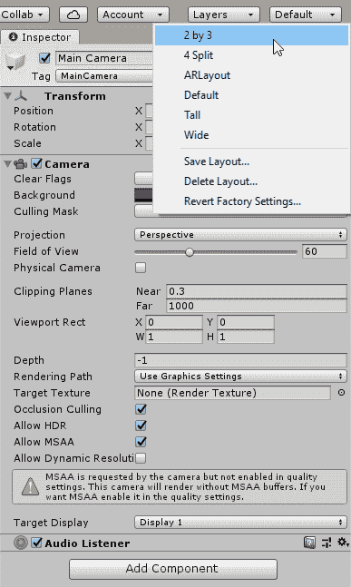

在布局下拉菜单中选择 2 比 3

1.  然后，拖动项目窗口，使其位于层次窗口下方：

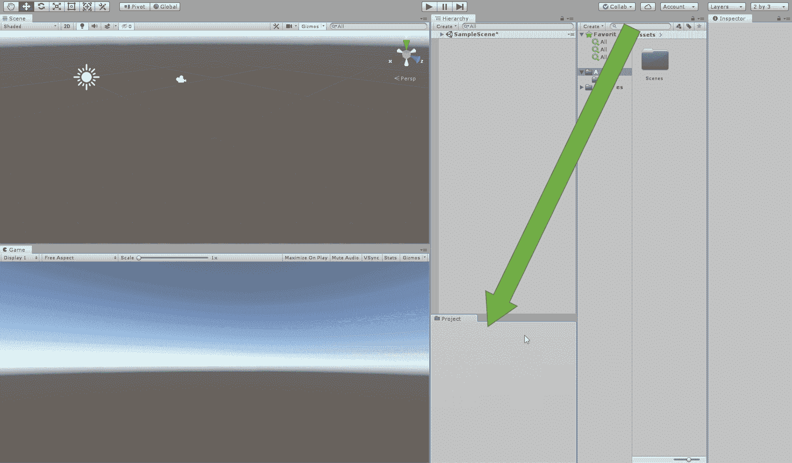

将项目窗口拖动到层次窗口下方

1.  通过将底部的滚动条拖到最左边来选择项目窗口上的列表视图：

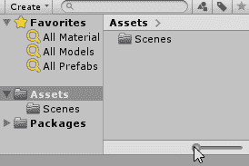

将水平滚动条移到左边

1.  创建一个名为 `1280 x 720` 的新游戏视图纵横比，并插入以下值：宽度：`1280`，高度：`720`：

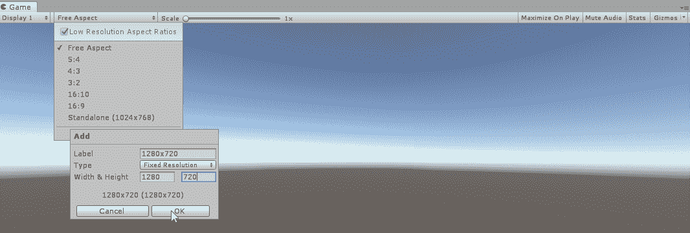

创建新的纵横比

1.  打开控制台窗口，按 *Ctrl* + *Shift* + *C* 或 Window|General|Console，并将其拖动到游戏视图旁边的标签页：

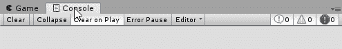

将控制台窗口拖到游戏视图旁边

1.  最后，为了确保每次打开 Unity 时此布局都可用，请转到布局，选择保存布局...，并给它命名：

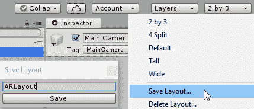

保存创建的布局

现在，我们已经准备好了布局，可以在我们的 AR 项目中使用。到目前为止，你应该已经熟悉了 Unity 提供的不同窗口和工具以及它们的工作方式。在下一节中，我们将查看在 Unity 项目中可以找到的主要元素。

# Unity 的主要元素

在 Unity 中构建的应用程序将由一个项目组成。该项目将包含我们开发应用程序所需的所有必要元素，例如模型、脚本、计划、菜单等等。当你启动 Unity 时，你可以通过指向其根文件夹来打开一个项目。

每个项目包含一个或多个文档，称为**场景**。在 Unity 中创建的项目被组织成场景，其中场景可以是项目的任何部分。当我们谈论应用程序时，场景可以是开始菜单到任何级别或区域。单个场景将包含许多元素，例如用户界面、3D 对象、脚本等。

你可以在 Unity 项目中找到的一些主要元素如下：

+   资产

+   游戏对象

+   组件

+   脚本

+   预制体

首先，我们将查看资产。

# 资产

Unity 将用于创建项目的文件称为**资产**。它们是 Unity 项目中的构建块，可以是图像文件、3D 模型、声音文件、代码文件等形式。Unity 中的资产，如材质、纹理、动画或脚本，可以通过在顶部菜单栏中点击 Assets|Create，或者在项目窗口中的文件夹上右键单击并选择 Create 来在项目中创建。

当我们处理外部资产时，例如从互联网下载的图像或我们设计的 3D 模型，我们可以通过将它们从外部文件夹（例如，从 Windows 资源管理器中的一个文件夹）拖动到项目窗口中的一个文件夹，或者在项目窗口中的文件夹上右键单击并选择 Import New Asset...，将它们添加到项目中。

使用以下方法之一将来自您计算机相册的**两个**图像添加到项目的`Assets`文件夹中（我们现在将使用一个，稍后使用另一个），如图所示：

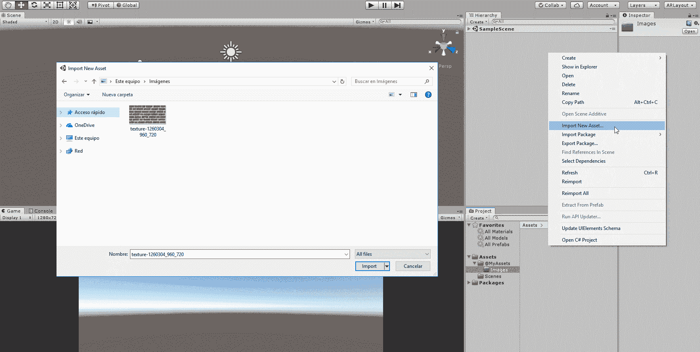

向项目中添加图像

另一种导入资产的方法是通过 Import-Package 导入包含多个资产的整个包。这个选项可以在菜单栏的 Assets 菜单中找到，或者在项目视图中右键单击。

要从项目中删除资产，右键单击它并按 Delete。重要的是要注意，一旦从项目中删除了资产，就无法再恢复它。

现在，让我们看看什么是 GameObject。

# GameObjects

当一个资产在场景中使用时，它就变成了一个 GameObject。可以通过在顶部菜单栏中点击 GameObject，或者在场景视图或层次结构窗口中右键单击来将 GameObject 添加到场景中。

使用以下方法之一将 3D Object|Cube 添加到场景中，并将其移动到主摄像机前面，在游戏视图中可见：

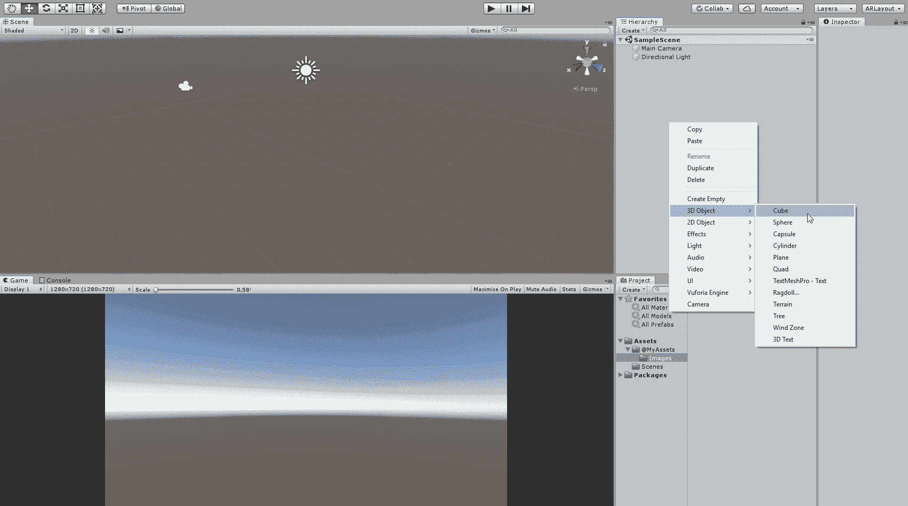

在层次结构窗口中创建一个立方体

现在，让我们谈谈组件。

# 组件

组件有不同的形式，它们负责为 GameObject 添加功能。它们可以用来创建行为（例如，脚本），定义 GameObject 的外观（例如，渲染器），并影响项目中对象功能的其他方面。

所有的 GameObject 都至少包含一个组件。我们从 Transform 组件开始。这个组件负责告诉 Unity 引擎一个对象的位置、旋转和缩放。其他常见的组件元素包括 Renderer 和 Collider。我们将在本书接下来的章节中探讨它们的使用。

通过选择对象然后点击菜单栏上的 Component 菜单，或者在检查器窗口上点击 Add Component 按钮，将组件添加到 GameObject 中。

组件也可以从项目窗口拖动到游戏对象（例如，您可以从项目窗口将脚本拖动到场景视图中的立方体上，脚本将自动出现在检查器窗口中）。

将之前添加到项目窗口中的其中一个图像拖动到场景视图的立方体中，将其转换为纹理：

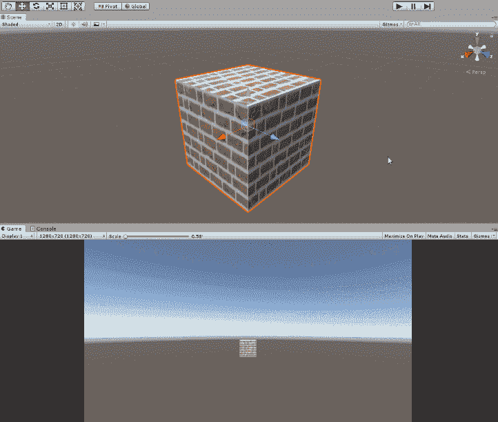

以图像作为纹理的场景中的立方体

现在我们已经了解了项目中的可见元素，让我们来谈谈不可见的元素：脚本。

# 预制体

预制体是具有自定义属性和组件的游戏对象（例如，添加了脚本来使其闪烁的光源），您可以将它们存储在项目窗口中，以便在不同的场景/时刻中重复使用。它们可以在任何时间（包括运行时）创建或复制，并且每当您更改原始预制体的属性时，除非另有定义，否则所有实例都将自动更新。

# 脚本

脚本，实际上是一种组件，是 Unity 不可或缺的一部分，因为它们定义了项目中不同元素的行为。您可以像操作其他组件一样操作（添加/编辑/删除）脚本。

右键单击项目窗口，然后按 Create|C# Script 创建一个新的脚本并给它命名（例如，`CubeHandler.cs`）：

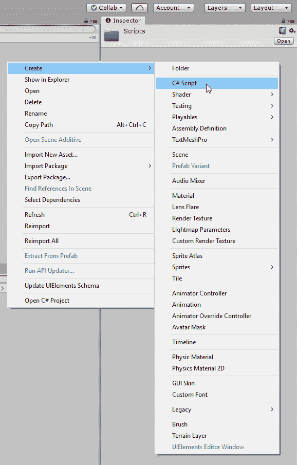

创建一个新的脚本

在检查器窗口中，您会看到新创建的脚本中包含一些默认代码。我们将在下一节中讨论此代码。现在我们已经了解了 Unity 的不同元素，让我们在下一节学习如何编写脚本。

# 脚本编写 – C#中的第一个示例

为了了解 Unity 中脚本的所有潜力，我们将查看上一节中创建的脚本`CubeHandler.cs`。正如其名称所暗示的，我们将向其中添加一些代码来操作场景中的立方体。

双击项目窗口中脚本的名称，在 Visual Studio 中打开它。

如果您在安装 Unity 之前已经在计算机上安装了 Visual Studio，那么在双击脚本时，Unity 可能不会自动检测它。如果是这样，您将不得不转到 Edit|Preferences 并转到外部工具。从那里，选择 Visual Studio `.exe` 文件的路径：

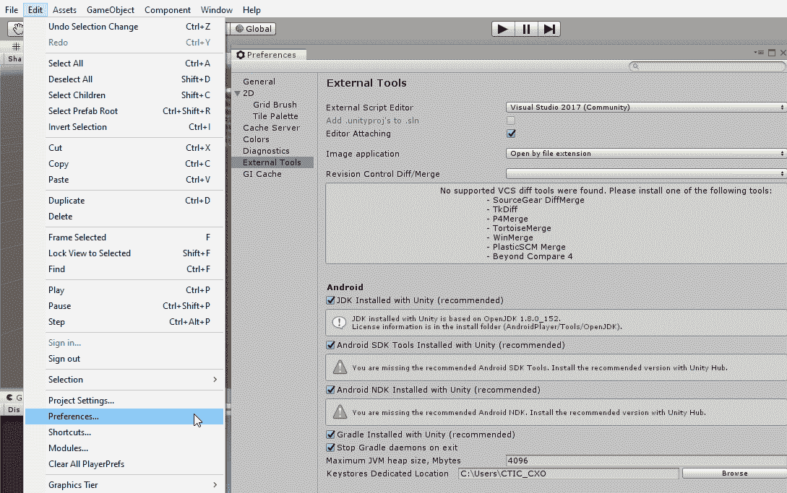

已将 Visual Studio 分配为外部脚本编辑器的首选项窗口

打开脚本后，您将看到以下自动生成的代码：

```cs
using System.Collections;
using System.Collections.Generic;
using UnityEngine;

public class CubeHandler : MonoBehaviour
{
 // Start is called before the first frame update
 void Start()
 {

 }

 // Update is called once per frame
 void Update()
 {

 }
}
```

前三行是调用三个引用。前两个是常用集合，而第三个是我们需要的工作与 Unity 引擎的引用。

然后，你有类声明。类的名称必须与`.cs`脚本相同。默认情况下，通过 Unity 生成的类将继承自`MonoBehaviour`，这允许我们使用以下两个方法：

+   `Start`方法会在 Unity 场景生成后立即自动调用，并在第一帧更新之前。因此，当初始化变量时，这个方法很有用。

+   `Update`方法在每个帧上被调用一次，这意味着该方法内的代码将被重复执行。

让我们尝试添加一些代码来控制场景中的立方体：

1.  首先，我们将在类声明之后、`Start`方法之前声明一个名为`speed`的变量：

```cs
private float speed;
```

1.  然后，我们将在`Start`方法中初始化`speed`的值：

```cs
void Start()
{
    speed = 0.5f;
}
```

1.  最后，我们将在`Update`方法中使用这个变量来告诉立方体以一定的速度旋转：

```cs
void Update()
{
     transform.Rotate(Vector3.up * speed);
}
```

这最后一行访问当前 GameObject 元素的`transform`组件，该组件负责其位置、旋转和缩放。我们告诉`transform`组件，我们想要以我们之前设置的速度在垂直轴（`Vector3.up`）上旋转对象。

1.  仅凭脚本本身不会做任何事情，因为它不知道我们指的是哪个对象的`transform`。为了告诉脚本我们想要操作场景中的哪些对象，请回到 Unity 编辑器并将脚本拖放到立方体上。确保它在检查器窗口中作为其组件之一出现。这样，我们就告诉脚本我们想要旋转的是立方体。完整的代码应该如下所示：

```cs
using System.Collections;
using System.Collections.Generic;
using UnityEngine;

public class CubeHandler : MonoBehaviour
{
    private float speed;
    public Texture2D texture;

    // Start is called before the first frame update
    void Start()
    {
        speed = 0.5f;
    }

    // Update is called once per frame
    void Update()
    {
        transform.Rotate(Vector3.up * speed);
    }
}
```

1.  现在，如果你在工具栏上按下播放按钮，游戏视图将显示立方体旋转：

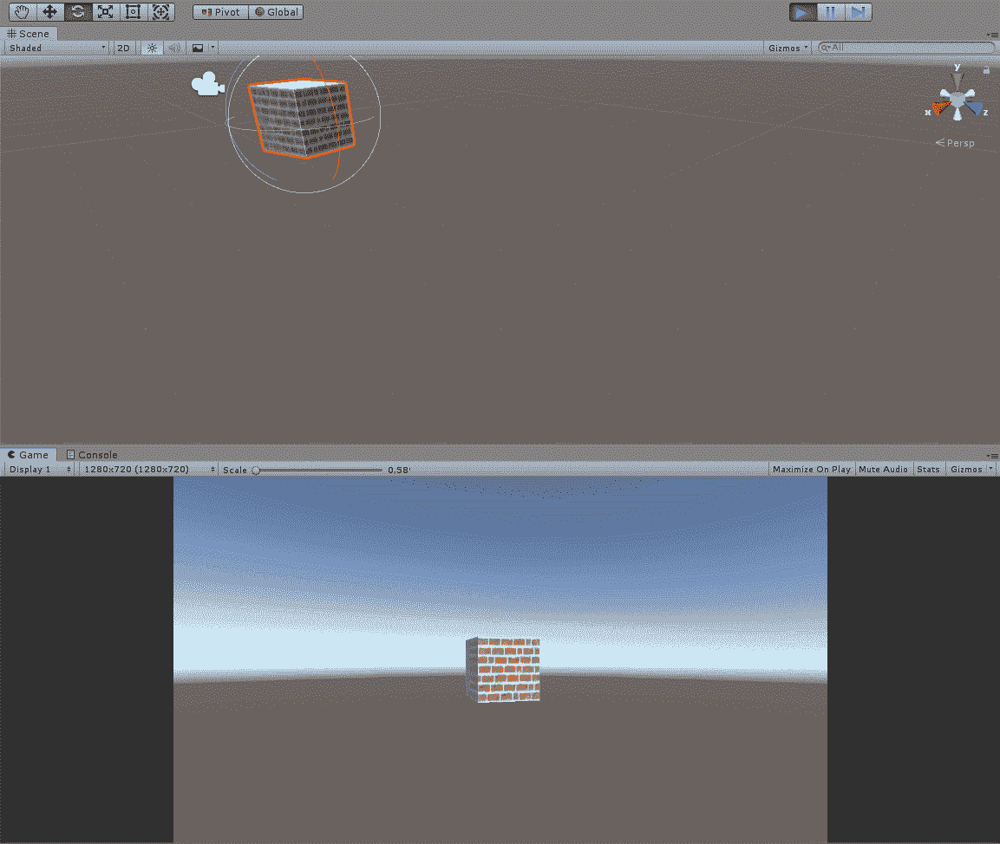

当播放场景时，立方体将开始旋转

1.  再次按播放按钮以停止模拟。尝试更改`speed`的值，看看它如何影响立方体的旋转速度。

`transform`组件有点特殊，因为它有自己的名称。要访问任何其他组件，我们需要使用`GetComponent<ComponentName>()`函数。例如，如果我们想更改立方体的纹理（我们之前拖入的图像），我们可以使用这个函数。负责材质和纹理的组件是`Renderer`。让我们将以下代码包含到我们的脚本中：

1.  首先，在速度定义下方添加以下代码行，它声明了一个`Texture2D`类型的变量：

```cs
public Texture2D texture;
```

1.  现在，将以下两行代码添加到`Update`方法中，该方法位于转换行下方：

```cs
if (Input.GetKeyDown(KeyCode.A))
 GetComponent<Renderer>().material.mainTexture = texture; 
```

在这里，我们说的是，如果系统检测到*A*键被按下，对象的`Renderer`组件的纹理将更改为新的纹理。正如你所见，在这种情况下，我们并没有在`Start`方法中初始化纹理。相反，我们将其设置为`public`，并将在 Unity 内部对其进行赋值。

1.  返回 Unity 编辑器。你将看到在检查器窗口中脚本组件中已添加了一条新行。要将其他图像分配给它，你可以从项目窗口拖动它，或者点击右侧的圆圈并从项目中选择它：

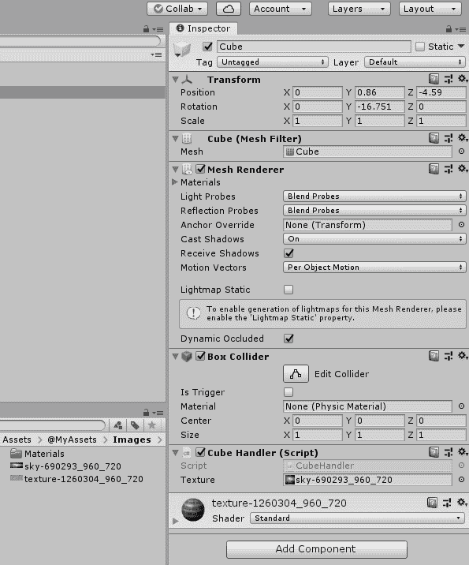

立方体的最后一个组件是带有新行以选择纹理的脚本

1.  现在，再次按下播放。当立方体旋转时，按下*A*键。你将看到立方体的纹理如何变化：

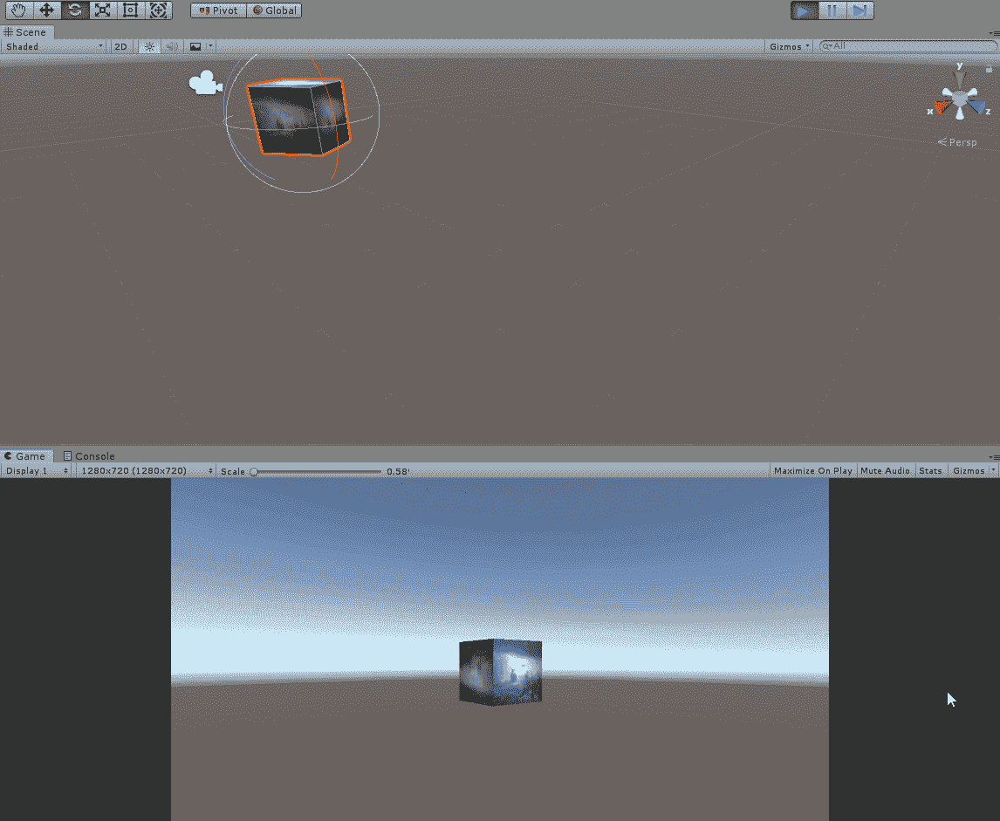

按下键盘上的 A 键以查看立方体的纹理变化

现在，你已经了解了 Unity 项目背后的所有逻辑，并具备了创建更复杂脚本的基礎。在接下来的章节中，我们将使用脚本来实现诸如在 AR 中显示元素或通过用户界面与用户交互等目的。

# 摘要

在本章中，我们学习了如何安装 Unity 以及使其工作的必要模块，以便我们可以构建移动应用程序。我们还介绍了 Unity 界面的设计，其主要窗口，以及如何根据我们的需求自定义它们的组成。我们查看了一些主要窗口、它们的工具以及如何使用它们。然后，我们学习了在 Unity 项目中可以找到的主要元素以及如何创建/导入它们。最后，我们通过几行代码创建了我们第一个脚本，以了解我们如何轻松地控制和更改场景中的对象。

在下一章及随后的章节中，我们将使用本章所学的所有元素来生成功能齐全的 AR 项目。
