# 第三章：使用 ARCore 进行 AR 制造

在本章中，我们将使用 Google 的 ARCore 工具创建我们的第一个 AR 项目。本章的主要目标是向您介绍最新且增长最快的 AR 工具之一，ARCore。到本章结束时，您将掌握在 Android Studio 中轻松创建自己的 ARCore 项目的必要技能。同时，我们展示了 AR 在制造中的一个应用，即原型设计。

到本章结束时，您将创建一个原型查看器应用程序，用户可以在平面上放置工业部件、机器等 3D 设计，在它们周围和内部导航，并使用手指进行操作（移动、旋转和缩放）。有了这些知识，您还将能够改进当前项目，并适应该领域的需求。

本章将涵盖以下主题：

+   使用 AR 进行制造

+   探索 ARCore

+   创建原型 AR 查看器

# 技术要求

本章的技术要求如下：

+   Android Studio（本书中为 Windows 的 3.5.2 版本）。

+   Java 开发工具包（本书中为 1.8.0 版本）。

+   Sceneform 插件（从 Android Studio 内部安装。本书中为 1.13.0 版本）。

+   支持 ARCore 的移动设备（请参阅此处列表：[`developers.google.com/ar/discover/supported-devices`](https://developers.google.com/ar/discover/supported-devices)）。该项目已在三星 Galaxy A5（2017）和 Pocophone F1 上进行了测试。

要安装 Android Studio，Windows 的系统要求如下：

+   最小 RAM 4 GB，建议 8 GB

+   最小可用磁盘空间 2 GB，建议 4 GB

+   最小屏幕分辨率 1280x800

关于其他操作系统的更多详细信息，您可以在本页末尾找到官方要求：[`developer.android.com/studio`](https://developer.android.com/studio)。

本章的代码文件可以在此处找到：[`github.com/PacktPublishing/Enterprise-Augmented-Reality-Projects/tree/master/Chapter03`](https://github.com/PacktPublishing/Enterprise-Augmented-Reality-Projects/tree/master/Chapter03)。

# 使用 AR 进行制造

工业 4.0，也称为第四次工业革命，指的是在工厂内包含数字化和互联工具，涵盖生产过程到维护和培训。尽管这个术语已经存在多年，但在过去几年里，由于**增强现实**（**AR**）、**虚拟现实**（**VR**）、**物联网**（**IoT**）、**大数据分析**（**BDA**）、**增材制造**（**AM**）、**网络物理系统**（**CPS**）和**人工智能**（**AI**）等技术的指数级增长（在质量和数量上），这个工业 4.0 概念已经获得了新的维度。

AR 的视觉组件使其成为用户自然的接口，用户可以通过移动设备或智能眼镜接收有关流程的实时信息，访问远程系统以获取额外数据，并控制流程和机器。

在制造业中，AR 有许多用途，例如原型设计、生产和培训。在本章中，我们将介绍原型设计，特别是 AR 如何通过在真实世界中可视化设计来帮助减少原型设计成本。这允许设计师、工人和潜在客户在三维空间中操纵模型，对其进行缩放，与单个部件交互，甚至一起穿越它们。ARCore 是我们可以用作该目的的 AR 工具之一。

# 探索 ARCore

自 2017 年开始预览，ARCore 的第一个版本于 2018 年 2 月发布，它是谷歌为 Android 和 iOS 创建增强现实应用程序的平台。它利用不同的功能，如运动跟踪，来估计移动设备相对于真实世界的位置和方向，以及环境定位，以找到和跟踪水平表面，如地面、平板电脑或墙壁，以及光估计，以将 3D 元素真实地放置到真实世界中。这些功能的更详细解释可以在[`developers.google.com/ar/discover/concepts`](https://developers.google.com/ar/discover/concepts)找到。针对 Android 7.0 及以上版本，市场上并非所有设备都支持这项技术，尽管自第一个 SDK 版本以来，支持的数量已经大幅增加。您可以通过此处查看当前支持的设备列表：[`developers.google.com/ar/discover/supported-devices`](https://developers.google.com/ar/discover/supported-devices)。

ARCore 应用程序可以在不同的平台上开发，例如 Android Studio、iOS 的 Xcode、Unity3D 和 Unreal Engine。当使用 Android Studio 时，开发者可以将 Sceneform 集成，这是一个 3D 引擎，它可以帮助以比 OpenGL 库更简单的方式集成 3D 环境和模型。我们将在项目中使用这个插件来显示 3D 模型。

当使用 ARCore 开发应用程序时，请确保在您的应用程序中披露：[`developers.google.com/ar/distribute/privacy-requirements`](https://developers.google.com/ar/distribute/privacy-requirements)。

对于这个项目，我们将开发一个原型查看应用程序，该应用程序将展示三种不同的引擎模型。我们将在项目中使用的引擎模型是从[`sketchfab.com/3d-models/rocket-engines-6fba4dbbb9444e99ba68425bcb3a7f70`](https://sketchfab.com/3d-models/rocket-engines-6fba4dbbb9444e99ba68425bcb3a7f70)获取的。

既然我们已经了解了 ARCore 的基础知识，让我们开始开发应用程序。

# 创建原型 AR 查看器

在本节中，我们将开发我们的 AR 查看器以进行原型设计。首先，我们将安装所有必需的软件工具——JDK 和 Android Studio——然后我们将创建我们的 Android 应用程序，学习如何在其中启用和使用 ARCore，以及如何使用 Sceneform 插件来显示 3D 元素。

# 安装 Java 开发工具包 (JDK)

Android Studio 需要我们安装 JDK。它通常位于 `C:\Program Files\Java\jdk_version`。如果您还没有安装，请按照以下步骤操作：

1.  访问 [www.oracle.com](http://www.oracle.com) 并下载最新的 Java SE 开发工具包。

1.  下载完成后，运行安装文件，并让它在其默认文件夹中安装 JDK 和 JRE。

如果在 Android Studio 安装过程中它抱怨找不到 JDK，您可以通过转到开始菜单|计算机|系统属性|高级系统属性，打开高级|环境变量选项卡，并创建一个指向 JDK 文件的 `JAVA_HOME` 系统变量来解决此问题。

# 安装 Android Studio

一旦 JDK 安装完成，我们也将对 Android Studio 进行相同的操作，因为它是我们开发 AR 应用的主要平台：

1.  从 Android 开发者页面下载 Android Studio：[`developer.android.com/studio`](https://developer.android.com/studio)。

1.  使用默认值安装工作室，完成后运行它：

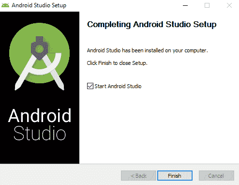

安装完成后启动 Android Studio

1.  安装后首次打开它时，Android Studio 设置向导将启动，以帮助您配置工作室的最后几步并下载 Android SDK 组件：

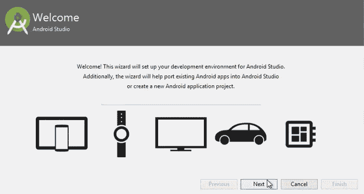

安装 Android Studio 首次运行时会出现设置向导

1.  一旦完成，欢迎窗口将会启动：

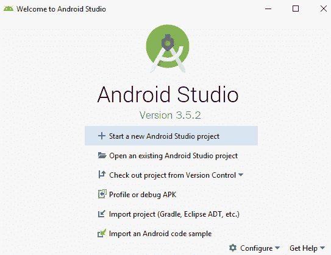

Android Studio 欢迎窗口

现在我们已经准备好了软件，我们可以开始开发我们的应用程序。

# 创建应用程序

现在我们已经安装了软件，我们将开始创建我们的 AR 应用。我们首先要做的是启动一个新的 Android Studio 项目，并向其中添加所需的库。按照以下步骤操作：

1.  点击“开始一个新的 Android Studio 项目”。

1.  选择创建一个空活动：

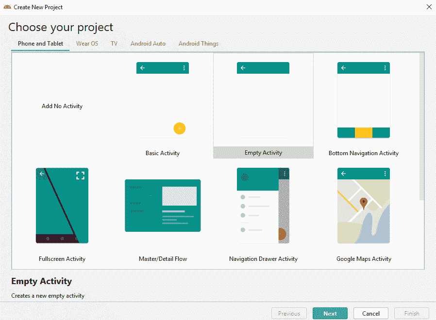

选择活动类型

1.  给项目命名、包名和位置。将最小 API 级别设置为至少 API 24：Android 7.0 (Nougat)，因为它是第一个支持 ARCore 的版本。点击完成按钮以启动项目：


新项目的配置参数

下一步我们需要做的是在我们的项目中启用 ARCore。

# 启用 ARCore

在 AR 项目中，ARCore 可以设置为可选或必需。前者可以在不支持 ARCore 的设备上作为普通应用运行，而后者将只出现在支持 ARCore 的设备的 Google Play 商店中。我们的应用是一个完整的 AR 应用，因此我们将选择第二个选项。为了实现这一点，我们需要修改一些项目文件。让我们开始吧：

1.  在项目窗口中，展开 `app`，然后在 `manifests` 文件夹内部打开 `AndroidManifest.xml` 文件，如下面的截图所示。如果你想在外部打开清单文件，你可以在 `app/src/main` 文件夹中找到该文件：


项目中的 AndroidManifest.xml

1.  在 `<application>` 标签之前添加以下行：

```cs
<uses-permission android:name="android.permission.CAMERA" />
<uses-feature android:name="android.hardware.camera.ar" /> 
```

在这两种情况下（ARCore 可选和必需）第一行都是必要的，因为它提供了打开摄像头的权限。第二行指示了 ARCore 的使用，并确保只有支持 ARCore 的设备才能访问应用。

1.  现在，在 `<application>` 内部添加以下行：

```cs
<application
    ...
    <meta-data android:name="com.google.ar.core" android:value="required" />
</application>
```

这行代码将 ARCore 设置为必需，并在应用安装时（如果尚未安装）从 Google Play 商店下载和安装 ARCore。

1.  打开你的项目 `build.gradle` 文件：

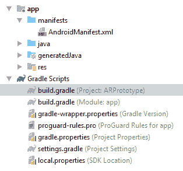

在项目窗口中，找到项目的 build.gradle 文件

1.  确保它包括 Google 的 Maven 仓库（它应该在那里；如果不是，请添加它）：

```cs
allprojects {
    repositories {
        google()
```

1.  打开你的应用 `build.gradle` 文件：

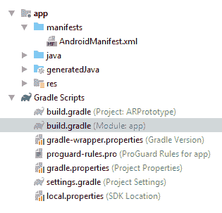

在项目窗口中，找到应用的 build.gradle 文件

1.  现在，将最新的 ARCore 库作为依赖项添加（本书中为 1.13.0）：

```cs
dependencies {
    ...
    implementation 'com.google.ar:core:1.13.0'
    ...
}
```

1.  通过点击屏幕右上角的“立即同步”来同步 Gradle，以便使这些更改生效：

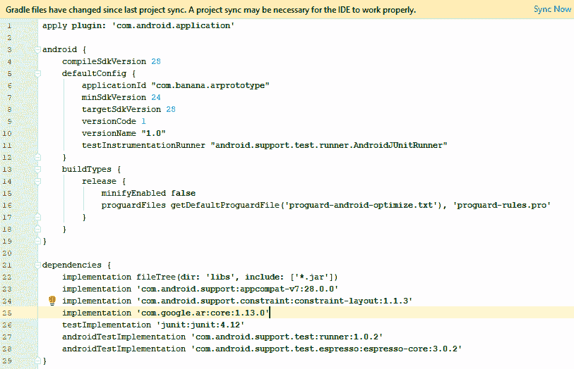

同步项目选项以同步项目

如果你打算创建一个既支持又不需要 AR 的应用，启用 ARCore 的步骤将与这里展示的不同。请参阅 [`developers.google.com/ar/develop/java/enable-arcore`](https://developers.google.com/ar/develop/java/enable-arcore) 了解你需要做出哪些更改。此外，请注意，你将需要检查运行应用的移动设备是否支持 ARCore。你可以通过查看你的代码来完成这项工作。

现在我们已经启用了 ARCore，让我们介绍 Sceneform。

# 将 Sceneform 添加到项目

如本章开头所述，Sceneform 是一个 Android Studio 插件，它将帮助我们以比 OpenGL 更简单、更快捷的方式显示 3D 模型。

Sceneform 还提供了 ARFragment 和其他 UX 资源，这些资源在请求摄像头权限并检查 ARCore 是否已安装和更新后，将自动处理 AR 会话，而无需我们在代码中包含这些验证。

在撰写这本书的时候，Sceneform 工具仍然处于测试版阶段。如果您在按照这些步骤操作时遇到任何问题，请访问他们的 GitHub 页面（[`github.com/google-ar/sceneform-android-sdk`](https://github.com/google-ar/sceneform-android-sdk)）获取更多信息。

要将 Sceneform 导入到您的项目中，请按照以下步骤操作：

1.  打开文件|设置。

1.  在插件选项卡中，搜索 `Google Sceneform Tools (Beta)`。在撰写这本书的时候，当前版本是 v1.13.0：

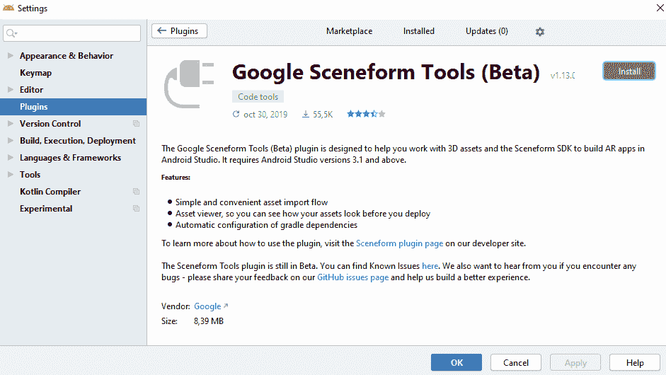

Google Sceneform Tools 插件

1.  安装它，然后点击右上角的“重启 IDE”以激活更改：

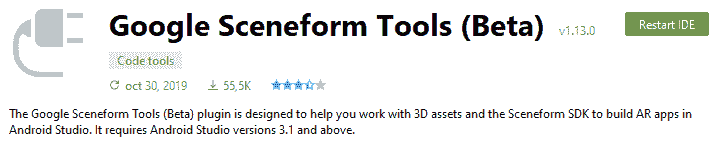

重启 IDE 按钮

1.  安装完成后，打开您的应用程序的 `build.gradle` 文件，并在 `android` 部分内添加以下编译选项。如果我们不这样做，当构建我们的 `ModelRenderable` 时，将出现错误。这仅在 `minSdkVersion < 26` 且我们在创建项目时将最小值设置为 `24`（Android 7.0）时才是必要的：

```cs
android {
    ...
    compileOptions {
        sourceCompatibility JavaVersion.VERSION_1_8
        targetCompatibility JavaVersion.VERSION_1_8
    }
}
```

1.  在同一文件中，在 `dependencies` 括号内，我们将添加以下 `implementation` 行以将 Sceneform 包含到我们的项目中：

```cs
dependencies {
    ...
    implementation 'com.google.ar.sceneform.ux:sceneform-ux:1.13.0'
    ...
}
```

1.  您的应用程序的 `build.gradle` 文件现在应该看起来像这样：

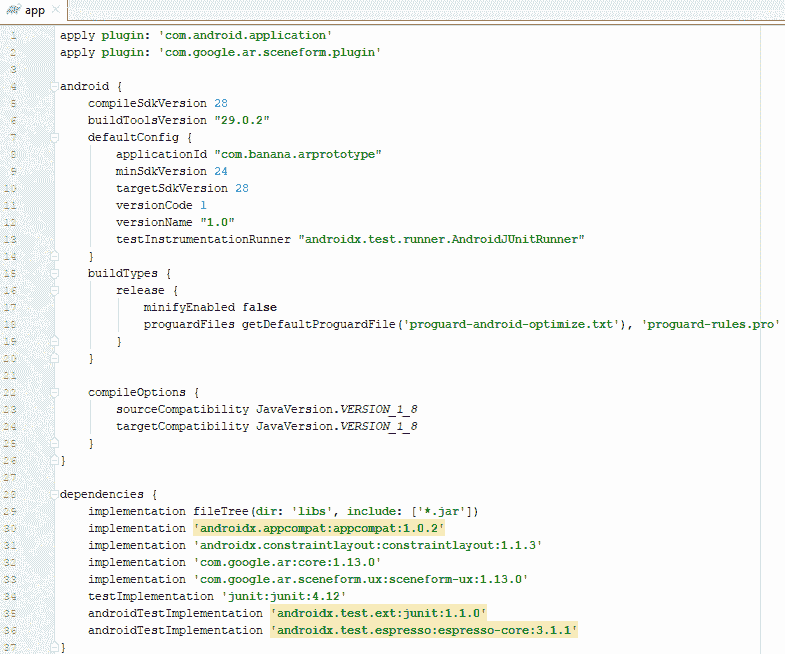

添加了新行的应用程序的 `build.gradle` 文件

1.  现在，为了在您的应用程序中使用 ARFragment，请打开 `res/layout` 文件夹中的 `activity_main.xml` 文件，并在视图底部的选项卡中选择文本模式。通过这样做，您可以修改文本中的元素：

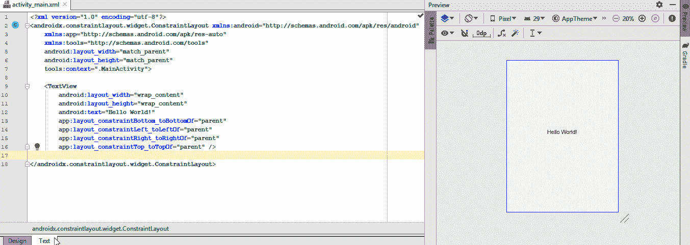

`activity_main.xml` 文件中的文本视图和视觉预览

1.  删除 `TextView` 块并添加以下内容：

```cs
<fragment android:name="com.google.ar.sceneform.ux.ArFragment"
    android:id="@+id/ux_fragment"
    android:layout_width="match_parent"
    android:layout_height="match_parent" />
```

Sceneform 现在已准备好使用。让我们将我们的 3D 模型导入到项目中。

# 将 3D 模型添加到项目中

3D 模型，也称为可渲染对象，可以通过不同的方式添加：

+   通过基本形状（球体、立方体等）和材料创建，并通过编程组合以生成更复杂的对象。

+   通过标准 Android 小部件（ViewRenderable）创建。它们在场景中以交互式平面卡片的形式渲染。

+   从其他程序作为 3D 资产导入。支持的格式包括 OBJ、FBX 和 glTF（以及 glb）。动画仅在 FBX 中受支持。

我们将使用第一个选项，并使用 Sceneform 导入一个 `.obj` 文件。

要将模型导入到我们的项目中，我们必须创建一个外部文件夹来包含模型（这个文件夹不会被编译到最终应用程序中），然后使用 Sceneform 将模型导入到项目中。按照以下步骤操作：

1.  通过在项目的 `app` 文件夹上右键单击并选择 New|Sample Data Directory 创建一个 `sampledata` 文件夹。

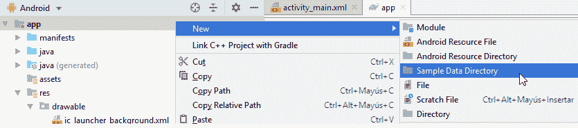

将样本数据目录添加到项目中

如果`sampledata`文件夹没有自动出现在您的项目中，您也可以从文件资源管理器中手动创建它，在项目的`app`文件夹内。命名为`sampledata`，它将在 Android Studio 中显示。

1.  从为该项目提供的资源包中，将`engine`文件夹复制到`sampledata`文件夹中：

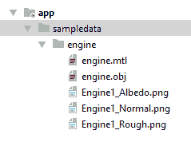

包含模型及其资源的新的引擎文件夹

现在，我们将通过 Sceneform 导入.obj 文件，将 3D 模型作为资产包含进来。

1.  右键点击`engine.obj`文件并选择导入 Sceneform 资产：

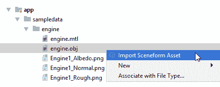

为我们的.obj 文件选择导入 Sceneform 资产

1.  保持默认值不变。这将创建一个位于`sampledata`中的 Sceneform 资产（`.sfa`）文件和一个位于`assets`文件夹中的 Sceneform 二进制资产（`.sfb`）：

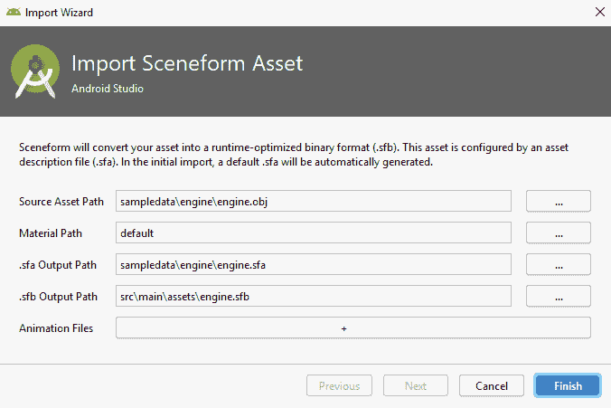

模型的默认导入值

在导入过程中，以下行将自动添加到您的应用`build.gradle`文件的末尾，由 Sceneform 完成：

```cs
sceneform.asset('sampledata/engine/engine.obj',
        'default',
        'sampledata/engine/engine.sfa',
        'src/main/assets/engine')
```

1.  保持 Gradle 同步。当它完成后，将打开两个窗口：一个包含模型描述和 3D 预览的文本文件：

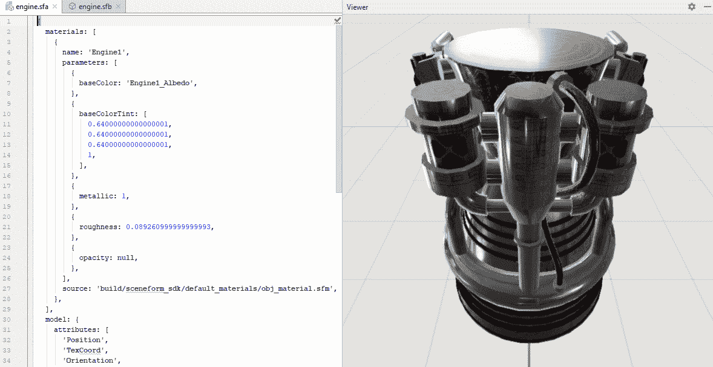

我们新导入的模型的文本视图和预览

最后一步是将所有元素合并到 AR 场景中。

# 构建 AR 场景

现在我们已经启用了 ARCore 和 Sceneform，并将 3D 模型包含在项目中，让我们添加代码，当检测到平面表面并且用户点击屏幕时，模型将出现在屏幕上。让我们开始吧：

1.  从`app/java/com.banana.arprototype`打开您的`MainActivity.java`文件并添加以下导入：

```cs
import android.net.Uri;
import android.view.Gravity;
import android.view.MotionEvent;
import android.widget.Toast;
import com.google.ar.core.Anchor;
import com.google.ar.core.HitResult;
import com.google.ar.core.Plane;
import com.google.ar.sceneform.AnchorNode;
import com.google.ar.sceneform.rendering.ModelRenderable;
import com.google.ar.sceneform.ux.ArFragment;
import com.google.ar.sceneform.ux.TransformableNode;
```

1.  在我们的类中，创建以下变量以控制 AR 场景和 3D 模型：

```cs
private ArFragment arFragment;
private ModelRenderable modelRenderable;
```

1.  现在，在`OnCreate()`方法中，添加`ARFragment`的初始化：

```cs
protected void onCreate(Bundle savedInstanceState) {
    ...
    arFragment = (ArFragment) getSupportFragmentManager().findFragmentById(R.id.ux_fragment);
```

1.  仍然在`OnCreate()`方法中，使用`ModelRenderable`在场景中构建模型，如下代码所示：

```cs
ModelRenderable.builder()
        .setSource(this, Uri.parse("engine.sfb"))
        .build()
        .thenAccept(renderable -> modelRenderable = renderable)
        .exceptionally(
                throwable -> {
                    Toast toast = Toast.makeText(this, "Unable to 
                    load the model", Toast.LENGTH_LONG);
                    toast.setGravity(Gravity.CENTER, 0, 0);
                    toast.show();
                    return null;
                });
```

在这里，我们使用`Uri.parse`从`assets`文件夹中调用模型。如果无法加载它，将会显示错误信息。

1.  最后，仍然在`OnCreate()`方法中，当检测到平面表面后用户点击屏幕时，我们将放置模型：

```cs
arFragment.setOnTapArPlaneListener(
 (HitResult hitResult, Plane plane, MotionEvent motionEvent) -> {
 if (modelRenderable == null) 
 return;

 Anchor anchor = hitResult.createAnchor();
 AnchorNode anchorNode = new AnchorNode(anchor);
 anchorNode.setParent(arFragment.getArSceneView().getScene());

 TransformableNode model = new TransformableNode(arFragment.getTransformationSystem());
 model.setParent(anchorNode);
 model.setRenderable(modelRenderable);
 model.select();
 });
```

在这里，当用户点击一个平面并且模型可渲染已成功加载时，将创建一个锚点以保持模型的位置。然后，创建一个新的模型节点并将其附加到它上。

1.  现在，您可以在 Android 模拟器或实际设备上运行该应用。要在模拟器中运行它，设备必须满足一些要求，并且您必须手动从 Play Store 在该设备上下载 ARCore（请参阅[`developers.google.com/ar/develop/java/quickstart`](https://developers.google.com/ar/develop/java/quickstart)中的“准备您的设备或模拟器”部分）。在这里，我们将通过点击播放图标并选择我们的连接设备来直接在我们的设备上运行该应用：

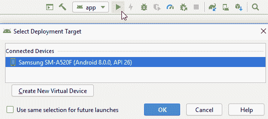

在物理设备上运行应用

1.  这样，应用就会安装在移动设备上。正如我们之前提到的，第一次运行应用时，它会检查是否已安装最新的 ARCore 版本：


ARCore 正在检查 ARCore 的最新版本

1.  您必须通过 Google Play 安装它：

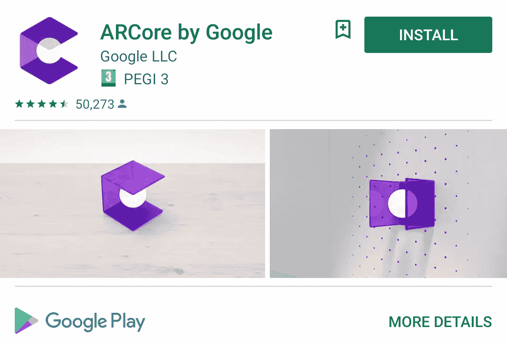

安装 ARCore 应用

1.  一旦完成这个初始步骤，您将能够完成应用的启动。移动手机/平板电脑，直到检测到平坦表面：


白色圆点形成我们可以放置 3D 对象的平面表面

1.  在屏幕上轻触以锚定您的模型：

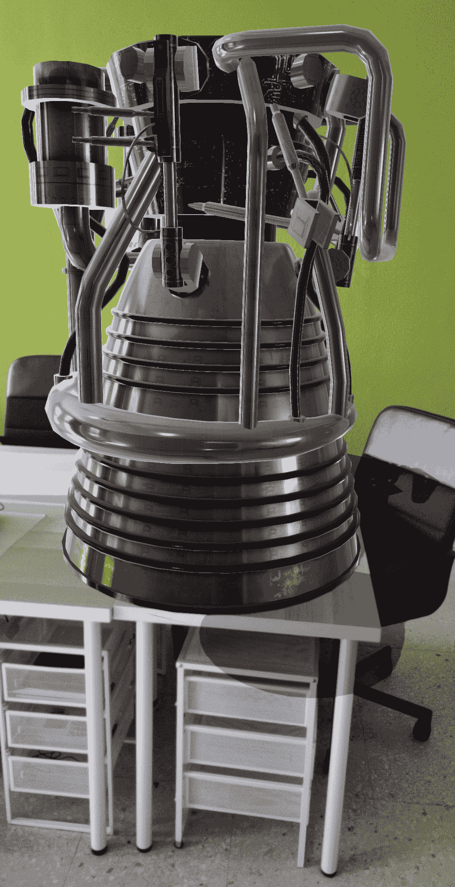

引擎将出现在相机前方

1.  您还可以在移动模型的同时用手指调整模型的大小、旋转和移动，以便从不同的角度观察它。如果您再次点击，将出现一个新的引擎：

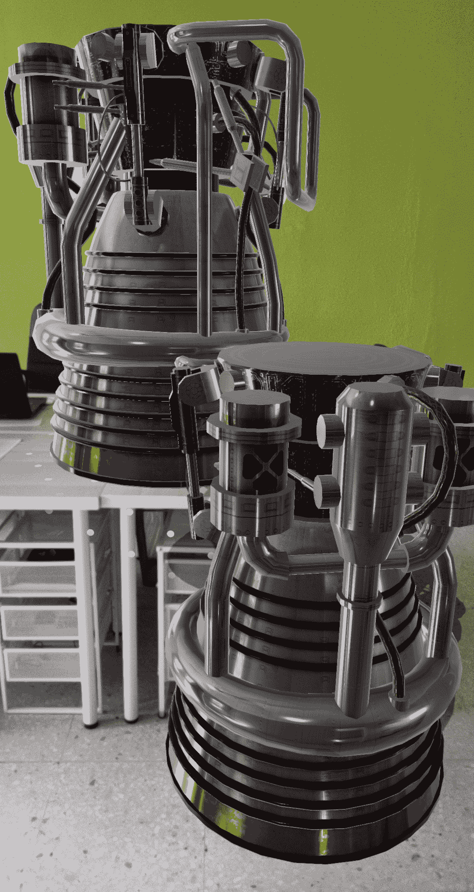

多次点击会导致多个实例

在应用中玩耍并熟悉使用它。您会看到，根据设备的容量，平面表面的识别速度会更快或更慢。您还会看到，如果您旋转设备（纵向/横向），模型将消失，因为锚点丢失。因此，现在我们已经有了基本设置，我们将对应用进行一些更改以改进整体性能，并给用户添加更多模型到当前场景的选项。

# 改进基本应用

一旦我们准备好了基本应用，我们可以做一些事情来改进应用的整体工作：

+   将屏幕方向设置为固定。如果我们将其留在自动旋转模式下，旋转屏幕将导致手机丢失锚点，模型将从屏幕上消失。

+   到目前为止，我们已经看到，对于每一次屏幕点击，都会出现一个新的模型。由于我们使用该应用进行原型设计，我们的想法是只显示一个模型。

+   我们还将更改模型的旋转和大小，以便它在场景中显示得更好。

让我们修改代码以添加这些功能。为此，请按照以下步骤操作：

1.  通过在`AndroidManifest.xml`中的`<application>`和`<activity>`内添加代码来强制屏幕方向为纵向模式：

```cs
<activity android:name=".MainActivity" android:screenOrientation="portrait">
```

这样，屏幕将始终保持在纵向模式，不会自动旋转并丢失锚点，即使用户不小心旋转了手机。

1.  如果你使用平板电脑或更喜欢在横幅模式下查看场景，将其更改为以下内容：

```cs
<activity android:name=".MainActivity" android:screenOrientation="landscape">
```

1.  为了在屏幕上每次点击只显示一个模型，打开 `MainActivity.java` 并在 `ArFragment` 和 `ModelRenderable` 变量之后创建以下变量：

```cs
private Anchor anchor;
private AnchorNode anchorNode;
private TransformableNode model;
```

1.  然后，在 `setOnTapArPlaneListener()` 内部，在 `modelRenderable = null` 检查之后和创建新锚点之前添加以下行，以便释放上一个锚点：

```cs
protected void onCreate(Bundle savedInstanceState) {
    ...
    arFragment.setOnTapArPlaneListener(
            (HitResult hitResult, Plane plane, MotionEvent motionEvent) -> {
                if (modelRenderable == null)
                    return;

                //Remove previous anchor
                if (anchor != null)
                {
                    arFragment.getArSceneView().getScene().removeChild(anchorNode);
                    anchor.detach();
                    anchorNode.setParent(null);
                    anchorNode = null;
                }
```

这样，当用户在屏幕的不同位置点击时，模型将 *移动* 到下一个位置，而不是在每个位置都重复出现。

1.  现在，从下面的行中删除 `Anchor`、`AnchorNode` 和 `TransformableNode` 的定义部分，以便它们引用全局变量：

```cs
anchor = hitResult.createAnchor();
anchorNode = new AnchorNode(anchor);
...
model = new TransformableNode(arFragment.getTransformationSystem());
```

1.  最后，为了旋转和缩放模型，首先将以下导入添加到 `MainActivity.java` 文件中：

```cs
import com.google.ar.sceneform.math.Quaternion;
import com.google.ar.sceneform.math.Vector3;
```

1.  在 `arFragment.setOnTapArPlaneListener()` 方法内部，在 `setParent()` 之前添加以下代码：

```cs
model.setLocalScale(new Vector3(0.55f, 0.55f, 0.55f));
model.setLocalRotation(Quaternion.eulerAngles(new Vector3(-90,45,0)));
```

这样，模型将出现在一侧，以便我们可以看到其内部。这可以在以下图片中看到：

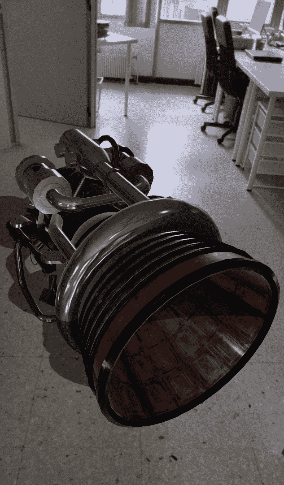

旋转状态的引擎

现在我们已经改进了基础知识，让我们添加两个更多原型和一个简单的用户界面，这样我们就可以在它们之间切换。按照以下步骤操作：

1.  从本项目的 `resources` 文件夹中，将 `engine2` 和 `engine3` 文件夹复制到 `sampledata` 文件夹中。

1.  右键单击每个 `.obj` 文件，并选择导入 Sceneform 资产以创建 `.sfa` 和 `.sfb` 文件。现在，你的 `sampledata` 文件夹应该看起来像这样：

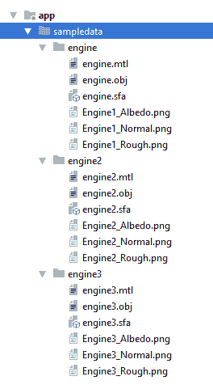

包含新模型的 sampledata 文件夹

你的 `assets` 文件夹应该包含模型的三个二进制文件：

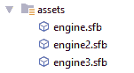

包含三个二进制文件的资源文件夹

1.  从本项目的 `resources` 文件夹中，将每个引擎对应的三个图像复制到 `res`|`drawable` 文件夹中：

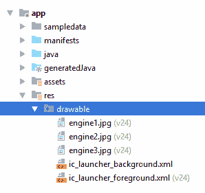

包含新图像的 res|drawable 文件夹

1.  以文本模式打开位于 res|layout 的 `activity_main.xml` 文件，并添加以下代码：

```cs
<LinearLayout
    android:orientation="horizontal"
    android:paddingLeft="4dp"
    android:paddingTop="15dp"
    android:paddingRight="4dp"
    android:paddingBottom="1dp"
    android:layout_width="match_parent"
    android:layout_height="wrap_content"
    app:layout_constraintBottom_toBottomOf="@+id/ux_fragment">
```

在这里，我们使用 `layout_constraintBottom_toBottomOf` 将其锚定到屏幕底部。

1.  如果你处于横幅模式，你可能希望将按钮定位在屏幕的右侧，以便有更多空间进行操作。对前面的代码进行以下更改：

```cs
<LinearLayout
    android:orientation="vertical"
    ...
    android:layout_width="wrap_content"
    android:layout_height="match_parent"
    app:layout_constraintRight_toRightOf="@+id/ux_fragment">
```

1.  现在，添加三个按钮：

```cs
<ImageButton
    android:id="@+id/engine1_button"
    android:layout_width="wrap_content"
 android:layout_height="wrap_content"
 android:layout_margin="10dp"
    android:src="img/engine1"
    android:background="#7cc53a"
    android:layout_weight="1.0"/>

<ImageButton
    android:id="@+id/engine2_button"
    android:layout_width="wrap_content"
    android:layout_height="wrap_content"
    android:layout_margin="10dp"
    android:src="img/engine2"
    android:background="#40000000"
    android:layout_weight="1.0" />

<ImageButton
    android:id="@+id/engine3_button"
    android:layout_width="wrap_content"
    android:layout_height="wrap_content"
    android:layout_margin="10dp"
    android:src="img/engine3"
    android:background="#40000000"
    android:layout_weight="1.0" />
```

第一个按钮有绿色背景（选中），而其他两个有半透明背景。每个按钮都有其对应的 `res`|`drawable` 中的图片。

1.  最后，添加 `LinearLayout` 的关闭标签：

```cs
</LinearLayout>
```

1.  预览应该看起来类似于以下：

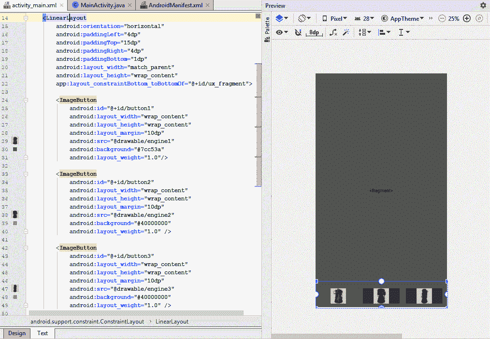

竖屏模式下，左侧是 activity_main.xml 文件的代码，右侧是预览

1.  默认情况下，预览处于竖屏模式。要将其更改为横屏，请点击旋转的手机图标并选择横屏：

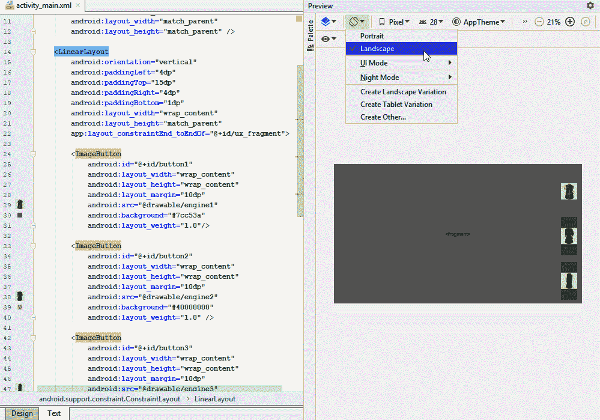

竖屏模式下，左侧是 activity_main.xml 文件的代码，右侧是预览

1.  再次打开`MainActivity.java`文件并添加以下库：

```cs
import android.widget.ImageButton;
import android.view.View;
```

1.  在前面的代码下方添加三个新的`modelRenderables`：

```cs
private ModelRenderable modelRenderable2;
private ModelRenderable modelRenderable3;
private ModelRenderable currentRenderable;
```

我们将使用`currentRenderable`来找出每一刻哪个可渲染对象是活动的。

1.  现在，在变量的末尾添加三个新的图像按钮：

```cs
private ImageButton button1;
private ImageButton button2;
private ImageButton button3;
```

1.  将`ModelRenderable.builder()`复制并粘贴两次以构建两个新的模型。

1.  将它们的`Uri.parse`调用分别更改为`engine2.sfb`和`engine3.sfb`。

1.  在`.thenAccept`调用中，将`renderables`的名称更改为相应的名称。生成的代码应如下所示：

```cs
ModelRenderable.builder()
        .setSource(this, Uri.parse("engine2.sfb"))
        .build()
        .thenAccept(renderable -> modelRenderable2 = renderable)
        .exceptionally(
                throwable -> {
                    Toast toast = Toast.makeText(this, "Unable to load andy renderable", Toast.LENGTH_LONG);
                    toast.setGravity(Gravity.CENTER, 0, 0);
                    toast.show();
                    return null;
                });

ModelRenderable.builder()
        .setSource(this, Uri.parse("engine3.sfb"))
        .build()
        .thenAccept(renderable -> modelRenderable3 = renderable)
        .exceptionally(
                throwable -> {
                    Toast toast = Toast.makeText(this, "Unable to load andy renderable", Toast.LENGTH_LONG);
                    toast.setGravity(Gravity.CENTER, 0, 0);
                    toast.show();
                    return null;
                });
```

1.  在第一个`ModelRenderable.builder()`中，修改`.thenAccept`调用：

```cs
.thenAccept(renderable -> currentRenderable = modelRenderable = renderable)
```

在这里，我们将`currentRenderable`赋值给第一个`renderable`。这样，屏幕上最初出现的模型将是第一个引擎（记住我们已将第一个按钮突出显示为选中的按钮）。

1.  最后，在`setOnTapArListener()`方法中，将`modelRenderable`更改为`currentRenderable`：

```cs
if (currentRenderable == null)
    return;
...
model.setRenderable(currentRenderable);
```

1.  要添加按钮的活动，我们将使我们的`MainActivity`实现`OnClickListener`：

```cs
public class MainActivity extends AppCompatActivity implements View.OnClickListener
```

1.  这样，我们可以在`onCreate()`方法的底部简化按钮的初始化，如下所示：

```cs
button1 = findViewById(R.id.engine1_button);
button2 = findViewById(R.id.engine2_button);
button3 = findViewById(R.id.engine3_button);

button1.setOnClickListener(this);
button2.setOnClickListener(this);
button3.setOnClickListener(this);
```

前三条线初始化我们的按钮，接下来的三条线在用户点击时进行调用（所有三个情况下的调用相同）。

1.  要接收这些点击，创建`onClick()`方法：

```cs
@Override
public void onClick(View view)
{
    switch (view.getId()) {
        case R.id.engine1_button:
            currentRenderable = modelRenderable;
            button1.setBackgroundColor(0xFFA4FF50);
            button2.setBackgroundColor(0x40000000);
            button3.setBackgroundColor(0x40000000);
            break;
        case R.id.engine2_button:
            currentRenderable = modelRenderable2;
            button1.setBackgroundColor(0x40000000);
            button2.setBackgroundColor(0xFFA4FF50);
            button3.setBackgroundColor(0x40000000);
            break;
        case R.id.engine3_button:
            currentRenderable = modelRenderable3;
            button1.setBackgroundColor(0x40000000);
            button2.setBackgroundColor(0x40000000);
            button3.setBackgroundColor(0xFFA4FF50);
            break;
    }
    model.setRenderable(currentRenderable);
}
```

此方法将在`onCreate()`之后根据哪个按钮被按下，将不同的`modelRenderable`分配给`currentRenderable`并突出显示其对应的按钮。最后一行将当前可见的模型切换到新选中的模型。

1.  运行应用并尝试三个不同的引擎。只需选择一个引擎并将其放置在地板或桌子上。以下图片显示了地板上的黄色引擎：

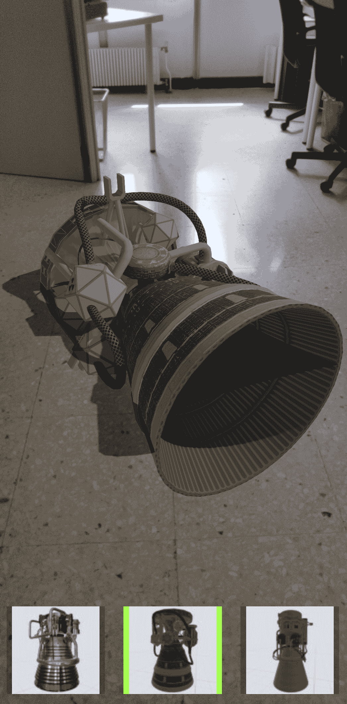

场景中显示引擎 2

1.  要更改引擎，只需按下另一个按钮，当前模型将更改。您还可以找到另一个位置并点击它以使其出现：

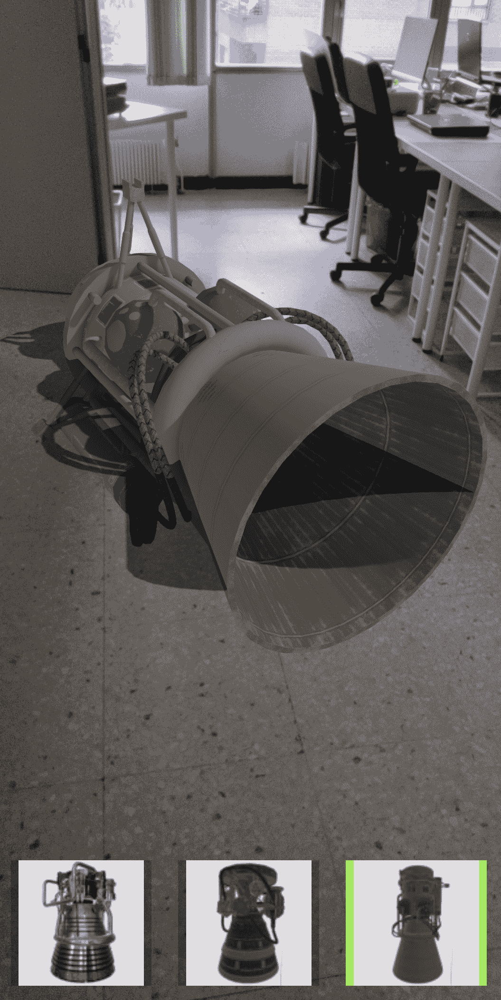

引擎 3 出现在表面

在本节中，您已经学习了如何创建一个简单的界面来更改 AR 中出现的模型。有了这个，您现在有了进一步发展并构建更复杂应用的基本技能，以便您可以展示和操作自己的原型。

# 摘要

在本章中，我们介绍了如何使用 Google 的 ARCore 创建原型查看器应用程序来使用 AR。我们学习了如何集成 ARCore 和 Sceneform 库的功能，使生成 AR 场景的任务变得更容易，并且我们包含了我们自己的外部 3D 模型。我们还创建了一个基本的用户界面，使我们能够在不同模型之间切换。

现在，您已经拥有了使用 ARCore 创建自己应用程序的技能。您可以通过添加自己的原型或原型部件来改进当前项目，例如，当用户按下按钮时使模型分解成更小的部件，或者通过另一个按钮改变模型的颜色。这一章节为您探索在平坦表面上显示的 AR 可能性奠定了基础。

您还更了解 AR 在制造领域的应用，并且可以探索它提供的进一步可能性，而不仅仅是这里提供的示例。

在接下来的章节中，我们将探索其他 AR 工具和技术。其中一些将与 ARCore 相关，如 WebAR，而其他则完全不同，如 Augmented Class!、EasyAR 和 Vuforia。

# 进一步阅读

如果您想进一步探索本章中完成的项目，我们建议您探索以下选项：

+   AR 图像：您不必将物体放置在表面上，而是可以将它们附加到物理图像（图片、平面等）上。您可以在[`developers.google.com/ar/develop/java/augmented-images/`](https://developers.google.com/ar/develop/java/augmented-images/)找到有关如何实现这一功能的起点。

+   使用 Sceneform 探索可用的示例，您只需下载并使用 Android Studio 打开它们：[`developers.google.com/ar/develop/java/sceneform/samples`](https://developers.google.com/ar/develop/java/sceneform/samples)。

+   在第二章，*Unity AR 开发入门*中，我们介绍了 Unity 3D。ARCore 可以在 Unity 平台内部使用，这也使得添加 3D 模型的过程变得更简单。它还接受更多的扩展。您可以在[`developers.google.com/ar/develop/unity/quickstart-android`](https://developers.google.com/ar/develop/unity/quickstart-android)找到有关如何开始的更多信息。
