# 第八章：使用 ARKit 进行旅游

本章中，我们将探索 ARKit，这是苹果公司自己的 AR SDK，它提供了许多功能，如空间跟踪、图像跟踪、协作 AR 等。我们还将学习如何利用世界跟踪来为旅游行业创造不同的 AR 体验。

本章的主要目标是向您介绍 ARKit 及其工作原理，通过在现实世界中搜索和跟踪平面表面。然后，您将学习如何使用这些功能在 AR 中放置元素并锚定它们，以创建一个三维门户，将用户引入一个三维世界。本章的第二个目标是展示一种不同的旅游观。您将学习如何利用 AR 创造独特体验，这些体验可以应用于博物馆、景观、兴趣点等。通过这样做，您将能够根据您的兴趣修改和应用此项目。

本章将涵盖以下主题：

+   使用 AR 进行旅游

+   探索 ARKit

+   开发 ARKit 应用程序

+   创建 AR 门户

# 技术要求

本章的技术要求如下：

+   一台运行 macOS Sierra 10.12.4 或更高版本的 Mac 电脑（本书中使用的是 Mac mini，Intel Core i5，4 GB 内存，运行 macOS Mojave）

+   Xcode 的最新版本（本书中为 10.3）

+   兼容 iOS 11+的 ARKit 兼容 iPhone/iPad（我们在 iPad Pro 10.5 上运行 iOS 13.1.1 进行了测试）

本章的代码文件和资源可以在以下链接找到：[`github.com/PacktPublishing/Enterprise-Augmented-Reality-Projects/tree/master/Chapter08`](https://github.com/PacktPublishing/Enterprise-Augmented-Reality-Projects/tree/master/Chapter08)

您可以在此处查看兼容的设备：[`developer.apple.com/library/archive/documentation/DeviceInformation/Reference/iOSDeviceCompatibility/DeviceCompatibilityMatrix/DeviceCompatibilityMatrix.html`](https://developer.apple.com/library/archive/documentation/DeviceInformation/Reference/iOSDeviceCompatibility/DeviceCompatibilityMatrix/DeviceCompatibilityMatrix.html)

当我们探索 ARKit 时，我们将解释您根据想要使用的 ARKit 功能所需满足的设备要求，因为并非所有设备都能使用它们。

最后，请注意，本章专门针对 iOS 设备。因此，您需要一个 Apple 账户（免费或开发者账户）来在您的 iOS 设备上编译项目。您可以在以下链接中找到更多信息：[`developer.apple.com/support/compare-memberships/`](https://developer.apple.com/support/compare-memberships/)

# 使用 AR 进行旅游

AR 主要是一种视觉技术。尽管它可以结合其他效果，如声音以使体验更加真实，或者在我们玩游戏时在手机上产生震动，但其主要吸引力在于它在现实世界之上显示的视觉内容。这使得这项技术非常适合增强旅行体验，从展示天际线信息到使博物馆中的动物栩栩如生，甚至实时翻译标志和指南。

回到 2000 年代末/2010 年代初，当智能手机开始流行时，最早出现的 AR 应用之一就是以旅游为导向的。例如，2010 年，伦敦博物馆发布了一款 iPhone 应用，可以在真实地点上显示城市的历史照片。这个例子也被推广到其他城市和范围，如在西班牙纳瓦拉，用户可以通过指向放置在不同地点的板面，在 AR 中重新播放该地区不同地点拍摄的名场景。在这种情况下，移动设备使用图像识别（板面）来启动 AR 体验。然而，在 2010 年代初，最稳定和最广泛使用的 AR 技术是基于位置的，使用设备的 GPS、加速度计和指南针。Layar 和 Wikitude 等 AR 引擎和应用程序被广泛使用，因为它们允许开发者基于城市中的**兴趣点**（**POI**）生成路线、障碍赛和甚至游戏。

现在，AR 在旅游中最常见的应用如下：

+   作为新城市街道上的现场导游，用户可以在 AR 应用显示他们最感兴趣的景点位置的同时在城市中四处走动，通过使用箭头来指示。

+   在地图上展示景点和 POI。在这里，当用户用摄像头指向地图时，POI 会从地图上弹出，他们可以与之互动以获取更多信息。

+   提供关于画作、雕塑或纪念碑的额外信息。在这里，当用户指向一幅画作时，它可以显示关于艺术家以及画作创作地点和时间的视频，甚至可以将其以 3D 模拟的形式栩栩如生地呈现出来。

除了所有这些体验之外，当 AR 与其他沉浸式技术如虚拟世界或 360 度视频结合时，体验又向前迈出一步，使用户能够同时访问多个地方（例如，在博物馆网络中，在访问其中一个的同时，能够虚拟访问其他地方）。

在本章中，我们将学习如何使用苹果的 ARKit SDK 将这些体验混合在一起，以创建一个艺术体验。我们将创建一个 AR 门户，当用户通过它时，他们将降落在 3D 呈现的画作上。在我们的案例中，我们将使用从 Sketchfab 下载的梵高的画作（阿尔勒的卧室）来给用户一种仿佛置身于 3D 梵高画作中的错觉：[`sketchfab.com/3d-models/van-gogh-room-311d052a9f034ba8bce55a1a8296b6f9`](https://sketchfab.com/3d-models/van-gogh-room-311d052a9f034ba8bce55a1a8296b6f9)。

为了实现这一点，我们将创建一个面向旅游领域的应用程序，可以在博物馆、画廊等地方展示。关于我们将要使用的工具，在下一节中，我们将解释 ARKit 是如何工作的以及其主要功能。

# 探索 ARKit

苹果在 2017 年与 Xcode 9 和 iOS 11 一起发布了 ARKit 的第一个版本，将 AR 引入 iOS 设备。该框架包含在 Xcode 中，为开发者提供了在他们的应用程序或游戏中创建 AR 体验的可能性，这些软件结合了 iOS 设备的运动特性和相机追踪功能。它允许用户在现实世界中放置虚拟内容。在官方发布几个月后，它增加了新功能，如 2D 图像检测和面部检测。iOS 11 及以上版本可用的主要功能如下：

+   在物理环境中追踪和可视化平面（iOS 11.3+），例如桌子或地面

+   在现实世界中追踪已知的 2D 图像（iOS 11.3+），并在其上放置 AR 内容（图像识别）

+   在相机流中追踪面部（iOS 11.0+），并在其上叠加虚拟内容（例如，虚拟头像面部），这些内容会实时对面部表情做出反应

除了这些功能之外，AR 体验还可以通过使用附加到虚拟对象上的音效或集成其他框架（如视觉框架）来增强，以向应用程序添加计算机视觉算法，或者使用 Core ML 来添加机器学习模型。

2018 年，随着 iOS 12 的发布，ARKit 2 推出了新功能：

+   3D 物体追踪，其中真实世界中的物体是触发 AR 元素的那些

+   多用户 AR 体验，允许彼此靠近的用户共享相同的 AR 环境

+   为 AR 对象添加逼真的反射，以使体验更加真实

+   保存世界映射数据，以便当用户在现实世界中放置虚拟元素时，下次应用程序重新启动，虚拟元素将出现在相同的位置

在撰写本书时，iOS 13 与 ARKit 3 刚刚发布，并承诺对当前状态有巨大的改进，因为它增加了一种与虚拟元素交互的新方式，例如当检测到有人站在它们前面时隐藏虚拟对象。它还允许用户通过手势与 3D 物体交互，并捕捉到人的面部表情和动作。

由于每次 iOS 启动时都会进行更改，因此我们在这里提到的并非所有功能都适用于所有设备。在 [`developer.apple.com/documentation/arkit`](https://developer.apple.com/documentation/arkit) 的开发者页面上列出了当前的 ARKit 功能以及开发测试所需的最小 Xcode 和 iOS 版本。

对于这个项目，我们将使用平面检测，这是一个可以在 iOS 11 及以上版本上运行的基本功能。我们将在下一节中探讨这一点。

# 开发 ARKit 应用程序

要开始使用 ARKit 开发应用程序，请确保您拥有我们在 *技术要求* 部分中讨论的所需硬件，包括 iOS 设备，因为运行应用程序是必要的。

您还需要一个 Apple 账户才能在真实设备上构建项目。如果您没有付费账户，您也可以使用您的常规免费 Apple ID 登录。使用免费账户时的当前限制如下：同一时间在您的设备上安装最多三个应用程序，并且每七天可以创建最多 10 个不同的应用程序。

在本节中，我们将使用 Xcode 的模板创建一个 AR 项目，并介绍其主要组件。然后，我们将修改基本应用程序以可视化检测到的表面并向用户显示重要信息。

# 创建新的 AR 项目

让我们使用 ARKit 创建一个新的增强现实应用程序。我们将通过以下步骤在 Xcode 中创建项目，Xcode 是 macOS 的开发者工具集，我们可以从 Mac App Store 免费下载：

1.  创建一个新项目，选择增强现实应用程序，然后点击“下一步”。这将为我们提供一个基本框架，以便我们可以开始使用 AR：

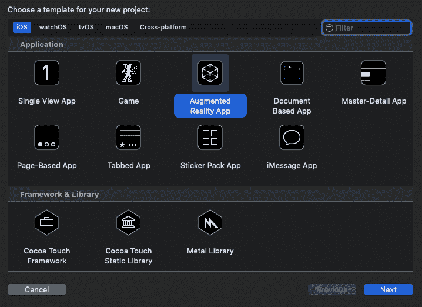

选择增强现实应用程序模板

1.  填写产品名称、团队（在这里，您必须输入您的 Apple ID，尽管您可以将它留为“无”（如下面的截图所示），但您稍后必须填写它以将项目部署到设备上），以及组织名称：

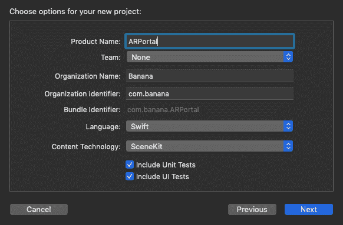

填写我们项目的核心值

1.  点击“下一步”，选择项目位置，然后点击“创建”。

1.  如果您在 *步骤 2* 中没有输入您的开发者 ID，则项目的签名选项卡的一般窗口将显示错误，这将阻止应用程序在设备上构建，如下面的截图所示。现在修复它以便能够运行应用程序：

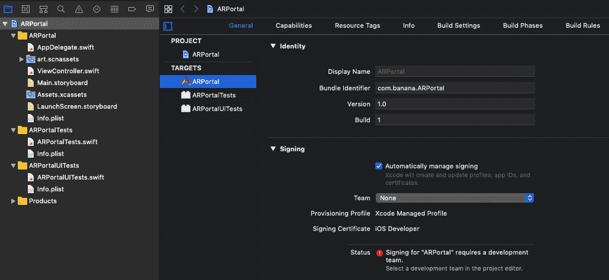

当未选择团队时，项目的签名选项卡会显示错误

1.  我们已经有一个可以执行的应用程序。要测试它，连接您的设备，并从窗口的左上角选择它，如下面的截图所示：


选择运行应用程序的设备

1.  通过点击窗口左上角的播放按钮来运行应用。第一次启动时，它会请求摄像头的权限，一旦摄像头流出现，它就会将一艘宇宙飞船锚定在你的环境中间：

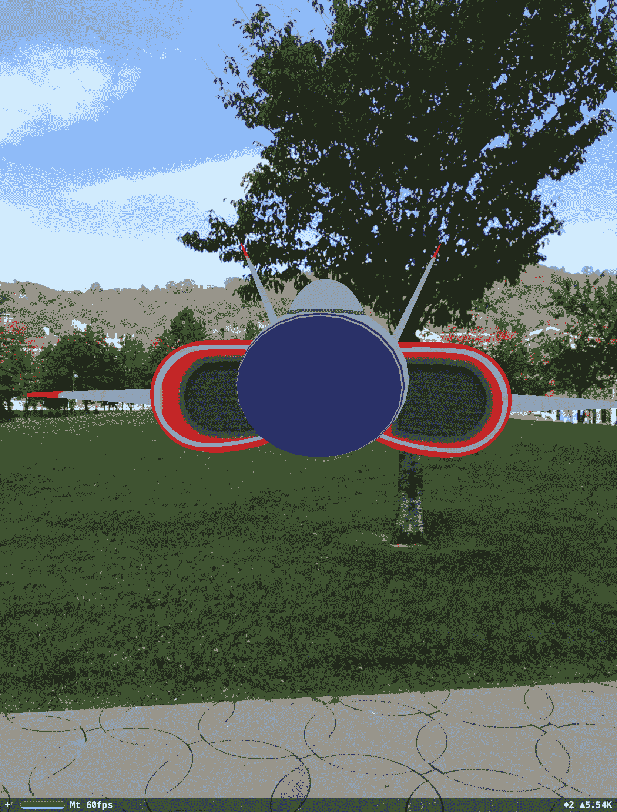

船只看起来锚定在真实环境中

1.  由于 ARKit 将会跟踪你的环境，请尝试移动船只并靠近它或从不同的角度观察它，如下面的截图所示：

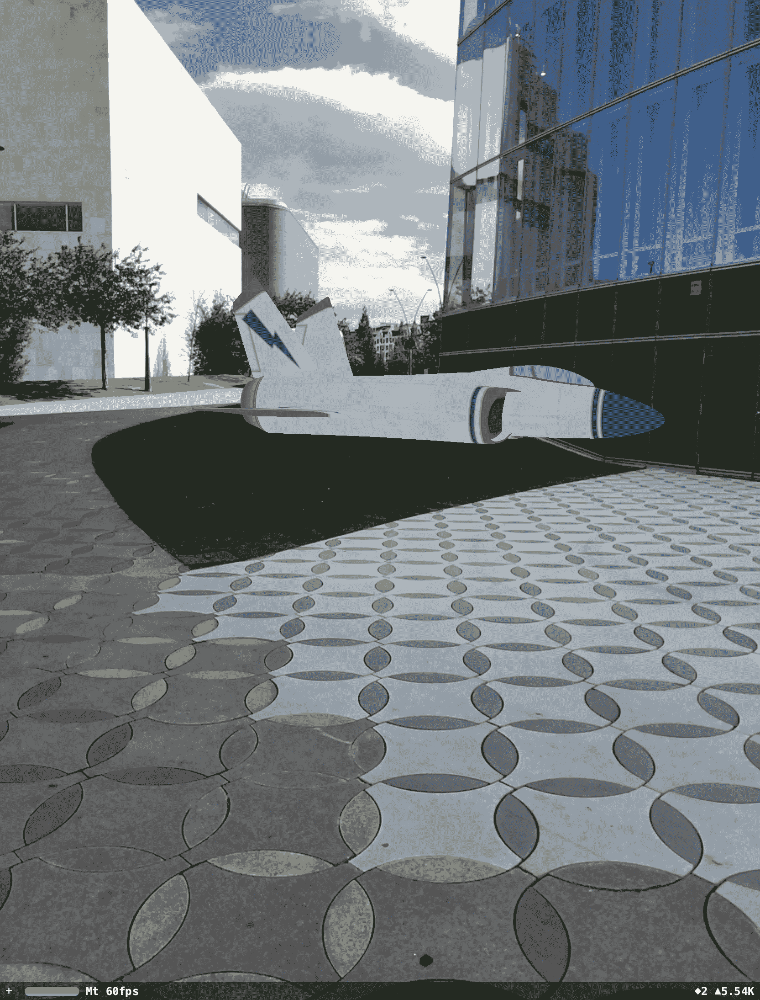

现在，让我们看看构成这个项目的主体部分，即 `Main.storyboard`，其中包含 UI 元素，以及 `ViewController.swift`，其中包含应用的逻辑。

# Main.storyboard

通过点击它打开 `Main.storyboard` 文件。此文件包含 UI 元素。目前，它只包含一个 ARSCNView，占据了整个屏幕。

如果你右键单击场景视图，你会看到与场景视图变量链接的引用出口，如下面的截图所示：

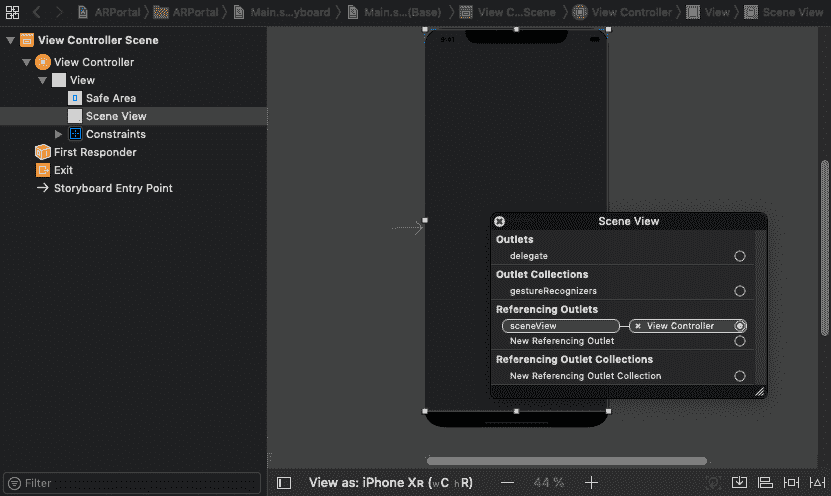

UI 元素 ScenView 及其引用的出口

让我们更仔细地看看视图控制器元素。

# ViewController.swift

现在，点击 `ViewController.swift`，这是我们应用的主要逻辑所在。

你首先会看到，该类需要 `ARKit` 库进行 AR，`UIKit` 库进行界面，以及 `SceneKit` 库。最后一个是一个高级 3D 框架，苹果提供它，以便你可以创建、导入和操作 3D 对象和场景。我们将在本章后面使用它来将我们的外部 3D 模型导入场景。

我们目前唯一的变量如下：

```cs
@IBOUtlet var sceneView: ARSCNView!
```

这是来自 `Main.storyboard` 的 `ARSCNView` 元素。它将允许我们控制 AR 场景。

我们的 `ViewController` 类继承自 `UIViewController`。从这里，我们有三个 `override` 方法。第一个是 `viewDidLoad`：

```cs
override func viewDidLoad() {
    super.viewDidLoad()

    sceneView.delegate = self
    sceneView.showsStatistics = true

    let scene = SCNScene(named: "art.scnassets/ship.scn")!
    sceneView.scene = scene 
}
```

当视图加载到内存中时，会调用此方法，并用于初始化元素。在这种情况下，我们将 `sceneView` 元素的代理附加到类本身，激活将在应用底部显示的统计信息，创建一个带有船只模型的场景，并将该场景分配给 `scenView` 元素。这将使战舰在应用启动时立即出现。

第二个方法是 `viewWillAppear`：

```cs
override func viewWillAppear(_ animated: Bool) {
    super.viewWillAppear(animated)

    let configuration = ARWorldTrackingConfiguration()
    sceneView.session.run(configuration)
}
```

当设备准备好向用户显示界面时，会调用此方法。AR 会话从这里启动。`ARSession` 是控制 AR 体验的主要元素；它从你的设备传感器读取数据，控制设备的摄像头，并分析从它传来的图像，以在放置 AR 对象的真实世界和虚拟空间之间创建对应关系。

在运行会话之前，我们需要使用`ARConfiguration`类，该类将确定会话中启用的 ARKit 功能。在这种情况下，它将使用设备的后置摄像头跟踪设备相对于表面、人物、图像或对象的位置和方向，然后使用该配置运行会话。如果我们只想跟踪人们的面孔或只想跟踪图像，我们可以使用不同的配置。（有关更多信息，请参阅[`developer.apple.com/documentation/arkit/arconfiguration`](https://developer.apple.com/documentation/arkit/arconfiguration)。）

第三个重写方法是`viewWillDisappear`：

```cs
override func viewWillDisappear(_ animated: Bool) {
    super.viewWillDisappear(animated)
    sceneView.session.pause()
}
```

当视图即将被移除时，会调用此方法。当这种情况发生时，视图的会话将被暂停。

这些是目前我们实现的方法。现在，我们将开始更改和添加代码，以了解 ARKit 如何跟踪平面以及了解不同的状态变化。

# 修改基本应用

从`ViewController.swift`中的当前代码开始，我们将对其进行修改，使其只检测水平表面（不是垂直面、面或已知图像），并在检测过程中显示这些水平表面，以显示有关`ARSession`的额外信息，例如当`ARTracking`准备就绪或检测到新的水平表面时。

在我们进行这个操作之前，我们将删除船模型，因为我们不再需要它。按照以下步骤删除船模型：

1.  从项目中删除`art.scnassets`文件夹。

1.  在`ViewController.swift`的`viewDidLoad()`方法中，从场景中删除对船的引用，使`scene`行如下所示：

```cs
let scene = SCNScene()
```

我们还将启用一个 AR 调试选项，这将使我们能够看到我们环境的特征点。正如我们在这本书中已经看到的，特征点是图像的独特点，使得该图像可以被识别和跟踪。特征点越多，跟踪就越稳定。我们现在将激活此选项，以便我们可以看到我们的环境检测得有多好，并在我们的最终应用中将其禁用。为此，在`viewDidLoad()`方法中，在`sceneView.showStatistics = true`行之后，添加以下代码：

```cs
sceneView.debugOptions = ARSCNDebugOptions.showFeaturePoints
```

然后，我们可以继续进行平面检测。

# 检测并显示水平平面

如我们之前提到的，`ARSession`是 AR 应用的主要元素。ARKit 的另一个基本元素是`ARAnchor`，它是现实世界中一个有趣点的表示，包括其位置和方向。我们可以使用锚点在现实世界中放置和跟踪与相机相关的虚拟元素。当我们将这些锚点添加到会话中时，ARKit 会优化该锚点周围的全球跟踪精度，这意味着我们可以像它们被放置在现实世界中一样在虚拟对象周围行走。

除了手动添加锚点之外，一些 ARKit 功能可以自动将它们自己的特殊锚点添加到会话中。例如，当我们激活 `ARConfiguration` 类中的平面检测功能时，每当检测到新的平面时，就会自动创建 `ARPlaneAnchor` 元素。

让我们使这些平面锚点可见，这样我们就可以看到 ARKit 的工作原理。让我们开始吧：

1.  在 `viewWillAppear` 方法中，在 `configuration` 定义之后，添加以下代码：

```cs
let configuration = ARWorldTrackingConfiguration()
configuration.planeDetection = .horizontal
```

现在，ARKit 将只寻找水平表面进行跟踪。

1.  取消注释类中已经存在的 `renderer` 方法：

```cs
func renderer(_ renderer: SCNSceneRenderer, nodeFor anchor: ARAnchor) -> SCNNode? {
    let node = SCNNode()

    return node
} 
```

当场景中添加新的 `ARAnchor` 时，会调用此方法。它帮助我们为该锚点创建一个名为 `SCNNode` 的 `SceneKit` 节点。

1.  现在，为了绘制平面，在节点创建和 `return` 语句之间添加以下代码：

```cs
guard let planeAnchor = anchor as? ARPlaneAnchor else {return nil}

let plane = SCNPlane(width: CGFloat(planeAnchor.extent.x), height: CGFloat(planeAnchor.extent.z))
plane.firstMaterial?.diffuse.contents = UIColor.orange
plane.firstMaterial?.transparency = 0.4

let planeNode = SCNNode(geometry: plane)
planeNode.position = SCNVector3(x: planeAnchor.center.x, y: planeAnchor.center.y, z: planeAnchor.center.z)
planeNode.eulerAngles.x = -Float.pi/2

node.addChildNode(planeNode)
```

在这里，如果我们的锚点是一个 `ARPlaneAnchor`，我们创建一个新的半透明的橙色平面，其大小与 `planeAnchor` 相同。然后，我们创建一个带有该平面的 `SCNNode` 并将其添加到已经创建的空节点中。最后，我们返回这个父节点，以便它与我们的当前锚点相关联并在场景中显示。

除了这种方法，我们还可以从 `ARSCNViewDelegate` 实现另一种方法：`func renderer(_ renderer: SCNSceneRenderer, didAdd node: SCNNode, for anchor: ARAnchor){}`。在这里，空节点已经创建好了，所以我们只需要添加相同的先前代码片段。

1.  如果你现在测试这个应用，你会看到每当它检测到平坦表面时，它会如何绘制橙色平面。然而，你会看到一旦一个平面被绘制，即使 ARKit 检测到更多围绕它的点，平面的尺寸也不会更新，如下面的截图所示：

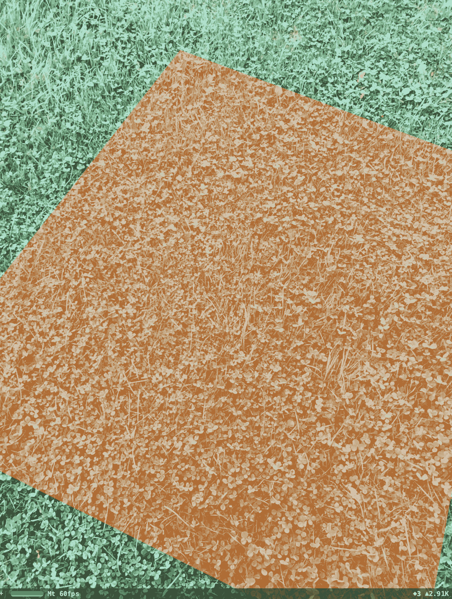

ARKit 检测平坦表面并放置平面

让我们添加一些代码，以便在检测到更多点时，显示的平面会改变其大小和位置。

1.  在类的开头，在 `sceneView` 之后创建一个数组来保存场景中的所有平面及其相应的锚点：

```cs
var planes = [ARPlaneAnchor: SCNPlane]()
```

1.  现在，在 `renderer` 方法中，在创建平面之后，并在 `return` 语句之前，添加以下代码：

```cs
planes[planeAnchor] = plane
```

这将保存我们的平面节点和锚点以供以后使用。

1.  让我们添加一个新的方法：

```cs
func renderer(_ renderer: SCNSceneRenderer, didUpdate node: SCNNode, for anchor: ARAnchor)
{
    guard let planeAnchor = anchor as? ARPlaneAnchor else {return}

    if let plane = planes[planeAnchor]
    {
        plane.width = CGFloat(planeAnchor.extent.x)
        plane.height = CGFloat(planeAnchor.extent.z)

        node.childNodes.first?.position = SCNVector3(planeAnchor.center.x, planeAnchor.center.y, planeAnchor.center.z)
    }        
}
```

当锚点更新时，会调用此方法。首先，我们检查锚点是否为 `ARPlaneAnchor`。然后，我们从数组中取出与该锚点对应的平面，并更改其 `width` 和 `height`。最后，我们更新 `child` 节点的 `position`（记住我们添加了我们的平面节点到一个空节点中；我们想要更新平面的位置，而不是空节点位置）。

1.  运行应用以查看当你移动设备时，平面会变得越来越大：

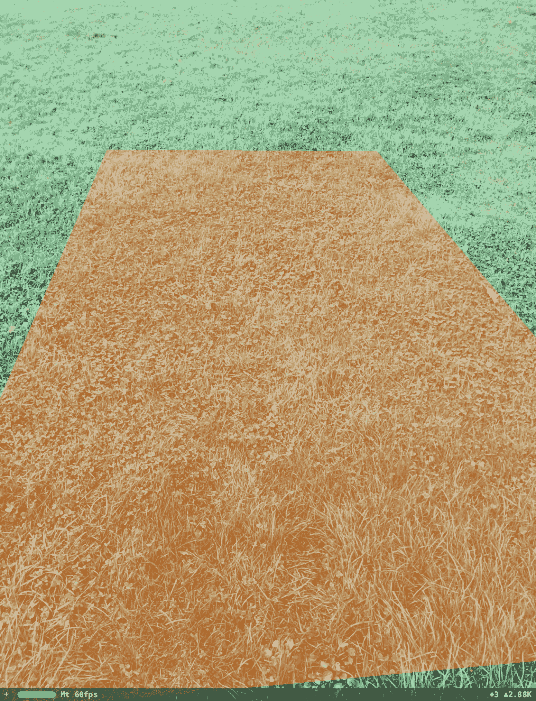

当 ARKit 检测到更多点时，检测到的平面会变得更大

在本节中，我们学习了如何创建平面锚点以及如何可视化它们。

在测试应用时，你可能已经注意到设备需要一点时间才开始显示平面的锚点。这是 ARKit 初始化的时间。在下一节中，我们将创建一个 ARKit 状态变化的跟踪，以便用户知道应用何时准备就绪。

# 将 ARSessionDelegate 添加以跟踪状态变化

在我们的类中，我们已经有三个方法可以用来在会话失败或中断时通知用户会话变化。我们还将添加两个新方法，即当锚点添加到会话中以及当相机改变其跟踪状态时。但在我们做任何这些之前，我们需要在我们的 UI 中创建一个标签来显示所有消息。

# 添加标签 UI 元素

让我们添加一个新的 UI 元素，即标签，以向用户显示通知。为此，请按照以下步骤操作：

1.  打开`Main.storyboard`，并打开屏幕右上角的库按钮（其集合中的第一个按钮，内部有一个正方形在圆圈中）：

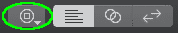

图书馆按钮

1.  在视图中查找并拖动一个标签：

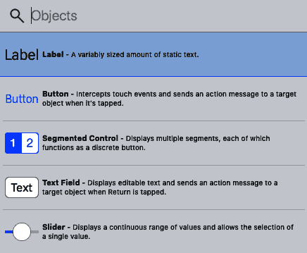

从库中选择标签

1.  在选择标签后，使用*Ctrl* + 鼠标拖动为标签创建关于视图的约束，或者在工具栏中点击位于手机视图*下方*的添加新约束按钮。约束帮助我们固定屏幕上的元素，以便它们在任何设备屏幕和任何方向上都能正确显示。

1.  然后，将左侧、右侧和底部约束的值分别修改为`20`、`20`和`0`（约束的图标将变为鲜红色）。勾选高度约束框并将其设置为`60`，如下所示：

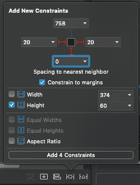

为标签添加约束

1.  新的约束将出现在右侧窗口的“显示大小检查器”选项卡下，如下所示：

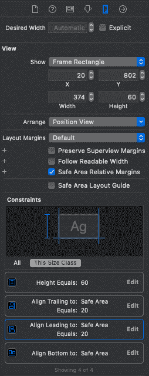

在“显示大小”选项卡底部添加的四个新约束

1.  在“显示属性检查器”选项卡中，*删除*默认文本，将标签颜色设置为*绿色*，勾选动态类型复选框，并将文本对齐设置为居中，如下所示：

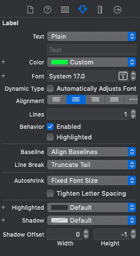

修改标签的属性

1.  要将标签连接到我们的`ViewController.swift`脚本并在我们的方法中使用它，请点击右上角的“显示辅助编辑器”按钮（两个圆圈相交）以打开脚本：

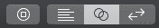

选择辅助编辑器

1.  按*Ctrl*并拖动标签（当你拖动鼠标时，你会看到一个蓝色线条），从层次视图拖动到代码，在`sceneView`变量下方。释放鼠标。然后，在以下截图所示的弹出窗口中，输入变量的名称，在本例中将是`infoLabel`，然后点击连接：

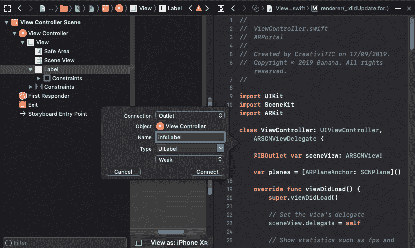

UI 中的标签将附加到 infoLabel 变量

1.  打开 `ViewController.swift` 文件以检查新变量是否已正确添加，如下所示：

```cs
@IBOutlet weak var infoLabel: UILabel!
```

现在，我们可以通过界面开始向用户发送消息。

# 向用户发送通知

现在我们有了用于向用户显示消息的标签，让我们使用 `ViewController` 类中已有的 `session` 方法，并创建新的方法来显示有用的信息，如下步骤所示：

1.  在 `ViewController.swift` 文件中，在 `didFailWithError` 会话内，添加一条新信息：

```cs
func session(_ session: ARSession, didFailWithError error: Error) {
    infoLabel.text = "Session failed : \(error.localizedDescription)."
}
```

当 `ARSession` 中出现错误时，将显示此消息。

1.  在 `sessionWasInterrupted` 方法中，添加以下信息：

```cs
func sessionWasInterrupted(_ session: ARSession) {
    infoLabel.text = "Session was interrupted."
}
```

这将在会话中断时执行；例如，当应用最小化时。

1.  在 `sessioInterruptionEnded` 方法中，添加以下信息和代码：

```cs
func sessionInterruptionEnded(_ session: ARSession) {
    infoLabel.text = "Session interruption ended."
    let configuration = ARWorldTrackingConfiguration()
    configuration.planeDetection = .horizontal
    sceneView.session.run(configuration, options: [.resetTracking, .removeExistingAnchors])
}
```

当会话中断完成时，我们必须重置跟踪。为此，我们将再次创建配置参数并通过移除之前存在的锚点来运行会话。

1.  现在，让我们创建一个新的方法，用于检测跟踪状态何时发生变化：

```cs
func session(_ session: ARSession, cameraDidChangeTrackingState camera: ARCamera) {
    let message: String

    switch camera.trackingState {
    case .normal where session.currentFrame!.anchors.isEmpty:
        message = "Move the device around to detect horizontal surfaces."   
    case .notAvailable:
        message = "Tracking unavailable."
    case .limited(.excessiveMotion):
         message = "Tracking limited - Move the device more slowly."
    case .limited(.insufficientFeatures):
        message = "Tracking limited - Point the device at an area with visible surface detail, or improve lighting conditions."
    case .limited(.initializing):
        message = "Initializing AR session."
    default:
        message = ""  
    } 
    infoLabel.text = message
}
```

您的 Xcode 窗口将如下截图所示：

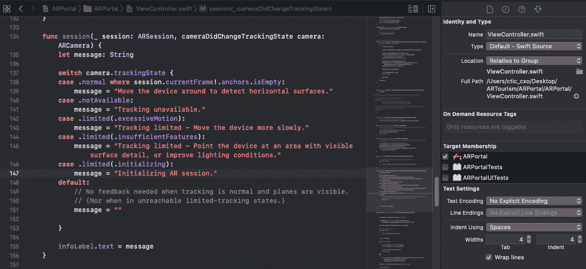

ViewController 中的新方法

此方法检查跟踪状态，并在会话初始化或存在问题时显示消息。我们还在跟踪状态正常但尚未找到平面锚点时显示消息，因此用户需要继续四处张望。

1.  现在，我们必须在添加锚点时通知用户，这样他们就不必再四处张望了。为此，我们将使用 `ARSessionDelegateProtocol`。我们首先将要做的是将代理添加到类中，如下代码所示：

```cs
class ViewController: UIViewController, ARSCNViewDelegate, ARSessionDelegate {
```

类声明将如下所示：

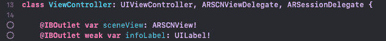

添加了代理的 ViewController 类

1.  在 `viewWillAppear` 方法中，在 `sceneView.session.run(configuration)` 行之后，添加以下代码：

```cs
sceneView.session.delegate = self
```

通过这一行，我们将代理分配给类。`viewWillAppear` 方法现在将如下所示：

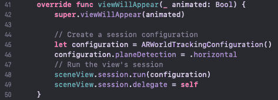

`viewWillAppear` 方法

1.  现在，创建一个新的方法来显示添加锚点时的消息：

```cs
func session(_ session: ARSession, didAdd anchors: [ARAnchor])
{
    infoLabel.text= "New anchor added."
}
```

1.  运行应用以查看标签如何根据摄像头的状态变化，如下所示：

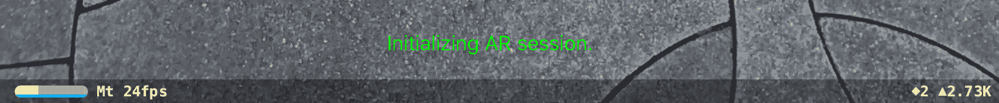

通知用户 AR 会话正在初始化的标签

在 AR 初始化后，标签将变为检测水平表面的信息，如下截图所示：

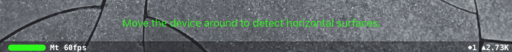

询问用户将设备移动以检测水平表面的标签

`cameraDidChangeTrackingState`会话方法的调试信息来自*跟踪和可视化平面*示例，该示例可在[`developer.apple.com/documentation/arkit/tracking_and_visualizing_planes`](https://developer.apple.com/documentation/arkit/tracking_and_visualizing_planes)找到。此示例项目使用了更多方法来显示平面和消息，而我们在这个项目中不需要它们。如果您想了解它们，可以下载并测试。

现在我们有了我们 app 的基础，让我们创建一个 AR 门户，我们将在这里展示一个通向虚拟 3D 画作的*门*。一旦我们物理上穿过那扇门，我们就会发现自己沉浸在那个虚拟画作中。

# 创建一个 AR 门户

目前，我们有一个检测水平平面并通知我们跟踪系统状态的 app。现在，我们想要创建一个 AR 体验，其中用户将触摸屏幕来创建一个门户，并且通过它时，可以看到自己身处梵高的*阿尔勒的卧室*画作的三维表示。以下图显示了 SceneKit 坐标系中的场景：

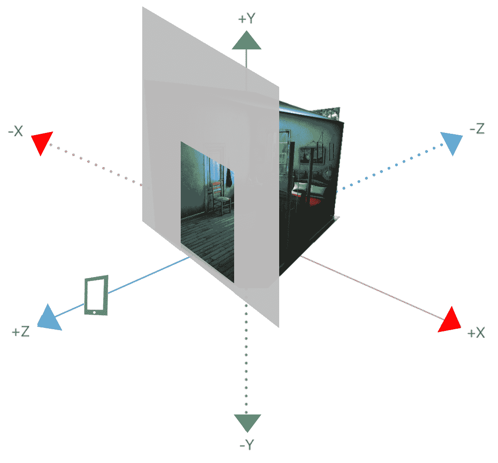

XYZ 坐标中的场景

从用户的视角来看，我们将有一个带有孔的门户，如图中所示。这个孔将让我们看到背景中的模型，即 3D 画作。门户不会是灰色的；它将是透明的，这样我们就可以看到摄像头传输的内容，而不是隐藏在它后面的整个 3D 画作场景。在本节中，我们将学习如何实现这一点。

为了做到这一点，我们需要添加 3D 模型，创建屏幕触摸功能，并创建实际的门户，它只从外面显示画作的局部。

从现在开始，您可以指定是否要显示特征点选项以及显示平面的两个`renderer`方法。我们将把它们留到项目结束时，因为最好是在我们首先理解 ARKit 的工作原理之后再进行这些操作。

在以下子节中，我们将做以下事情：

+   将 3D 模型导入我们的项目和场景

+   添加用户交互，以便当用户触摸屏幕时，3D 模型将出现在被触摸的锚平面之上

+   将墙壁添加到门户中，使模型从外面不可见，除了门

+   通过给墙壁添加纹理和指南针图像来改进应用，以帮助用户找到门户出现的位置

现在，让我们先添加我们想要展示的 3D 模型。

# 导入 3D 模型

SceneKit 首选的 3D 模型类型是 Collada（.dae 文件）。然而，它也可以读取 OBJ（.obj）文件，在这种情况下，下载的模型是后一种格式。我们使用 3D 建模程序对其进行略微修改，并将基点放在离我们最近的边缘的地板上。这样，当我们将其放置在现实世界中时，我们将看到模型在我们面前，而不是围绕我们。如果您尝试使用其他模型或不知道如何修改基点，您可以直接在代码中调整变换的位置（我们稍后会解释）。

# 将模型添加到项目中

要导入模型并在我们的场景中显示它，请从本项目的资源中下载它并遵循以下步骤：

1.  右键点击项目并选择新建组，如下截图所示。命名为`Models`：

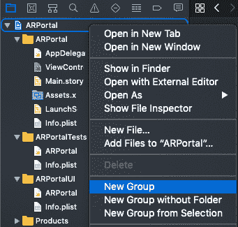

创建一个新组来包含我们的模型

1.  右键点击`Models`文件夹，选择将文件添加到“ARPortal”…，如下所示：

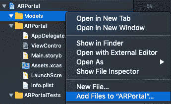

将文件添加到我们的文件夹中

1.  导航到包含模型、材质和纹理的`vangogh_room`文件夹。选择它，确保它已添加到我们的应用中，并点击添加，如下截图所示：

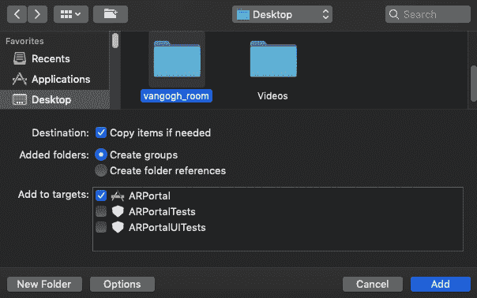

选择文件夹并将其添加到目标应用中

1.  如果您展开`vangogh_room`文件夹，您将看到其中的所有文件。点击`vangogh_room.obj`文件在屏幕上可视化 3D 模型。当我们创建门户时，我们将从开放的墙壁进入模型，如下截图所示：

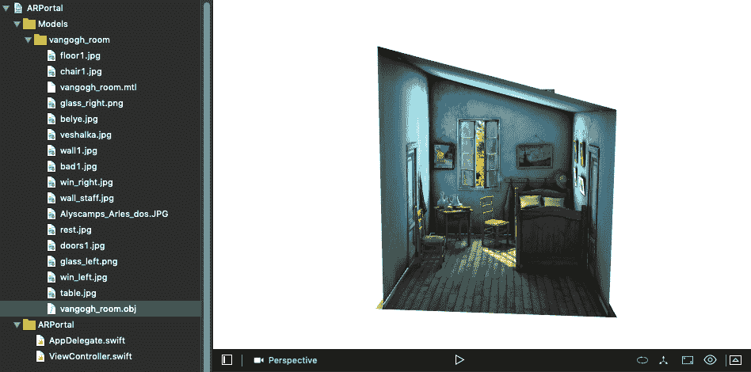

在 3D 中显示的.obj 文件

现在，我们可以在我们的代码中使用我们的模型。

# 将模型添加到我们的场景中

现在我们已经将模型导入到我们的项目中，让我们使用以下代码将其添加到我们的场景中：

1.  通过右键点击`ARPortal`文件夹并选择新建文件…来创建一个新文件，如下所示：

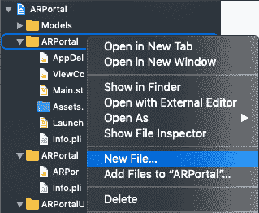

创建新文件

1.  选择 Swift 文件并点击下一步：

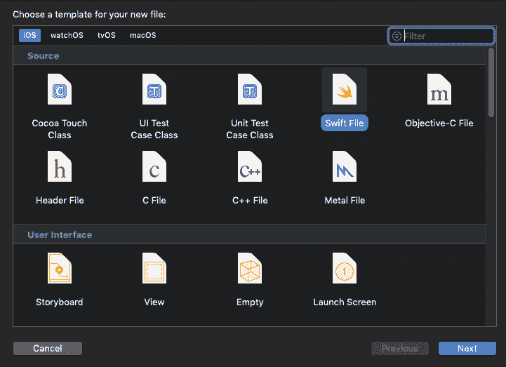

选择 Swift 文件

1.  命名为`Portal.swift`并点击创建。这将是我们创建完整门户的类，包括我们之前导入的 3D 模型。

1.  删除代码并添加`ARKit`库：

```cs
import ARKit
```

1.  创建一个`class`：

```cs
class Portal: SCNNode {
}
```

我们的门户将是`SCNNode`类型。

1.  现在，在类内部，我们将创建一个新的方法来加载 3D 模型。添加以下代码：

```cs
func add3DModel() {
    let modelScene = SCNScene(named: "vangogh_room.obj")!
    let modelNode: SCNNode = modelScene.rootNode.childNodes[0]
    self.addChildNode(modelNode)
}
```

在这里，我们从`.obj`文件中加载场景并从中提取节点。然后，我们将节点作为我们的门户的子节点附加。

如果你使用另一个模型并且它没有出现在你想要的位置（在一个或多个轴上偏移），你可以在`self.addChildNode(modelNode)`行之前添加以下内容来调整其位置：`modelNode.position = SCNVector3(x: YourValue, y: YourValue, z: YourValue)`。你可以通过查看本节开头的图解来检查 SceneKit 中的坐标如何工作。

1.  现在，按照如下方式`重写``init`方法：

```cs
override init() {
    super.init()
    add3DModel()
}

required init?(coder aDecoder: NSCoder) {
    fatalError("init(coder:) has not been implemented")
}
```

在第一个方法中，我们通过添加 3D 模型来初始化我们的传送门。第二个方法是`SCNNode`子类所必需的。

现在我们已经添加了我们的 3D 模型，我们想在场景中显示它。

我们可以直接打开`ViewController.swift`文件，并在`viewDidLoad()`方法的末尾添加以下内容，如下所示：

```cs
portal = Portal()
self.sceneView.scene.rootNode.addChildNode(portal!)
```

`viewDidLoad`方法现在将如下所示：

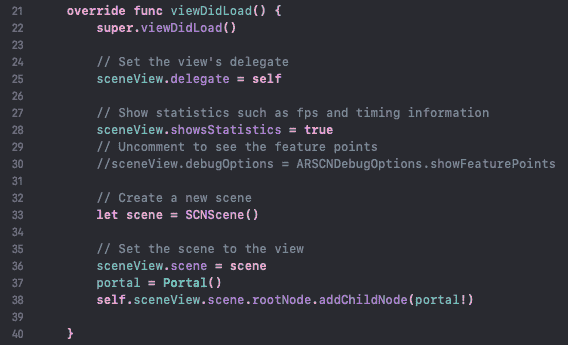

添加传送门后的`viewDidLoad`方法

在这种情况下，3D 模型将像我们在本章开头看到的船一样出现，从会话开始到屏幕中间（我们可能需要向下翻译以获得更好的视角）。然而，我们想要添加一个转折，并在用户触摸屏幕时将其附加到其中一个平面锚点上，因此删除这两行。我们将在下一节中学习如何做到这一点。

# 包括用户交互

让我们给应用添加一些用户交互。而不是一开始就使虚拟内容出现在场景中，我们将使其在用户触摸屏幕时出现。为此，请按照以下步骤操作：

1.  在`Main.storyboard`中，点击库按钮（圆圈内的正方形按钮）并查找触摸手势识别器。将其拖到视图中：

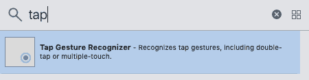

从库中选择触摸手势识别器

1.  它将显示在以下截图所示的层次结构中：

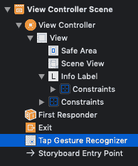

在视图控制器场景层次结构中点击“触摸手势识别器”

1.  显示辅助编辑器（两个相交的圆圈按钮）并在右侧打开`ViewController.swift`。*Ctrl* + 将触摸手势识别器拖到代码中，如下所示：

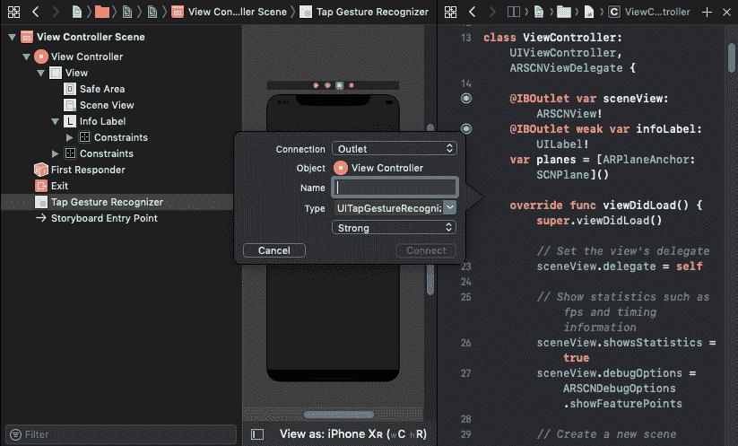

将触摸手势识别器拖到代码中以创建连接

1.  在出现的框中填写以下参数：

+   连接：`Action`

+   对象：`视图控制器`

+   名称：`didTapOnScreen`

+   类型：`UITapGestureRecognizer`

1.  打开`ViewController.swift`文件以确保已创建该方法：

```cs
@IBAction func didTapOnScreen(_ sender: UITapGestureRecognizer){
}
```

1.  现在，在类开始处，在`planes`变量之后包含以下变量：

```cs
var portal: SCNNode? = nil
```

我们将使用这个变量来确保视图中只有一个传送门。

1.  修改会话的`didAdd`方法中的文本，指示用户在检测到锚点但尚未添加传送门时放置传送门。为此，修改`infoLabel.text`，如下所示：

```cs
func session(_ session: ARSession, didAdd anchors: [ARAnchor]) {
   if portal == nil
   {
       infoLabel.text = "Tap on the floor to create the portal."
   }
}
```

1.  现在，前往`didTapOnScreen`方法并添加以下代码：

```cs
let location = sender.location(in: sceneView)

let hitResults = sceneView.hitTest(location, types: ARHitTestResult.ResultType.existingPlaneUsingExtent)

guard let result = hitResults.first else {return}

if portal != nil {
    portal?.removeFromParentNode()
}

portal = Portal()
portal?.position = SCNVector3(x: result.worldTransform.columns.3.x, y: result.worldTransform.columns.3.y, z: result.worldTransform.columns.3.z)

self.sceneView.scene.rootNode.addChildNode(portal!)

infoLabel.text = ""
```

在这里，我们取出点击的位置并检查点击是否击中了一个现有的平面。（您可以在`ARHitTestResult`的选项中检查：[`developer.apple.com/documentation/arkit/arhittestresult`](https://developer.apple.com/documentation/arkit/arhittestresult)。）我们取击中结果中的第一个平面。如果传送门已经存在，我们将删除它以确保我们只有一个传送门在视图中。如果用户在屏幕的不同位置点击，传送门将看起来从一个地方移动到另一个地方。然后，我们将平面的位置应用到我们的传送门对象上。最后，我们将传送门添加到我们的场景中，并且我们将清除信息标签，因为我们不再需要告诉用户点击屏幕。结果的方法将如下所示：

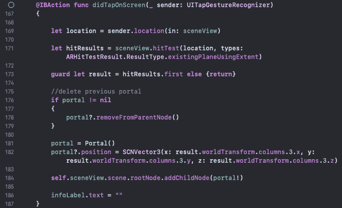

`didTapOnScreen`方法

1.  在`sessionWasInterrupted`方法中，在`infoLabel.text`之后，我们将删除传送门，以确保在会话恢复时它不会出现。为此，添加以下代码：

```cs
func sessionWasInterrupted(_ session: ARSession) {
    infoLabel.text = "Session was interrupted."
    portal?.removeFromParentNode()
    portal = nil
}
```

`sessionWasInterrupted`方法应如下所示：

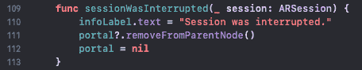

`sessionWasInterrupted`方法

1.  运行应用并点击屏幕以放置 3D 模型。它将出现在橙色平面上，如下面的截图所示：

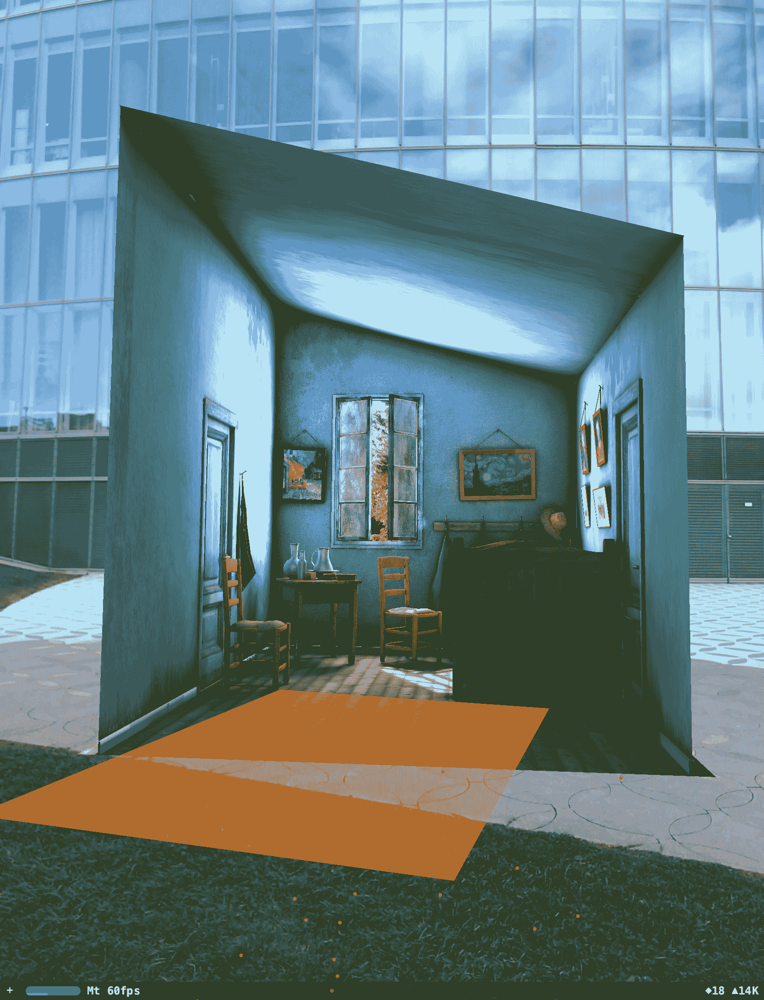

当在屏幕上点击时出现在 AR 中的 3D 绘画

如果你进入模型并回头看，你将看到从 3D 模型中开放的墙壁看到的现实世界，如下面的截图所示：

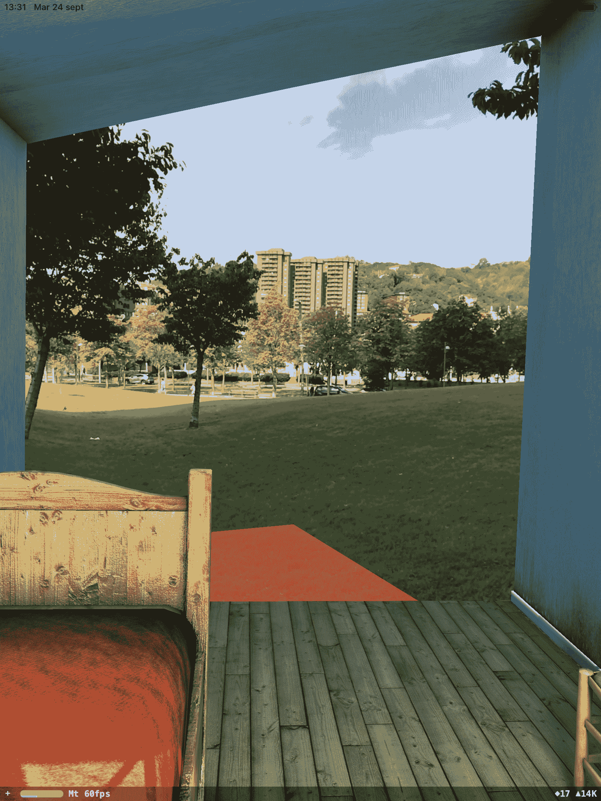

从 3D 房间到现实世界的开口

在房间内四处走动，从不同的角度探索 3D 空间。你会看到你沉浸在虚拟环境中，而现实世界仍然在另一边。

现在，是时候真正创建一个隐藏模型大部分直到*门*被穿越的传送门了。为此，我们将创建透明墙壁并玩渲染顺序属性。

# 添加传送门的墙壁

AR 传送门的主要技巧基于两个东西：透明度和渲染顺序。我们将创建一个带有中间开口（我们将称之为*门*）的墙壁，通过这个开口我们将看到 3D 绘画。打开`Portal.swift`文件并按照以下步骤操作：

1.  创建一个名为`createWall`的新方法，代码如下：

```cs
func createWall(width: CGFloat, height: CGFloat, length: CGFloat)->SCNNode {
    let node = SCNNode()

    let wall = SCNBox(width: width, height: height, length: length, chamferRadius: 0)
    wall.firstMaterial?.diffuse.contents = UIColor.white
    let wallNode = SCNNode(geometry: wall)

    node.addChildNode(wallNode)

    return node
}
```

在这里，我们创建了一个父节点。然后，我们创建了一个给定大小的盒子，并将其材质设置为白色。我们创建了一个具有盒子几何形状的节点，并将其附加到父节点上，然后返回它。这将是我们创建传送门墙壁的基础：

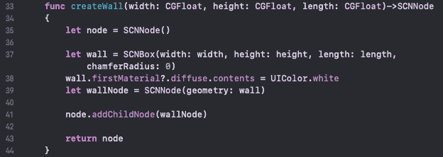

新的`createWall`方法

1.  让我们创建另一个名为`createPortal`的方法：

```cs
func createPortal() {
}
```

1.  在内部，让我们定义墙壁大小的变量。添加以下代码：

```cs
let wallWidth: CGFloat = 2
let doorWidth: CGFloat = 0.8
let topWidth = 2 * wallWidth + doorWidth
let height: CGFloat = 2
let length: CGFloat = 0.05
```

我们将会有四面墙壁，即在传送门门的左侧、右侧、顶部和底部。前三个必须足够大，以隐藏模型不被显示在传送门后面。它们的长度将是唯一显示的东西（从而模拟通往另一个维度的门）。底部墙壁将关闭那个开口。

1.  现在，使用之前的方法`createWall`创建主节点和四面墙壁：

```cs
let portal = SCNNode()

let leftWall = createWall(width: wallWidth, height: height, length: length)
leftWall.position = SCNVector3(x: Float(-(wallWidth + doorWidth)/2), y: Float(height/2), z: 0)

let rightWall = createWall(width: wallWidth, height: height, length: length)
rightWall.position = SCNVector3(x: Float((wallWidth + doorWidth)/2), y: Float(height/2), z: 0)

let topWall = createWall(width: topWidth, height: height, length: length)
topWall.position = SCNVector3(x: 0, y: Float(height*3/2), z: 0)

let bottomWall = createWall(width: topWidth, height: length, length: length)
bottomWall.position = SCNVector3(x: 0, y: Float(-length/2), z: 0)

```

1.  将墙壁添加到传送门节点，然后将传送门本身添加到类的节点，如下所示代码：

```cs
portal.addChildNode(leftWall)
portal.addChildNode(rightWall)
portal.addChildNode(topWall)
portal.addChildNode(bottomWall)

self.addChildNode(portal)
```

我们的 3D 传送门已经准备好了。你的代码应该如下所示：

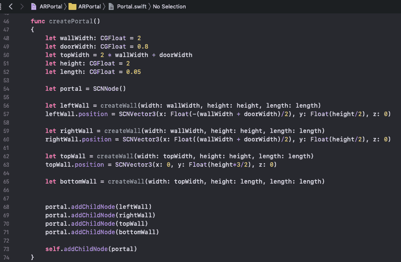

`createPortal`方法

1.  现在，让我们从`init`中调用这个方法。在添加 3D 模型后，添加以下代码：

```cs
createPortal()
```

1.  如果我们运行应用程序，当我们点击地板时，我们会看到一个白色的墙壁，通过它的缝隙，我们可以看到 3D 模型。当我们穿过它时，我们会发现自己身处 3D 画作中，如下面的截图所示：

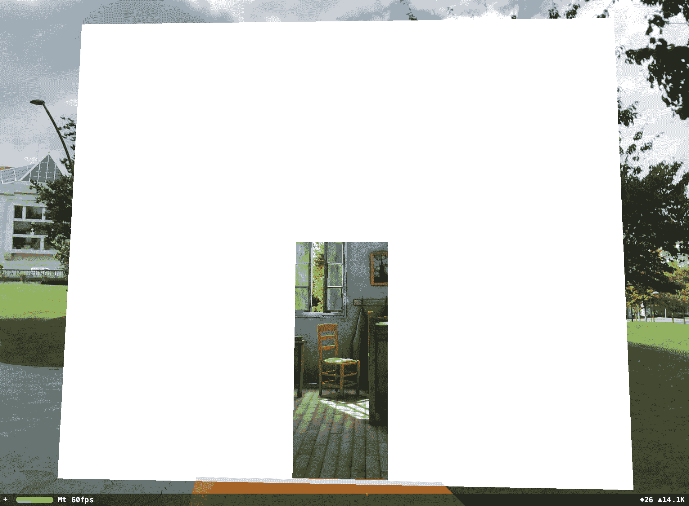

覆盖大部分 3D 画作的白色墙壁

我们也可以让墙壁变得可见，这样我们就可以回到现实世界：

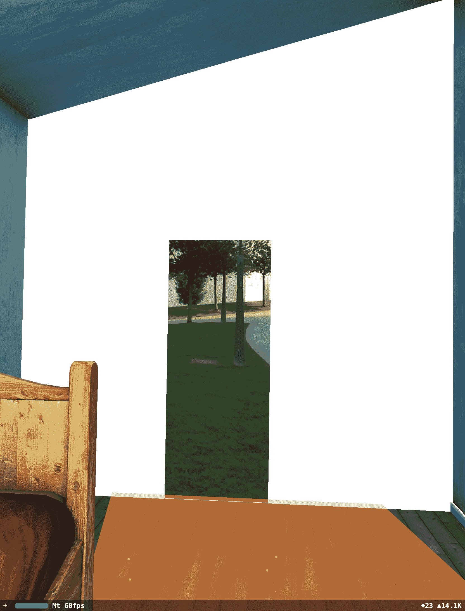

3D 画作内部的视图

1.  然而，从外面看，我们不想看到一个白色的墙壁；传送门应该只是空气中的一个开口（墙上的缝隙）。为了达到这种效果，在调用`return node`之前，让我们在`createWall`方法中添加另一个盒子。添加以下代码：

```cs
let maskedWall = SCNBox(width: width, height: height, length: length, chamferRadius: 0)
maskedWall.firstMaterial?.diffuse.contents = UIColor.white
maskedWall.firstMaterial?.transparency = 0.000000001

let maskedWallNode = SCNNode(geometry: maskedWall)
maskedWallNode.position = SCNVector3.init(0, 0, length)

node.addChildNode(maskedWallNode)
```

这个新墙壁位于另一个墙壁之前，其透明度接近 0（如果设置为`0`，则被涂成黑色），这样我们就可以看到背景。但仅此还不够。

1.  将`wallNode`的渲染顺序设置为`100`，将`maskedWallNode`的渲染顺序设置为`10`，但将`createWall`方法的最终代码保持如下：

```cs
func createWall(width: CGFloat, height: CGFloat, length:
CGFloat)->SCNNode {
    ...
    wallNode.renderingOrder = 100
    node.addChildNode(wallNode)
    ...
    maskedWallNode.renderingOrder = 10
    node.addChildNode(maskedWallNode)
    return node
}
```

`createWall`方法现在应该看起来如下：

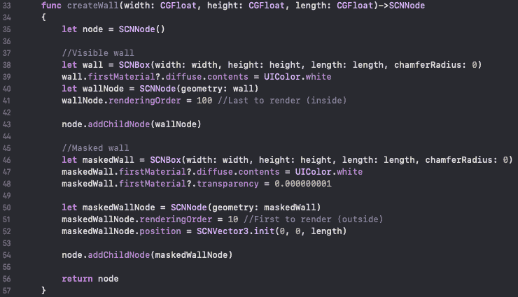

最终代码的`createWall`方法

1.  为了完成这个，给我们在`add3DModel`方法中创建的`modelNode`添加一个渲染顺序`200`：

```cs
func add3DModel() {
    ...
    modelNode.renderingOrder = 200
    self.addChildNode(modelNode)
}
```

渲染顺序越低，物体在场景中的渲染速度越快。这意味着我们将首先看到`maskedWallNode`，然后是`wallNode`，最后是`modelNode`。这样，每当遮挡墙在视图中时，其表面后面的 3D 元素将不会被渲染，留下一个透明的表面，直接显示摄像头画面。唯一会被渲染的 3D 画作部分是未被墙壁覆盖的部分，即我们的传送门门。一旦我们穿过传送门，我们将看到完整的 3D 画作，当我们回头看时，我们将看到我们的白色墙壁。

1.  运行应用程序，通过触摸屏幕来查看传送门是如何出现的。在下面的截图中，我们可以看到遮挡墙如何显示摄像头画面，隐藏其他元素。在这里，我们只能看到墙壁的开口（因为我们已经将其放置在遮挡墙的*z*轴后面）和通过开口的画作：

你可以在`showFeaturePoints`行和`renderer`方法上添加注释，这样特征点和锚平面就不会干扰我们的 3D 场景。

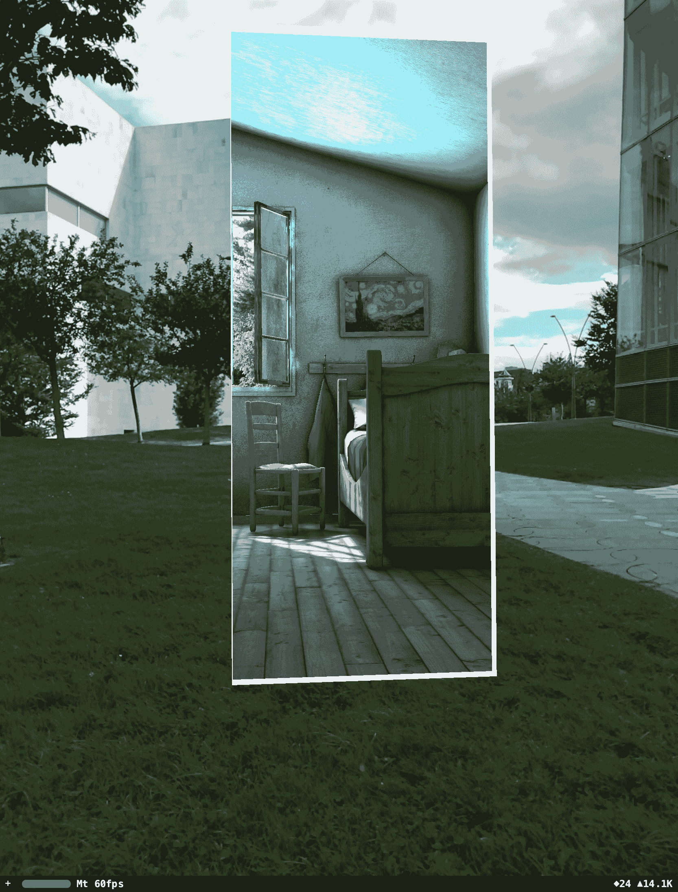

出现在 AR 中的门户

一旦进入绘画，如果我们回头，我们仍然会看到白色的墙壁和通往现实世界的出口，就像之前一样。

现在场景已经准备好了，让我们通过给墙壁添加一些纹理来改进它。

# 改进门户

我们将通过给墙壁添加一些纹理和一个将显示门户出现位置的指南针图像来改进我们的门户。为此，我们必须将纹理图像和指南针图像添加到我们的项目中。要这样做，请按照以下步骤操作：

1.  右键点击 ARPortal 项目，选择“新建文件...”在此情况下，从资源选项卡中选择 SceneKit 目录，如图所示：

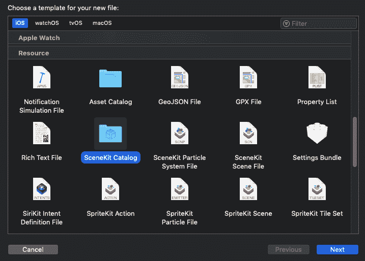

选择新的 SceneKit 目录

1.  将其命名为`Media.scnassets`并创建它，如下所示：

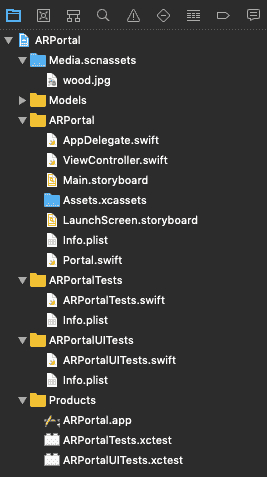

SceneKit 目录已成功创建

1.  右键点击新创建的`Media.scnassets`，选择“将文件添加到'Media.scnassets'...”。现在，从本项目的资源中选择`wood.jpg`图像并接受它。我们的图像已准备好使用。

1.  用`compass.png`图像重复*步骤 3*。

1.  打开`Portal.swift`，在`createWall`方法中找到以下行：

```cs
wall.firstMaterial?.diffuse.contents = UIColor.white 
```

将其修改为如下所示：

```cs
wall.firstMaterial?.diffuse.contents = UIImage(named: "Media.scnassets/wood.jpg")
```

在这里，我们已将木质纹理添加到我们的门户中。

1.  现在，我们将在`ViewController.swift`中绘制指南针。为此，在门户变量之后创建以下变量：

```cs
var compass: SCNNode? = nil
```

1.  现在，取消注释第一个`renderer`方法，这是添加锚平面的地方（如果你已经注释了它），并用以下代码替换其中的代码：

```cs
if portal == nil && compass == nil
{
    let node = SCNNode()
    guard let planeAnchor = anchor as? ARPlaneAnchor else {return nil}

    let plane = SCNPlane(width: 0.8, height: 0.8)
    plane.firstMaterial?.diffuse.contents = UIImage(named: "Media.scnassets/compass.png")
    plane.firstMaterial?.transparency = 0.8

    let planeNode = SCNNode(geometry: plane)
    planeNode.position = SCNVector3(x: planeAnchor.center.x, y: planeAnchor.center.y, z: planeAnchor.center.z)
    planeNode.eulerAngles.x = -Float.pi/2

    node.addChildNode(planeNode)

    planes[planeAnchor] = plane
    compass = node

    return node
}
return nil
```

在这里，当检测到平面锚点时，如果没有门户或指南针在视图中（第一次检测到平面时），我们将绘制一个半透明的指南针，向用户显示未来门户的位置和方向。然后，我们将保存节点作为锚点，以便我们可以在*步骤 9*中使用它。

1.  如果你还没有注释`didUpdate`渲染方法，请现在注释它。我们以后不再需要它了。

1.  在`didTapOnScreen`方法中，删除`portal = Portal()`和`self.sceneView.scene.rootNode.addChildNode(portal!)`之间的代码，并替换为以下代码：

```cs
if (compass != nil)
{
    portal?.position = compass!.position
    portal?.rotation = compass!.rotation

    compass?.removeFromParentNode()
    compass = nil
}
else
{
    portal?.position = SCNVector3(x: result.worldTransform.columns.3.x, y: result.worldTransform.columns.3.y, z: result.worldTransform.columns.3.z)
}
```

在这里，当用户第一次点击屏幕（指南针在视图中）时，我们使用指南针的位置和旋转放置门户，因为我们不再需要它，所以我们会删除指南针。从那时起，如果用户继续点击屏幕，门户将根据点击和锚平面位置移动，就像之前一样。

1.  运行应用以查看设备检测到锚平面时指南针如何立即出现：


出现在屏幕上的指南针，指示未来门户的位置和方向

1.  现在，轻触屏幕以查看门户有一个木制框架。这可以在以下屏幕截图中看到：

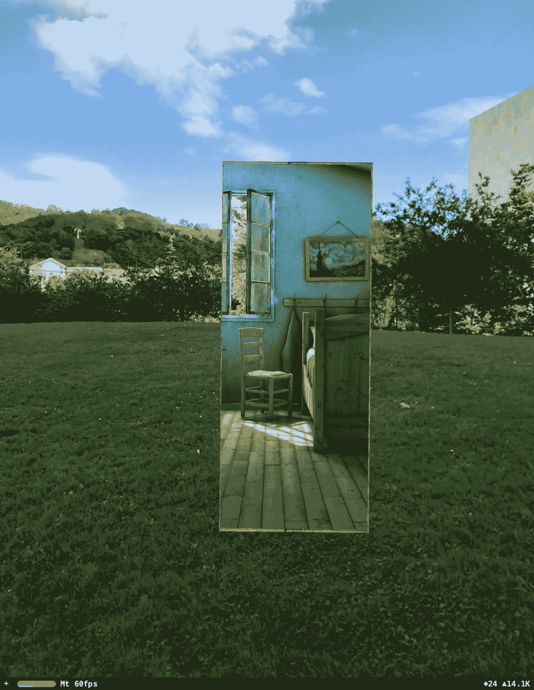

门户现在有一个木制框架

1.  从内部看，墙壁的纹理也发生了变化，如下面的屏幕截图所示：

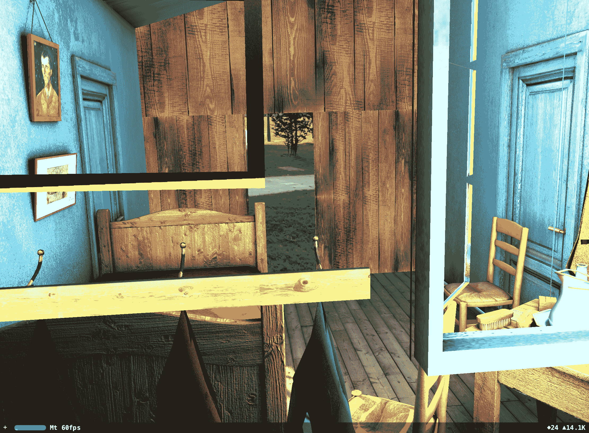

3D 绘画内部的视角

就这样。现在，你可以将门户放置在任何你想去的地方，并玩转不同的选项，比如更改 3D 绘画或同时创建多个门户。这取决于你！

# 摘要

在本章中，我们学习了什么是 ARKit 以及它是如何工作的。我们看到了相机如何识别特征点以及如何创建锚定平面，在这些平面上你可以放置虚拟元素。我们还学习了如何使用 SceneKit 将 3D 模型插入场景并操纵它们以创建一个 AR 门户，引导用户进入 3D 环境。

到现在为止，你应该已经掌握了基本技能，可以继续改进当前项目，并适应旅游行业或其他行业的个人需求。你可以尝试在界面中添加按钮来更改门户的 3D 内容，当门户首次出现时添加粒子效果，或者甚至尝试使用 360 度视频代替 3D 模型。AR 是一种跨领域的工具，可以用多种方式使用，并应用于许多不同的需求，因此你也可以为营销或零售等领域创建这个门户。

这是本书的最后一章，它致力于企业中 AR 的应用。到现在为止，你应该对 AR 如何在许多用途中发挥作用有一个更广泛的认识，包括旅游。现在，你需要做的就是开始尝试使用你所学到的不同框架和工具，并将它们适应到自己的需求和项目中。祝你好玩！

# 进一步阅读

如果你想要探索 ARKit，无论是为了推进当前项目还是尝试新事物，我们推荐查看苹果的示例项目，这些项目可以在 [`developer.apple.com/documentation/arkit`](https://developer.apple.com/documentation/arkit) 找到。以下是一些这些项目的例子：

+   提到的 [`developer.apple.com/documentation/arkit/tracking_and_visualizing_planes`](https://developer.apple.com/documentation/arkit/tracking_and_visualizing_planes) 项目，你可以使用它来跟踪和可视化平面锚点

+   [`developer.apple.com/documentation/arkit/detecting_images_in_an_ar_experience`](https://developer.apple.com/documentation/arkit/detecting_images_in_an_ar_experience) 项目，你可以使用它来检测 2D 图像（例如，门户可以出现在真实的画作上而不是街道中间）

+   [`developer.apple.com/documentation/arkit/tracking_and_visualizing_faces`](https://developer.apple.com/documentation/arkit/tracking_and_visualizing_faces) 项目，你可以使用它来跟踪面部并通过真实表情动画虚拟头像

随着 iOS 13 的发布，你可以尝试更多功能和项目，例如当人们站在虚拟物体前面时遮挡它们，或者通过手势与虚拟内容进行交互。
