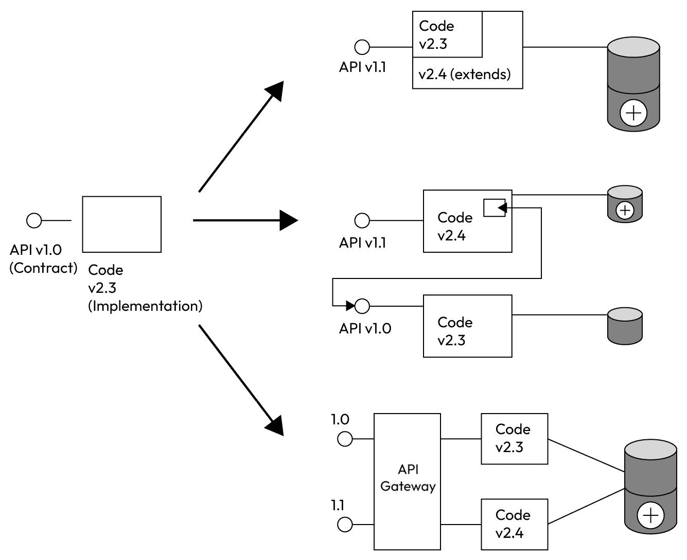
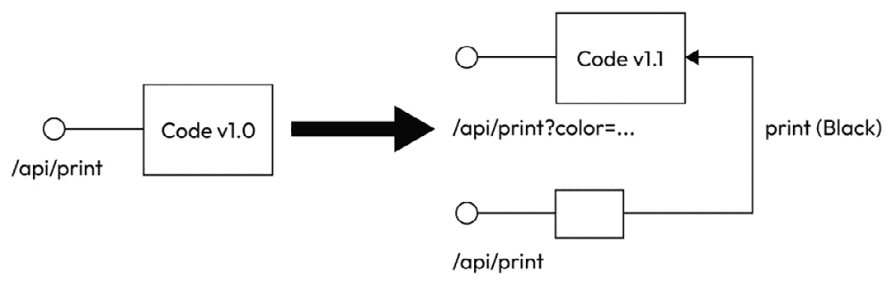
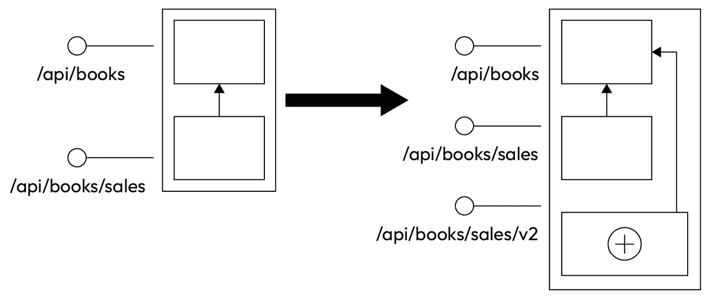
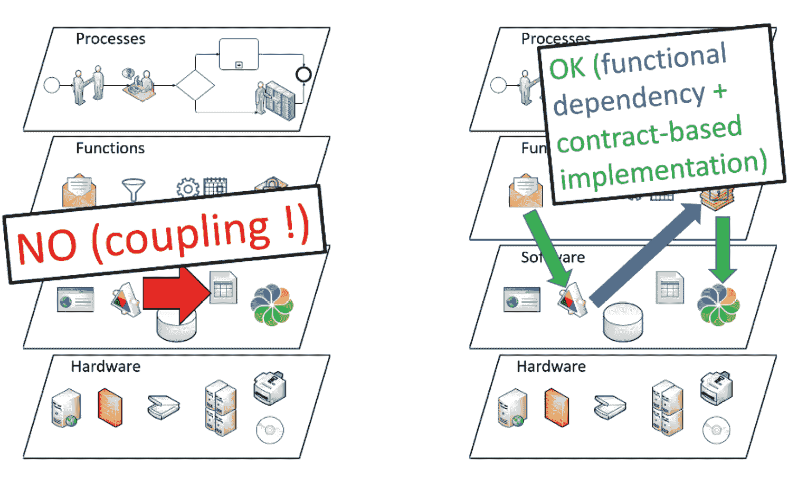
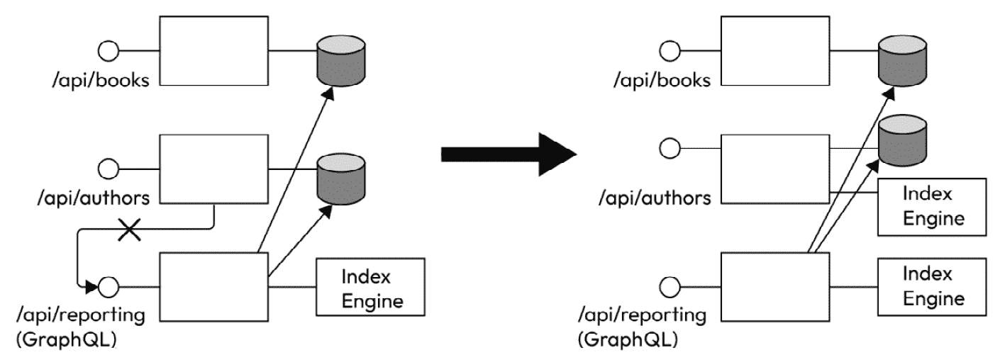

# 第六章：SOLID 原则，从代码到系统

从本章开始，我们将从理论部分转向，尽管我们还没有开始编码（这将在*第十三章*开始），但我们将开始将理论应用于设计由几个应用程序组成的小型信息系统。我们将分解不同的功能，展示它们如何帮助产生业务流程结果，并创建这些功能背后的软件。为此，我们将设计不同的组件和涉及服务的 API 合同，并思考数据应该如何设计和治理。在*第十三章*中，我们将使用所有这些设计阶段来实际实现样本信息系统。

当然，这个信息系统将在范围和复杂性上有所缩减，但这个练习已被设计成包括应该做出的大多数重要决策。你会发现严格的责任分离，过程和功能之间有良好的分离，通过 API 解耦服务，标准化合同，采用最佳实践方法，将软件堆栈适应所需的功能，软件和硬件之间的独立性，以及许多其他原则。

在本章中，我们将通过思考它应该公开的功能来开始设计我们的演示系统。为此，我们将使用**SOLID 原则**，将它们扩展到信息系统。SOLID 是由软件开发五个基本原则的首字母组成的缩写，这些原则如下：

+   **单一责任**指出一个模块应该只做一件事

+   **开/闭**区分了对进化的开放和对修改的封闭

+   **Liskov 的**原则解释了替换应该如何工作

+   **接口分离**随后讨论了合同应该如何与业务功能紧密对齐

+   最后，**依赖倒置**处理了耦合以及它应该如何进行，这与大多数情况下看似自然的方式相反

这些原则，通常应用于软件应用，实际上适用于每个软件系统，并且是设计它们不同模块的绝佳方式。因此，我们将使用它们来设计我们的样本信息系统。但首先，我们需要描述这个系统的业务需求。

# 描述样本信息系统需求

在进行任何分析之前，我们将想象系统所有者希望从系统中得到什么。当然，正如我们解释的那样，时间是信息系统设计中非常重要的约束条件，其生命周期很长，我们将模拟我们最初并不了解所有需求的事实。特别是，本书的最后一章将模拟信息系统的虚构公司出现新的需求，并解释系统将如何适应这些需求。这一点尤为重要，因为本书的主要目标是展示系统应该如何创建或适应，以便其随时间演变的简单性。

为了使练习尽可能真实，同时保持简单以便包含在一本书中，我们将想象公司、信息系统的用户、他们的业务、他们操作的数据等等。这就是我们将在本节中要做的事情。

## 公司及其业务

我们将称这家公司为**DemoEditor**，它将是一家与个人作者签订书籍写作合同并随后销售这些书籍的编辑公司。我们将想象这是一家相当小的公司（少于 50 人），并且其当前的信息系统极其简化，主要由一个标准的 Office 365 组织提供电子邮件功能、基本的 SharePoint 文档管理、一个外部的网站，以及大量通过 Excel 工作簿实现的内部功能。

尽管目前这种状况还算舒适，因为信息系统尚未因为长期积累的点对点互操作、遗留软件应用的退化等问题而变成一团乱麻，但它仍然显示出效率低下的迹象。Excel 工作簿的多个副本使得员工难以清晰地看到作者池和书籍写作的状态。此外，由于写作过程不统一，公司总监抱怨无法找到关于全球进度或书籍交付延误的清晰统计数据。

业务主要是寻找适合市场的主题，选择合适的作者，跟进书籍的写作，以及组织合适的销售流程。

## 信息系统的用户和参与者

50 人当中，大多数是图书编辑。接下来是销售团队，一点行政人员，以及总监。在这个简单的例子中，我们将考虑所有书籍的印刷和发行都外包给另一家公司，而 DemoEditor 只专注于编辑过程。

图书编辑的工作是寻找作者，寻找书籍主题，并将合适的作者与合适的书籍匹配。然后，他们跟进写作过程，确保质量达标。

然后，这取决于销售团队，他们的工作是寻找间接客户，这意味着图书馆或书店组织，因为 DemoEditor 并不直接向读者销售。这意味着商人实际上是通过数量而不是单位来销售书籍的，尽管在我们演示软件系统中我们不会过多地处理这部分，但在实际情况中这会很重要。

最后，总监需要通过销售团队和编辑提供的报告和统计数据来监控数字。公司的顺利运营在很大程度上取决于书籍的截止日期，正如写作质量、主题与作者的匹配以及读者和书店的期望一样。这意味着总监必须衡量所有这些指标，信息系统当然也预期提供这些信息。要求编辑或销售人员每周填写 Excel 表格是没有意义的，因为这会让他们失去实际工作的宝贵时间。

## 数据操作

如你所想，DemoEditor 的信息系统将不得不处理有关作者、书籍和销售的数据，以及从这些原始数据中提取的一些附加统计数据。作者将通过他们的身份、一些联系信息、可能还有支付版税的银行坐标以及他们的技能信息来识别。书籍将使用业务范围内的参考编号、标题、摘要以及其他关于内容的信息进行注册。销售基本上是向书店销售的书籍数量，以及相关的日期和可能的销售条件。

报告数据将是一切可以由总监用于销售、作者和书籍的业务智能的数据：每个类别销售了多少本书，销售的时间趋势如何，作者在销售放缓和新鲜感不再起作用之前可以就给定书籍完成多少版次，谁是他们的最佳销售员，哪个书店退回的书籍最少或重新订购得最快，等等。报告数据无疑是与时间相关的，这不仅是因为报告随时间演变，而且还因为报告应该显示业务在时间和地理上的动态。

## 信息系统对公司的重要性

DemoEditor 是一家小型公司，这意味着员工可以“填补空白”并做一点任何事情。虽然这在某些情况下是一个优势，意味着他们敏捷且适应性良好，但它也意味着他们不太倾向于以工业化和可重复的方式做事。电子表格可能会被复制并在公司不同版本中传播，而不是在网络上保持一个独特的参考版本。此外，数据销售被分散到不同的销售人员手中，因为他们往往相互竞争，因此很难统一数量折扣（价格是固定的）以及客户名单。

由于商业管道并不非常正式，一些潜在客户在没有销售人员真正能够提供关于花了多长时间和多少努力才能将潜在客户转化为客户的统计数据的情况下，就变成了客户。总监在不知道如果他们雇佣更多的销售人员公司是否会卖出更多产品时，确实很难。为合适的书籍选择作者也是一个问题。一般来说，编辑对市场有很好的把握，并且非常清楚哪些主题应该被撰写。但是，合格的作者池相当有限，而且作者们大多因他们已经写过的书而知名。大多数时候，编辑不知道这些专家还了解哪些其他技术，而且有时候，在花费了大量时间寻找作者之后，一本书被签约给了一个新作者，结果编辑几周后才发现，实际上有一位已经为 DemoEditor 写过几本书的优秀作者实际上具备新项目的正确技能。对于 DemoEditor 来说，一个更新、共享和高效的知识库对于作者能力至关重要。

## 负责改进系统的人看到的状况

经理要求你过来帮助处理信息系统。公司里的每个人都清楚 IT 可以更加高效并帮助他们更好地工作，但他们说，他们并不是 IT 方面的专家。由于没有内部 IT 人员，他们尽力而为，但他们意识到小型公司的“自己动手”精神只能走这么远，他们不得不找人来提供一些结构。经理也担心在完成这项工作之前增加公司规模；否则，这可能会带来更多问题而不是增长。

随着业务流程的进行和预算不可扩展，你被分配的任务是“*在汽车行驶时更换轮胎*”。IT 系统可能会有一些短暂的停顿，但不会持续很长时间。数据必须被清理，但作者和书籍的数据库必须在过程中保持可用，因为它们是公司大多数员工日常工具。经理并不太关心报告不可用或甚至被破坏，因为目前它并不很有用，而且大多数数字本来就不准确。

在接下来的章节中，我们将置身于一个被要求执行这项基础任务并设计更新后的 IT 系统不同组件的工程师的角色，并决定其服务应该如何运行以及应该设计哪些业务领域。之后，我们将实施所有这些，并逐步转型信息系统。但到目前为止，我们必须将前几章学到的理论转化为将指导我们前进的原则。SOLID 原则是一套非常适合的原则。

# SOLID 原则及其在任意规模系统中的应用

SOLID 原则是适用于软件应用的重要原则，但它们也恰好非常适合软件系统的一般应用，因此我们可以使用它们来构建我们的项目。我们将逐一解释这五个原则，以及它们如何应用于 DemoEditor 要求的转型和其新信息系统的设计。由于这是一本关于信息系统的书，而不是关于软件开发的书，尽管我们最终会构建一些实现，但我将不会从编码的角度描述这些原则，而只是简要地介绍它们的主要思想和，更详细地，它们在系统设计中的转化。

## 单一职责原则

这个原则指出，一个类，或者在我们的情况下，一个信息系统模块，应该只做一件事，并且只做一件事。这个定义相当宽泛，但可以通过指出一个实体应该只有一个业务理由来改变来稍微缩小范围。如果同一个类在作者管理和书籍管理发生变化时应该升级，那么这与单一职责原则有关，并且这个类应该被分解成至少两个更小的类。

这个原则显然很容易翻译到适用于信息系统的场景中，它直接应用于模块，无论是服务、组件还是整个系统的其他部分（我们将在下一章回到粒度管理的话题）。系统中的每个实体都应该只做一件事，并且只做一件事。如果从组成系统的软件应用的角度来看，这意味着每个应用都应该负责系统的一个业务领域。由于我们管理作者、书籍、销售等等，我们确实应该为这些找到各自的应用。这个业务领域的概念现在还不够精确，但同样，我们将在未来的章节中回到这个话题，即*第九章*，详细阐述**领域驱动设计**方法和领域以及边界上下文的概念。

目前，我们只需同意一个业务领域需要其自己的应用程序。如果你在考虑微服务，是的，我们将遵循这条路线，但请耐心等待，因为这个“微”的限定条件并不总是必要的，我们更愿意谈论“服务”（在*第八章*中有更清晰的定义）。

这个首要原则听起来可能非常简单（它的表述确实如此），但其含义可能非常深远。为了给出我们将在示例应用程序中必须处理的复杂性的一个例子，让我们展开一个服务依赖于另一个服务的案例，比如“书籍作者”的关系。正如之前所说，作者和书籍管理是两个不同的责任。但我们应该如何处理两者之间的关系？是另一个服务吗？无论如何，当有人从服务中读取书籍实体时，应该如何检索和显示书籍的作者？我们可以反过来问相同的问题：如果有人调用特定作者的 API，我们应该如何显示这位作者参与编写的书籍列表？

深入探讨这个最后场景有助于更好地理解责任的概念。想象有两个独立的服务，每个服务都有自己的数据库，因为它们应该独立。现在，一个用户使用`GET`请求调用特定书籍的 API，比如说`https://demoeditor.org/api/books/123456`。模块确实负责发送书籍标题、ISBN/EAN 号码和书籍的一些其他属性。那么关于作者的信息呢？这就是责任原则帮助划清界限的地方。编辑们会告诉你，大多数时候，当他们获取书籍信息时，他们需要知道作者，但只需要他们的标识符和一些主要数据，比如他们的首字母和姓氏。这是书籍服务的责任。如果你再次询问你的产品所有者（编辑们，因为他们将是使用信息系统的人），并且他们需要更多数据，他们会转向`/api/authors`服务来获取，当然使用`/api/books`服务提供的初始答案中的标识符。因此，这些数据是第二个服务唯一的责任。

每个了解良好数据库设计原则的读者可能已经感到窒息了，考虑到这种方法需要数据重复。确实，由于`/api/authors`负责作者的全部数据，包括当然的首字母和姓氏，这意味着如果`/api/books`负责在请求时提供给定书籍的标识符、首字母和姓氏，那么非重复规则就被打破了！而且这正是责任概念有趣且应该深入挖掘的地方。我们考虑以下责任分配如何？

`/api/authors` 服务负责提供关于作者的始终是最新的数据，包括他们的名和姓。这意味着它是作者的真实参考来源：任何需要关于作者最新、最佳信息的人都应该转向这个服务，该服务将负责及时提供这些信息。由于它是这些数据的参考，该服务当然会提供带有价值日期的数据，因为数据可能会随时间变化。例如，作者结婚后可能会更改他们的姓氏；作者服务应该跟踪这一点，因为它负责作者及其数据完整性。

`/api/books` 服务负责为书籍提供相同的服务，这意味着在书名、标识符等方面有相同的服务水平。但当谈到一本书的作者时，这涉及到另一个参考服务的关系，因此它所负责的服务数据仅仅是指出在另一个服务中的正确实体。这提出了两个有趣的问题。

第一个问题是功能性的：链接应该是简单地指向一个特定的作者，还是应该指向作者在特定时间点的值？这需要回答一些业务规则：如果作者在第一版和第二版之间结婚，书籍上出现的作者名字应该改变吗？如果是这样，如何调整注册的版权？对于书籍原始版本的简单重印，情况是否相同？

第二个问题是更技术性的：如果书籍服务存储了作者服务的链接，而后者在需要时不可用，会发生什么？如果“通常”的数据（名和姓）已经在书籍服务中存储，那么没有问题，因为它现在与第二个服务是*独立的*。但这又回到了功能问题：如果作者结婚后书籍上的名字不应该改变，那么没问题，甚至更好，因为本地副本将防止在具有检索“旧”数据的日期时难以访问作者服务。如果名字应该演变，可能最好是暂时退回到旧名字，而不是仅仅提供机器可读的标识符；只有编辑者才会知道……

我希望这个例子，尽管复杂，已经向你展示了我们所说的“责任”一词的含义。诚然，这很复杂，但请记住，我们谈论的一切都与商业复杂性相关，并非偶然。确实，谈论价值日期和参考数据管理中历史的重要性可能听起来过于复杂，因为这在当前的信息系统中并不常见。但这确实是一个真实的问题，而且这种对实际功能现实的缺乏反思也是一个问题，因为它阻止了对所有业务规则的反思！这并不意味着基于这种反思构建的软件将考虑到所有这些复杂性。在真正的敏捷方式中，你肯定会从非常简单的东西开始。但这个对功能复杂性的深入理解确保了软件在未来将易于演化，而且你不会在某个实施点上卡住，因为软件与业务不匹配。

## 开放/封闭原则

**开放/封闭原则**在其表达方式上本身就包含了一个悖论，这使得它一开始看起来很奇怪：一个模块怎么可能同时是开放的和封闭的？理解这个原则对于创建将不断演化的系统非常重要，因为它指出了什么应该保持封闭，什么应该开放以改变，以便这种演化尽可能顺利地进行。

当应用于面向对象编程时，开放/封闭原则指出，一个类应该对扩展开放，但对修改封闭。封装和私有成员用于防止程序中的任何实例直接修改另一个实例的状态；否则，在执行程序时跟踪发生的事情将非常困难。如果没有办法跟踪哪个类修改了另一个类的状态，那么调试也会变得复杂。这就是为什么一个类保持其成员私有，并且只开放一些公共函数，以允许对其状态的某些更改，这种方式由其自己的代码控制，遵循其自己的规则。这是原则的封闭部分。

但通常情况下，一个类不会被标记为`final`以允许另一个类从它继承并专门化标记为`virtual`的功能。继承的类还可以添加一些数据成员，除了访问标记为`protected`（或者当然，`public`）的从继承类之外。再次强调，类控制着什么可以被覆盖，什么不能，但至少它对另一个类扩展其行为是开放的。这是原则的开放部分。

将此原则应用于信息系统并不意味着在反思上发生重大变化，因为服务替换了类，扩展或保护的技术仅从实际观点来看有所不同。如果我们继续以服务是 REST API 的例子为例，我们可以在类的成员和 API 合同实现持久化的数据之间建立平行关系：只有服务可以修改这些数据，因为只有实现可以访问持久化使用的（数据库或其他）。当然，一些 API 方法可能允许从 API 客户端传递一些特定的修改，但 API 实现控制这一点，并应用业务规则以确保修改按其意愿进行（或者，顺便说一句，可能被拒绝）。这是原则在信息系统模块中的应用的封闭部分，它在与类应用中的相似性方面非常明显。

在 API 上实现开放原则的部分更为复杂，因为 API 的行为可以通过多种方式扩展：

+   实现这一目标的一种方法是通过创建一个将扩展初始 API 合同的 API。OpenAPI 语法中存在实现多态的机制，也可以以这种方式聚合类型，使得新的类型包含初始类型及其所有内容。

+   另一种方法是创建一个 API，它替换了旧实现的展示，但仍然依赖于所有标准数据，并在此基础上提供自己的数据。如果做得仔细，扩展后的 API 甚至可能与初始 API 合同完全兼容，因为它只添加了新的数据（如果它只是传递初始数据而不改变任何行为，甚至符合我们很快将看到的 Liskov 替换原则）。

+   第三种选择是使用 API 网关来公开更新的合同，并实现来自原始 API 和来自另一个服务的附加数据的混合，该服务专门用于其存储和处理。这种方法在继承原则上更接近。

这三种方法可以概括如下：

图 6.1 – API 的开放/封闭方法

## Liskov 替换原则

`Display`接口将实现一个`print`函数，该函数在白色纸张上打印黑色文本（通过打印机、屏幕或其他任何东西；这里不重要）。现在假设有一个名为`ColorDisplay`的类专门化`Display`类，并再次提出一个新的函数签名`print`，但接受一个名为`color`的参数，允许用户指定他们想要的任何颜色。无参数的`print`函数应该如何表现？继承的类肯定会指向其新的改进后的`print`函数。在这种情况下，应该将什么默认颜色传递给这个函数？如果你回答“当然是黑色”，你就知道 Liskov 替换原则是关于不让类的用户感到惊讶，并确保他们知道行为是预期的。

对于模块化信息系统中的服务也是如此。再次，我们将使用 API，因为这是在这种系统中分解模块的标准方式。当你得到一个 API 合约时，它声明了可以调用哪些方法，使用哪些动词，以及通过哪个 URL；它还声明了你可以发送或接收的属性的准确名称。但你完全可以尊重 API 合约的字面意思而不尊重其精神，这正是 Liskov 替换原则所涉及的。

让我们将之前面向对象编程的示例翻译成 API 服务，并想象一下，有人可以使用`/api/print`的 1.0 版本来处理将被发送到设备上的黑色文本。如果使用`/api/print` API 的 1.1 版本，并且支持`/api/print?color=[HEX-VALUE]`，我们肯定会期望将我们的旧客户端指向新的 API 会导致黑色文本的产生。在 API 合约与其实现之间的流中，这可以描述如下：

图 6.2 – Liskov 替换原则

## 接口分离原则

`Rectangle`类实现了`IShape`接口。这意味着`Rectangle`必须实现`getSurface`和`getPerimeter`方法，还必须实现一些方法，如`drawShape`等。如果程序中唯一有趣的事情是计算形状的数学特性，那么正确的方法是将`IShape`拆分为`IGeometricalShape`和`IDrawableShape`（即分离接口），以便类只实现它们需要的接口。

对于 API 合约也是如此。回到我们的图书服务，最好将两个合约分开，一个用于图书特性，另一个用于图书销售特性，即使相同的实现会公开两个接口，一个位于`/api/books`之后，另一个位于`/api/books/sales`之后，而不是通过仅使用一个合约来强制实现所有函数。

虽然总是可能（并且在 API 中比在类中更可接受）以`NotImplemented`消息响应，但将接口分为两个也使得引入版本更容易。如果销售接口在 1.0 版本中没有正确定义，并且需要进行重大的、向后兼容的重写，那么将能够在不进行任何更改的情况下继续暴露书籍的特性（可能被大多数客户端使用）。

注意

**向后兼容性**是 API 新版本的质量，其中所有在先前版本中使用的调用在新版本上工作结果完全相同。

接口隔离甚至使得暴露三个 API 合约成为可能（并且很容易），即`/api/books`、`/api/books/sales`和`/api/books/sales/v2`：

图 6.3 – 接口隔离

虽然在解释中这一点相当明显，但遗憾的是，这个原则在现有的 API 中经常被遗忘。这尤其是因为编辑倾向于在从实现生成 OpenAPI 合约的框架中提供函数，而不是遵循合约优先的方法（虽然这确实更复杂，但这是唯一能够产生正确、与业务对齐的 API 的方法）。由于合约是从整个源代码自动生成的，生成器不会区分不同的方法和资源，产生一个单一、不可分割的合约，该合约不遵守接口隔离原则。

## 依赖倒置方法

**依赖倒置方法**之所以被称为如此，是因为它与传统关于依赖的思考方式相反。想象一下，我们有一个报告模块和另一个提供用于报告目的的数据的模块。自然地，我们倾向于认为从功能角度来看，报告模块应该在技术上依赖于数据模块。这是一个罕见的情况，其中将技术设计直接与功能概念对齐并不足够好。如果我们想确保低耦合，我们必须再迈出一步，向两个服务都将依赖的共同接口添加一些间接性：

+   就像`Data`类会实现`IData`接口一样，`/api/data`服务应该实现数据 OpenAPI 文件中定义的 API 合约。

+   就像`Reporting`类会使用`IData`源（而不是直接使用`Data`实现）来防止硬耦合一样，`/api/reporting`服务不会直接调用`/api/data`服务，而是调用配置提供的 URL，前提是它实现了数据 OpenAPI 合约。在面向对象编程中，这通常通过注入来完成。在服务中，根据编排机制，这可以通过 API 网关、入口暴露或甚至（更复杂的）服务网格来实现。

下面的图已经用于*第三章*，但它在这里特别相关，因为它直观地展示了信息系统中的依赖倒置原则：不是软件模块之间的依赖，而是两个模块共同工作，指向同一个业务合同定义（纯粹是功能性的），一个来实现它，另一个来消费它：

图 6.4 – 四层耦合图

让我们继续到下一节，我们将分析 SOLID 原则。

# 对 SOLID 原则的批判性分析

虽然我及时意识到（当然像许多人一样）SOLID 原则几乎适用于信息系统，就像适用于面向对象的类和接口一样，但有些部分值得讨论。确实，对于任何其他原则，严格的、不考虑周全的应用可能会导致问题。即使原则在特定情境中适用得很好，它们也可能有强烈的副作用，最终使它们比有帮助更有害。必要的谨慎方法导致了大量的争论，你必须小心处理这些原则。

## 职责分离的局限性

第一个（也许是最重要的）原则，即职责分离原则，有时很难应用——在某些情况下可能甚至不可能——应用到服务或应用的高级模块中。对于类来说，一旦编译完成，总是有可能在不影响整个应用的情况下分解一个类。服务和模块并不提供这种易于组合的特性，因为它们附带额外的约束，如暴露、端点、编码接口、文档、集成子系统等。所有这些都对分解产生了影响，这也是为什么那些不谨慎对待微服务并在系统中过度分解它们的人最终花费更多时间在它们的演变上，而不是如果他们坚持使用单体架构的话。我不会再次谈论粒度，因为这个问题已经在之前的章节中讨论过了，但这是显然需要深思的问题，可能会限制职责分离原则的适用范围，或者至少是其深度。

另一个困难与你能将责任分离得多深无关，而是与某些责任有时多么复杂有关，即使在相对较高的层面上也是如此。例如，这是“微前端”架构中的一个巨大困难，我并不是在谈论与前端组件“微”相关的那个问题。简单的事实是，视觉组件不仅呈现功能，还具有视觉影响，这在使它们独立方面是一个巨大的困难。例如，在[`jonhilton.net/good-blazor-components/`](https://jonhilton.net/good-blazor-components/)中暴露了这一点：通过将 Blazor 组件的内容委托给另一个子组件（在文章的例子中，使用`ChildContext`属性包含一个`Card`实例），你确实将显示视觉组件内部部分的责任外部化了。但这并不意味着它不会产生影响，因为子组件的渲染必然会影响其上方的组件。事实上，容器要么为子组件固定一个大小并承担其显示的责任，要么以纯响应式设计的方式让子组件调整其显示。在这种情况下，它自己的大小将受到其子组件的影响，这也破坏了通过责任分离原则本应实现的独立性。

对于这个问题，智力解决方案是考虑每个组件对其内容的负责，但不负责其显示，而这是浏览器中显示引擎的责任。这可能并不令人非常满意，因为它回到了整个前端的单一点执行，这是我们试图使其模块化和易于演进的目标，但至少在有限的范围内实现了组件之间的低耦合。这是在设计信息系统和模块化应用程序时必须做出的许多妥协之一。

## 关于单体架构的争论

本章可能是讨论关于“回归单体架构”这一长期争论的好地方，这是对在软件架构社区讨论中观察到的微服务缺点的一种反应。总的来说，微服务方法被认为是有害的，有些人建议回归单体应用程序。这遗憾的是又是一个当今极端辩论的例子，因为这两种方法（以及它们之间巨大的范围）都有价值，这取决于你的需求。

没有哪个严肃的人曾经假装微服务是适合所有架构的最佳解决方案。事实上，从一开始，大多数解释这种方法的文章就坚持认为，它们只适用于某些特定的环境（高流量、频繁修改应用程序、负责不同模块的团队之间有明确的界限等等）。然而，有些人没有考虑到这一点，现在抱怨微服务并不适合他们的案例。更糟糕的是，在一种二元且不太深思熟虑的反应中，他们摒弃了微服务的整个原则，并宣传所谓的“回归单体”。在这种情况下，任何理智的工程师都会简单地发现一个众所周知的摆动运动，其中一种极端追逐另一种极端。在这种情况下，解决方案既不在其中任何一个，也不在两者之间不断平衡，而只是在它们之间达到一个美好的平衡。

在软件应用程序的情况下，我们称什么为单体？一个由单个进程组成的程序？不，否则这意味着即使是像`cd`或`exit`这样的最小应用程序也应该被视为这样。这个术语正是用来描述那些负责太多业务功能、变得过于沉重以至于无法良好演变或适应其设计用途的单个应用程序。

关于所谓微服务架构的死亡和回归单体的文章中讨论的情况，根本就没有涉及到正确的话题，那就是服务的粒度。当然，微服务的非常小的粒度并没有满足他们的信息系统需求。但这仅仅意味着粒度太细。回到最粗的粒度（单体）只是显示了对于问题的理解深度不足。工程师处理这个问题的方式是寻找服务正确的粒度。正如[`codeopinion.com/biggest-scam-in-software-dev-best-practices/`](https://codeopinion.com/biggest-scam-in-software-dev-best-practices/)中所述，选择不仅仅是在“亚马逊在做，所以我们也做”和“我们不是亚马逊，所以我们不应该做”之间——对业务和上下文的分析知识才会告诉你你应该如何在这两者之间定位自己。

恰好存在一种称为领域驱动设计的设计方法，这是找到信息系统服务正确粒度的完美方法。它也与业务/IT 对齐的原则密切相关，因为它说明了业务领域如何被切割成内部紧密耦合、外部低耦合的模块。我们在我们的演示应用程序设计中所做的一切，都将是对这种正确粒度研究的说明，基于业务功能需求。

## 小心无意中的耦合

最后关于职责分离的一些建议（这个首要原则无疑引发了众多讨论！）：一旦你根据**业务能力图**明确划分了职责，职责分离的工作并未完成，因为在功能的技术转型过程中，很容易重新创建耦合。

我将给出一个此类问题的简单例子，因为它非常典型地代表了我在描述的陷阱。想象一下，我们创建了一个演示应用程序，其中包含一个用于书籍的 API，一个用于书籍销售的 API（可能位于相同的 URL 下，但在合同层面上仍然是独立的），以及一个用于作者的 API。公司总监可能在某个时候想要一份关于作者的地域起源如何影响其销售本地化的报告（也许布列塔尼的作者在其地区销售会更好，因为他们的联系网络更密集？或者可能没有影响？无论如何，这可能值得分析）。这是微服务中常见的问题，微服务本应拥有自己的持久性。在这种情况下，我们如何建立数据之间的联系，就像我们在添加单个数据库时创建`join`操作一样？一个标准的方法是添加一个收集数据结构，它从所有微服务中收集、索引和汇总数据，并提议一个具有自己 API 合同的专用`/api/reporting`服务。

当然，这个服务对其源存在一定程度的耦合，但这可以通过保持本地缓存或混合订阅数据变化的方法与较低频率的直接收集相结合来降低耦合级别，以确保没有信号丢失，并且数据在可控的频率下重置。此外，它还提供了原子数据服务中没有的有趣功能，例如索引、动态聚合能力等。**GraphQL**是一个很好的协议来公开此类服务，并且它们与**命令查询职责分离**架构集成得非常好。

然而，如果原子服务不仅为这个报告服务提供数据，而且开始从它那里消费原子数据，那么可能会出现意外的耦合。这可能会很快发生，因为索引引擎的性能提升对开发者来说非常有吸引力。问题是这导致了循环功能依赖，这本身就是一个相当大的问题，而且耦合程度更高，因为一旦这种依赖关系建立，原子数据服务就会突然与每个其他服务耦合。当然，耦合可能仍然很低，但无论如何，已经建立了一个联系，这在大多数情况下——我所见到的——都是进入系统的一个真正的痛点。

如果你真的需要在原子服务中进行快速的聚合读取，你必须通过在专门的持久性上添加索引等方式内部处理。如果你看到这个漂亮的索引引擎就在服务墙的另一边，这可能会听起来很复杂，但这是为了保持你的系统不受耦合影响并且易于随时间进化而必须付出的代价。再次强调，这是一个妥协，如果架构师认为功能耦合不是问题，你可以通过这样做来节省时间。但这是一个有意识的（并且有文档记录的）妥协。

图 6.5 – 降低耦合强度

# 在回到演示之前总结

在本章中，我们学习了可以应用于信息系统（而不仅仅是面向对象编程，因为它们最初的目标是）的 SOLID 原则；单一职责原则和接口隔离原则已被用来开始定义我们演示应用程序所需的不同的 API 合约。开放/封闭原则将帮助保持这个 API 语法的可进化性，并且其进化必须遵循 Liskov 替换原则，以便系统能够令人满意地进化。最后，依赖倒置已被证明是合同优先 API 的核心原则，以及能够将软件实现与面向业务的功能对齐，这是我们在这本书中寻求的主要目标。

在下一章中，我们将进一步设计我们的演示应用程序，通过定义其不同的组件。这将帮助我们描绘出我们想要在这本书中创建的第一版的大致轮廓，同时也能更清晰地定义应用程序的不同部分，使用一种适应分解深度的方法。
