# 第十一章：业务流程和低代码

业务流程遍布信息系统，在与 CEO 交谈时，他们通常会告知他们如何看待 IT：作为一种自动化公司业务流程的方式，提供可靠性、可重复性和——在最佳系统中——对发生的事情的可见性，无论这些事情是为内部客户还是外部客户带来价值。业务流程是公司信息系统的核心，因为每个活动通常由一个流程实例承载。当公司获得 ISO 9001 认证时，认证范围内的每个流程都得到了精确的记录，并且可以验证相关演员的实际使用情况。因此，这些流程结构化了公司的活动。

本章详细说明了从业务流程的角度来看，一个干净的架构应该如何表现，通过解释业务流程建模、业务活动监控和业务流程挖掘的概念，然后展示如何在 IT 系统中使用业务流程。本章讨论了低代码和无代码方法，以及基于 BPMN-2.0 的方法。在整个章节中，我们将提供示例，将实践与我们的演示信息系统联系起来，使 IT 中使用的流程更加具体。最后，还将详细说明通过服务编排的业务流程的另一种方法。

在本章中，我们将涵盖以下主题：

+   业务流程和 BPMN 方法

+   基于业务流程软件的执行

+   其他相关实践

+   业务流程实施的其他方法

+   我应该在信息系统中使用 BPMN 吗？

如果记得清楚，*第五章*介绍了乌托邦式的理想信息系统的概念，该系统仅由三个模块组成。**主数据管理**（**MDM**）是第一个模块，在上一章中已经对其进行了详细研究。现在，我们将分析第二个模块，即 BPM，究竟是什么。在下一章中，我们将通过彻底解释 BRMS 来结束这一部分。正如您将看到的，业务流程方法目前在信息系统中的应用并不广泛，当然甚至不如数据参考服务文化那样普及。规范和标准已经存在，但实际实施却很少。这是一个需要考虑的重要观点，因为本章将要展示的内容更多的是一种理想（至少目前是这样），而不是对现有信息系统进行定位的建议。只有时间才能告诉我们，IT 是否会围绕这种稳固的方法进行结构化，或者成本是否会过高，以至于在 IT 行业中难以广泛应用。

# 业务流程和 BPMN 方法

在本节中，我们将更详细地解释什么是业务流程，以及我们如何使用软件方法对它们进行建模，特别是使用一种称为 BPMN 的标准。在谈论 IT 世界中的流程之前，确实很有趣回到从纯粹的功能角度对流程的定义，正如我们在关于业务/IT 对齐的这本书中一直所做的那样。

## 什么是业务流程？

**业务流程**是一组协调的人力和自动化动作，旨在实现一个目标。术语“*流程*”通常可以替换为几乎等价的“工作流程”，这更好地表达了这样一个事实：这些动作（或“任务”）是由一个人类行为者或软件片段实际执行的工作，并且它们在一个有组织的流程（“流程”）中实现，以实现流程所追求的商业目标。

如引言中所述，业务流程在组织中无处不在，因为“企业”按定义是一群人，他们拥有实现一个目标的方法，这个目标单靠他们是无法实现的。流程是企业实现这些目标的方式。通常有一个主要战略目标，解释了为什么几个流程实际上是必要的。例如，公司的战略目标可能是成为软件书籍编辑和出版的世界领导者。其战略可能包括，例如，通过雇佣许多不同的专家作者，详细涵盖所有可能的主题。制定如何实现这一点需要几个较小的、操作性的目标。在我们的例子中，这意味着一个良好的招聘流程，因为为所有软件主题找到合适的专家需要一种有组织的做法。另一个操作流程将是写作的跟进，包括编辑、校对员、校对员等。

这种类型的流程是我们通常首先想到的，因为它直接面向目标，在这里是生产和销售书籍。尽管如此，还有两种其他类型的商业流程：

+   **支持流程**是所有必要的商业工作流程，以便公司能够继续运营，而这些工作流程与公司的目标没有直接关系。在以盈利为导向的公司中，支付员工的薪水不是战略目标；绝对有必要保持公司和流程的运行，但这不是公司成立的原因。这些不是作为公司目标建立的，但对于实现这些目标来说是必要的流程，被称为支持流程。

+   **试点流程**是处理其他工作流程治理和分析的流程。其中一种工作流程是分析公司的活动指标。另一个可以归类为“试点”的流程是质量管理，它涵盖所有运营流程，目标是持续提高其效率。治理或试点流程，就像支持流程一样，不是直接运营的。与试点流程的区别在于，它们位于所有其他流程之上，而支持流程是运营流程的依赖。

## 流程的粒度

正如我们刚才看到的，一个组织通常有一个主要的高层次战略目标，并且需要几个流程来实现达到高层次目标所需的各个较低层次的目标。当以如此大的粒度对流程进行分组时，我们通常谈论宏观流程，因为它们非常通用。它们很容易被定义为这样的，因为它们的目的是一个具体的可交付成果，而是一个公司做什么的一般想法。例如，可以谈论“商业”和“生产”作为宏观流程，因为它们的成果非常通用，分别是通过销售获得资金和生产商品或服务。很难说我们如何真正详细地实现这一点。

当谈论业务流程时，与宏观流程相比，其结果是可量化的。例如，生产汽车是一个业务流程，因为我们能计算一周内有多少辆车离开工厂。编写软件是另一个业务流程的例子，因为其结果是发布一款软件，以及如何利用它（文档、设置软件等）。构成业务流程的任务与一种类型的参与者相关联，例如“组装发动机”、“撰写书籍摘要”或“制作商业报价”。这就是它们与宏观流程的不同之处，在宏观流程中，流程的某个部分可能需要许多不同的角色，例如“产品营销”或“开票”。宏观流程内部的单元可以是业务流程。在我们的编辑示例中，“生产书籍”的宏观流程需要招聘作者的业务流程，另一个是监督他们的写作，还有一个是校对书籍。

通过将业务流程的不同项目分解成详细的步骤，可以在一个层次下观察到基于级别的分解和流程的粒度。这些步骤本身又构成了另一个流程，这次是一个细粒度的流程，通常被称为“程序”。这次，程序不仅说明了每个参与者必须完成的任务，而且还精确地说明了他们必须执行的操作来实现业务流程中的特定任务。例如，在“销售书籍”的业务流程中，可能有一个名为“发送发票”的任务。这个任务的详细程序可能由以下“程序要素”组成：

1.  每个月列出所有订购书籍的客户。

1.  对于每位客户，从库存数据库中收集所有已发送的书籍和数量。

1.  核实这些包裹确实已经发出。

1.  核实与该客户的折扣协议。

1.  计算已发送书籍的总金额。

1.  减去客户可能因书籍退货或保修而应得的信用额度。

1.  将所有这些数据输入到“发票”模板中。

1.  打印两份副本，并将其中一份存放在会计办公室。

1.  使用客户的账单地址将另一份副本发送给客户。

在我们今天这个充满客户关系管理（CRM）和企业资源规划（ERP）系统、只销售电子书并在网上订购/开票的虚拟世界中，这个最后的例子可能显得有些过时。使用这个例子有两个原因。首先，正如之前所解释的，在业务/IT 对齐中，通过去除与 IT 相关的任何内容来考虑问题总是很有趣。这使我们能够只关注功能问题，并在考虑技术实现之前，从最复杂的细节来理解它。这样，基于软件的假设，这些假设可能导致耦合，至少在第一次分析中，被排除在范围之外。

展示这样一个过时的程序的第二原因是，为了说明软件实现业务流程是如何让我们几乎忘记它们的。有很大可能性，当阅读这个步骤列表时，你会想，“没有人再手动做这些了。”你会是对的：现在所有这些操作大多由 ERP 和专门的发票软件应用完成。但是……必须至少有一个人了解这些步骤，这个人将设计这些软件应用！由于这本书正是关于这个的，因此——再次强调——在尝试在信息系统实现它们之前，从纯和正确的业务理解开始是非常重要的。

此外，在自动化之前建立这个详细的程序将允许你从业务专家那里获得一些见解。例如，来自会计部门的人会告诉你，如果你想要在国际上销售，你必须处理多个增值税率。另一个人会补充说，如果客户欠你债务，则不应考虑信用。还有另一位同事可能会争论，在某些情况下，订单的付款人可能是一个不同于应该接收发票的法人。等等……

流程包含其他流程作为单个任务的详细说明的原理是业务流程建模方法中的重要概念之一，我们将在本章中看到如何以正式化的方式详细说明这一点。三个主要级别是宏观流程、业务流程和程序，但根据上下文，可能还会出现其他级别。

## 流程的限制

如果你作为一个特定任务中的参与者在一个组织中接触过业务流程，那么你很可能对它们有不好的看法。由于许多实施不当，业务流程一直遭受着坏名声。有很多方法会导致流程偏离重点，造成更多的伤害而不是好处，但让我们从有效的方法开始。如果你想通过流程管理来改善你的组织，最基本的规则是流程应该始终反映现实中的情况。

在流程设计初期，这听起来可能很显然：大多数流程设计者会首先观察组织中的情况来制定流程。然而，还有一些组织领导者认为他们比运营人员更了解工作方式，并创建了一个不符合现实的流程。这当然会导致无用的流程，这也是为什么 Gemba 是精益方法中的重要概念之一，表示价值创造的地方。在工业组织中，这意味着去工厂车间了解真正发生的事情。

另一个谬误是认为，一旦流程建立得很好，改进就会从优化其表示中流出。这是一个常见的顺序：

1.  流程分析师观察运营团队的工作。

1.  流程被制定出来，并且正确地反映了实际工作。

1.  流程分析师在流程中发现了可能的优化点。

1.  设计了流程的改进版本。

1.  团队继续使用现有的流程工作，现实中没有观察到任何改进。

这只是一个例子，其中人们忘记了过程应该始终反映现实中的发生情况。过程分析可能会找到一些改进的地方，但实现改进的唯一方法是在运营团队考虑到这一点并自行判断——在其自身组织内部——如何改变其工作方式以避免问题。一旦这样做（而且大多数时候，团队找到的解决方案将与解决方案分析师想象的解决方案不同），过程应该更新以反映运营团队所做的修改，并继续反映它。

最糟糕的情况是，当业务分析师对运营团队拥有层级权力，并试图强迫他们遵循一个纯粹来自分析而非来自运营观察的流程时。除非纯粹随机，否则这种流程不可能产生积极效果并改善人们实际工作的方式。会发生的情况正好相反：与不适应的流程一起工作将降低运营团队的士气，并增加人们绕过流程或甚至通过在流程中找到缺陷并主动采取行动来展示流程有多糟糕的可能性。听起来疯狂，不是吗？然而，这种情况每天都在许多公司发生，仅仅是因为人们以错误的方式使用流程，认为理论上了解它们可以导致“纸上”的改进。在这种情况下，流程会获得坏名声，因为人们认为它们比行动者本身更重要或更正确。

再次强调，流程只能是对真实、具体组织中发生情况的表示。它们可能是一个很好的工具，用于揭示瓶颈、设计解决方案，甚至在某些情况下模拟它们。但唯一真实的现实总是来自工厂车间，流程永远不能超过对人们实际工作的有用表示。

## 业务流程建模

前一节可能会让你认为流程是一个糟糕的工具，确实，它们通常是这样的。但这并不意味着它们不能被正确使用，并且当这样做时，它们的优点是众多的。首先，它们是团队围绕协调工作进行沟通的一种很好的视觉方式。就像看板是一个共享项目进展共同视图的视觉方式一样，一个制定良好的流程是分享团队如何共同工作的一种很好的方式。当团队围绕流程描述聚集在一起时，几乎从未有过不导致有趣优化的情况，无论是通过更好地共享信息（“我不知道你是做这个任务的人；下次，我会直接通知你这种情况，这可能会影响你在流程中的步骤”）还是通过提出不同的做事方式（“如果我在你完成任务后直接将信息传递给执行者呢？由于他们不依赖于你的输出，他们可以立即开始，总周期时间将会减少”）。

“可视化”、“绘制”、“视觉方式”：所有这些术语都清楚地表明流程应该是一个图形化的现实，猜猜看？我相信你肯定在不知道的情况下已经绘制了许多流程。比如这个简单的图？


图 11.1 – 一个极其简单的流程图示例

这已经是一个流程图，即使是一个不可否认的非常简单的流程图：它包含两个任务；它们是协调的（箭头显示第二个任务应该在第一个任务完成后进行）；并且它们是为了达到一个目标而完成的，即通过书籍获得报酬。

**业务流程建模**或**业务流程管理**（你将发现这两个分解都用于**BPM**的缩写）是关于以某种方式正式化这些流程，使得任何组织流程都可以详细描述，并且流程描述可以用于不仅仅是图形表示，这意味着，例如，关于每个执行者的任务的清晰沟通，变更影响分析，或流程优化等等。当谈到正式化时，你现在应该有条件反射地想到一个规范或标准，这将有助于这一点。好消息是，这些确实存在；坏消息是，它们如此之多，以至于几乎花了近二十年的时间才达到一个单一代码完整且被广泛接受作为 BPMN 参考点的程度。

## BPM 标准的历程

在软件文本化流程表示方面有如此多的方法，那些尝试性标准的演变以及它们的合作、竞争和交叉可以表示为复杂的时序图，这些图几乎不可能在一页上显示。您可以通过网络搜索轻松找到这些图，但由于所有这些都是在大约十年前发生的，所以在这里重新呈现它们毫无意义。可能还有一点有用的是，追踪这项工作中的重大里程碑：

+   2000 年，WfMC 联盟创建了 WPDL 1.0，该设计始于 1997 年。

+   几年后，它采用了当时的新 XML 方法，创建了 Wf-XML 1.0，随后又推出了一些其他版本。

+   WPDL 本身演变成了一种基于 XML 的语法，称为 XPDL，WfMC 也在此基础上开发了后续版本，到 2009 年达到了 2.2 版本。这导致了一个尴尬的局面，即同一个组织提出了两个标准。

+   同时，另一个名为 BPMI 的联盟在 2000 年代初 WPDL 发布的同时创建了 BPMN。**BPMN**代表**业务流程建模符号**。这个标准本身在 2004 年达到了 1.0 版本，是关于表示任何流程的。

+   同时，IBM 正在开发 WSFL，在微软和 BEA 的共同努力下，于 2002 年演变成 BPEL4WS。**BPEL**代表**业务流程执行语言**，与 BPMN 采取的方法略有不同，因为它强调的是流程的执行而不是其表示。BPEL4WS 将 Web 服务作为流程执行的手段。

+   OMG 是另一个以其定义**统一建模语言**（**UML**）而闻名的联盟。这个联盟负责 BPMN 的演变，2006 年取代了 BPMI，并在 2008 年发布了 BPMN 1.1。BPMN 与 XPDL 交换了概念，使得后者随着时间的推移变得不那么有用。

+   OASIS 是另一个知名的联盟，它采用了相同的方法来托管 BPEL4WS 1.1 的工作，并在 2007 年监督了其转换为 WS-BPEL 2.0。OASIS 有一个更早的标准，称为 ebXML，它被整合到了 WS-BPEL 2.0 中。

+   由于缺乏对人类活动的支持，BPEL4People 应运而生，以补充 WS-BPEL 2.0。

+   2010 年，OMG 发布了 BPMN 2.0，有效地将现有标准中用于业务流程表示的大多数概念整合到一个基于 XML 的语法中。

## BPMN 2.0 标准

虽然在 BPMN 2.0 诞生后的几年里，XPDL 继续发展，WS-BPEL 2.0 仍然在使用，但仅用于 Web 服务的流程驱动执行，但 BPMN 2.0 通常被认为是当今流程表示的首选标准。其灵活的方法使其能够模拟任何类型组织的任何人类或机器流程，从而使得在诸如视觉表示、流程优化、转换和监控等格式中应用所有操作成为可能。由于格式非常通用，执行也是可能的，这使得 BPMN 2.0 成为 WS-BPEL 2.0 等专业标准的强劲竞争对手。由于后者还与 Web 服务堆栈耦合，而 Web 服务堆栈在很大程度上被认为过时，更倾向于 REST API 方法，因此，如果需要使用基于软件的流程，学习 BPMN 2.0 标准看起来是非常必要的。

你可以在互联网上找到大量关于 BPMN 2.0 以及如何使用该标准设计流程的资源。如果你需要一个起点，有一张非常好的海报，其中包含 BPMN 2.0 的所有概念，并以单一图像的形式解释它们，包括它们之间的关系，可以在 [`bpmb.de/index.php/BPMNPoster`](http://bpmb.de/index.php/BPMNPoster) 找到。没有什么比这张图形表格更清晰、更简洁了，但我仍将提供一些关于 BPMN 2.0 主要概念的简要说明，如下，以便更容易地跟随本章后面的示例。

让我们从可能的最简单的 BPMN 图开始：


图 11.2 – 最简单的 BPMN 图

它包含一个开始事件、一个任务和一个结束事件。事件已用文本标记，但这不是强制性的，因为它们的表示足以区分它们。不过，任务需要一些文本，惯例是始终使用祈使句形式的动词来描述任务。

该流程的文本表示如下（由 Camundi 设计工具输出，该工具可在 [`demo.bpmn.io/`](https://demo.bpmn.io/) 上在线获取，我已用它制作了本书的大部分图表）：

```cs
<?xml version="1.0" encoding="UTF-8"?>
<bpmn:definitions      id="Definitions_14d2537" targetNamespace="http://bpmn.io/schema/bpmn" exporter="bpmn-js (https://demo.bpmn.io)" exporterVersion="16.3.0">
  <bpmn:process id="Process_0bj1gnx" isExecutable="false">
    <bpmn:startEvent id="StartEvent_1psg9fg" name="Start">
      <bpmn:outgoing>Flow_0xih2cf</bpmn:outgoing>
    </bpmn:startEvent>
    <bpmn:task id="Activity_1tbqy2q" name="Do something">
      <bpmn:incoming>Flow_0xih2cf</bpmn:incoming>
      <bpmn:outgoing>Flow_0v43nfz</bpmn:outgoing>
    </bpmn:task>
    <bpmn:sequenceFlow id="Flow_0xih2cf" sourceRef="StartEvent_1psg9fg" targetRef="Activity_1tbqy2q" />
    <bpmn:endEvent id="Event_08ckjbl" name="End">
      <bpmn:incoming>Flow_0v43nfz</bpmn:incoming>
    </bpmn:endEvent>
    <bpmn:sequenceFlow id="Flow_0v43nfz" sourceRef="Activity_1tbqy2q" targetRef="Event_08ckjbl" />
  </bpmn:process>
  <bpmndi:BPMNDiagram id="BPMNDiagram_1">
    <bpmndi:BPMNPlane id="BPMNPlane_1" bpmnElement="Process_0bj1gnx">
      <bpmndi:BPMNShape id="_BPMNShape_StartEvent_2" bpmnElement="StartEvent_1psg9fg">
        <dc:Bounds x="156" y="82" width="36" height="36" />
        <bpmndi:BPMNLabel>
          <dc:Bounds x="162" y="125" width="24" height="14" />
        </bpmndi:BPMNLabel>
      </bpmndi:BPMNShape>
      <bpmndi:BPMNShape id="Activity_1tbqy2q_di" bpmnElement="Activity_1tbqy2q">
        <dc:Bounds x="250" y="60" width="100" height="80" />
        <bpmndi:BPMNLabel />
      </bpmndi:BPMNShape>
      <bpmndi:BPMNShape id="Event_08ckjbl_di" bpmnElement="Event_08ckjbl">
        <dc:Bounds x="412" y="82" width="36" height="36" />
        <bpmndi:BPMNLabel>
          <dc:Bounds x="421" y="125" width="19" height="14" />
        </bpmndi:BPMNLabel>
      </bpmndi:BPMNShape>
      <bpmndi:BPMNEdge id="Flow_0xih2cf_di" bpmnElement="Flow_0xih2cf">
        <di:waypoint x="192" y="100" />
        <di:waypoint x="250" y="100" />
      </bpmndi:BPMNEdge>
      <bpmndi:BPMNEdge id="Flow_0v43nfz_di" bpmnElement="Flow_0v43nfz">
        <di:waypoint x="350" y="100" />
        <di:waypoint x="412" y="100" />
      </bpmndi:BPMNEdge>
    </bpmndi:BPMNPlane>
  </bpmndi:BPMNDiagram>
</bpmn:definitions>
```

这可能看起来相当复杂，因为基于 XML 的 BPMN 语法相当冗长，但它是最小的文件，因为它表示上面的流程，仅包含一个任务。

注意，文件的前一部分是实际的 BPMN 标准表示，这可以通过使用 `bpmn:` 前缀来看到，这些前缀与标题中的 [`www.omg.org/spec/BPMN/20100524/MODEL`](http://www.omg.org/spec/BPMN/20100524/MODEL) 命名空间相关联。文件的其他部分，其中标签以 `bpmndi` 前缀开头，对应于 Camundi 的专有扩展，用于覆盖元素的图形定位。

不深入细节，可以在 XML 表示的第一部分注意到以下内容：

+   如前所述，表示法清楚地说明了事件和任务是什么，甚至精确地说明了使用了哪种类型的事件

+   所有实体都接收一个唯一的标识符，这使得它们可以相互链接

+   流（在视觉图表中对应于箭头）也被表示出来

+   在 `incoming/outcoming` 属性和 `sourceRef/targetRef` 属性之间存在信息重复

在 BPMN 中有一个重要的概念，即活动可能是一个任务，也可能是一个由多个活动组成的子流程本身。这使我们能够实现上面提到的不同粒度级别。因此，在 BPMN 标准中，可以表示一个业务流程，其中活动以非常通用的方式描述，如下所示：

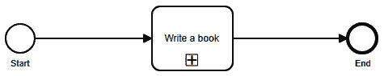

图 11.3 – 收缩子流程的表示

如果工具支持的话，图表可以简单地扩展到内容的完整定义，提供以下表示：


图 11.4 – 子流程的扩展表示

在 BPMN 标准中，任务可以用一个图标来装饰，以指定它们的操作方式：

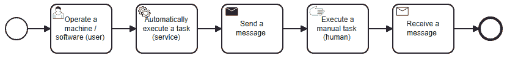

图 11.5 – 不同类型的任务

事件也可以被专门化，以考虑基于时间、消息驱动或其他类型的事件：


图 11.6 – 专门化事件的示例

如果一个流程需要多个演员，它们会被绘制成类似游泳池中的泳道：

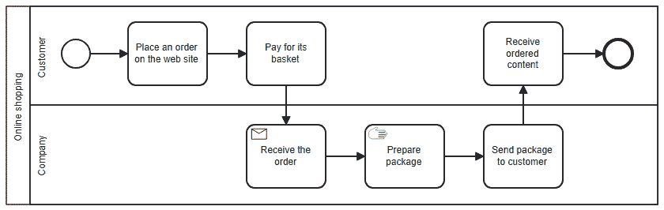

图 11.7 – 在流程中使用泳道

在 BPMN 中需要了解的最后一种基本概念是网关。网关可以根据条件推导出流程的流，也可以在工作流程的给定部分中复制序列。以下图表展示了两种主要的网关类型：

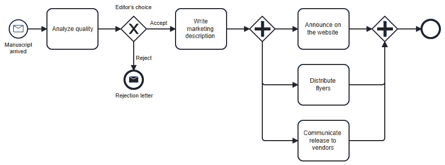

图 11.8 – BPMN 中的两种主要网关类型

左侧展示的第一种网关是排他网关（符号 **X**），这意味着只能使用一条路径（在我们的例子中，稿件可以被编辑接受或拒绝）。第二种，使用 **+** 符号，是并行网关，用于在所有任务完成并加入流程继续之前执行多个任务（在我们的例子中，当所有营销活动都实施完毕时，流程达到其结束事件）。

关于 BPMN 还有很多其他需要了解的内容，但本书并不是让你精通使用这种标准格式的场所，所以我会只介绍这些非常基础的概念，这些概念将在之后被使用，并建议你在组织业务流程建模中需要深入了解 BPMN。如果你在某些时候怀疑 BPMN 是否能够正确地表示你的活动，请记住，经过 20 年的专家在联盟中的努力，最终创建了一个全球标准，这个标准被认为能够形式化几乎任何可能的人类和计算机化任务的组合。有些可能很难设计，但这总是由于对标准的了解不足。通过一点实践，你将能够使用 BPMN 建模任何事物，这当然会给你的信息系统设计活动带来很多价值，因为这意味着其中的所有功能活动都将被详细和形式化，这将极大地有利于 IT 的寻求对齐。

# 基于软件的业务流程执行

正如所解释的，使用 BPMN 标准本身就已经具有很大的价值：仅仅使用一种形式化的方式来表示你的业务流程，就会为你提供深刻的见解，并引发你可能未曾考虑但一旦信息系统建立时如果没有考虑它们可能会成为重要问题的疑问。但 BPMN 的另一个附加价值是，一旦建模，就可以借助软件执行你的流程，因为表示的形式化使得机器能够解释这些流程，甚至可以自动执行它们的实例。

在本节中，我们将解释 BPMN 背后的原则，并给出一些与我们的示例信息系统相关的示例，以更好地理解这些原则。然后，我们将解释 BPMN 图是如何根据角色分解的，以及我们可以使用什么类型的软件来建模和运行它们。最后，我将简要解释为什么 BPMN 在软件行业中没有得到更广泛的应用。

## 原则

业务流程执行的原则非常简单：一个名为 BPM 引擎的软件读取基于 XML 的 BPMN 合规的业务流程表示，可以启动你想要的任意多个“实例”。一旦启动，一个实例将大致具有以下行为：

1.  实例被保存在磁盘或数据库中，实例可以在它们发展的不同步骤中被读取和修改，这些步骤对应于构成流程的任务的进展。

1.  每个给定过程的实例与其他实例完全分离，尽管它们执行的是相同的过程定义。实例中过程的执行方式可能会根据网关的通过方式而根本不同。

1.  一旦启动，实例将遵循其创建时刻设计的流程。如果流程设计之后有所演变，所有正在运行的实例将继续使用旧版本，以保持工作流程的一致性。

1.  流程中的每个任务都是由引擎“执行”的。实际执行步骤取决于其类型以及引擎如何配置来处理它：

    +   当达到服务任务时，执行应该是自动的。可以调用 API 或连接到应用程序等。

    +   当达到手动任务时，引擎会提醒用户需要他们完成某些操作。这可以通过电子邮件或其他渠道的通知来完成。当用户完成任务后，他们通常会被邀请通知 BPM 引擎，以便流程实例的执行可以继续。

    +   当达到用户任务时，用户也会被告知，但由于预期的操作是填写表格或至少在机器上实现某些操作，可以提供一个指向所需表格的指针，以加快操作速度。

1.  如果引擎遇到网关，它将根据其类型以不同的方式反应：

    +   如果这是一个并行网关，所有后续任务都将运行，并且引擎将负责等待所有路径完成后再运行流程的其余部分。

    +   如果这是一个排他网关，决策引擎（我们将在下一章更详细地讨论这一点）将被激活，业务规则的执行将定义应该采取哪个分支。

1.  在一些高级引擎中，可以设计通知，以便过时的流程实例向功能管理员发出警告，以便他们完成任务。

1.  当达到结束事件时，流程实例被视为完成并归档。在其中无法执行任何操作，但它被保留用于统计或可追溯性原因。

## 将应用于我们的示例信息系统

理解技术的最佳方式是通过示例，这就是为什么我们从本书的开头就遵循了一个信息系统设计的示例。让我们回到`DemoEditor`，看看可以设计哪些业务流程——也许甚至可以自动化。

第一个示例将展示流程在其执行过程中如何积累数据。毕竟，IT 系统中的流程大多数时候都是关于创建或收集数据。一本书是一份数据，销售也是数据，即使它们的主要目标是为公司带来金钱，等等。流程可以被视为一系列创建（或不创建）数据的任务。到流程结束时，已经创建了足够的数据或检索到了数据，以实现流程的目标，至少在其实例中是这样。在下面的示例中，我们从一个编辑那里请求信息，并要求作者完成这些信息，因为流程的目标是发布关于新作者的完整信息：

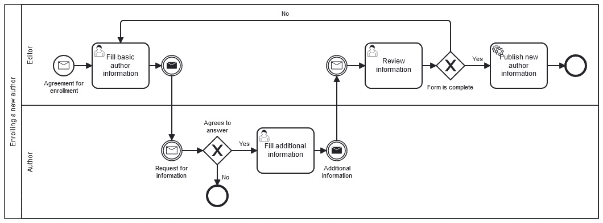

图 11.9 – 为作者注册的 BPMN 示例

流程应该是自我解释的，所以我们不会提供任何细节。`DemoEditor` 的第二个业务流程示例如下：

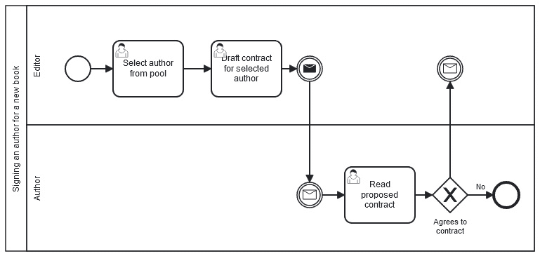

图 11.10 – 为合同签署的 BPMN 示例

这次，数据的收集可能不像之前的过程图那样明显，但我们仍然可以这样思考流程：

+   第一个任务收集一些数据，即所选作者的标识

+   第二个流程会创建一些数据，因为合同草案将是一份文档，因此构成了电子数据

+   第三个任务可能不会产生功能性数据，但作者下载合同草案以供签署这一简单事实本身就是一个信号，并在信息系统中产生数据（即使非常简单，如日志）。

这些流程在示例软件中的执行方式将是 *第十七章* 的一部分。在本章中，我们只展示它们作为使用 BPMN 可以做什么的示例，以及为什么 BPM 引擎是本章中描述的乌托邦信息系统架构的三个部分之一。它们也将在本章的其余部分用来说明关于流程执行的一些观点。

## 链接到用户

现在是回到一个之前有点过于迅速覆盖的概念的好时机。当谈到如何将包含多个参与者的复杂图切割成流程所代表的“池”中的“泳道”时，引入了“参与者”这个概念来解释每个泳道都必须与一个“参与者”相关联（并且按照惯例，以该“参与者”命名）。这听起来像是在谈论用户，但参与者比这更通用，应该与一组用户相关联（有些人可能会称之为*配置文件*，即使这个词通常用来指代授权的紧密集合，如在**基于角色的访问控制**范式中的“角色”语义）。

在前两个 BPMN 图表示例（*图 11.9* 和 *图 11.10*）中，参与者是 `Editor` 和 `Author`。在用户目录中，通常可以找到具有等效名称的组。一个好的 BPMN 引擎总是包括支持用户组的用户目录 – 或者甚至更好，可以通过例如标准化的 LDAP 协议连接到一个中央企业目录。这允许在谈论功能流程时进行一定程度的间接引用，即我们指的是哪个特定的作者或编辑并不重要。在第一个示例中，某个编辑将收到一份注册协议，然后向某个作者发送信息请求。

正确理解这个概念很重要，不要过多地将它与用户的目录耦合。将 BPMN 参与者/泳道与一个组关联是最合理的做法，但这种耦合不应过于紧密。例如，如果某个时候决定只有少数高级编辑可以启动合同，流程引擎应该能够实现这一点，而无需依赖于用户目录为这些特权编辑创建一个新的组。当然，如果这种情况更加优雅，但这再次说明，技术前提条件永远不应该阻碍功能请求。

从参与者的选择角度来看，一个流程实例化的时刻同样重要。在“泳道”中，哪个具体用户将对应于一个通用定义的参与者，通常是在 BPM 引擎中实例化流程时实现的。大多数引擎都会显示一个对话框，询问用户目录中谁将与此或彼参与者/泳道在流程池中关联。有些甚至允许定义默认用户分配或根据其他上下文元素选择用户的规则。例如，我们可以有一个`DemoEditor`流程，当作者发送其稿件进行审阅时，它会自动选择与该作者关联的编辑。

## 可用于 BPMN 编辑和执行的软件

在这样一本书中，试图保持通用性并推动标准而不是实现，我们不太可能找到供应商的例子，但 BPM 引擎在行业中的应用如此稀少，我认为引用一些例子可能是有用的。当然，我只会列出那些遵守规则并努力支持 BPMN 2.0 标准的供应商，而不是通过提供甜蜜但专有的功能来试图将客户锁定在供应商身上。以下是一些 BPMN 引擎（其中一些包括图形编辑器）：

+   Bonitasoft ([`www.bonitasoft.com/library/the-ultimate-guide-to-bpmn2`](https://www.bonitasoft.com/library/the-ultimate-guide-to-bpmn2))

+   Activiti ([`www.activiti.org/userguide/#bpmn20`](https://www.activiti.org/userguide/#bpmn20))

+   Bizagi ([`www.bizagi.com/en/platform/standards`](https://www.bizagi.com/en/platform/standards))

+   Kogito ([`docs.kogito.kie.org/latest/html_single/#ref-kogito-app-examples_kogito-creating-running`](https://docs.kogito.kie.org/latest/html_single/#ref-kogito-app-examples_kogito-creating-running))

市场总是在变化，新的版本和功能不断出现；这就是为什么我不会推荐或比较这些解决方案。当然，还有许多其他我未曾接触到的解决方案。这份列表仅仅作为一个起点。

## 为什么在行业中 BPMN 的使用如此之少？

正如我们所见，规范和标准已经存在了很长时间，BPMN 引擎也已准备好，可供全球使用。然而，BPMN 在行业中的整体使用非常有限。除了少数非常大的公司，并且仅限于特定的区域，基于 BPMN 的自动化流程的使用非常稀少，尽管在规范的价格或复杂性方面没有问题。事实上，许多实现都是免费的，规范也相当容易学习，即使是对于非技术人员来说也是如此。实际上，它可能是面向商业人士最容易理解的标准之一，因为它代表了他们的日常工作（至少当正确使用时）。那么，为什么这么少的人使用它呢？

可能的原因之一是，在许多情况下，自动化一个流程并不带来太多的价值。确实，设置一个 BPM 引擎是一项相当复杂的任务，只有在以下情况下才值得投资：要么是流程的复杂性很高（由业务专家绘制的 BPMN 流程图，由软件“盲目”执行），要么是流程定义频繁变化（这使得将执行委托给通用引擎变得有趣，因为这将允许软件的其他部分保持稳定）。当你这么想的时候，许多业务流程并不是那么频繁地变动。发送发票的过程不会每个月都改变，所有与法规相关的流程都倾向于相当稳定。甚至运营流程的变化频率也不会比应用程序的新版本发布频率高多少。

另一个原因是，在 BPMN 文件中设计流程往往会使其变得僵化。在许多组织中，流程并不那么清晰，很大程度上依赖于人类如何执行它们，有时并不遵循共同的做法，而大多数时候是找到一种创造性的方法来实现流程目标，而这最终是唯一真正重要的事情。当然，这可能会让一些喜欢流程带来的控制感的经理感到不满。但这也是本章先前解释的流程的缺点之一：当它们倾向于取代人类选择时，它们不仅会降低团队士气，而且在试图提高生产力的同时也会降低生产力。

或者，BPM 引擎的低使用率可能仅仅是因为 BPMN 仍然有点复杂。当然，BPMN 2.0 标准的基礎非常容易理解和应用（每个任务一个框，每个参与者一个通道，任务之间的箭头显示活动流），但规范的其他部分可能需要更多的智力投入。

总的来说，BPMN 2.0 并没有像它应该的那样被广泛使用，因为它如果被更好地了解和普及，确实可以为 IT 行业带来更多价值。这就是为什么我们需要尝试其他解决方案，这也是本章最后一节要展示一些可能用作 BPM 轻量级替代品的替代方案的原因，希望它能给 BPM 带来新的推动力，尽管它不是基于 BPMN 2.0 标准。但在那之前，我们将稍微偏离一下，讨论一下可以使用 BPM 执行的其他操作——流程执行无疑是其中最先进的，但不是唯一能带来运营价值的操作。

# 其他相关实践

流程的自动执行是理想状态，但 BPM 还带来了大量其他优势，其中一些更容易获得。本节概述了其中一些可能性。

## 业务活动监控

**业务活动监控**（**BAM**）是使用 BPMN 流程表示法从业务流程实例中提取关于序列流的统计数据，当然，也可以从中获得对流程所表示活动的洞察。以下是一些基于此类统计问题的例子：

+   在流程中，哪些任务耗时最长？

+   流程平均需要多少时间？

+   这个平均时间是否会以规律的时间相关模式变化？是否存在某些季节使得这个过程更快/更慢？

+   流程中的循环时间和提前期是多少？

+   部署流程新版本与执行时间的变化有什么关联？

+   某项任务的自动化是否确实提高了整个流程的生产力？

除了自动执行的承诺（这带来了可重复性和一致性）之外，BAM 是 BPMN 中最受欢迎的功能，它吸引了管理者。背后的原因是管理者需要指标来了解他们的业务行为。他们还能有什么比直接由他们的业务流程产生的指标更好的指标呢？

如果您已经使用监控系统，BAM 的实施实际上相当简单。在这种情况下，只需在任务的每个输入和输出上添加日志，然后使用您的聚合机制来推导出所需的统计数据。此外，在流程的图形表示上显示这些值是必须的，以便使它们易于理解。基于时间的统计数据可能很有趣，但有时，只知道某个特定任务执行了多少次，就能为流程带来知识。

例如，假设我们给`DemoEditor`业务流程的第二个例子添加计数器：

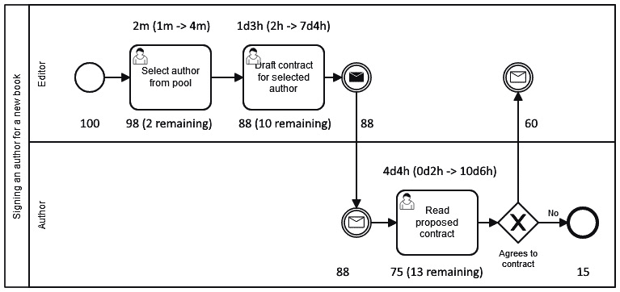

图 11.11 – BAM 的示例

计数器显示在任务的底部，应按以下方式阅读：

+   **100** 个流程实例已被启动

+   **98** 个已通过第一个任务，2 个仍处于作者尚未被选中的状态

+   **88**份已通过第二项任务，**10**份仍处于合同起草状态（占上一任务的**98**份）

+   **88**份合同已发送给作者，所有消息都已确认

+   **75**份合同已被作者下载；**13**位作者已收到消息但未处理

+   在这**75**份中，**15**份已拒绝合同，**60**份已签署并发送了批准消息

基于时间的统计信息位于任务的最上方。在这个例子中，它们只针对任务，而不是转换。格式首先显示平均时间，然后是括号内的最小 -> 最大范围。这种统计信息可能允许我们计算在时间间隔内发送了多少合同；签了多少并已返回；平均起草合同所需时间与作者签署它所需时间相比；是否应该使用提醒来加快流程，或者作者快速签署合同会导致时间浪费；等等。

BAM 对于在流程中找到瓶颈也很有帮助。有时，流程停止的地方很容易找到，但在角色分散的大型组织中，授权可以委派，涉及许多步骤，有些步骤在不同的服务中，涉及其他经理，并且可能存在政治因素，所以如果你不使用 BAM，找到整个流程突然下降的原因可能会很令人沮丧。这就像在没有良好的监控系统的情况下，在分布式云应用程序中找到错误几乎是不可能的。

最后，BAM 可以用来找出是否确实遵守了推荐流程。当流程实施（当然，与使用它的团队一起），可能会发生新来的人不知道它，并试图跟随他们领域资深人士的领导。他们可能会错过流程的一些步骤，有效的监控可以帮助他们或流程所有者发现这些失误。补救措施只是简单地指导人员如何执行任务，但可能有趣的是采取更深入的方法，并开始对流程本身进行持续改进：为什么人员没有正确了解流程？应该有什么可以防止这项任务被遗忘？既然显然可以不这样做，那么这项任务是否应该完全自动化，以确保将来没有人忘记它？所有这些问题都将改善流程的工作方式，但在这个例子中，触发因素是 BAM。

## 业务流程模拟和优化

BPM 的另一个用途，虽然不太为人所知，但在某些情况下非常有价值，是模拟流程的可能执行，以找到材料资源、工具和人员之间的良好平衡，并优化整体。例如，想象以下业务流程：

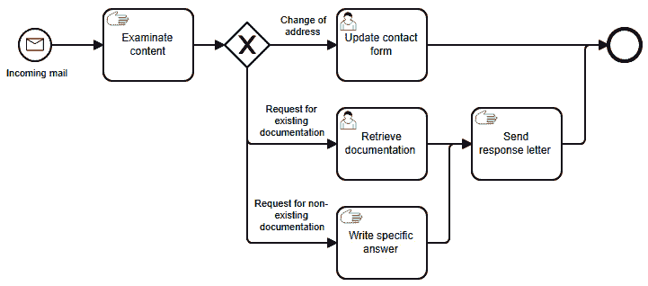

图 11.12 – 业务流程优化的基础

如果您需要处理大量的 incoming letters 并需要找到一种平衡执行五个任务的人员的方法，那么拥有这张图可能会特别有用。让我们从一个过于简化的假设开始，即您的团队中有十个人，每个人都能执行任何一项任务，并且每项任务所需的时间与其他任务相同。您可能会认为合理的人员分配是每个任务两人……但再想想！**发送回复信件**这项任务必然比前两个任务多调用两次。您也不知道有多少比例的邮件会发送到**更新联系表单**这项任务：如果没有任何邮件发送到那里，那么您将节省一些时间，将最初受此阶段影响的两个人分配到两个其他子团队。

在保持上述假设的情况下，一旦您有了邮件类型的统计分配，您可能能够计算出您应该如何在不同任务上分配人员，以优化整个流程，只需一个简单的计算器即可。如果您开始引入更现实的行为，比如不是所有任务都需要相同的时间，那么您肯定需要电子表格或至少一些脑力。

现在，假设 incoming mail 的份额会季节性变化（例如，地址变更在年初和九月更为频繁）；所有任务都有一个给定的平均时间，但有些任务的波动范围要大得多（这意味着它们可以显著地围绕平均时间变化）；某些人可能能够处理某些任务而无法处理其他任务，这取决于他们的能力；您必须考虑到有人生病的可能性，或者人们休假的事实，尽管由于团队内部规则，并不是每个人都同时休假……所有这些都使得系统如此复杂，以至于您无法确定不同任务的最佳人员分配。幸运的是，BPMN 表示法可以帮助您通过模拟不同的团队组织和数千个流程实例，然后根据您的标准确定总持续时间并选择最佳配置，从而简单地获得最佳结果。

基于大人群的优化应用已经存在（例如，使用类似遗传算法或蒙特卡洛方法），但它们都需要某种快速模拟系统如何响应的东西：这就是一个好的 BPMN 引擎可以帮助的地方，因为它可以执行纯自动化的任务，这些任务可以随机模拟所需的时间。因此，优化引擎将能够模拟大量情况，将它们发送到 BPMN 引擎进行虚拟执行，收集结果，并最终收敛到最佳解决方案。

## 业务流程挖掘

最后，即使业务流程挖掘不是 BPMN 的使用，而是一种可以成为业务流程来源的活动，我们也应该快速解释业务流程挖掘。业务流程挖掘（不缩写以避免与业务流程管理混淆）是通过分析通常来自软件的其他数据（通常是日志）来确定业务流程。

例如，一个流程挖掘系统可以使用出现在网站上的日志，以及发票和库存/配送指标的历史表，以便确定与电子商务商店上“正常”购买行为相对应的标准流程。

BPMN 有许多其他应用，但我们不应该偏离我们的目标太远，我们的目标是展示业务流程管理如何帮助实现业务/IT 对齐。我们已经看到流程自动化是 BPMN 带来最大价值的使用之一，但遗憾的是，投资可能相当高，因此这种方法在工业应用中并不常见。一些替代方法可能有助于在保持所需投资低的情况下变得更加流程导向，甚至在某些情况下不需要比通常的商业应用更多的额外投资。

# 业务流程实现的其它方法

在本节中，我们将考虑所有提供替代 BPMN 引擎执行业务流程的方法。我们将发现哪些是更常见/更现代的，并将比较它们的效率。最后，一切取决于上下文，但了解具体细节应该有助于你了解何时应用这种方法或那种方法。

## 图形用户界面中的流程

你可能没有意识到，如果你曾经创建过软件图形用户界面（GUI），那么你很可能在不经意间实现了一个流程。例如，所有向导都是流程，因为它们通过链接屏幕来提供按顺序添加数据的方式。最复杂的那些允许选择，这在 BPMN 中是网关的完美等价物。它们也有开始和结束，就像任何流程一样。向导与流程非常相似，但当我们简单地将业务流程定义为一系列旨在达到目标的人力和自动化任务时，那么任何 GUI 实际上就是一个流程。

每个图形用户界面（GUI）都允许人类交互，这通常是简单过程的开始。这个过程将通过表单收集数据，然后通过调用后端来执行一些“服务”任务，以执行一些命令。就像向导一样，GUI 的行为将根据在表单中指定的业务规则或值（再次，就像网关一样）而改变，并且过程的结束通常由一个吐司通知、一个对话框，或者简单地由 GUI 等待另一个交互来表示。

你可能会争辩说，GUI 中的过程实际上是一个人类过程，其中用户在软件中遵循一个过程。然而，一个好的 GUI 会引导用户以特定的方式使用它，这往往倾向于模仿业务流程。这在向导的情况下很明显，但在设计有 UX 能力的 GUI 中也会发生。当然，在像命令行这样的最简单界面中，过程执行的大部分——如果不是全部——都在用户手中。但简单的事实是，参数的命名是根据 BPMN 过程收集的数据来进行的，这已经在尊重所表示的工作流程方面提供了一些帮助。

## 高级 API 中的过程

当我们考虑解决编排问题的简单方案时，拥有实现一系列对其他更简单 API 调用的有序序列的专用 API 也是一种已记录的方法。实际上，这是一种众所周知的 API 结构，将它们组织成三层，每一层都建立在下一层之上：

+   第一层是 CRUD API，用于操作和读取单个业务实体。这是我们之前章节中在解释 MDM 概念并展示如何使用 REST API 实现时讨论的那种 API。

+   第二层是关于那些将多个第一级 API 调用组合起来以在系统中实现复杂操作的 API。例如，这样的 API 可以公开为`/api/contract`，其`POST`动词实现可以调用`/api/authors`以验证作者是否已经注册，然后在这种情况下对该 API 进行`POST`调用。之后，代码会调用专门用于提出合同金额的服务，然后最终到达`/api/pdf-fusion`服务以检索创建并发送到电子文档管理系统（当然，使用 CMIS 标准）的文档地址。在任何发生失败的地方，这种实现都会有规则知道它应该做什么，在最坏的情况下，会向人类提供通知以清理计算机难以解决的过于复杂的情况。

+   第三层用于调整 API 以适应其调用者。这一次，它们不一定组合多个调用，而是向请求添加一些参数，调整和过滤一些响应内容，等等。这些三级 API 通常用于提供“前端的后端”，例如，调整移动应用程序检索的默认分页和属性集。

当使用 API 网关包括诸如身份验证、授权、速率限制和为发票计数等通用功能时，所使用的服务器可以被视为另一个级别，但它并不位于上述三个级别之上。由于它可以用于暴露任何级别，更好的表示方法是将它显示在面向业务 API 的三个级别旁边，为它们提供技术覆盖：

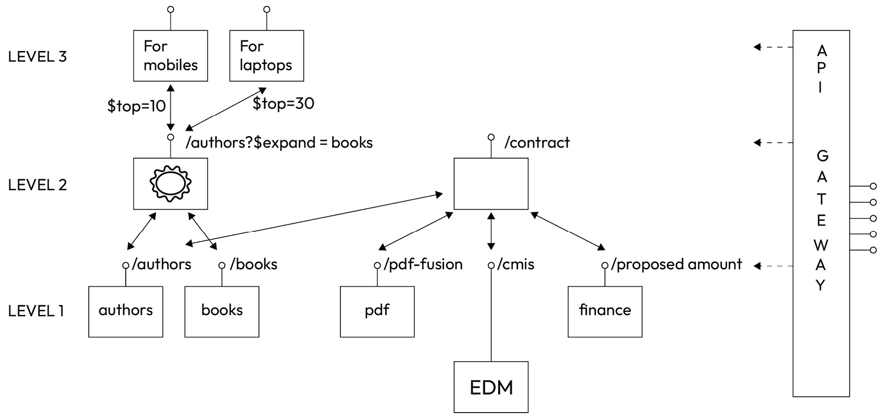

图 11.13 – API 的三个级别

如您从该方案中选择的示例中可以看到，不同级别的 API 不一定使用不同的表述。例如，可以决定暴露作者及其过去书籍的 API 使用`/api/authors`路由，就像仅暴露作者本身的 CRUD API 表述一样。这样做的一个理由是尊重开放数据协议标准，特别是适用于此情况的`$expand`语法。尽管如此，该 API 仍将是第二级 API。

这种方法在 API 内部实现业务流程的一个优点是它极大地尊重了单一责任原则。一个缺点是实施将要么在代码中，这更难进化，要么使用 BPMN 引擎，但在这种情况下，这会创建一些与技术的耦合。当然，在选择 BPMN 引擎时会有一些耦合，但在许多 API 实现中使用它无疑会增加对它的这种依赖程度。

现在我们已经展示了两种“简单”的软件中实现业务流程的方法，让我们分析一些更复杂的方法。我们将从专门的中间件服务器开始，我们之前在面向服务的架构的背景下讨论过这些服务器。

## MOM/ESB 中的流程

在*第八章*中，引入了中间件的概念，并介绍了一些著名的实现，包括**面向消息的中间件**（**MOM**）和**企业服务总线**（**ESB**）。当然，这些可以用来实现流程并编排不同消息或服务调用，从而实际实现特定业务流程的任务。尽管 MOM 和 ESB 并不理解 BPMN，但使用**企业集成模式**（**EIPs**）足以使业务流程具体化，然后在中间件中执行和监控。

你可能会看到这句话，正如我建议在中间件中引入业务功能一样，而我在*第十章*中提到，所有业务规则都应该始终位于与承载它的实体关联的 MDM 服务中。这里是否存在可能的悖论？实际上，如果你利用单一责任原则，就不会存在悖论。当谈论某个服务负责的业务功能时，重要的是服务应该明确对每个功能负责。例如，如果一个会计服务需要一本书的净价，而图书服务只包含不含增值税的原始价格，那么在中间件中简单地应用增值税率以节省时间并避免更改和部署新的图书 MDM 服务版本，这并不是一条简单的道路。图书及其所有属性显然属于图书参考服务的责任，必须将另一个属性添加到它所公开的列表中（这不会损害向后兼容性，因此如果客户端编写正确，不应有任何影响）。

另一方面，假设编辑决定一本书应该停止出版，那么命令应该从 CRM 和商业网站上删除该书的引用，同时也应该将该书在图书参考服务中的状态设置为`存档`。显然，该操作首先会发送到图书参考服务，但谁应该决定其他操作呢？我们可以要求数据参考服务向 CRM 和网站发送消息，但这会与这些应用产生明确的耦合。CRM 和网站都不应该控制这种交互，因为它们都不应该对图书实体级别的发生的事情负责。这个命令组的责任不是唯一的，因此很难将其分配给单个服务。

中间件解决这个问题的方法是通过提供另一个负责这些“编排”任务的应用程序。它位于消息之上，只负责处理和路由消息到需要它们的任何服务。请注意，中间件应用程序对消息的内容一无所知；它只是确保对`/api/books`上的`DELETE`操作应该发送到图书 MDM 服务、CRM 和网站。它们如何处理这些消息不是它的业务。当然，有一些细节需要解决。例如，如果其中一个服务发送错误，中间件应该如何反应？这是它的责任取消交易并要求其他服务回滚它们所做的一切吗？这些问题将在本节稍后部分进行讨论，但在此期间，请记住古老的谚语“哑管道，智能端点”：中间件永远不应该嵌入任何除了纯粹编排之外的业务规则，即简单的消息分发，不再做其他事情。

## 流程的低代码/无代码方法

你最近很可能已经听说业界关于低代码/无代码运动的讨论。这些方法背后的理念是，专门的平台可以使非开发者通过移除大部分或所有代码，并提议使用可视化编辑器来创建表单、工作流、数据结构等，从而能够创建业务线（**Line-Of-Business**，**LOB**）软件应用。从某种意义上说，它们包含了创建完整系统所需的一切，就像我们之前讨论的理想化系统一样。区别在于，它们通过图形编辑器来实现，用户根本不需要输入任何基于文本的代码（或者在低代码方法中几乎不需要，与无代码方法不同，无代码方法要求不输入任何代码）。 

这些方法和它们相关的平台周围有很多争议，有些人把它们呈现为一场革命，允许“公民开发者”的出现，而其他人则解释说代码逻辑和算法仍然存在，只是以非文本的形式存在。对他们来说，这些平台不过是一个老承诺的新化身，这个承诺已经超越了代码生成、第四代框架、之前的图形集成开发平台方法……以及当然，所有使用最灵活的工具（Excel）创建的应用程序。作为一个架构师，我试图远离这些观点，专注于这些工具可能带来的价值。

尤其是更好的工具可能是对上述行业中对 BPMN 引擎有限使用的困难的一个答案。就像 MOMs 一样，BPMN 引擎是相当复杂的系统，需要一些设置、维护和专业知识。由于其专注于非开发人员（我差点写“非技术人员”，但这过于牵强，因为使用它们肯定需要技术导向的思维）的易用性，也许低代码/无代码工具可以提供一种易于使用的编排方式，从而使业务流程执行方法得到更广泛的应用？

这可能以两种不同的方式发生，具体取决于一个人使用的工具类型。第一种工具族是用于流程自动化的最容易使用的：即数据驱动的平台。由于理想的信息系统明确区分了主数据管理（MDM）和业务流程管理（以及业务规则管理），这听起来可能有点奇怪，但具体化的概念将有助于打破这种分离。单词“*具体化*”意味着将某物转化为一个具体实体，通常是两个实体之间的关系。在流程的情况下，它们可以被看作是一系列有助于获取数据的任务，但我们可以应用具体化，并考虑流程本身的一个实例也是数据。这就是数据驱动的无代码系统，例如 Airtable，如何处理业务流程：它们只是在其数据结构中存储有关流程的数据，每一行对应于流程的一个实例。此外，由于大多数简单的流程主要针对一个业务实体，这意味着流程和相关的实体可以简单地转化为同一个实体，由 Airtable 等实际的主数据管理（MDM）来管理。

例如，让我们以人力资源的入职流程为例。目标实体是员工，这与入职流程有关。因此，我们将简单地为这些入职员工创建一个数据结构，并用更面向流程的数据来完善它，通常是入职日期（流程的开始），完全融入日期（入职流程的结束），新员工第一天上班时拍摄的照片的 URL，可能是指向他们需要批准的 IT 图表签署文件的指针，等等。正如你所看到的，流程数据和关于员工本身的数据有时界限模糊。例如，加入公司的日期是入职流程的开始，但这个日期在入职流程结束后对员工来说仍然是非常重要的数据，因为人力资源部门用它来计算这个人将获得多少额外的假期（取决于他们在公司工作的时间长短）。

还有一类工具可以被归类为“无代码”，因为它们只允许图形化操作：这些是轻量级编排工具，如 Zapier、IFTTT 以及许多类似的使用方式。这些平台允许我们通过将事件（例如，当 GMail 账户收到带有附件的电子邮件）绑定到动作（例如，将文件存储在 OneDrive 账户的指定目录“图片”下）来创建简单的交互。创建这些交互的 GUI 可以更进一步，例如，允许一个中间任务根据文件扩展名过滤文件，如果检测到的附件不以 `.png` 或 `.jpg` 结尾，则停止。但这通常将是您能拥有的最复杂的使用方式。这种限制通过提供大量连接器到第三方平台得到补偿。我在例子中提到了 Google Mail 和 Microsoft OneDrive，但还有数百或数千个编辑器已经通过这些工具使他们的应用程序可访问。公开 API 通常是这样做的先决条件，我们很快就会看到 webhooks 在这里也非常有用。

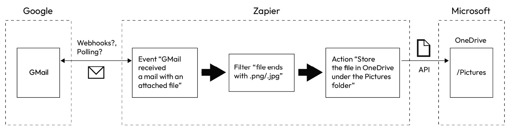

图 11.14 – Zapier 示例

一些平台如 Microsoft Power Apps 在保持将业务事件与动作关联的相同方法的同时更加复杂。简单来说，它们使得添加中间过滤器、复制消息等操作变得更加容易。它们可以被视为在功能方法中实现 EIPs，但由于它们不遵守模式名称，因此不符合这一条件。尽管如此，它们的一个优点是，EIPs 的实现是用 Java 或技术**领域特定语言**（**DSL**）编写的，这两种都是代码，需要真正的开发者参与。我们不要认为用视觉图表编辑器替换文本会彻底改变实现“流程”（有时这样称呼）所需的技能：需要开发者导向的思维来正确设置 Microsoft Power Apps 工作流。这样，这类工具实际上是**低代码**而不是**无代码**，因为其中一部分，如复杂的属性映射函数，涉及编程语言。

为了结束本节，只需知道低代码/无代码工具可以是非常好的工具来实现 MDM，也可以是 BPM 和 BRMS。使用它们很容易创建一个信息系统，但请注意：与平台的技术耦合可能非常高。如果你的目标是设计一个工业级、长期演进的信息系统，最重要的方面始终是业务/IT 的协同，技术耦合可能会让你错过一些重要的事情，并降低你系统的性能。尽管如此，它们可以是非常好的工具来原型化编排或实体的定义。而且，如果你在合同优先的 API 背后保持服务之间的清晰分离，这些低仪式的工具可以作为一个“哑管道”的实现，而 API 实现则是“智能端点”。

## 舞台编排而非编排

到目前为止，我们只讨论了在软件方法中执行业务流程时使用编排：在每一个公开的实现中，某个东西（一个中间件、一个 BPMN 引擎或一个低代码平台）处于游戏中心，从一侧接收消息并查看事件，从另一侧向服务发送命令。当这个中心路由器失败时，这种情况会发生什么？由于它是一个**单点故障**（**SPOF**），整个系统都会停止，这当然是一个问题。有些人会争辩说 ESBs 有分布式代理，并且网络故障可以通过广播方法处理，即使在技术事件发生的情况下也能传递消息。但功能逻辑仍然是集中的，如果路由设计不当，可能会影响整个系统。

为了说明这一点，想象你有一个以下要自动化的流程（我们只表示 CIGREF 地图的前三层，因为硬件层在这里不会改变任何东西）：

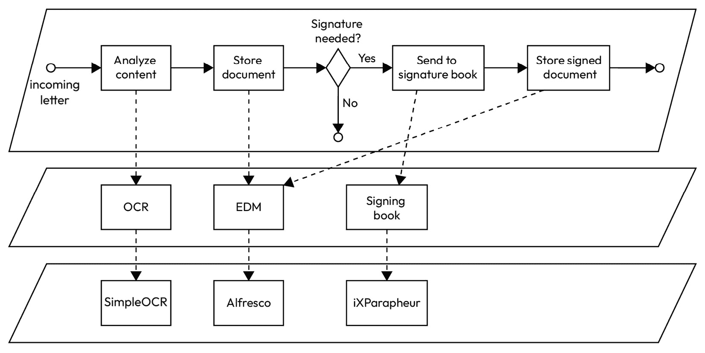

图 11.15 – 自动化流程示例

在分析由 SimpleOCR OCR 化的来函内容后，二进制文档存储在 EDM 中（例如，Alfresco 的社区版本）。如果需要签名，将调用签名簿（可能由 iXParapheur 软件实现），最后，签名的文档也发送到 Alfresco 存储，与未签名的版本一起。

如果我们使用编排方法，将一个 BPMN 引擎，例如 Kogito，添加到软件层（及其在 BCM 中的功能）中，并且与业务流程对应的文件也在同一层，因为这是一个软件工件。然后，当流程实例运行时，Kogito 将调用所有需要的函数：

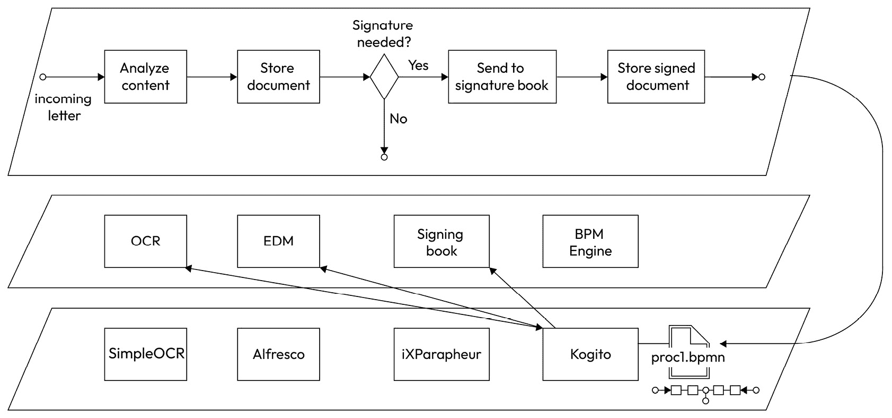

图 11.16 – 通过编排自动化

很容易看出，如果`proc1.bpmn`文件存在问题，整个流程将会崩溃。这就是单点故障（SPOF）对一个组织造成的危害。但从演变和 SPOF 的角度来看，情况可能会更糟：想象一下，如果我们不是为 BCM 中的不同功能选择最佳应用，而是选择了“完全集成”的方法，使用 SharePoint 来存储文件（以下图中标记为**Docs**），其 OCR 功能，以及用于工作流（以下图中标记为**WFW**）的功能。结果将是以下高度耦合的：


图 11.17 – 集成编排的更高耦合

在这种情况下，如果 SharePoint 出现故障，不仅流程会中断，而且该服务器实现的所有功能也会受到影响。由于它们很可能被组织中的许多其他业务流程使用，因此 SPOF 现在所承担的风险比以往任何时候都要大。当然，Microsoft 对 SharePoint 365 有一个非常健壮的实现，但你可能会失去互联网访问。如果你认为运行 SharePoint 本地会更好，那么再想想，因为你永远无法达到 Microsoft 为其自身解决方案提供的鲁棒性水平，无论你的管理员多么有才能。那么我们如何才能消除流程执行中的这个 SPOF 问题呢？

对于这个问题的一个激进答案是简单地消除所有集中式权威，只保留消息在服务之间流动所绝对必要的部分，即网络连接。这听起来可能相当严厉，但毕竟，如果我们真的想要“愚蠢”的管道，它们还能比简单的 TCP/IP 数据包更愚蠢吗？HTTP 以及特别是 HTTPS，将添加一些受欢迎的低级功能，如流加密和收据确认，但它们将完全从业务角度保持中立，这正是我们所说的“愚蠢”。

通过设置所谓的“编排”来消除任何集中的编排。在编排方法中，就像在音乐乐团中一样，有一个领导者从物理集中的位置指导所有乐器的节奏和音调。在编排中，一群舞者不跟随一个单一的领导者，而是通过观察他们的邻居来调整，就像鸟群或鱼群一样。例如，当向左移动时，舞者会盯着他们左边邻居的脚；然后，当向右移动时，他们会与另一边的舞者同步。在这些群体中，没有“主要舞者”，而只有一群习惯于共同工作的舞者。顺便说一句，这意味着仍然存在某种类型的领导者：当学习他们的编排时，编舞者会向舞者群体解释预期的动作，展示他们如何同步，等等。练习之后，一旦舞蹈“投入生产”，团队就不再需要编舞者。这在 IT 编排中也是一样的：你需要一个架构师告诉每个服务它们应该监听什么信号以及它们的反应应该是什么。但一旦设置完成，系统就会自行运行，架构师只需简单地监控一切是否按预期进行。

在我们的例子中，为我们的过程实现这种编排方法将如下进行：

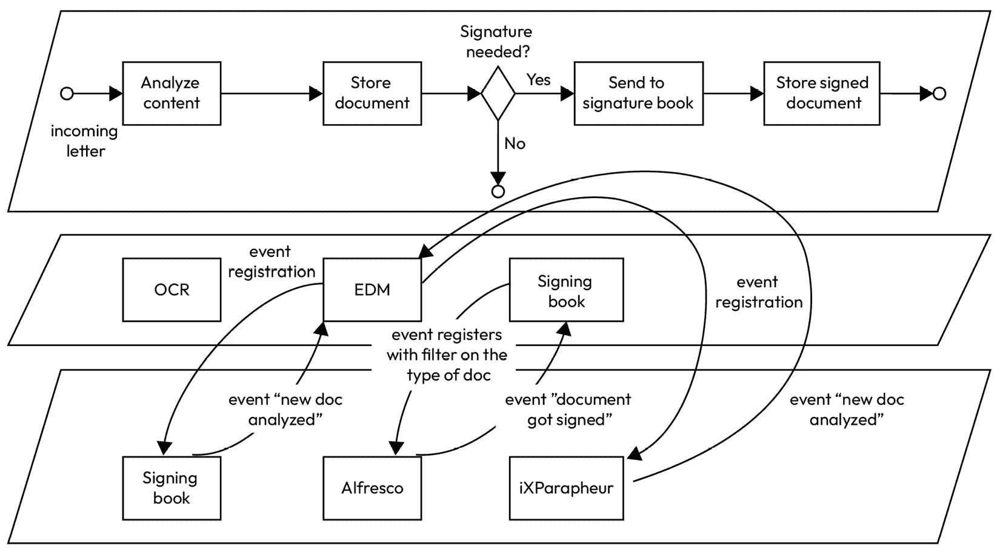

图 11.18 – 低耦合编排

简单来说，将不会有任何额外的软件，因为每个应用程序都会关注其他应用程序的事件。因此，将不会有任何可能的单点故障。为了实施此过程，“注册”将如下所示：

+   EDM 会等待来自 OCR 的信号，表明新文档已被分析。收到此信号后，EDM 会存储该文档。

+   签署簿会等待一个信号，表明新文档已存储，并会使用业务规则来筛选需要签署的文档。这可以通过两种方式完成：

    +   签署簿可以获取所有文档，并根据自己的元数据自行决定文档是否需要签署。

    +   更好的是，如果 EDM 应用程序支持此功能，它可以通过注册一个 EDM 可以应用的“过滤器表达式”来告诉此应用程序仅通知特定文档。这将减少带宽并提高性能，因为只有实际需要签署的文档才会被通知给签署簿进行处理。

+   EDM 还会等待来自签署簿软件的信号（就像它会等待来自 OCR 平台的信号一样），并在发生此类事件时存储签署的文档。

没有单点故障（SPOF）的伟大之处在于，所有不受故障影响的部件将继续在系统中工作。例如，如果由于某种原因，签名簿软件不可用（比如说它是一个 SaaS 应用，你的互联网连接中断了），其余的过程将正常工作：不需要签名的文件将直接发送到 EDM 并存储；问题只在于需要签名的文件将不会被展示出来进行签名（但它们仍然以原始形式存储在 EDM 中）。在本节稍后，我们将看到我们甚至可以建立一个“安全网”，以确保事件不会丢失，并且待签名的文件最终会在系统恢复在线时到达签名簿。

## 实现编舞

实现这种编舞方法最逻辑且耦合度最低的方式之一是使用 webhooks。我们已经在*第八章*中讨论了 webhooks，并看到它们是反转服务顺序的绝佳方式。在编舞的背景下，webhooks 是消除所有集中式编排的绝佳方式，因为责任只由两个组件分担：发射器和接收器。发射器可以存储对某些事件的回调请求，并在其服务中发生业务事件时，负责将这些消息发送到这些回调 URL。另一方面，接收器需要注册它想要了解的发射器事件，提供一个回调 URL，并监听它，一旦消息到达，就要处理它。几乎所有的事情（我们稍后会看到一些事情确实是缺失的）都由这两个参与者处理。

那么，为什么像 Zapier 或 IFTTT 这样的平台存在呢？你可能会问。简单来说，是因为 webhooks 和业务事件还没有标准化。OpenAPI 3.0.2 支持 webhooks 定义，但尚未完成，目前很少有编辑器支持它。而且，定义技术事件的标准需要很长时间，更不用说以业务为导向的事件了。Zapier 和类似的产品为游戏带来的是成百上千的 LOB 应用的专有连接器的集中市场，这就是它们仍然在游戏中的原因。它们的价值也可能在于简单的流程，这些流程只需要将 webhook 插入 API 即可实现，因为在中间使用它们可以为你提供监控、错误检测、自动重试以及持久性故障的通知等。

但在纯粹的理论上，通过在信息系统中的所有服务上注册 webhooks，告诉它们调用其他服务公开的 API，就可以实现你的**事件驱动架构（EDA**）（这是定义这种通用方法的公认术语）。然而，这要求所有消息都必须标准化，并且存在一个全球性的约定来定义所有可用的业务事件。

总的来说，魔鬼藏在细节中，在这样的理想 EDA 系统中，一切都会运行得很好，直到某个数据包被愚蠢的管道丢失，或者网卡出现故障。由于一切都在同步和内存中，这样的技术事故会导致功能损失，可能对业务产生低到灾难性的影响，具体取决于丢失了什么。这当然是在工业级系统中无法容忍的事情，也是为什么对于重要的数据流来说，保留某种中间件，比如消息队列系统，是一个好主意。然而，原则是保持管道的愚蠢，这很困难，因为一旦设置了分布式代理，就很难限制其仅用于编排。这样做可能有很好的理由，因为这种方法比基于编排的方法更能适应其他环境。

队列系统将允许消息的稳健交付。如果你还需要回溯时间并执行某些事件源操作（例如，为了实现 CQRS，进行大数据复杂计算，或者甚至为了简化最终一致性），那么你可能需要部署专门的分布式系统，如 Apache Kafka。再次强调，这是一套相当复杂的工具，所以请特别注意在偶尔丢失消息（我们真正谈论的是不频繁的事件，因为现代网络比它们的祖先更加健壮）和支付中间件额外成本之间的平衡（作为一个经验法则，你可以认为一个平均大小的中间件将花费你一个全职员工）。特别记住，即使是电子商务的巨头也接受一致性的损失，并实施许多策略来减轻后果（限制保留购物篮的时间，库存管理，只有在有足够库存的情况下才接受预订，如果产品锁定失败，提供改进的赔偿等）。

再次提醒，功能一致性至关重要。在思考错过一个事件有多危险时，不要采取会立即让你启动大炮的技术方法；只从功能角度思考，想象一个没有任何软件的信息系统。你该如何补偿这一点？也许有一种方法是在你下一次收到订单事件时，与发射者核实自指定日期和时间以来所有已通过的订单；通常情况下，应该只有一个触发事件的订单，但如果你错过了之前的订单，你现在就会了解到这一点。实现一致性的另一种方法可能是使用双重的 webhook 方法，通过一个自动作业每五分钟查询所有新订单，并验证它们是否确实按照应有的方式处理。如果你真的想把它提升到下一个层次，你甚至可以设置一个自我修复系统，该系统从其相邻服务中克隆所有重要数据，并且只对基于时间和基于交互的事件做出反应以执行其任务，同时始终在其操作中保持和传达一个价值日期。

当我与软件架构师讨论这种以功能优先的方法时，他们通常倾向于回答说，一个好的事务性系统会处理一致性，让我们摆脱这些功能复杂性。或者 Apache Kafka 最适合这类问题，将是解决方案——有时甚至没有对这些解决方案成本的文档估计。尽管有时这可能是可以接受的（再次强调，这完全取决于上下文），但尽可能深入地理解业务总是会给软件架构师带来价值。同时，也应该记住，尽管技术方法似乎完美地覆盖了困难，但总有失败的可能，这一点应该被考虑进去（当这些技术是 SPOFs 时，这种危险很高）。另一方面，当你清楚地了解你的系统在功能上必须保持多少一致性时，失败就包含在讨论中，因此不会再造成惊喜。**功能方法是解决整体问题的唯一途径。**

如果你想要更深入地了解这一点，一个很好的起点是理解传奇（简单来说，传奇是在你将持久性分离成几个数据库时，重新创建事务的一种方式，正如 MDM 和 SRP 所建议的，以减少耦合）。在[`microservices.io/patterns/data/saga.html`](https://microservices.io/patterns/data/saga.html)上的优秀文章展示了如何通过编排和协奏来实施它们。请注意，尽管如此，在两种情况下都需要一个消息中间件（MOM），所以我们仍然得出相同的结论：由于事务是一种技术解决方案，它们不能完全覆盖功能性问题；如果你真的需要一个全局解决方案，你必须提供一个完全功能性的解决方案。在这种情况下，这涉及到为最终一致性找到业务规则并实施它们。正如你现在可能已经习惯的那样，找到这种功能性解决方案的最好方法是想象一个没有任何电脑的办公室：你将如何确保在复杂的工作流程中的一致性，例如，一个需要两个人按顺序工作的业务案例？最简单的方法是交替同步调用和异步回调：“这是文件，当你完成时叫我。”当回调发生时，这将触发将业务案例传递给下一个人的过程，带有相同的请求。当第二个人告诉发起者他们已经完成了这项工作的这一部分，整个过程就可以被认为是完成了。如果在任何位置出现停滞，发起者可以请求工作的状态。如果请求在某个地方丢失了，它可以再次发送。当一个执行代理表示他们已经完成了他们的工作单元时，发起者可能会用另一个工作单元发送给他们，这可以很好地避免过载代理和建立缓冲区，这对扩展规模时的性能是不利的。

# 我应该在信息系统中使用 BPMN 吗？

本章的长度可能表明我真正热衷于使用流程来实现软件信息系统集成。为了完全透明，我长期以来一直反对使用流程，因为我主要接触到它们的负面方面：将人们限制在远离实际工作的人所决定的工作方式中，工作流程的僵化往往阻碍任何创新，因为“它一直都是这样工作的”，等等。通过跟随法国数字大学（French Digital University）提供的两个名为 CARTOPRO（业务流程映射）和 PILOPRO（使用业务流程来引导组织）的**大规模开放在线课程**（**MOOCs**），我完全改变了我的想法，因为这些课程通过展示正确使用 BPM（业务流程管理）时的力量，让我认识到，这意味着流程是由使用它的团队设计的（BPMN 专家只是帮助他们使用 BPMN 标准并提出正确的问题），而持续改进是整个流程策略的基础。实际上，我甚至继续参加了这两个 MOOCs，并从法国让·穆兰大学（Lyon 3）获得了额外的数字文凭，我的论文工作集中在敏捷方法流程表示（这是一个挑战，因为敏捷宣言的第一条建议是“人胜于流程”）。

为什么我要分享这些个人信息？只是为了强调这样一个事实：即使这可能会让你非常惊讶，我通常不推荐在信息系统架构中使用 BPMN 引擎。我知道，在我所说的和展示的所有内容之后，这可能会听起来很奇怪，尤其是考虑到 BPM 是这本书从开始就试图展示如何达到的理想信息系统的一部分。但经过多次在生产中使用这种方法尝试后，我现在可以真诚地说，在大多数组织中，工具和——更普遍地说——对 BPM 的理解还没有发展到足以使真正的 BPM 方法值得。

请仔细听我说：我并不是说这种方法完全没有价值。如果你有一个复杂或经常变化的具体业务流程，投资可能是值得的。但这是一个非常特殊的情况，当你必须满足以下标准时：

+   这个流程对你的业务至关重要，你知道它将持续多年，甚至可能如此重要，以至于它将和公司一样长存。

+   你知道工具并不完全稳定，并且你准备在必要时在项目中间更改 BPMN 引擎的实施，考虑到所有成本和后果。

+   你拥有 BPM 建模和 BPMN 引擎维护的正确专业知识，并且你意识到你几乎不可能将这项工作集中在一个人身上。

+   管理层理解，将团队的工作流程转变为以流程为导向的方法将需要为每个人提供培训，并且将需要长期而复杂的变革管理过程。

如果你勾选了所有这些选项，你面前将有一大堆工作要做，但在这个项目的最后，你将得到一份大礼：一旦投资完成，回报将是惊人的：当公司需要调整策略时，通过更改几个文件来修改流程的实施，这真的是一个信息系统的完美匹配的顶点。你需要经历解耦、适当的职责分离、遗留系统的长期演变，以及所有上述的 BPM 障碍，但一旦你到达那里，信息系统不仅将成为你组织的脊柱……它将成为其主要资产。

# 摘要

在本章中，我们在讨论了 MDM 之后，已经涵盖了乌托邦式信息系统的第二部分，即**业务流程管理**。尽管 BPMN 2.0 标准在标准 LOB 系统中并不常用，但它绝对是一个成熟的规范，而且工具对于编辑和运行时相当完整。遗憾的是，BPMN 2.0 的使用仍然没有飙升，这真是一件遗憾的事，因为它确实可以帮助适应信息系统的平滑演变。也许低代码/无代码方法将更好地实现使功能变更更容易、更少依赖 IT 人员的成果；只有时间才能告诉我们。

在下一章中，我们将涵盖乌托邦式信息系统的第三部分和最后一部分，即**业务规则管理**。我们将展示这个表达式的涵盖范围，它如何与另外两个职责集成，基于我们的演示信息系统场景提供示例，当然，我们还将讨论如何使用哪些软件应用来实现这样的功能，并遵循哪些一般性建议。
