# 第十二章：业务规则的显式化

在详细介绍了理想信息系统中的主数据管理和业务流程管理部分的前两个章节之后，本章将以这样一个理想系统的第三部分和最后一部分结束，即**业务规则管理系统**（**BRMS**）。我们已经在之前的章节中简要讨论了业务规则，因为数据参照可能包含与特定业务实体相关的一些验证规则，并且业务流程也可能嵌入一些业务规则以指导工作流程并决定根据上下文应该执行流程的哪个分支。但在我们构想的完美理想系统中，一个集中的系统应该负责所有业务规则，这就是本章的主题。

我们将首先详细解释什么是 BRMS，以及实施此类解决方案在业务规则管理、部署和系统数据流架构方面所需的内容。然后，我们将展示使用称为**DMN**（即**决策模型和符号**）的标准在业务流程中使用的第一个业务规则管理的例子。

与前两个不同，我们将在这个章节（以及关于理想信息系统不同部分的三个章节系列）结束时，不提供我们样本信息系统的应用示例。这样做的原因是，授权管理是业务规则管理的最佳例子之一，但这个主题非常复杂，需要一整章来理解。

# 业务规则管理系统

**业务规则管理系统**（以下简称**BRMS**）是一套软件，用于处理可以应用于数据的计算和决策，以便输出具有更高商业价值的成果。这个定义中包含了许多概念，我们将逐一进行解释。

## BRMS 如何处理业务规则？

例如，一条业务规则可以计算订单行的总价，使用商品的不含税价格、商品数量和适用的税率。另一个应用示例可能是决定在开票过程中创建的文件是否应该给予电子签名。在这种情况下，业务规则输出一个布尔值，表示结果为真或假。业务规则可以相互调用。在前一个例子中，我们可能需要决定如何向某人展示文件以供签名，如果初始签署人在多次通知后被视为缺席，谁将签署，将发送多少此类通知以及通过哪些渠道，等等——所有这些都是业务规则。

如其名称所示，BRMS 管理业务规则。但其所涉及的内容并不那么明显。一方面，你可以认为 BRMS 是业务规则的 MDM（主数据管理），它可以存储它们，包括它们的旧版本。它可以允许一些人阅读它们，一些人编写它们，或者拒绝那些对某些业务规则没有任何授权的人。它可以对业务规则进行分组和分类，以便指定其研究。所有这些都是在 MDM 对其引用的业务实体上完成的，但 BRMS 还有一个 MDM 没有的责任，那就是执行业务规则。确实，业务规则通过输入来计算输出，而 BRMS 的主要责任就是这样做。

然而，责任并不意味着 BRMS 执行一切。大多数时候，它将委托规则的执行，因为它不拥有业务规则所针对的数据或以规则输出定义的方式执行业务动作的服务。这可能听起来有些反直觉，但 BRMS 甚至可以委托规则执行的职责（即从其输入计算规则的输出）。例如，当 MDM 服务使用来自 BRMS 的规则验证其传入数据时，这种情况就会发生。由于它不会引入太多的耦合，因此规则表达式的本地缓存也是可能的。尽管如此，验证规则的责任仍然在 BRMS，因为如果有人在 BRMS 编辑器中更改了规则，那么它将（可能是在缓存因性能原因未立即失效后）应用于使用此规则的所有服务器，其中包括我们示例中的 MDM。

总结来说，BRMS（业务规则管理系统）的主要职责是存储、暴露和执行业务规则。它负责规则的正确执行，因此要么内部执行这些规则，要么信任其他应用程序执行它提供的规则。这种情况很常见，因为外部应用程序是那些能够访问执行规则所需输入数据的应用程序。而且，它们通常也是那些根据规则输出调整其行为的应用程序。

## BRMS 的附加特性

我们经常谈论服务的“次要职责”，这些职责对于绝对必要的功能来说不是必需的，但仍然很重要。在 BRMS 的情况下，有几个这样的职责。

首先，一个 BRMS（业务规则管理系统）应该具有高性能，无论是在执行时间上还是在承受高请求量方面的能力。确实，规则执行是少数几个难以应用缓存的情况之一。当你从一个 URL 检索图像时，有很大可能性它不会在几秒钟后从一个调用变为另一个调用而改变；因此，保留缓存是非常有价值的，因为这将避免网络往返和服务器请求处理，并极大地提高性能。对于业务规则来说，情况并非如此，因为它们的主要功能是从变化的输入中进行计算，并提供依赖于它们的输出。

当然，规则表达式可以被缓存（并且规则可能不会频繁更改），但是当你这样做时，调用者必须能够从其文本表达式本身执行规则，这可能过于复杂，需要规则执行引擎。如果规则在许多服务之间共享，那么许多引擎实例将需要与 BRMS 保持同步，这并不高效。因此，我们回到引擎只在一个地方，即 BRMS 服务器本身。

在这种情况下，发动机的移动部件可能被缓存，或者至少保持在 RAM 中，这将提供快速执行。然而，根据输入缓存结果，大多数情况下并不高效，因为可能存在如此多的可能值。以我们之前的例子来说，缓存发票行总价计算的结果完全没有必要，因为几乎不可能有另一个调用会很快返回相同的商品，相同的数量和税率。如果你考虑到一些规则可能基于不断变化的数据（例如股市价值），那么安排某种缓存方式可能变得完全不可能。因此，我们基本上退回到需要一个能够尽可能快地输出值的引擎的需求。当然，在高负载情况下，这一需求应该得到支持。因为与报告数据相比，业务数据往往更具波动性，所以业务规则会被频繁调用。

一个好的 BRMS 的另一个“次要”特性是健壮性。当它们在行业中使用时（这并不常见，因为它们是复杂的应用程序），是因为它们是业务流程的重要组成部分。例如，BRMS 被保险公司用来计算风险，或者被移动通信公司用来根据通话数据（通话时长、拨打的号码、一天中的时间等）和合同（对某些号码的折扣、每月预付费、月消费等）来计算应支付的费用。由于 BRMS 的成本，它们通常用于核心业务功能，其中重要的决策（在我们的例子中，接受合同和向客户发送正确的发票）是基于它们的输出做出的。因此，计算的健壮性是一个重要的方面，因为没有人愿意与偶尔会出错计算的系统合作。

由于同样的原因，可追溯性通常是 BRMS 的一个重要特性。当然，它可以委托给调用服务，因为 BRMS 主要是为其他服务工作的。但即使责任是共享的，也应该有记录，记录是否将规则应用于某些上下文数据，提供澄清为什么制定某个规则的输出。即使日志更适合调用应用程序，将 BRMS 规则集的版本保存在某处，并且规则引擎版本不可变，也是一个好主意。这允许你在必要时回到过去，在 BRMS 引擎当时使用的版本上重新执行业务规则计算，并了解为什么输出值是错误的。

最后，如前所述，BRMS 通常与其他服务一起使用，单独使用是无用的。其低级特性使其集成和与其他服务的良好互操作性至关重要。实现通常应至少提供一些 API，如果可能的话，为尽可能多的语言提供 SDK，使其易于与所有可能的软件应用程序交互。

## BRMS 的实际使用

如前所述，BRMS 在实际应用中的使用非常低。实施成本如此之高，以至于只有少数非常特定的业务规则执行案例才真正值得部署专用服务器。此外，正如我们所见，规则的外部化会带来很高的性能损耗，因为要么知道数据的应用程序必须将其发送给 BRMS 并等待输出以继续其流程，要么它必须动态执行 BRMS 发送的业务规则表达式，也许内部缓存。在这种情况下，执行速度仍然低于将规则编译到应用程序中时的速度。当然，应用程序和规则之间的耦合度是最大的，没有规则的集中共享，许多用途可能会分化。然而，性能问题可能非常严重，这些原因并不那么重要。

此外，我们也不应低估习惯性因素——由于开发者的大部分职业生涯都是将业务规则从用例中提取出来，并将其转换为应用中嵌入的代码，因此改变这种思维方式，提取业务规则，并将其放置在其他地方是一项努力。而结果如何？性能大幅下降，代码的可读性和可维护性更差。这意味着业务规则应该放在 `CommonBusinessValues` 类的 `public static readonly` 成员中，这样一切都会顺利，并准备好更新。

这意味着，确实，在 99.99% 的情况下，业务规则将通过代码具体实现，如下面的 C# 示例所示：

```cs
public decimal GetPrice(decimal unitPrice, int quantity, decimal taxRate)
{
    return (unitPrice * quantity) * (1 + taxRate);
}
```

此外，许多其他业务规则将散布在代码的各个角落：

```cs
if (Document.Type == DocumentTypes.INVOICE)
{
    SendForDigitalSignature(Document);
}
```

作为旁注，对于这种类型的值，最好使用字符串值或甚至专门的代码结构，而不是枚举，因为这有助于进化。

事实上，代码库中到处都是业务规则，很难全部找到。但这并不是最重要的。真正的挑战是架构师/产品所有者/开发者要知道，在创建应用程序时，哪些应该外部化，哪些应该集中化，哪些应该简单地留在代码中，即使有重复，因为它们永远不会改变。但请注意，有些被认为永远不会改变的事物有时会随着时间的推移而演变！例如，你可以这样说，关于净价的规则总是稳定的；净价总是免税价格乘以（1+税率）。嗯，是的，直到政府决定应用不同的税率，这些税率适用于产品的不同部分。例如，如果你的产品信息管理软件中有一些由硬件部分和安装服务组成的文章，你可能会遇到第一部分被征收 5.5% 的税，而第二部分被征收 20% 的税。如果计算已经写入集中化的函数中，这并不是那么糟糕。但如果它在代码中的数百个地方被重复（这可能是每个人都认为恒定且不可变的企业规则），你将面临一些困难，不仅因为改变需要花费很长时间才能实现，而且因为你忘记的那个实例很可能是你的最重要客户使用的。

简而言之，将业务规则外部化到一个专门的 BRMS 中，99.99% 的时间都是过度设计，且成本无法得到合理证明。但仅仅通过将业务规则放入一个函数中，你就能走得很远。而且，大多数情况下，唯一的困难可能就是意识到你正在实现一个业务规则！

## BRMS 的示例

假设你确实处于这种非常特别的 0.01%的情况中，即你实际上可以从实施一个专门的 BRMS 中获得商业价值。因此，你需要一款软件来为你完成这项工作，因为正如你可以从所需的其他功能中想象到的，这种服务器是一段相当复杂的代码。在撰写本文时，只有两个严肃的 BRMS 服务器竞争者——Drools（开源）和**操作决策管理器**（**ODM**）。

最常用的开源 BRMS 是 Drools（[`www.drools.org/`](https://www.drools.org/)）。它包含一个核心引擎来计算规则（包括一些如规则链的功能），有时被称为推理引擎，因为它可以从数据上下文和一组规则中推断出结果。它还包含一个用于创建和操作规则的应用程序（带有网页编辑器）。Drools 是用 Java 编写的，可以与其他平台互操作，但不是原生支持。

IBM 的 ODM 是一个专有决策管理系统，旨在从遗留的 COBOL 代码中提取重要的业务规则，以努力使 z/OS 平台上的信息系统现代化。尽管它可以操作规则，但它主要围绕事件决策的概念组织。

如你所见，这个领域的复杂性远不如其他 IT 领域——例如大数据，一本书甚至无法描述所有可用的软件应用、平台和服务器，它们大多在做同样的事情，同时假装与竞争对手有根本的不同。这有其清晰性的优点——如果你需要在你的信息系统中实施 BRMS 并希望降低成本，Drools 将是你的首选。

当然，还有一些不太为人所知的替代方案。许多 BPMN 引擎实现了自己的工作流决策语言。Windows Workflow Foundation 就是这样做的，但现在不再受支持。PowerApps 有一些表达式能力，可以用于业务规则执行，但它只能共享，因此它不是一个真正的 BRMS 系统。另一个解决方案，尽管它涉及额外的工作，就是实现你自己的 BRMS。如果你不需要高级功能，如果你使用现有的表达式执行引擎，你可以相当快速地构建一个。有很多脚本语言可用，你甚至可以在 C#中使用 C#，利用表达式树、动态代码生成和其他先进但仍然易于访问的功能。

简而言之，你有软件的选择，即使它不像某些其他 IT 领域那样丰富。然而，正如你现在可能已经习惯的那样，业务/IT 协同是关于减少耦合的，因此软件实现的选取通常不是一个如此重要的话题（从它可能损害应用演变的角度来看），只要存在一个标准规范、广泛接受的规范，或者甚至只是一个组织范围内的关键格式，它可以在功能依赖和技术实现之间提供一种间接层次。而且好消息是，存在一个关于业务规则的标准，即**决策建模符号**（**DMN**）1.0。这将是本章下一节讨论的主题。

# DMN 标准

DMN 是一个定义决策树和决策表的标准，这是关于业务规则实现的两个主要概念。在接下来的章节中，我们将展示它是如何工作的以及它有多么有用。

## DMN 的起源和原理

DMN 标准目前是 1.0 版本，由**OMG**（即**对象管理组**）在 2015 年 9 月发布。在撰写本文时，最新的验证版本编号为 1.3，并于 2021 年 2 月发布。1.5 版本自 2023 年 6 月存在，但目前被视为一个测试版本。因此，我们将只讨论 1.3 版本。

注意，OMG 也是 BPMN 2.0 标准的联盟，它与 DMN 标准协同工作。正如 OMG 在第一版发布时所述（[`www.omg.org/spec/DMN/1.0/About-DMN`](https://www.omg.org/spec/DMN/1.0/About-DMN)）：“*DMN 符号设计为可以与标准 BPMN 业务流程符号一起使用。*”在 BPMN 中存在一种与业务规则直接相关的任务类型：

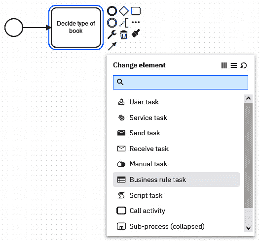

图 12.1 – 业务规则任务

这种任务背后的想法是存在复杂的业务规则，这些规则决定了 BPMN 业务流程应该如何行为（主要是，在网关中应该选择哪条路径）以及应该有一种处理此类决策的方法。确实，想象一下以下（并不那么）复杂的过程：  

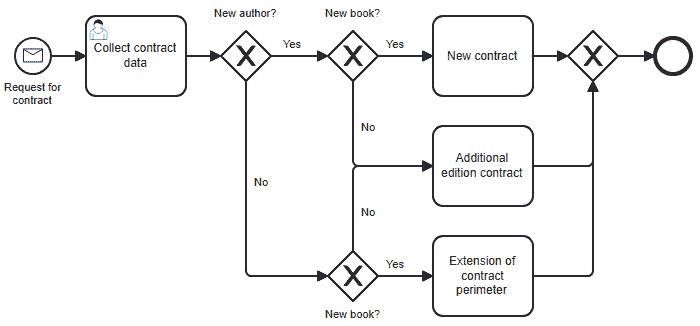

图 12.2 – 具有多个规则的流程示例

目前来说，情况还不错，因为只有三种类型的合同。但这通常是那种有很多机会扩展的场景（永远不要低估销售人员和市场营销人员的创造力）。如果未来有十种类型的合同，也许还需要考虑第三个标准呢？流程将变得越来越复杂，很快就会变得难以辨认，这将会是一个大问题，因为业务流程应该始终是团队的有用工具，而不是让他们的工作变得更复杂的东西。

DMN 提出了一种解决方案，即将决策规则外部化到一个专门的地方，以便释放流程本身的设计。在先前的例子中，我们会这样外部化决策表：

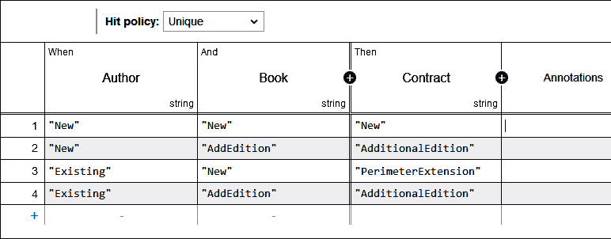

图 12.3 – 决策表

这将使我们能够以更简单的方式绘制流程，如下所示（注意第二个任务中的图标，它对应于`Business` `rule`类型）：

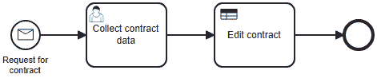

图 12.4 – 简化的 BPMN 流程

注意

很遗憾，由于 BPMN 流程中不同任务收集数据的方式没有标准化，因此调用 DMN 模型的方式也无法标准化。但是，值得了解[`www.omg.org/dmn/`](https://www.omg.org/dmn/)上的规范更新，因为这在未来的某个时候肯定会发生变化。

最好的部分是，现在这个逻辑已经从业务流程本身解耦，我们可以进化到一个更复杂的合同类型定义，如下所示，而无需对流程本身进行任何更改：

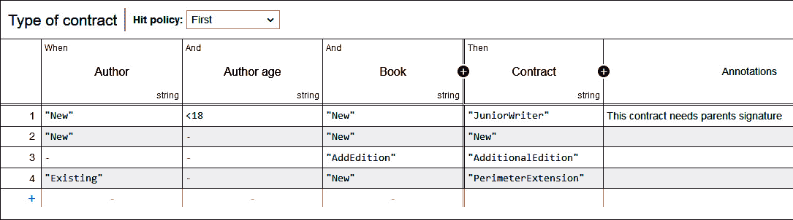

图 12.5 – 扩展的决策表

这次，我们还考虑了作者的年龄，发布了一些必须由作者父母签署的特殊合同。这是通过这里的一个非常简单的表达式实现的（`FEEL`表达式语言允许使用更复杂的表达式，如果您想深入了解这个主题，[`kiegroup.github.io/dmn-feel-handbook/#dmn-feel-handbook`](https://kiegroup.github.io/dmn-feel-handbook/#dmn-feel-handbook)是一个很好的起点）。您也可能已经注意到，`AdditionalEdition`，因为只要这本书是现有版本的全新版，结果对任何作者都是通用的。

拥有这些表来外部化可能复杂的规则已经是一个很大的优势，但 DMN 还提供了一种图形化的方式来表示决策过程本身：

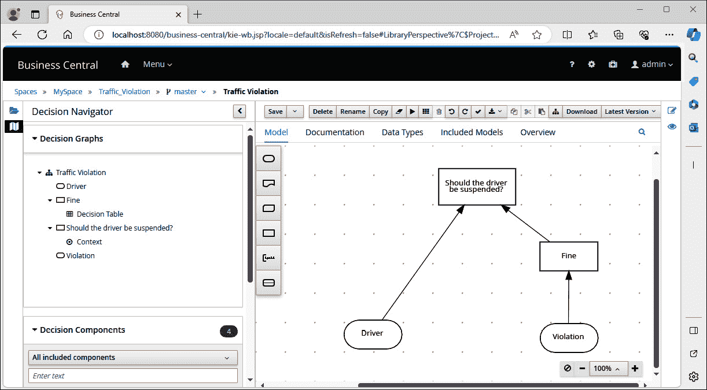

图 12.6 – 决策图的示例

在我们的例子中，图表非常简单，因为我们只使用了两个输入（作者和书籍信息）来创建一个决策（合同类型），可能使用“知识源”，即我们的合同参考，尽管我们在先前的简单示例中没有涉及此类使用。然而，这些图表可以更加复杂，并在必要时显示分层决策。我们可以想象，所决定的合同类型随后本身被用来决定定制合同的內容，这取决于作品的传播区域，并且销售统计数据被用来决定合同提议的金额：

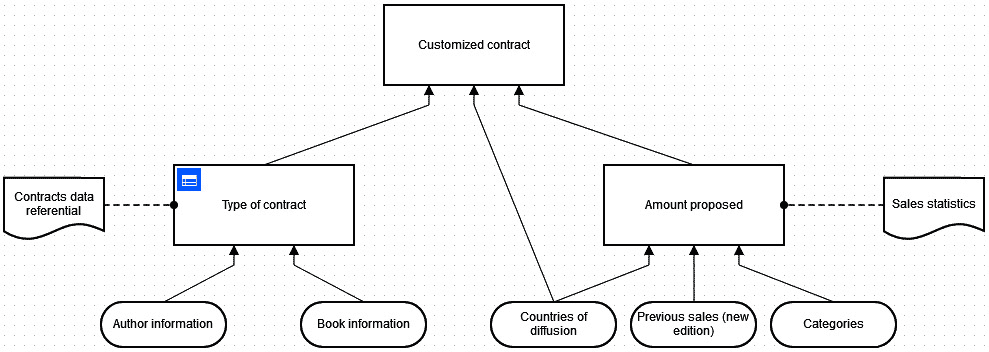

图 12.7 – 扩展的决策图

为了给出 DML 文件 XML 结构的概念，以下是上述第一个示例的（缩短的）内容，其中你将很容易识别出以 `<decision>` 开始的决定规则的第一部分和以 `<dmndi:DMNDI>` 开始的对应于图表的第二部分：

```cs
<?xml version="1.0" encoding="UTF-8"?>
<definitions      id="definitions_065qkmh" name="definitions" namespace="http://camunda.org/schema/1.0/dmn" exporter="dmn-js (https://demo.bpmn.io/dmn)" exporterVersion="15.0.0">
  <decision id="decision_1u2xbtg" name="Type of contract">
    <informationRequirement id="InformationRequirement_1i0e44v">
      <requiredInput href="#InputData_0wi3jz6" />
    </informationRequirement>
    <informationRequirement id="InformationRequirement_0g0syf3">
      <requiredInput href="#InputData_1jz546j" />
    </informationRequirement>
    <decisionTable id="decisionTable_0cwlzw4" biodi:annotationsWidth="400">
      <input id="input1" label="Author">
        <inputExpression id="inputExpression1" typeRef="string">
          <text></text>
        </inputExpression>
      </input>
      <input id="InputClause_1hfsajf" label="Book">
        <inputExpression id="LiteralExpression_00wz5lk" typeRef="string">
          <text></text>
        </inputExpression>
      </input>
      <output id="output1" label="Contract" name="" typeRef="string" />
      <rule id="DecisionRule_05kn45x">
        <inputEntry id="UnaryTests_19ou6i4">
          <text>"New"</text>
        </inputEntry>
        <inputEntry id="UnaryTests_0l88vr8">
          <text>"New"</text>
        </inputEntry>
        <outputEntry id="LiteralExpression_05irfs8">
          <text>"New"</text>
        </outputEntry>
      </rule>
      <!-- Some rules removed -->
      <rule id="DecisionRule_1sg8k57">
        <inputEntry id="UnaryTests_1yjyvpp">
          <text>"Existing"</text>
        </inputEntry>
        <inputEntry id="UnaryTests_0qo517n">
          <text>"AddEdition"</text>
        </inputEntry>
        <outputEntry id="LiteralExpression_0ymlni0">
          <text>"AdditionalEdition"</text>
        </outputEntry>
      </rule>
    </decisionTable>
  </decision>
  <inputData id="InputData_0wi3jz6" name="Author history" />
  <inputData id="InputData_1jz546j" name="Books history for the author" />
  <dmndi:DMNDI>
    <dmndi:DMNDiagram id="DMNDiagram_1r90cap">
      <dmndi:DMNShape id="DMNShape_15dfipm" dmnElementRef="decision_1u2xbtg">
        <dc:Bounds height="80" width="180" x="330" y="200" />
      </dmndi:DMNShape>
      <dmndi:DMNShape id="DMNShape_14d6htu" dmnElementRef="InputData_0wi3jz6">
        <dc:Bounds height="45" width="125" x="257" y="337" />
      </dmndi:DMNShape>
      <dmndi:DMNEdge id="DMNEdge_1a3apwq" dmnElementRef="InformationRequirement_1i0e44v">
        <di:waypoint x=»320» y=»337» />
        <di:waypoint x=»390» y=»300» />
        <di:waypoint x=»390» y=»280» />
      </dmndi:DMNEdge>
      <dmndi:DMNShape id=»DMNShape_0s4bzo1» dmnElementRef=»InputData_1jz546j»>
        <dc:Bounds height="45" width="125" x="457" y="337" />
      </dmndi:DMNShape>
      <dmndi:DMNEdge id="DMNEdge_0ng7t96" dmnElementRef="InformationRequirement_0g0syf3">
        <di:waypoint x="520" y="337" />
        <di:waypoint x="450" y="300" />
        <di:waypoint x="450" y="280" />
      </dmndi:DMNEdge>
    </dmndi:DMNDiagram>
  </dmndi:DMNDI>
</definitions>
```

所展示的所有图表都是使用 Camunda 提供的强大工具在 [`demo.bpmn.io/dmn`](https://demo.bpmn.io/dmn) 上设计的。现在你已经对 DMN 的基本概念有了初步的了解，让我们看看如何将标准应用到实践中。

## 实现

业务规则执行系统（Business Rules Execution System，简称 BRMS）的领域相当小。DMN 的首选实现一直是，并且仍然是名为 Drools 的 Java 开源项目。Drools 是一个支持其自身规则语言的 BRMS，同时也支持 DMN，由于 DMN 是一个标准，因此所有使用 Drools 的服务器都基于它。你可以在你的 Java 应用程序中直接使用 Drools，甚至通过一些桥梁连接到其他平台。特别是，已经有一个 Drools .NET 实现，一些项目如 [`github.com/adamecr/Common.DMN.Engine`](https://github.com/adamecr/Common.DMN.Engine) 可以帮助实现这一点，但这些项目的维护情况值得怀疑，我更愿意展示另一种——在我看来——更适合我们试图实现的目标的方法，即一个对齐且可适应的信息系统。

为了做到这一点，我们将通过使用一个暴露业务规则运行时通过 REST API 的 BRMS 服务器来更接近服务导向架构。当然，性能可能不会像使用嵌入式库那样强大，但请记住，首先，“过早优化是万恶之源”，其次，大多数业务规则的调用并不频繁（如果需要，我们将在本章末尾展示如何适应）。Kogito 在上一章中已经被提及，但我们没有展示与它结合的完整 BPMN 示例，因为正如解释的那样，这对大多数情况来说都是过度设计，特别是我们的示例 `DemoEditor` 信息系统。有趣的是，Kogito 也支持 DMN，这就是我们在这里使用它的原因——或者更准确地说，使用 JBPM，这是 Kogito 所基于的产品。

事实上，Kogito 是 JBPM 的云原生衍生产品，一个在 JBoss 旗下维护的产品。由于我们不会在云中部署，而是保持基于 Docker 的应用程序部署以满足 SaaS 或本地化条件，因此我们将在以下示例中简单地使用 JBPM。然而，请记住，对于您的需求来说，Kogito 可能是一个更好的选择，尤其是因为它提供了一些可以与轻量级 MDM 相比的功能，通过动态生成的 REST API 直接暴露实体。如果您想朝这个方向前进并查看一个完全集成的面向云的方法如何适合您，您可以从 Kogito 的 Docker 镜像开始，这些镜像可在[`github.com/kiegroup/kogito-images`](https://github.com/kiegroup/kogito-images)找到。

我们将要利用的 JBoss JBPM 服务器是一个一站式应用程序，提供前端和后端来设计和操作带有基于 DMN 业务规则的 BPMN 工作流。它与包含一些 Java 代码用于单元测试和可能用于实体展示的 Maven 项目一起工作，但也可以使用简单的标准 DMN 文件在我们的示例中运行。

在下一节中，我们将解释如何在 JBPM 7.74 中操作一个示例业务规则引擎，使用 Drools 引擎和两个带有多个参数的业务决策的 DMN 定义。有关此工作精确方式的更多信息，请访问[`docs.jboss.org/drools/release/7.74.1.Final/drools-docs/html_single/`](https://docs.jboss.org/drools/release/7.74.1.Final/drools-docs/html_single/)。我们使用 JBoss 提供的示例的原因是，从头开始设计一个关于`DemoEditor`主题的示例将占用整整一章。此外，这将是一个完全人为的练习，因为 DMN 规则引擎，就像前一章中的 BPMN 引擎一样，对我们的功能需求来说将是过度设计。我必须尊重我从本书开始就反复强调的主要规则，即技术方面应由功能需求完全定义。尽管我——就像大多数对技术充满热情的人一样——希望在我们的示例信息系统中集成一个完整的 Kogito 服务器，但事实是它并不适合我们的需求。业务工作流和大多数业务规则的实施将简单地使用专门的.NET 服务。只有特定类型的业务规则将使用一个专门的外部服务来处理，该服务强烈类似于 BRMS，即授权规则。但我正在期待本章的最后一部分，现在，我们将展示如何在业务/IT 对齐的背景下利用基于 DMN 的 BRMS，使用 JBPM。

## DMN 使用的示例

以下简单的练习正是 Docker 突出表现的地方，因为它将节省我们安装 Java 和 Maven、获取正确依赖项、更新版本等麻烦。只要你在机器上安装了 Docker（如果还没有，你真的应该安装，因为这个工具现在已经成为你的基本工具集的一部分，就像网页浏览器和文本编辑器一样），你就可以简单地输入以下命令：

```cs
docker run -d --name jbpm-console -p 8080:8080 quay.io/kiegroup/business-central-workbench-showcase:latest
docker run -d --name jbpm-bre -p 8180:8080 --link jbpm-console:kie-wb quay.io/kiegroup/kie-server-showcase:latest
```

注意，截至写作时，`latest` 标签是 `7.74.1.Final` 版本。通常建议尽可能多地使用 `latest` 标签，但如果您在重新播放示例时遇到功能问题，请尝试使用这个精确版本，即使它不再是最新版本。第一个 Docker 命令将启动一个基于包含设计、构建、测试和部署项目所需一切内容的镜像的容器，包括 BPMN 和 DMN 资产。这就是我们将操作 DMN 模型的地方。如果您想获取有关此镜像的更多信息，参考页面是 [`quay.io/repository/kiegroup/business-central-workbench-showcase`](https://quay.io/repository/kiegroup/business-central-workbench-showcase)。第二个 Docker 命令在一个容器上运行项目，该容器将作为单独的业务规则执行引擎，或者如果您更喜欢这样想，它将作为一个简单的运行时。此第二个镜像的参考页面是 [`quay.io/repository/kiegroup/kie-server-showcase`](https://quay.io/repository/kiegroup/kie-server-showcase)。

一切启动完成后（您应该允许一些时间——最多一分钟——以完成启动程序），您可以通过导航到 `http://localhost:8080/business-central` 访问控制台，在那里您可以使用默认凭据 `admin`/`admin`（之前引用的文档为具有不同授权配置文件的用户提供了其他凭据，以及如何设置生产就绪的授权）进行连接。

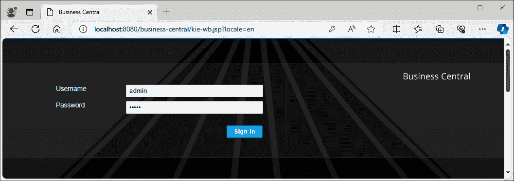

图 12.8 – JPBM 登录页面

一旦连接，您将看到欢迎页面界面，您可以通过点击 **业务中心** 或屏幕左上角的首页图标随时返回。

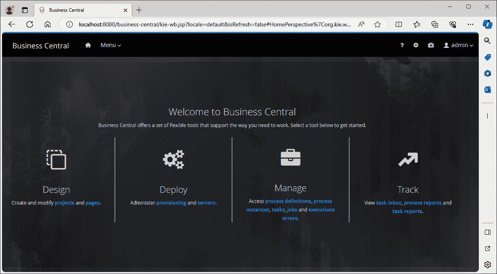

图 12.9 – JPBM 欢迎页面

在 **设计** 部分点击 **项目**。这将带您到一个界面，您可以在此管理您的 JBPM 项目：

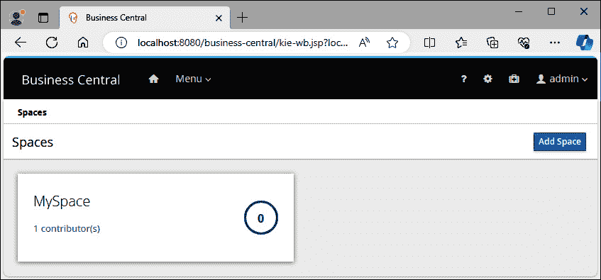

图 12.10 – JPBM 空间的列表

空间用于组织工作和将一组项目与其他项目分开。在这个技术的简单试用中，只需选择现有的 **MySpace** 空间。

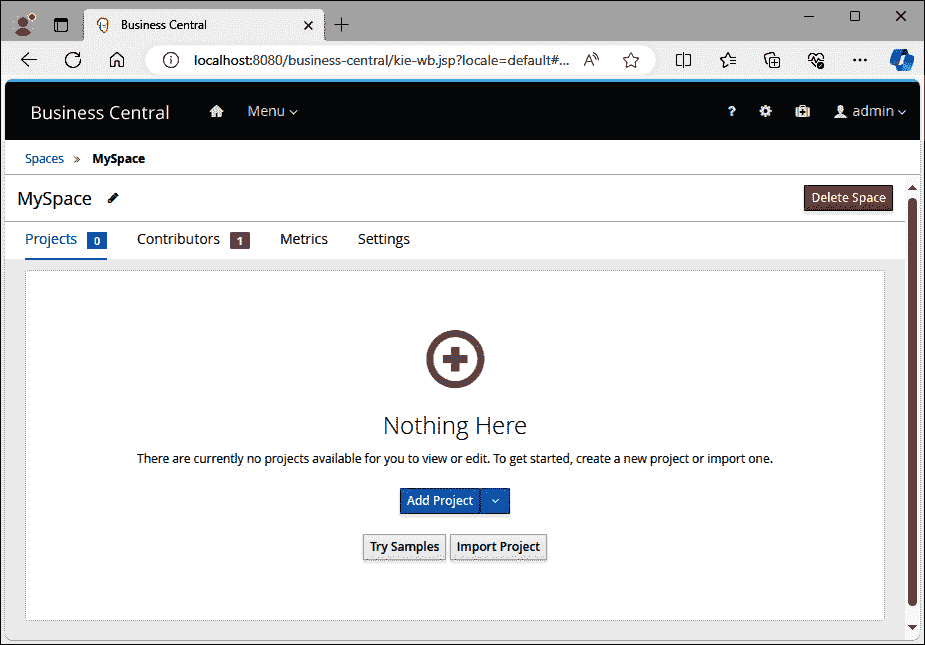

图 12.11 – 没有任何项目的 JPBM 空间

刚创建的空间现在当然是空的。我们将使用其中一个嵌入式示例来说明 JBPMN 的工作原理以及我们目前特别感兴趣的内容，即 DMN 规则引擎。为此，请点击**尝试示例**，这将带您进入以下界面：

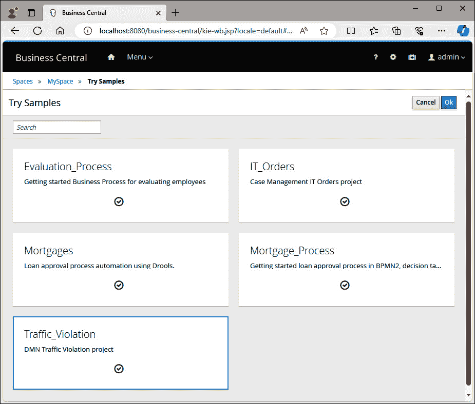

图 12.12 – 选择示例项目

在那里，选择**Traffic_Violation**示例项目并点击**确定**。你应该会收到一条消息，说明项目已正确导入，并且你会进入一个显示示例项目包含的资产的页面：

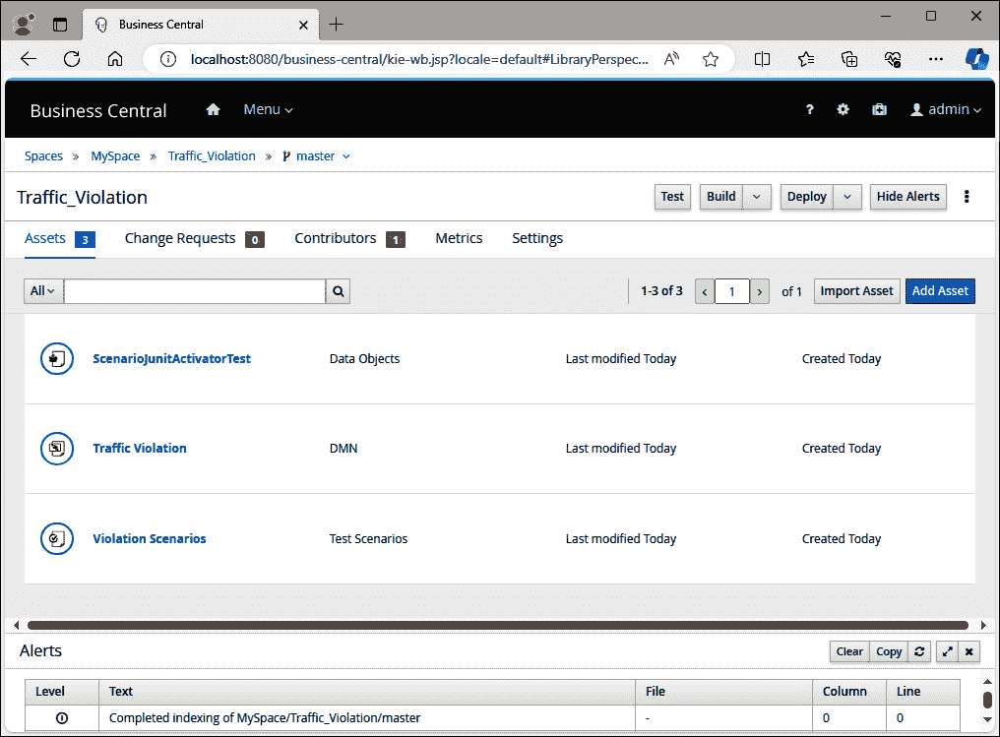

图 12.13 – 交通违规 JBPM 示例的资产

当然，我们最感兴趣的资产是 DMN 模型。点击**Traffic_Violation**资产进行分析，你将被引导到以下界面，该界面显示了 DMN 模型的主体部分，即决策图：


图 12.14 – 一个示例 DMN 决策图

如果你拥有驾照，这个示例的理解应该是显而易见的——超速违规提供了计算相关罚款的数据。然后，根据罚款和驾驶员的额外背景信息，将采取另一个决定，关于是否应该吊销驾驶员的执照。

如果你现在点击左侧菜单中的**Fine**部分的**Decision Table**条目，你会看到以下表格，该表格描述了决策应用的条件：

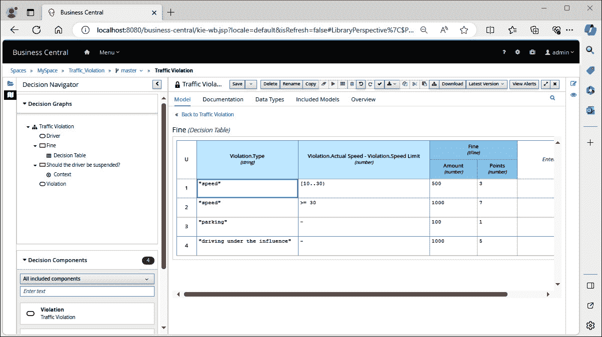

图 12.15 – 一个示例 DMN 决策表

现在，通过顶部导航的面包屑菜单返回项目，然后点击顶部菜单中出现的**部署**：

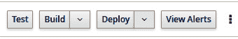

图 12.16 – JBPM 构建和部署菜单

经过一段时间后，你应该会看到一条消息，说明构建成功，然后是第二条消息，如图所示，解释说现在一切准备就绪，可以利用决策引擎：


图 12.17 – JBPM 部署成功通知

如果你想要查看部署结果，可以激活**菜单**/**执行服务器**命令，并观察服务器是如何配置的以及部署单元是如何在它们上面组织的。然后，你可以从这个控制台启动和停止执行服务器，甚至可以删除部署：

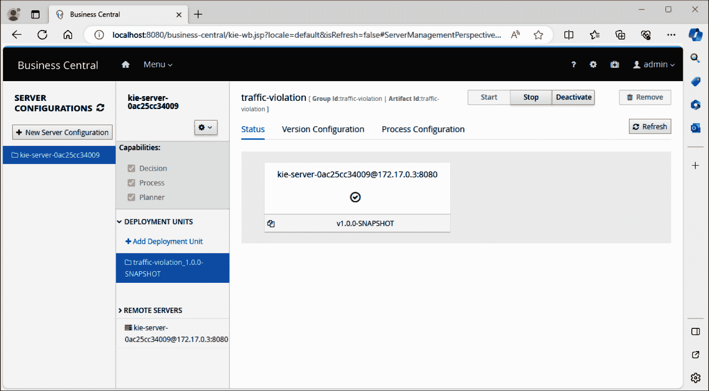

图 12.18 – JBPM 服务器管理界面

由于一切现在都已设置和部署，我们能够利用业务规则。

## 调用业务规则运行时

检查引擎的有效性，只需调用一个为我们提供动态暴露的 REST API 即可。为了做到这一点，由于引擎（逻辑上）通过`POST`动词暴露，我们需要一个比简单网页浏览器更先进的工具，例如 Postman。要访问 API，您将必须使用与我们运行的第二个 Docker 容器关联的端口号 – 在我们的例子中，`8180`。URL 的其余部分如下所示：

+   `/kie-server`对应于规则执行引擎的应用服务器（或**BRE**代表**业务规则执行**）

+   `/services/rest`表示我们将访问 REST API

+   `/server/containers`与 BRE 服务器通过容器暴露的事实相关联，每个部署单元与其他部署单元分开

+   `/traffic-violation_1.0.0-SNAPSHOT`是我们选择在本单元中部署的项目标识

+   `/dmn`对应于我们在这个项目中感兴趣的资源，即决策管理系统

请求体的内容应调整为`raw`/`json`，并包含以下数据：

```cs
{
    "model-namespace": "https://github.com/kiegroup/drools/kie-dmn/_60B01F4D-E407-43F7-848E-258723B5FAC8",
    "dmn-context": {
        "Driver": {
            "Points": 15
        },
        "Violation": {
            "Type": "speed",
            "Actual Speed": 135,
            "Speed Limit": 100
        }
    }
}
```

`model-namespace`对应于项目的唯一标识符，而`dmn-context`表示应该提供给规则引擎以执行其值的值。界面应如下所示：

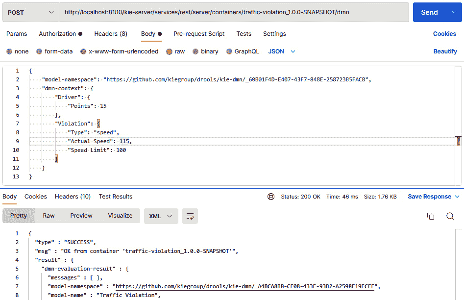

图 12.19 – 一个示例 Postman 调用

为了使这可行，您需要以`kieserver`作为用户名和`kieserver1!`作为密码登录到`kieserver`（这些是默认值，当然，在生产环境中这些值会改变）：

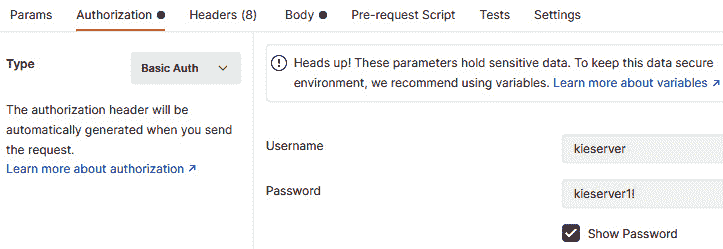

图 12.20 – Postman 认证设置

最后，在向服务器发送消息后，完整的响应如下：

```cs
{
  "type" : "SUCCESS",
  "msg" : "OK from container 'traffic-violation_1.0.0-SNAPSHOT'",
  "result" : {
    "dmn-evaluation-result" : {
      "messages" : [ ],
      "model-namespace" : "https://github.com/kiegroup/drools/kie-dmn/_A4BCA8B8-CF08-433F-93B2-A2598F19ECFF",
      "model-name" : "Traffic Violation",
      "decision-name" : [ ],
      "dmn-context" : {
        "Violation" : {
          "Type" : "speed",
          "Speed Limit" : 100,
          "Actual Speed" : 115
        },
        "Driver" : {
          "Points" : 15
        },
        "Fine" : {
          "Points" : 3,
          "Amount" : 500
        },
        "Should the driver be suspended?" : "No"
      },
      "decision-results" : {
        "_4055D956-1C47-479C-B3F4-BAEB61F1C929" : {
          "messages" : [ ],
          "decision-id" : "_4055D956-1C47-479C-B3F4-BAEB61F1C929",
          "decision-name" : "Fine",
          "result" : {
            "Points" : 3,
            "Amount" : 500
          },
          "status" : "SUCCEEDED"
        },
        "_8A408366-D8E9-4626-ABF3-5F69AA01F880" : {
          "messages" : [ ],
          "decision-id" : "_8A408366-D8E9-4626-ABF3-5F69AA01F880",
          "decision-name" : "Should the driver be suspended?",
          "result" : "No",
          "status" : "SUCCEEDED"
        }
      }
    }
  }
}
```

我们特别感兴趣的是`dmn-context`是如何完成的，以及决策的结果。在我们的案例中，罚款将是 3 分和 500 单位货币，而驾驶执照吊销决策的结果将是负面的。但将请求体中的`Actual Speed`更改为`135`，再次发送，并观察对结果的影响：

```cs
        "Fine" : {
          "Points" : 7,
          "Amount" : 1000
        },
        "Should the driver be suspended?" : "Yes"
```

因此，该引擎已准备好在任何可以处理 REST API 的信息系统中使用（这是地球上除少数非常罕见的例外情况之外的所有平台）。注意，在 JBPM 平台内部也有所有进行测试所需的一切，以测试已构建的决策。由于 Postman 更接近另一个应用程序如何利用 BRE，因此更喜欢使用 Postman 进行测试，但如果你点击`违规场景`资产，你将被带到这个很棒的界面，在那里你可以执行初步测试，以确保在部署之前一切正常：

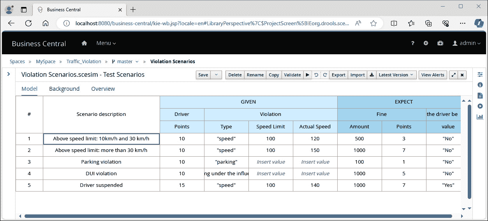

图 12.21 – 一个集成了 JBPM 的自动测试界面

此外，如果你想更好地了解如何创建自己的项目（这超出了本书的范围，本书只关注如何使用现有项目来正确构建信息系统），最佳起点是之前使用的示例代码源，可以在 [`github.com/kiegroup/kie-wb-playground/tree/main/traffic-violation`](https://github.com/kiegroup/kie-wb-playground/tree/main/traffic-violation) 找到。你还可以按照在 [`docs.jboss.org/drools/release/7.51.0.Final/drools-docs/html_single/#dmn-gs-new-project-creating-proc_getting-started-decision-services`](https://docs.jboss.org/drools/release/7.51.0.Final/drools-docs/html_single/#dmn-gs-new-project-creating-proc_getting-started-decision-services) 中解释的详细说明，从控制台构建此项目。

最后，我们将通过一个非常简单的（多亏了 Docker）清理程序来完成此示例（请注意，这将删除与练习相关的所有数据）：

```cs
docker rm -fv jbpm-console
docker rm -fv jbpm-bre
```

所有的内容都应该恢复到创建此示例之前测试机器的状态，这使我们得出本章的结论。

# 摘要

在本章中，我们展示了业务规则管理系统的作用，它在信息系统中的有用性，以及我们如何实现它，从功能示例开始，然后展示与授权相关的另一个示例，授权是软件应用中最常用的业务规则集之一。

就像 BPMN 引擎一样，BRMS 引擎并不经常使用。实际上，在绝大多数情况下，业务规则都是通过代码表达式实现的，或者编译到应用程序中。这是绝对正常的，因为 BRMS 代表着重要的投资，而实现如此复杂的应用程序确实需要强大的业务案例，其中业务规则变化非常频繁，它们与高监管或营销约束相关（例如，需要跟踪所有业务规则及其变化），有模拟业务规则集新版本影响的能力，等等。因此，很明显，这种方法目前仅限于非常罕见的情况。当然，随着信息系统设计工业化的期待，未来事情可能会发生变化，但目前，BPMNs 和 BRMSs 几乎总是过度设计。

由于理想系统的三个部分中有两个对大多数组织来说不值得使用，这意味着这个系统仍然是乌托邦式的。此外，即使是集中式的 MDM 方法也很复杂。MDM 实践本身适用于每个业务领域，所以数据参照没有问题——它们并不复杂，正如我们将在第 *16 章* 和接下来的章节中看到的那样，并且它们带来了大量的商业价值和优势。然而，理想系统旨在实现通用的 MDM，能够动态地适应应用业务环境中的每个实体。这种额外的复杂性目前还不适用，尽管数据参照的静态代码生成正在成为一种可行的选择，这将在第 *19 章* 的结尾展示。

此外，我们已经表明，理想信息系统的三个责任最终是相当相互关联的：

+   MDM 在其数据验证中使用业务规则

+   BRMS 需要从 MDM 获取数据来应用业务规则并决定它们的输出值

+   BPMN 主要作为数据收集器，为 MDM 提供数据，同时也从 MDM 消费数据

+   BPMN 还使用业务规则来确定在不同网关中的走向（有时在执行给定任务期间计算一些额外的数据）

所有这些都证明，从技术上讲，这个为 MDM、BPM 和 BRMS 设计的三个通用服务器组合并不可行，也没有实现完美的解耦。那么，为什么我们在 *第五章* 和最后三章中讨论这样一个理想系统呢？答案再次在于业务/IT 对齐。理想系统并不是今天的信息系统中可以实现的（当然至少在未来几十年内也不可能实现），但它有一个巨大的优势，那就是迫使架构师从三个通用、始终适用的功能责任的角度来思考。即使你使用一个独特的软件应用，了解如何分离数据管理、业务规则管理和业务流程执行，这也能为解耦你的信息系统迈出重要的一步（例如，*n*-层架构根本无法实现这一点）。正如你将在接下来的章节中看到的，本着这些原则构建信息系统将帮助我们实现一个非常复杂的目标，即能够非常容易地修改重要的功能规则和行为，在大多数情况下不会对实施产生任何重大影响。

在下一章中，正如引言中所述，我们将展示一个特定的用例——一个非常重要的业务规则管理应用——即使用规则在软件应用程序中确定和执行授权。尽管我们已经在本章中展示了几个例子，但如何使用 BRMS 的完整描述将在下一章中发生，我们将通过应用专门的授权管理策略到我们熟悉的示例信息系统中来实现。
