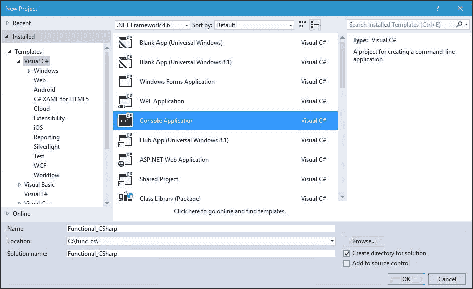
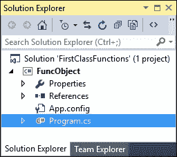
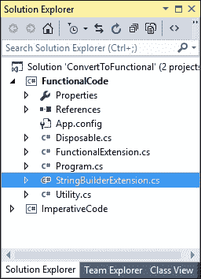
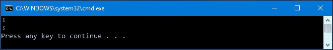
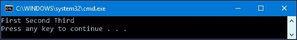
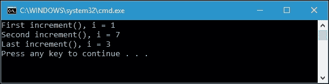
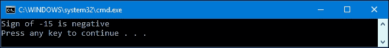
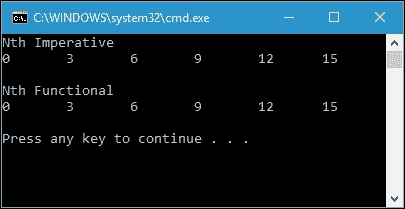
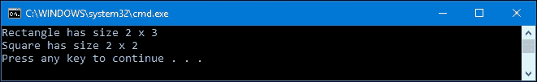

# 第一章：在 C#中品尝函数式风格

函数式编程是一种构建计算机程序元素和结构的风格，它将计算视为数学函数中的评估。虽然有一些专门设计的语言用于创建函数式编程，比如 Haskell 或 Scala，但我们也可以使用 C#来实现函数式编程的设计。

在本书的第一章中，我们将通过测试来探索函数式编程。我们将利用 C#的功能来构建一些函数式代码。我们还将处理在开发函数式程序中经常使用的 C#中的特性。在本章结束时，我们将对 C#中的函数式方法有一个概念。以下是本章我们将涵盖的主题：

+   函数式编程概念介绍

+   函数式和命令式方法的比较

+   函数式编程的概念

+   使用数学方法理解函数式编程

+   将命令式代码重构为函数式代码

+   函数式编程的优缺点

# 介绍函数式编程

在函数式编程中，我们像在数学中写函数一样写函数，没有副作用。代码函数中的变量表示函数参数的值，它类似于数学函数。这个想法是程序员定义包含表达式、定义和可以用变量表示的参数的函数，以解决问题。

程序员构建函数并将函数发送到计算机后，就轮到计算机发挥作用了。一般来说，计算机的作用是评估函数中的表达式并返回结果。我们可以想象计算机就像一个计算器，因为它会分析函数中的表达式并以打印格式将结果返回给用户。计算器将评估由作为参数传递的变量和构成函数主体的表达式组成的函数。变量在表达式中被其值替换。我们可以使用代数运算符给出简单表达式和复合表达式。由于没有赋值的表达式永远不会改变值，子表达式只需要评估一次。

假设我们在一个函数中有表达式`3 + 5`。计算机在完全评估完它之后肯定会返回`8`作为结果。然而，这只是计算机在评估表达式时的简单示例。事实上，程序员可以通过在函数内创建复杂的定义和表达式来增强计算机的能力。计算机不仅可以评估简单的表达式，还可以评估复杂的计算和表达式。

## 理解定义、脚本和会话

正如我们之前讨论过的关于计算器会分析函数中的表达式，让我们想象一下我们有一个计算器，它有一个像计算机一样的控制台面板。与传统计算器的区别在于，我们必须按下***Enter***键而不是***=***（等于号）来运行表达式的评估过程。在这里，我们可以输入表达式，然后按下***Enter***。现在，想象一下我们输入以下表达式：

```cs
3 x 9 

```

在按下***Enter***键后，计算机将在控制台中打印`27`，这正是我们期望的。计算机已经很好地评估了我们给出的表达式。现在，让我们来分析以下定义。想象一下我们在我们的函数式计算器上输入它们：

```cs
square a = a * a 
max a b  = a, if a >= b 
         = b, if b > a 

```

我们已经定义了两个定义，`square`和`max`。我们可以称定义列表为脚本。通过调用`square`函数，后跟代表变量`a`的任何数字，我们将得到该数字的平方。同样，在`max`定义中，我们提供两个数字来代表变量`a`和`b`，然后计算机将评估这个表达式以找出变量之间的最大数。

通过定义这两个定义，我们可以将它们用作函数，我们可以称之为会话，如下所示：

```cs
square (1 + 2) 

```

计算机在评估前述函数后肯定会打印`9`。计算机还能够评估以下函数：

```cs
max 1 2 

```

根据我们之前定义的定义，它将返回`2`作为结果。如果我们提供以下表达式，这也是可能的：

```cs
square (max 2 5) 

```

然后，在我们的计算器控制台面板上将显示`25`。

我们还可以使用先前的定义修改定义。假设我们想要对整数进行四倍化，并利用`square`函数的定义；这是我们可以发送给计算器的内容：

```cs
quad q = square q * square q 
quad 10 

```

前述表达式的第一行是`quad`函数的定义。在第二行，我们调用该函数，我们将得到`10000`作为结果。

脚本可以定义变量值；例如，看一下以下内容：

```cs
radius = 20 

```

因此，我们应该期望计算机能够评估以下定义：

```cs
area = (22 / 7) * square (radius) 

```

## 使用替换和简化来评估表达式

使用一种称为**规约**的数学方法，我们可以通过替换变量或表达式来简化表达式，直到不能再进行规约为止。让我们看看我们前面的表达式`square (1 + 2)`，并看看以下规约过程：

```cs
square (1 + 2) -> square 3 (addition) 
               -> 3 x 3    (square) 
               -> 9        (multiply) 

```

首先，我们有符号`->`来表示规约。从这个序列中，我们可以发现规约过程-换句话说，评估过程。在第一行，计算机将运行`1 + 2`表达式，并用`3`替换它以减少表达式。然后，它将通过简化`square 3`为`3 x 3`表达式来减少第二行的表达式。最后，它将简化`3 x 3`并用`9`替换它，这是该表达式的结果。

实际上，一个表达式在规约中可能有多种可能性。前面的规约过程是规约过程的一种可能性。我们还可以创建其他可能性，比如以下内容：

```cs
square (1 + 2) -> (1 + 2) x (1 + 2) (square) 
               -> 3 x (1 + 2)       (addition)  
               -> 3 x 3             (addition) 
               -> 9                 (multiply) 

```

在前面的序列中，首先可以看到正方形的规则被应用。然后，计算机在第 2 行和第 3 行中替换`1 + 2`。最后，它将乘以表达式中的数字。

从前面的两个例子中，我们可以得出结论，表达式可以使用简单的替换和简化来进行评估，这是数学的基本规则。我们还可以看到，表达式是值的表示，而不是值本身。但是，如果表达式不能再被规约，它将处于正常形式。

## 理解函数式编程中使用的函数

函数式编程使用一种强调函数及其应用而不是命令及其执行的技术。函数式编程中的大多数值都是函数值。让我们看一下以下数学符号：

```cs
f :: A -> B 

```

从前述符号中，我们可以说函数`f`是其中列出的每个元素的关系，即`A`和`B`。我们称`A`为源类型，`B`为目标类型。换句话说，`A -> B`的符号表示`A`是一个参数，我们必须输入值，而`B`是返回值或函数评估的输出。

考虑到`x`表示`A`的一个元素，`x + 2`表示`B`的一个元素，因此我们可以创建以下数学符号：

```cs
f(x) = x + 2 

```

在数学中，我们使用 `f(x)` 来表示函数的应用。在函数式编程中，函数将作为参数传递，并在表达式评估后返回结果。

我们可以为同一个函数构造许多定义。以下两个定义类似，都会将作为参数传递的输入值乘以三：

```cs
triple y = y + y + y 
triple' y = 3 * y 

```

正如我们所看到的，`triple` 和 `triple'` 有不同的表达式。然而，它们是相同的函数，所以我们可以说 `triple` = `triple'`。尽管我们有许多定义来表达一个函数，但我们会发现，在评估过程中只有一个定义是最有效的，因为它能够在我们之前讨论的表达式简化过程中证明。不幸的是，我们无法确定哪一个是最有效的，因为这取决于评估机制的特性。

### 形成定义

现在，让我们回到本章开头关于定义的讨论。我们有以下定义，以便从案例分析中检索值：

```cs
max a b  = a, if a >= b 
         = b, if b > a 

```

在这个定义中有两个表达式，由布尔值表达式区分。这个区分器称为保护，并且我们使用它们来评估 `True` 或 `False` 的值。第一行是这个函数的另一个结果值。它说明，如果表达式 `a >= b` 是 `True`，则返回值将是 `a`。相反，如果表达式 `b >= a` 是 `True`，则函数将返回值 `b`。使用这两种情况，`a >= b` 和 `b >= a`，`max` 值取决于 `a` 和 `b` 的值。案例的顺序并不重要。我们还可以使用特殊词 `otherwise` 来定义 `max` 函数。这个词确保如果没有表达式结果为 True 值，否则情况将被执行。在这里，我们将使用 `otherwise` 重新构造我们的 max 函数：

```cs
max a b  = a, if a >= b 
         = b, otherwise 

```

从前面的函数定义中，我们可以看到，如果第一个表达式是 `False`，函数将立即返回 `b`，而不执行任何评估。换句话说，否则情况将始终返回 `True`，如果所有先前的保护都返回 `False`。

数学符号中通常使用的另一个特殊词是 `where`。这个词用于为函数的表达式设置局部定义。让我们看看以下例子：

```cs
f x y = (z + 2) * (z + 3) 
        where z = x + y 

```

在前面的例子中，我们有一个带有变量 `z` 的函数 `f`，其值由 `x` 和 `y` 确定。在那里，我们引入了一个局部 `z` 定义到函数中。这个局部定义也可以与我们之前讨论过的案例分析一起使用。以下是一个带有案例分析的连接局部定义的例子：

```cs
f x y = x + z, if x > 100 
      = x - z, otherwise 
        where z = triple(y + 3) 

```

在前面的函数中，有一个局部 `z` 定义，适用于 `x + z` 和 `x - z` 表达式。正如我们之前讨论的，尽管函数有两个等于 (`=`) 符号，只有一个表达式会返回值。

### 柯里化

柯里化是一种简单的技术，通过顺序改变结构参数。它将把一个 n 元函数转换为 n 个一元函数。这是一种旨在规避 Lambda 函数限制的技术，Lambda 函数是一元函数。让我们再回到我们的 max 函数，并得到以下定义：

```cs
max a b  = a, if a >= b 
         = b, if b > a 

```

我们可以看到 `max a b` 函数名中没有括号。函数名中也没有逗号分隔的 `a` 和 `b`。我们可以向函数定义中添加括号和逗号，如下所示：

```cs
max' (a,b)  = a, if a >= b 
            = b, if b > a 

```

乍一看，我们发现这两个函数是相同的，因为它们有相同的表达式。然而，它们是不同的，因为它们有不同的类型。`max'` 函数有一个参数，由一对数字组成。`max'` 函数的类型可以写成如下形式：

```cs
max' :: (num, num) -> num 

```

另一方面，`max` 函数有两个参数。这个函数的类型可以写成如下形式：

```cs
max :: num -> (num -> num) 

```

max 函数将接受一个数字，然后返回一个从单个数字到多个数字的函数。从前面的 max 函数中，我们将变量`a`传递给`max`函数，它返回一个值。然后，将该值与变量`b`进行比较，以找到最大的数字。

# 函数式编程和命令式编程的比较

函数式编程和命令式编程的主要区别在于，命令式编程会产生副作用，而函数式编程不会。在命令式编程中，表达式被评估并且其结果值被赋给变量。因此，当我们将一系列表达式分组到一个函数中时，结果值取决于那个时间点变量的状态。这就是副作用。由于状态不断变化，评估的顺序很重要。在函数式编程世界中，破坏性赋值是被禁止的，每次赋值发生时都会引入一个新变量。

# 准备 C#编译器

在本章的讨论中，我们将使用 C#创建一些代码。为了保持相同的环境，让我们定义一下我们将在配置设置中使用的内容。我们将在本书中讨论的所有源代码中使用 Visual Studio 2015 Community Edition 和.NET Framework 4.6.2。我们还将选择控制台应用程序项目，以便简化我们的代码开发，因为它不需要太多的设置更改。

这是我们将使用的创建 Visual Studio 项目的设置的截图：



当我们讨论一个以`csproj`为文件名的源代码时，比如`FuncObject.csproj`，我们可以在示例代码提供的解决方案文件中找到它。它将在`Program.cs`文件中。以下是在 Visual Studio 中项目结构的截图：



然而，有时在项目文件中有多个`.cs`文件。在这种情况下，我们可以在项目文件中的一个`.cs`文件中找到我们正在讨论的代码。例如，我们有一个名为`FunctionalCode.csproj`的项目文件。因此，当我们讨论与此项目文件相关的任何源代码时，我们可以从项目文件中的`.cs`文件中找到它。包含多个`.cs`文件的项目文件的结构如下：



正如我们所看到的，在`FunctionalCode.csproj`文件中，我们不仅有`Program.cs`文件，还有`Disposable.cs`，`FunctionalExtension.cs`，`StringBuilderExtension.cs`和`Utility.cs`。

我们还会在大部分代码的类名中找到`partial`关键字，即使我们将类写在同一个文件中。目的是为了使本书中的代码片段在示例代码中更容易找到。通过知道类名，可以更容易地在文件中找到源代码。

### 注意

我们还需要安装 Visual Studio Community 2017 RC，因为我们将在第九章中使用 C# 7 的新功能，*使用模式*。

# 函数式编程的概念

我们还可以通过概念来区分函数式编程和命令式编程。函数式编程的核心思想被封装在构造中，比如一等函数、高阶函数、纯度、递归而不是循环以及部分函数。我们将在这个主题中讨论这些概念。

## 一等函数和高阶函数

在命令式编程中，给定的数据更重要，并且通过一系列函数（带有副作用）传递。函数是具有自己语义的特殊构造。实际上，函数与变量和常量的地位不同。由于函数不能作为参数传递或作为结果返回，它们被视为编程世界的二等公民。在函数式编程世界中，我们可以将函数作为参数传递并将函数作为结果返回。它们遵守与变量及其值相同的语义。因此，它们是一等公民。我们还可以通过组合创建函数的函数，称为二阶函数。对函数的组合性没有限制，它们被称为高阶函数。

幸运的是，C#语言支持这两个概念，因为它具有称为函数对象的功能，它具有类型和值。要讨论有关函数对象的更多细节，请看以下代码：

```cs
class Program 
{ 
  static void Main(string[] args) 
  { 
    Func<int, int> f = (x) => x + 2; 
    int i = f(1); 
    Console.WriteLine(i); 

    f = (x) => 2 * x + 1; 
    i = f(1); 
    Console.WriteLine(i); 
  } 
} 

```

我们可以在`FuncObject.csproj`中找到代码，如果我们运行它，它将在控制台屏幕上显示以下输出：



为什么要显示它？让我们继续讨论函数类型和函数值。

### 提示

按下***Ctrl*** + ***F5***而不是***F5***以在调试模式下运行代码但不使用调试器。这对于阻止控制台在退出时关闭很有用。

### 函数类型

与 C#中的其他对象一样，函数对象也有类型。我们可以在函数声明中初始化类型。以下是声明函数对象的语法：

```cs
Func<T1, T2, T3, T4, ..., T16, TResult> 

```

请注意，我们有`T1`到`T16`，它们是对应输入参数的类型，`TResult`是对应返回类型的类型。如果我们需要转换我们之前的数学函数，`f(x) = x + 2`，我们可以将其写成如下形式：

```cs
Func<int, int> f = (x) => x + 2;  

```

现在我们有一个函数`f`，它具有一个参数类型为整数和整数返回类型。在这里，我们使用 lambda 表达式定义一个委托，以赋给名为`f`的对象，其类型为`Func`。如果您对委托和 lambda 表达式不熟悉，不要担心。我们将在下一章中进一步讨论它们。

### 函数值

要为函数变量分配一个值，有以下可能性：

+   函数变量可以通过引用使用类中的现有方法的名称进行分配。我们可以使用委托作为引用。让我们看一下以下代码片段：

```cs
      class Program 
      { 
        delegate int DoubleAction(int inp); 

        static void Main(string[] args) 
        { 
          DoubleAction da = Double; 
          int doubledValue = da(2); 
        } 

        static int Double(int input) 
        { 
          return input * 2; 
        } 
      } 

```

+   正如我们在上面的代码中所看到的，我们使用`delegate`将`da`变量分配给现有的`Double()`方法。

+   可以使用 lambda 表达式将函数变量分配给匿名函数。让我们看一下以下代码片段：

```cs
      class Program 
      { 
        static void Main(string[] args) 
        { 
          Func<int, int> da =  
               input => input * 2; 

          int doubledValue = da(2); 
        } 
      } 

```

+   正如我们在上面的代码中所看到的，`da`变量是使用 lambda 表达式分配的，我们可以像在以前的代码片段中一样使用`da`变量。

现在我们有一个函数变量，可以将一个变量-整数类型的变量分配给这个函数变量，例如：

```cs
int i = f(1); 

```

执行上述代码后，变量`i`的值将为`3`，因为我们将`1`作为参数传递，它将返回`1 + 2`。我们还可以将函数变量分配给另一个函数，如下所示：

```cs
f = (x) => 2 * x + 1; 
i = f(1); 

```

我们将一个新函数`2 * x + 1`分配给变量`f`，因此如果我们运行上述代码，我们将得到`3`。

## 纯函数

在函数式编程中，大多数函数都没有副作用。换句话说，函数不会改变函数本身之外的任何变量。而且它是一致的，这意味着它总是为相同的输入数据返回相同的值。以下是在编程中会产生副作用的示例操作：

+   修改全局变量或静态变量，因为这将使函数与外部世界交互。

+   修改函数中的参数。如果我们将参数作为引用传递，通常会发生这种情况。

+   引发异常。

+   将输入和输出移到外部-例如，从键盘获取按键或将数据写入屏幕。

### 注意

尽管它不满足纯函数的规则，但我们将在程序中使用许多`Console.WriteLine（）`方法，以便在代码示例中更容易理解。

以下是我们可以在`NonPureFunction1.csproj`中找到的非纯函数示例：

```cs
class Program 
{ 
  private static string strValue = "First"; 

  public static void AddSpace(string str) 
  { 
    strValue += ' ' + str; 
  } 

  static void Main(string[] args) 
  { 
    AddSpace("Second"); 
    AddSpace("Third"); 
    Console.WriteLine(strValue); 
  } 
} 

```

如果我们运行上述代码，预期将在控制台上显示以下结果：



在此代码中，我们修改了`AddSpace`函数内的`strValue`全局变量。由于它修改了外部变量，因此不被视为纯函数。

让我们看看`NonPureFunction2.csproj`中的另一个非纯函数示例：

```cs
class Program 
{ 
  public static void AddSpace(StringBuilder sb, string str) 
  { 
    sb.Append(' ' + str); 
  } 

  static void Main(string[] args) 
  { 
    StringBuilder sb1 = new StringBuilder("First"); 
    AddSpace(sb1, "Second"); 
    AddSpace(sb1, "Third"); 
    Console.WriteLine(sb1); 
  } 
} 

```

我们再次看到`AddSpace`函数，但这次添加了一个参数类型为`StringBuilder`的参数。在函数中，我们使用`hyphen`和`str`修改`sb`参数。由于我们通过引用传递了`sb`变量，它也修改了`Main`函数中的`sb1`变量。请注意，它将显示与`NonPureFunction2.csproj`相同的输出。

要将前面两个非纯函数代码示例转换为纯函数代码，我们可以重构代码如下。此代码可以在`PureFunction.csproj`中找到：

```cs
class Program 
{ 
  public static string AddSpace(string strSource, string str) 
  { 
    return (strSource + ' ' + str); 
  } 

  static void Main(string[] args) 
  { 
    string str1 = "First"; 
    string str2 = AddSpace(str1, "Second"); 
    string str3 = AddSpace(str2, "Third"); 
    Console.WriteLine(str3); 
  } 
} 

```

运行`PureFunction.csproj`，我们将获得与前两个非纯函数代码相同的输出。但是，在此纯函数代码中，`Main`函数中有三个变量。这是因为在函数式编程中，我们不能修改我们之前初始化的变量。在`AddSpace`函数中，现在不是修改全局变量或参数，而是返回一个字符串值以满足函数规则。

如果我们在代码中实现纯函数，我们将获得以下优势：

+   我们的代码将更易于阅读和维护，因为函数不依赖于外部状态和变量。它还旨在执行增加可维护性的特定任务。

+   设计将更容易更改，因为重构更容易。

+   测试和调试将更容易，因为很容易隔离纯函数。

## 递归函数

在命令式编程世界中，我们有破坏性赋值来改变变量的状态。通过使用循环，可以更改多个变量以实现计算目标。在函数式编程世界中，由于变量不能被破坏性地分配，我们需要递归函数调用来实现循环的目标。

让我们创建一个阶乘函数。在数学术语中，非负整数`N`的阶乘是小于或等于`N`的所有正整数的乘积。这通常用`N！`表示。我们可以将`7`的阶乘表示如下：

```cs
7! = 7 x 6 x 5 x 4 x 3 x 2 x 1 
   = 5040 

```

如果我们更深入地研究前面的公式，我们将发现公式的模式如下：

N！= N *（N-1）*（N-2）*（N-3）*（N-4）*（N-5）...

现在，让我们看一下 C#中的以下阶乘函数。这是一种命令式方法，可以在`RecursiveImperative.csproj`文件中找到：

```cs
public partial class Program 
{ 
  private static int GetFactorial(int intNumber) 
  { 
    if (intNumber == 0) 
    { 
      return 1; 
    } 

    return intNumber * GetFactorial(intNumber - 1); 
  } 
} 

```

正如我们所看到的，我们从`GetFactorial（）`函数中调用`GetFactorial（）`函数本身。这就是我们所说的递归函数。我们可以通过创建包含以下代码的`Main（）`方法来使用此函数：

```cs
public partial class Program 
{ 
  static void Main(string[] args) 
  { 
    Console.WriteLine( 
      "Enter an integer number (Imperative approach)"); 
    int inputNumber = Convert.ToInt32(Console.ReadLine()); 
    int factorialNumber = GetFactorial(inputNumber); 
    Console.WriteLine( 
      "{0}! is {1}", 
      inputNumber, 
      factorialNumber); 
  } 
} 

```

我们调用`GetFactorial（）`方法并将我们想要的数字传递给参数。然后，该方法将我们的数字与`GetFactorial（）`方法返回的结果相乘，其中参数已减去 1。迭代将持续到`intNumber-1`等于 0，然后返回 1。

现在，让我们将命令式方法中的前面递归函数与函数式方法中的递归函数进行比较。我们将使用 LINQ 功能中的`Aggregate`运算符的功能来实现这个目标。我们可以在`RecursiveFunctional.csproj`文件中找到代码。代码将如下所示：

```cs
class Program 
{ 
  static void Main(string[] args) 
  { 
    Console.WriteLine( 
      "Enter an integer number (Functional approach)"); 
    int inputNumber = Convert.ToInt32(Console.ReadLine()); 
    IEnumerable<int> ints = Enumerable.Range(1, inputNumber); 
    int factorialNumber = ints.Aggregate((f, s) => f * s); 
    Console.WriteLine( 
      "{0}! is {1}", 
      inputNumber, 
      factorialNumber); 
  } 
} 

```

我们初始化`ints`变量，其中包含从 1 到我们所需的整数的值，然后我们使用`Aggregate`运算符迭代`ints`。`RecursiveFunctional.csproj`的输出与`RecursiveImperative.csproj`的输出完全相同。然而，我们在`RecursiveFunctional.csproj`中使用了函数式方法。

# 在 C#中感受函数式

本节将讨论 C#中的函数式编程。我们将讨论函数式编程的概念方面，并在 C#中编写代码。我们将通过讨论柯里化、管道化和方法链接来开始讨论。

## 使用数学概念理解函数式方法

在函数式编程中，函数的行为方式类似数学函数，无论在何种上下文中调用，对于给定的参数都会返回相同的值。这被称为**引用透明性**。为了更详细地理解这一点，考虑我们有以下数学函数表示，并且我们想将其转换为 C#中的函数式编程：

*f(x) = 4x² -14x-8*

C#中的函数式编程如下：

```cs
public partial class Program 
{ 
  public static int f(int x) 
  { 
    return (4 * x * x - 14 * x - 8); 
  } 
} 

```

从前面的函数中，我们可以在`FunctionF.csproj`文件中找到，如果`x`为 5，我们将得到 5 的`f`，即 22。表示如下：

*f(5) = 22*

我们还可以在 C#中调用`f`函数，如下所示：

```cs
public partial class Program 
{ 
  static void Main(string[] args) 
  { 
    int i = f(5); 
    Console.WriteLine(i); 
  } 
} 

```

每次我们以 5 作为参数运行函数时，也就是`x`等于 5 时，我们总是得到 22 作为返回值。

现在，将其与命令式方法进行比较。让我们看一下以下代码，它将存储在`ImperativeApproach.csproj`文件中：

```cs
public partial class Program 
{ 
  static int i = 0; 

  static void increment() 
  { 
    i++; 
  } 

  static void set(int inpSet) 
  { 
    i = inpSet; 
  } 
} 

```

我们在`Main()`方法中描述以下代码：

```cs
public partial class Program 
{ 
  static void Main(string[] args) 
  { 
    increment(); 
    Console.WriteLine("First increment(), i = {0}", i); 

    set(6); 
    increment(); 
    Console.WriteLine("Second increment(), i = {0}", i); 

    set(2); 
    increment(); 
    Console.WriteLine("Last increment(), i = {0}", i); 

    return; 
  } 
} 

```

如果我们运行`ImperativeApproach.csproj`，控制台屏幕应该如下截图所示：



在之前的命令式方法代码中，无论我们传入相同的参数，每次调用`increment`或`set`时都会得到不同的`i`输出。在这里，我们发现了命令式方法的所谓副作用问题。`increment`或`set`函数被称为具有副作用，因为它们修改了`i`的状态并与外部世界交互。

关于副作用的问题，现在我们在 C#中有以下代码：

```cs
public partial class Program 
{ 
  public static string GetSign(int val) 
  { 
    string posOrNeg; 

    if (val > 0) 
      posOrNeg = "positive"; 
    else 
      posOrNeg = "negative"; 

    return posOrNeg; 
  } 
} 

```

前面的代码是语句样式代码，我们可以在`StatementStyle.csproj`文件中找到。这是一种命令式编程技术，它定义动作而不是产生结果。我们告诉计算机要做什么。我们要求计算机比较`value`变量的值与零，然后将`posOrNeg`变量分配给相关值。我们可以通过将以下代码添加到项目中来尝试前面的函数：

```cs
public partial class Program 
{ 
  static void Main(string[] args) 
  { 
    Console.WriteLine( 
      "Sign of -15 is {0}", 
      GetSign(-15)); 
  } 
} 

```

控制台的输出将如下所示：



这与我们之前的讨论一致。

我们可以通过将其修改为表达式样式代码来将其转换为函数式方法。在 C#中，我们可以使用条件运算符来实现这个目标。以下是我们从`StatementStyle.csproj`代码重构的代码，我们可以在`ExpressionStyle.csproj`文件中找到：

```cs
public partial class Program 
{ 
  public static string GetSign(int val) 
  { 
    return val > 0 ? "positive" : "negative"; 
  } 
} 

```

现在我们有了紧凑的代码，它具有与我们之前的许多行代码相同的行为。然而，正如我们之前讨论的，前面的代码没有副作用，因为它只返回字符串值，无需先准备变量。而在语句风格方法中，我们必须两次分配`posOrNeg`变量。换句话说，我们可以说函数式方法将产生一个无副作用的函数。

与命令式编程相比，在函数式编程中，我们描述我们想要的结果，而不是指定如何获得结果。假设我们有一组数据，并且想要创建一个新列表，其中包含源列表中的第 N 个元素。实现这一目标的命令式方法如下：

```cs
public partial class Program 
{ 
  static List<int> NthImperative(List<int> list, int n) 
  { 
    var newList = new List<int>(); 

    for (int i = 0; i < list.Count; i++) 
    { 
      if (i % n == 0) newList.Add(list[i]); 
    } 

    return newList; 
  } 
} 

```

前面的代码可以在`NthElementImperative.csproj`文件中找到。正如我们所看到的，在 C#中检索列表中的第 N 个元素，我们必须初始化第一个元素，以便将`i`定义为`0`。然后我们遍历列表元素，并决定当前元素是否为第 N 个元素。如果是，我们将从源列表中添加新数据到`newList`中。在这里，我们发现前面的源代码不是一种函数式方法，因为在添加新数据时`newList`变量被赋值了多次。它还包含了循环过程，而函数式方法则没有。然而，我们可以将代码转换为函数式方法，如下所示：

```cs
public partial class Program 
{ 
  static List<int> NthFunctional(List<int> list, int n) 
  { 
    return list.Where((x, i) => i % n == 0).ToList(); 
  } 
} 

```

再次，由于我们使用了 LINQ 功能的强大功能，我们在函数式方法中有紧凑的代码。如果我们想要尝试前面的两个函数，我们可以将以下代码插入到`Main()`函数中：

```cs
public partial class Program 
{ 
  static void Main(string[] args) 
  { 
    List<int> listing = 
      new List<int>() { 
      0, 1, 2, 3, 4, 5, 
      6, 7, 8, 9, 10, 11, 
      12, 13, 14, 15, 16 }; 

    var list3rd_imper = NthImperative(listing, 3); 
    PrintIntList("Nth Imperative", list3rd_imper); 

    var list3rd_funct = NthFunctional(listing, 3); 
    PrintIntList("Nth Functional", list3rd_funct); 
  } 
} 

```

对于`PrintIntList()`方法，实现如下：

```cs
public partial class Program 
{ 
  static void PrintIntList( 
    string titleHeader, 
    List<int> list) 
  { 
    Console.WriteLine( 
      String.Format("{0}", 
      titleHeader)); 

    foreach (int i in list) 
    { 
      Console.Write(String.Format("{0}\t", i)); 
    } 

    Console.WriteLine("\n"); 
  } 
} 

```

尽管我们使用不同的方法运行了这两个函数，但我们仍然得到了相同的输出，如下所示：



## 应用元组进行函数式 C#

在.NET Framework 4 中，元组被引入为一组新的通用类，用于存储一组不同类型的元素。元组是不可变的，因此可以应用于函数式编程。当我们需要对象中的不同数据类型时，它用于表示数据结构。以下是声明元组对象的可用语法：

```cs
public class Tuple <T1>
public class Tuple <T1, T2>
public class Tuple <T1, T2, T3>
public class Tuple <T1, T2, T3, T4>
public class Tuple <T1, T2, T3, T4, T5>
public class Tuple <T1, T2, T3, T4, T5, T6>
public class Tuple <T1, T2, T3, T4, T5, T6, T7>
public class Tuple <T1, T2, T3, T4, T5, T6, T7, T8>
```

正如我们在前面的语法中所看到的，我们可以创建一个最多包含八个项目类型（`T1`，`T2`等）的元组。`Tuple`具有只读属性，因此它是不可变的。让我们看一下在`Tuple.csproj`项目中可以找到的以下代码片段：

```cs
public partial class Program
{
  Tuple<string, int, int> geometry1 =
     new Tuple<string, int, int>(
         "Rectangle",
          2,
          3);
  Tuple<string, int, int> geometry2 =
  Tuple.Create(
         "Square",
          2,
          2);
}
```

要创建元组，我们有两种不同的方法，基于前面的代码。前者，我们将一个新的元组实例化为一个变量。后者，我们使用`Tuple.Create()`。要使用元组数据，我们可以像以下代码片段中那样使用它的项目：

```cs
public partial class Program
{
  private static void ConsumeTuple()
  {
    Console.WriteLine(
      "{0} has size {1} x {2}",
       geometry1.Item1,
       geometry1.Item2,
       geometry1.Item3);
    Console.WriteLine(
      "{0} has size {1} x {2}",
       geometry2.Item1,
       geometry2.Item2,
       geometry2.Item3);
  }
}
```

如果我们运行上面的`ConsumeTuple()`方法，我们将在控制台上得到以下输出：



我们也可以像以下代码片段中所做的那样返回一个元组数据类型：

```cs
public partial class Program
{
  private static Tuple<int, int> (
     string shape)
  { GetSize
    if (shape == "Rectangle")
    {
      return Tuple.Create(2, 3);
    }
    else if (shape == "Square")
    {
      return Tuple.Create(2, 2);
    }
    else
    {
      return Tuple.Create(0, 0);
    }
  }
}
```

正如我们所看到的，`GetSize()`方法将返回元组数据类型。我们可以添加以下`ReturnTuple()`方法：

```cs
public partial class Program
{
  private static void ReturnTuple()
  {
    var rect = GetSize("Rectangle");
    Console.WriteLine(
        "Rectangle has size {0} x {1}",
          rect.Item1,
          rect.Item2);
    var square = GetSize("Square");
    Console.WriteLine(
       "Square has size {0} x {1}",
         square.Item1,
         square.Item2);
  }
}
```

如果我们运行上面的`ReturnTuple()`方法，我们将会得到与`ConsumeTuple()`方法完全相同的输出。

幸运的是，在 C# 7 中，我们可以返回元组数据类型，而无需声明元组，如以下代码片段所示：

```cs
public partial class Program
{
  (int, int) GetSizeInCS7(
          string shape)
    {
      if (shape == "Rectangle")
      {
        return (2, 3);
      }
      else if (shape == "Square")
      {
        return (2, 2);
      }
      else
      {
        return (0, 0);
      }
  }
}
```

如果我们想要为元组中的所有项目命名，我们现在可以在 C# 7 中使用以下代码片段中的技术来实现：

```cs
public partial class Program
{
  private static (int x, int y) GetSizeNamedItem(
          string shape)
  {
    if (shape == "Rectangle")
    {
      return (2, 3);
    }
    else if (shape == "Square")
    {
      return (2, 2);
    }
    else
    {
      return (0, 0);
    }
  }
}
```

现在，当我们像以下代码一样访问元组项目时，它将更清晰：

```cs
public partial class Program
{
  private static void ConsumeTupleByItemName()
  {
    var rect = GetSizeNamedItem("Rectangle");
    Console.WriteLine(
       "Rectangle has size {0} x {1}",
        rect.x,
        rect.y);
    var square = GetSizeNamedItem("Square");
    Console.WriteLine(
       "Square has size {0} x {1}",
        square.x,
        square.y);
  }
}
```

我们不再调用`Item1`和`Item2`，而是调用 x 和 y 名称。

为了获得 C# 7 中元组的所有新功能，我们必须从[`www.nuget.org/packages/System.ValueTuple`](https://www.nuget.org/packages/System.ValueTuple)下载`System.ValueTuple` NuGet 包。

## C#中的柯里化

在本章的开头，我们已经从理论上讨论了柯里化。当我们将一个接受多个参数的函数分割成一系列占据部分参数的函数时，我们就应用了柯里化。换句话说，当我们将较少的参数传递给一个函数时，它将期望我们返回另一个函数，以使用函数序列完成原始函数。让我们看一下`NonCurriedMethod.csproj`文件中的以下代码：

```cs
public partial class Program 
{ 
  public static int NonCurriedAdd(int a, int b) => a + b; 
} 

```

前面的函数将添加`a`和`b`参数，然后返回结果。这个函数的用法在我们日常编程中很常见；例如，看一下以下代码片段：

```cs
public partial class Program 
{ 
  static void Main(string[] args) 
  { 
    int add = NonCurriedAdd(2, 3); 
    Console.WriteLine(add); 
  } 
} 

```

现在，让我们继续讨论柯里化方法。代码将在`CurriedMethod.csproj`文件中找到，函数声明如下：

```cs
public partial class Program 
{ 
  public static Func<int, int> CurriedAdd(int a) => b => a + b; 
} 

```

我们使用`Func<>`委托来创建`CurriedAdd()`方法。我们可以以两种方式调用前面的方法，第一种如下：

```cs
public partial class Program 
{ 
  public static void CurriedStyle1() 
  { 
    int add = CurriedAdd(2)(3); 
    Console.WriteLine(add); 
  } 
} 

```

在`CurriedAdd()`方法的前面调用中，我们用两个括号传递参数，这可能不太熟悉。实际上，我们也可以只传递一个参数来对`CurriedAdd()`方法进行柯里化。代码如下：

```cs
public partial class Program 
{ 
  public static void CurriedStyle2() 
  { 
    var addition = CurriedAdd(2); 

    int x = addition(3); 
    Console.WriteLine(x); 
  } 
} 

```

从前面的代码中，我们向`CurriedAdd()`方法提供了一个参数：

```cs
var addition = CurriedAdd(2); 

```

然后，它等待另一个`addition`表达式，我们在以下代码中提供：

```cs
int x = addition(3); 

```

前面的代码的结果将与`NonCurried()`方法完全相同。

## 管道

管道技术是一种将一个函数的输出作为下一个函数的输入传递的技术。操作中的数据将像管道中的水流一样流动。我们通常在命令行界面中找到这种技术。让我们看一下以下命令行：

```cs

C:\>dir | more

```

前面的命令行将`dir`命令的输出传递给`more`命令的输入。现在，让我们看一下以下 C#代码，我们可以在`NestedMethodCalls.csproj`文件中找到：

```cs
class Program 
{ 
  static void Main(string[] args) 
  { 
    Console.WriteLine( 
      Encoding.UTF8.GetString( 
        new byte[] { 0x70, 0x69, 0x70, 0x65, 0x6C, 
        0x69, 0x6E, 0x69, 0x6E, 0x67 } 
      ) 
    ); 
  } 
} 

```

在前面的代码中，我们使用了嵌套方法调用技术来在控制台屏幕上编写`管道`。如果我们想要将其重构为管道方法，我们可以看一下以下代码，我们可以在`Pipelining.csproj`文件中找到它：

```cs
class Program 
{ 
  static void Main(string[] args) 
  { 
    var bytes = new byte[] { 
      0x70, 0x69, 0x70, 0x65, 0x6C, 
      0x69, 0x6E, 0x69, 0x6E, 0x67 }; 
    var stringFromBytes = Encoding.UTF8.GetString(bytes); 
    Console.WriteLine(stringFromBytes); 
  } 
} 

```

如果运行上述代码，我们将得到完全相同的管道输出，但这次将以管道方式呈现。

## 方法链接

方法链接是在一行代码中链接多个方法的过程。一个方法的返回值将成为下一个方法的输入，依此类推。使用方法链接，我们不需要声明许多变量来存储每个方法的返回值。相反，方法的返回值将传递给下一个方法的参数。以下是不应用方法链接的传统方法，我们可以在`TraditionalMethod.csproj`中找到该代码：

```cs
class Program 
{ 
  static void Main(string[] args) 
  { 
    var sb = new StringBuilder("0123", 10); 
    sb.Append(new char[] { '4', '5', '6' }); 
    sb.AppendFormat("{0}{1}{2}", 7, 8, 9); 
    sb.Insert(0, "number: "); 
    sb.Replace('n', 'N'); 
    var str = sb.ToString(); 
    Console.WriteLine(str); 
  } 
} 

```

在`Main`函数中调用了`StringBuilder`的五种方法和两个变量：`sb`用于初始化`StringBuilder`，`str`用于以字符串格式存储`StringBuilder`。不幸的是，我们在那里调用的五种方法修改了`sb`变量。我们可以重构代码以应用方法链接，以使其成为函数式。以下是函数式代码，我们可以在`ChainingMethod.csproj`中找到它：

```cs
class Program 
{ 
  static void Main(string[] args) 
  { 
    var str = 
      new StringBuilder("0123", 10) 
          .Append(new char[] { '4', '5', '6' }) 
          .AppendFormat("{0}{1}{2}", 7, 8, 9) 
          .Insert(0, "number: ") 
          .Replace('n', 'N') 
          .ToString(); 
    Console.WriteLine(str); 
  } 
} 

```

如果运行两种类型的代码，将显示相同的输出。但是，现在我们通过链接所有调用方法得到了函数式代码。

# 将命令式代码转换为函数式代码

在本节中，我们将通过利用方法链接将命令式代码转换为函数式代码。假设我们想要创建一个包含太阳系行星列表的 HTML 有序列表；HTML 将如下所示：

```cs
<ol id="thePlanets"> 
  <li>The Sun/li> 
  <li value="0">Mercury</li> 
  <li value="1">Venus</li> 
  <li value="2">Earth</li> 
  <li value="3">Mars</li> 
  <li value="4">Jupiter</li> 
  <li value="5">Saturn</li> 
  <li value="6">Uranus</li> 
  <li value="7">Neptune</li> 
</ol> 

```

## 命令式代码方法

我们将列出行星的名称，包括太阳。我们还将使用每个`li`元素中的 value 属性标记行星的顺序。前面的 HTML 代码将显示在控制台中。我们将在`ImperativeCode.csproj`中创建列表；请看下面：

```cs
class Program 
{ 
  static void Main(string[] args) 
  { 
    byte[] buffer; 
    using (var stream = Utility.GeneratePlanetsStream()) 
    { 
      buffer = new byte[stream.Length]; 
      stream.Read(buffer, 0, (int)stream.Length); 
    } 
    var options = Encoding.UTF8 
      .GetString(buffer) 
      .Split(new[] { Environment.NewLine, }, 
             StringSplitOptions.RemoveEmptyEntries) 
      .Select((s, ix) => Tuple.Create(ix, s)) 
      .ToDictionary(k => k.Item1, v => v.Item2); 
    var orderedList = Utility.GenerateOrderedList( 
        options, "thePlanets", true); 

    Console.WriteLine(orderedList); 
  } 
} 

```

在`Main()`方法中，我们创建一个名为 buffer 的字节数组，其中包含我们在其他类中生成的行星流。代码片段如下：

```cs
byte[] buffer; 
using (var stream = Utility.GeneratePlanetsStream()) 
{ 
  buffer = new byte[stream.Length]; 
  stream.Read(buffer, 0, (int)stream.Length); 
} 

```

我们可以看到有一个名为`Utility`的类，其中包含`GeneratePlanetStream()`方法。这个方法用于以流格式生成太阳系中行星的列表。让我们看一下以下代码，以找出方法内部的内容：

```cs
public static partial class Utility 
{ 
  public static Stream GeneratePlanetsStream() 
  { 
    var planets = 
    String.Join( 
      Environment.NewLine, 
      new[] { 
        "Mercury", "Venus", "Earth", 
        "Mars", "Jupiter", "Saturn", 
        "Uranus", "Neptune" 
    }); 

    var buffer = Encoding.UTF8.GetBytes(planets); 
    var stream = new MemoryStream(); 
    stream.Write(buffer, 0, buffer.Length); 
    stream.Position = 0L; 

    return stream; 
  } 
} 

```

首先，它创建一个名为`planets`的变量，其中包含八个行星的名称，分别在新行上。我们使用`GetBytes`方法获取 ASCII 的字节，然后将其转换为流。这个流将返回给调用者函数。

在`main`函数中，我们还有变量 options，如下所示：

```cs
var options = Encoding.UTF8 
  .GetString(buffer) 
  .Split(new[] { Environment.NewLine, }, 
    StringSplitOptions.RemoveEmptyEntries) 
  .Select((s, ix) => Tuple.Create(ix, s)) 
  .ToDictionary(k => k.Item1, v => v.Item2); 

```

这将创建一个包含行星名称和其在太阳系中顺序的字典类型变量。我们在这里使用 LINQ，但我们将在下一章中更深入地讨论它。

然后，我们在`Utility`类中调用`GenerateOrderedList()`方法。这个方法用于生成一个包含太阳系中行星顺序的 HTML 有序列表。代码片段如下：

```cs
var orderedList = Utility.GenerateOrderedList( 
    options, "thePlanets", true);  

```

如果我们看一下`GenerateOrderedList()`方法，我们会发现以下代码：

```cs
public static partial class Utility 
{ 
  public static string GenerateOrderedList( 
    IDictionary<int, string> options, 
    string id, 
    bool includeSun) 
  { 
    var html = new StringBuilder(); 
    html.AppendFormat("<ol id="{0}">", id); 
    html.AppendLine(); 

    if (includeSun) 
    { 
      html.AppendLine("\t<li>The Sun/li>"); 
    } 

    foreach (var opt in options) 
    { 
      html.AppendFormat("\t<li value="{0}">{1}</li>",
      opt.Key,
      opt.Value); 
      html.AppendLine(); 
    } 

    html.AppendLine("</ol>"); 

    return html.ToString(); 
  } 
} 

```

首先，在这个方法中，我们创建一个名为 html 的`StringBuilder`函数，并添加一个开放的`ol`标签，表示*有序列表*。代码片段如下：

```cs
var html = new StringBuilder(); 
    html.AppendFormat("<ol id="{0}">", id); 
    html.AppendLine(); 

```

我们还有一个布尔变量`includeSun`，用于定义我们是否需要在列表中包含太阳。我们从方法的参数中获取这个变量的值。之后，我们迭代从参数中获取的字典的内容。这个字典是由`Main()`方法中的 LINQ 生成的。我们通过添加`li`标签来列出内容。我们使用`foreach`关键字来实现这个目标。以下是代码片段：

```cs
foreach (var opt in options) 
{ 
  html.AppendFormat("\t<li value="{0}">{1}</li>", 
    opt.Key, 
    opt.Value); 
  html.AppendLine(); 
} 

```

我们可以看到`StringBuilder`类中的`AppendFormat`与`String.Format`类似，我们可以从字典中传递`Key`和`Value`。不要忘记使用`AppendLine`方法为每个`li`标签插入新行。

最后，我们使用以下代码关闭`ol`标签，该标签在以下代码片段中定义：

```cs
html.AppendLine("</ol>"); 

```

然后，我们调用`ToString()`方法从`StringBuilder`中获取一堆字符串。现在，如果我们运行代码，我们将在控制台屏幕上得到输出，就像我们之前讨论的那样。

## 功能代码方法

我们已经开发了命令式代码，以构建一个行星名称的 HTML 有序列表，就像我们之前讨论的那样。现在，从这个命令式代码中，我们将重构为使用方法链接的功能代码。我们构建的功能代码将在`FunctionalCode.csproj`中。

### GenerateOrderedList()方法

我们从`GenerateOrderedList()`方法开始，因为我们将修改它的前三行。在`ImperativeCode.csproj`中，它看起来像下面这样：

```cs
var html = new StringBuilder(); 
  html.AppendFormat("<ol id="{0}">", id); 
  html.AppendLine(); 

```

我们可以将前面的代码重构为这样：

```cs
var html = 
  new StringBuilder() 
    .AppendFormat("<ol id="{0}">", id) 
    .AppendLine(); 

```

现在代码变得更加自然，因为它应用了方法链接。然而，我们仍然能够将`AppendFormat()`方法与`AppendLine()`方法结合起来，以使其变得简单。为了实现这个目标，我们需要方法扩展的帮助。我们可以创建一个`StringBuilder`的方法扩展，如下所示：

```cs
public static partial class StringBuilderExtension 
{ 
  public static StringBuilder AppendFormattedLine( 
    this StringBuilder @this,
    string format, 
    params object[] args) => 
       @this.AppendFormat(format, args).AppendLine(); 
} 

```

现在，因为我们在`StringBuilder`类中有`AppendFormattedLine()`方法，我们可以将之前的代码片段重构为以下内容：

```cs
var html = 
  new StringBuilder() 
      .AppendFormattedLine("<ol id="{0}">", id); 

```

代码片段变得比以前简单得多。我们还在`foreach`循环内部的`AppendFormat()`后面调用了`AppendLine()`，如下所示：

```cs
foreach (var opt in options) 
{ 
  html.AppendFormat("\t<li value="{0}">{1}</li>", 
    opt.Key, 
    opt.Value); 
  html.AppendLine(); 
} 

```

因此，我们还可以使用我们在`StringBuilder`类中添加的`AppendFormattedLine()`函数重构前面的代码片段，如下所示：

```cs
foreach (var opt in options) 
{ 
  html.AppendFormattedLine( 
    "\t<li value="{0}">{1}</li>", 
    opt.Key, 
    opt.Value); 
} 

```

接下来，我们在条件关键字`if`内部有`AppendLine()`。我们还需要重构它，以使用扩展方法进行方法链接。我们可以为`StringBuilder`创建名为`AppendLineWhen()`的扩展方法。使用这种方法是为了比较我们提供的条件，然后它应该决定是否需要被写入。扩展方法将如下所示：

```cs
public static partial class StringBuilderExtension 
{ 
  public static StringBuilder AppendLineWhen( 
    this StringBuilder @this, 
    Func<bool> predicate, 
    string value) => 
        predicate() 
         ? @this.AppendLine(value) 
          : @this;  
} 

```

由于我们现在有了`AppendLineWhen()`方法，我们可以将其链接到前面的代码片段，如下所示：

```cs
var html = 
  new StringBuilder() 
    .AppendFormattedLine("<ol id="{0}">", id) 
    .AppendLineWhen(() => includeSun, "\t<li>The Sun/li>"); 

```

因此，我们现在有信心从`GenerateOrderedList()`方法中删除以下代码：

```cs
if (includeSun) 
{ 
  html.AppendLine("\t<li>The Sun/li>"); 
} 

```

我们还可以使`AppendLineWhen()`方法更通用，使其不仅接受字符串，还接受函数作为参数。让我们将`AppendLineWhen()`方法修改为`AppendWhen()`方法，如下所示：

```cs
public static partial class StringBuilderExtension 
{ 
  public static StringBuilder AppendWhen( 
    this StringBuilder @this, 
    Func<bool> predicate, 
    Func<StringBuilder, StringBuilder> fn) => 
    predicate() 
    ? fn(@this) 
    : @this; 
} 

```

正如我们所看到的，该函数现在将`Func<StringBuilder, StringBuilder> fn`作为参数，以替换字符串值。因此，它现在使用该函数来决定`fn(@this)`的条件。我们可以再次使用我们的新方法重构`var html`，如下所示：

```cs
var html = 
  new StringBuilder() 
  .AppendFormattedLine("<ol id="{0}">", id) 
  .AppendWhen( 
    () => includeSun, 
    sb => sb.AppendLine("\t<li>The Sun/li>")); 

```

到目前为止，我们已经链接了两种方法，它们是`AppendFormattedLine()`和`AppendWhen()`方法。我们剩下的函数是`foreach`循环，我们需要将其链接到名为`html`的`StringBuilder`对象。为此，我们再次创建一个名为`AppendSequence()`的`StringBuilder`的扩展方法，如下所示：

```cs
public static partial class StringBuilderExtension 
{ 
  public static StringBuilder AppendSequence<T>( 
    this StringBuilder @this, 
    IEnumerable<T> sequence, 
    Func<StringBuilder, T, StringBuilder> fn) => 
      sequence.Aggregate(@this, fn); 
} 

```

我们使用`IEnumerable`接口使该函数在序列上进行迭代。它还调用`IEnumerable`中的`Aggregate`方法作为一个累加器，计算递增序列。

现在，使用`AppendSequence()`，我们可以重构`foreach`循环并将方法链接到`var html`，如下所示：

```cs
var html = 
  new StringBuilder() 
  .AppendFormattedLine("<ol id="{0}">", id) 
  .AppendWhen( 
    () => includeSun, 
    sb => sb.AppendLine("\t<li>The Sun/li>")) 
  .AppendSequence( 
    options, 
    (sb, opt) => 
      sb.AppendFormattedLine( 
      "\t<li value="{0}">{1}</li>", 
      opt.Key, 
      opt.Value)); 

```

我们添加的`AppendSequence()`方法以选项变量作为字典输入和`sb`和`opt`的函数。此方法将迭代字典内容，然后将格式化的字符串附加到`StringBuilder sb`中。现在，以下`foreach`循环可以从代码中删除：

```cs
foreach (var opt in options) 
{ 
  html.AppendFormattedLine( 
    "\t<li value="{0}">{1}</li>", 
    opt.Key, 
    opt.Value); 
} 

```

接下来是我们想要链接到`var html`变量的`html.AppendLine("</ol>")`函数调用。这相当简单，因为我们只需要链式调用它而不需要做太多更改。现在让我们看一下`var html`赋值中的变化：

```cs
var html = 
  new StringBuilder() 
  .AppendFormattedLine("<ol id="{0}">", id) 
  .AppendWhen( 
    () => includeSun, 
    sb => sb.AppendLine("\t<li>The Sun/li>")) 
  .AppendSequence( 
    options, 
    (sb, opt) => 
      sb.AppendFormattedLine( 
        "\t<li value="{0}">{1}</li>", 
        opt.Key, 
        opt.Value)) 
  .AppendLine("</ol>"); 

```

正如我们在前面的代码中所看到的，我们重构了`AppendLine()`方法，所以现在它链接到`StringBuilder`声明。

在`GenerateOrderedList()`方法中，我们有以下代码行：

```cs
return html.ToString(); 

```

我们还可以重构该行，使其链接到`var html`中的`StringBuilder`声明。如果我们链接它，我们将得到以下`var html`初始化：

```cs
var html = 
  new StringBuilder() 
  .AppendFormattedLine("<ol id="{0}">", id) 
  .AppendWhen( 
    () => includeSun, 
    sb => sb.AppendLine("\t<li>The Sun/li>")) 
  .AppendSequence( 
    options, 
    (sb, opt) => 
      sb.AppendFormattedLine( 
      "\t<li value="{0}">{1}</li>", 
      opt.Key, 
      opt.Value)) 
  .AppendLine("</ol>") 
  .ToString(); 

```

不幸的是，如果我们现在编译代码，它将产生*CS0161*错误，错误解释如下：

```cs
'Utility.GenerateOrderedList(IDictionary<int, string>, string, bool)': not all code paths return a value 

```

错误发生是因为该方法在预期返回字符串值时没有返回任何值。但是，由于它是函数式编程，我们可以将这个方法重构为表达式成员。完整的`GenerateOrderedList()`方法将如下所示：

```cs
public static partial class Utility 
{ 
  public static string GenerateOrderedList( 
    IDictionary<int, string> options, 
    string id, 
    bool includeSun) => 
      new StringBuilder() 
      .AppendFormattedLine("<ol id="{0}">", id) 
      .AppendWhen( 
        () => includeSun, 
        sb => sb.AppendLine("\t<li>The Sun/li>")) 
      .AppendSequence( 
        options, 
        (sb, opt) => 
          sb.AppendFormattedLine( 
          "\t<li value="{0}">{1}</li>", 
          opt.Key, 
          opt.Value)) 
       .AppendLine("</ol>") 
       .ToString(); 
} 

```

我们从前面的代码中删除了`return`关键字。我们还删除了`html`变量。我们现在有一个函数，其主体是类似 lambda 表达式而不是语句块。这个特性是在.NET Framework 4.6 中宣布的。

### `Main()`方法

`FunctionalCode.csproj`中的`Main()`方法是我们在 C#编程中通常遇到的典型方法。方法流程如下：它从流中读取数据到字节数组，然后将这些字节转换为字符串。之后，它执行转换以修改该字符串，然后将其传递给`GenerateOrderedList()`方法。

如果我们看一下起始代码行，我们会得到以下代码片段：

```cs
byte[] buffer; 
using (var stream = Utility.GeneratePlanetsStream()) 
{ 
    buffer = new byte[stream.Length]; 
    stream.Read(buffer, 0, (int)stream.Length); 
} 

```

我们需要重构前面的代码以便进行链接。为此，我们创建一个名为`Disposable`的新类，其中包含`Using()`方法。`Disposable`类中的`Using()`方法如下：

```cs
public static class Disposable 
{ 
  public static TResult Using<TDisposable, TResult> 
  ( 
    Func<TDisposable> factory, 
    Func<TDisposable, TResult> fn) 
    where TDisposable : IDisposable 
    { 
      using (var disposable = factory()) 
      { 
        return fn(disposable); 
      } 
    } 
}

```

在前面的`Using()`方法中，我们接受两个参数：`factory`和`fn`。`IDisposable`接口适用的函数是`factory`，而`fn`是在声明`factory`函数后将要执行的函数。现在，我们可以重构`Main()`方法的起始行如下：

```cs
var buffer = 
  Disposable 
  .Using( 
    Utility.GeneratePlanetsStream, 
    stream => 
    { 
      var buff = new byte[stream.Length]; 
      stream.Read(buff, 0, (int)stream.Length); 
      return buff; 
    }); 

```

与命令式代码相比，我们现在已经重构了使用`Dispose.Using()`方法将流读取并存储到字节数组中的代码。我们要求 lambda 流函数返回 buff 内容。现在，我们有一个缓冲变量要传递到下一个阶段，即`UTF8.GetString(buffer)`方法。我们在`GetString(buffer)`方法中实际上做的是将缓冲区转换并映射为字符串。为了链接这个方法，我们需要创建`Map`方法扩展。该方法将如下所示：

```cs
public static partial class FunctionalExtensions 
{ 
  public static TResult Map<TSource, TResult>( 
    this TSource @this, 
    Func<TSource, TResult> fn) => 
    fn(@this); 
} 

```

由于我们需要将其作为通用方法，我们在方法的参数中使用了一个通用类型。我们还在返回值中使用了一个通用类型，这样它就不会只返回字符串值。使用通用类型，这个`Map`扩展方法将能够将任何静态类型值转换为另一个静态类型值。我们需要为这个方法使用表达式主体成员，所以我们在这里使用了 lambda 表达式。现在我们可以将这个`Map`方法用于`UTF8.GetString()`方法。`var buffer`的初始化将如下所示：

```cs
var buffer = 
  Disposable 
  .Using( 
    Utility.GeneratePlanetsStream, 
    stream => 
    { 
      var buff = new byte[stream.Length]; 
      stream.Read(buff, 0, (int)stream.Length); 
      return buff; 
    }) 
    .Map(Encoding.UTF8.GetString) 
    .Split(new[] { Environment.NewLine, }, 
    StringSplitOptions.RemoveEmptyEntries) 
  .Select((s, ix) => Tuple.Create(ix, s)) 
  .ToDictionary(k => k.Item1, v => v.Item2); 

```

通过应用`Map`方法，就像前面的代码片段一样，我们不再需要以下代码：

```cs
var options = 
  Encoding 
  .UTF8 
  .GetString(buffer) 
  .Split(new[] { Environment.NewLine, },  
    StringSplitOptions.RemoveEmptyEntries) 
  .Select((s, ix) => Tuple.Create(ix, s)) 
  .ToDictionary(k => k.Item1, v => v.Item2); 

```

然而，问题出现了，因为下一个代码需要将变量选项作为`GenerateOrderedList()`方法的参数，我们可以在以下代码片段中看到：

```cs
var orderedList = Utility.GenerateOrderedList( 
  options, "thePlanets", true); 

```

为了解决这个问题，我们也可以使用`Map`方法将`GenerateOrderedList()`方法链接到缓冲变量初始化，这样我们就可以删除`orderedList`变量。现在，代码将如下所示：

```cs
var buffer = 
  Disposable 
  .Using( 
    Utility.GeneratePlanetsStream, 
    stream => 
    { 
      var buff = new byte[stream.Length]; 
      stream.Read(buff, 0, (int)stream.Length); 
      return buff; 
    }) 
  .Map(Encoding.UTF8.GetString) 
  .Split(new[] { Environment.NewLine, }, 
    StringSplitOptions.RemoveEmptyEntries) 
  .Select((s, ix) => Tuple.Create(ix, s)) 
  .ToDictionary(k => k.Item1, v => v.Item2) 
  .Map(options => Utility.GenerateOrderedList( 
    options, "thePlanets", true)); 

```

由于代码的最后一行是`Console.WriteLine()`方法，它以`orderedList`变量作为参数，我们可以将缓冲变量修改为`orderedList`。更改将如下所示：

```cs
var orderedList = 
  Disposable 
  .Using( 
    Utility.GeneratePlanetsStream, 
    stream => 
    { 
      var buff = new byte[stream.Length]; 
      stream.Read(buff, 0, (int)stream.Length); 
      return buff; 
    }) 
  .Map(Encoding.UTF8.GetString) 
  .Split(new[] { Environment.NewLine, }, 
    StringSplitOptions.RemoveEmptyEntries) 
  .Select((s, ix) => Tuple.Create(ix, s)) 
  .ToDictionary(k => k.Item1, v => v.Item2) 
  .Map(options => Utility.GenerateOrderedList( 
    options, "thePlanets", true));  

```

`GenerateOrderedList()`方法中的最后一行是`Console.WriteLine()`方法。我们还将这个方法链接到`orderedList`变量上。为此，我们需要扩展一个名为`Tee`的方法，其中包含我们之前讨论过的流水线技术。让我们来看一下下面的`Tee`方法扩展：

```cs
public static partial class FunctionalExtensions 
{ 
  public static T Tee<T>( 
    this T @this,  
    Action<T> action) 
  { 
    action(@this); 
    return @this; 
  } 
} 

```

从前面的代码中，我们可以看到`Tee`的输出将传递给`Action`函数的输入。然后，我们可以使用`Tee`链接最后一行，如下所示：

```cs
Disposable 
  .Using( 
    Utility.GeneratePlanetsStream, 
    stream => 
    { 
      var buff = new byte[stream.Length]; 
      stream.Read(buff, 0, (int)stream.Length); 
      return buff; 
    }) 
  .Map(Encoding.UTF8.GetString) 
  .Split(new[] { Environment.NewLine, }, 
    StringSplitOptions.RemoveEmptyEntries) 
  .Select((s, ix) => Tuple.Create(ix, s)) 
  .ToDictionary(k => k.Item1, v => v.Item2) 
  .Map(options => Utility.GenerateOrderedList( 
    options, "thePlanets", true)) 
  .Tee(Console.WriteLine); 

```

`Tee`可以返回由`GenerateOrderedList()`方法生成的 HTML，这样我们就可以从代码中删除`orderedList`变量。

我们还可以将`Tee`方法实现到前面代码中的 lambda 表达式中。我们将使用`Tee`来重构以下代码片段：

```cs
stream => 
{ 
  var buff = new byte[stream.Length]; 
  stream.Read(buff, 0, (int)stream.Length); 
  return buff; 
} 

```

让我们了解一下前面的代码片段实际上在做什么。首先，我们初始化了一个名为`buff`的字节数组变量，以存储与流的长度相同的字节数。然后使用`stream.Read`方法填充这个字节数组，然后返回字节数组。我们也可以要求`Tee`方法来做这个工作。代码将如下所示：

```cs
Disposable 
  .Using( 
    Utility.GeneratePlanetsStream, 
    stream => new byte[stream.Length] 
  .Tee(b => stream.Read( 
    b, 0, (int)stream.Length))) 
  .Map(Encoding.UTF8.GetString) 
  .Split(new[] { Environment.NewLine, }, 
    StringSplitOptions.RemoveEmptyEntries) 
  .Select((s, ix) => Tuple.Create(ix, s)) 
  .ToDictionary(k => k.Item1, v => v.Item2) 
  .Map(options => Utility.GenerateOrderedList( 
    options, "thePlanets", true)) 
  .Tee(Console.WriteLine);  

```

现在，我们有了一个新的`Main()`方法，应用了方法链接来实现函数式编程。

# 函数式编程的优缺点

到目前为止，我们已经通过使用函数式方法来创建代码来处理函数式编程。现在，我们可以看一下函数式方法的优势，例如以下内容：

+   执行顺序并不重要，因为它是由系统处理的，计算的值是我们给定的，而不是程序员定义的值。换句话说，表达式的声明将变得唯一。因为函数式程序对数学概念有一种方法，系统将被设计成尽可能接近数学概念的表示方式。

+   变量的值可以被其值替换，因为表达式的求值可以随时进行。因此，函数式代码在数学上更容易追踪，因为程序允许通过等号替换等号来进行操作或转换。这个特性被称为引用透明性。

+   不可变性使函数式代码不受副作用的影响。共享变量是副作用的一个例子，它是创建并行代码的严重障碍，并导致非确定性执行。通过消除副作用，我们可以有一个良好的编码方法。

+   惰性求值的力量将使程序运行得更快，因为它只提供了我们真正需要的查询结果。假设我们有大量数据，并且想要根据特定条件进行过滤，比如只显示包含单词“Name”的数据。在命令式编程中，我们将不得不评估所有数据的每个操作。问题在于当操作花费很长时间时，程序也需要更多时间来运行。幸运的是，应用 LINQ 的函数式编程只在需要时执行过滤操作。这就是为什么函数式编程将节省我们大量时间使用惰性求值。

+   我们有一个使用可组合性解决复杂问题的方法。这是一个通过将问题分解来管理问题的原则，并将问题的部分交给几个函数。这个概念类似于我们组织活动并要求不同的人承担特定的责任的情况。通过这样做，我们可以确保每个人都会正确地完成所有事情。

除了函数式编程的优点之外，还有一些缺点。以下是其中一些：

+   由于没有状态，也不允许更新变量，性能损失将会发生。当我们处理大型数据结构并且需要对任何数据执行复制时，即使只改变了一小部分数据，问题也会发生。

+   与命令式编程相比，函数式编程会产生更多的垃圾，因为不可变性的概念需要更多的变量来处理特定的赋值。因为我们无法控制垃圾收集，性能也会下降。

# 总结

到目前为止，我们已经通过讨论函数式编程的介绍来了解函数式方法。我们还将函数式方法与数学概念进行了比较，当我们创建函数式程序时。现在清楚了，函数式方法使用数学方法来组成函数式程序。

构建函数有三个重要的要点；它们是定义、脚本和会话。定义是描述数学函数的特定表达式之间的等式。脚本是程序员提供的一组定义。会话是程序将包含对脚本中定义的函数的引用的表达式提交给计算机进行评估的情况。

函数式和命令式编程的比较也引出了区分两者的重要观点。现在清楚了，在函数式编程中，程序员关注所需信息的类型和所需转换的类型，而在命令式方法中，程序员关注执行任务的方式和跟踪状态的变化。

我们还探讨了函数式编程的几个概念，如头等和高阶函数、纯函数和递归函数。头等和高阶函数的概念将函数视为值，因此我们可以将其分配给变量并将其传递给函数的参数。纯函数的概念使函数没有副作用。递归函数帮助我们使用 LINQ 中的聚合功能迭代函数本身的能力。此外，函数式编程中的函数具有我们需要了解的几个特征，例如以下内容：

每次给定相同的输入集时，它总是返回相同的值。

它从不引用函数外定义的变量。

它不能改变变量的值，因为它应用了不可变的概念。

它不包含任何 I/O，例如花哨的输出或键盘输入，因为不允许发生副作用。

在 C#中测试函数式程序时，我们采用数学方法来找出如何从数学函数中组合一个 C#函数。我们学会了如何对柯里化函数进行柯里化，以便在分配第一个参数后传递第二个参数。此外，我们现在知道如何使用管道和方法链接技术使程序具有函数式。

在学习创建函数式编程的技术后，我们将命令式方法代码转换为函数式方法代码。在这里，我们从头开始组合命令式代码，然后将其重构为函数式代码。

最后，当我们对函数式编程更加熟悉时，我们可以掌握函数式编程本身的优缺点。这将是我们需要学习函数式编程的原因。

在下一章中，我们将讨论委托数据类型，以封装具有特定参数和返回类型的方法。当我们需要创建一个更清晰、更简单的函数指针时，这是非常有用的。
