# 第二章：委托演练

在上一章中，我们在创建的代码中应用了委托。当我们讨论函数式编程的概念时，我们应用了 C#中具有的内置委托之一。在本章中，我们将通过讨论以下主题深入探讨在函数式 C#编程中经常使用的委托：

+   委托的定义、语法和用法

+   将委托组合成多播委托

+   使用内置委托

+   理解委托中的差异

# 介绍委托

委托是 C#中的一种数据类型，它封装了具有特定参数和返回类型（签名）的方法。换句话说，委托将定义方法的参数和返回类型。委托类似于 C/C++中的函数指针，因为两者都存储对具有特定签名的方法的引用。与 C/C++中的函数指针一样，委托保留了它所引用的方法的内存地址。如果它引用具有不同签名的函数，编译器将发出警告。然而，由于 C++语言的非托管性质，可以将函数指针指向任意位置（通过转换）。

让我们看一下以下委托语法：

```cs
[AccessModifier] delegate ReturnType DelegateName([parameters]); 

```

以下是上述委托语法中每个元素的解释：

+   访问修饰符：这是用于设置委托可访问性的修饰符。它可以是 public、private、internal 或 protected。但是，我们可以省略它，如果这样做，那么默认的修饰符将是 internal。

+   委托：这是我们需要的关键字，以初始化委托。

+   返回类型：这是我们分配给此委托的方法的返回数据类型。

+   委托名称：这是委托的标识。

+   参数：这是我们分配给此委托的方法所需的参数列表。

通过引用上述语法，我们可以初始化委托，例如`SingleStringDelegate`：

```cs
public delegate void SingleStringDelegate(string dataString); 

```

由于我们有了上述委托，我们可以将具有相同签名的方法分配给委托。方法可以如下：

```cs
private static void AssignData(string dataString) 
{ 
  globalString = dataString; 
} 

```

或者，方法可以如下：

```cs
private static void WriteToConsole(string dataText) 
{ 
  Console.WriteLine(dataText); 
} 

```

由于两个方法具有相同的签名，我们可以使用以下语法将它们分配给`SingleStringDelegate`：

```cs
SingleStringDelegate delegate1 = AssignData; 

```

上述语法用于将`AssignData()`方法分配给类型为`SingleStringDelegate`的变量，并且对于`WriteToConsole()`方法，我们可以使用以下语法：

```cs
SingleStringDelegate delegate2 = WriteToConsole; 

```

### 注意

通常，委托类型的名称以单词`Delegate`结尾，例如`SingleStringDelegate`，以便能够区分委托名称和方法名称。但这不是强制性的，我们可以省略这一点。

## 简单委托

为了进一步讨论委托，让我们看一下以下方法，我们可以在`SimpleDelegates.csproj`中找到：

```cs
public partial class Program 
{ 
  static int Rectangle(int a, int b) 
  { 
    return a * b; 
  } 
} 

```

在上述代码中，我们可以将`Rectangle()`方法分配给以下代码中给定的委托变量：

```cs
public partial class Program 
{ 
  private delegate int AreaCalculatorDelegate(int x, int y); 
} 

```

由于方法的签名是委托类型所期望的，因此也可以将以下方法分配给`AreaCalculatorDelegate`委托：

```cs
public partial class Program 
{ 
  static int Square(int x, int y) 
  { 
    return x * y; 
  } 
} 

```

要将方法分配给委托，我们只需要创建一个具有与要分配的方法兼容签名的委托数据类型的变量。以下是`Main()`方法，它将创建委托变量并调用方法：

```cs
public partial class Program 
{ 
  static void Main(string[] args) 
  { 
    AreaCalculatorDelegate rect = Rectangle; 
    AreaCalculatorDelegate sqr = Square; 
    int i = rect(1, 2); 
    int j = sqr(2, 3); 
    Console.WriteLine("i = " + i); 
    Console.WriteLine("j = " + j); 
  } 
} 

```

从上述代码中，我们创建了两个名为`rect`和`sqr`的变量，它们的类型是`AreaCalculatorDelegate`。以下是代码片段：

```cs
AreaCalculatorDelegate rect = Rectangle; 
AreaCalculatorDelegate sqr = Square; 

```

由于我们已经将`rect`和`sqr`变量分配给`Rectangle()`和`Square()`方法，我们可以使用委托变量调用这些方法。让我们看一下以下代码片段：

```cs
int i = rect(1, 2); 
int j = sqr(2, 3); 

```

我们将变量`i`和`j`分配为`rect()`和`sqr()`的结果。虽然它们都是变量名，但它们指的是方法的地址位置。通过调用这些变量引用的方法来执行其中包含的逻辑。我们有效地执行了两个`Console.WriteLine()`方法来产生以下输出：

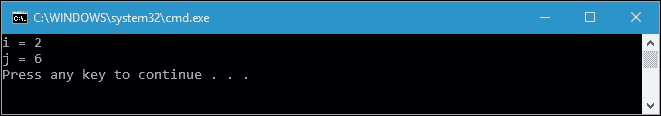

现在读者清楚为什么我们显示了前面截图中的输出。`rect`和`sqr`变量现在分别存储对`Rectangle()`和`Square()`方法的引用。我们在调用`rect`委托时有效地调用`Rectangle()`方法，同时调用`sqr`委托时调用`Square()`方法。

## 多播委托

我们刚刚讨论了一个简单的委托，我们将特定方法分配给委托变量。我们可以称之为单播委托。然而，委托实际上可以使用一个变量调用多个方法。为此，我们可以称之为多播委托。在多播委托的情况下，它就像一个存储在内部列表中的委托列表。当我们调用多播委托时，列表中的委托按正确的顺序同步调用。创建多播委托有几种方法。我们将详细讨论两种方法：`Delegate.Combine()`和`Delegate.Remove()`方法以及`+=`和`-=`（增加和减少）运算符。

### 使用`Delegate.Combine()`和`Delegate.Remove()`方法

让我们首先检查以下代码，使用`Delegate.Combine()`方法创建一个多播委托。假设我们有一个名为`CalculatorDelegate`的委托，如下所示，我们可以在`CombineDelegates.csproj`中找到：

```cs
public partial class Program 
{ 
  private delegate void CalculatorDelegate(int a, int b); 
} 

```

然后，我们有以下四种方法，它们与`CalculatorDelegate`签名相同：

```cs
public partial class Program 
{ 
  private static void Add(int x, int y) 
  { 
    Console.WriteLine( 
      "{0} + {1} = {2}", 
      x, 
      y, 
      x + y); 
  } 
  private static void Subtract(int x, int y) 
  { 
    Console.WriteLine( 
      "{0} - {1} = {2}", 
      x, 
      y, 
      x - y); 
  } 
  private static void Multiply(int x, int y) 
  { 
    Console.WriteLine( 
      "{0} * {1} = {2}", 
      x, 
      y, 
      x * y); 
  } 
  private static void Division(int x, int y) 
  { 
    Console.WriteLine( 
      "{0} / {1} = {2}", 
      x, 
      y, 
      x / y); 
  } 
} 

```

有四种方法，它们是`Add()`，`Subtract()`，`Multiply()`和`Division()`。我们将把这些方法转换为一个单一变量类型的委托。现在，看一下以下的`CombineDelegate()`方法来实现这个目标：

```cs
public partial class Program 
{ 
  private static void CombineDelegate() 
  { 
    CalculatorDelegate calcMultiples = 
      (CalculatorDelegate)Delegate.Combine( 
      new CalculatorDelegate[] { 
      Add, 
      Subtract, 
      Multiply, 
      Division }); 
    Delegate[] calcList = calcMultiples.GetInvocationList(); 
    Console.WriteLine( 
      "Total delegates in calcMultiples: {0}", 
      calcList.Length); 
    calcMultiples(6, 3); 
  } 
} 

```

如果我们运行这个方法，将显示以下输出：

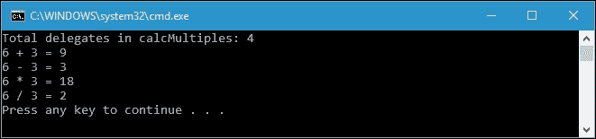

通过调用单个委托，我们已成功调用了四种方法。我们在前面的代码中调用的委托在以下代码片段中：

```cs
calcMultiples(6, 3); 

```

实际上，`calcMultiples`委托在内部存储了四个委托变量，对应于我们组合的每个方法。由于`Delegate.Combine()`方法，我们可以使用以下语法组合委托：

```cs
CalculatorDelegate calcMultiples = 
  (CalculatorDelegate)Delegate.Combine( 
    new CalculatorDelegate[] { 
      Add, 
      Subtract, 
      Multiply, 
      Division }); 

```

我们还可以通过从委托变量调用`GetInvocationList()`来创建委托数组。通过检索委托数组，我们可以像对待普通数组一样迭代数组。我们可以检索`Length`属性来计算调用列表中有多少个委托。

在多播委托中，我们能够组合以及从调用列表中删除委托。让我们看一下以下的`RemoveDelegate()`方法：

```cs
public partial class Program 
{ 
  private static void RemoveDelegate() 
  { 
    CalculatorDelegate addDel = Add; 
    CalculatorDelegate subDel = Subtract; 
    CalculatorDelegate mulDel = Multiply; 
    CalculatorDelegate divDel = Division; 
    CalculatorDelegate calcDelegates1 = 
      (CalculatorDelegate)Delegate.Combine( 
      addDel, 
      subDel); 
    CalculatorDelegate calcDelegates2 = 
      (CalculatorDelegate)Delegate.Combine( 
      calcDelegates1, 
      mulDel); 
    CalculatorDelegate calcDelegates3 = 
      (CalculatorDelegate)Delegate.Combine( 
      calcDelegates2, 
      divDel); 
    Console.WriteLine( 
      "Total delegates in calcDelegates3: {0}", 
      calcDelegates3.GetInvocationList().Length); 
    calcDelegates3(6, 3); 
    CalculatorDelegate calcDelegates4 = 
      (CalculatorDelegate)Delegate.Remove( 
      calcDelegates3, 
      mulDel); 
    Console.WriteLine( 
      "Total delegates in calcDelegates4: {0}", 
      calcDelegates4.GetInvocationList().Length); 
    calcDelegates4(6, 3); 
  } 
} 

```

如果我们运行前面的方法，将在控制台中显示以下输出：

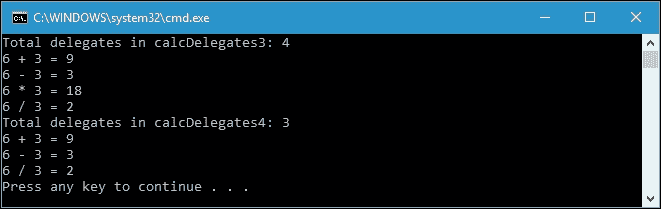

与`CombineDelegate()`方法类似，我们在`RemoveDelegate()`方法中将四种方法组合成一个单一变量类型的委托。`calcDelegates3`委托是保存这四种方法的委托。实际上，当我们调用`calcDelegates3`时，它按正确的顺序调用这四种方法。接下来，在`RemoveDelegate()`方法中，我们调用`Delegate.Remove()`方法来从调用列表中删除选定的委托。根据前面的代码，语法如下：

```cs
CalculatorDelegate calcDelegates4 = 
  (CalculatorDelegate)Delegate.Remove( 
  calcDelegates3, 
  mulDel); 

```

前面的代码片段用于从调用列表中移除`mulDel`委托变量。正如我们在前面的图中看到的，`RemoveDelegate()`调用的输出显示，一旦`Multiply()`方法从调用列表中移除，它就不再被调用。

与委托相关联的调用列表可以包含重复的条目。这意味着我们可以多次将相同的方法添加到调用列表中。现在让我们尝试通过将`DuplicateEntries()`方法添加到项目中来将重复的条目插入调用列表中，如下所示：

```cs
public partial class Program 
{ 
  private static void DuplicateEntries() 
  { 
    CalculatorDelegate addDel = Add; 
    CalculatorDelegate subDel = Subtract; 
    CalculatorDelegate mulDel = Multiply; 
    CalculatorDelegate duplicateDelegates1 = 
      (CalculatorDelegate)Delegate.Combine( 
      addDel, 
      subDel); 
    CalculatorDelegate duplicateDelegates2 = 
      (CalculatorDelegate)Delegate.Combine( 
      duplicateDelegates1, 
      mulDel); 
    CalculatorDelegate duplicateDelegates3 = 
      (CalculatorDelegate)Delegate.Combine( 
      duplicateDelegates2, 
      subDel); 
    CalculatorDelegate duplicateDelegates4 = 
      (CalculatorDelegate)Delegate.Combine( 
      duplicateDelegates3, 
      addDel); 
    Console.WriteLine( 
      "Total delegates in duplicateDelegates4: {0}", 
      duplicateDelegates4.GetInvocationList().Length); 
      duplicateDelegates4(6, 3); 
  } 
} 

```

现在让我们运行`DuplicateEntries()`方法，控制台将显示以下输出：

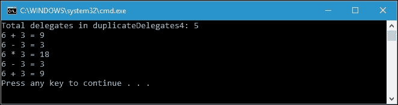

通过检查前面的代码，我们可以看到`duplicateDelegates2`变量包含三个调用方法，分别是`addDel`，`subDel`和`mulDel`。请查看以下代码片段以获取更多详细信息：

```cs
CalculatorDelegate duplicateDelegates1 = 
  (CalculatorDelegate)Delegate.Combine( 
  addDel, 
  subDel); 
CalculatorDelegate duplicateDelegates2 = 
  (CalculatorDelegate)Delegate.Combine( 
  duplicateDelegates1, 
  mulDel); 

```

再次，我们像在下面的代码片段中那样，将`subDel`和`addDel`添加到调用列表中：

```cs
CalculatorDelegate duplicateDelegates3 = 
  (CalculatorDelegate)Delegate.Combine( 
  duplicateDelegates2, 
  subDel); 
CalculatorDelegate duplicateDelegates4 = 
  (CalculatorDelegate)Delegate.Combine( 
  duplicateDelegates3, 
  addDel); 

```

现在，`duplicateDelegates4`的调用列表包含两个重复的方法。然而，当我们调用`DuplicateEntries()`方法时，`addDel`和`subDel`被调用两次，调用顺序就像我们将委托添加到调用列表中的顺序一样。

### 注意

`Delegate.Combine()`和`Delegate.Remove()`静态方法将返回`Delegate`数据类型，而不是`Delegate`本身的实例。因此，在使用它们时需要将这两种方法的返回强制转换为预期的实例委托。

### 使用+=和-=运算符

使用`+=`和`-=`运算符创建多播委托非常容易，因为这样做就像处理 C#中的任何数据类型一样。我们还可以使用`+`和`-`运算符向调用列表中添加和移除委托。以下是我们可以在`AddSubtractDelegates.csproj`中找到的示例代码，以便使用运算符合并委托并从调用列表中移除选择的委托：

```cs
public partial class Program 
{ 
  private static void AddSubtractDelegate() 
  { 
    CalculatorDelegate addDel = Add; 
    CalculatorDelegate subDel = Subtract; 
    CalculatorDelegate mulDel = Multiply; 
    CalculatorDelegate divDel = Division; 
    CalculatorDelegate multiDel = addDel + subDel; 
    multiDel += mulDel; 
    multiDel += divDel; 
    Console.WriteLine( 
      "Invoking multiDel delegate (four methods):"); 
    multiDel(8, 2); 
    multiDel = multiDel - subDel; 
    multiDel -= mulDel; 
    Console.WriteLine( 
      "Invoking multiDel delegate (after subtraction):"); 
    multiDel(8, 2); 
  } 
} 

```

我们还有在前面的项目`CombineDelegates.csproj`中使用的四个方法：`Add()`，`Subtract()`，`Multiply()`和`Division()`。如果我们运行`AddSubtractDelegate()`方法，将得到以下输出：

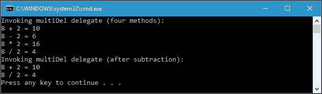

在`AddSubtractDelegate()`方法的起始行中，我们为我们拥有的四个方法创建了四个类型为`CalculatorDelegate`的变量，就像我们在之前的项目中所做的一样。然后，我们创建了一个名为`multiDel`的变量，以生成多播委托。在这里，我们可以看到我们只使用运算符将委托添加到多播委托变量中，其中我们使用了`+`和`+=`运算符。让我们看一下以下代码片段：

```cs
CalculatorDelegate multiDel = addDel + subDel; 
multiDel += mulDel; 
multiDel += divDel; 
Console.WriteLine( 
  "Invoking multiDel delegate (four methods):"); 
multiDel(8, 2); 

```

从前面的代码片段中，将所有四个委托合并到`multiDel`委托中后，我们调用`multiDel`委托，根据输出控制台显示的内容，程序会按适当的顺序调用这四个方法。这四个方法分别是`Add()`，`Subtract()`，`Multiply()`和`Division()`。

要从调用列表中移除委托，我们在前面的代码中使用`-`和`-=`运算符。让我们看一下以下代码片段，以查看我们需要做什么才能移除委托：

```cs
multiDel = multiDel - subDel; 
multiDel -= mulDel; 
Console.WriteLine( 
  "Invoking multiDel delegate (after subtraction):"); 
multiDel(8, 2); 

```

由于我们已经从调用列表中移除了`subDel`和`mulDel`委托，所以当我们调用`mulDel`委托时，程序只调用两个方法，即`Add()`和`Division()`方法。这证明我们已成功使用`-`和`-=`运算符从调用列表中移除了委托。

### 提示

使用`+=`和`-=`运算符来分配多播委托不符合函数式编程的方法，因为这会破坏不可变性概念。然而，我们仍然可以使用`+`和`-`运算符以函数式方法连续地向调用列表中添加委托和从调用列表中移除委托。

# 内置委托

在 C#中，我们不仅能够声明一个委托，还能够使用 C#标准库中的内置委托。这个内置委托也适用于泛型数据类型，因此在讨论内置委托之前，让我们先讨论泛型委托。

## 泛型委托

委托类型可以使用泛型类型作为其参数。使用泛型类型，我们可以推迟一个或多个参数或返回值的类型规定，直到委托被初始化为变量。换句话说，当我们定义委托类型时，我们不指定委托参数和返回值的数据类型。为了更详细地讨论这一点，让我们看一下下面的代码，我们可以在`GenericDelegates.csproj`中找到：

```cs
public partial class Program 
{ 
  private delegate T FormulaDelegate<T>(T a, T b); 
} 

```

我们有一个名为`FormulaDelegate`的委托，使用了泛型数据类型。正如我们所看到的，有一个`T`符号，代表了在声明变量类型为`FormulaDelegate`时我们将定义的数据类型。我们继续添加以下两个完全不同签名的方法：

```cs
public partial class Program 
{ 
  private static int AddInt(int x, int y) 
  { 
    return x + y; 
  } 
  private static double AddDouble(double x, double y) 
  { 
    return x + y; 
  } 
} 

```

现在让我们看一下以下代码，以解释我们如何声明变量类型的委托并从委托中调用方法：

```cs
public partial class Program 
{ 
  private static void GenericDelegateInvoke() 
  { 
    FormulaDelegate<int> intAddition = AddInt; 
    FormulaDelegate<double> doubleAddition = AddDouble; 
    Console.WriteLine("Invoking intAddition(2, 3)"); 
    Console.WriteLine( 
      "Result = {0}", 
      intAddition(2, 3)); 
    Console.WriteLine("Invoking doubleAddition(2.2, 3.5)"); 
    Console.WriteLine( 
      "Result = {0}", 
      doubleAddition(2.2, 3.5)); 
  } 
} 

```

当我们运行`GenericDelegateInvoke()`方法时，控制台将显示以下结果：

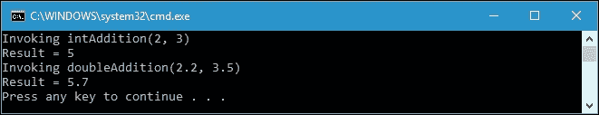

从前面的代码中，我们可以声明两个具有不同签名的方法，只使用一个委托类型。`intAddition`委托引用了`AddInt()`方法，该方法在其参数和返回值中应用了`int`数据类型，而`doubleAddition`委托引用了`AddDouble()`方法，该方法在其参数和返回值中应用了`double`数据类型。然而，为了使委托知道它所引用的方法的数据类型，我们必须在初始化委托时在尖括号(`<>`)中定义数据类型。以下代码片段是使用泛型数据类型进行委托初始化的委托初始化：

```cs
FormulaDelegate<int> intAddition = AddInt; 
FormulaDelegate<double> doubleAddition = AddDouble; 

```

因为我们已经定义了数据类型，所以委托可以匹配它所引用的方法的数据类型。这就是为什么从输出控制台中，我们可以调用具有不同签名的两个方法。

我们已成功使用了一个泛型类型的委托，应用了一个泛型模板。下面的代码，我们可以在`MultiTemplateDelegates.csproj`中找到，向我们展示了委托还可以在一个委托声明中应用多个泛型模板：

```cs
public partial class Program 
{ 
  private delegate void AdditionDelegate<T1, T2>( 
    T1 value1, T2 value2); 
} 

```

前面的代码将创建一个名为`AdditionDelegate`的新委托，它有两个具有两种不同数据类型的参数。`T1`和`T2`代表将在变量类型的委托声明中定义的数据类型。现在，让我们创建两个具有不同签名的方法，如下所示：

```cs
public partial class Program 
{ 
  private static void AddIntDouble(int x, double y) 
  { 
    Console.WriteLine( 
      "int {0} + double {1} = {2}", 
      x, 
      y, 
      x + y); 
  } 
  private static void AddFloatDouble(float x, double y) 
  { 
    Console.WriteLine( 
      "float {0} + double {1} = {2}", 
      x, 
      y, 
      x + y); 
  } 
} 

```

要将`AdditionDelegate`委托引用到`AddIntDouble()`和`AddFloatDouble()`方法并调用委托，我们可以创建`VoidDelegateInvoke()`方法，如下所示：

```cs
public partial class Program 
{ 
  private static void VoidDelegateInvoke() 
  { 
    AdditionDelegate<int, double> intDoubleAdd = 
      AddIntDouble; 
    AdditionDelegate<float, double> floatDoubleAdd = 
      AddFloatDouble; 
    Console.WriteLine("Invoking intDoubleAdd delegate"); 
    intDoubleAdd(1, 2.5); 
    Console.WriteLine("Invoking floatDoubleAdd delegate"); 
    floatDoubleAdd((float)1.2, 4.3); 
  } 
} 

```

如果我们运行`VoidDelegateInvoke()`方法，我们将在控制台上看到以下输出：

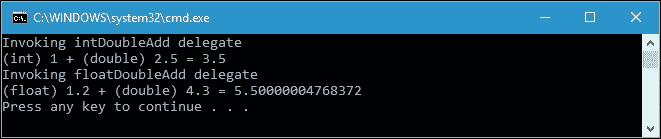

从前面的控制台输出可以看到，尽管它们具有不同的方法签名，但我们已成功调用了`intDoubleAdd`和`floatDoubleAdd`委托。这是可能的，因为我们在`AdditionDelegate`委托中应用了`T1`和`T2`模板。

让我们再次尝试创建多模板委托，但这次我们使用具有返回值的方法。委托的声明将如下所示：

```cs
public partial class Program 
{ 
  private delegate TResult AddAndConvert<T1, T2, TResult>( 
    T1 digit1, T2 digit2); 
} 

```

然后，我们向我们的项目添加了两个方法`AddIntDoubleConvert()`和`AddFloatDoubleConvert()`：

```cs
public partial class Program 
{ 
  private static float AddIntDoubleConvert(int x, double y) 
  { 
    float result = (float)(x + y); 
    Console.WriteLine( 
      "(int) {0} + (double) {1} = (float) {2}", 
      x, 
      y, 
      result); 
    return result; 
  } 
  private static int AddFloatDoubleConvert(float x, double y) 
  { 
    int result = (int)(x + y); 
    Console.WriteLine( 
      "(float) {0} + (double) {1} = (int) {2}", 
      x, 
      y, 
      result); 
    return result; 
  } 
} 

```

为了使用`AddAndConvert`委托，我们可以创建`ReturnValueDelegateInvoke()`方法，如下所示：

```cs
public partial class Program 
{ 
  private static void ReturnValueDelegateInvoke() 
  { 
    AddAndConvert<int, double, float>
        intDoubleAddConvertToFloat = AddIntDoubleConvert; 
    AddAndConvert<float, double, int>
        floatDoubleAddConvertToInt = AddFloatDoubleConvert; 
    Console.WriteLine("Invoking intDoubleAddConvertToFloat delegate"); 
    float f = intDoubleAddConvertToFloat(5, 3.9); 
    Console.WriteLine("Invoking floatDoubleAddConvertToInt delegate"); 
    int i = floatDoubleAddConvertToInt((float)4.3, 2.1); 
  } 
} 

```

当我们调用`ReturnValueDelegateInvoke()`方法时，我们得到以下输出：

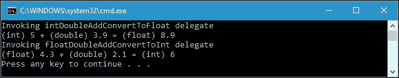

再次，我们成功地使用多模板泛型类型调用了两种不同签名的方法。

## Action 和 Func 委托

让我们回到前面在本章中讨论的以下委托声明：

```cs
public partial class Program 
{ 
  private delegate void AdditionDelegate<T1, T2>( 
    T1 value1, T2 value2); 
} 

```

C#有一个内置委托，最多可以接受 16 个参数并返回 void。它被称为`Action`委托。换句话说，`Action`委托将指向一个不返回任何内容并且接受零个、一个或多个输入参数的方法。由于存在`Action`委托，我们不再需要声明一个委托，可以立即将任何方法分配给该委托。我们可以修改前面的`MultiTemplateDelegates.csproj`项目，并删除`AdditionDelegate`委托，因为我们现在将使用`Action`委托。然后，`MultiTemplateDelegates.csproj`中的`ActionDelegateInvoke()`方法将被修改为`ActionDelegateInvoke()`，并具有以下实现：

```cs
public partial class Program 
{ 
  private static void ActionDelegateInvoke() 
  { 
    Action<int, double> intDoubleAddAction = 
      AddIntDouble; 
    Action<float, double> floatDoubleAddAction = 
      AddFloatDouble; 
    Console.WriteLine( 
      "Invoking intDoubleAddAction delegate"); 
    intDoubleAddAction(1, 2.5); 
    Console.WriteLine( 
      "Invoking floatDoubleAddAction delegate"); 
    floatDoubleAddAction((float)1.2, 4.3); 
  } 
} 

```

我们可以在`ActionFuncDelegates.csproj`项目中找到前面的代码。正如我们所看到的，现在我们应用`Action`委托来替换`MultiTemplateDelegates.csproj`项目中的`AdditionDelegate`委托，如下所示：

```cs
Action<int, double> intDoubleAddAction = 
  AddIntDouble; 
Action<float, double> floatDoubleAddAction = 
  AddFloatDouble; 

```

C#还有另一个内置委托，它通过最多 16 个参数返回一个返回值。它们是`Func`委托。让我们回到`MultiTemplateDelegates.csproj`项目，并找到以下委托：

```cs
public partial class Program 
{ 
  private delegate TResult AddAndConvert<T1, T2, TResult>( 
    T1 digit1, T2 digit2); 
} 

```

我们可以删除之前的委托，因为它与`Func`委托的声明匹配。因此，我们可以修改`MultiTemplateDelegates.csproj`项目中的`ReturnValueDelegateInvoke()`方法，使其成为以下实现的`FuncDelegateInvoke()`方法：

```cs
public partial class Program 
{ 
  private static void FuncDelegateInvoke() 
  { 
    Func<int, double, float> 
       intDoubleAddConvertToFloatFunc = 
          AddIntDoubleConvert; 
    Func<float, double, int> 
       floatDoubleAddConvertToIntFunc = 
          AddFloatDoubleConvert; 
    Console.WriteLine( 
      "Invoking intDoubleAddConvertToFloatFunc delegate"); 
    float f = intDoubleAddConvertToFloatFunc(5, 3.9); 
    Console.WriteLine( 
      "Invoking floatDoubleAddConvertToIntFunc delegate"); 
    int i = floatDoubleAddConvertToIntFunc((float)4.3, 2.1); 
  } 
} 

```

现在，我们不再需要`AddAndConvert`委托，因为我们已经应用了`Func`委托，如下所示：

```cs
Func<int, double, float> 
  intDoubleAddConvertToFloatFunc = AddIntDoubleConvert; 
Func<float, double, int> 
  floatDoubleAddConvertToIntFunc = AddFloatDoubleConvert; 

```

使用内置的`Action`和`Func`委托，代码变得更短，委托的定义也变得更容易和更快。

# 区分委托中的变化

泛型委托具有被分配给具有不匹配签名的方法的能力。我们可以称之为委托的变化。委托中有两种变化，它们是协变和逆变。协变允许方法具有比在委托中定义的返回类型更派生（子类型）的返回类型。另一方面，逆变允许方法具有比在委托中定义的参数类型更不派生（超类型）的参数类型。

## 协变

以下是委托中协变的示例，我们可以在`Covariance.csproj`项目中找到。首先，我们初始化以下委托：

```cs
public partial class Program 
{ 
  private delegate TextWriter CovarianceDelegate(); 
} 

```

现在我们有一个返回`TextWriter`数据类型的委托。然后，我们还创建了返回`StreamWriter`对象的`StreamWriterMethod()`方法，其实现如下：

```cs
public partial class Program
{
  private static StreamWriter StreamWriterMethod()
  {
    DirectoryInfo[] arrDirs =
       new DirectoryInfo(@"C:\Windows")
    .GetDirectories(
       "s*", 
        SearchOption.TopDirectoryOnly);

    StreamWriter sw = new StreamWriter(
    Console.OpenStandardOutput());

    foreach (DirectoryInfo dir in arrDirs)
    {
      sw.WriteLine(dir.Name);
    }

    return sw;
   }
}

```

我们还创建了`StringWriterMethod()`方法，返回`StringWriter`对象，并具有以下实现：

```cs
public partial class Program 
{ 
  private static StringWriter StringWriterMethod() 
  { 
    StringWriter strWriter = new StringWriter(); 
    string[] arrString = new string[]{ 
      "Covariance", 
      "example", 
      "using", 
      "StringWriter", 
      "object" 
    }; 
    foreach (string str in arrString) 
    { 
      strWriter.Write(str); 
      strWriter.Write(' '); 
    } 
    return strWriter; 
  } 
} 

```

现在，我们有两个返回不同对象的方法，`StreamWriter`和`StringWriter`。这些方法的返回值数据类型也不同，`CovarianceDelegate`委托返回`TextWriter`对象。然而，由于`StreamWriter`和`StringWriter`都是从`TextWriter`对象派生出来的，我们可以应用协变将这两种方法分配给`CovarianceDelegate`委托。

以下是`CovarianceStreamWriterInvoke()`方法的实现，它将`StreamWriterMethod()`方法分配给`CovarianceDelegate`委托：

```cs
public partial class Program 
{ 
  private static void CovarianceStreamWriterInvoke() 
  { 
    CovarianceDelegate covDelegate; 
    Console.WriteLine( 
      "Invoking CovarianceStreamWriterInvoke method:"); 
      covDelegate = StreamWriterMethod; 
    StreamWriter sw = (StreamWriter)covDelegate(); 
    sw.AutoFlush = true; 
    Console.SetOut(sw); 
  } 
} 

```

在`StreamWriterMethod()`方法中，我们创建`StreamWriter`，使用以下代码将内容写入控制台：

```cs
StreamWriter sw = new StreamWriter( 
  Console.OpenStandardOutput()); 

```

然后，在`CovarianceStreamWriterInvoke()`方法中，我们调用此代码以将内容写入控制台：

```cs
sw.AutoFlush = true; 
Console.SetOut(sw); 

```

如果我们运行`CovarianceStreamWriterInvoke()`方法，将在控制台中显示以下输出：

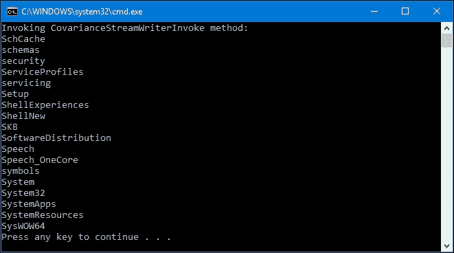

从前面的输出控制台中，我们提供了 Visual Studio 2015 安装路径中的目录列表。实际上，如果您安装了不同版本的 Visual Studio，则可能会有不同的列表。

现在，我们将利用`StringWriterMethod()`方法创建一个`CovarianceDelegate`委托。我们创建了`CovarianceStringWriterInvoke()`方法，其实现如下：

```cs
public partial class Program 
{ 
  private static void CovarianceStringWriterInvoke() 
  { 
    CovarianceDelegate covDelegate; 
    Console.WriteLine( 
      "Invoking CovarianceStringWriterInvoke method:"); 
    covDelegate = StringWriterMethod; 
    StringWriter strW = (StringWriter)covDelegate(); 
    Console.WriteLine(strW.ToString()); 
  } 
} 

```

我们在`StringWriterMethod()`方法中使用以下代码生成了`StringWriter`：

```cs
StringWriter strWriter = new StringWriter(); 
string[] arrString = new string[]{ 
  // Array of string 
}; 
foreach (string str in arrString) 
{ 
  strWriter.Write(str); 
  strWriter.Write(' '); 
} 

```

然后，我们调用以下代码将字符串写入控制台：

```cs
Console.WriteLine(strW.ToString()); 

```

如果我们运行`CovarianceStringWriterInvoke()`方法，那么在`StringWriterMethod()`方法中定义的字符串数组`arrString`中定义的字符串将被显示，如下所示：

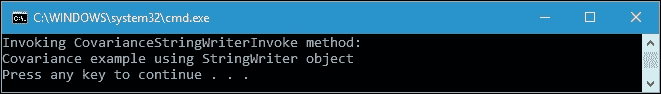

现在，从我们对协变性的讨论中，我们已经证明了委托中的协变性。返回`TextWriter`的`CovarianceDelegate`委托可以分配给返回`StreamWriter`和`StringWriter`的方法。以下代码片段摘自前面的几个代码，以总结委托中的协变性：

```cs
private delegate TextWriter CovarianceDelegate(); 
CovarianceDelegate covDelegate; 
covDelegate = StreamWriterMethod; 
covDelegate = StringWriterMethod; 

```

## 逆变性

现在，让我们继续讨论委托中的协变性，讨论逆变性。以下是`Contravariance.csproj`项目中可以找到的`ContravarianceDelegate`委托声明：

```cs
public partial class Program 
{ 
  private delegate void ContravarianceDelegate(StreamWriter sw); 
} 

```

上述委托将被分配给以下具有`TextWriter`数据类型参数的方法，如下所示：

```cs
public partial class Program 
{ 
  private static void TextWriterMethod(TextWriter tw) 
  { 
    string[] arrString = new string[]{ 
      "Contravariance", 
      "example", 
      "using", 
      "TextWriter", 
      "object" 
    }; 
    tw = new StreamWriter(Console.OpenStandardOutput()); 
    foreach (string str in arrString) 
    { 
      tw.Write(str); 
      tw.Write(' '); 
    } 
    tw.WriteLine(); 
    Console.SetOut(tw); 
    tw.Flush(); 
  } 
} 

```

分配将如下所示：

```cs
public partial class Program 
{ 
  private static void ContravarianceTextWriterInvoke() 
  { 
    ContravarianceDelegate contravDelegate = TextWriterMethod; 
    TextWriter tw = null; 
    Console.WriteLine( 
      "Invoking ContravarianceTextWriterInvoke method:"); 
    contravDelegate((StreamWriter)tw); 
  } 
} 

```

如果我们运行`ContravarianceTextWriterInvoke()`方法，控制台将显示以下输出：

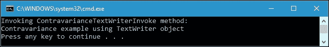

从前面的输出中，我们已成功将一个接受`TextWriter`参数的方法分配给了一个接受`StreamWriter`参数的委托。这是因为`StreamWriter`是从`TextWriter`派生出来的。让我们看一下以下代码片段：

```cs
private delegate void ContravarianceDelegate(StreamWriter sw); 
private static void TextWriterMethod(TextWriter tw) 
{ 
  // Implementation 
} 
ContravarianceDelegate contravDelegate = TextWriterMethod; 
TextWriter tw = null; 
contravDelegate((StreamWriter)tw); 

```

上述代码片段摘自我们讨论逆变性的代码。在这里，我们可以看到`contravDelegate`，一个类型为`ContravarianceDelegate`的变量，可以分配给`TextWriterMethod()`方法，即使它们具有不同的签名。这是因为`StreamWriter`是从`TextWriter`对象派生出来的。由于`TextWriterMethod()`方法可以使用`TextWriter`数据类型，因此它肯定也能够使用`StreamWriter`数据类型。

# 总结

委托在封装方法时非常有用。它就像 C#中的任何数据类型，其中变量可以初始化为具有委托数据类型。由于它类似于数据类型，可以对委托应用增量和减量操作，从而可以从多个委托创建多播委托。然而，需要记住的一件事是，由于`Delegate.Combine()`和`Delegate.Remove()`方法返回`Delegate`数据类型，所以在使用它们时，我们必须将这两种方法的返回值转换为预期的实例委托。然而，与`+=`和`-=`运算符相比，由于它们是在编译器的语言级别实现的，并且委托类型是已知的，因此在增量和减量委托操作的结果上不需要进行转换。

C#还具有内置的委托`Action`和`Func`，这使得代码更简洁，委托的定义变得更容易和更快。因此，代码变得更简单，更容易分析。此外，委托的使用中有两种变化；协变性和逆变性，这将允许我们将方法分配给委托。协变性允许方法具有比委托中定义的返回类型更派生的返回类型，而逆变性允许方法具有比委托中定义的参数类型更不派生的参数类型。

我们现在对代理有了更好的理解。让我们继续下一章，我们将利用代理的力量来使用 lambda 表达式来表达匿名方法。
