# 第三章。使用 Lambda 表达式表达匿名方法

在上一章中，我们已经讨论了委托，因为它是理解匿名方法和 lambda 表达式的先决条件，而这也是本章的主题。通过使用匿名方法，我们可以创建一个不需要单独方法的委托实例。通过使用 lambda 表达式，我们可以为匿名方法创建一种简写语法。在本章中，我们将深入研究匿名方法以及 Lambda 表达式。本章的主题如下：

+   应用委托来创建和使用匿名方法

+   将匿名方法转换为 lambda 表达式

+   了解表达式树及其与 lambda 的关系

+   使用 lambda 表达式订阅事件

+   在使用函数式编程中阐述 lambda 表达式的好处

# 了解匿名方法

在上一章中，我们已经讨论了如何使用命名方法声明委托。当使用命名方法时，我们必须首先创建一个方法，给它一个名称，然后将其与委托关联起来。为了提醒我们，与命名方法关联的简单委托声明如下所示：

```cs
delegate void DelDelegate(int x); 
void DoSomething(int i) { /* Implementation */ } 
DelDelegate d = DoSomething; 

```

从上述代码中，我们简单地创建了一个名为`DelDelegate`的委托数据类型，并且创建了一个名为`DoSomething`的方法。当我们有了一个命名方法后，我们可以将委托与该方法关联起来。幸运的是，C# 2.0 中宣布了匿名方法，以简化委托的使用。它们为我们提供了一种快捷方式来创建一个简单且短小的方法，该方法将被使用一次。声明匿名方法的语法如下：

```cs
delegate([parameters]) { implementation } 

```

匿名方法语法的每个元素的解释如下：

+   **委托**：我们需要的关键字，以便初始化委托。

+   **参数**：我们分配给该委托的方法所需的参数列表。

+   **实现**：方法将执行的代码。如果方法需要返回一个值，可以应用返回语句。

从上述语法中，我们可以看到匿名方法是一种没有名称的方法。我们只需要定义方法的参数和实现。

## 创建匿名方法

为了进一步讨论，让我们创建一个简单的匿名方法，可以在`SimpleAnonymousMethods.csproj`项目中找到，如下所示：

```cs
public partial class Program 
{ 
  static Func<string, string> displayMessageDelegate = 
    delegate (string str) 
  { 
    return String.Format("Message: {0}", str); 
  }; 
} 

```

我们现在有一个匿名方法，我们将其分配给`displayMessageDelegate`委托。我们使用`Func`内置委托创建`displayMessageDelegate`委托，该委托只接受一个字符串参数，并且也返回一个字符串值。如果我们需要运行匿名方法，可以按照以下方式调用委托：

```cs
public partial class Program 
{ 
  static void Main(string[] args) 
  { 
    Console.WriteLine( 
      displayMessageDelegate( 
          "A simple anonymous method sample.")); 
  } 
} 

```

运行上述代码后，我们将在控制台上获得以下输出：

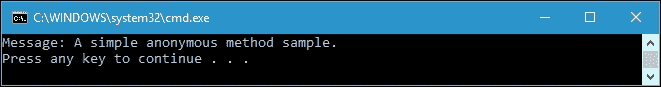

正如我们在输出控制台窗口中所看到的，我们成功地通过调用委托名称调用了匿名方法。现在，让我们回到上一章，从中使用一些代码并将其重构为匿名方法。我们将重构`SimpleDelegates.csproj`的代码，这是我们在上一章中讨论过的。以下是匿名方法的声明，可以在`SimpleDelegatesRefactor.csproj`项目中找到：

```cs
public partial class Program 
{ 
  private static Func<int, int, int> AreaRectangleDelegate = 
    delegate (int a, int b) 
  { 
    return a * b; 
  }; 

  private static Func<int, int, int> AreaSquareDelegate = 
    delegate (int x, int y) 
  { 
    return x * y; 
  }; 
} 

```

在我们之前的代码中有两个匿名方法。我们还使用了`Func`委托，这是我们在上一章中讨论过的内置委托。要调用这些方法，我们可以按照以下方式调用委托名称：

```cs
public partial class Program 
{ 
  static void Main(string[] args) 
  { 
    int i = AreaRectangleDelegate(1, 2); 
    int j = AreaSquareDelegate(2, 3); 
    Console.WriteLine("i = " + i); 
    Console.WriteLine("j = " + j); 
  } 
} 

```

如果我们运行该项目，将会得到以下输出：

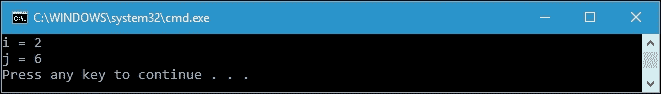

与`SimpleDelegates.csproj`项目中的代码相比，我们在上述`SimpleDelegatesRefactor.csproj`项目中的代码变得更简单更短，因为我们不需要声明委托。委托与匿名方法的创建同时进行，例如以下代码片段：

```cs
private static Func<int, int, int> AreaRectangleDelegate = 
  delegate (int a, int b) 
{ 
  return a * b; 
}; 

```

以下是我们在上一章中使用的代码，名为`SimpleDelegates.csproj`：

```cs
public partial class Program 
{ 
  private delegate int AreaCalculatorDelegate(int x, int y); 
  static int Square(int x, int y) 
  { 
    return x * y; 
  } 
} 

```

使用匿名委托，我们简化了我们的代码，与上一章中生成的代码相比。

## 将匿名方法用作参数

我们现在已经执行了一个匿名方法。但是，匿名方法也可以作为参数传递给方法。让我们看一下以下代码，可以在`AnonymousMethodAsArgument.csproj`项目中找到：

```cs
public partial class Program 
{ 
  private static bool IsMultipleOfSeven(int i) 
  { 
    return i % 7 == 0; 
  } 
} 

```

首先，在这个项目中有一个名为`FindMultipleOfSeven`的方法。该方法将被传递给以下方法的参数：

```cs
public partial class Program 
{ 
  private static int FindMultipleOfSeven(List<int> numList) 
  { 
    return numList.Find(IsMultipleOfSeven); 
  } 
} 

```

然后，我们从以下方法调用`FindMultipleOfSeven()`方法：

```cs
public partial class Program 
{ 
  private static void PrintResult() 
  { 
    Console.WriteLine( 
      "The Multiple of 7 from the number list is {0}", 
      FindMultipleOfSeven(numbers)); 
  } 
} 

```

我们还可以定义以下`List`变量，以便传递给`FindMultipleOfSeven()`方法的参数：

```cs
public partial class Program 
{ 
  static List<int> numbers = new List<int>() 
  { 
    54, 24, 91, 70, 72, 44, 61, 93, 
    73, 3, 56, 5, 38, 60, 29, 32, 
    86, 44, 34, 25, 22, 44, 66, 7, 
    9, 59, 70, 47, 55, 95, 6, 42 
  }; 
} 

```

如果我们调用`PrintResult()`方法，我们将得到以下输出：

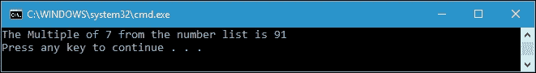

上述程序的目标是从数字列表中找到一个乘以七的数字。由于`91`是满足此条件的第一个数字，因此`FindMultipleOfSeven()`方法返回该数字。

在`FindMultipleOfSeven()`方法内部，我们可以找到将`IsMultipleOfSeven()`方法作为参数传递给`Find()`方法，如下面的代码片段所示：

```cs
return numList.Find(IsMultipleOfSeven); 

```

如果我们愿意，我们可以用匿名方法替换这个方法，如下所示：

```cs
public partial class Program 
{ 
  private static int FindMultipleOfSevenLambda( 
    List<int> numList) 
  { 
    return numList.Find( 
      delegate(int i) 
      { 
        return i % 7 == 0; 
      } 
    ); 
  } 
} 

```

现在我们有了`FindMultipleOfSevenLambda()`方法，它调用`Find()`方法并将匿名方法传递给方法参数。由于我们传递了匿名方法，我们不再需要`FindMultipleOfSeven()`方法。我们可以使用`PrintResultLambda()`方法调用`FindMultipleOfSevenLambda()`方法，如下所示：

```cs
public partial class Program 
{ 
  private static void PrintResultLambda() 
  { 
    Console.WriteLine( 
      "({0}) The Multiple of 7 from the number list is {1}", 
      "Lambda", 
      FindMultipleOfSevenLambda(numbers)); 
  } 
} 

```

在执行了`PrintResultLambda()`方法后，我们将得到以下输出：

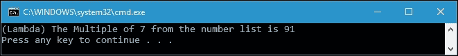

从输出窗口中可以看到，我们仍然得到`91`作为`7`的乘积的结果。但是，我们已成功将匿名方法作为方法参数传递。

## 编写匿名方法-一些指导方针

在编写匿名方法时，以下是一些我们应该牢记的事情：

+   匿名方法在其声明中没有返回类型。考虑以下代码片段：

```cs
        delegate (int a, int b) 
        { 
          return a * b; 
        }; 

```

### 注意

在前面的委托声明中，我们找不到返回类型，尽管在方法实现中找到了`return`关键字。这是因为编译器根据委托签名推断返回类型。

+   我们必须将委托签名的声明与方法的参数匹配。这将类似于将命名方法分配给委托。让我们看一下以下代码片段：

```cs
        private static Func<int, int, int> AreaRectangleDelegate = 
          delegate (int a, int b) 
        { 
          return a * b; 
        }; 

```

### 注意

在上面的代码片段中，我们声明了一个接受两个 int 参数并返回 int 值的委托。参考委托签名；我们在声明匿名方法时使用相同的签名。

+   我们不允许声明变量的名称与已声明的匿名方法的变量冲突。看一下以下代码片段：

```cs
        public partial class Program 
        { 
          private static void Conflict() 
          { 
            for (int i = 0; i < numbers.Count; i++) 
            { 
              Action<int> actDelegate = delegate(int i) 
              { 
                Console.WriteLine("{0}", i); 
              }; 
              actDelegate(i); 
            } 
          } 
        } 

```

### 注意

我们永远无法编译上述代码，因为我们在`Conflict()`方法和`actDelegate`委托中都声明了变量`i`。

## 匿名方法的优势

以下是使用匿名方法的一些优点：

+   由于我们不给方法附加名称，如果我们只想调用该方法一次，它们是一个很好的解决方案。

+   我们可以在原地编写代码，而不是在代码的其他部分编写逻辑。

+   我们不需要声明匿名方法的返回类型，因为它将根据分配给匿名方法的委托的签名推断出来。

+   我们可以从匿名方法中访问外部方法的局部变量。外部变量被捕获在匿名方法内部。

+   对于只调用一次的逻辑片段，我们不需要创建一个命名方法。

# Lambda 表达式

现在我们知道，匿名方法可以帮助我们创建简单而简短的方法。然而，在 C# 3.0 中，lambda 表达式被宣布为补充匿名方法的方式，提供了一种简写的方法来创建匿名方法。事实上，当编写新代码时，lambda 表达式成为首选方式。

现在，让我们来看一下最简单的 lambda 表达式语法，如下所示：

```cs
([parameters]) => expression; 

```

在 lambda 表达式语法中，我们只找到两个元素，即`parameters`和`expression`。像任何方法一样，lambda 表达式具有由参数表示的参数。lambda 表达式的实现由表达式表示。如果只需要一个参数，我们还可以省略参数的括号。

让我们创建一个简单的 lambda 表达式，我们可以在`SimpleLambdaExpression.csproj`项目中找到，如下所示：

```cs
public partial class Program 
{ 
  static Func<string, string> displayMessageDelegate = 
    str => String.Format(Message: {0}", str); 
} 

```

在前面的代码中，我们声明了`displayMessageDelegate`委托，并使用 lambda 表达式将其分配给`Func`委托。与`SimpleDelegates.csproj`项目中的方法类似，为了调用委托，我们使用以下代码：

```cs
public partial class Program 
{ 
  static void Main(string[] args) 
  { 
    Console.WriteLine( 
      displayMessageDelegate( 
      "A simple lambda expression sample.")); 
  } 
} 

```

我们像调用方法名一样调用`displayMessageDelegate`委托。输出将被发送到控制台，如下所示：

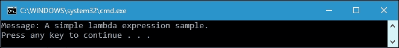

现在，让我们比较`SimpleAnonymousMethods.csproj`中的匿名方法和`SimpleLambdaExpression.csproj`项目中的 lambda 表达式的方法声明：

```cs
static Func<string, string> displayMessageDelegate = 
  delegate (string str) 
{ 
  return String.Format("Message: {0}", str); 
}; 

```

前面的代码片段是一个匿名方法声明，比命名方法声明更短、更简单。

```cs
static Func<string, string> displayMessageDelegate = 
  str => String.Format("Message: {0}", str); 

```

前面的代码片段是一个 lambda 表达式声明，比匿名方法更短、更简单。与匿名方法相比，lambda 表达式更为简洁。

## 将匿名方法转换为 lambda 表达式

现在，让我们讨论将匿名方法转换为 lambda 表达式。我们有以下匿名方法：

```cs
delegate (string str) 
{ 
  return String.Format("Message: {0}", str); 
}; 

```

我们想将其转换为 lambda 表达式，如下所示：

```cs
str => String.Format("Message: {0}", str); 

```

首先，我们去掉了`delegate`关键字，因为我们不再需要它；所以，代码将如下所示：

```cs
(string str) 
{ 
  return String.Format("Message: {0}", str); 
}; 

```

然后，我们用`=>`lambda 运算符取代大括号，使其成为内联 lambda 表达式：

```cs
(string str) => return String.Format("Message: {0}", str); 

```

我们也可以去掉`return`关键字，因为它只是返回一个值的单行代码。代码将如下所示：

```cs
(string str) => String.Format("Message: {0}", str); 

```

由于前面的语法现在是一个表达式而不是一个完整的语句，所以可以从前面的代码中删除分号，代码将如下所示：

```cs
(string str) => String.Format("Message: {0}", str); 

```

前面的表达式是一个有效的 lambda 表达式。然而，为了充分利用 lambda 表达式，我们可以进一步简化代码。代码将如下所示：

```cs
(str) => String.Format("Message: {0}", str); 

```

由于我们已经去掉了`string`数据类型，我们现在也可以去掉括号：

```cs
str => String.Format("Message: {0}", str); 

```

前面的语法是我们最终的 lambda 表达式。正如我们所看到的，现在我们的代码变得更易读了，因为它更简单了。

### 注意

如果参数列表中只包含一个参数，则可以省略 lambda 表达式的括号。

使用 lambda 表达式，我们实际上可以在匿名方法中创建委托和表达式树类型。现在，让我们找出这两种类型之间的区别。

## 使用 lambda 表达式创建委托类型

我们在`SimpleLambdaExpression.csproj`项目中创建代码时讨论了委托类型中的 lambda 表达式。现在，让我们创建另一个项目名称，以便通过以下代码进行讨论：

```cs
public partial class Program 
{ 
  private static Func<int, int, int> AreaRectangleDelegate = 
    (a, b) => a * b; 
  private static Func<int, int, int> AreaSquareDelegate = 
    (x, y) => x * y; 
} 

```

再次，我们重构`SimpleDelegatesRefactor.csproj`项目，并用 lambda 表达式替换匿名方法。正如我们所看到的，lambda 表达式被分配给了一个类型为委托的变量。在这里，我们在委托类型中创建了一个 lambda 表达式。我们可以使用在`SimpleDelegatesRefactor.csproj`项目中使用的`Main()`方法来调用`AreaRectangleDelegate`和`AreaSquareDelegate`。这两个项目的结果将完全相同。

## 表达式树和 lambda 表达式

除了创建委托，我们还可以创建表达式树，这是一种代表表达式元素（表达式、项、因子）的数据结构。通过遍历树，我们可以解释表达式树，或者我们可以改变树中的节点来转换代码。在编译器术语中，表达式树被称为**抽象语法树**（**AST**）。

现在，让我们看一下以下代码片段，以便将 lambda 表达式分配给我们之前讨论过的委托：

```cs
Func<int, int, int> AreaRectangleDelegate = 
  (a, b) => a * b; 

```

正如我们所看到的，前面的陈述中有三个部分。它们如下：

+   **一个变量类型的委托声明**：`Func<int, int, int> AreaRectangleDelegate`

+   **一个等号操作符**：`=`

+   **一个 lambda 表达式**：`(a, b) => a * b`

我们将把前面的代码陈述翻译成数据。为了实现这个目标，我们需要创建`Expression<T>`类型的实例，其中`T`是委托类型。`Expression<T>`类型在`System.Linq.Expressions`命名空间中定义。在项目中使用这个命名空间后，我们可以将我们前面的代码转换成表达式树，如下所示：

```cs
public partial class Program 
{ 
  static void Main(string[] args) 
  { 
    Expression<Func<int, int, int>> expression = 
      (a, b) => a * b; 
  } 
} 

```

我们已经将前面的委托 lambda 表达式转换成了声明为`Expression<T>`类型的表达式树。前面代码中的变量表达式不是可执行代码，而是一个叫做表达式树的数据结构。`Expression<T>`类中有四个基本属性，我们将详细讨论它们。它们如下：

+   **主体**：这包含了表达式的主体

+   **参数**：这包含了 lambda 表达式的参数

+   **NodeType**：这包含了树中节点的`ExpressionType`类型

+   **类型**：这包含了表达式的静态类型

现在，让我们在表达式变量中添加一个断点，并通过在`LambdaExpressionInExpressionTree.csproj`项目中按下**F5**来运行调试过程。在执行表达式声明行之后，我们可以在 Visual Studio IDE 的变量窗口中窥视，并得到以下截图：

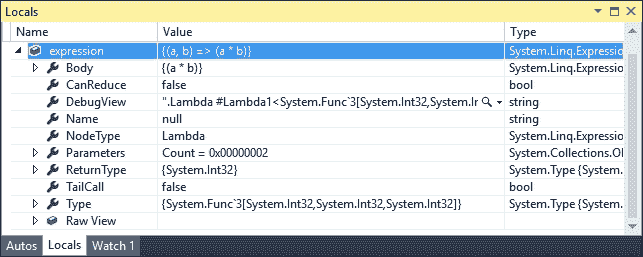

从前面的截图中，我们有一个包含`{(a * b)}`的`Body`属性，`NodeType`包含 Lambda，`Type`包含具有三个模板的`Func`委托，并且有两个参数。如果我们在变量窗口中展开`Body`信息，我们将得到类似以下截图所示的结果：

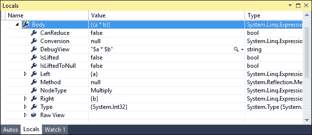

从前面的截图中，我们可以看到`Left`属性包含`{a}`，`Right`属性包含`{b}`。使用这些属性，我们也可以以编程方式探索表达式树的主体。以下代码是`exploreBody()`方法，它将探索`Body`的属性：

```cs
public partial class Program 
{ 
  private static void exploreBody( 
    Expression<Func<int, int, int>> expr) 
  { 
    BinaryExpression body = 
      (BinaryExpression)expr.Body; 
    ParameterExpression left = 
      (ParameterExpression)body.Left; 
    ParameterExpression right = 
      (ParameterExpression)body.Right; 
    Console.WriteLine(expr.Body); 
    Console.WriteLine( 
      "\tThe left part of the expression: {0}\n" + 
      "\tThe NodeType: {1}\n" + 
      "\tThe right part: {2}\n" + 
      "\tThe Type: {3}\n", 
      left.Name, 
      body.NodeType, 
      right.Name, 
      body.Type); 
  } 
} 

```

如果我们运行前面的`exploreBody()`方法，我们将得到以下输出：

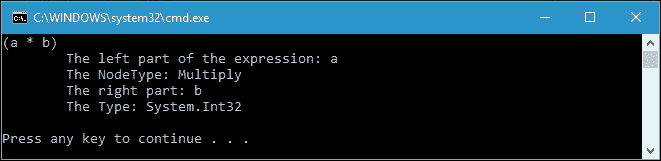

在前面的代码中，我们以编程方式访问了`Expression<T>`的`Body`属性。为了获取`Body`内容，我们需要创建一个`BinaryExpression`数据类型，并且为了获取`Left`和`Right`属性的内容，我们需要创建一个`ParameterExpression`。`BinaryExpression`和`ParameterExpression`数据的代码片段如下：

```cs
BinaryExpression body = 
  (BinaryExpression)expr.Body; 
ParameterExpression left = 
  (ParameterExpression)body.Left; 
ParameterExpression right = 
  (ParameterExpression)body.Right; 

```

我们已经成功地从表达式树中的代码创建了一个数据结构。如果我们愿意，我们可以通过编译表达式将这些数据转换回代码。我们现在有的表达式如下：

```cs
Expression<Func<int, int, int>> expression = 
  (a, b) => a * b; 

```

因此，我们可以编译表达式，并使用以下`compilingExpr()`方法运行表达式中的代码：

```cs
public partial class Program 
{ 
  private static void compilingExpr( 
    Expression<Func<int, int, int>> expr) 
  { 
    int a = 2; 
    int b = 3; 
    int compResult = expr.Compile()(a, b); 
    Console.WriteLine( 
      "The result of expression {0}"+ 
      " with a = {1} and b = {2} is {3}", 
      expr.Body, 
      a, 
      b, 
      compResult); 
  } 
} 

```

如果我们运行`compilingExpr()`方法，将在控制台窗口上显示以下输出：

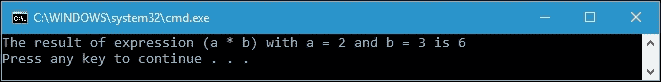

正如我们所看到的，我们使用表达式类中的`Compile()`方法编译了表达式：

```cs
int compResult = expr.Compile()(a, b); 

```

`expr.Compile()`方法根据表达式的类型生成`Func<int, int, int>`类型的委托。我们根据其签名给`Compile()`方法传递参数`a`和`b`，然后它返回`int`值。

# 使用 lambda 表达式订阅事件

在 C#中，对象或类可以用来在发生某事时通知其他对象或类，这就是事件。事件中有两种类，它们是发布者和订阅者。发布者是发送（或引发）事件的类或对象，而订阅者是接收（或处理）事件的类或对象。幸运的是，lambda 表达式也可以用来处理事件。让我们看一下以下代码来进一步讨论事件：

```cs
public class EventClassWithoutEvent 
{ 
  public Action OnChange { get; set; } 
  public void Raise() 
  { 
    if (OnChange != null) 
    { 
      OnChange(); 
    } 
  } 
} 

```

前面的代码可以在`EventsInLambda.csproj`项目中找到。正如我们所看到的，项目中创建了一个名为`EventClassWithoutEvent`的类。该类有一个名为`OnChange`的属性。该属性的作用是存储订阅类并在调用`Raise()`方法时运行。现在，让我们使用以下代码调用`Raise()`方法：

```cs
public partial class Program 
{ 
  private static void CreateAndRaiseEvent() 
  { 
    EventClassWithoutEvent ev = new EventClassWithoutEvent(); 
    ev.OnChange += () => 
      Console.WriteLine("1st: Event raised"); 
    ev.OnChange += () => 
      Console.WriteLine("2nd: Event raised"); 
    ev.OnChange += () => 
      Console.WriteLine("3rd: Event raised"); 
    ev.OnChange += () => 
      Console.WriteLine("4th: Event raised"); 
    ev.OnChange += () => 
      Console.WriteLine("5th: Event raised"); 
    ev.Raise(); 
  } 
} 

```

如果我们运行前面的`CreateAndRaiseEvent()`方法，将在控制台上获得以下输出：

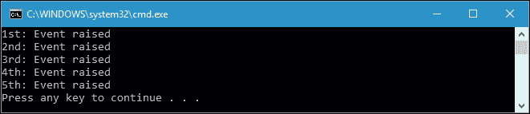

从代码中，我们可以看到当调用`CreateAndRaiseEvent()`方法时，代码实例化了一个`EventClassWithoutEvent`类。然后它在 lambda 表达式中订阅了五种不同的方法，然后通过调用`Raise()`方法引发了事件。以下代码片段将进一步解释这一点：

```cs
EventClassWithoutEvent ev = new EventClassWithoutEvent(); 
ev.OnChange += () => 
  Console.WriteLine("1st: Event raised"); 
ev.Raise(); 

```

从前面的代码片段中，我们可以看到 lambda 表达式可以用来订阅事件，因为它使用委托来存储订阅的方法。然而，前面的代码仍然存在一个弱点。看一下这段代码中的最后一个`OnChange`赋值：

```cs
ev.OnChange += () => 
  Console.WriteLine("5th: Event raised"); 

```

现在，假设我们将其更改为这样：

```cs
ev.OnChange = () => 
  Console.WriteLine("5th: Event raised"); 

```

然后，我们将删除所有四个先前的订阅者。另一个弱点是`EventClassWithoutEvent`引发了事件，但没有任何东西可以阻止类的用户引发此事件。通过调用`OnChange()`，类的所有用户都可以向所有订阅者引发事件。

## 使用事件关键字

使用`event`关键字可以解决我们之前的问题，因为它将强制类的用户只能使用`+=`或`-=`运算符订阅某些内容。让我们看一下以下代码来进一步解释这一点：

```cs
public class EventClassWithEvent 
{ 
  public event Action OnChange = () => { }; 
  public void Raise() 
  { 
    OnChange(); 
  } 
} 

```

从前面的代码中，我们可以看到我们不再使用公共属性，而是使用`EventClassWithEvent`类中的公共字段。使用`event`关键字，编译器将保护我们的字段免受未经授权的访问。事件关键字还将保护订阅列表，因为它不能使用`=`运算符分配给任何 lambda 表达式，而必须与`+=`或`-=`运算符一起使用。现在，让我们看一下以下代码来证明这一点：

```cs
public partial class Program 
{ 
  private static void CreateAndRaiseEvent2() 
  { 
    EventClassWithEvent ev = new EventClassWithEvent(); 
    ev.OnChange += () => 
      Console.WriteLine("1st: Event raised"); 
    ev.OnChange += () => 
      Console.WriteLine("2nd: Event raised"); 
    ev.OnChange += () => 
      Console.WriteLine("3rd: Event raised"); 
    ev.OnChange += () => 
      Console.WriteLine("4th: Event raised"); 
    ev.OnChange = () => 
      Console.WriteLine("5th: Event raised"); 
    ev.Raise(); 
  } 
} 

```

现在我们有一个名为`CreateAndRaiseEvent2()`的方法，它与`CreateAndRaiseEvent()`方法完全相同，只是最后的`OnChange`赋值使用了`=`运算符而不是`+=`运算符。然而，由于我们已经将事件关键字应用于`OnChange`字段，代码无法编译，将出现`CS0070`错误代码，如下面的屏幕截图所示：

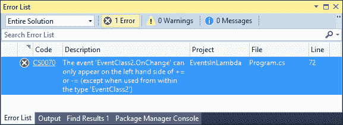

由于事件关键字限制了`=`运算符的使用，不再存在风险。`event`关键字还阻止了类的外部用户引发事件。只有定义事件的类的部分才能引发事件。让我们来看一下`EventClassWithoutEvent`和`EventClassWithEvent`类之间的区别：

```cs
public partial class Program 
{ 
  private static void CreateAndRaiseEvent3() 
  { 
    EventClassWithoutEvent ev = new EventClassWithoutEvent(); 
    ev.OnChange += () => 
      Console.WriteLine("1st: Event raised"); 
    ev.OnChange += () => 
      Console.WriteLine("2nd: Event raised"); 
    ev.OnChange += () => 
      Console.WriteLine("3rd: Event raised"); 
    ev.OnChange(); 
    ev.OnChange += () => 
      Console.WriteLine("4th: Event raised"); 
    ev.OnChange += () => 
      Console.WriteLine("5th: Event raised"); 
    ev.Raise(); 
  } 
} 

```

前面的`CreateAndRaiseEvent3()`方法的引用是`CreateAndRaiseEvent()`，但我们在第三个事件和第四个事件之间插入了`ev.OnChange()`。如果我们运行该方法，它将成功运行，并且我们将在控制台上看到以下输出：

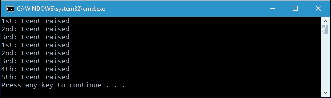

从输出中可以看出，`EventClassWithoutEvent`类中的`OnChange()`可以引发事件。与`EventClassWithEvent`类相比，如果我们在任何订阅事件之间插入`OnChange()`，编译器将创建编译错误，如下面的代码所示：

```cs
public partial class Program 
{ 
  private static void CreateAndRaiseEvent4() 
  { 
    EventClassWithEvent ev = new EventClassWithEvent(); 
    ev.OnChange += () => 
      Console.WriteLine("1st: Event raised"); 
    ev.OnChange += () => 
      Console.WriteLine("2nd: Event raised"); 
    ev.OnChange += () => 
      Console.WriteLine("3rd: Event raised"); 
    ev.OnChange(); 
    ev.OnChange += () => 
      Console.WriteLine("4th: Event raised"); 
    ev.OnChange += () => 
      Console.WriteLine("5th: Event raised"); 
    ev.Raise(); 
  } 
} 

```

如果我们编译前面的代码，将再次得到`CS0070`错误代码，因为我们在第三个事件和第四个事件之间插入了`ev.OnChange()`。

## 使用 EventHandler 或 EventHandler<T>

实际上，C#有一个名为`EventHandler`或`EventHandler<T>`的类，我们可以使用它来初始化事件，而不是使用`Action`类。`EventHandler`类接受一个发送者对象和事件参数。发送者是引发事件的对象。使用`EventHandler<T>`，我们可以定义事件参数的类型。让我们看一下在`EventWithEventHandler.csproj`项目中找到的以下代码：

```cs
public class MyArgs : EventArgs 
{ 
  public int Value { get; set; } 
  public MyArgs(int value) 
  { 
    Value = value; 
  } 
} 
public class EventClassWithEventHandler 
{ 
  public event EventHandler<MyArgs> OnChange = 
    (sender, e) => { }; 
  public void Raise() 
  { 
    OnChange(this, new MyArgs(100)); 
  } 
} 

```

我们有两个类，名为`MyArgs`和`EventClassWithEventHandler`。`EventClassWithEventHandler`类使用`EventHandler<MyArgs>`，它定义了事件参数的类型。在引发事件时，我们需要传递`MyArgs`的一个实例。事件的订阅者可以访问并使用参数。现在，让我们看一下以下`CreateAndRaiseEvent()`方法的代码：

```cs
public partial class Program 
{ 
  private static void CreateAndRaiseEvent() 
  { 
    EventClassWithEventHandler ev = 
      new EventClassWithEventHandler(); 
    ev.OnChange += (sender, e) 
      => Console.WriteLine( 
          "Event raised with args: {0}", e.Value); 
    ev.Raise(); 
  } 
} 

```

如果我们运行前面的代码，将在控制台上看到以下输出：

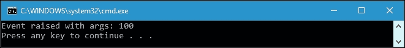

从前面的代码中，我们可以看到 lambda 表达式发挥了订阅事件的作用，如下所示：

```cs
ev.OnChange += (sender, e) 
  => Console.WriteLine( 
      "Event raised with args: {0}", e.Value); 

```

# 在函数式编程中使用 lambda 表达式的优势

Lambda 表达式不仅是提供匿名方法的简写符号的强大方式，而且还在函数式编程中使用。在本节中，我们将讨论在函数式编程的上下文中使用 lambda 表达式的优势。

## 一流函数

在第一章中，*在 C#中品尝函数式风格*，我们在讨论函数式编程时讨论了一流函数的概念。如果函数是一流函数，函数遵循值语义。它们可以作为参数传递，从函数返回，等等。如果我们回到关于 lambda 表达式的早期话题，我们有一个名为`SimpleLambdaExpression.csproj`的项目，其中包含以下简单的 lambda 表达式：

```cs
public partial class Program 
{ 
  static Func<string, string> displayMessageDelegate = 
    str => String.Format(Message: {0}", str); 
} 

```

然后，我们可以将以下`firstClassConcept()`方法添加到项目中，以演示使用 lambda 表达式的一流函数：

```cs
public partial class Program 
{ 
  static private void firstClassConcept() 
  { 
    string str = displayMessageDelegate( 
      "Assign displayMessageDelegate() to variable"); 
      Console.WriteLine(str); 
  } 
} 

```

如我们所见，我们已成功将`displayMessageDelegate()`方法分配给名为`str`的变量，如下所示：

```cs
string str = displayMessageDelegate( 
  "Assign displayMessageDelegate() to variable"); 

```

如果我们运行代码，将在控制台上看到以下输出：

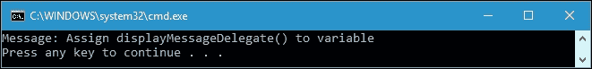

我们还可以将 lambda 表达式作为其他函数的参数传递。使用`displayMessageDelegate`，让我们看一下以下代码：

```cs
public partial class Program 
{ 
  static private void firstClassConcept2( 
    Func<string, string> funct, 
    string message) 
  { 
    Console.WriteLine(funct(message)); 
  } 
} 

```

我们有一个名为`firstClassConcept2`的方法，它接受`Func`和字符串参数。我们可以按以下方式运行该方法：

```cs
public partial class Program 
{ 
  static void Main(string[] args) 
  { 
    firstClassConcept2( 
      displayMessageDelegate, 
      "Pass lambda expression to argument"); 
  } 
} 

```

如我们所见，我们将 lambda 表达式`displayMessageDelegate`传递给`firstClassConcept2()`方法。如果我们运行该项目，将在控制台窗口上看到以下输出：

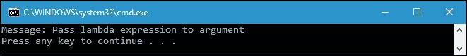

由于我们已经成功地将一个函数分配给一个变量，并将一个函数传递给另一个函数参数，我们可以说 lambda 表达式是在函数式编程中创建一流函数的强大工具。

## 闭包

闭包是一个能够被分配给一个变量（第一类函数）的函数，它具有自由变量，这些变量在词法环境中被绑定。自由变量是一个不是参数的变量；或者是一个局部变量。在闭包中，任何未绑定的变量都将从定义闭包的词法环境中捕获。为了避免对这个术语感到困惑，让我们看一下以下代码，在`Closure.csproj`项目中可以找到：

```cs
public partial class Program 
{ 
  private static Func<int, int> GetFunction() 
  { 
    int localVar = 1; 
    Func<int, int> returnFunc = scopeVar => 
    { 
      localVar *= 2; 
      return scopeVar + localVar; 
    }; 
  return returnFunc; 
  } 
} 

```

从上面的代码中，我们可以看到我们有一个名为`localVar`的局部变量，当调用`GetFunction()`方法时，它将乘以 2。`localVar`变量在`returnValue`返回时绑定在 lambda 表达式中。通过分析前面的代码而不运行它，我们可能会猜测`GetFunction()`将返回`returnFunc`，每次传递给相同的参数时都将返回相同的值。这是因为`localVar`每次调用`GetFunction()`时都将始终为*1*，因为它是一个局部变量。正如我们在编程中学到的，局部变量是在堆栈上创建的，当方法执行完毕时它们将消失。现在，让我们调用`GetFunction()`方法来证明我们的猜测，使用以下代码：

```cs
public partial class Program 
{ 
  static void Main(string[] args) 
  { 
    Func<int, int> incrementFunc = GetFunction(); 
    for (int i = 0; i < 10; i++) 
    { 
      Console.WriteLine( 
        "Invoking {0}: incrementFunc(1) = {1}", 
        i, 
        incrementFunc(1)); 
    } 
  } 
} 

```

我们将调用`incrementFunc()`方法，这是`GetFunction()`方法的返回值，调用十次，但我们总是传递 1 作为参数。根据我们之前的猜测，我们可以说`incrementFunc(1)`方法在所有十次调用中都将返回`3`。现在，让我们运行项目，我们将在控制台上看到以下输出：

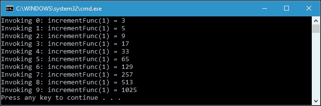

根据前面的输出，我们猜错了。`localVar`变量与`GetFunction()`方法一起存在。它在每次调用方法时都会存储其值乘以 2。我们已经成功地在词法环境中绑定了一个自由变量，这就是我们所说的闭包。

# 总结

在本章中，我们发现匿名方法是一种没有名称的方法。我们只需要定义方法的参数和实现。这是从委托中的简写表示。然后，我们看了 lambda 表达式，这是函数式编程中的强大工具，可以提供匿名方法的简写表示。

lambda 表达式也可以用来形成表达式树，当我们需要用常规 C#表达我们的代码，解构它，检查它和解释它时，这将非常有用。表达式树就像是代码的解释。如果我们有一个`<Func<int, int, int>>`表达式，它解释了如果我们给代码两个整数，它将提供一个`int`返回。

通过 lambda 表达式也可以订阅事件。事件中有两种类，发布者和订阅者，我们可以使用 lambda 表达式订阅事件。无论我们使用`event`关键字还是`EventHandler`关键字，lambda 表达式都可以用来订阅事件。

第一类函数概念也可以通过 lambda 表达式来实现，因为通过使用它，我们可以将函数分配给变量或将函数作为其他函数的参数传递。使用 lambda 表达式，我们还可以应用闭包概念，使局部变量在函数内部保持活动状态。

目前，讨论 lambda 表达式就足够了。但是，当我们在第五章中讨论 LINQ 时，我们将再次更详细地讨论 lambda 表达式，*使用 LINQ 轻松查询任何集合*。而在下一章中，我们将讨论可以用来扩展方法能力的扩展方法。
