# 第四章：使用扩展方法扩展对象功能

正如我们在上一章中已经提到的，我们将在本章中更详细地讨论扩展方法。当我们在下一章中讨论 LINQ 时，这将是有帮助的，LINQ 是 C#中函数式编程的基本技术。以下是本章我们将涵盖的主题：

+   练习使用扩展方法并在 IntelliSense 中获得这个新方法

+   从其他程序集调用扩展方法

+   为接口、集合、枚举和其他对象创建新方法

+   与函数式编程相关的扩展方法的优势

+   扩展方法的限制

# 接近扩展方法

扩展方法是一种能够扩展现有类或类型的能力，而不对现有类或类型进行任何修改。这意味着扩展方法使我们能够向现有类或类型添加方法，而无需创建新的派生类型或重新编译。

扩展方法是在 C# 3.0 中引入的，可以应用于我们自己的类型或.NET 中现有的类型。扩展方法在函数式编程中将被广泛使用，因为它符合方法链的概念，我们在第一章中已经使用了*在 C#中品尝函数式风格*，在以函数式风格重构代码时。

## 创建扩展方法

扩展方法必须声明在一个静态、非泛型和非嵌套的类中。它们是静态类中的静态方法。要创建扩展方法，首先我们必须创建一个`public static`类，因为扩展方法必须包含在`static`类中。成功创建`public static`类后，我们在类中定义一个方法，并在第一个方法参数中添加`this`关键字，以指示它是一个`扩展`方法。具有`this`关键字的方法中的第一个参数必须引用我们要扩展的类的特定实例。为了使解释更清晰，让我们看一下以下代码，创建一个扩展方法，我们可以在`Palindrome.csproj`项目中找到：

```cs
public static class ExtensionMethods 
{ 
  public static bool IsPalindrome(this string str) 
  { 
    char[] array = str.ToCharArray(); 
    Array.Reverse(array); 
    string backwards = new string(array); 
    return str == backwards; 
  } 
} 

```

现在让我们解剖上述代码，以了解如何创建扩展方法。首先，我们必须成功创建`public static`类，如下面的代码片段所示：

```cs
public static class ExtensionMethods 
{ 
  ... 
} 

```

然后，我们在类中创建一个`static`方法，如下面的代码片段所示：

```cs
public static bool IsPalindrome(this string str) 
{ 
  ... 
} 

```

正如我们在前面的方法中所看到的，我们在方法的第一个参数中添加了`this`关键字。这表明该方法是一个`扩展`方法。此外，第一个参数的类型，即字符串，表示我们要扩展的类型是`string`数据类型。现在，通过为`string`类型定义`IsPalindrome()`扩展方法，所有字符串实例都具有`IsPalindrome()`方法。让我们看一下以下代码来证明这一点：

```cs
public class Program 
{ 
  static void Main(string[] args) 
  { 
    string[] strArray = { 
      "room", 
      "level", 
      "channel", 
      "heat", 
      "burn", 
      "madam", 
      "machine", 
      "jump", 
      "radar", 
      "brain" 
    }; 
    foreach (string s instrArray) 
    { 
      Console.WriteLine("{0} = {1}", s, s.IsPalindrome()); 
    } 
  } 
} 

```

上述的`Main()`函数将检查`strArray`数组的所有成员，无论它是否是回文。我们可以从`string`类型的变量`s`中调用`IsPalindrome()`方法。当从字符串类型的实例调用`IsPalindrome()`方法时，代码片段如下：

```cs
foreach (string s instrArray) 
{ 
  Console.WriteLine("{0} = {1}", s, s.IsPalindrome()); 
} 

```

如果我们运行`Palindrome.csproj`项目，我们可以在控制台上获得以下输出：

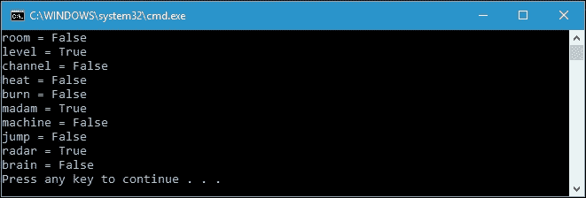

由于回文是一个单词或另一个字符序列，无论我们是向后读还是向前读，只有`level`，`madam`和`radar`如果我们对它们调用`IsPalindrome()`方法，将返回`true`。我们的扩展方法已成功创建并运行。

## 代码 IntelliSense 中的扩展方法

当我们为实例创建扩展方法时，与类或类型中已存在的方法相比，没有明显的区别。这是因为在调用扩展方法或实际在类型中定义的方法时，我们将执行相同的操作。然而，我们可以检查代码智能感知来了解类型内部的方法是否是扩展方法，因为扩展方法将显示在智能感知中。当`IsPalindrome()`扩展方法尚未定义时，以下截图是字符串实例的方法列表：

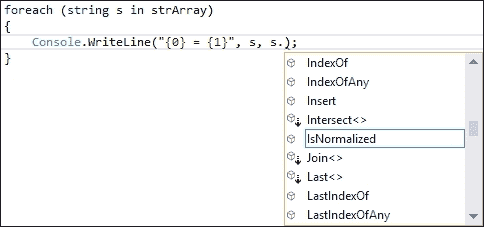

当`IsPalindrome()`扩展方法已经定义时，以下截图是字符串实例的方法列表：

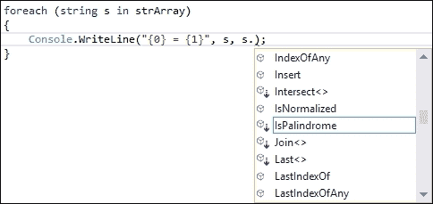

我们可以从前面两张图片中看到，扩展方法将在 Visual Studio 的代码智能感知中列出。然而，我们现在可以找到扩展方法和实际在类型中定义的方法之间的区别。扩展方法的图标有一个向下的箭头，尽管我们在实际定义的方法中找不到它。这是因为图标不同，但我们调用方法的方式完全相同。

# 在其他程序集中调用扩展方法

我们已经成功在上一节中创建了`IsPalindrome()`扩展方法。调用扩展方法非常容易，因为它是在与调用方法相同的命名空间中定义的。换句话说，`IsPalindrome()`扩展方法和`Main()`方法在同一个命名空间中。我们不需要添加对任何模块的引用，因为该方法与调用者一起存在。然而，在通常的实践中，我们可以在其他程序集中创建扩展方法，通常称为类库。使用该类库将简化扩展方法的使用，因为它可以被重用，所以我们可以在许多项目中使用该扩展方法。

## 引用命名空间

我们将在`类库`中创建一个扩展方法，并在另一个项目中调用它。让我们创建一个名为`ReferencingNamespaceLib.csproj`的新`类库`项目，并将以下代码插入`ExtensionMethodsClass.cs`文件中：

```cs
using System; 
namespaceReferencingNamespaceLib 
{ 
  public static class ExtensionMethodsClass 
  { 
    public static byte[] ConvertToHex(this string str) 
    { 
      int i = 0; 
      byte[] HexArray = new byte[str.Length]; 
      foreach (char ch in str) 
      { 
        HexArray[i++] = Convert.ToByte(ch); 
      } 
      returnHexArray; 
    } 
  } 
} 

```

从前面的代码中，我们可以看到我们在`ReferencingNamespaceLib`命名空间的`ExtensionMethodsClass`类中创建了`ConvertToHex()`扩展方法。`ConvertToHex()`扩展方法的用途是将字符串中的每个字符转换为 ASCII 码并将其存储在字节数组中。现在让我们看一下以下代码，它将调用我们可以在`ReferencingNamespace.csproj`项目中找到的扩展方法：

```cs
using System; 
using ReferencingNamespaceLib; 
namespace ReferencingNamespace 
{ 
  class Program 
  { 
    static void Main(string[] args) 
    { 
      int i = 0; 
      string strData = "Functional in C#"; 
      byte[] byteData = strData.ConvertToHex(); 
      foreach (char c in strData) 
      { 
        Console.WriteLine("{0} = 0x{1:X2} ({2})", 
        c.ToString(), 
        byteData[i], 
        byteData[i++]); 
      } 
    } 
  } 
} 

```

从前面的代码中，我们可以看到我们如何从字符串实例`strData`中调用`ConvertToHex()`扩展方法，如下所示：

```cs
string strData = "Functional in C#"; 
byte[] byteData = strData.ConvertToHex(); 

```

然而，为了从字符串实例中调用`ConvertToHex()`方法，我们必须引用`ReferencingNamespaceLib`程序集，并且还要导入引用程序集的命名空间。要导入程序集，我们必须使用`using`以及`ReferencingNamespaceLib`，如下面的代码片段所示：

```cs
usingReferencingNamespaceLib; 

```

如果我们运行`ReferencingNamespace.csproj`项目，我们将在控制台上得到以下输出：

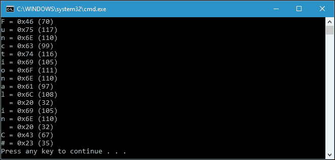

正如我们所看到的，C#句子中的每个字符都被转换为 ASCII 码，通过引用命名空间调用了我们为字符串类型创建的扩展方法，以十六进制和十进制格式显示。这也证明了我们已经成功在另一个程序集中。

## 搭便车命名空间

如果我们愿意，我们可以依赖存储字符串类型的`System`命名空间，这样我们就不需要导入自定义命名空间来使用扩展方法。依赖命名空间对于我们的标准编程方法也是有好处的。让我们使用`PiggybackingNamespaceLib.csproj`项目中的以下代码重构我们之前的`ReferencingNamespaceLib.csproj`代码：

```cs
namespace System 
{ 
  public static class ExtensionMethodsClass 
  { 
    public static byte[] ConvertToHex(this string str) 
    { 
      int i = 0; 
      byte[] HexArray = new byte[str.Length]; 
      foreach (char ch in str) 
      { 
        HexArray[i++] = Convert.ToByte(ch); 
      } 
      return HexArray; 
    } 
  } 
} 

```

如果我们观察类名、`ConvertToHex()`方法签名或方法的实现，我们会发现`ReferencingNamespaceLib.csproj`和`PiggybackingNamespaceLib.csproj`项目之间没有区别。但是，如果我们看命名空间名称，我们会发现现在是`System`而不是`PiggybackingNamespaceLib`。我们使用`System`命名空间的原因是在所选命名空间中创建扩展方法。由于我们想要扩展`System`命名空间中的字符串类型的能力，我们也必须扩展`System`命名空间。我们不需要使用`using`关键字导入`System`命名空间，因为`ConvertToHex()`方法位于`System`命名空间中。现在，让我们看一下以下代码，以便在`PiggybackingNamespace.csproj`项目中调用`System`命名空间中的`ConvertToHex()`方法：

```cs
using System; 
namespace PiggybackingNamespace 
{ 
  class Program 
  { 
    static void Main(string[] args) 
    { 
      int i = 0; 
      string strData = "Piggybacking"; 
      byte[] byteData = strData.ConvertToHex(); 
      foreach (char c in strData) 
      { 
        Console.WriteLine("{0} = 0x{1:X2} ({2})", 
        c.ToString(), 
        byteData[i], 
        byteData[i++]); 
      } 
    } 
  } 
} 

```

我们重构了`ReferencingNamespace.csproj`项目中的前面的代码，再次发现`PiggybackingNamespace.csproj`项目和`ReferencingNamespace.csproj`项目之间没有任何区别，除了`PiggybackingNamespace.csproj`项目中没有导入自定义命名空间，而`ReferencingNamespace.csproj`项目有：

```cs
using ReferencingNamespaceLib; 

```

由于我们在`System`命名空间中创建了扩展方法，所以我们不需要导入自定义命名空间。但是，我们仍然需要引用定义扩展方法的程序集。我们可以期望得到如下截图所示的输出：

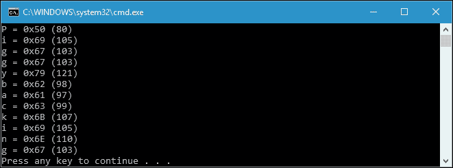

我们已成功调用了`ConvertToHex()`扩展方法，并发现它对从字符串数据类型获取 ASCII 代码很有用。

# 利用接口、集合和对象

不仅类和类型可以应用扩展方法，接口、集合和任何其他对象也可以使用扩展方法进行功能扩展。我们将在接下来的部分讨论这个问题。

## 扩展接口

我们可以以与在类或类型中扩展方法相同的方式扩展接口中的方法。我们仍然需要`public static`类和`public static`方法。通过扩展接口的能力，我们可以在创建扩展方法后立即使用它，而无需在我们从接口继承的类中创建实现，因为实现是在我们声明扩展方法时完成的。让我们看一下`ExtendingInterface.csproj`项目中的以下`DataItem`类：

```cs
namespace ExtendingInterface 
{ 
  public class DataItem 
  { 
    public string Name { get; set; } 
    public string Gender { get; set; } 
  } 
} 

```

我们还有以下`IDataSource`接口：

```cs
namespace ExtendingInterface 
{ 
  public interface IDataSource 
  { 
    IEnumerable<DataItem> GetItems(); 
  } 
} 

```

正如我们所看到的，`IDataSource`接口只有一个名为`GetItems()`的方法签名，返回`IEnumerable<DataItem>`。现在，我们可以创建一个类来继承`IDataSource`接口，我们给它一个名字`ClubMember`；它有`GetItems()`方法的实现，如下所示：

```cs
public partial class ClubMember : IDataSource 
{ 
  public IEnumerable<DataItem> GetItems() 
  { 
    foreach (var item in DataItemList) 
    { 
      yield return item; 
    } 
  } 
} 

```

从前面的类中，`GetItems()`方法将产生`DataItemList`中的所有数据，其内容将如下所示：

```cs
public partial class ClubMember : IDataSource 
{ 
  List<DataItem> DataItemList = new List<DataItem>() 
  { 
    newDataItem{ 
      Name ="Dorian Villarreal", 
      Gender ="Male"}, 
    newDataItem{ 
      Name ="Olivia Bradley", 
      Gender ="Female"}, 
    newDataItem{ 
      Name ="Jocelyn Garrison", 
      Gender ="Female"}, 
    newDataItem{ 
      Name ="Connor Hopkins", 
      Gender ="Male"}, 
    newDataItem{ 
      Name ="Rose Moore", 
      Gender ="Female"}, 
    newDataItem{ 
      Name ="Conner Avery", 
      Gender ="Male"}, 
    newDataItem{ 
      Name ="Lexie Irwin", 
      Gender ="Female"}, 
    newDataItem{ 
      Name ="Bobby Armstrong", 
      Gender ="Male"}, 
    newDataItem{ 
      Name ="Stanley Wilson", 
      Gender ="Male"}, 
    newDataItem{ 
      Name ="Chloe Steele", 
      Gender ="Female"} 
  }; 
} 

```

在`DataItemList`中有十个`DataItem`类。我们可以通过`GetItems()`方法显示`DataItemList`中的所有项目，如下所示：

```cs
public class Program 
{ 
static void Main(string[] args) 
  { 
    ClubMember cm = new ClubMember(); 
    foreach (var item in cm.GetItems()) 
    { 
      Console.WriteLine( 
        "Name: {0}\tGender: {1}", 
          item.Name, 
            item.Gender); 
    } 
  } 
} 

```

正如我们在上述代码中所看到的，由于我们已将`ClubMember`类继承到`IDataSource`接口，并实现了`GetItems()`方法，因此`ClubMember`的实例`cm`可以调用`GetItems()`方法。当我们运行项目时，输出将如下截图所示：

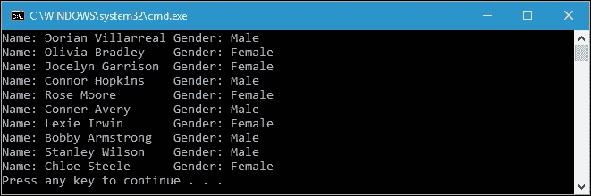

现在，如果我们想要在不修改接口的情况下向其添加方法，我们可以为接口创建一个方法扩展。考虑到我们要向`IDataSource`接口添加`GetItemsByGender()`方法，我们可以创建如下的扩展方法：

```cs
namespaceExtendingInterface 
{ 
  public static class IDataSourceExtension 
  { 
    public static IEnumerable<DataItem>
      GetItemsByGender(thisIDataSourcesrc,string gender) 
    { 
      foreach (DataItem item in src.GetItems()) 
      { 
        if (item.Gender == gender) 
          yield return item; 
      } 
    } 
  } 
} 

```

通过创建上述扩展方法，`ClubMember`类的实例现在有一个名为`GetItemsByGender()`的方法。我们可以像使用方法类一样使用这个扩展方法，如下所示：

```cs
public class Program 
{ 
  static void Main(string[] args) 
  { 
    ClubMember cm = new ClubMember(); 
    foreach (var item in cm.GetItemsByGender("Female")) 
    { 
      Console.WriteLine( 
        "Name: {0}\tGender: {1}", 
        item.Name, 
        item.Gender); 
    } 
  } 
} 

```

`GetItemsByGender()`方法将返回`DataItemList`所选性别的`IEnumerable`接口。由于我们只需要获取列表中的所有女性成员，输出将如下所示：

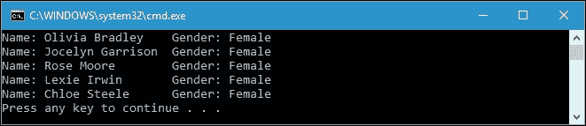

我们现在可以扩展接口中的方法，而不需要在继承的类中实现该方法，因为在扩展方法定义中已经完成了。

## 扩展集合

在我们之前的讨论中，我们发现我们应用`IEnumerable`接口以收集所需的所有数据。我们还可以扩展`IEnumerable`接口，这是一种集合类型，以便我们可以在集合类型的实例中添加方法。

以下是`ExtendingCollection.csproj`项目中的代码，我们仍然使用`ExtendingInterface.csproj`项目中使用的`DataItem.cs`和`IDataSource.cs`。让我们看一下以下代码：

```cs
public static partial class IDataSourceCollectionExtension 
{ 
  public static IEnumerable<DataItem>
    GetAllItemsByGender_IEnum(thisIEnumerablesrc,string gender) 
  { 
    var items = new List<DataItem>(); 
    foreach (var s in src) 
    { 
      var refDataSource = s as IDataSource; 
      if (refDataSource != null) 
      { 
        items.AddRange(refDataSource.GetItemsByGender(gender)); 
       } 
    } 
    return items; 
  } 
} 

```

上述代码是`IEnumerable`类型的扩展方法。为了防止出现错误，我们必须使用以下代码片段对所有源项的类型进行转换：

```cs
var refDataSource = s as IDataSource; 

```

我们还可以扩展`IEnumerable<T>`类型，如下所示：

```cs
public static partial class IDataSourceCollectionExtension 
{ 
  public static IEnumerable<DataItem> 
  GetAllItemsByGender_IEnumTemplate
    (thisIEnumerable<IDataSource> src, string gender) 
  { 
    return src.SelectMany(x =>x.GetItemsByGender(gender)); 
  } 
} 

```

使用上述方法，我们可以扩展`IEnumerable<T>`类型，以拥有一个名为`GetAllItemsByGender_IEnumTemplate()`的方法，用于按特定性别获取项目。

现在，我们准备调用这两个扩展方法。但在调用它们之前，让我们创建以下两个类，名为`ClubMember1`和`ClubMember2`：

```cs
public class ClubMember1 : IDataSource 
{ 
  public IEnumerable<DataItem> GetItems() 
  { 
    return new List<DataItem> 
    { 
      newDataItem{ 
        Name ="Dorian Villarreal", 
        Gender ="Male"}, 
      newDataItem{ 
        Name ="Olivia Bradley", 
        Gender ="Female"}, 
      newDataItem{ 
        Name ="Jocelyn Garrison", 
        Gender ="Female"}, 
      newDataItem{ 
        Name ="Connor Hopkins", 
        Gender ="Male"}, 
      newDataItem{ 
        Name ="Rose Moore", 
        Gender ="Female"} 
    }; 
  } 
} 
public class ClubMember2 : IDataSource 
{ 
  public IEnumerable<DataItem> GetItems() 
  { 
    return new List<DataItem> 
    { 
      newDataItem{ 
        Name ="Conner Avery", 
        Gender ="Male"}, 
      newDataItem{ 
        Name ="Lexie Irwin", 
        Gender ="Female"}, 
      newDataItem{ 
        Name ="Bobby Armstrong", 
        Gender ="Male"}, 
      newDataItem{ 
        Name ="Stanley Wilson", 
        Gender ="Male"}, 
      newDataItem{ 
        Name ="Chloe Steele", 
        Gender ="Female"} 
    }; 
  } 
} 

```

现在，我们将调用`GetAllItemsByGender_IEnum()`和`GetAllItemsByGender_IEnumTemplate()`扩展方法。代码将如下所示：

```cs
public class Program 
{ 
  static void Main(string[] args) 
  { 
    var sources = new IDataSource[] 
    { 
      new ClubMember1(), 
      new ClubMember2() 
    }; 
    var items = sources.GetAllItemsByGender_IEnum("Female"); 
    Console.WriteLine("Invoking GetAllItemsByGender_IEnum()"); 
    foreach (var item in items) 
    { 
      Console.WriteLine( 
        "Name: {0}\tGender: {1}", 
        item.Name, 
        item.Gender); 
    } 
  } 
} 

```

从上述代码中，首先我们创建一个包含`IDataSource`数组的`sources`变量。我们从`ClubMember1`和`ClubMember2`类获取`sources`的数据。由于源是`IDataSource`的集合，因此可以将`GetAllItemsByGender_IEnum()`方法应用于它。如果我们运行上述`Main()`方法，将在控制台上显示以下输出：

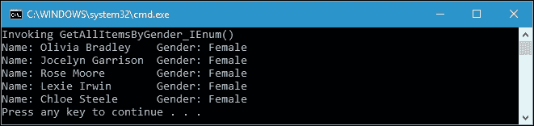

我们已成功调用了`GetAllItemsByGender_IEnum()`扩展方法。现在，让我们尝试使用以下代码调用`GetAllItemsByGender_IEnumTemplate`扩展方法：

```cs
public class Program 
{ 
  static void Main(string[] args) 
  { 
    var sources = new List<IDataSource> 
    { 
      new ClubMember1(), 
      new ClubMember2() 
    }; 
    var items = 
      sources.GetAllItemsByGender_IEnumTemplate("Female"); 
    Console.WriteLine(
      "Invoking GetAllItemsByGender_IEnumTemplate()"); 
    foreach (var item in items) 
    { 
      Console.WriteLine("Name: {0}\tGender: {1}", 
        item.Name,item.Gender); 
    } 
  } 
} 

```

我们在尚未显示的代码中声明了`sources`变量，方式与之前的`Main()`方法中声明它的方式相同。此外，我们可以将`GetAllItemsByGender_IEnumTemplate()`扩展方法应用于源变量。如果我们运行上述代码，输出将如下所示：

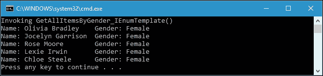

通过比较输出的两个图像，我们可以看到它们之间没有区别，尽管它们扩展了不同的集合类型。

## 扩展对象

我们不仅可以扩展接口和集合，还可以扩展对象，这意味着我们可以扩展一切。为了讨论这一点，让我们看一下在`ExtendingObject.csproj`项目中可以找到的以下代码：

```cs
public static class ObjectExtension 
{ 
  public static void WriteToConsole(this object o,    stringobjectName) 
  { 
    Console.WriteLine(
      String.Format(
        "{0}: {1}\n",
        objectName,
        o.ToString())); 
  } 
} 

```

我们有一个名为`WriteToConsole()`的方法扩展，它可以应用于 C#中的所有对象，因为它扩展了`Object`类。要使用它，我们可以将它应用于各种对象，如下面的代码所示：

```cs
public class Program 
{ 
  static void Main(string[] args) 
  { 
    var obj1 = UInt64.MaxValue; 
    obj1.WriteToConsole(nameof(obj1)); 
    var obj2 = new DateTime(2016, 1, 1); 
    obj2.WriteToConsole(nameof(obj2)); 
    var obj3 = new DataItem 
    { 
      Name = "Marcos Raymond", 
      Gender = "Male" 
    }; 
    obj3.WriteToConsole(nameof(obj3)); 
    IEnumerable<IDataSource> obj4 =new List<IDataSource> 
    { 
      new ClubMember1(), 
      new ClubMember2() 
    }; 
    obj4.WriteToConsole(nameof(obj4)); 
  } 
} 

```

在我们分解前面的代码之前，让我们运行这个`Main()`方法，我们将在控制台上得到以下输出：

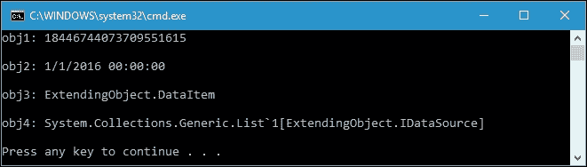

从前面的代码中，我们可以看到所有`UInt64`，`DateTime`，`DataItem`和`IEnumerable<IDataSource>`对象都可以调用我们声明的`WriteToConsole()`扩展方法，该方法使用`this`对象作为参数。

### 提示

在对象类型中创建扩展方法会导致框架中的所有类型都能够访问该方法。我们必须确保该方法的实现可以应用于框架支持的不同类型。

# 在函数式编程中使用扩展方法的优势

函数式编程中的方法链依赖于扩展方法。正如我们在第一章中已经讨论过的那样，*在 C#中品尝函数式风格*，方法链将使我们的代码更易于阅读，因为它可以减少代码行数。为了提高扩展方法的代码可读性，让我们看一下以下代码，可以在`CodeReadability.csproj`项目中找到：

```cs
using System.Linq; 
namespace CodeReadability 
{ 
  public static class HelperMethods 
  { 
    public static string TrimAllSpace(string str) 
    { 
      string retValue = ""; 
      foreach (char c in str) 
      { 
        retValue +=!char.IsWhiteSpace(c) ?c.ToString() :""; 
      } 
      return retValue; 
    } 
    public static string Capitalize(string str) 
    { 
      string retValue = ""; 
      string[] allWords = str.Split(' '); 
      foreach (string s inallWords) 
      { 
        retValue += s.First() 
        .ToString() 
        .ToUpper() 
        + s.Substring(1) 
        + " "; 
      } 
      return retValue.Trim(); 
    } 
  } 
} 

```

前面的代码是`static`类中的`static`方法。它不是扩展方法，因为在方法参数中我们没有使用`this`关键字。我们可以在`HelperMethods.cs`文件中找到它。`TrimAllSpace()`方法的用途是从字符串中删除所有空格字符，而`Capitalize()`方法的用途是将字符串中的第一个字母大写。我们还有完全相同的方法`HelperMethods`，可以在`ExtensionMethods.cs`文件中找到。让我们看一下以下代码，其中我们将`TrimAllSpace()`和`Capitalize()`声明为扩展方法：

```cs
using System.Linq; 
namespace CodeReadability 
{ 
  public static class ExtensionMethods 
  { 
    public static string TrimAllSpace(this string str) 
    { 
      string retValue = ""; 
      foreach (char c in str) 
      { 
        retValue +=!char.IsWhiteSpace(c) ?c.ToString() :""; 
      } 
      return retValue; 
    } 
    public static string Capitalize(string str) 
    { 
      string retValue = ""; 
      string[] allWords = str.Split(' '); 
      foreach (string s inallWords) 
      { 
        retValue += s.First() 
          .ToString() 
          .ToUpper() 
          + s.Substring(1) 
          + " "; 
      } 
      return retValue.Trim(); 
    } 
  } 
} 

```

现在，我们将创建代码，将修剪给定字符串中的所有空格，然后将句子中的每个字符串大写。以下是在`HelperMethods`类中实现的代码：

```cs
static void Main(string[] args) 
{ 
  string sntc = ""; 
  foreach (string str in sentences) 
  { 
    string strTemp = str; 
    strTemp = HelperMethods.TrimAllSpace(strTemp); 
    strTemp = HelperMethods.Capitalize(strTemp); 
    sntc += strTemp + " "; 
  } 
  Console.WriteLine(sntc.Trim()); 
} 

```

我们还声明了一个名为`sentences`的字符串数组，如下所示：

```cs
static string[] sentences = new string[] 
{ 
  " h o w ", 
  " t o ", 
  " a p p l y ", 
  " e x t e n s i o n ", 
  " m e t h o d s ", 
  " i n ", 
  " c s h a r p ", 
  " p r o g r a m mi n g " 
}; 

```

前面的代码将产生以下输出：


如果我们愿意，我们可以简化前面使用`HelperMethods`的`Main()`方法，使用我们已经创建的扩展方法，如下所示：

```cs
static void Main(string[] args) 
{ 
  string sntc = ""; 
  foreach (string str in sentences) 
  { 
    sntc += str.TrimAllSpace().Capitalize() + " "; 
  } 
  Console.WriteLine(sntc.Trim()); 
} 

```

如果我们运行前面的`Main()`方法，我们将在控制台上得到完全相同的输出。但是，我们已经重构了以下代码片段：

```cs
string strTemp = str; 
strTemp = HelperMethods.TrimAllSpace(strTemp); 
strTemp = HelperMethods.Capitalize(strTemp); 
sntc += strTemp + " "; 

```

使用扩展方法，我们只需要这一行代码来替换四行代码：

```cs
sntc += str.TrimAllSpace().Capitalize() + " "; 

```

关键是我们已经减少了代码行数，使其变得更简单和更易读，流程也更清晰了。

# 扩展方法的限制

尽管扩展方法是实现函数式编程的强大工具，但这种技术仍然存在一些局限性。在这里，我们详细阐述了扩展方法所面临的限制，以便我们避免使用它们。

## 扩展静态类

随着我们进一步讨论扩展方法，我们知道扩展方法是具有公共可访问性的静态方法，位于具有公共可访问性的静态类内。扩展方法将出现在我们目标的类型或类中。但是，并非所有类都可以使用扩展方法进行扩展。现有的静态类将无法进行扩展。例如，`Math`类是由.NET 提供的。即使该类提供了我们通常使用的数学功能，有时我们可能需要向`Math`类添加其他功能。

然而，由于`Math`类是一个静态类，几乎不可能通过向其添加单个方法来扩展此类。假设我们想要添加`Square()`方法来找到一个数字与自身相乘的结果。以下是代码，我们可以在`ExtendingStaticClass.csproj`项目中找到，如果我们尝试向`Math`类添加扩展方法：

```cs
public static class StaticClassExtensionMethod 
{ 
  public static int Square(this Math m, inti) 
  { 
    return i * i; 
  } 
} 

```

当我们编译上述代码时，将会出现类似于以下截图所示的错误：

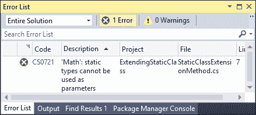

错误消息显示`Math`静态方法不能作为`Square()`扩展方法的参数使用。为了克服这个限制，我们现在可以扩展类型而不是`Math`类。我们可以通过向`int`类型添加`Square()`方法来扩展`int`类型。以下是扩展`int`类的代码：

```cs
public static class StaticClassExtensionMethod 
{ 
  public static int Square(this inti) 
  { 
    return i * i; 
  } 
} 

```

正如我们所看到的，我们扩展了`int`类型，这样如果我们想要调用`Square()`方法，我们可以使用以下代码来调用它：

```cs
public class Program 
{ 
  static void Main(string[] args) 
  { 
    int i = 60; 
    Console.WriteLine(i.Square()); 
  } 
} 

```

然而，使用这种技术，我们还需要扩展其他类型，如`float`和`double`，以适应各种数据类型中的`Square()`功能。

## 修改现有类或类型中的方法实现

尽管扩展方法可以应用于现有的类和类型，但我们不能修改现有方法的实现。我们可以尝试使用以下代码，我们可以在`ModifyingExistingMethod.csproj`项目中找到：

```cs
namespace ModifyingExistingMethod 
{ 
  public static class ExtensionMethods 
  { 
    public static string ToString(this string str) 
    { 
      return "ToString() extension method"; 
    } 
  } 
} 

```

在上述代码中，我们尝试用前面代码中的`ToString()`扩展方法替换字符串类型已有的`ToString()`方法。幸运的是，该代码将能够成功编译。现在，让我们在项目的`Main()`方法中添加以下代码：

```cs
namespace ModifyingExistingMethod 
{ 
  public class Program 
  { 
    static void Main(string[] args) 
    { 
      stringstr = "This is string"; 
      Console.WriteLine(str.ToString()); 
    } 
  } 
} 

```

然而，如果我们运行该项目，`ToString()`扩展方法将永远不会被执行。我们将从现有的`ToString()`方法中获得输出。

# 总结

扩展方法为我们提供了一种简单的方法，可以向现有类或类型添加新方法，而无需修改原始类或类型。此外，我们无需重新编译代码，因为在创建扩展方法后，代码将立即识别它。扩展方法必须声明为静态方法，位于静态类中。与类或类型中的现有方法相比，该方法没有明显的区别，该方法也将出现在 IntelliSense 中。

扩展方法也可以在另一个程序集中声明，并且我们必须引用定义了该方法的静态类的命名空间，存储在其他程序集中。然而，我们可以使用附加命名空间技术，使用现有命名空间，这样我们就不需要再引用任何其他命名空间了。我们不仅可以扩展类和类型的功能，还可以扩展接口、集合和框架中的任何对象。

与其他 C#技术一样，扩展方法也有其优点和局限性。与函数式编程相关的一个优点是，扩展方法将使我们的代码应用方法链，以便应用函数式方法。然而，我们不能扩展静态类，也不能修改现有类或类型中的方法实现，这是扩展方法的局限性。

在下一章中，我们将深入研究 LINQ 技术，因为我们已经对委托、Lambda 表达式和扩展方法有足够的了解。我们还将讨论 LINQ 提供的编写函数式程序的便捷方式。
