# 第五章。使用 LINQ 轻松查询任何集合

在讨论了委托、lambda 表达式和扩展方法之后，我们现在准备继续讨论 LINQ。在本章中，我们将深入探讨 LINQ，这在组成功能代码中是至关重要的。在这里，我们将讨论以下主题：

+   介绍 LINQ 查询

+   理解 LINQ 中的延迟执行

+   比较 LINQ 流畅语法和 LINQ 查询表达式语法

+   枚举 LINQ 运算符

# 开始使用 LINQ

**语言集成查询**（**LINQ**）是 C# 3.0 中引入的.NET Framework 的语言特性，它使我们能够轻松查询实现`IEnumerable<T>`接口的集合中的数据，例如`ArrayList<T>`，`List<T>`，XML 文档和数据库。使用 LINQ，查询集合中的任何数据变得更容易，因为我们不需要为不同的数据源学习不同的语法。例如，如果数据源是数据库，我们就不需要学习 SQL，而是使用 LINQ。同样，使用 LINQ 时，我们不必学习 XQuery，而是处理 XML 文档。幸运的是，LINQ 为我们提供了一个通用的语法，适用于所有数据源。

LINQ 中有两种基本数据单元；它们是序列，包括实现`IEnumerable<T>`的任何对象，和元素，包括序列中的项目。假设我们有以下名为`intArray`的`int`数组：

```cs
int[] intArray = 
{ 
  0,  1,  2,  3,  4,  5,  6,  7,  8,  9, 
  10, 11, 12, 13, 14, 15, 16, 17, 18, 19, 
  20, 21, 22, 23, 24, 25, 26, 27, 28, 29, 
  30, 31, 32, 33, 34, 35, 36, 37, 38, 39, 
  40, 41, 42, 43, 44, 45, 46, 47, 48, 49 
}; 

```

从之前的集合中，我们可以说`intArray`是一个序列，数组的内容，包括从 0 到 49 的数字，是元素。

可以使用称为查询运算符的方法来转换序列。查询运算符接受输入序列，然后生成转换后的序列。当枚举序列时，查询将转换序列。查询至少包括一个输入序列和一个运算符。让我们看一下以下代码，我们可以在`SequencesAndElements.csproj`项目中找到，它将从我们之前的集合`intArray`中查找素数：

```cs
public partial class Program 
{  
  public static void ExtractArray() 
  { 
    IEnumerable<int> extractedData = 
      System.Linq.Enumerable.Where 
      (intArray, i => i.IsPrime()); 
    Console.WriteLine 
      ("Prime Number from 0 - 49 are:"); 
    foreach (int i in extractedData) 
      Console.Write("{0} \t", i); 
    Console.WriteLine(); 
  } 
} 

```

`IsPrime()`扩展方法将有以下实现：

```cs
public static class ExtensionMethods 
{ 
  public static bool IsPrime(this int i) 
  { 
    if ((i % 2) == 0) 
    { 
      return i == 2; 
    } 
    int sqrt = (int)Math.Sqrt(i); 
    for (int t = 3; t <= sqrt; t = t + 2) 
    { 
      if (i % t == 0) 
      { 
        return false; 
      } 
    } 
    return i != 1; 
  } 
} 

```

从我们之前的代码中，我们可以看到我们使用`Where`运算符，它可以在`System.Linq.Enumerable`类中找到，将`intArray`序列转换为`extractedData`序列，如下面的代码片段所示：

```cs
IEnumerable<int> extractedData = 
  System.Linq.Enumerable.Where 
    (intArray, i => i.IsPrime()); 

```

`extractedData`集合现在将包含从`intArray`集合中获得的素数。如果我们运行项目，将在控制台上获得以下输出：

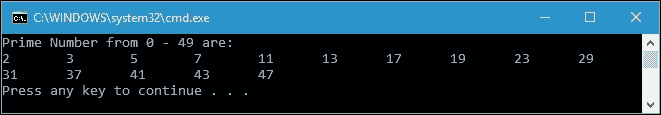

我们实际上可以以更简单的方式修改我们之前的代码片段，因为所有查询运算符都是扩展方法，可以直接在集合中使用。修改之前的代码片段如下：

```cs
IEnumerable<int> extractedData = 
  intArray.Where(i => i.IsPrime()); 

```

通过修改`Where`运算符的调用，我们将获得完整的实现，如下所示：

```cs
public partial class Program 
{ 
  public static void ExtractArrayWithMethodSyntax() 
  { 
    IEnumerable<int> extractedData = 
       intArray.Where(i => i.IsPrime()); 
    Console.WriteLine("Prime Number from 0 - 49 are:"); 
    foreach (int i in extractedData) 
      Console.Write("{0} \t", i); 
    Console.WriteLine(); 
  } 
} 

```

如果我们运行前面的`ExtractArrayWithMethodSyntax()`方法，将得到与`ExtractArray()`方法完全相同的输出。

# 延迟 LINQ 执行

当我们从集合中查询数据时，LINQ 实现了延迟执行的概念。这意味着查询不会在构造函数中执行，而是在枚举过程中执行。例如，我们使用`Where`运算符从集合中查询数据。实际上，直到我们枚举它时，查询才会被执行。我们可以使用`foreach`操作调用`MoveNext`命令来枚举查询。为了更详细地讨论延迟执行，让我们看一下以下代码，我们可以在`DeferredExecution.csproj`项目中找到：

```cs
public partial class Program 
{ 
  public static void DeferredExecution() 
  { 
    List memberList = new List() 
    { 
      new Member 
      { 
        ID = 1, 
        Name = "Eddie Morgan", 
        Gender = "Male", 
        MemberSince = new DateTime(2016, 2, 10) 
      }, 
      new Member 
      { 
        ID = 2, 
        Name = "Millie Duncan", 
        Gender = "Female", 
        MemberSince = new DateTime(2015, 4, 3) 
      }, 
      new Member 
      { 
        ID = 3, 
        Name = "Thiago Hubbard", 
        Gender = "Male", 
        MemberSince = new DateTime(2014, 1, 8) 
      }, 
      new Member 
      { 
        ID = 4, 
        Name = "Emilia Shaw", 
        Gender = "Female", 
        MemberSince = new DateTime(2015, 11, 15) 
      } 
    }; 
    IEnumerable<Member> memberQuery = 
      from m in memberList 
      where m.MemberSince.Year > 2014 
      orderby m.Name 
      select m; 
      memberList.Add(new Member 
      { 
        ID = 5, 
        Name = "Chloe Day", 
        Gender = "Female", 
        MemberSince = new DateTime(2016, 5, 28) 
      }); 
    foreach (Member m in memberQuery) 
    { 
      Console.WriteLine(m.Name); 
    } 
  } 
} 

```

如前面的`DeferredExecution()`方法的实现所示，我们构造了一个名为`memberList`的`List<Member>`成员列表，其中包含每个加入俱乐部的成员的四个实例。`Member`类本身如下所示：

```cs
public class Member 
{ 
  public int ID { get; set; } 
  public string Name { get; set; } 
  public string Gender { get; set; } 
  public DateTime MemberSince { get; set; } 
} 

```

在构造`memberList`之后，我们从`memberList`中查询数据，其中包括 2014 年后加入的所有成员。在这里，我们可以确认只有四个成员中的三个满足要求。它们是 Eddie Morgan，Millie Duncan 和 Emilia Shaw，当然，因为我们在查询中使用了`orderby m.Name`短语，所以它们是按升序排列的。

在我们有了查询之后，我们向`memberList`添加了一个新成员，然后运行`foreach`操作以枚举查询。接下来会发生什么是，因为大多数查询操作符实现了延迟执行，只有在枚举过程中才会执行，所以在枚举查询后，我们将有四个成员，因为我们添加到`memberList`的最后一个成员满足查询要求。为了搞清楚这一点，让我们看一下在调用`DeferredExecution()`方法后我们在控制台上得到的以下输出：

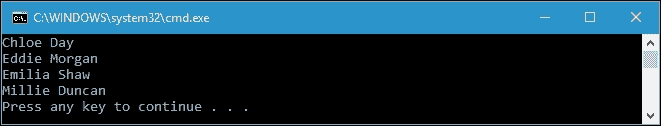

正如您所看到的，`Chloe Day`，作为最后一个加入俱乐部的成员，也包含在查询结果中。这就是延迟执行发挥作用的地方。

几乎所有查询操作符都提供延迟执行，但不包括以下操作符：

+   返回标量值或单个元素，例如`Count`和`First`。

+   转换查询结果，例如`ToList`，`ToArray`，`ToDictionary`和`ToLookup`。它们也被称为转换操作符。

`Count()`和`First()`方法将立即执行，因为它们返回单个对象，所以几乎不可能提供延迟执行以及转换操作符。使用转换操作符，我们可以获得查询结果的缓存副本，并且可以避免由于延迟执行中的重新评估操作而重复该过程。现在，让我们看一下以下代码，我们可以在`NonDeferredExecution.csproj`项目中找到，以演示非延迟执行过程：

```cs
public partial class Program 
{ 
  private static void NonDeferred() 
  { 
    List<int> intList = new List<int> 
    { 
      0,  1,  2,  3,  4,  5,  6,  7,  8,  9 
    }; 
    IEnumerable<int> queryInt = intList.Select(i => i * 2); 
    int queryIntCount = queryInt.Count(); 
    List<int> queryIntCached = queryInt.ToList(); 
    int queryIntCachedCount = queryIntCached.Count(); 
    intList.Clear(); 
    Console.WriteLine( 
      String.Format( 
        "Enumerate queryInt.Count {0}.", queryIntCount)); 
    foreach (int i in queryInt) 
    { 
      Console.WriteLine(i); 
    } 
    Console.WriteLine(String.Format( 
      "Enumerate queryIntCached.Count {0}.",
      queryIntCachedCount)); 
    foreach (int i in queryIntCached) 
    { 
      Console.WriteLine(i); 
    } 
  } 
} 

```

首先，在前面的代码中，我们有一个名为`intList`的`List<int>`整数列表，其中包含从`0`到`9`的数字。然后，我们创建一个名为`queryInt`的查询，以选择`intList`的所有成员并将它们乘以`2`。我们还使用`Count()`方法计算查询数据的总数。由于`queryInt`尚未执行，我们创建了一个名为`queryIntCached`的新查询，它使用`ToList()`转换操作符将`queryInt`转换为`List<int>`。我们还计算了该查询中数据的总数。现在我们有两个查询，`queryInt`和`queryIntCached`。然后我们清除`intList`并枚举这两个查询。以下是它们在控制台上显示的结果：


正如您在前面的控制台中所看到的，对`queryInt`的枚举结果没有任何项目。这很明显，因为我们已经移除了所有`intList`项目，所以`queryInt`在`intList`中找不到任何项目。然而，`queryInt`被计为十个项目，因为我们在清除`intList`之前运行了`Count()`方法，并且该方法在构造后立即执行。与`queryInt`相反，当我们枚举`queryIntCached`时，我们有十个项目的数据。这是因为我们调用了`ToList()`转换操作符，并且它也立即执行了。

### 注意

还有一种延迟执行的类型。当我们在`Select`方法之后链`OrderBy`方法时，就会发生这种情况。例如，`Select`方法只会在必须生成元素时检索一个元素，而`OrderBy`方法必须在返回第一个元素之前消耗整个输入序列。因此，当我们在`Select`方法之后链`OrderBy`方法时，执行将被延迟，直到我们检索第一个元素，然后`OrderBy`方法将要求`Select`提供所有元素。

# 在流畅语法和查询表达式语法之间进行选择

从我们之前的讨论中，到目前为止我们发现了两种类型的查询语法。让我们通过区分这两种语法来进一步讨论这个问题。

```cs
IEnumerable<int> queryInt = 
  intList.Select(i => i * 2); 
int queryIntCount = queryInt.Count(); 

```

前面的代码片段是流畅语法类型。我们通过调用 `Enumerable` 类中的扩展方法来调用 `Select` 和 `Count` 运算符。使用流畅语法，我们还可以链接方法，使其接近函数式编程，如下所示：

```cs
IEnumerable<int> queryInt = 
  intList 
    .Select(i => i * 2); 
    .Count(); 

```

我们在 LINQ 中查询数据时可以使用的另一种语法类型是查询表达式语法。我们在上一个主题中讨论延迟执行时应用了这种语法类型。查询表达式语法的代码片段如下：

```cs
IEnumerable<Member> memberQuery = 
  from m in memberList 
  where m.MemberSince.Year > 2014 
  orderby m.Name 
  select m; 

```

事实上，流畅语法和查询表达式语法将执行相同的操作。它们之间的区别只是语法。查询表达式语法中的每个关键字在 `Enumerable` 类中都有其自己的扩展方法。为了证明这一点，我们可以将前面的代码片段重构为以下流畅语法类型：

```cs
IEnumerable<Member> memberQuery = 
  memberList 
  .Where(m => m.MemberSince.Year > 2014) 
  .OrderBy(m => m.Name) 
  .Select(m => m); 

```

实际上，这两种类型的语法将得到完全相同的输出。然而，流畅语法比查询表达式语法更接近函数式方法。

## 理解 LINQ 流畅语法

基本上，LINQ 流畅语法是在 `Enumerable` 类中找到的扩展方法。该方法将扩展任何实现 `IEnumerable<T>` 接口的变量。流畅语法采用 lambda 表达式作为参数，表示将在序列枚举中执行的逻辑。正如我们之前讨论过的，流畅语法实现了方法链，以便在函数式方法中使用。在本章的开头，我们还讨论了扩展方法，可以直接使用其类的静态方法来调用查询运算符，即 `Enumerable` 类。然而，通过直接从其类调用方法，我们无法实现通常在函数式方法中使用的方法链。让我们看一下以下代码，我们可以在 `FluentSyntax.csproj` 项目中找到，以演示通过调用扩展方法而不是传统的 `static` 方法来使用流畅语法的优势：

```cs
public partial class Program 
{ 
  private static void UsingExtensionMethod() 
  { 
    IEnumerable<string> query = names 
      .Where(n => n.Length > 4) 
      .OrderBy(n => n[0]) 
      .Select(n => n.ToUpper()); 
    foreach (string s in query) 
    { 
      Console.WriteLine(s); 
    } 
  } 
} 

```

我们在前面的代码中使用的名称集合如下：

```cs
public partial class Program 
{ 
  static List<string> names = new List<string> 
  { 
    "Howard", "Pat", 
    "Jaclyn", "Kathryn", 
    "Ben", "Aaron", 
    "Stacey", "Levi", 
    "Patrick", "Tara", 
    "Joe", "Ruby", 
    "Bruce", "Cathy", 
    "Jimmy", "Kim", 
    "Kelsey", "Becky", 
    "Scott", "Dick" 
  }; 
} 

```

正如您所看到的，当我们在前面的代码中从集合中查询数据时，我们使用了三个查询运算符。它们是 `Where`、`OrderBy` 和 `Select` 运算符。让我们看一下以下代码片段，以澄清这一点：

```cs
IEnumerable<string> query =  
  names 
  .Where(n => n.Length > 4) 
  .OrderBy(n => n[0]) 
  .Select(n => n.ToUpper()); 

```

根据前面的查询，我们将得到一个字符串集合，其中每个字符串包含超过四个字符。该集合将按其第一个字母的升序排列，并且字符串将以大写字符显示。如果我们运行以下截图中显示的 `UsingExtensionMethod()` 方法，我们将在控制台上看到以下内容：

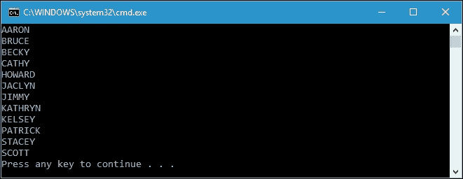

现在，让我们重构前面的查询，使用传统的静态方法。但在我们进行之前，这里是我们在前面的查询中使用的三个方法的签名：

```cs
public static IEnumerable<TSource> Where<TSource>( 
  this IEnumerable<TSource> source, 
  Func<TSource, bool> predicate 
) 

public static IEnumerable<TSource> OrderBy<TSource, TKey>( 
  this IEnumerable<TSource> source, 
  Func<TSource, TKey> keySelector 
) 

public static IEnumerable<TResult> Select<TSource, TResult>( 
  this IEnumerable<TSource> source, 
  Func<TSource, TResult> selector 
) 

```

正如您所看到的，所有三个方法都以 `IEnumerable<TSource>` 作为第一个参数，并且还返回 `IEnumerable<TResult>`。我们可以利用这种相似性，使第一个方法的返回值可以作为第二个方法的参数，第二个方法的返回值可以作为第三个方法的参数，依此类推。

在 `Where()` 方法中，我们使用第二个参数 predicate 来基于它过滤序列。它是一个 `Func<TSource, bool>` 委托，所以我们可以在这里使用 lambda 表达式。在 `OrderBy()` 方法的第二个参数中也可以找到 `Func<TSource, TKey>` 委托，它用作对序列元素进行升序排序的键。它可以由匿名方法提供。最后是 `Select()` 方法，在其中我们使用它的第二个参数 `selector`，将序列中的每个元素投影为新形式。匿名方法也可以作为参数使用。

根据我们在之前的 `UsingExtensionMethod()` 方法中使用的方法的签名，我们可以重构查询如下：

```cs
IEnumerable<string> query = Enumerable.Select(
  Enumerable.OrderBy(Enumerable.Where(names, n => n.Length > 4),
  n => n[0]), n => n.ToUpper());
```

以下是完整的 `UsingStaticMethod()` 方法，这是当我们使用传统的静态方法而不是扩展方法时的重构代码：

```cs
public partial class Program 
{ 
  private static void UsingStaticMethod() 
  { 
    IEnumerable<string> query = 
     Enumerable.Select( 
      Enumerable.OrderBy( 
       Enumerable.Where( 
        names, n => n.Length > 4),  
         n => n[0]), n => n.ToUpper()); 
    foreach (string s in query) 
    { 
      Console.WriteLine(s); 
    } 
  } 
} 

```

通过运行 `UsingStaticMethod()` 方法，我们将在控制台上获得与 `UsingExtensionMethod()` 方法相比完全相同的输出。

## 理解 LINQ 查询表达式语法

LINQ 查询表达式语法是一种简写语法，我们可以使用它执行 LINQ 查询。在查询表达式语法中，.NET Framework 为每个查询操作符提供关键字，但并非所有操作符。通过使用查询语法，我们可以像在数据库中使用 SQL 查询数据一样调用操作符。当我们使用查询表达式语法时，我们的代码将更易读，并且在编写时需要更少的代码。

在流畅语法讨论中，我们创建了一个查询，从包含超过四个字符的字符串列表中提取字符串，按其第一个字母的升序排序，并转换为大写字符。我们可以使用查询表达式语法来执行此操作，如下面的代码所示，我们可以在 `QueryExpressionSyntax.csproj` 项目中找到：

```cs
public partial class Program 
{ 
  private static void InvokingQueryExpression() 
  { 
    IEnumerable<string> query = 
      from n in names 
      where n.Length > 4 
      orderby n[0] 
      select n.ToUpper(); 
    foreach (string s in query) 
    { 
      Console.WriteLine(s); 
    } 
  } 
} 

```

正如你所看到的，我们已经重构了之前的代码，它使用了查询表达式语法的流畅语法。事实上，如果我们运行 `InvokingQueryExpression()` 方法，与 `UsingExtensionMethod()` 方法相比，将显示完全相同的输出。

不幸的是，有几个 LINQ 操作符在查询表达式语法中没有关键字，例如 `distinct` 操作符，因为它不接受 lambda 表达式。在这种情况下，如果我们仍然想使用它，我们必须至少部分使用流畅语法。以下是在查询表达式语法中具有关键字的操作符：

+   `Where`

+   `Select`

+   `SelectMany`

+   `OrderBy`

+   `ThenBy`

+   `OrderByDescending`

+   `ThenByDescending`

+   `GroupBy`

+   `Join`

+   `GroupJoin`

### 提示

实际上，编译器在编译过程中将查询表达式语法转换为流畅语法。虽然查询表达式语法有时更容易阅读，但我们不能使用它执行所有操作；相反，我们必须使用流畅语法，例如我们在 *延迟 LINQ 执行* 主题中讨论的 `count` 操作符。我们在查询表达式语法中编写的内容也可以用流畅语法编写。因此，在使用 LINQ 编码时，特别是在功能方法中，流畅语法是最佳方法。

# 枚举标准查询操作符

在 `System.Linq` 命名空间中包含的 `Enumerable` 类中有 50 多个查询操作符。它们也被称为标准查询操作符。根据操作符的功能，我们可以将它们分为几个操作。在这里，我们将讨论 .NET Framework 提供的所有 LINQ 查询操作符。

## 过滤

过滤是一个操作，它将评估数据的元素，以便只选择满足条件的元素。有六个过滤操作符；它们是 `Where` 、`Take` 、`Skip` 、`TakeWhile` 、`SkipWhile` 和 `Distinct` 。正如我们所知，我们已经在之前的示例代码中讨论了 `Where` 操作符，无论是在流畅语法还是查询表达式语法中，并且知道它将返回满足谓词给定条件的元素子集。由于我们对 `Where` 操作符已经足够清楚，我们可以跳过它，继续使用剩下的五个过滤操作符。

`Take` 操作符返回前 `n` 个元素并丢弃其余的元素。相反，`Skip` 操作符忽略前 `n` 个元素并返回其余的元素。让我们来看一下 `FilteringOperation.csproj` 项目中的以下代码：

```cs
public partial class Program 
{ 
  public static void SimplyTakeAndSkipOperator() 
  { 
    IEnumerable<int> queryTake = 
       intList.Take(10); 
    Console.WriteLine("Take operator"); 
    foreach (int i in queryTake) 
    { 
      Console.Write(String.Format("{0}\t", i)); 
    } 
    Console.WriteLine(); 
    IEnumerable<int> querySkip = intList.Skip(10); 
    Console.WriteLine("Skip operator"); 
    foreach (int i in querySkip) 
    { 
      Console.Write(String.Format("{0}\t", i)); 
    } 
    Console.WriteLine(); 
  } 
} 

```

在上面的代码中，我们有两个查询，`queryTake`应用了`Take`操作符，`querySkip`应用了`Skip`操作符。它们都消耗`intList`，实际上是一个包含以下数据的整数列表：

```cs
public partial class Program 
{ 
static List<int> intList = new List<int> 
  { 
    0,  1,  2,  3,  4, 
    5,  6,  7,  8,  9, 
    10, 11, 12, 13, 14, 
    15, 16, 17, 18, 19 
  }; 
} 

```

如果我们运行前面的`SimplyTakeAndSkipOperator()`方法，将会得到以下输出：


前面的`Take`和`Skip`操作符示例是简单的代码，因为它处理的是一个只包含二十个元素的集合。事实上，当我们处理大量集合或者数据库时，`Take`和`Skip`操作符非常有用，可以方便用户访问数据。假设我们有一个包含一百万个整数的集合，我们要找到其中一个元素，它乘以二和七。如果不使用`Take`和`Skip`操作符，将会得到大量结果，如果在控制台上显示，会使控制台显示混乱。让我们看一下下面的代码来证明这一点：

```cs
public partial class Program 
{ 
  public static void NoTakeSkipOperator() 
  { 
    IEnumerable<int> intCollection = 
       Enumerable.Range(1, 1000000); 
    IEnumerable<int> hugeQuery = 
        intCollection 
      .Where(h => h % 2 == 0 && h % 7 == 0); 
    foreach (int x in hugeQuery) 
    { 
      Console.WriteLine(x); 
    } 
  } 
} 

```

正如你在这里所看到的，我们有一个包含大量数据的`hugeQuery`。如果我们运行该方法，需要大约十秒钟来完成所有元素的迭代。如果我们想要获取`hugeQuery`实际包含的元素，我们也可以添加`Count`操作符，即*71428*个元素。

现在，我们可以通过在`foreach`循环周围添加`Take`和`Skip`操作符来修改代码，如下所示：

```cs
public partial class Program 
{ 
  public static void TakeAndSkipOperator() 
  { 
    IEnumerable<int> intCollection = 
       Enumerable.Range(1, 1000000); 
    IEnumerable<int> hugeQuery = 
       intCollection 
         .Where(h => h % 2 == 0 && h % 7 == 0); 
    int pageSize = 10; 
    for (int i = 0; i < hugeQuery.Count()/ pageSize; i++) 
    { 
      IEnumerable<int> paginationQuery =hugeQuery 
        .Skip(i * pageSize) 
        .Take(pageSize); 
      foreach (int x in paginationQuery) 
      { 
        Console.WriteLine(x); 
      } 
      Console.WriteLine( 
         "Press Enter to continue, " + 
           "other key will stop process!"); 
      if (Console.ReadKey().Key != ConsoleKey.Enter) 
        break; 
    } 
  } 
} 

```

在前面的`TakeAndSkipOperator()`方法中，我们在高亮显示的行中添加了一些代码。现在，尽管我们有很多数据，但当我们运行该方法时，输出将会很方便地显示如下：

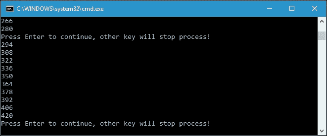

如你所见，整个结果并没有全部显示在控制台上，每次只显示十个整数。用户可以按**Enter**键，如果他们想要继续阅读其余的数据。这通常被称为分页。`Take`和`Skip`操作符已经很好地实现了这一点。

除了讨论`Take`和`Skip`操作符，我们还将讨论过滤操作符中的`TakeWhile`和`SkipWhile`操作符。在`TakeWhile`操作符中，输入集合将被枚举，每个元素将被发送到查询，直到谓词为`false`。相反，在`SkipWhile`中，当输入集合被枚举时，当谓词为`true`时，元素将被发送到查询。现在，让我们看一下下面的代码来演示`TakeWhile`和`SkipWhile`操作符：

```cs
public partial class Program 
{ 
  public static void TakeWhileAndSkipWhileOperators() 
  { 
    int[] intArray = { 10, 4, 27, 53, 2, 96, 48 }; 
    IEnumerable<int> queryTakeWhile = 
       intArray.TakeWhile(n => n < 50); 
    Console.WriteLine("TakeWhile operator"); 
    foreach (int i in queryTakeWhile) 
    { 
      Console.Write(String.Format("{0}\t", i)); 
    } 
    Console.WriteLine(); 
    IEnumerable<int> querySkipWhile = 
       intArray.SkipWhile(n => n < 50); 
    Console.WriteLine("SkipWhile operator"); 
    foreach (int i in querySkipWhile) 
    { 
      Console.Write(String.Format("{0}\t", i)); 
    } 
    Console.WriteLine(); 
  } 
} 

```

当我们运行前面的方法时，将在控制台上得到以下输出：

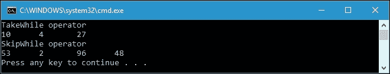

由于在谓词中有`n < 50`，在`TakeWhile`中，枚举将会发出元素，直到达到`53`，而在`SkipWhile`中，当枚举到达`53`时，元素开始被发出。

在这个过滤操作中，我们还有`Distinct`操作符。`Distinct`操作符将返回没有任何重复元素的输入序列。假设我们有以下代码：

```cs
public partial class Program 
{ 
  public static void DistinctOperator() 
  { 
    string words = "TheQuickBrownFoxJumpsOverTheLazyDog"; 
       IEnumerable <char> queryDistinct = words.Distinct(); 
    string distinctWords = ""; 
    foreach (char c in queryDistinct) 
    { 
      distinctWords += c.ToString(); 
    } 
    Console.WriteLine(distinctWords); 
  } 
} 

```

在上面的代码中，我们有一个字符串，我们打算删除该字符串中的所有重复字母。我们使用`Distinct`操作符来获取查询，然后枚举它。结果将如下所示：

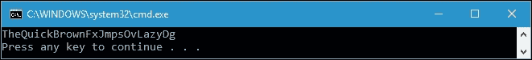

如你所见，由于使用了`Distinct`操作符，一些字母已经消失了。在这种情况下，没有重复的字母出现。

## 投影

投影是将对象转换为新形式的操作。有两个投影操作符，它们是`Select`和`SelectMany`。使用`Select`操作符，我们可以根据给定的 lambda 表达式转换每个输入元素，而使用`SelectMany`操作符，我们可以转换每个输入元素，然后通过连接它们来将结果序列扁平化为一个序列。

当我们讨论延迟执行 LINQ 时，我们应用了`Select`操作符。以下是使用`Select`操作符的代码片段，我们从延迟执行 LINQ 主题的示例中提取出来的：

```cs
IEnumerable<Member> memberQuery = 
  from m in memberList 
  where m.MemberSince.Year > 2014 
  orderby m.Name 
  select m; 

```

正如你所看到的，我们使用了`Select`操作符，这里是`Select`关键字，因为我们使用了查询表达式语法，来选择所有由`Where`关键字过滤的结果元素。正如我们从`Select`操作符中知道的，对象可以被转换成另一种形式，我们可以使用以下代码将以`Member`类对象类型的元素转换为以`RecentMember`类对象类型的元素：

```cs
IEnumerable<RecentMember> memberQuery = 
  from m in memberList 
  where m.MemberSince.Year > 2014 
  orderby m.Name 
  select new RecentMember{ 
    FirstName = m.Name.GetFirstName(), 
    LastName = m.Name.GetLastName(), 
    Gender = m.Gender, 
    MemberSince = m.MemberSince, 
    Status = "Valid" 
}; 

```

使用前面的代码，我们假设有一个名为`RecentMember`的类，如下所示：

```cs
public class RecentMember 
{ 
  public string FirstName { get; set; } 
  public string LastName { get; set; } 
  public string Gender { get; set; } 
  public DateTime MemberSince { get; set; } 
  public string Status { get; set; } 
} 

```

从前面的代码片段中，我们可以看到我们使用`Select`操作符来转换每个输入元素。我们可以将代码片段插入到以下完整的源代码中：

```cs
public partial class Program 
{ 
  public static void SelectOperator() 
  { 
    List<Member> memberList = new List<Member>() 
    { 
      new Member 
      { 
        ID = 1, 
        Name = "Eddie Morgan", 
        Gender = "Male", 
        MemberSince = new DateTime(2016, 2, 10) 
      }, 
      new Member 
      { 
        ID = 2, 
        Name = "Millie Duncan", 
        Gender = "Female", 
        MemberSince = new DateTime(2015, 4, 3) 
      }, 
      new Member 
      { 
        ID = 3, 
        Name = "Thiago Hubbard", 
        Gender = "Male", 
        MemberSince = new DateTime(2014, 1, 8) 
      }, 
      new Member 
      { 
        ID = 4, 
        Name = "Emilia Shaw", 
        Gender = "Female", 
        MemberSince = new DateTime(2015, 11, 15) 
      } 
    }; 
    IEnumerable<RecentMember> memberQuery = 
      from m in memberList 
      where m.MemberSince.Year > 2014 
      orderby m.Name 
      select new RecentMember{ 
        FirstName = m.Name.GetFirstName(), 
        LastName = m.Name.GetLastName(), 
        Gender = m.Gender, 
        MemberSince = m.MemberSince, 
        Status = "Valid" 
      }; 
    foreach (RecentMember rm in memberQuery) 
    { 
      Console.WriteLine( 
         "First Name  : " + rm.FirstName); 
      Console.WriteLine( 
         "Last Name   : " + rm.LastName); 
      Console.WriteLine( 
         "Gender      : " + rm.Gender); 
      Console.WriteLine 
         ("Member Since: " + rm.MemberSince.ToString("dd/MM/yyyy")); 
      Console.WriteLine( 
         "Status      : " + rm.Status); 
      Console.WriteLine(); 
    } 
  } 
} 

```

由于我们已经使用`foreach`迭代器枚举了查询，并使用`Console.WriteLine()`方法将元素写入控制台，在运行前面的`SelectOperator()`方法后，我们将在控制台上得到以下输出：

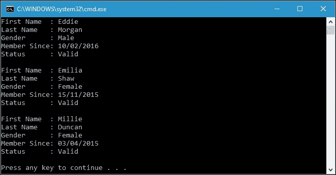

从前面的控制台截图中，我们可以看到我们成功地将`Member`类型的输入元素转换为`RecentMember`类型的输出元素。我们也可以使用流畅语法来产生完全相同的结果，如下面的代码片段所示：

```cs
IEnumerable<RecentMember> memberQuery = 
   memberList 
  .Where(m => m.MemberSince.Year > 2014) 
  .OrderBy(m => m.Name) 
  .Select(m => new RecentMember 
{ 
  FirstName = m.Name.GetFirstName(), 
  LastName = m.Name.GetLastName(), 
  Gender = m.Gender, 
  MemberSince = m.MemberSince, 
  Status = "Valid" 
}); 

```

现在，让我们继续讨论`SelectMany`操作符。使用这个操作符，我们可以选择多个序列，然后将结果展平成一个序列。假设我们有两个集合，我们要选择它们的所有元素；我们可以使用以下代码实现这个目标：

```cs
public partial class Program 
{ 
  public static void SelectManyOperator() 
  { 
    List<string> numberTypes = new List<string>() 
    { 
      "Multiplied by 2", 
      "Multiplied by 3" 
    }; 
    List<int> numbers = new List<int>() 
    { 
      6, 12, 18, 24 
    }; 
    IEnumerable<NumberType> query = 
       numbers.SelectMany( 
          num => numberTypes,  
          (n, t) =>new NumberType 
          { 
            TheNumber = n, 
            TheType = t 
          }); 
    foreach (NumberType nt in query) 
    { 
      Console.WriteLine(String.Format( 
         "Number: {0,2} - Types: {1}", 
           nt.TheNumber, 
             nt.TheType)); 
    } 
  } 
} 

```

正如你所看到的，我们有两个名为`numberTypes`和`numbers`的集合，想要从它们的元素中取出任何可能的组合。结果是以新形式`NumberType`的形式，定义如下：

```cs
public class NumberType 
{ 
  public int TheNumber { get; set; } 
  public string TheType { get; set; } 
} 

```

如果我们运行前面的`SelectManyOperator()`方法，将在控制台上显示以下输出：

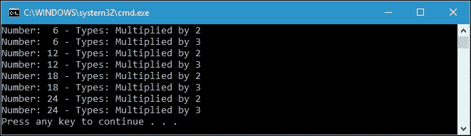

在这段代码中，我们实际上迭代了两个集合，构造了两个集合的组合，因为`SelectMany`操作符的实现如下：

```cs
public static IEnumerable<TResult> SelectMany<TSource, TResult>( 
  this IEnumerable<TSource> source, 
  Func<TSource, IEnumerable<TResult>> selector) 
{ 
  foreach (TSource element in source) 
  foreach (TResult subElement in selector (element)) 
  yield return subElement; 
} 

```

我们还可以应用查询表达式语法来替换前面的流畅语法，使用以下代码片段：

```cs
IEnumerable<NumberType> query = 
  from n in numbers 
  from t in numberTypes 
  select new NumberType 
{ 
  TheNumber = n, 
  TheType = t 
}; 

```

使用查询表达式语法的输出将与流畅语法完全相同。

### 注意

`from`关键字在查询表达式语法中有两个不同的含义。当我们在语法的开头使用关键字时，它将引入原始范围变量和输入序列。当我们在任何位置使用关键字时，它将被转换为`SelectMany`操作符。

## 连接

连接是一种将不具有直接对象模型关系的不同源序列融合成单个输出序列的操作。然而，每个源中的元素都必须共享一个可以进行相等比较的值。在 LINQ 中有两个连接操作符；它们是`Join`和`GroupJoin`。

`Join`操作符使用查找技术来匹配两个序列的元素，然后返回一个扁平的结果集。为了进一步解释这一点，让我们看一下在`Joining.csproj`项目中可以找到的以下代码：

```cs
public partial class Program 
{ 
  public static void JoinOperator() 
  { 
    Course hci = new Course{ 
      Title = "Human Computer Interaction", 
      CreditHours = 3}; 
    Course iis = new Course{ 
      Title = "Information in Society", 
      CreditHours = 2}; 
    Course modr = new Course{ 
      Title = "Management of Digital Records", 
      CreditHours = 3}; 
    Course micd = new Course{ 
      Title = "Moving Image Collection Development", 
      CreditHours = 2}; 
    Student carol = new Student{ 
      Name = "Carol Burks", 
      CourseTaken = modr}; 
    Student river = new Student{ 
      Name = "River Downs", 
      CourseTaken = micd}; 
    Student raylee = new Student{ 
      Name = "Raylee Price", 
      CourseTaken = hci}; 
    Student jordan = new Student{ 
      Name = "Jordan Owen", 
      CourseTaken = modr}; 
    Student denny = new Student{ 
      Name = "Denny Edwards", 
      CourseTaken = hci}; 
    Student hayden = new Student{ 
      Name = "Hayden Winters", 
      CourseTaken = iis}; 
    List<Course> courses = new List<Course>{
      hci, iis, modr, micd};
    List<Student> students = new List<Student>{
      carol, river, raylee, jordan, denny, hayden}; 
    var query = courses.Join( 
      students, 
      course => course, 
      student => student.CourseTaken, 
      (course, student) => 
        new {StudentName = student.Name, 
          CourseTaken = course.Title }); 
    foreach (var item in query) 
    { 
      Console.WriteLine( 
        "{0} - {1}", 
        item.StudentName, 
        item.CourseTaken); 
    } 
  } 
} 

```

前面的代码使用了以下实现的`Student`和`Course`类：

```cs
public class Student 
{ 
  public string Name { get; set; } 
  public Course CourseTaken { get; set; } 
} 
public class Course 
{ 
  public string Title { get; set; } 
  public int CreditHours { get; set; } 
} 

```

如果我们运行前面的`JoinOperator()`方法，我们将在控制台上得到以下输出：

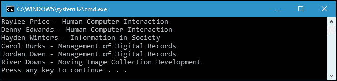

从前面的代码中，我们可以看到我们有两个序列，它们是`courses`和`students`。我们可以使用`Join`操作符连接这两个序列，然后创建一个匿名类型作为结果。我们也可以使用查询表达式语法来连接这两个序列。以下是我们必须在之前的查询创建中替换的代码片段：

```cs
var query = 
from c in courses 
join s in students on c.Title equals s.CourseTaken.Title 
select new { 
  StudentName = s.Name, 
  CourseTaken = c.Title }; 

```

如果我们再次运行`JoinOperator()`方法，我们将在控制台上得到完全相同的输出。

`GroupJoin`操作符使用与`Join`操作符相同的技术，但返回一个分层结果集。让我们看一下下面解释`GroupJoin`操作符的代码：

```cs
public partial class Program 
{ 
  public static void GroupJoinOperator() 
  { 
    Course hci = new Course{ 
      Title = "Human Computer Interaction", 
      CreditHours = 3}; 

    Course iis = new Course{ 
      Title = "Information in Society", 
      CreditHours = 2}; 

    Course modr = new Course{ 
      Title = "Management of Digital Records", 
      CreditHours = 3}; 

    Course micd = new Course{ 
      Title = "Moving Image Collection Development", 
      CreditHours = 2}; 

    Student carol = new Student{ 
      Name = "Carol Burks", 
      CourseTaken = modr}; 

    Student river = new Student{ 
      Name = "River Downs", 
      CourseTaken = micd}; 

    Student raylee = new Student{ 
      Name = "Raylee Price", 
      CourseTaken = hci}; 

    Student jordan = new Student{ 
      Name = "Jordan Owen", 
      CourseTaken = modr}; 

    Student denny = new Student{ 
      Name = "Denny Edwards", 
      CourseTaken = hci}; 

    Student hayden = new Student{ 
      Name = "Hayden Winters", 
      CourseTaken = iis}; 

    List<Course> courses = new List<Course>{ 
      hci, iis, modr, micd}; 

    List<Student> students = new List<Student>{ 
      carol, river, raylee, jordan, denny, hayden}; 

    var query = courses.GroupJoin( 
      students, 
      course => course, 
      student => student.CourseTaken, 
      (course, studentCollection) => 
      new{ 
        CourseTaken = course.Title, 
        Students =  
        studentCollection 
        .Select(student => student.Name) 
      }); 

      foreach (var item in query) 
      { 
        Console.WriteLine("{0}:", item.CourseTaken); 
        foreach (string stdnt in item.Students) 
        { 
          Console.WriteLine("  {0}", stdnt); 
        } 
      } 
    } 
} 

```

前面的代码与我们之前讨论过的 Join 操作符代码类似。不同之处在于我们创建查询的方式。在`GroupJoin`操作符中，我们将两个序列与一个键合并为另一个序列。让我们调用前面的`GroupJoinOperator()`方法，我们将在控制台上得到以下输出：

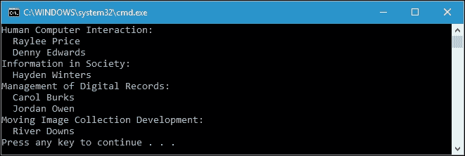

如您在输出中所见，我们对所有选修特定课程的学生进行分组，然后枚举查询以获得结果。

## 排序

排序是一种操作，它将使用默认比较器对输入序列的返回序列进行排序。例如，如果我们有一个字符串类型的序列，那么默认比较器将按字母顺序从 A 到 Z 进行排序。让我们看一下以下代码，可以在`Ordering.csproj`项目中找到：

```cs
public partial class Program 
{ 
  public static void OrderByOperator() 
  { 
    IEnumerable<string> query = 
      nameList.OrderBy(n => n); 

    foreach (string s in query) 
    { 
      Console.WriteLine(s); 
    } 
  } 
} 

```

对于我们必须提供给查询的序列，代码如下：

```cs
public partial class Program 
{ 
  static List<string> nameList = new List<string>() 
  { 
    "Blair", "Lane", "Jessie", "Aiden", 
    "Reggie", "Tanner", "Maddox", "Kerry" 
  }; 
} 

```

如果我们运行前面的`OrderByOperator()`方法，将在控制台上得到以下输出：

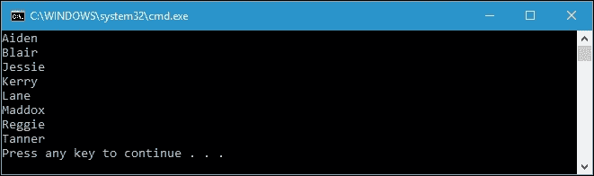

如您所见，我们使用默认比较器执行了排序操作，因此序列按字母顺序排序。我们还可以使用查询表达式语法来替换以下代码片段：

```cs
IEnumerable<string> query = 
  nameList.OrderBy(n => n); 

```

我们对序列的查询表达式语法如下代码片段所示：

```cs
IEnumerable<string> query = 
  from n in nameList 
  orderby n 
  select n; 

```

我们可以创建自己的比较器作为键选择器，通过每个元素的最后一个字符对序列进行排序；以下是我们可以使用`IComparer<T>`接口来实现这一点的代码。假设我们要对先前的序列进行排序：

```cs
public partial class Program 
{ 
  public static void OrderByOperatorWithComparer() 
  { 
    IEnumerable<string> query = 
      nameList.OrderBy( 
       n => n,  
      new LastCharacterComparer()); 
    foreach (string s in query) 
    { 
      Console.WriteLine(s); 
    } 
  } 
} 

```

我们还创建了一个新类`LastCharacterComparer`，它继承了`IComparer<string>`接口，如下所示：

```cs
public class LastCharacterComparer : IComparer<string> 
{ 
  public int Compare(string x, string y) 
  { 
    return string.Compare( 
     x[x.Length - 1].ToString(), 
      y[y.Length - 1].ToString()); 
  } 
} 

```

当我们运行前面的`OrderByOperatorWithComparer()`方法时，将在控制台上得到以下输出：

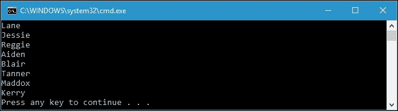

如您所见，我们现在有一个有序的序列，但排序键是每个元素的最后一个字符。这是通过我们自定义的比较器实现的。不幸的是，自定义比较器只能在流畅语法中使用。换句话说，我们不能在查询表达式方法中使用它。

当我们对序列进行排序时，可以有多个比较器作为条件。在调用`OrderBy`方法后，我们可以使用`ThenBy`扩展方法来进行第二个条件的排序。让我们看一下以下代码来演示这一点：

```cs
public partial class Program 
{ 
  public static void OrderByThenByOperator() 
  { 
    IEnumerable<string> query = nameList 
      .OrderBy(n => n.Length) 
      .ThenBy(n => n); 
    foreach (string s in query) 
    { 
      Console.WriteLine(s); 
    } 
  } 
} 

```

从前面的代码中，我们按每个元素的长度对序列进行排序，然后按字母顺序对结果进行排序。如果我们调用`OrderByThenByOperator()`方法，将得到以下输出：

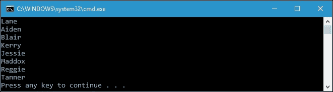

当我们需要使用两个条件对序列进行排序时，也可以使用查询表达式语法，如下面的代码片段所示：

```cs
IEnumerable<string> query = 
  from n in nameList 
  orderby n.Length, n 
  select n; 

```

如果我们在用查询表达式语法替换查询操作后再次运行`OrderByThenByOperator()`方法，我们将得到与使用流畅语法时相同的输出。然而，在查询表达式语法中没有`ThenBy`关键字。我们只需要用逗号分隔条件。

我们也可以在使用`ThenBy`方法时使用自定义比较器。让我们看一下以下代码来尝试这个：

```cs
public partial class Program 
{ 
  public static void OrderByThenByOperatorWithComparer() 
  { 
    IEnumerable<string> query = nameList 
      .OrderBy(n => n.Length) 
      .ThenBy(n => n, new LastCharacterComparer()); 
    foreach (string s in query) 
    { 
      Console.WriteLine(s); 
    } 
  } 
} 

```

在这段代码中，我们使用了与`OrderByOperatorWithComparer()`方法中相同的`LastCharacterComparer`类。如果我们调用`OrderByThenByOperatorWithComparer()`方法，将在控制台上得到以下输出：

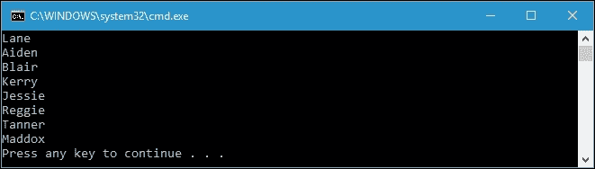

除了升序排序，我们还有降序排序。在流畅语法中，我们可以简单地使用`OrderByDescending()`和`ThenByDescending()`方法。在代码中的使用方式与按升序排序的代码完全相同。然而，在查询表达式语法中，我们有 descending 关键字来实现这个目标。我们在`orderby`关键字中定义条件后，使用这个关键字，如下面的代码所示：

```cs
public partial class Program 
{ 
  public static void OrderByDescendingOperator() 
  { 
    IEnumerable<string> query = 
      from n in nameList 
      orderby n descending 
      select n; 
    foreach (string s in query) 
    { 
      Console.WriteLine(s); 
    } 
  } 
} 

```

如您所见，代码中也有一个 descending 关键字。实际上，我们可以用 ascending 关键字替换 descending 关键字，以按升序对序列进行排序。然而，在 LINQ 中，升序排序是默认排序，因此可以省略 ascending 关键字。如果运行代码并调用`OrderByDescendingOperator()`方法，将得到以下输出：

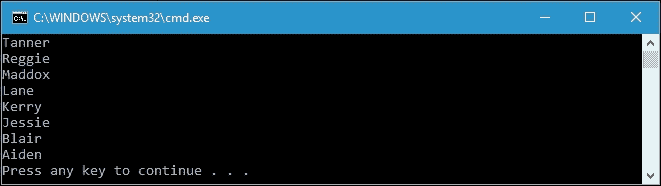

## 分组

分组是一种操作，将生成一系列`IGrouping<TKey, TElement>`对象，这些对象根据`TKey`键值进行分组。例如，我们将按照它们文件名的第一个字母，将一个目录中的路径地址文件序列进行分组。以下代码可以在`Grouping.csproj`项目文件中找到，并将搜索`G:\packages`中的所有文件，这是 Visual Studio 2015 Community Edition 的安装文件。您可以根据计算机上的驱动器号和文件夹名称调整驱动器号和文件夹名称。

```cs
public partial class Program 
{ 
  public static void GroupingByFileNameExtension() 
  { 
    IEnumerable<string> fileList =  
      Directory.EnumerateFiles( 
        @"G:\packages", "*.*",  
        SearchOption.AllDirectories); 
    IEnumerable<IGrouping<string, string>> query = 
      fileList.GroupBy(f => 
      Path.GetFileName(f)[0].ToString()); 
    foreach (IGrouping<string, string> g in query) 
    { 
      Console.WriteLine(); 
      Console.WriteLine( 
         "File start with the letter: " +  
           g.Key); 
      foreach (string filename in g) 
      Console.WriteLine( 
         "..." + Path.GetFileName(filename)); 
     } 
  } 
} 

```

前面的代码将在`G:\packages`文件夹中（包括所有子目录）找到所有文件，然后根据它们文件名的第一个字母进行分组。如您所见，当我们使用`foreach`循环枚举查询时，我们有`g.Key`，它是用于对字符串列表进行分组的键选择器。如果运行`GroupingByFileNameExtension()`方法，将在控制台上得到以下输出：


`GroupBy`扩展方法还有一个子句，可以在查询表达式语法中使用。我们可以使用的子句是`group`和`by`。以下代码片段可以替换我们先前代码中的查询：

```cs
IEnumerable<IGrouping<string, string>> query = 
  from f in fileList 
  group f by Path.GetFileName(f)[0].ToString(); 

```

我们仍然会得到与流畅语法输出相同的输出，尽管我们使用查询表达式语法替换了查询。如您所见，LINQ 中的分组操作只对序列进行分组，而不进行排序。我们可以使用 LINQ 提供的`OrderBy`操作符对结果进行排序。

在前面的查询表达式语法中，我们看到由于 group 子句也会结束查询，因此我们不需要再次使用 select 子句。然而，当使用 group 子句并添加查询继续子句时，我们仍然需要 select 子句。现在让我们看一下以下代码，它应用了查询继续子句来对序列进行排序：

```cs
public partial class Program 
{ 
  public static void GroupingByInto() 
  { 
    IEnumerable<string> fileList = 
      Directory.EnumerateFiles( 
        @"G:\packages", "*.*", 
        SearchOption.AllDirectories); 
    IEnumerable<IGrouping<string, string>> query = 
      from f in fileList 
      group f  
        by Path.GetFileName(f)[0].ToString() 
        into g 
      orderby g.Key 
      select g; 
    foreach (IGrouping<string, string> g in query) 
    { 
      Console.WriteLine( 
        "File start with the letter: " + g.Key); 
      //foreach (string filename in g) 
      Console.WriteLine(           "..." + Path.GetFileName(filename)); 
    } 
  } 
} 

```

如前面的代码所示，我们通过添加查询继续子句和`orderby`操作符来修改查询，以对序列结果进行排序。我们使用的查询继续子句是`into`关键字。使用`into`关键字，我们存储分组结果，然后再次操作分组。如果运行前面的代码，将在控制台上得到以下输出：

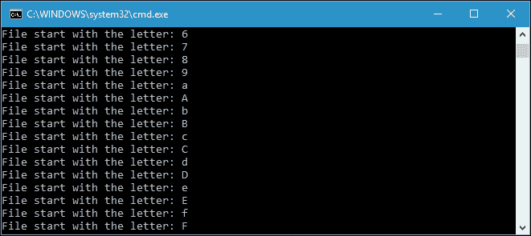

我们故意删除了每个组的元素，因为我们现在要检查的是键本身。现在我们可以看到键是按升序排列的。这是因为我们首先存储了分组的结果，然后按升序对键进行排序。

## 集合操作

集合操作是一种基于相同或不同集合中等价元素的存在或不存在而返回结果集的操作。LINQ 提供了四种集合操作符，它们是`Concat`，`Union`，`Intersect`和`Except`。对于这四种集合操作符，都没有查询表达式关键字。

让我们从`Concat`和`Union`开始。使用`Concat`运算符，我们将得到第一个序列的所有元素，然后是第二个序列的所有元素。`Union`使用`Concat`运算符执行此操作，但对于重复的元素只返回一个元素。以下代码在`SetOperation.csproj`项目中可以找到，演示了`Concat`和`Union`之间的区别：

```cs
public partial class Program 
{ 
  public static void ConcatUnionOperator() 
  { 
    IEnumerable<int> concat = sequence1.Concat(sequence2); 
    IEnumerable<int> union = sequence1.Union(sequence2); 
    Console.WriteLine("Concat"); 
    foreach (int i in concat) 
    { 
      Console.Write(".." + i); 
    } 
    Console.WriteLine(); 
    Console.WriteLine(); 
    Console.WriteLine("Union"); 
    foreach (int i in union) 
    { 
      Console.Write(".." + i); 
    } 
    Console.WriteLine(); 
    Console.WriteLine(); 
  } 
} 

```

我们有两个序列如下：

```cs
public partial class Program 
{ 
  static int[] sequence1 = { 1, 2, 3, 4, 5, 6 }; 
  static int[] sequence2 = { 3, 4, 5, 6, 7, 8 }; 
} 

```

我们之前的代码尝试使用`Concat`和`Union`运算符。根据我们的讨论，如果我们运行`ConcatUnionOperator()`方法，将得到以下输出：

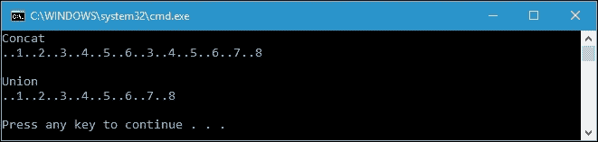

`Intersect`和`Except`也是集合运算符。`Intersect`返回两个输入序列中都存在的元素。`Except`返回第一个输入序列中不在第二个序列中的元素。以下代码解释了`Intersect`和`Except`之间的区别：

```cs
public partial class Program 
{ 
  public static void IntersectExceptOperator() 
  { 
    IEnumerable<int> intersect = sequence1.Intersect(sequence2); 
    IEnumerable<int> except1 = sequence1.Except(sequence2); 
    IEnumerable<int> except2 = sequence2.Except(sequence1); 
    Console.WriteLine("Intersect of Sequence"); 
    foreach (int i in intersect) 
    { 
      Console.Write(".." + i); 
    } 
    Console.WriteLine(); 
    Console.WriteLine(); 
    Console.WriteLine("Except1"); 
    foreach (int i in except1) 
    { 
      Console.Write(".." + i); 
    } 
    Console.WriteLine(); 
    Console.WriteLine(); 
    Console.WriteLine("Except2"); 
    foreach (int i in except2) 
    { 
      Console.Write(".." + i); 
    } 
    Console.WriteLine(); 
    Console.WriteLine(); 
  } 
} 

```

如果我们调用`IntersectExceptOperator()`方法，将在控制台屏幕上显示以下输出：


我们将之前在`ConcatUnionOperator()`方法中使用的两个序列作为输入。从上述控制台截图中可以看出，在`Intersect`操作中，只返回重复的元素。在`Except`操作中，只返回唯一的元素。

## 转换方法

转换方法的主要作用是将一种类型的集合转换为其他类型的集合。在这里，我们将讨论 LINQ 提供的转换方法；它们是`OfType`、`Cast`、`ToArray`、`ToList`、`ToDictionary`和`ToLookup`。

`OfType`和`Cast`方法具有类似的功能；它们将`IEnumerable`转换为`IEnumerable<T>`。不同之处在于，`OfType`将丢弃错误类型的元素（如果有的话），而`Cast`将在存在错误类型元素时抛出异常。让我们来看一下以下代码，在`ConversionMethods.csproj`项目中可以找到：

```cs
public partial class Program 
{ 
  public static void OfTypeCastSimple() 
  { 
    ArrayList arrayList = new ArrayList(); 
    arrayList.AddRange(new int[] { 1, 2, 3, 4, 5 }); 

    IEnumerable<int> sequenceOfType = arrayList.OfType<int>(); 
    IEnumerable<int> sequenceCast = arrayList.Cast<int>(); 

    Console.WriteLine( 
      "OfType of arrayList"); 
    foreach (int i in sequenceOfType) 
    { 
      Console.Write(".." + i); 
    } 
    Console.WriteLine(); 
    Console.WriteLine(); 

    Console.WriteLine( 
      "Cast of arrayList"); 
    foreach (int i in sequenceCast) 
    { 
      Console.Write(".." + i); 
    } 
    Console.WriteLine(); 
    Console.WriteLine(); 
  } 
} 

```

上述代码是使用`OfType`和`Cast`转换的一个简单示例。我们有一个只包含`int`元素的数组。实际上，它们可以很容易地转换。如果我们运行`OfTypeCastSimple()`方法，将得到以下输出：

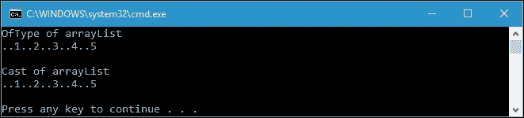

### 注意

在.NET Core 中，`ArrayList`的定义位于`System.Collections.NonGeneric.dll`中。因此，我们必须在[`www.nuget.org/packages/System.Collections.NonGeneric/`](https://www.nuget.org/packages/System.Collections.NonGeneric/)上下载 NuGet 包。

现在让我们向上述代码添加几行代码。代码现在将如下所示：

```cs
public partial class Program 
{ 
  public static void OfTypeCastComplex() 
  { 
    ArrayList arrayList = new ArrayList(); 
    arrayList.AddRange( 
      new int[] { 1, 2, 3, 4, 5 }); 

    arrayList.AddRange( 
       new string[] {"Cooper", "Shawna", "Max"}); 
    IEnumerable<int> sequenceOfType = 
       arrayList.OfType<int>(); 
    IEnumerable<int> sequenceCast = 
       arrayList.Cast<int>(); 

    Console.WriteLine( 
      "OfType of arrayList"); 
    foreach (int i in sequenceOfType) 
    { 
      Console.Write(".." + i); 
    } 
    Console.WriteLine(); 
    Console.WriteLine(); 

    Console.WriteLine( 
       "Cast of arrayList"); 
    foreach (int i in sequenceCast) 
    { 
      Console.Write(".." + i); 
    } 
    Console.WriteLine(); 
    Console.WriteLine(); 
  } 
} 

```

从上述代码中，我们可以看到，我们将方法名称更改为`OfTypeCastComplex`，并插入了将字符串元素添加到`arrayList`的代码。如果我们运行该方法，`OfType`转换将成功运行并仅返回`int`元素，而`Cast`转换将抛出异常，因为输入序列中有一些字符串元素。

其他的转换方法包括`ToArray()`和`ToList()`。它们之间的区别在于，`ToArray()`将序列转换为数组，而`ToList()`将转换为通用列表。此外，还有`ToDictionary()`和`ToLookup()`方法可用于转换。`ToDictionary()`将根据指定的键选择器函数从序列中创建`Dictionary<TKey, TValue>`，而`ToLookup()`将根据指定的键选择器和元素选择器函数从序列中创建`Lookup<TKey, TElement>`。

## 元素操作

元素操作是根据它们的索引或使用谓词从序列中提取单个元素的操作。LINQ 中存在几个元素运算符；它们是`First`，`FirstOrDefault`，`Last`，`Single`，`SingleOrDefault`，`ElementAt`和`DefaultIfEmpty`。让我们使用示例代码来了解所有这些元素运算符的功能。

以下是演示元素运算符的代码，我们可以在`ElementOperation.csproj`项目中找到：

```cs
public partial class Program 
{ 
  public static void FirstLastOperator() 
  { 
    Console.WriteLine( 
      "First Operator: {0}", 
      numbers.First()); 
    Console.WriteLine( 
      "First Operator with predicate: {0}", 
      numbers.First(n => n % 3 == 0)); 
    Console.WriteLine( 
      "Last Operator: {0}", 
      numbers.Last()); 
    Console.WriteLine( 
      "Last Operator with predicate: {0}", 
      numbers.Last(n => n % 4 == 0)); 
  } 
} 

```

前面的代码演示了`First`和`Last`运算符的使用。数字数组如下：

```cs
public partial class Program 
{ 
  public static int[] numbers = { 
    1, 2, 3, 
    4, 5, 6, 
    7, 8, 9 
  }; 
} 

```

在我们进一步进行之前，让我们花一点时间看一下如果运行`FirstLastOperator()`方法，控制台上的以下输出：


从输出中，我们可以发现`First`运算符将返回序列的第一个元素，而`Last`运算符将返回最后一个元素。我们还可以使用 lambda 表达式来过滤序列的`First`和`Last`运算符。在前面的示例中，我们过滤了只能被四整除的数字序列。

不幸的是，`First`和`Last`运算符不能返回空值；相反，它们会抛出异常。让我们检查以下代码，关于使用`First`运算符，它将返回一个空序列：

```cs
public partial class Program 
{ 
  public static void FirstOrDefaultOperator() 
  { 
    Console.WriteLine( 
      "First Operator with predicate: {0}", 
      numbers.First(n => n % 10 == 0)); 
    Console.WriteLine( 
      "First Operator with predicate: {0}", 
      numbers.FirstOrDefault(n => n % 10 == 0)); 
  } 
} 

```

如果我们取消注释前面代码中的所有注释代码行，由于没有可以被`10`整除的数字，该方法将抛出异常。为了解决这个问题，我们可以使用`FirstOrDefault`运算符，它将返回默认值，因为数字是整数序列。因此，它将返回整数的默认值，即`0`。

我们还有`Single`和`SingleOrDefault`作为元素运算符，我们可以看一下它们在以下代码中的使用：

```cs
public partial class Program 
{ 
  public static void SingleOperator() 
  { 
    Console.WriteLine( 
      "Single Operator for number can be divided by 7: {0}", 
      numbers.Single(n => n % 7 == 0)); 
    Console.WriteLine( 
      "Single Operator for number can be divided by 2: {0}", 
      numbers.Single(n => n % 2 == 0)); 

    Console.WriteLine( 
      "SingleOrDefault Operator: {0}", 
      numbers.SingleOrDefault(n => n % 10 == 0)); 

    Console.WriteLine( 
      "SingleOrDefault Operator: {0}", 
      numbers.SingleOrDefault(n => n % 3 == 0)); 
  } 
} 

```

如果我们运行前面的代码，由于以下代码片段，将会抛出异常：

```cs
Console.WriteLine( 
  "Single Operator for number can be divided by 2: {0}", 
  numbers.Single(n => n % 2 == 0)); 

```

此外，以下代码片段会导致错误：

```cs
Console.WriteLine( 
  "SingleOrDefault Operator: {0}", 
  numbers.SingleOrDefault(n => n % 3 == 0)); 

```

错误发生是因为`Single`运算符只能有一个匹配的元素。在第一个代码片段中，我们得到了`2`，`4`，`6`和`8`作为结果。在第二个代码片段中，我们得到了`3`，`6`和`9`作为结果。

`Element`操作还有`ElementAt`和`ElementAtOrDefault`运算符，用于从序列中获取第 n 个元素。让我们看一下以下代码，演示这些运算符的使用：

```cs
public partial class Program 
{ 
  public static void ElementAtOperator() 
  { 
    Console.WriteLine( 
      "ElementAt Operator: {0}", 
      numbers.ElementAt(5)); 

    //Console.WriteLine( 
      //"ElementAt Operator: {0}", 
      //numbers.ElementAt(11)); 

    Console.WriteLine( 
      "ElementAtOrDefault Operator: {0}", 
      numbers.ElementAtOrDefault(11)); 
  } 
} 

```

与`First`和`Last`运算符一样，`ElementAt`也必须返回值。在前面的代码中，注释的代码行将抛出异常，因为在索引`11`中没有元素。但是，我们可以使用`ElementAtOrDefault`来解决这个问题，然后注释的行将返回`int`的默认值。

元素操作中的最后一个是`DefaultIfEmpty`运算符，如果在输入序列中找不到元素，它将返回序列中的默认值。以下代码将演示`DefaultIfEmpty`运算符：

```cs
public partial class Program 
{ 
  public static void DefaultIfEmptyOperator() 
  { 
    List<int> numbers = new List<int>(); 

    //Console.WriteLine( 
      //"DefaultIfEmpty Operator: {0}", 
      //numbers.DefaultIfEmpty()); 

    foreach (int number in numbers.DefaultIfEmpty()) 
    { 
      Console.WriteLine( 
        "DefaultIfEmpty Operator: {0}", number); 
    } 
  } 
} 

```

由于`DefaultIfEmpty`运算符的返回值是`IEnumerable<T>`，我们必须对其进行枚举，即使它只包含一个元素。正如您在前面的代码中所看到的，我们注释了对 numbers 变量的直接访问，因为它将返回变量的类型，而不是变量的值。相反，我们必须枚举 numbers 查询，以获取存储在`IEnumerable<T>`变量中的唯一值。

# 总结

LINQ 使我们查询集合的任务变得更容易，因为我们不需要学习太多语法来访问不同类型的集合。它实现了延迟执行的概念，这意味着查询不会在构造函数中执行，而是在枚举过程中执行。几乎所有查询运算符都提供了延迟执行的概念；但是，对于执行以下操作的运算符，存在例外情况：

返回标量值或单个元素，例如`Count`和`First`。

将查询的结果转换为`ToList`，`ToArray`，`ToDictionary`和`ToLookup`。它们也被称为转换操作符。

换句话说，返回序列的方法实现了延迟执行，例如`Select`方法`(IEnumerable<X>-> Select -> IEnumerable<Y>)`，而返回单个对象的方法不实现延迟执行，例如`First`方法`(IEnumerable<X>-> First -> Y)`。

LINQ 有两种查询语法；它们是流畅语法和查询表达式语法。前者采用 lambda 表达式作为参数，表示将在序列枚举中执行的逻辑。后者是一种简写语法，我们可以使用它来执行 LINQ 查询。在查询表达式语法中，.NET Framework 为每个查询操作符提供关键字，但并非所有操作符。当我们使用查询表达式语法时，我们的代码将更易读，编码量也会减少。然而，流畅语法和查询语法都会做同样的事情。它们之间的区别只在于语法。查询表达式语法中的每个关键字都在`Enumerable`类中有自己的扩展方法。

通过理解 LINQ，我们现在已经有足够的知识来创建函数式编程。在下一章中，我们将讨论异步编程，以增强代码的响应性，从而构建用户友好的应用程序。
