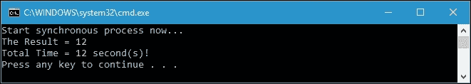
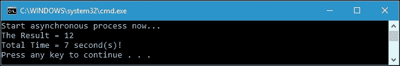
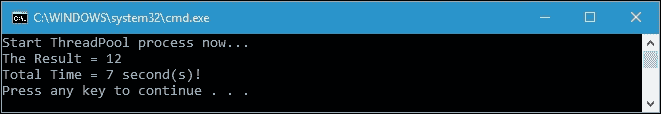
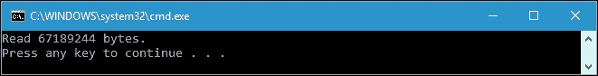
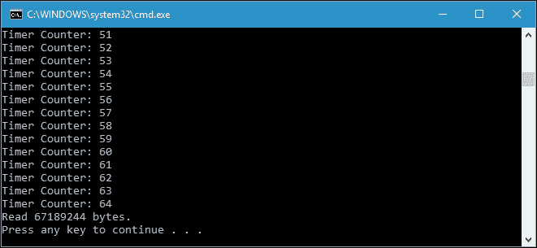
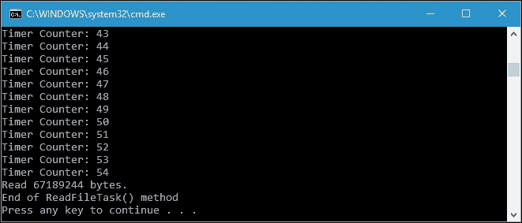
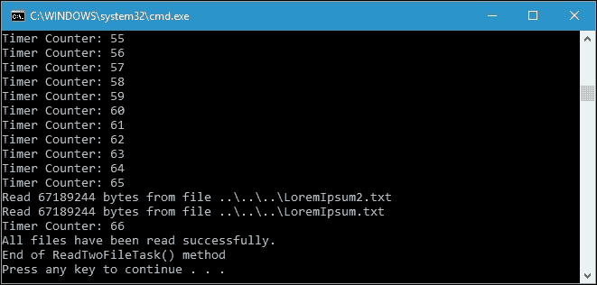
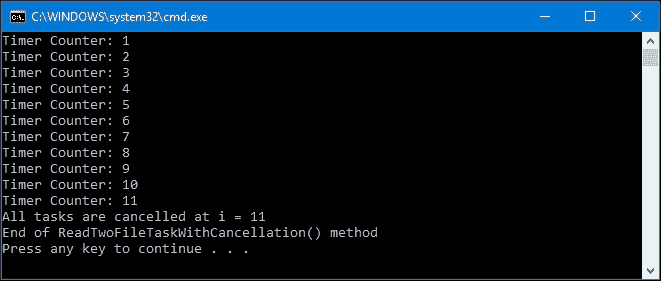

# 第六章：使用异步编程增强功能程序的响应性

响应式应用程序在今天的编程方法中是必不可少的。它们可以提高应用程序本身的性能，并使我们的应用程序具有用户友好的界面。我们需要在程序中异步运行代码执行过程，以实现响应式应用程序。为了实现这一目标，在本章中，我们将讨论以下主题：

+   使用线程和线程池构建响应式应用程序

+   学习异步编程模型模式

+   学习基于任务的异步模式

+   使用 async 和 await 关键字构建异步编程

+   在功能方法中应用异步方法

# 构建响应式应用程序

.NET Framework 首次发布时，程序的流程是按顺序执行的。这种执行流程的缺点是我们的应用程序必须等待操作完成才能执行下一个操作。这将冻结我们的应用程序，这将是一个不愉快的用户体验。

为了最小化这个问题，.NET Framework 引入了线程，这是操作的最小单位，可以由操作系统独立调度。而异步编程意味着在单独的线程上运行一段代码，释放原始线程并在任务完成时做其他事情。

## 同步运行程序

让我们从创建一个运行所有操作的程序开始同步运行。以下是演示我们可以在`SynchronousOperation.csproj`项目中找到的同步操作的代码：

```cs
public partial class Program 
{ 
  public static void SynchronousProcess() 
  { 
    Stopwatch sw = Stopwatch.StartNew(); 
    Console.WriteLine( 
      "Start synchronous process now..."); 
    int iResult = RunSynchronousProcess(); 
    Console.WriteLine( 
      "The Result = {0}",iResult); 
    Console.WriteLine( 
      "Total Time = {0} second(s)!", 
      sw.ElapsedMilliseconds/1000); 
  } 
  public static int RunSynchronousProcess() 
  { 
    int iReturn = 0; 
    iReturn += LongProcess1(); 
    iReturn += LongProcess2(); 
    return iReturn; 
  } 
  public static int LongProcess1() 
  { 
    Thread.Sleep(5000); 
    return 5; 
  } 
  public static int LongProcess2() 
  { 
    Thread.Sleep(7000); 
    return 7; 
  } 
} 

```

如前面的代码所示，`RunSynchronousProcess()`方法执行两种方法；它们是`LongProcess1()`和`LongProcess2()`方法。现在让我们调用前面的`RunSynchronousProcess()`方法，我们将在控制台上得到以下输出：



这两种方法，`LongProcess1()`和`LongProcess2()`，是独立的，每种方法都需要一定的时间来完成。由于它是同步执行的，完成这两种方法需要 12 秒。`LongProcess1()`方法需要 5 秒完成，`LongProcess2()`方法需要 7 秒完成。

## 在程序中应用线程

我们可以改进先前的代码，使其成为响应式程序，通过重构一些代码并向代码添加线程。重构后的代码如下，在`ApplyingThreads.csproj`项目中可以找到：

```cs
public partial class Program 
{ 
  public static void AsynchronousProcess() 
  { 
    Stopwatch sw = Stopwatch.StartNew(); 
    Console.WriteLine( 
      "Start asynchronous process now..."); 
    int iResult = RunAsynchronousProcess(); 
    Console.WriteLine( 
      "The Result = {0}", 
      iResult); 
    Console.WriteLine( 
      "Total Time = {0} second(s)!", 
      sw.ElapsedMilliseconds / 1000); 
  } 
  public static int RunAsynchronousProcess() 
  { 
    int iResult1 = 0; 
    // Creating thread for LongProcess1() 
    Thread thread = new Thread( 
      () => iResult1 = LongProcess1()); 
    // Starting the thread 
    thread.Start(); 
    // Running LongProcess2() 
    int iResult2 = LongProcess2(); 
    // Waiting for the thread to finish 
    thread.Join(); 
    // Return the the total result 
    return iResult1 + iResult2; 
  } 
  public static int LongProcess1() 
  { 
    Thread.Sleep(5000); 
    return 5; 
  } 
  public static int LongProcess2() 
  { 
    Thread.Sleep(7000); 
    return 7; 
  } 
} 

```

如我们所见，我们将先前的代码中的`RunSynchronousProcess()`方法重构为`RunAsynchronousProcess()`方法。如果我们运行`RunAsynchronousProcess()`方法，我们将在控制台上得到以下输出：



与`RunSynchronousProcess()`方法相比，我们现在在`RunAsynchronousProcess()`方法中有一个更快的进程。我们创建一个新的线程来运行`LongProcess1()`方法。线程将在使用`Start()`方法启动之后才会运行。看一下以下代码片段，其中我们创建并运行线程：

```cs
// Creating thread for LongProcess1() 
Thread thread = new Thread( 
  () => 
  iResult1 = LongProcess1()); 
// Starting the thread 
thread.Start(); 

```

线程运行后，我们可以运行其他操作，这种情况下是`LongProcess2()`方法。当此操作完成时，我们必须等待线程完成，然后使用线程实例的`Join()`方法。以下代码片段将解释这一点：

```cs
// Running LongProcess2() 
int iResult2 = LongProcess2(); 
// Waiting for the thread to finish 
thread.Join(); 

```

`Join()`方法将阻塞当前线程，直到正在执行的其他线程完成。在其他线程完成后，`Join()`方法将返回，然后当前线程将被解除阻塞。

## 使用线程池创建线程

除了使用线程本身，我们还可以使用`System.Threading.ThreadPool`类预先创建一些线程。如果需要从线程池中使用线程，我们可以使用这个类。在使用线程池时，您更有可能只使用`QueueUserWorkItem()`方法。该方法将向线程池队列中添加执行请求。如果线程池中有可用线程，请求将立即执行。让我们看一下以下代码，以演示线程池的使用，可以在`UsingThreadPool.csproj`项目中找到：

```cs
public partial class Program 
{ 
  public static void ThreadPoolProcess() 
  { 
    Stopwatch sw = Stopwatch.StartNew(); 
    Console.WriteLine( 
      "Start ThreadPool process now..."); 
    int iResult = RunInThreadPool(); 
    Console.WriteLine("The Result = {0}", 
      iResult); 
    Console.WriteLine("Total Time = {0} second(s)!", 
      sw.ElapsedMilliseconds / 1000); 
  } 
  public static int RunInThreadPool() 
  { 
    int iResult1 = 0; 
    // Assignin work LongProcess1() to idle thread  
    // in the thread pool  
    ThreadPool.QueueUserWorkItem((t) => 
      iResult1 = LongProcess1()); 
    // Running LongProcess2() 
    int iResult2 = LongProcess2(); 
    // Waiting the thread to be finished 
    // then returning the result 
    return iResult1 + iResult2; 
  } 
    public static int LongProcess1() 
  { 
    Thread.Sleep(5000); 
    return 5; 
  } 
  public static int LongProcess2() 
  { 
    Thread.Sleep(7000); 
    return 7; 
  } 
} 

```

在线程池中，我们可以调用`QueueUserWorkItem()`方法将新的工作项放入队列中，当我们需要运行长时间运行的进程而不是创建新线程时，线程池会管理该队列。当我们将工作发送到线程池时，有三种可能性来处理工作；它们如下：

+   线程池中有一个或多个可用线程在空闲，因此工作可以由空闲线程处理并立即运行。

+   没有可用的线程，但`MaxThreads`属性尚未达到，因此线程池将创建一个新线程，分配工作，并立即运行工作。

+   线程池中没有可用线程，并且线程池中的线程总数已达到`MaxThreads`。在这种情况下，工作项将在队列中等待第一个可用线程。

现在，让我们运行`ThreadPoolProcess()`方法，我们将在控制台上得到以下输出：



正如我们在前面的截图中所看到的，当我们应用前面部分讨论的新线程时，我们得到了相似的处理时间相同的结果。

# 异步编程模型模式

**异步编程模型**（**APM**）是一种使用`IAsyncResult`接口作为设计模式的异步操作。它也被称为`IAsyncResult`模式。为此，框架提供了名为`BeginXx`和`EndXx`的方法，其中`Xx`是操作名称，例如，`FileStream`类提供的`BeginRead`和`EndRead`用于异步从文件中读取字节。

同步的`Read()`方法与`BeginRead()`和`EndRead()`的区别可以从方法的声明中识别，如下所示：

```cs
public int Read( 
  byte[] array, 
  int offset, 
  int count 
) 
public IAsyncResult BeginRead( 
  byte[] array, 
  int offset, 
  int numBytes, 
  AsyncCallback userCallback, 
  object stateObject 
) 
public int EndRead( 
  IAsyncResult asyncResult 
) 

```

在同步的`Read()`方法中，我们需要三个参数；它们是`array`，`offset`和`numBytes`。在`BeginRead()`方法中，还有两个参数添加；它们是`userCallback`，即在异步读取操作完成时将被调用的方法，以及`stateObject`，用户提供的用于区分异步读取请求和其他请求的对象。

## 使用同步的 Read()方法

现在，让我们看一下以下代码，在`APM.csproj`项目中可以找到，以便更清楚地区分异步的`BeginRead()`方法和同步的`Read()`方法：

```cs
public partial class Program 
{ 
  public static void ReadFile() 
  { 
    FileStream fs = 
      File.OpenRead( 
        @"..\..\..\LoremIpsum.txt"); 
    byte[] buffer = new byte[fs.Length]; 
    int totalBytes = 
      fs.Read(buffer, 0, (int)fs.Length); 
    Console.WriteLine("Read {0} bytes.", totalBytes); 
    fs.Dispose(); 
  } 
} 

```

上述代码将同步读取`LoremIpsum.txt`文件（包含在`APM.csproj`项目中），这意味着在执行下一个进程之前，读取过程必须完成。如果我们运行上述的`ReadFile()`方法，我们将在控制台上得到以下输出：



## 使用 BeginRead()和 EndRead()方法

现在，让我们比较使用`Read()`方法进行同步读取过程与使用`BeginRead()`和`EndRead()`方法进行异步读取过程的以下代码：

```cs
public partial class Program 
{ 
  public static void ReadAsyncFile() 
  { 
    FileStream fs =  
      File.OpenRead( 
        @"..\..\..\LoremIpsum.txt"); 
    byte[] buffer = new byte[fs.Length]; 
    IAsyncResult result = fs.BeginRead(buffer, 0, (int)fs.Length,
      OnReadComplete, fs); 
    //do other work while file is read 
    int i = 0; 
    do 
    { 
      Console.WriteLine("Timer Counter: {0}", ++i); 
    } 
    while (!result.IsCompleted); 
    fs.Dispose(); 
  } 
  private static void OnReadComplete(IAsyncResult result) 
  { 
    FileStream fStream = (FileStream)result.AsyncState;
    int totalBytes = fStream.EndRead(result);
    Console.WriteLine("Read {0} bytes.", totalBytes);fStream.Dispose(); 
  } 
} 

```

如我们所见，我们有两个名为`ReadAsyncFile()`和`OnReadComplete()`的方法。`ReadAsyncFile()`方法将异步读取`LoremIpsum.txt`文件，然后在完成文件读取后立即调用`OnReadComplete()`方法。我们有额外的代码来确保使用以下`do-while`循环代码片段正确运行异步操作：

```cs
//do other work while file is read 
int i = 0; 
do 
{ 
  Console.WriteLine("Timer Counter: {0}", ++i); 
} 
while (!result.IsCompleted); 

```

上述`do-while`循环将迭代，直到异步操作完成，如`IAsyncResult`的`IsComplete`属性所示。当调用`BeginRead()`方法时，异步操作开始，如下面的代码片段所示：

```cs
IAsyncResult result = 
  fs.BeginRead( 
    buffer, 0, (int)fs.Length, OnReadComplete, fs); 

```

之后，它将在读取文件的同时继续下一个过程。当读取过程完成时，将调用`OnReadComplete()`方法，由于`OnReadComplete()`方法的实现将`IsFinish`变量设置为 true，它将停止我们的`do-while`循环。

通过运行`ReadAsyncFile()`方法，我们将得到以下输出：



从上述输出的截图中，我们可以看到在运行读取过程时，`do-while`循环的迭代成功执行。读取过程在`do-while`循环的第 64 次迭代中完成。

## 在 BeginRead()方法调用中添加 LINQ

我们还可以使用 LINQ 来定义`OnReadComplete()`方法，以便我们可以使用匿名方法替换该方法，如下所示：

```cs
public partial class Program 
{ 
  public static void ReadAsyncFileAnonymousMethod() 
  { 
    FileStream fs = 
      File.OpenRead( 
        @"..\..\..\LoremIpsum.txt"); 
    byte[] buffer = new byte[fs.Length]; 
    IAsyncResult result = fs.BeginRead(buffer, 0, (int)fs.Length,
      asyncResult => { int totalBytes = fs.EndRead(asyncResult); 
    Console.WriteLine("Read {0} bytes.", totalBytes); 
      }, null); 
    //do other work while file is read 
    int i = 0; 
    do 
    { 
      Console.WriteLine("Timer Counter: {0}", ++i); 
    } 
    while (!result.IsCompleted); 
    fs.Dispose(); 
  } 
} 

```

如我们所见，我们用以下代码片段替换了对`BeginRead()`方法的调用：

```cs
IAsyncResult result = 
  fs.BeginRead( 
    buffer, 
    0, 
    (int)fs.Length, 
    asyncResult => 
    { 
      int totalBytes = 
        fs.EndRead(asyncResult); 
      Console.WriteLine("Read {0} bytes.", totalBytes); 
    }, 
  null); 

```

从上述代码中，我们可以看到我们不再有`OnReadComplete()`方法，因为它已被匿名方法代替。我们在回调中删除了`FileStream`实例，因为 lambda 中的匿名方法将使用闭包访问它。如果我们调用`ReadAsyncFileAnonymousMethod()`方法，我们将得到与`ReadAsyncFile()`方法完全相同的输出，除了迭代次数，因为它取决于 CPU 速度。

除了`IsCompleted`属性用于获取指示异步操作是否完成的值外，处理`IAsyncResult`时还有三个属性可用，它们如下：

+   `AsyncState`：用于检索由用户定义的对象，该对象限定或包含有关异步操作的信息

+   `AsyncWaitHandle`：用于检索`WaitHandle`（来自操作系统的等待对共享资源的独占访问的对象），指示异步操作的完成情况

+   `CompletedSynchronously`：用于检索指示异步操作是否同步完成的值

不幸的是，应用 APM 时存在一些缺点，例如无法取消操作。这意味着我们无法取消异步操作，因为从调用`BeginRead`到触发回调时，没有办法取消后台进程。如果`LoremIpsum.txt`是一个千兆字节的文件，我们必须等待异步操作完成，而不能取消操作。

### 注意

由于其过时的技术，不再建议在新开发中使用 APM 模式。

# 基于任务的异步模式

基于任务的异步模式（TAP）是一种用于表示任意异步操作的模式。这种模式的概念是在一个方法中表示异步操作，并结合操作的状态和用于与这些操作交互的 API，使它们成为一个单一对象。这些对象是`System.Threading.Tasks`命名空间中的`Task`和`Task<TResult>`类型。

## 介绍 Task 和 Task<TResult>类

`.NET Framework 4.0`中宣布了`Task`和`Task<TResult>`类，以表示异步操作。它使用存储在线程池中的线程，但提供了任务创建的灵活性。当我们需要将方法作为任务运行但不需要返回值时，我们使用`Task`类；否则，当我们需要获取返回值时，我们使用`Task<TResult>`类。

### 注意

我们可以在 MSDN 网站上找到`Task`和`Task<TResult>`的完整参考，包括方法和属性，网址为[`msdn.microsoft.com/en-us/library/dd321424(v=vs.110).aspx`](https://msdn.microsoft.com/en-us/library/dd321424(v=vs.110).aspx)。

## 应用简单的 TAP 模型

让我们通过创建以下代码来开始讨论 TAP，我们可以在`TAP.csproj`项目中找到它，并使用它来异步读取文件：

```cs
public partial class Program 
{ 
  public static void ReadFileTask() 
  { 
    bool IsFinish = false; 
    FileStream fs = File.OpenRead( 
      @"..\..\..\LoremIpsum.txt"); 
    byte[] readBuffer = new byte[fs.Length]; 
    fs.ReadAsync(readBuffer,  0,  (int)fs.Length) 
      .ContinueWith(task => { 
      if (task.Status ==  
        TaskStatus.RanToCompletion) 
        { 
          IsFinish = true; 
          Console.WriteLine( 
          "Read {0} bytes.", 
          task.Result); 
        } 
        fs.Dispose();}); 
    //do other work while file is read 
    int i = 0; 
    do 
    { 
      Console.WriteLine("Timer Counter: {0}", ++i); 
    } 
    while (!IsFinish); 
    Console.WriteLine("End of ReadFileTask() method"); 
  } 
} 

```

如上述代码所示，`FileStream`类中的`ReadAsync()`方法将返回`Task<int>`，在这种情况下，它将指示从文件中读取的字节数。在调用`ReadAsync()`方法后，我们使用方法链接调用`ContinueWith()`扩展方法，如第一章中讨论的，*在 C#中品尝函数式类型*。它允许我们指定`Action<Task<T>>`，该操作将在异步操作完成后运行。

通过在任务完成后调用`ContinueWith()`方法，委托将立即以同步操作运行。如果我们运行前面的`ReadFileTask()`方法，我们将在控制台上得到以下输出：



## 使用 WhenAll()扩展方法

我们在前面的部分成功应用了简单的 TAP。现在，我们将继续通过异步读取两个文件，然后仅在两个读取操作都完成后处理其他操作。让我们看一下以下代码，它将演示我们的需求：

```cs
public partial class Program 
{ 
  public static void ReadTwoFileTask() 
  { 
    bool IsFinish = false; 
    Task readFile1 = 
      ReadFileAsync( 
      @"..\..\..\LoremIpsum.txt"); 
    Task readFile2 = 
      ReadFileAsync( 
      @"..\..\..\LoremIpsum2.txt"); 
    Task.WhenAll(readFile1, readFile2) 
      .ContinueWith(task => 
      { 
        IsFinish = true; 
        Console.WriteLine( 
        "All files have been read successfully."); 
      }); 
      //do other work while file is read 
      int i = 0; 
      do 
      { 
        Console.WriteLine("Timer Counter: {0}", ++i); 
      } 
      while (!IsFinish); 
      Console.WriteLine("End of ReadTwoFileTask() method"); 
    } 
    public static Task<int> ReadFileAsync(string filePath) 
    { 
      FileStream fs = File.OpenRead(filePath); 
      byte[] readBuffer = new byte[fs.Length]; 
      Task<int> readTask = 
        fs.ReadAsync( 
        readBuffer, 
        0, 
        (int)fs.Length); 
      readTask.ContinueWith(task => 
      { 
        if (task.Status == TaskStatus.RanToCompletion) 
        Console.WriteLine( 
          "Read {0} bytes from file {1}", 
          task.Result, 
          filePath); 
        fs.Dispose(); 
      }); 
      return readTask; 
    } 
} 

```

我们使用`Task.WhenAll()`方法将作为参数传递的两个任务包装成一个更大的异步操作。然后返回一个代表这两个异步操作组合的任务。我们不需要等待两个文件的读取操作完成，但它会在这两个文件成功读取后添加一个继续操作。

如果我们运行前面的`ReadTwoFileTask()`方法，我们将在控制台上得到以下输出：



正如我们之前讨论过的，APM 模式的缺点是我们无法取消后台进程，现在让我们尝试通过重构我们之前的代码来取消 TAP 中的任务列表。完整的代码将变成以下样子：

```cs
public partial class Program 
{ 
  public static void ReadTwoFileTaskWithCancellation() 
  { 
    bool IsFinish = false; 

    // Define the cancellation token. 
    CancellationTokenSource source = 
      new CancellationTokenSource(); 
    CancellationToken token = source.Token; 

    Task readFile1 = 
      ReadFileAsync( 
      @"..\..\..\LoremIpsum.txt"); 
    Task readFile2 = 
      ReadFileAsync( 
      @"..\..\..\LoremIpsum2.txt"); 

    Task.WhenAll(readFile1, readFile2) 
      .ContinueWith(task => 
      { 
        IsFinish = true; 
        Console.WriteLine( 
          "All files have been read successfully."); 
      } 
      , token 
    ); 

    //do other work while file is read 
    int i = 0; 
    do 
    { 
      Console.WriteLine("Timer Counter: {0}", ++i); 
      if (i > 10) 
      { 
        source.Cancel(); 
        Console.WriteLine( 
          "All tasks are cancelled at i = " + i); 
         break; 
       } 
     } 
     while (!IsFinish); 

     Console.WriteLine( 
       "End of ReadTwoFileTaskWithCancellation() method"); 
    } 
} 

```

如上述代码所示，我们添加了`CancellationTokenSource`和`CancellationToken`来通知取消过程。然后我们将令牌传递给`Task.WhenAll()`函数。任务运行后，我们可以使用`source.Cancel()`方法取消任务。

如果我们运行上述代码，我们将在控制台上得到以下输出：



上述输出告诉我们，任务在第 11 个计数器中成功取消，因为计数器已经超过了 10。

## 将 APM 包装成 TAP 模型

如果框架没有为异步操作提供 TAP 模型，我们可以将 APM 的`BeginXx`和`EndXx`方法包装成 TAP 模型，使用`Task.FromAsync`方法。让我们看一下以下代码，以演示包装过程：

```cs
public partial class Program 
{ 
  public static bool IsFinish; 
  public static void WrapApmIntoTap() 
  { 
    IsFinish = false; 
    ReadFileAsync( 
      @"..\..\..\LoremIpsum.txt"); 
      //do other work while file is read 
      int i = 0; 
    do 
    { 
      Console.WriteLine("Timer Counter: {0}", ++i); 
    } 
    while (!IsFinish); 
    Console.WriteLine( 
      "End of WrapApmIntoTap() method"); 
  } 
  private static Task<int> ReadFileAsync(string filePath) 
  { 
    FileStream fs = File.OpenRead(filePath); 
    byte[] readBuffer = new Byte[fs.Length]; 
    Task<int> readTask = 
      Task.Factory.FromAsync( 
      (Func<byte[], 
      int, 
      int, 
      AsyncCallback, 
      object, 
      IAsyncResult>) 
    fs.BeginRead, 
    (Func<IAsyncResult, int>) 
    fs.EndRead, 
    readBuffer, 
    0, 
    (int)fs.Length, 
    null); 
    readTask.ContinueWith(task => 
    { 
      if (task.Status == TaskStatus.RanToCompletion) 
      { 
        IsFinish = true; 
        Console.WriteLine( 
          "Read {0} bytes from file {1}", 
          task.Result, 
          filePath); 
      } 
      fs.Dispose(); 
    }); 
    return readTask; 
  } 
} 

```

从上述代码中，我们可以看到我们使用了`BeginRead()`和`EndRead()`方法，实际上是 APM 模式，但我们在 TAP 模型中使用它们，如下面的代码片段所示：

```cs
Task<int> readTask = 
  Task.Factory.FromAsync( 
    (Func<byte[], 
    int, 
    int, 
    AsyncCallback, 
    object, 
    IAsyncResult>) 
    fs.BeginRead, 
    (Func<IAsyncResult, int>) 
    fs.EndRead, 
    readBuffer, 
    0, 
    (int)fs.Length, 
  null); 

```

如果我们运行前面的`WrapApmIntoTap()`方法，我们将在控制台上得到以下输出：

将 APM 包装成 TAP 模型

正如我们在输出结果的截图中所看到的，我们成功地使用了包装到 TAP 模型中的`BeginRead()`和`EndRead()`方法来读取`LoremIpsum.txt`文件。

# 使用`async`和`await`关键字进行异步编程

`async`和`await`关键字是在 C# 5.0 中宣布的，并成为 C#异步编程中的最新和最伟大的东西。从 TAP 模式发展而来，C#将这两个关键字整合到语言本身中，使其变得简单易读。使用这两个关键字，`Task`和`Task<TResult>`类仍然成为异步编程的核心构建块。我们仍然会使用`Task.Run()`方法构建一个新的`Task`或`Task<TResult>`数据类型，就像在前一节中讨论的那样。

现在让我们看一下下面的代码，它演示了`async`和`await`关键字，我们可以在`AsyncAwait.csproj`项目中找到：

```cs
public partial class Program 
{ 
  static bool IsFinish; 
  public static void AsyncAwaitReadFile() 
  { 
    IsFinish = false; 
    ReadFileAsync(); 
    //do other work while file is read 
    int i = 0; 
    do 
    { 
      Console.WriteLine("Timer Counter: {0}", ++i); 
    } 
    while (!IsFinish); 
    Console.WriteLine("End of AsyncAwaitReadFile() method"); 
  } 
  public static async void ReadFileAsync() 
  { 
    FileStream fs = 
      File.OpenRead( 
      @"..\..\..\LoremIpsum.txt"); 
    byte[] buffer = new byte[fs.Length]; 
    int totalBytes = 
      await fs.ReadAsync( 
      buffer, 
      0, 
      (int)fs.Length); 
    Console.WriteLine("Read {0} bytes.", totalBytes); 
    IsFinish = true; 
    fs.Dispose(); 
  } 
} 

```

正如我们在上面的代码中所看到的，我们通过在读取文件流时添加`await`关键字来重构了我们上一个主题的代码，如下面的代码片段所示：

```cs
int totalBytes = 
  await fs.ReadAsync( 
    buffer, 
    0, 
    (int)fs.Length); 

```

此外，我们在方法名前面使用`async`关键字，如下面的代码片段所示：

```cs
public static async void ReadFileAsync() 
{ 
  // Implementation 
} 

```

从前两个代码片段中，我们可以看到`await`关键字只能在标记有`async`关键字的方法内部调用。当达到`await`时--在这种情况下是在`await fs.ReadAsync()`中--调用方法的线程将跳出方法并继续执行其他操作。然后异步代码将在一个单独的线程上执行（就像我们使用`Task.Run()`方法一样）。然而，`await`之后的所有内容都将在任务完成时被调度执行。如果我们运行上述的`AsyncAwaitReadFile()`方法，将在控制台上得到以下输出：

使用`async`和`await`关键字进行异步编程

与 TAP 模型一样，我们在这里也获得了异步结果。

# 函数式编程中的异步函数

现在，使用链接方法，我们将在函数式编程中使用`async`和`await`关键字。假设我们有三个任务，如下面的代码片段所示，并且我们需要将它们链接在一起：

```cs
public async static Task<int> FunctionA( 
  int a) => await Task.FromResult(a * 1); 
public async static Task<int> FunctionB( 
  int b) => await Task.FromResult(b * 2); 
public async static Task<int> FunctionC( 
  int c) => await Task.FromResult(c * 3); 

```

为此，我们必须为`Task<T>`创建一个名为`MapAsync`的新扩展方法，具体实现如下：

```cs
public static class ExtensionMethod 
{ 
  public static async Task<TResult> MapAsync<TSource, TResult>( 
    this Task<TSource> @this, 
    Func<TSource, Task<TResult>> fn) => await fn(await @this); 
} 

```

`MapAsync()`方法允许我们将方法定义为`async`，接受从`async`方法返回的任务，并`await`委托的调用。以下是我们用于链接`AsyncChain.csproj`项目中的三个任务的完整代码：

```cs
public partial class Program 
{ 
  public async static Task<int> FunctionA( 
    int a) => await Task.FromResult(a * 1); 
  public async static Task<int> FunctionB( 
    int b) => await Task.FromResult(b * 2); 
  public async static Task<int> FunctionC( 
    int c) => await Task.FromResult(c * 3); 
  public async static void AsyncChain() 
  { 
    int i = await FunctionC(10) 
    .MapAsync(FunctionB) 
    .MapAsync(FunctionA); 
    Console.WriteLine("The result = {0}", i); 
  } 
} 

```

如果我们运行上述的`AsyncChain()`方法，将在控制台上得到以下输出：

函数式编程中的异步函数

# 总结

异步编程是一种我们可以用来开发响应式应用程序的方式，我们成功地应用了`Thread`和`ThreadPool`来实现这一目标。我们可以创建一个新线程来运行工作，或者我们可以重用线程池中的可用线程。

我们还学习了异步编程模型模式，这是一种使用`IAsyncResult`接口作为设计模式的异步操作。在这种模式中，我们使用了以`Begin`和`End`开头的两种方法；例如，在我们的讨论中，这些方法是`BeginRead()`和`EndRead()`。`BeginRead()`方法在调用时启动了异步操作，然后`EndRead()`方法停止了操作，以便我们可以获取操作的返回值。

除了异步编程模型模式，.NET Framework 还有基于任务的异步模式来运行异步操作。这种模式的概念是在一个方法中表示异步操作，并将操作的状态和用于与这些操作交互的 API 结合成一个单一对象。我们在这种模式中使用的对象是`Task`和`Task<TResult>`，可以在`System.Threading.Tasks`命名空间中找到。在这种模式中，我们还可以取消作为后台进程运行的活动任务。

接着，C#宣布了`async`和`await`来完成异步技术，我们可以选择使用。它是从基于任务的异步模式发展而来的，其中`Task`和`Task<TResult>`类成为了异步编程的核心构建模块。本章我们做的最后一件事是尝试使用基于`async`和`await`关键字的扩展方法来链接这三个任务。

在下一章中，我们将讨论在函数式编程中有用的递归，以简化代码。我们将学习递归的用法，以及如何基于递归减少代码行数。
