# 第八章：使用懒惰和缓存技术优化代码

我们在上一章中讨论了递归，它帮助我们轻松地迭代序列。此外，我们需要讨论优化代码，因为这是一个必要的技术，如果我们想要开发一个好的程序。在函数方法中，我们可以使用懒惰和缓存技术来使我们的代码更有效，从而使其运行更快。通过讨论懒惰和缓存技术，我们将能够开发出高效的代码。在本章中，我们将讨论以下主题以了解更多关于懒惰和缓存技术的知识：

+   在我们的代码中实现懒惰：懒惰枚举、懒惰评估、非严格评估和懒惰初始化

+   懒惰的好处

+   使用预计算和记忆化缓存昂贵的资源

# 懒惰的介绍

当我们谈论日常活动中的懒惰时，我们可能会想到一些我们不做但实际上必须做的事情。或者，我们可能因为懒惰而推迟做某事。在函数式编程中，懒惰类似于我们在日常活动中的懒惰。由于懒惰思维的概念，特定代码的执行被推迟。在第五章中，*使用 LINQ 轻松查询任何集合*，我们提到 LINQ 在查询数据时实现了延迟执行。

查询只有在枚举时才会执行。现在，让我们讨论一下我们可以在函数方法中使用的懒惰概念。

## 懒惰枚举

在.NET 框架中，有一些枚举数据集合的技术，例如数组和`List<T>`。然而，从内在上来说，它们是急切的评估，因为在数组中，我们必须先定义其大小，然后填充分配的内存，然后再使用它。`List<T>`与数组相比具有类似的概念。它采用了数组机制。这两种枚举技术之间的区别在于我们可以很容易地扩展`List<T>`的大小，而不是数组。

相反，.NET 框架有`IEnumerable<T>`来枚举数据集合，并且幸运的是，它将被懒惰地评估。实际上，数组和`List<T>`实现了`IEnumerable<T>`接口，但由于它必须由数据填充，因此必须急切地评估。在第五章中，*使用 LINQ 轻松查询任何集合*，我们在处理 LINQ 时使用了这个`IEnumerable<T>`接口。

`IEnumerable<T>`接口实现了`IEnumerable`接口，其定义如下：

```cs
public interface IEnumerable<out T> : IEnumerable 

```

`IEnumerable<T>`接口只有一个方法：`GetEnumerator()`。该方法的定义与下面的代码中所示的类似：

```cs
IEnumerator<T> GetEnumerator() 

```

正如你所看到的，`GetEnumerator()`方法返回`IEnumerator<T>`数据类型。该类型只有三种方法和一个属性。以下是它具有的方法和属性：

+   `Current`：这是一个存储枚举器当前位置的集合元素的属性。

+   `Reset()`：这是一个将枚举器设置为初始位置的方法，即在集合的第一个元素之前。初始位置的索引通常是*-1*（减一）。

+   `MoveNext()`：这是一个将枚举器移动到下一个集合元素的方法。

+   `Dispose()`：这是一个释放、释放或重置非托管资源的方法。它是从`IDisposable`接口继承而来的。

现在，让我们玩玩斐波那契算法，它将生成无限的数字。该算法将通过添加前两个元素来生成序列。在数学术语中，该公式可以定义如下：

```cs
Fn = Fn-1 + Fn-2 

```

该算法的计算的前两个数字可以是 0 和 1 或 1 和 1。

使用这个算法，我们将证明`IEnumerable`接口是一种惰性求值。因此，我们创建了一个名为`FibonacciNumbers`的类，它实现了`IEnumerable<Int64>`接口，我们可以在`LazyEnumeration.csproj`项目中找到，如下面的代码所示：

```cs
public partial class Program 
{ 
  public class FibonacciNumbers 
    : IEnumerable<Int64> 
  { 
    public IEnumerator<Int64> GetEnumerator() 
    { 
      return new FibEnumerator(); 
    } 
    IEnumerator IEnumerable.GetEnumerator() 
    { 
      return GetEnumerator(); 
    } 
  } 
} 

```

由于`FibonacciNumbers`类实现了`IEnumerable<T>`接口，它具有我们之前讨论过的`GetEnumerator()`方法来枚举数据集合。并且因为`IEnumerable<T>`接口实现了`IEnumerator<T>`接口，我们创建了`FibEnumerator`类，如下面的代码所示：

```cs
public partial class Program 
{ 
  public class FibEnumerator 
    : IEnumerator<Int64> 
  { 
    public FibEnumerator() 
    { 
      Reset(); 
    } 
    // To get the current element 
    public Int64 Current { get; private set; } 
    // To get the last element 
    Int64 Last { get; set; } 
    object IEnumerator.Current 
    { 
      get 
      { 
        return Current; 
      } 
    } 
    public void Dispose() 
    { 
      ; // Do Nothing 
    } 
    public bool MoveNext() 
    { 
      if (Current == -1) 
      { 
        // Fibonacci algorithm 
        // F0 = 0 
        Current = 0; 
      } 
      else if (Current == 0) 
      { 
        // Fibonacci algorithm 
        // F1 = 1 
        Current = 1; 
      } 
      else 
      { 
        // Fibonacci algorithm 
        // Fn = F(n-1) + F(n-2) 
        Int64 next = Current + Last; 
        Last = Current; 
        Current = next; 
      } 
      // It's never ending sequence, 
      // so the MoveNext() always TRUE 
      return true; 
    } 
    public void Reset() 
    { 
      // Back to before first element 
      // which is -1 
      Current = -1; 
    } 
  } 
} 

```

现在，我们有了实现`IEnumerator<T>`接口的`FibEnumerator`类。由于该类实现了`IEnumerator<T>`，它具有我们已经讨论过的`Reset()`、`MoveNext()`和`Dispose()`方法。它还具有从`IEnumerator<T>`接口的实现中添加的`Current`属性。我们添加了`Last`属性来保存最后一个当前数字。

现在，是时候创建调用者来实例化`FibonacciNumbers`类了。我们可以创建`GetFibonnacciNumbers()`函数，其实现类似于以下代码所示：

```cs
public partial class Program 
{ 
  private static void GetFibonnacciNumbers( 
    int totalNumber) 
  { 
    FibonacciNumbers fibNumbers = 
      new FibonacciNumbers(); 
    foreach (Int64 number in 
      fibNumbers.Take(totalNumber)) 
    { 
      Console.Write(number); 
      Console.Write("\t"); 
    } 
    Console.WriteLine(); 
  } 
} 

```

因为`FibonacciNumbers`类将枚举无限数字，我们必须使用`Take()`方法，如下面的代码片段所示，以免创建无限循环：

```cs
foreach (Int64 number in 
  fibNumbers.Take(totalNumber)) 

```

假设我们需要从序列中枚举 40 个数字；我们可以将 40 作为参数传递给`GetFibonnacciNumbers()`函数，如下所示：

```cs
GetFibonnacciNumbers(40) 

```

如果我们运行上述函数，将在控制台上获得以下输出：

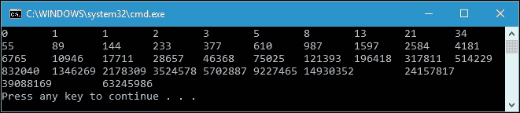

我们可以在控制台上获得前面的输出，因为`IEnumerable`是一种惰性求值。这是因为只有在要求时才会调用`MoveNext()`方法来计算结果。想象一下，如果它不是惰性的并且总是被调用；那么，我们之前的代码将会旋转并导致无限循环。

## 惰性求值

我们在惰性求值中的一个简单例子是当我们处理两个布尔语句并需要比较它们时。让我们看一下以下代码，它演示了我们可以在`SimpleLazyEvaluation.csproj`项目中找到的惰性求值：

```cs
public partial class Program 
{ 
  private static MemberData GetMember() 
  { 
    MemberData member = null; 
    try 
    { 
      if (member != null || member.Age > 50) 
      { 
        Console.WriteLine("IF Statement is TRUE"); 
        return member; 
      } 
      else 
      { 
        Console.WriteLine("IF Statement is FALSE"); 
        return null; 
      } 
    } 
    catch (Exception e) 
    { 
      Console.WriteLine("ERROR: " + e.Message); 
      return null; 
    } 
  } 
} 

```

这是我们在前面代码中使用的`MemberData`类：

```cs
public class MemberData 
{ 
  public string Name { get; set; } 
  public string Gender { get; set; } 
  public int Age { get; set; } 
} 

```

如果我们运行前面的`GetMember()`方法，将在控制台上获得以下输出：

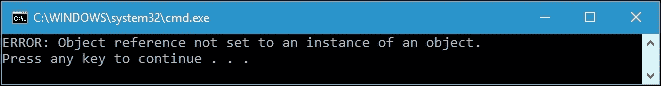

我们知道，在布尔表达式中使用`||`（OR）运算符时，如果至少有一个表达式为`TRUE`，则结果为`TRUE`。现在看一下以下代码片段：

```cs
if (member != null || member.Age > 50) 

```

在前面的例子中，当编译器发现成员`!= null`为`FALSE`时，它会评估另一个表达式，即`member.Age > 50`。由于成员为空，它没有`Age`属性；因此，当我们尝试访问此属性时，它将抛出异常。

现在，让我们将前面的代码片段重构为以下代码，使用`&&`（AND）运算符：

```cs
if (member != null && member.Age > 50) 

```

名为`GetMemberANDOperator()`的完整方法将如下所示：

```cs
public partial class Program 
{ 
  private static MemberData GetMemberANDOperator() 
  { 
    MemberData member = null; 
    try 
    { 
      if (member != null && member.Age > 50) 
      { 
        Console.WriteLine("IF Statement is TRUE"); 
        return member; 
      } 
      else 
      { 
        Console.WriteLine("IF Statement is FALSE"); 
        return null; 
      } 
    } 
    catch (Exception e) 
    { 
      Console.WriteLine("ERROR: " + e.Message); 
      return null; 
    } 
  } 
} 

```

如果我们运行前面的`GetMemberANDOperator()`方法，将在控制台上获得以下输出：

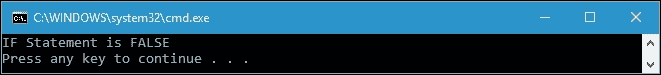

现在，`if`语句已成功执行，并在评估后得出`FALSE`。然而，在这种情况下，`member.Age > 50`表达式从未被评估，因此不会抛出异常。`member.Age > 50`表达式不被评估的原因是编译器太懒了，因为第一个表达式`member != null`为`FALSE`，而这个`&&`逻辑操作的结果将始终为`FALSE`，而不管其他表达式的结果如何。现在我们可以说，懒惰是在可以仅使用一个表达式决定结果时忽略另一个表达式。

## 非严格求值

有些人可能认为惰性评估与非严格评估是同义词。然而，实际上并不是同义词，因为在惰性评估中，如果不需要特定表达式的评估，它将被忽略，而在非严格评估中将应用评估的简化。让我们看一下下面的代码，以区分严格和非严格评估，我们可以在`NonStrictEvaluation.csproj`项目中找到：

```cs
public partial class Program 
{ 
  private static int OuterFormula(int x, int yz) 
  { 
    Console.WriteLine( 
      String.Format( 
        "Calculate {0} + InnerFormula({1})", 
        x, 
        yz)); 
    return x * yz; 
  } 
  private static int InnerFormula(int y, int z) 
  { 
    Console.WriteLine( 
      String.Format( 
        "Calculate {0} * {1}", 
        y, 
        z 
        )); 
    return y * z; 
  } 
} 

```

在前面的代码中，我们将计算`x + (y * z)`的公式。`InnerFormula()`函数将计算`y`和`z`的乘法，而`OuterFormula()`函数将计算`x`和`y * z`的结果的加法。在严格评估中评估公式时，我们首先计算`(y * z)`表达式以检索值，然后将结果添加到`x`。代码将如下`StrictEvaluation()`函数所示：

```cs
public partial class Program 
{ 
  private static void StrictEvaluation() 
  { 
    int x = 4; 
    int y = 3; 
    int z = 2; 
    Console.WriteLine("Strict Evaluation"); 
    Console.WriteLine( 
      String.Format( 
        "Calculate {0} + ({1} * {2})",x, y, z)); 
    int result = OuterFormula(x, InnerFormula(y, z)); 
    Console.WriteLine( 
      String.Format( 
        "{0} + ({1} * {2}) = {3}",x, y, z, result)); 
    Console.WriteLine(); 
  } 
} 

```

正如您在前面的代码片段中所看到的，我们调用`OuterFormula()`函数如下所示：

```cs
int result = OuterFormula(x, InnerFormula(y, z)); 

```

对于我们之前讨论的严格评估，我们在控制台上得到的输出将如下所示：

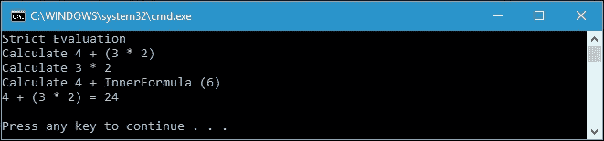

正如您在前面的图中所看到的，当我们计算`4 + (3 * 2)`时，我们首先计算`(3 * 2)`的结果，然后在获得结果后，将其添加到`4`。

现在，让我们与非严格评估进行比较。在非严格评估中，`+`运算符首先被简化，然后我们简化内部公式`(y * z)`。我们将看到评估将从外到内开始。现在让我们将前面的`OuterFormula()`函数重构为`OuterFormulaNonStrict()`函数，如下面的代码所示：

```cs
public partial class Program 
{ 
  private static int OuterFormulaNonStrict( 
    int x, 
    Func<int, int, int> yzFunc) 
  { 
    int y = 3; 
    int z = 2; 
    Console.WriteLine( 
      String.Format( 
        "Calculate {0} + InnerFormula ({1})", 
        x, 
        y * z 
        )); 
    return x * yzFunc(3, 2); 
  } 
} 

```

正如您所看到的，我们将函数的第二个参数修改为`Func<int, int, int>`委托。我们将从`NonStrictEvaluation()`函数中调用`OuterFormulaNonStrict()`，如下所示：

```cs
public partial class Program 
{ 
  private static void NonStrictEvaluation() 
  { 
    int x = 4; 
    int y = 3; 
    int z = 2; 
    Console.WriteLine("Non-Strict Evaluation"); 
    Console.WriteLine( 
      String.Format( 
        "Calculate {0} + ({1} * {2})",x, y, z)); 
    int result = OuterFormulaNonStrict(x, InnerFormula); 
    Console.WriteLine( 
      String.Format( 
        "{0} + ({1} * {2}) = {3}",x, y, z, result)); 
    Console.WriteLine(); 
  } 
} 

```

在前面的代码中，我们可以看到我们将`InnerFormula()`函数传递给了`OuterFormulaNonStrict()`函数的第二个参数，如下面的代码片段所示：

```cs
int result = OuterFormulaNonStrict(x, InnerFormula); 

```

在前面的代码片段中，将使用非严格评估来评估表达式。为了证明这一点，让我们运行`NonStrictEvaluation()`函数，我们将在控制台上得到以下输出：

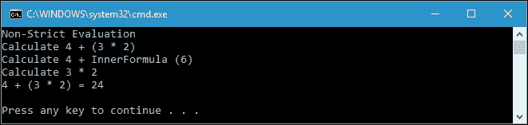

我们可以看到，我们的表达式是从外到内进行评估的。即使尚未检索到`InnerFormula()`函数的结果，也会首先运行`OuterFormulaNonStrict()`函数。如果我们连续运行`OuterFormula()`函数和`OuterFormulaNonStrict()`函数，我们将会清楚地看到评估顺序的不同，如下面的输出截图所示：

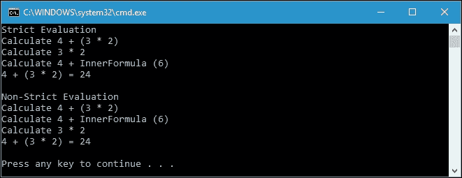

现在，我们可以比较一下。在严格评估中，首先运行`(3 * 2)`的计算，然后将其输入到`(4 + InnerFormula())`表达式中，而在非严格评估中，先运行`(4 + InnerFormula())`表达式，然后再计算`(3 * 2)`。

## 惰性初始化

延迟初始化是一种优化技术，其中对象的创建被推迟直到使用它。这意味着我们可以定义一个对象，但如果尚未访问对象的成员，则不会初始化该对象。C#在 C# 4.0 中引入了`Lazy<T>`类，我们可以使用它来延迟初始化对象。现在，让我们看一下下面的代码，以演示我们可以在`LazyInitialization.csproj`项目中找到的延迟初始化：

```cs
public partial class Program 
{ 
  private static void LazyInitName(string NameOfPerson) 
  { 
    Lazy<PersonName> pn = 
      new Lazy<PersonName>( 
        () => 
          new PersonName(NameOfPerson)); 
    Console.WriteLine( 
      "Status: PersonName has been defined."); 
    if (pn.IsValueCreated) 
    { 
      Console.WriteLine( 
        "Status: PersonName has been initialized."); 
    } 
    else 
    { 
      Console.WriteLine( 
        "Status: PersonName hasn't been initialized."); 
    } 
    Console.WriteLine( 
      String.Format( 
        "Status: PersonName.Name = {0}", 
        (pn.Value as PersonName).Name)); 
    if (pn.IsValueCreated) 
    { 
      Console.WriteLine( 
        "Status: PersonName has been initialized."); 
    } 
    else 
    { 
      Console.WriteLine( 
        "Status: PersonName hasn't been initialized."); 
    } 
  } 
} 

```

我们定义`PersonName`类如下：

```cs
public class PersonName 
{ 
  public string Name { get; set; } 
  public PersonName(string name) 
  { 
    Name = name; 
    Console.WriteLine( 
      "Status: PersonName constructor has been called." 
      ); 
  } 
} 

```

正如您在前面的`LazyInitName()`函数实现中所看到的，我们使用`Lazy<T>`类来延迟初始化`PersonName`对象，如下面的代码片段所示：

```cs
Lazy<PersonName> pn = 
  new Lazy<PersonName>( 
    () => 
      new PersonName(NameOfPerson)); 

```

通过这样做，`PersonName`在定义`pn`变量后实际上并没有初始化，就像我们直接使用以下代码定义类时通常得到的那样：

```cs
PersonName pn = 
  new PersonName( 
    NameOfPerson); 

```

相反，使用延迟初始化，我们访问对象的成员以初始化它，如前所述。`Lazy<T>`有一个名为`Value`的属性，用于获取`Lazy<T>`实例的值。它还有一个`IsValueCreated`属性，用于指示是否已为此`Lazy<T>`实例创建了值。在`LazyInitName()`函数中，我们使用`Value`属性，如下所示：

```cs
Console.WriteLine( 
  String.Format( 
    "Status: PersonName.Name = {0}", 
    (pn.Value as PersonName).Name)); 

```

我们使用`(pn.Value as PersonName).Name`来访问`pn`变量实例化的`PersonName`类的`Name`属性。我们使用`IsValueCreated`属性来证明`PersonName`类是否已经初始化，如下所示：

```cs
if (pn.IsValueCreated) 
{ 
  Console.WriteLine( 
    "Status: PersonName has been initialized."); 
} 
else 
{ 
  Console.WriteLine( 
    "Status: PersonName hasn't been initialized."); 
} 

```

现在让我们运行`LazyInitName()`函数，并将`Matthew Maxwell`作为其参数传递，如下所示：

```cs
LazyInitName("Matthew Maxwell"); 

```

我们将在控制台上获得以下输出：

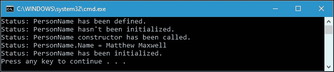

从前面的截图中，我们获得了五行信息。我们得到的第一行是在定义`PersonName`时。然后我们检查`IsValueCreated`属性的值，以找出`PersonName`是否已经初始化。我们得到了`FALSE`的结果，这意味着它还没有初始化；所以我们在控制台上得到了第二行信息。接下来的两行是我们从延迟初始化中得到的有趣的东西。当我们访问`Lazy<T>`类的`Value`属性以检索`PersonName`实例的`Name`属性时，代码在访问`PersonName`类的`Name`属性之前调用`PersonName`的构造函数。这就是为什么我们在前面的控制台上有第 3 行和第 4 行。在我们再次检查`IsValueCreated`属性之后，我们发现`PersonName`现在已经初始化，并且`pn`变量具有`PersonName`的实例。

## 懒惰的优缺点

到目前为止，我们已经了解了懒惰。我们还可以详细说明懒惰的优点，比如：

+   我们不需要为我们不使用的功能支付初始化时间

+   程序执行变得更加高效，因为有时，在功能性方法中，执行顺序与命令式方法相比并不重要

+   懒惰会使程序员通过编写高效的代码来编写更好的代码

除了优点之外，懒惰也有缺点，比如：

+   应用程序的流程很难预测，有时我们会失去对应用程序的控制

+   懒惰中的代码复杂性可能会导致簿记开销

# 缓存昂贵的资源

有时，我们必须在程序中创建昂贵的资源。如果我们只做一次，这不是问题。如果我们为同一个函数一遍又一遍地做同样的事情，那将是一个大问题。幸运的是，在功能性方法中，如果我们传递相同的输入或参数，我们将获得相同的输出。然后，我们可以缓存这些昂贵的资源，并在传递相同的参数时再次使用它。现在我们将讨论预计算和记忆化以缓存资源。

## 执行初始计算

我们拥有的缓存技术之一是预计算，它执行初始计算以创建查找表。当执行特定过程时，该查找表用于避免重复计算。现在我们将创建代码来比较使用和不使用预计算的过程中的差异。让我们看一下以下代码，在`Precomputation.csproj`项目中可以找到：

```cs
public partial class Program 
{ 
  private static void WithoutPrecomputation() 
  { 
    Console.WriteLine("WithoutPrecomputation()"); 
    Console.Write( 
      "Choose number from 0 to 99 twice "); 
    Console.WriteLine( 
      "to find the power of two result: "); 
    Console.Write("First Number: "); 
    int iInput1 = Convert.ToInt32(Console.ReadLine()); 
    Console.Write("Second Number: "); 
    int iInput2 = Convert.ToInt32(Console.ReadLine()); 
    int iOutput1 = (int) Math.Pow(iInput1, 2); 
    int iOutput2 = (int)Math.Pow(iInput2, 2); 
    Console.WriteLine( 
      "2 the power of {0} is {1}", 
      iInput1, 
      iOutput1); 
    Console.WriteLine( 
      "2 the power of {0} is {1}", 
      iInput2, 
      iOutput2); 
  } 
} 

```

前面简单的`WithoutPrecomputation()`函数将计算我们从 0 到 99 输入的两个数字的平方。假设我们要计算数字`19`和`85`，我们将在控制台窗口上获得以下输出：

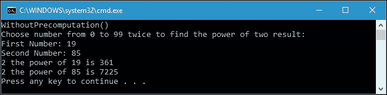

如您所见，该函数已经很好地完成了其工作。它使用以下代码片段向用户请求两个输入数字：

```cs
Console.Write("First Number: "); 
int iInput1 =Convert.ToInt32(Console.ReadLine()); 
Console.Write("Second Number: "); 
int iInput2 = Convert.ToInt32(Console.ReadLine()); 

```

它使用`System`命名空间中的“Math.Pow（）”方法来得到 n 的幂，如下面的代码片段所示：

```cs
int iOutput1 = (int) Math.Pow(iInput1, 2); 
int iOutput2 = (int)Math.Pow(iInput2, 2); 

```

我们可以重构“WithoutPrecomputation（）”函数，以使用预计算技术，这样每当用户要求计算相同数字的平方时，它就不需要重复计算。我们将要得到的函数如下：

```cs
public partial class Program 
{ 
  private static void WithPrecomputation() 
  { 
    int[]powerOfTwos = new int[100]; 
    for (int i = 0; i < 100; i++) 
    { 
      powerOfTwos[i] = (int)Math.Pow(i, 2); 
    } 
    Console.WriteLine("WithPrecomputation()"); 
    Console.Write( 
      "Choose number from 0 to 99 twice "); 
    Console.WriteLine( 
      "to find the power of two result: "); 
    Console.Write("First Number: "); 
    int iInput1 = Convert.ToInt32(Console.ReadLine()); 
    Console.Write("Second Number: "); 
    int iInput2 = Convert.ToInt32(Console.ReadLine()); 
    int iOutput1 = FindThePowerOfTwo(powerOfTwos, iInput1); 
    int iOutput2 = FindThePowerOfTwo(powerOfTwos, iInput2); 
    Console.WriteLine( 
      "2 the power of {0} is {1}", 
      iInput1, 
      iOutput1); 
    Console.WriteLine( 
      "2 the power of {0} is {1}", 
      iInput2, 
      iOutput2); 
  } 
} 

```

如前面的代码中所示，我们在函数开头创建了一个名为`powerOfTwos`的查找表，如下面的代码片段所示：

```cs
int[] powerOfTwos = new int[100]; 
for (int i = 0; i < 100; i++) 
{ 
  powerOfTwos[i] = (int)Math.Pow(i, 2); 
} 

```

由于我们要求用户输入 0 到 99 之间的数字，查找表将存储来自范围数字的两个数字的幂的数据库。此外，“WithPrecomputation（）”函数和“WithoutPrecomputation（）”函数之间的区别在于我们有了两个结果的集合。现在我们使用“FindThePowerOfTwo（）”函数，如下面的代码片段所示：

```cs
int iOutput1 = FindThePowerOfTwo(squares, iInput1); 
int iOutput2 = FindThePowerOfTwo(squares, iInput2); 

```

“FindThePowerOfTwo（）”函数将在查找表中查找所选数字，本例中为`powerOfTwos`。而“FindThePowerOfTwo（）”函数的实现将如下所示：

```cs
public partial class Program 
{ 
  private static int FindThePowerOfTwo ( 
    int[] precomputeData, 
    int baseNumber) 
  { 
    return precomputeData[baseNumber]; 
  } 
} 

```

如您所见，“FindThePowerOfTwo（）”函数返回我们用`baseNumber`参数指定的查找表的值。如果我们运行“WithPrecomputation（）”函数，我们将在控制台上获得以下输出：

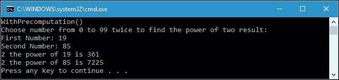

再次计算`19`和`85`的平方，确实，我们得到的结果与运行“WithoutPrecomputation（）”函数时得到的完全相同。现在，我们有了一个从 0 到 99 的平方数查找表。我们程序中的优势更加有效，因为每次我们要求计算相同的数字（`19`和`85`）时，它都不需要运行计算，而是会在查找表中查找结果。

然而，我们之前探讨的预计算代码并不是一种功能性方法，因为每次调用“FindThePowerOfTwo（）”函数时，它都会再次迭代平方。我们可以重构它，使其在使用柯里化的幂的情况下变得功能性，这是一种通过顺序更改结构参数的技术，我们在第一章中讨论过，*在 C#中品尝函数式风格*。现在让我们看一下以下代码：

```cs
public partial class Program 
{ 
  private static void WithPrecomputationFunctional() 
  { 
    int[]powerOfTwos = new int[100]; 
    for (int i = 0; i < 100; i++) 
    { 
      powerOfTwos[i] = (int) Math.Pow(i, 2); 
    } 
    Console.WriteLine("WithPrecomputationFunctional()"); 
    Console.Write( 
      "Choose number from 0 to 99 twice "); 
    Console.WriteLine( 
      "to find the power of two result: "); 
    Console.Write("First Number: "); 
    int iInput1 = Convert.ToInt32(Console.ReadLine()); 
    Console.Write("Second Number: "); 
    int iInput2 = Convert.ToInt32(Console.ReadLine()); 
    var curried = CurriedPowerOfTwo(powerOfTwos); 
    int iOutput1 = curried(iInput1); 
    int iOutput2 = curried(iInput2); 
    Console.WriteLine( 
      "2 the power of {0} is {1}", 
      iInput1, 
      iOutput1); 
    Console.WriteLine( 
      "2 the power of {0} is {1}", 
      iInput2, 
      iOutput2); 
  } 
} 

```

如果我们将前面的“WithPrecomputationFunctional（）”函数与“WithPrecomputation（）”函数进行比较，我们可以看到它现在使用了“CurriedPowerOfTwo（）”函数，如下面的代码片段所示：

```cs
var curried = CurriedSquare(squares); 
int iOutput1 = curried(iInput1); 
int iOutput2 = curried(iInput2); 

```

使用“CurriedPowerOfTwo（）”函数，我们分割函数参数，以便柯里化变量现在可以处理查找表，并且我们可以随意调用“WithPrecomputationFunctional（）”函数，而无需再次迭代查找表。以下代码中可以找到“CurriedPowerOfTwo（）”函数的实现：

```cs
public partial class Program 
{ 
  public static Func<int, int> 
  CurriedPowerOfTwo(int[] intArray) 
      => i => intArray[i]; 
} 

```

如果我们运行“WithPrecomputationFunctional（）”函数，我们的控制台窗口将显示以下输出：

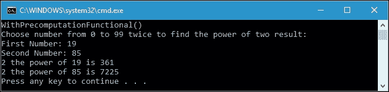

再次，与我们之前的函数“WithoutPrecomputation（）”函数和“WithPrecomputation（）”函数相比，我们得到了完全相同的输出。我们已成功重构了函数，并且在这种预计算技术中已实现了功能性方法。

## 备忘录化

除了执行预计算技术来优化代码之外，我们还可以使用记忆化技术使我们的代码更加优化。记忆化是记住具有特定输入的函数的结果的过程。每次我们用特定的输入参数执行特定的函数时，代码都会记住结果。因此，每次我们再次使用完全相同的输入参数调用函数时，代码就不需要运行代码了；相反。它将从存储结果的位置获取结果。

让我们借用我们在第五章中讨论的重复的`GetFactorial()`函数，*使用 LINQ 轻松查询任何集合*，然后重构它以使用记忆化技术。正如我们所知，`GetFactorial()`函数的实现如下：

```cs
public partial class Program 
{ 
  private static int GetFactorial(int intNumber) 
  { 
    if (intNumber == 0) 
    { 
      return 1; 
    } 
    return intNumber * GetFactorial(intNumber - 1); 
  } 
} 

```

要使`GetFactorial()`函数使用记忆化，我们必须在`GetFactorial()`函数返回值时保存结果。前面的`GetFactorial()`函数的重构代码将如下所示，并且我们可以在`Memoization.csproj`项目中找到它：

```cs
public partial class Program 
{ 
  private static Dictionary<int, int> 
    memoizeDict = new Dictionary<int, int>(); 
  private static int GetFactorialMemoization(int intNumber) 
  { 
    if (intNumber == 0) 
    { 
      return 1; 
    } 
    if (memoizeDict.ContainsKey(intNumber)) 
    { 
      return memoizeDict[intNumber]; 
    } 
    int i = intNumber * GetFactorialMemoization( 
      intNumber - 1); 
    memoizeDict.Add(intNumber, i); 
    return i; 
  } 
} 

```

正如您所看到的，我们有一个名为`memoizeDict`的`Dictionary`类，用于存储当特定参数传递给`GetFactorialMemoization()`函数时的所有结果。该字典的定义如下代码片段所示：

```cs
private static Dictionary<int, int> 
  memoizeDict = new Dictionary<int, int>(); 

```

与`GetFactorial()`函数相比，`GetFactorialMemoization()`函数的另一个区别是，当迄今为止已调用具有特定参数的`GetFactorialMemoization()`函数时，它现在保存结果。以下代码片段显示了此算法的代码：

```cs
private static int GetFactorialMemoization(int intNumber) 
{ 
  if (intNumber == 0) 
  { 
    return 1; 
  } 
  if (memoizeDict.ContainsKey(intNumber)) 
  { 
    return memoizeDict[intNumber]; 
  } 
  int i = intNumber * GetFactorialMemoization( 
    intNumber - 1); 
  memoizeDict.Add(intNumber, i); 
  return i; 
} 

```

首先，我们检查特定参数是否已传递给函数。如果是，它就不需要运行函数；相反，它只需从字典中检索结果。如果参数尚未传递，函数将运行，并且我们将结果保存在字典中。使用记忆化，我们可以优化代码，因为如果参数完全相同，我们就不需要一遍又一遍地运行函数。假设我们将 10 传递给`GetFactorialMemoization()`函数。如果我们再次运行函数并再次传递 10，处理速度将增加，因为它不需要运行重复的`GetFactorialMemoization()`函数。幸运的是，通过将 10 传递给函数参数，它还将使用 1-9 参数运行函数，因为它是一个递归函数。这 10 个项目的调用效果和结果将保存在目录中，并且使用这些参数调用函数将更快。

现在让我们比较`GetFactorial()`函数与`GetFactorialMemoization()`函数的性能。我们将传递`9216`作为参数，并运行它们。以下是用于调用`GetFactorial()`函数的`RunFactorial()`函数：

```cs
public partial class Program 
{ 
  private static void RunFactorial() 
  { 
    Stopwatch sw = new Stopwatch(); 
    int factorialResult = 0; 
    Console.WriteLine( 
      "RunFactorial() function is called"); 
    Console.WriteLine( 
      "Get factorial of 9216"); 
    for (int i = 1; i <= 5; i++) 
    { 
      sw.Restart(); 
      factorialResult = GetFactorial(9216); 
      sw.Stop(); 
      Console.WriteLine( 
        "Time elapsed ({0}): {1,8} ns", 
        i, 
        sw.ElapsedTicks * 
          1000000000 / 
          Stopwatch.Frequency); 
    } 
  } 
} 

```

如果我们运行`RunFactorial()`函数，我们将在控制台上得到以下输出：

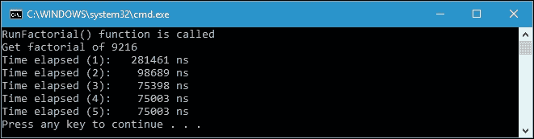

从输出中可以看出，在第一次调用`GetFactorial()`函数时，我们需要`281461 ns`，而在剩下的调用中需要大约 75,000-98,000 纳秒。由于递归的`GetFactorial()`函数每次都被调用，所有调用的进程速度几乎相同。现在让我们继续执行以下`RunFactorialMemoization()`函数，以调用`GetFactorialMemoization()`函数：

```cs
public partial class Program 
{ 
  private static void RunFactorialMemoization() 
  { 
    Stopwatch sw = new Stopwatch(); 
    int factorialResult = 0; 
    Console.WriteLine( 
      "RunFactorialMemoization() function is called"); 
    Console.WriteLine( 
      "Get factorial of 9216"); 
    for (int i = 1; i <= 5; i++) 
    { 
      sw.Restart(); 
      factorialResult = GetFactorialMemoization(9216); 
      sw.Stop(); 
      Console.WriteLine( 
        "Time elapsed ({0}): {1,8} ns", 
        i, 
        sw.ElapsedTicks * 
          1000000000 / 
          Stopwatch.Frequency); 
    } 
  } 
} 

```

如果我们运行`RunFactorialMemoization()`函数，我们将在控制台上得到以下输出：

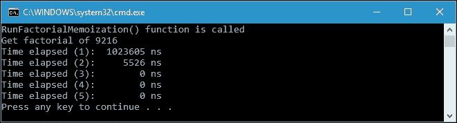

现在我们可以看到，通过使用记忆化，进程速度已经大大提高。即使在第一次调用`GetFactorialMemoization()`时需要额外的时间，在第 3 到 5 次调用时，进程变得更快。

# 摘要

我们讨论了通过懒惰可以创建高效的代码。懒惰枚举在需要迭代无限循环时非常有用，这样就不会溢出，因为`IEnumerator`中的`MoveNext()`方法只有在被要求时才会运行。此外，懒惰评估使我们的代码运行更快，因为编译器不需要检查所有布尔表达式，如果其中一个已经给出结果。

在非严格评估中，我们将编程中的函数视为数学函数。使用这种评估技术，我们使用函数方法来解决函数。

我们还熟悉了`Lazy<T>`类提供的延迟初始化，这意味着我们可以定义一个对象，但如果尚未访问对象的成员，则不会初始化该对象。

为了优化我们的代码，我们讨论了使用预计算和记忆化的缓存技术。在预计算中，我们准备了类似查找表的东西，这样我们就不需要用精确的参数运行函数；相反，我们只需要从表中获取结果。我们还有记忆化，以记住具有特定输入的函数的结果。使用记忆化，每次我们再次使用完全相同的输入参数调用函数时，代码就不需要再次运行代码；相反，它将从存储结果的地方获取结果。

在下一章中，我们将讨论单子及其在函数式编程中的使用。
