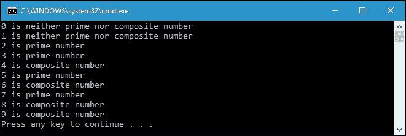
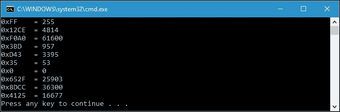
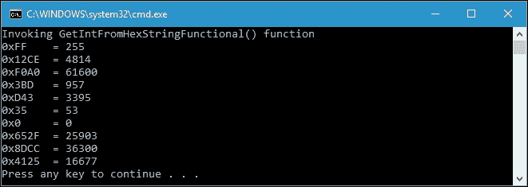
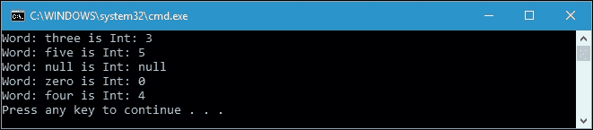
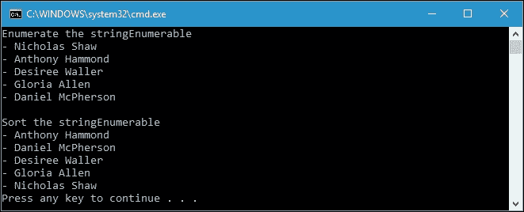
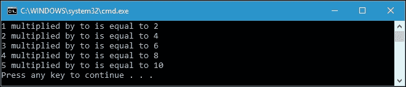
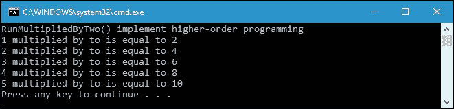

# 第九章。使用模式匹配

在上一章中，我们讨论了优化代码以开发高效的代码。现在，我们将讨论使我们的代码流程按照规则进行的模式，以便更容易维护和理解程序的流程。我们将在本章中讨论的主要主题是模式匹配和 Monad 作为一种设计模式。模式匹配将使用数学方法匹配条件，以便我们能够从中获得功能性的体验。而 Monad 是函数式编程中不可分割的一部分，因为它是软件设计中复杂问题的设计模式。使用 Monad，我们可以通过放大它们的行为来为现有的数据类型提供更多的功能。本章将进一步探讨模式匹配和`Monad`，我们将讨论以下主题：

+   理解函数式编程中的模式匹配

+   使用模式匹配转换数据和切换决策

+   简化模式匹配以使其更加功能化

+   在 C# 7 中测试模式匹配功能

+   找出哪些 C#类型自然实现了 Monad

+   生成单子类型

+   理解 Monad 的规则

# 解剖函数式编程中的模式匹配

在函数式编程中，模式匹配是一种分派形式，用于选择要调用的函数的正确变体。它实际上是受标准数学符号的启发，具有表达条件执行的语法。我们可以从第一章中借用代码，*在 C#中品尝函数式风格*，当我们谈论递归时开始我们的模式匹配讨论。以下是我们用来检索阶乘值的`GetFactorial()`函数：

```cs
public partial class Program 
{ 
  private static intGetFactorial(intintNumber) 
  { 
    if (intNumber == 0) 
    { 
      return 1; 
    } 
    returnintNumber * GetFactorial(intNumber - 1); 
  } 
} 

```

正如我们在前面的代码中所看到的，它给了我们两个定义。在这种情况下，调度程序是根据实际的`intNumber`参数模式是否匹配 0 来选择的。模式匹配的使用更接近于这个`if`条件表达式，因为我们必须决定通过提供特定的输入来选择哪个部分。

## 使用模式匹配转换数据

模式匹配在某种程度上是在转换数据。让我们从上一章借用另一个函数继续讨论。也许我们还记得，在扩展方法中有一个名为`IsPrime()`的函数，用于检查一个数是否是质数。我们将再次使用它来演示模式匹配来转换数据。对于那些忘记了`IsPrime()`函数实现的人，这里是代码：

```cs
public static class ExtensionMethods 
{ 
  public static bool IsPrime(this int i) 
  { 
    if ((i % 2) == 0) 
    { 
      return i == 2; 
    } 
    int sqrt = (int)Math.Sqrt(i); 
    for (int t = 3; t <= sqrt; t = t + 2) 
    { 
      if (i % t == 0) 
      { 
        return false; 
      } 
    } 
    return i != 1; 
  } 
} 

```

同样，我们使用模式匹配来确定数字是质数、合数还是其他。然而，现在我们将把`int`数字转换为文本，正如我们在`MatchingPattern.csproj`项目中找到的`NumberFactorType()`函数中所看到的：

```cs
public partial class Program 
{ 
  public static string NumberFactorType( 
    int intSelectedNumber) 
  { 
    if (intSelectedNumber < 2) 
    { 
      return "neither prime nor composite number"; 
    } 
    else if (intSelectedNumber.IsPrime()) 
    { 
      return "prime number"; 
    } 
    else 
    { 
      return "composite number"; 
    } 
  } 
} 

```

在前面的代码中，我们使用`if...else`条件语句来匹配条件，而不是在前面的示例中使用的`if`条件语句。现在，让我们调用`NumberFactorType()`函数来匹配我们给定的整数，并使用以下的`TransformIntIntoText()`函数将其转换为文本：

```cs
public partial class Program 
{ 
  public static void TransformIntIntoText() 
  { 
    for (int i = 0; i < 10; i++) 
    { 
      Console.WriteLine( 
        "{0} is {1}", i, NumberFactorType(i)); 
    } 
  } 
} 

```

我们将数字 0 到 9 传递给`NumberFactorType()`函数以获得匹配的结果。如果我们运行`TransformIntIntoText()`函数，我们将在控制台上得到以下输出：



从前面的截图中可以看出，我们已经成功地使用模式匹配将`int`转换为文本。

## 用于模式匹配的切换。

我们知道模式匹配可以将数据转换为另一种形式。这实际上类似于 LINQ 中的`Select()`方法，并在概念上类似于 switch case 语句。现在让我们看一下以下的`HexCharToByte()`函数，将十六进制字符转换为`byte`：

```cs
public partial class Program 
{ 
  public static byte HexCharToByte( 
    char c) 
  { 
    byte res; 

    switch (c) 
    { 
      case '1': 
        res = 1; 
        break; 
      case '2': 
        res = 2; 
        break; 
      case '3': 
        res = 3; 
        break; 
      case '4': 
        res = 4; 
        break; 
      case '5': 
        res = 5; 
        break; 
      case '6': 
        res = 6; 
        break; 
      case '7': 
        res = 7; 
        break; 
      case '8': 
        res = 8; 
        break; 
      case '9': 
        res = 9; 
        break; 
      case 'A': 
      case 'a': 
        res = 10; 
        break; 
      case 'B': 
      case 'b': 
        res = 11; 
        break; 
      case 'C': 
      case 'c': 
        res = 12; 
        break; 
      case 'D': 
      case 'd': 
        res = 13; 
        break; 
      case 'E': 
      case 'e': 
        res = 14; 
        break; 
      case 'F': 
      case 'f': 
        res = 15; 
        break; 
      default: 
        res = 0; 
        break; 
    } 

    return res; 
  } 
} 

```

然后，我们添加一个包装器将字符串中的十六进制转换为`int`，如下面的`HexStringToInt()`函数所示：

```cs
public partial class Program 
{ 
  public static intHexStringToInt( 
    string s) 
  { 
    int iCnt = 0; 
    int retVal = 0; 
    for (inti = s.Length - 1; i>= 0; i--) 
    { 
      retVal += HexCharToByte(s[i]) *  
        (int) Math.Pow(0x10, iCnt++); 
    } 
    return retVal; 
  } 
} 

```

从前面的代码中，我们可以看到，我们调用`HexCharToByte()`函数为每个十六进制字符获取每个`int`值。然后，我们使用 16 的幂来获取所有十六进制值。假设我们有以下`GetIntFromHexString()`函数来将字符串中的多个十六进制数字转换为`int`：

```cs
public partial class Program 
{ 
  private static void GetIntFromHexString() 
  { 
    string[] hexStrings = { 
      "FF", "12CE", "F0A0", "3BD", 
      "D43", "35", "0", "652F", 
      "8DCC", "4125" 
    }; 
    for (int i = 0; i < hexStrings.Length; i++) 
    { 
      Console.WriteLine( 
        "0x{0}\t= {1}", 
        hexStrings[i], 
        HexStringToInt(hexStrings[i])); 
    } 
  } 
} 

```

如果我们运行`GetIntFromHexString()`函数，我们将在控制台上得到以下输出：



如前面的屏幕截图所示，字符串中的每个十六进制字符都被转换为`int`值，然后将所有结果相加。

### 提示

要将十六进制字符转换为字节，我们可以使用`Parse`和`TryParse`方法，或者使用`String.Format`进行格式化。`HexCharToByte()`函数仅用于示例目的。

## 简化模式匹配

我们已成功使用`switch`语句来实现模式匹配。但是，该示例并未应用函数式方法，因为`HexCharToByte()`函数中的`res`变量在执行过程中被改变。现在，我们将重构`HexCharToByte()`函数以应用函数式方法。让我们来看看`SimplifyingPatternMatching.csproj`项目中的`HexCharToByteFunctional()`函数：

```cs
public partial class Program 
{ 
  public static byte HexCharToByteFunctional( 
    char c) 
  { 
    return c.Match() 
      .With(ch =>ch == '1', (byte)1) 
      .With(ch =>ch == '2', 2) 
      .With(ch =>ch == '3', 3) 
      .With(ch =>ch == '4', 4) 
      .With(ch =>ch == '5', 5) 
      .With(ch =>ch == '6', 6) 
      .With(ch =>ch == '7', 7) 
      .With(ch =>ch == '8', 8) 
      .With(ch =>ch == '9', 9) 
      .With(ch =>ch == 'A', 10) 
      .With(ch =>ch == 'a', 10) 
      .With(ch =>ch == 'B', 11) 
      .With(ch =>ch == 'b', 11) 
      .With(ch =>ch == 'C', 12) 
      .With(ch =>ch == 'c', 12) 
      .With(ch =>ch == 'D', 13) 
      .With(ch =>ch == 'd', 13) 
      .With(ch =>ch == 'E', 14) 
      .With(ch =>ch == 'e', 14) 
      .With(ch =>ch == 'F', 15) 
      .With(ch =>ch == 'f', 15) 
      .Else(0) 
      .Do(); 
  } 
} 

```

前面的`HexCharToByteFunctional()`函数是从`HexCharToByte()`函数重构而来，现在实现了函数式方法。正如您所看到的，我们有四种类似于`switch`语句或`if...else`条件语句的方法：`Match()`，`With()`，`Else()`和`Do()`。让我们来看看前面的`HexCharToByteFunctional()`函数使用的`Match()`函数：

```cs
public static class PatternMatch 
{ 
  public static PatternMatchContext<TIn> Match<TIn>( 
    this TIn value) 
  { 
    return new PatternMatchContext<TIn>(value); 
  } 
} 

```

正如您所看到的，`Match()`函数返回新的`PatternMatchContext`数据类型。`PatternMatchContext`类的实现如下：

```cs
public class PatternMatchContext<TIn> 
{ 
  private readonlyTIn _value; 
  internal PatternMatchContext(TIn value) 
  { 
    _value = value; 
  } 

  public PatternMatchOnValue<TIn, TOut> With<TOut>( 
    Predicate<TIn> condition,  
    TOut result) 
  { 
    return new PatternMatchOnValue<TIn, TOut>(_value) 
      .With(condition, result); 
  } 
} 

```

当`Match()`函数生成`PatternMatchContext`的新实例时，其构造函数将传递的值存储到`_value`私有变量中，如下面的代码片段所示：

```cs
internal PatternMatchContext(TIn value) 
{ 
  _value = value; 
} 

```

在这个`PatternMatchContext`类中，还有一个名为`With()`的方法，我们可以将其与`_value`值进行比较。该方法将调用`PatternMatchOnValue`类中的`With()`方法，其实现如下所示：

```cs
public class PatternMatchOnValue<TIn, TOut> 
{ 
  private readonlyIList<PatternMatchCase> _cases =  
    new List<PatternMatchCase>(); 
  private readonlyTIn _value; 
  private Func<TIn, TOut> _elseCase; 

  internal PatternMatchOnValue(TIn value) 
  { 
    _value = value; 
  } 

  public PatternMatchOnValue<TIn, TOut> With( 
    Predicate<TIn> condition,  
    Func<TIn, TOut> result) 
  { 
    _cases.Add(new PatternMatchCase 
    { 
      Condition = condition, 
      Result = result 
    }); 

    return this; 
  } 

  public PatternMatchOnValue<TIn, TOut> With( 
    Predicate<TIn> condition,  
    TOut result) 
  { 
    return With(condition, x => result); 
  } 

  public PatternMatchOnValue<TIn, TOut> Else( 
  Func<TIn, TOut> result) 
  { 
    if (_elseCase != null) 
    { 
      throw new InvalidOperationException( 
        "Cannot have multiple else cases"); 
    } 
    _elseCase = result; 
    return this; 
  } 

  public PatternMatchOnValue<TIn, TOut> Else( 
    TOut result) 
  { 
    return Else(x => result); 
  } 

  public TOut Do() 
  { 
    if (_elseCase != null) 
    { 
      With(x => true, _elseCase); 
      _elseCase = null; 
    } 

    `foreach (var test in _cases) 
    { 
      if (test.Condition(_value)) 
      { 
        returntest.Result(_value); 
      } 
    } 

    throw new IncompletePatternMatchException(); 
  } 

  private structPatternMatchCase 
  { 
    public Predicate<TIn> Condition; 
    publicFunc<TIn, TOut> Result; 
  } 
} 

```

正如您从前面的代码中所看到的，当`With()`方法（它是`PatternMatchContext`类的成员）返回`PatternMatchOnValue`的新实例时，其构造函数也将值存储到`_value`私有变量中，如下面的代码片段所示：

```cs
internal PatternMatchOnValue(TIn value) 
{ 
  _value = value; 
} 

```

然后调用`With()`方法，该方法将匿名方法作为`condition`和预期值作为`result`传递，如下面的代码片段所示：

```cs
public PatternMatchOnValue<TIn, TOut> With( 
  Predicate<TIn> condition, 
  TOut result) 
{ 
  return With(condition, x => result); 
} 

```

这个`With()`方法然后调用另一个`With()`方法，该方法传递`Predicate<T>`和`Func<T1, T2>`，如下面的代码片段所示：

```cs
public PatternMatchOnValue<TIn, TOut> With( 
  Predicate<TIn> condition, 
  Func<TIn, TOut> result) 
{ 
  _cases.Add(new PatternMatchCase 
  { 
    Condition = condition, 
    Result = result 
  }); 

  return this; 
} 

```

这个`With()`方法收集所有情况，并将它们存储在`_cases`列表中，类型为`PatternMatchCase`，其实现如下所示：

```cs
private structPatternMatchCase 
{ 
  public Predicate<TIn> Condition; 
  publicFunc<TIn, TOut> Result; 
} 

```

一旦我们提供了所有条件，我们调用`Else()`方法，其中包含默认结果。`Else()`方法的实现如下所示：

```cs
public PatternMatchOnValue<TIn, TOut> Else( 
  TOut result) 
{ 
  return Else(x => result); 
} 

```

然后调用另一个`Else()`方法，传递`Func<T1, T2>`，如下面的代码片段所示：

```cs
public PatternMatchOnValue<TIn, TOut> Else( 
  Func<TIn, TOut> result) 
{ 
  if (_elseCase != null) 
  { 
    throw new InvalidOperationException( 
      "Cannot have multiple else cases"); 
  } 
  _elseCase = result; 
  return this; 
} 

```

在收集所有`_cases`和`_elseCase`变量之后，我们必须调用`Do()`方法来比较所有情况。`Do()`方法的实现如下所示：

```cs
public TOut Do() 
{ 
  if (_elseCase != null) 
  { 
    With(x => true, _elseCase); 
    _elseCase = null; 
  } 
  foreach (var test in _cases) 
  { 
    if (test.Condition(_value)) 
    { 
      returntest.Result(_value); 
    } 
  } 
  throw new IncompletePatternMatchException(); 
} 

```

正如您所看到的，`Do()`方法将使用`With()`方法将`_elseCase`变量（如果有的话）分配给`_cases`列表，如下面的代码片段所示：

```cs
if (_elseCase != null) 
{ 
  With(x => true, _elseCase); 
  _elseCase = null; 
} 

```

然后，使用以下代码片段比较所有`_cases`列表成员，以找到正确的`_value`值：

```cs
foreach (var test in _cases) 
{ 
  if (test.Condition(_value)) 
  { 
    return test.Result(_value); 
  } 
} 

```

虽然调用`Else()`方法是可选的，但必须匹配所有`With()`方法的调用之一。如果不匹配，`Do()`方法将抛出`IncompletePatternMatchException`异常，如下面的代码片段所示：

```cs
throw new IncompletePatternMatchException(); 

```

目前，我们不需要在`IncompletePatternMatchException`异常中实现任何内容，所以我们只需要创建一个新的类实现`Exception`类，如下面的代码所示：

```cs
public class IncompletePatternMatchException : 
  Exception 
{ 
} 

```

到目前为止，我们已经成功地将`HexCharToByte()`函数重构为`HexCharToByteFunctional()`函数。我们可以修改`HexStringToInt()`函数以调用`HexCharToByteFunctional()`函数，如下面的代码所示：

```cs
public partial class Program 
{ 
  public static intHexStringToInt( 
    string s) 
  { 
    int iCnt = 0; 
    int retVal = 0; 
    for (int i = s.Length - 1; i >= 0; i--) 
    { 
      retVal += HexCharToByteFunctional(s[i]) * 
      (int)Math.Pow(0x10, iCnt++); 
    } 

    return retVal; 
  } 
} 

```

然而，`HexStringToInt()`函数并没有实现功能性方法。我们可以将其重构为`HexStringToIntFunctional()`函数，如下所示：

```cs
public partial class Program 
{ 
  public static intHexStringToIntFunctional( 
    string s) 
  { 
    returns.ToCharArray() 
     .ToList() 
     .Select((c, i) => new { c, i }) 
     .Sum((v) => 
       HexCharToByteFunctional(v.c) * 
         (int)Math.Pow(0x10, v.i)); 
  } 
} 

```

从前面的`HexStringToIntFunctional()`函数中，我们可以看到，首先，我们将字符串转换为字符列表，通过颠倒列表的顺序。这是因为我们需要将最低有效字节分配给最低索引。然后，我们选择列表的每个成员，并创建一个包含字符本身和索引的新类。然后，我们根据它们的索引和值对它们进行求和。现在，我们有了以下的`GetIntFromHexStringFunctional()`函数，并调用了`HexStringToIntFunctional()`函数：

```cs
public partial class Program 
{ 
  private static void GetIntFromHexStringFunctional() 
  { 
    string[] hexStrings = { 
      "FF", "12CE", "F0A0", "3BD", 
      "D43", "35", "0", "652F", 
      "8DCC", "4125" 
    }; 
    Console.WriteLine( 
      "Invoking GetIntFromHexStringFunctional() function"); 
    for (int i = 0; i<hexStrings.Length; i++) 
    { 
      Console.WriteLine( 
        "0x{0}\t= {1}", 
        hexStrings[i], 
        HexStringToIntFunctional( 
          hexStrings[i])); 
    } 
  } 
} 

```

这实际上与`MatchingPattern.csproj`项目中的`GetIntFromHexString()`函数类似。如果我们运行`GetIntFromHexStringFunctional()`函数，我们将在控制台上得到以下输出：



正如您所看到的，与`MatchingPattern.csproj`项目中的`GetIntFromHexString()`函数相比，我们得到了完全相同的输出，因为我们已经成功地将其重构为功能模式匹配。

### 注意

为了简化模式匹配的方法，我们可以使用`Simplicity` NuGet 包，我们可以直接从 Visual Studio 使用**Package Manager Console**下载，并输入`Install-PackageSimplicity`。

## 欢迎 C# 7 中模式匹配功能的到来

C# 7 中计划的语言特性包括模式匹配，它对`is`运算符进行了扩展。现在我们可以在类型之后引入一个新变量，并且将这个变量赋值给`is`运算符的左操作数，但类型指定为右操作数。让我们通过下面的代码片段来清楚地说明这一点，我们可以在`MatchingPatternCSharp7.csproj`项目中找到：

```cs
public partial class Program 
{ 
  private static void IsOperatorBeforeCSharp7() 
  { 
    object o = GetData(); 
    if (o is String) 
    { 
      var s = (String)o; 
      Console.WriteLine( 
        "The object is String. Value = {0}", 
          s); 
    } 
  } 
} 

```

`GetData()`函数的实现如下：

```cs
public partial class Program 
{ 
  private static object GetData( 
      bool objectType = true) 
  { 
    if (objectType) 
        return "One"; 
    else 
        return 1; 
  } 
} 

```

在前面的`IsOperatorBeforeCSharp7()`函数中，我们应该在检查`o`对象变量的内容后，将`s`变量赋值为`o`的值。这是在 C# 7 引入模式匹配功能之前我们可以做的。现在，让我们将前面的代码与以下`IsOperatorInCSharp7()`函数进行比较：

```cs
public partial class Program 
{ 
  private static void IsOperatorInCSharp7() 
  { 
    object o = GetData(); 
    if (o is String s) 
    { 
      Console.WriteLine( 
          "The object is String. Value = {0}", 
           s); 
    } 
  } 
} 

```

正如我们所看到的，现在我们可以将`s`变量赋值为`o`变量的内容，但数据类型为字符串，正如我们之前讨论的那样。我们在检查条件时在`if`语句内部为`s`变量赋值。

幸运的是，这个特性也可以应用在 switch 语句中，正如我们在下面的代码片段中所看到的：

```cs
public partial class Program 
{ 
  private static void SwitchCaseInCSharp7() 
  { 
    object x = GetData( 
        false); 
    switch (x) 
    { 
      case string s: 
          Console.WriteLine( 
              "{0} is a string of length {1}", 
              x, 
              s.Length); 
          break; 
      case int i: 
          Console.WriteLine( 
              "{0} is an {1} int", 
              x, 
              (i % 2 == 0 ? "even" : "odd")); 
          break; 
      default: 
          Console.WriteLine( 
              "{0} is something else", 
              x); 
          break; 
    } 
  } 
} 

```

正如我们在前面的`SwitchCaseInCSharp7()`函数中所看到的，我们可以在`case`检查中将`s`和`i`变量赋值为`x`变量的内容，因此我们不需要再次赋值变量。

### 注意

有关 C# 7 中模式匹配功能的更多信息，我们可以在官方 Roslyn GitHub 页面上找到：[`github.com/dotnet/roslyn/blob/features/patterns/docs/features/patterns.md`](https://github.com/dotnet/roslyn/blob/features/patterns/docs/features/patterns.md)

# 引入 Monad 作为一种设计模式

在面向对象编程（OOP）语言如 C#中很难解释 Monad。然而，在 OOP 中，有一个有用的想法可以解释 Monad：设计模式。设计模式是软件设计中复杂问题的可重用解决方案。想象一下建筑中的设计模式。世界上许多建筑都必须具有相同的模式：门、窗户、墙壁等。如果我们将建筑中的设计模式与软件设计中的设计模式进行比较，我们会意识到它们都有相同的想法。在软件设计的设计模式中，我们有函数、类型、变量等。这些设计模式已经在 C#语言中可用，并将一起构建应用程序。

考虑到这个设计模式的定义，我们现在有了 Monad 本身的定义。Monad 是一种使用 Monad 模式的类型。而 Monad 模式是一种用于类型的设计模式。

在 C#中，有一些类型实际上自然实现了 Monad；它们是`Nullable<T>`、`IEnumerable<T>`、`Func<T>`、`Lazy<T>`和`Task<T>`。其中一些类型在前一章中已经讨论过。然而，我们将再次讨论它们，并与 Monad 的解释相关联。

这五种类型有一些共同点；显然，它们都是只接受一个参数`T`的泛型类型。它们自然实现了 monad，因为它们有一定的规则和提供的操作；换句话说，它们是类型的放大器。它们可以接受一个类型并将其转换为特殊类型。

我们可以说`Nullable<T>`是一种类型的放大器，因为它可以将，例如，`int`转换为 null，而如果没有使用`Nullable<T>`是不可能的，因为`int`只能处理`-2,147,483,648`到`2,147,483,647`。

让我们看一下在`AmplifierOfTypes.csproj`项目中可以找到的以下代码：

```cs
public partial class Program 
{ 
  private static Nullable<int> WordToNumber(string word) 
  { 
    Nullable<int> returnValue; 
    if (word == null) 
    { 
      return null; 
    } 
    switch (word.ToLower()) 
    { 
      case "zero": 
        returnValue = 0; 
        break; 
      case "one": 
        returnValue = 1; 
        break; 
      case "two": 
        returnValue = 2; 
        break; 
      case "three": 
        returnValue = 3; 
        break; 
      case "four": 
        returnValue = 4; 
        break; 
      case "five": 
        returnValue = 5; 
        break; 
      default: 
        returnValue = null; 
        break; 
    } 

    return returnValue; 
  } 
} 

```

前面的代码将把`string`类型中的数字转换为`int`类型。然而，由于`string`类型允许为 null，`int`类型将无法处理这种数据类型。为此，我们使用`Nullable<int>`作为返回类型；因此，现在返回值可以为 null，如下面的代码片段所示：

```cs
if (word == null) 
{ 
  return null; 
} 

```

然后，我们可以使用以下`PrintStringNumber()`函数调用前面的`WordToNumber()`函数：

```cs
public partial class Program 
{ 
  private static void PrintStringNumber( 
    string stringNumber) 
  { 
    if (stringNumber == null && 
      WordToNumber(stringNumber) == null) 
    { 
      Console.WriteLine( 
        "Word: null is Int: null"); 
    } 
    else 
    { 
      Console.WriteLine( 
        "Word: {0} is Int: {1}", 
        stringNumber.ToString(), 
        WordToNumber(stringNumber)); 
    } 
  } 
} 

```

现在，我们可以将`int`数据类型返回`null`，因为它已经成为了`Nullable`类型，如下面的代码片段所示：

```cs
if (stringNumber == null && 
  WordToNumber(stringNumber) == null) 

```

前面的代码片段将处理传递给`WordToNumber()`函数的空字符串输入。现在我们可以使用以下代码调用前面的`PrintStringNumber()`函数：

```cs
public partial class Program 
{ 
  private static void PrintIntContainingNull() 
  { 
    PrintStringNumber("three"); 
    PrintStringNumber("five"); 
    PrintStringNumber(null); 
    PrintStringNumber("zero"); 
    PrintStringNumber("four"); 
  } 
} 

```

如果我们运行`PrintIntContainingNull()`函数，将在控制台上得到以下输出：



从前面的截图中，您可以看到我们现在可以给`int`数据类型的`null`值，因为它已经自然实现了 monad，并且已经使用类型的放大器进行了放大。

`IEnumerable<T>`也实现了 monad，因为它可以放大我们传递给`IEnumerable<T>`的`T`类型。假设我们想要使用`IEnumerable<T>`来放大字符串类型，以便对其进行枚举和排序；我们可以使用以下代码：

```cs
public partial class Program 
{ 
  private static void AmplifyString() 
  { 
    IEnumerable<string> stringEnumerable 
      = YieldNames(); 
    Console.WriteLine( 
      "Enumerate the stringEnumerable"); 

    foreach (string s -> in stringEnumerable) 
    { 
      Console.WriteLine( 
        "- {0}", s); 
    } 

    IEnumerable<string>stringSorted =  
      SortAscending(stringEnumerable); 

    Console.WriteLine(); 
    Console.WriteLine( 
      "Sort the stringEnumerable"); 

    foreach (string s -> in stringSorted) 
    { 
      Console.WriteLine( 
        "- {0}", s); 
    } 
  } 
} 

```

在`AmplifyString()`函数中，我们将展示如何利用`string`类型来存储多个值，并表示枚举和排序，如下面的代码片段所示，用于初始化可枚举字符串：

```cs
IEnumerable<string> stringEnumerable 
  = YieldNames(); 

```

我们可以使用以下代码片段对可枚举字符串进行排序：

```cs
IEnumerable<string> stringSorted = 
  SortAscending(stringEnumerable); 

```

我们用来初始化可枚举字符串的`YieldNames()`函数的实现如下：

```cs
public partial class Program 
{ 
  private static IEnumerable<string> YieldNames() 
  { 
    yield return "Nicholas Shaw"; 
    yield return "Anthony Hammond"; 
    yield return "Desiree Waller"; 
    yield return "Gloria Allen"; 
    yield return "Daniel McPherson"; 
  } 
} 

```

我们用来对可枚举字符串进行排序的`SortAscending()`函数的实现如下：

```cs
public partial class Program 
{ 
  private static IEnumerable<string> SortAscending( 
    IEnumerable<string> enumString) 
  { 
    returnenumString.OrderBy(s => s); 
  } 
} 

```

如您所见，在`YieldNames()`函数的实现中，函数将产生五个以人名命名的字符串。这些人名将被保存在类型为`IEnumerable<string>`的`stringEnumerable`变量中。很明显，`stringEnumerable`现在已经被利用，以便它可以处理多个值。在`SortAscending()`函数中，我们可以看到`stringEnumerable`已经被利用，以便它可以被排序和排序。如果我们运行上述的`AmplifyString()`函数，我们将在控制台上得到以下输出：



从上述的截图中，我们可以看到我们已经成功地放大了`string`类型，使其现在可以枚举多个`string`值并对它们进行排序。

正如我们在上一章中讨论的许多方式，`Func<T>`是一个封装方法，它返回由`T`参数指定的类型的值，而不需要传递任何参数。为此，我们将在我们的`AmplifiedFuncType.csproj`项目中创建以下的`Func<T>`方法：

```cs
public partial class Program 
{ 
  Func<int> MultipliedFunc; 
} 

```

`MultipliedFunc`是一个委托，将负责处理返回`int`值的不需要传递参数的函数。现在，以下代码将解释`Func<T>`也自然实现了 monad。然而，在我们进行`Func<T>`解释之前，我们将使用我们之前讨论过的`Nullable`类型创建一个包装器。让我们来看看以下的`MultipliedByTwo()`函数：

```cs
public partial class Program 
{ 
  private static Nullable<int>MultipliedByTwo( 
    Nullable<int>nullableInt) 
  { 
    if (nullableInt.HasValue) 
    { 
      int unWrappedInt =  
        nullableInt.Value; 
      int multipliedByTwo =  
        unWrappedInt * 2; 
      return GetNullableFromInt( 
        multipliedByTwo); 
    } 
    else 
    { 
      return new Nullable<int>(); 
    } 
  } 
} 

```

`GetNullableFromInt()`函数在`MultipliedByTwo()`函数中有以下实现：

```cs
public partial class Program 
{ 
  private static Nullable<int> GetNullableFromInt( 
    int iNumber) 
  { 
    return new Nullable<int>( 
      iNumber); 
  } 
} 

```

`MultipliedByTwo()`函数很简单。显然，在我们对未包装的值执行乘法运算后，它将包装未包装的值。假设我们有以下的`RunMultipliedByTwo()`函数：

```cs
public partial class Program 
{ 
  private static void RunMultipliedByTwo() 
  { 
    for (int i = 1; i <= 5; i++) 
    { 
      Console.WriteLine( 
        "{0} multiplied by to is equal to {1}", 
        i, MultipliedByTwo(i)); 
    } 
  } 
} 

```

如果我们运行上述的`RunMultipliedByTwo()`函数，我们将在控制台上得到以下输出：



从上述的截图中，您可以看到函数提供了一个通用模式。未包装的 1、2、3、4、5 将被乘以 2，并被包装成 2、4、6、8、10。

现在，我们将解释`Func<T>`。让我们创建以下的`GetFuncFromInt()`函数，它将返回类型为`Func<int>`的值：

```cs
public partial class Program 
{ 
  private static Func<int> GetFuncFromInt( 
    int iItem) 
  { 
    return () => iItem; 
  } 
} 

```

上述的`GetFuncFromInt()`函数将从`int`值生成一个全新的`Func<T>`方法。同样，我们将创建`MultipliedByTwo()`函数，但具有不同的签名，如下：

```cs
public partial class Program 
{ 
  private static Func<int> MultipliedByTwo( 
   Func<int> funcDelegate) 
  { 
    int unWrappedFunc =  
      funcDelegate(); 
    int multipliedByTwo =  
      unWrappedFunc* 2; 
    return GetFuncFromInt( 
      multipliedByTwo); 
  } 
} 

```

上述代码将成功编译。但是，假设我们有以下代码：

```cs
public partial class Program 
{ 
  private static void RunMultipliedByTwoFunc() 
  { 
    Func<int> intFunc = MultipliedByTwo( 
    () => 1 + 1); 
  } 
} 

```

如果我们运行上述的`RunMultipliedByTwoFunc()`函数，我们将得到固定的结果`4`，而不是公式`(1 + 1) * 4`。为了解决这个问题，我们可以创建如下的新代码：

```cs
public partial class Program 
{ 
  private static Func<int> MultipliedByTwoFunction( 
    Func<int> funcDelegate) 
  { 
    return () => 
    { 
      int unWrappedFunc =  
        funcDelegate(); 
      int multipliedByTwo =  
        unWrappedFunc * 2; 
      return multipliedByTwo; 
    }; 
  } 
} 

```

使用上述的`MultipliedByTwoFunction()`函数，每次请求新值时都会保留原始函数委托值。现在我们可以得出结论，我们之前的代码将使用未包装的值，然后对其进行一些操作。使用`Nullable<int>`操作和`Func<int>`操作之间存在差异，例如如何创建包装类型的结果。使用`Nullable` monad，我们可以直接使用未包装的值，执行计算，然后产生包装的值。然而，使用`Func` Monad，我们必须更加聪明，因为正如我们之前讨论的，我们必须产生一个委托以保留先前的`Func` Monad。

在 Monad 中，我们可以看到通过将 2 乘以包装的`int`，函数可以产生另一个包装的`int`，以便我们可以称之为*放大*。

## 创建 Monadic M<T>类型

现在，我们将通过重构我们之前的代码来实现 monad 中的高阶编程。让我们来看看`GeneratingMonadInCSharp.csproj`项目中可以找到的以下`MultipliedByTwoFunction()`函数：

```cs
public partial class Program 
{ 
  private static Nullable<int> MultipliedByTwoFunction( 
    Nullable<int> iNullable, 
    Func<int,int> funcDelegate) 
  { 
    if (iNullable.HasValue) 
    { 
      int unWrappedInt = 
        iNullable.Value; 
      int multipliedByTwo = 
        funcDelegate(unWrappedInt); 
      return new Nullable<int>( 
        multipliedByTwo); 
    } 
    else 
    { 
      return new Nullable<int>(); 
    } 
  } 
} 

```

从前面的`MultipliedByTwoFunction()`函数中可以看出，我们现在使用`Func<int, int>`，它传递一个整数参数来产生一个整数结果。我们现在也直接从参数中获取`Nullable<int>`参数。我们可以让以下的`MultipliedByTwo()`函数得到乘以二的值：

```cs
public partial class Program 
{ 
  private static Nullable<int> MultipliedByTwo( 
    Nullable<int> iNullable) 
  {  
    return MultipliedByTwoFunction( 
      iNullable, 
      (int x) => x * 2); 
  } 
} 

```

在前面的`MultipliedByTwo()`函数中，我们看到我们定义了`iNullable`值和匿名方法，如下面的代码片段所示：

```cs
return MultipliedByTwoFunction( 
  iNullable, 

 (int x) => x * 2);

```

假设我们有以下的`RunMultipliedByTwo()`函数来调用`MultipliedByTwo()`函数：

```cs
public partial class Program 
{ 
  private static void RunMultipliedByTwo() 
  { 
    Console.WriteLine( 
      "RunMultipliedByTwo() implementing " + 
      "higher-order programming"); 

    for (int i = 1; i <= 5; i++) 
    { 
      Console.WriteLine( 
        "{0} multiplied by to is equal to {1}", 
        i, MultipliedByTwo(i)); 
    } 
  } 
} 

```

如果我们运行前面的`RunMultipliedByTwo()`函数，我们将在控制台屏幕上得到以下输出：



从前面的屏幕截图中可以看出，我们已成功重构了`AmplifiedFuncType.csproj`项目中的`MultipliedByTwo()`函数。

## 将通用数据类型实现到 Monad

我们还可以通过实现泛型使我们之前的`MultipliedByTwo()`函数更加通用，如下面的代码所示：

```cs
public partial class Program 
{ 
  private static Nullable<T> MultipliedByTwoFunction<T>( 
    Nullable<T> iNullable, 
    Func<T,T> funcDelegate) 
    where T : struct 
  { 
    if (iNullable.HasValue) 
    { 
      T unWrappedInt = iNullable.Value; 
      T multipliedByTwo = funcDelegate(unWrappedInt); 
      return new Nullable<T>( 
        multipliedByTwo); 
    } 
    else 
    { 
      return new Nullable<T>(); 
    } 
  } 
} 

```

如果由于某种原因我们需要一个传递整数值但结果为双精度的函数-例如，我们想要除以一个整数，我们可以放大该函数，以便它可以将值从`int`修改为`double`，如下面的代码所示：

```cs
public partial class Program 
{ 
  private static Nullable<R> MultipliedByTwoFunction<V, R>( 
    Nullable<V> iNullable, 
    Func<V,R> funcDelegate) 
  where V : struct 
  where R : struct 
  { 
    if (iNullable.HasValue) 
    { 
      V unWrappedInt = iNullable.Value; 
      R multipliedByTwo = funcDelegate(unWrappedInt); 
      return new Nullable<R>(multipliedByTwo); 
    } 
    else 
    { 
      return new Nullable<R>(); 
    } 
  } 
} 

```

由于`Nullable`是在前面的`MultipliedByTwoFunction()`方法中的类型放大，我们可以将它修改为任何其他类型，如下所示：

```cs
public partial class Program 
{ 
  static Lazy<R> MultipliedByTwoFunction<V,R>( 
    Lazy<V> lazy, 
  Func<V, R> function) 
  where V : struct 
  where R : struct 
  { 
    return new Lazy<R>(() => 
    { 
      V unWrappedInt = lazy.Value; 
      R multipliedByTwo = function(unWrappedInt); 
      return multipliedByTwo; 
    }); 
  } 
} 

```

正如我们之前讨论的，`MultipliedByTwoFunction()`具有单子模式，因为它传递特定类型的值并将其转换为放大类型的值。换句话说，我们有一个函数，它有一个模式，可以将从`V`到`R`的函数转换为从`M<V>`到`M<R>`的函数，其中`M<R>`是一个放大的类型。这样我们就可以编写一个具有单子模式的方法，如下所示：

```cs
public partial class Program 
{ 
  private static M<R> MonadFunction<V, R>( 
    M<V> amplified, 
    Func<V, R> function) 
  { 
    // Implementation 
  } 
} 

```

现在，我们有了一个单子`M<T>`类型，如果我们需要在函数中实现单子模式，就可以使用它。然而，如果我们看一下我们之前的`MultipliedByTwoFunction<V, R>()`方法，我们会发现有一些可以改进的地方，如下面的代码所示：

```cs
public partial class Program 
{ 
  private static Nullable<R> 
  MultipliedByTwoFunctionSpecial<V, R>( 
    Nullable<V> nullable, 
    Func<V, Nullable<R>> function) 
  where V : struct 
  where R : struct 
  { 
    if (nullable.HasValue) 
    { 
      V unWrappedInt = nullable.Value; 
      Nullable<R >multipliedByTwo = function(unWrappedInt); 
      return multipliedByTwo; 
    } 
    else 
    { 
      return new Nullable<R>(); 
    } 
  } 
} 

```

我们已将第二个参数从`Func<V, R>`修改为`Func<V, Nullable<R>>`。这样做是为了防止出现不合适的结果，比如`Nullable<Nullable<double>>`，如果我们期望的返回类型是`Nullable<double>`。我们还可以实现到另一个类型，比如`Func<T>`，如下面的代码所示：

```cs
public partial class Program 
{ 
  private static Func<R> 
  MultipliedByTwoFunctionSpecial<V, R>( 
    Func<V> funcDelegate, 
    Func<V, Func<R>> function) 
  { 
    return () => 
    { 
      V unwrappedValue = funcDelegate(); 
      Func<R> resultValue = function(unwrappedValue); 
      return resultValue(); 
    }; 
  } 
} 

```

## 将 Monad 实现到 Lazy<T>和 Task<T>

除了类型`Func<T>`，我们还可以将单子实现到`Lazy<T>`和`Task<T>`，如下面的代码所示：

```cs
public partial class Program 
{ 
  private static Lazy<R> 
  MultipliedByTwoFunctionSpecial<V, R>( 
    Lazy<V> lazy, 
    Func<V, Lazy<R>> function) 
  { 
    return new Lazy<R>(() => 
    { 
      V unwrappedValue = lazy.Value; 
      Lazy<R>resultValue = function(unwrappedValue); 
      return resultValue.Value; 
    }); 
  } 

  Private static async Task<R> 
  MultipliedByTwoFunctionSpecial<V, R>( 
    Task<V> task, 
    Func<V, Task<R>> function) 
  { 
    V unwrappedValue = await task; 
    Task<R>resultValue = function(unwrappedValue); 
    return await resultValue; 
  } 
} 

```

此外，我们还可以为`IEnumerable<T>`实现它。代码如下：

```cs
public partial class Program 
{ 
  staticIEnumerable<R> 
  MultipliedByTwoFunctionSpecial<V, R>( 
    IEnumerable<V> sequence, 
    Func<V, IEnumerable<R>> function) 
  { 
    foreach (V unwrappedValue in sequence) 
    { 
      IEnumerable<R> resultValue = function(unwrappedValue); 
      foreach (R r in resultValue) 
      yield return r; 
    } 
  } 
} 

```

在我们对各种数据类型进行了`MultipliedByTwoFunctionSpecial()`函数的解剖之后，比如`Nullable`，`Func`，`Lazy`，`Task`和`IEnumerable`，我们可以看到单子类型已经将`M<M<R>>`扁平化为`M<R>`。我们可以看到，当使用`Nullable`类型时，我们必须避免创建`Nullable<Nullable<R>>`，通过检查传递的`Nullable`类型的参数是否有值。如果没有，就返回一个空的`Nullable<R>`类型，如下面的代码片段所示：

```cs
if (nullable.HasValue) 
{ 
  V unWrappedInt = nullable.Value; 
  Nullable<R> multipliedByTwo = function(unWrappedInt); 
  return multipliedByTwo; 
} 
else 
{ 
  return new Nullable<R>(); 
} 

```

当我们使用任务时，我们还必须等待外部任务，然后等待内部任务，以避免创建`<Task<R>>`任务，如下面的代码片段所示：

```cs
private static async Task<R> 
MultipliedByTwoFunctionSpecial<V, R>( 
  Task<V> task, 
  Func<V, Task<R>> function) 
{ 
  V unwrappedValue = await task; 
  Task<R> resultValue = function(unwrappedValue); 
  return await resultValue; 
} 

```

其他单子类型也有相同的模式。

## 单子模式的规则

我们已经讨论过，单子模式将始终将类型为`T`的值包装到`M<T>`的实例中，如下面的代码片段所示：

```cs
public partial class Program 
{ 

 private static M<T> MonadFunction <T>(Titem)

  { 
    // Implementation 
  } 
} 

```

此外，在单子模式中，如果我们有一个从`V`到`R`的函数，我们可以将`M<V>`的实例转换为`M<R>`的实例，如下面的代码片段所示：

```cs
public partial class Program 
{ 
  private static M<R> MultipliedByTwoFunction <V, R>( 
    M<V> wrapped, Func<V, R> function) 
  { 
    // Implementation 
  } 
} 

```

单子模式的另一个规则是，如果我们有一个从`V`到`M<R>`的函数，我们可以把`V`的类型转换为`M<R>`的实例，然后应用到`M<V>`的实例上，就像下面的代码片段所示：

```cs
public partial class Program 
{ 
  private static Func<R> 
  MultipliedByTwoFunctionSpecial<V, R>( 
    Func<V> funcDelegate, 
    Func<V, Func<R>> function) 
  { 
    // Implementation 
  } 
} 

```

# 总结

模式匹配是一种选择正确的函数变体的分发形式。换句话说，它的概念接近于`if`条件表达式，因为我们必须通过提供特定的输入来决定正确的选择。匹配过程可以简化为实现函数式方法。我们讨论了`switch`情况，然后使用 LINQ 进行了重构，使其变得函数式。

我们学习了单子本身的定义：一种使用单子模式的类型，单子模式是一种类型的设计模式。在 C#中，有一些类型自然地实现了单子模式；它们是`Nullable<T>`，`IEnumerable<T>`，`Func<T>`，`Lazy<T>`和`Task<T>`。

到目前为止，我们已经对 C#中的函数式编程有足够的了解。在下一章中，我们将运用你在本章和之前章节学到的知识来开发一个实现函数式方法的应用程序。在即将到来的章节中，我们将把命令式代码转换为函数式代码。
