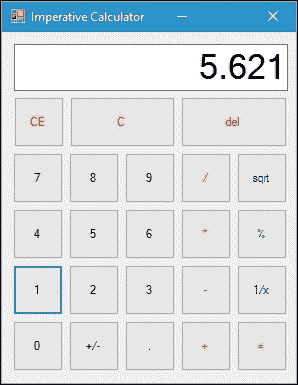

# 第十章：在 C#函数式编程中采取行动

这是本书最重要的一章，因为我们将使用函数式方法创建一个新的应用程序。我们已经在前几章中深入讨论了函数式编程，包括函数式编程概念、语言集成查询（**LINQ**）、递归、优化和模式。我们现在要做的是以命令式方法开发一个应用程序，然后将其重构为函数式方法。

在本章中，我们将创建一个 Windows 窗体应用程序，并探索如何创建一个窗体，然后向其添加代码。完成本章后，我们将能够将 Windows 窗体应用程序从命令式方法重构为函数式方法。

在本章中，我们将涵盖以下主题：

+   创建一个 Windows 窗体应用程序

+   探索如何创建一个窗体，然后向其添加代码

+   在命令式方法中创建引擎代码

+   将引擎代码从命令式转换为函数式方法

# 在 Windows 窗体中开发函数式编程

现在，我们将在 Windows 窗体应用程序中开发一个计算器应用程序。为此，我们必须创建一个新的 Windows 窗体项目和一个新的窗体，其中包含数字 0 到 9 和其他功能的多个按钮，如下面的屏幕截图所示：



如您所见，我们有 10 个按钮，代表数字 0 到 9 和标准数学运算符，如加（**+**），减（**-**），乘（*****）和除（**/**）。我们还有一些额外的功能按钮；它们是平方根（**sqrt**），百分比（**%**）和倒数（**1/x**）。其余包括这些按钮：切换符号（**+/-**），小数点（**.**），清除输入（**CE**），全部清除（**C**）和退格（**del**）。我们还有一个文本框来显示我们输入的数字，并设置在窗体的顶部。最后但并非最不重要的是，在所有计算器应用程序中都有一个等号按钮。我们给所有这些控件命名，如下面的代码片段所示：

```cs
namespace CalculatorImperative 
{ 
  partial class Form1 
  { 
    private System.Windows.Forms.Button btn0; 
    private System.Windows.Forms.Button btn1; 
    private System.Windows.Forms.Button btn2; 
    private System.Windows.Forms.Button btn3; 
    private System.Windows.Forms.Button btn4; 
    private System.Windows.Forms.Button btn5; 
    private System.Windows.Forms.Button btn6; 
    private System.Windows.Forms.Button btn7; 
    private System.Windows.Forms.Button btn8; 
    private System.Windows.Forms.Button btn9; 
    private System.Windows.Forms.Button btnSwitchSign; 
    private System.Windows.Forms.Button btnDecimal; 
    private System.Windows.Forms.Button btnAdd; 
    private System.Windows.Forms.Button btnDivide; 
    private System.Windows.Forms.Button btnMultiply; 
    private System.Windows.Forms.Button btnSubstract; 
    private System.Windows.Forms.Button btnEquals; 
    private System.Windows.Forms.Button btnSqrt; 
    private System.Windows.Forms.Button btnPercent; 
    private System.Windows.Forms.Button btnInverse; 
    private System.Windows.Forms.Button btnDelete; 
    private System.Windows.Forms.Button btnClearAll; 
    private System.Windows.Forms.Button btnClearEntry; 
    private System.Windows.Forms.TextBox txtScreen; 
  } 
} 

```

在我们拥有所有这些控件之后，以下代码片段仅包含控件的名称和单击事件（如果有的话），我们必须设置以便简化此应用程序的创建，因为控件的名称未更改：

```cs
namespace CalculatorImperative 
{ 
  partial class Form1 
  { 
    private void InitializeComponent() 
    { 
      this.btn0.Name = "btn0"; 
      this.btn0.Click += 
        new System.EventHandler(this.btnNumber_Click); 
      this.btn1.Name = "btn1"; 

      // The rest of code can be found  
      // in the downloaded source code 
    } 
  } 
} 

```

附加设置，如控件的轴位置、字体或对齐方式，不重要，因为这些设置不会影响整个代码。

## 创建窗体的代码后台

窗体中的所有控件都已设置好，现在我们准备向其添加一些代码。如前面代码片段中的所有事件点击中所示，当按下特定按钮时，将调用五个函数：`btnNumber_Click()`，`btnFunction_Click()`，`btnEquals_Click()`，`btnClear_Click()`和`btnOperator_Click()`。

`btnNumber_Click()`函数用于 0 到 9 按钮。`btnFunction_Click()`函数用于`btnSwitchSign`，`btnDecimal`，`btnSqrt`，`btnPercent`，`btnInverse`和`btnDelete`按钮。`btnEquals_Click()`函数用于`btnEquals`按钮。`btnClear_Click()`函数用于`btnClearAll`和`btnClearEntry`按钮。`btnOperator_Click()`用于`btnAdd`，`btnSubstract`，`btnDivide`和`btnMultiply`按钮。还将有一些我们将讨论的辅助函数。

现在让我们看一下以下代码片段，其中包含了`btnNumber_Click()`函数的实现：

```cs
namespace CalculatorImperative 
{ 
  public partial class Form1 : Form 
  { 
    private void btnNumber_Click(object sender, EventArgs e) 
    { 
      Button btnNum = sender as Button; 
      int numValue; 
      switch (btnNum.Name) 
      { 
        case "btn1": 
          numValue = 1; 
          break; 
        case "btn2": 
          numValue = 2; 
          break; 
        case "btn3": 
          numValue = 3; 
          break; 
        case "btn4": 
          numValue = 4; 
          break; 
        case "btn5": 
          numValue = 5; 
          break; 
        case "btn6": 
          numValue = 6; 
          break; 
        case "btn7": 
          numValue = 7; 
          break; 
        case "btn8": 
          numValue = 8; 
          break; 
        case "btn9": 
          numValue = 9; 
          break; 
        default: 
          numValue = 0; 
          break; 
      } 
      CalcEngine.AppendNum(numValue); 
      UpdateScreen(); 
    } 
  } 
} 

```

如前面的代码片段所示，`btnNumber_Click()`函数将检测按下的数字按钮，然后在文本框中显示它。现在，让我们暂时跳过`CalcEngine.AppendNum()`和`UpdateScreen()`函数，因为我们将在后面讨论它们。

让我们继续看`btnFunction_Click()`函数，它将在按下功能按钮时执行一个操作。该函数的实现如下：

```cs
namespace CalculatorImperative 
{ 
  public partial class Form1 : Form 
  { 
    private void btnFunction_Click(object sender, EventArgs e) 
    { 
      Button btnFunction = sender as Button; 
      string strValue; 
      switch (btnFunction.Name) 
      { 
        case "btnSqrt": 
          strValue = "sqrt"; 
          break; 
        case "btnPercent": 
          strValue = "percent"; 
          break; 
        case "btnInverse": 
          strValue = "inverse"; 
          break; 
        case "btnDelete": 
          strValue = "delete"; 
          break; 
        case "btnSwitchSign": 
          strValue = "switchSign"; 
          break; 
        case "btnDecimal": 
          strValue = "decimal"; 
          break; 
        default: 
          strValue = ""; 
          break; 
      } 
      CalcEngine.FunctionButton(strValue); 
      UpdateScreen(); 
    } 
  } 
} 

```

从前面的代码片段可以看出，`btnFunction_Click()`将在按下`btnSqrt`、`btnPercent`、`btnInverse`、`btnDelete`、`btnSwitchSign`或`btnDecimal`按钮时采取行动。

负责当操作符按钮之一被按下时的函数，以下是`btnOperator_Click()`函数实现的代码片段：

```cs
namespace CalculatorImperative 
{ 
  public partial class Form1 : Form 
  { 
    private void btnOperator_Click(object sender, EventArgs e) 
    { 
      Button btnOperator = sender as Button; 
      string strOperator = ""; 
      switch (btnOperator.Name) 
      { 
        case "btnAdd": 
          strOperator = "add"; 
          break; 
        case "btnSubtract": 
          strOperator = "subtract"; 
          break; 
        case "btnMultiply": 
          strOperator = "multiply"; 
          break; 
        case "btnDivide": 
          strOperator = "divide"; 
          break; 
      } 
      CalcEngine.PrepareOperation( 
        strOperator); 
      UpdateScreen(); 
    } 
  } 
} 

```

前面的`btnOperator()`函数将用于运行每个操作符的操作：加、减、乘、除。然后调用`CalcEngine`类中的`PrepareOperation()`方法，我们稍后会讨论。

要清除一个条目或所有条目，我们有两个按钮：`btnClearEntry`和`btnClearAll`。这两个按钮每次生成按下事件时都会调用`btnClear_Click()`方法。该函数的实现如下：

```cs
namespace CalculatorImperative 
{ 
  public partial class Form1 : Form 
  { 
    private void btnClear_Click(object sender, EventArgs e) 
    { 
      if (sender is System.Windows.Forms.Button) 
      { 
        Button btnClear = sender as Button; 
        switch (btnClear.Name) 
        { 
          case "btnClearAll": 
            CalcEngine.ClearAll(); 
            UpdateScreen(); 
            break; 
          case "btnClearEntry": 
            CalcEngine.Clear(); 
            UpdateScreen(); 
            break; 
        } 
      } 
    } 
  } 
} 

```

`CalcEngine`类中也有两个方法，当这两个清除按钮被按下时会被调用：`CalcEngine.Clear()`用于`btnClearEntry`按钮，`CalcEngine.ClearAll()`用于`btnClearAll`按钮。

我们拥有的最后一个按钮是`btnEquals`按钮，每次按下时都会调用`btnClear_Click()`方法；实现如下：

```cs
namespace CalculatorImperative 
{ 
  public partial class Form1 : Form 
  { 
    private void btnEquals_Click(object sender, EventArgs e) 
    { 
      //Attempt to solve the math 
      if (!CalcEngine.Solve()) 
      { 
        btnClearAll.PerformClick(); 
      } 
      UpdateScreen(); 
    } 
  } 
} 

```

从前面的代码片段可以看出，当按下`btnEquals`按钮时，它会尝试计算用户在调用`CalcEngine.Solve()`方法之前给出的操作，然后更新文本框。如果计算失败，它将清除条目。

现在，让我们创建`UpdateScreen()`方法，用于将当前数字显示到`txtScreen`文本框中。实现如下：

```cs
namespace CalculatorImperative 
{ 
  public partial class Form1 : Form 
  { 
    private void UpdateScreen() 
    { 
      txtScreen.Text = FormatDisplay( 
        Convert.ToString( 
        CalcEngine.GetDisplay())); 
    } 
  } 
} 

```

在`UpdateScreen()`方法内，调用`FormatDisplay()`方法来在`txtScreen`上形成显示。`FormatDisplay()`方法的实现如下：

```cs
namespace CalculatorImperative 
{ 
  public partial class Form1 : Form 
  { 
    private string FormatDisplay( 
      string str) 
    { 
      String dec = ""; 
      int totalCommas = 0; 
      int pos = 0; 
      bool addNegative = false; 

      if (str.StartsWith("-")) 
      { 
        str = str.Remove(0, 1); 
        addNegative = true; 
      } 

      if (str.IndexOf(".") > -1) 
      { 
        dec = str.Substring( 
          str.IndexOf("."), 
        str.Length - str.IndexOf(".")); 
        str = str.Remove( 
          str.IndexOf("."), 
          str.Length - str.IndexOf(".")); 
      } 

      if (Convert.ToDouble(str) < 
        Math.Pow(10, 19)) 
      { 
        if (str.Length > 3) 
        { 
          totalCommas = 
            (str.Length - (str.Length % 3)) / 3; 

          if (str.Length % 3 == 0) 
          { 
            totalCommas--; 
          } 

          pos = str.Length - 3; 
          while (totalCommas > 0) 
          { 
            str = str.Insert(pos, ","); 
            pos -= 3; 
            totalCommas--; 
          } 
        } 
      } 

      str += "" + dec; 
      if (str.IndexOf(".") == -1) 
      { 
        str = str + "."; 
      } 

      if (str.IndexOf(".") == 0) 
      { 
        str.Insert(0, "0"); 
      } 
      else if (str.IndexOf(".") == 
        str.Length - 2 &&  
        str.LastIndexOf("0") ==  
        str.Length - 1) 
      { 
        str = str.Remove(str.Length - 1); 
      } 

      if (addNegative) 
      { 
        str = str.Insert(0, "-"); 
      } 

      return str; 
    } 
  } 
} 

```

根据前面的`FormatDisplay()`函数实现，首先发生的是函数检查它是否为负数。如果是，首先将移除负号，然后`addNegative`标志将为`true`，如下面的代码片段所示：

```cs
if (str.StartsWith("-")) 
{ 
  str = str.Remove(0, 1); 
  addNegative = true; 
} 

```

然后查找小数点（`.`）字符以指示它是一个小数。如果找到小数点，它将把小数部分存储在`dec`变量中，其余部分存储在`str`变量中，如下面的代码片段所示：

```cs
if (str.IndexOf(".") > -1) 
{ 
  dec = str.Substring( 
    str.IndexOf("."), 
    str.Length - str.IndexOf(".")); 
  str = str.Remove( 
    str.IndexOf("."), 
    str.Length - str.IndexOf(".")); 
} 

```

现在，函数将确保数字小于 10¹⁹。如果是，以下代码片段将格式化数字：

```cs
if (Convert.ToDouble(str) <  
  Math.Pow(10, 19)) 
{ 
  if (str.Length > 3) 
  { 
    totalCommas = 
      (str.Length - (str.Length % 3)) / 3; 

    if (str.Length % 3 == 0) 
    { 
      totalCommas--; 
    } 

    pos = str.Length - 3; 
    while (totalCommas > 0) 
    { 
      str = str.Insert(pos, ","); 
      pos -= 3; 
      totalCommas--; 
    } 
  } 
} 

```

从前面的格式中得到的结果将与`dec`变量连接。如果`dec`变量中没有小数部分，则小数点字符将被添加到最后位置，如下面的代码片段所示：

```cs
str += "" + dec; 
if (str.IndexOf(".") == -1) 
{ 
  str = str + "."; 
} 

```

如果只有小数部分可用，则`0`字符将被添加到第一个位置，如下面的代码片段所示：

```cs
if (str.IndexOf(".") == 0) 
{ 
  str.Insert(0, "0"); 
} 
else if (str.IndexOf(".") == 
  str.Length - 2 && 
  str.LastIndexOf("0") == 
  str.Length - 1) 
{ 
  str = str.Remove(str.Length - 1); 
} 

```

最后，我们检查`addNegative`标志是否为`true`。如果是，负号（`-`）将被添加到第一个位置，如下所示：

```cs
if (addNegative) 
{ 
  str = str.Insert(0, "-"); 
} 

```

## 以命令式方法创建引擎代码

我们已成功创建了表单的后台代码。现在让我们在名为`CalcEngine`的包装类中创建引擎代码。我们将在`CalculatorImperative.csproj`项目中的`CalcEngine.cs`文件中设计它。

### 准备类属性

在这个计算器引擎类中，我们需要一些属性来保存参与计算过程的特定值。以下是我们将在计算过程中使用的类属性声明的代码片段：

```cs
namespace CalculatorImperative 
{ 
  internal class CalcEngine 
  { 
    // This is the behind the scenes number  
    // that represents what will be on the display  
    // and what number to store as last input 
    private static string m_input; 

    // Sign of the number (positive or negative) 
    private static string m_sign; 

    // Current operator selected (+, -, * or /) 
    public static String m_operator; 

    // Last result displayed 
    private static String m_lastNum; 

    // Last input made 
    private static String m_lastInput; 

    // If the calculator should start a new input 
    // after a number is hit 
    public static bool m_wait; 

    // If the user is entering in decimal values 
    public static bool m_decimal; 

    // If the last key that was hit was the equals button 
    private static bool m_lastHitEquals;  
  } 
} 

```

如您所见，有八个属性将参与计算过程。`m_input`属性将保存我们输入的所有值和格式化数字`m_sign`将存储数字是`+`还是`-`。`m_operator`属性将存储运算符，即`+`表示加法，`-`表示减法，`*`表示乘法，`/`表示除法。`m_lastNum`属性将保存计算结果。`m_lastInput`属性将保存用户输入的最后一个数字。`m_wait`属性是一个标志，表示数字已经输入，现在是等待运算符和下一个数字的时间。`m_decimal`属性标志表示是否为小数。`m_lastHitEquals`属性标志表示`btnEquals`是否已被按下。

### 构造构造函数

在每个类中，最好有一个构造函数来准备类的属性。这个类也是一样。以下是类构造函数实现的代码片段：

```cs
namespace CalculatorImperative 
{ 
  internal class CalcEngine 
  { 
    static CalcEngine() 
    { 
      // "." is used to represent no input 
      // which registers as 0 
      m_input = "."; 

      m_sign = "+"; 
      m_operator = null; 
      m_lastNum = null; 
      m_lastInput = null; 
      m_wait = false; 
      m_decimal = false; 
      m_lastHitEquals = false; 
    } 
  } 
} 

```

从上面的代码片段可以看出，如果我们想要重置所有类属性，我们必须调用构造函数，即`CalcEngine()`。对于`m_input`，我们使用点（`.`）字符表示没有用户输入。我们还使用`static`修饰符，因为类将直接通过类名而不是类的实例来调用。

### 清除属性

之前，我们讨论过我们有两个清除方法：`ClearAll()`和`Clear()`，如下所示：

```cs
switch (btnClear.Name) 
{ 
  case "btnClearAll": 
    CalcEngine.ClearAll(); 
    UpdateScreen(); 
    break; 
  case "btnClearEntry": 
    CalcEngine.Clear(); 
    UpdateScreen(); 
    break; 
} 

```

上面的代码片段是从`btnClear_Click()`方法中提取的。以下是`ClearAll()`方法的实现：

```cs
namespace CalculatorImperative 
{ 
  internal class CalcEngine 
  { 
    // Resets all variables 
    public static void ClearAll() 
    { 
      //Reset the calculator 
      m_input = "."; 
      m_lastNum = null; 
      m_lastInput = null; 
      m_operator = null; 
      m_sign = "+"; 
      m_wait = false; 
      m_decimal = false; 
      m_lastHitEquals = false; 
    } 
  } 
} 

```

`ClearAll()`方法将重置`CalcEngine`类的所有属性。这类似于类构造函数的实现。因此，我们可以修改类构造函数的实现如下：

```cs
namespace CalculatorImperative 
{ 
  internal class CalcEngine 
  { 
    static CalcEngine() 
    { 
      ClearAll(); 
    } 
  } 
} 

```

我们还有`Clear()`方法只清除最后一个条目。为此，我们只需要重置`m_sign`，`m_input`和`m_decimal`。`Clear()`方法的实现如下：

```cs
namespace CalculatorImperative 
{ 
  internal class CalcEngine 
  { 
    // For Clear Entry,  
    // just reset appropriate variable 
    public static void Clear() 
    { 
      //Just clear the current input 
      m_sign = "+"; 
      m_input = "."; 
      m_decimal = false; 
    } 
  } 
} 

```

### 将数字附加到显示框

我们知道，我们有一个文本框来显示我们输入的数字或显示计算结果。在`btnNumber_Click()`方法的实现中，我们调用`CalcEngine.AppendNum()`方法，以下是其实现：

```cs
namespace CalculatorImperative 
{ 
  internal class CalcEngine 
  { 
    // Appends number to the input 
    public static void AppendNum( 
      double numValue) 
    { 
      if (numValue == Math.Round(numValue) && 
        numValue >= 0) 
      { 
         // The rest of code can be found  
         // in the downloaded source code 
      } 
      // If they're trying to append a decimal or negative,  
      // that's impossible so just replace the entire input 
      // with that value 
      else 
      { 
         // The rest of code can be found  
         // in the downloaded source code 
      } 
    } 
  } 
} 

```

从上面的代码可以看出，我们必须区分带有负号的数字或带有点号标记的小数。为此，我们使用以下代码片段：

```cs
if (numValue == Math.Round(numValue) && 
    numValue >= 0) 

```

如果它是一个没有负数或小数点的纯数字，我们检查`m_input`是否为空或`m_wait`标志是否为`true`。如果是，我们可以继续进程。如果小数标志打开，我们就不需要再插入点号了；否则，我们必须添加点号。以下代码片段将更详细地解释我们的解释：

```cs
if (!IsEmpty()) 
{ 
  // if decimal is turned on 
  if (m_decimal) 
  { 
    m_input += "" + numValue; 
  } 
  else 
  { 
    m_input = m_input.Insert( 
      m_input.IndexOf("."), "" + numValue); 
  } 
} 

```

如您所见，我们调用`IsEmpty()`函数来检查`m_input`是否为空或`m_wait`标志是否为 true。函数的实现如下：

```cs
namespace CalculatorImperative 
{ 
  internal class CalcEngine 
  { 
    // Indicate that user doesn't input value yet 
    private static bool IsEmpty() 
    { 
      if (m_input.Equals(".") || m_wait) 
        return true; 
      else 
        return false; 
    } 
  } 
} 

```

如果`IsEmpty()`返回`true`，它将继续进程，如下所示：

```cs
if (m_lastHitEquals)  
{ 
  ClearAll(); 
  m_lastHitEquals = false; 
} 

if (m_decimal) 
{ 
  m_input = "." + numValue; 
} 
else 
{ 
  m_input = numValue + "."; 
} 
m_wait = false; 

```

从上面的代码，首先，我们检查`m_lastHitEquals`标志是否打开。如果是，我们重置所有类属性，然后将`m_lastHitEquals`设置为关闭。然后，我们检查`m_decimal`标志是否打开。如果是，将点号插入数字前面。如果不是，在数字后面插入点号。之后，关闭`m_wait`标志。

我们还必须确保没有插入不必要的零，使用以下代码片段：

```cs
if (m_input.IndexOf("0", 0, 1) == 0 && 
  m_input.IndexOf(".") > 1) 
{ 
  //Get rid of any extra zeroes  
  //that may have been prepended 
  m_input = m_input.Remove(0, 1); 
} 

```

上面的代码将处理用户输入，如果不包含负号（`-`）或点号。如果有，我们必须使用以下代码片段来检查它是否有这些标记：

```cs
if (m_input.Contains(".") && 
  !(m_input.EndsWith("0") && 
  m_input.IndexOf(".") == 
  m_input.Length - 2)) 
{ 
  m_decimal = true; 
} 

if (m_input.Contains("-")) 
{ 
  m_sign = "-"; 
} 
else 
{ 
  m_sign = "+"; 
} 

```

然而，在执行上述过程之前，我们必须重置所有类属性并重新格式化数字如下：

```cs
// Start over if the last key hit  
// was the equals button  
// and no operators were chosen 
if (m_lastHitEquals)  
{ 
  ClearAll(); 
  m_lastHitEquals = false; 
} 
m_input = "" + numValue; 

// Reformat 
m_input = FormatInput(m_input); 
if (!m_input.Contains(".")) 
{ 
  m_input += "."; 
} 

```

再次，我们删除不必要的零并关闭`m_wait`标志，如下所示：

```cs
// Get rid of any extra zeroes 
// that may have been prepended or appended 
if (m_input.IndexOf("0", 0, 1) == 0 && 
  m_input.IndexOf(".") > 1) 
{ 
  m_input = m_input.Remove(0, 1); 
} 

if (m_input.EndsWith("0") &&  
  m_input.IndexOf(".") == m_input.Length - 2) 
{ 
  m_input.Remove(m_input.Length - 1); 
} 

m_wait = false; 

```

### 准备数学运算

当我们按下运算符按钮之一时，将触发`btnOperator_Click()`函数；在函数内部，有一个`CalcEngine.PrepareOperation()`函数来准备计算。`CalcEngine.PrepareOperation()`函数的实现如下：

```cs
namespace CalculatorImperative 
{ 
  internal class CalcEngine 
  { 
    // Handles operation functions 
    public static void PrepareOperation( 
      string strOperator) 
    { 
      switch (strOperator) 
      { 
         // The rest of code can be found  
         // in the downloaded source code 
      } 
    } 
  } 
} 

```

上述代码的解释很简单。我们只需要知道用户按下了哪个按钮，+，-，***，**或/。然后，我们检查用户输入的是否是第一个数字，方法是检查`m_lastNum`是否为空，或者`m_wait`是否打开。如果是，我们在确保`m_lastNum`不为空，`m_lastHitEquals`关闭，`m_wait`关闭，并且当前`m_operator`与用户刚刚按下的运算符不同的情况下解决计算。之后，我们用用户输入的当前运算符替换`m_operator`，并用已格式化的`m_input`填充`m_lastNum`。还必须应用其他设置。以下代码片段将更好地解释这一点：

```cs
// If this is the first number  
// that user inputs 
if (m_lastNum == null || 
  m_wait) 
{ 
  if (m_lastNum != null && 
    !m_operator.Equals("+") && 
    !m_lastHitEquals && 
    !m_wait) 
  Solve(); 
  m_operator = "+"; 
  m_lastNum = "" + FormatInput(m_input); 
  m_sign = "+"; 
  m_decimal = false; 
  m_wait = true; 
} 

```

否则，如果这不是用户输入的第一个数字，我们可以执行以下过程：

```cs
else 
{ 
    if (!m_wait) 
        Solve(); 
    m_operator = "+"; 
    m_sign = "+"; 
    m_wait = true; 
} 

```

### 格式化输入

在我们进入上一个`PrepareOperation()`函数中讨论的`Solve()`函数实现之前，让我们先讨论`FormatInput()`函数。以下是`FormatInput()`方法的实现：

```cs
namespace CalculatorImperative 
{ 
    internal class CalcEngine 
    { 
        // Formats the input into a valid double format 
        private static string FormatInput( 
            string str) 
        { 
            // Format the input to something convertable  
            // by Convert.toDouble 

            // Prepend a Zero  
            // if the string begins with a "." 
            if (str.IndexOf(".") == 0)  
            { 
                str = "0" + str; 
            } 

            // Appened a Zero  
            // if the string ends with a "." 
            if (str.IndexOf(".") ==  
                str.Length - 1)  
            { 
                str = str + "0"; 
            } 

            // If negative is turned on  
            // and there's no "-"  
            // in the current string 
            // then "-" is prepended 
            if (m_sign.Equals("-") &&  
                str != "0.0" &&  
                str.IndexOf("-") == -1)  
            { 
                str = "-" + str; 
            } 

            return str; 
        } 
    } 
} 

```

`FormatInput()`方法用于形成将显示在`txtScreen`文本框中的数字。

### 解决计算

当我们按下`btnEquals`按钮或具有先前输入的运算符按钮时，将调用`Solve()`方法来计算操作。以下是该方法的实现：

```cs
namespace CalculatorImperative 
{ 
    internal class CalcEngine 
    { 
        // Solve the currently stored expression 
        public static bool Solve() 
        { 
            bool canSolve = true; 

            // The rest of code can be found  
            // in the downloaded source code 

            return canSolve; 
        } 
    } 
} 

```

### 计算附加操作

正如我们讨论过的，我们还有其他功能按钮：`btnSqrt`，`btnPercent`，`btnInverse`，`btnDelete`，`btnSwitchSign`和`btnDecimal`按钮。以下是如果按下其中一个按钮将被调用的方法：

```cs
namespace CalculatorImperative 
{ 
    internal class CalcEngine 
    { 
        // Handles decimal square roots,  
        // decimal buttons, percents, inverse, delete,  
        // and sign switching 
        public static bool FunctionButton( 
            string str) 
        { 
            bool success = false; 
            switch (str) 
            { 
               // The rest of code can be found  
               // in the downloaded source code 
            } 
            return success; 
        } 
    } 
} 

```

## 在功能方法中创建引擎代码

我们已成功使用命令式方法创建了计算器应用程序。现在，是时候将所有命令式代码重构为功能代码。我们将首先重构引擎，然后是表单后面的代码。

### 添加几个新属性

我们将与命令式代码完全相同的属性，只是添加了三个新属性，如下所示：

```cs
namespace CalculatorFunctional 
{ 
    public class Calc 
    { 
        public string m_input { get; set; } 
        public string m_sign { get; set; } 
        public string m_operator { get; set; } 
        public string m_lastNum { get; set; } 
        public string m_lastInput { get; set; } 
        public bool m_wait { get; set; } 
        public bool m_decimal { get; set; } 
        public bool m_lastHitEquals { get; set; } 

        public bool m_solve { get; set; } 
        public string m_answer { get; set; } 
        public bool m_funcSuccess { get; set; } 
    } 
} 

```

正如您在上述代码中所看到的，`m_solve`，`m_answer`和`m_funcSuccess`是我们刚刚添加的新属性。我们稍后将在`Solve()`函数中使用这三个附加属性。

### 简化模式匹配

正如我们在第九章“使用模式”中讨论的那样，我们将使用`Simplicity`类，我们可以在`SimplicityLib.cs`文件中找到。该类的实现如下：

```cs
namespace CalculatorFunctional 
{ 
    public static class CalcMethodsExtension 
    { 
        public static Calc AppendNum( 
            this Calc calc, 
            double numValue) 
        {             
           // The rest of code can be found  
           // in the downloaded source code 
        } 

        public static Calc AppendNumWhenRound( 
            this Calc calc, 
            double numValue) 
        { 
           // The rest of code can be found  
           // in the downloaded source code 
        } 

        // The rest of code can be found  
        // in the downloaded source code  
    } 
} 

```

### 分配属性

为了能够分配属性，我们需要分配属性的扩展方法。以下代码将更好地解释这一点：

```cs
namespace CalculatorFunctional 
{ 
    public static class CalcPropertiesExtension 
    { 
        public static Calc Input( 
            this Calc calc, 
            string input) 
        { 
            calc.m_input = 
                input; 
            return calc; 
        } 

        public static Calc LastNum( 
            this Calc calc, 
            string lastNum) 
        { 
            calc.m_lastNum = 
                lastNum; 
            return calc; 
        } 

        // The rest of code can be found  
        // in the downloaded source code 

        public static Calc ModifyCalcFuncSuccess( 
            this Calc calc, 
            bool val) 
        { 
            calc.m_funcSuccess = val; 
            return calc; 
        } 

        public static Calc ModifyCalcFuncSuccessBasedOn( 
            this Calc calc, 
            Func<bool> predicate) 
        { 
            return predicate() ? 
                calc.ModifyCalcFuncSuccess(true) : 
                calc.ModifyCalcFuncSuccess(false); 
        } 
    } 
} 

```

每次调用上述方法之一时，该方法将返回已更改目标属性的`Calc`类。

### 通过清除属性构造类

在这种功能方法中，我们不会构造类；我们将清除属性以使所有属性准备好运行该过程。我们将使用两种清除方法：`Clear()`和`ClearAll()`方法。以下代码片段是这两种方法的实现：

```cs
namespace CalculatorFunctional 
{ 
    public static class CalcMethodsExtension 
    { 
        public static Calc Clear( 
            this Calc calc) 
        { 
            return calc 
                .ModifyCalcSign("+") 
                .ModifyCalcInput(".") 
                .ModifyCalcDecimal(false); 
        } 

        public static Calc ClearAll( 
            this Calc calc) 
        { 
            return calc 
                .Clear() 
                .ModifyCalcLastNum(null) 
                .ModifyCalcLastInput(null) 
                .ModifyCalcOperator(null) 
                .ModifyCalcWait(false) 
                .ModifyCalcLastHitEquals(false); 
        } 
    } 
} 

```

在我们讨论命令式方法时，`Clear()`方法是用于`btnClearEntry`按钮的，`ClearAll()`是用于`btnClearAll`按钮的。

### 将输入的数字附加到文本框

在这种功能性方法中，我们将把命令式方法中的`AppendNum()`方法重构为功能性方法，如下所示：

```cs
namespace CalculatorFunctional 
{ 
    public static class CalcMethodsExtension 
    { 
        public static Calc AppendNum( 
            this Calc calc, 
            double numValue) 
        { 
            // The rest of code can be found  
            // in the downloaded source code 
        } 

        public static Calc AppendNumWhenRound( 
            this Calc calc, 
            double numValue) 
        { 
           // The rest of code can be found  
           // in the downloaded source code 
        } 

        // The rest of code can be found  
        // in the downloaded source code  
    } 
} 

```

### 准备操作

为了在按下运算符按钮后准备操作，以下代码是从命令式方法中重构的`PreparingOperation()`方法：

```cs
namespace CalculatorFunctional 
{ 
    public static class CalcMethodsExtension 
    { 
        public static Calc PrepareOperation( 
            this Calc calc, 
            string strOperator) 
        { 
            // The rest of code can be found  
            // in the downloaded source code 
        } 

        public static Calc PrepareOperationAdd( 
            this Calc calc) 
        { 
            // The rest of code can be found  
            // in the downloaded source code 
        } 

        public static Calc  
            PrepareOperationAddLastNumNull( 
                this Calc calc) 
        { 
            // The rest of code can be found  
            // in the downloaded source code 
        } 

        // The rest of code can be found  
        // in the downloaded source code 
    } 
} 

```

### 格式化输入

为了格式化我们用来形成`txtScreen`输入的输入，我们将使用以下代码：

```cs
namespace CalculatorFunctional 
{ 
    public static class CalcMethodsExtension 
    { 
        public static String FormatInput( 
            this Calc calc,  
            String n) 
        { 
            return n 
                .ModifyStringWhen( 
                    () => n.IndexOf(".") == 0, 
                    () => n = "0" + n) 
                .ModifyStringWhen( 
                    () => n.IndexOf(".") == n.Length - 1, 
                    () => n = n + "0") 
                .ModifyStringWhen( 
                    () => calc.m_sign.Equals("-") && 
                        n != "0.0" && 
                        n.IndexOf("-") == -1, 
                    () => n = "-" + n); 
        } 
    } 
} 

```

正如您在上述代码中所看到的，我们使用了`ModifyStringWhen()`扩展方法，其实现如下：

```cs
namespace CalculatorFunctional 
{ 
  public static class StringMethodsExtension 
  { 
    public static string ModifyStringWhen( 
      this string @this, 
      Func<bool> predicate, 
      Func<string> modifier) 
    { 
      return predicate() 
      ? modifier() 
      : @this; 
    } 
  } 
} 

```

### 解决计算

解决计算可以使用命令式方法中的`Solve()`方法。以下代码是从命令式方法中重构的`Solve()`方法：

```cs
namespace CalculatorFunctional 
{ 
  public static class CalcMethodsExtension 
  { 
    public static Calc Solve( 
      this Calc calc) 
    { 
      return calc.CleanUp() 
      .Answer() 
      .UpdateAnswerToCalc(); 
    } 
  } 
} 

```

对于`CleanUp()`，`Answer()`和`UpdateAnswerToCalc()`方法的实现，我们可以使用以下代码：

```cs
namespace CalculatorFunctional 
{ 
    public static class CalcSolveMethodsExtension 
    { 
        public static Calc Answer( 
            this Calc calc) 
        { 
            calc.m_answer = calc.m_operator.Match() 
                .With(o => o == "+",  
                    calc.m_lastNum.SolveAdd( 
                        calc.m_lastInput)) 
                .With(o => o == "-",  
                    calc.m_lastNum.SolveSubtract( 
                        calc.m_lastInput)) 
                .With(o => o == "*",  
                    calc.m_lastNum.SolveMultiply( 
                        calc.m_lastInput)) 
                .With(o => o == "/",  
                    !calc.FormatInput( 
                        calc.m_lastInput).Equals( 
                            "0.0") ?  
                        calc.m_lastNum.SolveDivide( 
                            calc.m_lastInput) :  
                        "") 
                .Else("") 
                .Do(); 

            calc.m_solve = calc.m_answer.Match() 
                .With(o => o.Equals(""), false) 
                .Else(true) 
                .Do(); 

            return calc; 
        } 

        public static Calc CleanUp( 
            this Calc calc) 
        { 
            return calc 
                .ModifyCalcInputWhen( 
                    () => calc.m_input.Equals(""), 
                    "0") 
                .ModifyCalcLastNumWhen( 
                    () => calc.m_lastNum == null || 
                        calc.m_lastNum.Equals(""), 
                    "0,0") 
                .ModifyCalcLastInputWhen( 
                    () => !calc.m_wait, 
                    "" + calc.FormatInput( 
                        calc.m_input)); 
        } 

        public static Calc UpdateAnswerToCalc( 
            this Calc calc) 
        { 
            calc.m_lastNum = calc.m_answer; 
            calc.m_input = calc.m_answer; 
            calc.m_sign = "+"; 
            calc.m_decimal = false; 
            calc.m_lastHitEquals = true; 
            calc.m_wait = true; 

            calc.m_solve = true; 
            return calc; 
        } 
    } 
} 

```

我们还需要为`string`数据类型创建扩展方法，以适应加法、减法、乘法和除法运算，如下所示：

```cs
namespace CalculatorFunctional 
{ 
    public static class StringMethodsExtension 
    { 
        public static string SolveAdd( 
            this string @string,  
            string str) 
        { 
            return Convert.ToString( 
                Convert.ToDouble(@string) + 
                Convert.ToDouble(str)); 
        } 

        public static string SolveSubtract( 
            this string @string, 
            string str) 
        { 
            return Convert.ToString( 
                Convert.ToDouble(@string) - 
                Convert.ToDouble(str)); 
        } 

        public static string SolveMultiply( 
            this string @string, 
            string str) 
        { 
            return Convert.ToString( 
                Convert.ToDouble(@string) * 
                Convert.ToDouble(str)); 
        } 

        public static string SolveDivide( 
            this string @string, 
            string str) 
        { 
            return Convert.ToString( 
                Convert.ToDouble(@string) / 
                Convert.ToDouble(str)); 
        } 
    } 
} 

```

### 计算额外的操作

对于附加按钮，每次按下附加按钮时都会调用`FunctionButton()`方法，以下是从命令式`FunctionButton()`方法中重构的代码：

```cs
namespace CalculatorFunctional 
{ 
    public static class CalcMethodsExtension 
    { 
        public static Calc PrepareOperation( 
            this Calc calc, 
            string strOperator) 
        { 
            // The rest of code can be found  
            // in the downloaded source code 
        } 

        public static Calc PrepareOperationAdd( 
            this Calc calc) 
        { 
            // The rest of code can be found  
            // in the downloaded source code 
        } 

        // The rest of code can be found  
        // in the downloaded source code 
    } 
} 

```

# 摘要

我们成功地在 Windows 表单中构建了一个计算器应用程序。我们还将命令式代码重构为功能性方法。我们创建了一些扩展方法来解决所有重构过程，使它们可以是功能性的。

在下一章中，我们将讨论功能性方法中的最佳实践代码，并为我们在本章中构建的应用程序执行单元测试。
