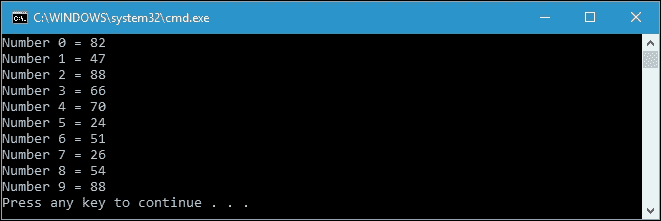
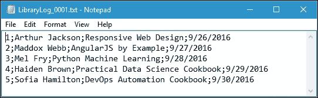
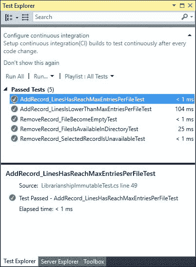

# 第十一章。编码最佳实践和测试函数式代码

在上一章中，我们开发了一个函数式应用程序。为了在函数式方法中创建更好的代码，我们必须遵循最佳实践规则并在我们的代码中实现它们。在本章中，我们将讨论函数式方法的概念，即纯函数，并使我们的函数类似于数学函数。本章将涵盖以下主题：

+   防止不诚实的签名

+   创建不可变类

+   避免“时间耦合”

+   处理副作用

+   将代码分离为`领域逻辑`和`可变外壳`

+   测试函数式代码

# 函数式 C#中的编码最佳实践

函数式方法有纯函数的概念。这意味着只要我们传递完全相同的输入，函数将产生相同的结果。现在，让我们开始讨论按照这里概述的编码最佳实践来创建更好的函数式代码。

## 防止不诚实的签名

正如我们在第一章中讨论的，*在 C#中尝试函数式风格*，我们使用数学方法来构建我们的函数式编程代码。换句话说，函数式编程是使用数学函数进行编程。数学函数必须符合两个要求，它们是：

+   数学函数应该在我们提供相同参数时始终返回相同的结果。

+   数学函数的签名应该提供所有可能接受的输入值和可能产生的输出的信息。

现在让我们看一下以下的代码片段，我们可以在`HonestSignature.csproj`项目中找到：

```cs
public partial class Program 
{ 
  public static int SumUp( 
    int a, int b) 
  { 
    return a + b; 
  } 
} 

```

通过检查前面的`SumUp()`函数，我们可以说每次传递相同的输入时，我们将获得相同的输出。现在让我们检查以下的`GenerateRandom()`函数，我们也可以在`HonestSignature.csproj`项目中找到：

```cs
public partial class Program 
{ 
  public static int GenerateRandom( 
    int max) 
  { 
    Random rnd = new Random( 
      Guid.NewGuid() 
      .GetHashCode()); 
    return rnd.Next(max); 
  } 
} 

```

从前面的代码中，我们可以看到，尽管我们不断传递相同的输入，但我们将获得不同的输出。假设我们有以下的`RunGenerateRandom()`函数：

```cs
public partial class Program 
{ 
  public static void RunGenerateRandom() 
  { 
    for (int i = 0; i < 10; i++) 
    { 
      Console.WriteLine( 
        String.Format( 
          "Number {0} = {1}", 
          i, 
          GenerateRandom(100))); 
    } 
  } 
} 

```

如果我们运行前面的`RunGenerateRandom()`函数，将在控制台上得到以下输出：



从前面的代码片段中，我们通过传递完全相同的参数，即 100，10 次调用了`GenerateRandom()`函数。正如您在前面的图中所看到的，该函数对于这 10 次调用的每一次返回了不同的输出。因此，我们必须避免类似`GenerateRandom()`函数这样的函数，以创建纯函数，因为它不是数学函数。

现在让我们看一下以下的`Divide()`函数，它将第一个参数除以第二个参数：

```cs
public partial class Program 
{ 
  public static int Divide( 
    int a, int b) 
  { 
    return a / b; 
  } 
} 

```

`Divide()`函数看起来与`SumUp()`函数相似，因为`Divide()`函数的签名接受任意两个整数并返回另一个整数。因此，如果我们传递完全相同的参数，它将返回相同的输出。但是，如果我们将 1 和 0 作为输入参数传递会怎样呢？`Divide()`函数将抛出`DivideByZeroException`错误，而不是返回一个整数值。在这种情况下，我们可以得出结论，函数的签名没有提供关于操作结果的足够信息。它看起来函数可以处理任意两个整数类型的参数，但实际上却不能。为了解决这个问题，我们可以将前面的`Divide()`函数重构为以下函数：

```cs
public partial class Program 
{ 
  public static int? Divide( 
    int a, int b) 
  { 
    if (b == 0) 
    return null; 
    return a / b; 
  } 
} 

```

正如您在前面的`Divide()`函数中所看到的，我们通过在`int`后添加问号来添加`nullable`类型，以便函数的返回可以为 null。我们还添加了一个`if`语句，以确保永远不会抛出`DivideByZeroException`错误。

## 将可变类重构为不可变类

在函数式编程中，不可变性非常重要，因为可变操作会使我们的代码不诚实。正如我们之前讨论过的，我们需要防止不诚实的操作，以便创建我们的纯函数方法。不可变性应用于数据结构 - 例如，类意味着该类的对象在其生命周期内不能被更改。换句话说，我们可以说如果类的实例在某种方式上可以被更改，那么该类是可变的，而如果我们创建实例后就无法修改该类的实例，则它是不可变的。

现在，让我们看一下以下代码，它可以在`Immutability.csproj`项目中找到，以继续我们的讨论：

```cs
namespace Immutability 
{ 
  public class UserMembership 
  { 
    private User _user; 
    private DateTime _memberSince; 
    public void UpdateUser( 
      int userId, string name) 
    { 
      _user = new User( 
       userId, 
       name); 
    } 
  } 
  public class User 
  { 
    public int Id { get; } 
    public string Name { get; } 
    public User( 
      int id, 
      string name) 
    { 
      Id = id; 
      Name = name; 
    } 
  } 
} 

```

正如您在前面的代码中所看到的，我们有一个简单的组合。`UserMembership`类由`_user`和`_memberSince`属性组成。我们还可以看到`User`类是不可变的，因为所有属性都被定义为只读。由于不可变性，`UserMembership`方法更新`_user`字段的唯一方法是创建一个新的`User`实例并用它替换旧的实例。请注意，`User`类本身在这里不包含状态，而`UserMembership`类包含。我们可以说`UpdateUser`方法通过更改对象的状态留下了副作用。

现在让我们重构`UpdateUser`方法并使其不可变。以下代码是重构`UpdateUser`方法的结果：

```cs
namespace Immutability 
{ 
  public class UserMembership 
  { 
    private readonly User _user; 
    private readonly DateTime _memberSince; 

    public UserMembership( 
      User user, 
      DateTime memberSince) 
    { 
       _user = user; 
       _memberSince = memberSince; 
    } 

 public UserMembership UpdateUser(int userId,string name) { 
      var newUser = new User(userId,name);
      return new UserMembership(newUser,_memberSince);
    }

  } 

  public class User 
  { 
    public int Id { get; } 
    public string Name { get; } 
    public User( 
      int id, 
      string name) 
    { 
      Id = id; 
      Name = name; 
    } 
  } 
} 

```

如您在前面的代码中所看到的，`UpdateUser()`方法不再更新`UserMembership`类的结构。相反，它创建一个新的`UserMembership`实例并将其作为操作的结果返回。通过重构`UpdateUser`方法，我们已经从方法中消除了副作用。现在清楚了操作的实际输出是什么。使用不可变数据使代码更易读，也有助于立即了解发生了什么，而不需要太多的努力。

## 避免可变性和时间耦合

有时，使用具有副作用的方法会损害可读性。一个方法的调用与另一个方法的调用耦合在一起。为了明确事情，让我们看一下以下代码，我们可以在`TemporalCoupling.csproj`项目中找到：

```cs
public class MembershipDatabase 
{ 
  private Address _address; 
  private Member _member; 
  public void Process( 
    string memberName, 
    string addressString) 
  { 
    CreateAddress( 
      addressString); 

    CreateMember( 
      memberName); 
    SaveMember(); 
  } 

  private void CreateAddress( 
    string addressString) 
  { 
    _address = new Address( 
      addressString); 
  } 

  private void CreateMember( 
    string name) 
  { 
    _member = new Member( 
    name, 
    _address); 
  } 

  private void SaveMember() 
  { 
    var repository = new Repository(); 
    repository.Save(_member); 
  } 
} 

public class Address 
{ 
  public string _addressString { get; } 
  public Address( 
    string addressString) 
  { 
    _addressString = addressString; 
  } 
} 

public class Member 
{ 
  public string _name { get; } 
  public Address _address { get; } 

  public Member( 
    string name, 
    Address address) 
  { 
    _name = name; 
    _address = address; 
  } 
} 

public class Repository 
{ 
  public static List<Member> customers { get; } 

  public void Save( 
    Member customer) 
  { 
    customers.Add(customer); 
  } 
} 

```

从前面的代码中，您可以看到我们有一个`MembershipDatabase`类，它处理一个新成员。它检索名为`memberName`和`addressString`的输入参数，并使用它们在数据库中插入一个新成员。`MembershipDatabase`类中的`Process()`方法首先调用`CreateAddress`方法，该方法将创建地址，然后将其保存到私有字段中。然后`CreateMember()`方法检索地址并使用它来实例化一个新的`Member`参数，该参数保存在另一个名为`member`的私有字段中。最后的方法`SaveMember()`方法将成员保存到数据库（在此示例中，我们使用`list`）。这里有一个问题。`Process()`方法中的调用与时间耦合在一起。我们必须始终以正确的顺序调用这三个方法，以使此代码正常工作。

如果我们不按正确顺序放置方法 - 例如，如果我们在`CreateMember()`方法调用之后放置`CreateAddress()`方法调用，则由于成员将无法检索所需的依赖地址，结果成员实例将无效。同样，如果我们将`SaveMember()`方法调用放在其他方法之上，它将抛出`NullReferenceException`，因为当它尝试保存成员时，成员实例仍将为 null。

时间耦合是方法签名不诚实的结果。`CreateAddress()`方法有一个输出，创建一个`address`实例，但这个输出被隐藏在副作用下，因为我们改变了`MembershipDatabase`类中的`Address`字段。`CreateMember()`方法也隐藏了操作的结果。它保存了`member`到私有字段，但也隐藏了一些输入。从`CreateMember()`方法的签名来看，我们可能会认为它只需要名称参数来创建`member`，但实际上它引用了一个全局状态，即`address`字段。

`SaveMember()`方法也发生了同样的情况。为了消除时间耦合，我们必须在方法的签名中明确指定所有的输入和输出，或者换句话说，将所有的副作用和依赖关系移到签名级别。现在，让我们将前面包含副作用的代码重构为以下代码：

```cs
public class MembershipDatabase 
{ 
  public void Process( 
    string memberName, 
    string addressString) 
  { 
    Address address = CreateAddress( 
      addressString); 
    Member member = CreateMember( 
      memberName, 
      address); 
    SaveMember(member); 
  } 

  private Address CreateAddress( 
    string addressString) 
  { 
    return new Address( 
      addressString); 
  } 

  private Member CreateMember( 
    string name, 
    Address address) 
  { 
    return new Member( 
      name, 
      address); 
  } 

  private void SaveMember( 
    Member member) 
  { 
    var repository = new Repository(); 
    repository.Save( 
      member); 
  } 
} 

public class Address 
{ 
  public string _addressString { get; } 
  public Address( 
    string addressString) 
  { 
    _addressString = addressString; 
  } 
} 

public class Member 
{ 
  public string _name { get; } 
  public Address _address { get; } 
  public Member( 
    string name, 
    Address address) 
  { 
    _name = name; 
    _address = address; 
  } 
} 

public class Repository 
{ 
  public static List<Member> customers { get; } 

  public void Save( 
    Member customer) 
  { 
    customers.Add(customer); 
  } 
} 

```

从上面的代码中，我们可以看到我们已经重构了`CreateAddress()`、`CreateMember()`、`SaveMember()`和`Process()`方法。

`CreateAddress()`方法现在返回`Address`而不是将其保存到私有字段中。在`CreateMember()`方法中，我们添加了一个新的参数`address`，并且也改变了返回类型。对于`SaveMember()`方法，我们现在在方法的签名中指定它作为一个依赖项，而不是引用私有字段。在`Process()`方法中，我们现在可以移除字段，并且成功地消除了时间耦合。

现在，我们无法在`CreateMember()`调用方法之后放置`CreateAddress()`调用方法，因为代码将无法编译。

## 处理副作用

尽管在函数式编程中我们需要创建一个纯函数，但我们无法完全避免副作用。正如你在前面的`MembershipDatabase`类中所看到的，我们有`SaveMember()`方法，它将会把 member 字段保存到数据库中。下面的代码片段将清楚地解释这一点：

```cs
private void SaveMember( 
  Member member) 
{ 
  var repository = new Repository(); 
  repository.Save( 
    member); 
} 

```

为了处理副作用，我们可以使用**命令查询分离**（**CQS**）原则来区分产生副作用和不产生副作用的方法。我们可以为产生副作用的方法调用命令，而对于不产生副作用的方法调用查询。如果方法改变了某个状态，它应该是 void 类型的方法。否则，它应该返回某些东西。使用这个 CQS 原则，我们可以通过查看方法的签名来确定方法的目的。如果方法返回一个值，它将是一个查询，不会改变任何东西。如果方法没有返回值，它必须是一个命令，并且会在系统中留下一些副作用。

从前面的`MembershipDatabase`类中，我们现在可以确定`Process()`和`SaveMember()`方法是命令类型，并且会产生一些副作用，因为它们没有返回值。相比之下，`CreateAddress()`和`CreateMember()`方法是查询，不会改变任何东西，因为它们有返回值。

# 将代码与领域逻辑和可变外壳分离

有时，当我们的代码处理业务交易时，会多次改变一些数据。在面向对象编程语言的世界中，这是一个很常见的模式。然后我们可以将我们的代码分成领域逻辑和可变外壳。在领域逻辑中，我们简化代码，使用数学函数以函数式的方式编写业务逻辑。结果，这个领域逻辑将变得容易测试。在可变外壳中，我们放置一个可变表达式；在完成业务逻辑后，我们将这样做。

## 检查包含副作用的代码

现在，让我们来检查下面的代码，其中包含了许多我们将要重构的副作用，并且可以在`DomainLogicAndMutatingState.csproj`项目中找到它：

```cs
public class Librarianship 
{ 
  private readonly int _maxEntriesPerFile; 
  public Librarianship( 
    int maxEntriesPerFile) 
  { 
    _maxEntriesPerFile = 
    maxEntriesPerFile; 
  } 

  public void AddRecord( 
    string currentFile, 
    string visitorName, 
    string bookTitle, 
    DateTime returnDate) 
  { 
     // The rest of code can be found  
     // in the downloaded source code  
  } 

  private string GetNewFileName( 
        string existingFileName) 
  { 
    // The rest of code can be found  
    // in the downloaded source code  
  } 

  public void RemoveRecord( 
      string visitorName,  
      string directoryName) 
  { 
    foreach (string fileName in Directory.GetFiles( 
            directoryName)) 
    { 
      // The rest of code can be found  
      // in the downloaded source code  
    } 
  } 
} 

```

正如您在前面的代码中所看到的，它是以一种直接的方式编写的。我们将把它的责任分成两部分：一个包含所有领域逻辑的不可变核心，以及一个包含所有可变表达式的可变外壳。

`Librarianship`类将跟踪图书馆中所有借阅者，并记录归还日期。该类使用日志文件存储借阅者的姓名、借阅书籍的标题和归还日期。日志文件内容的模式是索引号、分号、借阅者姓名，然后再次是分号、书名，然后是分号，最后是归还日期。以下是日志文件内容的示例：

```cs
1;Arthur Jackson;Responsive Web Design;9/26/2016 
2;Maddox Webb;AngularJS by Example;9/27/2016 
3;Mel Fry;Python Machine Learning;9/28/2016 
4;Haiden Brown;Practical Data Science Cookbook;9/29/2016 
5;Sofia Hamilton;DevOps Automation Cookbook;9/30/2016 

```

该类必须能够在日志文件中添加新行，就像我们在`AddRecord()`方法中看到的那样。但在调用该方法之前，我们必须在构造类时为`_maxEntriesPerFile`字段指定值。

`_maxEntriesPerFile`字段的值将在调用`AddRecord()`方法时使用。如果`_maxEntriesPerFile`大于日志文件的当前总行数，它将使用以下代码将访客身份插入日志文件中：

```cs
if (lines.Length < _maxEntriesPerFile) 
{ 
  int lastIndex = int.Parse( 
    lines.Last() 
    .Split(';')[0]); 

  string newLine = 
    String.Format( 
    "{0};{1};{2};{3}", 
    (lastIndex + 1), 
    visitorName, 
    bookTitle, 
    returnDate 
    .ToString("d") 
  ); 

  File.AppendAllLines( 
    currentFile, 
    new[] { 
    newLine }); 
} 

```

否则，如果日志文件的当前总行数已达到`_maxEntriesPerFile`，则`AddRecord()`方法将创建一个新的日志文件，如下所示：

```cs
else 
{ 
  string newLine = 
    String.Format( 
    "1;{0};{1};{2}", 
    visitorName, 
    bookTitle, 
    returnDate 
    .ToString("d") 
    ); 
  string newFileName = 
    GetNewFileName( 
    currentFile); 
  File.WriteAllLines( 
    newFileName, 
    new[] { 
    newLine }); 
  currentFile = newFileName; 
} 

```

从前面的代码片段中，我们发现了`GetNewFileName()`方法，它根据当前日志文件名生成一个新的日志文件名。`GetNewFileName()`方法的实现如下：

```cs
private string GetNewFileName( 
  string existingFileName) 
{ 
  string fileName =  
    Path.GetFileNameWithoutExtension( 
      existingFileName); 
  int index = int.Parse( 
    fileName 
    .Split('_')[1]); 

  return String.Format( 
    "LibraryLog_{0:D4}.txt", 
    index + 1); 
} 

```

从前面的`GetNewFileName()`方法的实现中，我们可以看到日志文件名的模式是`LibraryLog _0001.txt`，`LibraryLog _0002.txt`等。

`AddRecord()`方法还将在找不到指定的日志文件名时创建一个新的日志文件。该任务的实现如下：

```cs
if (!File.Exists(currentFile)) 
{ 
  string newLine = 
    String.Format( 
    "1;{0};{1};{2}", 
    visitorName, 
    bookTitle, 
    returnDate 
    .ToString("d") 
    ); 

  File.WriteAllLines( 
    currentFile, 
    new[] { 
    newLine }); 
} 

```

该类还有`RemoveRecord()`方法，用于从日志文件中删除访客身份。该方法的实现如下：

```cs
public void RemoveRecord( 
    string visitorName,  
    string directoryName) 
{ 
    foreach (string fileName in Directory.GetFiles( 
        directoryName)) 
    { 
        string tempFile = Path.GetTempFileName(); 
        List<string> linesToKeep = File 
            .ReadLines(fileName) 
            .Where(line => !line.Contains(visitorName)) 
            .ToList(); 

        if (linesToKeep.Count == 0) 
        { 
            File.Delete( 
                fileName); 
        } 
        else 
        { 
            File.WriteAllLines( 
                tempFile,  
                linesToKeep); 

            File.Delete( 
                fileName); 

            File.Move( 
                tempFile,  
                fileName); 
        } 
    } 
} 

```

在`RemoveRecord()`方法的实现中，您可以看到它从所选目录中的可用日志文件中删除所选访客，如下面的代码片段所示：

```cs

List<string> linesToKeep = File

 .ReadLines(fileName)

 .Where(line => !line.Contains(visitorName))

 .ToList();

```

如果`linesToKee` p 不包含数据，我们可以使用以下代码安全地删除文件：

```cs

if (linesToKeep.Count == 0)

{

 File.Delete(

 fileName);

}

```

否则，我们只需要使用以下代码从日志文件中删除访客身份：

```cs

else

{

 File.WriteAllLines(

 tempFile, 

 linesToKeep);

 File.Delete(

 fileName);

 File.Move(

 tempFile, 

 fileName);

}

```

现在是时候尝试我们的`Librarianship`类了。首先，我们将准备一个包含书籍作者和标题的数据列表，如下所示：

```cs
public partial class Program 
{ 
    public static List<Book> bookList = 
        new List<Book>() 
        { 
            new Book( 
                "Arthur Jackson", 
                "Responsive Web Design"), 
            new Book( 
                "Maddox Webb", 
                "AngularJS by Example"), 
            new Book( 
                "Mel Fry", 
                "Python Machine Learning"), 
            new Book( 
                "Haiden Brown", 
                "Practical Data Science Cookbook"), 
            new Book( 
                "Sofia Hamilton", 
                "DevOps Automation Cookbook") 
        }; 
} 

```

我们有以下`Book`结构：

```cs
public struct Book 
{ 
    public string Borrower { get; } 
    public string Title { get; } 

    public Book( 
        string borrower, 
        string title) 
    { 
        Borrower = borrower; 
        Title = title; 
    } 
} 

```

我们将调用以下`LibrarianshipInvocation()`方法来使用`Librarianship`类：

```cs
public partial class Program 
{ 
    public static void LibrarianshipInvocation() 
    { 
        Librarianship librarian =  
            new Librarianship(5); 

        for (int i = 0; i < bookList.Count; i++) 
        { 
            librarian.AddRecord( 
                GetLastLogFile( 
                    AppDomain.CurrentDomain.BaseDirectory), 
                bookList[i].Borrower, 
                bookList[i].Title, 
                DateTime.Now.AddDays(i)); 
        } 
    } 
} 

```

正如您在前面的`LibrarianshipInvocation()`方法中所看到的，我们调用`GetLastLogFile()`方法来查找最后一个可用的日志文件。该方法的实现如下：

```cs
public partial class Program 
{ 
    public static string GetLastLogFile( 
        string LogDirectory) 
    { 
        string[] logFiles = Directory.GetFiles( 
            LogDirectory,  
            "LibraryLog_????.txt"); 

        if (logFiles.Length > 0) 
        { 
            return logFiles[logFiles.Length - 1]; 
        } 
        else 
        { 
            return "LibraryLog_0001.txt"; 
        } 
    } 
} 

```

当我们调用`GetLastLogFile()`方法时，它将查找指定目录中具有`LibraryLog_????.txt`模式的所有文件。然后它将返回字符串数组的最后一个成员。如果字符串数组不包含数据，它将返回`LibraryLog_0001.txt`作为默认的日志文件名。

如果我们运行`LibrarianshipInvocation()`方法，我们将看不到任何内容，但是我们将得到一个包含以下文本的新的`LibraryLog_0001.txt`文件：



从前面的输出文件日志中，我们可以看到我们已成功创建了`Librarianship`类，就像预期的那样。

## 重构`AddRecord()`方法

现在是时候重构 `Librarianship` 类，使其成为不可变的。首先，我们将把 `AddRecord()` 方法变成一个数学函数。为了做到这一点，我们必须确保它不直接访问磁盘，而我们在使用 `File.Exists()` 、`File.ReadAllLines()` 、`File.AppendAllLines()` 和 `File.WriteAllLines()` 方法时会这样做。我们将重构 `AddRecord()` 方法如下：

```cs
public FileAction AddRecord( 
    FileContent currentFile,  
    string visitorName, 
    string bookTitle, 
    DateTime returningDate) 
{ 
    List<DataEntry> entries = Parse(currentFile.Content); 

    if (entries.Count < _maxEntriesPerFile) 
    { 
        entries.Add( 
            new DataEntry( 
                entries.Count + 1,  
                visitorName,  
                bookTitle,  
                returningDate)); 

        string[] newContent =  
            Serialize( 
                entries); 

        return new FileAction( 
            currentFile.FileName,  
            ActionType.Update,  
            newContent); 
    } 
    else 
    { 
        var entry = new DataEntry( 
            1, 
            visitorName, 
            bookTitle, 
            returningDate); 

        string[] newContent =  
            Serialize( 
                new List<DataEntry> { entry }); 

        string newFileName =  
            GetNewFileName( 
                currentFile.FileName); 

        return new FileAction( 
            newFileName,  
            ActionType.Create,  
            newContent); 
    } 
} 

```

正如您在前面的代码中所看到的，我们修改了 `AddRecord()` 方法的签名，以便它现在不再传递任何文件名，而是传递了一个结构化的 `FileContent` 数据类型，其实现如下：

```cs
public struct FileContent 
{ 
    public readonly string FileName; 
    public readonly string[] Content; 

    public FileContent( 
        string fileName, 
        string[] content) 
    { 
        FileName = fileName; 
        Content = content; 
    } 
} 

```

正如您所看到的，`FileContent` 结构现在将处理文件名及其内容。`AddRecord()` 方法现在也返回 `FileAction` 数据类型。`FileAction` 数据类型的实现如下：

```cs
public struct FileAction 
{ 
    public readonly string FileName; 
    public readonly string[] Content; 
    public readonly ActionType Type; 

    public FileAction( 
        string fileName,  
        ActionType type,  
        string[] content) 
    { 
        FileName = fileName; 
        Type = type; 
        Content = content; 
    } 
} 

```

`ActionType` 枚举如下：

```cs
public enum ActionType 
{ 
    Create, 
    Update, 
    Delete 
} 

```

我们还有一个新的数据类型，即 `DataEntry`。`DataEntry` 结构的实现如下：

```cs
public struct DataEntry 
{ 
    public readonly int Number; 
    public readonly string Visitor; 
    public readonly string BookTitle; 
    public readonly DateTime ReturningDate; 

    public DataEntry( 
        int number,  
        string visitor, 
        string bookTitle, 
        DateTime returningDate) 
    { 
        Number = number; 
        Visitor = visitor; 
        BookTitle = bookTitle; 
        ReturningDate = returningDate; 
    } 
} 

```

`DataEntry` 结构将处理我们想要写入日志文件的所有数据。如果我们再次检查 `AddRecord()` 方法，我们不会找到确保日志文件存在的过程，因为这将在一个单独的过程中完成。

我们注意到 `AddRecord()` 方法调用了两个新方法：`Parse()` 和 `Serialize()` 方法。`Parse()` 方法用于解析日志文件内容中的所有行，然后根据日志文件的内容形成 `DataEntry` 列表。该方法的实现如下：

```cs
private List<DataEntry> Parse( 
    string[] content) 
{ 
    var result = new List<DataEntry>(); 

    foreach (string line in content) 
    { 
        string[] data = line.Split(';'); 
        result.Add( 
            new DataEntry( 
                int.Parse(data[0]),  
                data[1],  
                data[2], 
                DateTime.Parse(data[3]))); 
    } 

    return result; 
} 

```

另一方面，`Serialize()` 方法用于将 `DataEntry` 列表序列化为字符串数组。该方法的实现如下：

```cs
private string[] Serialize( 
    List<DataEntry> entries) 
{ 
    return entries 
        .Select(entry =>  
            String.Format( 
                "{0};{1};{2};{3}", 
                entry.Number, 
                entry.Visitor, 
                entry.BookTitle, 
                entry.ReturningDate 
                    .ToString("d"))) 
        .ToArray(); 
} 

```

## 重构 `RemoveRecord()` 方法

现在，我们回到我们的 `Librarianship` 类，并重构 `RemoveRecord()` 方法。实现如下：

```cs
public IReadOnlyList<FileAction> RemoveRecord( 
  string visitorName, 
  FileContent[] directoryFiles) 
{ 
  return directoryFiles 
    .Select(file => 
    RemoveRecordIn( 
      file, 
      visitorName)) 
  .Where(action => 
  action != null) 
  .Select(action => 
  action.Value) 
  .ToList(); 
} 

```

`RemoveRecord()` 方法现在有一个新的签名。它传递了一个 `FileContent` 数组，而不仅仅是目录名称。它还返回一个只读的 `FileAction` 列表。`RemoveRecord()` 方法还需要一个额外的 `RemoveRecordIn()` 方法，用于获取指定的文件名和文件内容，以定位将被移除的记录。`RemoveRecordIn()` 方法的实现如下：

```cs
private FileAction? RemoveRecordIn( 
    FileContent file,  
    string visitorName) 
{ 
    List<DataEntry> entries = Parse( 
        file.Content); 
    List<DataEntry> newContent = entries 
        .Where(x =>  
            x.Visitor != visitorName) 
        .Select((entry, index) =>  
            new DataEntry( 
                index + 1,  
                entry.Visitor,  
                entry.BookTitle, 
                entry.ReturningDate)) 
        .ToList(); 
    if (newContent.Count == entries.Count) 
        return null; 
    if (newContent.Count == 0) 
    { 
        return new FileAction( 
            file.FileName, 
            ActionType.Delete, 
            new string[0]); 
    } 
    else 
    { 
        return new FileAction( 
            file.FileName,  
            ActionType.Update,  
            Serialize( 
                newContent)); 
    } 
} 

```

现在，我们有了完全不可变的领域逻辑代码，并且可以在单元测试环境中运行这个领域逻辑。

## 在单元测试中运行领域逻辑

领域逻辑是一个不可变的源，是一个纯函数，因此我们可以一遍又一遍地运行单元测试，而不必改变测试规则。在这里，我们将在 `LibrarianshipImmutable` 类中测试 `AddRecord()` 和 `RemoveRecord()` 方法。我们将为这两种方法进行五次测试。对于 `AddRecord()` 方法，我们将测试文件是否溢出。对于 `RemoveRecord()` 方法，我们将测试我们想要移除的选定记录是否可用。然后，如果选定的记录为空或不可用，文件将变为空。

### 测试 `AddRecord()` 方法

现在让我们来看一下以下的 `AddRecord_LinesIsLowerThanMaxEntriesPerFileTest()` 测试方法，它将向现有的日志文件添加一条记录：

```cs
[TestMethod] 
// Add record to existing log file  
// but the lines is lower then maxEntriesPerFile  
public void AddRecord_LinesIsLowerThanMaxEntriesPerFileTest() 
{ 
    LibrarianshipImmutable librarian =  
        new LibrarianshipImmutable(5); 

    FileContent file = new FileContent( 
        "LibraryLog_0001.txt",  
        new[]{ 
            "1;Arthur Jackson;Responsive Web Design;9/26/2016" 
        }); 

    FileAction action = librarian.AddRecord( 
        file, 
        "Maddox Webb", 
        "AngularJS by Example", 
        new DateTime( 
            2016, 9, 27, 0, 0, 0)); 

    Assert.AreEqual( 
        ActionType.Update,  
        action.Type); 
    Assert.AreEqual( 
        "LibraryLog_0001.txt",  
        action.FileName); 
    CollectionAssert.AreEqual( 
        new[]{ 
            "1;Arthur Jackson;Responsive Web Design;9/26/2016", 
            "2;Maddox Webb;AngularJS by Example;9/27/2016" 
        }, 
        action.Content); 
} 

```

在 `AddRecord_LinesIsLowerThanMaxEntriesPerFileTest()` 测试方法中，首先，我们创建一个包含 `1;Arthur Jackson;Responsive Web Design;9/26/2016` 的 `LibraryLog_0001.txt` 文件，然后添加一个新记录，如下所示：

```cs
FileAction action = librarian.AddRecord( 
  file, 
  "Maddox Webb", 
  "AngularJS by Example", 
  new DateTime( 
    2016, 9, 27, 0, 0, 0)); 

```

从现在开始，我们必须确保 `action.The type` 必须是 `ActionType.Update`，`action.FileName` 必须是 `LibraryLog_0001.txt`，`action.Content` 必须是两行，第一行为 `1;Arthur Jackson;Responsive Web Design;9/26/2016`，第二行为 `2;Maddox Webb;AngularJS by Example;9/27/2016`。

### 提示

`Assert.AreEqual()` 方法用于验证指定的值是否相等。不幸的是，使用这个方法不会覆盖数组数据。要比较数组，我们需要使用 `CollectionAssert.AreEqual()` 方法，它将验证两个指定的集合是否相等。

另一个单元测试是 `AddRecord_LinesHasReachMaxEntriesPerFileTest()` 测试方法。该测试的实现如下：

```cs
[TestMethod] 
// Add record to a new log file  
// becausecurrent log file has reached maxEntriesPerFile  
public void AddRecord_LinesHasReachMaxEntriesPerFileTest() 
{ 
    LibrarianshipImmutable librarian =  
        new LibrarianshipImmutable(3); 

    FileContent file = new FileContent( 
        "LibraryLog_0001.txt",  
        new[]{ 
            "1;Arthur Jackson;Responsive Web Design;9/26/2016", 
            "2;Maddox Webb;AngularJS by Example;9/27/2016", 
            "3;Mel Fry;Python Machine Learning;9/28/2016" 
        }); 

    FileAction action = librarian.AddRecord( 
        file, 
        "Haiden Brown", 
        "Practical Data Science", 
        new DateTime(2016, 9, 29, 0, 0, 0)); 

    Assert.AreEqual( 
        ActionType.Create,  
        action.Type); 
    Assert.AreEqual( 
        "LibraryLog_0002.txt",  
        action.FileName); 
    CollectionAssert.AreEqual( 
        new[]{ 
            "1;Haiden Brown;Practical Data Science;9/29/2016" 
        },  
        action.Content); 
} 

```

在这个测试方法中，我们希望确保如果当前日志文件行数达到 `maxEntriesPerFile`，则会创建一个新的日志文件。首先，我们实例化 `LibrarianshipImmutable` 并将 `maxEntriesPerFile` 字段填充为 `3`，然后我们用以下代码填充日志文件的三个访客：

```cs
LibrarianshipImmutable librarian =  
  new LibrarianshipImmutable(3); 
FileContent file = new FileContent( 
  "LibraryLog_0001.txt", 
  new[]{ 
    "1;Arthur Jackson;Responsive Web Design;9/26/2016", 
    "2;Maddox Webb;AngularJS by Example;9/27/2016", 
    "3;Mel Fry;Python Machine Learning;9/28/2016" 
  }); 

```

之后，我们使用以下代码添加一个新记录：

```cs
FileAction action = librarian.AddRecord( 
  file, 
  "Haiden Brown", 
  "Practical Data Science", 
  new DateTime(2016, 9, 29, 0, 0, 0)); 

```

现在，我们必须确保 `action.Type` 是 `ActionType.Update`，并创建一个名为 `LibraryLog_0002.txt` 的新日志文件。此外，新日志文件的内容是 `1;Haiden Brown;Practical Data Science;9/29/2016`。

### 测试 `RemoveRecord()` 方法

正如我们之前讨论的，我们对 `RemoveRecord()` 方法有三个测试。首先，我们将测试从目录中的文件中删除记录。代码如下：

```cs
[TestMethod] 
// Remove selected record from files in the directory 
public void RemoveRecord_FilesIsAvailableInDirectoryTest() 
{ 
    LibrarianshipImmutable librarian =  
        new LibrarianshipImmutable(10); 

    FileContent file = new FileContent( 
        "LibraryLog_0001.txt",  
        new[] 
        { 
            "1;Arthur Jackson;Responsive Web Design;9/26/2016", 
            "2;Maddox Webb;AngularJS by Example;9/27/2016", 
            "3;Mel Fry;Python Machine Learning;9/28/2016" 
        }); 

    IReadOnlyList<FileAction> actions =  
        librarian.RemoveRecord( 
            "Arthur Jackson",  
            new[] { 
                file }); 

    Assert.AreEqual( 
        1,  
        actions.Count); 

    Assert.AreEqual( 
        "LibraryLog_0001.txt",  
        actions[0].FileName); 

    Assert.AreEqual( 
        ActionType.Update,  
        actions[0].Type); 

    CollectionAssert.AreEqual( 
        new[]{ 
            "1;Maddox Webb;AngularJS by Example;9/27/2016", 
            "2;Mel Fry;Python Machine Learning;9/28/2016" 
        },  
        actions[0].Content); 
} 

```

在 `RemoveRecord_FilesIsAvailableInDirectoryTest()` 测试方法中，我们首先创建一个包含三条记录的 `LibraryLog_0001.txt` 文件。然后，我们移除第一条记录，并确保 `LibraryLog_0001.txt` 只包含两条剩余的记录，并且顺序正确。

另一个测试是 `RemoveRecord_FileBecomeEmptyTest()`，具体实现如下：

```cs
[TestMethod] 
// Remove selected record from files in the directory 
// If file becomes empty, it will be deleted 
public void RemoveRecord_FileBecomeEmptyTest() 
{ 

    LibrarianshipImmutable librarian = 
        new LibrarianshipImmutable(10); 

    FileContent file = new FileContent( 
        "LibraryLog_0001.txt", 
        new[] 
        { 
            "1;Arthur Jackson;Responsive Web Design;9/26/2016" 
        }); 

    IReadOnlyList<FileAction> actions = 
        librarian.RemoveRecord( 
            "Arthur Jackson",  
            new[] { 
                file }); 

    Assert.AreEqual( 
        1,  
        actions.Count); 

    Assert.AreEqual( 
        "LibraryLog_0001.txt",  
        actions[0].FileName); 

    Assert.AreEqual( 
        ActionType.Delete,  
        actions[0].Type); 
} 

```

`RemoveRecord_FileBecomeEmptyTest()` 测试方法将确保如果记录被移除后日志文件为空，则日志文件将被删除。首先，我们创建一个包含一条记录的新日志文件，然后使用 `RemoveRecord()` 方法将其移除。

`RemoveRecord()` 方法的最后一个测试是 `RemoveRecord_SelectedRecordIsUnavailableTest()`，如果选定的记录不可用，则不会删除任何内容。测试方法的实现如下：

```cs
[TestMethod] 
// Remove nothing if selected record is unavailable 
public void RemoveRecord_SelectedRecordIsUnavailableTest() 
{ 
    LibrarianshipImmutable librarian = 
        new LibrarianshipImmutable(10); 

    FileContent file = new FileContent( 
        "LibraryLog_0001.txt", 
        new[] 
        { 
            "1;Sofia Hamilton;DevOps Automation;9/30/2016" 
        }); 

    IReadOnlyList<FileAction> actions = 
        librarian.RemoveRecord( 
            "Arthur Jackson", 
            new[] { 
                file }); 

    Assert.AreEqual( 
        0,  
        actions.Count); 
} 

```

如您所见，我们创建了包含 Sofia Hamilton 作为访客名称的日志文件，但我们尝试移除名为 Arthur Jackson 的访客。在这种情况下，`RemoveRecord()` 方法将不会移除任何内容。

### 执行测试

现在，是时候运行所有五个测试方法的单元测试了。运行测试后，我们将得到以下结果：



## 将可变外壳添加到代码中

到目前为止，我们已经成功创建了不可变核心并覆盖了单元测试。现在，我们准备为访问磁盘的其余代码实现可变外壳。我们将创建两个类，`FileProcessor` 和 `AppService`。`FileProcessor` 类将处理所有磁盘交互。`AppService` 类将是 `LibrarianshipImmutable` 类和 `FileProcessor` 类之间的桥梁。

现在，让我们来看看以下 `FileProcessor` 类的实现，我们可以在 `FileProcessor.cs` 文件中找到：

```cs
namespace DomainLogicAndMutatingState 
{ 
    public class FileProcessor 
    { 
        public FileContent ReadFile( 
            string fileName) 
        { 
            return new FileContent( 
                fileName,  
                File.ReadAllLines( 
                    fileName)); 
        } 

        public FileContent[] ReadDirectory( 
            string directoryName) 
        { 
            return Directory 
                .GetFiles( 
                    directoryName) 
                .Select(x =>  
                    ReadFile(x)) 
                .ToArray(); 
        } 

        public void ApplyChanges( 
            IReadOnlyList<FileAction> actions) 
        { 
            foreach (FileAction action in actions) 
            { 
                switch (action.Type) 
                { 
                    case ActionType.Create: 
                    case ActionType.Update: 
                        File.WriteAllLines( 
                            action.FileName,  
                            action.Content); 
                        continue; 

                    case ActionType.Delete: 
                        File.Delete( 
                            action.FileName); 
                        continue; 

                    default: 
                        throw new InvalidOperationException(); 
                } 
            } 
        } 

        public void ApplyChange( 
            FileAction action) 
        { 
            ApplyChanges( 
                new List<FileAction> { 
                    action }); 
        } 
    } 
} 

```

在前面的 `FileProcessor` 类中有四个方法；它们是 `ReadFile()`、`ReadDirectory()` 和两个具有不同签名的 `ApplyChanges()` 方法。`ReadFile()` 方法用于读取所选文件并将其形成为 `FileContent` 数据类型。`ReadDirectory()` 方法用于读取所选目录中的所有文件并将它们形成为 `FileContent` 数据数组。`ApplyChanges()` 方法用于对所选文件进行执行。如果操作是 `Create` 或 `Update`，则将调用 `File.WriteAllLines()` 方法。如果操作是 `Delete`，则将调用 `File.Delete()` 方法。否则，将抛出 `InvalidOperationException` 异常。

完成 `FileProcessor` 类后，现在是时候创建 `AppService` 类了。该类的实现如下，并且我们可以在 `AppService.cs` 文件中找到它：

```cs
namespace DomainLogicAndMutatingState 
{ 
    public class AppService 
    { 
        private readonly string _directoryName; 
        private readonly LibrarianshipImmutable _librarian; 
        private readonly FileProcessor _fileProcessor; 

        public AppService( 
            string directoryName) 
        { 
            _directoryName = directoryName; 
            _librarian = new LibrarianshipImmutable(10); 
            _fileProcessor = new FileProcessor(); 
        } 

        public void AddRecord( 
            string visitorName, 
            string bookTitle, 
            DateTime returningDate) 
        { 
            FileInfo fileInfo = new DirectoryInfo( 
                _directoryName) 
                    .GetFiles() 
                    .OrderByDescending(x =>  
                        x.LastWriteTime) 
                    .First(); 

            FileContent file =  
                _fileProcessor.ReadFile( 
                    fileInfo.Name); 

            FileAction action =  
                _librarian.AddRecord( 
                    file,  
                    visitorName, 
                    bookTitle, 
                    returningDate); 

            _fileProcessor.ApplyChange( 
                action); 
        } 

        public void RemoveRecord( 
            string visitorName) 
        { 
            FileContent[] files =  
                _fileProcessor.ReadDirectory( 
                    _directoryName); 

            IReadOnlyList<FileAction> actions = 
                _librarian.RemoveRecord( 
                    visitorName, files); 

            _fileProcessor.ApplyChanges( 
                actions); 
        } 
    } 
} 

```

正如我们之前讨论的那样，AppService 类被用作`LibrarianshipImmutable`类和`FileProcessor`类之间的桥梁。在这个 AppService 类中有两个方法，它们的签名与`LibrarianshipImmutable`类中的方法完全相同；它们是`AddRecord()`和`RemoveRecord()`方法。作为桥梁，我们可以看到在类构造函数中，调用了`LibrarianshipImmutable`和`FileProcessor`类的构造函数来创建一个新实例。通过在`AppService`类中调用`AddRecord()`方法，我们实际上调用了`LibrarianshipImmutable`类中的`AddRecord()`方法，然后调用了`FileProcessor`类中的`ApplyChange()`方法。同样，调用`AppService`类中的`RemoveRecord()`方法将调用`LibrarianshipImmutable`类中的`RemoveRecord()`方法，然后调用`FileProcessor`类中的`ApplyChange()`方法。

# 总结

诚实的签名不仅在功能方法中很重要，而且每次编码时都很重要，因为基本上，签名必须提供关于可能接受的输入值和可能产生的输出的所有信息。通过实现诚实的签名，我们将意识到我们传递给方法参数的值。我们必须确保我们也有一个不可变的类，以便实现功能，因为可变操作会使我们的代码不诚实。

尽管我们必须避免在纯函数中产生副作用，但在我们的代码中真正避免副作用几乎是不可能的。那么我们能做的就是处理它。我们可以使用**命令查询分离**（**CQS**）原则来分离生成副作用和不生成副作用的方法。如果方法返回一个值，它将是一个查询，不会改变任何东西。如果方法不返回任何内容，它必须是一个命令，并将在系统中留下一些副作用。

我们还可以将我们的代码分为领域逻辑和可变外壳，以处理副作用。领域逻辑将是我们的核心程序，必须是不可变的。所有可变处理将存储在可变外壳中。通过创建领域逻辑，我们可以很容易地对其进行单元测试。我们不需要修改测试方案或运行领域逻辑的模拟测试，因为它是一个纯函数。
