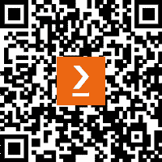

# 前言

欢迎来到 *使用 C#进行功能编程*！

本书旨在在 C#的背景下向您介绍功能编程的强大范式。随着 C#的不断发展，它越来越多地采用功能编程概念，允许开发者编写更简洁、可维护和健壮的代码。本书将引导您了解和应用 C#中的功能编程原则，从基本概念到高级技术。

# 本书面向的对象

本书面向希望通过学习功能编程技术来扩展其编程工具箱的 C#开发者。它适合熟悉面向对象编程的中级到高级程序员，并希望提高他们的技能。虽然不需要具备功能编程的先验知识，但为了充分利用本书，需要对 C#基础知识有扎实的理解。

# 本书涵盖的内容

*第一章**，功能编程入门*，介绍了功能编程的核心概念以及它们如何应用于 C#。

*第二章**，表达式和语句*，深入探讨了表达式和语句之间的区别，以及如何编写更具表现力的代码。

*第三章**，纯函数和副作用*，探讨了纯函数的概念以及如何在代码中最小化副作用。

*第四章**，诚实函数、空值和 Option*，讨论了诚实函数的重要性以及如何有效地处理空值。

*第五章**，错误处理*，介绍了功能编程的错误处理方法，超越了传统的 try-catch 块。

*第六章**，高阶函数和委托*，介绍了 C#中将函数作为一等公民的强大功能。

*第七章**，函子和单子*，探讨了这些高级功能编程概念及其在 C#中的实现。

*第八章**，递归和尾调用*，深入探讨了递归编程技术和优化。

*第九章**，柯里化和部分应用*，教授如何创建更灵活和可重用的函数。

*第十章**，管道和组合*，展示了如何组合函数以创建强大的数据处理管道。

*第十一章**，反思与展望*，总结了本书学到的关键概念，并提供了进一步在 C#中提高功能编程技能的指导。

# 为了充分利用本书

为了充分利用这本书，读者应该对 C# 基础知识有很好的掌握，包括面向对象编程概念。熟悉 LINQ 有助于但不强制要求。每一章都是基于前一章的，因此建议按顺序阅读本书。提供练习题以巩固所学概念。

| **书中涵盖的软件/硬件** | **操作系统要求** |
| --- | --- |
| C# 12 | Windows, macOS, 或 Linux |
| .NET 8 |  |

要跟随本书中的示例，您需要在您的机器上安装 .NET 8 SDK。推荐使用 Visual Studio 2022 或带有 C# 扩展的 Visual Studio Code 以获得最佳开发体验。本书中的所有代码示例都与 C# 12 和 .NET 8 兼容，但大多数也适用于更早的版本。

# **使用的约定**

本书使用了多种文本约定。

`文本中的代码`: 表示文本中的代码单词、数据库表名、文件夹名、文件名、文件扩展名、路径名、虚拟 URL、用户输入和 Twitter 账号。以下是一个示例：“让我们深入一点，看看 `Result` 类的一般实现是什么样的。”

代码块设置如下：

```cs
bool IsBookPopular(Book book)
{
    if (book.AverageRating > 4.5 && book.NumberOfReviews > 1000)
    {
        return true;
    }
    return false;
}
```

**粗体**: 表示新术语、重要单词或屏幕上看到的单词。例如，菜单或对话框中的单词以粗体显示。以下是一个示例：“使用 **面向铁路编程**（**ROP**）重构它以改进错误处理流程。”

**提示或重要注意事项**

看起来像这样。

# **联系信息**

欢迎读者反馈。

**一般反馈**: 如果您对本书的任何方面有疑问，请通过 customercare@packtpub.com 发送电子邮件，并在邮件主题中提及书名。

**勘误**: 尽管我们已经尽最大努力确保内容的准确性，但错误仍然可能发生。如果您在这本书中发现了错误，如果您能向我们报告，我们将不胜感激。请访问 [www.packtpub.com/support/errata](http://www.packtpub.com/support/errata) 并填写表格。

**盗版**: 如果您在互联网上以任何形式遇到我们作品的非法副本，如果您能提供位置地址或网站名称，我们将不胜感激。请通过 copyright@packtpub.com 联系我们，并提供材料的链接。

**如果您有兴趣成为作者**：如果您在某个主题上具有专业知识，并且您有兴趣撰写或为书籍做出贡献，请访问 [authors.packtpub.com](http://authors.packtpub.com)。

# **分享您的想法**

读完 *使用 C# 进行函数式编程* 后，我们很乐意听听您的想法！请 [点击此处直接访问此书的亚马逊评论页面](https://packt.link/r/1805122681) 并分享您的反馈。

您的评论对我们和科技社区都至关重要，并将帮助我们确保我们提供高质量的内容。

# 下载此书的免费 PDF 副本

感谢您购买此书！

您喜欢在路上阅读，但无法随身携带您的印刷书籍吗？

您的电子书购买是否与您选择的设备不兼容？

别担心，现在每购买一本 Packt 书籍，您都可以免费获得该书的 DRM 免费 PDF 版本。

在任何地方、任何设备上阅读。直接从您最喜欢的技术书籍中搜索、复制和粘贴代码到您的应用程序中。

优惠不止于此，您还可以获得独家折扣、时事通讯和每日收件箱中的精彩免费内容。

按照以下简单步骤获取好处：

1.  扫描二维码或访问以下链接



[`packt.link/free-ebook/978-1-80512-268-5`](https://packt.link/free-ebook/978-1-80512-268-5)

1.  提交您的购买证明

1.  就这些！我们将直接将您的免费 PDF 和其他好处发送到您的电子邮件。

# 第一部分：C#函数式编程的基础

在本第一部分，我们为理解函数式编程打下基础。我们将从介绍函数式编程的核心概念及其在 C#中的应用开始。您将了解表达式和语句之间的关键区别，以及如何编写更具表现力的代码。然后，我们将探讨纯函数以及如何最小化副作用，这些都是函数式编程的基本要素。最后，我们将讨论诚实函数和有效处理空值的方法，为更稳健的代码设计奠定基础。

本部分包含以下章节：

+   *第一章**，函数式编程入门*

+   *第二章**，表达式和语句*

+   *第三章**，纯函数和副作用*

+   *第四章**，诚实函数、空值和 Option*
