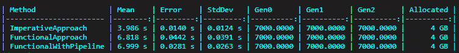

# 第十章：管道和组合

在本章中，我们将结合前几章的所有知识，首先讨论函数组合，它允许我们将简单的函数组合成更复杂的操作。然后，我们将看到如何使用 `Pipe` 方法构建管道。我们还将回顾如何创建可以优雅处理错误的单子管道。此外，还将介绍流畅接口技术，它有助于编写几乎可以像普通文本一样阅读的代码。

总结来说，本章带我们了解了以下主题：

+   函数组合

+   构建管道

+   流畅的接口

+   使用单子的高级组合

我不能背叛我们的传统，最后一次，为你准备了三个自检任务。

# 任务 1 – 敌军波处理管道

将一系列函数组合成一个管道，处理敌军波列表，应用增加难度（困难模式），验证结果，并使用以下代码将其转换为格式化的字符串：

```cs
public class EnemyWave
{
   public int WaveNumber { get; set; }
   public int EnemyCount { get; set; }
   public string Description { get; set; }
}
Func<EnemyWave, bool> validateWave = wave => wave.EnemyCount > 0;
Func<EnemyWave, EnemyWave> applyHardMode = wave =>
{
   wave.EnemyCount = (int)(wave.EnemyCount * 1.2); // +20% enemies
   return wave;
};
Func<EnemyWave, string> formatWave = wave => $"Wave {wave.WaveNumber}: {wave.Description} - {wave.EnemyCount} enemies";
```

# 任务 2 – 游戏数据文件处理

使用以下代码，将一系列单子函数组合成一个管道，处理游戏数据文件，读取其内容，处理它，并将结果写入另一个文件：

```cs
Func<string, Result<string>> readGameDataFile = path =>
{
   try
   {
       var content = File.ReadAllText(path);
       return Result<string>.Success(content);
   }
   catch (Exception ex)
   {
       return Result<string>.Failure($"Failed to read file: {ex.Message}");
   }
};
Func<string, Result<string>> processGameData = content =>
{
   // Simulate game data processing
   return Result<string>.Success(content.ToUpper());
};
Func<string, Result<bool>> writeGameDataFile = content =>
{
   try
   {
       File.WriteAllText("processed_game_data.txt", content);
       return Result<bool>.Success(true);
   }
   catch (Exception ex)
   {
       return Result<bool>.Failure($"Failed to write file: {ex.Message}");
   }
};
```

# 任务 3 – 使用柯里化和部分应用生成动态 SQL 查询

使用柯里化构建用于塔防游戏数据动态查询生成的函数，以及用于查询敌军类型和级别的部分应用函数。使用以下函数生成查询脚本：

```cs
Func<string, string, string, string> generateSqlQuery = (table, column, value) =>
     $"SELECT * FROM {table} WHERE {column} = '{value}'";
```

这些任务应该已经熟悉，因为它们在前几章中已经讨论过。然而，你可能仍然觉得你在组合、柯里化或部分应用方面的掌握还有提升空间。如果是这样，你非常欢迎继续阅读本章。

# 函数组合

史蒂夫带着兴奋和紧张的情绪看着朱莉娅。

史蒂夫：*所以，我们终于要把这些碎片拼在一起了？我很兴奋，但有点* *不知所措。*

朱莉娅：*别担心，史蒂夫。我们会一步步来。记住，这些概念是相互关联的。你已经学到了* *很多！*

史蒂夫：*你说得对。我准备好了，从哪里* *开始呢？*

朱莉娅：*让我们从函数组合开始。这是结合我们到目前为止所学内容的绝佳方式* *...*

函数组合是将两个或更多函数组合起来产生一个新的函数的过程。让我们再加一点料，给我们的组合示例添加高阶函数。

考虑一个场景，我们需要转换用户数据列表。我们有以下高阶函数：

**map**：将函数应用于列表中的每个元素

**filter**：根据谓词过滤列表中的元素

我们将按以下方式定义这些函数：

```cs
Func<IEnumerable<string>, Func<string, string>, IEnumerable<string>> map = (list, func) => list.Select(func);
Func<IEnumerable<string>, Func<string, bool>, IEnumerable<string>> filter = (list, predicate) => list.Where(predicate);
```

接下来，让我们定义我们的转换和过滤函数：

```cs
Func<string, string> capitalize = input => char.ToUpper(input[0]) + input.Substring(1);
Func<string, bool> startsWithA = input => input.StartsWith("a");
```

我们现在可以组合 `map` 和 `filter` 来创建一个一次性执行所有这些操作的功能：

```cs
Func<IEnumerable<string>, IEnumerable<string>> processUsers = users => map(filter(users, startsWithA), capitalize);
```

因此，我们让`processUsers`函数首先过滤列表，只包含以“a”开头的字符串，然后对剩余的每个字符串进行大写转换。当然，我们也可以只用一个`processUsers`方法来编写所有代码，但当前的解决方案允许我们在不同的地方重用小函数。这里的想法是将大方法替换为较小方法的组合。额外的优势是，小方法具有更低的认知负荷和循环复杂度，这使得它们更容易阅读和维护。

当朱莉亚解释完函数组合后，史蒂夫深思地点了点头。

史蒂夫：我想我开始明白这一切是如何结合在一起的。但我们如何在更大的应用中使用它呢？

朱莉亚：这是个好问题！这正是管道发挥作用的地方。它们允许我们以更结构化的方式链式调用这些组合函数。让我给你展示一下...

# 构建管道

在构建管道之前，让我们简要回顾一下前一章中的两个关键概念：柯里化和部分应用。这些技术对于创建灵活、可重用的函数组件至关重要，这些组件是优秀的管道构建块。

正如我们所学的，柯里化将接受多个参数的函数转换为一串函数，每个函数接受单个参数。以下是一个示例：

```cs
Func<int, int, int> add = (a, b) => a + b;
Func<int, Func<int, int>> curriedAdd = a => b => a + b;
```

相反，部分应用涉及将一些参数固定到函数中，产生一个具有较少参数的另一个函数：

```cs
Func<int, int, int> multiply = (a, b) => a * b;
Func<int, int> triple = x => multiply(3, x);
```

这些概念自然地引出了管道构建。通过柯里化函数或部分应用它们，我们创建了专门的、单用途的函数，这些函数可以轻松地组合成管道。这种方法使我们能够做到以下几点：

+   将复杂操作分解为更简单、更易于管理的片段

+   在不同的管道或上下文中重用这些片段

+   通过链式调用这些专用函数来创建更具有表达性和可读性的代码

例如，考虑一个处理游戏数据的管道：

```cs
var processGameData =
     LoadData()
     .Then(ValidateData)
     .Then(TransformData)
     .Then(SaveData);
```

在这个管道中的每一步都可以是一个柯里化或部分应用的函数，这允许我们轻松地进行定制和重用。当我们进一步探索管道构建时，请记住柯里化和部分应用如何被利用来创建更灵活和强大的管道。

现在，让我们继续构建管道。

管道通过一系列处理步骤处理数据，每个步骤由一个函数表示。这种方法对于需要多个转换、验证或计算的任务特别有用。你很可能在使用 LINQ 操作集合时已经遇到了管道。

让我们考虑一个现实世界的场景：用于发布手稿的**提取、转换、加载**（**ETL**）过程。这个过程涉及几个步骤：

1.  从数据库中提取（查询）手稿

1.  验证其内容

1.  将其转换为所需的格式

1.  提交（提交）以供发布

每个步骤都可以表示为一个函数，我们可以使用管道来简化这个过程。为此，让我们创建一个方法，将一系列函数应用于初始值，将每个函数的结果传递给下一个函数，并将其命名为`Pipe`：

```cs
public static T Pipe<T>(this T source, params Func<T, T>[] funcs)
{
     return funcs.Aggregate(source, (current, func) => func(current));
}
```

让我们考虑书籍手稿处理：从数据库中查询手稿，验证其内容，将其转换为所需的格式，并最终提交以供出版：

```cs
public class Manuscript
{
     public string Content { get; set; }
     public bool IsValid { get; set; }
     public string FormattedContent { get; set; }
}
public Manuscript Query(Manuscript manuscript)
{
     // Simulate querying the manuscript from a database
     manuscript.Content = "Original manuscript content.";
     return manuscript;
}
public Manuscript Validate(Manuscript manuscript)
{
     // Simulate validating the manuscript
     manuscript.IsValid = !string.IsNullOrWhiteSpace(manuscript.Content);
     return manuscript;
}
public Manuscript Transform(Manuscript manuscript)
{
     // Simulate transforming the manuscript content
     if (manuscript.IsValid)
     {
         manuscript.FormattedContent = manuscript.Content.ToUpper();
     }
     return manuscript;
}
public Manuscript Submit(Manuscript manuscript)
{
     // Simulate submitting the manuscript for publication
     if (manuscript.IsValid)
     {
         Console.WriteLine($"Manuscript submitted: {manuscript.FormattedContent}");
     }
     else
     {
         Console.WriteLine("Manuscript validation failed. Submission aborted.");
     }
     return manuscript;
}
```

下面是如何在不使用`Pipe`方法的情况下执行此流程：

```cs
public void ExecutePublishingFlow(Manuscript manuscript)
{
     manuscript = Submit(
         Transform(
             Validate(
                 Query(
                     manuscript))));
}
```

现在，使用`Pipe`方法，我们的代码变得好 10 倍：

```cs
public void ExecutePublishingFlow(Manuscript manuscript)
{
     manuscript
         .Pipe(Query)
         .Pipe(Validate)
         .Pipe(Transform)
         .Pipe(Submit);
}
```

当然，这增加了一点点开销，程序可能运行得明显更慢，但阅读起来容易得多，也快得多！

# 性能考虑

谈到开销，虽然诸如组合和管道之类的函数式编程技术提供了更好的可读性和可维护性，但了解它们的性能影响很重要。当我们组合函数时，编译器生成一系列嵌套的方法调用。这可能导致多个栈帧分配，影响深层嵌套组合的性能。

为了更好地理解差异，让我们基准测试不同的方法：

```cs
using BenchmarkDotNet.Attributes;
using BenchmarkDotNet.Running;
[MemoryDiagnoser]
public class FunctionalPerformance
{
    private IEnumerable<int> _numbers;
    [GlobalSetup]
    public void Setup()
    {
         _numbers = Enumerable.Range(0, 1_000_000_000);
    }
    [Benchmark]
    public List<int> ImperativeApproach()
    {
         var result = new List<int>();
         foreach (var num in _numbers)
         {
              if ((num * 3) % 4 == 0)
                   result.Add(num * 3);
         }
         return result;
    }
    [Benchmark]
    public List<int> FunctionalApproach()
    {
         return _numbers
              .Select(x => x * 3)
              .Where(x => x % 4 == 0)
              .ToList();
    }
    [Benchmark]
    public List<int> FunctionalWithPipeline()
    {
         Func<int, int> triple = x => x * 3;
         Func<int, bool> isMultipleOfFour = x => x % 4 == 0;
         return _numbers
              .Pipe(list => list.Select(triple))
              .Pipe(list => list.Where(isMultipleOfFour))
              .ToList();
    }
}
```

运行这些基准测试可能会得到以下类似的结果：



如我们所见，命令式方法的速度几乎是函数式方法的近两倍。然而，通常的 LINQ 管道和我们的管道性能几乎相同！虽然命令式方法表现出更好的性能，但重要的是要注意，函数式方法通常在代码可读性、可维护性和可组合性方面提供优势。

# 流畅接口

流畅接口是一种 API 模式，允许我们以可读和直观的方式链式调用方法。这个术语在 2005 年变得广为人知，但有些人仍然认为它只是方法链。然而，主要思想是使代码看起来像**领域特定语言**（**DSL**）。让我们通过引入流畅接口技术来重构先前的示例。

首先，让我们定义一个类来封装处理手稿的管道步骤：

```cs
public class ManuscriptProcessor
{
     private Manuscript _manuscript;
     public ManuscriptProcessor(Manuscript manuscript)
     {
         _manuscript = manuscript;
     }
     public ManuscriptProcessor Query(Func<Manuscript, Manuscript> queryFunc)
     {
         // Simulate querying the manuscript from a database
         manuscript.Content = "Original manuscript content.";
         return this;
     }
     public ManuscriptProcessor Validate(Func<Manuscript, Manuscript> validateFunc)
     {
         _manuscript = validateFunc(_manuscript);
         return this;
     }
     public ManuscriptProcessor Transform(Func<Manuscript, Manuscript> transformFunc)
     {
         _manuscript = transformFunc(_manuscript);
         return this;
     }
     public Manuscript Submit()
     {
         // Simulate submitting the manuscript for publication
         if (manuscript.IsValid)
         {
            Console.WriteLine($"Manuscript submitted: {manuscript.FormattedContent}");
         }
         else
         {
            Console.WriteLine("Manuscript validation failed. Submission aborted.");
         }
         return _manuscript;
     }
}
```

使用流畅接口，我们可以更清晰地重写管道：

```cs
var manuscript = new Manuscript();
var processedManuscript = new ManuscriptProcessor(manuscript)
     .Query()
     .Validate(Validate)
     .Transform(Transform)
     .Submit();
```

如您所见，它几乎与使用`Pipe`方法的示例相同，但`Query`和`Submit`方法不同。这是因为它们不依赖于可能改变逻辑的外部验证或转换规则，而是相当直接。当有足够的逻辑且未来可能不会改变时，使用流畅接口是个好主意。但如果没有，我们可以使用`Pipe`方法。

# 单子的高级组合

史蒂夫挠了挠头，看起来有些困惑。

史蒂夫：*朱莉娅，我以为我们已经完成了关于单子的讨论。为什么我们要* *重新讨论它们？*

Julia: *Steve，你的观察很敏锐。我们再次回到单子的概念，因为它们在组合复杂操作方面非常强大，尤其是在处理错误处理和异步过程时。让我向你展示它们如何融入我们的管道...*

单子提供了一种链式操作机制。在之前的章节中，你学习了单子的基本概念和 `Bind` 方法。我们将使用 `Bind` 方法在更复杂的环境中链式操作，例如错误处理和异步处理。

在我们的第一个场景中，我们需要从外部 API 获取和处理用户数据。过程中的每一步都可能失败，我们需要优雅地处理这些错误。

首先，让我们回顾一下我们的 `Result` 单子定义：

```cs
public class Result<TValue, TError>
{
    private TValue _value;
    private TError _error;
    public bool IsSuccess { get; private set; }
    private Result(TValue value, TError error, bool isSuccess)
    {
         _value = value;
         _error = error;
         IsSuccess = isSuccess;
    }
    public TValue Value
    {
         get
         {
              if (!IsSuccess) throw new InvalidOperationException("Cannot fetch Value from a failed result.");
              return _value;
         }
    }
    public TError Error
    {
         get
         {
              if (IsSuccess) throw new InvalidOperationException("Cannot fetch Error from a successful result.");
              return _error;
         }
    }
    public static Result<TValue, TError> Success(TValue value) => new Result<TValue, TError>(value, default, true);
    public static Result<TValue, TError> Failure(TError error) => new Result<TValue, TError>(default, error, false);
    public Result<TResult, TError> Bind<TResult>(Func<TValue, Result<TResult, TError>> func)
    {
         return IsSuccess ? func(_value!) : Result<TResult, TError>.Failure(_error!);
    }
}
```

接下来，将我们之前的示例重写为使用 `Result` 类型：

```cs
public class Manuscript
{
     public string Content { get; set; }
     public bool IsValid { get; set; }
     public string FormattedContent { get; set; }
}
Func<int, Result<Manuscript, string>> queryManuscript = manuscriptId =>
{
     // Simulate querying the manuscript from a database
     if (manuscriptId > 0)
     {
         var manuscript = new Manuscript { Content = "Original manuscript content." };
         return Result<Manuscript, string>.Success(manuscript);
     }
     else
     {
         return Result<Manuscript, string>.Failure("Invalid manuscript ID");
     }
};
Func<Manuscript, Result<Manuscript, string>> validateManuscript = manuscript =>
{
     // Simulate validating the manuscript
     if (!string.IsNullOrWhiteSpace(manuscript.Content))
     {
         manuscript.IsValid = true;
         return Result<Manuscript, string>.Success(manuscript);
     }
     else
     {
         return Result<Manuscript, string>.Failure("Empty manuscript content");
     }
};
Func<Manuscript, Result<Manuscript, string>> transformManuscript = manuscript =>
{
     // Simulate transforming the manuscript content
     if (manuscript.IsValid)
     {
         manuscript.FormattedContent = manuscript.Content.ToUpper();
         return Result<Manuscript, string>.Success(manuscript);
     }
     else
     {
         return Result<Manuscript, string>.Failure("Invalid manuscript for transformation");
     }
};
Func<Manuscript, Result<bool, string>> submitManuscript = manuscript =>
{
     // Simulate submitting the manuscript for publication
     if (manuscript.IsValid)
     {
         Console.WriteLine($"Manuscript submitted: {manuscript.FormattedContent}");
         return Result<bool, string>.Success(true);
     }
     else
     {
         return Result<bool, string>.Failure("Manuscript validation failed. Submission aborted.");
     }
};
```

我们现在可以使用 `Bind` 来创建一个单调管道来组合这些函数：

```cs
Func<int, Result<bool, string>> processManuscript = manuscriptId =>
     queryManuscript(manuscriptId)
     .Bind(validateManuscript)
     .Bind(transformManuscript)
     .Bind(submitManuscript);
```

让我们使用管道来处理用户数据：

```cs
var result = processManuscript(129);
if (result.IsSuccess)
{
     Console.WriteLine("Manuscript processed and submitted successfully.");
}
else
{
     Console.WriteLine($"Error: {result.Error}");
}
```

预期的控制台输出如下：

```cs
Manuscript submitted: ORIGINAL MANUSCRIPT CONTENT.
Manuscript processed and submitted successfully.
```

再次，`processManuscript` 方法看起来与之前的方法非常相似；然而，这次它包括了优雅的错误处理。

现在让我们看看如何结合柯里化、部分应用和单调操作来创建一个健壮的错误处理管道：

```cs
// Curried function for Result monad
Func<Func<T, Result<U>>, Func<Result<T>, Result<U>>> curriedBind<T, U>() =>
     f => result => result.Bind(f);
// Partially applied functions for specific operations
var parseInput = curriedBind<string, int>()
     (s => int.TryParse(s, out int n) ? Result<int>.Success(n) : Result<int>.Failure("Parse failed"));
var validatePositive = curriedBind<int, int>()
     (n => n > 0 ? Result<int>.Success(n) : Result<int>.Failure("Number must be positive"));
var double = curriedBind<int, int>()
     (n => Result<int>.Success(n * 2));
// Composing a pipeline with monadic operations
Func<string, Result<int>> processInput =
     input => Result<string>.Success(input)
         .Pipe(parseInput)
         .Pipe(validatePositive)
         .Pipe(double);
var result = processInput("5");  // Success: 10
var error = processInput("-3");  // Failure: "Number must be positive"
```

这个例子展示了结合柯里化、部分应用和单调组合的力量。我们创建了一个管道，它解析输入，验证它，并执行转换，同时处理每一步中可能出现的错误。使用柯里化和部分应用函数使我们的管道既灵活又易于扩展。

当他们结束讨论时，Steve 看起来既疲惫又成就感十足。

Steve: *哇，Julia。这真是一段旅程。我从没想到当我们开始的时候，我会理解这些概念*。

Julia: *Steve，你已经走了很长的路。你现在对函数式编程有什么看法*？

Steve: *我很兴奋开始在我们项目中应用这些概念。代码变得更加清晰和结构化真是太神奇了*。

Julia 微笑着，为 Steve 的进步感到自豪。

Julia: *很高兴听到这个，Steve。记住，熟能生巧。继续实验，不要害怕提问。准备好做一些练习来巩固我们学到的知识了吗*？

Steve: *当然！来吧*！

# 练习

## 练习 1

将一系列函数组合成一个管道，处理一系列敌军波次，应用增加难度（困难模式），验证结果，并使用以下代码将其转换为格式化的字符串：

```cs
public class EnemyWave
{
   public int WaveNumber { get; set; }
   public int EnemyCount { get; set; }
   public string Description { get; set; }
}
Func<EnemyWave, bool> validateWave = wave => wave.EnemyCount > 0;
Func<EnemyWave, EnemyWave> applyHardMode = wave =>
{
   wave.EnemyCount = (int)(wave.EnemyCount * 1.2); // +20% enemies
   return wave;
};
Func<EnemyWave, string> formatWave = wave => $"Wave {wave.WaveNumber}: {wave.Description} - {wave.EnemyCount} enemies";
```

## 练习 2

使用以下代码，将一系列单调函数组合成一个管道，处理游戏数据文件，读取其内容，处理它，并将结果写入另一个文件：

```cs
Func<string, Result<string>> readGameDataFile = path =>
{
   try
   {
       var content = File.ReadAllText(path);
       return Result<string>.Success(content);
   }
   catch (Exception ex)
   {
       return Result<string>.Failure($"Failed to read file: {ex.Message}");
   }
};
Func<string, Result<string>> processGameData = content =>
{
   // Simulate game data processing
   return Result<string>.Success(content.ToUpper());
};
Func<string, Result<bool>> writeGameDataFile = content =>
{
   try
   {
       File.WriteAllText("processed_game_data.txt", content);
       return Result<bool>.Success(true);
   }
   catch (Exception ex)
   {
       return Result<bool>.Failure($"Failed to write file: {ex.Message}");
   }
};
```

## 练习 3

使用柯里化构建一个用于动态查询生成塔防游戏数据的函数，并使用部分应用函数查询敌军类型和等级。使用以下函数生成查询脚本：

```cs
Func<string, string, string, string> generateSqlQuery = (table, column, value) =>
     $"SELECT * FROM {table} WHERE {column} = '{value}'";
```

# 解答

这里是上一节提供的练习题的解决方案。使用它们来确保你的理解，并纠正你可能犯的错误。

## 解决方案 1

首先，我们将这些函数组合起来创建一个事务处理管道：

```cs
Func<IEnumerable<EnemyWave>, IEnumerable<string>> processEnemyWaves = waves =>
     waves
         .Where(validateWave)
         .Select(applyHardMode)
         .Select(formatWave);
```

然后，我们对其进行测试：

```cs
var enemyWaves = new List<EnemyWave>
{
     new EnemyWave { WaveNumber = 1, EnemyCount = 50, Description = "Initial wave" },
     new EnemyWave { WaveNumber = 2, EnemyCount = 0, Description = "Empty wave" },
     new EnemyWave { WaveNumber = 3, EnemyCount = 100, Description = "Boss wave" }
};
var results = processEnemyWaves(enemyWaves);
foreach (var result in results)
{
     Console.WriteLine(result);
}
```

这是预期的结果：

```cs
Wave 1: Initial wave - 60 enemies
Wave 3: Boss wave - 120 enemies
```

## 解决方案 2

我们首先使用给定的函数创建单调管道：

```cs
Func<string, Result<bool>> processGameDataFile = path =>
     readGameDataFile(path)
         .Bind(processGameData)
         .Bind(writeGameDataFile);
```

让我们测试这个管道：

```cs
var result = processGameDataFile("game.dat");
if (result.IsSuccess)
{
     Console.WriteLine("The data file was processed successfully.");
}
else
{
     Console.WriteLine($"Error: {result.Error}");
}
```

这是预期的结果：

```cs
The data file was processed successfully.
```

## 解决方案 3

在这个解决方案中，我们首先创建函数的柯里化版本：

```cs
Func<string, Func<string, Func<string, string>>> curryGenerateSqlQuery = table => column => value => generateSqlQuery(table, column, value);
```

然后，我们用它来生成查询：

```cs
Func<string, string> typeQuery = value => generateQuery("Enemies", "Type", value);
Func<string, string> levelQuery = value => generateQuery("Enemies", "Level", value);
```

我们编写代码来使用它们：

```cs
Console.WriteLine(typeQuery("Goblin"));
Console.WriteLine(levelQuery("5"));
```

这是预期的结果：

```cs
SELECT * FROM Enemies WHERE Type = 'Goblin'
SELECT * FROM Enemies WHERE Level = '5'
```

完成这些练习后，你应该对如何在代码中使用管道、柯里化和部分应用有更好的理解。

# 摘要

在本章中，我们将前几章的知识整合起来，重新审视管道和组合。我们从函数组合开始，展示了如何使用高阶函数映射和过滤集合将简单函数组合成复杂操作。

然后，我们介绍了`Pipe`方法，它简化了管道的函数链。当应用于我们的图书出版系统示例时，它为查询、验证、转换和提交稿件提供了清晰的步骤。

然后，我们考察了流畅接口模式，它允许相当直观的方法链。`ManuscriptProcessor`类展示了流畅接口如何使我们的代码更具表达性和用户友好。我们还介绍了使用`Result`类型进行优雅错误处理的单子高级组合。

下一章将是我们旅程的最后一章，我真心希望你喜欢这个过程。所以，如果你还没有完成，请完成练习，我们下一章再见！

# 第四部分：结论与未来方向

在最后一部分，我们将反思我们通过 C#函数式编程所走过的旅程。我们将总结学习到的关键概念，加强你对如何将这些技术应用于编写更干净、更易于维护的代码的理解。我们还将展望你在函数式编程旅程中的下一步，提供如何进一步提高技能并跟上该领域不断发展的最佳实践的指导。

本部分包含以下章节：

+   *第十一章**，反思与展望*
