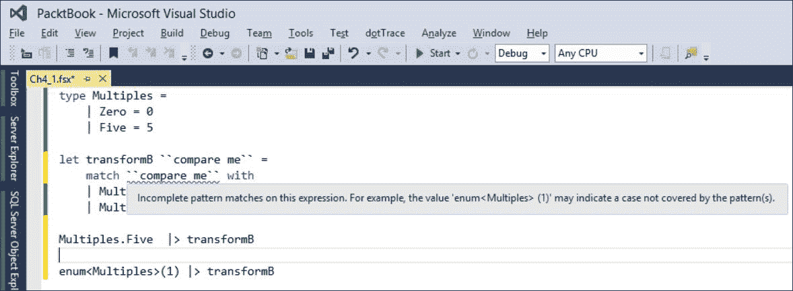
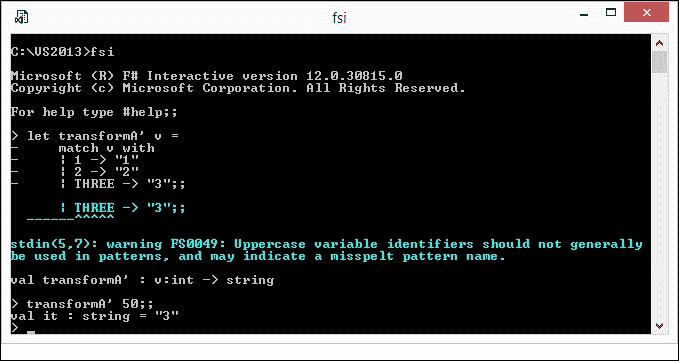
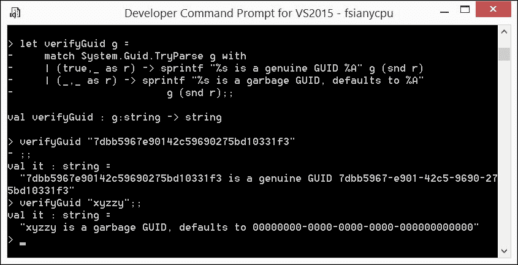

# 第四章。基本模式匹配

本章继续了上一章开启的功能式编程基础研究。它涵盖了基本的数据模式匹配。模式匹配是嵌入到 F# 语言核心的强大数据处理机制中的一个丰富功能特性。

对于企业开发者来说，熟练掌握 F# 的模式匹配特性是绝对必要的，因为大多数时候，企业业务都是围绕**业务线应用程序**（**LOB**）中的复杂数据转换以及数据仓库和商业分析中的**提取、转换、加载**（**ETL**）周期进行的。[`blogs.msdn.microsoft.com/dragoman/2007/07/19/what-is-a-lob-application/`](https://blogs.msdn.microsoft.com/dragoman/2007/07/19/what-is-a-lob-application/) [`en.wikipedia.org/wiki/Extract,_transform,_load`](https://en.wikipedia.org/wiki/Extract,_transform,_load)

我故意将本章的主题缩小到基本模式匹配，仅仅出于教学目的。通常，F# 初学者首先将模式匹配视为强化版的命令式 switch，或者仅仅是语义上等价于编写冗长的 `if...then...elif...elif... ...else...` 表达式。然后，他们开始认识到模式匹配在数据结构分解中的作用。最后，通过接受**活动模式**，模式匹配的知识获取得以完成。

本章的目的是为您提供对与 F# `match` 构造相关的模式匹配特性的全面理解：

+   这个相当复杂语言结构的整体组成

+   匹配部分背后的隐含假设（例如匹配规则的顺序和模式案例的完整性等）

+   特定的模式案例类型以及如何构建复合案例

将分解能力考虑推迟到下一章关于数据结构的内容。同样，我将在介绍 F# 的高级编程技术时处理**活动模式**。

# 带有 match 构造的显式模式匹配形式

F# 中的显式 `match` 构造属于控制流元素，与 `if-then-else` 或 `while-do` 一起。其他 F# 组件中，`match` 是以下部分和规则的相对复杂组合：

```cs
match comparison-expression with 
  | pattern-expression1 -> result-expression1 
  ......................................... 
  | pattern-expressionN -> result-expressionN 

```

它以这种方式工作，即 `comparison-expression` 与每个以 `pattern-expression1` 开头的 `pattern-expression` 并置，并沿着列表向下进行，直到第一个匹配发生，或者通过 `pattern-expressionN` 仍然没有匹配。如果找到 `pattern-expressionX` 的匹配，则整个构造的结果是 `result-expressionX` 的结果。如果没有找到匹配，则抛出 `MatchFailureException`，表示匹配案例不完整。

F# 初学者在第一次阅读时常常遗漏的模式匹配要点如下：

+   `match`构造表示一个表达式，就像任何其他 F#构造一样，除了值绑定。这意味着只有一个`result-expressions`的值将被用作整个构造的值（假设确实发生了某种匹配）。

+   每个`pattern-expression1`到`pattern-expressionN`都必须具有相同的类型，这与`比较表达式`的类型也相同，以便`match`构造能够编译。

+   为了使匹配构造能够编译，每个`result-expression1`到`result-expressionN`都必须具有相同的类型。

+   列出的模式到结果案例按自顶向下的顺序在运行时依次尝试。这种安排规定了从模式共同性的角度来看案例的某种顺序。更具体的模式必须先于不那么具体的模式；否则，更具体的模式将永远不会有机会被匹配。

+   所有可能模式表示的备选方案必须是穷尽的；否则，匹配未由任何模式覆盖的`比较表达式`将导致`MatchFailureException`异常。

+   可以使用布尔逻辑运算符 OR（`|`）、AND（`&`）和一个特殊的`when`守卫将更原子的模式项组合成更广泛的模式表达式。

现在，我将带你了解模式种类的多样性，以便你习惯它们的广泛功能，并变得熟悉`match`表达式的使用。

# 匹配字面量

匹配模式的最简单情况之一是由字面量表示的模式，并假设一个简单的`比较表达式`值相等。字面量可以是任何数值、字符或字符串类型。它们也可以是.NET 枚举的实例（每个这样的实例本质上都是整数值的符号名称别名）或带有`[<Literal>]`属性的值。

在以下脚本中，我可以轻松地匹配`int`字面量和被`[<Literal>]`属性装饰的`int`值别名`THREE`（`Ch4_1.fsx`）。

```cs
[<Literal>] 
let THREE = 3 

let transformA v = 
  match v with 
  | 1 ->"1" 
  | 2 ->"2" 
  | THREE ->"3" 

transformA <| (1 + 2) 

```

这将产生预期的字符串`"3"`。然而，不可能将`int`字面量与以下脚本（`Ch4_1.fsx`）中的命名`int`常量值混合（即`Multiples.Zero`和`Multiples.Five`，尽管它们是字面量，但被类型化为`Multiples`枚举的成员）。

```cs
type Multiples = 
  | Zero = 0 
  | Five = 5 

let transformB ``compare me`` = 
  match ``compare me`` with 
  | Multiples.Zero ->"0" 
  | Multiples.Five ->"5" 
Multiples.Five |> transformB 

```

这将产生字符串`"5"`，尽管`Multiples.Zero`和`Multiples.Five`是字面量，但它们被类型化为`Multiples`枚举的成员。

（此外，如果你还没有完全理解这一点，将几乎任何文本放在双引号之间，例如上面的```cs ``compare me`` ```，会使这段文本成为一个有效的 F#名称，并且在使用得当的情况下，可能会增加代码的可读性）。

# 通配符匹配

如果我将前面的脚本放入 Visual Studio，F#源代码编辑器将在```cs ``compare me`` ```比较表达式下绘制一条蓝色的波浪线警告，表明此`match`构造中的规则集不是穷尽的，如下面的截图所示：



一个不完整模式匹配的例子

编译器甚至给出了一个示例值 ```cs ``compare me`` ```，这个值不会匹配。尽管这个值不在 `Multiples` 类型的定义中，但如果我合成这个值作为 `enum<Multiples>(1)` 并将其作为参数传递给 `transformB`，结果将是 `Microsoft.FSharp.Core.MatchFailureException` 类型的运行时异常。这种情况应该引发以下问题：如何将 *match all* 规则放入 `match` 中，这意味着任何在先前规则中未指定的内容？

为了这个目的，F# 提供了特殊的 **通配符模式** `_`，它可以匹配在先前规则中未匹配到的任何内容。借助它的帮助，并转向 F# 处理未定义值的惯用方法，即以 `option` 类型的值呈现结果，仅处理合法 `Multiples` 值的函数可以定义如下代码（`Ch4_1.fsx`）：

```cs
let transformB' m = 
  match m with 
  | Multiples.Zero -> Some "0" 
  | Multiples.Five -> Some "5" 
  | _ -> None 

```

现在，`transformB'` 定义中的匹配包含了一组详尽的匹配情况。任何作为 `m` 给定的 `Multiples` 的合法值都将转换为相应的 `Somestring option` 值，而任何 `m` 参数的非合法值都将转换为 `None` 结果。

# 排列匹配规则

通配符模式展示了从更具体到更不具体的匹配情况排列的重要性。例如，如果我将带有通配符模式的 *match all* 第三规则放在前面脚本中的前两个规则之前，那么 F# 编译器将在显式的 `Multiples` 值下放置蓝色波浪线，表示这些规则将永远不会匹配（检查 `Ch4_1.fsx` 中的 `transformB''` 定义）。

# 命名模式

当名称（标识符）出现在模式情况的位置时，F# 编译器会进行某种分析。严格来说，名称有以下几种可能性：

+   命名字面量（例如，在早期脚本中的 THREE）

+   判别联合的案例值（例如，如果匹配 F# 的 `option` 则为 `None`）

+   异常的类型（例如，如果匹配异常类型则为 `System.ArgumentException`）

+   活动模式的自定义名称（将在后续章节中介绍）

如果名称出现不符合之前列出的任何替代方案，则该名称被视为**变量模式**（[`msdn.microsoft.com/en-us/library/dd547125.aspx`](https://msdn.microsoft.com/en-us/library/dd547125.aspx)）。它被处理得类似于通配符模式，获取 `comparison-expression` 参数的值，该值可以用在相应的 `result-expression` 中。听起来很复杂，对吧？那么让我们通过一个示例来澄清这个问题。

我只是从匹配字面量部分复制了 `transformA` 函数的定义，将函数名称更改为 `transformA'`，并从上下文（`Ch4_2.fsx`）中移除了 `THREE` 字面量的定义：

```cs
let transformA' v = 
  match v with 
  | 1 -> "1" 
  | 2 -> "2" 
  | THREE -> "3" 

```

以下截图显示了尝试此函数版本的结果。



将字面量模式转换为变量模式

首先，省略字面量并没有使脚本崩溃，只是产生了一个无害的警告，指出`THREE`可能是一个拼写错误的模式名称。将函数应用于完全偏离的参数`50`，得到的结果与合法参数值`3`相同的结果。这是怎么回事？

没有魔法；根据描述标识符，`THREE`没有被识别为命名字面量、区分联合情况、异常类型或活动模式。这个发现使其变成了一个扮演匹配所有模式情况角色的变量模式，`result-expression`只是盲目地将它输出为字符串`"3"`。

在我的 F#开发者经验中，我至少遇到过一次这种看似无害的模式类型转换错误变成了一个讨厌的 bug。

### 小贴士

道德：小心处理，不要忽视 F#编译器的警告！

# as 模式

有趣的是，一个模式情况可以附加一个`as`子句。这个子句将匹配的值绑定到一个名称，该名称可以在`match`构造的相应`result-expression`或外层`let`绑定的局部上下文中使用。以下脚本演示了`as`模式有多灵活（《Ch4_3.fsx》）：

```cs
let verifyGuid g = 
  match System.Guid.TryParse g with 
  | (true,_ as r) -> sprintf "%s is a genuine GUID %A" g (snd r) 
  | (_,_ as r) -> sprintf "%s is a garbage GUID, defaults to %A" 
                        g (snd r);; 

```

在第一种情况下，`r`使用`as`绑定到`TryParse`的结果，即元组，因此表达式`snd r`产生了解析的 GUID 值。

在第二种情况下，`as`将`r`绑定到任何元组；然而，从匹配情况的顺序中可以明显看出，这个情况匹配了失败的 GUID 解析，并且参数的值是垃圾。

以下截图反映了在 FSI 中使用`as`绑定匹配情况触发每个这些情况：



带有 as 绑定的模式匹配

# 分组模式

我到目前为止所涵盖的模式匹配情况可以以类似于具有 OR（`|`）和 AND（`&`）运算符的布尔表达式术语的方式组合在一起。让我通过实现一个接受两个表示键的字符串参数并验证提供的值都不为空并提供详细诊断的功能来演示这项技术。

你应该能够理解为什么我应该以最具体的案例开始匹配，当两个键都为空时。下一个不那么具体的匹配由两种对称的情况表示，即第一个或第二个键为空。在这里，为了展示 F# 模式分组提供的灵活性，我使用布尔 OR 将这两个模式组合起来，同时使用表示为元组 `(x,y)` 的变量模式将键值捕获到局部上下文中。对于最通用的剩余情况，我知道两个键都不为空，所以这里只需要一个变量模式就足够了。所寻求的函数定义如下 (`Ch4_4.fsx` ):

```cs
open System 

let validate keyA keyB = 
  match (keyA,keyB) with 
  | ("","") -> "both keys are empty" 
  | (x,y) & (("",_) | (_,"")) -> 
    sprintf "one key is empty: keyA = %s; keyB = %s" x y 
  | _ & (x,y) -> 
    sprintf "both keys aren't empty: keyA = %s; keyB = %s" x y 

```

虽然布尔 OR 模式组合器通过组合需要相同转换表达式的某些案例来帮助达到 F# 代码的简洁性，但在常规模式匹配实践中，布尔 AND 并不经常用于组合模式案例。然而，当分组 *活动模式* 时，它变得非常相关，我将在后面的章节中介绍。

# 守卫

到目前为止，我相信你可能会同意模式匹配是一个强大的数据转换功能。为了进一步强调迄今为止考虑的功能，F# 提供了增强 `pattern-expressions` 的额外匹配逻辑。*守卫* 是一个任意布尔表达式，它使用 `when` 关键字附加到 `pattern-expression` 上。只有当其 `pattern-expression` 宿主匹配时，守卫才会启动。然后，计算守卫表达式，如果为 `true`，则触发相应的 `result-expression` 右侧执行的转换。否则，整个规则被视为未匹配，匹配将继续以常规方式进行。`when` 守卫可以在 `match` 构造中完全任意地混合和匹配。

为了展示 `when` 守卫的实际应用，让我稍微修改一下之前的例子。在两个键都不为空的情况下，有两种子情况：当键彼此相等时和不相等时。此外，我们的函数需要对这些情况中的每一个进行不同的格式化。

对于这次修改，只需要在最后一行之前添加一行代码（记住，我想添加一个更具体的匹配案例，然后它必须放在一个更通用的案例之前）。代码如下：

```cs
| (x,y) when x = y -> sprintf "both keys are not empty: keyA =    keyB = %s" x
```

这就是这次修改的全部内容。我鼓励你通过 FSI 在 `Ch4_4.fsx` 和 `Ch4_5.fsx` 脚本中输入脚本中提供的不同参数，并观察函数行为的改变。

# 匿名函数执行匹配的替代语法

F# 提供了一种特殊语法来定义执行匹配的匿名函数，或称为**模式匹配函数**([`docs.microsoft.com/en-us/dotnet/articles/fsharp/language-reference/match-expressions`](https://docs.microsoft.com/en-us/dotnet/articles/fsharp/language-reference/match-expressions) )。

这种语法假设匿名函数有一个参数，该参数放置在函数体开始的不可见 `match` 构造中。仅仅有这种定义模式匹配匿名函数的替代方式，就增加了语言的简洁性，并且更好地反映了在代码中定义此类函数的意图。

继续进行编码练习，在最新的 F# 脚本中，我将使用替代语法重写 `validate` 函数。然而，为了实现这一点，你需要解决以下问题。替代语法假设模式匹配函数只有一个参数，而 `validate` 函数有一对参数。解决方案将是应用在阅读上一章并执行柯里化后获得的技能。以下是对应的代码 (`Ch4_6.fsx`):

```cs
open System 

let validate key1 key2 = (key1,key2) |> function 
  | ("","") -> "both keys are empty" 
  | (x,y) & (("",_) | (_,"")) -> 
    sprintf "one key is empty: keyA = %s; keyB = %s" x y 
  | (x,y) when x = y -> 
    sprintf "both keys are not empty: keyA = keyB = %s" x 
  | (x,y) -> 
    sprintf "both keys aren't empty: keyA = %s; keyB = %s" x y 

```

# 摘要

希望这一章在纯模式匹配方面没有遗漏任何细节。你现在应该已经做好了准备，去克服 F# 初学者程序员通常会遇到的典型模式匹配挑战。我提醒你，数据分解和主动模式匹配等进一步的模式匹配特性将在后面的章节中介绍，以保持材料的逻辑流程。

在下一章中，我将转向令人兴奋的主题——*代数数据类型*。我们将探讨数据是如何组合的，以及数据组合背后的好处。
