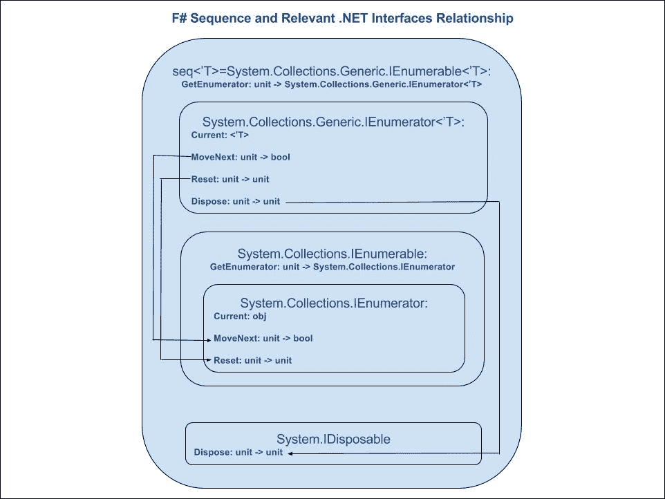
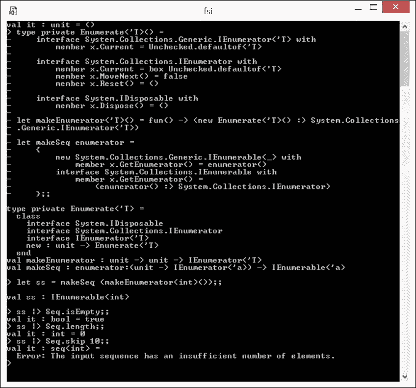
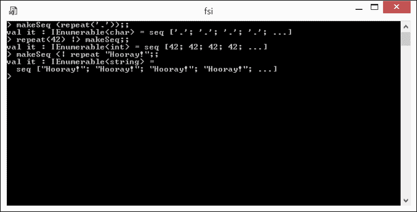
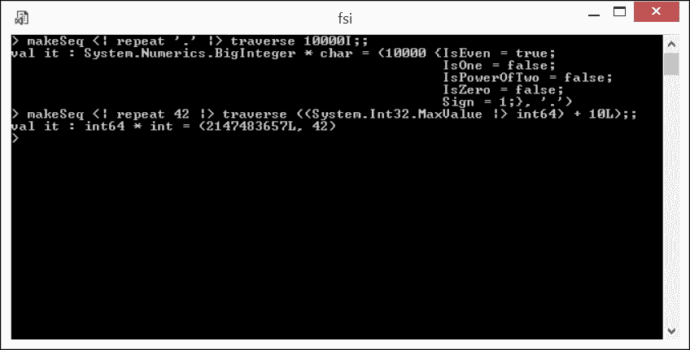

# 第六章. 序列 - 数据处理模式的核心

在本章中，我们将深入探讨函数式编程中最基本且至关重要的安排之一，即序列。将任何数据变换表示为应用于任意可枚举数据容器元素的原子函数的组合的能力是函数程序员必须具备的。本章的目标是帮助您获得这种心理技能。通往这一目标的道路是由以下在这里涵盖的主题铺就的：

+   回顾基本数据变换，并将庞大的标准库数据变换函数按少量底层处理模式进行划分

+   考虑序列数据生成器的双重性，即它们既是数据又是按需计算

+   介绍序列如何通过枚举任意集合来泛化它们，这代表了拉数据变换模式

+   进一步考虑使用生成序列进行数据钻取的另一种模式

+   通过实际探索序列的使用如何影响代码性能来总结

# 基本序列变换

让我们回顾一下第一章中样本问题的函数式解决方案，*开始函数式思考*。它代表了寻找集合的给定属性的常见函数式模式，如下所示：

+   从表示 1000 个连续单个数字字符的给定字符串字面量中，制作一个由原始集合中仅五个连续单个数字字符的块表示的集合集合。每个块取一个五字符宽的模板的内字符，首先与字符串字面量的左侧边界对齐。然后模板向右移动一个字符，提取下一个子集合。这种将模板向右滑动的过程一直持续到模板和字面量的右侧边界对齐。确切地说，主序列由 996 个这样的五字符子序列组成。

+   注意，此时原本寻求的最大五个连续数字的乘积属性被替换为序列元素的类似属性，每个元素代表一个候选组，所寻求的属性源于该组。值得注意的是，为了解决原始问题，必须考虑这个次级序列的**所有**元素（其他模式可能在这方面有所不同，例如，**寻找具有给定属性的任何序列元素**）。

+   对替代序列进行完整扫描，寻找所寻求属性的极大值，即代表替代原始字符串字面量的外序列元素的内部序列组成部分的乘积。

那些关注细节的人可能已经注意到了先前解决方案方法与**MapReduce**([`en.wikipedia.org/wiki/MapReduce`](https://en.wikipedia.org/wiki/MapReduce))模式的相似性，但现在还没有可能的**map**阶段的分区和并行化。这种相似性并非偶然。在为企业**业务线**（**LOB**）应用的大大小小的 F# **ETL**([`en.wikipedia.org/wiki/Extract,_transform,_load`](https://en.wikipedia.org/wiki/Extract,_transform,_load))任务实施之后，我可以得出结论，F#核心库中涵盖枚举序列基本操作的这部分，即**Microsoft.FSharp.Collections**([`msdn.microsoft.com/en-us/library/ee353635.aspx`](https://msdn.microsoft.com/en-us/library/ee353635.aspx))命名空间下的`Collections.seq`库模块，已经提炼了数据序列处理的典型函数式模式。任何有效的 F#开发者都应该能够将所需的数据转换解决方案表示为`Collections.seq`库中这些库函数的组合。

根据我的个人经验，当将这些 70 个库函数（针对 F# 4.0 版本）视为按函数名称字母顺序排列的列表时，很难理解。如果不区分它们的共性和差异，很难记住这个或那个函数的确切功能。如果我们开始看到每个函数都实现了某种特定的数据转换模式，这种认识可能会得到加强。这些模式源于将函数式编程应用于数据处理多年的积累经验，并被 F#设计者选定为包含到核心库中的函数集合。

我认为，通过从数据处理模式关系的角度观察`Collection.seq`库的组成部分，可以区分以下函数组：

+   **聚合函数**：这些函数遍历序列的整个范围，返回基于序列元素计算出的单个值。

+   **生成器**：这些函数能够“凭空”生成序列，或者更确切地说，生成特殊类型的序列（例如空类型序列）和由元素与其序列顺序号之间的定量关系或仅由递归定义的函数（基于前一个元素生成下一个元素）定义的序列。

+   **包装器和类型转换器**：这些函数要么将整个序列包装成有用的属性（缓存是包装的一个好例子），要么将序列转换为其他集合类型（列表或数组）。

+   **应用函数**：这些函数只是遍历序列，为了副作用（例如，将序列元素作为字符串打印出来）而将给定的计算应用于每个元素。

+   **重组器**：这些函数以类型一致的方式洗牌序列或提取其元素；换句话说，对于仅处理 `seq<'T>` 或 `'T` 对象的 `'T` 类型序列。例如，通过跳过原始序列的前 100 个元素来创建一个新的序列。

+   **过滤器**：这些函数关注于选择符合任意条件（的）元素。例如，尝试找到序列中第一个使给定谓词函数返回 true 的元素。

+   **映射器**：这些函数通过生成转换后的序列（例如，一个将两个输入序列组合成一个结果序列的压缩函数，每个元素都是一个元组，它结合了来自两个输入序列的相同顺序号的元素）来改变原始序列（的）形状和/或类型。

使用这种分类方法，我将库函数按照以下模式集进行划分。在每个模式下，列出所有相关的库函数及其签名。我鼓励您探索这些签名，以发现导致每个分组形成的共性。

对于那些渴望深入了解的读者，本书附带代码的 `Ch6_1.fsx` 脚本中提供了额外信息，其中通过简短的代码示例说明了每个库函数的使用。

## 聚合模式

```cs
average : seq<^T> -> ^T (requires member (+) and member    DivideByInt and member get_Zero)averageBy : ('T -> ^U) -> seq<'T> -> ^U (requires ^U with static    member (+) and ^U with static member DivideByInt and ^U with    static member Zero) 
fold : ('State -> 'T -> 'State) -> 'State -> seq<'T> -> 'State 
length : seq<'T> -> int 
sum : seq<^T> -> ^T (requires member (+) and member get_Zero) 
sumBy : ('T -> ^U) -> seq<'T> -> ^U (requires ^U with static  member (+) and ^U with static member Zero) 
max : seq<'T> -> 'T (requires comparison) 
maxBy : ('T -> 'U) -> seq<'T> -> 'T (requires comparison) 
min : seq<'T> -> 'T (requires comparison) 
minBy : ('T -> 'U) -> seq<'T> -> 'T (requires comparison) 
isEmpty : seq<'T> -> bool 
reduce : ('T -> 'T -> 'T) -> seq<'T> -> 'T 
exactlyOne : seq<'T> -> 'T 
compareWith : ('T -> 'T -> int) -> seq<'T> -> seq<'T> -> int 

```

## 生成模式

```cs
empty : seq<'T>
init : int -> (int -> 'T) -> seq<'T>
initInfinite : (int -> 'T) -> seq<'T>
singleton : 'T -> seq<'T>
unfold : ('State -> 'T * 'State option) -> 'State -> seq<'T>
```

## 包装和类型转换模式

```cs
cast : IEnumerable -> seq<'T>
cache : seq<'T> -> seq<'T>
delay : (unit -> seq<'T>) -> seq<'T>
readonly : seq<'T> -> seq<'T>
toArray : seq<'T> -> 'T []
toList : seq<'T> -> 'T
list ofArray : 'T array -> seq<'T>
ofList : 'T list -> seq<'T>
```

## 应用模式

```cs
iter : ('T -> unit) -> seq<'T> -> unit
iter2 : ('T1 -> 'T2 -> unit) -> seq<'T1> -> seq<'T2> -> unit
iteri : (int -> 'T -> unit) -> seq<'T> -> unit
```

## 重组模式

```cs
append : seq<'T> -> seq<'T> -> seq<'T>
collect : ('T -> 'Collection) -> seq<'T> -> seq<'U>
concat : seq<'Collection> -> seq<'T>
head : seq<'T> -> 'T
last : seq<'T> -> 'T
nth : int -> seq<'T> -> 'T
skip : int -> seq<'T> -> seq<'T>
take : int -> seq<'T> -> seq<'T>
sort : seq<'T> -> seq<'T>
sortBy : ('T -> 'Key) -> seq<'T> -> seq<'T>
truncate : int -> seq<'T> -> seq<'T>
distinct : seq<'T> -> seq<'T>
distinctBy : ('T -> 'Key) -> seq<'T> -> seq<'T>
```

## 过滤模式

```cs
choose : ('T -> 'U option) -> seq<'T> -> seq<'U>
exists : ('T -> bool) -> seq<'T> -> bool
exists2 : ('T1 -> 'T2 -> bool) -> seq<'T1> -> seq<'T2> -> bool
filter : ('T -> bool) -> seq<'T> -> seq<'T>
find : ('T -> bool) -> seq<'T> -> 'T
findIndex : ('T -> bool) -> seq<'T> -> int
forall : ('T -> bool) -> seq<'T> -> bool
forall2 : ('T1 -> 'T2 -> bool) -> seq<'T1> -> seq<'T2> -> bool
pick : ('T -> 'U option) -> seq<'T> -> 'U
skipWhile : ('T -> bool) -> seq<'T> -> seq<'T>
takeWhile : ('T -> bool) -> seq<'T> -> seq<'T>
tryFind : ('T -> bool) -> seq<'T> -> 'T option
tryFindIndex : ('T -> bool) -> seq<'T> -> int
option tryPick : ('T -> 'U option) -> seq<'T> -> 'U option
where : ('T -> bool) -> seq<'T> -> seq<'T>
```

## 映射模式

```cs
countBy : ('T -> 'Key) -> seq<'T> -> seq<'Key * int>
groupBy : ('T -> 'Key) -> seq<'T> -> seq<'Key * seq<'T>>
pairwise : seq<'T> -> seq<'T * 'T>
map : ('T -> 'U) -> seq<'T> -> seq<'U>
map2 : ('T1 -> 'T2 -> 'U) -> seq<'T1> -> seq<'T2> -> seq<'U>
mapi : (int -> 'T -> 'U) -> seq<'T> -> seq<'U>
scan : ('State -> 'T -> 'State) -> 'State -> seq<'T> -> seq<'State> windowed : int -> seq<'T> -> seq<'T []>
zip : seq<'T1> -> seq<'T2> -> seq<'T1 * 'T2>
zip3 : seq<'T1> -> seq<'T2> -> seq<'T3> -> seq<'T1 * 'T2 * 'T3>
```

# 序列：数据和计算的二元性

F# 序列之所以如此灵活和通用，是因为其双重特性。作为一个强类型泛型数据集合，它通过 `System.Collections.Generic` 命名空间中的两个典型 .NET 接口暴露包含的数据，即 `IEnumerable<T>` ([`msdn.microsoft.com/en-us/library/9eekhta0(v=vs.110).aspx`](https://msdn.microsoft.com/en-us/library/9eekhta0(v=vs.110).aspx) ) 和 `IEnumerator<T>` ([`msdn.microsoft.com/en-us/library/78dfe2yb(v=vs.110).aspx`](https://msdn.microsoft.com/en-us/library/78dfe2yb(v=vs.110).aspx) )。

这些接口体现了经典的数据拉取协议，其中数据消费者主动从生产者那里拉取数据。实际上，F# 中 `seq<'T>` 的类型被定义为以下缩写：

```cs
type seq<'T> = System.Collections.Generic.IEnumerable<'T> 

```

上一行代码在实践中意味着每个 F# 序列都是一个数据集合，可以通过获取一个允许您从序列的头部向尾部遍历的 *枚举器* 来遍历，从而获得其元素的值。枚举器本身可以通过 `IEnumerable<'T>` 接口的 `GetEnumerator()` 方法获得。

使用枚举器，它反过来实现了`IEnumerator<'T>`接口，可以通过构成此接口的成员对序列进行遍历：`Current`属性，它获取枚举器当前位置的序列元素的值，以及`MoveNext()`方法，它将枚举器的位置推进到序列的下一个元素。

很无聊，对吧？好吧，当应用于如 F# 列表这样的*实例化*数据集合时，其中所有元素都存在于物理内存空间中，可能确实很无聊。然而，前面的方案中没有任何内容坚持要求元素实例化！想象`IEnumerator<'T>`通过计算来返回`'T`的新构造值，以响应获取`Current`属性，对于`MoveNext()`，它只是推进序列的可想象当前位置标记。整个安排在元素占用的内存空间方面是*非实例化的*，因为不需要保留除一个实例化的`Current`元素之外的内容，对吧？有了这个，你刚刚重新发现了 F# 序列的内部工作原理！

## 序列作为懒数据收集

F# 序列不会在内存中积极实例化数据元素。这个特性与数据拉取协议非常吻合。也就是说，除非序列枚举器在一系列`MoveNext()`方法调用后到达序列中的位置，并且通过获取枚举器的`Current`属性来要求元素值，否则当前序列元素是不需要的。

然而，为了真正掌握 F# 序列，了解其细微差别非常重要。特别是，重要的是要意识到序列元素是否被实例化。如果一个序列是在枚举器的请求下计算的，并且没有从实例化的集合（如列表或数组）或未缓存的内容转换，那么通常没有后端内存来持久化序列元素值。相反，如果一个序列是通过库函数（例如，`Seq.ofList`）从一个具体集合生成的，那么在派生集合的整个生命周期中，至少必须存在原始列表的一个实例，因为这个列表可能是完全任意的，并且没有方法可以从头开始以类似重新枚举多次的方式重新创建它，如果重新枚举成本低且性能考虑不要求缓存的话。

## 序列作为计算

正如我刚才提到的，一个序列可以是一个具体数据集合上的枚举，枚举器在集合的一侧实现。然而，更有趣的情况是，序列具有一个枚举器，该枚举器在遍历拉取请求时程序性地生成序列元素。这些可能是不同的、语法糖化的形式，如序列推导式、序列计算表达式，或者代表章节开头考虑的*生成器模式*的标准库函数。作为最后的手段，可以通过实现一些必需的接口以完全去糖化的方式使序列变得活跃。这种方法最为繁琐且容易出错；然而，与其他方法相比，它提供了前所未有的灵活性。在大多数开发情况下，自定义序列枚举器实现是不必要的；然而，可能存在一些情况下，没有其他替代方案，只能采用自定义实现。这个主题将是我的下一个主题。

## 序列作为枚举器接口包装器

虽然实现自定义序列是一项繁琐的任务，但并非高不可攀。我将带你了解整个过程，让你*理解*它。无论自定义序列多么简单或复杂，实现过程都是相同的。

首先，你认为什么定义了序列的行为？显然，它不是用于序列遍历的语法结构，也不论它是否是语法糖化的。所有实现细节都被任何序列背后的实体（以及更广泛地，任何.NET 集合背后的实体）抽象化：**枚举器**。枚举器是一个必须实现之前提到的强类型接口`IEnumerator<'T>`的类（[`msdn.microsoft.com/en-us/library/78dfe2yb(v=vs.110).aspx`](https://msdn.microsoft.com/en-us/library/78dfe2yb(v=vs.110).aspx)）的`System.Collections.Generic`命名空间。反过来，`IEnumerator<'T>`从两个其他接口继承：`System.IDisposable`接口和`System.Collections`命名空间中的传统无类型`IEnumerator`接口。（注意强类型`System.Collections.Generic`和无类型`System.Collections`命名空间之间的区别）。`IEnumerator<'T>`重写了`Current`属性，并继承了`IEnumerator`接口的`MoveNext()`和`Reset()`方法。由于涉及组件之间的关系相当复杂，我在以下图中提供了一个组件关系图，以帮助理解：



构成 F#序列实现的组件之间的关系

考虑到这些复杂性，任何自定义 F#序列的实现计划如下：

1.  为序列提供一个自定义的`Enumerator`类，该类实现了`System.Collections.Generic.IEnumerator<'T>`、`System.Collections.IEnumerator`和`System.IDisposable`接口。对于第一个接口，只需实现`Current`属性的覆盖，其余的实现进入非泛型`IEnumerator`。

1.  提供一个类似于泛型.NET 集合的`GetEnumerator()`方法的工厂函数，这些方法具有`unit -> System.Collections.Generic.IEnumerator<'T>`签名。此函数通过将其自己的参数直接传递给构造函数来构建请求的枚举器实例，然后将构建的实例向上转换为`System.Collections.Generic.IEnumerator<'T>`，并将结果作为之前列出的签名的一个函数返回。

1.  提供另一个工厂函数，这次是从第 2 步中构建的函数构建所需的序列。

由于这仍然可能听起来有点复杂，让我们快速浏览一下。我想让我们实现最简单的事情：一个强类型空序列，这是一个没有元素的序列，当其枚举器没有可以枚举的内容时。

同时，显然，它必须是一个类似于.NET 库中任何其他原生序列的正常序列，或者是一个使用 F#语言设施或核心库构建的糖化序列。让我们这样做。

### 第 1 步 - 自定义枚举器实现

空序列的行为相当直接：`Current`属性的类型化和无类型版本永远不会有机会工作，因为尝试枚举空序列必须立即终止；`MoveNext()`总是返回`false`，表示已经达到序列的末尾。用 F#代码表达，这些考虑在以下片段（`Ch6_2.fsx`）中显示：

```cs
type private DummyEnumerate<'T>() = 
  interface System.Collections.Generic.IEnumerator<'T> with 
    member x.Current = Unchecked.defaultof<'T> 

  interface System.Collections.IEnumerator with  
    member x.Current = box Unchecked.defaultof<'T> 
    member x.MoveNext() = false 
    member x.Reset() = () 

  interface System.IDisposable with  
    member x.Dispose() = () 

```

如前所述，`System.Collections.Generic.IEnumerator<'T>`覆盖了`Current`，并继承自`System.Collections.IEnumerator`的`MoveNext()`和`Reset()`。两个`Current`属性都使用类型化的默认值；无类型枚举器的`Current`属性根据规范将此默认值装箱。第 1 步现在已完成。

### 第 2 步 - 自定义枚举器工厂

第 2 步相当简单，特别是在我们这种情况下，实现的序列在构建时没有需要传达给计数器的特定信息，如下面的代码（`Ch6_2.fsx`）所示：

```cs
let makeDummyEnumerator<'T>() = 
  fun() -> (new DummyEnumerate<'T>() 
    :> System.Collections.Generic.IEnumerator<'T>) 

```

第 2 步也已完成。

### 第 3 步 - 自定义序列工厂

这个实现很简单，多亏了 F#的伟大**对象表达式**（[`msdn.microsoft.com/en-us/library/dd233237.aspx`](https://msdn.microsoft.com/en-us/library/dd233237.aspx)）功能，如下所示（`Ch6_2.fsx`）：

```cs
let makeSeq enumerator = 
{ 
  new System.Collections.Generic.IEnumerable<_> with 
    member x.GetEnumerator() = enumerator() 
  interface System.Collections.IEnumerable with 
    member x.GetEnumerator() = 
    (enumerator() :> System.Collections.IEnumerator) 
} 

```

这里开始了；很容易看出这个特定的部分在任何方面都不依赖于生成的序列，并且是作为 Helpers 库成员的好候选。实现已经完成。

现在是进行测试的最佳时机，以检查一切是否真的正常，并且我没有遗漏任何东西。简洁测试的结果反映在以下屏幕截图上：



测试实现的空序列

空序列使用以下代码创建：

```cs
let ss = makeSeq (makeDummyEnumerator<int>()) 

```

然后按照以下方式进行一些检查：

+   `ss |> Seq.isEmpty`，正如预期的那样，返回 `true`

+   `ss |> Seq.length`，正如预期的那样，等于 `0`

+   使用 `ss |> Seq.skip 10` 跳过一些元素的操作以预期的诊断失败

在我们切换到下一个主题之前，我想重申这一点：使用裸 .NET 接口去糖化的自定义序列实现并不有趣。它的好处是，在大多数情况下，你根本不需要下降到这个层面。语法糖化的语言构造和核心库函数会完成同样的工作。然而，偶尔，你需要做一些特别的事情，比如计算你的代码遍历序列的次数，这项技术将为你提供服务。

# 不定长度的序列作为设计模式

数据转换的传统工程视角是它们在内存中物化的有限集合上发生，因此允许使用 `Seq.length` 对这些集合进行枚举，从而得到元素的数量。然而，F# 序列（以及 .NET `IEnumerable<T>` 本身）提供了以下泛化：在某些情况下，一个更以数学为中心的视角可能更有用，这表明将序列视为可计数的但不一定是有限的。

一个细致的读者可能会立即提出异议，即当应用于实际计算时，*可计数的*实体必然是有限的，因为最终它受底层物理硬件的限制，这在边界值中体现出来，例如：

```cs
System.Int32.MaxValue = 2147483647 
System.Int64.MaxValue = 9223372036854775807L 

```

然而，我会通过以下说法反对这种异议：这种简单的考虑方式在任何方面都不会限制可能产生的 F# 序列的长度。作为证明，让我们在不使用任何 F# 语法糖的情况下在低级别实现 **repeater**，或者序列，当被赋予任何类型的元素时，返回给定元素的无限重复。

我将从以下代码（`Ch6_3.fsx`）中展示一个简单的 `IEnumerator<'T>` 实现开始：

```cs
type private Repeater<'T>(repeated) = 
  let _repeated = repeated 
    interface System.Collections.Generic.IEnumerator<'T> with 
    member x.Current = _repeated 

  interface System.Collections.IEnumerator with  
    member x.Current = box _repeated 
    member x.MoveNext() = true 
    member x.Reset() = () 

  interface System.IDisposable with 
    member x.Dispose() = () 

```

前面的代码片段相当直接。`Repeater<'T>` 类型定义了一个类，该类通过单个默认构造函数获取要重复的元素作为 `repeated`，并将其持久化在类的实例中作为 `_repeated`。

然后，作为实现 `System.Collections.Generic.IEnumerator<'T>` 协议的一部分，该接口通过单个属性 `Current` 返回持久化的 `_repeated` 值。

然后，非泛型的 `System.Collections.IEnumerator` 接口的实现紧随其后，包括其三个合同方法。这就是期望的序列行为被定义的地方：`Current` 无类型属性也返回一个持久化的 `_repeated` 值，但这次，它根据合同进行装箱，产生 `obj`。正如能量兔所说，`MoveNext()` 方法应该持续进行，持续进行……以至于它总是返回 `true`，这意味着无论什么情况下，下一个元素都是可用的。`Reset()` 旧方法只是一个占位符。

最后，一个符合 `IEnumerator<'T>` 合同要求的 `System.IDisposable` 的虚假实现完成了实现。

现在，为了方便使用，我添加了一个薄薄的包装器，将实现的 `Repeater<'T>` 接口向上转换为显式的 `System.Collections.Generic.IEnumerator<'T>`，如下面的代码所示 (`Ch6_3.fsx`):

```cs
let repeat<'T>(e) = 
  (new Repeater<'T>(e) 
  :> System.Collections.Generic.IEnumerator<'T>) 

```

最后，一个通用的 `makeSeq` 适配函数通过实现如以下代码所示的通用和非通用版本的 `IEnumerable`，将任何 `IEnumerator<'T>` 转换为相应的 `seq<'T>` 序列 (`Ch6_3.fsx`):

```cs
let makeSeq enumerator = 
{ 
  new System.Collections.Generic.IEnumerable<'U> with 
    member x.GetEnumerator() = enumerator 
  interface System.Collections.IEnumerable with 
    member x.GetEnumerator() = 
    (enumerator :> System.Collections.IEnumerator) 
} 

```

在这里，`enumerator` 参数为构成任意 F# `seq` 的 `IEnumerable` 的两种实现提供了底层的 `IEnumerator<'T>`。

是时候进行实地测试了！在 FSI 中执行新创建的 `makeSeq` 函数，使用代表 F# 中的 `repeat '.'`、`repeat 42` 和 `repeat` `"Hooray!"` 枚举器的三个不同参数，可以得到相应类型的无限长序列，如下面的屏幕截图所示：



生成不定长序列

然而，我们如何证明这些序列确实是不定长的呢？讽刺的是，只有通过计数：如果对于任何任意大的数字，序列返回那么多元素，那么这就是证明这些序列是不定长的证据。不幸的是，这正是我们遇到了已经提到的计数问题：计数可能被底层硬件有效限制。

但等等；.NET 提供了一种数值类型，在所有实际应用中，它代表了一个任意大的可计数 `System.Numerics.BigInteger` ([`msdn.microsoft.com/en-us/library/system.numerics.biginteger(v=vs.110).aspx`](https://msdn.microsoft.com/en-us/library/system.numerics.biginteger(v=vs.110).aspx))。所以，基于这种类型进行计数将是非常好的。

假设你并不害怕挑战，实现一个不限于标准 `int` 的泛型计数技术将是一个很好的练习。对于 F# 来说，这个任务并不复杂。我建议以下惯用方法 (`Ch6_3.fsx`):

```cs
let inline traverse n s = 
  let counter = 
    (Seq.zip 
    (seq { LanguagePrimitives.GenericOne..n }) s) 
    .GetEnumerator() 
  let i = ref LanguagePrimitives.GenericOne 
  let mutable last = Unchecked.defaultof<_> 
  while counter.MoveNext() do 
    if !i = n then last <- counter.Current 
      i := !i + LanguagePrimitives.GenericOne 
  last 

```

为了允许编译器构建与用于计数的参数 `n` 对应的类型对齐的编译代码，`traverse` 计数函数被内联。`traverse` 的 `n` 参数表示预期生成的元素数量。`traverse` 的第二个参数 `s` 代表一个通用的无限序列生成器。`makeSeq` 与给定的通用重复元素一起，是 `traverse` 的完美第二个参数。

序列计数枚举器可以优雅地表示为 `Seq.zip`，将 `makeSeq` 的可能无限长序列与具有恰好预期任意大（在底层类型允许的范围内）元素数量的有限长序列组合在一起。由于组合在到达较短序列的末尾时停止，`counter` 值正好代表从组合表达式结果中获得的所需枚举器。

最后，我遍历获取到的枚举器，直到它停止产生元素，同时记录最后一个遍历的元素。这个 `last` 元素显然是最后一个元素编号和未绑定序列元素的元组，它作为任意长度证据被返回。以下截图展示了如何通过字段测试。第一个测试显示了 `traverse` 与 `BigInteger` 计数器一起工作的情况；第二个测试仅说明了如何生成比 `System.Int32.MaxValue` 长出 10 个元素的序列：



检查无限序列的工作原理

另一个有趣的实验可能是生成一个长度超过 `System.Int64.MaxValue` 的序列，这个实验就留给你作为练习了。我唯一关心的是完成这个实验可能需要的时间。我的粗略估计显示，以每秒遍历 1,000,000 个元素的速度，至少需要 29 个世纪才能完成；因此，可能需要对方法和实现进行一些重大的修改和优化。

## 生成 F# 序列

正如你最近有机会注意到的，使用去糖化的 .NET 方式生成序列有很多组成部分，坦白说，并不是最佳的全能用例。幸运的是，F# 通过语法糖以及库函数提供了足够的支持，使得生成有限和无限长度的序列变得轻而易举。让我们来看看它们。

### 序列推导式

序列推导式允许你将序列表示为一种特殊类型的表达式，即 **序列表达式** ([`msdn.microsoft.com/en-us/library/dd233209.aspx`](https://msdn.microsoft.com/en-us/library/dd233209.aspx) )。或者反过来，当序列表达式被评估时，它会产生一个序列。

序列推导式可以有多种形式。我们将讨论一些典型的形式。

#### 范围

这些是最简单的推导式形式，从范围生成序列。观察到的范围不仅限于数字；任何支持 `'get_One'` 操作符的类型都行，如下所示（`Ch6_4.fsx`）：

```cs
// odd int64 between 1 and 1000 
seq { 1L .. 2L .. 1000L } 
// val it : seq<int64> = seq [1L; 3L; 5L; 7L; ...] 

// range not necessarily must be numeric! 
seq { 'A' .. 'Z' } 
// val it : seq<char> = seq ['A'; 'B'; 'C'; 'D'; ...] 

```

#### 映射

这些表达式通过允许将一个或多个枚举投影到另一种类型中，从而泛化了范围。此外，请注意，枚举定义可以非常灵活：从简单的范围到嵌套枚举，再到如这里所示（`Ch6_4.fsx`）的另一个序列：

```cs
// even int from 2 to 1000 
seq { for i in 1..2..999 -> ((+) 1 i) } 
// val it : seq<int> = seq [2; 4; 6; 8; ...] 

// nested enumerations 
seq { for i in 1..10 do for j in 1..10 -> if i = j then 1 else 0} 
// val it : seq<int> = seq [1; 0; 0; 0; ...] 

// cartesian product tuple projection 
seq { for i in 1..10 do for j in 1..10 -> (i,j) } 
// val it : seq<int * int> = seq [(1, 1); (1, 2); (1, 3); ...] 

// cartesian product nested enumerations 
seq { for i in seq {'a'..'b'} do for j in 1..2 -> (i,j) } 
val it : seq<char * int> = seq [('a', 1); ('a', 2); ('b', 1); ('b', 2)] 

```

#### 随意序列表达式

所有序列推导式都代表了与极其强大的 **计算表达式** 机制相关的 F# 语法糖（[`msdn.microsoft.com/en-us/library/dd233182.aspx`](https://msdn.microsoft.com/en-us/library/dd233182.aspx)），特别是，为令人讨厌的 *M-word things* 提供了方便的语法，也称为 **单子**。**计算表达式**代表了 F# 中极其强大的顺序和组合计算的模式。它们可以是自定义构建的；然而，F# 还提供了一些内置的计算表达式：除了 **序列表达式** 之外，还有 **异步工作流** 和 **查询表达式**。我将在本书的后续章节中介绍内置的计算表达式。

随意序列表达式只是由 `seq { and }` 符号包裹的计算，尽管与前面提到的 **范围** 和 **映射** 相比，计算可以是几乎任何内容。序列表达式符号内的两个结构在此处扮演着特殊角色，如下所示：

+   `yield <expression>` 使表达式值成为最终序列的下一个元素

+   `yield! <sequence expression>`（读作 *yield-bang*）将序列表达式操作数追加到最终序列的末尾

`yield!` 的存在将任意序列表达式转变为极其强大的数据转换。特别是，由于 `seq {...}` 仍然是一个表达式，可以用作递归函数的返回值，这种模式允许你极其简洁和优雅地实现有限和无限长度的序列，特别是，可以轻松地将任何有限序列转换为无限循环序列，这对于通过元素标记对其他序列进行分区通常非常方便。

言归正传；让我们看看一些代码！

我从一个示例开始，演示如何将整个模式匹配结构嵌套到序列表达式中，以检测序列何时应该停止。以下代码片段生成从任何非负整数到零的递减整数序列（`Ch6_4.fsx`）：

```cs
let rec descend top =  
  seq { 
    match top with 
      | _ when top < 0 -> () 
      | _ -> 
      yield top 
      yield! descend (top - 1) 
  } 

// descend 3;; 
// val it : seq<int> = seq [3; 2; 1; 0] 
// descend -3;; 
// val it : seq<int> = seq [] 

```

注意，通过返回 `unit` 而不是产生下一个元素，实现了生成停止。

到目前为止，一切顺利。现在让我们生成一个交替字符串的无尽序列，如下所示（`Ch6_4.fsx`）：

```cs
let rec fizzbuzz = seq {  
  yield "Fizz" 
  yield "Buzz" 
  yield! fizzbuzz 
} 
in fizzbuzz 

// val it : seq<string> = seq ["Fizz"; "Buzz"; "Fizz"; "Buzz";  ...]
```

为了总结这个主题，看看如何优雅地实现任何任意序列的循环化，如下所示（`Ch6_4.fsx`）：

```cs
let rec circular ss = 
  seq { yield! ss; yield! circular ss } 

circular (seq { yield '+'; yield '-' }) 
// val it : seq<char> = seq ['+'; '-'; '+'; '-'; ...] 

```

需要上面定义中要求的两个感叹号来安排确实的循环化。

### 生成序列的库函数

现在，我转向 F#核心库提供的序列生成支持。

#### Seq.init

这种方法适用于长度预定义的序列，因为长度直接位于函数签名中。这是一个相当简单的函数，它假设但不指定当前元素数的投影。以下是一个示例，展示了以字符串形式在**隐式**([`en.wikipedia.org/wiki/Tacit_programming`](https://en.wikipedia.org/wiki/Tacit_programming))方式执行的序列号投影(`Ch6_4.fsx`)：

```cs
Seq.init 10 (sprintf "%s%d""I'm element #") 
//val it : seq<string> = 
//  seq 
//    ["I'm element #0"; "I'm element #1"; "I'm element #2"; 
//    "I'm element #3"; ...] 

```

#### Seq.initInfinite

这个函数与上一个非常相似，但它确实缺少第一个参数，如这里所示(`Ch6_4.fsx`)：

```cs
Seq.initInfinite (sprintf "%s%d""I'm element #") 
//val it : seq<string> = 
//  seq 
//    ["I'm element #0"; "I'm element #1"; "I'm element #2"; 
//    "I'm element #3"; ...] 

```

几乎没有什么变化，但底层抽象比有限变体更强大。不幸的是，抽象的力量很容易受到实现限制的伤害，精明的 F#程序员可能会猜到：它只有硬件架构允许的那么多元素序列号。这可以通过以下简单的技巧轻松检查(`Ch6_4.fsx`)：

```cs
Seq.initInfinite (fun _ -> ()) 
|> Seq.skip (System.Int32.MaxValue) 
//> 
//val it : seq<unit> = 
//  Error: Enumeration based on System.Int32 exceeded System.Int32.MaxValue. 

```

哎呀，这真让人痛苦！

#### Seq.unfold

`Seq.unfold`库函数，作为序列生成问题的终结，是我最喜欢的。它不像其他函数那样需要处理序列号，其投影函数展开当前元素与下一个元素之间的递归关系。它还通过在返回`None`时将投影结果指定为`option`来非常巧妙地解决了停止问题。让我们通过以下示例来看看这个库函数的实际应用，这里使用了博客作者和学术界常用的**斐波那契数列**([`en.wikipedia.org/wiki/Fibonacci_number`](https://en.wikipedia.org/wiki/Fibonacci_number))，如这里所示(`Ch6_4.fsx`)：

```cs
// Oh NO! Not Fibonacci again! 
let fibnums = Seq.unfold (fun (current, next) -> 
  Some(current, (next, current+next)))(1,1) 

fibnums |> Seq.take 10 |> Seq.toList 
// val it : int list = [1; 1; 2; 3; 5; 8; 13; 21; 34; 55] 

```

经过几年的 F#使用，我仍然对它所允许的意图清晰感到兴奋！投影函数字面上就解释了自己，所以我没有什么要补充的。

# 序列和代码性能

毫无疑问，序列是函数式程序员工具箱中极其强大的成员。然而，它们并非没有可能严重影响性能的“陷阱”。最好了解并避免它们。以下是一些例子：

+   不幸的实例化，可能是不必要的/过早的元素实例化，或者相反，缺少元素实例化。

+   数据惰性，与当前元素值不保留一起，在算法需要多次遍历或计算元素成本高昂的情况下，可能会严重损害性能。开发者应该能够通过应用诸如**缓存**和/或**记忆化**等模式来补偿这些有害因素。

+   通常，在组合数据处理管道时，开发者可能会不小心使用一个意外需要他们枚举整个序列的库函数。这并不一定是一件坏事，但应该谨慎使用。

+   如果前面提到的违规行为只是伤害了有限长度序列的性能，那么对无限长度序列的第一次这种疏忽就会简单地将它**杀死**！在处理无限长度序列时，务必小心谨慎！

## 序列缓存

F#语言创建者足够友好，提供了一个现成的缓存工具，即`Seq.cache`库函数。它应该在懒加载不是杀手锏，但元素生成成本不低且重复枚举确实需要的情况下使用。让我演示一下使用缓存是多么简单。

首先，我需要一个枚举器消耗的指示器。对于那些已经与序列内部结构有经验的人来说，这并不复杂。让我们稍微修改一下我们古老的`makeSeq`函数，如下所示（`Ch6_5.fsx`）：

```cs
let makeSeq f = 
{ 
  new System.Collections.Generic.IEnumerable<'U> with 
    member x.GetEnumerator() = printfn "Fresh enumerator given"; f() 
  interface System.Collections.IEnumerable with 
    member x.GetEnumerator() = 
    (f() :> System.Collections.IEnumerator) 
} 

```

现在，我们准备看到缓存是如何工作的，如下所示（`Ch6_5.fsx`）：

```cs
//caching 
let nums = (seq {1..100}).GetEnumerator |> makeSeq 
// non-cached - double enumeration 
((nums |> Seq.sum),(nums |> Seq.length)) 
//Fresh enumerator given 
//Fresh enumerator given 
//val it : int * int = (5050, 100) 

let cache = nums |> Seq.cache 
// cached - single enumeration 
((cache |> Seq.sum),(cache |> Seq.length)) 
//Fresh enumerator given 
//val it : int * int = (5050, 100) 
// just another time - no enumerations at all 
((cache |> Seq.sum),(cache |> Seq.length)) 
//val it : int * int = (5050, 100) 

```

首先，在没有缓存的情况下，`Seq.sum`和`Seq.length`各自强制执行了独立的序列遍历，这一点由两个枚举器的存在得到了证实。

然后，在用`Seq.cache`包装工作序列之后，我重复使用包装序列进行计算。不出所料，我们注意到只有一个枚举器警告来填充缓存；第二次遍历在通过缓存时没有留下任何痕迹。

当然，只需重新进行计算。现在，所有数据都来自缓存，根本不会对原始序列进行任何遍历。

## 序列变换的融合

我想通过展示一个被称为**融合**的模式来结束这一章。在概念上并不困难：想象一下，你有一个函数的组合，它共同转换数据序列。在某个时刻，你的实现需要多次遍历序列。然而，编译器原则上，或者人类在实践中，可能会优化转换，因此多次遍历现在融合成了单一的一次。

让我们在实践中进行融合，重用我们的`makeSeq`实现作为获取枚举器的指示符，如下面的代码所示（`Ch6_5.fsx`）：

```cs
let series = (seq {1..100}).GetEnumerator |> makeSeq 
let average dd = (Seq.sum dd) / (Seq.length dd) 
average series 
//Fresh enumerator given 
//Fresh enumerator given 
//val it : int = 50 

```

前面的天真实现中的`average`遍历了序列两次，枚举警告提供了证据。

然而，将`average`的实现重写为`averageFused`（不那么天真），最终导致这些遍历的融合，如下面的代码所示（`Ch6_5.fsx`）：

```cs
let averageFused dd = 
  dd 
  |> Seq.fold (fun acc x -> (fst acc + x, snd acc + 1)) (0,0) 
  |> fun x -> fst x / snd x 
averageFused series 
//Fresh enumerator given 
//val it : int = 50 

```

单一的枚举警告完全证实了我的说法。

# 摘要

本章涵盖了 F# 数据处理的基础之一，即序列。现有的 F# 核心序列库允许你应用所有典型的函数式数据处理模式。

当你迫切想要实现另一个用于序列处理的定制函数时，你需要做的第一件事是确定它属于哪个已知的模式组，然后仔细检查两次这个函数是否真的尚未实现，或者是否可以简单地由剩余的库函数组合而成。回想一下第一章中的*最小化移动部件而非隐藏它们*部分，*开始函数式思考*。核心库是这类高质量部件的最小化集合，因此坚持使用它们最终会积极影响代码的质量和可读性。

你已经获得了大量关于 F# 序列内部工作原理的细节，现在应该能够通过多种方式生成序列，在适当的时候处理概念上干净的、不定长度的序列。

最后，我提供了一些序列性能提示和考虑因素，并伴随一些实用的优化编码，使你能够为进一步掌握打下良好的基础。

在下一章中，我将重新探讨函数的主题，因为你现在应该准备好在已经掌握的技能之上学习一些高级技术。
