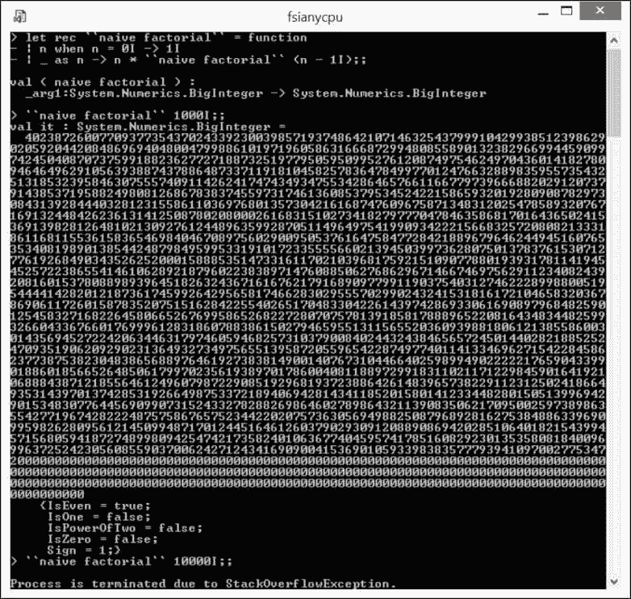
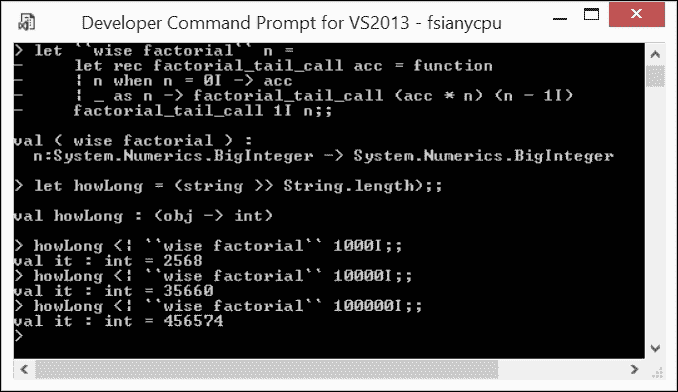
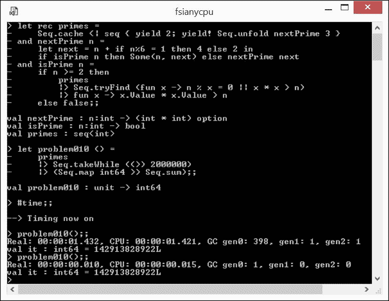
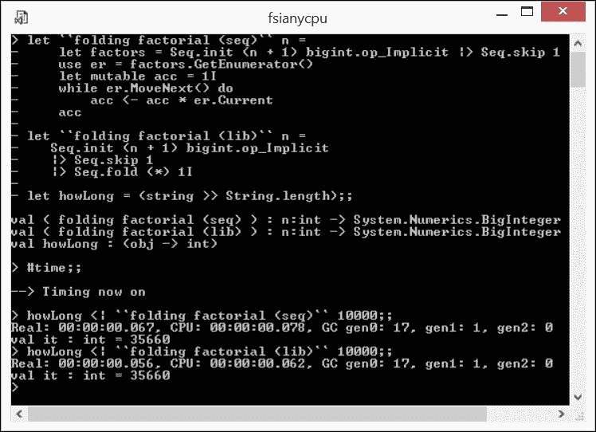
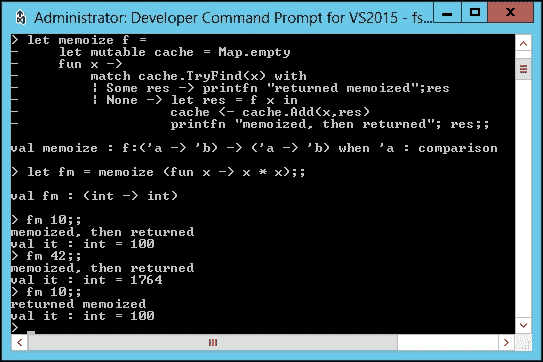
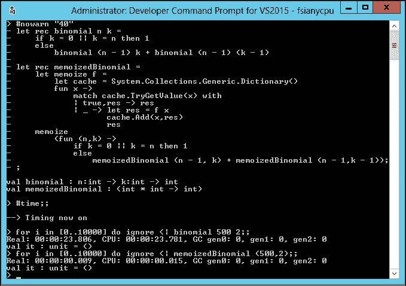
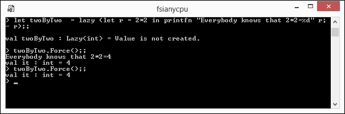
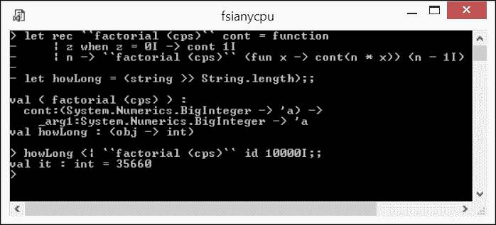
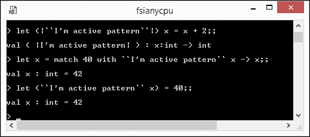

# 第七章. 高级技术：函数回顾

本章基于我们在前几章中观察到的函数、模式匹配和数据序列的基本 F#惯用用法。在这里，我转向数据转换的高级模式，换句话说，就是函数在数据上的重复使用。本章的目标是使你熟悉主要模式，其中结合的基本 F#惯用用法协同工作。本章涵盖了以下主题：

+   高级**递归**模式，包括尾递归和函数与序列的相互递归

+   **折叠**作为聚合的通用模式

+   **记忆化**和**惰性求值**作为应用于数据的**即时原则**的补充模式

+   扩展函数交互核心**调用-返回**原则的**延续传递**模式

+   通过泛化匹配**活动模式**的高级模式匹配

这些协同作用通常在干净、简洁、高效的 F#代码中体现出来。

# 深入探讨递归

我已经在第三章中简要介绍了**递归**，展示了`rec`修饰符如何改变函数定义的作用域。这种明确的指示允许函数在函数体完全定义之前引用自身。现在我将向你展示递归可以以正确或错误的方式使用，这样你就可以学会遵循正确的递归模式。

## 尾递归

指出函数（递归或非递归）在当前实现中消耗一定量的资源用于局部值、参数值等，这并不是什么新发现。非递归函数在调用时消耗这些资源，并在返回结果时释放它们。到目前为止，一切顺利。

但当函数调用自身时会发生什么？每个嵌套调用都可以存储局部资源，在完成这个特定的递归级别时释放。因此，深度递归可能会暂时增加资源消耗。运行时函数调用和返回语义的实现（包括 F#的实现）通常使用有限体积的应用程序*堆栈空间*来暂时存储局部资源。如果一个递归函数通过深度嵌套自我调用而不会展开堆栈，这个预留的体积可能会耗尽，以臭名昭著的.NET `StackOverflowException`结束嵌套的自我调用链。即使没有堆栈溢出，对堆栈空间的贪婪实现也会对资源和对性能造成压力，因为分配和释放堆栈帧以保持函数调用局部上下文需要时间。

一个经典的（尽管严重磨损的）例子是组织不良的递归，目的是计算**阶乘**函数（[`en.wikipedia.org/wiki/Factorial`](https://en.wikipedia.org/wiki/Factorial)），如下所示（`Ch7_1.fsx`）：

```cs
let rec ``naive factorial`` = function 
| n when n = 0I -> 1I 
| _ as n -> n * ``naive factorial`` (n - 1I) 

```

（我退回到 `BigInteger` 类型，因为为了引起堆栈溢出，参数应该在一个范围内，这样阶乘函数的结果可能很容易由数千位组成）。现在，借助 FSI，让我们看看 ```cs ``naive factorial`` 1000 ``` 和 ```cs ``naive factorial`` 10000 ``` 的值会是什么。以下截图显示第一次调用有一个相当高的数值，但第二次调用正如预测的那样，以 `StackOverflowException` 失败：



非尾递归函数调用的失败

这里发生的情况是，这个实现不断地调用 ```cs ``naive factorial`` ```，随着参数值递减，堆栈帧堆积，直到达到 ```cs ``naive factorial`` 0 ```。然后，它开始展开堆栈，执行延迟乘法，最终堆栈为空，并得到所需的功能值。很容易注意到消耗的堆栈帧的数量与函数参数值相匹配。有足够的堆栈空间来容纳 1000 个帧，但 10 倍于此就会压倒应用程序。

这里能做什么呢？我们可能意识到所有部分乘法都可以在递归展开时立即完成，并且中间结果可以作为额外的参数传递。这种对先前天真方法的巧妙转变在以下代码片段（`Ch7_1.fsx`）中显示出来：

```cs
let ``wise factorial`` n = 
  let rec factorial_tail_call acc = function   | n when n = 0I -> acc 
  | _ as n -> factorial_tail_call (acc * n) (n - 1I) 
  factorial_tail_call 1I n 

```

在先前的 ```cs ``wise factorial`` ``` 定义中，递归被委托给内部 `factorial_tail_call` 函数，该函数有两个参数而不是一个：

+   一个是任何计算步骤的**阶乘**参数（它被使用 `function` 而不是更具描述性的 `match` 构造所隐藏）

+   另一个是**累加器** `acc`，它携带已经执行递归步骤的中间乘积

现在很容易看出，对 `factorial_tail_call` 的递归调用不构成任何其他涉及上下文其他值的表达式的子表达式；此外，评估这个自包含的表达式是自我调用函数执行的最后一个操作。这就是为什么它被称为**尾调用**，此后，所有递归调用都是尾调用的函数被称为**尾递归**。

让我们看看 ```cs ``wise factorial`` ``` 实现在使用大量参数进行练习后会做什么。为了节省空间，让我们使用优雅的 `let howLong = (string >> String.length)` 组合器来输出函数结果字符串表示中的数字位数，而不是像以下截图所示的实际阶乘数：



使用尾递归实现来推动阶乘极限

在对尾递归进行振奋人心的重构之后，我们的```cs ``wise factorial`` ```实现计算 100,000 的阶乘没有任何问题，或者用传统的数学符号表示，就是*100,000!*。确实值得兴奋，因为这个数字需要记录近五十万个数字，确切数字是`456574`！

仔细的读者可能会注意到，```cs ``wise factorial`` ```的实现，其中没有子表达式和上下文携带的值，非常类似于古老的好命令循环。令人惊讶的是，这正是 F#优化编译器在这种情况下所做的事情。我建议对尾递归编译的内部工作原理感兴趣的读者参考微软 Visual F#团队的这篇博客：**F#中的尾调用**([`blogs.msdn.microsoft.com/fsharpteam/2011/07/08/tail-calls-in-f/`](https://blogs.msdn.microsoft.com/fsharpteam/2011/07/08/tail-calls-in-f/) )。

## 相互递归

到目前为止，所有考虑到的与递归相关的用例都涉及**自递归**，即递归函数调用自身。然而，不难推断出递归函数抽象允许自然推广，其中两个或更多函数在定义中相互调度，允许循环依赖。这种推广将**相互递归**模式引入其中。

为了表达这种相互依赖，F#引入了一种特殊的`let rec`绑定，其中两个或更多组成函数的定义通过`and`关键字组合在一起，如下所示：

```cs
let rec fname_a arguments = 
  < fname_a definition> 
and fname _b arguments = 
  < fname_b definition> 
........................... 

```

如在**递归函数**([`msdn.microsoft.com/en-us/library/dd233232.aspx`](https://msdn.microsoft.com/en-us/library/dd233232.aspx) )中概述的，我已经在第三章 *基本函数* 中介绍了具有`rec`修饰符的单个函数绑定的内部工作原理。相互递归绑定简单地扩展了相同的原则：一个或多个`and`部分只是添加额外的绑定，使得绑定的函数名可以立即用于前向引用。

从概念上讲，相互递归是一个非常简单的推广。然而，随着移动部件数量的增加，对相互递归函数行为的推理可能会变得相当复杂，从而允许错误悄悄进入。上述观察的一个很好的例子是 MSDN 上提供的相互递归函数对`Even`和`Odd`的定义示例。以下代码显示了从那里（`Ch7_2.fsx`）取出的以下两个相互递归函数的定义：

```cs
// Beware, does not work as expected! 
let rec Even x = if x = 0 then true else Odd (x - 1) 
and Odd x = if x = 1 then true else Even (x - 1) 

```

定义看起来非常简洁和优雅，对吧？不幸的是，这种印象是表面的，前面的定义在特定情况下并不按预期工作，允许递归无限运行而不会停止。请你自己检查前面的代码对于`Even(1)`测试用例是如何工作的：它会无限运行！我建议对修复这个相互递归定义感兴趣的读者查看我于 2013 年 4 月发布的博客文章**两个函数的故事**([`infsharpmajor.wordpress.com/2013/04/21/a-tale-of-two-functions/`](https://infsharpmajor.wordpress.com/2013/04/21/a-tale-of-two-functions/))，我在那里讨论了问题的基本原理、其历史和提出的修复方案。

在我看来，相互递归函数的定义和带有许多`goto`操作符的命令式代码片段之间似乎存在某种相似性。在这两种情况下，心理上追踪控制流的流程都同样困难，这反过来又为错误悄悄潜入创造了机会。

现在，让我转向一个相互递归模式良好应用的示例，展示驯服其力量的推理背后的点点滴滴。我将使用我自己的**Stack Overflow 回答**([`stackoverflow.com/a/9772027/917053`](http://stackoverflow.com/a/9772027/917053))，针对那里的问题**使用函数式编程高效计算素数**([`stackoverflow.com/questions/9766613/using-functional-programming-to-compute-prime-numbers-efficiently`](http://stackoverflow.com/questions/9766613/using-functional-programming-to-compute-prime-numbers-efficiently))。我将使用在叙述中到这一点为止已经发现的模式来应对这个挑战，如下所示(`Ch7_2.fsx`)：

```cs
let rec primes =  
  Seq.cache <| seq { yield 2; yield! Seq.unfold nextPrime 3 } 
and nextPrime n = 
  let next = n + if n%6 = 1 then 4 else 2 in 
  if isPrime n then Some(n, next) else nextPrime next 
and isPrime n = 
  f n >= 2 then 
    primes 
    |> Seq.tryFind (fun x -> n % x = 0 || x * x > n) 
    |> fun x -> x.Value * x.Value > n 
  else false 

```

第一部分是定义不定长度的`primes`序列（实际上，由于前面实现的限制，仅限于`int`类型的素数，但这个问题可以很容易地推广）。令人惊讶的部分在于，一个序列绑定`seq {...}`可以是相互递归函数绑定的一部分。尽管如此，`primes`绑定使用了`seq { yield 2; yield! Seq.unfold nextPrime 3 }`序列表达式，它产生了第一个素数 2，然后是`yield!`的`Seq.unfold`生成函数，它依赖于假设存在一个`nextPrime`函数，给定一个素数参数可以生成下一个更大的素数。请考虑我是如何使用`let`绑定的`rec`修饰符提供的`nextPrime`的前向引用。这非常方便，并且允许你推迟`nextPrime`的定义，专注于当前序列的生成。

到目前为止，一切顺利。现在，我直接转向 `nextPrime` 的定义。我这样做是基于假设有一个函数 `isPrime` 在那里，给定一个 `int` 参数，可以找出它是否是素数。同样，正如之前讨论的那样，我将向前引用 `isPrime`，而不必担心它的实现，这要归功于允许我这样做的 `let rec ...` 和 `...` 绑定。

`nextPrime` 函数是通过 `Seq.unfold` 高阶函数的规则构建的。它首先计算的是下一个候选素数，无论当前参数的素性如何，使用一个稍微晦涩的绑定，`let next = n + if n%6 = 1 then 4 else 2`。实际上，这里并没有什么令人兴奋的，显然，潜在的候选数是奇数，我以最小的奇数素数 `3` 开始展开。对于每个值为 `n` 的候选数，如果 `n` 比 `6` 的倍数大 `1`，则下一个候选数将是 `n + 4`（因为 `n + 2` 显然是 `3` 的倍数）；否则，它只是 `n + 2`，你知道，这只是一个小优化。接下来，有了素数候选 `n` 和随后的 `n` 素数候选 `next`，我使用（尚未定义的）`isPrime` 函数检查 `n` 的值是否为素数。如果是肯定的，它返回 `Some(n, next)` 选项；否则，它以 `next` 作为参数递归地调用自身。

太好了！拼图的最后一部分是定义 `isPrime`。首先，它筛选出小于 `2` 的整数（`isPrime` 的一个额外有用特性是它可以作为一个素性检测器从其他地方调用）。现在请注意：对于大于或等于 `2` 的参数值，它积极使用小于或等于参数值平方根的已生成的 `primes` 序列的成员，这得益于 `Seq.tryFind` 高阶函数的检查！这就是为什么我在 `primes` 的定义中用 `Seq.cache` 缓存序列表达式的输出；否则，`isPrime` 会很慢。在这里，我们用内存空间换取执行速度。因此，`Seq.tryFind` 遍历缓存，直到它要么找到参数值的因子，要么到达 `primes` 成员乘以自身大于参数值的位置。第一个结果意味着参数不是素数，第二个结果意味着它是素数。这个陈述总结了关于 `primes` 实现的冗长且有点令人烦恼的注释。

我通过检查 `primes` 实现的性能来结束这一部分。为此，让我转向熟悉的 **Project Euler** ([`projecteuler.net/`](https://projecteuler.net/) )，特别是 **问题 10 - 素数求和** ([`projecteuler.net/problem=10`](https://projecteuler.net/problem=10) )。

```cs
let problem010 () = 
  primes 
  |> Seq.takeWhile ((>) 2000000) 
  |> (Seq.map int64 >> Seq.sum) 

```

将 `primes` 定义应用于不超过 2,000,000 的质数求和，将在接下来的图中展示。在我的电脑上，这只需要不到 1.5 秒。此外，考虑到重复运行的结果只需 10 毫秒，这要归功于序列缓存：



使用互递归生成质数

个人而言，我发现 `primes` 代码中有很多美学价值，尤其是在它如何两次使用前向引用，最终锁定在自我计算的数据上。定义中的三个相互依赖的部分都是纯函数（好吧，有点像，因为缓存确实代表了一种隐藏的状态，但以一种非常干净的形式）。这就是函数式编程的力量！

# 折叠

现在是回顾我在本章开头介绍尾递归时使用的 `factorial` 函数的完美时机。让我们从以下表达式 `1I` 到值 `n` 的 `bigint` 数列中取一个序列：

```cs
Seq.init (n + 1) bigint.op_Implicit |> Seq.skip 1 

```

`factorial(n)` 函数难道不是仅仅表示了因数的乘积，每个因数都是前一个序列的成员吗？当然，它可以被看作是这样（并且可以如此实现）。让我按照命令式编程风格的最好传统，如以下所示（`Ch7_3.fsx`）创建这个实现：

```cs
let ``folding factorial (seq)`` n = 
  let fs = Seq.init (n + 1) bigint.op_Implicit |> Seq.skip 1 
  use er = fs.GetEnumerator() 
  let mutable acc = 1I 
  while er.MoveNext() do 
    acc <- acc * er.Current 
  acc 

```

用简单的话来说，这种实现可以按照以下方式展开：

+   取一个可变值，它将作为结果累加器使用

+   列出因数序列

+   对于序列中的每个因子，通过将当前累加器值乘以当前因子来获取新的累加器值

+   将最终累加器值作为函数结果返回

一些在面向对象设计方面有经验的你，可能已经在前面的实现中发现了**访问者**([`en.wikipedia.org/wiki/Visitor_pattern`](https://en.wikipedia.org/wiki/Visitor_pattern) ) 模式的迹象。确实，操作（在这个例子中是乘法）被应用于序列数据，而没有以任何方式改变这些数据，最终将结果作为这些重复操作的汇总。

以高阶函数签名的形式概括，可以得到以下内容：

```cs
fold: ('State -> 'T -> 'State) -> 'State -> 'T seq -> 'State 

```

这里，名为 `folder` 的类型为 `('State -> 'T -> 'State)` 的函数应用于以下两个参数：

+   第一个类型为 `'State`，表示累加器

+   第二个类型为 `seq 'T`，表示具有 `'T` 类型的元素序列

`folder` 函数返回累加器的最终值。这个名为 `fold` 的函数代表了数据处理的通用模式，名为 `folding`。

如预期的那样，前面形式化的通用折叠确实是 F#核心库的一个成员：**Seq.fold<'T,'State>函数** ([`msdn.microsoft.com/en-us/library/ee353471.aspx`](https://msdn.microsoft.com/en-us/library/ee353471.aspx) )。使用`Seq.fold`库函数重写```cs ``folding factorial (seq)`` ```，该函数隐藏了所有这些讨厌的移动部件（枚举器、状态持有者和遍历枚举），给出了以下更简洁的版本（`Ch7_3.fsx`）：

```cs
let ``folding factorial (lib)`` n = 
  Seq.init (n + 1) bigint.op_Implicit 
  |> Seq.skip 1 
  |> Seq.fold (*) 1I 

```

让我们从性能的角度比较这两种实现。以下截图显示了运行这两个版本的结果：



手动编写的折叠与库折叠函数的性能比较

观察到`library`函数的性能略优于手动编写的命令式版本，这并不令人惊讶。`library`函数的实现高度优化。对于那些好奇的人来说，GitHub 上当前`fold`函数的库实现看起来就像以下片段（`Ch3_7.fsx`）所示：

```cs
// Excerpt from seq.fs of FSharp.Core.Collections: 
[<CompiledName("Fold")>] 
let fold<'T,'State> f (x:'State) (source : seq<'T>)  =  
  checkNonNull "source" source 
  use e = source.GetEnumerator()  
  let f = OptimizedClosures.FSharpFunc<_,_,_>.Adapt(f) 
  let mutable state = x  
  while e.MoveNext() do 
    state <- f.Invoke(state, e.Current) 
  state 

```

你可能已经注意到折叠与带有累加器的尾递归有多么相似。这种相似性并非偶然。两者都通过函数调用的序列传递状态，尽管`recursive`函数在执行时实际实现了这些调用，而`fold`函数则将`folder`函数应用于显式的待折叠数据序列。

### 注意

可以形式化证明，在具有一阶元组和函数的语言中，例如 F#，任何函数都可以表示为`fold`。我建议对这一主题感兴趣的读者参考关于此的经典论文：Graham Hutton 的**关于折叠的表达能力和普遍性的教程**([www.cs.nott.ac.uk/~pszgmh/fold.pdf](http://www.cs.nott.ac.uk/~pszgmh/fold.pdf) )。

# 记忆化

接下来的两个相对高级的主题，我在某种程度上将它们与编译上下文之外的**即时**（**Just in Time**）方法进行了比较。在**即时**（[`en.wikipedia.org/wiki/Just_in_Time`](https://en.wikipedia.org/wiki/Just_in_Time)）中，维基百科首先提出了一个生产策略，在制造过程中，组件在投入使用之前立即交付，作为一种减少库存成本的*精益*方法。

实际上，**记忆化**和**惰性求值**在这个*精益*计算意义上是相辅相成的。虽然惰性允许你不必在结果绝对需要之前进行计算，但记忆化通过不允许这些已经执行过的*昂贵*资源密集型计算结果被浪费，使得这些结果可重用。

我在前面这个章节中实现素数生成时已经使用了一些缓存，为了覆盖互递归。在那里，一个昂贵的序列被缓存起来，以便使用已经生成的元素来找到尚未生成的下一个元素。现在，我想专注于缓存的一般用法，允许任何函数都可以被缓存。在这样做之前，重要的是要意识到以下内容：

+   缓存可能只适用于 *纯函数*。这几乎是显而易见的；如果一个函数不是引用透明的，那么它不能被缓存，因为缓存只捕获参数，而不是参数、*和*状态。

+   缓存利用了预先计算的状态

基于此，让我们模仿互联网上其他地方提出的实现（[`blogs.msdn.microsoft.com/dsyme/2007/05/31/a-sample-of-the-memoization-pattern-in-f/`](https://blogs.msdn.microsoft.com/dsyme/2007/05/31/a-sample-of-the-memoization-pattern-in-f/) 和 [`www.fssnip.net/8P`](http://www.fssnip.net/8P)），以便调查相关的限制和问题，如下所示（`Ch7_4.fsx`）：

```cs
// Memoization (F# 4.0 is required) 
let memoize f = 
  let mutable cache = Map.empty 
  fun x -> 
    match cache.TryFind(x) with 
    | Some res -> printfn "returned memoized";res 
    | None -> let res = f x in 
    cache <- cache.Add(x,res) 
    printfn "memoized, then returned"; res 

```

F# 编译器为缓存推断的类型如下：

```cs
memoize : f:('a -> 'b) -> ('a -> 'b) when 'a : comparison 

```

在这里，`f` 代表一个需要缓存的结果的函数，`cache` 作为状态存储库，在底层使用不可变的 **Map F# 集合** ([`msdn.microsoft.com/en-us/library/ee353880.aspx`](https://msdn.microsoft.com/en-us/library/ee353880.aspx))。`memoize` 本身代表一个完整的高阶函数，它接受一个函数作为参数，并返回一个函数。这封闭了可变的 `cache`（F# 4.0 的一个特性）并执行以下操作：

+   如果其参数 `x`，作为对封闭的 `Map` `cache` 的键，可以被找到，那么它记录了预缓存值将被使用的信息，并返回这个 `res` 值。

+   否则，它将封闭的 `cache` 转换为一个新的 `Map`，除了现有的条目外，还包括由新计算出的元组（`x, f(x)`）表示的条目，然后记录缓存发生的事实，并返回 `f(x)`。

让我们看看在 FSI 中它是如何工作的，以下截图捕捉了这一过程：



使用 F# Map 的缓存

首先，我将 `fun x -> x*x` 函数缓存起来，这个函数原本应该代表一个“胖”的资源密集型计算，变成了 `fm:(int -> int)` 函数。然后，我像这里所示一样，用不同的参数调用了 `fm` 几次：

+   `fm 10`：结果 `100` 被缓存，用于参数 10 并返回

+   `fm 42`：结果 `1764` 也被缓存并返回

+   `fm 10`：由于这个参数值已经出现，结果 `100` 被返回，无需任何重新计算

这个模式看起来相当简单；然而，它有几个需要注意的问题。

例如，`memoize`的签名表明需要`'a`来表示比较；那是什么意思？深入挖掘`memoize`实现会让你得出结论，这个约束仅仅是使用 F# `Map`作为状态持久化后的一种推论。

由于`Map`背后的实现可能是一个**平衡树**，它需要其键是**可比较的**以便重新平衡。哎呀！听起来这里发生了**抽象泄漏**([`en.wikipedia.org/wiki/Leaky_abstraction`](https://en.wikipedia.org/wiki/Leaky_abstraction))。此外，这也可能成为通用记忆化应用的一个限制因素，因为可比较性并不是泛型类型`'a`的通用属性。

让我们将持久化实现机制更改为通用的**字典**([`msdn.microsoft.com/en-us/library/xfhwa508(v=vs.100).aspx`](https://msdn.microsoft.com/en-us/library/xfhwa508(v=vs.100).aspx))，如下面的代码所示 (`Ch7_4.fsx`)：

```cs
let memoize' f = 
  let cache = System.Collections.Generic.Dictionary() 
  fun x -> 
    match cache.TryGetValue(x) with 
    | true,res -> printfn "returned memoized";res 
    | _ -> let res = f x 
    cache.Add(x,res) 
    printfn "memoized, then returned" 
    res 

```

这将记忆化参数约束从比较改为相等，如下所示：

```cs
memoize' : f:('a -> 'b) -> ('a -> 'b) when 'a : equality 

```

这可以被认为是更普遍的情况，直到出现一些无害的使用，如下所示：

```cs
let disaster = memoize' (fun () -> 5) 
...... 
disaster() 

```

执行此代码将导致以下异常：

```cs
System.ArgumentNullException: Value cannot be null 

```

究竟是怎么回事？结果是并没有发生什么特别的事情，只是另一个抽象泄漏发生了，因此出现了问题。这次，问题源于不允许你将`null`值作为`Dictionary`键的底层持久化机制（相反，`Map`却乐意这样做）！

最后，我想谈谈将记忆化与递归结合的问题，因为递归经常是解决采用**分而治之**策略的问题的工具，其中记忆化自然适用，并且可能真正发光。

让我们考虑一些更符合目的的使用案例，例如，借助**帕斯卡三角形**([`en.wikipedia.org/wiki/Pascal%27s_triangle`](https://en.wikipedia.org/wiki/Pascal%27s_triangle))进行简单的二项式系数计算，如下所示 (`Ch7_4.fsx`)：

```cs
let rec binomial n k =  
  if k = 0 || k = n then 1 
  else 
    binomial (n - 1) k + binomial (n - 1) (k - 1) 

```

帕斯卡三角形行元素之间容易察觉的递归关系让你可以期待从记忆化中获得重大好处。

`binomial`的记忆化实现也很简单；`memoize`被转换为一个内部函数，以便去除其初始版本中引入的日志。唯一剩下的问题是记忆化函数有一个参数。然而，应用反柯里化可以很好地解决这个问题，如下所示 (`Ch7_4.fsx`)：

```cs
let rec memoizedBinomial = 
  let memoize f = 
    let cache = System.Collections.Generic.Dictionary() 
    fun x -> 
    match cache.TryGetValue(x) with 
    | true,res -> res 
    | _ -> let res = f x 
    cache.Add(x,res) 
    res 
  memoize 
  (fun (n,k) -> 
    if k = 0 || k = n then 1 
    else 
      memoizedBinomial (n - 1, k) + 
      memoizedBinomial (n - 1, k - 1)) 

```

现在是时候衡量记忆化带来的收益了。即将到来的图中的代码测量重复`binomial 500 2` 10,000 次与重复`memoizedBinomial (500,2)` 10,000 次所需的时间：



“分而治之”解决方案的记忆化

比较的结果绝对令人震惊，即 `23781 / 15 = 1585`，这意味着记忆化将性能提高了 1585 倍！

# 惰性求值

这个概念非常简单。默认情况下，F# 遵循 **贪婪求值** ([`en.wikipedia.org/wiki/Eager_evaluation`](https://en.wikipedia.org/wiki/Eager_evaluation) ) 策略，或者一个表达式一旦绑定就会被求值。在其他函数式编程语言中可用的另一种策略是推迟计算，直到其结果绝对必要。F# 可以明确地告诉在哪里使用惰性求值；默认情况下，它只为序列使用惰性求值。在 F# 中表达惰性求值在语法上并不复杂，以下绑定如所示地达到了目的：

```cs
let name = lazy ( expression ) 

```

在这里，`name` 被绑定到计算 `expression` 的结果，但计算本身被推迟。`name` 的值类型是特殊的，即 `Lazy<'T>`；它表示对 `'T` 的封装，`'T` 是表达式的本身类型。计算通过调用 `Lazy<'T>` 类型的 `Force` 方法来执行，就像这样 `name.Force()`。这个动作也会展开 `Lazy` 的底层类型，因此 `name.Force()` 表达式的类型是 `'T`。

请注意，这个特性并不特定于 F#；`Lazy<T>` 类是 System 命名空间中 .NET 框架类库的一部分。

重要的是要理解表达式只计算一次，所以如果封装到 `lazy` 方法中的表达式有副作用，它只会在表达式计算上执行一次。即使再次强制计算，副作用也不会发生；只会返回缓存的值。

让我们通过以下片段（`Ch7_5.fsx`）来演示：

```cs
let twoByTwo  = lazy (let r = 2*2 in 
  printfn "Everybody knows that 2*2=%d" r; r)  
twoByTwo.Force() 
twoByTwo.Force() 

```

以下截图显示了这段代码在 FSI 中的行为：



惰性求值和副作用

注意，`twoByTwo` 的绑定并没有使任何计算变得活跃，但它将未来的计算封装到了 `Lazy` 类型中。然后，第一个 `twoByTwo.Force()` 函数执行了封装的计算，因此副作用出现了。最后，任何后续的 `twoByTwo.Force()` 函数都只会重复带来第一次计算的结果，而没有任何副作用。

惰性求值模式在企业 F# 开发中有一个自己的领域。我经常在需要可能正在初始化的资源时使用它；如果这个需求真的实现了，我希望它只发生一次。例如，我们可以考虑在服务在生产环境中运行时从 Azure `KeyVault` 读取生产环境配置设置，而在其他环境中使用其他配置信息载体，例如指向数据存根的环境变量。

# 继续传递风格

这种安排递归的复杂技术允许你通过将所有函数调用放入尾位置（即执行剩余计算而不是将结果返回给调用者）来避免栈消耗。让我通过再次重构*阶乘*实现来演示这项技术，如下面的代码片段所示（`Ch7_6.fsx`）：

```cs
let rec ``factorial (cps)`` cont = function 
  | z when z = 0I -> cont 1I 
  | n -> ``factorial (cps)`` (fun x -> cont(n * x)) (n - 1I)  

```

虽然有点令人费解，但代码全部由尾递归组成：

+   对自身的递归调用```cs ``factorial (cps)`` ```是尾递归

+   新的延续匿名函数也调用旧的延续，`cont`

`cont`函数推断出的签名是`(BigInteger -> 'a);`因此，为了执行所需的计算，使用`id`身份函数作为```cs ``factorial (cps)`` ```的第一个参数对`cont`来说就足够了。以下截图展示了在 FSI 中测试```cs ``factorial (cps)`` ```函数的延续传递风格实现：



使用延续传递风格实现阶乘函数

这工作得很好，尽管那些不熟悉延续传递风格的人第一次处理这段代码时可能会头疼。

# 活动模式

我在第四章，*基本模式匹配*中承诺，我会通过涵盖**活动模式**来增加这个主题的内容；现在正是时候。记得**守卫**的匹配吗？守卫提供了一种通过附加一个具有`bool`结果的不定计算来深入挖掘匹配的`pattern-expression`函数的方法。

守卫机制为普通的模式匹配添加了一定的定制潜力，但它有点脱离：无论需要多少数据分解来完成守卫计算，所有这些努力都会在匹配和非匹配的可能计算结果中都被丢弃。不是很好吗？在模式匹配的识别和转换阶段之间有一个完全可定制的过渡？活动模式正是针对这个问题。广义上讲，活动模式代表了一种特殊类型的函数，允许在`pattern-expression`中使用。

它们允许你以非常简洁和优雅的方式实现一些典型的数据转换模式，如下所示：

+   类型之间的高级转换

+   根据相关和不相关的类别将数据分组

+   进行完全分类，换句话说，就是将任何数据按照这个数据属于给定的一对中的特定类别进行处理

让我们看看活动模式如何与这些数据处理模式的每一个案例互动。

## 使用活动模式进行类型转换

活动模式在`let`绑定中定义时使用特殊的命名约定：

+   即使像这样使用双引号，主动模式函数的名称也必须以大写字母开头：```cs ``I'm active pattern`` ```

+   主动模式函数的名称必须被包裹在*香蕉夹* `(|` `and` `|)` 中，如```cs(|``Another active pattern``|)```所示

主动模式工作的数据总是作为定义中的最后一个参数出现，并在使用时从上下文（`match`、`function` 或任何其他发生模式匹配的 F# 构造）中获取；在多参数定义中，除了最后一个参数之外的所有参数都是参数化主动模式工作的参数。

最后，当在最后一个参数的位置使用字面量时，如果主动模式计算的结果与字面量匹配，则 `pattern-expression` 被认为是匹配的。如果使用名称而不是字面量，则该名称绑定到主动模式计算的结果，并在相应的 `result-expression` 转换中使用。

这听起来是否令人困惑？实际上，它比听起来要简单。让我转向一些可能有助于说明的示例。

第一个表示一个虚拟样本，如下面的代码所示（`Ch7_7.fsx`）：

```cs
let (|Echo|) x = x 
let checkEcho p =  
  match p with 
  | Echo 42 -> "42!" 
  | Echo x -> sprintf "%O is not good" x 

```

`Echo` 主动模式非常简约；它只是将输入回显到结果中。然后，`checkEcho` 函数将这个定义付诸实践。在第一个 `pattern-expression` 中，它简单地检查 `Echo p` 计算的结果（`p` 是从 `match` 构造的头部隐式获取的）是否等于 `42`。如果是，则相应的结果表达式返回字符串 `"42!"`。否则，下一个 `result-expression` 将无条件地将 `Echo p` 计算的结果绑定到变量 `x`，然后这个变量在 `result-expression` 中被用来生成一个 `"... is not good"` 字符串。

因此，当在 FSI 中使用前面的示例时，`checkEcho 0`产生`"0 is not good"`，而`checkEcho 42`产生`"42!"`。

这是否变得更清晰了？另一个加强这种理解的简单示例将是一个主动模式：

```cs
let (|``I'm active pattern``|) x = x + 2 

```

在保持参数和结果类型相同的情况下，这仅仅执行了一个简单的值转换。上述主动模式的使用在以下屏幕截图中显示：



使用主动模式进行简单的类型转换

定义主动模式的绑定```cslet (|``I'm active pattern``|) x = x + 2```不匹配任何内容；相反，它取匹配的值并返回它，然后加 2。

绑定```cslet x = match 40 with ``I'm active pattern`` x -> x```用作匹配构造的一部分，并给出输入参数 `40`，它返回绑定到 `42` 的和值。

绑定```cslet (``I'm active pattern`` x) = 40```是一个稍微令人困惑的例子，如果你记得值绑定的 `let` 是基于模式匹配的数据解构的边缘情况，那么 ```cs ``I'm active pattern`` ``` 就应用于输入参数 `40` 并将结果 `42` 绑定到 `x`。

到目前为止，应用活动模式进行数据转换的特定用例应该已经足够清晰；我想将其应用于一个更实际的应用场景。

使用全局唯一标识符（GUID）([`en.wikipedia.org/wiki/Globally_unique_identifier`](https://en.wikipedia.org/wiki/Globally_unique_identifier) )来标记在业务运行过程中出现的唯一实体是一种相当普遍的技术。例如，在 Jet.com，GUID 用于标记客户订单、商家订单、商家订单项、运输、履行中心、SKU...完整的列表会太长。这些代码大多以 32 个十六进制数字的字符串形式交换和显示。在某些系统节点中，需要验证给定的字符串是否是 GUID 的合法表示。这项任务可以很容易地通过活动模式完成，如下所示（`Ch7_7.fsx`）：

```cs
let hexCharSet = ['0'..'9'] @ ['a'..'f'] |> set in 
let (|IsValidGuidCode|) (guidstr: string) = 
  let (|HasRightSize|) _ = guidstr.Length = 32 
  let (|IsHex|) _ = (guidstr.ToLower() |> set) = hexCharSet 
  match () with (HasRightSize rightsize & IsHex hex)-> rightsize && hex  

```

上述代码有许多有趣的片段，例如允许的`hexCharSet`十六进制字符集，这些字符只计算一次，并且是活动模式`IsValidGuidCode`定义的局部；一对内部活动模式`HasRightSize`和`IsHex`，每个模式只负责单个验证属性，并使用外部活动模式中的一个而不是自己的输入参数；最后，两个`pattern-expressions`通过`&`组合在一起，再次省略了参数，因为它已经传递给了它们的主体，并在`result-expression`中将最终结果基于在互补的`pattern-expression`中提炼出的实体组合。那些完全理解上述代码片段如何工作的人可以自称是活动模式主题的专家。

为了确保这段代码真的能工作，让我快速测试一下。下面的图反映了测试结果，显示`IsValidGuidCode`活动模式正确地将`"abc"`字符串识别为无效 GUID，将`"0123456789AbCdEfFFEEDDCCbbAA9988 "`识别为有效 GUID：


使用活动模式验证 GUID 字符串

顺便说一下，我迄今为止所涵盖的形如（`|活动模式名称|`）的活动模式被称为**单全活动模式**，因为它们处理单个数据类型，通过包含的计算将其转换为相同或不同的数据类型。考虑的样本的另一个特点是它们都在单个参数上工作。我将在本章后面介绍**带参数的活动模式**。

## 使用活动模式进行数据分区

我对 F# 活跃模式作为处理模式的使用的新尝试，关注的是典型的做法，即数据可能构成一个或多个适合处理的情况，以及“其余的”不适合的情况。在 F# 无处不在地使用能够执行上述方式划分的选项活跃模式的精神下，将输入数据类型转换为 `Option` 类型，其中 `None` 情况表示不适合的数据，而 `Some` 包裹一个或多个适合的数据类型。

这种活跃模式定义的明确区分是通过在活跃模式定义的右侧香蕉剪辑 `|)` 前面添加 `|_` 字符来实现的。这种类型的活跃模式称为**部分活跃模式**，它们的名称组看起来像这样：`(|name 1[|name 2...]|_|)`。让我们考虑一个相当大的真实代码片段，来自 Jet.com 的一个生产系统，以展示这种技术。

当前任务是对 Jet.com 供应商（运输承运人、支付处理器等）的发票进行处理，这些供应商以逗号分隔的文件形式包装他们的数据。在这里，我广泛地使用“逗号分隔”，因为分隔符可以是任何字符。文件可能包含或不含标题，并且可能携带无数其他不规则性。上传这些发票进行处理，然后存档，这是一个具有一定复杂性的问题。

为了本章的目的，我将只考虑一个部分相关的问题，即识别最后上传的文件是否为已知的 `Processable` 类型，应该进行处理，或者它不是，应该被拒绝。

为了使书中实现前述任务的代码尽可能简短，我将供应商数量限制为仅三个，即运输承运人**联邦快递**（FedEx）、**OnTrac**和支付处理器**Braintree**。

我从 `Processable` 开始，列出已知供应商文件如下（`Ch7_8.fsx`）：

```cs
type Processable = 
| FedexFile 
| OnTracFile 
| BrainTreeFile 
with 
  override this.ToString() = match this with 
    | FedexFile -> "Fedex" 
    | OnTracFile -> "OnTrac" 
    | BrainTreeFile -> "BrainTree" 

```

这里没有什么花哨的；只是用区分联合表示领域实体的常见做法，可能略有增强。

接下来，文件标题是硬编码的，并且从右侧显著剥离，因为完整的内 容并不重要，如所示（`Ch7_8.fsx`）：

```cs
let BraintreeHdr = "Transaction ID,Subscription ID,..." 
let FedexHdr = ""Bill to Account Number";"Invoice Date";..." 
let OntracHdr = "AccountNum,InvoiceNum,Reference,ShipDate,TotalCharge,..." 

```

最后，活跃模式定义如下（`Ch7_8.fsx`）：

```cs
let (|IsProcessable|_|) (stream: Stream) = 
  use streamReader = new StreamReader(stream) 
  let hdr = streamReader.ReadLine() 
  [(Processable.BrainTreeFile,BraintreeHdr); 
  (Processable.FedexFile,FedexHdr); 
  (Processable.OnTracFile,OntracHdr)] 
  |> List.tryFind (fun x -> (snd x) = hdr) 
  |> function 
  | None -> (if hdr.StartsWith(""1",") then 
    Some (Processable.OnTracFile) else None) 
  | _ as zx -> Some (fst zx.Value) 

```

如预期的那样，活跃模式名称指向部分活跃模式，参数是 `System.IO.Stream` 类型，携带文件内容，其返回值是 `Processable` 选项类型。

函数首先创建 `StreamReader` 并从那里读取第一行到 `hdr` 值中。

然后，它接受一个元组的列表，其中成员将`Processable`案例与表示相应逗号分隔的文件头部的字符串字面量配对，并尝试找到元组的第二部分等于`hdr`的元素。如果存在这样的元素，则可以处理该文件，函数返回选项值`Some`，封装找到的元组的第一个部分。

如果找不到元素（选项值`None`情况），在此点考虑，通常`OnTrac`文件可能不带标题。为了利用这一知识，我进一步检查已采取的流内容以及文件是否以指向`OnTrac`来源的某些符号开头，活跃模式返回`Some (Processable.OnTracFile)`；否则，该文件被认为是不可处理的。

在我看来，`IsProcessable`活跃模式代表了业务功能的相当简洁和清晰的实现。

## 使用活跃模式进行数据分类

我用适用于**分类**处理模式的活跃模式类型来结束我们对 F#活跃模式的精彩世界的探索，即把数据划分成完全覆盖域实体的所有子类别，不留任何非适用异常值的空间。

如你们中的一些人可能已经推断出的，与这种活跃模式相关联的名称是**多案例活跃模式**。其句法定义也与已经考虑过的案例非常不同。它包含在香蕉夹之间，只有几个用`|`管道符号分隔的案例名称。

让我们深入探讨说明性样本。一个电子商务域在支付方面考虑不同的支付条款和政策。特别是，如果支付条款不是即时的，引入确定每个特定付款何时到期的某些政策或政策是有意义的。因此，根据提供服务或商品的那一天，相应的付款是否到期取决于从那天到现在的经过时间。

使用活跃模式来实现非常直接；为了简单起见，让我们假设业务已经采用了一项单一天政策，即最多推迟三天付款（当然，在更复杂的设计中，这项政策可以是参数化的主题）如下所示（`Ch7_9.fsx`）：

```cs
open System 

let (|Recent|Due|) (dt: DateTimeOffset) = 
  if DateTimeOffset.Now.AddDays(-3.0) <= dt then Recent 
  else Due 

let isDue = function 
| Recent -> printfn "don't do anything" 
| Due  -> printfn "time to pay this one" 

```

使用活跃模式的函数也很简单，但这对说明目的来说是可以接受的。前面的代码在以下图中展示：


多案例活跃模式用于数据分类

我忘记提到，截至今天，F# 4.0 多案例活跃模式中的最大案例数限制为 7，这可能是某些情况下使用活跃模式的限制因素。

# 摘要

本章深入探讨了相对高级的 F#惯用法，这是普通 F#开发者在工作日中非常频繁使用的。

下一章将涵盖更多广泛使用的语言模式，这些模式在数据处理中扮演着核心角色，F#展示了针对多种数据集合类型的多态行为。
