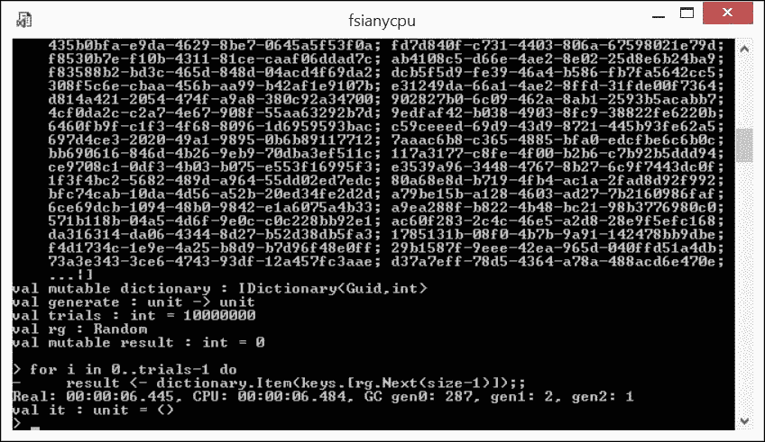
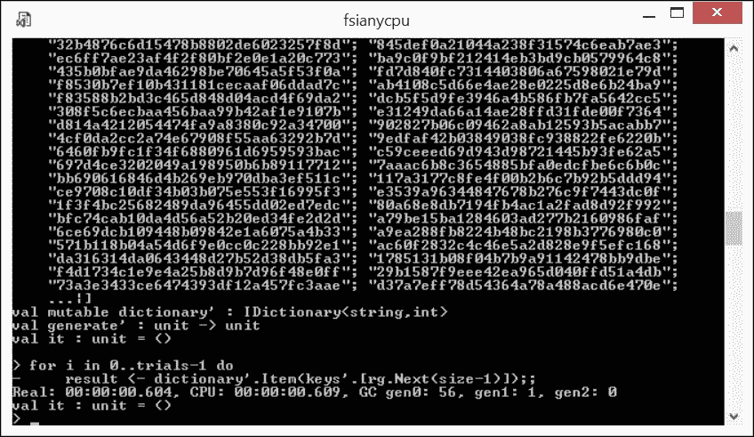

# 第十三章：函数代码的故障排除

在本章中，我简要介绍了函数优先编程方法的一个重要方面，该方法在 F#代码开发过程中发挥作用。事实上，函数优先代码的故障排除与诸如命令式代码的故障排除不同。本章的目标是与你分享我在编写惯用 F#代码时收集的一些观察结果。它应该使你具备一些考虑因素和一些有效的错误排除技巧。

本章我们将探讨以下主题：

+   理解为什么惯用 F#具有低缺陷率

+   使用 REPL 和探索性编程风格

+   解决一些编译时问题

+   解决运行时问题

# 为什么惯用 F#允许更少的缺陷

不再回到函数优先和其他 F#程序员可用的范式并行的比较，我将重申（主要是轶事性的）观点，即惯用 F#代码允许的缺陷比基于面向对象或命令式范式的等效实现更少。

前十二章节对此判断做出了重大贡献。但让我简要回顾一些考虑因素，以便得出以下结论：

+   这种缺陷率的降低并不是理所当然的。这是你在获得功能思维习惯和随后应用它们的严谨性时所付出的代价

+   仅使用 F#本身并不能解决缺陷；代码中仍有足够的空间让错误潜入，尽管数量显著减少

+   典型的 F#错误非常具体，通常可以预测并避免

## 降低错误率

这个观察结果非常重要，并源于几个因素：

+   语言的简洁性直接导致错误率降低：更少的代码行意味着更少的错误潜入和未被注意到的机会

+   严格的静态类型和类型推断根本不允许动态语言中常见的疏忽，当类型放置不当可能导致难以检测和消除的 bug

+   提高抽象级别、库高阶函数和不可变性。所有这些都有助于消除许多来自状态代码不可预测执行顺序、更多“移动部件”参与以及不必要的核心库功能重实现的 bug

## F#编译时错误比运行时错误更为普遍

使用传统编程语言编写的程序在语法上正确通常不会引起对其执行结果的任何假设。一般来说，这两个因素并不相关。

看起来，遵循 F#函数优先方法的实现并非如此。在 F#和基于 F#的非函数编程环境中，互联网上有大量的轶事证据表明

> *"如果编译成功，则运行正常"*

例如，这个**Haskell 维基帖子**([`wiki.haskell.org/Why_Haskell_just_works`](https://wiki.haskell.org/Why_Haskell_just_works) )就与使用相关 Haskell 编程语言编写的程序提出了类似的观察。

实际上，严格的静态类型和类型推断可以在编译时捕捉到许多随机缺陷，从而保护程序员免受在运行时观察问题并随后进行耗时且需要技能的活动——通常称为*调试*——以在源代码级别确定问题的真正原因所带来的高昂成本。

另一个极其重要的因素是，通过坚持使用核心库支持的少量惯用模式来实现算法，而不是操作低级语言结构。为了更好地说明我这里所说的内容，试着回答这个问题：哪种方法更容易出现实现错误，使用`Seq.fold`折叠序列，还是将序列实体化为数组并使用索引遍历元素，同时在可变值中聚合结果？正确的答案很容易转化为本书多次提到的观点：在函数式范式中的“最小化移动部件”的积极影响。

然而，你的折叠操作应该是正确的，这对于从算法角度来看实现的整体正确性至关重要。F#还提供了另一个除虫工具。这个工具允许开发者借助所谓的**REPL**（下一节将介绍）在实现过程中快速、轻松且频繁地进行快速检查。

# 使用 REPL 和探索式编程风格

**REPL**代表**读取-评估-打印循环**([`en.wikipedia.org/wiki/Read%E2%80%93eval%E2%80%93print_loop`](https://en.wikipedia.org/wiki/Read%E2%80%93eval%E2%80%93print_loop) )，它代表了一种与老式 C#程序员习惯的方式截然不同的程序开发方式，即*编辑源代码 - 构建编译后的程序版本 - 运行和调试循环*。从它的早期开始，F#就引入了**交互式开发方式**([`docs.microsoft.com/en-us/dotnet/articles/fsharp/tutorials/fsharp-interactive/index`](https://docs.microsoft.com/en-us/dotnet/articles/fsharp/tutorials/fsharp-interactive/index) )。然而，更广泛地说，它为 F#开发者提供了一种被称为**探索式编程**([`en.wikipedia.org/wiki/Exploratory_programming`](https://en.wikipedia.org/wiki/Exploratory_programming) )的编程风格。F#提供了一个名为**F# Interactive**（32 位`fsi.exe`或 64 位兼容的`fsiAnyCPU.exe`）的工具，它既可以作为独立工具，也可以作为 Visual Studio 的一部分，从任何 F#项目访问。它允许你在动态构建的运行时环境中评估任何以独立 F#脚本或选定的 F#程序片段形式呈现的 F#表达式。

F#交互式是一个功能极其强大的工具。它的使用场景涵盖了从快速检查刚刚实现的一行函数行为到在生产环境中运行 F#实现的微服务。是的，我没有开玩笑；F#交互式编译器的质量几乎与正常构建编译器相同。曾经，整个 Jet.com 微服务架构都是通过一系列 F#脚本实现的，每个脚本都由一个专门的`fsi`进程执行。

在开发任何 F#代码时，通过在`fsi`中评估这个或那个片段进行快速检查的习惯，可以显著帮助实现几乎无错误的 F#实现。我强烈建议你在日常实践中获取并遵循 F#探索式编程风格。

# 解决一些编译时问题

虽然 REPL 可以帮助探索和调整正确的 F#代码，但它会保留编译器错误，因为评估代码片段包括`fsi`中嵌入的 F#编译器的编译。而且我必须承认，一些编译时错误可能会让经验不足的 F#开发者感到困惑。在这里，我将分析几种这样的错误，并提供如何摆脱它们的建议。在我这样做之前，你应该记住，由于初始缺陷通常被类型推断作为正确代码吸收，因此报告的编译错误与那种复杂的类型推断推断是一致的。也就是说，类型推断经常掩盖错误的真正原因。我们很快就会讨论一些这种情况的例子。

## if-then 返回值

对于 F# `if...then...`表达式结果类型的类似复杂推断，其中一种最容易理解的情况发生在该结果类型不能是任何其他类型，只能是`unit`。通常，这似乎是反直觉的。让我们看看为什么会这样。

在下面的代码片段中，我选择了实现中的特定（`<`）比较运算符，只是为了保持简单（`Ch13_1.fsx`）：

```cs
let f a b = 
    if a < b then 
        a 
    else 
        b 

```

在这里，函数`f`的推断签名表示评估 F#表达式`if-then-else`的结果，为`f: 'a -> 'a -> 'a`（需要比较），这完全合理（应该不需要太多努力就能识别出前面代码中`min`函数的泛型实现）。

现在，让我们看看如果省略`else`部分会发生什么（`Ch13_1.fsx`）：

```cs
let f' a b = 
    if a < b then 
        a 

```

现在函数`f'`的推断签名是`f': unit->unit->unit`；换句话说，两个参数和结果都必须是`unit`类型。那是什么意思？看似反直觉的类型推断结果背后的推理实际上是有道理的。让我们想想当条件`a < b`为`false`时，函数`f'`必须返回什么值？在没有明确指示的情况下，编译器决定它必须是`unit`。但是等等；`if-then-else`表达式的两个分支不应该是同一类型吗？只有当参数`a`是`unit`类型时，这个条件才能满足，这意味着参数`b`也必须是`unit`类型。

好吧；但如果我尝试将类型推断推向某些方式，例如，强制尝试将`a`推断为泛型类型`'a (Ch13_1.fsx)`：

```cs
let f'' (a:'a) b = 
    if a < b then 
        a 

```

或者，如果我们尝试将`a`推向更具体的方向，通过强制它成为具体类型，例如，`int (Ch13_1.fsx)`：

```cs
let f''' (a:int) b = 
    if a < b then 
        a 

```

结果发现，两次尝试都是徒劳的，因为关于省略的`else`分支的`unit`返回类型的考虑仍然是有效的。在第一种情况下，编译器将只是发出一个讨厌的警告，指出

> *此结构导致代码的泛型程度低于类型注解所指示的程度。类型变量`'a`已被约束为类型`'unit'`。*

在第二种情况下，从编译器的角度来看，这是一个简单而直接的错误

> *此表达式预期具有`unit`类型，但此处具有`int`类型。*

因此，我们应该如何处理`if...then...`表达式？教训是，这种条件语句的简短形式只能在需要副作用的情况下使用。好的例子包括记录一些诊断信息或更改可变值。对于必须返回真正的非`unit`结果的情况，必须评估完整的`if-then-else`表达式，并且两个分支都返回相同类型的值。

## 值限制

这种编译问题通常会使已经掌握并自豪地使用 F#特性（如*部分应用*和*自动泛化*）的中级 F#开发者感到困惑。想象一下，您提出了一种强大的数据处理算法并正在实现它，在这个过程中享受了惯用 F#代码的力量和美感。在某个时刻，您意识到需要一个函数，该函数接受一个列表的列表并找出所有元素列表是否为空。对于一个经验丰富的函数式程序员来说，这难道不是一个小问题吗？所以您想出了类似这样的事情（`Ch13_2.fsx`）：

```cs
let allEmpty  = List.forall ((=) []) 

```

惊讶！它无法编译，编译器警告如下：

> *值限制。值`'allEmpty'`已被推断为具有泛型类型`val allEmpty : ('_a list list -> bool) when '_a:equality`。要么使`'allEmpty'`的参数显式化，要么，如果您不希望它具有泛型，添加类型注解。*

您（我应该承认我过去多次这样做）首先对这个混乱感到难以置信，因为 F#编译器准确地推断出了您的意图，但不知何故不喜欢它。然后您在 Google 上搜索“f#值限制”，被引荐到**MSDN 自动泛化**([`docs.microsoft.com/en-us/dotnet/articles/fsharp/language-reference/generics/automatic-generalization`](https://docs.microsoft.com/en-us/dotnet/articles/fsharp/language-reference/generics/automatic-generalization) )，在那里您被告知：

> *编译器仅在具有显式参数的完整函数定义和简单的不可变值上执行自动泛化。*

这之后是处理突发问题的实用技巧。你尝试这些建议并解决问题，但留下了一些黑魔法般的余味。

对我来说，令人耳目一新的经历是阅读这篇优秀的博客文章：**F# 值限制的细微差别** ([`blogs.msdn.microsoft.com/mulambda/2010/05/01/finer-points-of-f-value-restriction/`](https://blogs.msdn.microsoft.com/mulambda/2010/05/01/finer-points-of-f-value-restriction/)）。我将展示应用于可变值的泛化所隐藏的危险，这可能会成为你阅读这篇博客文章并理解 F# 编译器行为背后的理由的动力。

让我们看看一个看似无害的代码片段（`Ch13_2.fsx`）：

```cs
let gr<'a> : 'a list ref = ref [] 
gr := ["a"] 
let x: string list = !gr 
printfn "%A" x 

```

猜猜在执行此片段后打印的 `x` 值会是什么？那会是 `["a"]`，对吧？

错误；`[]` 就是发生的情况！造成这种情况的原因是 `gr` ，尽管看起来像 `'a list ref` 类型的值，但实际上是一个类型函数。在 `:=` 操作符的左侧使用时，它只是带来一个新的未绑定引用实例。在 `!` 操作符的右侧使用时，它只带来另一个新的引用实例，该实例指向一个空列表 `[]`。为了实现直观预期的行为，我们需要将 `gr` 应用到类型参数字符串上绑定到具体的类型变量 `cr` ，然后后者，作为一个普通引用，将按预期行为（`Ch13_2.fsx`）：

```cs
let cr = gr<string> 
cr := ["a"] 
let y = !cr 
printfn "%A" y 

```

现在，打印的值确实是 `["a"]`。在所有情况中强制执行值限制错误，当情况偏离最安全的使用情况时，编译器保护开发者免受先前演示的意外代码行为。回到我的初始示例，可能的补救措施可以是以下任何一种（`Ch13_2.fsx`）：

```cs
let allEmpty xs = List.forall ((=) []) xs // remedy 1 
let allEmpty : int list list -> bool  = List.forall ((=) []) 
// remedy 2 
let allEmpty = fun x -> List.forall ((=) []) x // remedy 3 

```

### 不完美的模式匹配

许多看似反直觉的 F# 编译时错误和警告属于模式匹配领域。例如，看看以下对整数参数符号的简单检测：

```cs
let positive = function 
| x when x > 0 -> true 
| x when x <= 0 -> false 

```

尽管看似完整，但这会产生编译器的警告：

> *在此表达式中存在不完整的模式匹配*

结果表明，如果 F# 编译器遇到 `when` 守卫，它就会假设这种构造定义了一个不完整的匹配情况。这就是为什么，尽管给定的案例集在语义上是完整的，编译器仍然认为函数定义是不完整的。简单地移除过多的最后一个 `when` 守卫立即解决了问题（`Ch13_3.fsx`）：

```cs
let positive' = function 
| x when x > 0 -> true 
| _ -> false 

```

另一个常见的相关问题是不可达的匹配规则。大多数情况下，不可达的匹配规则会在程序员错误地在规则序列中使用变量而不是字面量时发挥作用，从而创建一个过早的通配符情况。在这种情况下，编译器使用良性警告，尽管几乎总是运行时结果混乱。因此，将这些场合标记为错误可能是一个更好的设计选择。几年前，我写了一篇关于这个问题的**博客文章**([`infsharpmajor.wordpress.com/2011/10/13/union-matching-challenge/`](https://infsharpmajor.wordpress.com/2011/10/13/union-matching-challenge/))，我在这里将其作为以下代码片段（`Ch13_3.fsx`）中问题的说明：

```cs
type TickTack = Tick | Tack 

let ticker x = 
    match x with 
    | Tick -> printfn "Tick" 
    | Tock -> printfn "Tock" 
    | Tack -> printfn "Tack" 
ticker Tick 
ticker Tack 

```

这可能会让你期待 `Tick` 输出后跟 `Tack`，但实际上，`Tick` 输出后应该跟 `Tock`！

F# 编译器对前面的片段发出两个警告。第一个警告提示你，打字错误 `Tock` 被视为变量而不是字面量，就像在另外两种情况下字面量 `TickTack` 一样：

> *通常不应在模式中使用大写变量标识符，这可能会表明模式名称拼写错误*

第二个警告：

> *这条规则永远不会匹配*

直接指出了由打字错误引起的后果。

这里的教训是，F# 开发者应该注意警告。将编译器处理的规则不可达视为错误可能更合适。

# 解决运行时问题

“如果编译成功，那么它就能工作” 的这句箴言帮助追随者们在企业软件开发的时间到市场评分中取得了惊人的成绩。

以 Jet.com 作为构建绿色田野电子商务平台实现的例子，它真的在不到一年的时间里将零到**最小可行产品**（**MVP**）的路径压缩了。平台的生产模式发布发生在接收后一年多一点的时间。

这是否意味着遵循以函数式优先的方法是软件开发中的银弹？当然不是在绝对尺度上，尽管在相对尺度上，改进是巨大的。

为什么成功不是详尽的？问题是，这种实践需要从血腥的想法过渡到平凡的实施问题。无论我们的实现多么准确，总有一些暗角可能潜伏着意外的问题。

让我用 Jet.com F#企业开发实践中的一个示例来演示这一点。Jet 代表一个创新的电子商务平台，汇集了许多业务领域，如互联网订购、零售销售、仓储、财务、会计、运输等。这些领域的每个通常都有自己的独特元数据分类；因此，为了并行运行它们，实现中最常见的操作之一是映射。而使用唯一非冲突标识符的普遍做法是基于 GUID 或**全局唯一标识符** ([`en.wikipedia.org/wiki/Globally_unique_identifier`](https://en.wikipedia.org/wiki/Globally_unique_identifier) )。

实际上，企业软件经常使用 GUID 作为访问键来处理字典和缓存，让我们看看.NET 核心库`System.Guid`的实现是否适合这个目的。

下面是一个相当简单的探索性实现，使用具有`System.Guid`类型键的字典。我创建了一个基于标准 F#核心库实现的简单`dictionary`，类型为`IDictionary<Guid,int>`。我仅为了简单起见，用大小数字对（`Guid,int`）填充它。现在，我将使用数组`keys`作为间接层来模拟对字典的大量随机访问，并测量性能。以下代码片段显示了所需代码片段的组成（`Ch13_4.fsx`）：

```cs
open System 
open System.Collections.Generic 
let size = 1000 
let keys = Array.zeroCreate<Guid> size 
let mutable dictionary : IDictionary<Guid,int> = 
    Unchecked.defaultof<IDictionary<Guid,int>> 
let generate () = 
    for i in 0..(size-1) do 
        keys.[i] <- Guid.NewGuid() 
    dictionary <- seq { for i in 0..(size-1) -> (keys.[i],i) } |> dict 
generate() 
let trials = 10000000 
let rg = Random() 
let mutable result = 0 
for i in 0..trials-1 do 
    result <- dictionary.Item(keys.[rg.Next(size-1)]) 

```

在开启计时的情况下运行此代码片段，以下屏幕截图显示了性能指标（为了简洁，仅显示有价值的输出）：



使用原生 System.Guid 访问字典

1000 万次访问在 6.445 秒内转换为每秒超过 150 万次访问。不算快。让我们把它作为基准。还有一个令人担忧的迹象是垃圾回收的数量：每 10000 次访问就有 287 次，这并不轻。

在深入挖掘观察到的代码行为的原因之前，让我仅展示为 Jet.com 进行的调查结果，以尝试改进水印。我将引入一个简单的更改，而不是使用作为复杂 Windows 系统数据结构的字典键的真正`System.Guid`类型，我将使用当从规范表示中去除连字符后留下的 GUID 值的表示，即十六进制字符串。例如，GUID `f4d1734c-1e9e-4a25-b8d9-b7d96f48e0f`将被表示为字符串`f4d1734c1e9e4a25b8d9b7d96f48e0f`。这将需要对之前的代码片段（`Ch13_4.fsx`）进行最小的更改：

```cs
let keys' = Array.zeroCreate<string> size 
let mutable dictionary' : IDictionary<string,int> = 
    Unchecked.defaultof<IDictionary<string,int>> 
let generate' () = 
    for i in 0..(size-1) do 
        keys'.[i] <- keys.[i].ToString("N") 
    dictionary' <- seq { for i in 0..(size-1) -> (keys'.[i],i) } |> dict 
generate'() 
for i in 0..trials-1 do 
    result <- dictionary'.Item(keys'.[rg.Next(size-1)]) 

```

在这里，我将创建一个新的`keys'`间接层，通过简单的数据转换从`keys`的对应部分生成。使用这个更改转向 FSI 带来了一个巨大的惊喜，反映在下面的屏幕截图：



从 System.Guid 切换到 string 以访问字典

与基线相比，新的访问率构成了每秒 16.4 百万次访问，几乎提高了 11 倍！此外，垃圾回收也实现了五倍提升。

现在记住，基于`System.Guid`的映射在平台上无处不在，你可以想象上述简单更改对整体平台性能的影响有多大。

# 摘要

本章应该使你为与其它开发范式相比，在以函数式编程为首要的开发中发生的缺陷类型位移做好准备。F#代码典型的运行时错误率降低缩短了开发系统的上市时间，并在必要时为性能优化释放了开发资源。

我们已经到达了本书的结尾，我在这里为你装备了大量的惯用 F#使用模式。本书的关键假设是，这种使用要求来自其他编程范式的开发者进行一定的思维习惯转变，独特的看问题角度，以及对应的功能程序员工具包中的模式和技巧。此时，你应该能够通过将问题分解为几个已知的构建块，然后使用适当的函数和组合子来构建解决方案来思考任何问题。你还被展示了使用标准 F#代数数据类型而不是自定义.NET 类的优势。在你的函数式设计中依赖你在这里获得的模式；保留、回忆并在日常实践中重用它们。

我希望这本书能引导你进入惯用函数式编程领域的道路。祝你成功到达那里！
