# 第二章。性能测量

性能测量经常引起许多争议，但我们应该尽可能直接地解决性能问题，同时保持客观的过程。结果必须尽可能客观。为了正确定义是否需要性能优化，我们必须能够客观地衡量运行代码。为了确保性能测量的客观性，结果必须通过分析代码运行时的行为、运行速度以及代码在内存中的大小来以定量（数字）和定性（质量）的方式可见。

按照惯例，定量分析比定性分析更容易，因为数据可以直接看到并比较，而定性分析则不然。了解如何衡量以及如何解释测量结果可以作为推断任何性能瓶颈原因的基础，并且可以进一步与定性分析相结合，例如在处理并发时决定最佳语言结构和选择最佳策略。

定量衡量性能有许多方法，我们可以使用 Visual Studio 和 .NET SDK/runtime 中的现有工具。从定性上理解数据意味着我们必须理解 F# 运行代码的性质，从它编译的方式到编译结果的运行方式，我们可以利用这些信息来推理代码的运行方式。

### 注意

建议对 .NET SDK 工具有一个基本了解（包括如何使用 Visual Studio 安装它），尽管本章也将描述 Visual Studio 2015 及以后的工具。请确保 .NET 和 Visual Studio 的安装正确，以确保本章中描述的性能测量之旅顺利。

本章将涵盖性能测量的介绍、工具以及以下主题的定量测量方法：

+   F# 代码编译性质介绍，包括生成的 IL 程序集

+   使用 CLR Profiler 4.5

+   使用工具、库（包括计时器、.NET API 和 Visual Studio 的单元测试）来衡量 F# 代码性能的方法

+   单元测试中的集体时间数据收集

# F# 代码编译性质介绍

在我们衡量 .NET 之前，我们需要了解 F# 代码的性质以及 F# 代码编译的性质。当然，我们可以只是分析和查看源代码。我们还可以尝试寻找已知瓶颈的非性能代码的任何模式，这些模式将在第三章*优化数据结构*和第七章*语言特性和结构优化*中解释。

## F# 编译器过程和结果的概述

F# 中的所有代码都由 F# 编译器编译成 IL 程序集的字节码（因为它也是一种汇编语言），或者在交互模式下使用 F#（通过使用 FSI）。然后，这个 IL 以 **调试** 模式作为即时（JIT）代码运行，进一步通过在 **发布** 模式下编译进行优化。在发布模式下运行将产生经过优化的编译代码，这些代码将通过提前编译（AOT）方法为 .NET 本地化进行优化。

关于 .NET 本地的更多信息，请参阅 MSDN 库中的官方解释：

[`msdn.microsoft.com/en-us/library/dn584397(v=vs.110).aspx`](https://msdn.microsoft.com/en-us/library/dn584397(v=vs.110).aspx)

IL 确保与其他 IL 兼容良好，因为它在能够在 .NET 运行时之上运行之前必须符合 IL 兼容性。因此，在 .NET 上运行 F# 编写的代码本质上与在 .NET 上运行 C#/VB 代码相同。它们都使用 .NET IL 编码。因此，任何在 .NET 上运行的编程语言编译器都必须支持编译成（有时称为生成）.NET IL。

IL 在 .NET 运行时之上执行。.NET 运行时本身是 **公共语言运行时**（**CLR**）的众多实现之一。这个 CLR 定义了运行任何 IL 程序集的环境，并且还提供了隔离和虚拟化功能。这个概念被称为 *托管环境*。尽管它与底层操作系统（OS）的绑定不是非常紧密，但它可以提供与底层操作系统的互操作服务。在 .NET 运行时中，对 Windows API 的调用是通过平台调用（Platform Invoke，简称 P/Invoke）提供的。

这是 MSDN 库上关于 .NET CLR 的最新官方描述：[`msdn.microsoft.com/en-us/library/8bs2ecf4(v=vs.110).aspx`](https://msdn.microsoft.com/en-us/library/8bs2ecf4(v=vs.110).aspx)。

.NET IL（中间语言）基本上是 .NET 特定的汇编语言，它是 **公共语言基础设施**（**CLI**）实现标准的一部分。CLI 定义了规则、基础、流程和 IL 指令集（包括字节码）。这个 CLI 为所有基于 .NET 运行时（或其他 CLR 兼容的，如 Mono）的语言提供了一个基础设施。微软在 2001 年初提交了 CLI 标准的初始版本，CLI 标准的第一版于 2001 年 12 月发布。CLI 标准总是与 .NET 运行时的发布同步修订，而不是与框架版本同步。例如，CLI 的最新版本现在是第六版，它与 .NET 4.0 CLR 兼容。

这是关于 ECMA 中 IL 和 CLI 标准的官方信息来源：

[`www.ecma-international.org/publications/standards/Ecma-335.htm`](http://www.ecma-international.org/publications/standards/Ecma-335.htm)

CLI 标准不仅在.NET CLR 中实现，也在 Mono 中实现。.NET CLR 本身定义了相应的.NET Framework 版本，由于.NET CLR 和.NET Framework 有不同的版本，这一点往往被忽视。

### 注意

.NET Framework 版本的发布并不等同于.NET 运行时的发布。例如，.NET Framework 3.5（通常称为.NET 3.5）使用.NET 2.0 运行时，而.NET 4.5 和.NET 4.6 使用.NET 4.0 运行时。如果我们真的想理解.NET 运行时/CLR 的底层基础，我们应该注意这一点。

虽然大多数开发者并不经常关心 IL，但展示代码是如何执行的可能会有用。这发生在编译代码的非常低级别。因此，从编译前的源代码开始更容易，因此建议从简单的代码而不是更高层次的代码开始。

总是从高层次思考开始，然后深入到底层，例如在 IL 中，这也是一种最佳实践。

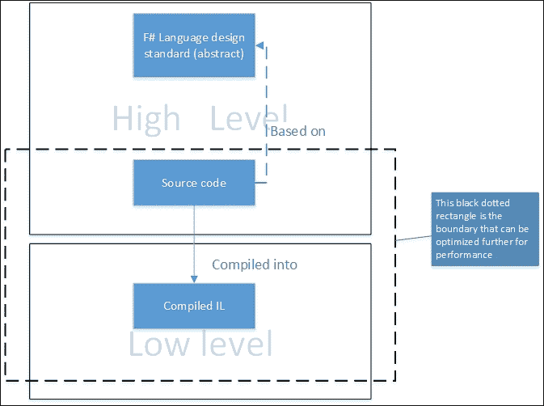

从 F#代码的角度来看，最高层次是源代码。源代码可以通过编译或发送到 FSI 来快速检查其正确性。这是一个重要的步骤，因为我们可以在执行语法和语法检查时依赖编译器。F#的语言设计比源代码更抽象，它被用作我们检查正确性的基础。这种正确性检查是由编译器中的解析器执行的。它比已经成功编译的源代码更抽象。

这是一个常见的做法，从语言设计角度来看也是可以理解的；我们无法直接分析它，因为它不容易应用优化。

从编译器的角度来看，编译器通过阶段逐步解释和编译代码，从词法分析到将生成的编译代码解析为 IL。

通常，F#编译代码的步骤如下：


我们将只关注从**词法分析**到**类型检查**的阶段中代码的行为，以及 IL 的结果（与**IL 生成**阶段相关）。**代码生成**阶段高度依赖于前面的阶段，它将在进入下一个阶段：**IL 生成**阶段之前只产生抽象的 IL 代码。

在 F# 4.0 当前版本发布时，步骤集中在 F# 4.0 编译器的阶段。编译器是开源的，尽管我们可以深入探讨编译器本身的工作，但所有 F# 语言规范元素的深入理解超出了本书的范围。从性能优化的角度来看，我们将仅关注代码结构、生成的 IL 和仪器。我们不会进一步触及 F# 编译器内部工作细节。

如果你想了解更多信息，前面的步骤是 F# 基金会使命的一部分的开源贡献过程，因为 F# 基金会始终鼓励对 F# 编译器、语言设计标准以及其他与 F# 基金会架构相关的元素进行开源贡献。这个小组被称为 F# Core Engineering 小组。

F# Core Engineering 的主页在 [`fsharp.github.io/`](https://fsharp.github.io/)。

这些编译步骤在 F# 基金会的 F# Core Engineering 小组的 F# 编译器指南部分有详细描述，可在他们的 GitHub 页面上找到：

[`fsharp.github.io/2015/09/29/fsharp-compiler-guide.html`](https://fsharp.github.io/2015/09/29/fsharp-compiler-guide.html)

## F# 中的 IL 快速概述

让我们从 F# 编译器生成的 IL 开始。尽管声明的兼容性听起来很简单，但 F# 生成的 IL 比其 C#/VB 对应物更丰富、更独特，但 C#/VB 中有一些特性，目前 F# 在语言中还没有支持。从 .NET Core 的角度来看，F# 和 C#/VB 的 IL 正在同时开发。

本表总结了总体差异：

| **特性** | **F#** | **C#/VB** |
| --- | --- | --- |
| 尾调用递归（`.tail` IL） | 是。默认情况下，F# 会通过将其转换为循环来优化简单的递归。 | 否。默认情况下，尾调用递归在调试模式下未启用。但启用时，生成的 IL 不保证具有尾调用 IL。 |
| 可变性/逆变 | 不可用。支持正在审查中。 | 是。 |
| 平台调用 (P/Invoke) | 是。 | 是。 |
| COM 对象 | 部分支持。因为某些 COM 对象不能作为动态使用，它们必须声明为 `Type.Missing`，尤其是在编写与 Office COM 交互的代码时。这是预期的，因为 F# 没有对后期绑定提供直接支持。 | 是。通过将其标记为动态类型支持 COM 对象作为后期绑定。 |
| 无 PIA 项目和编译支持 | 不可用。近期内没有明确的计划。 | 是。由于无 PIA 只在 Windows 上可用，因此按设计不兼容 .NET Core。 |
| .NET Core IL（用于 .NET Core、CoreCLR 和 CoreFX）以支持跨平台 | .NET Core 尚未发布，但其开发与两种语言保持同步。 | 与 F# 相同的状态。.NET CoreCLR 的整体源代码主要用 C# 编写。 |

有关.NET CoreCLR 进度的更多信息，请查看.NET CoreCLR 的官方开源存储库[`github.com/dotnet/coreclr`](https://github.com/dotnet/coreclr)。

现在，让我们深入了解 IL 和生成的字节码。

## .NET 中的 IL 工具

Visual Studio 默认附带.NET SDK，我们可以使用.NET SDK 中可用的所有工具，并结合 Visual Studio 内部的 IDE 体验。这包括从编译到检查生成的 IL 的一切。

要快速查看中间语言（IL），我们可以使用.NET 中与 IL 生成器和反汇编器相关的现有工具，即 ILASM 和 ILDASM。

.NET 本身，特别是.NET SDK，为开发者提供了许多工具，用于执行开发任务，包括 ILDASM 和 ILASM。有关 Visual Studio 2015 中的.NET 工具的更多信息，请参阅此 MSDN 库：

[`msdn.microsoft.com/en-us/library/d9kh6s92(v=vs.110).aspx`](https://github.com/dotnet/coreclr)

使用 ILASM 将 IL 汇编编译成机器代码和 ILDASM 将字节码反汇编成 IL 汇编代码的概念在其他汇编器生态系统中几乎相似。例如，ILASM 在概念上等同于微软宏汇编器编译器，即 MASM。它将英特尔处理器的汇编语言编译成字节码，这些字节码真正转换成运行时可以执行的代码。ILASM 将 IL 汇编编译成 Windows PE（可移植可执行）文件，可以是 EXE 或 DLL 的形式。ILDASM 将字节码反汇编成 IL 汇编代码。

不幸的是，没有直接将 F#代码生成 IL 汇编代码的方法。实际上，F#编译器将 F#源代码编译成 Windows PE 可执行机码作为其最终结果。当编译 C#/VB 源代码时也是如此。我们可以通过查看反汇编的结果来查看和检查生成的汇编代码。我们应从最简单的开始：使用 ILDASM 进行反汇编。

### 使用 ILDASM 和 ILASM 理解低级 IL 汇编

为了说明反汇编简单代码的最简单示例，让我们在 Visual Studio 2015 中创建一个 F#控制台项目，并将其命名为`FSConsole01`：

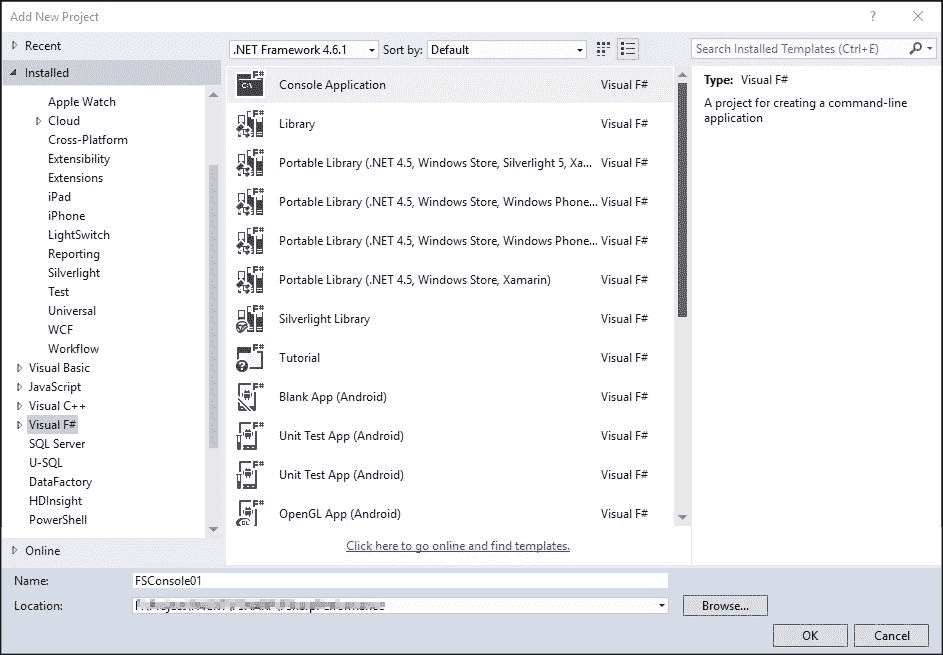

Visual Studio 编辑器将打开一个名为`Program.fs`的文件，它包含 F#控制台项目的基本入口点。将第 6 行替换为以下代码：

```cs
printfn "Hello F# world" 

```

然后，构建项目。我们可以通过按*F5*直接构建和运行它，但控制台会立即弹出并关闭。

建议的构建方法是使用*Ctrl* + *F5*键组合来指示 Visual Studio 在不进行调试的情况下运行代码。此操作将在代码在控制台中运行完毕后暂停：

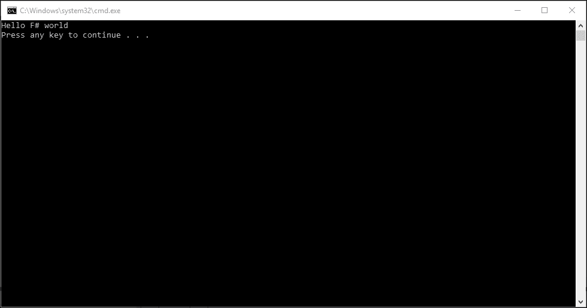

按任意键或关闭窗口。

让我们通过使用 ILDASM 反汇编可执行文件来检查 IL。搜索 Visual Studio 的**Visual Studio 2015 开发者命令提示符**并选择它：

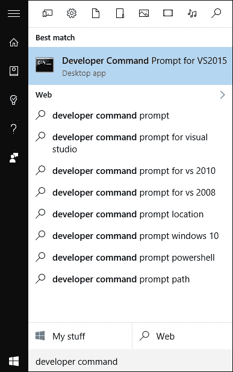

将会弹出一个显示命令提示符的窗口。窗口的标题栏为**Visual Studio 2015 开发者命令提示符**。它基本上是一个命令提示符（它是 Windows `CMD`命令提示符的一个实例），并且已经设置了环境变量（包括系统的`PATH`环境变量）。

### 注意

注意：**Visual Studio 2015 开发者命令提示符**在 Visual Studio 2015 Express Edition 安装中不可用。它在 Visual Studio 2015 Community Edition 及以上版本中可用。

关于此开发者命令提示符的更多信息，请参阅 MSDN 库：

[`msdn.microsoft.com/en-us/library/ms229859(v=vs.110).aspx`](https://msdn.microsoft.com/en-us/library/ms229859(v=vs.110).aspx)

在命令提示符中输入`ILDASM`然后按*Enter*。一个**ILDASM**窗口将显示以下内容：


要开始反汇编`FSConsole01`，请执行以下步骤：

1.  从主菜单，打开**文件**菜单。

1.  选择**打开**，然后转到存储`FSConsole01`的文件夹。

1.  选择子文件夹`bin`，`Debug`子文件夹。

1.  打开`FSConsole01.exe`。

让我们稍微调整一下大小，这样 ILDASM 现在将显示组织成包含 IL 的元数据的 EXE 文件内容：

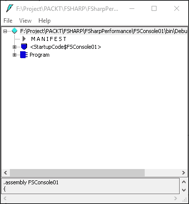

`FSConsole01.exe`的 ILDASM 有三个节点：

+   **MANIFEST**节点是一个包含目标.NET 运行时程序集的运行时信息清单。

+   **<StartupCode$FSConsole01>**包含`AssemblyInfo`、Program 的主类和其他程序集属性的必要元数据。

+   **Program**包含编译成 IL 汇编的 F#源代码的实际 IL，与`<EntryPoint>`属性相关。

现在让我们展开 Program 节点并选择**main : int32(string[])**节点：


要进一步探索源代码，双击**main**节点。ILDASM 将显示一个包含`main`的 IL 汇编的新窗口：

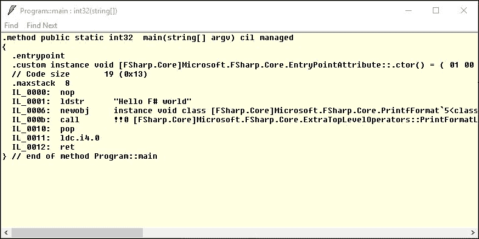

让我们再次查看源代码：

```cs
[<EntryPoint>] 
let main argv =  
    printfn "Hello F# world" 
    0 // return an integer exit code 

```

现在我们将深入到 IL 的翻译中。

`let main argv`函数声明被翻译成以下 IL：

```cs
.method public static int32  main(string[] argv) cil managed 

```

这非常重要，它与 C#/VB 的主控制台非常相似，因为它也是作为一个使用`public static`修饰符的方法生成的。在 F#中，`main`方法的返回值类型为`int32`，而不是 C#中的`void`（VB 中的 Sub）。

`EntryPoint`属性被翻译为`.entrypoint`，并结合方法内部`EntryPoint`属性的实例化。

`"Hello F# world"` 字符串通过 `ldstr` IL 汇编命令被加载到内存中。然后，下一行通过调用 `Microsoft.FSharp.Core.PrintfFormat` 的 `static` 构造函数，并随后调用 `PrintFormatLine` 来准备对 F# `PrintfFormatLine`（从 `printf` 的缩写名称翻译而来）的调用。

这是任何对静态方法的调用行为，它与 .NET CLR 相关，而不是 F# 的约定或 IL 结果。当第一次调用任何静态方法时，具有该静态方法的类的 `static` 构造函数（如果该构造函数可用）总是首先被调用。它的行为与 C# 和 VB 相同。

现在，让我们进一步检查 F# 中递归函数生成的 IL。让我们添加递归阶乘函数。为了使其更有趣，我们使用模式匹配来匹配递归调用的条件。在主入口点之前添加以下代码：

```cs
let rec fact x =  
    match x with 
    | 1 -> 1 
    | a when a < 1 -> 1 
    | _ -> x * fact (x-1)   

```

运行 ILDASM 并打开编译后的 `FSConsole01` 可执行文件。导航到 `fact` 节点，然后双击该节点。我们会看到 IL 被转换成了 IL 汇编中的循环：

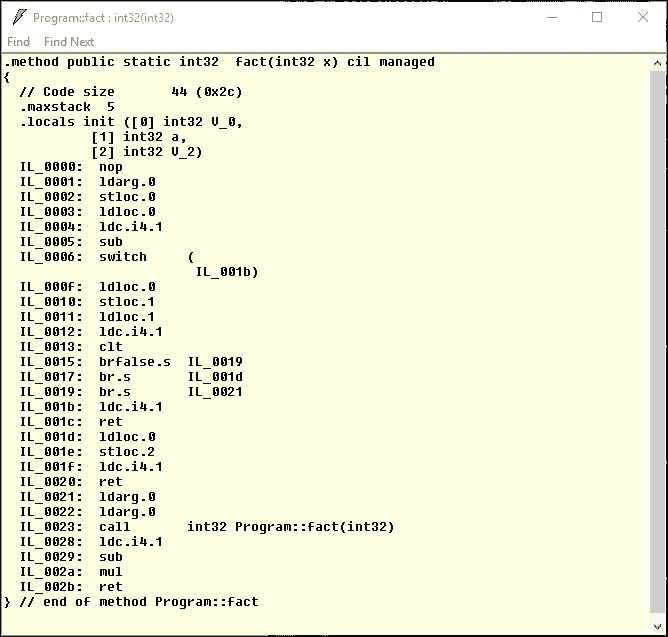

有三个分支指令：`br.false` 和两个 `br.s` 指令。这三个对应于代码中的匹配分支。

在这个示例的阶乘递归函数中，递归结构在 IL 生成的代码中被优化为循环。使用循环也意味着不会发生堆栈溢出，因为代码没有执行递归；因此，不需要像 C# 和 VB 等其他语言中的大多数递归函数那样在堆栈中存储函数入口。它本质上比使用堆栈帧来存储递归返回点更快、更高效。

### 注意

从递归到循环的优化选择是 F# 与 C#/VB 区别的关键。循环比需要堆栈帧的递归更快，因为堆栈帧的使用在堆栈操作中增加了更多的开销。

关于递归函数和尾调用的更深入讨论，请参阅 第七章，*语言特性和结构优化*。

关于 IL 汇编指令的更多信息，请参考 ECMA 335 标准。

我们现在有了可用的 IL 汇编。由 ILDASM 生成的输出可以用作更深入理解 IL 的基础，但我们需要能够生成可执行文件的全部 IL 汇编。

使用现有的 `FSConsole01`，我们将把编译的 EXE 转换为包含 IL 汇编的文本文件。

打开 **Visual Studio 2015 开发者命令提示符** 并将文件夹更改为 `FSConsole01` 项目的 `bindebug` 子文件夹。然后，输入以下内容：

```cs
ildasm FSConsole01.exe /OUT=FSConsole.IL 

```

`/OUT`参数意味着我们不会显示 ILDASM UI，因为我们打算将 IL 转储到文件中，以包含 ILDASM 的反汇编结果。将文件的扩展名命名为*IL*是一个推荐的最佳实践，因为它是以.NET IL 汇编代码为源代码，尽管.NET 不会在 Windows 上注册 IL 作为文件名扩展。

现在我们有了`FSConsole.IL`。使用记事本打开`FSConsole.IL`：

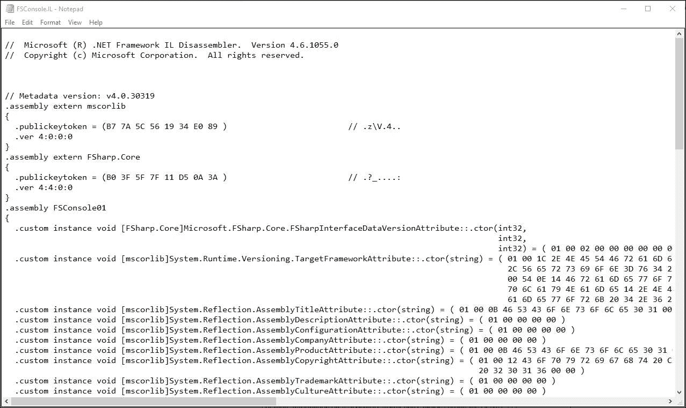

按*Ctrl* + *F*并搜索`Program`，然后我们看到 F#编译器将`Program`类的声明输出为`public abstract`：

```cs
// =============== CLASS MEMBERS DECLARATION =================== 

.class public abstract auto ansi sealed Program 
       extends [mscorlib]System.Object 

```

这也是 F#编译器进行优化的一种形式，因为作为入口点的`Program`类*不必是具体类*。这与 C#不同，因为默认的编译结果是具体类。例如：

```cs
// =============== CLASS MEMBERS DECLARATION =================== 

.class private auto ansi beforefieldinit Imperative.Program 
       extends [mscorlib]System.Object 

```

然而，我们可以在构建和编译之前，将相应的 C#的`Program`类修改为在代码中显式地有一个类似的抽象类。

让我们直接修改 IL 汇编代码，并使用 ILASM 将其编译回可执行文件。

搜索此行代码：

```cs
IL_0001:  ldstr      "Hello F# world" 

```

将`Hello F# world`改为`Hello world!`，然后使用不同的名称保存 IL，例如，`FSConsole01a.IL`。

然后，回到开发者的命令提示符，输入以下内容：

```cs
ilasm FSConsole01a.IL /exe 

```

然后，在命令提示符中执行`FSConsole01a.exe`；现在它应该显示`Hello world!`，如图所示：

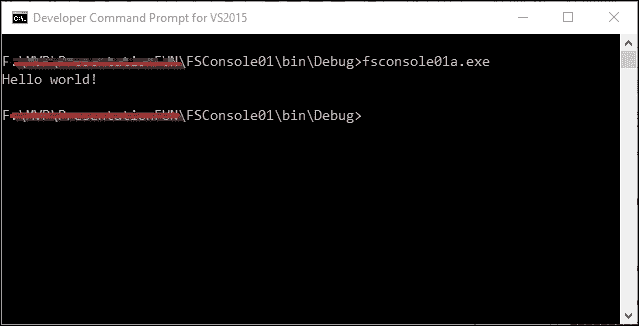

现在，我们可以基于 IL 进行定性优化！我们还学习了递归作为循环的一个很好的 IL 分析用例。这种使用循环而不是使用堆栈的递归的 IL 使用也是优化的证明：F#在处理基本递归函数方面已经比其他语言（尤其是非函数式语言）领先一步。

我们已经对 F#编译器和 IL 有了基本理解。现在，我们理解了 F#生成的底层 IL 汇编，我们可以使用 Microsoft 的 CLR 分析器来分析它。

# 使用 CLR 分析器 4.5

CLR 分析器是一个用于分析任何.NET 编译 PE 的分析器工具。它是免费和开源的，尽管它不是.NET 和 Visual Studio 2015 当前安装的默认可用工具。

分析器基本上是一个辅助工具，用于分析运行程序中与性能相关的元素，例如：

+   内存消耗

+   执行时间分配，将类和模块分配到更小的元素，如函数和子程序

+   检查垃圾回收（如果平台支持垃圾回收）

根据之前的定义，CLR 分析器只是一个用于检查（或*分析*）在.NET CLR 之上运行的任何应用程序的分析器。

有 .NET 的分析工具，不仅仅是 CLR Profiler，但不幸的是，并非所有工具都是免费的。幸运的是，CLR Profiler 具有完整的特性来分析 .NET 应用程序，并且它是免费和开源的。我们还可以基于现有的 CLR Profiler 构建自己的分析器。

## CLR Profiler 的快速概述

CLR Profiler 自 .NET 1.1 以来一直在开发，尽管它不再受支持。最新的 CLR Profiler 可用于 .NET 4.5，并且只能有效地用于分析任何基于 .NET 4.0 CLR 的应用程序，包括 .NET 4.0 到 .NET 4.6 的应用程序。下一个版本的 .NET 可能或可能不兼容。

CLR Profiler 自 .NET 1.1 以来一直在开发，并且始终与 .NET 运行时发布同步。例如，CLR Profiler 2.0 版本支持 .NET 2.0 运行时。这个 2.0 版本发布支持在 .NET 2.0 运行时中引入的 .NET 泛型。3.5 版本支持与 .NET Framework 3.5 一起发布的 .NET 2.0 SP1 运行时，后续版本也是如此，如图所示：

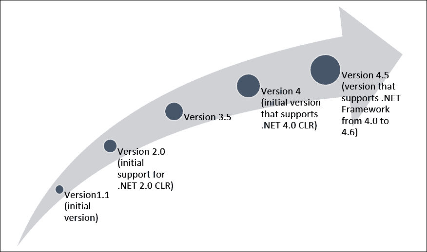

在 2.0 版本到 4.0 版本的主题发布之间，CLR Profiler 进行了一些维护发布，这些发布与 .NET 运行时同步，但这些维护发布主要是针对涉及与 Win32 API 和 COM 进行平台互操作的小型测试用例的 bug 修复。CLR Profiler 4.0 发布后，维护发布不再可用，尤其是由于 CLR Profiler 的源代码也已开源。

CLR Profiler 的初始版本，直到 2.0 版本，都是在闭源模式下开发的，然后才开源。CLR Profiler 的仓库一直位于 CodePlex。

它最初由 CLR 团队维护，然后由 David Broman 领导至今。最有趣的事实是，CLR Profiler 完全用 C++ 编写，结合了本机 Win32 C++ 和托管 C++。它可以通过首先加载和检查 IL 然后注入一些作为 IL 的钩子来监控要分析的程序的运行代码。

要了解 CLR Profiler 在 CodePlex 上的开发情况，请查看此着陆页：

[`clrprofiler.codeplex.com/`](http://clrprofiler.codeplex.com/)

David Broman，CLR Profiler 的原始开发者，在 MSDN 上也有一个博客。他的博客可在 [`blogs.msdn.microsoft.com/davbr/`](https://blogs.msdn.microsoft.com/davbr/) 找到。

## CLR Profiler 的快速操作演示

在 CLR Profiler 的下载页面，选择二进制文件。由于我们打算使用 CLR Profiler 来分析我们的运行代码，我们将使用编译好的 CLR Profiler 而不是从 CLR Profiler 源代码构建和编译它。

在我们下载 CLR Profiler 4.5 二进制文件作为 ZIP 文件后，将其解压缩到任何文件夹中。建议不要使用嵌套的深层文件夹，因为它可能无法搜索，除非我们将文件夹放入 `PATH` 环境变量中。

此 CLR Profiler 可以用于分析 32 位和 64 位 CLR 可执行文件和 CLR DLL。分别有两个二进制文件用于 32 位和 64 位版本。对于最常见的情况和最佳实践，我们应该使用 32 位 CLR Profiler 来分析 32 位 CLR 可执行文件和 DLL。

在我们使用 CLR Profiler 分析我们的可执行文件之前，以下是一些关于运行 CLR Profiler 已知后果的限制和警告：

+   CLR Profiler 是一个侵入式工具；在正在分析的应用程序中看到 10 到 100 倍的减速并不罕见。因此，它不是查找时间花费在何处的好工具——使用其他分析器来完成这项任务。

+   日志文件可能非常大。默认情况下，每个分配和每个调用都会被记录，这可能会消耗数 GB 的磁盘空间。然而，分配和调用记录可以选择性地打开或关闭，无论是通过应用程序还是通过 CLR Profiler UI。

+   CLR Profiler 无法 *附加* 到已经运行的应用程序。

+   CLR Profiler 可能会被某些防病毒程序（如 Trend Micro、ESET 以及较旧的 Symantec 和 Kaspersky 版本）检测到，并被认为是有害的。这些防病毒程序可能将 CLR Profiler 视为有害的恶意软件或安全漏洞软件。这实际上是一个误报。CLR Profiler 必须被列入这些防病毒程序的 *白名单*。此外，更新您的防病毒检测数据。

现在，让我们检查我们的当前 `FSConsole01` 项目。打开包含您的 `FSConsole01` 项目的解决方案并构建它。为了确保 Visual Studio 不会干扰 CLR Profiler，关闭解决方案并关闭 Visual Studio。

前往您下载的文件夹，并提取 CLR Profiler。您将看到两个子文件夹和一个文件：名为 `32`、`64` 的子文件夹和一个名为 `CLRProfiler.doc` 的 Word 文档文件。DOC 文件实际上是关于如何使用 CLR Profiler 的完整文档。打开 `32` 子文件夹，然后通过打开或双击 `CLRProfiler.exe` 文件来执行它。

显示了命令提示符和 CLR Profiler UI：

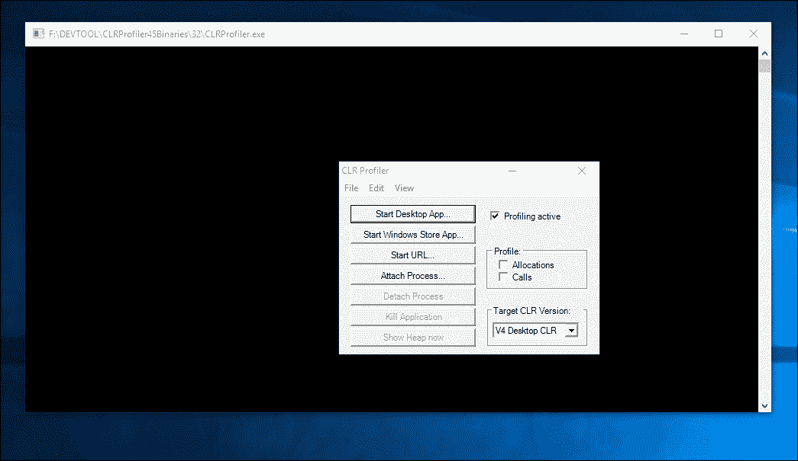

忽略命令提示符，但不要关闭它，因为它也会关闭 CLR Profiler。在您开始分析之前，检查 **Profile** 选项卡下的 **Allocations** 和 **Calls**：

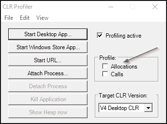

还要确保 **Profiling active** 复选框始终被勾选。

这是 CLR Profiler 文档中给出的原因，说明为什么 **Profiling active** 被勾选：

> *“正在分析”复选框允许你选择性地打开和关闭分析。你可以这样做以节省时间（例如在应用程序启动期间），或者进行选择性的分析。例如，如果你想查看当某个按钮被点击时你的 Windows Forms 应用程序中发生了什么，你会清除这个框，启动你的应用程序，然后勾选这个框，点击你的按钮，然后再次清除这个框。另一种用法是在开始分析你的 ASP.NET 应用程序时将其关闭，加载特定的页面，然后打开它以查看该特定页面在稳定状态下的分配情况。*

我们的 `FSConsole01` 是一个控制台应用程序，尽管它以控制台应用程序的形式运行，但本质上它也是一个桌面应用程序。因此，我们需要确保这个 **正在分析** 的复选框被勾选。

点击 **启动桌面应用程序...** 按钮，并在 `bindebug` 文件夹中打开 `FSConsole01.exe`。

然后，CLR Profiler 将显示一个作为分析总结容器的 UI：

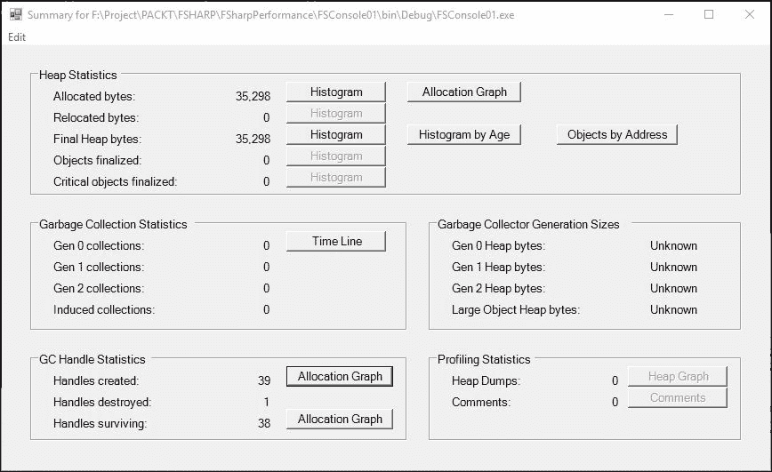

这个总结非常重要，因为它是开始分析 CLR Profiler 生成的图形数据之前的起点。数据摘要被分组到各个部分中。

总结中的重要部分在此进行解释：

+   标记为 **垃圾回收统计** 的部分提供了程序运行期间发生的垃圾回收的统计数据。.NET CLR 中的垃圾回收器是分代的，这意味着许多垃圾回收只考虑堆上的最新对象。这些被称为 0 代收集，并且非常快。**1 代收集**考虑堆的更大一部分，因此稍微慢一些，而**2 代收集**（也称为 *完全收集*）考虑整个堆，如果堆很大，可能需要相当长的时间。因此，你希望看到与**1 代收集**和**0 代收集**相比相对较少的**2 代收集**。最后，**诱导收集**是由垃圾回收器外部触发的收集，例如，通过从应用程序中调用 `GC.Collect`。通过 **时间线** 按钮可访问的视图将在稍后详细解释。

+   **垃圾回收器代大小** 部分提供了各种垃圾回收器代的大小。还有一个额外的细节是，有一个专门用于大对象的区域，称为 **大对象堆字节**。请注意，这些数字是程序运行的平均值，可能不会反映运行结束时的状况。

+   **GC 处理统计** 部分列出了在程序运行结束时创建、销毁的 GC 处理数量以及存活的数量。如果最后一个数字特别大，你可能有一个 GC 处理泄漏，你可以通过点击数字旁边的 **分配图** 按钮来调查。

那么，为什么我们主要关注垃圾收集器（GC）呢？因为分析 GC 对于分析运行.NET 应用程序时的内存使用非常有用。使用 CLR Profiler 检查 GC 也有助于在垃圾收集之前、期间或之后识别内存泄漏。

.NET 中的垃圾收集在堆上发生，并在 GC 开始后可用。GC 管理并存储运行程序中使用的对象在堆上，这就是为什么它被称为**托管堆**。

术语 gen 0 和 gen 1 是指它处理长期存在和短期存在对象的方式。

如 MSDN 库中所述，有三代：

+   **第 0 代（Generation 0）**：这是最年轻的代，包含短期存在的对象。短期存在对象的例子是一个临时变量。垃圾收集在这个代中最频繁发生。新分配的对象形成一个新对象代，并隐式地成为第 0 代收集，除非它们是大型对象，在这种情况下，它们将进入第 2 代收集中的大型对象堆。大多数对象在第 0 代被回收，不会存活到下一代。这一代也称为 gen 0 或简单地称为 Gen0。

+   **第 1 代（Generation 1）**：这一代包含短期存在的对象，并在短期存在对象和长期存在对象之间充当缓冲区。这一代也称为 gen 1 或简单地称为 Gen1。

+   **第 2 代（Generation 2）**：这一代包含长期存在的对象。长期存在对象的例子是一个服务器应用程序中的对象，它包含在整个进程运行期间都处于活跃状态的数据。

如果在应用程序运行期间有大量被表征为长期存在对象的对象，垃圾收集的最终化阶段将始终发生 GC 开销。这个最终化阶段意味着许多长期存在对象经常被称作具有高成本对象最终化的条件。使用 CLR Profiler 分析 GC 将为我们提供有关 GC 开销何时何地发生的资料，尤其是在 GC 有许多对象要处理时（这将在 CLR Profiler 中显示为句柄）。

我们可以通过使用正确实现`IDisposable`接口的对象来减少终结的开销。

这个技巧在 Rico Mariani（.NET BCL 的架构师之一）的以下 MSDN 文章中有详细解释：[`msdn.microsoft.com/en-us/library/ms973837.aspx`](https://msdn.microsoft.com/en-us/library/ms973837.aspx)。

在本文中，建议使用`IDisposable`接口的原因如下：

> *在许多情况下，通过实现 `IDisposable` 接口，原本总是需要终结的对象可以避免这种成本。该接口为程序员已知其生命周期的资源提供了一种替代方法，实际上这种情况相当常见。当然，如果你的对象仅使用内存并且因此不需要终结或销毁，那就更好了；但如果终结是必要的，并且有许多情况中显式管理你的对象既简单又实用，那么实现 `IDisposable` 接口是避免或至少减少终结成本的一种很好的方法。*

`IDisposable` 接口只有一个方法：`Dispose` 方法。如果我们想实现 `IDisposable`，尤其是如果实现 `IDisposable` 的类可以继承（在 F# 中没有标记为 `SealedAttribute`），这一点至关重要。其详细实现必须遵守 MSDN 文档中的规则：

+   应该提供一个 `public`、非虚拟的 `Dispose()` 方法和一个 `protected virtual Dispose(Boolean disposing)` 方法

+   `Dispose()` 方法必须调用 `Dispose(true)` 并应抑制终结以提高性能

+   基础类型不应该包含任何终结器

不幸的是，F# 中不支持 `protected` 和 `virtual` 修饰符；因此，我们只能在 `Dispose` 方法上使用 F# 默认修饰符。

在 F# 中确保在对象使用完毕后总是调用 `Dispose` 方法非常简单，可以通过使用 F# 的语法糖 `use` 或 `using` 关键字来实现，这相当于在对象不再使用后总是调用销毁操作。这与 C# 和 VB 中的 `using` 语法非常相似。更多细节可以在第七章 *语言特性和结构优化* 中找到。

要了解 .NET 垃圾收集器的更多信息，请访问 MSDN 图书馆中名为 *垃圾收集基础* 的文章：

[`msdn.microsoft.com/en-us/library/ee787088(v=vs.110).aspx`](https://msdn.microsoft.com/en-us/library/ee787088(v=vs.110).aspx)

让我们看看 GC 处理的示例数据。为了让我们看到这些数据，让我们回到 CLR Profiler 的摘要窗口并集中注意力。

点击 **GC 处理统计** 下的 **分配图** 按钮来查看和检查 **GC 处理分配**：

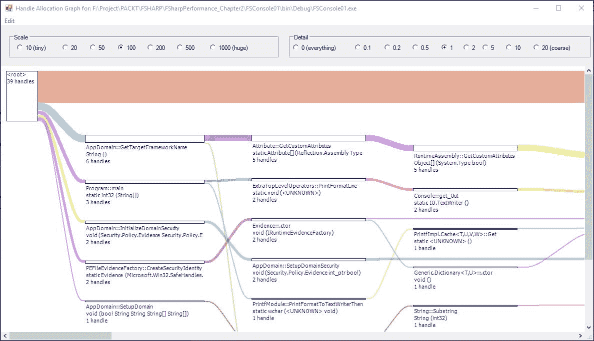

在图中，有一些线条和从最左边的矩形流出的矩形条。这些代表 GC 的处理流程。较粗的线条代表处理数量最多的情况。这些处理在以下文本中详细描述为来自较粗矩形的较细处理。在以下文本中，矩形条代表程序元素。

我们也可以通过双击要检查的元素来进一步深入分析。

让我们检查 `Program::main` 元素：

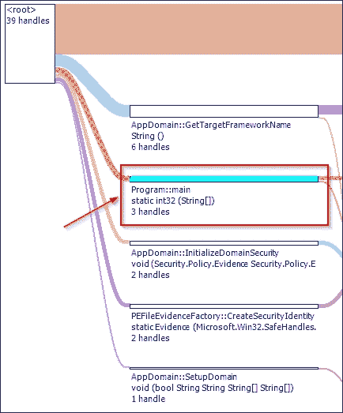

双击 `Program::main` 上方的矩形条。将出现一个新的图形窗口，它将仅显示来自 `Program::main` 的句柄：

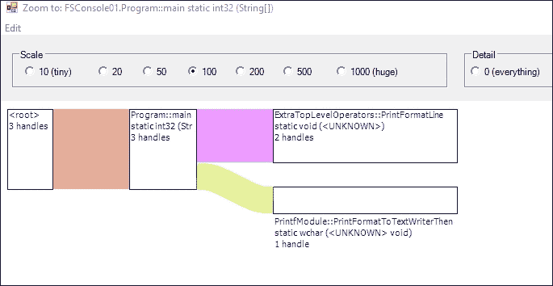

将鼠标悬停在标记为 `ExtraTopLevelOperators::PrintFormatLine` 的矩形上，将显示一个工具提示，说明该对象来自 `FSharp.Core.dll`。如果使用引用而不是仅使用 F# 核心库和 .NET BCL，此工具提示提示也很重要。我们可以确定对象中哪个部分持有许多句柄，深入到该对象中，然后悬停在它上面以查看哪个对象引用了哪个 DLL 库或可执行文件。

我们已经使用 CLR Profiler 对 F# 控制台应用程序进行了分析。结合 IL 汇编语言的知识，CLR Profiler 和 ILDASM/ILASM 为我们提供了分析潜在瓶颈或进一步优化我们代码的机会的定性观点。

再次强调，分析定性数据比分析定量数据更困难，但我们可以将定性知识应用于进一步理解定量测量，因为理解定性数据在性能测量的初始准备阶段为我们分析运行代码提供了推理能力。

# 定量衡量性能的方法

有许多方法可以衡量 CLR 之上的任何运行 .NET 代码的性能，包括 F#。因此，任何用于测量 F# 代码的工具基本上也可以用于 .NET CLR 上的其他编程语言。

再次强调，客观衡量性能的最简单方法是通过使用定量测量。以下是一些常见的测量运行代码的方法：

+   使用 .NET 定时器

+   使用原生 Win32 定时器

+   使用 Visual Studio 诊断工具

+   在单元测试中运行函数

之前的数字按从最微妙且难以到最快的方式进行统计计时作为性能测量排序。

## 使用 .NET 定时器

.NET 框架中有许多定时器类，但并非所有类在实现细节和执行环境上下文中都具有通用目的。

在执行环境上下文中，.NET 定时器被划分为以下几种：

+   UI 定时器（在 UI 线程上运行的定时器）

+   非 UI 定时器（在公共 CPU 线程上运行的定时器）

并非所有 UI 定时器都与非 UI 线程同步，因此它们不一定保证有高精度。一个例子是在使用 `System.Windows.Forms.Timer` 的同时，还有一个后台线程在运行。在 `System.Windows.Forms.Timer` 的内部实现中，该对象使用 `Win32 WM_TIMER` 消息，并在消息循环中处理它。

此外，`System.Windows.Forms.Timer`的行为相对于其他 UI 线程是同步的，因此 UI 线程只要不处理中间到达的其他 Windows 消息，就会处理`WM_TIMER`消息循环。

因此，这个计时器的超时事件可能会滑动，因为计时器对 Windows 消息循环的当前 UI 线程没有锁定，尤其是在有阻塞线程运行时，例如从互联网下载或打印到打印机。

为了客观测量和尽可能高精度地计算，我们不会使用 UI 计时器，而是将重点放在非 UI 计时器上。

以下是非 UI 计时器的可用选项：

+   `System.Timers.Timer`

+   `System.Threading.Timer`

+   `System.Diagnostic.Stopwatch`

`System.Timers.Timer`是计时器的一个特例。它可能间接在 UI 线程上运行，而不仅仅是系统工作线程。`System.Threading.Timer`始终在工作线程上运行，我们无法轻易混合工作线程和 UI 线程。这种情况发生是因为`System.Threading.Timer`的本质是异步的。但这也是一个很好的特性，因为它不会锁定正在运行的 UI 线程，因为线程必须以不同的方式显式处理或处理。

使用`System.Timer.Timer`比使用`System.Threading.Timer`更容易，因为它使用事件模型而不是强制使用回调。它也更易于理解，因为我们可以控制触发超时事件的滴答次数。

让我们创建一个单独的项目来测试`System.Timers.Timer`的计时器，以测量我们的函数。

创建一个新的 F#控制台项目，并将其命名为`FSTimer01`。现在打开了一个窗口编辑器，显示打开的`Program.fs`。

按照以下方式修改`Program.cs`的代码：

```cs
open System 
let rec fact x =  
    match x with 
    | 1 -> 1 
    | a when a < 1 -> 1 
    | _ -> x * fact (x-1)  

[<EntryPoint>] 
let main argv =  
    let timer1 = new System.Timers.Timer(1.0) 
    let mutable timeElapsed = 0 
    timer1.Enabled <- true 
    timer1.AutoReset <- true 
    timer1.Elapsed.Add (fun _ -> timeElapsed <- timeElapsed + 1) 
    timer1.Start() 
    for cnt = 1 to 3000000 do 
        fact 5 |> ignore  
    timer1.Stop() 
    Console.WriteLine(String.Concat("time elapsed for ", timeElapsed)) 
    0 // return an integer exit code 

```

通过不调试运行代码来执行，时间间隔将每 1 毫秒触发一次。

在我的机器上，它显示`time elapsed for 6`，这意味着代码大约需要 6 毫秒来执行。再次强调，这可能会因不同机器的不同配置而有所不同。

之前的示例代码在精度方面并不准确，因为它在触发时严重依赖于超时事件。在计时器超时前后可能有一些东西，这可能会在超时事件之前和之后阻塞当前线程。为了更准确地使用`System.Timers.Timer`，我们不应使用与另一个阻塞线程（如 I/O）或可能更改系统状态的其他线程（如查询或更新操作系统设置）混合的计时器。

关于这些计时器（除了 Stopwatch）的更多比较细节，我们可以在 MSDN 杂志 2004 年 2 月版（CHM 格式）的存档文章中看到计时器的实际操作：

[`download.microsoft.com/download/3/a/7/3a7fa450-1f33-41f7-9e6d-3aa95b5a6aea/MSDNMagazineFebruary2004en-us.chm`](http://download.microsoft.com/download/3/a/7/3a7fa450-1f33-41f7-9e6d-3aa95b5a6aea/MSDNMagazineFebruary2004en-us.chm)

接下来，我们使用`System.Diagnostic.Stopwatch`，通常称为`Stopwatch`。尽管这个计时器与`System.Timers.Timer`非常相似，但`Stopwatch`有自己的算法流程，并且足够聪明，能够使用 MSDN 库中定义的性能计数器。

> *计时器通过在底层计时器机制中计数计时器滴答来测量经过的时间。如果安装的硬件和操作系统支持高分辨率性能计数器，则`Stopwatch`类使用该计数器来测量经过的时间。否则，`Stopwatch`类使用系统计时器来测量经过的时间。*

通过调用本机（非托管）Win32 API `QueryPerformanceCounter`可以获得高分辨率性能计数器。但不应直接使用此 Win32 API，因为它可能需要一些权限，尤其是提升的权限。为了安全地确定我们有一个高分辨率性能计数器可用，我们应该使用`Stopwatch`的属性`Frequency`和`IsHighResolution`。

关于`System.Diagnostics.Stopwatch`的更多信息，请参阅官方 MSDN 文档：

[`msdn.microsoft.com/en-us/library/system.diagnostics.stopwatch(v=vs.110).aspx`](https://msdn.microsoft.com/en-us/library/system.diagnostics.stopwatch(v=vs.110).aspx)

使用`Stopwatch`非常简单，因为我们不需要注意任何经过的时间事件，因为没有特定的经过事件需要手动处理。`Stopwatch`还使用.NET `TimeSpan`来测量从开始到结束经过的时间。

使用解决方案作为计时器 beforehand，我们可以在当前解决方案之上创建一个新项目来测试`Stopwatch`。

创建一个名为`FSTimer02`的新控制台项目。默认的`Program.fs`编辑器出现，因此然后复制之前`Program.fs`中的代码，因为我们正在重用`fact`函数。

将函数体更改为以下代码：

```cs
[<EntryPoint>] 
let main argv =  
    let stopwatch1 = new System.Diagnostics.Stopwatch() 
    stopwatch1.Reset() 
    stopwatch1.Start() 
    for cnt = 1 to 3000000 do 
        fact 5 |> ignore  
    stopwatch1.Stop() 
    let timeDuration = stopwatch1.ElapsedMilliseconds 
    Console.WriteLine(String.Concat("time elapsed in milliseconds:", timeDuration)) 
    0 // return an integer exit code 

```

这次它将显示从执行`Stopwatch.Start`到执行`Stopwatch.Stop`之前的时间段。`ElapsedMilliseconds`属性的毫秒数实际上是`Elapsed`与`TimeSpan`相同的输出结果。这两个属性都调用`Stopwatch`的同一`private`方法：`GetElapsedDateTimeTicks`方法。

将`FSTimer02`项目设置为启动项目，然后运行它。显示的时间有比`System.Timers.Timer`显示的时间更高的趋势。这是预期的，因为`Stopwatch`首先查询系统性能计数器，然后尝试确定是否有更高分辨率的性能计数器可用。如果可用，它将尝试使用它；否则，它将使用现有的系统 CPU 滴答。

我们已经了解了如何使用.NET 计时器来测量运行代码的持续时间。这些数据对于比较非常有用，尤其是在测试不同的函数、语言构造以及在对内联函数进行优化时。

但使用这些计时器并不总是最佳实践，因为它们可能受到 Windows 线程调度程序的影响，并且具有最高管理权限的其他正在运行的 Windows 后台进程可能会干扰，尽管这在某种程度上是可能的。

## 在单元测试中运行函数

测量的最常见方法之一是在单元测试中运行和测试我们的代码。这是推荐的，因为这将迫使你考虑所有可能发生错误或异常的场景，而不仅仅是成功的场景。在这里，术语*场景*意味着考虑各种要测试的输入（包括错误的或不希望的输入），这些输入被视为参数。

### 单元测试的快速介绍

单元测试有许多定义，但单元测试简单来说就是关注测试程序中最小可测试部分的测试；这可能是一个简单的函数，也可能是一个复杂的函数，它调用了其他函数。为了覆盖单元测试的客观性，测试还必须覆盖任何具有各种输入以测试结果和可能发生的异常的场景。

已知单元测试与**测试驱动开发**（**TDD**）密切相关，其中开发者专注于可能产生不同结果或甚至错误（作为异常）的潜在场景。通过提前考虑可能的场景，可以最大限度地减少实现中的错误或将其降至接近零。你还可以识别失败的场景，尤其是当你考虑某些包含潜在异常操作（如除法操作、平方根或甚至内存不足情况）的函数的无效输入时。这就是为什么单元测试是 TDD 实际应用的例子之一，因为测试场景是在函数实现之前被考虑的。

### Visual Studio 中的单元测试支持

在.NET 生态系统中有许多单元测试框架，其中最受欢迎和最广泛使用的是 xUnit 和 NUnit。这两个框架都通过测试运行器 UI 与 Visual Studio 集成。Visual Studio 本身也内置了对单元测试的支持；它通常被称为**MS Test**的 Microsoft Test Framework。MS Test 提供了用于支持单元测试的工具、类和属性，并且与 Visual Studio 结合使用时，单元测试也有自己的测试运行器 UI 支持。

所有测试框架，如 MS Test、xUnit 和 NUnit，都是 Visual Studio SDK 的一部分，提供集成支持。Visual Studio 内部测试运行器的扩展自 Visual Studio 2010 起就可用。这种扩展是为了扩展基本测试运行器，并且可用的测试在 Visual Studio **测试资源管理器** 中显示。Visual Studio 测试运行器扩展在 .NET 4 CLR 上运行，因此它是语言无关的。我们也可以使用 F# 创建自己的扩展，而不仅仅是使用 C# 和 VB。

关于 Visual Studio 测试工具 API 的文档，请访问 MSDN，网址为 [`msdn.microsoft.com/en-us/library/dd465178(v=vs.120).aspx`](https://msdn.microsoft.com/en-us/library/dd465178(v=vs.120).aspx)。

关于 Visual Studio 测试运行器的更多信息，这是 Visual Studio SDK 的官方起始文档：

[`msdn.microsoft.com/en-us/library/bb166441.aspx`](https://msdn.microsoft.com/en-us/library/bb166441.aspx)

不幸的是，与 C# 和 VB 不同，Visual Studio 中的 F# 没有固有的或模板形式的单元测试项目模板支持。然而，我们仍然可以通过使用 FsUnit 的开源库来利用 MS Test。FsUnit for MS Test 库的最好之处在于它作为 NuGet 包安装的简便性。

### 注意

建议使用 F# 代码文件（`.fs`），而不是 F# 脚本，来实现和运行 F# 单元测试。在脚本模式下运行单元测试会产生不理想的结果，包括运行时异常，因为 Visual Studio 测试运行器并不是为了与 F# FSI 集成运行而设计的。

使用 FSIUnit 比直接使用 xUnit、NUnit 或 MS Test 更好，因为 FsUnit 是从功能编程风格开始创建的，而不是使用常见的 `Assert` 方法来测试函数的结果。

让我们设置 FsUnit 并使用它来在 F# 中实现单元测试。

### 使用 FsUnit 在 F# 中实现单元测试

FsUnit 不仅支持 MS Test，还支持 xUnit 和 NUnit。FsUnit 是 F# 软件基金会（FSSF）治理伞下的许多 F# 开源项目的一部分。所有 F# 开源项目都有一个着陆页，位于这个 GitHub 页面 [`fsprojects.github.io/`](http://fsprojects.github.io/)。

关于 FsUnit 的更多信息，请访问官方着陆页 [`fsprojects.github.io/FsUnit/index.html`](https://fsprojects.github.io/FsUnit/index.html)。

让我们导入 FsUnit 以使用 MS Test NuGet 包。首先，右键单击 `FSConsole01` 的项目名称，然后选择 **管理 NuGet 包..** 菜单项。然后，会出现一个 `FSConsole01` 项目的 **NuGet 包管理器** 选项卡，如图所示：

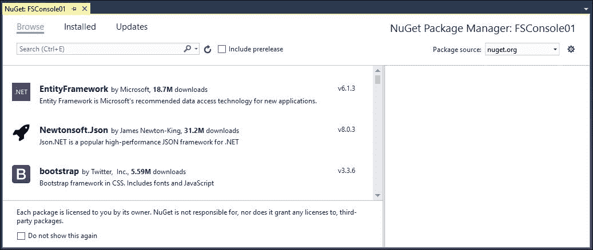

让我们按照以下步骤将 FsUnit NuGet 包添加到我们的示例项目中：

1.  在搜索文本框中输入 FsUnit 并按 *Enter*。显示 FsUnit 相关的 NuGet 包列表：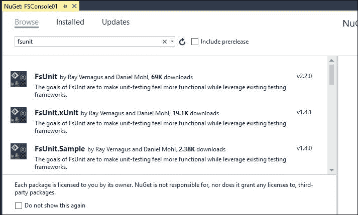

1.  滚动并选择 **FSUnit30Unit.MSTest**：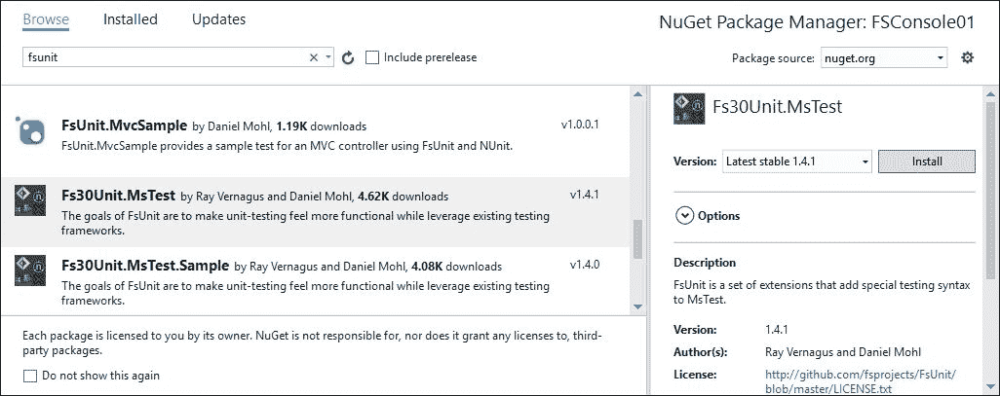

1.  然后，点击 **安装** 按钮下载并安装此包。请注意，**包源** 指向 **nuget.org**。

### 注意

在本书的其余部分，我们使用 NuGet 包来丰富我们在 F# 中编码的基础体验。NuGet 源本身不仅来自 **nuget.org**；还有许多其他 NuGet 包源。这些 NuGet 包源通常被称为 NuGet 资源，因为这些源在 Visual Studio NuGet 包管理器中列出之前，会显示在实际的 RSS 资源中。

有关 NuGet 的更多信息，包括如何托管和创建您自己的 NuGet 包，请访问 NuGet 官方网站 [`www.nuget.org/`](https://www.nuget.org/)。

下载和安装过程始终显示在 NuGet 包管理器的 **输出** 窗口中。

如果包已经存在（因此，已安装），那么 NuGet 将检查现有 NuGet 包的版本。如果版本较旧，默认情况下，它将尝试更新现有版本并安装较新版本。

成功的 NuGet 安装在 **包管理器** 的 **输出** 窗口中显示为 **完成**：

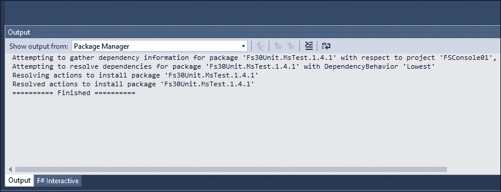

我们现在可以确信 `FS30Unit.MsTest` 可用于在 F# 中执行单元测试。然而，主要的 MS Test 框架尚未安装。我们必须手动添加此库。

MS Test 框架库的名称是 `Microsoft.VisualStudio.QualityTools.UnitTestFramework`。

此库作为扩展库在 .NET 项目中可用。它也位于 Windows 中现有的 .NET **全局程序集缓存**（**GAC**）中，由 Visual Studio 2015 社区版及以上版本默认安装。

在 Visual Studio 2010 之前的 Visual Studio 早期版本中，库的名称不同，它被命名为 `Microsoft.VisualStudio.TestTools.UnitTesting`。名称的变化反映了自 Visual Studio 2010 发布以来，Visual Studio 单元测试框架已成为 Microsoft Visual Studio 质量工具的一部分，包括 Microsoft Coded UI Test、Web Test 和 Windows Store Test。

Visual Studio 2015 中 Visual Studio 单元测试框架的类和属性的文档可在 [`msdn.microsoft.com/en-us/library/microsoft.visualstudio.testtools.unittesting(v=vs.140).aspx`](https://msdn.microsoft.com/en-us/library/microsoft.visualstudio.testtools.unittesting(v=vs.140).aspx) 找到。

通过向项目添加引用并选择 **扩展** 选项卡来添加 `Microsoft.VisualStudio.QualityTools.UnitTestFramework`：

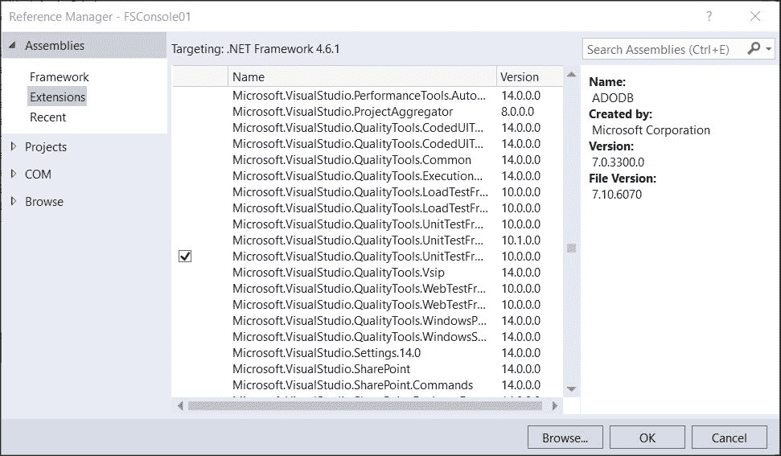

现在我们已经设置好了，并且它可供使用，我们现在可以编写单元测试。我们还可以将我们的 F#控制台入口点与阶乘函数和单元测试结合起来。还建议将阶乘函数从具有入口点的模块中分离出来，因为具有入口点的模块的实际关注点与阶乘函数不同。

总是注意模块、类型和函数内部的缩进。F#总是依赖于缩进来标记错误的缩进，因为这总会导致编译错误。

这是 F#代码缩进的官方指南：

[`msdn.microsoft.com/en-us/visualfsharpdocs/conceptual/code-formatting-guidelines-%5Bfsharp%5D`](https://msdn.microsoft.com/en-us/visualfsharpdocs/conceptual/code-formatting-guidelines-%5Bfsharp%5D)

首先，我们必须设置多个模块文件以正确编译此控制台项目。`Program.fs`的入口点需要修改为包含在命名空间下的显式模块中，即`FSConsole01`。

在代码窗口中的`Program.fs`中，输入以下代码：

```cs
namespace FSConsole01 

module Program = 

    [<EntryPoint>] 
    let main argv =  
        printfn "Hello F# world" 
        0 // return an integer exit code 

```

构建它，并将显示以下错误警告信息：

```cs
A function labeled with the 'EntryPointAttribute' attribute must be the last declaration in the last file in the compilation sequence, and can only be used when compiling to a .exe 

```

目前忽略这个错误，因为我们稍后会修复它。

让我们把我们的阶乘函数移入单元测试中。

创建一个新的 F#源文件，并将其命名为`FSConsoleUnitTest`。

在代码窗口中输入以下内容：

```cs
namespace FSConsole01 
    open Microsoft.VisualStudio.TestTools.UnitTesting 
    open FsUnit.MsTest 

    module MathFunc = 
            let rec fact x =  
                match x with 
                | 1 -> 1 
                | a when a < 1 -> 1 
                | _ -> x * fact (x-1)  

    module FSConsoleUnitTest = 

        [<TestClass>] 
        type FactTest() = 
            class 
                [<TestMethod>] 
                member this.FactTest01() = 
                    MathFunc.fact 3 |> should equal 6 
            end 

```

`FSConsoleUnitTest`模块中的代码显示我们现在有一个`FactTest`类以及用于单元测试的方法。

`FactTest`上的`TestClass`属性意味着这个类将被测试运行器用作起始类来持有单元测试。`FactTest01`上的`TestMethod`属性意味着这个方法是在`FactTest`类下的我们的单元测试。

这是一个常见的约定，因为用于单元测试的类不能是静态类。单元测试的本质是在运行具有`TestMethod`属性的测试方法之前，实例化具有`TestClass`属性的类。

有关在 Visual Studio 2015 中使用 MS Test 创建、运行和调试单元测试（以及其他测试框架）的更多信息，请访问此 MSDN 库：

[`msdn.microsoft.com/library/dd264975`](https://msdn.microsoft.com/library/dd264975)

让我们通过重新排序`Program.fs`为文件顺序的最后一个顺序来修复前面的错误。我们通过右键单击`Program.fs`并将`Program.fs`向下移动来实现这一点：

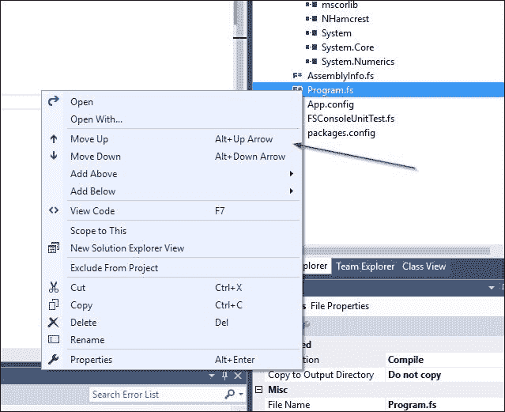

确保`Program.fs`是最后一个文件。

### 注意

注意，在 F#中文件排序非常重要。

构建项目。如果它没有打开，请显示**测试资源管理器**窗口。在“常规”集合默认设置下，**测试资源管理器**菜单项位于主菜单**测试**下。

`FactTest01`测试将在**测试资源管理器**中如下显示：

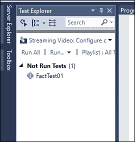

通过点击**测试资源管理器**中的**运行所有**来运行测试。**测试资源管理器**将在测试方法名称的右侧显示运行单元测试所需的毫秒数：

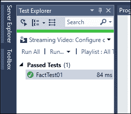

毫秒数可能会因不同的硬件而有所不同，因为它受到 CPU 速度和 CPU 核心数量的影响。我们测试的是一个非常简单的函数，但我们可以通过利用.NET 任务并行库（TPL）来实现具有并行调用的函数。使用.NET TPL 的后果是，不同配置的系统（例如操作系统使用情况，在此上下文中为 Windows 版本和版本）和不同的 CPU 规格可能会导致数字差异很大。

例如，使用具有第四代核心 i7 2.4 GHz CPU 的机器进行测试可能比使用具有第六代核心 i5 2.2 GHz CPU 的机器快一点。核心数量也可能有一定的影响，因为现代 CPU 的核心数量总是在增加。

在我们的代码中，我们没有直接使用 MS Test 的 Assert。实际上，这可以在 FsUnit 的 GitHub 仓库中找到，特别是 FsUnit 代码以支持 MS Test。所有与 MS Test 相关的代码都在名为`FsUnit.MsTestUnit`的文件夹下。

再次总结一下，FsUnit 支持 NUnit 和 xUnit 测试框架，并且它们都在 FsUnit 的功能性封装下实现了`Assert`方法。你可以使用 FsUnit 支持的除 MS Test 以外的任何测试框架。建议参与或为 FsUnit 项目做出贡献，因为这个项目鼓励贡献者支持其他测试框架，如 MbUnit。

在撰写本文时，FsUnit 支持 F# 3.1 和 F# 4.0。但建议使用 FsUnit 与 F# 4.0 一起使用，因为这将为你的.NET 4.5 和.NET 4.6 框架提供最高的兼容性。此外，F# 4.0 是与 F#未来发布最接近的工作版本，它将为.NET Core 提供支持。

FsUnit 的 GitHub 仓库可在[`github.com/fsprojects/FsUnit`](https://github.com/fsprojects/FsUnit)找到。

# 摘要

你了解到你可以从定性和定量两个方面来衡量性能。尽管定量测量比定性测量更容易，但将量化数据作为定性分析的基础是非常直接和常见的。

在.NET 工具生态系统和可用库的帮助下，我们可以确保我们的性能测量是客观的。同时，建议对.NET CLR 内存管理有一个基本的了解，作为我们进行性能测量的基础，以便从定性分析的角度进行。

我们将利用本章的知识和概念开始探索性能优化的各个方面，从第三章中的 F#数据结构，即*优化数据结构*开始。
