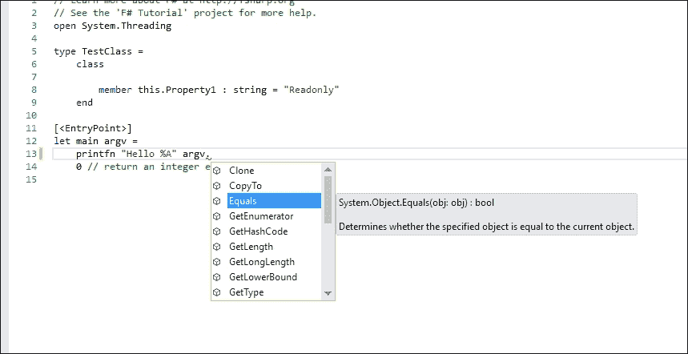
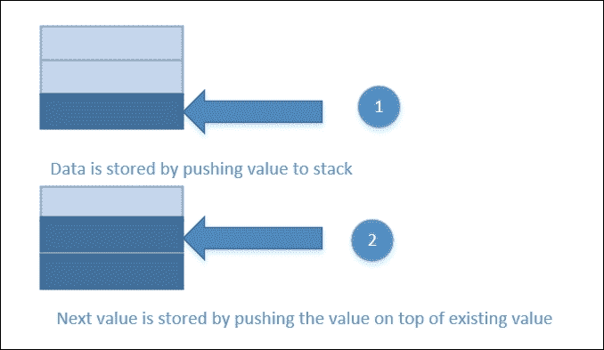
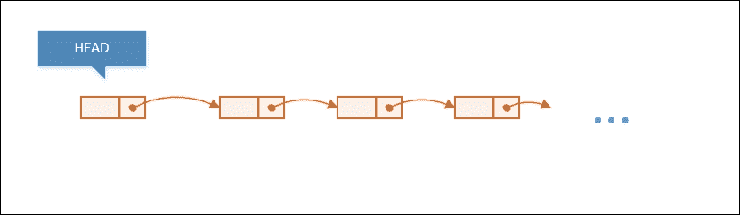

# 第三章。优化数据结构

在许多应用程序中，利用所有用作数据的对象是很常见的。数据类型可以是原始类型、对象引用和集合类型。F#本身也有其独特的类型，特别是集合类型。

这些类型，尤其是在进行大量计算密集型操作时，至关重要。优化不仅需要与数据存储的类型值的位置相关，而且我们如何访问它们也会对整体性能产生重大影响。

决定最佳使用类型的决定因素，除了内存位置外，可能各不相同。这就是为什么很难进行定性测量。虽然统计数据可能具有参考价值，但定量测量可能很棘手。

我们将使用在第二章中获得的关于性能测量的知识，即对运行 F#代码内部（IL、工具和 GC）的定性理解，以及使用计时器和单元测试的执行持续时间作为本章以及本书其余部分的温和要求。

了解 IL 汇编和.NET GC 的基本原理将帮助我们理解.NET 和 F#独特数据结构的内部工作原理。然后我们可以通过决定最佳用例和为特定需求选择最佳类型来优化它们。

### 注意

需要了解.NET 4 BCL 类型和集合（包括那些带外/OOB 发布的，如不可变集合）的基本知识。在使用类型/集合时，不应存在任何简单思维或走捷径的方法，例如，对于仅用于读取和转发的集合，明确使用.NET 高级集合如`BindingList<T>`，而不是`IEnumerable<T>`或`List<T>`。

本章概述了 F#中可用的类型以及选择、使用和优化的最佳实践。数据结构优化将在以下主题中介绍：

+   F#中存储特定数据类型的概述及其最佳使用方法（包括结构体、类和记录）

+   使用 F#集合的最佳实践，与.NET 集合的比较

+   选择评估策略（懒加载或急加载）的最佳实践

# F#类型概述和最佳实践

要将值作为数据存储，每个值都需要有一个类型，尤其是对于像 F#、C#和 VB 这样的静态类型语言。2000 年之后的许多现代编程语言都将类型作为数据值的类型，而不是使用简单的术语“数据结构”。这里的类型也意味着不仅包括具体类型，还包括与具体类型一起使用时的泛型类型。

## 静态类型与动态类型

F# 默认情况下没有内置支持来定义和优化类型，以便在 **动态语言运行时**（**DLR**）之上存储数据作为动态类型。这种动态类型支持以库的形式存在于 F# FSSF 开源项目社区中，名为 *FSharp.Interop.Dynamic*。该库可在以下网址找到：[`github.com/fsprojects/FSharp.Interop.Dynamic`](https://github.com/fsprojects/FSharp.Interop.Dynamic)。

此库也作为 NuGet 包提供。

DLR 基本上是一个在 CLR 之上运行的扩展，为没有类型定义限制的动态类型语言（如 Python、Ruby 和 JavaScript）提供基础设施。这意味着任何类型在编译时都被视为动态类型，类型解析在运行时解决。

这种动态类型解析对初始运行时性能产生了影响，因为类型必须在运行时解析而不是编译时。因此，不建议使用动态类型，尽管 F# 可以通过与 DLR 的互操作来支持动态类型互操作性，如 *FSharp.Interop.Dynamic* 库所示。

### 注意

自从 .NET Framework 4.0（以及 CLR 4.0）以来，DLR 已包含在框架中，不再作为单独的下载。原始 DLR 仓库托管在 CodePlex，但 .NET 4.0 中 DLR 的其余开发工作继续在 Microsoft 的 .NET GitHub 仓库的 .NET CLR 中进行。

想要了解更多关于 DLR 的信息，请访问以下 MSDN 的着陆页面：[`msdn.microsoft.com/en-us/library/dd233052(v=vs.110).aspx`](https://msdn.microsoft.com/en-us/library/dd233052(v=vs.110).aspx)。

在函数式编程语言中，隐式地需要静态类型，因为这也是类型推断功能要求的一部分。类型推断非常重要，因为函数式编程需要尽可能简洁，并且尽可能接近数学函数语法。

使用动态类型违反了函数式编程语言的常见最佳实践。类型是静态推断的，因此会在编译时解析。静态类型推断还赋予我们直观地组合函数和值的能力，而无需担心运行时的类型转换和装箱。易于组合函数（面向对象中的操作）是函数式编程语言的主要特性（或必需功能）之一。

静态类型相对于动态类型有以下优势：

+   类型解析在编译时解决。所有无效值赋值或转换的不一致性都会导致编译错误。编译错误比运行时错误更容易修复。

+   由于编译时进行类型解析，因此编译时间比动态类型的编译时间要慢。因为类型解析在编译时可能会增加开销，所以预期性能会较慢。由于类型解析本身正在执行，这与其紧密相关 F#的编译阶段，包括词法分析和解析。在 Visual Studio 工具集的增量编译作为后台进程的架构下，编译器可以通过这种方式进行更多的优化。

+   静态类型也更合理地推理代码，因为所有变量和函数都有类型，并且类型流动得很好。

+   了解静态类型提供了创新和有用的功能，例如在访问 F#模块和函数时进行代码完成，包括函数参数的类型解析和 XML 摘要文档。

术语*代码完成*在微软的 MSDN 库中也称为语句完成。这意味着当我们使用 IDE 进行编码时，语言服务将提供有关类型及其成员（属性、函数/方法、事件）的更丰富信息，并将其显示给我们。

自从 Visual Studio 5.0 以来，Visual Studio 就有一个强大的功能，称为**Intellisense**，它会在我们输入变量名后的`.`（点）自动显示类型信息。

这张 F#代码编辑的图片显示了 Intellisense 正在工作：



Intellisense 默认是激活的，强烈建议保持此设置为激活状态。它在后台加载类型信息时几乎不增加开销，因为编译器在后台运行，但它确实提高了生产力。

### 注意

虽然微软称之为语句完成，但其用途不仅限于代码的语句完成。它在更广泛的意义上用于语句、类/模块成员（包括函数/方法）以及公共/受保护/内部属性。Intellisense 还有助于减少编译错误，因为完整的元数据在前端变得可用，从而最小化了由于类型名称或语法错误导致的编译错误。

在编译时具有类型解析的技术通常被称为**早期绑定**，与在运行时解决的动态类型**晚期绑定**特性相对。

这与函数式编程的主要特性之一相关：函数和数据是函数式编程语言本身的第一等公民。为了保持函数和数据不可分割的概念，类型推断必须流畅。并且类型推断明确要求类型必须有一个定义，并且必须有强大的类型支持。

关于函数式编程语言的特性更详细的介绍，我们可以查看 MSDN 上的 F#文档。MSDN 对 F#中函数式编程所需特性的定义简单而简洁：

[`msdn.microsoft.com/en-us/visualfsharpdocs/conceptual/functions-as-first-class-values-%5bfsharp%5d`](https://msdn.microsoft.com/en-us/visualfsharpdocs/conceptual/functions-as-first-class-values-%5bfsharp%5d)

因此，我们不会进一步讨论 F# 中的动态类型支持，因为在函数式编程视角和运行时性能方面并不推荐。在这本书的其余部分，我们将只关注 F# 的静态类型。

# F# 中类型的快速介绍。

F# 中的类型基本上分为两种类型：.NET BCL 中的类型和仅在 F# 中可用的类型。尽管有特定的 F# 类型，但这些 F# 类型可以在 C#/VB 中使用，因为基本上所有 F# 类型都是基于 .NET CLR 实现的。

根据 .NET CLI 标准分区 I 部分 I.8.2 关于值类型和引用类型的说明，文档分为两种类型的类型：

+   **值类型**：由值类型描述的值是自包含的（每个都可以在不参考其他值的情况下理解）。它使用基本、内置的数据类型或用户定义的结构。这个内置类型的例外是一个字符串；它是引用类型。在 F#/C#/VB 中，这种值类型也被称为结构或 struct。

+   **参考类型**：该值表示另一个值的定位。实际上，该定位是一个指向值位置的指针。

有四种类型的引用类型：

+   对象类型是自描述值的引用类型。一些对象类型（例如，抽象类）只是值的部分描述。

+   接口类型始终是值的部分描述，可能由许多对象类型支持。

+   指针类型是对值的表示为机器地址的位置的编译时描述。指针分为托管和非托管。

+   内置的引用类型。

CIL/CLR 的结构中也支持泛型参数化类型。CIL/CLR 中泛型类型的表示法也通过协变/逆变支持得到了丰富。对于所有在 CIL/CLR 上运行的静态编程语言来说，至少支持基本泛型类型是强制性的，尽管在语言级别可能不支持协变/逆变。

通过进一步查看 CIL/CLR 的 CLS 规则，我们将看到协变/逆变支持不是强制性的。有关更多信息，我们可以查看 CIL/CLR ECMA-335 标准的 I.7.3 节的 CLS 规则。

# F# 中泛型类型支持的快速概述。

F# 有泛型类型作为参数化类型支持，就像在 C#/VB 中一样，并且它们都有相同的概念和相似的语义，尽管 F# 通过允许类型泛化更进一步。

例如，在 F# 中，要声明一个具有泛型类型参数的类型：

```cs
List<'t> 

```

如果在代码中使用参数，则必须填写泛型类型的参数，例如在这个例子中：

```cs
List<int> 

```

在我们最后的例子中，泛型类型变成了 `int` 的特化。`List` 是一个具有泛型类型作为类型参数的具体类型的示例。这个概念也与 C#/VB 中的语义相似。

### 注意

在整本书中，支持泛型的 F# 类型，如 F# 的 `List`、`Map`、`Set` 和 `Array`，将使用与 MSDN 图书馆中 F# 类型相同的符号，尽管完整的编译名称可能不同。例如，F# 的 `Map` 类型在 F# 范围之外被称为 `FSharpMap`（当在 C#/VB 等其他语言中使用时）。

在 F# 中处理泛型还有独特的方法：静态解析泛型。根据 MSDN 图书馆中的 F# 文档：

> *"静态解析泛型是一个在编译时而不是在运行时用实际类型替换的类型参数。它们前面有一个 caret (^) 符号。"*

使用静态解析泛型类型参数比普通泛型类型更高效，但有一个缺点：它不能用于非内联的函数或方法。它也与普通泛型类型正交：普通泛型类型不能用于内联函数。静态解析泛型的使用在 第七章 *语言特性和结构优化* 中进一步讨论。

关于 F# 静态解析类型的官方信息，请参考 MSDN 图书馆：

[`msdn.microsoft.com/en-us/visualfsharpdocs/conceptual/statically-resolved-type-parameters-%5Bfsharp%5D`](https://msdn.microsoft.com/en-us/visualfsharpdocs/conceptual/statically-resolved-type-parameters-%5Bfsharp%5D)

F# 可以使用 .NET 中的可用类型和 F# 特有的类型。F# 有自己的类型，因为 F# 支持与函数式编程相关的类型，包括 DU。

F# 中类型的文档可以在以下 URL 获取：

[`msdn.microsoft.com/en-us/visualfsharpdocs/conceptual/fsharp-types`](https://msdn.microsoft.com/en-us/visualfsharpdocs/conceptual/fsharp-types)

F# 类型的基本摘要和语法也可在 MSDN 图书馆中找到。我们现在专注于类型本身作为数据结构。

这些是 F# 中的类型：

+   **原始类型**：这些与 .NET 的原始类型相同，如 `Int32`、`Boolean`、`Single`、`Double`。

+   **单元类型**：这等于 C# 中的 `void` 和 Visual Basic 中的 `Nothing`。

+   **选项**：这些是 F# 中特殊的类型，用于描述可能包含值或空的类型。

+   **结构体**：这些与 C#/VB 中的 `struct` 概念和语义相同。

+   **类**：这些与 C#/VB 中的 `class` 概念相同。

+   **记录**：这些在 F# 中是独特的。

+   **区分联合**：这是 F# 中独特的。

+   **F#集合**：例如`Array`、`List`和`Sequence`。所有 F#集合默认情况下都是不可变的，但与在 C#/VB 中使用的.NET BCL 中的集合在语义上有所不同。

+   **函数**：这些是 F#特有的函数。F#函数也实现了`FSharpFunc`委托。

+   **委托**：这些委托支持 F#自有的委托和.NET 委托。F#委托与.NET 中的委托概念相同，但由于 F#特有的`FSharpFunc`实现，其语义实现不同。

+   **属性**：这些与.NET BCL 中的属性相同，因此它们与 C#/VB 中的属性相同。

在本章中，我们将专注于 F#特有的类型，例如选项、结构（由于语义上的差异）、记录、区分联合、F#特定的集合和函数。也会讨论类，因为类也是 F#的面向对象特性之一，但我们将会关注语义差异以及 F#处理类的方式。

区分联合（DU）是 F#的独特类型之一，也是函数式编程语言中常用类型的一部分。它还可在 Haskell 和 Scala 等语言中使用。

### 注意

DU 是函数式编程语言类型中的独特特性之一。实际上，DU 与 Haskell 的代数数据类型非常相似，尽管 Haskell 的代数数据类型比 F#的 DU 更丰富。Scala 使用特性和案例类的组合，并且更加冗长。但在 Scala 中概念是相同的。

## 处理数据类型的整体运行时策略

在进一步探讨优化特定数据结构存储类型之前，我们需要了解 F#类型在生成的（编译后的）代码中的实现基本原理。编译器可能会以不同的方式处理不同的类型，尽管之后可能会有针对特定编译器的优化。

# 内存存储分配简介

根据 CLI 标准规范存储数据值的内存存储类型基本上分为这三个存储类别（从最快到最慢）：

+   寄存器

+   栈

+   堆

## 寄存器

寄存器是最快的访问方式，因为它与栈和堆相比没有内存分配开销。寄存器的概念类似于处理器的寄存器。这个寄存器与栈和堆不同；它与值在代码中的存储方式有关。在 CLR 中寄存器的使用会被转换成处理器的任何一个寄存器，这取决于所使用的平台。例如，在 x86/x64 处理器上运行时，将使用 Intel 的通用寄存器 EAX、EBX、ECX、EDX。

## 栈

栈的本质是**LIFO**，即**后进先出**。这意味着数据不是按照先来先服务的顺序存储，而是最后存储的数据是第一个可以读取的，因为数据是从底部存储到栈的顶层固定位置。这就是为什么它简单地被称为栈。当我们洗碗时可以看到这种类比：

+   第一道菜是放在最低层的栈上的第一层。

+   第二道菜被放在了第一层栈上。

+   下一个则放在第二层，后续的菜品也是如此处理。

+   要洗碗，我们必须先从栈顶的顶层开始洗，然后再洗第一层。所以最后一层是第一个被洗的，因为最后一层位于最高层。这种机制是它被称为 LIFO 的主要原因。

在计算机科学的世界里，将数据存储或放入栈中的行为被称为*push*，而从栈中取出数据的行为被称为*pop*。

栈上的 push 和 pop 术语在.NET CLR 中也是同样的概念，尽管实现细节被.NET CLR 虚拟化了，它们的语义上相当相似。在 AOT 或 JIT 调试模式之后，实际的机器汇编代码会被翻译成相关处理器的`PUSH`和`POP`指令。在 x86（32 位）或 x64（64 位）平台上，这些`PUSH`和`POP`指令将被翻译成对机器汇编`PUSH`和`POP`的调用。

数据的虚拟化和操作非常重要，因为.NET CLR 有其自身的隔离机制来帮助防止指针、子程序和数据被有意手动混合分配内存。虚拟化通常有其自己的机制来处理未使用的对象（例如，当方法/函数执行完毕时超出作用域）或显式释放的对象。现代虚拟化通常为其未使用/释放的对象拥有自己的垃圾回收器。隔离、垃圾回收以及垃圾回收的顺序（Gen-0、Gen-1、Gen-2）实际上是.NET CLR 内存管理的一部分，这被称为*托管内存管理*。这就是为什么在 CLR 上运行的代码被称为托管代码。

### 注意

CLR 中的虚拟化概念与*Java 虚拟机*（JVM）中的虚拟化概念非常相似。拥有垃圾回收的概念也是 CLR 和 JVM 虚拟化环境特性的一部分。

关于 `PUSH` 和 `POP` 的机器汇编原始流程的详细信息超出了本书的范围，因为我们没有直接处理机器汇编指令。有关汇编语言的更多信息，请参阅英特尔软件开发者手册在英特尔处理器的着陆页[`www.intel.com/content/www/us/en/processors/architectures-software-developer-manuals.html`](http://www.intel.com/content/www/us/en/processors/architectures-software-developer-manuals.html)。

以下图示说明了存储或压入数据的过程：



从栈中取出或弹出数据是通过访问最后压入的数据来完成的。操作是从顶部（最后压入的）到底部。

使用栈的优点如下：

+   栈存储速度快，将数据压入栈的操作只是连续添加数据。它不需要指针分配。

+   由于填充栈的顺序总是连续的，因此没有碎片。

这些是缺点：

+   栈的长度是预先定义的，存储的数据数量，并且不能动态分配。这是故意的，因为栈是在一开始就分配的，并且它也受限于处理器和内存（RAM）的大小。

+   每个栈为每个数据槽都有一个预定义的长度。因此，栈并不适合存储变长数据，如字符串。

+   栈通常很快就会被耗尽，因为大多数栈的大小是有限的，并且总是小于分配的堆。例如，栈通常用于存储递归函数调用的初始指针，这就是为什么每次递归调用都意味着将初始调用位置的指针压入栈中。当函数完成其操作后，它会弹出最后一个指针以返回调用者。如果递归调用太深，栈就会被耗尽，这种情况通常被称为“栈溢出”。

栈溢出通常以 `System.StackOverflowException` 的形式抛出。从 .NET Framework 2.0 开始，我们无法直接捕获 `StackOverflowException`，因为这不被允许。CLR/CIL 2.0 也暗示了这一点。有关更多信息，请参阅 MSDN 库中的 `StackOverflowException` 文档：

[`msdn.microsoft.com/en-us/library/system.stackoverflowexception(v=vs.110).aspx`](https://msdn.microsoft.com/en-us/library/system.stackoverflowexception(v=vs.110).aspx)

对于递归函数调用的情形，F# 通过将它们转换为 IL 中的循环来优化了大多数递归函数调用。这种循环优化保证了函数不会进行大量的栈分配，从而防止了由深度嵌套的递归函数调用引起的栈溢出。

要动态分配存储空间，唯一的方法是使用堆。

### 注意

“堆”这个术语不要与“堆作为数据结构”混淆。在数据结构中，堆很少被使用，因为它实际上是一种特殊的树。

## 堆

堆只是一个大内存池；通常它以虚拟内存空间的形式存在。它可以根据需求动态地分配和释放。术语分配意味着保留内存的一部分。术语释放意味着释放之前已分配的资源（内存部分）。

堆用于为存储这类变量分配内存：

+   引用类型

+   不安全的方法

+   弱引用方法

+   引用不安全指针和管理指针

## 存储和访问数据的类型最佳实践

当讨论存储数据的最佳类型实践时，我们必须考虑以下条件：

+   数据值的形态。我们可以简单地将这定义为数据的形态，或者将数据值的语义视为值的类型。数据的精度也是数据形态的一部分。

+   数据的使用在代码中被操作。数据是在函数 lambda 内部操作，还是作为函数 lambda 的一部分进行操作？这在 F#和.NET CLR 中是特定实现的，因此也很重要。

+   数据生命周期的本质。这将在以后定义数据在内存中的存储位置和方式，我们将对此进行详细讨论。

+   关于在生成的 IL 中实现最终决策可能也会有所不同。这是编译器特定的，但它仍然与第一个关于形态和第二个关于数据生命周期的观点密切相关。

让我们讨论前述各点及其相互关系。

最容易理解的是数据值的形态。要了解更多关于数据值形态的信息，通常会将形态视为值的类型。例如，数值类型、`Boolean`类型和`String`类型。每个值都必须附加一个类型，因为这是静态类型语言（如 F#）的基本要求。

CLR 本身意味着所有值*必须*有定义的类型，因为在 IL 中有显式的类型声明，这些声明必须容易看到。类型通常在方法的返回类型、方法参数签名和 IL 中的`.locals`部分中声明。

让我们看看 F#编译器生成的 IL 中这些类型的样本案例。

例如，在第二章的 FSConsole01 中的`fact`函数，*性能测量*有这些类型声明用于返回类型、参数以及函数体中使用的每个变量：

```cs
.method public static int32  fact(int32 x) cil managed 
{ 
  // Code size       44 (0x2c) 
  .maxstack  5 
 .locals init ([0] int32 V_0, 
 [1] int32 a, 
 [2] int32 V_2)

```

变量分别被赋予局部名称`v_0`、`a`和`v_2`。

在此 IL 中，`.maxstack`指令定义了栈分配多少空间。栈被分配以使用五个栈槽来存储五个值，以便此函数操作。

从`IL_0001`到`IL_0004`行段有这些栈操作：

```cs
  IL_0001:  ldarg.0 
  IL_0002:  stloc.0 
  IL_0003:  ldloc.0 
  IL_0004:  ldc.i4.1 

```

这些四行 IL 的操作是：

1.  IL `ldarg.0` 的意思是将索引 `0`（事实函数的第一个参数/参数）的参数加载到栈中。这意味着将参数的值压入栈中。

1.  IL `stloc.0` 的意思是将栈中的值弹出到局部变量中。弹出的值是上一个 IL 指令的值，即 `ldarg.0` 指令。

1.  IL `ldloc.0` 的意思是将局部变量加载到栈中。这意味着将局部变量的值压入栈中。局部变量是索引 `0`，在 `.locals` 部分中声明的第一个局部变量。

1.  IL `ldc.i4.1` 的意思是将值 `1` 以 `Int32` 类型压入栈中。所有 `ldc.x` 的 IL 都意味着以期望的类型压入一个数值常量，而 `i4` 则表示 `Int32`。

关于这些中间语言（ILs）的更多信息，请参考 ECMA-335 的第三部分，关于 CIL 标准的内容。`ldc.i4.1` IL 的可用性也意味着值必须显式声明类型。这进一步证明了 .NET CLR 假定静态类型，即使在 IL 层级也是如此。

从编程语言特性的角度来看，F# 使用两种类型的类型：原始类型和非原始类型。

原始类型是作为语言特性内置的类型，它们通常是构建（初始化）和操作最简单的类型。为了与 CLR 和 .NET BCL 保持更高的兼容性，F# 的原始类型支持 .NET BCL 中的所有原始类型，以及额外的 F# 独有原始类型 `unit`。

F# 从基础到顶端的特性支持优先级顺序是：

1.  .NET CLR（运行时）支持

1.  .NET BCL 支持（包括 `BigInteger`，因为 CLR 中没有明确支持）

1.  F# 独有类型

CLR 类型支持必须首先考虑，因为所有原始类型都必须首先支持 CLR 类型，特别是 CLR 中的所有值类型。这个强制要求也是 F# 4.0 语言规范的一部分。

要查看 F# 原始类型的官方列表，请访问 MSDN 图书馆中的[`msdn.microsoft.com/en-us/visualfsharpdocs/conceptual/primitive-types-%5bfsharp%5d`](https://msdn.microsoft.com/en-us/visualfsharpdocs/conceptual/primitive-types-%5bfsharp%5d)。

让我们从使用 .NET 原始类型名称而不是使用 F# 关键字开始，因为这根据原始类型的列表更容易理解。例如，使用 `Int32` 作为 F# 的 int 更容易，因为我们可能会误解 *int* 为 `Int16` 而不是 `Int32`。这在编程语言中很常见，因为不同语言规范对基本整数长度的实现不同。幸运的是，F# 的 int 与 C# 的 `int` 和 VB 的 Integer 相同，因为它们都具有相同的 32 位（4 字节）长度。但对称性可能对于 C++ 和其他语言并不相同，尽管它们可能支持在 .NET CLR 上运行。

如果值是具有固定长度且与 IL 类型直接相关的原始类型，例如`Char`、`SByte`、`Int16`、`Int32`、`Int64`、`Boolean`、`Single`、`Double`，甚至是无符号数值如`Byte`、`UInt32`，则编译器通常会将其存储在堆栈上。`Char`虽然不是数值类型，但作为数值存储。

字符串没有固定长度，它也是一个复合类型，因为它不是一个独立的类型（它不是包含其他类型的类型）。它是一个包含其他类型作为集合的类型。这很明显，因为.NET BCL 中`String`类的声明实现了一个实现`IEnumerable<Char>`的对象。因此，字符串由`Char`的集合组成。

由于集合的性质，其长度可能会有所不同。假设字符串字面量始终会变化长度也是非常正常的。因此，字符串与其他原始类型被区别对待。

要将字符串常量值推入堆栈，IL 指令是`ldstr`。为了说明这一点，让我们回顾一下我们的`FSConsole01`项目。它的入口点是`main`方法。让我们看看`main`的 IL 代码：（省略了`IL_0006`和`IL_000b`）：

```cs
.method public static int32  main(string[] argv) cil managed 
{ 
  .entrypoint 
  .custom instance void [FSharp.Core]Microsoft.FSharp.Core.EntryPointAttribute::.ctor() = ( 01 00 00 00 )  
  // Code size       19 (0x13) 
  .maxstack  8 
  IL_0000:  nop 
  IL_0001:  ldstr      "Hello F# world"
... 
  IL_0010:  pop 
  IL_0011:  ldc.i4.0 
  IL_0012:  ret 
} // end of method Program::main 

```

`Hello F# world`字符串被视为字符串常量值，并在开始时由`ldstr`推入。在`main`方法结束之前，在返回表示成功运行的代码`0`之前，它使用`pop` IL 从堆栈中移除字符串值。

这表明字符串在 CIL 中也有其代表。它被类型化为`string`，映射到.NET BCL 中的`System.String`。

如需更多信息，请参阅 CIL 标准（ECMA-335）分区 I 第 I.8.2.2 节，以检查.NET BCL 原始类型映射的所有 CIL 类型。

默认情况下，所有原始类型都使用堆栈作为其容器存储在内存中。始终假设所有值类型的用法都存储在堆栈上是一种不好的做法，尤其是在使用数据的代码实现时。

这取决于 F#编译器的内部实现，但这种技术在 C#/VB 编译器中也很常见。F#必须遵守由 CIL 标准规定的通用语言规范规则，而不仅仅是 C#/VB。因此，在正常代码中（没有在 lambda 函数中常见的闭包）默认情况下，所有 CIL 的原始类型都将存储到堆栈上。

任何常量字符串值都始终推入堆栈，如示例`main`方法所示。

除了这些，字符串可以根据代码的实际实现和数据在代码中的使用情况存储在堆栈或堆中。代码中使用的任何变量都可以根据代码的不同实现方式。存储位置还取决于闭包的位置。

*闭包*是一种捕获作用域在 lambda 函数之外的变量的技术。闭包是许多编程语言中一个非常有用的特性，尽管它主要在我们使用 lambda 函数时使用。F#中闭包的工作方式与 C#/VB 相同。

F#可以将函数作用域变量视为内函数的引用类型，尽管变量的类型是结构体/值类型。这也是 F#限制的一个规则：将要被修改/改变的闭包变量；它必须在其值上具有引用类型，无论变量的类型是结构体还是不是。

例如考虑：

```cs
let Counter = 
    let count = ref 0 
    // *Return a function that carries the current context* (ie. "count", on  
    // the heap). Each time it is called, it will reference, and increment,  
    // the same location 
    (fun () -> incr count; !count) 

```

声明`count`变量的那行代码使用了`ref`关键字来定义它不仅仅是一个传递值；它还传递引用。

作为闭包捕获的不可变数据的存储将在栈上，但这实际上是 F#编译器的实现细节。

关于数据生命周期的观点涉及变量在代码流中使用的时间长度。这也与闭包实现有关。

为了全面回顾和理解数据形式与数据生命周期之间的关系，以下是基于数据使用生命周期的数据处理规则：

+   如果数据作为闭包被多次使用但它是不可变的，这可以定义为具有短生命周期。数据存储在栈上。

+   字符串常量值始终被视为短生命周期数据。因此，它存储在栈上，这也是 CIL/CLR `ldstr`指令的主要实现细节。

+   所有在函数/方法中局部作用域的可变/不可变变量，如果不作为闭包使用，将始终存储在栈上，因为这个函数/方法作用域变量被定义为短生命周期的。它仅在函数/方法的范围内使用。

+   所有值类型（结构体）默认情况下都存储在栈上。有一些特殊情况，值类型将存储在栈上。当值类型在`System.WeakReference<T>`内部引用时，值将随`System.WeakReference<T>`容器一起存储在堆上。此外，在分配函数作用域变量时使用`ref`通常会将值放在堆上。

+   如果将作为闭包的数据意图为可变引用类型，它将被存储在堆上。

+   如果数据是类/记录的公共属性的一部分，数据将存储在容器类/记录的堆上。例如，类的`public`属性成员存储在堆上。

+   长期数据总是存储在堆上。

### 注意

`WeakReference`很有用，因为我们可以用它来强制 GC 不要在类型参数化的数据上执行垃圾回收。数据包含在这个`WeakReference`中。任何其他类型的引用在 Gen-0 或 Gen-1 阶段都会被垃圾回收。

关于`WeakReference`使用的更多信息，请参阅 MSDN 库中的[`msdn.microsoft.com/en-us/library/gg712738(v=vs.110).aspx`](https://msdn.microsoft.com/en-us/library/gg712738(v=vs.110).aspx)。

根据规则，建议使用不可变闭包而不是可变闭包，特别是当它被标记为引用类型时。

### 注意

仍然是最常见的最佳实践：在堆栈上分配比在堆上分配数据更快。很明显，不可变闭包被推荐，并且比引用类型闭包更好。

简要回顾，选择通常是在 F#中选择结构体和类（包括记录、DU）之间。所有记录、DU 在 IL 中实现为类，因此它们基本上是类的特殊类型。

策略如下：

+   总是了解值类型和引用类型的区别。但永远不要假设值类型总是存储在栈上。

+   优先使用值类型而不是类。

+   使用对象池来包含最常用的类型并将它们放入集合中。这将防止 GC 在每次变量使用时都自动执行垃圾收集。但如果使用的变量大多是短命的，且目的是进行快速计算，这些计算在并行中重复，则不建议使用此策略。

+   在处理输入后代码空闲运行或结束所有长时间运行的过程后运行垃圾收集。这将提高垃圾收集的效率，以最小化开销，而不是在代码忙于计算或进行副作用计算时进行 GC。尽管 Gen-0、Gen-1 的开销可能会影响内存的分配和释放过程，但在空闲时间运行垃圾收集将最小化在重计算（尤其是在并行执行递归操作时）发生时的开销。

+   对于具有长期存活但频繁使用的倾向的对象，请使用`WeakReference`以减少 GC 开销。

+   在函数 lambda 中捕获值时，请使用不可变值。在 lambda 中捕获的不可变值始终存储在栈上。

值类型和引用类型的区分细节，以及它们在内存中的行为，特别是在垃圾收集阶段的行为，在 CIL/CLR ECMA-335 标准中有详细描述。

实际上，这些 F#规则也适用于 C#/VB。Eric Lippert（C#编译器的前开发者）在他的 MSDN 博客上对此进行了详细的解释：

[`blogs.msdn.microsoft.com/ericlippert/2010/09/30/the-truth-about-value-types/`](https://blogs.msdn.microsoft.com/ericlippert/2010/09/30/the-truth-about-value-types/)

再次强调，尽管这些实现细节对我们 F#开发者来说大多隐藏，但这些细节将帮助我们理解和避免误解。

当实现中是否使用数据集合时，当前讨论有不同的语义。

# 使用 F#集合的最佳实践

F#类型大多描述的是非集合类型。F#也有其独特的集合类型。

F#集合的功能大多以模块的形式实现，命名空间为`Microsoft.FSharp.Collections`。以下是一些 F#集合模块：

+   模块`Array`：对数组的基操作

+   模块`Array2D`：对二维数组的基操作

+   模块`Array3D`：对三维数组的基操作

+   模块`Array4D`：对四维数组的基操作

+   模块`ComparisonIdentity`：与排序数据结构一起使用的比较身份的常见概念

+   模块`HashIdentity`：与哈希表一起使用的值身份的常见概念

+   模块`List`：对列表的基本操作

+   模块`Map`：与`Map`类型相关的函数式编程运算符

+   模块`Seq`：对可枚举集合的基本操作

+   模块`Set`：与`Set`类型相关的函数式编程运算符

`List`、`Map`和`Set`是 F#独有的。

如需有关 F#集合的更多信息，请参阅 MSDN 库：[`msdn.microsoft.com/en-us/visualfsharpdocs/conceptual/fsharp-collection-types`](https://msdn.microsoft.com/en-us/visualfsharpdocs/conceptual/fsharp-collection-types)。

该页面显示了类型列表以及每个集合函数的计算复杂度或算法速度（*大 O 记号*）。建议您密切关注每个函数的计算复杂度，并谨慎使用。

### 注意

*大 O 记号*最初来源于基础计算机科学领域。在编程世界中，它几乎是非平凡的。但是，它对于理解计算复杂度方面的抽象性能至关重要，因为它始终与整体性能有直接关系。简单的计算复杂度，如*O(1)*或*O(log n)*，总是比*O(n)*更好。

例如，考虑以下内容：

`Array`、`List`和`Seq`中的`tryPick`函数是*O(n)*，而在`Map`中是*O(log N)*。这意味着当元素数量非常大时，例如超过`1000`，`Map`中的`tryPick`更快：

```cs
O(log 1000) = 3 

```

而*O(n)*对于`1000`个元素意味着：

```cs
O(1000) = 1000 

```

一些具体操作通常很容易发现或快速推断；例如，运行固定 n 次循环的循环总是至少*O(n)*。

没有简单的方法可以进一步减少运行时间，除非循环在并行流的并行循环中执行。并行性实际上也是将优化作为 F#并发支持/功能的一部分的一种方式。我们将在第四章，*F#并发简介*和第五章，*F#高级并发支持*中进一步讨论并发。

关于大 O 的更多信息，请参阅麻省理工学院计算机科学课程概述[`web.mit.edu/16.070/www/lecture/big_o.pdf`](http://web.mit.edu/16.070/www/lecture/big_o.pdf)。

在大 O 的复杂度方面，`Map` 比 `Array`、`List` 和 `Seq` 更好。

当代码并行运行时，大 O 符号可能会失效或不再有效，因为没有确切保证在并行运行时实际发生的执行次数。

### 注意

从本章开始，我们将通过我们在 第二章 中学习到的定量和定性方法来丰富我们对性能测量的视角，即结合必要的 big O 符号，从计算复杂性的角度理解性能优化。在使用 big O 之前，应先进行定量和定性测量，因为 big O 在实际测量并发时通常不显示真实的数据。

但并不是所有情况下使用 `Map` 都是最佳选择。`Map` 的行为类似于 .NET 的 `Dictionary`，因为它在其中存储具有键值对元素的元素。`Map` 的语义与 `Dictionary` 不同，这将在后面进行解释。

这些是 F# 集合到 .NET BCL 的概念映射：

| **F#** | **.NET BCL** | **注意** |
| --- | --- | --- |
| `Seq` (序列) | `IEnumerable<T>` | F# 的 `Seq` 是 `IEnumerable<'T>` 的别名。因此，对于所有利用 `IEnumerable` 和 `IEnumerable<'T>` 的操作，使用 `Seq` 也是有效和安全的，并且默认情况下它们是急切求值的。 |
| `List` | `List<T>` | F# 的 `List` 实现为单链表。为了只有不可变性，.NET BCL 有 `ReadOnlyCollection<T>` 类型，它与不可变特性相同。F# 的 `List` 也是线程安全的。在 .NET BCL 中具有线程安全特性的 `List<T>` 的等效类型是 `System.Collections.Generic` 命名空间中的 `SynchronizedCollection<T>`，而这个集合不是不可变的。因此，目前 .NET 4/4.5/4.6.1 BCL 中没有既是不可变又是线程安全的 F# `List` 的等效类型。 |
| `Array` | 隐式实现为 `IEnumerable<T>` 的实现，但它被限制为单变体，不是协变的。 | F# 的 `Array` 是一个单变体。F# 的 `Array` 和 .NET BCL 的 `Array` 都有固定长度。 |
| `Map` | `Dictionary<TKey,TValue>` | `Map` 和 `Dictionary<TKey,TValue>` 都实现了 `IDictionary<TKey,TValue>` 接口。因此，从概念上看，它们是相同的，但在语义上则不同。F# 的 `Map` 默认是不可变的。 |
| `Set` | 没有相等类型。 | .NET BCL 中没有 `Set` 的相等类型。实际上，`Set` 是一个项的容器，但集合中的元素必须是唯一的。 |

关于 .NET BCL 集合类型的更多信息，请参阅 `System.Collections` 的起始页面 [`msdn.microsoft.com/en-us/library/mt481475(v=vs.110).aspx`](https://msdn.microsoft.com/en-us/library/mt481475(v=vs.110).aspx)。

F# 序列可以通过使用 `seq.initInfinite` 函数初始化 `Seq` 来创建一个无限集合。序列始终是惰性求值的。这一点的结果是效率：操作仅在必要时应用以重新生成序列的元素。

对于这个无限序列，没有编译器或运行时技巧。F# 的无限序列也可以在 C#/VB 中使用。

# 比较 F# `List` 与 .NET `List<T>`

`List` 与 .NET `List` 类似，因为它们都有索引和相同的方法，尽管语义不同。

`List` 被实现为一个单链表，而不是 .NET BCL 中的 `List<T>`。这种链表实现比 `List<T>` 更快。`List` 可以通过简单地使用 F# 的 `head::tail` 语法递归存储。

单链表意味着列表中的每个元素都包含指向列表下一个元素的属性的一部分，如图所示：



在某种意义上，F# `List` 比 `List<T>` 效率和更快，因为单链表总是保证对只访问列表头部的任何操作都是 *O(1)*，而元素访问是 *O(n)*。每个元素都可以有一个指向下一个元素的指针。

F# `List` 相比于 .NET `List<T>` 的明显优势如下：

+   当与 `List` 结合使用时，F# `List` 是不可变的。它可以被视为持久数据结构。

+   F# `List` 的链表性质意味着在通过连接操作合并列表时效率很高，这一点将在后面进行解释。

+   它对 `head::tail` 的递归性质有高效的访问，这可以用于递归函数。这在函数式编程语言中很常见，因为递归性质不仅深入到函数中，也深入到数据结构中。

以下是一个递归 `head::tail` 在递归函数中的示例，让我们看看 F# MSDN 中 `List` 文档的以下样本代码：

```cs
let rec sum list = 
   match list with 
   | head :: tail -> head + sum tail 
   | [] -> 0 

```

### 注意

`sum` 函数将在第一个元素（`head`）之后，使用剩余元素（`tail`）的参数再次调用 `sum` 函数。`head::tail` 的递归性质将在下一个递归调用中自动继续，因为下一个 `head::tail` 将包含之前 `head::tail` 的结果列表。

之前代码示例中的 `head::tail` 语法可以用来递归地访问头部和尾部上的其余数据。在 C#/VB 中没有类似的功能。如果有，当使用 `List<T>` 时，实现将效率较低。

作为链表，F# `List` 的连接比连接 .NET `List<T>` 更快。两个或多个 `List` 项之间的连接按以下方式完成：

1.  创建一个新的 `List`，其总容量为所有 `List` 项的总和。

1.  结构化地复制源 `List`（不是引用地）。

1.  源的尾链接被链接到目标列表的头部，其余的目标列表被结构化地复制。

1.  重复此过程，直到所有参与者列表都已复制并链接。

1.  这些操作不会（明显地）就地更新结构，而是始终产生一个新的更新后的结构。

F# 有一个方便的运算符用于连接 `List`，即 `@` 运算符。

例如考虑：

```cs
let list3 = list1 @ list2  

```

`list3` 将包含 `list1` 和 `list2` 的连接。

# 比较 F# Map 与 Dictionary<TKey,TValue>

从概念上讲，F# `Map` 等于 .NET BCL `Dictionary<TKey,TValue>`，因为它们都实现了 .NET `IDictionary<TKey,TValue>`。但 F# `Map` 在语义上与 `Dictionary<TKey,TValue>` 不同。

### 注意

请不要混淆 F# `Map` 作为类型与 F# `Map` 作为模块。F# `Map` 作为模块被称为 `Map`。从外部，它通过引用 `FSharp.Collection.Map` 模块的命名空间来调用。F# `Map` 作为类型在 F# 外部也是可用的。其名称为 `FSharpMap`。

从性能的角度来看，由于其不可变性行为，它仍然更快。

从正确性的角度来看，由于泛型类型参数的键和值被约束，F# `Map` 迫使我们更加正确。

让我们看看 F# `Map` 的类型定义签名：

```cs
type Map<[<EqualityConditionalOn>]''Key, [<EqualityConditionalOn;ComparisonConditionalOn>]'Value when 'Key : comparison >(comparer: IComparer<''Key>, tree: MapTree<'Key,'Value>) 

```

实际上翻译成这样：

+   `Map` 有两个泛型类型参数：`Key` 和 `Value`

+   `Key` 被标记为 `EqualityConditionalOnAttribute`

+   `Key` 被约束为从比较派生

+   值被标记为 `EqualityConditionalOnAttribute` 和 `ComparisonConditionalOnAttribute`

### 注意

`ComparisonConditionalOnAttribute` 表示如果且仅当类型满足此约束时，泛型参数类型满足泛型比较约束。

`EqualityConditionalOnAttribute` 表示只有当泛型参数类型满足 F# 相等性约束时，泛型参数也满足此约束。

`Map` 有一个接受比较器参数的默认构造函数，其树是专用比较的基础集合。

比较参数被约束为实现 `IComparer`。尽管 F# 不支持协变/逆变，但实现 `IComparer` 对于比较参数意味着它也是隐式协变的。这非常明显，因为 `IComparer` 的签名是 `IComparer<in T>`。

这些额外的属性在执行比较和相等性检查时可能会增加一点开销，但出于这些正确性规则的需要是必要的：

+   `Key` 必须能够检查相等性，因为键必须是唯一的。

+   `Value`必须能够进行等性和比较检查。这也是很重要的，因为值必须在以后能够被排序（排序操作是可选的）。

选择`Map`或`Dictionary`的决定性考虑因素是：

+   如果你只是想要一个具有键和值的集合，但需要不可变性，请使用`Map`。检查值相等性的净效果并不大于不可变性的有用性。

+   如果你只是想要一个具有键和值的集合，无需担心值的顺序，并且需要不可变性，请使用`Map`。

+   如果你只是想要一个具有排序`键`的不可变`字典`实现，请使用`Map`，并通过排序映射的键来排序`键`。

+   如果你需要一个可变的`字典`，请使用`Dictionary<TKey,TValue>`而不是`Map`。直接使用`Dictionary<TKey,TValue>`进行可变操作比将`Map`实例标记为`mutable`更好。将`Map`实例值标记为可变意味着我们正在使用`Map`，但将其视为可变。这种简单的技巧可能会破坏与其他语言（如 C#/VB）的互操作性，因为`Map`本应保持不可变，但其完整性被破坏了。正确性的意图也被破坏了。

+   如果你想要一个按键排序的可变`字典`，请使用`SortedDictionary`。它是线程安全的，除非你继承`SortedDictionary`并实现自己的排序`字典`，因为无法保证在你的自定义排序字典中，线程安全性不会被违反或覆盖。此外，引用透明性也不能保证相同或不会破坏。

通过考虑这些场景，我们应该将 F#的`Map`作为主要考虑因素。将`Map`标记为可变以欺骗可变性是不推荐的。这也适用于其他集合类型，如 F#的`List`和`Set`。

# 选择值评估策略

我们知道 F#集合支持延迟评估，而不仅仅是即时评估。几乎所有的 F#集合都是延迟的，除了需要对元素顺序进行修改的操作。在 F#中没有延迟功能的集合是 F#的`Array`和`Set`，因为它们的语义与.NET BCL 数组类似。

F#的集合模块并不都是延迟评估的。这些模块也应用了相同的行为：`Array`、`List`和`Sequence`。F#的开发团队正在努力通过提供相关函数来结束功能差异。

要查看 F#在缩小功能差异（重点关注 F#版本中的新功能）方面的更完整列表，请访问：

[`msdn.microsoft.com/en-us/visualfsharpdocs/conceptual/whats-new-in-visual-fsharp`](https://msdn.microsoft.com/en-us/visualfsharpdocs/conceptual/whats-new-in-visual-fsharp)

例如，`map` 和 `filter` 不需要修改元素的顺序；排序（LINQ 中的 `orderby`）和 `groupby` 需要修改。

由于这些操作的工作方式，特别是考虑到与范畴论和关系代数相关的操作，以及从数学领域借用的主题，我们几乎无法推断出所有修改或重新排序集合内容的函数操作都是延迟的，这是几乎不可能的。所有 map、filter、fold 和 unfold 的函数实现实际上都是基于关系代数的。

### 注意

范畴论处理函数组合的工作方式，特别是当函数链必须可组合时。关系代数处理对元素集合执行映射、归约、过滤、折叠和展开等操作。关系代数和范畴论是 F# 集合操作的基础，在其他函数式编程语言中作为基本特性相当常见。

范畴论和关系代数的主题超出了本书的范围，尽管建议了解这些数学学科的基本知识。

要了解更多关于关系代数的信息，请查看麻省理工学院提供的以下课程样本之一：

[麻省理工学院开放课程](http://ocw.mit.edu/courses/electrical-engineering-and-computer-science/6-830-database-systems-fall-2010/)

范畴论是函数结构组合（如 Monad 和 Monoid）的基础知识，也是 lambda 演算和高阶函数的基础理论。Lambda 演算和高阶函数是函数式编程的常见特性。

“延迟”或“主动”求值的术语基于编程语言的求值策略。

延迟求值意味着表达式只计算一次，并且仅在实际上需要计算时才计算。它也被称为按需计算或延迟执行（操作被延迟到稍后执行）。

主动求值意味着表达式在计算表达式绑定到变量时立即计算。F# 默认情况下对任何变量赋值都使用主动求值，除非赋值具有显式的延迟表达式。

由于延迟求值的存在，类型必须在延迟求值之前对齐和明确定义。否则，可能会发生类型转换或无效参数异常。这是为什么在像 F# 这样的函数式编程语言中静态类型是强制性的主要原因之一。

在 F# 中，延迟求值可以应用于类型，也可以作为 `Seq` 和 `List` 等集合上的函数实现。

在集合操作中，具有延迟求值的操作的结果集合将在迭代中读取集合时执行，包括评估 `head::tail`。

当应用于类型时，F# 有一个 `lazy` 关键字来表示惰性计算，以封装要延迟执行的操作。结果是，一个变量具有要执行的操作，在需要读取评估时才会执行和评估。

这是一个使用独立类型（非集合）时惰性计算的实际示例。

```cs
let x = 10 
let result = lazy (x + 10) 
printfn "%d" (result.Force()) 
do() 

```

如果我们在第二行设置断点，结果尚未具有值，并且跨过该行不会执行 `x + 10` 操作。在跨过第 3 行之后，结果将具有值。这将确保按需执行或计算。

默认情况下，当操作类型时，F# 总是会进行急切评估，除非应用了惰性计算。对所有操作或表达式使用惰性评估会增加堆栈分配开销，并且这些开销会耗尽堆栈。

如果表达式在许多方法中重复使用，则建议仅在类型上应用惰性计算，因为应用惰性意味着惰性计算内的操作只会执行一次，然后结果会被多次使用。

想了解更多关于类型上惰性计算的信息，请访问以下 MSDN 文档：

[`msdn.microsoft.com/en-us/visualfsharpdocs/conceptual/lazy-computations-%5Bfsharp%5D`](https://msdn.microsoft.com/en-us/visualfsharpdocs/conceptual/lazy-computations-%5Bfsharp%5D)

还有一种语言结构，它隐式地将惰性求值作为状态机实现：在 F# 的 `Sequence` 上使用 `yield` 作为迭代器进行高效操作。

例如考虑：

```cs
seq { for i in 1 .. 10 do yield i * i } 

```

另一个将 `yield` 保存到变量的示例是：

```cs
let multiplicationTable = 
  seq { for i in 1..9 do  
            for j in 1..9 do  
               yield (i, j, i*j) } 

```

在内部，`yield` 被实现为一个状态机，当读取或迭代序列时会惰性计算操作。F# 的 `yield` 与 C#/VB 的 `yield` 类似，尽管实际的语义不同。它在基于迭代器常见设计模式的状态机方面相似。

想了解更多关于迭代器如何工作的内部细节，请查看由 Raymond Chen 撰写的微软开发者博客条目：

[`blogs.msdn.microsoft.com/oldnewthing/20080812-00/?p=21273`](https://blogs.msdn.microsoft.com/oldnewthing/20080812-00/?p=21273)

他的博客有一系列文章，从抽象的语法糖到原始实现，描述了迭代器，尽管他描述的是 C# `yield` 迭代器的特定实现。

在 F# 中使用 `yield` 实际上是一种语法糖，它转换成如 Raymond Chen 文章中描述的复杂状态机。我们不必担心这个 `yield` 的实现细节，因为 F# 的后续版本可能会改变 `yield` 的实现细节。

### 注意

`yield`和惰性是 F#的样本特性，它们隐藏了复杂状态机机制的实现细节。这将使我们能够专注于我们想要的结果，而不是担心如何计算结果。这通常被称为声明式而不是纯粹命令式。F#的声明式方面并不止于此；许多并发构造，如异步计算，也是声明式的。

惰性求值的多数性能特征都优于急切求值，尤其是在捕获和惰性求值多次使用的表达式时。使用惰性表达式的总净效果是显著的，因为它是按需执行的。

从 F#作为函数式编程语言的独特方法的角度来看，它并不纯粹。F#并不是在语言构造的所有方面都采用惰性求值。例如，`Seq`操作不是所有操作都实现惰性求值。如果我们把 F#与其他纯函数式编程语言（如 Haskell）进行比较，Haskell 几乎在所有情况下都强调了惰性求值，包括全面的类型解析、集合迭代器，甚至将副作用（如 I/O）也以惰性方式封装。

所有表达式和函数都采用惰性求值有一些缺点：

+   编译时间将始终慢于急切求值。

+   如果所有操作都实现了惰性求值，所有复杂的有限状态机都必须为每个操作案例实现。这将导致编译时间变长，包括在 IL 级别转换为状态机。

+   没有保证所有表达式和函数作为惰性求值不会耗尽栈空间。

惰性求值的场景可能性细节将在下一节中描述。

# 涉及评估策略和内存分配的场景

惰性求值总是消耗栈空间来分配元数据，即表达式的指针。如果表达式简单且没有引用类型（例如，使用字符串或在`WeakReference`中捕获值），则求值的表达式也可能存储在栈上。

我们必须考虑以下场景：

+   在对集合进行操作时，尽可能总是使用惰性求值，尤其是在使用仅具有单向功能（如`Sequence`或`IEnumerable`）的集合时，包括`IEnumerable<T>`。

+   对于更复杂的递归表达式或计算，惰性求值会迅速消耗栈空间，尤其是在递归函数中结合复杂的惰性求值时。在这种情况下，更倾向于使用急切求值，因为递归函数的结果总是以栈帧的形式存储在栈上，作为前一个相同函数调用的最后一个指针。如果递归函数内部的惰性操作保证是简单的并且只计算值类型，那么我们可以相当安全地使用惰性求值，而不会消耗过多的栈空间。

+   当延迟操作涉及引用类型时，在堆栈和堆之间来回分配的开销总是会发生，这会导致在堆栈和堆之间内存分配往返时的内存消耗和时间消耗性能较差。在这次重头戏中，GC 开销总是会发生，因为 GC 不能保证在递归调用函数完成后返回到其之前的递归函数调用时能够及时收集。起初，堆栈总是首先被垃圾回收，但混合的堆栈和堆会使 GC 收集速度变慢，因为堆栈在被弹出和垃圾回收之前需要断开对堆分配的任何引用。

+   如果我们的函数在并行中使用，函数内的任何原子表达式都应该实现为延迟的，因为这更有效，尤其是在函数将多次运行时。除非函数实现为具有并行延迟操作的递归函数，否则它也会迅速消耗堆栈，正如第二场景中描述的那样。

+   任何时候都应尽可能避免副作用。如果延迟评估或 yield 表达式包含副作用，如 I/O，可能会发生异常，这在堆栈跟踪和堆栈帧分配开销方面是昂贵的。CPU 密集型计算是一种副作用，但这种副作用可以忽略，只要它与其他并发技术（如并行性）结合使用。

+   建议避免在 UI 线程上进行延迟评估。F#和 CIL/CLR 不允许跨线程。

+   在具有延迟评估的函数中实现异步计算工作流程是可以的，但我们应该避免根据第五点将延迟评估与副作用混合，因为通常异步可能会处理异步 I/O 操作。因此，在处理异步计算中的副作用时推荐使用即时评估。这种情况是那些常常观察不到或被忽视的微妙场景之一。

+   总是注意可能出现的副作用，即使是像调用 Windows API 这样的细微副作用。不仅异常需要处理，而且在副作用计算有效时，还可能存在线程阻塞或甚至死锁的危险。

+   在计算工作流程或引用中的延迟评估必须谨慎处理。存在延迟评估可能会降低某些计算工作流程（如异步）性能的可能性，因为异步本身就是一个复杂的有限状态机。

+   在具有延迟评估的异步计算中处理任何取消操作都是可以的，因为取消操作以.NET TPL 中常见模式推荐的方式优雅地处理异步操作上下文切换的副作用计算。

+   不要在惰性计算中执行同步锁，因为执行上下文可能会产生意外的副作用。如果惰性计算包含锁定复杂对象的锁，可能会发生死锁。在正常的 F# 代码运行中也不建议使用锁。

这些场景可能并不涵盖选择评估策略的所有情况，但在实现结合惰性和急切评估的函数时相当常见。因此，惰性评估并不是在值评估策略中针对所有类型的性能优化的万能解决方案。

在 第四章，*F# 并发简介*中，讨论了更多可能导致处理并发时出现意外行为或结果的具体场景。

# 摘要

数据结构不仅是任何编程语言的关键特性，它们在我们的代码中扮演着非常重要的角色，无论我们使用的是哪种编程语言。理解 .NET 中的数据结构也是运行在 .NET CLR 上的任何编程语言的基础，包括 F# 数据结构。

我们现在不仅对 F# 数据结构有了足够的理解，而且可以通过应用和结合最佳实践来利用 F# 数据结构。本章中我们讨论的最佳实践不仅包括使用现有 F# 数据结构的最佳实践，还包括优化数据结构的最佳实践。

这种数据结构优化理解可以应用于对 F# 并发的更深入理解，在 第四章，*F# 并发简介*中。
