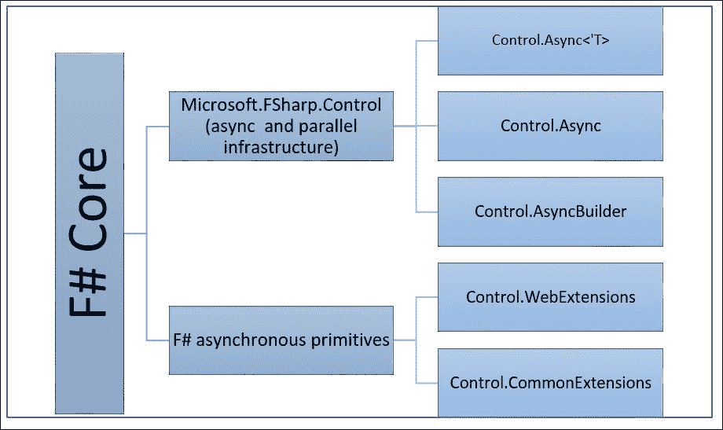
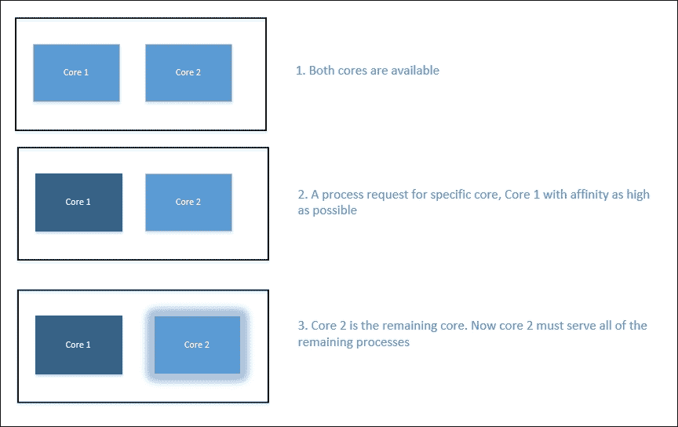
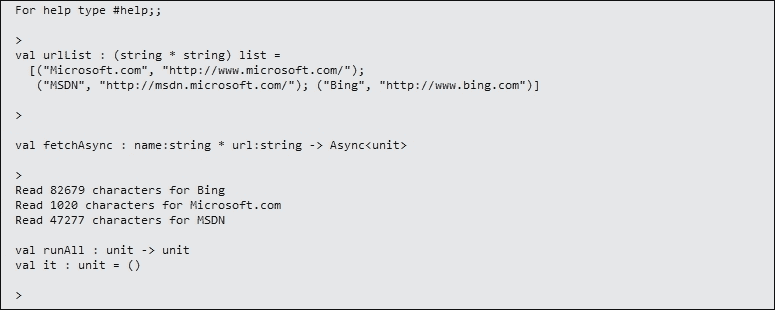
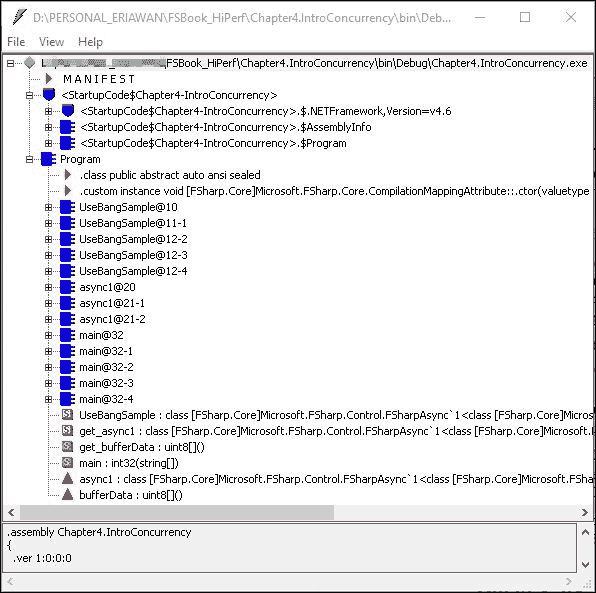
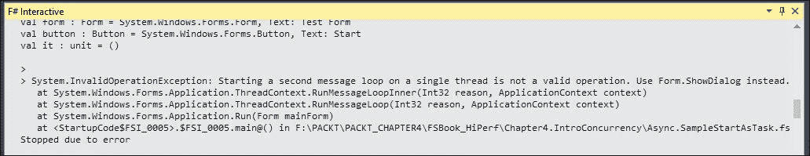

# 第四章. F# 并发简介

性能优化不仅仅是理解底层平台、分析、工具和度量以及数据结构。现在，随着多核处理器的兴起，以及响应式应用程序按需实现的需求不断增加，并发不仅变得更加相关，而且成为各种企业应用程序，尤其是全栈多层架构应用程序的必要要求。

显然，并发是那些常被误解的性能优化之一。一些常见的误解示例已在第一章 在 F# 中执行常见优化 中描述。在本章中，我们将关注 F# 中的并发特性，并了解实际实现决策因素背后的基本策略。

要理解选择策略的背景推理，首先我们必须了解 F# 的并发特性，特别是在 F# 4.0 中。在现有的并发特性方面，F# 3.0 和 F# 4.0 之间没有明显的区别。F# 4.0 有额外的特性可以与 .NET Task Parallel Library 互操作，这些互操作特性将在本章中解释。

了解测量工具，如第二章 性能测量 中所述，以及运行 F# 代码（IL、工具和 GC）的定性知识，以及使用计时器和单元测试的定量度量，是轻松理解并发的重要性以及选择正确并发模型的决定性因素所必需的。

在本章中，我们将看到对于各种并发问题并没有一劳永逸的解决方案。例如，仅使用并行计算来处理 I/O 操作是不推荐的，因为 I/O 操作是阻塞线程的一个很好的例子。然而，识别哪些线程或进程是阻塞线程也很重要。结合异步计算是推荐的。此外，正如本章将要介绍的那样，没有哪个并发特性不能与其他类型的并发特性结合使用。

本章简要概述了 F# 的并发特性，重点关注 F# 4.0。我们还将提供实现和优化它的最佳实践的概述。F# 并发优化的高级主题，例如结合异步和并行处理、F# 消息传递代理 `MailboxProcessor` 以及与 .NET TPL 的进一步互操作性，将在第五章 高级并发支持在 F# 中描述。

本章涵盖以下主题：

+   介绍 F# 4.0 中的并发支持

+   识别阻塞线程

+   介绍异步工作流

# 介绍 F# 4 中的并发支持

从编程语言的角度来看，拥有并发支持非常重要，尤其是作为内置语言特性。在 F#中，在 F# 4.0 之前就提供了 F#的并发支持。其中两个并发特性：异步工作流和`MailboxProcessor`自 F# 1.9 以来就可用。

快速概述，F#具有以下并发特性：

+   异步工作流

+   使用 actor 模型和 F#的一个特殊类`MailboxProcessor`作为消息传递的代理进行异步消息传递

+   异步工作流的并行编程支持

+   与.NET Task Parallel Library (TPL)的互操作性

异步工作流实际上是一种计算表达式的实现，它作为语法糖被提升。它在一个异步代码块中被提升，该代码块包含对异步函数的调用，并在开头用`async`作为关键字标记。

从概念并发的角度来看，F#支持以下内容是相当直观且易于理解的：

+   **异步并发**：在`async`和`MailboxProcessor`中

+   **并行并发**：支持异步工作流中的并行操作以及与.NET TPL 的互操作性

每个支持都不是针对单个问题的静态解决方案；例如，`MailboxProcessor`也可以与并行并发结合使用。将`MailboxProcessor`与异步工作流结合，然后并行执行也是相当常见的。

在 Visual Studio 2015 的发布中，其他语言如 C#/VB 没有可比较的内置异步消息传递支持。即使在.NET BCL 中，也没有消息传递代理的实现。一些已知的消息传递代理可以从.NET BCL 外部获得，以消息传递与 actor 模型相结合的形式。通常，它们以 NuGet 包的形式可供下载，或者以商业化的类库形式存在。

关于`MailboxProcessor`的最佳实践和使用的讨论将在第五章中讨论，*F#的高级并发支持*。

来自微软研究的一个基于 actor 的并发库是已知的；它被称为 Orleans。它是开源的，但遗憾的是，它仅针对云开发和部署进行了优化，尤其是在 Azure 上。有关 Orleans 的更多信息，请访问：

[`www.microsoft.com/en-us/research/project/orleans-virtual-actors/`](https://www.microsoft.com/en-us/research/project/orleans-virtual-actors/)

幸运的是，F#的并发可以在与其他语言兼容的.NET CLR 版本上使用和实现。我们还可以利用 C#/VB 的 async-await 模型到 F#的异步工作流中。

要使用并与其他异步模型设计的 .NET Framework 中的异步方法进行互操作，使用 F# 异步编程模型，你需要创建一个返回 F# `async` 对象的函数。F# 库中有函数可以简化这一过程。

在实现细节上，F# 的并发支持有以下构建块：

1.  **Control.Async<'T>**：这是 `Microsoft.FSharp.Control` 命名空间中的一个类型，用于包含异步操作。

1.  **Control.Async**：这是 `Microsoft.FSharp.Control` 命名空间中的一个类，它包含所有异步操作的支持、.NET TPL 的支持以及并行执行异步工作流的支持。

1.  **Control.AsyncBuilder**：这是 `Microsoft.FSharp.Control` 中的一个构建器类，用于构建 F# 异步工作流，包括实现 `let!` 和 `use!` 以包含异步操作的结果。

1.  **F# 异步原语**：这些是可能通过实现 F# 异步工作流的方法扩展现有 .NET BCL 的类，例如 `Control.WebExtension` 和 `Control.CommonExtension` 模块。它们都位于 `Microsoft.FSharp.Control` 命名空间中。

为了进一步说明关系，所有的异步类型、并行类型和异步工作流的构建器都集中在 `Microsoft.FSharp.Control` 命名空间下。

层次结构图如下所示：



F# 的异步原语被称为 **异步原语**，因为它们执行单个异步任务并返回结果。

异步工作流通常用于处理阻塞线程是非常常见的。无论我们是否意识到阻塞线程的存在，了解阻塞线程的特性或特征，而不仅仅是理解阻塞线程的定义，这一点非常重要。

# 识别阻塞线程

从与其他线程交互的角度来看，线程可以分为两种：*非阻塞线程*和*阻塞线程*。非阻塞线程通常是指不会阻塞其他线程的线程。

阻塞线程意味着执行那些经常迫使执行上下文等待其他 *操作* 的操作的线程。本质上，在这种操作和与其他子系统组件（如 I/O 和 CPU 线程计数器）交互的上下文中，可能存在许多种类的操作和交互，例如在 `System.Threading.Thread.Sleep` 中执行的操作。

## I/O 阻塞特性的背景技术原因概述

I/O 永远不会与我们的应用程序的实现和使用分离，特别是处理网络和向子系统范围之外的输出设备发送命令的应用程序，如打印机。这通常被忽视，但随着运行中的应用程序被期望尽可能有响应性，任何 I/O 操作的性质不容忽视。

I/O 操作有强迫我们等待的趋势，尽管这种等待应该被视为放置在不同的执行上下文中，而不是在当前线程中。这就是为什么异步操作的概念更为相关，因为等待不应是同步的。

那么为什么 I/O 操作实际上是*阻塞线程*呢？

考虑以下示例事实/场景：

+   你向打印机发送 I/O 命令（附带数据）以打印某些数据（通常，任何底层操作系统支持的数据格式）。没有保证打印机总是开启或打印机不忙。也可能存在一些我们无法直接控制的形式的延迟，例如在传输命令和数据到打印机时的网络延迟。即使你直接将机器连接到打印机，也无法保证打印机总是开启并准备好处理你的命令。例如，你的机器可能运行着其他处理其他 I/O 的后台进程，如硬盘，尤其是在进行病毒扫描时。

+   你在之前用 ping 测试过的主机上发送 HTTP 请求。没有保证在发送 HTTP 请求时，目标主机仍然可用，或者主机甚至准备好处理你的请求并返回响应。如果主机可用并准备好处理你的请求，你无法控制目标主机以多快的速度回复响应以及其响应性。再次强调，网络延迟在处理 HTTP 请求-响应往返中也起着巨大的作用。

+   向任何其他主机发送简单的 ping 操作也是一种正在进行的 I/O 操作。再次强调，没有保证目标主机会对你的 ping 做出响应（通常是在 ICMP 数据包中）。

+   你正在对本地硬盘进行碎片整理，并期望做其他事情。即使是在大多数 Windows 或其他现代操作系统（如 Linux 的最新内核发行版）中，也无法保证你不需要等待碎片整理完成，或者你可以在碎片整理操作的中断下进行其他操作。通常，你不应该中断或干扰当前的有意 I/O 操作，如存储碎片整理。这通常被普通计算机用户误解为错误，尽管碎片整理显然是在影响存储作为 I/O。因此，它不应被视为我们代码中的错误。

根据前面的共同事实，这些 I/O 操作都有一个共同点：*我们必须等待*。这也清楚地定义了 I/O 操作是副作用的一个示例，因为我们无法完全控制它，并且它超出了我们代码当前执行线程的范围。

结论很明显且非常明确：任何 I/O 操作都必须被视为阻塞线程。

根据操作超出执行范围边界的本质，这些副作用不应被视为错误，但任何错误，特别是可能发生的异常，都必须被处理。换句话说，这些副作用不应被忽略，也不能以正常同步的方式处理，因为我们必须等待它们完成。

异常处理的最佳实践（包括处理并发问题的细节）将在第七章中详细讨论，*语言特性和结构优化*。

将阻塞线程总结为也是被视为阻塞线程的操作的一部分，例如之前描述的 I/O 操作，这更容易。

## 阻塞线程的明显特征

在简单定义中，阻塞线程是任何操作或函数的一部分，*等待事件发生或时间间隔过去*。当阻塞调用等待时，操作系统通常可以将其线程从调度程序中移除，因此它不占用 CPU 时间，直到事件发生或时间过去。一旦事件发生，则该线程被放回调度程序，并在分配到时间片时运行。

与 I/O 相关联似乎相当困难，但所有 I/O 操作再次总是具有可等待的行为，并且始终可以被视为阻塞操作。这不仅仅是一个副作用强烈的表现。需要我们等待的操作也存在于其他类型的操作中，尤其是如果操作在确定的时间或不确定的时间内做很多事情。我们可以并行化这些操作，但可用的计算量总是有限的，这与大多数应用程序的本质不同，通常不关心这一点。

可等待操作的上下文是.NET 4.0 中引入 TPL 的灵感来源，特别是为了定义任何可等待的任务，这些任务通过异步-await 模式以及`TaskAwaiter`实现来识别。所有这些可等待的任务都可以用于异步块。

### 注意

它也与 C# 4 和 VB 10 的发布同步：异步模型通过强制所有任务都是可等待的，并使用`TaskAwaiter`的 awaiter 来利用这些可等待模式。

例如，你并不能总是认为你的应用程序将始终在具有许多核心的最快 CPU 上运行。任何假设你的应用程序在没有注意如何处理应用程序的并发运行的情况下，能够在多个核心中成功运行，都可能降低你的应用程序性能。

任何成功的企业应用程序都必须能够在某种程度上自我扩展，这意味着它必须考虑应用程序的用户数量可能会增长，以及他们使用应用程序时将参与的运算可能是任意复杂的。因此，注意代码如何在多个 CPU 核心上运行，以及注意应用程序的响应性，特别是注意任何阻塞操作，都是要求，而不仅仅是建议。

它还带来一个更有趣的事实，即通过首先识别阻塞操作，更容易习惯于识别阻塞线程。首先识别阻塞线程也是一种良好的实践心态，因为我们常常由于常见的假设，即现代 CPU 上运行的应用程序默认情况下总是很快，而错误地将阻塞线程视为非阻塞线程。

“不会阻塞任何其他线程”的上下文常常被误解。即使被认为是非阻塞线程，一个线程也可能阻塞其他线程。例如，一个非常密集的计算，需要 CPU 密集型操作，如针对特定 CPU 核心的复杂数值计算，如果其他核心可能正忙于处理其他计算或进程，它可能会阻塞想要使用任何可用核心的其他线程。

考虑这个示例场景，它运行在第 4 代英特尔酷睿 i5 上，该处理器有两个物理核心：



场景的详细信息如下：

1.  运行中的代码在具有第 4 代英特尔酷睿 i5 处理器的机器上运行。该处理器有两个物理核心，每个核心有两个超线程单元。

1.  运行中的代码（在运行时上下文中充当进程）明确请求在第一个核心上运行，因此它假设剩余的核心（在这种情况下，只有一个核心）应该对其他人可用。

1.  然后，另一个进程突然在后台运行，它需要一个高线程亲和度，例如，由防病毒软件处理的进程。大多数防病毒软件在计划在预定时间进行全盘扫描时，总是试图请求更高的线程亲和度。另一个例子是在代码运行时，Windows 更新在下载完所有可用更新后，在后台执行安装更新。

1.  因此，所有这些其他进程都挤在一个核心中，它们可能会相互干扰，以至于一个进程可能会占用整个 CPU 核心周期。

基于这个场景，阻塞线程也可以由非 I/O 操作引起。

了解或跟上 x86/x64 处理器的最新信息非常重要，因为我们永远不能假设我们的代码会自动并行运行，尽管我们不应该依赖于实际物理核心的数量。这也与更加关注并发性密切相关，因为过去 6 年的趋势是向更多核心倾斜，而不是提高 CPU 时钟速度。这里的意图很明确：*随着多核时代超过免费增加的更高速度 CPU，并发性越来越相关*。

这也是强有力证据，Herb Sutter 所说的“免费午餐已结束”是正确的（我们首次在第一章中提到这篇文章，《F#中的常见优化》），*免费午餐已结束*。

因此，这本书不会描述英特尔或 AMD 处理器的完整特性细节，因为这超出了这本书的范围。

如需了解英特尔处理器完整规格的更多信息，请参阅 [`ark.intel.com/`](http://ark.intel.com/)。

如需了解 AMD 规格的更多信息，请参阅 [`www.amd.com/en-us/products/processors/desktop`](http://www.amd.com/en-us/products/processors/desktop)。

### 注意

.NET 支持其他处理器，但今天的大多数处理器都是由英特尔和 AMD 主导的。一个例子是 ARM，为 Windows 8 和 Windows 8.1 平板电脑以及微软自己的平板电脑 Surface 提供动力。尽管 ARM 架构与英特尔和 AMD 不同，尽管它也有多个核心，但这些基于处理器的设备的市场份额也非常小。可以安全地假设，自从 Visual Studio 2015 推出以来，目标处理器架构仅为 x86 和 x64，除非你针对其他类型的设备，例如手机。

现在我们已经对阻塞线程有了基本了解，下一个挑战是是否必须等待而不做其他任何事情，或者是否*可以在等待时做其他事情*。在等待时做其他事情实际上是异步方式的一种实现。从概念上讲，这与我们在第一章中遇到的餐厅等待问题相同，《F#中的常见优化》。

F# 提供了使用异步工作流实现异步操作的支持，无需任何回调实现的复杂性。

# 介绍异步工作流

F# 中的异步支持通过异步工作流计算实现得很好。

F# 1.0 的最初版本没有它。异步工作流程是在 F# 1.9.2.9 中引入的，它被归类为工作流程，因为它实际上是一个计算表达式（构建器）的实现，它被提升为 `async` 的语言块。它也是一个在实现函数组合和在表达性实现 **Monad** 方面的最佳实践的范例。Monad 是函数组合实现之一，这个想法是从或受到范畴论知识领域启发的。

函数组合实际上是计算操作的组合；它们可以是函数或复合语句，如 for 循环结构。它也非常直观，并且使用起来也更容易，因为必要的详细组合操作被隐藏了。通常，有一个 `bind` 操作符来组合两个函数（或计算）。

这个基础理论相当常见，回到集合论的世界。集合论在范畴论中得到了进一步扩展，其中函数之间的组合被更加强调。例如，考虑以下内容：

*f => f(x)*

*g => g(x)*

*f o g = f(g(x))*

这里，*f o g* 被读作 *f 圆 g*，其中 *圆* 是函数 *f* 和 *g* 之间的组合。

### 注意

通常，在 Monad 中的组合是通过 `bind` 操作符来表达的，在许多其他函数式编程语言（如 Haskell）中，这种组合用 *>>=* 符号表示。这种函数组合也意味着函数 *g* 的返回类型必须与函数 *f* 的参数类型相同。从现实世界的函数式编程角度来看，即使没有提及类型，类型安全始终得到强制执行。所有内容都将始终基于函数返回类型的类型推断和柯里化函数的结果进行推断。

F# 中内置的工作流程不仅限于异步工作流程；还有序列和 LINQ 查询工作流程。

在异步工作流程中，有一个 `bind` 构建器（在概念上与 Monad 中的 bind 相似）被实现来组合操作，但它的实现被 `let!` 关键字的语法隐藏了。

F# 中构建器（用于组合工作流程）的实现和优化将在第七章语言特性和结构优化中进一步讨论。

F# 计算表达式的实现也被称为工作流程，因为它通常将函数的组合定义为绑定（`bind`）操作和控制流的结果。

F# 异步工作流程的目标如下：

+   通过不阻塞运行线程并首先完成其他进程来提高响应性。

+   在异步并发中简化编程，无需担心回调和显式延续。

+   直观地，代码的流程更加自然，因为流程看起来不像在包含异步调用的函数和回调之间来回切换，因为回调在代码中不是显式调用的。

+   异步工作流程的组合性质意味着它可以与其他并发性（如并行化）组合。

+   异步块意味着 Web 上的基本 I/O 操作通常有自己的*开始*和*结束*Web 操作。它进一步得到支持并被封装成 F#异步原语，以简化与异步模型（如.NET 异步编程模型）的互操作性。

+   异步块还以组合方式提供异常处理，并且以安全的方式处理，不会丢失太多的引用透明性。

异步工作流程被很好地封装在以下常见语法中：

```cs
async { <expression>... } 

```

术语`expression`不仅是一行表达式，也可以是一个复合表达式。这意味着它还可以包含多个语句。

## 了解异步工作流程

我们可以从 MSDN 库中的第一个`async`样本开始查看。我已经添加了处理 HTTP 请求/响应操作时可能发生的特定异常的必要细节。

这就是代码：

```cs
open System 
open System.Net 
open System.IO 
open Microsoft.FSharp.Control.WebExtensions 

let urlList = [ "Microsoft.com", "http://www.microsoft.com/"  
                "MSDN", "http://msdn.microsoft.com/"  
                "Bing", "http://www.bing.com" 
              ] 

let fetchAsync(name, url:string) = 
    async {  
        try  
            let uri = new System.Uri(url) 
            let webClient = new WebClient() 
            let! html = webClient.AsyncDownloadString(uri) 
            printfn "Read %d characters for %s" html.Length name 
        with 
            | :? IOException as ex -> printfn "IO Exception: %s" (ex.Message); 
            | :? System.Net.HttpListenerException as httplistenerexn -> printfn "IO Exception: %s" (httplistenerexn.Message); 
            | genex -> printfn "General Exception: %s" (genex.Message); 
    } 

let runAll() = 
    urlList 
    |> Seq.map fetchAsync 
    |> Async.Parallel  
    |> Async.RunSynchronously 
    |> ignore 

runAll() 

```

让我们来看看这个样本的细节。

这个示例代码的目的是异步地从一组 URL 中下载网页内容，同时并行执行所有 URL 的网页下载。

`urlList`变量包含所有 URL 作为一个集合。F#将这个集合推断为字符串字符串元组的列表。然后，这个列表作为参数传递给`fetchAsync`函数，然后继续传递给`|>`管道操作符的管道中的下一个序列。`fetchAsync`函数返回一个`async`块，这意味着它返回一个`async`函数。

在简化的流程中，整个函数组合链通过`runAll`函数内的`|>`管道操作符的管道很好地组合在一起，如下所示：

1.  `urlList`被传递给`Seq.map`函数。

1.  `Seq.map`函数还需要一个额外的参数：`map`函数。`map`函数接受`fetchAsync`作为参数。`map`函数的结果返回一个函数序列。

1.  函数序列通过`Async.Parallel`并行执行，然后返回一个`async`函数数组。执行尚未开始。

1.  `async`块包括异常处理。与 MSDN 库中的代码的不同之处在于异常处理的方式。在我们的示例代码中，异常处理比 MSDN 库中的原始代码更具体。这种特定的异常处理模型非常重要，因为发生的异常可能是由 HTTP 请求/响应操作中的任何错误引起的不同类型的异常，并且应该以不同的方式处理。

1.  函数数组随后立即由`Async.RunSynchronously`执行。

1.  忽略构造函数忽略返回的结果。它将被进一步推断为单元。

在 F#脚本/交互式环境中执行代码；然后，在交互式窗口中，我们将看到`urlList`、`fetchAsync`和`runAll`函数的类型推断如下：



异步工作流的`let`声明可以有两种写法，使用`let`和`let!`（发音为*let bang*）。

示例使用`let!`；这意味着计算专注于返回结果。这意味着`async`操作的目的在于执行`download`函数、`webClient.AsyncDownloadString(uri)`并返回结果，而不是操作。然后，`fetchAsync`作用域上的线程被挂起。换句话说，它被阻塞，因为它等待一个事件被触发以通知所等待的过程已完成。外部的线程（在`fetchAsync`外部）没有被阻塞。

在`webClient.AsyncDownloadString(uri)`行之后的代码将在下载完成后执行。然而，执行不需要等待下载完成；相反，它将退出`async`块并执行`fetchAsync`调用之后的代码。在这个示例中，它将在调用`fetchAsync`之后执行代码。

下载完成后，执行上下文返回到`async`块内的代码；它将指向`webClient.AsyncDownloadString(uri)`调用之后的代码执行点。这一点上的代码将被执行。

因为有`Async.Parallel`，它并行执行所有的`fetchAsync`，所以执行看起来是顺序的，尽管`AsyncDownloadString`调用的执行是并行的。

在示例中，执行是由对`Async.RunSynchronously`函数的调用触发的。

`let`意味着执行不是立即进行的；它被存储在变量中以供稍后执行。它不会立即返回结果。

考虑以下`let`和`let!`的示例：

```cs
// let just stores the result as an asynchronous operation. 
let (result1 : Async<byte[]>) = stream.AsyncRead(bufferSize) 
// let! completes the asynchronous operation and returns the data. 
let! (result2 : byte[])  = stream.AsyncRead(bufferSize) 

```

`let!`在概念上等同于 C#和 VB 中的 await，因为它等待`Task<T>`的实际结果。但在实现上仍然在语义上有所不同。

## 使用异步与 Dispose 模式

与`let!`相比，使用`use!`关键字定义异步工作流的结果是另一种等效声明。`let!`和`use`/`use!`之间的区别在于用法：`use!`用于处理稍后需要销毁对象的异步调用。

`use!`关键字是 F#同步`use`和`using`关键字的异步对应物。在 C#/VB 中，可处置的概念等同于 C#中的`using`关键字和 VB 中的`Using`关键字，只是没有可用的等效使用模型来以异步方式使用可处置对象。

当不再使用时，在作用域之外销毁的模式称为 Dispose 模式。它也是一个编码设计模式的示例。在今天的编程语言术语中，Dispose 模式通常被提升为具有语法糖，然后被翻译为 `try...finally` 或具有类似语义的其他内容。许多编程语言都利用了这种 Disposable 模式，不仅仅是 C#、VB 和 F#，C++、Java 和其他现代编程语言也使用了它。

下面是包装对象或类型以在 `use`/`use!` 中使用的需求：

1.  结果对象必须实现 `IDisposable` 接口；因此它必须显式实现 `Dispose` 方法。然而，在 Dispose 模式的实际语义中，它只寻找具有 `void Dispose()` 签名的 `Dispose()` 方法的实现。

1.  强烈建议实现非托管资源时实现 `IDisposable`。必须显式实现 `Dispose` 方法的最主要原因是，具有显式 `Dispose` 方法的对象通常是作为 CLR 对象包装的非托管资源，例如 `File`、网络 `Socket` 和数据库连接对象。

如果保证没有副作用，托管对象也可以实现 `IDisposable`。

实现接口 `IDisposable` 并同时实现我们自己的 `Dispose` 方法的好处是，它可以最小化垃圾回收的开销，因为实现 `Dispose` 方法意味着我们在对象被销毁之前决定其生命周期。

在 F# 中，`use` 和 `use!` 构造涉及在生成的 IL 中包装 `try...finally` 模式。

例如，考虑以下场景：

我们将要实现使用 `use!` 的代码。

在以下示例中，我们将使用 `SqlDataReader` 类，因为它实现了 `IDisposable` 接口。这个 `SqlDataReader` 实例，即 `dataReader` 对象，将在异步调用执行完成后被销毁。

下面是示例代码：

```cs
open System.Data 
open System.Data.SqlClient 

let UseBangSample (dbconstring: string) = 
    async { 
        use dbCon = new SqlConnection(dbconstring) 
        use sqlCommand = new SqlCommand("SELECT * FROM INFORMATION_SCHEMA.TABLES") 
        use! dataReader = Async.AwaitTask(sqlCommand.ExecuteReaderAsync(CommandBehavior.Default)) 
        printfn "Finished querying" 
    } 

```

让我们更深入地探讨之前的示例代码。

代码将仅引用 `System.Data` 和 `System.Data.SqlClient`。对于 `System`、`System.Data` 和 `System.Data.Common` 的引用，不需要在 BCL 外部库的外部引用。代码中使用的某些类（尤其是 .NET 原始类型）具有 `System` 命名空间前缀，它们在 `mscorlib.dll` 和 `System.dll` 中可用。F# 编译器将自动知道 `mscorelib.dll` 和 `System.dll` 的位置。对于与 SQL Server 相关的数据库连接，我们必须在我们的项目中添加对 `System.Data.SqlClient.dll` 的引用。对于其他库，如 `System.Web.dll`，也是如此。如果你想使用其他库，如 `System.Web.dll`，你必须添加对该库的引用。

对于普通的 F# 代码，你可以通过向项目引用中添加库引用来添加引用。

对于 F# 脚本，你必须在使用之前手动注册你想要使用的 DLL 的位置。建议你在任何 open 语句之前注册它，以确保你在脚本的第一个部分注册了必要的 DLL。注册是通过使用编译器指令 `#r` 来完成的。

有关 F# 的 `#r` 编译器指令的更多信息，请访问 MSDN 图书馆中的[`msdn.microsoft.com/en-us/visualfsharpdocs/conceptual/compiler-directives-%5bfsharp%5d`](https://msdn.microsoft.com/en-us/visualfsharpdocs/conceptual/compiler-directives-%5bfsharp%5d)。

`use!` 关键字（称为 *use bang*）将处理 `req.AsyncGetResponse` 的 `WebResponse` 结果。

我们可以通过将代码复制粘贴到任何 `.fs` 代码中，或简单地将源代码放入包含主 `EntryPoint`、`Program.fs` 的默认 F# 控制台项目中来检查代码样本的编译结果。

编译它，并使用 ILDASM 打开 EXE 可执行文件。我们将在反汇编视图中大致看到以下布局：



让我们深入到 `async` 块的 IL 中，从 `UseBangSample` 方法开始：

```cs
.method public static class [FSharp.Core]Microsoft.FSharp.Control.FSharpAsync`1<class [FSharp.Core]Microsoft.FSharp.Core.Unit> 
        UseBangSample(string dbconstring) cil managed 
{ 
  // Code size       21 (0x15) 
  .maxstack  5 
  .locals init ([0] class [FSharp.Core]Microsoft.FSharp.Control.FSharpAsyncBuilder builder@) 
  IL_0000:  nop 
  IL_0001:  call       class [FSharp.Core]Microsoft.FSharp.Control.FSharpAsyncBuilder [FSharp.Core]Microsoft.FSharp.Core.ExtraTopLevelOperators::get_DefaultAsyncBuilder() 
IL_0006:  stloc.0 
  IL_0007:  ldloc.0 
  IL_0008:  ldarg.0 
IL_0009:  ldloc.0 
IL_000a:  newobj     instance void Program/UseBangSample@10::.ctor(string, 
                                                                     class [FSharp.Core]Microsoft.FSharp.Control.FSharpAsyncBuilder) 
  IL_000f:  callvirt   instance class [FSharp.Core]Microsoft.FSharp.Control.FSharpAsync`1<!!0> [FSharp.Core]Microsoft.FSharp.Control.FSharpAsyncBuilder::Delay<class [FSharp.Core]Microsoft.FSharp.Core.Unit>(class [FSharp.Core]Microsoft.FSharp.Core.FSharpFunc`2<class [FSharp.Core]Microsoft.FSharp.Core.Unit,class [FSharp.Core]Microsoft.FSharp.Control.FSharpAsync`1<!!0>>) 
IL_0014:  ret 
} // end of method Program::UseBangSample 

```

该方法通过实例化 `UseBangSample@10` 来调用它，然后调用 `Invoke` 方法。这在生成的 IL 中很常见，因为类被当作一个可执行操作，就像委托一样。

### 注意

忽略生成的 IL 类型和方法中难以理解的名称。如果你自己编译代码，生成的类型和方法可能具有不同的名称。本章的源代码和相关 IL 已经设置好，并可供我们检查与相关 F# 代码相关的 IL 程序集代码。

常见的流程实际上是 `Invoke` 方法的执行。在这个上下文中，`UseBangSample@10` 的 `Invoke` 方法将被执行。

让我们深入到 `UseBangSample@10.Invoke` 的 IL 中：

```cs
.method public strict virtual instance class [FSharp.Core]Microsoft.FSharp.Control.FSharpAsync`1<class [FSharp.Core]Microsoft.FSharp.Core.Unit> 
        Invoke(class [FSharp.Core]Microsoft.FSharp.Core.Unit unitVar) cil managed 
{ 
  // Code size       35 (0x23) 
  .maxstack  8 
  IL_0000:  nop 
IL_0001:  ldarg.0 
  IL_0002:  ldfld      class [FSharp.Core]Microsoft.FSharp.Control.FSharpAsyncBuilder Program/UseBangSample@10::builder@ 
IL_0007:  ldarg.0 
  IL_0008:  ldfld      string Program/UseBangSample@10::dbconstring 
IL_000d:  newobj     instance void [System.Data]System.Data.SqlClient.SqlConnection::.ctor(string) 
  IL_0012:  ldarg.0 
  IL_0013:  ldfld      class [FSharp.Core]Microsoft.FSharp.Control.FSharpAsyncBuilder Program/UseBangSample@10::builder@ 
  IL_0018:  newobj     instance void Program/'UseBangSample@11-1'::.ctor(class [FSharp.Core]Microsoft.FSharp.Control.FSharpAsyncBuilder) 
  IL_001d:  callvirt   instance class [FSharp.Core]Microsoft.FSharp.Control.FSharpAsync`1<!!1> [FSharp.Core]Microsoft.FSharp.Control.FSharpAsyncBuilder::Using<class [System.Data]System.Data.SqlClient.SqlConnection,class [FSharp.Core]Microsoft.FSharp.Core.Unit>(!!0, 
                                                                                                                                                                                                                                                                     class [FSharp.Core]Microsoft.FSharp.Core.FSharpFunc`2<!!0,class [FSharp.Core]Microsoft.FSharp.Control.FSharpAsync`1<!!1>>) 
  IL_0022:  ret 
} // end of method UseBangSample@10::Invoke 

```

行 `IL_001d` 解释了 IL 和对应代码之间的关联，即 `use!` 声明。实际上，这个 `use!` 将调用 `FSharpAsyncBuilder.Using` 构建器，通过首先实例化 `FSharp.AsyncBuilder` 来执行实际的 dispose 模式。

所有这些复杂细节都很好地隐藏在构建器的实现细节中，在以下三个相关异步类型的实现中：

+   `Control.Async` 用于 `Async.*` 方法

+   `Control.AsyncBuilder` 用于异步工作流的构建器实现

+   `Control.Async<'T>` 类型用于包含异步工作流的实现结果

再次，不要在意生成的代码中难以理解的名称。只要方法和类的名称别名正确，我们就可以简单地推断出 `AsyncBuilder.Using` 的使用来处理 `use!` 声明，以实现 Disposable 模式。

F# 还内置了对 HTTP 请求的异步支持。这个额外的异步操作在 `WebRequest` 类型中可用，并且自 F# 3.0 起在 `Microsoft.FSharp.Control.WebExtensions` 命名空间下可用。在 F# 2.0 版本中，它位于 `Microsoft.FSharp.Control.CommonExtensions` 命名空间下。

在 F# 3.0 及以上版本中，由于命名空间中的类型和操作的目的或意图更加一致，因此进行了命名空间重组。例如，与 `WebRequest` 相关的操作，现在位于 `Microsoft.FSharp.Control.WebExtensions` 命名空间中，之前在 `Microsoft.FSharp.Control.CommonExtensions` 下可用。

### 注意

这次重组的主要原因是意图的稳定化和标准化，因为自 F# 2.0 在 Visual Studio 2010 中以来，F# 已不再仅仅是一个研究产品，它正在成为一个商业产品或被产品化。再次强调，重组也是对开发者反馈的响应的结果。

始终参考 F# 4 及以上版本的 MSDN 库文档。强烈建议关注 F# 4 及后续版本。在下一个版本中，进一步的命名空间更改的可能性非常小，除非 F# 社区的反馈至关重要，并且得到微软的 F# 开发者和设计团队的一致同意。

有关 F# 异步工作流作为计算表达式的入门指南的更多信息，请参阅 MSDN 库：

[`msdn.microsoft.com/en-us/visualfsharpdocs/conceptual/asynchronous-workflows-%5bfsharp%5d`](https://msdn.microsoft.com/en-us/visualfsharpdocs/conceptual/asynchronous-workflows-%5bfsharp%5d)

计算表达式本身的细节以及优化计算表达式将在第七章中讨论，*语言特性和结构优化*。

## 异步工作流中的操作

本章的第一个示例展示了 `Async.Parallel` 和 `Async.RunSynchronously` 的实际应用。这两个函数属于 F# 的 `Control.Async` 类以及其他函数。

`Control.Async` 类在 `Microsoft.FSharp.Control` 命名空间中可用，正如我们在之前“使用 Dispose 模式异步操作”部分所展示的代码反汇编中见证的那样。当在异步工作流块中使用时，`Control.Async` 不能独立工作；它依赖于 `Control.AsyncBuilder` 类型中的构建器。

`Control.Async` 作为类型的完整入门参考点可在[`msdn.microsoft.com/en-us/visualfsharpdocs/conceptual/control.async%5b't%5d-type-%5bfsharp%5d`](https://msdn.microsoft.com/en-us/visualfsharpdocs/conceptual/control.async%5b't%5d-type-%5bfsharp%5d)找到。

F# 中异步工作流的全部操作可在 [`msdn.microsoft.com/en-us/visualfsharpdocs/conceptual/control.async-class-%5bfsharp%5d`](https://msdn.microsoft.com/en-us/visualfsharpdocs/conceptual/control.async-class-%5bfsharp%5d) 找到。

以下是在 F# `async` 中的一些有趣的操作（常用）表：

| **函数** | **简要说明** |
| --- | --- |
| `AsBeginEnd` | 创建三个函数，可用于为提供的异步计算实现 .NET Framework **异步编程模型**（**APM**）。 |
| `AwaitEvent` | 通过向事件添加处理程序来创建一个等待 CLI 事件单次调用的异步计算。一旦计算完成或被取消，处理程序将从事件中移除。`AwaitEvent` 是处理 .NET EAP 模型的最佳选择。 |
| `AwaitIAsyncResult` | 创建一个将等待 `IAsyncResult` 的异步计算。它用于 .NET APM 模型。 |
| `AwaitTask` | 返回一个等待给定任务（.NET TPL `Task`）完成并返回其结果的异步计算。 |
| `CancellationToken` | 创建一个返回管理计算执行的 `System.Threading.CancellationToken` 的异步计算。 |
| `DefaultCancellationToken` | 获取用于运行异步计算的默认取消令牌。 |
| `FromBeginEnd` | 以 CLI API 中使用的 Begin/End 动作对的形式创建异步计算。 |
| `FromContinuations` | 创建一个包含当前成功、异常和取消延续的异步计算。回调函数最终必须调用给定的延续之一。这种一对一的取消与延续映射也是 .NET APM 的相同概念。 |
| `Ignore` | 创建一个运行给定计算并忽略其结果的异步计算。 |
| `Parallel` | 创建一个异步计算，它将执行所有给定的异步计算，最初将每个异步计算排队作为工作项，并使用分叉/合并模式。 |
| `RunSynchronously` | 运行提供的异步计算并等待其结果。当使用 `RunSynchronously` 运行 `async` 块时，只要 `async` 块中的代码遵循异步工作流中定义的模式，它就会立即在单独的运行时上下文中执行 `async` 块中的代码。 |
| `Sleep` | 创建一个将在给定时间内休眠的异步计算。这是使用 `System.Threading.Timer` 对象安排的。在等待期间，操作不会阻塞操作系统线程。 |
| `Start` | 在线程池中启动异步计算，但不等待其结果。 |
| `StartAsTask` | 在线程池中执行计算。返回一个 `Task`，一旦计算终止（产生结果、抛出异常或被取消），它将在相应的状态完成。如果没有提供取消令牌，则使用默认的取消令牌。 |
| `StartChild` | 在异步工作流内启动子计算。这允许同时执行多个异步计算（并行）。可以使用 `Async.Parallel` 将子计算组合起来，与其他子计算并行启动。 |
| `StartChildAsTask` | 创建一个异步计算，将给定的计算作为 `Task` 启动。 |
| `StartImmediately` | 在当前操作系统线程上立即运行异步计算。`Start` 和 `StartImmediately` 之间的主要区别非常微妙但很重要：`StartImmediately` 使用 `ThreadPool`。 |

`ControlAsync` 中的操作并非全部针对与 .NET TPL 的工作。从 .NET 可用的异步模型角度来看，`Control.Async` 的操作提供了以下支持：

+   .NET 异步编程模型 (APM)

+   .NET 基于事件的异步模式 (EAP)

+   .NET 任务并行库 (TPL)，仅适用于 .NET 4，并在 .NET 4.5 及以后的版本中添加了异步操作或编程支持。任务异步性被称为基于任务的异步模式或 TAP。

让我们深入了解这些支持。

值得注意的是，.NET TPL（包括 TAP）被认为是一种现代并发模型。传统的 .NET 异步模型如下：

+   异步编程模型，通常缩写为 APM

+   基于事件的异步编程模式 (EAP)

你可能会想知道为什么它们被称为 **旧模型**。在意义上，它们是旧模型，因为它们不再应该被使用。自 .NET 4.0 以来，首选的模型是 .NET 任务并行库 (TPL) 模型。

推荐使用 .NET TPL，不仅因为它更容易使用且更直观，还因为每个操作都被封装为 `Task` 或 `Task<T>`，这使得对代码进行推理更加容易。在 F# 中，APM 和 EAP 通常使用异步相关操作方法来处理，但在实际的 APM 或 EAP 方式中做起来相当困难。

尽管它们在 .NET 4.6 中仍然可用，但建议不再使用 APM 和 EAP。与 APM 相比，EAP 更难实现，因为它侧重于事件处理，这通常发生在任何具有事件处理功能的行为或操作上；否则，我们必须通过实现自定义完成动作的事件处理程序来自己处理完成事件。

## 创建子异步工作流

在 F# 中，可以在 `async` 块内创建嵌套的异步操作，作为当前异步工作流的子工作流或子工作流。

这些子异步工作流最初是按顺序执行的（基于创建的顺序），但它们不需要同时完成。它们可以并行运行或启动。

创建子异步工作流有两种操作：`Async.StartChild`和`Async.StartChildAsTask`。`Async.StartChildAsTask`将基于基于任务的异步模式（TAP）的异步性返回结果异步工作流作为`Task<T>`。

此方法通常与`let!`一起使用，因为它应该返回子异步进程的结果，这也是为什么它应该绑定到一个返回结果的进程，然后由父异步块观察或使用。

`Async.StartChild` 返回的结果通常被称为**completor**，因为它被定义为必须等待完成的计算。这一点也被 MSDN 库如下描述：

> *"当以这种方式使用时，每次调用 StartChild 都会启动一个 childComputation 实例，并返回一个表示等待操作完成的 completor 对象。当执行时，completor 将等待 childComputation 的完成。"*

简单来说，completor 是一个包含异步操作并等待其完成的对象。这就是为什么`Async.StartChild`的返回值被定义为`Async<Async<'T>>`而不是仅仅`Async<'T>`。

### 注意

警告：不允许使用`use!`来捕获异步子进程；它将产生不可预测的结果。F#的未来版本将不允许这样做。必须使用`let!`。主要原因在于异步子进程的本质不是用于可处置对象，因为它关注的是过程，而不是作为等待结果的组成部分的对象，尽管该过程包含一个可能具有结果的异步函数，如`Async<Async<'T>>`类型所示。

以下是从 MSDN 库中的一个简单示例：

```cs
open System.Windows.Forms 

let bufferData = Array.zeroCreate<byte> 100000000 

let asyncChild filename = 
        async { 
            printfn "Child job start: %s" filename 
            use outputFile = System.IO.File.Create(filename) 
            do! outputFile.AsyncWrite(bufferData) 
            printfn "Child job end: %s " filename 
        } 

let asyncParent = 
        async { 
            printfn "Parent job start." 
            let! childAsync1 = Async.StartChild(asyncChild "longoutput1.dat") 
            let! childAsync2 = Async.StartChild(asyncChild "longoutput2.dat") 
            let! result1 = childAsync1 
            let! result2 = childAsync2 
            printfn "Parent job end." 
        } 

let form = new Form(Text = "Test Form") 
let button = new Button(Text = "Start") 
form.Controls.Add(button) 
button.Click.Add(fun args -> Async.Start(asyncParent) 
                             printfn "Completed execution." ) 
Application.Run(form) 

```

确保项目引用中包含`System.Windows.Forms`以运行此示例。

有关`Async.StartChild`的更多信息，包括示例代码，请访问 MSDN 库中的[`msdn.microsoft.com/visualfsharpdocs/conceptual/async.startchild%5b%27t%5d-method-%5bfsharp%5d`](https://msdn.microsoft.com/visualfsharpdocs/conceptual/async.startchild%5b%27t%5d-method-%5bfsharp%5d)。

### 注意

不建议将`Async.StartChild`与传统的.NET EAP 一起使用。子异步进程的结果可以放置在不同的执行上下文和线程中，因为 EAP 可以在 UI 线程的事件驱动特性期间实现，例如 Windows Forms 线程或 WPF 线程。

获得不可预测结果（副作用）的风险可能超过了创建子异步过程时的舒适和便捷。跨线程的副作用也很难识别和调试。避免这些风险的唯一方法就是简单地不要在 EAP 或在可能操作于 UI 线程（如 Windows Forms 或 WPF）的情况下使用 `Async.StartChild`。

## F# 对遗留 .NET APM 和 EAP 的异步工作流支持

F# 异步工作流仍然支持遗留的 .NET APM 和 EAP 模型，但这种支持是为了 *消费* 模型，因为它并不打算完全实现我们自己的自定义 APM 和 EAP 模型。由于 F# 没有支持实现我们自己的 APM 和 EAP 模型，所以不建议在 F# 中实现自定义 APM 或 EAP。

还有另一个原因，为什么这些 APM 和 EAP 模型不再被推荐，尤其是在 F# 中实现自己的自定义模型时。在回调和副作用计算（如跨 CPU 线程和 UI 线程）之间来回切换的复杂性也是一个非常强烈的理由。

以下操作针对任何 .NET 异步编程模型 (APM)：

+   `AsBeginEnd`

+   `AwaitIAsyncResult`

+   `FromBeginEnd`

.NET APM 是 .NET 中遗留的异步模型之一。它有一个独特的模式，即操作以 `Begin` 前缀开头，操作以 `End` 前缀开头，以及一个将被调用的回调函数。例如，.NET `System.IO.FileStream` 有 `BeginRead` 和 `EndRead` 方法。每个方法都有一个作为回调功能的委托参数。

在 F# 中支持 .NET APM 的首选方法是使用 `Async.FromBeginEnd`，以便尽可能灵活地包括 `Begin` 操作、`End` 操作以及 `Begin` 和 `End` 操作的参数。使用 `Async.FromBeginEnd` 也是利用现有的 .NET APM 的最简单方法，这通常在处理 I/O 时可用。例如，`System.IO.FileStream` 和 `System.Net.Sockets.Socket` 有 `BeginXXX` 和 `EndXXX` 方法的模式。

让我们从 MSDN 上的 `[`msdn.microsoft.com/visualfsharpdocs/conceptual/async.frombeginend%5b%27t%5d-method-%5bfsharp%5d`](https://msdn.microsoft.com/visualfsharpdocs/conceptual/async.frombeginend%5b%27t%5d-method-%5bfsharp%5d)` 中咨询 `Async.FromBeginEnd`（没有参数）的文档开始（该链接没有参数）。

该链接具有 `Async.FromBeginEnd`（不需要参数且仅返回结果）语法的最简形式：

```cs
static member FromBeginEnd : (AsyncCallback * obj -> IAsyncResult) * (IAsyncResult ->'T) * ?(unit -> unit) -> Async<'T> 

```

如果你需要参数（1 到 3 个参数），语法如下（`static` 成员修饰符与之前相同；为了简单起见省略）：

```cs
FromBeginEnd : 'Arg1 * ('Arg1 * AsyncCallback * obj -> IAsyncResult) * (IAsyncResult ->'T) * ?(unit -> unit) -> Async<'T> 
FromBeginEnd : 'Arg1 * 'Arg2 * ('Arg1 * 'Arg2 * AsyncCallback * obj -> IAsyncResult) * (IAsyncResult ->'T) * ?(unit -> unit) -> Async<'T> 
FromBeginEnd : 'Arg1 * 'Arg2 * 'Arg3 * ('Arg1 * 'Arg2 * 'Arg3 * AsyncCallback * obj -> IAsyncResult) * (IAsyncResult ->'T) * ?(unit -> unit) -> Async<'T> 

```

最初仅看签名可能会感到困惑；幸运的是，MSDN 库中提供了 `Async.FromBeginEnd` 的示例用法。

示例通过在现有的 `Socket` 类上添加一个隐式扩展方法来增强 `System.Net.Socket`。

这是异步操作示例的代码定义：

```cs
module SocketServer = 

    open System.Net 
    open System.Net.Sockets 
    open System.Collections.Generic 

    let toIList<'T> (data : 'T array) = 
        let segment = new System.ArraySegment<'T>(data) 
        let data = new List<System.ArraySegment<'T>>() :> IList<System.ArraySegment<'T>> 
        data.Add(segment) 
        data 

    type Socket with  
        member this.MyAcceptAsync() = 
            Async.FromBeginEnd((fun (callback, state) -> this.BeginAccept(callback, state)), 
                               this.EndAccept) 
        member this.MyConnectAsync(ipAddress : IPAddress, port : int) = 
            Async.FromBeginEnd(ipAddress, port, 
                               (fun (ipAddress:IPAddress, port, callback, state) -> 
                                   this.BeginConnect(ipAddress, port, callback, state)), 
                               this.EndConnect) 
        member this.MySendAsync(data : byte array, flags : SocketFlags) = 
            Async.FromBeginEnd(toIList data, flags,  
                               (fun (data : IList<System.ArraySegment<byte>>, 
                                     flags : SocketFlags, callback, state) -> 
                                         this.BeginSend(data, flags, callback, state)), 
                               this.EndSend) 
        member this.MyReceiveAsync(data : byte array, flags : SocketFlags) = 
            Async.FromBeginEnd(toIList data, flags,  
                               (fun (data : IList<System.ArraySegment<byte>>, 
                                     flags : SocketFlags, callback, state) -> 
                                         this.BeginReceive(data, flags, callback, state)), 
                               this.EndReceive) 

```

包含异步调用的方法的名称遵循通用指南：它有一个 `Async` 后缀。例如，`this.MyConnectAsync` 方法包含对 `Socket.BeginConnect` 的异步调用，该调用遵循 APM 命名约定。

`Async.FromBeginEnd` 使用两个参数的语法。它也用于包装并同时处理以下异步 Socket 的以下成对操作：

+   `BeginAccept` 和 `EndAccept` 成对

+   `BeginConnect` 和 `EndConnect` 成对

+   `BeginSend` 和 `EndSend` 成对

+   `BeginReceive` 和 `EndReceive` 成对

MSDN Library 上的相关语法是 `Async.FromBeginEnd<'Arg1,'Arg2,'T>`，因为它需要两个参数（或 MSDN Library 术语中的参数）。

要测试 `async` 块中的那些 `Socket` 方法，请考虑以下部分示例：

```cs
    let port = 11000 

    let socket = new Socket(AddressFamily.InterNetwork, SocketType.Stream, ProtocolType.Tcp) 
    let ipHostInfo = Dns.Resolve(Dns.GetHostName()) 
    let localIPAddress = ipHostInfo.AddressList.[0] 
    let localEndPoint = new IPEndPoint(localIPAddress, port) 
    socket.Bind(localEndPoint) 

    let connectSendReceive (socket : Socket) = 
        async { 
            do! socket.MyConnectAsync(ipHostInfo.AddressList.[0], 11000) 
            let buffer1 = [| 0uy .. 255uy |] 
            let buffer2 = Array.zeroCreate<byte> 255 
            let flags = new SocketFlags() 
            let! flag = socket.MySendAsync(buffer1, flags) 
            let! result = socket.MyReceiveAsync(buffer2, flags) 
            return buffer2 
        } 

```

要查看 `System.Net.Socket` 的完整文档，请查阅 MSDN Library 中的 [`msdn.microsoft.com/en-us/library/system.net.sockets.socket(v=vs.110).aspx`](https://msdn.microsoft.com/en-us/library/system.net.sockets.socket(v=vs.110).aspx)。

更多信息，请参阅 MSDN Library 上的 .NET APM [`msdn.microsoft.com/en-us/library/ms228963(v=vs.110).aspx`](https://msdn.microsoft.com/en-us/library/ms228963(v=vs.110).aspx)。

EAP 模型简单地通过使用事件作为完成事件的处理器来模拟异步事件驱动编程的实现。不幸的是，由于该模式侧重于操作完成时会发生什么，因此等待流的实现并不十分清楚。关于如何实现 EAP 用于处理默认情况下阻塞的 I/O 操作的详细实现细节也不明确。

F# 通过提供一种方法，即 `Async.AwaitEvent` 操作，支持 EAP。

与 APM 相比，EAP 更侧重于动作的完成和对象的状态，而不是获取操作的结果。

关于旧版 .NET EAP 模型的更多信息，请参阅：

[`msdn.microsoft.com/en-us/library/ms228969(v=vs.110).aspx`](https://msdn.microsoft.com/en-us/library/ms228969(v=vs.110).aspx) 要说明 F# 对 EAP 的支持，我们必须首先理解和关注事件编程模型。

事件编程模型实际上与 Windows UI 编程中的基于事件的编程方法没有太大区别，其中 UI 控件对任何发生在其上的事件都有事件，例如点击、鼠标悬停、焦点或失去焦点。但有一些事件需要小心处理，例如计时器事件。当一个计时器处于活动状态时，它会在每个间隔期间基于间隔之间的滴答声持续滴答。通常，当设置间隔时，计时器隐式地让我们等待直到某个时间段过去。

### 注意

使用计时器至关重要，因为有时经过的时间可能会根据我们使用的计时器类型而变化。尽可能避免使用 UI 计时器，因为 UI 计时器的分辨率（时间的精度）低于 `System.Threading.Timer` 或任何其他非 UI 计时器，正如在第二章 *性能测量* 中所强调的。

所有执行都是基于事件序列的；因此，自然地将其称为事件驱动模型。不幸的是，这种等待可能需要一些时间，从而阻塞当前线程。因此，建议异步处理此操作。

如果我们查看在线 MSDN Library 中 `Async.AwaitEvent` 的文档，该文档没有很好地解释我们如何将其与 .NET EAP 相关联。

以下是从 MSDN Library 文档中的示例代码：

```cs
open System.Windows.Forms 
open System.IO 

let filename = "longoutput.dat" 

if File.Exists(filename) then File.Delete(filename) 
let watcher = new FileSystemWatcher(Directory.GetCurrentDirectory(), filename, NotifyFilter = NotifyFilters.LastWrite) 
watcher.Changed.Add <| fun args -> printfn "The file %s is changed." args.Name 
watcher.EnableRaisingEvents <- true 

let async2 filename =  
    async {  
        printfn "Waiting for file system watcher notification." 
        // If you omit the call to AwaitEvent, an exception is thrown that indicates that the 
        // file is locked. 
        let! _args = Async.AwaitEvent(watcher.Changed) 
        printfn "Attempting to open and read file %s." filename 
        use inputFile = File.OpenRead(filename) 
        let! buffer = inputFile.AsyncRead(100000000) 
        printfn "Successfully read file %s." filename 
        return buffer 
    } 

```

这个示例相当简单，同时直接展示了 `Async.AwaitEvent` 的示例用法。该示例 `await` 构造用于文件夹中任何文件或文件夹的变化。如果发生任何变化（作为一个改变事件），它将继续打印文件名并执行一些 I/O 操作，例如打开文件。然后文件异步读取。

更多关于 `Async.AwaitEvent` 的信息，请查看[`msdn.microsoft.com/visualfsharpdocs/conceptual/async.awaitevent%5b%27del%2c%27t%5d-method-%5bfsharp%5d`](https://msdn.microsoft.com/visualfsharpdocs/conceptual/async.awaitevent%5b%27del%2c%27t%5d-method-%5bfsharp%5d)。

我们现在已经了解了 F# 如何与 .NET EAP 进行交互，尽管这种交互并不像使用基于异步的 `Task<T>` 那样直接。

## 异步忽略异步操作

`Async.Ignore` 实质上与使用 `ignore` 相同，但在语义上有所不同，因为 `Async.Ignore` 必须仅用于忽略异步操作，而不是非异步操作。

`Async.Ignore` 的签名如下：

```cs
static member Ignore : Async<'T> -> Async<unit> 

```

`Async.Ignore` 表明它不能独立使用，因为它需要一个 `async` 操作作为其参数。

`Async.Ignore` 有其异步的忽略实现；因此，它保证不会同步地阻塞当前线程。这意味着它也不会阻塞调用函数的当前线程。

`Async.Ignore` 的常见用途通常用于忽略以下操作的返回结果：

1.  所有基于 EAP 的异步操作。

1.  所有返回无值（在 F# 中为 `unit`，在 C# 中为 `void`，或 VB 中的 `Sub` 过程/方法）的异步操作。

因此，如果我们想检查或获取异步操作的结果，则不能使用 `Async.Ignore`。此外，`Async.Ignore` 已经针对任何异步工作流的非返回结果进行了优化。

### 注意

请不要将异步操作的非返回结果与 F#单元混淆。术语非返回结果应被视为简单的直观——不返回任何结果——因为这里的主要重点是任何动作的完成。

建议你在 F#特定的异步工作流（包括 EAP 上的 F#支持）和.NET TPL 上使用`Async.Ignore`，而不是在其他类型的异步模型上使用它，因为它更可预测，更优化。

当与 F#的`MailboxProcessor`结合使用时，使用`Async.Ignore`也是可以的，因为`MailboxProcessor`被设计成兼容的；也建议在异步工作流块中使用`MailboxProcessor`。

## 延迟异步工作流

如果我们在不阻塞外部调用线程的情况下延迟异步实现，我们会怎么做？我们可以通过使用`Thread.Sleep`轻松地做到这一点，但`Thread.Sleep`总是阻塞调用线程，而不仅仅是当前执行线程。因此，`Thread.Sleep`总是强制我们同步等待，而不是异步等待。也常常误解为`Thread.Sleep`不会阻塞，因为它实际上会阻塞当前线程。我们可以将`Thread.Sleep`包裹在一个`async`块中，但这样外部线程仍然必须等待`Thread.Sleep`完成。

有`Async.Sleep`方法来支持异步延迟。其语法如下：

```cs
Sleep : int -> Async<unit> 

```

考虑以下示例用法：

```cs
Async.Sleep(100) 

```

仍然假设任何异步延迟实现使用`Async.Sleep`而不是`Thread.Sleep`会更好，因为`Async.Sleep`永远不会阻塞当前操作系统线程。

根据 MSDN 库中的简要描述，`Async.Sleep`：

> *创建一个异步计算，将在给定的时间内休眠。这是通过使用 System.Threading.Timer 对象来安排的。在等待期间，操作不会阻塞操作系统线程。*

这并不是实际的实现细节，因为它依赖于当前的运行时。在内部，`Async.Sleep`通过调用`Task.Delay`（如果是在.NET Core 下运行）或使用`System.Threading.Timer`异步计时器机制（对于非.NET Core）来创建一个异步操作，以实现延迟，并使用*跳板*算法。

### 注意

术语*实际实现细节*意味着实际的内部实现细节将在 F#的下一个版本中改变。我们还必须包括 F#核心类库是开源的事实，作为 GitHub 上 Microsoft Visual F#开源仓库的一部分。

因此，有很大可能性，到这本书出版时，F#的实际源代码实现会有所改变。它可能会根据微软和外部贡献者的反馈进展而改变。根据开源贡献的本质，总是假设实际实现会发生变化也是很常见的。

### 注意

从本章开始，我们将通过查看其源代码来有时访问 F# 4 核心类库的内部实现。这非常重要，因为我们必须比仅仅使用库更深入地挖掘，才能完全理解调用 F# 核心函数背后的场景。了解 F# 展示其功能的内部工作方式也是一个常见的最佳实践。

我们可以查看 F# GitHub 仓库中 `Async.Sleep` 的源代码（一些注释已被省略）：

```cs
#if FSHARP_CORE_NETCORE_PORTABLE 
        static member Sleep(dueTime : int) : Async<unit> =  
            // use combo protectedPrimitiveWithResync + continueWith instead of AwaitTask so we can pass cancellation token to the Delay task 
            unprotectedPrimitiveWithResync ( fun ({ aux = aux} as args) -> 
                let mutable edi = null 

                let task =  
                    try  
                        Task.Delay(dueTime, aux.token) 
                    with exn -> 
                        edi <- ExceptionDispatchInfo.RestoreOrCapture(exn) 
                        null 

                match edi with 
                | null -> TaskHelpers.continueWithUnit(task, args) 
                | _ -> aux.econt edi 
            ) 
#else 
        static member Sleep(dueTime) : Async<unit> = 
unprotectedPrimitiveWithResync (fun ({ aux = aux } as args) -> 
let timer = ref (None : Timer option) 
                let savedCont = args.cont 
                let savedCCont = aux.ccont 
                let latch = new Latch() 
                let registration = 
                    aux.token.Register( 
                        (fun _ -> 
                            if latch.Enter() then 
                                match !timer with 
                                | None -> () 
                                | Some t -> t.Dispose() 
                                aux.trampolineHolder.Protect(fun () -> savedCCont(new OperationCanceledException())) |> unfake 
                            ), 
                        null) 
                let mutable edi = null 
                try 
                    timer := new Timer((fun _ -> 
                                        if latch.Enter() then 
                                            registration.Dispose() 
                                            match !timer with 
                                            |  None -> () 
                                            |  Some t -> t.Dispose() 
                                            aux.trampolineHolder.Protect (fun () -> savedCont()) |> unfake), 
                                     null, dueTime=dueTime, period = -1) |> Some 
                with exn -> 
                    if latch.Enter() then  
                        edi <- ExceptionDispatchInfo.RestoreOrCapture(exn) // post exception to econt only if we successfully enter the latch (no other continuations were called) 

                match edi with  
                | null -> 
                    FakeUnit 
                | _ -> 
                    aux.econt edi 
                ) 
#endif 

```

完整的源代码可在 [`github.com/Microsoft/visualfsharp/blob/master/src/fsharp/FSharp.Core/control.fs`](https://github.com/Microsoft/visualfsharp/blob/master/src/fsharp/FSharp.Core/control.fs) 找到。

更多关于 `Async.Sleep` 的信息，请访问 MSDN 库，网址为 [`msdn.microsoft.com/visualfsharpdocs/conceptual/async.sleep-method-%5bfsharp%5d`](https://msdn.microsoft.com/visualfsharpdocs/conceptual/async.sleep-method-%5bfsharp%5d)。

到目前为止，我们已经介绍了如何声明一个 `async` 块并延迟它。现在，我们需要知道如何取消它。

## 处理异步工作流程中的取消

用户在异步操作进行中甚至可能取消正在进行的异步过程。

在 F# 中，支持在任意运行中的异步操作中取消的常见方式如下：

1.  以 `CancellationToken` 类型结构的形式请求一个令牌。

1.  这个 `CancellationToken` 实例是从 `System.Threading.CancellationTokenSource` 获得的。内部，`CancellationToken` 总是会被加载并推入一个栈中，在使用后取消当前进行的异步操作时，这个栈会被弹出。

1.  `CancellationToken` 需要知道哪个异步操作需要支持取消。这可以通过通过调用带有 `CancellationToken` 参数的重载的 `Async.Start` 或 `Async.StartImmediate` 来将 `CancellationToken` 与异步函数链接来实现。

在使用 `CancellationToken` 和 `CancellationTokenSource` 之前，你需要确保当代码在 FS 文件中时，项目引用设置中可用的 `System.Threading.dll` 程序集引用，或者当代码在 FSX 文件中且以脚本模式执行（在 F# Interactive 模式下）时，你已经手动注册了该程序集。

要添加如步骤 3 中提到的取消支持，异步操作（通常封装为 `async` 块）的链接是通过将 `async` 函数与 `CancellationToken` 链接来完成的，并且这个链接必须谨慎进行。这个 `CancellationToken` 实例是一个 *值类型对象，因此这个 CancellationToken 的实例不能被派生，也不能被使用并链接到其他异步函数*。它也是隐式不可变的，包括 `CancellationToken` 初始设计的引用透明性。

这种异步操作的链接至关重要；如果相同的值链接到多个 `async` 块，它将不可预测地取消每个链接的函数，因为相同的对象值可能会干扰其他链接的 `async` 块。这将违反引用透明性，并可能因此引发许多不希望出现的副作用。这种多函数链接是坏习惯，因为它会导致如不可预测取消等副作用。

由于 `CancellationToken` 作为结构（值类型）的性质，不同的 `CancellationToken` 令牌的多个实例将始终被存储并推入堆栈，这使存储和检索（弹出）变得非常快。

因此，不建议从同一个 `CancellationToken` 链接到多个 `async` 块，并且不应允许这样做。

要查看 `CancellationToken` 的使用示例，我们可以回顾我们现有的 `use!` 示例，并利用 `ExecuteReaderAsync` 方法的重载版本，该版本包含一个额外的 `CancellationToken` 参数。

现有的代码示例现在如下所示：

```cs
open System 
open System.Data 
open System.Data.SqlClient 
open System.Threading 
open System.Threading.Tasks 

let UseBangCancellationSample (dbconstring: string, tokenSource:CancellationTokenSource) = 
    async { 
        use dbCon = new SqlConnection(dbconstring) 
        use sqlCommand = new SqlCommand("SELECT * FROM INFORMATION_SCHEMA.TABLES") 
        use! dataReader = Async.AwaitTask(sqlCommand.ExecuteReaderAsync(CommandBehavior.Default, tokenSource.Token)) 
        printfn "Finished querying" 
    } 

```

以下示例代码突出了以下步骤以添加取消支持：

1.  `UseBangCancellationSample` 函数显示它接受一个参数，参数类型为 `CancellationTokenSource`。然后从 `CancellationTokenSource.Token` 属性中获取 `CancellationToken`。

1.  要取消正在进行的异步操作，请调用 `CancellationToken` 实例的 `Cancel` 方法，该实例被传递到启动的相关异步操作中。

1.  重要的是 `CancellationToken` 实例知道它需要取消哪个异步过程。在前面的示例中，通过将其设置为参数，将 `CancellationToken` 链接到 `ExecuteReaderAsync`。

我们现在知道如何通过利用 `System.Threading.Tasks` 命名空间来使用 `CancellationToken` 和 `CancellationTokenSource`。这也为介绍与 Task 库和 .NET TPL 的互操作性提供了一个良好的开端。

## 实现异步操作时的常见约定

我们已经看到了实现调用异步操作并将它们包装在异步块中的示例。我们必须遵循一些模式和实践，这些模式和实践与 F# 实现 和 .NET 标准相一致。

有一些指南或标准必须遵循，这不仅是为了提高代码的可读性，而且还因为这将使理解代码和推理其行为变得更加容易。

以下是一些实现异步工作流程的常见约定：

1.  在其中包含异步调用的方法应带有 Async 后缀，以定义该函数或方法包含异步调用，并且必须在异步块内调用。

1.  任何具有异步调用的事件处理程序都不应带有 Async 后缀，例如，`Button1_Click` 方法用于处理调用 `DownloadWebAsync` 的 Click 事件。

1.  需要延迟某些操作的 `async` 块应使用 `Async.Sleep` 而不是 `Thread.Sleep`。否则，当前线程将被阻塞；执行将被观察到是同步的，并且将以同步方式而不是异步方式执行。

1.  所有 I/O 操作都必须以异步方式处理。这包括发送命令到其他输出设备（如打印机）的 I/O 操作，而不仅仅是网络或存储设备的 I/O 操作。

既然我们已经了解了 F# 中 `Control.Async` 操作的基本用法，我们将深入探讨异步工作流与 .NET TPL 的基本互操作性。

# .NET TPL 互操作性的简介

F# 对 .NET TPL 有很高的兼容性支持；它可以很好地在 `Task` 和 `Task<T>` 之间来回使用 .NET TPL 对象。这意味着 F# 也可以使用来自其他语言的 `Task`/`Task<T>` 结果，而不仅仅是来自 F#。

在 .NET TPL 中，并发支持不仅用于并行编程，还用于当前在 C# 5.0 和 VB 11 中启动的异步-等待模型（async-await）的等待者，如 .NET 4.5 及以后的描述。

在本章中，我们将从 F# 中利用 `Task` 和 `Task<T>` 的 .NET TPL 支持概述开始。我们将从 F# 异步工作流等外部视角讨论互操作性，如第五章 Chapter 5 中所述的*高级并发支持在 F# 中*。

## .NET TPL 中异步编程的快速概述

对于异步操作（或异步编程，如 MSDN 中的 C#/VB 文档中通常提到的）异步-等待模型严重依赖于 `Task` 和 `Task<T>` 类。

`Task` 类用于没有结果的异步操作；`Task<T>` 用于有结果的异步操作。泛型参数 `T` 是结果类型。

`Task<T>` 在一个名为 `result` 的属性中包含结果。

`Task` 和 `Task<T>` 类在 `System.Threading.Tasks` 命名空间下可用。更多信息，请参阅 MSDN 库中 .NET 4.6 的 `System.Threading.Tasks` 的着陆页 [`msdn.microsoft.com/en-us/library/system.threading.tasks(v=vs.110).aspx`](https://msdn.microsoft.com/en-us/library/system.threading.tasks(v=vs.110).aspx)。

在 F# 中，以下操作支持 `Task`/`Task<T>`:

+   `Async.AwaitTask`

+   `Async.StartAsTask`

+   `Async.StartChildAsTask`

所有这些方法有两个共同的重载，一个用于处理没有结果的 `Task`，另一个用于处理将返回结果类型为 `T` 的 `Task<T>`。在此上下文中处理意味着与 .NET TPL 的基于 Task 的异步模式 (TAP) 兼容。

我们不会重新介绍.NET TAP 的详细信息，因为我们专注于最佳实践。有关.NET 4.5 和 4.6 中.NET TAP 的更多信息，请访问 MSDN 库中的[`msdn.microsoft.com/en-us/library/hh873175(v=vs.110).aspx`](https://msdn.microsoft.com/en-us/library/hh873175(v=vs.110).aspx)。

`Async.AwaitTask`和`Async.StartChildAsTask`的文档没有为我们提供任何示例代码。只有`Async.StartAsTask`有一个非常简单的示例代码。

解决这些不足的工作仍在 Visual F#文档存储库中进行，我们所有人都欢迎参与。

以下是在`Async.StartAsTask`文档中的示例代码，我们必须对其进行修改才能在 UI 线程下成功运行：

```cs
let async1 = 
async { 
   use outputFile = System.IO.File.Create("longoutput.dat") 
  do! outputFile.AsyncWrite(bufferData)  
} 

[<EntryPoint>] 
[<STAThread>] 
let main argv =  
    let form = new Form(Text = "Test Form") 
    let button = new Button(Text = "Start") 
    form.Controls.Add(button) 
    button.Click.Add(fun args -> let task = Async.StartAsTask(async1) 
printfn "Do some other work..." 
task.Wait() 
printfn "done") 
    form.Show() 
    Application.Run(form) 

```

代码解释如下：

1.  异步代码正在 Windows Forms 的 UI 线程中运行。因此，建议主方法带有`System.STAThread`属性。

1.  `async`块包含在`async1`函数中。然后使用`Async.StartAsTask`执行，不返回任何结果。它将返回一个`Task`而不是`Task<T>`。

1.  `Async.StartAsTask`是在点击事件的内联事件处理器`button.Click`中编写的，通过添加到当前的事件处理器来使用。这与 VB 中的`AddHandler`或 C#中`+=`操作符的语法糖相同。

MSDN 库中的原始示例代码没有这个`STAThread`属性，并且会引发异常，因为由于无效的跨线程操作，发生了`System.InvalidOperationException`，尽管错误信息相当令人困惑：



它实际上给出了以下原因：

```cs
System.InvalidOperationException: Starting a second message loop on a single thread is not a valid operation. Use Form.ShowDialog instead. 

```

这不是真正的错误。真正的错误在于放置带有`STAThreadAttribute`标记的`Application.Run`代码/函数的代码中。这种情况很常见，因为它经常在 Windows Forms 的默认项目模板中的 C#/VB 示例中演示。

不仅 Windows Forms 适用，在`STAThread`下运行的条件也适用于 WPF。

有关`STAThread`的详细解释，请访问：

[`msdn.microsoft.com/en-us/library/system.stathreadattribute(v=vs.110).aspx`](https://msdn.microsoft.com/en-us/library/system.stathreadattribute(v=vs.110).aspx)

有关线程公寓模型（包括与 COM 相关的 STA 和 MTA）的更多信息，请访问 MSDN 库中的[`msdn.microsoft.com/library/ms809971.aspx`](https://msdn.microsoft.com/library/ms809971.aspx)。

### 注意

默认情况下，F#和 C#使用 MTA；VB 使用 STA。对于 Windows Forms 应用程序，默认使用 STA。STA 和 MTA 与您如何创建`System.Threading.Thread`无关。它是一个线程公寓模型，而不是一个通用的多线程模型。

对于其他`Async.AwaitTask`和`Async.StartChildAsTask`示例，让我们回顾一下`UseBangSample`的示例：（突出显示`Async.AwaitTask`）：

```cs
open System.Data 
open System.Data.SqlClient 

let UseBangSample (dbconstring: string) = 
    async { 
        use dbCon = new SqlConnection(dbconstring) 
        use sqlCommand = new SqlCommand("SELECT * FROM INFORMATION_SCHEMA.TABLES") 
 use! dataReader = Async.AwaitTask(sqlCommand.ExecuteReaderAsync(CommandBehavior.Default)) 
        printfn "Finished querying" 
    } 

```

前面的代码演示了如何通过等待`Task<T>`来从异步操作中获取结果。在这个上下文中，`T`被类型化为`SqlDataReader`，这是由异步工作流的返回构建器推断出来的。返回构建器在`use!`构造/关键字中被隐式编码，这很好地捕捉了`ExecuteReaderAsync`方法的执行。

# 摘要

当我们开发任何应用程序时，从小型移动应用程序到大型企业应用程序，并发性变得越来越相关，这不仅是因为多核 CPU 的趋势，而且还因为对并发性的优化给我们带来了许多优势，正如本章所述。尽管没有针对所有并发问题和优化的单一解决方案，但我们知道我们可以利用 F#和.NET 中的并发支持。

在第五章，*F#的高级并发支持*中，我们将讨论 F#中的高级并发主题，包括 F#的一个独特特性：消息传递代理，`MailboxProcessor`。
