# 第五章. F# 的高级并发支持

我们现在对 F# 的并发特性有了基本了解，包括使用和实现 F# 异步工作流的最佳实践，以及将异步工作流与 .NET APM、EAP 和 TAP 结合使用。

我们已经看到 `Control.Async` 是所有相关异步工作流的基本构建块，在它的使用和仔细决定返回对象的最佳实践方面，尤其是在异步工作流中有很好的可处置模式时。

只要知道 F# 中的异步工作流特性并不独特，因为 C#/VB 已经有这些特性，而且 C#/VB 的 `async` 构造实际上受到了 F# 的启发。我们可以进一步利用 F# 高级异步工作流实现中的 `MailboxProcessor`，作为学习和利用 F# 高级并发支持的一部分。

再次强调，对于各种并发问题，没有一劳永逸的解决方案。我们将看到这一事实同样适用于 `MailboxProcessor` 的使用和实现。

本章描述了 F# 的高级并发特性，重点关注 F# 4.0。我们还介绍了实现和优化的最佳实践概述，例如结合异步和并行性、F# 的 `MailboxProcessor` 消息传递代理，以及与 .NET TPL 的进一步互操作性。

F# 并发介绍的介绍

+   使用 F# `MailboxProcessor`

+   与 .NET Task Parallel Library (TPL) 的互操作性

+   异步工作流的介绍

# 使用 F# MailboxProcessor

F# 具有广泛的异步操作特性，它独特地与其他 .NET 管理语言（如 C#/VB、Managed C++、Nemerle、IronPython 和 IronRuby）区分开来。但与此同时，它运行在 .NET CLR 之上，与其他语言具有高度的兼容性。

F# 自身独特的异步特性不仅包括异步工作流；它还有一个充当消息传递代理或角色的类，`MailboxProcessor`。`MailboxProcessor` 功能是在异步工作流发布的同时引入的，而 `MailboxProcessor` 本身的实现实际上是一组异步工作流的实现。

## 消息代理的背景情况

异步模型的优势在于我们不必等待操作或任务完全完成后再做其他事情，尤其是接下来的操作。不必等待任务完成的优势与我们之前在 第四章 中提到的阻塞操作示例相关。

## 介绍“火速执行”模式

阻塞操作最常见的例子是 I/O 操作。这可能包括任何网络操作，包括任何数据传输——无论是传入还是传出。这些数据传输形式多样，从简单的 PING 调用（ICMP 数据包）到复杂的操作，如上传文件和发送电子邮件。在大多数情况下，操作不能保证立即有响应，而且在很多情况下*也不需要响应*。一些明显的情况需要尽快响应，因为大多数情况下，当操作在进行时，需要实时响应。

我们可以简单地得出结论，异步操作可以根据响应的必要性进一步分类：

1.  由外部方调用的操作，且不需要响应/回复。在许多情况下，我们可以简单地忽略完成状态；这通常被称为*火焰和遗忘*模式或模型。一旦触发，我们就可以简单地忘记等待回复，例如，在发送电子邮件或将命令作为消息发送给外部方或预期根据命令执行操作的代理。

1.  由外部方或机器内部进程调用的操作，在操作完成后需要响应，例如，在上传文件或下载网页内容时，如果操作完成，调用执行需要得到通知。另一个例子是在.NET EAP 模型中的计时器上等待超时事件。这通常（通常）被称为**承诺模型**，以回调的形式出现。我们已经在第四章中介绍了这个模型，即*F#并发简介*。

这两者都仍然被归类为异步，因为不需要等待，而且高度预测为非阻塞行为。

火焰和遗忘模式（从简单到复杂）的例子如下：

+   通过 SMTP 发送电子邮件。

+   发送网络广播消息。

+   向网络打印机队列服务器发送命令。这与直接向需要响应的已连接网络打印机发送命令不同，至少需要提供打印作业完成时的缺纸状态更新。

并非所有发送给打印机的命令都是火焰和遗忘。有很多情况，发送给打印机的命令，尤其是发送给直接连接到我们机器的打印机的命令，并不是火焰和遗忘。

发送此命令的操作通常是异步的，通过回调来通知完成/完成的作业状态。

在像 Windows 这样的操作系统上，向直接连接到我们机器的设备发送命令始终需要回复或响应，因为预期我们至少会有一个响应来显示设备在实时状态。将此假设作为要求是正常的，因为打印机直接连接到我们的机器，并且也不是共享的。这就是为什么它不是“火速遗忘”的一部分。

例如，在 Windows 上，所有打印操作都由打印机设备驱动程序之上的 Windows 打印机 API 处理。在 Printing API 的实现中，发送给打印机的命令要求任何已安装的打印设备可用。它不关心安装了多少打印机；它只关心任何可用打印设备的状态，通过在 *消息循环* 事件中始终使用 Windows 消息（`WM_XXX` API）查询打印设备的可用性。

### 注意

在此消息循环中使用的术语 *message* 与消息队列中的消息不同：消息是已知系统事件的封装，以简化系统事件的通信。它总是在循环中发生，可以是以循环队列（循环队列）的形式，而不是在消息代理中不进行循环操作（开放式队列）的队列。

有关 Windows API 中 Windows 消息循环的更多信息，请参阅 MSDN 库：

[`msdn.microsoft.com/en-us/library/windows/desktop/ms644927(v=vs.85).aspx`](https://msdn.microsoft.com/en-us/library/windows/desktop/ms644927(v=vs.85).aspx)

在 Windows API 中，这种调用 `GetMessage` 的消息循环是常见的，代码如下（此代码是用 C++ 编写的）：

```cs
while(GetMessage( &msg, hWnd, 0, 0) != 0) 
{  
    if (bRet == -1) 
    { 
        // handle the error and possibly exit 
    } 
    else 
    { 
        TranslateMessage(&msg);  
        DispatchMessage(&msg);  
    } 
} 

```

之前的代码将通过检查任何传入的 Windows `WM_XXX` 消息来循环。如果有隐含的错误，特别是系统错误，它将结束循环。这种常见的做法也用于内置的 Windows 小工具，例如控制面板中的小工具（编译为 `.cpl`）。

### 注意

我们也可以在 F# 中实现处理 Win32 消息循环的代码，但这样，我们必须通过使用 P/Invoke 定义 Win32 API 的入口点来挂钩 Win32 API 调用。P/Invoke 声明是必需的，但这样，如果消息循环在非 UI 线程中处理，F# 可能会丢失 HWND 上下文。强烈建议通过显式执行调用委托来在单独的 UI 线程中处理 Win32 消息循环。但与 Win32 消息 API 的互操作性超出了本书的范围。

在此上下文中使用的队列可以是普通队列和轮询使用的组合，或者它可以是简单的队列，例如先到先得， incoming message 是在队列的最后一行排队，但队列行本身总是*向前移动*。

**轮询**是队列处理的一个例子。但轮询有其自己的开销：它移动队列的指针以及队列行中的数据。如果这种开销指针移动在内存中执行，通过高速访问内存可能会延迟开销成本。这就是为什么轮询在操作系统世界中也很受欢迎，从消息循环的使用到运行进程、线程和*协程*的调度。

协程在许多平台上都很常见，包括.NET、Windows 和 UNIX。在.NET 中，一个示例协程是 C#/VB 和 F#中 yield 迭代器的实现细节。在 Windows 中，一个示例协程是 Windows 中*纤程*的实现（自 Windows 2000 以来）。然而，Windows 中的纤程和.NET 中的协程在语义上有所不同。

什么是协程？关于协程有很多定义，但并不是所有定义在并发和任何托管语言/平台运行时意义上都是正确的。最干净、最简单的定义可以在 MSDN 库中找到。协程被定义为：

> *协程是一种可以在执行过程中停止并提供值给调用者而不返回程序流程的方法。*

这个定义是从 MSDN 库上的 MSDN 杂志中摘录的：

[`download.microsoft.com/download/3/a/7/3a7fa450-1f33-41f7-9e6d-3aa95b5a6aea/MSDNMagazineSeptember2003en-us.chm`](http://download.microsoft.com/download/3/a/7/3a7fa450-1f33-41f7-9e6d-3aa95b5a6aea/MSDNMagazineSeptember2003en-us.chm)

它与 yield 非常相似，其中 yield 可以在执行过程中停止，并在需要时继续。C#/VB/F#的 yield 和 Windows 纤程是协程的很好示例实现，可以根据我们处理的状态有多个入口和出口。

想了解更多关于 Windows API 中纤程的信息，请访问：

[`msdn.microsoft.com/en-us/library/windows/desktop/ms682661(v=vs.85).aspx`](https://msdn.microsoft.com/en-us/library/windows/desktop/ms682661(v=vs.85).aspx)

### 注意

注意：我们不会进一步深入探讨.NET 中协程的实现细节，特别是关于 yield。在.NET 4.6 之后的.NET 版本中，yield 迭代器的实现细节可能会发生变化。然而，至少对协程有一个基本理解是很重要的。

这个消息循环在动作中的简单证据，总是查询打印设备，可以在 Windows 8/8.1 和 Windows 10 中打印管理小程序显示打印作业当前状态的方式中看到。

旧版控制面板中的打印管理小程序始终显示任何可用的已安装和连接打印机的当前状态：

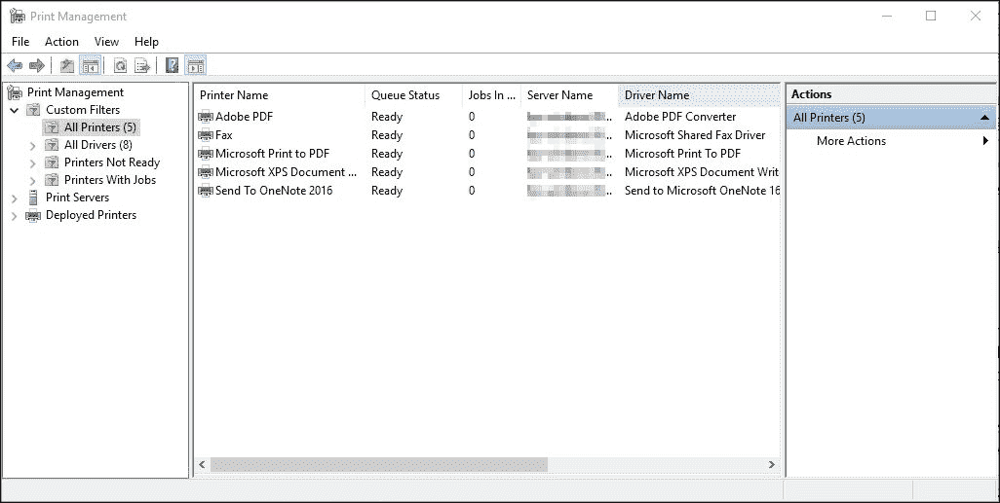

打印 API 也是 Promises 在动作中的好例子，因为打印作业完成的回复；它至少是一个承诺，告知打印作业已完成或失败。

Promise 的其他示例与 TPL、.NET EAP 和 APM 相同。基本上，其语义大多以操作完成时的通知形式存在。

这里有 fire and forget 模型和 Promise 模型的混合，尽管在这个混合中的 Promise 在实现细节上可能不是一个真正的 Promise。

例如，我们希望有一种异步方式来处理任何针对储蓄账户的传入交易，并且预计这些交易将在许多种储蓄账户之间开始。即使在同一银行，一个人也可以拥有多个账户，这些账户可能有进出的转账流量，无论是计划内的还是手动的。

通知传入转账成功存入账户是可选的。这同样也是一个承诺，尽管强制通知成功交易不是必须执行的。如果是强制性的，那么稍后将会发送回复。但这个回复可以使用当传入转账被计算为已存入账户时触发的事件来实现。在实现细节上，接收代理上的通知最终并不是强制的；可以添加自定义的事件触发器。

在在线电子商务的情况下，响应是强制性的，因为任何购买的交易都必须立即回复，尽可能接近实时。然后承诺得到执行，尽管它最终并不是一个纯粹的承诺，因为接收者正在使用事件触发器来对任何成功的交易发送通知，告知交易失败/成功。对任何传入交易的等待是持续的。这就像始终在监听任何传入操作的信号。因此，它也通常简单地被称为*监听器*，以始终监听任何传入的交易。

以下是一个简化的流程图，说明了拥有 Promise 的差异：

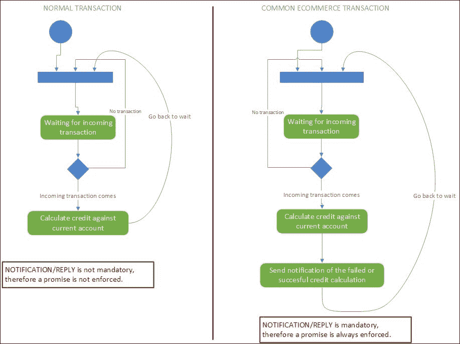

在之前的说明中，对传入交易的等待通常发生在代理上。在独立消息队列管理器的情况下，它也是一个复杂或独立的监听器。

这也是一个很好的代理示例，用于处理包含操作请求（提款、转账，甚至接收转账）的消息形式的交易。

考虑以下这个代理的示例场景：

+   一个数据包装器，包含有关要执行的操作（任何相关的银行账户交易）的必要信息，然后由一个中央处理过程处理，在等待任何传入数据被消费的同时发送。通常，所有发送和接收的数据都存储和处理，采用先到先服务或**先进先出**（**FIFO**）的原则，在一个数据结构：队列中。

+   代理必须尽可能具有可扩展性。这意味着它必须能够每秒处理大量请求。初始网站通常假设能够每秒处理 500 到 1000 个请求，因此初始预计的最大请求量是 1000 个。

在前面的场景中，为什么它必须是一个队列？

最初计划让代理一次处理超过 1000+个请求。无法保证 Web 服务器能够同时处理超过 1000 个请求。为了精确地做到这一点，我们必须确保至少有 1000 个请求同时发送和接收。这意味着我们必须在硬件方面实现并行 I/O，这非常昂贵，也非常难以实现和设置。因此，为了强制进行这种模拟，拥有并行 I/O 并不完全适合当前的需求，而且在实现速度（实现时间）和可扩展性方面也不太可行。

如果我们依赖于可用 I/O 吞吐量的可扩展性，这不是一个选择，因为纯硬件的可扩展性有更高的初始成本。如果我们依赖于通过增加 CPU 核心数量来最佳地处理请求，这也不是一个最佳解决方案。Web 请求通常在 CPU 上消耗较少，而在网络（因此是 I/O）带宽上消耗较多。在请求的消费者方面，可能在 I/O 侧有等待，这可能会阻塞下一个请求的处理，尽管可以使用我们在第四章中描述的异步工作流来优化处理，*F#并发简介*。

需要处理的请求数量必须按照先到先服务的原则进行处理。这符合 FIFO 模型，而处理这种数据结构最好的方式是队列。使用队列将始终确保第一个请求首先被处理，然后是后续的一些操作。

插入新数据的过程称为*入队*，而移除数据中的第一个元素称为*出队*。

以下是对请求进入队列和处理过程的说明：

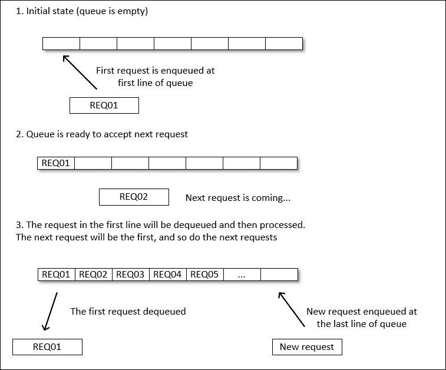

请求队列通常被视为要发送和接收的数据块，这通常被称为消息，因为这与发送和接收电子邮件的概念相似。

负责管理入队请求并在需要时发送回复的一个软件组件通常被称为消息队列管理器。从 F#的角度来看，它被称为消息代理，或者用 MSDN 术语，通常简单地称为代理。它也被称为*actor*，这种 actor 模型将在下一节中讨论。

## 消息代理概述

这个代理/管理器处理来自发送者（也称为*生产者*）发送的每条消息，并接收每条消息，然后进行处理。接收者可以是一个或多个。

在代理操作方面，整体的主要关注点包括：

+   发送消息（包括发送前后的准备工作）。发送只是从消息代理 A 到消息代理 B 的发送。

+   接收消息（包括存储、处理）。消息代理 B 从消息代理 A 接收消息。

下图展示了带有队列处理的发送消息过程：

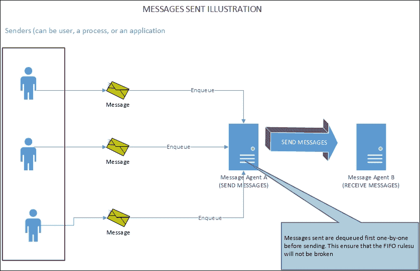

发送和接收操作在不同的上下文中处理，但发送和接收都使用队列。

当消息代理发送消息时，会执行以下活动：

1.  分配一个队列。需要考虑的主要分配是可用内存，然后是物理存储。

1.  首先按照这个约定准备要发送的消息：每个消息的格式必须相同，这样消息将以可预测的方式处理。

1.  发送前需要处理的消息通常以多种形式存在。在 F#或任何其他轻量级代理的情况下，消息可以以任何对象的形式存在。

1.  然后将对象序列化为原始字符串。

1.  对象序列化后需要封装在特定的格式中。例如，消息可以包含头部和尾部，包含如何进一步处理消息的附加信息。

1.  封装后的消息最终结果准备好发送。此时，可以运行任何额外的检查，例如检查网络的可用性。

1.  代理发送消息。代理使用的传输协议与接收者相同。

接收端如图所示：

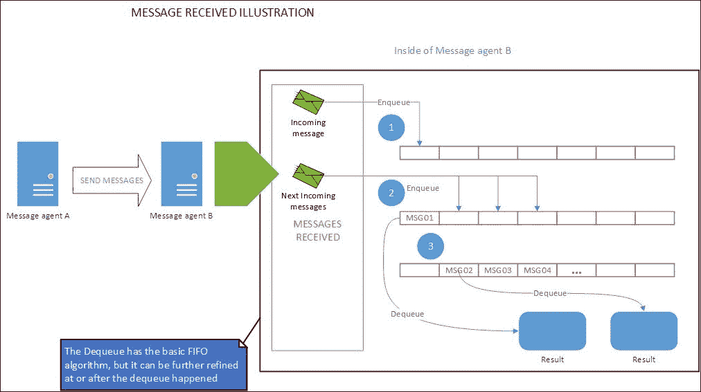

如上图所示，接收消息的代理需要一个队列，因为：

1.  进入的消息可能间隔很近；因此，期望有最小等待时间或最小延迟。此外，在处理之前需要存储进入的消息，接收的顺序非常重要，如 FIFO 所暗示的。

1.  队列可以通过按需在内存中处理进一步优化，尽可能多地匹配运行代理的最大可用内存。例如，具有 32GB RAM 的机器当然比具有 16GB RAM 的机器更有效地处理队列。

默认情况下，队列存储在堆上，但使用预定义的大小；因此，在堆上访问队列的开销最小。发送消息时的队列也是如此。

这些是在接收消息时发生的活动：

1.  分配一个队列。这一步实际上与之前发送消息的步骤 1 相同。

1.  根据与消息代理 A 约定的格式，对传入的消息进行检查以确定反序列化问题。这种验证是必要的，因为没有保证所有传入的消息都是有效的。这是发送和接收消息处理中的第一个差异。

1.  接收到的消息并不能保证总是按照发送的顺序到达。例如，并不能保证第一个发送的消息会首先被接收。消息发送的顺序与接收到的顺序不同是很正常/常见的情况。这是发送和接收消息之间的第二个差异。

1.  一个有效的传入消息将被入队。第一个传入的消息将被首先处理。这个第一个传入的消息可能不是第一个发送的消息。

1.  当它准备好出队（在等待之前的传入消息出队之后），消息内容正等待进一步的反序列化。

1.  消息内容从`String`反序列化为对象，并可以进一步作为结果数据进行处理。

### 注意

实现者负责在出队之前进一步处理队列，使其按照某些条件排序，这可能因情况而异。这可能是将队列错误地视为同步的证据，因为队列的排序会产生一些处理开销，并且消息的消费者将不得不等待。接收到的消息的处理可能会有所不同，队列可能没有考虑消息发送的时间顺序的原始 FIFO，或者只要保证使用某些配置进行进程，就会尝试按时间顺序处理接收到的消息。然而，使用这种按发送时间顺序强制执行接收到的消息的顺序将违背消息队列代理的本质，因为接收到的消息将被迫等待更早的消息到达。

这与传统的调制解调器时代不同，因为双方都需要全连接来确保持续的同步通信。如果一个消息代理需要在始终等待结果的同时进行完全实时处理，那么消息代理将被迫无限期地等待传入的回复，这将违背消息代理本身的主要目的：异步处理消息。任何可等待的（通常是进程）操作大多是阻塞的，如果等待操作是显式执行的，那么它将阻塞下一个要执行的操作或进程。

### 注意

调制解调器上的同步操作与通信通道的传输方式无关，无论是半双工还是全双工。我们中的许多人将同步与半双工/全双工混合使用，这是错误的。这些概念根本不相关。

如果需要，消息处理也可以使用临时存储来保存接收到的消息。如果每个消息可能包含需要大量处理的特定操作或指令，例如计算定价预测的当前位置的指令，这一点至关重要。

要发送的消息的处理是在队列中进行的，首先处理要发送的第一个消息。这与处理接收到的消息的方式相同，即首先处理接收到的第一个消息。在处理消息的一个重要因素是**序列化**。在消息中的对象序列化和反序列化可能会有开销。

### 序列化概述

序列化和反序列化通常被描述为简单的序列化。它被定义为如何将对象扁平化为属性和值的字符串，以及其逆过程：从属性和值的字符串构建对象。序列化部分实际上是一个将对象（或类型系统中的类）扁平化的操作，这也被称为对象的解构，因为对象的语义被转换为一个描述类、属性和值的字符串。属性的值也必须成功序列化，因为我们必须能够将它们反序列化回原始对象表示，而不改变语义值。

序列化和反序列化在以下图像中（简化地）进行了说明：

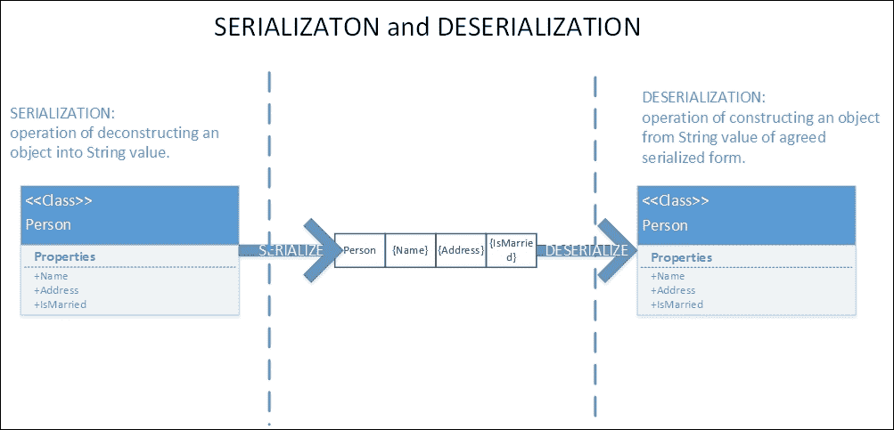

一个简单的工作序列化的例子可以在我们如何创建自己的自定义序列化中找到，该序列化使用基本重写`ToString`方法来转换对象的属性及其值的实现，该方法是`System.Object`中可用的。由于`System.Object`是.NET 中所有类型的父对象，因此所有.NET 中的类都继承自`System.Object`类。我们可以重写`ToString()`方法来表示类的内容。

例如，我们有一个`Person`类，定义如下：

```cs
open System 
open System.Text 

type Person() = 
    member val Name: String = "" with get, set 
    member val Address: String = "" with get, set 
    member val IsMarried = false with get, set 
    override this.ToString() =  
        let mutable sb = new StringBuilder() 
        sb <- sb.Append("Person{").Append(this.Name).Append("|").Append(this.Address).Append("|") 
        sb <- sb.Append(this.IsMarried).Append("}") 
        sb.ToString() 

```

以下是对前面代码的解释：

1.  `Person`类使用必要的`StringBuilder.Append`操作重写了`ToString()`方法，以构建`Person`的字符串表示形式。

1.  `sb`的`StringBuilder`被用作可变的，因为在局部作用域的函数/方法中具有可变性是可以的，因为此符号不在函数的作用域之外使用，并且副作用仍然是透明的。属性值用`|`分隔。

1.  代码在属性成员声明中使用`val`关键字，因为该属性使用自动设置器和获取器。

F#的 setter-getter 语法的语义描述超出了本书的范围。有关 F#自动属性的更多信息，请参阅此 MSDN 库页面：

[F# 语言参考 - 成员 - 属性](https://docs.microsoft.com/en-us/dotnet/articles/fsharp/language-reference/members/properties)

### 注意

F# 自动属性（由编译器自动生成的具有自动设置器和获取器的后置字段）的语义与 C#/VB 自动属性相同。只是后置属性的内部命名实现细节不同，但这根本不是我们的关注点，因为我们不关心后置字段。

然后我们添加代码来显示序列化表示：

```cs
[<EntryPoint>] 
let main argv =  
    let anyPerson1 = new Person(Name = "John Doe", Address="Baker Street", IsMarried = false) 
    let anyPerson2 = new Person(Name="Jane Doe", Address ="Arlington Street", IsMarried = true) 
    Console.WriteLine(anyPerson1.ToString())  
    Console.WriteLine(anyPerson2.ToString()) 

```

让我们运行代码，我们将看到它将显示以下输出：

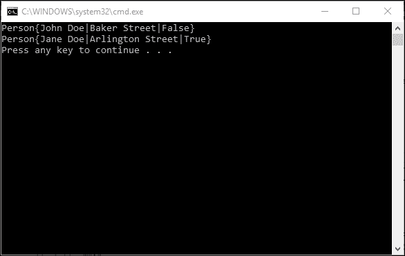

序列化的成本通常比反序列化低，因为它试图将对象（对象的属性或属性）扁平化为定义属性名称和值的字符串。然后，属性值通过隐式或显式调用 `ToString()` 方法转换为 `String`。这实际上是一个简化的示例，我们也可以编写自己的序列化器来进一步优化或完全简化流程。

反序列化更昂贵，因为它试图根据字符串值构建一个类型，因为我们必须维护从序列化 `String` 中获取的属性和属性值的语义。

以下是一个简化的反序列化示例（在 `Person` 类型声明下方添加此代码）：

```cs
    static member Deserialize (serializedString:String) = 
        let mutable deserializedPerson = new Person() 
        let mutable strippedString = serializedString.Substring(7) 
        strippedString <- strippedString.Substring(0,strippedString.Length-1) 
        let splitString = strippedString.Split([| "|" |], StringSplitOptions.None) 
        deserializedPerson.Name <- splitString.[0] 
        deserializedPerson.Address <- splitString.[1] 
        deserializedPerson.IsMarried <- Boolean.Parse(splitString.[2]) 
        deserializedPerson 

```

为了测试这个函数，我们现在修改 `EntryPoint` 代码来测试 `Deserialize`：

```cs
[<EntryPoint>] 
let main argv =  
    let anyPerson1 = new Person(Name = "John Doe", Address="Baker Street", IsMarried = false) 
    let anyPerson2 = new Person(Name="Jane Doe", Address ="Arlington Street", IsMarried = true) 
    Console.WriteLine(anyPerson1.ToString())  
    Console.WriteLine(anyPerson2.ToString()) 
    let anyperson3 = Person.Deserialize(anyPerson1.ToString()) 
    Console.WriteLine(anyperson3.ToString()) 
    0 // return an integer exit code 

```

我们将 `Deserialize` 标记为 `static`，因为主要目的是反序列化，而不是依赖于执行反序列化的对象。我们可以通过使用现有的序列化 `ToString()` 结果并以其参数进行演示来测试这个反序列化。

以下是将 `anyperson3.ToString()` 的结果与之前的 `anyPerson1` 和 `anyPerson2` 结合后的显示输出：

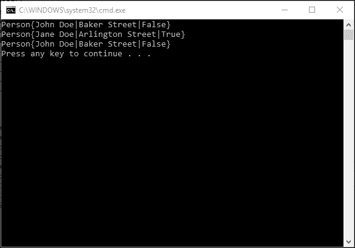

结果显示现在已经证明我们通过检查 `anyPerson1` 与 `anyperson3` 的相同值，成功地从序列化的 `String` 中构建了对象。这个示例对于这个演示来说太简单了，但它确实证明了在进行成功的反序列化之前必须满足某些要求。

这些是成功反序列化的强制性要求：

1.  序列化的格式必须达成一致，并且必须与序列化器具有相同的结构格式。在实现方面，序列化对象的类型必须相同。

1.  序列化和反序列化必须尽可能简单；否则，将发生复杂的序列化和反序列化。例如，序列化实现 COM 对象的对象，而隐式封送处理将始终发生，并且跨越 *STA* 和 *MTA* 线程的线程边界将始终产生不可预测的结果，通常会产生非抛出异常的错误形式。

1.  对象的序列化必须是一个具体的对象（一个类）；否则，将发生类型检查转换的开销。例如，不建议序列化接口，因为反序列化将始终尝试创建一个具体类的实例，并可能导致运行时错误。

在常见的/日常实践中，建议使用现有的序列化程序，例如使用已经广泛使用的格式，如 JSON，例如在 WCF 类库中的 `DataContractJsonSerializer`，位于 `System.Runtime.Serialization.Json` 命名空间下，以及常用的第三方序列化程序，NewtonSoft JSON 序列化程序。

## F# MailboxProcessor 简介

现在，我们已经了解了消息代理的基本知识，并且我们也强调了该代理如何操作，即如何发送和接收消息。现在是时候了解更多关于 F# 消息代理，F# `MailboxProcessor` 的信息了。在本书的其余部分，我们将简单地使用 `MailboxProcessor` 作为类和代理。

`MailboxProcessor` 是基于演员的。它可能产生多个线程，也可能只有一个线程。从某种意义上说，它是一个演员，因为作为一个演员，它可以有自己的角色。在它们的实现细节中，演员可以独立行动，而不依赖于其他演员（尽管它们可能有相同的责任或行为）。演员可以被实现为具有相同的责任，例如处理传入请求或发送请求的演员/代理。

`MailboxProcessor` 的编写者也可以被视为生产者，而读者可以被视为消费者。

`MailboxProcessor` 的轻量级特性是独特的。它不仅轻量级，独立且内置于核心 F# 中，而且：

+   开始使用它非常简单，因为它不依赖于底层操作系统如何执行异步操作。

+   它不会存储消息，因此它们不是持久的

+   它可以进一步与 F# 异步工作流结合使用

+   它没有像 IBM Websphere MQ 和 MSMQ 那样具有许多可配置环境设置的先进基础设施。

除了这些独特的特性之外，F# `MailboxProcessor` 队列代理的概念与著名的消息队列管理软件类似，例如 IBM Websphere MQ（以前称为 IBM MQ Series）和 Microsoft MQ（也称为 MSMQ）。它用于处理异步消息传输。

更多关于 IBM Websphere MQ 的信息，请访问：

[IBM MQ](http://www-03.ibm.com/software/products/en/ibm-mq)

想了解更多关于 MSMQ 的信息，请访问：

[`msdn.microsoft.com/en-us/library/ms711472(v=vs.85).aspx`](https://msdn.microsoft.com/en-us/library/ms711472(v=vs.85).aspx)

F# 中的 `MailboxProcessor` 作为代理并不是完全独立的（不是外部的），因为 `MailboxProcessor` 是 F# 核心库的一部分，因此我们可以快速使用和利用它，而不是在使用它之前进行评估和安装设置活动。

不利之处包括：

+   如果发送或接收许多消息，我们必须实现自己的存储来存储它们。这意味着我们维护自己的消息队列存储，因为默认情况下，`MailboxProcessor` 消息不是持久的。

+   我们必须管理如何进一步优化队列操作，因为默认情况下，`MailboxProcessor` 依赖于运行时操作而没有离线存储功能来保存队列。

+   如果优先级顺序至关重要，我们无法进一步自定义 `MailboxProcessor` 在 Windows 上如何使用底层机器的线程亲和性，因为没有方法可以做到这一点。这是故意的，因为 `MailboxProcessor` 的轻量级总是隐藏了线程执行上优先级同步的实现细节。

在 F# 领域，`MailboxProcessor` 有能力将消息写入以发送（*写入者*）和读取传入的消息（*读取者*）。

写入者-读取者模型经常在 MSDN 图书馆的 `Control.MailboxProcessor` 的 MSDN 登录页面中提到：

[`msdn.microsoft.com/visualfsharpdocs/conceptual/control.mailboxprocessor%5b%27msg%5d-class-%5bfsharp%5d`](https://msdn.microsoft.com/visualfsharpdocs/conceptual/control.mailboxprocessor%5b%27msg%5d-class-%5bfsharp%5d)

这种读写者模型表明 `MailboxProcessor` 只关注作为代理写入消息并发送，然后读取传入的消息。它可能只专注于一个责任，即仅发送、接收或两者兼具。

如果我们将 `MailboxProcessor` 设置为同时具有发送和接收功能，则无法保证发送和接收过程可以同时进行。

让我们通过构建和模拟一封电子邮件消息来查看 `MailboxProcessor` 的简化示例。F# `Control.MailboxProcessor` 的登录页面中的示例代码实际上是一个脚本文件，而不是一个常见的代码文件，因为我们需要立即评估和测试结果，这是 F# 交互式环境的一个良好实践：

```cs
open System 
open Microsoft.FSharp.Control 

type EmailMessage() = 
    member val From : String = "" with get, set 
    member val To : String = "" with get, set 
    member val Cc : String = "" with get, set 
    member val DateSent : DateTime = (DateTime.Now) with get 
    member val Subject : String = "" with get, set 
    member val Content : String = "" with get, set 

let mailbox = new MailboxProcessor<EmailMessage>(fun mailprocess -> 
    let rec loop = 
        async { printfn "Incoming message!"  
                let! msg = mailprocess.Receive() 
                printfn "Message received. \r\nFrom: %s, \r\nDate received: %s" msg.From (msg.DateSent.ToString()) 
                printfn "Subject: %s" msg.Subject 
                printfn "Content: \r\n %s" msg.Content 
                return! loop } 
    loop)  

```

通过按 *Alt* + *Enter* 开始评估前面的代码。

F# 交互式环境将按顺序评估代码，这是语义的遍历：

1.  打开 `System` 命名空间和 `Microsoft.Fsharp.Control`。`Microsoft.FSharp.Control` 命名空间对于 `MailboxProcessor` 是必需的。我们使用 `System` 命名空间，因为我们将在稍后使用 `Console` 显示输出。

1.  我们创建 `EmailMessage` 类型来封装我们将要使用的消息。消息很简单，它包含发送者（`From`）、目的地、可选的 CC、主题和消息内容。属性在默认构造函数中初始化。

1.  所有属性都使用了显式类型声明以提高清晰度。

1.  邮箱符号被推断为一个 `MailboxProcessor` 实例，其消息类型为参数化的 `EmailMessage` 类型。

1.  `MailboxProcessor` 构造函数是一个包含接收消息循环的 lambda 表达式。

1.  这个 lambda 包含一个循环的递归函数，并使用 `return!` 来表示循环的返回调用在异步工作流边界内。在实现细节中，`return!` 进一步被转换成对 `AsyncBuilder.Return` 的调用。

1.  接收到的消息通过调用 lambda 参数推断出的类型异步获取结果来处理，该类型为 `inbox`。`inbox` 实际上被类型化为 `MailboxProcessor<Message>`。

`return!` 的使用至关重要，因为循环递归函数的本质包含在一个异步工作流中。如果我们只使用 `return` 而不是 `return!`，它将泄露调用状态到 `async` 构造之外的边界，这可能导致在跨上下文时出现内存泄漏。这个 `return!` 在实际返回循环调用之前被转换成对 F# 异步工作流构建器之一 `AsyncBuilder.Return` 的调用。

内部实现细节可以在 IL 中找到。编译并启动 ILDASM，然后如果我们打开编译后的 exe，我们可以检查生成的循环类。在其中一个循环中，我们将看到它调用了 `FSharp.Control.FSharpAsyncBuilder.Return`：

```cs
    .method public strict virtual instance class [FSharp.Core]Microsoft.FSharp.Control.FSharpAsync`1<class [FSharp.Core]Microsoft.FSharp.Core.Unit>  
            Invoke(class [FSharp.Core]Microsoft.FSharp.Core.Unit _arg2) cil managed 
    // SIG: 20 01 15 12 29 01 12 0D 12 0D 
    { 
      // Method begins at RVA 0x3450 
      // Code size       16 (0x10) 
      .maxstack  8 
      IL_0000:  /* 00   |                  */ nop 
      IL_0001:  /* 03   |                  */ ldarg.1 
      IL_0002:  /* 26   |                  */ pop 
      IL_0003:  /* 02   |                  */ ldarg.0 
      IL_0004:  /* 7B   | (04)00002E       */ ldfld      class [FSharp.Core]Microsoft.FSharp.Control.FSharpAsyncBuilder MailboxSample/'Loop@81-16'::builder@ 
      IL_0009:  /* 14   |                  */ ldnull 
      IL_000a:  /* 6F   | (2B)00000A       */ callvirt   instance class [FSharp.Core]Microsoft.FSharp.Control.FSharpAsync`1<!!0> [FSharp.Core]Microsoft.FSharp.Control.FSharpAsyncBuilder::Return<class [FSharp.Core]Microsoft.FSharp.Core.Unit>(!!0) 
      IL_000f:  /* 2A   |                  */ ret 
    } // end of method 'Loop@81-16'::Invoke 
  } // end of class 'Loop@81-16' 

```

在实际返回到外部作用域之前，它包含了一个 `FSharpAsyncBuilder.Return` 调用。

### 注意

所有的 F# `AsyncBuilder` 都在名为 `FSharpAsyncBuilder` 的名称下编译。这也在生成的 IL 中得到了反映。

然后，让我们看看 `MailboxProcessor` 的实际应用：

```cs
let email1 = new EmailMessage ( From = "john@somemail.com", To = "clark@somemail.com", Subject = "Introduction", Content = "Hello there!") 
let email2 = new EmailMessage ( From = "janet@somemail.com", To = "abby@somemail.com", Subject = "Friendly reminder", Content = "Please send me the report today. Thanks!\r\nRegards,\r\nJanet") 
mailbox.Start() 
mailbox.Post(email1) 
mailbox.Post(email2)  

```

这是之前代码的输出：

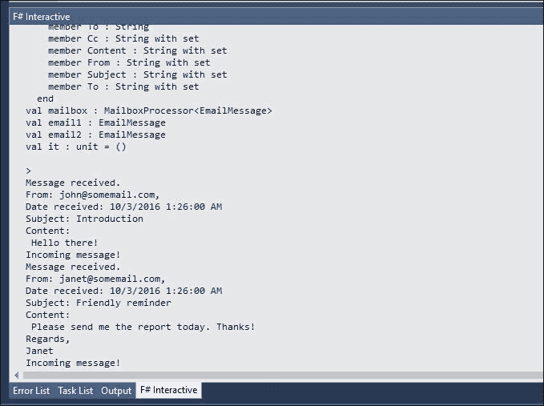

让我们进一步深入代码：

1.  邮箱符号实际上是一个 `MailboxProcessor` 实例，具有一个参数化构造函数和一个类型为 `Message` 的消息体。

1.  在我们获得 `MailboxProcessor` 实例后，我们可以通过调用 `Start()` 方法开始初始化邮箱作为代理。

1.  我们可以通过调用 `Post()` 并将消息作为参数来发送消息；`Post()` 方法的每次调用都保证是异步的。

从 `MailboxProcessor` 的角度来看，写入操作是通过调用 `Post()` 来表示的，这同时也是发送操作；读取操作是通过调用 `Receive()` 来表示的，这同时也是接收操作。

这也是为什么类型名称以 *Mailbox* 开头，因为它在日常生活中的邮箱作为发送和接收包含消息的起始容器非常相似。

现在我们来深入了解`MailboxProcessor`的功能。

### MailboxProcessor 功能概述

`MailboxProcessor`有两个构造函数，最简单的构造函数是接受一个委托参数的构造函数。第二个构造函数接受两个参数：一个委托和一个`CancellationToken`对象。

以下是一些构造函数的语法：

```cs
// Signature: 
new MailboxProcessor : (MailboxProcessor<'Msg> -> Async<unit>) * ?CancellationToken -> MailboxProcessor<'Msg> 

// Usage: 
new MailboxProcessor (body) 
new MailboxProcessor (body, cancellationToken = cancellationToken) 

```

在上一个示例中，我们使用委托调用了构造函数。当`MailboxProcessor`启动时（通过调用`Start()`方法初始化），这个委托是读取循环的主要入口。

并非`MailboxProcessor`中的所有操作都对所有情况都很有用；这取决于使用情况和我们要使用的异步操作的细节。实际上，与其他消息代理类似，`MailboxProcessor`不保证接收到的消息的顺序始终与发送消息的顺序相同。

以下是一些`MailboxProcessor`的有趣函数/方法：

| **函数** | **快速说明** |
| --- | --- |
| `Post` | 异步地将消息发送到`MailboxProcessor`的消息队列。不应与非 F# `async`（如 C#/VB `async`）混合使用。发送消息不强制`MailboxProcessor`返回任何发送操作的成功/失败状态。 |
| `PostAndAsyncReply` | 向代理发送消息并异步等待通道上的回复。不应与非 F# `async`（如 C#/VB `async`）混淆。它要求我们始终处理消息的回复。 |
| `PostAndReply` | 向代理发送消息并同步等待通道上的回复。消息的发送仍然是异步的。不应与非 F# `async`（如 C#/VB `async`）混合使用。它要求我们始终处理消息的回复。 |
| `PostAndTryAsyncReply` | 与`PostAndAsyncReply`类似，但在超时时间内没有回复时返回`None`。不应与非 F# `async`（如 C#/VB `async`）混合使用。它要求我们始终处理消息的回复。 |
| `Receive` | 等待消息。这将消耗到达顺序中的第一个消息。不应与非 F# `async`（如 C#/VB `async`）混合使用。这个`Receive`操作具有与发送操作定义的相同类型的对象。 |
| `Scan` | 通过按到达顺序遍历消息来查找消息，直到扫描器返回`Some`值。其他消息保留在队列中。这种扫描操作将主要阻塞`Receive`和`TryReceive`的消息回复。 |
| `Start` | 启动代理。代理的开始可能包含在并行循环中，例如`Parallel.For`或`Parallel.ForEach`。 |
| `TryPostAndReply` | 与`PostAndReply`类似，但在超时时间内没有回复时返回`None`。不应与非 F# `async`（如 C#/VB `async`）混合使用。 |
| `TryReceive` | 等待消息。这将消耗到达顺序中的第一条消息。它还强制同步而不是异步接收。如果接收消息失败，则返回`false`。不应与非 F#的`async`（如 C#/VB 的`async`）混合使用。`Receive`操作具有与发送操作定义的相同类型的对象 |
| `TryScan` | 通过按到达顺序查看消息来扫描消息，直到扫描器返回`Some`值。其他消息保留在队列中。队列仅存储在内存中。 |

在上一个表中，所有标准帖子（如`Post`）和回复操作（如`PostAndReply`和`PostAndAsyncReply`），都不应在 C#/VB 的`async`构造中内部使用。F#中实现的帖子（post）和回复操作有自己的线程同步器。当在 C#/VB 的`async`构造中使用时，这个 F#同步器往往会有不可预测的结果；混合不同的异步模型会使 F#同步器在切换不同的执行上下文时出现竞争条件。

### 进一步实现`MailboxProcessor`

根据上一个表，`MailboxProcesor`不仅可以发送消息并等待回复，而不仅仅是发送（帖子）消息。以下操作在发送后立即执行发送和等待回复：

+   `PostAndAsyncReply`

+   `PostAndReply`

+   `PostAndTryAsyncReply`

+   `TryPostAndReply`

所有这些发送和接收操作在 F#中都需要一个句柄。它被称为`AsyncReplyChannel`，包含在`Control.AsyncReplyChannel`类中。

这些是使用`MailboxProcessor`的常见步骤：

1.  我们必须计划要传输和接收的消息格式。消息的格式必须尽可能简单。

1.  代理是通过实例化创建的。在这个阶段，我们必须决定是否可以通过调用具有委托和`CancellationToken`的`MailboxProcessor`构造函数来随时取消发送和接收消息的操作。

1.  委托可以包含发送和接收消息操作，或者只是接收操作。

1.  如果我们需要它发送并等待回复，我们必须仔细构造委托以包含`AsyncReplyChannel`。建议将此处理程序嵌入到消息本身中，因为这样我们可以确保发送消息的回复紧密相关。

为了看到发送和等待回复的示例，我们还使用 F#灵活的类型声明来在处理消息时增加更多灵活性。

在消息的声明中，`AsyncReplyChannel`嵌入到消息本身中：

```cs
type ComplexMessage = 
    | OrdinaryMessage of EmailMessage 
    | ForceReplyDelay of AsyncReplyChannel<DateTime> 

```

这是创建`MailboxProcessor`实例并使用句柄进行接收的代码摘录：

```cs
let msgManager = new MailboxProcessor<ComplexMessage>(fun inbox -> 
    let rec loop msgReceived = 
        async { let! msg = inbox.Receive() 
                match msg with 
                | OrdinaryMessage omsg ->  
                    printfn "Message received. \r\nFrom: %s, \r\nDate received: %s" omsg.From (msg.DateSent.ToString()) 
                    printfn "Subject: %s" omsg.Subject 
                    printfn "Content: \r\n %s" omsg.Content 
                    return () 
                | ForceReplyDelay replyChannel -> 
                    replyChannel.Reply(msgReceived) 
                return! loop DateTime.Now 
             } 
    loop DateTime.Now 
    )  

```

还知道类型推断不仅流畅地作为推断类型声明和推断返回类型，而且还适应了推断类型的构造函数的*区分联合*。

例如，让我们看看具有判别联合和我们的先前 `EmailMessage` 嵌入的 `ComplexMessage` 类型的声明。

我们现在可以将此与检查任何查询作为其 *子类型* 的模式匹配相结合：

```cs
            let! message = inbox.Receive() 
                match msg with 
                | OrdinaryMessage omsg ->  
                    printfn "Message received. \r\nFrom: %s, \r\nDate received: %s" omsg.From (msg.DateSent.ToString()) 
                    printfn "Subject: %s" omsg.Subject 
                    printfn "Content: \r\n %s" omsg.Content 
                    return () 
                | ForceReplyDelay replyChannel -> 
                    replyChannel.Reply(msgReceived) 

```

还有一个很好的消息，即这个特性也是 F# 独有的，因为当前 C#/VB 的发布还没有这个判别联合特性。

### 注意

有计划在 C#/VB 中支持判别联合，但仍在讨论中。此外，模式匹配预计将在 C# 7 的下一个版本中推出，而 VB 15 没有与 F# 相同的自动类型推断。请咨询 GitHub 上的 Microsoft Roslyn 仓库，以了解 C#/VB 语言设计的最新发展。

对判别联合的详细描述超出了本书的范围，因为我们无法进一步优化判别联合。有关 F# 的判别联合的更多信息，请访问：

[`docs.microsoft.com/en-us/dotnet/articles/fsharp/language-reference/discriminated-unions`](https://docs.microsoft.com/en-us/dotnet/articles/fsharp/language-reference/discriminated-unions)

样本代码中的模式匹配可以进一步优化。我们将在 第七章 中描述模式匹配的优化，作为 F# 语言结构（除异步工作流外）的一部分，*语言特性和结构优化*。

为了同时测试发送和接收，我们可以在发送（发布）消息的同时等待接收消息：

```cs
let email1 = new EmailMessage ( From = "john@somemail.com", To = "clark@somemail.com", Subject = "Introduction", Content = "Hello there!") 
msgManager.Start() 
msgManager.Post(OrdinaryMessage email1) 
msgManager.PostAndReply((fun reply -> ForceReplyDelay(reply)), 100) |> ignore 

```

由于我们在消息中嵌入了通道，我们可以快速保证对于每个接收到的消息，我们都可以尝试将接收到的消息与我们发送的消息相关联，因为我们使用的是相同的 `AsyncReplyChannel`。

回顾一下 `marketMaker` 构造函数内部的委托定义，它与 `Message` 类型的查询模式相匹配，然后根据 `PostAndReply` 发送的消息返回相关资产。

现在，我们通过订单和卖出交易的示例扩展了对 `MailboxProcessor` 的理解。它仍然类似于银行账户模型交易，但我们不关心有多少部分或资产余额。

# 在 MailboxProcessor 和异步工作流中管理副作用

我们可能曾想使用一个封装在异步工作流中的 `MailboxProcessor` 实例化。*不建议使用这个过于复杂的包装器，因为 MailboxProcessor 已经有自己的异步上下文*。

这也适用于与 UI 线程的互操作性，以及异步上下文不应直接与 UI 线程混合。将 UI 线程与异步上下文混合会产生不可预测的结果。

如果我们必须使用 Windows 窗体，最好是使用异步工作流，并且用 F#编写 UI 代码。使用 WPF，我们可以使用 WPF 的 Dispatcher 来确保我们不会出现跨线程违规。

在管理副作用方面，使用`MailboxProcessor`进行副作用活动必须谨慎处理。

考虑这些场景和原因：

1.  在`MailboxProcessor`实例化的委托参数内部接收消息时，我们有异步获取网页内容的调用。这些多个异步上下文不建议使用，因为可能会出现关于哪些进程应该完成并返回回调给调用委托的竞争条件。这种额外的复杂性会给堆栈增加开销，因为没有保证`MailboxProcessor`能正确处理异步调度。

1.  如果我们仍然想这样做，获取网页内容的每个调用都必须尽可能使用可丢弃模式来处理，以最大限度地减少调用栈的指针泄漏。

1.  `MailboxProcessor`的原始意图是充当消息代理的角色。消息的委托和有效负载应该尽可能简单。如果我们想使用`AsyncReplyChannel`，建议将其作为消息的一部分嵌入。

1.  将`MailboxProcessorPost`和`Reply`包装在并行循环，如`Parallel.ForEach()`中，并不能真正保证`MailboxProcessor`会完全并行地发送消息，除非`MailboxProcessor`的实例化本身是在并行循环中编码的。这将确保在`MailboxProcessor`委托的上下文之外不会有任何越界，当`MailboxProcessor`启动时。

1.  不建议嵌套递归的`async`函数调用另一个递归的`async`函数。不可预测性将增加许多数量级，特别是当它被视为一个长期对象时，但它也会给 CLR 的`Gen0`和`Gen1`带来负担。通常，长期对象应该存在于`Gen1`中，但异步工作流可能会将其视为短期对象；因此，负担将放在`Gen0`和`Gen1`上。

我们从许多示例案例中看到，对应用程序进行性能分析非常重要，特别是当代码包含许多异步工作流，包括隐含的`MailboxProcessor`时。测试`Gen0`和`Gen1`中存在多少对象的结果将决定垃圾收集和堆分配可能遇到的不必要开销在哪里以及如何发生。

由于对象生命周期短但被配置为长期存在，可能会出现不必要的开销；GC 的 `Gen0` 和 `Gen1` 分析报告应该是实际找出 `Gen0` 和 `Gen1` 继续所在的基础。然而，过早的垃圾回收并不一定能提高性能，因为如果 `Gen0` 有激进的垃圾回收，那么垃圾回收的成本将影响代码的初始运行时间，尤其是在 `for` 和 `foreach` 循环中调用 `GC.Collect` 时。每次调用 `GC.Collect` 时，`GC.Collect` 调用过程中可能发生的任何异常也会影响当前栈帧的状态和堆分配。

再次强调，对于您异步工作流的非标准实现，没有单一的解决方案。

# 使用 .NET TPL 进行并行编程

我们对异步、并行异步以及异步工作流与 .NET EAP 和 APM 的互操作性有基本了解。我们已经以 F# 异步工作流与 .NET TAP 互操作性的形式完成了 .NET 基于任务的异步编程（TAP）的讨论。我们现在将更多地讨论与 .NET TPL 的互操作性。

F# 不仅有自己的异步支持和并行异步实现，而且与 .NET BCL 完全兼容，因此与 .NET TPL 兼容。

.NET TPL 不仅仅是隐式异步和并行组合的基础设施。它专注于以下三个特性：

+   基于任务的并行

+   数据并行

+   PLINQ，LINQ 的并行实现，也称为 Parallel LINQ

通过访问 MSDN 图书馆 .NET TPL 登录页面，让我们更深入地了解 .NET TPL：

[`msdn.microsoft.com/en-us/library/dd460693(v=vs.110).aspx`](https://msdn.microsoft.com/en-us/library/dd460693(v=vs.110).aspx)

根据 MSDN，这是 .NET 4 TPL 的整体高级视图：

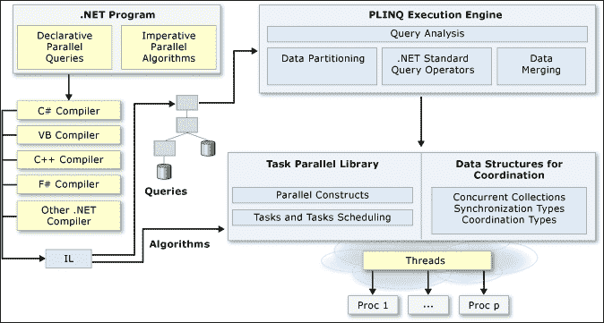

在语法层面，.NET TPL 从概念上分为两个部分：

+   声明式并行查询（例如，PLINQ）

+   强制性并行（例如，`Parallel.ForEach`，带有额外的参数以保持状态一致性）

这张图适用于 .NET 4.5，并且对于 .NET 4.6/4.6.1 仍然有效，因为它说明了包括数据流并行（从 .NET 4.5 开始）在内的 .NET TPL 的高级视图。

值得注意的是，自 .NET 4.5 以来，在并行支持方面有以下新特性：

+   使用并行调试支持进行并行调试更容易。

+   数据流库本质上与 F# 的 `MailboxProcessor` 相同。

+   协调数据结构使现有的并发数据结构更加并发感知。这本质上与在 .NET 4.5 及以后版本中提高性能的并发数据结构相同。

想了解更多关于 .NET 4.5、4.6 和 4.6.1 中新功能的信息，请访问：

[`msdn.microsoft.com/en-us/library/ms171868(v=vs.110).aspx`](https://msdn.microsoft.com/en-us/library/ms171868(v=vs.110).aspx)

有关.NET 4.5 中针对并行编程的新功能的更多信息，请访问.NET 并行团队（以前称为 ParallelFX）的 Microsoft MSDN 博客：

[`blogs.msdn.microsoft.com/pfxteam/2011/09/17/whats-new-for-parallelism-in-net-4-5/`](https://blogs.msdn.microsoft.com/pfxteam/2011/09/17/whats-new-for-parallelism-in-net-4-5/)

在.NET TPL 中有一个类似的消息传递代理库；它被称为*数据流*。数据流库不包括在.NET 运行时和 SDK 的原始运行时分布中。它可以作为一个单独的 NuGet 包下载。

在本章中，我们不会讨论数据流库，因为我们专注于 F#的`MailboxProcessor`。

### 注意

虽然.NET 4.0 是.NET 的起始版本，其中包含.NET TPL，但.NET TPL 的一些内部实现中存在 bug，这些 bug 已在.NET 4.5 及以后的版本中修复，特别是并行调试支持。从第五章开始，*F#的高级并发支持*中所有与.NET TPL 相关的讨论仅适用于.NET 4.5 及以后的版本。

在下一节中，我们将更详细地讨论 TPL，从基于任务的并行性到数据并行性。

## 基于任务的并行性概述

让我们来看看基于任务的并行性。术语*任务*实际上与**基于任务的异步模式**（**TAP**）中的任务概念相同，但有一个额外的特性：它可以独立运行，作为一个并发单元。并行化任务作为并发单元的后果是它可以并行运行，或者可能在未来的某个时间作为任务链运行。

所有并行任务操作都可通过`System.Threading.Tasks.Parallel`类在`mscorlib.dll`程序集下访问。这意味着我们可以立即使用它，而无需引用除`mscorlib.dll`之外的任何程序集。

这个`Parallel`类有许多`static`方法，为任务并行性和数据并行性提供支持。

`Parallel`类中与任务并行性相关的方法是`Parallel.Invoke`方法。

此方法有以下重载签名；第一个签名如下：

```cs
static member Invoke :  
        [<ParamArrayAttribute>] actions:Action[] -> unit 

```

`Parallel.Invoke`的第二个签名如下：

```cs
static member Invoke :  
        parallelOptions:ParallelOptions * 
        [<ParamArrayAttribute>] actions:Action[] -> unit 

```

第一个签名将`Invoke`定义为一个参数——`Action`委托的参数数组。`[<ParamArrayAttribute>]`与 C#的`param`关键字具有相同的语义，但在 F#中必须定义为属性参数，才能以类似于 C#中`param`的方式使用。

第二个签名定义了两个参数：`ParallelOptions`，一个用于进一步配置我们想要运行的并行行为的一个类，以及`Action`委托的参数数组。

`Parallel.Invoke`方法的文档可在以下位置找到：

[`msdn.microsoft.com/en-us/library/system.threading.tasks.parallel.invoke(v=vs.110).aspx`](https://msdn.microsoft.com/en-us/library/system.threading.tasks.parallel.invoke(v=vs.110).aspx)

在 F# 中使用 `Parallel.Invoke` 非常简单。例如，我们可以并行化两个不同的过程，第一个过程是阶乘，第二个过程是获取本地机器上所有正在运行的过程。

完整的示例代码如下：

```cs
open System 
open System.Diagnostics 
open System.Threading.Tasks 

let rec fact x =  
    match x with 
    | n when n < 2 -> 1 
    | _ -> fact(x-1) * x 

let factwrap x = 
    let factresult = fact x 
    ignore 

let runningProcesses = fun () ->  
    let processes = Process.GetProcesses() 
    let processNames =  
        processes 
        |> Seq.map (fun p -> p.ProcessName) 
    for name in processNames do 
        Console.WriteLine(name) 

```

这段代码的有趣之处在于我们如何通过简单地实例化一个新的 `Action` 委托来与 .NET `Action` 委托进行交互，该委托将我们想要包装为 `Action` 委托的过程包装起来。

如果我们要将递归函数作为 `Action` 委托包装，我们需要将函数包装在另一个函数内部，该函数始终忽略结果，就像 `factwrap` 函数所做的那样。这是至关重要的，因为 `Action` 委托是一个没有返回值的委托，或者它返回一个单元（在 C# 中为 `void`）。

然后，我们可以在现有的 `main` 的 `EntryPoint` 中添加运行 `Parallel.Invoke` 和我们的 `factwrap` 和 `runningprocesses` 委托的行：

```cs
[<EntryPoint>] 
let main argv =  
    let anyPerson1 = new Person(Name = "John Doe", Address="Baker Street", IsMarried = false) 
    let anyPerson2 = new Person(Name="Jane Doe", Address ="Arlington Street", IsMarried = true) 
    Console.WriteLine(anyPerson1.ToString())  
    Console.WriteLine(anyPerson2.ToString()) 
    let anyperson3 = Person.Deserialize(anyPerson1.ToString()) 
    Console.WriteLine(anyperson3.ToString) 
    Parallel.Invoke(new Action(ParallelInvokeSample01.factwrap 5), new Action(ParallelInvokeSample01.runningProcesses)) 
    //printfn "%A" argv 
    0 // return an integer exit code 

```

示例 `Parallel.Invoke` 包含两个要并行化的委托。但我们可以添加更多的委托，比 `ParamArrayAttribute` 标记所暗示的更多。

数组的参数类型是 `Action[]` 数组。这意味着我们所有的函数都必须有一个函数体并返回 `void`，而不仅仅是过程的返回结果。这就是为什么 `fact` 函数必须被包装在另一个函数中，该函数运行 `fact` 并忽略返回结果，而 `runningProcesses` 函数体被显式包含在一个以单元作为其参数的 lambda 函数中。

如果我们没有在 lambda 表达式中显式声明 `runningProcesses`，则此函数将被推断为具有泛型类型作为其参数，因为 F# 需要显式声明参数类型。我们还将遇到其他编译错误，因为 `Action` 委托还需要一个没有参数且无返回值的函数签名。

以下为 `Action` 委托的签名：

```cs
type Action =  
    delegate of unit -> unit 

```

在这个意义上，`delegate` 关键字是 .NET BCL 委托，而不是 F# 委托。F# 委托代表一个 F# 函数，这个 F# 函数将被编译为 F# `FastFunction` 的继承。

让我们深入到 `factwrap` 函数的 IL 和 `Action` 的内部声明：

```cs
.class auto ansi serializable nested assembly beforefieldinit factwrap@14<a> 
       extends class [FSharp.Core]Microsoft.FSharp.Core.FSharpFunc`2<!a,class [FSharp.Core]Microsoft.FSharp.Core.Unit> 
{ 
} // end of class factwrap@14 

```

我们现在可以看到它扩展了 `Microsoft.Core.FSharpFunc<`T1,`T2>`，它接受两个泛型类型参数。`T1` 是委托的参数，`T2` 是返回类型。`T1` 被标记为单元类型，`T2` 同样也是单元类型。

让我们访问 `Parallel.Invoke` 的第二个重载，它以 `ParallelOptions` 作为其参数。

`Parallel.Options` 类的文档可在以下位置找到：

[`msdn.microsoft.com/en-us/library/system.threading.tasks.paralleloptions(v=vs.110).aspx`](https://msdn.microsoft.com/en-us/library/system.threading.tasks.paralleloptions(v=vs.110).aspx)

`ParallelOptions` 类基本上是一个用于进一步配置 `Parallel.Invoke` 以满足自定义并发需求的类。

以下为 `ParallelOptions` 的属性：

+   `CancellationToken`，用于传递 `CancellationToken` 以取消正在运行的操作。

+   `MaxDegreeOfParallelism`，用于获取或设置由此 `ParallelOptions` 实例启用的最大并发任务数。

+   `TaskScheduler`，用于获取或设置与此 `ParallelOptions` 实例关联的 `TaskScheduler`。将此属性设置为 `null` 表示应使用当前 `threadpool` 中运行线程的当前调度器。

我们也可以通过将此值传递给 `ParallelOptions.MaxDegreeOfParallelism` 属性来强制并行上下文具有最大并行度为 `5`。

以下是一个快速示例（使用我们现有的示例委托）：

```cs
Parallel.Invoke(new ParallelOptions(MaxDegreeOfParallelism = 5),new Action(ParallelInvokeSample01.factwrap 5), new Action(ParallelInvokeSample01.runningProcesses)) 

```

我们现在已将最大并行度设置为 `5`，这不是一个悲观值，因为我们只传递了两个 `Action` 委托。将此值设置为 `-1` 将指示 `Parallel.Invoke` 尽可能地并行运行，以使用可用的核心和线程池中的可用线程。

在设置 `MaxDegreeOfParallelism` 属性的值时要小心。MSDN 库有额外的注意事项：

+   在多核心上：

    当你知道你使用的特定算法不会扩展到一定数量的核心之外时。你可以设置该属性以避免在额外的核心上浪费周期。

+   关于 `thread` 和 `threadpool` 资源分配的实现细节：

    当你同时运行多个算法并希望手动定义每个算法可以使用的系统资源量时。你可以为每个算法设置一个 `MaxDegreeOfParallelism` 值。

    当线程池的启发式算法无法确定要使用多少线程，并可能导致注入过多的线程时。例如，在长时间运行的循环体迭代中，线程池可能无法区分合理的进度或活锁或死锁，并且可能无法回收为提高性能而添加的线程。在这种情况下，你可以设置该属性以确保你不会使用超过合理数量的线程。

在并行调用（在最后一个要点中）中的锁意味着任何全局和共享状态，如果在使用 `Parallel.Invoke` 委托内部使用，则容易处于不可预测的状态；因此，应该使用锁。但并行过程中在中间锁定对象可能会带来死锁本身，因为许多线程都在争相修改，并且无法保证哪个线程将获得独占锁并且不会阻塞其他线程。

要进一步了解当我们调用要并行化的委托时发生了什么，我们可以利用 Visual Studio 中现有的并行调试工具，该工具自 Visual Studio 2012 以来可用。

### 快速入门 - 使用 Visual Studio 中的并行调试工具

现在让我们使用 Visual Studio 和 .NET 4.5+ 的并行调试功能。在 `Parallel.Invoke` 行以及 `factwrap` 和 `runningProcesses` 内设置断点。

按 *F5* 运行时进行调试。

当它停在`Parallel.Invoke`时，通过选择**调试** | **窗口** | **并行堆栈**来打开**并行堆栈**可视化工具。我们还可以通过选择**调试** | **窗口** | **任务**来打开**任务**：

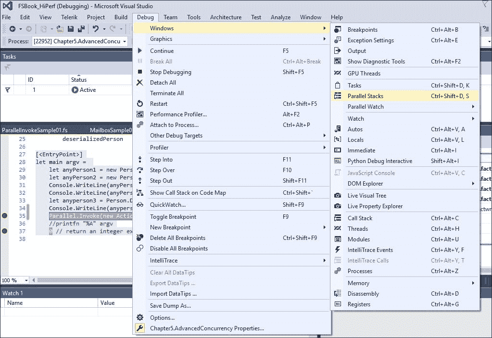

如截图所示，**任务**窗口已经显示了当前任务的活动任务。

按`F11`键进入下一个函数。在第一轮中，它将通过`factwrap`并创建一个新线程：

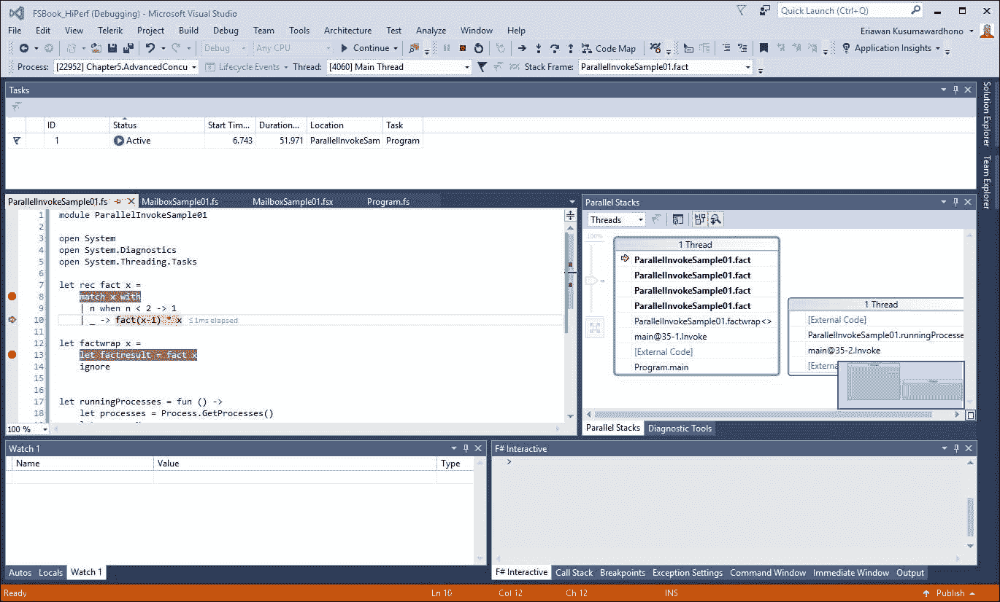

由于`factwrap`正在调用`fact`，因此对于传递给`factwrap`的数字或参数，也会调试`fact`函数体，在这种情况下是 5，即 5 的阶乘。

这在**并行堆栈**中表现得很好：

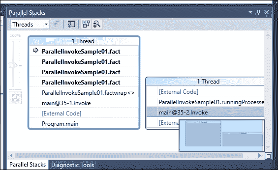

在前面的屏幕截图中，我们可以清楚地看到它创建了一个新线程来持有`runningProcesses`代理。在线程池方面，所有这些线程都在一个线程池中，因此它们在运行`Parallel.Invoke`代码的线程的同一上下文中高效执行。

当我们进一步进入`fact`函数并离开递归时，我们还可以看到**并行堆栈**显示与匹配的调试断点相关的调用堆栈：

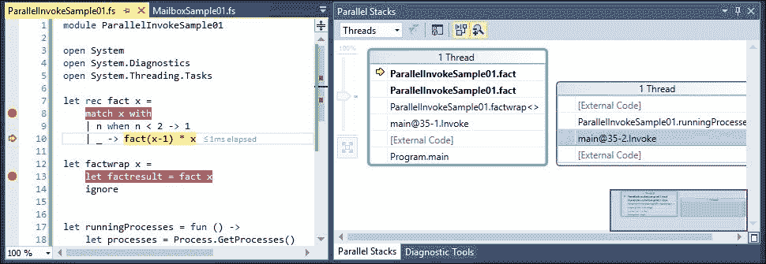

在执行完`Parallel.Invoke`后，当前线程将返回到我们的`main`入口点。

关于在 Visual Studio 中使用并行调试（包括多线程调试）的更多信息，请参阅以下 MSDN 库页面：

[`msdn.microsoft.com/en-us/library/ms164746.aspx`](https://msdn.microsoft.com/en-us/library/ms164746.aspx)

关于**并行堆栈**的更多信息，请参阅以下 MSDN 库页面：

[`msdn.microsoft.com/en-us/library/dd998398.aspx`](https://msdn.microsoft.com/en-us/library/dd998398.aspx)

### 注意

Visual Studio 2015（通过 MS 帮助打开）中 Visual Studio 调试的当前离线文档未更新。它与在线 MSDN 库中 Visual Studio 的最新文档不同步。强烈建议始终先安装并更新离线 MSDN 库，但我们也应检查在线 MSDN 库的最新更新。

此外，由于我们已经知道 F#文档是开源的，因此我们也应始终检查在线文档的最新更新。从本章开始，将强调更多在线 MSDN 库的资源。

## 数据并行概述

.NET TPL 中的数据并行实际上是一组函数/方法库，它们在特定的数据操作上具有并行操作，例如枚举数据。它也可以被视为声明性的，因为它与 F# 如何迭代集合（使用 F# `for` 循环）的现有语言特性非常紧密相关。

MSDN 库中也明确指出，这种数据并行性仅适用于集合（如 IEnumerable）和数组，不适用于封装要并行化的操作，如任务并行性。数据并行性的主要重点是并行化 `for` 循环，无论是带有计数器的 `for` 还是 `foreach`，以直接遍历集合的元素。

在 F# 中，`foreach` 由 for .. in 构造表示，在概念和上下文中与 C#/VB 中的 `foreach` 相同，尽管在语义上有所不同。

以下方法执行数据并行操作：

+   `Parallel.For`，用于具有计数器的循环（它可能在增加时充当起始值），与基本的 `for` 相比，这个 `For` 循环不按顺序运行

+   `Parallel.ForEach`，在迭代元素时实现并行 `foreach`

`Parallel.For` 与 F# 中具有预定义的起始和停止值的 `for` 循环相关联，该循环用于循环计数器。

例如，考虑以下代码片段：

```cs
open System 
open System.Threading.Tasks 

let function1() = 
  for i = 1 to 10 do 
    Console.WriteLine("current datetime is" + DateTime.Now.ToString()) 
  printfn "" 

Parallel.For(1,10, fun(iteration) -> 
    Console.WriteLine("Iteration: " + iteration.ToString() + " current datetime: " + DateTime.Now.ToString()) 
    printfn "" 
    ) 

```

`function1` 将按顺序从 `1` 到 `10` 运行，并且它总是同步运行，这意味着必须先完成第一次迭代，然后才能运行下一次迭代。其余的迭代仍然需要等待；因此，这是故意的，并且很明显，第一次迭代的执行行为会阻塞后续的迭代。

`parallelFunction1` 是 `function1` 的并行版本。在函数体中，我们通过将计数器传递到输出显示来添加当前迭代的显示。

我们应该将代码作为 F# 脚本，在 Visual Studio **F# Interactive** 中运行脚本，并立即看到结果：

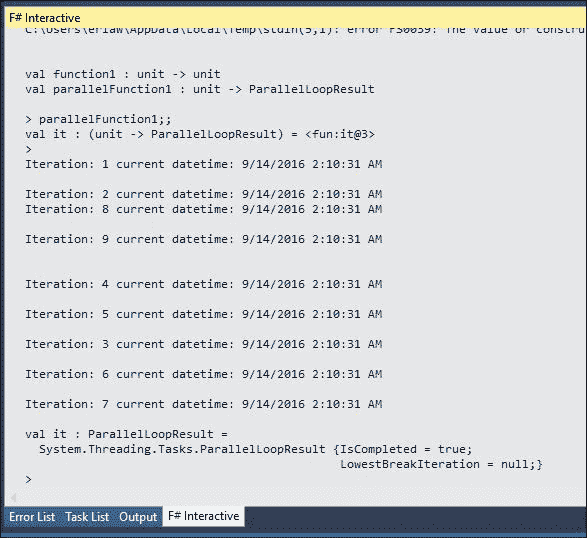

在这里，我们可以看到没有保证循环将按顺序执行的证据。这是故意的，因为在并行处理中，我们并不关心执行顺序，正如我们在第四章中探讨的，*在 F# 4 中引入并发支持*，在 第四章，*F# 并发简介*。

现在，我们来探讨 F# 的 `for .. in` 循环和 `Parallel.ForEach` 方法的并行对。

我们现在从简单的 F# 使用 `for .. in` 循环迭代集合的示例开始，并将其并行化：

```cs
let seq1 = seq { for i in 1 .. 10 -> (i, i*i) } 
for (a, asqr) in seq1 do 
  printfn "%d squared is %d" a asqr 

Parallel.ForEach(seq1, fun((a,asqr)) -> 
  printfn "%d squared is %d" a asqr 
    ) 

```

再次，在 **F# Interactive** 中运行代码，我们可以比较输出：

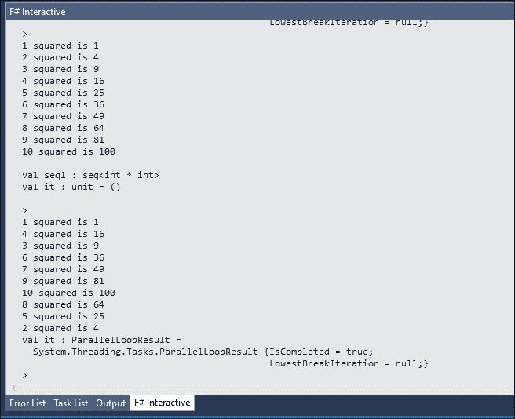

现在，我们在 F#中有了.NET TPL 的数据并行性的互操作性。只要我们尽可能保持过程简单（没有共享状态），我们就可以成功实现并行性，并得到高度可预测的结果。

这也是一个通过尽可能减少副作用来最小化不可预测性的好例子。我们仍然可以使用共享状态，但那时，我们必须实现锁定，这将降低性能。这种性能降低的背景原因与在异步工作流中使用锁是相同的。

## 并行编程中的常见潜在陷阱

在.NET 中，并行编程存在一些常见的陷阱，我们应该注意这些。

我们知道应该避免以下情况：

+   对象的可变状态中的副作用。如果使用可变状态，必须实现锁来确保对象状态的并发性。这也适用于共享状态，因为任何共享状态也是可变的。

+   在可能抛出异常的可能性中存在副作用。如果我们没有捕获任何可能的异常（特别是与阻塞操作（如 I/O）相关的异常），任何在并行过程中抛出的异常都将取消整个并行过程的管道。

+   COM 对象，因为我们处理具有不同公寓模型的对象时必须小心，例如 COM 对象。

+   将 UI 线程与来自非 UI 线程的当前线程混合的副作用。在 WPF 中，可以通过使用 WPF 分发器来减轻这种影响。

现在，让我们尝试在下一节中处理可变状态。

### 可变状态的概述

如果我们真的想要一个可变状态，我们可以将其封装在`Monitor.Enter`和`Monitor.Exit`循环对中。

例如，我们可以通过以下简化的示例来编写代码，展示 C#/VB 中锁的实际实现方式：

```cs
open System.Threading 

let lock (lockobj:obj) anyfunction = 
  Monitor.Enter lockobj 
  try 
    anyfunction() 
  finally 
    // the code in the finally block will be executed after anyfunction is completely finishing execution.  
    // Therefore we can exit the monitor gracefully. 
    Monitor.Exit lockobj 

```

这种监视状态是.NET 将监视状态的对象命名为`Monitor`的原因。

我们不会进一步描述`Monitor`对象，因为`Monitor`是对象锁定机制的一部分，在许多 F#并发实现的场景中并不推荐。我们将只关注 F#并发的功能方面，而不是处理非功能性编程风格代码中常见的可变状态。有关.NET Monitor 的更多信息，请访问以下链接：

[`msdn.microsoft.com/en-us/library/system.threading.monitor(v=vs.110).aspx`](https://msdn.microsoft.com/en-us/library/system.threading.monitor(v=vs.110).aspx)

.NET BCL 中还有一个类允许在简单操作中混合可变状态，例如在并行循环中执行增加和减少操作。该类是`System.Threading.Interlocked`，它也在 F#内部用于实现`Control.Async`中的异步工作流和`FSharpAsyncBuilder`类中的构建器。

使用`Interlocked`的实现并不常见，我们应该小心。这就是为什么它有有限种类的允许操作。我们可以在 F# `Async.Parallel`代码的内部实现中看到利用`Interlocked`的一个很好的示例实现：

```cs
       static member Parallel (l: seq<Async<'T>>) = 
            unprotectedPrimitive (fun args -> 
                let tasks,result =  
                    try  
                        Seq.toArray l, None   // manually protect eval of seq 
                    with exn ->  
                        let edi = ExceptionDispatchInfo.RestoreOrCapture(exn) 
                        null, Some(errorT args edi) 

                match result with 
                | Some r -> r 
                | None -> 
                if tasks.Length = 0 then args.cont [| |] else  // must not be in a 'protect' if we call cont explicitly; if cont throws, it should unwind the stack, preserving Dev10 behavior 
                protectedPrimitiveCore args (fun args -> 
                    let ({ aux = aux } as args) = delimitSyncContext args  // manually resync 
                    let count = ref tasks.Length 
                    let firstExn = ref None 
                    let results = Array.zeroCreate tasks.Length 
                    // Attept to cancel the individual operations if an exception happens on any of the other threads 
                    let innerCTS = new LinkedSubSource(aux.token) 
                    let trampolineHolder = aux.trampolineHolder 

                    let finishTask(remaining) =  
                        if (remaining = 0) then  
                            innerCTS.Dispose() 
                            match (!firstExn) with  
                            | None -> trampolineHolder.Protect(fun () -> args.cont results) 
                            | Some (Choice1Of2 exn) -> trampolineHolder.Protect(fun () -> aux.econt exn) 
                            | Some (Choice2Of2 cexn) -> trampolineHolder.Protect(fun () -> aux.ccont cexn) 
                        else 
                            FakeUnit 

                    // recordSuccess and recordFailure between them decrement count to 0 and  
                    // as soon as 0 is reached dispose innerCancellationSource 

                    let recordSuccess i res =  
                        results.[i] <- res; 
                        finishTask(Interlocked.Decrement count)  

                    let recordFailure exn =  
                        // capture first exception and then decrement the counter to avoid race when 
                        // - thread 1 decremented counter and preempted by the scheduler 
                        // - thread 2 decremented counter and called finishTask 
                        // since exception is not yet captured - finishtask will fall into success branch 
                        match Interlocked.CompareExchange(firstExn, Some exn, None) with 
                        | None ->  
                            // signal cancellation before decrementing the counter - this guarantees that no other thread can sneak to finishTask and dispose innerCTS 
                            // NOTE: Cancel may introduce reentrancy - i.e. when handler registered for the cancellation token invokes cancel continuation that will call 'recordFailure' 
                            // to correctly handle this we need to return decremented value, not the current value of 'count' otherwise we may invoke finishTask with value '0' several times 
                            innerCTS.Cancel() 
                        | _ -> () 
                        finishTask(Interlocked.Decrement count) 

```

在此代码中，使用`Interlocked.Decrement`来维护或跟踪并行化异步工作流计数的状态。代码流畅，因为 F#有自己的并行异步操作，而不依赖于.NET TPL 的`Parallel`类。

在 MSDN 库中，有关并行编程常见陷阱的更多方面，可在以下页面找到：

[`msdn.microsoft.com/en-us/library/dd997392(v=vs.110).aspx`](https://msdn.microsoft.com/en-us/library/dd997392(v=vs.110).aspx)

在这些要点中，我们应关注 MSDN 库文章中的以下示例，除了我们探索的许多异步和并行化的示例：

+   避免过度并行化。通过使用并行循环，你需要承担分割源集合和同步工作线程的开销成本。并行化的好处还受到计算机处理器和核心数量的限制。在单个处理器上运行多个计算密集型线程并不能获得速度提升。因此，你必须小心不要过度并行化循环。此外，过多的并行化会增加任务调度器的开销，可能会导致线程亲和力上的竞争条件。此外，任务调度器上的开销会降低运行应用程序的响应性。

+   避免调用非线程安全的方法！这一点非常重要，因为从并行循环中写入非线程安全的实例方法可能会导致数据损坏，这可能在你的程序中不被检测到。它也可能导致异常，例如，多个并行线程调用`FileStream.WriteByte`。这一点与避免混合 I/O 操作密切相关。还需要意识到，`Stream`、`File`和`System.Web`类中的几乎所有操作都不是线程安全的。

+   避免在任何并行操作过程中更改线程亲和力。这可能会产生异常，而不仅仅是不可预测的结果/行为。

过度并行化最常见的情况发生在嵌套循环中。在大多数情况下，最好只并行化外部循环，除非以下条件之一适用：

+   内循环已知非常长。你正在对每个订单执行*昂贵的计算*。在这个上下文中，昂贵的计算意味着有复杂的计算，将消耗大量的 CPU 周期，并且在并行计算内部进行并行计算或*复杂的嵌套并行化*。

+   已知目标系统有足够的处理器来处理由并行化操作产生的线程数量。如果并行化的程度过高，尤其是当并行化的数量超过 CPU 核心数时，将迫使其他进程无限期地等待，这种等待也将导致死锁条件。

我们还可以通过从以下官方下载链接下载微软的关于 .NET 并行性的白皮书来进一步参考 .NET 并行性：*Patterns for Parallel Programming: Understanding and Applying Parallel Patterns with the .NET Framework 4*：

[`www.microsoft.com/en-us/download/details.aspx?id=19222`](https://www.microsoft.com/en-us/download/details.aspx?id=19222)

# 摘要

我们已经探讨了 F# 和 .NET TPL 的高级并发支持。我们也对如何处理副作用以及在不同情况和场景中使用异步编程有了足够的了解。

在实施 F# 中利用并发最佳实践的主要结论是，对于所有并发需求来说，并没有一劳永逸的解决方案，这包括避免在检查可能导致 .NET TPL 并行实现性能下降的案例后，认为并行化代码总是比非并行代码运行得更快。这些警告案例不仅适用于 F#，也适用于 VB/C#。

我们已经理解了异步和并行性。我们将利用这些知识来优化类型提供者，并避免在第六章 *优化类型提供者* 中实现它们的陷阱。
