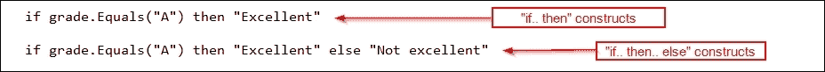
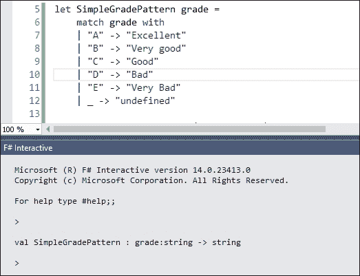
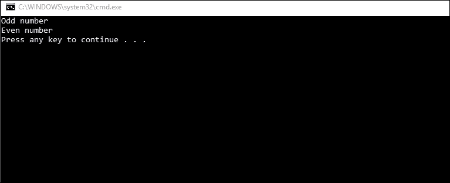
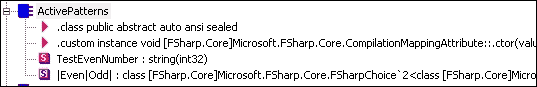
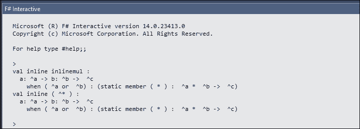
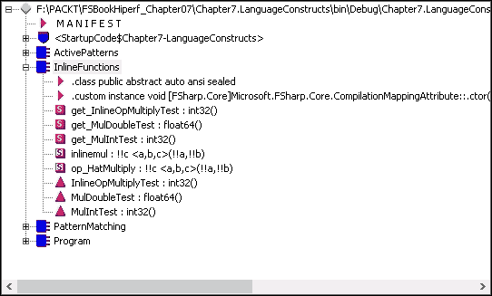
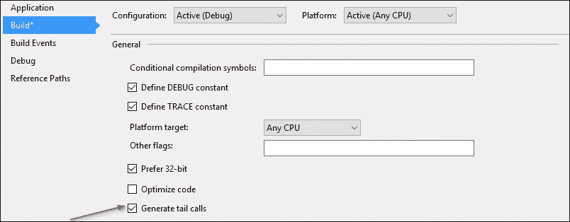
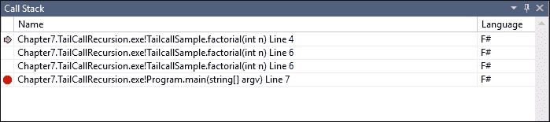
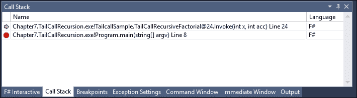

# 第七章。语言特性和结构优化

在我们编码时，常常会陷入优化细节中。我们经常必须专注于处理并发、性能/基准测量，以及分析其他元素，如内存消耗。当然，这种对并发和性能/基准测量的关注是我们代码中的一个重要且庞大的元素，尤其是并发。这个主题在前两章中已经进行了详细描述：第四章，*F# 并发简介*和第五章，*F# 高级并发支持*。

在 F# 中，还有其他元素可以被识别为优化机会，包括在代码中常用的语言结构以及如计算工作流等高级语言结构。语言结构，包括语义和语法的组合，同样至关重要，因为我们编码时直接与之打交道。本章致力于识别语言特性中的性能优化，重点关注语言结构。

许多 F# 语言结构大多是微不足道的，并且它们已经得到了优化，除非这些结构由于实现细节的微妙性和正确性（即具有可预测的结果）而经常需要特别关注。像异步工作流、`head::tail` 的列表推导和列表拼接这样的微不足道结构已经得到了完全优化，并且通常，为了进一步优化，我们必须与其他 .NET 库（如 .NET TPL）进行互操作，结合 F# 异步工作流，或者进一步深入研究 F 列表的源代码。

当我们使用 F# 集合时，最好优化使用方式，而不是像我们在第三章，*优化数据结构*中讨论的那样，优化内部语义实现（内部源代码）。

本章专注于微妙的语言结构。我们现在将讨论这些主题，以优化语言特性和结构：

+   F# 语言特性和结构优化概述

+   优化常见的 F# 语言结构

+   优化内联函数

+   识别递归结构中的尾调用

# 语言特性和结构优化概述

作为一种函数式编程语言，F# 拥有很多语言特性。这些语言特性也定义了 F# 本身的独特特性，与其他语言如 C#/VB.NET 区别开来。

例如，以下是与函数式编程相关的 F# 语言特性：

+   模式匹配

+   活跃模式

+   类型推断（包括类型推断泛化）

+   内联函数（也称为函数内联）

+   区分联合

区分联合是一种语言特性，它也是 F#实现中独特的类型，尽管它与 C#/VB.NET 兼容。区分联合的最佳实践已在第三章中讨论，即*优化数据结构*。

通过简单的定义，语言特性包含以下元素：

+   语法，关键字和用法

+   构造，语法和上下文使用的整体统一，尤其是在其他语言元素中使用时

+   语义，具有构造的代码的实际上下文和意义

我们都知道什么是语法。但构造相当微妙。术语*构造*来源于这样的事实，即具有标识符和参数的语法形成了一个与语法高度相关的复合代码。

例如，让我们来检查`if`语法：

```cs
if boolean-expression then expression1 [ else expression2 ] 

```

当我们描述语法时，是通过使用抽象概念如`布尔表达式`或只是一个表达式来进行的。我们已为您突出显示关键字：`if`、`then`、`else`。

在我们使用`if`之前，我们必须理解`if`的语义。

以下信息是`if`的语义：

+   在`布尔表达式`中，表达式必须是一个始终评估为真或假的表达式，因为这也是布尔类型的本质。它可以是布尔本身的直接值，如 true 或 false，也可以是符号变量或函数，其评估结果为布尔值。

+   `then`后面的表达式意味着评估并执行`then`关键字后面的表达式。

+   `else`关键字意味着如果`布尔表达式`评估为假，则可选地评估和执行表达式。

作为示例的`if`构造相当简单，我们在这里只给出`if`的一个示例用法：

```cs
if grade.Equals("A") then "Excellent" 

```

示例代码表示`if`构造使用`if..then`构造，而不是完整的`if..then..else`构造，如图所示：



因此，当我们讨论构造时，通常用示例代码来表达它，而不是使用语法使用和描述的抽象形式。

如果我们在 MSDN 库中查找并检查 F#的文档，其语法使用是通过常见的**巴科斯-诺尔范式**（**BNF**）符号来定义的。这种 BNF 符号是用来表示语法定义和使用的符号，最初来源于计算机科学学科领域的编译理论。

BNF 有简化和完整两种表示形式，但为了简单起见，避免混淆，我们将使用简化的 BNF。简化形式也常用于 MSDN 库中描述编程语言语法，包括 F#、C#、VB、C++、JavaScript 等。

### 注意

一些编程书籍使用完整的 BNF 符号来描述语法。这也是有效的，但同时也对非计算机科学背景的人来说相当混乱。在这本书中，我们将使用 BNF 符号的最简单形式来描述语法，而不是完整的 BNF。

使用尖括号 `[ .. ]` 来表示可选语法也是很常见的。在我们的 `if` 语法上下文中，带有表达式的 `else` 关键字也是可选的。

有关 BNF 符号概述、其变体和语法语法的更多信息，请参阅这篇全面的文章：

[`matt.might.net/articles/grammars-bnf-ebnf/`](http://matt.might.net/articles/grammars-bnf-ebnf/)

# 优化常见的 F# 语言结构

当我们在优化 F# 语言结构时，开始优化的最佳方式是识别最常用的 F# 语言结构。这相当微妙，但很重要，因为常用的 F# 语言结构更容易理解和首先学习，而不是很少使用或更高级的结构。然而，我们应该关注那些经常有微妙性能影响和推荐正确性以强制可预测行为的结构。

在运行代码的上下文中，可预测的行为意味着在整个代码流程中都有可预测的结果，包括处理分支、切换执行上下文（如异步和并行）以及处理异常时的意识。

让我们来看看最常用的 F# 结构：活跃模式、模式匹配和 F# 中的委托或函数 lambda。

## F# 委托与 .NET 委托互操作性的最佳实践

如我们所见，F# 中的委托非常实用且独特，但同时也保持了与 .NET 委托的高度兼容性。

实际上，F# 委托的内部和实际实现是从 .NET Delegate 类派生出来的。这一点很重要，因为 F# 必须与并维护底层的 .NET CLR 兼容，并在更高层上与定义在 `mscorlib.dll` 和 `System.dll` 集合中的 .NET 基类库 (BCL) 兼容。

对于在 F# 中实现的普通函数，未来应该规划其是否将与 C#/VB 兼容，或者只是可供外部 F# 编译的汇编调用，或者它仅用于其自身的编译汇编。

F# 方面的最佳实践规则与相关场景包括：

1.  对于计划在其自身汇编中调用的函数，且没有直接使用或引用 .NET 委托（例如 LINQ 表达式树），始终使用 F# 委托。这比总是与 .NET 委托混合更快，尽管函数总是在汇编范围内使用。

1.  对于一个计划从外部实现整个 F# 编译代码的汇编程序调用（例如，LINQ 表达式树）且没有直接使用或引用 .NET 代表（例如）的功能，始终使用 F# 代表。这仍然比 .NET 代表更快。

1.  对于一个计划从任何 .NET 代表调用且没有直接使用或引用 .NET 代表（例如，LINQ 表达式树）的功能，必须特别小心，例如在 .NET 代表调用 F# 代表时的互操作性。

1.  对于一个计划从任何 .NET 代表调用且也调用 .NET 代表的功能，使用 .NET 代表模型而不是 F# 代表。这种 .NET 代表的使用略慢于 F# 代表，但函数多次从 .NET 代表调用时的整体性能得到了补偿，同时实现了与 .NET 代表和其他托管语言（如 C#/VB.NET/托管 C++）的最高兼容性。

目前，除了上述规则之外，没有其他已知的代表互操作性场景。只要我们了解 F# 和其他托管语言的特性兼容性，我们总是可以保证有高度的预测性。这个兼容性的最佳示例是 lambda 函数功能。这个功能在 F# 和大多数其他托管语言（如 C#/VB 和 IronPython）上都是可用的。

不幸的是，托管 C++ 仅从 Visual Studio 2013 的发布开始支持语言 lambda 功能的完全兼容性。了解微软提供了关于在托管 C++ 上使用此功能的广泛文档是很好的。

有关 C++ 中 lambda 的更多信息，请访问：

[`msdn.microsoft.com/en-us/library/dd293608.aspx`](https://msdn.microsoft.com/en-us/library/dd293608.aspx)

然而，在进行与 .NET 代表的互操作性时，应避免以下陷阱：

1.  调用或混合 .NET 代表与正常的异步工作流。这将产生不可预测的行为，因为 .NET 代表最适合在 .NET Task 异步编程模型的 .NET Task 异步中。F# 有自己的异步性，无需使用与 .NET Task 异步相同的上下文切换模型。

1.  从正常的 .NET 方法调用实现异步工作流的 F# 代表/函数。这是可以的，只要 .NET 方法不被视为异步。但如果调用 .NET 方法是异步实现的，则总会发生不可预测的行为，并可能导致上下文切换中的竞争条件。

1.  *不要* 在 .NET 不安全方法中混合 F# 代表。除非我们必须对已知的 Windows API 有不安全实现，否则强烈建议避免这种做法。

让我们在下一节中真正完成这些代表的互操作性工作。

### 将 .NET 代表作为 F# 函数传递

让我们从 C# 开始传递 F# 函数，这适用于任何将从 C# 调用的函数的场景 4。

例如，假设我们实现一个函数来获取 `IEnumerable` 数据的行索引：

```cs
open System.Collections.Generic 

/// <summary>Get row index within a collection</summary> 
let GetRowIndex (datasource: IEnumerable<'t>) (functionToFind: 't -> bool) : int = 
    let paramcheck = datasource <> null 
    match paramcheck with 
    | true -> Seq.findIndex functionToFind datasource 
    | _ -> -1 

```

在我们的 C# 项目中，首先添加对实现 `GetRowIndex` 的程序集的引用。

然后，我们可以导入命名空间，并在 C# 中直接使用这个示例来调用 F# 函数：

```cs
using Microsoft.FSharp.Core; 
using System.Diagnostics; 

namespace Chapter7.DelegateInteropCSharp 
{ 
    class Program 
    { 
        static void Main(string[] args) 
        { 
            var proclist = Process.GetProcesses(); 
            int index_devenv = FuncInterop.GetRowIndex(proclist, FuncConvert.ToFSharpFunc((Process p) => p.ProcessName.Equals("explorer.exe"))); 
        } 
    } 
} 

```

前面的代码将获取我们机器上所有正在运行的过程，然后搜索名为 `explorer.exe` 的进程。

当我们传递 C#/VB 委托时，它实际上是一个 .NET 委托。但是 lambda 表达式将被评估为 F# 有不同的 lambda 表达式；因此，在传递之前，我们必须将我们的 lambda 表达式参数转换为 `FSharpFunc`（F# lambda）。

`FuncConvert` 可在 `FSharp.Core` 集合中找到，位于 `Microsoft.FSharp.Core.FuncConvert` 命名空间下。这个辅助类有足够的转换方法，支持所有形式的 .NET `Func`，如 `FuncConvert` 的签名符号所示：

```cs
[<AbstractClass>] 
[<Sealed>] 
type FuncConvert = 
class 
static member FuncFromTupled : ('T1 * 'T2 * 'T3 * 'T4 * 'T5 -> 'U) -> 'T1 -> 'T2 -> 'T3 -> 'T4 -> 'T5 -> 'U 
static member FuncFromTupled : ('T1 * 'T2 * 'T3 * 'T4 -> 'U) -> 'T1 -> 'T2 -> 'T3 -> 'T4 -> 'U 
static member FuncFromTupled : ('T1 * 'T2 * 'T3 -> 'U) -> 'T1 -> 'T2 -> 'T3 -> 'U 
static member FuncFromTupled : ('T1 * 'T2 -> 'U) -> 'T1 -> 'T2 -> 'U 
static member ToFSharpFunc : Converter<'T,'U> -> 'T -> 'U 
static member ToFSharpFunc : Action<'T> -> 'T -> unit 
end 

```

有关 F# `FuncConvert` 的更多信息，请访问 MSDN：

[`msdn.microsoft.com/en-us/visualfsharpdocs/conceptual/core.funcconvert-class-%5Bfsharp%5D`](https://msdn.microsoft.com/en-us/visualfsharpdocs/conceptual/core.funcconvert-class-%5Bfsharp%5D)

### 在 F# 中调用 .NET 委托

现在，关于在我们的 F# 代码中调用常见的 .NET 委托，如 `Func<'T,'U>`，又是怎样的呢？

它非常简单直接，而且比传递一个 .NET 委托作为 F# 委托还要简单。

例如，我们可以调用 LINQ 并传递委托参数：

```cs
open System.Collections.Generic 
open System.Linq 
open System.Diagnostics 
open System 

let GetLargeProcesses() = 
    Process.GetProcesses().Where(new Func<Process,bool>(fun proc -> proc.WorkingSet64 > (8L * 1024L * 1024L))).ToList() 

```

在前面的代码中，首先实例化了 `Func` 委托，然后构造函数填充了参数的数量和正确的类型注解，无论是否为泛型。

## 模式匹配和主动模式的最佳实践

模式匹配是使用最广泛的语言特性/结构之一。它既是一个语言特性，也是一个具有语法的语言结构。

模式匹配的起始语法如下：

```cs
match expression with 
| pattern [ when condition ] -> result-expression 

```

关键字 `match` 表示将表达式与 `match` 关键字下方的模式进行匹配。为了使模式匹配，要求模式与 `match` 声明具有相同的缩进。

并非所有类型的函数式语言模式都受支持，这已经在 F# 4.0 语言规范中定义。F# 4.0 预定义/支持的模式匹配的完整规范在以下位置有文档记录：

[`docs.microsoft.com/en-us/dotnet/articles/fsharp/language-reference/pattern-matching`](https://docs.microsoft.com/en-us/dotnet/articles/fsharp/language-reference/pattern-matching)

最容易使用的模式是常量模式。常量值意味着只要模式一致地定义所有模式并使用相同的常量类型，表达式就会被推断为常量模式的类型。

例如，让我们编写一个代码来将 *ABC* 等级转换为评语报告。使用模式匹配，这是代码：

```cs
let SimpleGradePattern grade = 
    match grade with 
    | "A" -> "Excellent" 
    | "B" -> "Very good" 
    | "C" -> "Good" 
    | "D" -> "Bad" 
    | "E" -> "Very Bad" 
    | _ -> "undefined" 

```

等级参数被推断为常量模式的最常用类型，类型为字符串。这种模式匹配的使用很常见，并且它也比使用不同类型的常量更容易理解，更容易推理。这些常见的常量模式匹配用法也更快地编译，因为用作常量值的类型。

要测试等级参数的类型和返回类型，我们可以使用 F# 交互式环境。只需突出显示 `SimpleGradePattern` 的代码，然后按 *Alt* + *Enter*。然后类型将被推断为 `string -> string`，如下面的截图所示：



这个推断类型是类型推断以一致的方式流畅流动的证明，如使用字符串常量的使用所示。在最后一个模式中使用 `_` 指定我们应该注意其他未提及的模式，无论等级参数的内容如何。省略此操作将导致编译错误，因为 F# 编译器始终检查模式匹配中所有可能的情况，并要求处理模式匹配中所有可能的情况。

### 比较常量模式匹配与 `if` 构造

一些开发者，尤其是在处理模式匹配时，总是将模式匹配与类似常见的语言构造 `if` 构造进行比较。

F# 也支持 `if` 条件构造。它有一个额外的语法糖，即 `elif` 关键字，用于定义 `else` 立即跟在 `if` 构造之后。这个 `elif` 关键字与 `else if` 语法相同。

在非函数式编程语言中，`if` 的使用很常见，尤其是在像 C#/VB.NET/C++ 这样的面向对象编程语言中，因为它隐式地强制执行通常在面向对象编程语言中找到的命令式。 

F# 中的 `if` 语法定义如下：

```cs
if boolean-expression then expression1 [ else expression2 ] 

```

以下解释了 `if` 构造的语法和语义：

+   关键字 `if` 和 `then` 是必需的，因为它们定义了要评估的条件以及条件评估为真时要执行的操作。

+   `boolean-expression` 表示该表达式是一个将结果为布尔值的表达式，要么为真，要么为假。这是必需的，并且 `boolean-expression` 必须符合 F# 语言规范中的 `boolean-expression`。

+   `else` 构造是可选的，并且不必在同一行。

F# `if` 规范的官方文档可在以下位置找到：

[`docs.microsoft.com/en-us/dotnet/articles/fsharp/language-reference/conditional-expressions-if-then-else`](https://docs.microsoft.com/en-us/dotnet/articles/fsharp/language-reference/conditional-expressions-if-then-else).

现在，让我们回到我们的等级模式。我们现在将使用 `if` 而不是使用模式匹配来转换我们的等级。

转换我们的成绩的代码必须写得很好，以捕获`SimpleGradePattern`的所有语义。使用`if`编写代码有很多种方式，但我们将利用 F#中的`elif`。这是代码：

```cs
let SimpleGradeNoPattern (grade:String) = 
    if grade.Equals("A") then "Excellent" 
    elif grade.Equals("B") then "Very Good" 
    elif grade.Equals("C") then "Good" 
    elif grade.Equals("D") then "Bad" 
    elif grade.Equals("E") then "Very Bad" 
    else "undefined" 

```

为了使比较更有趣，让我们添加更多函数来测试和抽样这些结构，比较`if`与模式匹配。

首先，我们将使用来自.NET BCL 的`System.Diagnostics`中的`Stopwatch`对象，首先导入命名空间，同时使用`System`命名空间：

```cs
open System 
open System.Diagnostics 

```

现在，我们将编写一个函数来测试`SimpleGradePattern`和`SimpleGradeNoPattern`的单次运行：

```cs
let GradeBenchmarkTest() = 
    let mutable swtimer = new Stopwatch() 
    swtimer.Reset()  
    swtimer.Start() 
    for i = 1 to 5000000 do 
        SimpleGradePattern "B" |> ignore 
    swtimer.Stop() 
    let timerSimpleGradePattern = swtimer.Elapsed 
    swtimer.Reset() 
    swtimer.Start() 
    for i = 1 to 5000000 do 
        SimpleGradeNoPattern "B" |> ignore 
    swtimer.Stop() 
    let timerSimpleGradeNoPattern = swtimer.Elapsed 
    //Console.WriteLine("Elapsed SimpleGradePattern "B" =" + timerSimpleGradePattern.Milliseconds.ToString()+" ms") |> ignore 
    //Console.WriteLine("Elapsed SimpleGradeNoPattern "B" =" + timerSimpleGradeNoPattern.Milliseconds.ToString()+" ms") |> ignore 
    new Tuple<Int32,Int32>(timerSimpleGradePattern.Milliseconds,timerSimpleGradeNoPattern.Milliseconds) 

```

上述代码具有以下显著的语义和流程元素：

+   停表`swtimer`的使用是可变的。这很重要，因为`swtimer`将在我们的`GradeBenchmarkTest`函数的作用域内被多次使用和更改。

+   停表每次停止并再次使用时都需要重置，因为我们需要确保初始开始时的时间跨度结果重置为 0。

+   停表的结果将在停止后可用，并存储在`Elapsed`属性中，类型为`TimeSpan`。

+   使用`for..to`循环进行`5000000`次迭代的`5000000`。迭代次数很重要，因为今天处理器的速度如此之快，大多数抽样都以毫秒结束。少于 1,000,000 次的抽样将产生少于 10 毫秒，这将很难区分模式匹配和`if`的使用。

+   我们使用相同的`B`参数来确保代码在语义上评估为相同（从参数和结果的角度来看）。

+   我们将毫秒结果作为`Tuple`返回，它包含两个字段以包含`timerSimpleGradePattern`和`timerSimpleGradeNoPattern`的结果。选择直接使用.NET `Tuple`而不是 F# `Tuple`，因为这将确保返回的结果可以很容易地被调用函数使用。

`Elapsed`属性使用`TimeSpan`，因为它用于存储跨越的时间段。这很重要，因为`TimeSpan`的分辨率可以从小时到毫秒。

更多关于`TimeSpan`的信息，请参阅以下页面：

[`msdn.microsoft.com/en-us/library/system.timespan(v=vs.110).aspx`](https://msdn.microsoft.com/en-us/library/system.timespan(v=vs.110).aspx)

现在，我们需要进一步抽样以获取常数模式匹配和`if`使用的平均执行时间。为了简化计算平均值，我们将在函数参数定义的频率值内调用`GradeBenchmarkTest`。

下面的代码测试了基准的统计抽样：

```cs
let GradeBenchmarkSamplingTest (freq:Int32) : unit = 
    let mutable TotalPatternMatch : Int32 = 0 
    let mutable TotalNoPatternMatch : Int32 = 0 
    for i = 1 to freq do 
        //Console.WriteLine("Sampling "+i.ToString()+" of "+freq.ToString()) 
        let result = GradeBenchmarkTest() 
        TotalPatternMatch <- TotalPatternMatch + result.Item1 
        TotalNoPatternMatch <- TotalNoPatternMatch + result.Item2 
    let AveragePatternMatch = TotalPatternMatch / freq 
    let AverageNoPatternMatch = TotalNoPatternMatch / freq 
    Console.WriteLine("Average Pattern match result for "+freq.ToString()+" times = "+AveragePatternMatch.ToString()+"ms") 
    Console.WriteLine("Average No Pattern match result for "+freq.ToString()+" times = "+AverageNoPatternMatch.ToString()+"ms") 
    () 

```

让我们通过将基准测试通过`GradeBenchmarkSamplingTest`以足够高的频率抽样来运行它：

```cs
[<EntryPoint>] 
let main argv =  
    //printfn "%A" argv 
    PatternMatching.SimpleGradePattern "B" |> ignore 
    Console.WriteLine("Pattern Matching test") 
    PatternMatching.GradeBenchmarkSamplingTest 30 
    0 // return an integer exit code 

```

为了最小化调试时的摩擦，可以通过按*Ctrl* + *F5*来运行不带调试，这是其中一个示例显示：


在我的机器上，在 core i7 第四代 16 GB RAM 的配置下，`SimpleGradePattern`函数（具有常量模式匹配）仅以微弱的优势优于`SimpleGradeNoPattern`的结果：

| `Sampling` | `SimpleGradePattern` | `SimpleGradeNoPattern` |
| --- | --- | --- |
| 1 | 96 ms | 97 ms |
| 2 | 97 ms | 97 ms |
| 3 | 98 ms | 99 ms |
| 4 | 96 ms | 98 ms |
| 5 | 97 ms | 100 ms |
| 6 | 96 ms | 99 ms |
| 7 | 97 ms | 100 ms |

在您的机器上的结果可能会有所不同，但这个结果高度依赖于您的机器规格，包括 CPU 和 RAM。

为了成功执行和采样时间敏感的基准测试，强烈建议满足以下先决条件：

1.  Windows 更新已被关闭。在 Windows 10 中，最好的做法是断开所有网络连接，因为 Windows 10 会始终尝试在连接到任何互联网/网络时更新。

1.  我们应该始终在不调试的情况下运行基准测试代码。这将提供更准确的结果，因为 Visual Studio 调试器不会被加载，执行速度会更快。

1.  关闭所有 Windows 通知。当您在后台运行许多通知时，会有开销，这可能会影响系统的一个或两个核心。

平均而言，`SimpleGradePattern`比`SimpleGradeNoPattern`快 1 到 3 毫秒。如果您再次运行，结果可能会有所不同，但在总体条件下，使用模式匹配比使用`if`更好。要了解原因，我们将更深入地研究生成的 IL。

让我们深入了解`SimpleGradePattern`的 IL：

```cs
.method public static string  SimpleGradePattern(string grade) cil managed 
{ 
  // Code size       116 (0x74) 
  .maxstack  4 
  .locals init ([0] string V_0) 
  IL_0000:  nop 
  IL_0001:  ldarg.0 
  IL_0002:  stloc.0 
  IL_0003:  ldloc.0 
  IL_0004:  ldstr      "A" 
  IL_0009:  call       bool [mscorlib]System.String::Equals(string, 
                                                            string) 
  IL_000e:  brfalse.s  IL_0012 
  IL_0010:  br.s       IL_0050 
  IL_0012:  ldloc.0 
  IL_0013:  ldstr      "B" 
  IL_0018:  call       bool [mscorlib]System.String::Equals(string, 
                                                            string) 
  IL_001d:  brfalse.s  IL_0021 
  IL_001f:  br.s       IL_0056 
  IL_0021:  ldloc.0 
  IL_0022:  ldstr      "C" 
  IL_0027:  call       bool [mscorlib]System.String::Equals(string, 
                                                            string) 
  IL_002c:  brfalse.s  IL_0030 
  IL_002e:  br.s       IL_005c 
  IL_0030:  ldloc.0 
  IL_0031:  ldstr      "D" 
  IL_0036:  call       bool [mscorlib]System.String::Equals(string, 
                                                            string) 
  IL_003b:  brfalse.s  IL_003f 
  IL_003d:  br.s       IL_0062 
  IL_003f:  ldloc.0 
  IL_0040:  ldstr      "E" 
  IL_0045:  call       bool [mscorlib]System.String::Equals(string, 
                                                            string) 
  IL_004a:  brfalse.s  IL_004e 
  IL_004c:  br.s       IL_0068 
  IL_004e:  br.s       IL_006e 
  IL_0050:  ldstr      "Excellent" 
  IL_0055:  ret 
  IL_0056:  ldstr      "Very good" 
  IL_005b:  ret 
  IL_005c:  ldstr      "Good" 
  IL_0061:  ret 
  IL_0062:  ldstr      "Bad" 
  IL_0067:  ret 
  IL_0068:  ldstr      "Very Bad" 
  IL_006d:  ret 
  IL_006e:  ldstr      "undefined" 
  IL_0073:  ret 
} // end of method PatternMatching::SimpleGradePattern 

```

`SimpleGradePattern`中的 IL 代码分为两部分：第一部分处理条件，第二部分（在`IL_004e`行段的`br.s`之后）处理返回值作为`IL_004e`之前的分支目标。

让我们深入了解`SimpleGradeNoPattern`的 IL：

```cs
.method public static string  SimpleGradeNoPattern(string grade) cil managed 
{ 
  // Code size       122 (0x7a) 
  .maxstack  4 
  IL_0000:  nop 
  IL_0001:  ldarg.0 
  IL_0002:  ldstr      "A" 
  IL_0007:  callvirt   instance bool [mscorlib]System.String::Equals(string) 
  IL_000c:  brfalse.s  IL_0010 
  IL_000e:  br.s       IL_0012 
  IL_0010:  br.s       IL_0018 
  IL_0012:  ldstr      "Excellent" 
  IL_0017:  ret 
  IL_0018:  ldarg.0 
  IL_0019:  ldstr      "B" 
  IL_001e:  callvirt   instance bool [mscorlib]System.String::Equals(string) 
  IL_0023:  brfalse.s  IL_0027 
  IL_0025:  br.s       IL_0029 
  IL_0027:  br.s       IL_002f 
  IL_0029:  ldstr      "Very Good" 
  IL_002e:  ret 
  IL_002f:  ldarg.0 
  IL_0030:  ldstr      "C" 
  IL_0035:  callvirt   instance bool [mscorlib]System.String::Equals(string) 
  IL_003a:  brfalse.s  IL_003e 
  IL_003c:  br.s       IL_0040 
  IL_003e:  br.s       IL_0046 
  IL_0040:  ldstr      "Good" 
  IL_0045:  ret 
  IL_0046:  ldarg.0 
  IL_0047:  ldstr      "D" 
  IL_004c:  callvirt   instance bool [mscorlib]System.String::Equals(string) 
  IL_0051:  brfalse.s  IL_0055 
  IL_0053:  br.s       IL_0057 
  IL_0055:  br.s       IL_005d 
  IL_0057:  ldstr      "Bad" 
  IL_005c:  ret 
  IL_005d:  ldarg.0 
  IL_005e:  ldstr      "E" 
  IL_0063:  callvirt   instance bool [mscorlib]System.String::Equals(string) 
  IL_0068:  brfalse.s  IL_006c 
  IL_006a:  br.s       IL_006e 
  IL_006c:  br.s       IL_0074 
  IL_006e:  ldstr      "Very Bad" 
  IL_0073:  ret 
  IL_0074:  ldstr      "undefined" 
  IL_0079:  ret 
} // end of method PatternMatching::SimpleGradeNoPattern 

```

在读取`SimpleGradeNoPattern`的 IL 后，我们得出以下结论：

1.  `A`到`E`（包括`undefined`）的所有条件都存储在堆上。这是正常的，这也是字符串的本质，它是一个引用类型。使用`ldstr`指令指示存储在堆上。

1.  模式匹配结果中的所有模式都需要存储。使用`stloc`准备存储。这个 IL 指令将准备堆栈存储，然后所有`A`到`E`的条件结果（布尔结果）都存储在同一个堆栈上。在第一次初始化时，会有堆栈分配的开销，但通过调用`ldloc`在堆栈分配后加载值来补偿。

1.  在使用 `if` 的代码中，条件结果 `A` 到 `E` 被加载到堆上。这是必要的，因为 `if` 需要为每个 `if` 分配不同的位置，而在 `if` 的初始声明时分配堆会更高效，因为它可以避免栈分配的开销。然后，流程分支到下一组指令。

1.  两种代码中的字符串都是通过调用 `System.String.Equals()` 方法来评估的。然而，有趣的事实是 `SimpleGradePattern` 中使用 `call` 而不是 `callvirt`。这是微妙但不同的；`call` 用于调用 `String.Equals()` 的静态方法，而 `callvirt` 在调用 `String.Equals()` 之前需要实例化字符串。静态调用总是比方法实例调用执行得更快。

这个基准测试的狭窄结果清楚地显示并证明了使用常量模式匹配比 `if` 序列更快，尽管它显示了毫秒级的小量差异。

我们可以安全地得出结论，对于具有相同数据类型且易于评估的模式，使用模式匹配而不是 `if` 结构是常见的最佳实践。

如果使用的模式有很多，结果将更加明显，例如：

+   52 种扑克牌模式

+   一周中的 7 天

+   一年中的 12 个月

模式匹配的语义总是通过始终强制我们评估所有可能的输出结果来强制执行正确性。例如，在 `SimpleGradePattern` 中，可能有 `A` 到 `E` 之外的输入，我们可以将这些输入视为未定义或无效。如果我们不提供这些信息以满足外部预定义的条件，我们将有一个编译错误，并且代码即使在 F# 交互模式下也无法运行。

如果我们使用太多的模式进行匹配，那么代码的编译和执行速度会变慢，因为 F# 编译器会尝试解析使用的模式并搜索未使用/未识别的模式；然后，生成的 IL 代码将在分支上添加更多的开销，并且具有太多分支的分支效率不高，因为后续的条件总是在第一个条件之前被评估得更长。

以我们的 `SampleGradePattern` 示例代码为例，`E` 条件总是被处理为在 `A` 到 `D` 之后评估。因此，太多的模式（尤其是超过 10 个模式）将不会高效，并且后续的条件，尤其是接近末尾的模式，总是在之前的条件评估之后评估得更长。

为了减轻匹配许多模式导致的慢速执行问题，最好是重构它，然后我们可以使用以下之一：

1.  一个键值对的字典。键必须被当作唯一的候选键来处理，而值可以是任何与键相关的内容。这个值可以扩展为委托或 F# 函数，当搜索具有作为执行动作的值的键时执行。

1.  一系列数据类型为 `KeyValue` 对的列表，并且这个 F# 列表比 .NET 字典更高效，因为它将以链表的形式存储，默认具有不可变性，并且通过 `head::tail` 提供已知的递归支持。

### 注意

在撰写本书时，.NET 4.6.1 不支持内置的只读字典。虽然我们可以使用 Microsoft NuGet 的 `Immutable.Collections` 部分的只读集合，但由于不可变性的特性，最好使用 F# 列表，并且它比 .NET 列表作为链表更快地访问。它之所以更快，是因为 F# 列表的链表实现比正常的 .NET 列表在本质上更快，并且它支持在头和尾中进行递归访问。

### 使用活跃模式的最佳实践

活跃模式是 F# 中非常有用的语言构造之一。它通常用于模式匹配，并嵌入在 `if` 构造中。

F# 中只有两种活跃模式：完整活跃模式和部分活跃模式。完整活跃模式是一个包含多个标识符的活跃模式，而部分活跃模式只有一个标识符和 `_` 标识符来表示其余的条件，这与模式匹配中使用 `_` 的用法非常相似。

活跃模式的语法如下：

```cs
// Complete active pattern definition. 
let (|identifer1|identifier2|...|) [ arguments ] = expression 
// Partial active pattern definition. 
let (|identifier|_|) [ arguments ] = expression 

```

例如，我们可以定义一个活跃模式来包含偶数和奇数，模式为 *even* 和 *odd*，如下所示：

```cs
let (|Even|Odd|) anumber = if anumber % 2 = 0 then Even else Odd 

```

F# 中的运算符 `%` 表示取模，因此条件检查模 2 是否等于 0。如果等于 0，则解析为 `Even`，否则（else）为 `Odd`。

我们可以在模式匹配中使用活跃模式，例如：

```cs
let TestEvenNumber anumber = 
    match anumber with 
    | Odd -> "Odd number" 
    | Even -> "Even number"  

```

现在在我们的主入口点中，我们可以使用以下内容进行测试：

```cs
    Console.WriteLine(ActivePatterns.TestEvenNumber 5) 
    Console.WriteLine(ActivePatterns.TestEvenNumber 6) 

```

不带调试运行代码，这是结果：



如何将模式转换为原始 IL？让我们深入 IL。查看 IL Disassembler (ILDASM) 生成的输出布局，我们看到如下内容：



根据前面的图示，我们可以看到以下有趣的部分：

1.  包含我们代码的模块 `ActivePatterns` 被定义为 `public static class`。

1.  活跃模式定义为一种方法。该方法引用 `Microsoft.FSharp.Core.FSharpChoice` 类，该类有两个泛型类型参数（由 `'2'` 表示）。

1.  执行测试的函数`TestEvenNumber`。

让我们导出 `Even|Odd` 的 IL：

```cs
.method public specialname static class [FSharp.Core]Microsoft.FSharp.Core.FSharpChoice`2<class [FSharp.Core]Microsoft.FSharp.Core.Unit,class [FSharp.Core]Microsoft.FSharp.Core.Unit> 
        '|Even|Odd|'(int32 anumber) cil managed 
{ 
  // Code size       24 (0x18) 
  .maxstack  8 
  IL_0000:  nop 
  IL_0001:  ldarg.0 
  IL_0002:  ldc.i4.2 
  IL_0003:  rem 
  IL_0004:  brtrue.s   IL_0008 
  IL_0006:  br.s       IL_000a 
  IL_0008:  br.s       IL_0011 
  IL_000a:  ldnull 
  IL_000b:  call       class [FSharp.Core]Microsoft.FSharp.Core.FSharpChoice`2<!0,!1> class [FSharp.Core]Microsoft.FSharp.Core.FSharpChoice`2<class [FSharp.Core]Microsoft.FSharp.Core.Unit,class [FSharp.Core]Microsoft.FSharp.Core.Unit>::NewChoice1Of2(!0) 
  IL_0010:  ret 
  IL_0011:  ldnull 
  IL_0012:  call       class [FSharp.Core]Microsoft.FSharp.Core.FSharpChoice`2<!0,!1> class [FSharp.Core]Microsoft.FSharp.Core.FSharpChoice`2<class [FSharp.Core]Microsoft.FSharp.Core.Unit,class [FSharp.Core]Microsoft.FSharp.Core.Unit>::NewChoice2Of2(!1) 
  IL_0017:  ret 
} // end of method ActivePatterns::'|Even|Odd|' 

```

现在，让我们检查 `TestEvenNumber`：

```cs
.method public static string  TestEvenNumber(int32 anumber) cil managed 
{ 
  // Code size       32 (0x20) 
  .maxstack  3 
  .locals init ([0] int32 V_0, 
           [1] class [FSharp.Core]Microsoft.FSharp.Core.FSharpChoice`2<class [FSharp.Core]Microsoft.FSharp.Core.Unit,class [FSharp.Core]Microsoft.FSharp.Core.Unit> V_1) 
  IL_0000:  nop 
  IL_0001:  ldarg.0 
  IL_0002:  stloc.0 
  IL_0003:  ldloc.0 
  IL_0004:  call       class [FSharp.Core]Microsoft.FSharp.Core.FSharpChoice`2<class [FSharp.Core]Microsoft.FSharp.Core.Unit,class [FSharp.Core]Microsoft.FSharp.Core.Unit> ActivePatterns::'|Even|Odd|'(int32) 
  IL_0009:  stloc.1 
  IL_000a:  ldloc.1 
  IL_000b:  isinst     class [FSharp.Core]Microsoft.FSharp.Core.FSharpChoice`2/Choice1Of2<class [FSharp.Core]Microsoft.FSharp.Core.Unit,class [FSharp.Core]Microsoft.FSharp.Core.Unit> 
  IL_0010:  brfalse.s  IL_0014 
  IL_0012:  br.s       IL_001a 
  IL_0014:  ldstr      "Odd number" 
  IL_0019:  ret 
  IL_001a:  ldstr      "Even number" 
  IL_001f:  ret 
} // end of method ActivePatterns::TestEvenNumber 

```

是的，`Even|Odd` 类是基于为 `FSharpChoice` 类注册 `Even` 和 `Odd` 参数定义的。在 F# 代码中，这个类被称为 `Core.Choice<'T1,'T2>`，因为它有两个泛型参数化类型，并且它被记录为一个用于定义活跃模式的辅助类。

我们可以推断出定义的主动模式数量是有限的。模式的数量限制为 7，这是由主动模式文档定义的：

> *在主动模式定义中可以有最多七个分区。*

主动模式的文档可在以下位置找到：

[`docs.microsoft.com/en-us/dotnet/articles/fsharp/language-reference/active-patterns`](https://docs.microsoft.com/en-us/dotnet/articles/fsharp/language-reference/active-patterns)

F# `Choice` 非常强大，因为它在主动模式中被大量使用，有效地将我们的模式表达为选择，然后传递给 `Choice1of2` 和 `Choice2of2` 以作为选择的结果进行处理。使用的 `Choice` 类取决于我们有多少模式作为主动模式。

例如，使用三个模式意味着它将被转换为对 `Choice<'T1,'T2,'T3>` 类的调用，然后根据需要调用 `Choice1of3`、`Choice2of3` 和 `Choice2of3`。

趣味的是，所有 F# `Choice` 类都被声明为区分联合。例如，F# `Choice<'T1,'T2>` 的声明如下：

```cs
[<StructuralEquality>] 
[<StructuralComparison>] 
type Choice<'T1,'T2> = 
| Choice1Of2 of 'T1 
| Choice2Of2 of 'T2 
with 
interface IStructuralEquatable 
interface IComparable 
interface IComparable 
interface IStructuralComparable 
end 

```

这意味着 `Choice` 也可以享受到区分联合的好处，而无需重新定义与泛型嵌入的内部类混合的内部类。

最常用的主动模式是两种和三种的模式。这包括对 `Core.Choice<'T1,'T2>` 和 `Core.Choice<'T1,'T2,'T3>` 的隐式利用。

有关 `Core.Choice<'T1,'T2>` 和 `Core.Choice<'T1,'T2,'T3>` 的更多信息，请访问以下链接：

+   [`msdn.microsoft.com/en-us/visualfsharpdocs/conceptual/core.choice%5b't1,'t2%5d-union-%5bfsharp%5d`](https://msdn.microsoft.com/en-us/visualfsharpdocs/conceptual/core.choice%5b't1,'t2%5d-union-%5bfsharp%5d)

+   [`msdn.microsoft.com/en-us/visualfsharpdocs/conceptual/core.choice%5b't1,'t2,'t3%5d-union-%5bfsharp%5d`](https://msdn.microsoft.com/en-us/visualfsharpdocs/conceptual/core.choice%5b't1,'t2,'t3%5d-union-%5bfsharp%5d)

为了确保正确性，只要使用的主动模式足够简单，且主动模式的性质是完整的主动模式，就建议使用主动模式与模式匹配相结合。

不建议使用部分主动模式，因为：

+   其余的未评估条件始终是后备选项。所有未评估条件的后备可能意味着未捕获的错误或异常，这不是一个好的做法。所有条件都应该仔细考虑，然后进行处理，这将提供清晰的推理。

+   由于未评估条件的性质，在将模式传递给使用主动模式的代码后，可能发生的任何异常可能未被捕获。这种未被捕获的异常更难以解决，因为我们的代码不在捕获异常的正确上下文中。

### 在主动模式中捕获异常的注意事项

在活动模式中未捕获的异常，无论其多么微妙，总是昂贵的。调用堆栈的准备和状态总是会导致不希望的结果，例如丢失先前的状态，包括未评估我们拥有的其他活动模式。丢失先前的状态，尤其是丢失异常发生前的当前执行状态，总是会导致执行终止，除非异常被捕获。

捕获异常本身是昂贵的，但未捕获的异常更为危险，因为它会强制我们的代码停止/终止。在许多具有图形用户界面的软件应用程序中，传播并显示异常信息（包括堆栈跟踪）是常见的做法，以便向用户提供捕获到的异常信息。

在 .NET BCL 中，堆栈跟踪由 `StackFrame` 类表示。默认情况下，在捕获任何异常时都会实例化它。这是捕获异常昂贵的许多原因之一，因为它会隐式实例化 `StackFrame`，基于当前的堆栈和调用位置构建信息，然后连接这些信息。连接调用位置和 `StackFrame` 本身需要一些 CPU 开销，因为它需要在连接指针和调用堆栈的 v-table 之间来回移动。

`StackFrame` 类在 `mscorlib.dll` 集合的 `System.Diagnostics` 命名空间下可用。有关 .NET `StackFrame` 的更多信息，请访问：

[`msdn.microsoft.com/en-us/library/system.diagnostics.stackframe(v=vs.110).aspx`](https://msdn.microsoft.com/en-us/library/system.diagnostics.stackframe(v=vs.110).aspx)

现在，让我们将注意力转向优化 F# 中微妙的语言结构之一：内联函数。

# 优化内联函数

F# 从 1.9 版本开始具有内联函数的功能，尽管之前的版本已经将其作为实验性功能。

内联函数的定义相当复杂：内联函数是一种被*集成*到调用代码中的函数。这个词必须有一个明确的上下文；是什么样的集成？这里的集成是指类型不是泛化的，但在内联函数在其他函数中使用时，会相应地进行编译。内联函数体是直接嵌入的。这种函数嵌入将在下一节中详细讨论。

在我们深入讨论内联函数之前，让我们首先在下一节中检查内联函数的重要性及其相关类型推断的背景。

## 内联函数及其相关类型推断的背景概述

要理解这种集成，我们首先必须了解函数和参数评估的背景，特别是如果参数根本没有任何类型注解的话。当一个 F# 函数声明有类型注解时，机制更简单，因为编译器将不会执行任何自动泛化策略。函数及其参数的评估是 F# 中类型推断机制的一部分，包括自动泛化和内联函数。

自动泛化策略在 F# 中是独特的，它功能强大，但同时也将类型推断的负担放在编译器上。

当在函数参数声明的类型注解中应用类型注解时，重度的自动泛化并不总是发生。如果类型注解本身包含一个正常的泛型类型注解，如` `T ``，则泛化部分是因为声明中存在现有的类型注解而进行的。

F# 有进一步的优化，可以使用内联函数而不是使用正常的泛型泛化（包括自动泛化）。这个内联函数特性是 F# 中一个众所周知且强大的特性，尽管它很少被使用。

## F# 泛型类型推断机制概述

在编写函数声明时，最知名的一个方面是无需任何类型注解地编写参数。F# 编译器使用以下算法来推断类型：

+   如果函数体包含使用常见算术运算符（如加法和乘法）的表达式，则默认推断类型为`Int32`。任何涉及有理数（例如，2.5）的计算都将执行类型推断，结果为`Double`。

+   如果函数体包含更复杂的语句，如`if`和`try...with`，则类型推断将执行*自动泛化*。生成的签名将类似于具有泛型参数的 C#/VB 方法。

### F# 自动泛化概述

**自动泛化**意味着当无法进一步推断为具体类型时，类型推断将解析为泛型。在 F# 中，自动泛化主要发生在类型推断无法仅通过函数体的内容进一步推断时。当使用更复杂的结构，如`if`，泛化将尝试推断泛型类型，并且它有更复杂的算法来防止过度泛化使用过多的泛型类型。

编译解析为泛型参数的函数将生成泛型类型的 IL，泛型类型的数量由函数体本身确定。

让我们检查从最简单的一个开始自动泛化的示例。

以下代码在函数体中包含`if`：

```cs
let greaterThan a b = if a > b then a else b 

```

`a`和`b`的类型将被泛化并推断为`'a`类型，因为它假设由于函数体中存在`>`参数，`a`和`b`必须具有相同的类型。

这个简单的示例证明了自动泛化依赖于签名声明和函数体。

对于使用普通泛型类型注解的类型注解的函数，F# 将尝试检查是否存在简单的算术表达式，并且只要算术表达式不包含另一个递归调用，就会进行推断。

然而，在泛型类型中使用泛化有其自身的缺点，因为泛型类型的解析是在编译时完成的，但函数的使用者可能对具体类型有不同的使用，这将在编译时间和运行时增加开销。运行时总是会尽量保持原始的泛化类型不变，并且有可能某些类型会使用后期绑定策略而不是早期绑定。

例如，`greaterThan`函数可以与不同的具体类型一起调用，只要推断出的类型实现了`>`运算符：

```cs
let intCompare = greaterThan 5 2 
let strCompare = greaterThan "you" "me" 

```

类型解析的后期绑定总是会增加整体性能的开销，尽管这种情况很少发生。

### 注意

不要将后期绑定与动态类型混用。后期绑定与动态类型不同；在动态绑定中，类型解析是在运行时而不是在编译时完成的。因此，在动态类型语言中，类型解析总是在运行时发生，并且通常使用诸如动态类型解析与调用站点缓存组合等技术。

为了最小化运行时类型绑定的开销（尽管类型解析是在编译时完成的），F# 有其他功能，当函数被另一个具有具体类型解析的函数调用时，可以将参数类型替换为具体类型。这被称为内联函数，将在下一节中描述。

## 实现内联函数的最佳实践

F# 支持*静态类型参数*，而不仅仅是普通参数。术语*静态类型参数*意味着类型参数在编译时而不是在运行时被替换为具体类型。

这意味着提高了性能，因为类型已经填充，并且在运行时没有进一步的泛型类型转换。它还增加了正确性和可预测性，因为类型已经在编译时推断出来，最小化了将普通泛型类型材料化为具体类型的开销，同时保证了在运行时是强类型的。

注意事项：一旦我们声明了泛型类型参数为静态类型，就不能与普通泛型类型混用。

这种静态类型参数的语法使用的是撇号，即`^`符号，而不是正常的撇号`'`符号。例如，以下函数签名：

```cs
^T -> ^U 

```

静态类型参数只能与内联函数和方法一起使用。

在函数/成员声明中，静态类型参数适用于所有使用的泛型类型，因此再次没有与普通/常见泛型混合。例如：

```cs
val inline NonStructural< ^T > : IComparer< ^T > when ^T : (static member ( < ) : ^T * ^T    -> bool) and ^T : (static member ( > ) : ^T * ^T    -> bool) 

```

`static`类型流向所有使用，包括接口实现的声明、区分联合的签名和类型约束的声明。

让我们开始探索内联函数。在这个示例中，我们创建了一个乘法内联函数：

```cs
let inline inlinemul a b = a * b 

```

在前面的代码中，我们有一个内联的`inlinemul`函数，它接受`a`和`b`作为参数。

内联函数可以在定义自定义操作符时实现：

```cs
let inline (^*) a b = a * b 

```

在前面的代码中，我们有`^*`操作符，它接受`a`和`b`作为参数。样本`mul`和`^*`操作符的语义结果是相同的，并且从 IL 实现的角度来看也是相同的。

首先，我们需要根据文档验证签名。要检查前一个`inlinemul`函数的签名，我们可以使用 F# interactive。

在评估了`mul`和`^*`操作符之后，我们在**F# Interactive**中得到了以下签名：



所有泛型类型参数都是使用撇号前缀声明的，而不是使用常见的普通撇号/单引号，`'`。

让我们提取并检查`inlinemul`（添加行号以清晰）的声明：

```cs
01: val inline inlinemul : 
02:  a: ^a -> b: ^b ->  ^c 
03:    when ( ^a or  ^b) : (static member ( * ) :  ^a *  ^b ->  ^c) 

```

阅读内联函数声明可能并不十分简单，但由于它在某些语法中有预定义的语义，因此理解起来相当直接。

以下解释了其语义：

1.  第 1 行定义了内联函数声明定义。

1.  第 2 行定义了函数参数签名，其签名为`^a -> ^b -> ^c`。它具有类型定义，其效果是参数`a`、`b`和`c`是静态类型的泛型类型参数。

1.  第 3 行定义了`^a`或`^b`的约束（使用`when`关键字），其效果是它必须在`^a`或`^b`内部实现`*`操作符的静态成员。这意味着`^a`或`^b`必须实现具有`a`和`b`作为参数的`*`操作符。

既然我们已经抓取了内联函数语义的上下文意义，那么就可以更容易地看出类型推断在推断函数操作中也起着重要作用，这涉及到显式添加约束来定义操作符必须在泛型类型中实现。

这个约束给出了为什么它被称为静态类型参数的意义和推理。

### 注意

C# 有类似的泛型约束关键字，类似于 F# 的 `when` 关键字，`where` 关键字的泛型约束限制。在泛型类型约束声明/定义中的 `where` 关键字与 LINQ 中的 `where` 关键字不同，因为 LINQ 中的 `where` 关键字实际上被翻译为对 `Enumerable.Where` 或 `Queryable.Where` 的调用，具体取决于使用的 LINQ 提供程序。

根据内联函数的定义，类型将在编译时可用：因此，类型解析是在编译时完成的。这可能会增加一些开销，特别是如果内联函数包含复杂操作的话。

让我们通过创建快速符号属性来测试这些内联函数被其他函数使用的情况：

```cs
let MulDoubleTest = inlinemul 5.2 10.7 

let MulIntTest = inlinemul 5 12 

let InlineOpMultiplyTest = 6 ^* 10 

```

让我们将这些内联函数和测试函数放入一个模块中，称为 `InlineFunctions`。现在，让我们使用 ILDASM 来查看 `InlineFunctions` 模块的生成 IL：



编译后的内联函数被编译为以下名称：

+   `inlinemul` 函数被编译为 `inlinemul: !!c <a,b,c>(!!a a, !!b b)`

+   内联操作符 `^*` 被编译为 `op_HatMultiply: !!c <a,b,c>(!!a a, !!b b)`

让我们看看 `inlinemul` 的 IL：

```cs
.method public static !!c  inlinemul<a,b,c>(!!a a, !!b b) cil managed 
{ 
  .custom instance void [FSharp.Core]Microsoft.FSharp.Core.CompilationArgumentCountsAttribute::.ctor(int32[]) = ( 01 00 02 00 00 00 01 00 00 00 01 00 00 00 00 00 )  
  // Code size       13 (0xd) 
  .maxstack  4 
  .locals init ([0] !!a V_0, 
           [1] !!b V_1) 
  IL_0000:  nop 
  IL_0001:  ldarg.0 
  IL_0002:  stloc.0 
  IL_0003:  ldarg.1 
  IL_0004:  stloc.1 
  IL_0005:  ldloc.0 
  IL_0006:  ldloc.1 
  IL_0007:  call       !!2 [FSharp.Core]Microsoft.FSharp.Core.LanguagePrimitives::MultiplyDynamic<!!0,!!1,!!2>(!!0,  !!1) 
  IL_000c:  ret 
} // end of method InlineFunctions::inlinemul 

```

以下是对前面 IL 的解释：

1.  `inlinemul` 和 `op_HatMultiply` 的整体语义基本上是相同的，因为它们的主体使用了从 `a * b` 的相同表达式中生成的相同 IL。

1.  操作符 `^*` 被编译为 IL 中的 `op_HatMultiply` 函数方法。

1.  参数声明中的编译前缀 `!!` 表示它被定义为从静态类型参数编译的 IL。这在 F# 生成的 IL 中是独特的，并且这可能会在未来发生变化，因为它被认为是 F# 处理要编译为 IL 的静态类型参数的实现细节。

1.  `a` 和 `b` 的参数被分配并存储到栈上，然后作为参数传递给 `LanguagePrimitives.MultiplyDynamic`，因为我们函数体中使用了乘法操作。

1.  返回的结果也被标记为静态类型泛型，使用相同的 `!!` 前缀进行编译。再次强调，这是 F# 编译器生成的 IL 的实现细节，并且可能会发生变化。但在 IL 中应用了相同的经验法则：编译器为静态类型参数和通用类型参数生成不同的 IL。

现在，让我们探索 `inlinemul` 的 IL 使用情况，即 `MulIntTest` 属性：

```cs
.property int32 MulIntTest() 
{ 
  .custom instance void [FSharp.Core]Microsoft.FSharp.Core.CompilationMappingAttribute::.ctor(valuetype [FSharp.Core]Microsoft.FSharp.Core.SourceConstructFlags) = ( 01 00 09 00 00 00 00 00 )  
  .get int32 InlineFunctions::get_MulIntTest() 
} // end of property InlineFunctions::MulIntTest 

```

我们现在看到其他证据表明 F# 类型推断功能强大，因为这种符号属性被翻译为只包含获取器的属性，如使用 `.get` 获取器声明定义的。这个获取器调用 `get_MulIntTest` 方法。`get_MulIntTest` 方法在以下 IL 中定义：

```cs
.method public specialname static int32  get_MulIntTest() cil managed 
{ 
  // Code size       6 (0x6) 
  .maxstack  8 
  IL_0000:  ldsfld     int32 '<StartupCode$Chapter7-LanguageConstructs>'.$InlineFunctions::MulIntTest@9 
  IL_0005:  ret 
} // end of method InlineFunctions::get_MulIntTest 

```

这个 `ldsfld` 指令意味着代码将 `MulIntTest@9` 结果的值推入堆栈。由于所有操作都被编译成利用堆栈的 IL 指令，性能相当快。

然而，如果内联函数的实现体更复杂（涉及多个运算符），那么对内联函数的所有调用都将有大量调用相应动态运算符的开销，这会导致许多需要指定调用点（调用内联函数或内联运算符的函数）类型信息的中介。这些类型转换的堆分配和调用点堆栈帧分配的开销将降低初始运行的性能。

我们还可以安全地得出结论，内联函数最适合关注简单泛型类型且包含简单算术的函数，尽管内联函数可以加速递归操作，例如在处理具有递归性质的迭代 F# 原生列表（链表）的头和尾的操作时。

现在我们已经理解了生成的 IL 和静态类型参数与内联函数一起工作的细节，我们现在理解了内联函数与调用点的集成部分。

在某种意义上，我们内联函数的每次使用都会将类型参数从调用点转换过来，每个调用点都可以有自己的类型，无论它是否不同或相同。

# 在递归结构中识别尾调用

函数式编程语言的一个特点是，在许多函数的实现中普遍使用递归结构；F# 编译器本身也是一个很好的示例，它包含了许多递归结构的实现。

函数式编程语言总是更喜欢使用递归结构而不是循环或迭代结构，因为递归在处理最复杂的计算或任何需要将问题分解为更小问题以执行相同操作的操作时更为有用。

在 F# 中，递归调用相当常见，建议进一步优化以实现尾调用优化，尽管优化可能不会应用于所有情况。

## 函数式编程中递归的概述

在处理需要将问题分解为具有相同算法的更小问题的场景中，递归的使用更为明显。这就是为什么在许多情况下，使用迭代（如循环）并不被推荐，因为循环会在解决较小问题后增加更多以指数级步骤形式存在的复杂性，而不是依赖于返回机制。

例如，我们可以编写一个使用循环实现的阶乘函数，但这样写会使循环变得更加复杂，因为循环的次数可能很大，而且初始内存分配会有开销，而不是更深入地递归执行计算。更深入地执行计算或执行某些过程需要返回点来记住计算是否完成以及计算是否被前一个计算调用。

在完成最终最小问题后的这种返回性质所带来的后果要求我们有一个栈来存储计算的位置和状态。当计算时间较长或递归层次较深时，大多数代码会抛出 `StackOverflowException`，因为栈分配已耗尽。

F# 通过使用 `rec` 关键字来支持常见的递归函数，作为显式递归函数的要求，只有当函数体包含对自身的调用时才需要标记。这是递归的最基本概念：*一个调用自身的函数*。它是最常见的，因为大多数人都习惯了递归函数中的递归概念，即一个调用自身的函数。

然而，在函数式编程语言中，递归结构的特性更广泛：

1.  一个调用自身的函数。这个调用自身函数的概念是最常见且最容易理解的。它也是定义上相当自解释的。这种结构不仅在函数式编程语言中广泛使用，而且在非函数式编程语言中也很常见，如 C#、VB 和 C++。

1.  一个将函数作为参数的函数，并且函数体包含对作为调用函数参数定义的函数的调用。这种特性一开始可能有些令人困惑，但当我们看到后面的例子时，它就相当简单了。

1.  包含总是以对自身进行函数调用的流程分支的函数。这与一个将函数作为其参数的函数非常相似，该函数将函数作为其参数进行调用。最终，两个最后评估的表达式都是函数，而不是常量或语句。

第一点的例子是最常见的，也是对递归最容易被理解的形式。

例如，考虑以下阶乘函数的代码：

```cs
let rec factorial n =  
    match n with 
    | 0 | 1 -> n 
    | _ -> n * factorial (n-1) 

```

在这个阶乘函数中，我们使用模式匹配来实现分支，这很有用且更正确，因为所有可能的 `n` 值的条件都被检查。

第二点和第三点需要更深入地理解柯里化函数的本质以及递归不仅停止在函数调用自身的一个案例，而且自然具有可以编译为循环或其他优化（如尾调用优化）的进一步优化。

### 注意

阶乘函数是具有递归决定因素的最好例子之一。理解阶乘作为递归而不是迭代会更好。

如果我们用一个非常大的数字调用阶乘，例如 50,000，栈分配将很快耗尽，因此将没有更多的栈可供我们使用。函数将抛出 `StackOverflowException` 来通知它正在耗尽栈，并且包含返回状态的栈已满。为了避免或处理此异常，我们可以做以下之一：

+   我们将实现改为使用循环，但这是递归的许多情况中不切实际的。

+   我们可以依赖编译器优化，因为 F# 编译器将通过将常见的递归函数转换为带有 IL 优化的循环来自行进行优化。

+   我们可以通过实现具有特定模式的递归来使用尾调用优化。

最后一点，使用尾调用，是最有效的优化，但需要更多的理解来实现它。

## F# 和 .NET CLR 中的尾调用递归

在许多函数式编程语言中，在递归结构中实现尾调用优化也是很常见的。尾调用递归意味着任何递归都会被优化，不使用栈，而不是优化为尾调用。

F# 支持常见的递归和尾调用优化递归；尾调用支持也存在于 .NET CLR 中。

什么是尾调用？尾调用意味着一个函数在其内部有一个调用，其结果立即用作函数的输出。然后是一个在其函数调用中具有尾部的调用，通常作为计算的最后一个结果。位置通常在最后一个位置标记调用；这就是为什么它被称为尾调用。

F# 中尾调用的 definitive 和完整解释可以在 Visual F# 团队的 MSDN 博客中找到：

[`blogs.msdn.microsoft.com/fsharpteam/2011/07/08/tail-calls-in-f/`](https://blogs.msdn.microsoft.com/fsharpteam/2011/07/08/tail-calls-in-f/)

### 识别尾调用优化实现

根据 MSDN 博客，尾调用是一种在尾位置实现的递归调用，因为最后一个表达式是一个函数，而不是一个复合表达式，例如数字之间的加法。

包含复合表达式的表达式的一个常见示例是以下函数：

```cs
/// Computes the sum of a list of integers using recursion. 
let rec sumList xs = 
    match xs with 
    | []    -> 0 
    | y::ys -> y + sumList ys 

```

代码告诉我们，对 `sumList` 的调用后面跟着一个 `+` 操作符；因此，很明显，这个计算不是一个只调用函数的简单调用。因此，它没有实现尾调用。

为了证明 `sumList` 没有尾调用，让我们看看 IL：

```cs
.method public static int32  sumList(class [FSharp.Core]Microsoft.FSharp.Collections.FSharpList`1<int32> xs) cil managed 
{ 
  // Code size       40 (0x28) 
  .maxstack  4 
  .locals init ([0] class [FSharp.Core]Microsoft.FSharp.Collections.FSharpList`1<int32> V_0, 
           [1] class [FSharp.Core]Microsoft.FSharp.Collections.FSharpList`1<int32> V_1, 
           [2] class [FSharp.Core]Microsoft.FSharp.Collections.FSharpList`1<int32> ys, 
           [3] int32 y) 
  IL_0000:  nop 
  IL_0001:  ldarg.0 
  IL_0002:  stloc.0 
  IL_0003:  ldloc.0 
  IL_0004:  call       instance class [FSharp.Core]Microsoft.FSharp.Collections.FSharpList`1<!0> class [FSharp.Core]Microsoft.FSharp.Collections.FSharpList`1<int32>::get_TailOrNull() 
  IL_0009:  brfalse.s  IL_000d 
  IL_000b:  br.s       IL_000f 
  IL_000d:  ldc.i4.0 
  IL_000e:  ret 
  IL_000f:  ldloc.0 
  IL_0010:  stloc.1 
  IL_0011:  ldloc.1 
  IL_0012:  call       instance class [FSharp.Core]Microsoft.FSharp.Collections.FSharpList`1<!0> class [FSharp.Core]Microsoft.FSharp.Collections.FSharpList`1<int32>::get_TailOrNull() 
  IL_0017:  stloc.2 
  IL_0018:  ldloc.1 
  IL_0019:  call       instance !0 class [FSharp.Core]Microsoft.FSharp.Collections.FSharpList`1<int32>::get_HeadOrDefault() 
  IL_001e:  stloc.3 
  IL_001f:  ldloc.3 
  IL_0020:  ldloc.2 
  IL_0021:  call       int32 TailcallSample::sumList(class [FSharp.Core]Microsoft.FSharp.Collections.FSharpList`1<int32>) 
  IL_0026:  add 
  IL_0027:  ret 
} // end of method TailcallSample::sumList 

```

编译的 `sumList` 函数中没有尾调用 IL。尽管它在代码中是递归的，但 `sumList` 被编译为使用迭代循环，如行 `IL_000b` 中的 `br.s` 指令所示，以调用 `FSharpList,get_TailOrNull` 函数。

让我们尝试实现尾调用函数。

尾调用优化不是默认启用的；我们必须根据项目范围而不是解决方案范围来启用它。要启用尾调用优化，请打开项目的属性并选择**构建**选项卡。此选项卡包含 F#项目的所有属性，包括 32 位和 64 位的运行时目标。设置**生成尾调用**复选框，如图下所示：



让我们检查一个最简单的函数，它有一个作为函数类型参数的参数，然后主函数体调用参数的函数：

```cs
let apply f x = f x 

```

这个函数被实现为支持尾调用，因为它最小化了栈分配，同时仍然应用递归。这是因为它符合将尾调用作为函数中最后一个表达式的模式。

让我们检查`apply`的 IL：

```cs
method public static !!b  apply<a,b>(class [FSharp.Core]Microsoft.FSharp.Core.FSharpFunc`2<!!a,!!b> f, 
                                      !!a x) cil managed 
{ 
  .custom instance void [FSharp.Core]Microsoft.FSharp.Core.CompilationArgumentCountsAttribute::.ctor(int32[]) = ( 01 00 02 00 00 00 01 00 00 00 01 00 00 00 00 00 )  
  // Code size       11 (0xb) 
  .maxstack  8 
  IL_0000:  nop 
  IL_0001:  ldarg.0 
  IL_0002:  ldarg.1 
  IL_0003:  tail. 
  IL_0005:  callvirt   instance !1 class [FSharp.Core]Microsoft.FSharp.Core.FSharpFunc`2<!!a,!!b>::Invoke(!0) 
  IL_000a:  ret 
} // end of method TailcallSample::apply 

```

现在，我们有了尾调用优化，如`IL_0003`行所示，其中包含`tail.`指令。

现在我们来应用尾调用优化来计算阶乘。让我们创建一个新的阶乘函数，它包含一个递归的内联函数。这个内联函数对自身进行递归调用：

```cs
let accFactorial x = 
    let rec TailCallRecursiveFactorial x acc = 
        if x <= 1 then acc 
        else TailCallRecursiveFactorial (x - 1) (acc * x) 
    TailCallRecursiveFactorial x 1 

```

这就是`accFactorial`的 IL：

```cs
.method public static int32  accFactorial(int32 x) cil managed 
{ 
  // Code size       18 (0x12) 
  .maxstack  5 
  .locals init ([0] class [FSharp.Core]Microsoft.FSharp.Core.FSharpFunc`2<int32,class [FSharp.Core]Microsoft.FSharp.Core.FSharpFunc`2<int32,int32>> TailCallRecursiveFactorial) 
  IL_0000:  nop 
  IL_0001:  newobj     instance void TailcallSample/TailCallRecursiveFactorial@24::.ctor() 
  IL_0006:  stloc.0 
  IL_0007:  ldloc.0 
  IL_0008:  ldarg.0 
  IL_0009:  ldc.i4.1 
  IL_000a:  tail. 
  IL_000c:  call       !!0 class [FSharp.Core]Microsoft.FSharp.Core.FSharpFunc`2<int32,int32>::InvokeFast<int32>(class [FSharp.Core]Microsoft.FSharp.Core.FSharpFunc`2<!0,class [FSharp.Core]Microsoft.FSharp.Core.FSharpFunc`2<!1,!!0>>, 
                                                                                                                 !0, 
                                                                                                                 !1) 
  IL_0011:  ret 
} // end of method TailcallSample::accFactorial 

```

我们现在在我们的函数中有了尾调用递归。在下一节中，我们将讨论具有尾调用优化的优点。

## 具有尾调用递归实现的优点

在函数式编程语言中，具有尾调用是一种常见的技术。幸运的是，F#不仅仅是一个尾调用的部分，因为尾调用在.NET 运行时级别也得到了支持，从某种意义上说，.NET CLR 对尾调用有 IL 支持。

这是因为 F#编译器和生成的.NET IL 之间的紧密耦合，所以 F#是一个非常有用且强大的功能；因此，优化可以在编译阶段和运行时进行。

让我们比较我们的初始（未优化）阶乘函数与优化后的尾调用阶乘函数的堆栈跟踪：



让我们看看`accFactorial`的堆栈跟踪。我们的尾调用优化函数的堆栈跟踪显示它只有一个`accFactorial`的堆栈跟踪：



这证明了尾调用优化非常高效，因为我们只有一个栈分配。这也比没有尾调用优化要快，因为栈分配的开销最小或接近只有一次栈分配。

虽然 F#的尾调用优化是一种强大的优化，但其实现仅限于特定的案例，如下一节所述。

## F#中尾调用递归的限制

尾递归的实现存在限制，尤其是在 F# 特定的情况下。并非所有类型的函数都可以进行尾递归优化，这主要是因为尾递归本身的性质。

以下是在 F# 中尾递归优化的限制和约束：

1.  尾递归优化不会在返回 `Unit`（或在 C#/VB 中的 `void`）的函数上实现。这是重要且自然的，因为尾递归依赖于从递归函数的最后结果返回结果作为尾递归的位置。编译器会因为 F# 有 `Unit`，其他如 C# 这样的语言有 `void` 而混淆 IL 生成。此外，所有返回 `void` 的函数都与返回 `Unit` 的 F# 函数不兼容。

1.  尾递归不能在 `try...with` 构造中实现。还建议不要在递归函数的主体中包含异常处理。

1.  尾递归不能用于优化对不安全函数的调用。强制将尾递归与原生非托管调用混合将产生不可预测的行为和结果。

刚才列出的限制并不是对所有递归情况，特别是异常处理的限制。

# 摘要

我们拥有足够的知识来优化常见的和微妙的 F# 语言结构——从结合主动模式的模式匹配到内联函数、尾递归优化和尾递归识别等细微的 F# 功能。这些结构是使 F# 在 .NET 生态系统中具有竞争优势的独特特性。

模式匹配和主动模式可以在不牺牲正确性和函数式风格的情况下进行优化。我们现在能够通过使用静态类型泛型参数结合内联函数来强制执行类型严格性。在 F# 中，尾递归优化不仅更高效，而且通过识别尾递归语义，也为我们提供了在代码级别进行优化的良好练习。

现在，是时候优化 F# 的复杂特性和结构，这些特性和结构值得单独成章：第八章，*优化计算表达式*。
