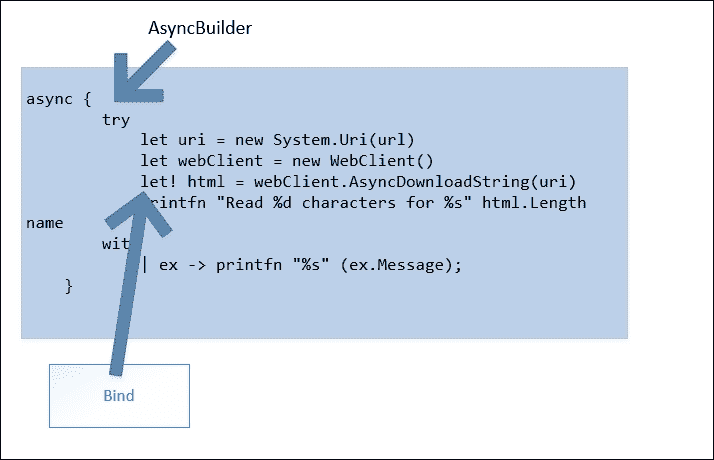
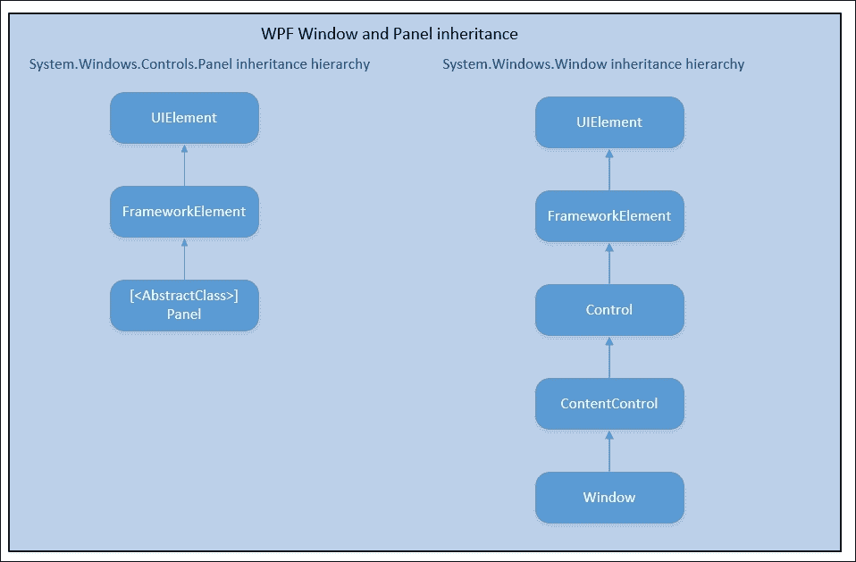
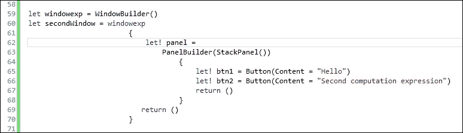
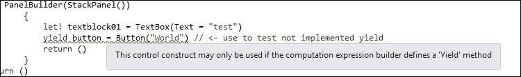
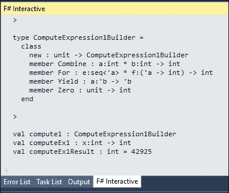
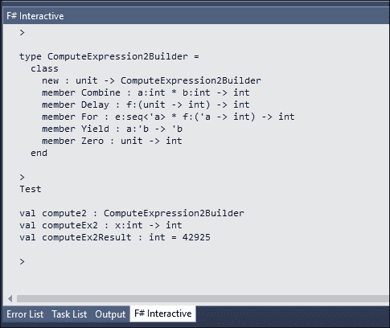

# 第八章。优化计算表达式

F# 最常用且独特的特性之一是异步工作流程，我们在 第四章，*F# 并发介绍*中讨论了这一点。异步工作流程本身实际上是一种计算表达式的实现，这是一种使我们能够进行计算的功能。实际上，这种计算是一系列按顺序组成的函数工作流程，并且有绑定来绑定或组合它们。

计算表达式有许多种辅助方法来实现，但使用这些辅助方法可能是过度设计，如果构建不当，还可能有一些开销。它并不像第七章中关于语言构造的讨论那样微妙和困难，*语言特性和构造优化*。

在本章中，我们将专注于以下主题的计算工作流程实现优化：

+   F# 计算工作流程的快速介绍

+   简单计算工作流程的示例实现概述

+   计划计算工作流程实现的设计考虑

+   计算表达式优化的考虑

# F# 计算表达式的快速介绍

函数式编程语言的一个相当微妙但相当常见的特性是具有将函数组合和组合成更复杂的概念技术的能力，这些技术结合函数时也封装了一些副作用。其中一些技术被称为 Monoids 和 Monads。这两个概念来自代数的一个子集，即范畴论。这个数学基础为组合和组合函数（包括副作用）提供了灵感和强大的概念。

对于一个更温和的介绍和关于函数式编程中 Monads 的信息，你可以观看微软开发者 Brian Beckman 在 MSDN Channel 9 的访谈：

[Brian Beckman 不怕 Monads](https://channel9.msdn.com/Shows/Going+Deep/Brian-Beckman-Dont-fear-the-Monads)

F# 计算表达式最佳示例是异步工作流程。异步工作流程中的“工作流程”一词来源于它是由计算表达式功能的使用实现的，以提供异步计算。异步工作流程本身是由具有副作用（如切换当前线程的上下文执行）的函数组成的。

### 注意

我们已经在 第四章，*F# 并发简介* 中讨论了这些 F# 并发，包括异步工作流案例，指出异步计算并不总是等同于多线程的需求。

在 F# 中，函数的组合是通过构建者完成的。这些构建者实际上是帮助我们构建函数组合的函数。从面向对象设计模式的角度来看，这些方法可以被视为辅助方法或构建方法，因为它们专注于构建计算表达式。

有时函数的组合可能包含条件逻辑来处理副作用，例如线程、执行上下文（如异步工作流）、I/O 等。条件逻辑与工作流概念相当相似，而执行始终以一系列步骤的形式实现。当需要条件逻辑时，执行总是根据评估的表达式遵循条件逻辑的分支。

### 备注

之前，F# 语言规范和 MSDN 图书馆提到计算表达式与计算工作流混合。自 F# 3.0 以来，语言规范一直保持一致且更加严格，专注于计算表达式，而不是工作流。

根据 F# 4.0 的官方语言规范，计算工作流语法通常从使用 `builder-name` 和括号开始，如下所示：

```cs
builder-name { expression } 

```

表达式本身可能是函数，这些函数由计算表达式的构建者定义（并管理）。

为了展示计算表达式语法的初始示例，让我们回顾一下我们自己的 `async` 工作流示例代码：

```cs
let fetchAsync(name, url:string) = 
    async {  
        try  
            let uri = new System.Uri(url) 
            let webClient = new WebClient() 
            let! html = webClient.AsyncDownloadString(uri) 
            printfn "Read %d characters for %s" html.Length name 
        with 
            | ex -> printfn "%s" (ex.Message); 
    } 

```

上述示例代码使用了 `Control.AsyncBuilder`，这是一个 `async` 的构建者。F# 编译器会将 `AsyncBuilder` 转换为 `async` 的计算表达式。

我们现在将更深入地探讨计算表达式的结构：计算表达式的构建者。我们还将创建一个比异步工作流更简单的计算表达式，作为下一节的起始示例。

## 计算表达式构建者简介

“构建者”这一概念还意味着我们在组合函数时，通过使用可用的构建者来构建计算工作流。这些构建者实际上是组合函数时可以使用的函数。

下表简要介绍了 F# 4.0 中常用的构建者：

| **方法** | **典型签名** | **备注** |
| --- | --- | --- |
| `Bind` | `M<'T> * ('T -> M<'U>) -> M<'U>` | 在计算表达式中提供 `let!` 和 `do!`。这是组合函数的基本方法。 |
| `Delay` | `(unit -> M<'T>) -> M<'T>` | 将计算表达式包装为一个函数。 |
| `Return` | `'T -> M<'T>'` | 等同于计算表达式中的 `return`。 |
| `ReturnFrom` | `M<'T> -> M<'T>` | 等同于计算表达式中的 `return!`。 |
| `Run` | `M<'T> -> M<'T> or M<'T> -> 'T` | 执行计算表达式。 |
| `TryWith` | `M<'T> * (exn -> M<'T>) -> M<'T>` | 在计算表达式中调用`try..with`以捕获异常（`exn`）。 |
| `TryFinally` | `M<'T> * (unit -> unit) -> M<'T>` | 在计算表达式中调用`try..finally`。 |
| `Using` | `'T * ('T -> M<'U>) -> M<'U> when 'U :> IDisposable` | 从计算表达式中的`use`绑定调用。它在计算表达式中等同于`using!`。 |
| `Yield` | `'T -> M<'T>` | 在计算表达式中调用`yield`。在概念上与 C#/VB 中的`yield`相同，但语义不同。 |
| `YieldFrom` | `M<'T> -> M<'T>` | 在计算表达式中调用`yield!`。在概念上与 C#/VB 中的`yield`相同，但语义不同。 |
| `Zero` | `unit -> M<'T>` | 当`if`条件中有空`else`时调用（如果计算表达式中有一个`if`语句）。当计算表达式有一个空表达式时也会调用。 |

更多关于计算表达式和完整构建器方法列表的信息，请参考新微软文档中的官方 MSDN F#计算表达式：

[`docs.microsoft.com/en-us/dotnet/articles/fsharp/language-reference/computation-expressions`](https://docs.microsoft.com/en-us/dotnet/articles/fsharp/language-reference/computation-expressions)

我们不需要实现所有构建器方法，因为没有计算表达式的明确最小要求。然而，为了能够轻松使用计算表达式实现，我们应该有基本的理解要求。以下是与构建器方法使用要求相关的常见要求：

+   用于组合函数的绑定。这个`Bind`方法将包含函数的组合。建议实现`Bind`，因为计算表达式内部支持的表达式受`Bind`方法中定义的类型所控制。例如，组合具有相同泛型类型的函数。

+   要返回的类型。这个要求强制我们实现`Return`或`ReturnFrom`。这很重要，因为计算表达式必须返回一个类型，并且建议不要返回`unit`（或在.NET 和 C#中的`void`）。

+   `Delay`，将计算表达式包装为函数。通常也将`Delay`方法作为包装方法调用。

+   `Using`，用于利用实现`IDisposable`的类型。这将在计算工作流中翻译为`use`绑定。

+   `TryWith`，用于处理`Bind`函数组合内的异常或显式处理`Bind`之外的异常。

`Bind` 方法至关重要，因为它决定了我们将要组合的函数中泛型类型的形式，但它也强制执行计算表达式内部 `let!` 和 `do!` 函数的所有类型。省略 `Bind` 将使计算表达式变得不完整，因为计算表达式的主要目标是组合表达式的能力，而不仅仅是返回底层类型。

在我们之前关于异步工作流的示例代码中，以下是对异步工作流中 `Bind` 作为 `let!` 的说明：



F# 核心库的默认分布已经包含了计算表达式实现的示例，其底层类型为：

+   LINQ 查询表达式支持返回 `System.Linq.Enumerable<'T>`

+   异步工作流返回 `Async<'T>`

F# LINQ 查询表达式稍微有些微妙，但实际上它的实现细节与 C#/VB 中使用的 LINQ 类似。在语义上是相同的；因此，性能特征也与在 C#/VB 中运行 LINQ 类似。F# 与 C#/VB 实现之间的区别在于使用的委托类型：F# 中的 `FastFunc`，C#/VB 中的 `Func`。

对 F# 函数相对于 `Func` 的强烈推荐至关重要且重要，因为所有方法构建器的签名都使用 F# 柔性函数而不是正常的 .NET 方法签名。

### 使用 F# 函数/委托而非 .NET Func

使用 F# 委托而不是正常的 .NET `Func` 的用法也更为高效和功能化，因为 F# 委托作为支持柔性的函数的即时特性；这允许在部分函数应用可用后使用高阶函数。

### 注意

当我们开发使用我们自己的计算表达式实现的应用程序时，当然，使用 F# 函数/委托而不是使用 .NET `Func` 会更快，并且强烈推荐这样做。它与 F# 的其他构造/特性高度兼容，并且在 F# 中编译更快。由于函数柔性的可用性，这被高度推荐。

F# 函数优化以支持柔性函数的证明在于 F# 支持高阶函数的方式。微软已经记录了这一点，并在一个非常好的功能编程特性/特征教程中进行了包装，重点关注函数作为一等值。函数作为一等值的理念随后与类和作为面向对象一等值的类方法进行了比较。

关于函数作为一等值和 F# 柔性函数的起始信息可在 F# 功能编程特性 MSDN 文档页面中找到：

[`docs.microsoft.com/en-us/dotnet/articles/fsharp/introduction-to-functional-programming/functions-as-first-class-values`](https://docs.microsoft.com/en-us/dotnet/articles/fsharp/introduction-to-functional-programming/functions-as-first-class-values)

在那一页上，我们在关于高阶函数的部分关注了 F# 的隐式高阶函数：

> *高阶函数是一个将具有多个参数的函数转换为一系列嵌套函数的过程，每个嵌套函数只有一个参数。在 F# 中，具有多个参数的函数天生就是高阶函数。*

高阶函数对 F# 的语言设计产生了深远的影响；因此，需要一个特殊的或独特的 F# 函数/委托。在一般的 .NET BCL 中，这种独特的 F# 高阶函数实现正变得越来越重要和关键，因为 `Func` 不支持高阶函数。

### 注意

我们不会深入讨论什么是函数式编程以及函数式编程语言的特性。有关 F# 中的更多函数式编程概念和 F# 中的函数式编程支持，请参阅前面的 MSDN 文档页面。

例如，让我们检查 `Bind` 方法的常见（典型）签名：

```cs
M<'T> * ('T -> M<'U>) -> M<'U> 

```

这个签名意味着函数返回 `M<'U>` 作为其结果，如最后 `->` 之后的类型签名所示。最后 `->` 之前两个类型之间的 `*` 表示该方法接受两个参数——一个是普通类型，第二个参数是一个接受泛型 `T` 并返回类型为 `M<'U>` 的函数。

在类的成员方法签名中使用 `*` 表示，类型（在结果类型之前）被视为方法的参数。

`('T -> M<'U>)` 函数表示一个接受 `'T` 类型的单个参数并返回结果的函数。这个参数不一定是单个参数。我们也可以使用具有多个参数的更多函数，例如：

```cs
'T -> 'U -> M<'V'> 

```

这里，`M<'V'>` 是结果。

最后 `->` 之前的 `'T -> 'U'` 签名表示该函数有两个参数，类型为泛型 `T` 和 `U`。然后我们可以将 `Bind` 的签名更改和调整为如下所示：

```cs
M<'T> -> ('T -> 'U -> M<'V>) -> M<'V> 

```

我们可以开始实现我们的 `Bind` 方法。但是，请注意，`let!` 和 `do!` 构造被修改得相当大，因此最好尽可能简单地实现计算表达式。

### F# 函数计算表达式与参数限制的关系

我们也可以使用许多参数，但只要类型对齐得当，通常只使用一个参数的函数就足够了。如果我们使用多个参数，我们的 `Bind` 方法实现将更加复杂，并且构建语义正确的计算表达式将始终更加困难。

不仅需要仔细对齐泛型类型；实现具有多个参数的 `Bind` 也更加复杂。F# 语言规范还暗示，当前 F# 4.0 编译器（特别是词法和语法分析器）更倾向于使用 `Func`。

通过具有 `Bind` 参数的实现示例，这种具有 `Bind` 的计算表达式的复杂性将变得更加清晰。下一节是计算表达式示例的起点。

## 计算表达式的规划和编写指南

让我们开始编写一个非常简单的创建 **WPF**（**Windows Presentation Foundation**）窗口和组合 WPF 控件的函数式方法。

WPF 基本上是在 DirectX 9.0c 上实现的 UI 框架，从 .NET 3.0 的发布开始作为 UI 库。它仍然由微软积极开发，随着 WPF 的发布，XAML 作为声明性 UI 的创新也随之而来。自 Visual Studio 2008 以来，它一直得到大力支持，现在它开始取代 Windows Forms。

Windows Forms 的这种略显不幸的命运在 Visual Studio 2012 和 .NET 4.5 的推出时变得更加明显；Windows Forms 已不再开发（尽管它们在错误修复方面仍然得到支持），但它们尚未被弃用或过时。这被认为是替代 Windows Forms，因为 WPF 仍在积极开发中，至少在 Visual Studio 2015/.NET 4.6.1 中是这样，在即将推出的 Visual Studio 2015 和 Visual Studio 2017 中也是如此。

如需了解更多关于 WPF 的信息，请访问 MSDN 上 WPF 的官方主页 [`msdn.microsoft.com/en-us/library/ms754130(v=vs.110).aspx`](https://msdn.microsoft.com/en-us/library/ms754130(v=vs.110).aspx)。

在开始使用计算表达式实现 WPF 组合之前，我们需要有一些基本概念来理解以下内容（作为设计考虑计划），然后再有 WPF 的代码实现：

+   所有 WPF 控件都派生自 `System.Windows.FrameworkElement`。

WPF 窗口被称为 `System.Windows.Window`。

+   在 `Window` 上，所有要放置的控件（类型为 `UIElement`）通常都放置在一个继承自 `System.Windows.Controls.Panel` 的容器面板上。

+   在 `Panel` 上添加控件必须精心设计，以排除 `Window`，因为如果我们把 `Window` 添加到 `Panel` 上，那就没有意义了，尽管 `Window` 继承自 `System.Windows.Controls.Control` 和 `System.Windows.UIElement`。

需要考虑对 `Panel` 的特殊处理：了解 `Panel` 是什么以及为什么它不能直接使用。

这证明了我们无法直接使用 `Panel`，因为 `Panel` 被实现为一个抽象类。

以下是在 F# 中 `System.Windows.Controls.Panel` 的声明：

```cs
[<AbstractClass>] 
[<LocalizabilityAttribute(LocalizationCategory.Ignore)>] 
[<ContentPropertyAttribute("Children")>] 
type Panel =  
    class 
        inherit FrameworkElement 
        interface IAddChild 
    end 

```

`AbstractClass` 属性与将类标记为抽象类的语义相同。在 F# 中，使用 `AbstractClass` 属性处理抽象类，而不是像在 C#/VB 中那样使用关键字：

```cs
[LocalizabilityAttribute(LocalizationCategory.Ignore)] 
[ContentPropertyAttribute("Children")] 
public abstract class Panel : FrameworkElement, IAddChild 

```

为了避免混淆，我们应该了解 F#中的 OOP 概念和关键字，同时与 C#/VB 中的 OOP 进行关联和交互。这种概念知识越来越相关，因为在开发 WPF 应用程序时，我们通常依赖于 OOP 控件的继承和组件化。

在开始使用 WPF 之前，确保以下程序集被引用或注册（如果你处于脚本交互模式）：

+   `WindowsBase`

+   `PresentationCore`

+   `PresentationFramework`

+   `System.Xaml`

对于脚本模式，这些程序集必须首先通过直接注册 DLL 的位置进行注册。在下面的示例中，我们使用 32 位程序集注册程序集：

```cs
#r "C:\\Program Files (x86)\\Reference Assemblies\\Microsoft\\Framework\\.NETFramework\\v4.6.1\\WindowsBase.dll" 
#r "C:\\Program Files (x86)\\Reference Assemblies\\Microsoft\\Framework\\.NETFramework\\v4.6.1\\PresentationCore.dll" 
#r "C:\\Program Files (x86)\\Reference Assemblies\\Microsoft\\Framework\\.NETFramework\\v4.6.1\\PresentationFramework.dll" 
#r "C:\\Program Files (x86)\\Reference Assemblies\\Microsoft\\Framework\\.NETFramework\\v4.6.1\\System.Xaml.dll" 

```

在注册所有必需的 DLL 程序集之后，我们应该告诉 F#编译器将 WPF 的命名空间作用域设置为在脚本中可用：

```cs
open System 
open System.Windows 
open System.Windows.Controls 

```

开放命名空间也很有用，因为它将缩短我们为 WPF 类型命名的长度，无需使用带有命名空间的完整类型名。它在语义上类似于 C#中的`Using`关键字和 VB 中的`Import`。

我们可以从仅创建带有`Panel`的`Window`开始，但也可以使用抽象类作为带有`Panel`的`Window`和带有控件的`Panel`的模板，因为`Window`和`Panel`都扩展了`FrameworkElement`，如图所示：



接下来，我们将实现我们的抽象类作为构建器的模板：

```cs
[<AbstractClass>] 
type IComposableControl<'a when 'a :> FrameworkElement> () = 
    abstract Control : 'a 
    abstract Bind : System.Windows.FrameworkElement * (System.Windows.FrameworkElement -> 'a) -> 'a 
    abstract Bind : IComposableControl<'b> * (System.Windows.FrameworkElement -> 'a)  -> 'a 
    member this.Return (e: unit)  = this.Control 
    member this.Zero () = this.Control 

```

基于已知`Window`和`Panel`都继承自相同的`FrameworkElement`，我们可以继续实现我们自己的`Window`构建器作为一个计算表达式：

```cs
type WindowBuilder() = 
    inherit IComposableControl<Window>() 
    let win = Window(Topmost=true) 
    override this.Control = win 
    override this.Bind(c: FrameworkElement, body: FrameworkElement -> Window) : Window = 
        win.Content <- c 
        body c 
    override this.Bind(c: IComposableControl<'b>, body: FrameworkElement -> Window) : Window = 
        win.Content <- c.Control 
        body c.Control 

```

这是`PanelBuilder`的实现：

```cs
type PanelBuilder(panel: Panel) = 
    inherit IComposableControl<Panel>() 
    override this.Control = panel 
    override this.Bind(c: FrameworkElement, body: FrameworkElement -> Panel) : Panel= 
        if c :? Window then 
            raise (ArgumentException("Window cannot be added to panel")) 
        else 
            panel.Children.Add(c) |> ignore 
            body c 
    override this.Bind(c: IComposableControl<'b>, body: FrameworkElement -> Panel) : Panel= 
        panel.Children.Add(c.Control) |> ignore 
        body c.Control 
    // Implement the code for constructor with no argument. 
    new() = PanelBuilder(StackPanel()) 

```

在`PanelBuilder`实现中，我们为`c`添加了类型检查（如高亮所示）。如果它被类型化为`Window`，我们应该引发`System.ArgumentException`来进一步通知我们不能将`Window`添加到`Panel`上。我们也可以选择返回`null`而不是异常，但在 F#中返回`null`是不推荐的，它也会增加对添加内容的混淆。此外，代码的组成也不够好。`Bind`中的任何不良组合都会增加计算表达式的不可预测性。关于这一考虑的更多信息将在下一节中描述。

由于我们从`IComposableControl`抽象类派生了`WindowBuilder`和`PanelBuilder`，我们必须实现`IComposableControl`的所有抽象方法。实现的方法必须有一个`override`修饰符来表示该方法是对`IComposableControl`中抽象方法的实现。

### 注意

我们不会对 F#的 OOP 特性进行全面的讨论，因为这不属于本书的范围。

如需了解抽象方法和重写（overrides）的更多信息，请查阅 MSDN 文档，链接为[`docs.microsoft.com/en-us/dotnet/articles/fsharp/language-reference/members/methods`](https://docs.microsoft.com/en-us/dotnet/articles/fsharp/language-reference/members/methods)。

现在我们已经实现了构建器，我们可以将构建器投入实际使用：

```cs
let win = 
    WindowBuilder() 
        {   let! panel = 
                PanelBuilder(StackPanel()) 
                    {   let! btn1 = Button(Content = "Hello") 
                        let! btn2 = Button(Content = "World") 
                        return () } 
            return () } 

do win.Show() // Pops up the window in FSI.  

```

上述代码将显示以下窗口：


要测试`Zero`，我们可以在计算表达式中简单地使用一个空表达式进行测试。

这是`WindowBuilder`中`Zero`的一个示例：

```cs
let winzero = WindowBuilder()  
               { Console.WriteLine("sample Zero") } 
do winzero.Show() 

```

这是一个微妙的功能，但我们已经使用了它，而大多数人可能并未意识到：构建器对象；当它被实例化时，F# 编译器会将该实例视为一个关键字！

这种将计算表达式实例转换为关键字的翻译已经通过将`AsyncBuilder`实例化为`async`来由异步工作流演示。因此，`async`实例的使用将被视为一个关键字。

在`WindowBuilder`的情况下，`WindowBuilder`的实例也将被视为一个关键字。例如，以下是一个`WindowBuilder`的示例实例：

```cs
let windowexp = WindowBuilder() 
let secondWindow = windowexp  
                        {  
                            let! panel = 
                                PanelBuilder(StackPanel()) 
                                    {  
                                        let! btn1 = Button(Content = "Hello") 
                                        let! btn2 = Button(Content = "Second computation expression") 
                                        return () 
                                    } 
                           return () 
                        } 

```

在 Visual Studio 中，前面将`windowexp`视为关键字的处理方式在以下屏幕截图中有展示：



现在我们有了`windowexp`作为`WindowBuilder()`的实例，我们可以将其用作`windowexp`计算表达式关键字。这通过蓝色显示，就像其他 F#关键字一样。

我们创建了一个简单的计算表达式，其中包含`Bind`、`Return`和`Zero`。让我们窥视异步工作流中计算表达式的实现。

对于异步计算，`AsyncBuilder`的实现遵循与`WindowBuilder`和`PanelBuilder`相同的模式；它首先定义方法构建器，尽管实现中并未使用抽象类。

检查 F#异步工作流的实现相当容易，因为我们可以直接检查源代码。以下是 F#核心库（`FSharp.Core`）源代码的着陆页，包括 F#编译器实现和 F#工具：

[`github.com/Microsoft/visualfsharp/tree/master/src`](https://github.com/Microsoft/visualfsharp/tree/master/src)

让我们查看`control.fs`文件中`AsyncBuilder`的类型声明和代码：

```cs
    type AsyncBuilder() = 
        member b.Zero()                 = doneA 
        member b.Delay(f)               = delayA(f) 
        member b.Return(x)              = resultA(x) 
        member b.ReturnFrom(x:Async<_>) = x 
        member b.Bind(p1, p2)           = bindA p1 p2 
        member b.Using(g, p)            = usingA g p 
        member b.While(gd, prog)        = whileA gd prog 
        member b.For(e, prog)           = forA e prog 
        member b.Combine(p1, p2)        = sequentialA p1 p2 
        member b.TryFinally(p, cf)      = tryFinallyA cf p 
        member b.TryWith(p, cf)         = tryWithExnA cf p 

```

所有成员都是隐式声明的`public static`方法，因此快速实现起来非常简洁。

让我们查看`Bind`方法实现中的`bindA`：

```cs
        // The primitive bind operation. Generate a process that runs the first process, takes 
        // its result, applies f and then runs the new process produced. Hijack if necessary and  
        // run 'f' with exception protection 
        let bindA p1 f  = 
            unprotectedPrimitive (fun args -> 
                if args.aux.token.IsCancellationRequested then 
                    cancelT args 
                else 

                    let args = 
                        let cont a = protectNoHijack args.aux.econt f a (fun p2 -> invokeA p2 args) 
                        { cont=cont; 
                          aux = args.aux 
                        } 
                    // Trampoline the continuation onto a new work item every so often  
                    let trampoline = args.aux.trampolineHolder.Trampoline 
                    if trampoline.IncrementBindCount() then 
                        trampoline.Set(fun () -> invokeA p1 args) 
                        FakeUnit 
                    else 
                        // NOTE: this must be a tailcall 
                        invokeA p1 args) 

```

如果我们想检查`AsyncBuilder.Bind`的签名，该签名位于`Controls.fsi`文件中。以下是其签名：

```cs
member Bind: computation: Async<'T> * binder: ('T -> Async<'U>) -> Async<'U> 

```

`Bind`签名定义了该方法接受两个参数：计算和绑定器。计算参数的类型为`Async<'T>`，绑定器的类型为`'T -> Async<'U>`，返回类型为`Async<'U>`，`'U`的泛型参数是底层类型。如果我们使用异步工作流构造中的`let!`，则调用此`Bind`方法。

### 理解计算表达式中返回类型的用法

在计算表达式中，存在一个明显的`let!`、`return`和`return!`表达式的模式。使用感叹号`!`作为后缀意味着这些表达式直接返回底层类型，而不需要任何包装类型。例如，`return!`将调用`ReturnFrom`方法，而`return`将调用`Return`方法。在 F#异步工作流的情况下，我们可以看到`Return`和`ReturnFrom`的签名比较：

```cs
member b.Return(x)              = resultA(x) 
member b.ReturnFrom(x:Async<_>) = x 

```

这是对底层类型含义的解释：

+   `ReturnFrom`将立即返回结果类型，而不包含包装类型。在实践中，它返回`'T`而不是`Async<'T>`。

+   `Return`方法将返回一个包装底层类型的类型。在异步工作流的情况下，`Return`将返回`Async<'T>`，而`Async`类型包装了`T`的类型。

+   `ReturnFrom`的概念在.NET TPL 中类似于`Task<'T>`操作的结果为`T`。

F#组合计算表达式的方式使得推理返回底层类型变得更容易，但在.NET TPL 中，要获取`Task<T>`中的`T`，我们必须访问作为结果的属性。

例如，当获取`Task<T>`（在 C#中）的结果时，会显示这种类型包装：

```cs
   public static void Main() 
   { 
      var t = Task<int>.Run( () => { 
         for (int ctr = 0; ctr <= 1000000; ctr++) { 
            if (ctr == max / 2 && DateTime.Now.Hour <= 12) { 
               ctr++; 
               break; 
            } 
         } 
         return ctr; 
      } ); 
 Console.WriteLine("Finished {0:N0} iterations.", t.Result); 
   } 

```

如前述代码所示，底层结果包含在`t.Result`中而不是`t`中，因为`t`的类型为`Task<int>`。因此，底层类型被类型化为`int`；它与`Task<T>`的属性声明相匹配。`Result`文档：

```cs
member Result : 'T with get 

```

其他如`yield`和`yield!`的表达式在返回类型方面与`return`/`return!`和`let`/`let!`具有相同的目的和行为。

异步工作流和我们的 WPF 计算表达式是计算表达式的共同性质（在实用软件工程的领域中，也称为*共同行为*）的样本。强烈建议遵循计算表达式的这种共同性质。因此，这些共同性质的特性不仅是最佳实践，而且作为实现预定义规范也更有意义。预定义规范通常称为**设计考虑**。

我们将在下一节讨论设计考虑。

# 通用计算表达式设计考虑

我们已经使用`Bind`、`Return`和`Zero`作为起始样本实现了一个非常简单的计算表达式。

我们可以得出结论，使用`Bind`将翻译成`let!`，因为`let!`表达式的结果将很好地组合。其他翻译可以在计算表达式的官方 MSDN 文档页面上找到。

将构建器方法翻译成语言构造的语法，如`let!`、`return`、`return!`和`do!`是语法糖的示例。计算表达式的**语法糖**是将构建器方法翻译成非常整洁的声明性表达式以很好地组合表达式和函数的能力。与在实例化构建器对象的构造函数之后直接调用方法构建器相比，拥有计算表达式要容易得多。

根据前几节的讨论，我们得出结论，有一些最佳实践方面和一些建议必须加以考虑。

这些方面的适当术语是*设计考虑因素*，因为它们作为最佳实践和一些在计算表达式实现初期应避免采取的初步行动。设计考虑因素还包括避免计算表达式陷阱的相关信息，因为设计考虑因素包括每个设计考虑因素背后的相关实现模式或背景原因。大多数原因都包括要避免的陷阱。

以下是对计算表达式实现的设计考虑因素：

1.  总是以你想要实现的结果和一般结果开始。并非所有构建器方法都必须实现，因为虽然任何构建器方法实现都提供了更强大的语法糖和更多的声明性结构，但它也增加了编译开销，因此生成的 IL 可能更复杂。

1.  所使用的构建器方法的签名必须遵循 MSDN 文档中描述的 F#计算表达式的相同模式推荐。这是至关重要的，因为任何计算表达式都必须通过遵守或遵守构建器方法的相同签名推荐，在开始时具有高度的预测性。例如，`Bind`必须遵循`M<'T> * ('T -> M<'U>) -> M<'U>`的签名，以便具有可预测的结果。

1.  *计算表达式的焦点通常分为三个主要方面：对返回底层类型的要求、仅在表达式/函数中结合通常返回无值或返回 F# 单元（C# 中的 void）的操作，以及对结合副作用的要求*。这种条件特别适用于`Zero`方法的情况。计算工作流程的本质不需要为所有情况实现`Zero`。例如，查询计算表达式（`query { ... }`表达式）不需要`Zero`，因为实现`Zero`方法没有意义，因为查询表达式的重点不是底层类型，而是结合 LINQ 的查询表达式/函数，并尽可能避免副作用。在异步工作流程和`WindowBuilder`/`PanelBuilder`的情况下是有意义的，因为结合异步计算和添加 UI 控件会有副作用。

1.  添加对`Zero`的支持意味着我们应该意识到`Zero`支持的计算可能包含副作用。因此，应该为具有预定义目标包括任何副作用而不是组合纯函数或组合具有严格层次结构的对象的计算表达式添加`Zero`方法支持。异步工作流程旨在以产生副作用的方式组合函数和操作；因此，我们可以安全地包括`Zero`支持。`WindowBuilder`/`PanelBuilder`可能没有副作用，但*所有 GUI 层（如 Windows Forms 和 WPF）的利用都始终有副作用*。序列计算工作流程，`seq { ... }`，可能包含副作用，但主要目标是关注返回底层类型。因此，`seq`计算表达式没有实现`Zero`的要求或必要性。

1.  添加对`Combine`的支持意味着强烈建议添加对`Delay`的支持，因为根据`Combine`方法的实现体，这是必需的。但是，`Delay`方法构建器的实现将增加更多复杂性，因为结果不会立即评估。这种不立即评估的行为发生是因为`Delay`方法总是在`Return`/`ReturnFrom`方法之前执行。只有当`Delay`方法的方法体包含简单的表达式或仅包含一个函数时，才能将其优化以具有更少的复杂性，因为`Delay`方法的本性是包装包含我们计算的功能。

1.  为了缩短计算表达式构建器的实例化，我们可以在模块下使用正常的 `let` 语法来实例化它。F# 将将构建器的实例视为关键字。因此，强烈建议只有一个实例将被用作关键字，因为拥有多个构建器实例以拥有多个具有相同语义的关键字是不良实践。例如，我们使用 `windowexp` 作为我们的 `WindowBuilder` 实例，然后它可以被其他 F# 库（DLL）或可执行应用程序使用。

1.  F# 计算表达式的实例化不能与现有 F# 关键字池中的相同关键字。否则，我们可能会得到不可预测的结果和编译错误。这一点至关重要，因为我们不应该在未检查现有 F# 关键字的情况下，自由地以类型构建器的名称形式添加更多关键字。

1.  尽可能使用 F# 委托/函数（`FSharpFunc`）而不是 .NET `Func`，除非我们打算在计算表达式的实现中显式使用 .NET `Func`。例如：查询计算表达式包含对 LINQ 的静态方法的调用，如 `Enumerable.Where` 和 `Orderable.OrderBy`，这需要 .NET `System.Func` 委托。

1.  使用 `Using` 方法构建器是可选的，但如果我们允许使用应立即处置的类型（作为底层类型），则应尽可能使用 `Using`。符合此模式的类型是实现 `IDisposable` 的类型。但是，拥有这个 `Using` 将会增加我们的计算表达式的复杂性，并且并非所有规划重点（如第 3 点所述）都需要我们有 `Using` 方法的实现。

1.  不要将隐式类型用作具有事件驱动编程模式中事件隐式引用计数的类型的计算表达式的底层类型。例如，将任何 `EventHandler` 类型（或其派生类型）用作计算表达式的底层类型。尽管没有限制使用事件处理对象作为底层类型，但我们无法保证总能从事件处理对象中解引用事件作为底层类型。在计算表达式运行期间，任何事件都可能被添加，除非我们也记得解引用所有引用的事件对象，这总是会增加计算表达式实现的复杂性。使用 `IDisposable` 模式并不能保证在类型被处置时，任何处理的事件都会被注销。

1.  如果我们将隐式类型用作从 `EventHandler` 等引用计数类型派生的底层类型，事件注册（引用）和解引用必须显式处理。这种显式的引用/解引用实现将保证外部事件（作为委托引用）的注册和注销是正确的。

1.  不要在方法构建器上使用内联函数。内联函数的上下文不适合计算表达式的上下文，因为内联函数将内联到我们方法构建器的每次使用中，这与 F#语言规范相违背。然而，方法构建器的本质更倾向于有正常的泛型类型参数，这些参数随后被泛化，而不是在泛型类型上提前进行内联优化。此外，所有的方法构建器都不容易内联，因为这些方法仅存在于由计算表达式构建器类型定义设定的类型集中，并且只能在计算表达式实例被使用时在其作用域内使用。幸运的是，F#编译器会及早捕捉到构建器方法上的这种内联使用，并将其作为编译错误。

当我们准备实现计算表达式时，有前面的设计指南是好的，但它们有自己的影响，并且有一些设计考虑点的子注释和更多解释。下一节将描述这些影响以及额外的解释。

## 计算表达式设计考虑的设计影响

设计考虑中的点相当直观，但有些点需要进一步探讨，因为它们不仅对计算表达式在程序集作用域外使用时的正确性和意图的清晰性有影响，还对性能有影响。

让我们讨论设计考虑中具有额外处理影响的点。

第二点规定我们必须根据常用方法构建器的签名来满足规范。这很重要，尤其是在定义计算表达式核心意图和要求的（必需的）方法上，正如计算表达式焦点第三点所述。在异步工作流和`WindowBuilder`/`PanelBuilder`的情况下，所有这些都必须处理副作用，因此`Bind`、`Return`和`ReturnFrom`方法的实现必须使用相应的签名指南。未能遵守这些签名指南将导致编译错误。

例如，如果我们尝试在`PanelBuilder`的使用中包含`yield`，我们将得到一个编译错误。

考虑以下有误的代码：

```cs
let testUnimplementedYieldWindow = 
    windowexp  
        { 
            let! panel =  
                PanelBuilder(StackPanel()) 
                    { 
                        let! textblock01 = TextBox(Text = "test") 
                        yield button = Button("World") // <- use to test not implemented yield 
                        return () 
                    } 
            return () 
        } 

```

Visual Studio 编辑器将在带有`yield`声明的行上显示波浪线，并且还会抱怨`yield`方法尚未实现，如下面的截图所示：



来自 F#编译器的这个错误信息至关重要，因为目前我们尚未为`PanelBuilder`实现`yield`，尽管`yield`本身在计算表达式外的`for`循环中是 F#中的一个有效关键字。

这个简单的快速测试也有助于证明计算表达式实现的一致性非常重要，这样我们就可以确信我们的计算表达式实现是正确的，因为我们已经根据初始意图和设计考虑进行了实现。这也是为什么它被称为*正确性*，而不仅仅是实现和使用的一致性。

计算表达式方面的第 3 点关注点意味着在实现计算表达式之前有一个确定的计划。这个关注计划还将提供指导，说明我们应该强烈实现哪些方法构建器，以及哪些方法不应该实现，这主要基于我们如何首先处理副作用。

目前，在 F#语言规范中尚未正式定义计算表达式方法构建器实现的指南。重点指南的主要目标是制定一个关于计算表达式实现的起始计划，这样就可以轻松地将其转换为我们应该实现的方法构建器。

首先关注副作用的心态也是关键和有帮助的。这也符合函数式编程语言的常见实践，我们应该明确处理副作用并在实现初期尽早识别它们。

我们可以用这个示例作为决策流程（使用 UML 2 图符号）来简化第 3 点的叙述描述：


前面的统一建模语言（UML）活动图示例并不是为了限制开发者的创造力。事实上，对于许多具体目的，除了我们在示例中展示的内容之外，没有对最小方法构建器的限制。

我们利用 UML 活动图，因为我们需要记录或说明决策因素的流程。UML 本身是一个软件开发标准图，专注于在**对象管理组**（**OMG**）的监督下记录流程和系统开发（包括应用开发），**对象管理组**是一个非营利组织，用于标准化记录的流程和架构。

想了解更多关于 UML 2 图的信息，请访问官方 UML 页面：[`www.uml.org/`](http://www.uml.org/)。

这是 UML 2 标准的着陆页，在 OMG（[`www.omg.org/spec/UML/`](http://www.omg.org/spec/UML/)）有各种版本历史。

UML 活动图是 UML 2.1 标准图和符号的一部分。

### 注意

UML 活动图比流程图更容易理解，因为它可以容纳更多的条件关注点（不仅仅是是/否或真/假），并为事件驱动和消息传递代理提供更多支持。最常用的 UML 图是活动图。活动图是 UML 2.1 标准下的许多图之一。目前，UML 标准版本为 2.5，但 2016 年广泛使用的版本仍然是 UML 2.1。本书不专注于如何创建和使用 UML 图，因为这超出了本书的范围。

当我们讨论第 3 点中的副作用时，我们应该意识到副作用不仅仅是 I/O 或任何其他类型的对外部 API 调用，如与 Win32 API 的互操作性；像异常、事件驱动模型和任何 GUI 库这样的副作用也必须被考虑到，以便进行仔细处理。当在计算表达式中实例化事件处理器时，建议通过将它们设置为`None`（在 C#语义中为`null`，在 VB 语义中为`Nothing`）来清除我们想要处理的任何事件的全部事件处理器。否则，即使我们完成了计算表达式的执行，也可能会发生内存泄漏。

关于计算表达式实例化的第 5 点也是一个简单但富有意义的证明，说明了我们如何轻松地向现有的 F#关键字添加关键字。这可能会导致混淆，因为更多的关键字意味着更多的语义和更多的上下文需要理解。

关于在计算表达式中利用`Using`方法的第 8 点必须谨慎实现。对于可处置对象来说，有一个使用模式是很好的，但许多可处置对象的使用可能会因为计算表达式生命周期结束时处置对象的开销而导致垃圾收集器（GC）有额外的开销。此外，只有`Using`方法可以用于`IDisposable`对象，这个限制将对`Using`方法的实现中可以使用的类型类型施加限制。

第 9 点也很重要，尽管它是我们设计考虑中的最后一个点，因为任何使用具有隐式引用计数作为底层类型的类型（例如事件处理器）都可能很危险。并不是我们不能保证总是解除对其他对象（如事件）的引用，但任何解除引用本身的行为总是同步的，这可能会稍微降低运行性能。

虽然将事件处理器的引用设置为`None`与设置它一样简单，但由于其同步执行的顺序性质，它根本不能在并行执行中使用。这意味着当我们必须进行解除引用时，没有并行性的选项。

# 考虑计算表达式优化

如果我们仔细实施设计规划，计算表达式可以进一步优化。我们在本章的前一节讨论了计算工作流的设计考虑，我们将把这些考虑作为快速基础来执行优化。

由于计算表达式语法的翻译后果，计算表达式的优化相当困难，以下是一些因素：

1.  计算表达式的构建在很大程度上依赖于语法糖，这些语法糖成为语言结构。例如，`ReturnFrom` 方法被翻译成一个返回计算表达式底层类型结果的方法。因此，我们必须遵循异步方法构建器的严格指南来表达翻译；否则，我们可能会得到不可预测的结果或甚至异常。

1.  编写 `let!` 序列需要一些链式 `Bind` 方法构建器的连接，这些连接以链式 `Bind` 方法的形式出现。这种 `Bind` 方法的链式调用可能会出错，并且无法进一步优化。幸运的是，我们在计算表达式中有一个名为 `Combine` 的方法构建器，用于序列化多个表达式（在 F# 的 MSDN 文档中也称为 *序列表达式*）。然而，`Combine` 方法必须仔细重写以匹配 `Combine` 的签名要求规范，然后所有相关的构建器方法，如 `Bind`、`Return` 和 `ReturnFrom`，都必须对齐以匹配类型签名。

1.  默认情况下，计算表达式内部的表达式返回的表达式不会立即返回，因为执行顺序可能会根据 `Combine` 和 `Delay` 的实现体而改变。

点 2 和 3 与设计考虑密切相关，尤其是与我们之前在本章中讨论的计算表达式设计考虑的第 5 点。

为了理解 `Delay` 并证明它改变了执行顺序，我们可以比较两种计算表达式的实现：第一个没有 `Delay`，第二个有 `Delay`。

以下代码是未使用 `Delay` 方法实现的：

```cs
// without delay method 
type ComputeExpression1Builder() = 
  /// Combine two values 
  member sm.Combine(a,b) = a + b 
  /// Zero value 
  /// sm.Zero() 
  member sm.Zero() = 0 
  /// Return a value  
  /// sm.Yield expr 
  member sm.Yield(a) = a 
  /// For loop 
  member sm.For(e, f) = 
    Seq.fold(fun s x -> sm.Combine(s, f x)) (sm.Zero()) e 

```

让我们测试这个 `ComputeExpression1Builder` 构建器，使用以下代码：

```cs
let compute1 = ComputeExpression1Builder() 
let computeEx1 x = compute1 { for x in [1 .. x] do yield x * x } 
let computeEx1Result = computeEx1 50 

```

使用 **F# Interactive** 模式执行前面的代码。**F# Interactive** 窗口将显示以下签名：



以下代码与上一个代码相同，但现在它有了 `Delay` 方法：

```cs
// Add delay method 
type ComputeExpression2Builder() = 
  /// Combine two values 
  member sm.Combine(a,b) = a + b 
  /// Zero value 
  /// sm.Zero() 
  member sm.Zero() = 0 
  /// Return a value  
  /// sm.Yield expr 
  member sm.Yield(a) = a 
  /// For loop 
  member sm.For(e, f) = 
    Seq.fold(fun s x -> sm.Combine(s, f x)) (sm.Zero()) e 
 /// Delay a computation
 member sm.Delay (f: unit -> int) =
 System.Console.WriteLine("Test") 
 f() 

```

上一段代码中的`Delay`方法使用了类型注解。这很重要，因为没有类型注解，F#会将签名设置为泛型；这种泛化是由自动泛化引起的。我们需要最小化自动泛化，因为我们希望在泛型参数绑定时防止运行时类型检查，因为我们已经知道`Combine`的方法体将推断出底层结果类型的类型是`Int32`。

使用以下代码测试`ComputeExpression2Builder`：

```cs
let compute2 = ComputeExpression2Builder() 
let computeEx2 x = compute2 { for x in [1 .. x] do yield x * x } 
let computeEx2Result = computeEx2 50 

```

以下**F#交互式窗口**的显示证明了`Delay`方法将一个函数包裹在计算表达式中，并影响了评估（如`Console.WriteLine`的**Test**显示所示）：



上述代码证明了`Delay`方法应谨慎使用，它可能包含副作用，不仅会改变`Yield`（或其他返回结果方法，如`Return`/`ReturnFrom`）的执行顺序，还可能因为捕获异常而提前终止执行，从而在返回`Yield`的结果之前。

这个简单的优化案例示例结合设计考虑因素，为我们提供了谨慎且可预测的行为。我们现在对计算表达式内部发生的事情有了更高的认识，以及如何最小化使用方法构建器时产生的不必要或过度使用带来的开销。

# 摘要

计算表达式正确性的知识也非常有用，因为我们没有牺牲性能，同时保持了函数式编程的最佳实践。尽管计算表达式实现中构建器方法的本质大多使用面向对象原则实现，但使用实例化的计算表达式给我们提供了更多的表达性，使我们的代码更简洁、更易于组合。

我们掌握了 F#代码或应用的优化知识，从识别.NET 运行时的性能方面开始，到 F#性能特性的细节，使用.NET 工具生态系统进行测量，以及优化 F#语言生态系统的各个方面——从编译器到现有的 F#功能。

我们不仅理解了通用语言特性，还了解了如何将编译器与并发、数据结构、语言构造和其他复杂且强大的功能（如计算表达式）对齐。
