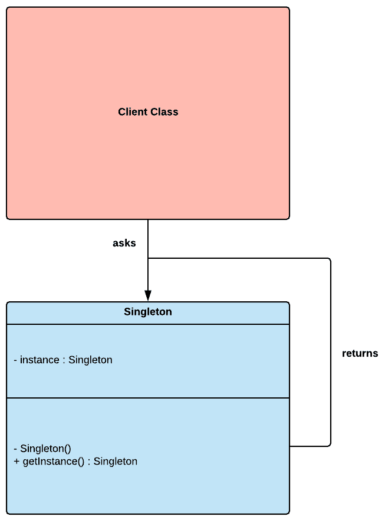
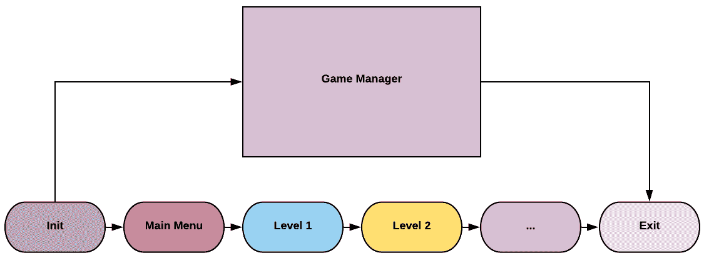
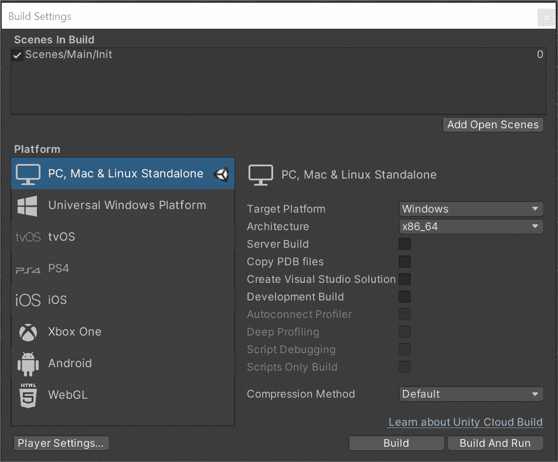
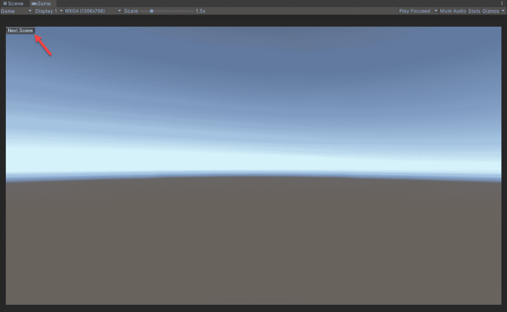

使用单例实现游戏管理器

在这个第一个实践性章节中，我们将回顾编程领域中臭名昭著的软件设计模式之一，即**单例**。许多人可能会争辩说，单例是 Unity 开发者中最广泛使用的模式，也许是因为它是学习起来最直接的模式。但它也可以迅速成为我们编程工具箱中的“胶带”，每次我们需要快速修复复杂的架构问题时，我们都会伸手去拿它。

例如，当使用这种模式时，我们可以快速建立一个简单的代码架构，围绕将我们游戏的所有核心系统封装和管理在单独的管理类中。然后我们可以让这些管理器提供干净、直接的接口，从而隐藏系统的内部复杂性。此外，为了确保这些管理器易于访问并且每次只有一个实例运行，我们将它们实现为单例。这种方法听起来很稳固且有益，但它充满了陷阱，因为它将在核心组件之间创建强耦合，并使单元测试变得非常困难。

在这本书中，我们将尝试摆脱这种类型的架构，并使用设计模式来建立一个更健壮、模块化和可扩展的代码库。但这并不意味着我们将忽视单例并认为它本质上是有缺陷的。相反，在本章中，我们将探讨一个这种模式非常适合的使用案例。

本章将涵盖以下主题：

+   单例模式的基本原理

+   在 Unity 中编写可重用的单例类

+   实现全局可访问的游戏管理器

# 第七章：技术要求

这是一个实践性章节；你需要对 Unity 和 C#有一个基本的了解。

我们将使用以下特定的 Unity 引擎和 C#语言概念：**泛型**。

如果不熟悉这个概念，请参阅第三章，*Unity 编程简明指南*。

本章的代码文件可以在 GitHub 上找到：[`github.com/PacktPublishing/Game-Development-Patterns-with-Unity-2021-Second-Edition/tree/main/Assets/Chapters/Chapter04`](https://github.com/PacktPublishing/Game-Development-Patterns-with-Unity-2021-Second-Edition/tree/main/Assets/Chapters/Chapter04)。

查看以下视频以查看代码的实际应用：

[`bit.ly/3wDbM6W`](https://bit.ly/3wDbM6W)

泛型是 C#的一个引人入胜的特性，它允许我们在运行时延迟指定类的类型。当我们说一个类是泛型的时候，这意味着它没有定义的对象类型。这种方法的优势在于，当我们初始化它时，我们可以给它指定一个特定的类型。

# 理解单例模式

正如其名所示，单例模式的主要目标是保证唯一性。这种方法意味着如果一个类正确实现了这个模式，一旦初始化，它将在运行时内存中只有一个自己的实例。这种机制在有一个需要从单一且一致的入口点全局访问的系统管理的类时非常有用。

单例的设计相当简单。当你实现一个单例类时，它就负责确保在内存中只有一个自己的实例。一旦单例检测到与自身类型相同的对象实例，它将立即销毁它。因此，它相当无情，不容忍任何竞争。以下图表在一定程度上说明了这个过程：



图 4.1 – 单例模式的 UML 图

从对单例模式的描述中，最重要的收获是，如果实现得当，它确保只能有一个实例；如果不这样，它就失败了其目的。

## 好处与缺点

这些是单例模式的一些好处：

+   **全局访问**: 我们可以使用单例模式来创建对资源或服务的全局访问点。

+   **控制并发**: 这种模式可以用来限制对共享资源的并发访问。

这些是单例模式的一些缺点：

+   **单元测试**: 如果过度使用，单例可能会使单元测试变得非常困难。我们可能会遇到单例对象依赖于其他单例的情况。如果任何一个在某个时刻缺失，依赖链就会被打破。这个问题通常发生在将外观模式和单例结合使用来设置面向核心系统的前端接口时。我们最终会得到一系列管理类，每个管理游戏的一个特定核心组件，所有这些类都相互依赖才能运行。因此，单独测试和调试变得不可能。

+   **惰性**: 由于其易用性，单例是一种可以迅速养成不良编程习惯的模式。正如在*单元测试*的缺点中提到的，我们可以很容易地通过单例从任何地方访问一切。它提供的简单性也可能使我们不愿意在编写代码时尝试更复杂的方法。

在做出设计选择时，始终牢记你的架构是否可维护、可扩展和可测试是非常重要的。当涉及到可测试性时，我经常问自己是否可以轻松地单独和独立地测试我的核心系统、组件和机制。如果不能，那么我知道我可能做出了某些可能不明智的决定。

# 设计游戏管理器

在 Unity 项目中，我们经常看到的标准类是游戏管理器。开发者通常将其实现为单例，但其责任因代码库而异。一些程序员用它来管理顶级游戏状态，或者作为全局可访问的前端接口来访问核心游戏系统。

在本章的上下文中，我们将赋予它管理游戏会话的单一责任。类似于桌面游戏中的游戏主持人，它将负责为玩家设置游戏。它还可以承担额外的责任，例如与后端服务通信、初始化全局设置、记录日志以及保存玩家的进度。

需要牢记的关键点是游戏管理器将在整个游戏生命周期中存活。因此，在内存中始终将有一个单一但持久的实例。

以下图示说明了整体概念：



图 4.2 – 说明游戏管理器生命周期的图示

在下一节中，我们将把刚刚审查的设计转换为代码。

# 实现游戏管理器

在本节中，我们将实现单例和游戏管理器类。我们将尝试利用一些核心 Unity API 功能来适应在引擎中使用该模式：

1.  在这个过程的第一步，我们将实现`Singleton`类。为了更容易理解其复杂性，我们将将其分为两个不同的部分：

```cs
using UnityEngine;

namespace Chapter.Singleton
{
    public class  Singleton<T> : 
        MonoBehaviour where T : Component {

        private static T _instance;

        public static T Instance
        {
            get
            {
                if (_instance == null)
                {
                    _instance = FindObjectOfType<T>();

                    if (_instance == null)
                    {
                        GameObject obj = new GameObject();
                        obj.name = typeof(T).Name;
                        _instance = obj.AddComponent<T>();
                    }
                }

                return _instance;
            }
        }
```

在`Singleton<T>`类的第一部分中，我们可以看到我们实现了一个`public static`属性，并带有`get`访问器。在这个访问器中，我们确保在初始化新实例之前没有现有的实例。`FindObjectOfType<T>()`搜索指定类型的第一个已加载对象。如果我们找不到，那么我们将创建一个新的`GameObject`，重命名它，并添加一个非指定类型的组件。

当我们实现`GameManager`类时，这个过程将更为明显。

1.  让我们实现`Singleton`类的最后一段：

```cs
        public virtual void Awake()
        {
            if (_instance == null)
            {
                _instance = this as T;
                DontDestroyOnLoad(gameObject);
            }
            else
            {
                Destroy(gameObject);
            }
        }
    }
}
```

对于类的最后一段，我们有一个标记为`virtual`的`Awake()`方法，这意味着它可以被派生类覆盖。需要理解的是，当引擎调用`Awake()`方法时，单例组件将检查内存中是否已经初始化了自身的实例。如果没有，那么它将成为当前实例。但如果已经存在一个实例，它将销毁自己以防止重复。

因此，在场景中一次只能有一个特定类型的单例实例。如果你尝试添加两个，其中一个将被自动销毁。

另一个需要审查的重要细节是以下这一行：

```cs
DontDestroyOnLoad(gameObject);
```

`DontDestroyOnLoad` 是 Unity API 中包含的一个公共静态方法；它防止目标对象在新场景加载时被销毁。换句话说，它确保对象的当前实例在场景切换时仍然存在。这个 API 功能对我们来说很有用，因为它保证了对象将在整个应用程序的生命周期内可用，在这个上下文中，是游戏。

1.  对于我们实现的最后一步，我们将编写 `GameManager` 类的骨架版本。我们将只关注验证我们的 `Singleton` 实现的代码，出于简洁的考虑：

```cs
using System;
using UnityEngine;
using UnityEngine.SceneManagement;

namespace Chapter.Singleton 
{
    public class GameManager : MonoBehaviour
    {
        private DateTime _sessionStartTime;
        private DateTime _sessionEndTime;

        void Start() {
            // TODO:
            // - Load player save
            // - If no save, redirect player to registration scene
            // - Call backend and get daily challenge and rewards 

            _sessionStartTime = DateTime.Now;
            Debug.Log(
                "Game session start @: " + DateTime.Now);
        }

        void OnApplicationQuit() {
            _sessionEndTime = DateTime.Now;

            TimeSpan timeDifference = 
                _sessionEndTime.Subtract(_sessionStartTime);

            Debug.Log(
                "Game session ended @: " + DateTime.Now);
            Debug.Log(
                "Game session lasted: " + timeDifference);
        }

        void OnGUI() {
            if (GUILayout.Button("Next Scene")) {
                SceneManager.LoadScene(
                    SceneManager.GetActiveScene().buildIndex + 1);
            }
        }
    }
}
```

为了给 `GameManager` 提供更多上下文，我们留下了一个潜在任务的 `TODO` 列表，以便于该类完成。但我们还添加了一个计时器和 GUI 按钮。这两个都将帮助我们验证在开始测试阶段时我们的 `Singleton` 是否正常工作。

但目前，我们的 `GameManager` 不是一个 `Singleton`；要使其成为单一实例，我们只需对代码中的一行进行修改，如下所示：

```cs
public class GameManager : Singleton<GameManager> 
```

如此简单；我们从一个普通的 `MonoBehaviour` 类转换成了一个 `Singleton`，只用了五行代码。这是因为我们使用了泛型。因此，我们的 `Singleton` 类可以是任何东西，直到我们给它分配一个特定的类型。

1.  因此，在我们的最后一步中，我们将 `GameManager` 类转换成了 `Singleton`，如下所示：

```cs
using System;
using UnityEngine;
using UnityEngine.SceneManagement;

namespace Chapter.Singleton 
{
    public class GameManager : Singleton<GameManager> 
    {
        private DateTime _sessionStartTime;
        private DateTime _sessionEndTime;

        void Start() {
            // TODO:
            // - Load player save
            // - If no save, redirect player to registration scene
            // - Call backend and get daily challenge and rewards 

            _sessionStartTime = DateTime.Now;
            Debug.Log(
                "Game session start @: " + DateTime.Now);
        }

        void OnApplicationQuit() {
            _sessionEndTime = DateTime.Now;

            TimeSpan timeDifference = 
                _sessionEndTime.Subtract(_sessionStartTime);

            Debug.Log(
                "Game session ended @: " + DateTime.Now);
            Debug.Log(
                "Game session lasted: " + timeDifference);
        }

        void OnGUI() {
            if (GUILayout.Button("Next Scene")) {
                SceneManager.LoadScene(
                    SceneManager.GetActiveScene().buildIndex + 1);
            }
        }
    }
}
```

现在我们已经准备好了所有配料，是时候开始测试阶段了，我们将在下一步进行。

## 测试游戏管理器

如果你希望测试你在 Unity 实例中编写的类，那么你应该按照以下步骤进行：

1.  创建一个名为 `Init` 的新空 Unity 场景。

1.  在 `Init` 场景中，添加一个空的 `GameObject` 并将其 `GameManager` 类附加到它上。

1.  创建多个空 Unity 场景，数量不限。

1.  在 **文件** 菜单下的 **构建设置** 中，将 **Init** 场景添加到索引 0：



图 4.3 – 构建设置

1.  然后将你新创建的空 Unity 场景添加到 **构建设置** 列表中，数量不限。

如果你现在启动 `Init` 场景，你应该看到一个名为 **下一场景** 的 GUI 按钮，如下截图所示：



图 4.4 – 代码示例执行截图

如果你点击 **下一场景** 按钮，你将循环浏览在构建设置中添加的每个场景，并且 GUI 将持续显示在屏幕上。如果你停止运行游戏，你应该在控制台日志中看到你的会话时长。如果你尝试在任何场景中为 GameObject 添加额外的 `GameManager`，你会注意到它们被销毁，因为在整个游戏生命周期中只能存在一个。

这就完成了我们的测试；我们现在有了 `GameManager` 类的第一个草稿和一个可重用的 `Singleton` 实现。

# 概述

在本章中，我们探讨了最具有争议的设计模式之一。但我们找到了一种以一致和可重用的方法来实现它的方法。单例模式是完美适合 Unity 编码模型的模式，但过度使用它可能会导致你过度依赖它。

在下一章中，我们将回顾状态模式，我们将使用它来实现我们游戏主要成分——赛车自行车——的控制类。
