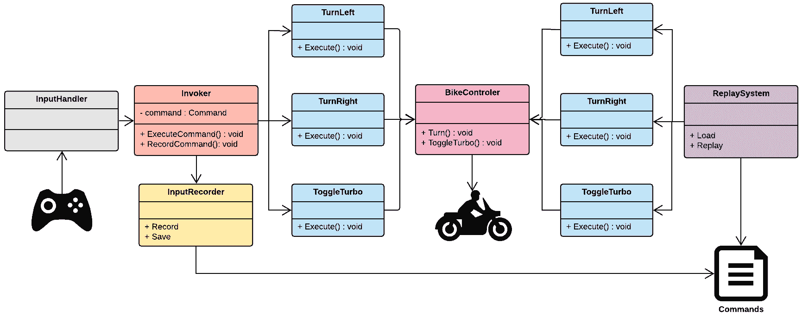

使用命令模式实现回放系统

在本章中，我们将使用一个经典的设计模式——命令，来实现我们赛车游戏的回放系统。其机制将记录玩家的控制器输入和相应的时间戳。这种方法将允许我们以正确的顺序和正确的时间播放记录的输入。

在赛车游戏中，回放功能通常是必需的。使用命令模式，我们将以可扩展和模块化的方式实现这个系统。这个模式提出了一种机制，允许封装执行“动作”或触发状态改变所需的信息。它还解耦了请求“动作”的对象与执行它的对象。这种封装和解耦使我们能够排队动作请求，以便我们可以在稍后执行它们。

所有这些都可能听起来非常抽象，但一旦我们实现了系统的核心组件，一切都将变得清晰。

本章将涵盖以下主题：

+   理解命令模式

+   设计回放系统

+   实现回放系统

+   审查替代解决方案

# 第十章：技术要求

下一章是实践性的，因此你需要对 Unity 和 C#有基本的了解。

本章的代码文件可以在 GitHub 上找到：[`github.com/PacktPublishing/Game-Development-Patterns-with-Unity-2021-Second-Edition/tree/main/Assets/Chapters/Chapter07`](https://github.com/PacktPublishing/Game-Development-Patterns-with-Unity-2021-Second-Edition/tree/main/Assets/Chapters/Chapter07)。

查看以下视频以查看代码的实际运行效果：[`bit.ly/3wAWYpb`](https://bit.ly/3wAWYpb)[.](https://bit.ly/3wAWYpb)

# 理解命令模式

想象一个平台游戏，当你按下空格键时，你可以跳过障碍物。在这种情况下，每次你按下这个输入键，你都是在要求屏幕上的角色改变状态并执行跳跃动作。在代码中，我们可以实现一个简单的`InputHandler`，它会监听玩家从空格键的输入，当玩家按下它时，我们会调用`CharacterController`来触发跳跃动作。

以下非常简化的伪代码总结了我们的想法：

```cs
using UnityEngine;
using System.Collections;

public class InputHandler : MonoBehaviour
{
    void Update()
    {
        if (Input.GetKeyDown("space"))
        {
            CharacterController.Jump();
        }
    }
}
```

如我们所见，这种方法可以完成任务，但如果我们要在以后的时间记录、撤销或回放玩家的输入，可能会变得复杂。然而，命令模式允许我们将调用操作的对象与知道如何执行它的对象解耦。换句话说，我们的`InputHandler`不需要知道当玩家按下空格键时需要采取什么具体动作。它只需要确保执行正确的*命令*，并让命令模式机制在幕后施展其魔法。

以下伪代码显示了当我们使用命令模式时，我们实现`InputHandler`的方式的差异：

```cs
using UnityEngine;
using System.Collections;

public class InputHandler : MonoBehaviour
{
    [SerializedField]
    private Controller _characterController;

    private Command _spaceButton;

    void Start()
    {
        _spaceButton = new JumpCommand();
    }

    void Update()
    {
        if (Input.GetKeyDown("space"))
            _spaceButton.Execute(_characterController);
    }
}
```

如我们所见，当玩家按下空格键时，我们并不是直接调用 `CharacterController`。我们实际上是将执行跳跃动作所需的所有信息封装到一个对象中，我们可以将其放入队列并在稍后重新调用。

让我们回顾以下图表，它展示了命令模式的实现：


图 7.1 – 命令模式的 UML 图

通过查看图表来学习命令模式不是正确的方法，但它确实帮助我们隔离了参与此模式的根本类：

+   `Invoker` 是一个知道如何执行命令并且可以记录已执行命令的对象。

+   `Receiver` 是一种可以接收命令并执行它们的对象类型。

+   `CommandBase` 是一个抽象类，一个具体的 `ConcreteCommand` 类必须继承它，并且它暴露了一个 `Execute()` 方法，`Invoker` 可以调用它来执行特定的命令。

模式中的每个参与者都有独特的责任和角色。一个良好的命令模式实现应该允许我们将动作请求封装为一个对象，该对象可以被排队并在稍后立即或执行。

命令模式是行为模式家族的一部分；它的近亲是备忘录、观察者和访问者。这些类型的模式通常关注责任的分配以及对象之间如何相互通信。

## 命令模式的优缺点

这些是命令模式的一些优点：

+   **解耦**：该模式允许将调用操作的对象与知道如何执行它的对象解耦。这种分离层允许添加一个中间件，它将能够记录和排队操作。

+   **顺序**：命令模式促进了排队用户输入的过程，这允许实现撤销/重做功能、宏和命令队列。

这是命令模式的一个潜在缺点：

+   **复杂性**：由于每个命令本身就是一个类，因此实现此模式需要许多类。并且需要很好地理解该模式才能维护使用它构建的代码。在大多数情况下，这不是问题，但如果你没有特定的目标而使用命令模式，它可能会成为代码库中不必要的复杂性和冗余层。

优缺点通常是情境性的；本书中提出的是一般的，而不是绝对的。因此，在选择模式时，分析其在自己的项目中的优缺点是至关重要的，不要基于一般陈述考虑或拒绝某个模式。

## 何时使用命令模式

这里是一个命令模式可能的用途简短列表：

+   **撤销**：实现大多数文本和图像编辑器中找到的撤销/重做系统。

+   **宏**：一个宏录制系统，玩家可以使用它来录制一系列攻击或防御组合。然后，将它们分配到输入键上以自动执行。

+   **自动化**：通过记录一组命令，使机器人能够自动和顺序地执行这些命令，从而自动化流程或行为。

总结来说，这是一个与存储、定时和用户输入排序相关的功能的好模式。如果你能非常富有创意地使用它，你甚至可以创建一些引人入胜的游戏系统和机制。

如果你不过分担心保持与原始学术描述的一致性，设计模式很有趣。如果你在实验中不失去模式的原意，你应该保留其核心优势。

# 设计重放系统

在描述我们将在本章中实现的重放系统设计之前，我们必须声明一些可能影响我们实现方式的游戏规格。

需要记住的规格如下：

+   **确定性**：我们游戏中的所有内容都是确定性的，这意味着我们没有具有随机行为的实体，这使得我们的重放系统更容易实现，因为我们不必担心记录场景中移动的实体（如敌机）的位置或状态。我们知道它们在重放序列中将以相同的方式移动和表现。

+   **物理**：我们尽量减少使用 Unity 引擎的物理特性，因为我们的实体运动不由任何物理属性或交互决定。因此，我们不必担心物体碰撞时出现意外行为。

+   **数字**：我们所有的输入都是数字的，所以我们不会费心去捕捉或处理来自摇杆或触发按钮的细粒度模拟输入数据。

+   **精度**：我们对重放输入的时间精度缺乏容忍。因此，我们不会期望输入在记录时精确地重现在同一时间范围内。*这种容忍水平将根据与所需重放功能精度相关的几个因素而变化。*

考虑到所有这些规格，我们将实现的重放系统将只记录玩家的输入，而不是自行车的当前位置。因为没有中间位置，自行车可能处于，这取决于玩家的输入，它将位于一条轨道或另一条轨道上。另外，还有一个需要注意的重要细节是，自行车不会向前移动。是轨道向玩家的位置移动，以产生移动和速度的错觉。

理论上，如果我们从比赛的开始和结束记录玩家的控制器输入，那么我们可以在新比赛的开始时重放记录的输入，从而模拟玩家的游戏过程。我们有一个图解说明了重放系统背后的机制：



图 7.2 – 重放系统的示意图

如图中所示，`InputRecorder` 记录并序列化输入，以便 `ReplaySystem` 可以稍后回放它们。在回放序列中，`ReplaySystem` 的行为类似于机器人，因为它控制自行车并通过回放玩家的输入来自动操纵它。这是一种简单的自动化形式，给人一种我们在观看回放视频的错觉。

在下一节中，我们将实现我们刚刚审查的系统的简化版本，并使用命令模式作为其基础。

# 实现回放系统

为了简化起见，本节包含伪代码。如果您希望在真实游戏项目的上下文中查看完整的实现，请打开 GitHub 项目中的 `FPP` 文件夹。链接可以在 *技术要求* 部分找到。

在本节中，我们将使用命令模式作为基础构建一个简单的输入回放系统原型。

## 实现回放系统

实现将分为两部分。在第一部分，我们将编写命令模式的核心理念，然后我们将集成测试回放系统所必需的元素：

1.  首先，我们正在实现一个名为 `Command` 的基抽象类，它有一个名为 `Execute()` 的单一方法：

```cs
public abstract class Command
{
    public abstract void Execute();
}
```

1.  现在我们将编写三个具体的命令类，它们将派生自 `Command` 基类，然后我们将实现 `Execute()` 方法。每个类封装了一个要执行的操作。

第一个操作是在 `BikeController` 上打开涡轮增压：

```cs
namespace Chapter.Command
{
    public class ToggleTurbo : Command
    {
        private BikeController _controller;

        public ToggleTurbo(BikeController controller)
        {
            _controller = controller;
        }

        public override void Execute()
        {
            _controller.ToggleTurbo();
        }
    }
}
```

1.  以下两个命令是 `TurnLeft` 和 `TurnRight` 命令。每个命令代表不同的动作，并映射到特定的输入键，正如我们将在实现 `InputHandler` 时看到的那样：

```cs
namespace Chapter.Command
{
    public class TurnLeft : Command
    {
        private BikeController _controller;

        public TurnLeft(BikeController controller)
        {
            _controller = controller;
        }

        public override void Execute()
        {
            _controller.Turn(BikeController.Direction.Left);
        }
    }
}
```

1.  以下命令表示右转动作，正如其名称所暗示的，这将自行车转向右边：

```cs
namespace Chapter.Command
{
    public class TurnRight : Command
    {
        private BikeController _controller;

        public TurnRight(BikeController controller)
        {
            _controller = controller;
        }

        public override void Execute()
        {
            _controller.Turn(BikeController.Direction.Right);
        }
    }
}
```

现在我们已经将每个命令封装到单独的类中，是时候编写使我们的回放系统工作的关键成分了——`Invoker`。

`Invoker` 是一个细心的簿记员；它跟踪已执行的命令，并在账簿中记录。我们在代码中以 `SortedList` 的形式表示这个账簿，这是一个具有键/值结构的本地 C# 排序列表。这个列表将跟踪特定命令何时被执行。

1.  因为这个类非常长，我们将分两部分来审查。以下是一部分：

```cs
using UnityEngine;
using System.Linq;
using System.Collections.Generic;

namespace Chapter.Command
{
    class Invoker : MonoBehaviour
    {
        private bool _isRecording;
        private bool _isReplaying;
        private float _replayTime;
        private float _recordingTime;
        private SortedList<float, Command> _recordedCommands = 
            new SortedList<float, Command>();

        public void ExecuteCommand(Command command)
        {
            command.Execute();

            if (_isRecording) 
                _recordedCommands.Add(_recordingTime, command);

            Debug.Log("Recorded Time: " + _recordingTime);
            Debug.Log("Recorded Command: " + command);
        }

        public void Record()
        {
            _recordingTime = 0.0f;
            _isRecording = true;
        }
```

在 `Invoker` 类的这一部分，每次 `Invoker` 执行一个新的命令时，我们都会将其添加到 `_recordedCommands` 排序列表中。然而，我们只在开始录制时这样做，因为我们希望在特定的时刻记录玩家输入，例如在比赛开始时。

1.  对于 `Invoker` 类的下一部分，我们将实现回放行为：

```cs
        public void Replay()
        {
            _replayTime = 0.0f;
            _isReplaying = true;

            if (_recordedCommands.Count <= 0)
                Debug.LogError("No commands to replay!");

            _recordedCommands.Reverse();
        }

        void FixedUpdate()
        {
            if (_isRecording) 
                _recordingTime += Time.fixedDeltaTime;

            if (_isReplaying)
            {
                _replayTime += Time.deltaTime;

                if (_recordedCommands.Any()) 
                {
                    if (Mathf.Approximately(
                        _replayTime, _recordedCommands.Keys[0])) {

                        Debug.Log("Replay Time: " + _replayTime);
                        Debug.Log("Replay Command: " + 
                                  _recordedCommands.Values[0]);

                        _recordedCommands.Values[0].Execute();
                        _recordedCommands.RemoveAt(0);
                    }
                }
                else
                {
                    _isReplaying = false;
                }
            }
        }
    }
}
```

如您可能已经注意到的，我们正在使用`FixedUpdate()`来记录和回放命令。这可能会显得有些奇怪，因为我们通常使用`Update()`来监听玩家输入。然而，`FixedUpdate()`具有在固定时间步长中运行的优点，这对于时间依赖但帧率无关的任务非常有帮助。

因此，我们知道默认的引擎时间步长是 0.02 秒，并且我们的时间戳将以类似的增量增加，因为我们使用`Time.fixedDeltaTime`来记录执行命令的时间。

然而，这也意味着我们在记录阶段会失去精度，因为我们的时间戳受限于 Unity 的时间步长设置。在这个例子中，这种精度损失是可以容忍的。然而，如果游戏玩法和回放序列之间存在重大不一致，这可能会成为一个问题。

在这种情况下，我们可能需要考虑一个包括`Update()`、`Time.deltaTime`以及允许我们设置比较记录和回放时间精度程度的值的解决方案。然而，这超出了本章的范围。

我们应该注意，我们正在赋予`Invoker`记账和回放的责任。有人可能会认为，通过给`Invoker`赋予过多的责任，我们已经违反了单一职责原则。在这个上下文中，这不是一个问题；这只是一个用于教育目的的代码示例。尽管如此，将记录、保存和回放命令的责任封装在单独的类中仍然是一个明智的选择。

## 测试回放系统

现在我们已经建立了命令模式和回放系统的核心成分，是时候测试它是否正常工作了：

1.  我们将要实现的第一类是`InputHandler`。其主要职责是监听玩家的输入并调用适当的命令。然而，由于其长度，我们将分两部分来审查它：

```cs
using UnityEngine;

namespace Chapter.Command
{
    public class InputHandler : MonoBehaviour
    {
        private Invoker _invoker;
        private bool _isReplaying;
        private bool _isRecording;
        private BikeController _bikeController;
        private Command _buttonA, _buttonD, _buttonW;

        void Start()
        {
            _invoker = gameObject.AddComponent<Invoker>();
            _bikeController = FindObjectOfType<BikeController>();

            _buttonA = new TurnLeft(_bikeController);
            _buttonD = new TurnRight(_bikeController);
            _buttonW = new ToggleTurbo(_bikeController);
        }

        void Update()
        {
            if (!_isReplaying && _isRecording)
            {
                if (Input.GetKeyUp(KeyCode.A)) 
                    _invoker.ExecuteCommand(_buttonA);

                if (Input.GetKeyUp(KeyCode.D)) 
                    _invoker.ExecuteCommand(_buttonD);

                if (Input.GetKeyUp(KeyCode.W)) 
                    _invoker.ExecuteCommand(_buttonW);
            }
        }
```

在这个类的这个部分，我们初始化我们的命令并将它们映射到特定的输入。请注意，我们在命令的构造函数中传递了一个`BikeController`的实例。`InputHandler`只知道`BikeController`的存在，但不需要了解其功能。根据所需操作，调用自行车控制器的适当公共方法是个别命令类的责任。在`Update()`循环中，我们监听特定的按键输入，并调用`Invoker`执行与特定输入关联的命令。

这段代码使得记录玩家输入成为可能。我们并没有直接调用`BikeController`，也没有执行命令。相反，我们允许`Invoker`充当一个中介，并完成所有工作。这种方法允许它在后台记录玩家输入，以备后用。

1.  对于 `InputHandler` 类的最后一部分，我们添加了一些 GUI 调试按钮，这将帮助我们测试回放系统。此段代码仅用于调试和测试目的：

```cs
        void OnGUI()
        {
            if (GUILayout.Button("Start Recording"))
            {
                _bikeController.ResetPosition();
                _isReplaying = false;
                _isRecording = true;
                _invoker.Record();
            }

            if (GUILayout.Button("Stop Recording"))
            {
                _bikeController.ResetPosition();
                _isRecording = false;
            }

            if (!_isRecording)
            {
                if (GUILayout.Button("Start Replay"))
                {
                    _bikeController.ResetPosition();
                    _isRecording = false;
                    _isReplaying = true;
                    _invoker.Replay();
                }
            }
        }
    }
}
```

1.  对于我们的最终类，我们将实现 `BikeController` 类的骨架版本以供测试。在命令模式的上下文中，它充当接收者：

```cs
using UnityEngine;

public class BikeController : MonoBehaviour
{
    public enum Direction
    {
        Left = -1,
        Right = 1
    }

    private bool _isTurboOn;
    private float _distance = 1.0f;

    public void ToggleTurbo()
    {
        _isTurboOn = !_isTurboOn;
        Debug.Log("Turbo Active: " + _isTurboOn.ToString());
    }

    public void Turn(Direction direction)
    {
        if (direction == Direction.Left) 
            transform.Translate(Vector3.left * _distance);

        if (direction == Direction.Right)
            transform.Translate(Vector3.right * _distance);
    }

    public void ResetPosition()
    {
        transform.position = new Vector3(0.0f, 0.0f, 0.0f);
    }
}

```

类的总体目的和结构是显而易见的。`ToggleTurbo()` 和 `Turn()` 是被命令类调用的公共方法。然而，`ResetPosition()` 仅用于调试和测试目的，可以忽略。

要在您的 Unity 实例中测试此代码，您需要完成以下步骤：

1.  开始一个新的空 Unity 场景，其中至少包含一个灯光和一个摄像机。

1.  在新场景中添加一个 3D GameObject，例如一个立方体，并确保它可以从场景的主摄像机中看到。

1.  将 `InputHandler` 和 `BikeController` 类附加到新的 GameObject 上。

1.  在运行时，如果您已将我们刚刚审查的所有类复制到您的项目中，您应该在屏幕上看到以下内容：


图 7.3 – Unity 中代码执行截图

当您开始录制时，您将能够沿水平轴移动立方体。每个输入都可以按记录的相同顺序和时序进行回放。

## 实现回顾

我们通过使用命令模式作为基础，完成了构建快速输入回放系统的过程。当然，本章中的代码示例并不是生产就绪的，而且非常有限。尽管如此，本章的目标是学习如何使用命令模式与 Unity 结合，而不是设计一个完整的回放系统。

在 GitHub 项目的 `FPP` 文件夹中的游戏原型项目中，我们确实实现了一个包含序列化和倒退功能的更高级的回放系统示例。我们建议您查看它，当然，您可以根据自己的意愿进行修改。

在下一节中，我们将回顾一些替代解决方案和方法，我们本可以使用它们来构建我们的回放系统。

# 替代解决方案回顾

即使命令模式非常适合我们的用例，我们还可以考虑一些替代模式和解决方案：

+   **备忘录模式（Memento）**：备忘录模式提供了将对象回滚到先前状态的能力。这并不是我们为回放系统选择的第一方案，因为我们更关注记录输入并将它们排队以供稍后回放，这与命令模式的意图非常兼容。然而，如果我们实现了一个具有回滚到先前状态功能的系统，备忘录模式可能将是我们的首选。

+   **队列/栈**：队列和栈不是模式，而是数据结构，但我们可以简单地编码所有输入，并将它们直接存储在我们的`InputHandler`类中的队列中。这将比使用命令模式更直接、更简洁。在实现具有或没有传统设计模式的系统之间的选择非常具体。如果一个系统足够简单，那么设计模式可能带来的额外冗长和复杂性可能会超过使用它的潜在好处。

# 摘要

在本章中，我们通过使用命令模式实现了一个简单但功能性的回放系统。我们编写本章的目标不是展示如何构建一个健壮的回放系统，而是展示如何使用命令模式在 Unity 中创建可能对游戏项目有用的东西。

我希望你会研究实现命令模式的替代方法，这些方法可能比本书中展示的更好，因为，就像编程中的大多数事情一样，没有一种唯一的方法来做事情。然而，至少这一章提供了使用 Unity 中的命令模式的第一种方法。

在本书的下一部分，我们将开始使用对象池来优化我们的代码。一款优秀的赛车游戏的一个重要方面是保持一致的性能和帧率。每一刻都必须运行顺畅，否则可能会让我们的游戏感觉缓慢和笨拙。
