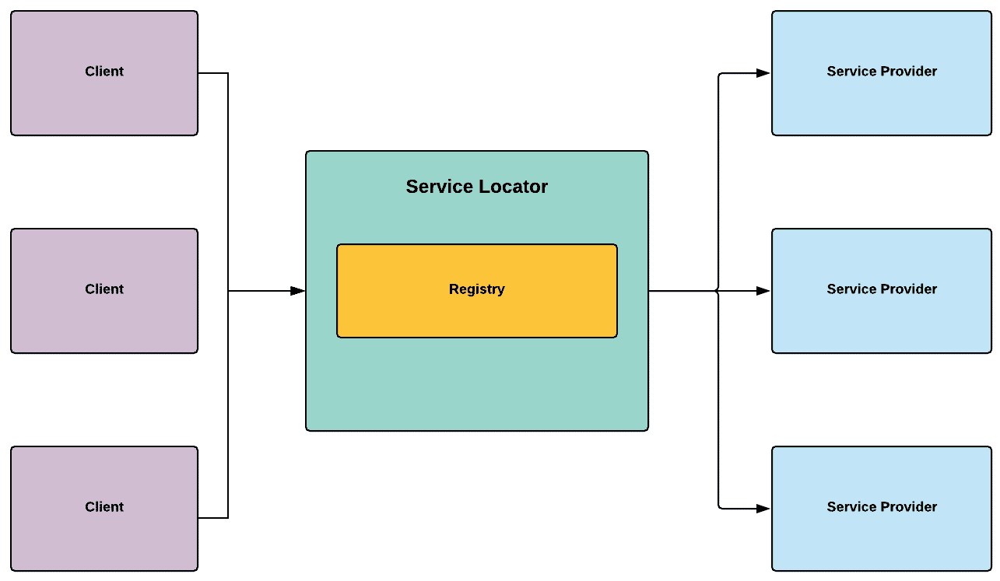

使用服务定位器模式管理依赖项

本章将简短，因为我们将要审查的服务定位器模式简单且高效。该模式的核心理念非常直接：它围绕着一个中央注册表，该注册表包含初始化的依赖项。但为了更精确，这些依赖项是提供特定服务的组件，我们可以通过我们称之为“服务合约”的接口来公开这些服务。因此，当客户端需要调用特定的服务时，它不需要知道如何定位和初始化它；它只需要询问服务定位器模式，然后它将完成所有工作以满足服务合约。

正如我们将在本章中看到的，这是一个相当简单的设计，易于实现。

在本章中，我们将涵盖以下主题：

+   理解服务定位器模式

+   实现服务定位器模式

+   查看替代解决方案

为了学习目的，我们简化了本章的代码示例，以展示模式的核心理念，而不被实现细节所分散。因此，显示的代码既未优化，也未充分上下文化，不能直接用于项目。

# 第二十章：技术要求

以下章节是实践性的，因此您需要对 Unity 和 C#有基本的了解。

我们将使用以下 Unity 特定的引擎和 C#语言概念：

+   静态

+   泛型

如果不熟悉这些概念，请查阅第三章，《Unity 编程简明指南》。

本章的代码文件可以在 GitHub 上找到，地址为[`github.com/PacktPublishing/Game-Development-Patterns-with-Unity-2021-Second-Edition/tree/main/Assets/Chapters/Chapter16`](https://github.com/PacktPublishing/Game-Development-Patterns-with-Unity-2021-Second-Edition/tree/main/Assets/Chapters/Chapter16)。

查看以下视频以查看代码的实际运行情况：[`bit.ly/36AKWli`](https://bit.ly/36AKWli)

静态是一个关键字修饰符。在类中声明为静态的方法可以在不实例化对象的情况下调用。

# 理解服务定位器模式

与更传统的模式相比，服务定位器模式背后的学术理论较少，其整体设计非常实用。正如其名称所暗示的，其目的是为客户端定位服务。它通过维护一个提供特定服务的对象的中央注册表来实现这一点。

让我们回顾一个典型服务定位器实现的示意图：



图 16.1 – 服务定位器模式的示意图

如我们所见，我们很容易说服务定位器模式充当了客户端（请求者）和服务提供者之间的代理，这种方法在一定程度上将它们解耦。客户端只有在需要解决依赖并需要访问服务时才需要调用服务定位器模式。我们可以说，服务定位器模式的作用类似于餐厅中的服务员，从客户端接收订单，并在餐厅提供的各种服务与其客户之间充当中间人。

在某些圈子中，服务定位器模式有一个坏名声；专家们经常批评它是一种反模式。这种批评的核心原因是它违反了几个编码最佳实践，因为它隐藏了类依赖关系而不是暴露它们。因此，这可能会使你的代码更难维护和测试。

## 服务定位器模式的好处和缺点

下面是使用服务定位器模式的一些潜在好处：

+   **运行时优化**：服务定位器模式可以通过动态检测更优化的库或组件来优化应用程序，以完成特定的服务，这取决于运行时环境。

+   **简单性**：服务定位器是实现依赖管理模式中最直接的一种，它没有依赖注入（**DI**）框架那样陡峭的学习曲线。因此，你可以快速在项目中开始使用它，或者教给同事。

使用服务定位器模式的缺点如下：

+   **黑盒化**：服务定位器模式的注册表模糊了类依赖关系。因此，如果依赖项缺失或注册不正确，一些问题可能会在运行时而不是在编译时出现。

+   **全局依赖**：如果过度使用且意图不正确，服务定位器模式本身可能会成为一个难以管理的全局依赖。你的代码将过度依赖它，最终，将其从其他核心组件中解耦将变得困难。

服务定位器模式在 Java 开发者中很受欢迎；它在 2004 年马丁·福勒（Martin Fowler）发表的一篇博客文章中被部分定义，你可以在这里阅读：

[`martinfowler.com/articles/injection.html`](https://martinfowler.com/articles/injection.html)

## 何时使用服务定位器模式

关于何时使用服务定位器模式的问题，根据其描述是显而易见的。例如，如果你有一系列需要动态访问的服务，但又想封装获取这些服务的过程，那么这种模式可以提供解决方案。

但在考虑使用服务定位器模式时，我们还应该考虑不使用它的情况。因为服务定位器模式通常全局可访问，正如其名称所暗示的，它应该定位并提供对服务的访问。那么，我们只应该用它来暴露具有全局范围的服务。

例如，我们需要访问**抬头显示**（**HUD**）来更新其**用户界面**（**UI**）组件之一。我们应该考虑将 HUD 视为一个全局服务，通过服务定位器模式来访问吗？答案应该是否定的，因为 HUD 只在游戏的某些部分出现，并且应该仅在特定上下文中由特定的组件访问。但是，如果我们设计一个自定义的日志系统，我们可以通过服务定位器模式来证明其暴露的合理性，因为我们可能需要在代码的任何地方独立于上下文和范围来记录信息。

既然我们已经了解了理论，让我们动手编写一个服务定位器模式，以提供对日志记录器、分析系统和**广告网络**（**ad network**）提供者的访问。

# 实现服务定位器模式

我们将实现一个基本的服务定位器模式来公开三个特定的服务，如下所示：

+   **日志记录器**：一个充当集中式日志系统门面的服务

+   **分析**：一个将自定义分析信息发送到后端以提供对玩家行为的洞察的服务

+   **广告**：一个从网络拉取视频**广告**（**ads**）并将其显示出来以在特定时刻为游戏内容赚钱的服务

我们将这些服务添加到服务定位器模式的注册表中，是因为它们具有以下特点：

+   它们提供特定的服务。

+   它们需要从代码库的任何地方都可以访问。

+   它们可以被模拟或移除，而不会对游戏代码造成任何回归。

正如我们将在以下代码示例中看到的那样，实现基本的服务定位器模式是一个简单的过程。我们将采取以下步骤：

1.  让我们从实现最重要的成分——`ServiceLocator`类开始，如下所示：

```cs
using System;
using System.Collections.Generic;

namespace Chapter.ServiceLocator
{
    public static class ServiceLocator
    {
        private static readonly 
            IDictionary<Type, object> Services = 
                new Dictionary<Type, Object>();

        public static void RegisterService<T>(T service)
        {
            if (!Services.ContainsKey(typeof(T)))
            {
                Services[typeof(T)] = service;
            }
            else
            {
                throw new 
                    ApplicationException
                    ("Service already registered");
            }
        }

        public static T GetService<T>()
        {
            try
            {
                return (T) Services[typeof(T)];
            }
            catch
            {
                throw new 
                    ApplicationException
                    ("Requested service not found.");
            }
        }
    }
}
```

这种服务定位器模式有三个主要职责，如下所述：

+   它以`Dictionary`的形式管理服务注册表。

+   它提供了一个名为`RegisterService()`的静态函数，允许一个对象被注册为服务。

+   当通过`GetService()`函数请求时，它返回特定类型的`service`实例。

它必须考虑到`RegisterService()`和`GetService()`都是静态函数，因此它们可以直接访问，无需初始化`ServiceLocator`类。

`Services`字典包含可用的服务列表，我们将其标记为`readonly`和`private`；因此，我们保护它不被覆盖或直接访问。相反，客户端必须通过 Service Locator 模式公开的方法来添加或获取服务。

现在我们有了准备好的 Service Locator 类，我们现在可以开始以接口的形式实现一些服务合同。

1.  我们的第一个接口是为`Logger`服务，如下面的代码片段所示：

```cs
namespace Chapter.ServiceLocator
{
    public interface ILoggerService
    {
        void Log(string message);
    }
}
```

1.  下一个接口是为`Analytics`服务，正如我们在这里看到的：

```cs
namespace Chapter.ServiceLocator
{
    public interface IAnalyticsService
    {
        void SendEvent(string eventName);
    }
}
```

1.  最后，我们实现了我们的`Advertisement`服务接口的代码，如下所示：

```cs
namespace Chapter.ServiceLocator
{
    public interface IAdvertisement
    {
        void DisplayAd();
    }
}
```

1.  现在，我们将实现具体的服务类，从`Logger`类开始。完成此任务的代码如下所示：

```cs
using UnityEngine;

namespace Chapter.ServiceLocator
{
    public class Logger: ILoggerService
    {
        public void Log(string message)
        {
            Debug.Log("Logged: " + message);
        }
    }
}
```

1.  接下来是`Analytics`类。以下是实现此功能所需的代码：

```cs
using UnityEngine;

namespace Chapter.ServiceLocator
{
    public class Analytics : IAnalyticsService
    {
        public void SendEvent(string eventName)
        {
            Debug.Log("Sent: " + eventName);
        }
    }
}
```

1.  最后，我们实现了我们的具体`Advertisement`服务类，如下所示：

```cs
using UnityEngine;

namespace Chapter.ServiceLocator
{
    public class Advertisement : IAdvertisement
    {
        public void DisplayAd()
        {
            Debug.Log("Displaying video advertisement");
        }
    }
}
```

现在，我们有一个可以注册和从任何地方访问服务的 Service Locator 模式。

## 测试 Service Locator 模式

为了测试我们实现的 Service Locator 模式，让我们编写一个客户端类，我们将将其作为组件附加到一个空 Unity 场景中的 GameObject 上，如下所示：

```cs
using UnityEngine;

namespace Chapter.ServiceLocator
{
    public class ClientServiceLocator : MonoBehaviour
    {
        void Start() {
            RegisterServices();
        }

        private void RegisterServices() {
            ILoggerService logger = new Logger();
            ServiceLocator.RegisterService(logger);

            IAnalyticsService analytics = new Analytics();
            ServiceLocator.RegisterService(analytics);

            IAdvertisement advertisement = new Advertisement();
            ServiceLocator.RegisterService(advertisement);
        }

        void OnGUI()
        {
            GUILayout.Label("Review output in the console:");

            if (GUILayout.Button("Log Event")) {
                ILoggerService logger = 
                    ServiceLocator.GetService<ILoggerService>();

                logger.Log("Hello World!");
            }

            if (GUILayout.Button("Send Analytics")) {
                IAnalyticsService analytics = 
                    ServiceLocator.GetService<IAnalyticsService>();

                analytics.SendEvent("Hello World!");
            }

            if (GUILayout.Button("Display Advertisement")) {
                IAdvertisement advertisement = 
                    ServiceLocator.GetService<IAdvertisement>();

                advertisement.DisplayAd();
            }
        }
    }
}
```

需要注意的是，在实际的 Unity 项目中实现服务定位器模式时，我们应该尽可能早地在游戏的生命周期中注册我们的服务，以确保它们始终可用——例如，这个任务可以分配给我们在项目第一个场景中初始化的`GameManager`对象。如果我们知道当玩家开始游戏时场景和游戏管理器对象总是会被加载，我们就确信服务定位器模式的注册会在客户端开始请求访问服务之前更新。

我们方法的一个关键好处是我们通过引用它们的接口来注册服务，这意味着在我们注册服务的那一刻，我们可以选择使用哪个具体实现。因此，我们可以在调试构建中轻松地运行每个服务的模拟版本。此外，这种方法将避免在**质量保证**（**QA**）阶段向日志和数据分析中添加噪音。

因此，这是该模式的一个酷特性；你可以根据运行时环境动态注入各种服务版本。

使用 Unity 作为你的引擎的主要好处之一是它提供了一系列集成服务，包括广告和数据分析服务，因此大多数时候，你不需要手动实现它们。你可以在以下链接中了解可用的 Unity 服务范围：[`docs.unity3d.com/Manual/UnityServices.html.`](https://docs.unity3d.com/Manual/UnityServices.html)

# 审查替代方案

如果您在代码库中管理依赖项时遇到问题，可能该开始调查使用 DI 框架了。DI 是一种技术，其中对象通过“注入机制”接收它需要的依赖项。对象可以通过几种方式接收其依赖项——通过构造函数、setter 或甚至是一个提供注入方法接口。

以结构化方式开始使用 DI 的最佳方式是通过框架，因为这为您在管理对象之间复杂关系、初始化过程和依赖项的生命周期提供了帮助。总之，当您看到类之间存在紧密耦合，并且它们的依赖项成为编写一致、可测试和可维护代码的瓶颈时，您应该开始考虑使用 DI 框架。

**Extenject** 是一个免费的 Unity DI 框架，可以从 Asset Store 下载：

[`assetstore.unity.com/packages/tools/utilities/extenject-dependency-injection-ioc-157735`](https://assetstore.unity.com/packages/tools/utilities/extenject-dependency-injection-ioc-157735)

# 摘要

在本章中，我们回顾了服务定位器模式。这个模式是解决对象之间依赖服务（功能）管理重复挑战的一个简单解决方案。在其最简单的形式中，服务定位器模式解耦了客户端（请求者）与服务提供者之间的关系。

我们的旅程已经到达终点，因为这是本书的最后一章。我们希望您喜欢每一章的内容。请记住，本书中提出的概念只是入门，不是关于主题的最终结论。关于设计模式、Unity 和游戏开发还有很多东西要学习——多到我们无法在一本书中定义清楚。因此，我们鼓励您继续学习，将每一章中我们一起回顾的内容做得更好，因为总有改进的空间。
