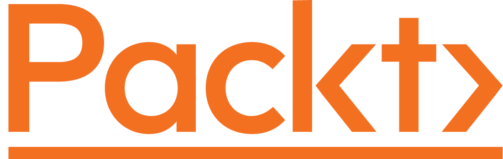

关于 Packt

[Packt.com](https://subscribe.packtpub.com/)

订阅我们的在线数字图书馆，全面访问超过 7,000 本书籍和视频，以及领先的行业工具，帮助您规划个人发展并提升职业生涯。更多信息，请访问我们的网站。

# 第二十一章：为什么订阅？

+   使用来自超过 4,000 位行业专业人士的实用电子书和视频，节省学习时间，增加编码时间

+   通过为您量身定制的技能计划提高您的学习效果

+   每月免费获得一本电子书或视频

+   全文可搜索，方便快速获取关键信息

+   复制粘贴，打印和收藏内容

您知道 Packt 为每本书都提供电子书版本，并提供 PDF 和 ePub 文件吗？您可以在 [www.packt.com](http://www.packt.com) 升级到电子书版本，并且作为印刷书客户，您有权获得电子书副本的折扣。如需了解更多详情，请联系我们 `customercare@packtpub.com`。

在 [www.packt.com](http://www.packt.com)，您还可以阅读一系列免费的技术文章，订阅各种免费通讯，并享受 Packt 书籍和电子书的独家折扣和优惠。
