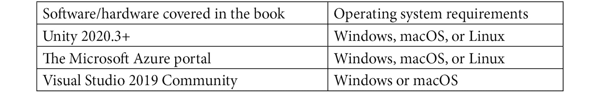

# 前言

作为世界上最广泛使用的游戏引擎之一，Unity 提供了易于使用且功能强大的游戏开发工具，这无疑吸引了众多开发者选择它来开发自己的游戏。然而，现代游戏开发所需工具不仅限于游戏引擎；其他工具和服务，如云服务，在游戏开发中的应用也越来越广泛。在本书中，我们将探讨如何使用 Unity 游戏引擎和 Microsoft Game Dev，包括 Microsoft Azure 云和 Microsoft Azure PlayFab 服务，来创建游戏。

从理解 Unity 游戏引擎的基本原理开始，你将逐渐熟悉 Unity 编辑器和用 C#编写 Unity 脚本的关键概念，这将为你制作自己的游戏做好准备。

然后，你将学习如何使用 Unity 的内置模块，例如 UI 系统、动画系统、物理系统，以及如何在游戏中集成视频和音频，使你的游戏更加有趣。

随着你逐步阅读各章节，我将带你深入了解高级主题，例如计算机图形学中涉及的数学知识、如何在 Unity 中使用新的可脚本化渲染管线创建后处理效果、如何使用 Unity 的 C#作业系统实现多线程，以及如何使用 Unity 的**实体组件系统（ECS**）以数据导向的方式编写游戏逻辑代码，从而提高游戏性能。

在阅读过程中，你还将了解 Microsoft Game Dev、Azure 云服务、Azure PlayFab，以及如何使用 Unity3D PlayFab SDK 访问 PlayFab API 以从云中保存和加载数据。

在阅读完本书后，你将熟悉 Unity 游戏引擎，对 Azure 云有高层次的理解，并准备好开发自己的游戏。

# 本书面向对象

本书面向具有中级.NET 和 C#编程经验的开发者，他们希望学习使用 Unity 进行游戏开发。假设读者具备基本的 C#编程经验。

# 本书涵盖内容

*第一章*，*Hello Unity*，介绍了 Unity 游戏引擎的基本原理。从 Unity 的安装过程开始，然后探索编辑器，你还将了解 Unity 提供的.NET 配置文件和脚本后端，最后，你将全面了解 Unity。

*第二章*，*Unity 中的脚本概念*，从上一章继续，详细介绍了 Unity 中的脚本。它首先介绍了 Unity 脚本中最常用的类，然后解释了脚本的生命周期。它还涵盖了如何在 Unity 中创建新的脚本，并将脚本作为组件附加到 GameObject 上，并通过 Unity 包管理器演示了如何添加或删除包。

*第三章*, *使用 Unity UI 系统开发 UI*，介绍了在 Unity 中常用的不同类型的 UI 元素。此外，本章还讨论了如何通过使用**模型-视图-视图模型**（**MVVM**）架构模式在 Unity 中开发 UI。最后，探讨了针对 Unity UI 的优化技巧。

*第四章*, *使用 Unity 动画系统创建动画*，涵盖了 Unity 动画系统最重要的概念，如动画剪辑、Animator 控制器、Avatar 和 Animator 组件。在这里，你将使用动画系统实现 3D 和 2D 动画。最后，探讨了针对 Unity 动画系统的优化技巧。

*第五章*, *与 Unity 物理系统协同工作*，概述了 Unity 提供的物理解决方案，包括两个内置物理解决方案，即 NVIDIA PhysX 引擎和 Box2D 引擎。它还涵盖了 Unity 物理系统中的关键概念，如碰撞体和刚体。在这里，你将实现一个基于物理的乒乓球游戏。最后，探讨了针对 Unity 物理系统的优化技巧。

*第六章*, *在 Unity 项目中集成音频和视频*，涵盖了 Unity 音频系统和视频系统中的关键概念，如音频剪辑资产、Audio Source 组件、Audio Listener 组件和 Video Player 组件。最后，探讨了针对 Unity 音频系统的优化技巧。

*第七章*, *在 Unity 中理解计算机图形学的数学原理*，涵盖了与计算机图形学相关的数学，例如坐标系、向量、矩阵和四元数。

*第八章*, *Unity 中的可脚本渲染管线概述*，介绍了在 Unity 中选择的三种现成的渲染管线，即传统的内置渲染管线和基于可脚本渲染管线的两个预制渲染管线，分别是通用渲染管线和高清晰度渲染管线。它还涵盖了如何使用通用渲染管线资产来配置渲染管线，以及如何使用体积框架将后处理效果应用于游戏。最后，探讨了针对通用渲染管线的优化技巧。

*第九章*, *在 Unity 中使用面向数据的技术堆栈*，介绍了面向数据设计的概念以及面向数据设计与传统面向对象设计的区别。它还探讨了 Unity 中的**面向数据的技术堆栈**（**DOTS**）及其构成的三个技术模块——即 C#作业系统、ECS 和 Burst 编译器。

*第十章*, *Unity 和 Azure 中的序列化系统与资产管理*，讨论了 Unity 中的二进制序列化、YAML 序列化和 JSON 序列化。它还涵盖了 Unity 中的资产工作流程，并以探索如何在 Azure 云中创建 Azure Blob 存储服务以及如何将 Azure 中的可寻址内容加载到 Unity 项目中结束。

*第十一章*, *使用 Microsoft Game Dev、Azure 云、PlayFab 和 Unity 进行工作*，讨论了 Microsoft Game Dev、Microsoft Azure 云和 Azure PlayFab 是什么，以及为什么您应该考虑在游戏开发中使用它们。在这里，您将通过 Azure PlayFab 的 API 在 Unity 项目中实现注册、登录和排行榜功能。

# 要充分利用本书

本书假设您对.NET 和 C#有一定了解。本书涵盖了基本概念、Unity 游戏引擎的高级主题，以及其他技术，如 Microsoft Azure 云和 Azure PlayFab。

您还需要在您的计算机上安装**长期支持**（**LTS**）版本的 Unity – 推荐使用 2020 或更高版本。您可以在*第一章**，Hello Unity*中找到如何在您的计算机上安装 Unity 的说明。所有代码示例都在 Windows 操作系统上的 Unity 2020.3.24 上进行了测试。然而，它们也应该适用于未来的版本发布。

您还需要一个 Microsoft Azure 云订阅，您可以在以下链接申请免费 Azure 账户：[`azure.microsoft.com/en-in/free/`](https://azure.microsoft.com/en-in/free/)。



如果您希望从我们的 GitHub 存储库下载示例项目，您将需要一个 Git 客户端；我们推荐 GitHub Desktop，因为它是最容易使用的。您可以从以下链接下载：[`desktop.github.com`](https://desktop.github.com)。

如果您使用的是 Windows 操作系统，您还可以考虑使用 Git for Windows。您可以从以下链接下载：[`git-scm.com/download/win`](https://git-scm.com/download/win)。

**如果您使用的是本书的数字版，我们建议您自己输入代码或从本书的 GitHub 存储库（下一节中有一个链接）访问代码。这样做将帮助您避免与代码复制和粘贴相关的任何潜在错误。**

# 下载示例代码文件

本书代码包托管在 GitHub 上，网址为[`github.com/PacktPublishing/Game-Development-with-Unity-for-.NET-Developers`](https://github.com/PacktPublishing/Game-Development-with-Unity-for-.NET-Developers)。如果代码有更新，它将在现有的 GitHub 存储库中更新。

我们还有其他来自我们丰富的图书和视频目录的代码包，可在[`github.com/PacktPublishing/`](https://github.com/PacktPublishing/)找到。查看它们！

# 下载彩色图像

我们还提供了一份包含本书中使用的截图和图表彩色图像的 PDF 文件。您可以从这里下载：[`static.packt-cdn.com/downloads/9781801078078_ColorImages.pdf`](https://static.packt-cdn.com/downloads/9781801078078_ColorImages.pdf)。

# 使用的约定

本书使用了多种文本约定。

**文本中的代码**: 表示文本中的代码词汇、数据库表名、文件夹名、文件名、文件扩展名、路径名、虚拟 URL、用户输入和 Twitter 昵称。以下是一个示例：“如果某些内容是通过`OnCollisionEnter`在对象碰撞开始时生成的，并且您想在对象碰撞结束时销毁它们，那么您应该考虑使用`OnCollisionExit`。”

代码块设置如下：

```cs
using UnityEngine;
public class TriggerTest : MonoBehaviour
{
    private void OnTriggerStay(Collider other)
    {
        Debug.Log($"{this} stays {other}");
    }
}
} 
```

当我们希望您注意代码块中的特定部分时，相关的行或项目将以粗体显示：

```cs
using UnityEngine;
public class PingPongBall : MonoBehaviour
{
    [SerializeField] private Rigidbody _rigidbody;
    [SerializeField] private Vector3 _initialImpulse;
    private void Start()
    {
        _rigidbody.AddForce(_initialImpulse,
          ForceMode.Impulse);
    }
}
```

**粗体**: 表示新术语、重要词汇或您在屏幕上看到的词汇。例如，菜单或对话框中的文字以**粗体**显示。以下是一个示例：“选择**3D 对象** | **平面**以在编辑器中创建一个新的**平面**对象。”

小贴士或重要注意事项

它看起来像这样。

# 联系我们

我们始终欢迎读者的反馈。

**一般反馈**: 如果您对本书的任何方面有疑问，请通过 mailto:customercare@packtpub.com 给我们发邮件，并在邮件主题中提及书名。

**勘误**: 尽管我们已经尽最大努力确保内容的准确性，但错误仍然可能发生。如果您在这本书中发现了错误，如果您能向我们报告，我们将不胜感激。请访问[www.packtpub.com/support/errata](http://www.packtpub.com/support/errata)并填写表格。

**盗版**: 如果您在互联网上以任何形式遇到我们作品的非法副本，如果您能提供位置地址或网站名称，我们将不胜感激。请通过 mailto:copyright@packt.com 与我们联系，并在邮件中附上材料的链接。

**如果您有兴趣成为作者**: 如果您在某个领域有专业知识，并且您有兴趣撰写或为书籍做出贡献，请访问[authors.packtpub.com](http://authors.packtpub.com)。

# 分享您的想法

一旦您阅读了《面向.NET 开发者的 Unity 游戏开发》，我们很乐意听听您的想法！请[点击此处直接进入此书的亚马逊评论页面](https://packt.link/r/1801078076)并分享您的反馈。

您的评论对我们和科技社区都至关重要，并将帮助我们确保我们提供高质量的内容。
