# 第二章：*第二章*：Unity 中的脚本概念

在上一章中，我们以高级别讨论了 Unity 中的**脚本**。在本章中，我们将详细介绍这个主题。我们已经知道 Unity 内部是用 C/C++编写的，但它为游戏开发者提供了许多 C# API，并允许我们用 C#实现游戏逻辑。这意味着我们不仅可以编写自己的类，还可以使用许多内置类。因此，在创建自己的 C#类之前，让我们先了解一下 Unity 的内置类。Unity 脚本的生命周期也是另一个重要的话题，因为我们需要使用 Unity 提供的事件函数来实现游戏逻辑。然后，我们将介绍如何在 Unity 编辑器中创建脚本并将其用作组件。

在本章中，我们将涵盖以下关键主题：

+   理解 Unity 脚本的概念

+   脚本实例的生命周期

+   创建脚本并将其用作组件

+   包和 Unity 包管理器

# 技术要求

您可以在以下存储库中找到完整的代码示例：[`github.com/PacktPublishing/Game-Development-with-Unity-for-.NET-Developers`](https://github.com/PacktPublishing/Game-Development-with-Unity-for-.NET-Developers)。

在开始之前，我想提到本章将使用以下软件：

+   Visual Studio 2019

+   Unity 的 Visual Studio 工具

+   Unity 2020.3+

# 理解 Unity 脚本的概念

让我们从理解 Unity 脚本的概念开始。我们知道 Unity 不是一个开源引擎；除了企业用户和订阅了 Pro 计划的用户外，其他人无法访问 Unity 的源代码。然而，Unity 的 C# API 是开源的。因为 C# API 只是一个包装器，它不包括引擎的内部逻辑。但 Unity 的开源 C# API 也是我们理解 Unity 脚本编程的好参考。您可以在 GitHub 上访问它：[`github.com/Unity-Technologies/UnityCsReference`](https://github.com/Unity-Technologies/UnityCsReference)。

## GameObject-组件架构

首先，我想让您知道 Unity 是一个**基于组件的系统**。因此，在 Unity 游戏开发中您经常听到的两个术语是**GameObject**和**组件**。GameObject 不过是一个组件的容器。它代表游戏世界中的对象，但它本身没有任何功能。另一方面，组件实现了真正的功能，并且可以被附加到 GameObject 上，为特定对象提供功能。

![图 2.1 – 带有相机组件的主相机 GameObject]

![图 2.01_B17146.jpg]

图 2.1 – 带有相机组件的主相机 GameObject

例如，您可以在 Unity 编辑器中的默认场景中找到一个**主相机**对象。它是通过将**相机**组件附加到 GameObject 创建的。

你可以通过启用或禁用 GameObject 或特定组件来启用或禁用附加到此对象的函数集，从而启用或禁用特定功能。

这种方法与传统面向对象编程不同。它有点像乐高积木；当一个对象需要某种类型的函数时，你只需向其中添加相关组件即可。

## Unity 中的常用类

Unity 提供了许多内置的 C# 类，所以我将介绍一些我们在 Unity 开发中经常使用的类。

### MonoBehaviour 类

在 Unity 开发中，你最常遇到的是 `MonoBehaviour` 类。这是因为它是所有 Unity 脚本的基类。

让我们在 Unity 编辑器中创建一个新的脚本文件，并将其命名为 `ChapterTwo.cs`。

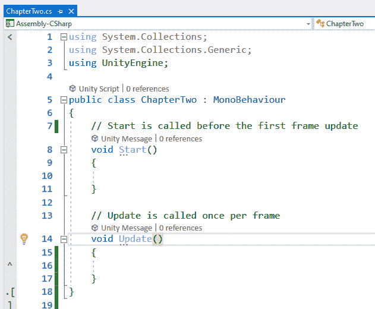

图 2.2 – 默认脚本

然后，我们通过双击它在 Visual Studio 中打开它。你可以看到我们的新 `ChapterTwo` 类继承自 `MonoBehaviour`。

那么，为什么 `MonoBehaviour` 那么重要呢？因为它为游戏开发者提供了一个与 Unity 引擎交互的框架。例如，如果你想将脚本附加到场景中的 GameObject 上，该类必须继承自 `MonoBehaviour` 类；否则，脚本无法添加到 GameObject。当你尝试将不继承自 `MonoBehaviour` 的类附加到 GameObject 上时，Unity 编辑器将弹出以下错误消息：

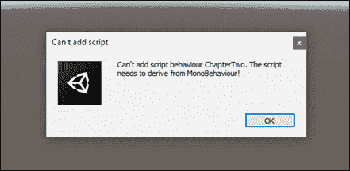

图 2.3 – 无法添加脚本错误

没有使用 `MonoBehaviour` 类，你的代码将无法访问 Unity 的内置方法和事件，例如在每一个新的脚本文件中默认创建的 `Start` 和 `Update` 函数。

`MonoBehaviour` 是 Unity 中最重要的类。`Start` 和 `Update` 是 Unity 中最常见的内置函数。每次你创建一个新的脚本文件时，它们都会出现在这个新文件中。但如果你想修改创建脚本的模板，这也是可能的；你只需修改存储在这里的脚本模板：

+   `%EDITOR_PATH%\Data\Resources\ScriptTemplates`

+   `%EDITOR_PATH%/Data/Resources/ScriptTemplates`

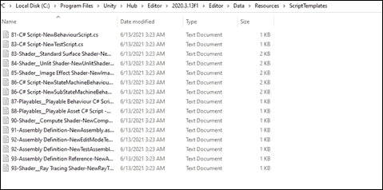

图 2.4 – ScriptTemplates 文件夹

### GameObject 类

我们已经知道，场景中的对象被称为 `GameObject` 类来表示它。

当你在场景中创建一个新的空 GameObject 时，你会发现这个新的 GameObject 包含一个名称、一个标签、一个层和一个 **Transform** 组件。

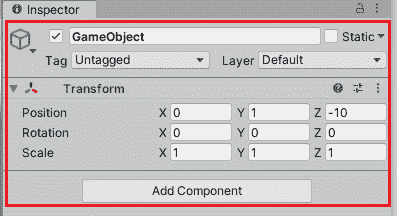

图 2.5 – GameObject

您也可以从**检查器**窗口中修改它是否是一个**静态**对象。如果 GameObject 在运行时不会移动，您应该在**检查器**窗口右上角检查**静态**属性复选框。这是因为 Unity 中的许多系统可以在编辑器中预先计算静态 GameObject 的信息，以提高运行时的性能。

正如我们之前提到的，GameObject 是一个可以包含各种组件的容器。因此，在脚本编写中，`GameObject`类主要提供了一套用于管理组件的方法，例如`AddComponent`方法用于向 GameObject 添加新组件，以及`GetComponent`方法用于访问附加到 GameObject 的组件。

让我们在场景中创建一个内置的 3D 立方体对象，并查看这个立方体的**检查器**窗口。

![Figure 2.6 – 场景中的立方体对象

![Figure 2.06 – B17146.jpg]

Figure 2.6 – 场景中的立方体对象

如您在前面的截图中所见，这个 GameObject 被称为**Cube**，并且有四个附加到这个立方体对象上的组件，即**Transform**、**Cube (Mesh Filter)**、**Mesh Renderer**和**Box Collider**。这些组件为该对象提供了渲染和物理模拟功能。因此，GameObject 只是组件的容器，具体功能来自特定的组件。您可以通过在**检查器**窗口中点击**添加组件**按钮来添加新组件，或者通过代码在运行时添加组件。

除了组件外，`GameObject`类还提供了一系列方法来查找其他 GameObject，在 GameObject 之间发送消息，或创建和销毁 GameObject。例如，您可以使用`GameObject.Find`方法通过名称查找 GameObject 并返回它，或者使用`GameObject.FindWithTag`方法通过标签查找 GameObject。您还可以使用`Instantiate`方法创建一个新的`GameObject`实例，以及使用`Destroy`方法销毁一个`GameObject`实例。

![Figure 2.7 – 类中的[SerializeField]属性

![Figure 2.07 – B17146.jpg]

Figure 2.7 – 类中的[SerializeField]属性

值得注意的是，使用某些方法在运行时动态查找特定的 GameObject 实例将带来额外的开销，因此获取另一个 GameObject 实例引用的最简单方法是通过声明一个公共`GameObject`字段或使用`[SerializeField]`属性并声明一个私有字段来保持类的封装性。如图所示，我更喜欢第二种方法。我们将在后面的章节中进一步介绍 Unity 中的序列化。

现在，您会发现`GameObject`字段在**检查器**中是可见的。您只需将 GameObject 从场景或**层次结构**面板拖动到这个变量上即可分配它。

![Figure 2.8 – GameObject 变量

![Figure 2.08 – B17146.jpg]

Figure 2.8 – GameObject 变量

### Transform 类

当您在场景中创建一个新的 GameObject 时，将自动创建`Transform`类的实例。这是因为场景中的每个 GameObject 都有位置、旋转和缩放属性，而`Transform`类用于在 Unity 中存储和操作 GameObject 的位置、旋转和缩放。因此，在 Unity 中创建 GameObject 而不包含`Transform`组件是不可能的，并且您也不能从 GameObject 中移除它。

您可以通过直接修改 Unity 编辑器中`Transform`组件的属性来移动、旋转或缩放 GameObject，或者您可以在运行时通过访问`Transform`类的实例来修改它们。

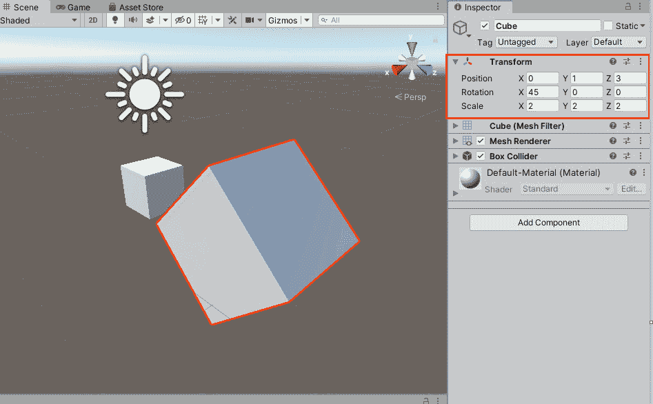

图 2.9 – 变换组件

## Unity 中的预制件

**预制件**是 Unity 中的一个重要概念。游戏开发者可以使用预制件来保存 GameObject、组件和属性，以便在用 Unity 开发游戏时重用这些资源。在实例化预制件时，预制件充当资源模板。接下来，让我们看看如何在 Unity 中创建一个新的预制件。

### 如何创建预制件

首先，让我们谈谈如何创建预制件。以一个“哑铃”为例。它由一个**立方体**和两个**球体**对象组成。

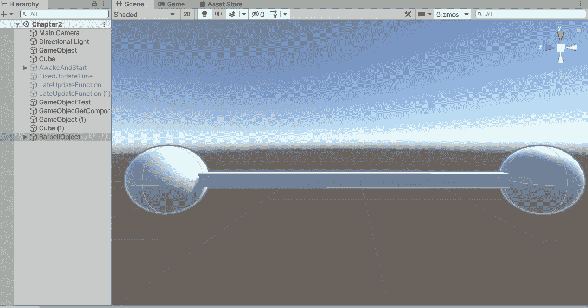

图 2.10 – 如何创建预制件

我们可以通过以下步骤创建这个哑铃对象的预制件：

1.  首先，在**层次**面板中找到名为**BarbellObject**的目标 GameObject，如图*图 2.10*所示。

1.  将目标 GameObject 从**层次**面板拖动到**项目**面板以创建其预制件。新创建的预制件文件在 Unity 编辑器中显示为蓝色立方体图标。


图 2.11 – 预制件文件

1.  在这一点上，如果我们再次查看**层次**面板，我们可以发现**BarbellObject**的名称文本以及它左侧的小立方体图标已经从白色变为蓝色，因为它现在是一个预制件实例。这样，我们就可以在**层次**面板上区分一个对象是否是预制件实例。

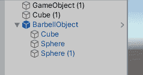

图 2.12 – 预制件实例

如您所见，创建一个新的预制件并不复杂。接下来，让我们探讨如何编辑已创建的预制件。

### 如何编辑预制件

Unity 为开发者提供了两种编辑预制件的方法，如下所示：

+   第一种方法是在预制件模式中编辑预制件。

+   第二种方法是通过其实例编辑预制件。

让我们先从预制件模式开始。

预制件模式是一种专门设计来支持单独编辑预制件的模式。预制件模式允许在单独的场景中查看和编辑预制件的内容。您可以通过以下方式进入预制件模式：

1.  第一种方法是点击**层次**视图中预制件实例的箭头按钮。

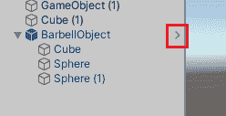

图 2.13 – 进入预制模式

1.  第二种方法是选择**项目**面板中的预制件文件。在**检查器**面板中会显示一个带有“打开预制件”字样的按钮。点击它以进入预制模式。

![图 2.14 – 进入预制模式

![图 2.14 – 进入预制模式

图 2.14 – 进入预制模式

1.  您也可以在**项目**面板中双击预制件文件以进入预制模式。

进入预制模式后，您可以在此处修改预制件，您还可以发现导航栏将显示在场景视图上方，如图下截图所示：

![图 2.15 – 预制模式

![图 2.15 – 预制模式

图 2.15 – 预制模式

1.  使用导航按钮在游戏场景和预制模式之间切换。此外，在**层次结构**视图的顶部，还会显示一个标题栏，显示当前打开的预制件名称。点击标题栏中的左箭头按钮也可以用来返回游戏场景。

除了预制模式外，我们还可以通过修改**层次结构**面板中的预制件实例来修改预制件。让我们按照以下步骤修改**BarbellObject**预制件：

1.  选择 `1` 到 `2` 之间的一个球体，如图下截图所示：

![图 2.16 – 修改预制件实例

![图 2.16 – 实例化预制件

图 2.16 – 修改预制件实例

1.  当选择预制件实例的根节点时，**检查器**面板中会出现三个按钮，即**打开**、**选择**和**覆盖**。点击**覆盖**下拉窗口可以查看所有修改的数据项，例如属性和组件。

![图 2.17 – 打开“覆盖”下拉窗口

![图 2.17 – 实例化预制件

图 2.17 – 打开“覆盖”下拉窗口

1.  在这个下拉窗口中，我们可以丢弃或应用所有修改。在这里，我们应该点击**应用全部**按钮，将此修改应用于预制件。

![图 2.18 – 点击“应用全部”按钮

![图 2.18 – 实例化预制件

图 2.18 – 点击“应用全部”按钮

通过前面描述的两种方法，我们可以在 Unity 中轻松修改预制件。接下来，让我们谈谈如何使用 C# 代码在运行时实例化预制件。

### 如何实例化预制件

在 Unity 开发中，我们可以使用 `Instantiate` 方法在运行时创建预制件的实例。`Instantiate` 方法有几个变体。这里展示了常用的实例化方法变体：

```cs
public static Object Instantiate(Object original, Vector3
  position, Quaternion rotation);
public static Object Instantiate(Object original, Vector3
  position, Quaternion rotation, Transform parent);
```

我们使用 `Instantiate` 方法的这两种变体来实例化预制件，这两种变体都可以用来指定实例的位置和朝向，后者还可以指定实例的父级。

让我们通过以下示例学习如何通过调用 `Instantiate` 方法来实例化预制件：

1.  首先，让我们创建一个名为 `TestInstantiatePrefab` 的新脚本。在这个脚本中，我们将为脚本中的 Prefab 分配一个引用，并调用 `Instantiate` 来创建这个 Prefab 的新实例，并为新对象分配一个父对象：

    ```cs
    using UnityEngine;
    public class TestInstantiatePrefab : MonoBehaviour
    {
        [SerializeField]
        private GameObject _prefab;
        [SerializeField]
        private Transform _parent;
        private GameObject _instance;
        private void Start()
        {
            var position = new Vector3(0f, 0f, 0f);
            var rotation = Quaternion.identity;
            _instance = Instantiate(_prefab, position,
              rotation, _parent);
        }
    }
    ```

1.  然后，我们还需要将此脚本附加到场景中的 GameObject 上，将 Prefab 分配给此脚本的 `_prefab` 字段，并将此 GameObject 分配为稍后创建的 Prefab 实例的父对象，如下面的截图所示：

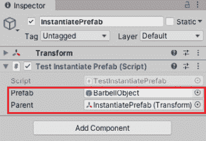

图 2.19 – 设置组件和属性

1.  点击 `InstantiatePrefab` 对象：

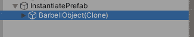

图 2.20 – 创建 Prefab 的新实例

在本节中，我们讨论了 Unity 中的一个重要概念，即 Prefab。通过阅读本节，你应该了解 Prefab 是什么，如何创建 Prefab，如何编辑 Prefab，以及如何使用 C# 代码在运行时实例化 Prefab。

## Unity 中的特殊文件夹

除了上一节中介绍的一些常用类和概念外，Unity 中还有一些用于不同目的的特殊文件夹。其中一些文件夹与 Unity 中的脚本编写相关。它们如下所示：

+   `资产`文件夹

+   `编辑器`文件夹

+   `插件`文件夹

+   `资源`文件夹

+   `StreamingAssets`文件夹

让我们逐一来看。

### 资产文件夹

当创建 Unity 项目时，会创建一个 `资产` 文件夹来存储各种资源，从模型和纹理到将在本 Unity 项目中使用的脚本文件。这也是你在开发 Unity 项目时主要使用的文件夹。

### 编辑器文件夹

编辑器文件夹用于存储编辑器的脚本文件。例如，你可以在编辑器文件夹中创建一些编辑器脚本，以向默认的 Unity 编辑器添加更多功能。Unity 会根据脚本文件的位置，在四个独立阶段编译这些脚本。在每个阶段，Unity 都会为该阶段创建一个单独的 C# 项目文件（`.csproj`）。编辑器文件夹中的脚本在运行时不可用。如果编辑器文件夹位于 `插件` 文件夹中，则将创建一个名为 `Assembly-CSharp-Editor-firstpass` 的 CSharp 项目文件；否则，将创建一个名为 `Assembly-CSharp-Editor` 的 CSharp 项目文件。

### 插件文件夹

你应该将插件或需要首先编译的代码放在 `插件` 文件夹中，Unity 将首先编译此文件夹中的代码。对于位于此文件夹中的脚本，将创建一个名为 `Assembly-CSharp-firstpass` 的 CSharp 项目文件。Unity 将为所有其他脚本创建一个名为 `Assembly-CSharp` 的 CSharp 项目文件，这些脚本位于 `资产` 文件夹中，但不在 `插件` 文件夹和 `编辑器` 文件夹中。

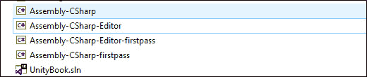

图 2.21 – 不同阶段的 CSharp 项目文件

还有其他一些特殊文件夹，例如 `Resources` 文件夹和 `StreamingAssets` 文件夹。我们将在后面的章节中介绍它们。

在本节中，我们讨论了 Unity 的 GameObject 组件架构，并介绍了一些 Unity 中最常用的内置类以及与 Unity 脚本相关的特殊文件夹。接下来，我们将学习与 Unity 脚本相关的一个重要话题，即脚本实例的生命周期。

# 脚本实例的生命周期

在上一节中，我们介绍了 Unity 脚本的基本概念。现在，我们将解释与 Unity 脚本相关的一个重要话题：脚本实例的生命周期。

我们已经知道 Unity C# API 不包括引擎的内部逻辑，脚本上的事件函数是由引擎的 C/C++ 代码触发的。因此，为了正确使用 Unity 引擎，了解事件函数的执行顺序和 Unity 中 C# 脚本的生命周期非常重要。

根据它们的目的，我们可以将 Unity 事件函数分为以下几类：

+   初始化

+   更新

+   渲染

让我们接下来讨论它们。

## 初始化

如果你熟悉 .NET 应用程序的开发，你可能会对 Unity 中的脚本初始化感到惊讶，因为 Unity 脚本不使用构造函数进行初始化。相反，Unity 提供了一些引擎事件函数来初始化脚本实例。

实际上，我们已经看到了一个用于初始化目的的 Unity 事件函数。是的，它是创建新的 Unity 脚本时默认创建的 `Start()` 函数。

然而，`Start()` 函数并不是在创建脚本的新实例时首先被触发的事件函数。当一个场景开始时，场景中每个对象的 `Awake()` 事件函数总是先于任何 `Start()` 函数被调用。除了 `Awake()` 会首先被调用之外，`Start()` 和 `Awake()` 的工作方式相似。它们都在初始化期间被调用一次。现在，你可能会有一个疑问：既然我们已经有 `Start` 函数了，为什么我们还需要 `Awake` 函数？

这是因为 `Awake` 函数对于分离初始化很有用。例如，在游戏开始之前使用 `Awake` 来初始化对象的引用和变量是一个好主意。这意味着你不应该在 `Awake` 函数中访问其他对象的引用，而应该使用 `Start` 来传递不同对象的引用信息。

你可能会感到困惑，所以让我给你展示一些代码。让我们考虑一个有两个类的情况，即 `AwakeAndStartA` 和 `AwakeAndStartB`。在第一个类中，有一个 `List<int>` 变量和一个 `List<int>` 属性，`List` 变量是在 `AwakeAndStartA` 的 `Awake` 函数中设置的：

```cs
public class AwakeAndStartA : MonoBehaviour
{
    private List<int> _listRef;
    public List<int> ListRef => _listRef;
    private void Awake()
    {
        _listRef = new List<int>();
    }
}
```

现在，我们得到第二类：

```cs
public class AwakeAndStartB : MonoBehaviour
{
    private void Awake()
    {
      var comp =
       GameObject.Find("A").GetComponent<AwakeAndStartA>();
      Debug.Log($"comp is null > {comp is null}");
      Debug.Log(comp.ListRef.Count);
    }
}
```

`AwakeAndStartB` 类试图获取 `AwakeAndStartA` 类的引用，并在其 Awake 函数中访问 `AwakeAndStartA` 的 `ListRef` 属性。

如果我们运行代码，我们将得到以下输出；也就是说，对象 B 可以访问对象 A，但不能在 Awake 函数中访问对象 A 的变量或属性。这是因为我们不应该假设一个 GameObject 的 Awake 设置的引用可以在另一个 GameObject 的 Awake 中使用。

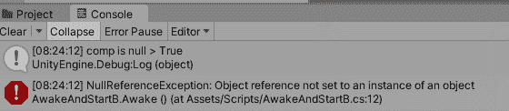

图 2.22 – 空引用异常

因此，为了在对象 B 中使用 `ListRef`，我们可以在 Start 函数中获取引用。让我们将打印列表中元素数量的代码从 Awake 函数移动到 Start 函数：

```cs
public class AwakeAndStartB : MonoBehaviour
{
    private void Start()
    {
      var comp =
       GameObject.Find("A").GetComponent<AwakeAndStartA>();
      Debug.Log($"comp is null > {comp is null}");
      Debug.Log(comp.ListRef.Count);
    }
}
```

这次，代码将打印出正确的数字，如图 *图 2.23* 所示：

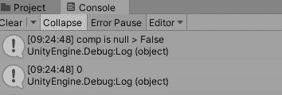

图 2.23 – 列表中包含的元素数量为 0

Start 和 Awake 函数之间的另一个区别是，如果一个脚本组件在场景中没有启用，它的 Start 函数将不会被调用，但 Awake 函数总是会调用，正如您可以在下面的屏幕截图中所见：

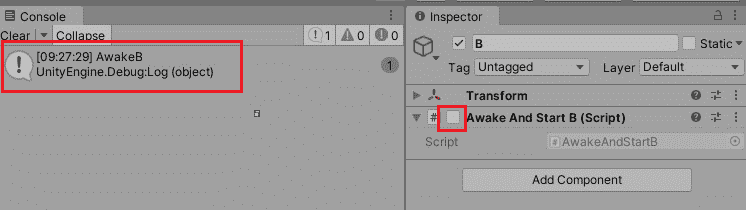

图 2.24 – Awake 函数始终被调用

有一个用于初始化的第三个事件函数，即 `OnEnable` 函数。如果脚本组件在场景中启用，则此函数将在 Awake 函数之后和 Start 函数之前被调用。然而，`OnEnable` 函数与 Awake/Start 函数之间有一个很大的区别；即 `OnEnable` 函数可以被多次调用。此函数在组件变为启用时被调用。

## Update

对于一个游戏，`Update` 是一个非常重要的函数，因为游戏玩法逻辑是由 `Update` 驱动的。Unity 为不同目的提供了三个不同的 `Update` 函数。它们如下所示：

+   `FixedUpdate`

+   `Update`

+   `LateUpdate`

`FixedUpdate` 用于物理模拟。因此，如果您的游戏不包含物理模拟，则不应使用此函数。`FixedUpdate` 函数在每个固定帧率帧上被调用，并且它可以在单个帧中被多次调用。这是因为确保物理模拟中有固定增量时间非常重要。现在，您可能又感到困惑了。让我为您解释一下。

默认情况下，物理模拟需要每 0.02 秒更新一次。您可以在 **项目设置** | **时间** | **固定时间步长** 中更改此值。

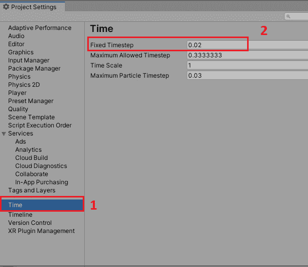

图 2.25 – 固定时间步长设置

让我们考虑一个游戏帧率本身较低的情况，例如，25 FPS。这意味着游戏将花费 0.04 秒来更新一帧。那么，问题是如何确保物理模拟的固定增量时间？

答案并不复杂。Unity 只需要在每个帧调用`Update`函数之前调用`FixedUpdate`两次，在这个例子中，`FixedUpdate`每 0.02 秒被调用一次。以下截图显示了结果：

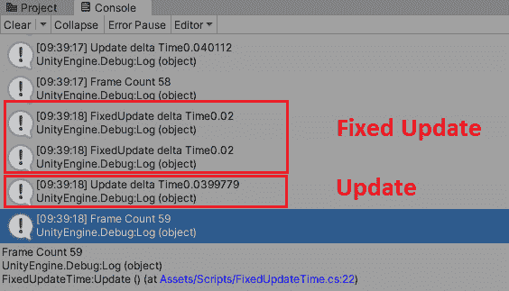

图 2.26 – 在一帧中 FixedUpdate 被调用两次

因此，只有在你项目中使用物理模拟时才使用`FixedUpdate`函数。如果你的项目不包含物理模拟，那么你不应该使用它。

`Update`函数是在创建新脚本时默认创建的另一个函数。它是 Unity 中实现任何类型游戏逻辑最常用且最重要的函数。如果脚本组件在场景中启用，则`Update`将在每帧调用一次。

用于更新的第三个函数是`LateUpdate`函数。正如其名称所示，`LateUpdate`将在`Update`函数之后被调用。因此，我们可以用它来实现每帧的两步更新。例如，你有一个在场景中的 GameObject 集合，需要在`Update`函数中移动和旋转，你将使用场景中的相机来跟踪这些 GameObject 的运动。为了确保所有 GameObject 都已经完全移动，你可以在`LateUpdate`函数中实现平滑的相机跟随。

## 渲染

对于一个游戏，除了游戏逻辑之外，另一个重要的方面是游戏的图形和渲染。在这里，我将介绍三个常用的渲染事件函数。它们如下：

+   `OnBecameVisible`/`OnBecameInvisible`

+   `OnRenderImage`

+   `OnGUI`

当渲染器对任何相机可见时，将调用`OnBecameVisible`，而`OnBecameInvisible`则相反。

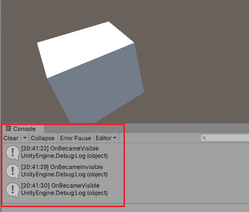

图 2.27 – OnBecameVisible/OnBecameInvisible

如前一个截图所示，当 Cube 对象移出相机的视野时，`OnBecameInvisible`将被调用，如果它进入相机的视野，`OnBecameVisible`将被调用。

如果你的游戏逻辑非常复杂，那么你可以使用`OnBecameVisible`/`OnBecameInvisible`来避免不必要的性能开销。例如，当一个 GameObject 移出视野时，该 GameObject 的功能可以被暂停。

`OnRenderImage` 在 Unity 中用于实现 **后处理** 效果。这个函数将在场景完全渲染后调用，然后你可以将全屏效果应用到图像上，这可以大大提高你游戏的外观。以下截图显示了带有后处理和无后处理的图像之间的差异：

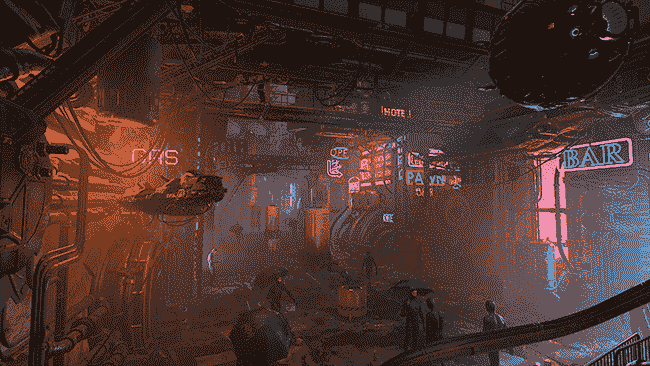

](img/Figure_2.28_B17146.jpg)

图 2.28 – 无后处理的场景（Unity）

如 *图 2.29* 所示，应用后处理增强了场景的整体外观，并产生了惊人的效果：

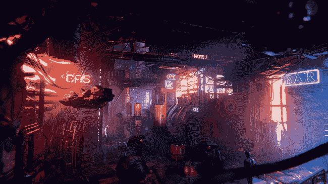

](img/Figure_2.29_B17146.jpg)

图 2.29 – 带有后处理的场景（Unity）

值得注意的是，为了正确使用 `OnRenderImage`，你需要将实现此函数的脚本附加到相机组件所附加的 GameObject 上：

```cs
public class PostProcessing : MonoBehaviour
{
[SerializeField] 
private Material _mat;
    private void OnRenderImage(RenderTexture src,
      RenderTexture dest)
    {
        Graphics.Blit(src, dest, _mat);
    }
}
```

有时，你可能需要创建一些 UI 来进行原型设计或进行测试。然后，`OnGUI` 是你的理想选择。你可以创建一个 `OnGUI` 函数：

```cs
public class OnGUITest : MonoBehaviour
{
    private void OnGUI()
    {
        if (GUI.Button(new Rect(10, 10, 200, 100),
          "Button"))
        {
            Debug.Log("Hello World!");
        }
    }
}
```

GUI 行是一个 `if` 语句。这是因为当按钮被点击时，`if` 块中的代码需要被执行。具体来说，以前面的代码为例，当游戏运行且按钮被点击时，这个 `if` 语句返回 `true` 并执行 `if` 块中的 `Debug.Log("Hello World")` 行，在 **控制台** 窗口中打印出 **Hello World**。

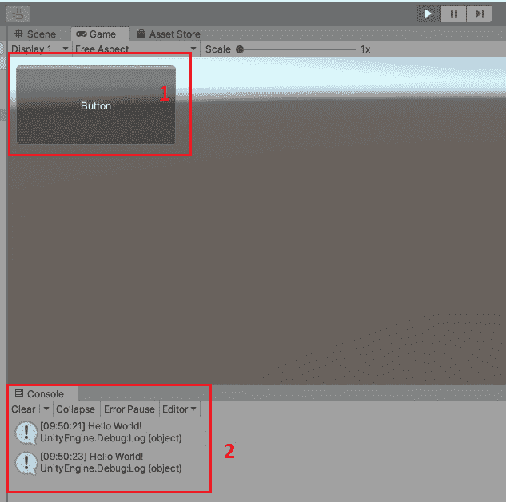

图 2.30 – IMGUI

前面的截图显示了一个 IMGUI 按钮，以及点击此按钮在控制台窗口中打印的消息。

在本节中，我们解释了脚本实例的生命周期以及 Unity 引擎提供的常用事件函数。在下一节中，我们将探讨如何创建一个与引擎交互的脚本文件，并将其作为组件添加到场景中的 GameObject。 

# 创建脚本并将其用作组件

除了 Unity 的内置组件之外，我们还可以创建脚本组件。当你创建一个脚本并将其附加到一个 GameObject 上时，你可以在 GameObject 的 **检查器** 窗口中看到你创建的组件，就像 Unity 的内置组件一样。

## 如何在 Unity 中创建一个新的脚本

在 Unity 中创建一个新的 C# 脚本非常简单。我将介绍两种不同的方法来实现这一点。

首先，你可以在 Unity 编辑器的 **项目** 面板中右键单击，然后会弹出一个菜单。你只需要选择 **创建** | **C# 脚本**，然后 Unity 编辑器将在 **项目** 面板中指定的文件夹中创建一个 C# 文件。


](img/Figure_2.31_B17146.jpg)

图 2.31 – 从创建菜单创建新的 C# 脚本

新脚本的默认文件名为 `NewBehaviourScript.cs`。你可以在创建时更改名称。


](img/Figure_2.32_B17146.jpg)

图 2.32 – 创建脚本时更改脚本名称

例如，在之前的屏幕截图中，新的 C#文件将被创建在`Assets/Chapter 2/Scripts`文件夹中。这样，新创建的脚本将不会自动附加到场景中的 GameObject 上。您需要稍后手动将其添加到 GameObject。

另一方面，您也可以直接创建脚本并将其附加到 GameObject。您需要做的是在场景中选择一个 GameObject，然后点击项目中的`Assets`文件夹。

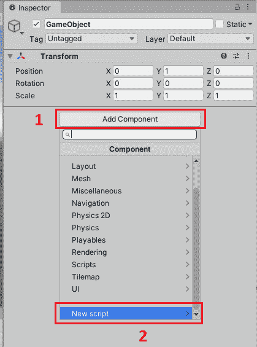

图 2.33 – 从检查器窗口创建新脚本

与在`NewBehaviourScript.cs`中创建新脚本类似。

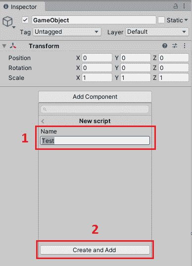

图 2.34 – 创建脚本时更改脚本名称

如果您想在 IDE 中打开脚本，我们已将 Visual Studio 2019 设置为 Unity 项目的 IDE；您可以通过双击脚本文件在 Visual Studio 2019 中打开它。您会发现 C#类的名称与脚本文件的名称相同。

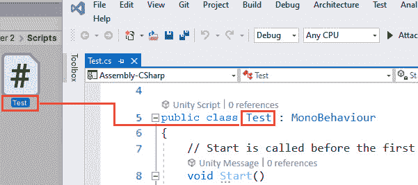

图 2.35 – C#类名和脚本文件名

## 在场景中将脚本作为组件添加到 GameObject

在上一节中，我们介绍了如何创建一个新的脚本并将其自动附加到 GameObject 上。但我们仍然需要学习如何在编辑器中手动将脚本添加到 GameObject，并在运行时通过 C#代码将脚本组件添加到 GameObject。

### 在编辑器中向 GameObject 添加脚本组件

在 Unity 编辑器中将脚本作为组件添加到 GameObject 的最简单方法是拖动脚本文件到 GameObject。

然而，以下两种情况可能会导致脚本未添加到 GameObject：

+   文件名和类名不同。这就是为什么在创建脚本时脚本名称与类名相同的原因。然而，您可能不小心更改了其中一个。因此，如果您无法将脚本添加到 GameObject，请首先检查文件名和类名。

+   第二个原因相对明显：脚本中存在编译错误。在这种情况下，**控制台**窗口将打印出编译错误。您需要修复所有这些错误，以便可以将它们添加到 GameObject。

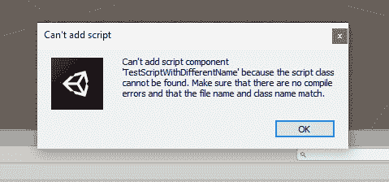

图 2.36 – 无法添加脚本消息

您还可以从**检查器**窗口将脚本组件添加到 GameObject。以下步骤演示了如何操作：

1.  选择您想要附加脚本的 GameObject。

1.  点击**添加组件**按钮，在**检查器**窗口中。不仅我们创建的脚本会被添加，而且许多内置组件也可以添加到 GameObject。

1.  为了快速找到需要添加的脚本，我们可以在搜索框中输入脚本的名称。

1.  最后，在下拉框中选择目标脚本。

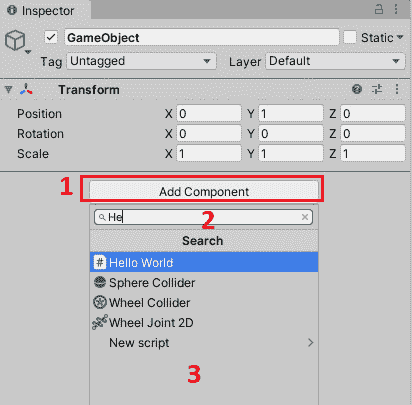

图 2.37 – 从检查器窗口添加组件

### 在运行时向 GameObject 添加脚本组件

除了在编辑器中手动将脚本组件添加到 GameObject 之外，我们还可以在运行时通过 C# 代码将组件添加到 GameObject。

让我们打开在 Visual Studio 2019 中刚刚创建的 `Test.cs` 文件，并添加一个新字段，如图所示：

```cs
[SerializeField] 
private HelloWorld _helloWorld;
```

注意

字段是直接在类或结构体中声明的任何类型的变量。

在这里，你可以看到 `HelloWorld` 类型的私有字段名为 `_helloWorld`，你还会发现 `_helloWorld` 的声明上放置了一个 `[SerializeField]` 属性。这是为了允许 Unity 序列化这个私有字段。我们将在后面的章节中讨论 Unity 中的序列化系统，但你应该理解，当 Unity 序列化脚本时，它默认只序列化公共字段。如果一个变量可以被 Unity 序列化，那么它可以在 Unity 编辑器中显示和修改。因此，你可以在这里使用公共字段。然而，通常来说，只使用字段来存储具有私有或受保护访问级别的变量是一个好主意。这就是为什么 Unity 为开发者提供了 `[SerializeField]` 属性，这将强制 Unity 序列化私有字段。

然后，我们将 Test 脚本组件拖动到场景中的 GameObject 上，以将其添加到 GameObject。

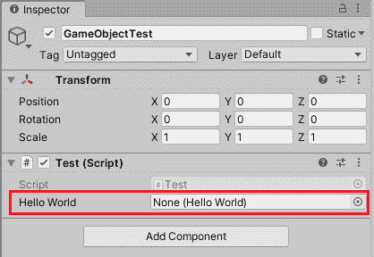

图 2.38 – 带有测试组件的 GameObject

你可以看到，在之前的屏幕截图中，附加到 GameObject 的 Test 脚本组件的序列化字段是 `Test.cs` 脚本，用于将 `HelloWorld` 脚本组件附加到同一个 GameObject，并将对新的 `HelloWorld` 组件的引用分配给此字段。

因为我们只想让代码运行一次，我们可以修改 `Start` 函数，如下所示：

```cs
    void Start()
    {
        _helloWorld =
          gameObject.AddComponent<HelloWorld>();
    }
```

这里，我们正在调用 `AddComponent<T>` 方法，这是一个泛型方法，用于将 `HelloWorld` 组件添加到这个 GameObject，并且它将返回附加组件的引用，因此我们可以将此值分配给 `_helloWorld` 字段。

注意

泛型方法是一种使用类型参数声明的函数。前面的代码展示了如何使用 `HelloWorld` 作为类型参数来调用 `AddComponent<T>` 方法。

值得注意的是，除了泛型方法之外，还有一个 `AddComponent` 的版本，即 `AddComponent(string className)`，这是一个带有字符串参数的方法。它已被弃用，因此你不应该再使用此方法，而应使用泛型版本。

通过点击 Unity 编辑器中的 **播放** 按钮来玩游戏。

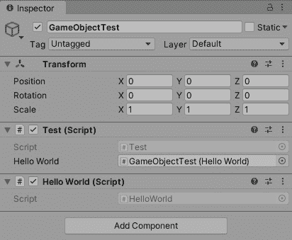

图 2.39 – 在运行时附加 HelloWorld 组件

查看附加到 GameObject 的 `HelloWorld` 组件，并将对该组件的引用分配给 Test 组件的字段。

干得好。现在我们已经学会了如何将组件添加到场景中的 GameObject。接下来，让我们通过 C# 代码探索如何通过同一 GameObject 或不同 GameObject 访问组件。

## 访问附加到 GameObject 的组件

当我们开发 Unity 项目时，我们经常需要访问其他组件，因为我们可以重用不同组件定义的功能。

在这里，让我们向 `HelloWorld.cs` 脚本中添加一些代码，以便在编辑器的控制窗口中打印 **Hello World!** 消息：

```cs
    public void SayHi()
    {
        Debug.Log("Hello World!");
    }
```

注意

在 `SayHi` 方法中的 `Debug.Log` 行是一个常用的方法，可以将帮助您调试游戏的消息打印到控制窗口。`Debug` 类还提供了许多其他方法，例如 `LogError`、`LogWarning` 和 `Assert`。

我们可以将其视为我们希望在多个脚本中重用的功能。然后，我们还需要创建一个新的脚本，名为 `TestGetComponent.cs`。这是我们将放置代码以在运行时访问 `HelloWorld` 组件的脚本：

```cs
public class TestGetComponent : MonoBehaviour
{
    void Update()
    {
        var helloWorld =
          gameObject.GetComponent<HelloWorld>();
        if (helloWorld == null)
        {
            return;
        }
        helloWorld.SayHi();
    }
}
```

如我们所知，`Update` 函数在游戏的每一帧都会运行，为了演示如何访问组件，我们可以将代码放在 `Update` 函数中，如 `TestGetComponent` 类的代码所示。

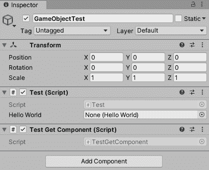

![图 2.40 – 带有 TestGetComponent 组件的 GameObject 然后，我们将 `TestGetComponent` 脚本作为组件附加到同一个 GameObject 上，播放游戏，并查看控制窗口。**Hello World!** 消息出现在那里。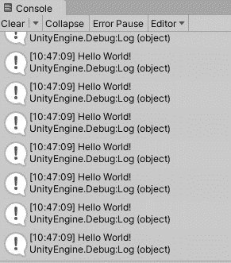

图 2.41 – Hello World! 出现在控制窗口

注意

由于性能原因，建议不要在每一帧都使用此函数。

在这种情况下，我们访问了附加到同一 GameObject 的其他组件。此外，我们还可以访问不同 GameObject 上的其他组件。

首先，我们需要获取目标 GameObject 的引用。在这里，我们可以在编辑器中将引用对象分配给这个脚本，或者使用 `GameObject.Find` 方法在运行时查找目标对象。从游戏性能的角度来看，不要在每帧都会被调用的方法，如 `Update` 中调用 `GameObject.Find` 方法来查找目标对象。如果你无法在编辑器中将引用分配给脚本，例如，引用对象是在运行时动态创建的，那么你可以使用这个方法来查找目标对象并缓存目标对象，而不是在每一帧都查找目标对象。在这个例子中，我们可以在 `Start` 方法中查找目标对象并将其缓存，如下所示：

```cs
private GameObject _targetGameObject;
    private void Start()
    {
        // Using Find method to find game objects is not
           recommended,
        // this is just to demonstrate how to call this
           method to find
        // the target object at runtime.
        _targetGameObject =
          GameObject.Find("GameObjectTest");
    }
```

然后，让我们修改 `TestGetComponent` 类的 `Update` 函数，如下所示：

```cs
    void Update()
{

        var helloWorld =
          _targetGameObject.GetComponent<HelloWorld>();
        if (helloWorld == null)
        {
            return;
        }
        helloWorld.SayHi();
    }
```

这里，我们使用 `GameObject.Find(string name)` 函数通过名称查找 GameObject 并返回它。目标 GameObject 的名称是 `GameObjectTest`。

有其他函数可以在运行时用于查找 GameObject，例如 `GameObject.FindWithTag(string tag)`，它返回一个带有 `tag` 标签的活动 GameObject。但是，为了正确使用此功能，必须在标签管理器中首先声明标签。您可以从 **项目设置** | **标签和层** 中管理这些标签。

然而，正如我们之前提到的，`Find` 方法及其变体不建议用于查找 GameObject。这个例子只是为了演示如何在运行时调用该方法来查找目标对象，如果你需要在运行时查找动态创建的对象。

接下来，我们创建一个新的 GameObject 并将其 `TestGetComponent` 脚本附加到它上。同时，从名为 `GameObjectTest` 的目标 GameObject 中移除 `TestGetComponent` 脚本。

![Figure 2.42 – A GameObject with the TestGetComponent component]

![Figure 2.42_B17146.jpg]

Figure 2.42 – A GameObject with the TestGetComponent component

玩游戏并查看控制台窗口。同样的 **Hello World!** 消息再次出现在那里。

在本节中，我们学习了如何在 Unity 中创建新的脚本，如何将脚本作为组件附加到 GameObject 上，并讨论了如何在运行时通过代码访问组件以重用功能。接下来，让我们探索 Unity 包管理器和 Unity 中的包。

# 包和 Unity 包管理器

如果你是一名 .NET 开发者，那么我相信你必须知道 **NuGet** 包管理器。Unity 中的包管理器与 NuGet 非常相似，它使游戏开发者能够共享和消费有用的代码。但它们是不同的。在 Unity 中，你可以重用不仅是有用的代码，还有数字资产、着色器、插件和图标。Unity 中的包是一个包含前面提到的内容的容器。

在本节中，我将介绍 Unity 中的包和包管理器，以便您了解 Unity 中的包机制以及如何使用 Unity 包管理器来管理包。

## Unity 包管理器

Unity 为游戏开发者提供了一个名为 Unity 包管理器的工具，用于管理项目中的包并向项目中添加新包。我们可以通过点击**窗口** | **包管理器**来打开包管理器窗口。

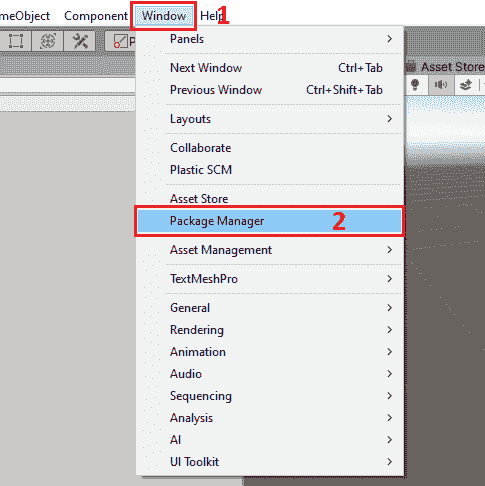

图 2.43 – 从窗口菜单打开包管理器窗口

默认情况下，此窗口显示您项目中的已安装包及其版本。如果某个包有新版本可用，版本号旁边将显示一个**升级**图标。您还可以对这些包进行排序，例如按名称升序或按发布日期降序排序。

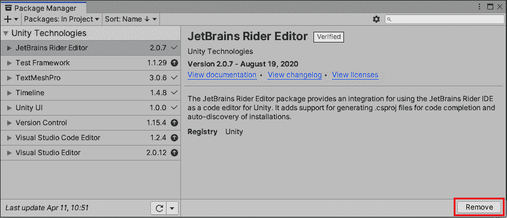

图 2.44 – Unity 包管理器

在窗口的右侧，将显示当前选中包的详细信息，例如包名、发布者、发布日期、版本号、文档链接和描述。您还可以通过点击窗口右下角的**移除**按钮从您的项目中移除一个包。

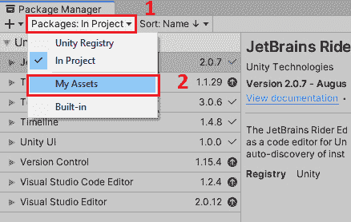

图 2.45 – 切换包列表

此窗口还可以显示不同的列表。例如，您可以通过从下拉菜单中选择**我的资产**选项来查看、下载和导入从 Unity Asset Store（[`assetstore.unity.com/`](https://assetstore.unity.com/)）购买的资产。

从 Asset Store 购买的资产可能是免费的或付费的。Asset Store 提供了各种资产，从纹理、模型和动画到整个项目示例应有尽有。


图 2.46 – Unity 注册表中的包

您还可以从 Unity 注册表中安装包。通过从下拉菜单中选择**Unity 注册表**选项，您可以浏览 Unity 注册表中注册的所有包。如果您想安装一个包，您需要选择它并点击窗口右下角的**安装**按钮。

除了从 Unity 注册表中安装包之外，Unity 包管理器还提供了其他安装包的方法，即从本地文件夹安装新包、从本地 tarball 文件安装新包以及使用 Git URL 安装新包。

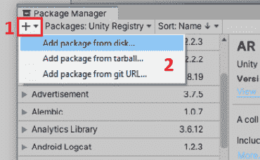

图 2.47 – 安装新包

您可以通过点击包管理器窗口右上角的**+**按钮使用这三种不同的方式添加新的包。

Unity 游戏引擎的一些内置功能也作为包提供。您可以通过从下拉菜单中选择**内置**选项来查看所有内置包的列表。在这里，您可以管理这些内置功能。您可以通过禁用不需要的包来减小游戏的运行时构建大小。例如，如果您开发的游戏没有 VR 或 AR 功能，您可以通过单击**包管理器**窗口右下角的**禁用**按钮来禁用 XR 相关的包。

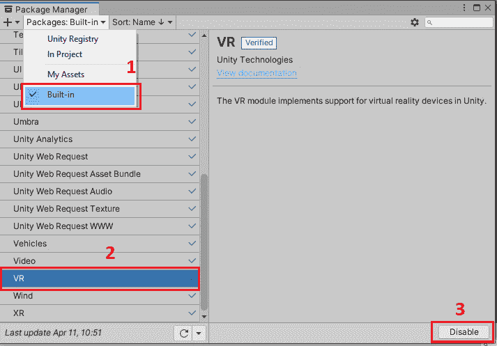

图 2.48 – 内置包

## 包

包是一个容器，包含满足项目各种需求的功能。您可以通过添加包来为您的游戏添加新功能。例如，**AR Foundation** 包将提供增强现实功能。您也可以删除包以减小游戏的大小。因此，使用包使 Unity 游戏开发更加灵活和松耦合。

然而，如果您不小心，使用包也可能使您的游戏充满错误。这是因为不同的包可能处于不同的状态。

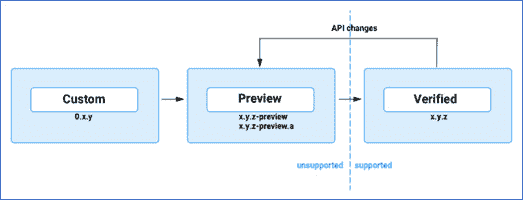

图 2.49 – 使用 Unity 包管理器（Unity）的包生命周期

由 Unity 开发和维护的包可能处于以下两种状态之一：

+   预览包

+   验证包

预览包表示它目前可以用于测试，并且可能在后续版本中经历许多变化。Unity 不能保证对预览包的未来支持，因此您不应在生产中使用它们。

默认情况下，您在包管理器窗口中找不到处于预览状态的包。如果您确实需要使用预览包，例如测试未来项目的新的功能，您可以按照以下步骤允许包管理器窗口显示预览状态的包：

1.  通过单击齿轮图标然后单击**高级项目设置**项，打开包管理器的**项目设置**窗口。

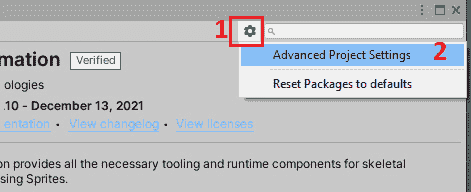

图 2.50 – 高级项目设置

1.  检查**启用预览包**选项。

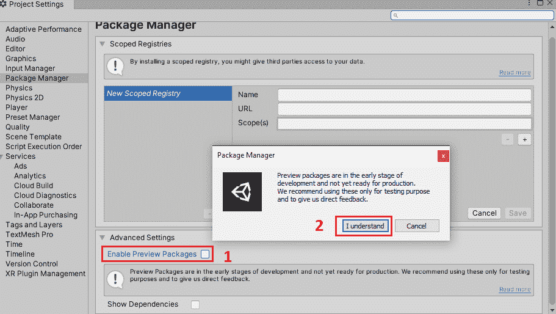

图 2.51 – 包管理器设置

1.  然后，查看包管理器窗口。您将看到预览包出现在包列表中。在包列表中，所有处于预览状态的包都标记为**预览**。

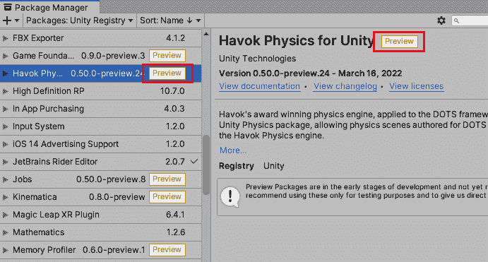

图 2.52 – 预览包

另一方面，处于验证状态的包意味着它可以用于生产。只有经过严格测试并且 Unity 保证支持该验证包，包才会被视为验证包。

默认情况下，包管理器窗口显示已验证的包列表。处于已验证状态的包被标记为**已验证**。

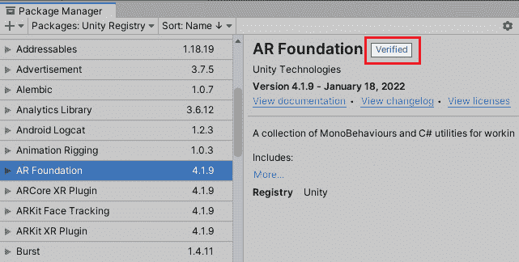

图 2.53 – 已验证包

# 摘要

在本章中，我们首先介绍了 Unity 脚本编程中最常用的几个类，然后解释了脚本实例的生命周期和重要事件函数，并讨论了 Unity 如何初始化脚本以及脚本中游戏逻辑的更新。

我们还讨论了如何在 Unity 中创建一个新的脚本以及如何将脚本作为组件附加到 GameObject 上。除了在编辑器中手动添加组件外，我们还可以使用 C#代码在运行时动态添加组件或访问组件。

最后，我们演示了如何通过 Unity 包管理器添加或删除包以提供功能或减小游戏大小。同时，我们还解释了预览包和已验证包之间的区别。

在下一章中，我们将学习 Unity 中的 UI 系统，同时，我们还将介绍如何在 Unity 中优化 UI 性能。
