# 第五章：*第五章*: 使用 Unity 物理系统

游戏中的物理模拟不仅是为了实现游戏的现实感而不可或缺的功能。将物理模拟添加到您的游戏中通常可以提高游戏的趣味性和可玩性。一般来说，它决定了物体如何移动以及它们如何相互碰撞，例如玩家与墙壁之间的碰撞和重力的影响。作为一个流行的游戏引擎，Unity 为开发者提供了各种工具，允许开发者将物理模拟功能集成到他们的游戏中。

本章我们将涵盖以下关键主题：

+   Unity 物理系统中的概念

+   使用物理系统进行脚本编写

+   基于物理系统创建简单游戏

+   提高物理系统的性能

到本章结束时，你将能够正确且高效地在 Unity 中应用物理模拟，为你的游戏添加更多真实感或趣味性。

现在，让我们开始吧！

# 技术要求

你可以在 GitHub 上的以下存储库中找到完整的代码示例：[`github.com/PacktPublishing/Game-Development-with-Unity-for-.NET-Developers`](https://github.com/PacktPublishing/Game-Development-with-Unity-for-.NET-Developers)。

# Unity 物理系统中的概念

模拟是游戏中的一个有用功能。Unity 为不同的目的提供了不同的工具。例如，如果我们想开发一个 3D 游戏，那么我们可以使用与**Nvidia PhysX 引擎**集成的内置 3D 物理。如果我们想为 2D 游戏添加物理模拟，那么我们可以选择与**Box2D 引擎**集成的内置 2D 物理。

注意

**PhysX**是由 Nvidia 作为 Nvidia GameWorks 软件套件的一部分开发的开源实时物理引擎中间件 SDK。**Box2D**是一个免费的开源 2D 物理模拟引擎。

除了这些内置的物理解决方案之外，Unity 还提供了物理引擎包。这些是`Unity Physics`包和`Havok Physics for Unity`包，以及它们用于 Unity 的**数据导向技术堆栈（DOTS）**项目。我们将在后面的章节中介绍 DOTS。

注意

**Havok Physics**主要设计用于视频游戏，允许在 3D 中实时进行刚体的碰撞和动力学。

在本章中，我们将重点关注内置的物理知识，并首先学习 Unity 物理系统的基本概念。

## Collider

与渲染功能类似，物理引擎也需要了解游戏场景中`GameObjects`的形状，以便正确执行物理模拟。在开发 Unity 项目时，我们可以使用**Collider**组件来定义 GameObject 的形状，以便进行物理碰撞计算。

应该注意的是，由碰撞体定义的形状不必与模型的形状完全相同。我们甚至可以创建一个没有模型显示的碰撞体。例如，我们可以在场景中创建一个新的立方体，并且一个碰撞体组件将自动创建并附加到这个立方体上。然后，可以从以下图像中修改碰撞体的形状；其形状与模型的形状不同。

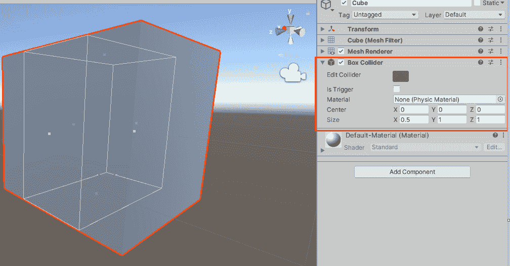

图 5.1 – 修改碰撞体的形状（绿色框架）

为了减少物理模拟的复杂性并提高游戏性能，我们经常使用一些粗糙的形状，例如**盒子碰撞体**和**球体碰撞体**。接下来，我们将探讨最常用的碰撞体之一，即盒子碰撞体。

### 原始碰撞体

Unity 为游戏开发者提供了一套原始碰撞体，包括球体碰撞体和盒子碰撞体。盒子碰撞体是 Unity 中最常用的碰撞体之一。它将自动创建并分配到场景中的立方体对象上，正如我们在*图 5.1*中看到的那样。我们还可以手动将一个新的盒子碰撞体添加到 GameObject 中，如下所示：

1.  通过点击**创建空对象**按钮在场景中创建一个新的 GameObject。

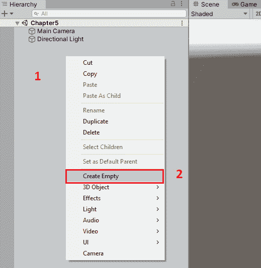

图 5.2 – 创建新的 GameObject

1.  选择这个新创建的 GameObject，并在检查器窗口中点击**添加组件**按钮。

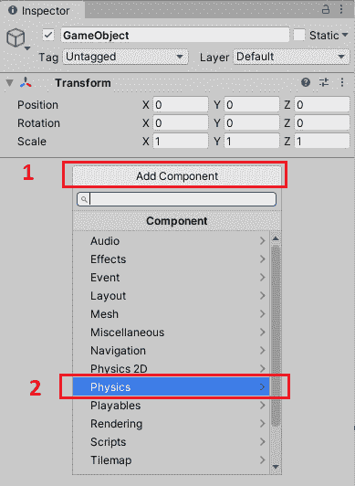

图 5.3 – 添加组件

1.  在这里，我们可以在搜索框中选择`盒子碰撞体`以将盒子碰撞体组件添加到这个 GameObject 中。

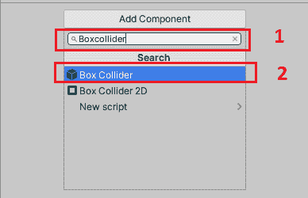

图 5.4 – 添加盒子碰撞体

现在我们已经添加了一个新的**盒子碰撞体**组件，这个盒子碰撞体的属性如下截图所示：

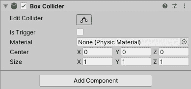

图 5.5 – 盒子碰撞体的属性

顶部的**编辑碰撞体**按钮允许我们编辑场景中这个盒子的形状。在此按钮下方，有一个**是否触发**复选框，如果启用，则表示此碰撞体将用作触发器。我们将在稍后介绍更多关于触发器的细节。此碰撞体的第三个属性是**材质**属性，用于引用**物理材质**实例。**材质**属性的默认值是 null，我们可以分配一个物理材质实例来调整碰撞对象的摩擦和弹跳效果。最后两个属性，**中心**和**大小**，用于修改这个盒子的位置和大小。

如我们之前提到的，类似于盒子碰撞体，Unity 还提供了其他具有原始形状的碰撞体，例如球体碰撞体。

我们在物理碰撞模拟精度要求不高的情况下使用它们，但如果游戏需要精确的物理碰撞模拟，我们也可以使用另一个碰撞体，即**网格碰撞体**。

### 网格碰撞体

有时，我们需要开发一些需要高物理模拟精度的游戏项目。在这种情况下，游戏对象的物理形状通常需要与游戏对象的模型网格形状一致。这就是为什么我们需要网格碰撞体的原因。

创建并添加网格碰撞体到游戏对象的方法有很多。因为网格碰撞体需要网格的信息，所以，创建网格碰撞体的第一种方法是将模型导入 Unity 编辑器。您可以通过勾选**生成碰撞体**复选框来导入自动附加网格碰撞体的网格，如图*图 5.6*所示：

![图 5.6 – 生成碰撞体

![图 5.06 – B17146.jpg

图 5.6 – 生成碰撞体

Unity 还允许我们手动将**网格碰撞体**组件添加到游戏对象。添加网格碰撞体的步骤与上一节中添加箱形碰撞体的步骤类似。选择目标游戏对象后，点击**添加组件**按钮，然后选择**物理 > 网格碰撞体**将其添加到游戏对象，如图*图 5.7*所示：

![图 5.7 – 将网格碰撞体添加到游戏对象

![图 5.07 – B17146.jpg]

图 5.7 – 将网格碰撞体添加到游戏对象

由于模型网格可能由许多顶点和三角形组成，并且网格碰撞体将基于网格生成，因此网格碰撞体的计算成本远大于之前介绍过的碰撞体。即使默认情况下，Unity 也不会计算网格碰撞体之间的碰撞，而只计算网格碰撞体与原始碰撞体（如箱形碰撞体和球形碰撞体）之间的碰撞。

为了启用网格碰撞体之间的碰撞检测，我们需要通过检查网格碰撞体组件的**凸形**复选框来降低它们的复杂性，如下截图所示：

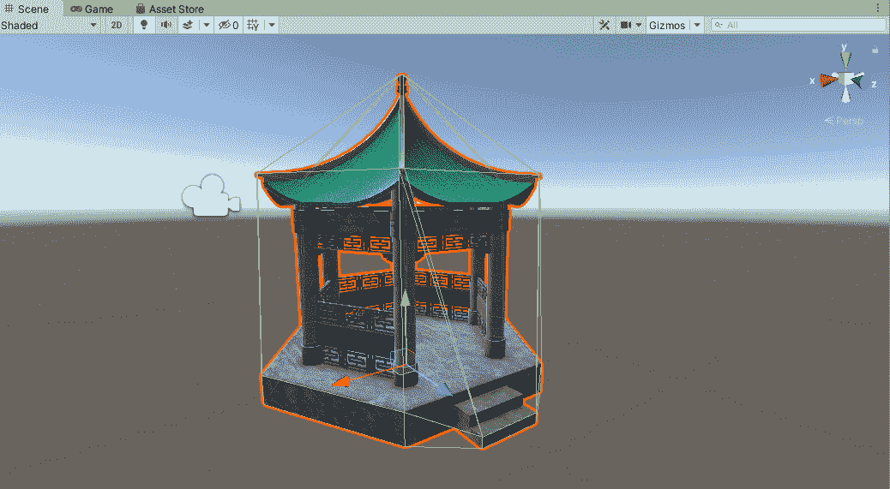

图 5.9 – 凸形网格碰撞体

然而，如果我们现在运行游戏，我们会发现没有任何物理效果应用于游戏；例如，物体不会因为重力而落下。这是因为我们的游戏仍然缺少一个重要的组件。让我们接下来探索这个问题！

## 刚体

**刚体**组件是 Unity 中应用物理效果的必备组件。通过将刚体添加到 GameObject，物理将控制该 GameObject，例如对其应用重力。刚体通常与碰撞体一起使用；如果两个刚体相互碰撞，除非两个 GameObject 都附加了碰撞体，否则它们之间不会有碰撞效果，而是会相互穿过。

现在，让我们在场景中的 GameObject 上添加一个**刚体**组件：

1.  通过点击**3D 对象 > 立方体**按钮在场景中创建一个新的立方体。

![Figure 5.10 – 创建一个新的立方体

![img/Figure_5.10_B17146.jpg]

图 5.10 – 创建一个新的立方体

1.  选择这个新创建的立方体，并在检查器窗口中点击**添加组件**按钮。正如*图 5.11*所示，一个盒子碰撞体已经被附加到立方体上：

![Figure 5.11 – 添加组件

![img/Figure_5.11_B17146.jpg]

图 5.11 – 添加组件

1.  在这里，我们可以选择**物理 > 刚体**按钮来向这个立方体添加一个**刚体**组件。

![Figure 5.12 – 添加盒子碰撞体

![img/Figure_5.12_B17146.jpg]

图 5.12 – 添加盒子碰撞体

现在我们已经添加了一个新的**刚体**组件，这个刚体的属性在*图 5.13*中展示：

![Figure 5.13 – 刚体的属性

![img/Figure_5.13_B17146.jpg]

图 5.13 – 刚体的属性

如*图 5.13*所示，刚体的**使用重力**属性默认是勾选的，这意味着这个刚体将对立方体应用重力。如果我们此时运行游戏，我们会发现立方体会在重力作用下向下坠落。

除了**使用重力**属性外，刚体还有其他属性，我们将在下面介绍这些属性。

刚体组件的第一个属性是**质量**，它决定了刚体在相互碰撞时的反应。接下来是**阻力**属性，它决定了当物体在力的作用下移动时受到的空气阻力有多大。默认值是**零**，这意味着当立方体受到力移动时没有空气阻力。**角阻力**属性与**阻力**属性类似，区别在于它决定了空气阻力在物体由于扭矩旋转时对物体的影响程度。

**Is Kinematic** 属性很重要，因为它决定了这个 GameObject 是否将由 Unity 的物理系统控制。默认情况下，它是禁用的。如果我们启用它，这个 GameObject 将不再由物理驱动。当您发现 Rigidbody 的运动很颠簸时，**Interpolate** 属性很有用。**Interpolate** 的默认值是 **None**，但 Unity 允许我们为这个属性选择不同的选项，例如 **Interpolate** 或 **Extrapolate**，分别表示变换基于前一帧的变换进行平滑，或者变换基于下一帧的估计变换进行平滑，如下面的截图所示：

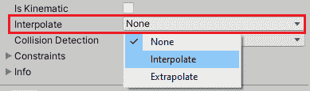

图 5.14 – Interpolate 属性的选项

接下来是 **Collision Detection** 属性。有时，如果 Rigidbody 移动得太快，导致物理引擎没有及时检测到碰撞，那么调整这个属性可能是一个好主意。Unity 也为我们提供了不同的 **Collision Detection** 选项；这些是 **Discrete**、**Continuous**、**Continuous Dynamic** 和 **Continuous Speculative**。

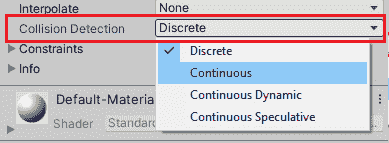

图 5.15 – Collision Detection 属性的选项

**Discrete** 选项是默认值，用于检测正常碰撞。如果您遇到了快速对象碰撞的问题，那么 **Continuous** 是一个好的选择，但您应该记住，**Continuous** 与 **Discrete** 相比会影响性能。

如果您想限制 Rigidbody 的运动，例如限制 Rigidbody 在某个方向上移动或不能在某个轴上旋转，那么您可以通过修改 **Constraints** 属性来实现。

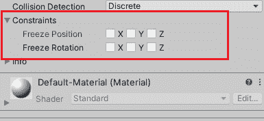

图 5.16 – Constraints 属性

如 *图 5.16* 所示，您可以选择一个轴来防止 Rigidbody 沿着该轴移动。

通过 Rigidbody 组件，我们为 GameObject 添加物理效果，但有时我们不想让 GameObject 根据物理模拟的结果移动，而只想能够检测两个对象之间的碰撞并触发某些事件。这在游戏中是一个常见的功能；例如，玩家进入某个区域后触发相应的逻辑。接下来，我们将介绍 Unity 提供的另一个功能来实现这样的要求。

## 触发器

除了提供碰撞效果外，碰撞体还可以用作触发器。然而，与用作普通碰撞体不同，当触发器启用时，Rigidbody 碰撞时没有碰撞效果。但是，物理效果仍然有效；例如，触发器仍然会受到重力的影响，但它不会与其他 Rigidbody 发生碰撞。

在开发 Unity 项目时，触发器用于检测来自其他 GameObject 的外部交互，并在脚本中的`OnTriggerEnter`、`OnTriggerStay`或`OnTriggerExit`函数中执行代码。这三个函数代表交互的三个不同阶段，即进入、停留和退出。我们将在下一节中详细介绍这些函数。目前，让我们通过以下步骤创建一个触发器：

1.  选择我们之前创建的立方体对象以打开检查器窗口。

1.  启用附加到这个立方体对象上的 Box Collider 组件的**Is Trigger**属性，如图下所示：

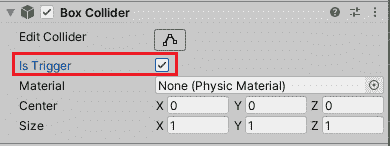

图 5.17 – 启用 Is Trigger 属性

现在，这个立方体被设置为触发器，它将不再阻止其他刚体。由于它现在是一个触发器，我们可以用它来创建游戏关卡。例如，当玩家触摸这个立方体时，它将触发一个陷阱。

作为提醒，Unity 还提供了用于 2D 的物理组件。如果您想开发 2D 游戏并需要在游戏中应用物理效果，那么您可以轻松地以相同的方式添加这些物理组件的 2D 版本。

通过阅读本节，我们已经学习了 Unity 物理系统的一些概念，例如碰撞体、刚体和触发器。接下来，我们将继续探讨如何使用 C#脚本与物理系统交互。

# 使用物理系统进行脚本编写

在本节中，我们将探讨如何通过 C#脚本与物理系统交互。类似于上一节，我们也将分别介绍碰撞体、触发器和刚体的 C#方法。我们将从碰撞体的 C#方法开始。

## 碰撞方法

当碰撞体不被用作触发器时，刚体之间的碰撞仍然会发生。当发生碰撞时，会调用这三个方法，参数类型是**Collision**类，它提供了一些描述碰撞的信息，例如接触点和碰撞的冲击速度。

### OnCollisionEnter

第一种方法是`OnCollisionEnter`，当这个碰撞体开始接触另一个碰撞体时被调用。当您希望这个对象受到物理碰撞的影响，同时在碰撞发生时执行一些游戏逻辑时，它非常有用。例如，当子弹击中游戏中的目标时，可以为其生成相应的爆炸效果，如下面的 C#代码片段所示：

```cs
using UnityEngine;
public class CollisionTest : MonoBehaviour
{
[SerializeField] 
private Transform _explosionPrefab;
    private void OnCollisionEnter(Collision collision)
    {
        var contact = collision.contacts[0];
        var rotation =
          Quaternion.FromToRotation(Vector3.up,
          contact.normal);
        var position = contact.point;
        Instantiate(_explosionPrefab, position, rotation);
        Destroy(gameObject);
    }
}
```

在代码片段中，我们访问了由碰撞对象提供的接触点数据，并在该点实例化了爆炸资产。

### OnCollisionStay

`OnCollisionStay` 是我们将要探索的第二个方法。只要两个物体发生碰撞，`OnCollisionStay` 就会在每一帧被调用一次。由于这个方法将在物体碰撞期间被调用，因此它适合用来实现一些需要持续一段时间的逻辑。一个有趣的例子如下：假设你正在开发一款直升机游戏，并且当你想要直升机在接触地面时以最大强度的 60%运行引擎。在这种情况下，我们可以使用以下代码片段来实现这个功能：

```cs
using UnityEngine;
public class CollisionTest : MonoBehaviour
{
    private void OnCollisionStay(Collision collision)
    {
        if (collision.gameObject.name == "Ground")
        {
            //Reduce engine strength to 60%
        }
    }
}
```

### `OnCollisionExit`

我要在这里介绍的最后一种方法是 `OnCollisionExit`。正如这个方法的名字所暗示的，当这个碰撞体停止接触另一个碰撞体时，它将被调用。如果在物体碰撞的开始通过 `OnCollisionEnter` 生成了一些内容，并且你希望在物体碰撞结束时销毁它们，那么你应该考虑使用 `OnCollisionExit`：

```cs
using UnityEngine;
public class CollisionTest : MonoBehaviour
{
    private bool _isGrounded;
    private void OnCollisionEnter(Collision collision)
    {
        _isGrounded = true;
    }
    private void OnCollisionExit(Collision collision)
    {
        _isGrounded = false;
    }
}
```

上述代码片段展示了如何使用 `OnCollisionExit` 来重置 `_isGrounded` 字段。

我们已经介绍了在碰撞体中使用的典型方法。现在，我们将看看如何在 Unity 项目中使用触发器。

## 触发器方法

实际上，我们仍然使用碰撞体来实现触发器，只需要检查**碰撞体**组件的**触发器**选项。此时，碰撞体将不再产生物理碰撞效果，但会激活触发器事件。

常用来实现触发器的三个事件分别是 `OnTriggerEnter`、`OnTriggerStay` 和 `OnTriggerExit`。这三个方法在两个 GameObject 发生碰撞时被调用，参数类型是 `Collider` 类，它提供了关于参与此碰撞的其他碰撞体的信息。

### `OnTriggerEnter`

第一种方法是 `OnTriggerEnter`，它在碰撞体开始接触另一个碰撞体时被调用。在这种情况下，应该启用**触发器**选项。当你想在周围元素上触发一些操作但不想产生物理碰撞效果时，这个方法很有用。例如，你可以用它来实现游戏中的陷阱。

它的使用也非常简单。我们只需要在方法的定义中包含将被触发的游戏逻辑，如下面的代码片段所示：

```cs
using UnityEngine;
public class TriggerTest : MonoBehaviour
{
    private void OnTriggerEnter(Collider other)
    {
        Debug.Log($"{this} enters {other}");
    }
}
```

当这个 GameObject 与另一个 GameObject 发生碰撞时，通过这个 GameObject 进入另一个 GameObject 的字符串将在控制台窗口中打印出来。

### `OnTriggerStay`

`OnTriggerStay` 是我们将要探索的第二个方法。与之前讨论的 `OnCollisionStay` 方法类似，`OnTriggerStay` 将在其他碰撞体接触此触发器时在所有帧中被调用。这种方法也适合在游戏中实现类似陷阱的游戏玩法；例如，玩家进入有毒迷雾后将继续受到伤害：

```cs
using UnityEngine;
public class TriggerTest : MonoBehaviour
{
    private void OnTriggerStay(Collider other)
    {
        Debug.Log($"{this} stays {other}");
    }
}
```

在这里，我们只需要在`OnTriggerStay`方法的定义中放置将被触发的游戏逻辑，如前面的代码片段所示。

### OnTriggerExit

我在这里要介绍的最后一种方法是`OnTriggerExit`。当其他碰撞体离开触发器时，将调用此方法。此方法适用于一些任务，例如销毁其他碰撞体进入此触发器时创建的 GameObject，重置状态等。以下代码片段展示了如何在`OnTriggerExit`中销毁一个 GameObject：

```cs
using UnityEngine;
public class TriggerTest : MonoBehaviour
{
    private void OnTriggerExit(Collider other)
    {
        Destroy(other.gameObject);
    }
}
```

## Rigidbody 的方法

**Rigidbody**组件为我们提供了直接与 Unity 中的物理系统交互的能力。我们可以使用 C#脚本中**Rigidbody**组件提供的方法来对此 Rigidbody 施加力，我们还可以对模拟爆炸效果的 Rigidbody 施加力。

应注意，正如我们在*第二章*中提到的，*Unity 中的脚本概念*，在脚本中，建议使用`FixedUpdate`函数进行物理更新，因此我们应该在`FixedUpdate`函数中调用 Rigidbody 方法以应用物理效果。现在，让我们探索一些常用的方法。

### AddForce

`AddForce`方法是与物理相关的最常用的方法之一。正如其名称所暗示的，我们可以调用此方法向 Rigidbody 施加力。`AddForce`函数的签名如下：

```cs
public void AddForce(Vector3 force,
  [DefaultValue("ForceMode.Force")] ForceMode mode);
```

如您所见，此方法需要两个参数，即世界坐标系中的力矢量和要应用的力类型。`AddForce`允许我们定义一个力矢量并选择如何将此力应用到 GameObject 上，以影响我们的 GameObject 的运动方式。

第一个参数，`force`，是一个矢量类型，指定了施加到该对象上的力的方向。

另一方面，`ForceMode`类型参数`mode`决定了应用的力类型。`ForceMode`是一个`enum`类型，它定义了四种不同的力类型。默认情况下，`AddForce`方法将使用其质量向 Rigidbody 添加持续的力量。在下一节中，我将详细介绍不同类型的力模式。

#### ForceMode

`ForceMode`定义在`UnityEngine`命名空间中，我们可以在以下代码片段中看到其定义：

```cs
namespace UnityEngine
{
    //
    // Summary:
    //     Use ForceMode to specify how to apply a force
           using Rigidbody.AddForce.
    public enum ForceMode
    {
        //
        // Summary:
        //     Add a continuous force to the rigidbody,
               using its mass.
        Force = 0,
        //
        // Summary:
        //     Add an instant force impulse to the
               rigidbody, using its mass.
        Impulse = 1,
        //
        // Summary:
        //     Add an instant velocity change to the
               rigidbody, ignoring its mass.
        VelocityChange = 2,
        //
        // Summary:
        //     Add a continuous acceleration to the
               rigidbody, ignoring its mass.
        Acceleration = 5
    }
}
```

如前面的代码片段所示，有四种类型的力模式，即`Force`、`Impulse`、`VelocityChange`和`Acceleration`。

`力`是默认模式，在此模式下，需要施加更大的力来推动或扭曲质量较大的物体，因为这与 Rigidbody 的质量有关。它将为 Rigidbody 添加持续的力量。

如果我们将`Impulse`模式作为参数，那么`AddForce`方法将向 Rigidbody 应用一个瞬时的力脉冲。此模式适用于模拟爆炸或碰撞产生的力。与`Force`模式一样，`Impulse`模式也取决于 Rigidbody 的质量。

`VelocityChange`是这里的第三种模式。如果我们选择此模式，则 Unity 将使用单个函数调用立即应用速度变化。需要注意的是，`VelocityChange`模式与`冲量`模式和`力`模式不同。`VelocityChange`模式不依赖于 Rigidbody 的质量，这意味着`VelocityChange`将以相同的方式改变每个 Rigidbody 的速度。

最后的模式是`加速度`模式。如果选择此模式，则 Unity 将为 Rigidbody 添加持续加速度。与`速度变化`模式一样，`加速度`模式也忽略 Rigidbody 的质量，这意味着`AddForce`将以相同的方式移动每个 Rigidbody。

到目前为止，我们已经学习了`AddForce`方法可用的不同力模式。接下来，让我们创建一个新的 C#脚本，并通过调用`AddForce`对立方体施加力：

```cs
using UnityEngine;
public class RigidbodyMethods : MonoBehaviour
{
[SerializeField] 
private Rigidbody _rigidbody;
[SerializeField] 
private float _thrust = 50f;
    private void Start()
    {
        _rigidbody = GetComponent<Rigidbody>();
    }
    private void FixedUpdate()
    {
        if (Input.GetKey(KeyCode.F))
        {
            _rigidbody.AddForce(transform.forward *
              _thrust);
        }
        if (Input.GetKey(KeyCode.A))
        {
            _rigidbody.AddForce(transform.forward *
              _thrust, ForceMode.Acceleration);
        }
    }
}
```

如代码所示，我们可以通过按键盘上的*F*键对 Rigidbody 施加持续力，并通过按键盘上的*A*键对 Rigidbody 施加持续加速度。

### MovePosition

有时候，我们只想移动我们的 GameObject，而不想处理力。Rigidbody 的`MovePosition`方法可以帮助我们实现这个目标。

`MovePosition`函数的签名如下：

```cs
public void MovePosition(Vector3 position);
```

在这里，我们需要一个参数位置来提供 Rigidbody 对象移动到的新位置。为了使 Rigidbody 平滑移动，我们通常使用插值来实现帧之间的平滑过渡。由于`MovePosition`仍然是 Rigidbody 的方法，我们仍然在`FixedUpdate`函数中调用它，如下面的代码片段所示：

```cs
using UnityEngine;
public class RigidbodyMethods : MonoBehaviour
{
[SerializeField] 
private Rigidbody _rigidbody;
[SerializeField] 
private float _speed = 50f;
    private void Start()
    {
        _rigidbody = GetComponent<Rigidbody>();
    }
    private void FixedUpdate()
    {
        var direction = new
          Vector3(Input.GetAxis("Horizontal"), 0,
          Input.GetAxis("Vertical"));
        _rigidbody.MovePosition(transform.position +
          direction * Time.deltaTime * _speed);
    }
}
```

在这里，我们获取用户输入作为移动方向，并将移动应用到当前位置。您还可以看到，移动向量乘以`deltaTime`和`speed`，这是为了实现平滑移动。

在阅读本节之后，我们学习了如何通过 C#脚本与物理系统交互。但最好是我们自己使用物理系统实现一个简单的游戏，这就是我们在下一节要做的事情！让我们继续。

# 基于物理系统创建一个简单的游戏

我们已经学习了 Unity 物理系统的概念，并讨论了如何使用 C#代码与物理系统交互。接下来，我们将使用我们所学到的知识在 Unity 中创建一个简单的基于物理的乒乓球游戏。

首先，让我们执行以下步骤来创建一个**平面**对象作为乒乓球桌：

1.  右键单击**Hierarchy**窗口打开菜单。

1.  选择**3D Object > Plane**在编辑器中创建一个新的**平面**对象。

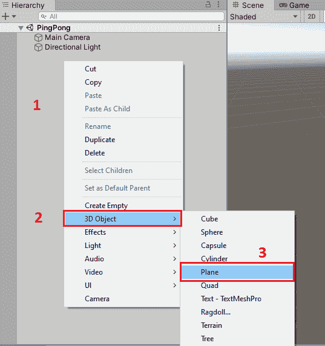

图 5.18 – 创建平面对象

1.  重命名`Table`。

1.  选择`2`，我们可以看到默认情况下已经为这个对象添加了一个 Mesh Collider。

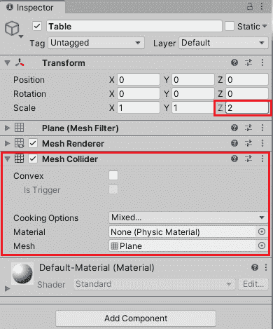

图 5.19 – “Table”的检查器窗口

1.  通过选择**3D Object > Cube**创建四个立方体对象作为桌子上的墙壁，这个过程与创建**平面**对象的过程类似。默认情况下，每个立方体对象都添加了一个 Box Collider。

1.  我们可以通过使用编辑器中的工具轻松调整这四个立方体对象的位置、大小和旋转，以创建桌子上的墙壁。

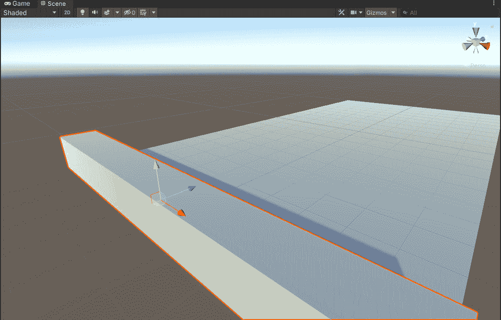

图 5.20 – 在桌子上创建墙壁

为了让桌子看起来不那么无聊，我们可以将不同的材质应用到墙壁和桌子上。现在我们已经设置了乒乓球桌，如下面的图片所示：

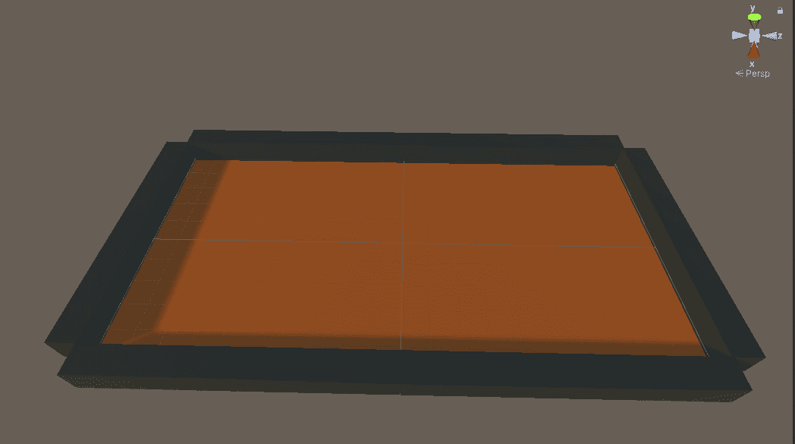

图 5.21 – 乒乓球桌

接下来，我们需要创建两个玩家，即**Player1**和**Player2**。为了保持简单，我们仍然使用两个立方体对象作为玩家：

1.  选择**3D Object > Cube**在场景中创建一个新的立方体对象。

1.  将立方体对象重命名为`Player1`。

1.  调整`3`的位置和大小。

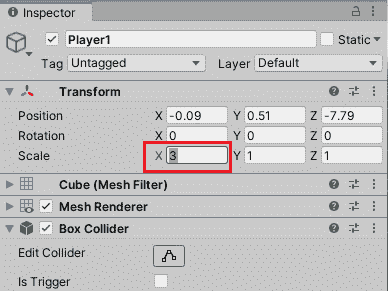

图 5.22 – Player1 的检查器窗口

1.  让我们重复前面的步骤来创建另一个玩家。

1.  我们可以使用不同的颜色来识别**Player1**和**Player2**，以便区分它们，如下面的图所示：

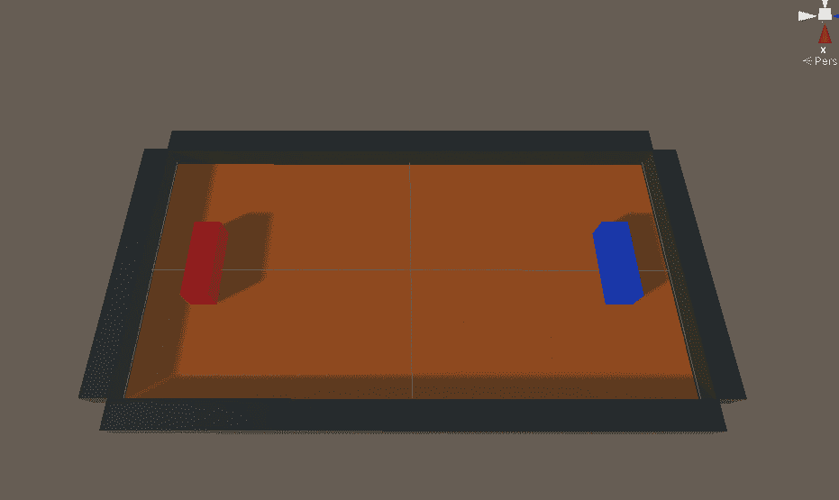

图 5.23 – Player1 和 Player2

现在我们已经在我们的简单游戏中有了**Player**对象。接下来，我们将向我们的游戏中添加一个乒乓球：

1.  选择**3D Object > Sphere**在场景中创建一个新的**Sphere**对象。

1.  将`Ball`重命名。

1.  选择**Ball**打开其检查器窗口。我们可以看到，默认情况下已经为球添加了一个 Sphere Collider。

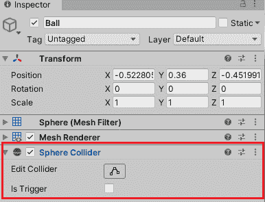

图 5.24 – 球形 Collider 组件

1.  然后，我们需要通过点击**Add Component**按钮并选择**Physics > Rigidbody**来向这个球添加一个**Rigidbody**组件。

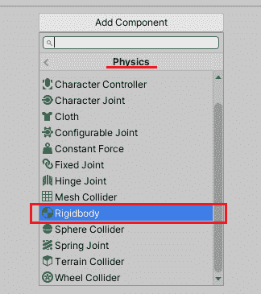

图 5.25 – 添加 Rigidbody 组件

1.  然后，我们将这个**Rigidbody**组件的**Interpolate**选项从**None**更改为**Interpolate**，以便根据前一帧的变换使变换平滑。

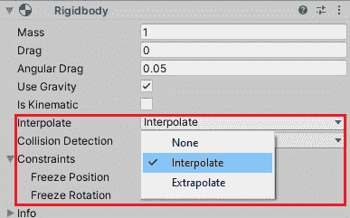

图 5.26 – 更改 Interpolate 选项

1.  然后，我们将这个**Rigidbody**组件的**Collision Detection**选项从**Discrete**更改为**Continuous Dynamic**，以便正确处理快速移动的乒乓球。

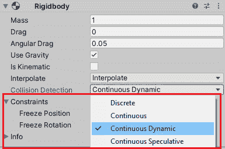

图 5.27 – 更改 Collision Detection 选项

1.  由于现实世界的乒乓球在撞击障碍物时会弹回，为了模拟这种弹跳效果，我们需要通过在项目窗口中点击 **创建 > 物理材质** 来创建一个物理材质。

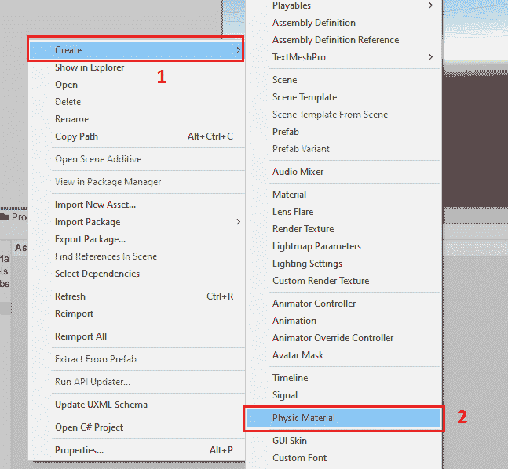

图 5.28 – 创建物理材质

1.  现在让我们选择新创建的物理材质，打开检查器窗口，将 `0.4` 更改为 `0`，将 `0` 更改为 `1`。同时，设置 `Multiply` 和 `Maximum`，如下截图所示：


图 5.29 – 物理材质设置

1.  然后，将此物理材质分配给球体碰撞器的 **材质** 选项。

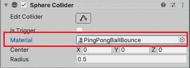

图 5.30 – 将物理材质分配给球体碰撞器

现在我们已经设置了将在我们的游戏中使用的乒乓球。接下来，让我们创建一个新的 C# 脚本来对球施加力以移动它：

```cs
using UnityEngine;
public class PingPongBall : MonoBehaviour
{
    [SerializeField] private Rigidbody _rigidbody;
    [SerializeField] private Vector3 _initialImpulse;
    private void Start()
    {
        _rigidbody.AddForce(_initialImpulse,
          ForceMode.Impulse);
    }
}
```

在这个脚本中，我们使用之前学到的 `AddForce` 方法以及 `Impulse` 力模式来对球施加脉冲力。力的方向和大小由 `_initialImpulse` 变量提供。这可以在编辑器中设置。

现在让我们将这个脚本附加到球上，并为 `_initialImpulse` 变量提供一个值。

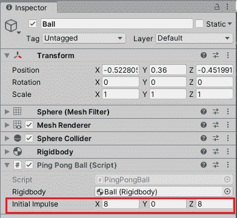

图 5.31 – 乒乓球（脚本）

如前一个截图所示，`_initialImpulse` 变量的值为 (`8`, `0`, `8`)，这意味着我们向 Rigidbody 添加了一个指向桌面右下角的即时力脉冲。

让我们玩游戏并看看会发生什么。

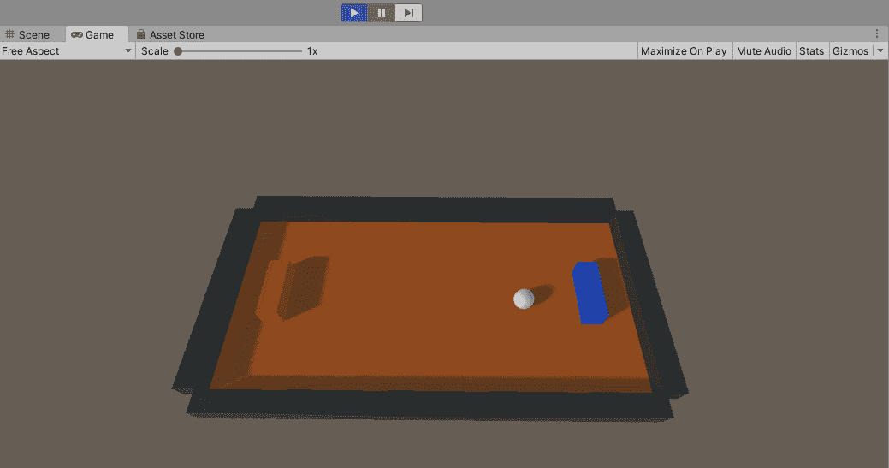

图 5.32 – 球被弹起

从图片中，我们可以看到游戏中的乒乓球撞击墙壁并弹起。接下来，我们将向玩家对象添加更多逻辑，以便我们可以在游戏中控制它们。

然而，在我们开始为玩家对象编写 C# 代码之前，我们应该首先为它们中的每一个添加一个 **Rigidbody** 组件，并将 **Rigidbody** 组件设置调整为以下截图所示：

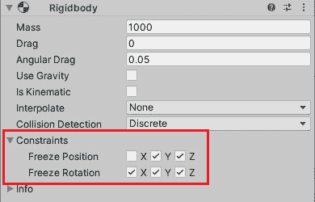

图 5.33 – 玩家 Rigidbody 组件设置

如您从截图中所见，我们首先将质量设置为 `1000` 并通过取消选中 **使用重力** 选项来禁用重力效果。

然后，请注意，我们已经限制了 Rigidbody 的运动。由于玩家对象将仅沿 x 轴移动而不会旋转，我们只保留 Rigidbody 沿 x 轴的运动而不加约束。

接下来，我们还需要配置这两个不同玩家的控制，如下步骤所示：

1.  通过在编辑器中选择 **Edit > Project Settings** 来打开 **项目设置** 窗口。

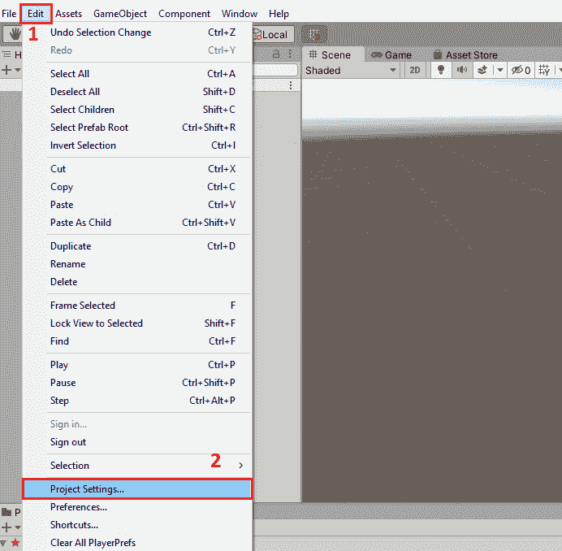

图 5.34 – 打开项目设置窗口

1.  从左侧的导航中选择 **输入管理器** 以打开 **输入管理器** 窗口。

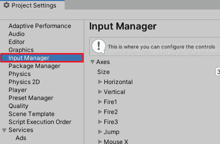

图 5.35 – 打开输入管理器窗口

1.  我们将在本窗口中定义玩家 1 和玩家 2 的输入轴和相关动作，以便我们可以使用上箭头键和下箭头键以及 w 键和 s 键来分别控制这两个玩家对象的移动，如下面的截图所示：

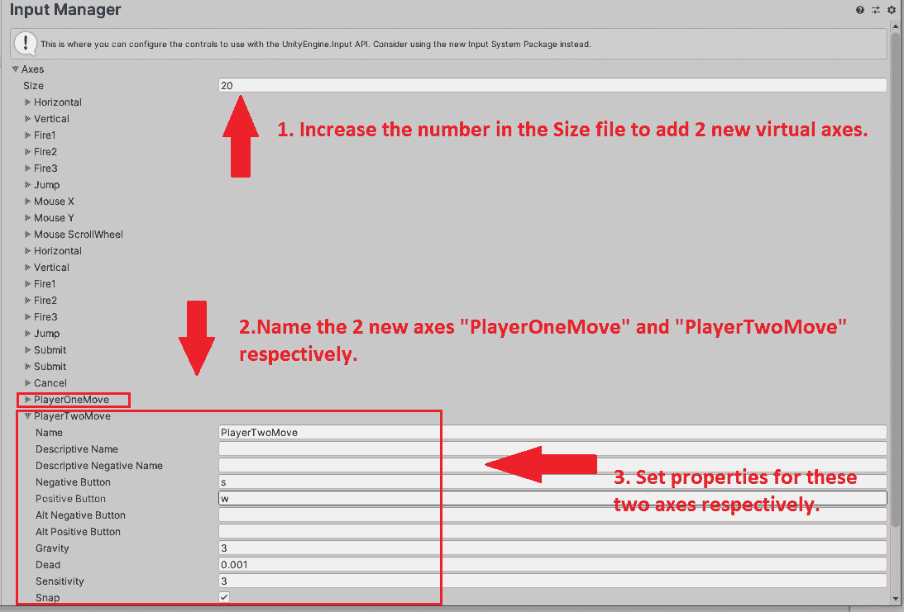

图 5.36 – 设置玩家的输入控制

到目前为止，我们已经设置了玩家对象所需的 Rigidbody 组件和输入控制，然后我们可以编写一个 C# 脚本来控制我们游戏中的玩家对象。

记得我们之前介绍的 `MovePosition` 方法吗？这里，我们将使用这个方法来移动玩家对象：

```cs
using UnityEngine;
public class Player : MonoBehaviour
{
[SerializeField] 
private Rigidbody _rigidbody;
[SerializeField] 
private float _speed = 10f;
[SerializeField] 
private bool _isPlayerOne;
    private void Start()
    {
        _rigidbody = GetComponent<Rigidbody>();
    }
    private void FixedUpdate()
    {
        var inputAxis = _isPlayerOne ? "PlayerOneMove" :
          "PlayerTwoMove";
        var direction = new
          Vector3(Input.GetAxis(inputAxis), 0, 0);
        _rigidbody.MovePosition(transform.position +
          direction * Time.deltaTime * _speed);
    }
}
```

如前述代码所示，此脚本将首先确定对象是哪个玩家，获取相应的输入设置，然后根据玩家的输入确定对象的移动方向。

现在，让我们将此脚本附加到这两个玩家对象上并开始游戏！

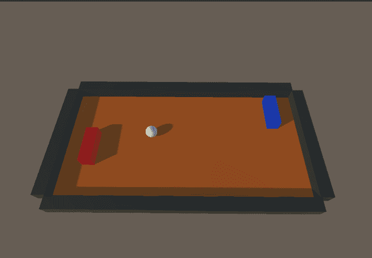

图 5.37 – 乒乓球游戏

如前述图像所示，我们现在可以使用 *w* 和 *s* 键以及 *上* 和 *下* 键来控制玩家 1 和玩家 2 的移动，并且正如预期的那样，当乒乓球击中玩家时，它会弹跳。

在本节中，我们制作了一个简单的基于物理的游戏，现在我们将介绍如何在 Unity 中开发游戏时优化物理系统的性能。

# 提高物理系统的性能

物理模拟需要大量的计算，尤其是在高物理精度要求的情况下。因此，正确理解如何使用 Unity 的物理系统并减少不必要的计算开销非常重要。

## Unity 性能分析器

首先，我们应该学习如何使用工具来查看和定位由 Unity 中的物理系统引起的性能瓶颈。

Unity 编辑器中的 **Profiler** 工具是我们推荐的工具，它允许我们轻松查看各种性能数据并定位与物理系统相关的性能问题。

以我们刚刚制作的乒乓球游戏为例，我们可以执行以下步骤来查看此游戏的性能数据：

1.  通过点击 **Play** 按钮在编辑器中启动游戏。


图 5.38 – 在编辑器中玩游戏

1.  点击 **Window > Analysis > Profiler** 或使用键盘快捷键 *Ctrl + 7* (*Command + 7* 在 macOS 上) 打开 **性能分析器** 窗口。

1.  在 **Profiler** 窗口中点击 **CPU 使用率** 模块区域以查看 CPU 负载的性能数据，例如 **FixedUpdate.PhysicsFixedUpdate** 消耗的 CPU 时间，如下所示：

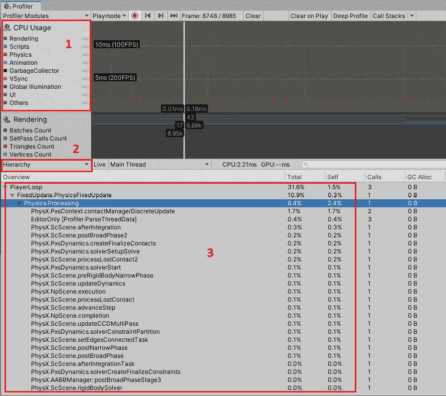

图 5.39 – Unity Profiler

除了 **CPU 使用率** 模块外，我们还可以查看物理系统的详细信息，例如在特定时刻的刚体数量和接触数量，如下面的截图所示：

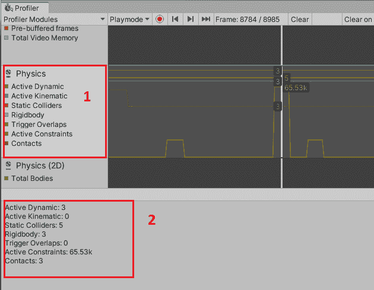

图 5.40 – 分析器中的物理数据

接下来，我们将介绍一些提高物理系统性能的技巧。

## 增加固定时间步长

减少物理计算成本的一个想法是减少物理系统每秒的更新次数。我们可以执行以下步骤来增加这个 **固定时间步长** 设置以实现这一目标：

1.  通过在编辑器中选择 **编辑 > 项目设置** 来打开 **项目设置** 窗口。

1.  从左侧的导航中选择 **时间** 以打开 **时间** 窗口。

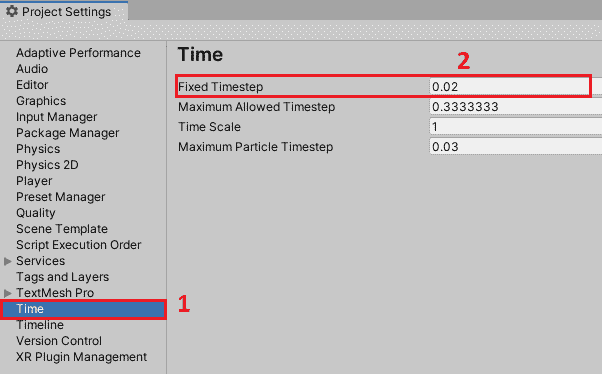

图 5.41 – 时间设置

1.  **固定时间步长** 的默认值是 **0.02**，这意味着物理系统每秒将更新 50 次。为了减少每秒的更新次数，我们可以增加这个值。

## 减少不必要的基于层的碰撞检测

Unity 默认使用一种相当低效的物理碰撞检测模式；也就是说，碰撞检测是在所有 GameObject 上进行的。我们可以通过修改 Unity 的 **物理设置** 中的 **层碰撞矩阵** 字段，并为不同的 GameObject 设置不同的层来减少碰撞检测的数量。以下步骤演示了如何修改它：

1.  通过在编辑器中选择 **编辑 > 项目设置** 来打开 **项目设置** 窗口。

1.  从左侧的导航中选择 **物理** 以打开 **物理** 窗口。

1.  您可以在 **物理** 窗口的底部找到 **层碰撞矩阵**，您可以在 *图 5.42* 中看到默认情况下一切都是相互碰撞的。我们应该只启用需要碰撞检测的层。

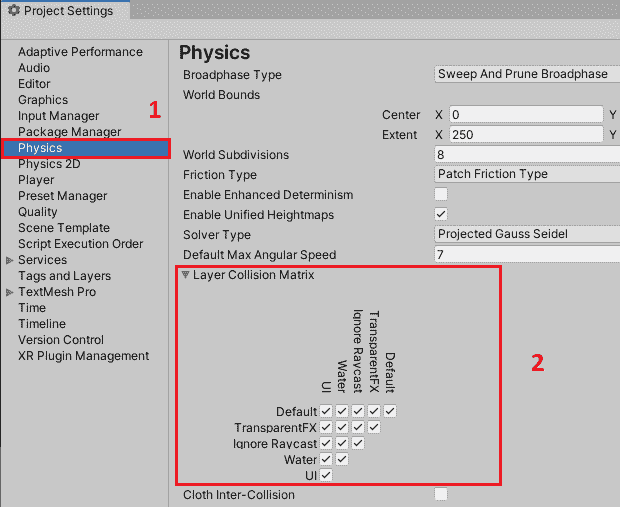

图 5.42 – 层碰撞矩阵

在本节中，我们介绍了如何使用 Unity 的 Profiler 工具查看物理系统的性能数据，并探讨了如何优化物理系统的性能。

# 摘要

在本章中，我们首先介绍了 Unity 提供的物理解决方案，包括两个内置的物理解决方案，**Nvidia PhysX 引擎**和**Box2D 引擎**，Unity 还提供了物理引擎包，即**Unity Physics 包**和**Havok Physics for Unity 包**。然后，我们探讨了 Unity 物理系统中的一些最重要的概念，例如**Collider 组件**、**Rigidbody 组件**和**Triggers**。我们还讨论了如何在 Unity 中创建一个新的脚本以与 Unity 的物理系统交互。

然后，我们演示了如何在 Unity 中实现基于物理的乒乓球游戏。

最后，我们探讨了在 Unity 中应用物理模拟的一些最佳实践，以优化由物理系统引起的性能问题。

在下一章中，我们将讨论如何在 Unity 中实现视频和音频功能。
