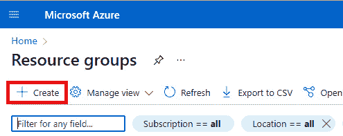

# 第十章：*第十章*：Unity 和 Azure 中的序列化系统与资产管理

在上一章，*第九章*，*在 Unity 中使用面向数据的技术堆栈*，我们学习了什么是面向数据的技术堆栈以及如何使用这项技术利用多核处理器来提高您游戏的表现力。在本章中，我们将介绍 Unity 开发中的其他一些重要主题，即 Unity 中的 **序列化**和**资产管理**。通常，一个游戏不仅包含代码，还由许多不同类型的资产组成，如模型、纹理和音频。因此，了解 Unity 中的序列化系统以及资产工作流程可以帮助您更好地使用 Unity 开发游戏。

在本章的最后部分，我们还将探讨一个有趣的话题——如何使用 **Azure 云存储**服务来托管 Unity 游戏的内容，并通过使用 Unity 的 **可寻址资产系统**从 Azure 云将内容加载到 Unity 游戏中。

以下关键主题将包含在我们的学习路径中：

+   Unity 中的序列化系统

+   Unity 中的资产工作流程

+   介绍 Unity 中的特殊文件夹

+   使用 Unity 的可寻址资产系统与 Azure Blob 存储结合

到本章结束时，您不仅将了解 Unity 中的序列化系统和资产管理，还将熟悉 Azure 云存储服务。

听起来很激动！

# 技术要求

由于本章将涵盖 Azure 的存储账户服务，如果您没有可用的 Azure 账户，我建议您在开始本章之前先设置一个免费的 Azure 试用账户。您可以通过以下链接创建一个带有 200 美元信用额的免费 Azure 试用账户：

[`azure.microsoft.com/en-us/free/`](https://azure.microsoft.com/en-us/free/)


Figure 10.1 – Microsoft Azure 页面

现在，让我们开始吧！

# Unity 中的序列化系统

在开发游戏时，添加可靠的内容保存和加载功能是开发过程中的一个关键部分。如果您使用的是游戏引擎编辑器，例如 Unity 引擎编辑器，您还需要一些常见的编辑器功能，如撤销、保存编辑器设置等。所有这些，无论是游戏在运行时保存或加载内容，还是开发者使用编辑器开发游戏，都是建立在 **序列化**基础上的。

## Unity 的序列化系统是什么？

那么，什么是 `反序列化`。

在 Unity 中，有三种序列化格式，即以下内容：

+   二进制序列化

+   `YAML` 序列化

+   `JSON` 序列化

### Unity 中的 YAML 和二进制序列化

Unity 创建的资产，如 `场景` 和 `预制体`，默认将保存为 `YAML` 格式。例如，如果我们在这个章节中打开场景，即 `Chapter10.unity`，在文本编辑器如 `OcclusionCullingSettings` 和 `RenderSettings` 中。如果你向下滚动，你还可以找到这个场景中包含的 GameObjects 和组件。


图 10.2 – YAML 格式的场景

如 *图 10.2* 所示，毫无疑问，YAML 格式是可读的，并且使得版本控制工具易于使用。然而，YAML 是一种基于文本的格式，因此你也可以选择使用二进制序列化来更有效地使用空间并提高安全性。让我们执行以下步骤来设置 Unity 的序列化模式：

1.  通过点击 Unity 编辑器工具栏中的 **编辑 | 项目设置...** 项来打开 **项目设置** 窗口，如下面的截图所示：


图 10.3 – 打开项目设置窗口

1.  接下来，点击设置面板，如 *图 10.4* 所示：


图 10.4 – 编辑器设置面板

1.  在 **资产序列化** 部分，我们可以看到默认的 **模式** 选项是 **强制文本**。在这种模式下，所有由 Unity 创建的资产都将使用 YAML 格式进行序列化。如果你使用像 Git 这样的版本管理工具，这也是推荐的设置，因为使用纯文本序列化通常可以避免无法解决的合并冲突。如 *图 10.5* 所示，在下拉窗口中，我们可以选择 **强制二进制** 模式将所有资产转换为二进制格式，我们还可以选择 **混合** 模式选项以保留当前资产的序列化格式；也就是说，以二进制格式序列化的资产仍然是二进制格式，而使用 YAML 格式序列化的资产仍然是 YAML 格式。然而，新创建的资产将以二进制格式进行序列化。


图 10.5 – 资产序列化模式

1.  在这里，我们可以选择 **强制二进制** 模式，并在我们的文本编辑器中再次检查相同的场景文件。场景文件已转换为二进制格式，如下面的截图所示：


图 10.6 – 二进制格式的场景文件

如我们之前提到的，序列化也是实现 Unity 编辑器的一个重要部分。不仅 Unity 创建的资产，如游戏场景，会被 Unity 序列化，Unity 编辑器中的各种设置也会被 Unity 序列化。

在项目根目录中，我们可以找到 `ProjectSettings` 文件夹，这是在创建项目时由 Unity 编辑器自动创建的，如 *图 10.7* 所示：


图 10.7 – ProjectSettings 文件夹

双击此文件夹以打开它。我们可以在其中找到当前项目的所有设置文件。


图 10.8 – ProjectSettings 文件夹中的设置文件

接下来，我们仍然使用文本编辑器打开一个设置文件，例如 `GraphicsSettings.asset`，并分别使用 Unity 的二进制序列化模式和文本序列化模式来序列化此文件。*图 10.9* 展示了以二进制格式序列化的设置文件：


图 10.9 – 二进制格式的设置文件

另一方面，你可以在 *图 10.10* 中看到以 YAML 格式序列化的设置文件：


](img/Figure_10.10_B17146.jpg)

图 10.10 – YAML 格式的设置文件

到目前为止，我们已经讨论了 Unity 的二进制序列化和基于文本的 YAML 序列化，但我们还没有涵盖 Unity 提供的 JSON 序列化。接下来，让我们看看 Unity 中的 JSON 序列化。

### Unity 中的 JsonUtility 类和 JSON 序列化

如果你之前有开发 .NET 项目的经验，你可能对 JSON 序列化很熟悉。你可以选择 .NET 提供的解决方案，例如使用 `System.Runtime.Serialization.Json` 命名空间中定义的 `DataContractJsonSerializer` 类或使用 `System.Text.Json` 命名空间中定义的 `JsonSerializer` 类，还有来自开源社区的解决方案，例如 `Newtonsoft.Json`，这是一个非常流行的 .NET JSON 框架。Unity 还为游戏开发者提供了 Unity 开发中的 JSON 序列化功能，即 `JsonUtility` 类。我们可以调用 `JsonUtility` 的 `ToJson` 方法将对象序列化为 JSON 字符串，反之，`JsonUtility` 的 `FromJson` 方法可以将 JSON 字符串反序列化为对象。接下来，让我们看看如何在 Unity 中使用 `JsonUtility` 类的示例：

1.  通过在 **项目** 窗口中点击 **创建 | 文件夹** 项，创建一个名为 `Scripts` 的新文件夹。


图 10.11 – 创建 Scripts 文件夹

1.  双击 `Scripts` 文件夹以进入它，然后在此文件夹中创建一个新的 C# 脚本，命名为 `PlayerData`，并将以下内容添加到该脚本中。`PlayerData` 结构用于存储玩家的数据，稍后该结构的一个对象将被序列化为 JSON 字符串。你应该注意，结构体或类的字段应该是 `public` 的；否则，Unity 序列化器将忽略这些字段：

    ```cs
    public struct PlayerData
    {
        public string Name;
        public int Age;
        public float HP;
        public float Attack;
        public PlayerData(string name, int age, float hp,
          float attack)
        {
            Name = name;
            Age = age;
            HP = hp;
            Attack = attack;
        }
    }
    ```

1.  接下来，我们还需要在同一个文件夹中创建另一个 C#脚本，并将其命名为`JSONSerializationSample`。`JSONSerializationSample`中的代码如下。在`Start`方法中，我们创建一个新的`PlayerData`对象，并为其字段赋值，然后调用`JsonUtility.ToJson`方法将此对象序列化为 JSON 字符串，并将字符串打印到`控制台`窗口：

    ```cs
    using UnityEngine;
    public class JSONSerializationSample : MonoBehaviour
    {
        private void Start()
        {
            var playerData = new PlayerData("player1", 50,
              100, 100);
            var jsonString =
              JsonUtility.ToJson(playerData);
            Debug.Log(jsonString);
        }
    }
    ```

1.  在场景中创建一个新的 GameObject，将其`JSONSerializationSample`脚本附加到它上，并在编辑器中运行游戏。以下截图所示的 JSON 字符串将被打印出来：


图 10.12 – JSON 字符串

1.  将 JSON 字符串反序列化为对象相对简单；你只需要调用`JsonUtility.FromJson<T>`，这是一个泛型方法。如果你不了解 C#中的泛型方法，泛型方法是使用类型参数声明的。因此，让我们回到`JSONSerializationSample`并更新`Start`方法中的代码。这段代码将反序列化 JSON 字符串到一个新的对象，并且对象的`Name`字段将在**控制台**窗口中打印出来：

    ```cs
    using UnityEngine;
    public class JSONSerializationSample : MonoBehaviour
    {
        private void Start()
        {
            var playerData = new PlayerData("player1", 50,
              100, 100);
            var jsonString =
              JsonUtility.ToJson(playerData);
            Debug.Log(jsonString);
            var deserializedObject =
             JsonUtility.FromJson<PlayerData>(jsonString);
            Debug.Log(deserializedObject.Name);
        }
    }
    ```

1.  在编辑器中运行游戏。这个玩家的名字将按以下截图所示打印出来：


图 10.13 – 反序列化 JSON 字符串

1.  如果你希望`PlayerData`作为另一个类的字段，并且想要序列化这个类，`PlayerData`需要标记为`[System.Serializable]`属性，否则，作为字段的`PlayerData`将无法正确序列化。因此，让我们回到`PlayerData`并更新代码以添加`[System.Serializable]`属性：

    ```cs
    [System.Serializable]
    public struct PlayerData
    {
       //No Change
    }
    ```

现在你已经知道了如何在 Unity 中使用`JsonUtility`类将对象序列化为 JSON 字符串，并将 JSON 字符串反序列化为对象，是时候讨论 Unity 的`JsonUtility`类的优缺点了。

#### Unity 的 JsonUtility 类的优缺点

让我们从 Unity 的`JsonUtility`类的优点开始。在 Unity 中使用`JsonUtility`类可以在序列化和反序列化 JSON 方面实现相对较高的性能。`JsonUtility`的`ToJson`方法和`FromJson`方法内部使用 Unity 序列化器，并且对 Unity 的一些内置类型（如`Vector2`和`Vector3`）有更好的支持。此外，由于它是由 Unity 游戏引擎提供的，因此无需安装额外的包。

然而，与`Newtonsoft.Json`等其他流行的 JSON 框架相比，`JsonUtility`的功能有限。两个最明显的限制是`JsonUtility`不支持字典的序列化，并且根元素必须是对象，而不是数组或列表。让我们看看`JsonUtility`类的限制示例：

1.  在`Scripts`文件夹中创建一个新的 C#脚本，命名为`TeamData`，并将以下内容添加到该脚本中。如下面的代码所示，这个类有两个字段，一个`PlayerData`列表和一个字典：

    ```cs
    using System.Collections.Generic;
    public class TeamData
    {
        public List<PlayerData> Players;
        public Dictionary<string, PlayerData> Roles;
        public TeamData()
        {
            Players = new List<PlayerData>();
            Roles = new Dictionary<string, PlayerData>();
        }
    }
    ```

1.  接下来，我们还需要在同一个文件夹中创建另一个 C#脚本，并将其命名为`JsonUtilityLimitationsSample`。`JsonUtilityLimitationsSample`中的代码如下。在`Start`方法中，我们创建一个新的`TeamData`对象，向`Players`列表中添加一个元素，并向`Roles`字典中添加一个键值对。然后，调用`JsonUtility.ToJson`方法将此对象序列化为 JSON 字符串，并将字符串打印到**控制台**窗口：

    ```cs
    using UnityEngine;
    public class JsonUtilityLimitationsSample :
      MonoBehaviour
    {
        private void Start()
        {
            var playerData = new PlayerData("player1", 50,
              100, 100);
            var teamData = new TeamData();
            teamData.Players.Add(playerData);
            teamData.Roles.Add("leader", playerData);
            var jsonStringFromTeamData =
              JsonUtility.ToJson(teamData);
            Debug.Log(jsonStringFromTeamData);
        }
    }
    ```

1.  在编辑器中运行游戏；你会发现只有`Players`列表被序列化，但`Roles`字典没有按预期序列化，如下面的截图所示。这是因为`JsonUtility`不支持在 Unity 中序列化字典。


图 10.14 – Roles 字典未序列化

1.  然后，让我们回到`JsonUtilityLimitationsSample`，并更新`Start`方法中的代码，尝试单独序列化`Players`列表：

    ```cs
    public class JsonUtilityLimitationsSample :
      MonoBehaviour
    {
        private void Start()
        {
            // No Change
            var jsonStringFromList =
              JsonUtility.ToJson(teamData.Players);
            Debug.Log(jsonStringFromList);
        }
    }
    ```

1.  再次在编辑器中运行游戏，你会发现这次`Players`列表没有被序列化，如下面的截图所示。这是因为如果使用`JsonUtility`进行序列化，根元素必须是一个对象，而不是数组或列表。


图 10.15 – Players 列表未序列化

#### Newtonsoft.Json 框架

在开发过程中遇到前面例子中提到的问题真是个头疼的问题，因此尝试一些其他的 JSON 框架可能也是值得的。接下来，我们将使用`Newtonsoft.Json`来修改前面的例子，以便`TeamData`类中的`Roles`字典和单个`Players`列表可以正确地序列化为 JSON 字符串：

1.  首先，如果你的项目中没有安装`Newtonsoft.Json`包，你可以通过 Unity 的包管理器来安装它。你可以在工具栏中点击**Window | Package Manager**项来打开它。


图 10.16 – 打开包管理器

1.  然后，点击左上角的**+**来打开下拉菜单，并从下拉菜单中选择**Add package from git URL…**项。


图 10.17 – 从 git URL 添加包

1.  在出现的输入框中输入`com.unity.nuget.newtonsoft-json`，点击**Add**按钮，等待包管理器安装此包。


图 10.18 – 添加 Newtonsoft.Json

1.  在项目中安装包后，我们可以在 C# 脚本中使用 `Newtonsoft.Json` 框架，因此让我们回到 `JsonUtilityLimitationsSample.cs` 并更新代码：

    ```cs
    using UnityEngine;
    using Newtonsoft.Json;
    public class JsonUtilityLimitationsSample :
      MonoBehaviour
    {
        private void Start()
        {
          var playerData = new PlayerData("player1", 50,
            100, 100);
          var teamData = new TeamData();
          teamData.Players.Add(playerData);
          teamData.Roles.Add("leader", playerData);
          var jsonStringFromTeamData =
            JsonConvert.SerializeObject(teamData);
          Debug.Log(jsonStringFromTeamData);
          var jsonStringFromList =
            JsonConvert.SerializeObject(teamData.Players);
          Debug.Log(jsonStringFromList);
        }
    }
    ```

让我们按以下方式分解代码：

+   我们使用 `using` 关键字添加 `Newtonsoft.Json` 命名空间，它提供了用于 JSON 序列化和反序列化的类和方法。

+   在 `Start` 方法中，我们将 `JsonUtility.ToJson` 方法替换为在 `Newtonsoft.Json` 命名空间中定义的 `JsonConvert.SerializeObject` 方法。

1.  运行游戏。您会发现 `TeamData` 对象的 `Roles` 字典字段按预期进行了序列化，而作为根元素的 `Players` 列表也正确地进行了序列化。


图 10.19 – Newtonsoft.Json 正确工作

在本节中，我们解释了 Unity 的序列化系统以及如何在您的 Unity 项目中使用 JSON 序列化。现在我认为您已经准备好继续探索游戏项目中资产是如何被 Unity 引擎管理的了！

# Unity 中的资产工作流程

Unity 的资产工作流程是另一个非常有趣的话题，它也与序列化密切相关。那么，Unity 中的 `asset` 是什么呢？如果您查看一个 Unity 项目，您会在该项目的根目录下找到一个名为 `Assets` 的文件夹，资产就是存储在这个文件夹中的文件。

在 Unity 开发中，根据其来源，资产可以分为以下两类：

+   导入到 Unity 中的外部资产；在这种情况下最常见的是 `模型`、`纹理` 和 `音频`。它们通常由第三方工具创建，例如 `Maya`、`3Ds Max` 和 `Photoshop`，然后导入到 Unity 中使用。

+   由 Unity 本身创建的资产，例如 `Prefab` 和 `Scene` 文件。

不论是导入的资产还是由 Unity 创建的资产，Unity 对它们执行以下三个操作：

1.  Unity 将为该资产分配一个 GUID。

1.  然后，Unity 将自动创建一个元数据文件来存储有关资产的一些附加信息，例如该资产的 GUID 和导入设置。*图 10.20* 展示了一个自动创建的元数据文件示例。当名为 `SampleTexture` 的 PNG 文件导入到 Unity 项目中时，Unity 自动创建一个名为 `SampleTexture.PNG.meta` 的元数据文件。


图 10.20 – 元数据文件

1.  最后，Unity 将处理资产文件，将其内容转换为 Unity 的内部表示，并将内部表示存储在项目根目录下的 `Library` 文件夹中。我们将在介绍 `Library` 文件夹时详细说明。


图 10.21 – Library 文件夹

在理解了 Unity 的资产工作流程之后，让我们更详细地介绍这个工作流程中涉及的三件事：GUID 和文件 ID、元文件以及 `Libary` 文件夹。

## GUID 和文件 ID

当我们讨论 Unity 的资产工作流程时，GUID 和文件 ID 显然是一个重要的话题。这是因为无论我们使用 Unity 创建资产还是导入外部资产，Unity 都必须唯一地识别这个资产，而这个唯一值就是 GUID。文件 ID 通常与 GUID 一起使用；它不是用来识别资产，而是用来识别对象内另一个对象的引用。

现在我们对 GUID 和文件 ID 有了一个初步的了解，是时候更深入地探索 GUID 和文件 ID 了！

### GUID

正如我们刚才提到的，Unity 将一个 GUID 分配给 `Assets` 文件夹中的每个资产，作为资产的标识符。我们可以使用文本编辑器打开与该资产关联的元文件，以在 Unity 引擎中找到该资产的 GUID。

现在我们将执行以下步骤来创建一个新的 C# 脚本作为资产，并在 Unity 中检查这个 C# 脚本的 `GUID`：

1.  在 `Scripts` 文件夹中创建一个新的 C# 脚本，命名为 `AssetSample`，并将以下内容添加到该脚本中。如下代码所示，这个类有一个 `Texture` 字段：

    ```cs
    public class AssetSample : MonoBehaviour
    {
        [SerializeField]
        private Texture _texture;
    }
    ```

1.  在文件资源管理器中，紧挨着 C# 脚本文件创建了一个名为 `AssetSample.cs.meta` 的元文件，如下截图所示：


图 10.22 – AssetSample.cs.meta 文件

1.  在文本编辑器中打开 `AssetSample.cs.meta` 文件，你会发现这个 C# 脚本资产在 Unity 中的 GUID 是 `e35f96b75211edd4bad6451a26675090`，如下截图所示：


图 10.23 – 此 C# 脚本的 GUID

阅读完本文后，你应该知道如何在 Unity 中找到资产的 GUID；然而，文件 ID 存储在哪里，Unity 是如何使用它来创建和维护对象之间的引用的？那么，让我们通过另一个示例继续我们的旅程。

### 文件 ID

我们之前提到，Unity 使用 `File ID` 来引用对象内的另一个对象，这是在该对象内引用的对象的唯一 ID。

现在，让我们通过一个示例来学习如何找到 `File IDs` 以及 Unity 是如何使用 `File IDs` 来维护对象之间的引用关系的。在这个示例中，我们仍然将使用我们刚才创建的 `AssetSample` 脚本，现在让我们开始吧！

1.  首先，在场景中创建一个新的 GameObject，命名为 `AssetSampleGameObject`。你已经知道，一个 `Transform` 组件会自动创建并附加到这个 GameObject 上，如图 *图 10.24* 所示：


图 10.24 – 创建 AssetSampleGameObject

1.  将一个`AssetSample`组件附加到`AssetSampleGameObject`上，然后从`AssetSample`的`Texture`字段分配一个纹理。然后，将另一个`AssetSample`组件附加到同一个 GameObject 上；然而，这次我们将`AssetSample`设置为**None**并保存场景。


图 10.25 – 向 GameObject 添加 AssetSample 组件

1.  确保您的项目**资产序列化**模式现在是**强制文本**（我们已在*Unity 中的 YAML 和二进制序列化*部分讨论了此主题），然后使用文本编辑器从**文件资源管理器**打开场景文件。您将在场景文件中看到很多内容，如下面的截图所示：


图 10.26 – 在文本编辑器中打开场景文件

这个文件为我们提供了大量信息，记录了场景中的 GameObject、组件和引用的资产。因此，让我们将其分解：

+   首先，我们可以在文件中找到名为`AssetSampleGameObject`的 GameObject 的记录。在下面的截图中，您可以看到有三个组件附加到这个 GameObject 上，分别具有文件 ID`306521988`、`306521989`和`306521990`：


图 10.27 – AssetSampleGameObject 记录

+   如果我们搜索这三个`File IDs`，我们可以在文件中找到三个组件的记录 – 一个`Transform`组件，当 GameObject 创建时创建并附加到该 GameObject 上，以及两个`MonoBehaviour`组件，代表 C#脚本组件。


图 10.28 – 文件 ID

+   那么，文件 ID 和 GUID 之间的区别是什么？如果我们关注这两个`MonoBehaviour`组件，我们可以看到这两个组件的`m_Script`字段都引用了具有 GUID`e35f96b75211edd4bad6451a26675090`的相同 C#脚本。


图 10.29 – MonoBehaviour 组件

因此，我们可以发现，尽管这两个组件对象引用的是同一个 C#脚本，即`AssetSample`，但它们是`AssetSample`的两个不同实例；第一个`MonoBehaviour`组件对象的文件 ID 是`306521989`，第二个`MonoBehaviour`组件对象的文件 ID 是`306521990`。

此外，一个实例的`_texture`字段引用了一个纹理资产，而另一个实例的`_texture`字段没有引用任何纹理资产。

通过阅读本节，我们了解到 Unity 使用 GUID 来识别资产，使用文件 ID 来识别引用的对象。

## 元文件

我们已经知道，元文件记录了其关联资产在 Unity 项目中的 GUID，并且元文件还记录了该资产的导入设置。在本节中，我们将讨论那些看似不起眼但实际上非常重要的元文件。

### 元文件和版本管理

对于刚开始使用 Unity 的开发者来说，一个常见的错误就是没有注意到这些自动生成的元文件。一个这样的例子是在使用 Git 或其他版本控制系统来管理 Unity 项目的版本时忽略元文件。

如果您还记得上一节的内容，Unity 会为每个资产分配一个 GUID，使用这个 GUID 来识别资产，并在元文件中记录这个 GUID。

因此，如果您的版本管理系统中不包括元文件，您的 Unity 开发进度可能会受到影响。

为了说明这一点，让我们想象一个场景，当不包含元文件的 Unity 项目从远程仓库克隆到同事的本地机器上时，Unity 编辑器将重新导入这些资产，为它们分配新的 GUID 并创建元文件来存储这些信息。结果，您 Unity 项目中之前存在的对象之间的引用将不再有效。

例如，假设我们之前创建的 `AssetSample` C# 脚本的 `AssetSample.cs.meta` 元文件没有被版本管理系统管理，那么在另一台计算机上克隆并打开项目后，您将遇到如图 10.30 所示的 `Script Missing` 错误：


图 10.30 – 脚本缺失错误

到目前为止，脚本实际上存在，但由于其 GUID 已经被重新生成，之前的引用关系无效。

因此，在开发 Unity 项目时，请确保元文件被您的版本管理工具管理。

### 元文件中的导入设置

除了存储资产的 GUID 之外，元文件还存储了该资产的导入设置。当然，本小节中将要讨论的元文件主要是指第三方软件中创建并导入到 Unity 编辑器中的资产元文件，例如模型、纹理和音频。

让我们以一个音频资产的元文件为例，看看资产的导入设置是如何保存的。

我们在这里使用的音频资产来自 Unity 的 Asset Store，您可以从这里下载它：[`assetstore.unity.com/packages/audio/sound-fx/weapons/ultra-sci-fi-game-audio-weapons-pack-vol-1-113047`](https://assetstore.unity.com/packages/audio/sound-fx/weapons/ultra-sci-fi-game-audio-weapons-pack-vol-1-113047)。


图 10.31 – 音频包

在将音频导入 Unity 项目后，我们可以选择`Ultra SF Game Audio Weapons Pack v.1`文件夹中的第一个音频文件，在 Unity 编辑器中打开音频的检查器窗口，它显示了资产的导入设置。然后我们使用文本编辑器在文件夹资源管理器中打开同一音频资产的元文件，如图*图 10.32*所示，我们可以看到元文件中的`AudioImporter`对应于编辑器中的导入设置：


图 10.32 – WPN_SCI-FI_FIRE_01 音频的导入设置和元文件

纹理资产和模型资产的导入设置也存储在其元文件中。以下截图显示了纹理和模型的导入设置：

![图 10.33 – 纹理的导入设置（左）和模型的导入设置（右）]

](img/Figure_10.33_B17146.jpg)

图 10.33 – 纹理的导入设置（左）和模型的导入设置（右）

由于元文件存储了资产的导入设置，一旦我们在 Unity 编辑器中修改了资产的导入设置，相应的元文件将被更新。

导入设置通常会影响 Unity 处理这些资产的方式，因此确保导入设置可以根据项目需求进行管理非常重要。例如，在许多移动游戏项目中，我们应该检查音频导入设置中的**Force To Mono**选项，以减少此音频文件的内存使用。

接下来，让我们看看如何在 Unity 中通过 C#脚本管理导入设置。

## 资产后处理器类和导入流程

Unity 为游戏开发者提供了`AssetPostprocessor`类，以便将其钩入 Unity 的资产导入流程。当导入资产时，我们可以根据资产类型管理导入流程。

在以下示例中，我们将创建一个新的 C#脚本，以在 Unity 项目中所有音频文件的导入设置中启用**Force To Mono**选项：

1.  在`Scripts`文件夹中创建一个子文件夹，命名为`Editor`。这是因为我们将创建的 C#类将继承自`AssetPostprocessor`类，这是一个编辑器类，因此它需要放置在`Editor`文件夹中。


图 10.34 – 创建编辑器文件夹

1.  双击`Editor`文件夹进入，在此文件夹中创建一个新的 C#脚本，命名为`AssetImporterSample`，然后向此脚本中添加以下内容：

    ```cs
    using UnityEditor;
    public class AssetImporterSample : AssetPostprocessor
    {
        private void OnPreprocessAudio()
        {
            var audioImporter =
              (AudioImporter)assetImporter;
            if(audioImporter == null)
            {
                return;
            }
            audioImporter.forceToMono = true;
            audioImporter.SaveAndReimport();
        }
    }
    ```

让我们分解一下它是如何工作的：

+   首先，代码使用了`UnityEditor`命名空间。这是因为`AssetPostprocessor`类定义在这个命名空间中，这也意味着`AssetImporterSample` C#脚本是在 Unity 编辑器中使用，而不是在运行时使用。

+   `AssetImporterSample` 类继承自 `AssetPostprocessor` 类并实现了 `OnPreprocessAudio` 方法，该方法将在音频资产导入之前被调用。我们还可以实现其他类似的方法，以便在其他资产类型导入时被调用。例如，`OnPreprocessTexture` 方法将在纹理资产导入之前被调用，而 `OnPreprocessModel` 方法将在模型资产导入之前被调用。

+   在 `OnPreprocessAudio` 方法中，我们可以获取 `AudioImporter` 的实例，将 `forceToMono` 选项设置为 `true`，然后保存并重新导入资产以确保资产的新导入设置生效。

1.  保存 C# 脚本后，Unity 编辑器应修改项目中这些音频资产的导入设置，然后重新导入，如图 *图 10.35* 所示：


图 10.35 – 导入音频资产

1.  现在让我们选择一个音频文件来检查其导入设置。如图 *图 10.36* 所示，新的导入设置按预期工作：


图 10.36 – 新的导入设置

在本小节中，我们介绍了如何使用 C# 代码来管理资产导入流程。接下来，让我们探索 Unity 中的另一个资产工作流程主题 – `Library` 文件夹。

## Library 文件夹

在 Unity 项目中，Unity 将处理和转换外部资产为 Unity 内部格式资产，并将它们保存在 `Library` 文件夹中。因为 `Library` 文件夹中存储的数据是缓存数据，可以根据导入设置从源资产文件中重新生成，所以 `Library` 文件夹通常不应包含在版本管理系统中。

注意

除了 `Library` 文件夹外，还有一些其他 Unity 文件夹需要从版本管理中排除，包括 `Temp, Obj,` 和 `Logs`。如果您使用 Git 作为版本管理工具，您可以在以下链接中找到 Unity 项目的 `.gitignore` 文件：[`github.com/github/gitignore/blob/main/Unity.gitignore`](https://github.com/github/gitignore/blob/main/Unity.gitignore)。

您可以在 Unity 项目的根目录中找到 `Library` 文件夹，如图 *图 10.37* 所示。如果您的 Unity 项目根目录中没有 `Library` 文件夹，您需要使用 Unity 编辑器打开项目。Unity 编辑器将导入 `Assets` 文件夹中的资产并自动生成 `Library` 文件夹。


图 10.37 – Library 文件夹

双击 `Library` 文件夹进入它，您将看到 `ScriptAssemblies` 子文件夹，其中保存了项目中 C# 代码的组件，您还可以看到 `PackageCache` 子文件夹，其中保存了项目使用的 Unity 包的缓存。除了这些，您还可以看到 `Artifacts` 子文件夹，其中保存了由 Unity 处理的资产。

![图 10.38 – 资产夹

![图 10.38 – 图 10.38_B17146.jpg]

图 10.38 – 资产夹

在本节中，我们介绍了 Unity 的资产工作流程，涵盖了 GUID、文件 ID、元文件和`库`文件夹等主题。接下来，让我们看看与 Unity 中的资产管理相关的由开发者创建和管理的特殊文件夹。

# 介绍 Unity 中的特殊文件夹

我们已经在*第二章*“Unity 中的脚本概念”中介绍了一些与 Unity 脚本相关的特殊文件夹。在本节中，我们将介绍剩余的特殊文件夹，这些文件夹与 Unity 中的资产管理相关。

## 资源文件夹

首先，让我们看看 Unity 中的`资源`文件夹。`资源`是 Unity 中的一个特殊文件夹名称，但 Unity 不会自动为你创建一个`资源`文件夹。如果你想使用`资源`文件夹来管理资产，你需要自己创建它。需要注意的是，在一个 Unity 项目中，`Assets`目录中可以有多个`资源`文件夹。

Unity 提供了`Resources.Load`方法来加载`资源`文件夹中的资产。接下来，我们将通过一个示例来学习如何使用`资源`文件夹来管理资产：

1.  通过点击**项目**窗口中的**创建 | 文件夹**项，创建一个名为`资源`的新文件夹。

![图 10.39 – 创建资源文件夹

![图 10.39 – 图 10.39_B17146.jpg]

图 10.39 – 创建资源文件夹

1.  创建一个空 GameObject，命名为`SamplePrefab`，并将其拖入`资源`文件夹以创建一个新的预制体，如图 10.40 所示：

![图 10.40 – SamplePrefab

![图 10.40 – 图 10.40_B17146.jpg]

图 10.40 – SamplePrefab

1.  在`ResourcesLoadExample`中创建一个新的 C#脚本，并将以下内容添加到该脚本中：

    ```cs
    using UnityEngine;
    public class ResourcesLoadExample : MonoBehaviour
    {
        private GameObject _gameObjectInstance;
        private void Start()
        {
            var samplePrefab =
              Resources.Load<GameObject>("SamplePrefab");
            if(samplePrefab != null)
            {
                _gameObjectInstance =
                  Instantiate(samplePrefab);
            }
        }
    }
    ```

让我们分解一下它是如何工作的：

1.  在`Start`方法中，我们调用`Resources.Load`方法，并将要加载的资产的路径作为参数传递给此方法，即`SamplePrefab`。

1.  然后，如果预制体资产被加载，我们将实例化它以在游戏场景中创建一个新的 GameObject。

1.  创建一个新的 GameObject，并将`ResourcesLoadExample`脚本附加到它上。通过点击 Unity 编辑器中的**播放**按钮运行游戏。我们可以看到如预期地创建了一个新的预制体实例。

![图 10.41 – 从资源文件夹加载资产

![图 10.41 – 图 10.41_B17146.jpg]

图 10.41 – 从资源文件夹加载资产

通过这个例子，我们可以看到使用`资源`文件夹来管理资产非常方便，尤其是在你需要快速开发原型时，但是以下原因不建议在 Unity 项目中使用`资源`文件夹来管理资产：

+   当 Unity 编辑器构建游戏时，`资源`文件夹中的资产将被包含在构建中，即使这些资产没有被使用，因此不恰当地使用`资源`文件夹可能会导致构建的游戏文件过大。此外，它还会影响游戏的启动速度。

+   使用`资源`文件夹将使得游戏内容的增量升级变得非常困难或不可能。

现在我们已经了解了`Resources`文件夹，我们知道它们在哪些情况下将是合适的，例如开发快速原型，以及它们的局限性。

接下来，我们将继续介绍 Unity 中的另一个特殊文件夹，即`StreamingAssets`

## StreamingAssets 文件夹

在 Unity 中，`StreamingAssets`也是一个特殊的文件夹名称。我们实际上已经在*第六章*，*在 Unity 项目中集成音频和视频*中讨论过这一点。在本小节中，我们将更详细地讨论它。

我们之前提到，Unity 会以 Unity 引擎理解的形式处理`Assets`文件夹中的资源，但有一个例外。

Unity 项目中的`StreamingAssets`文件夹中的资源将保持原始格式，并且当 Unity 构建游戏时，这些资源不会与其他资源一起构建到游戏中。相反，文件夹中的所有资源都将复制到目标设备上的特定文件夹中。

由于这个特殊文件夹的位置在不同平台上不同，Unity 提供了`Application.streamingAssetsPath`属性，以便我们可以从 C#代码中访问到这个文件夹的正确路径。

以下代码片段来自示例中使用的*第六章*，*在 Unity 项目中集成音频和视频*。我们可以看到如何在 C#代码中使用`Application.streamingAssetsPath`：

```cs
    public void OnClickSetVideoURL()
    {
        _videoPlayer.url =
          Path.Combine(Application.streamingAssetsPath,
          _videoFileName);
    }
```

与`Resources`文件夹类似，Unity 不会自动为您创建`StreamingAssets`文件夹。如果您想使用它，您需要自己创建，如图 10.42 所示：


图 10.42 – 创建 StreamingAssets 文件夹

然后，我们可以在`StreamingAssets`文件夹中放置一个音频 WAV 文件。如图所示，这个 WAV 文件的图标与我们在 Unity 中已经熟悉的音频剪辑图标不同。这是因为 Unity 没有处理 WAV 文件；它仍然保持其原始格式。


图 10.43 – 在 StreamingAssets 文件夹中放置 WAV 文件

在本节中，我们探讨了`Resources`文件夹和`StreamingAssets`文件夹，这些是 Unity 中的特殊文件夹，并了解了它们的功能如何帮助您更好地使用 Unity 开发游戏。

接下来，我们将介绍另一个有趣的主题；如何在 Azure Cloud 中使用 Azure Blob 存储与 Unity 的 Addressable Asset 系统。

# Azure Blob 存储与 Unity 的 Addressable Asset 系统

在本节中，我们将介绍 Microsoft Azure Cloud 中的 Azure Blob 存储服务以及如何使用它与 Unity 的 Addressable Asset 系统。

**Azure Blob 存储**是 Azure 中的 Azure 存储帐户类型之一。其他类型的 Azure 存储帐户包括**队列**、**文件共享**和**表**。其中，Blob 存储非常适合存储大量非结构化数据，如二进制数据。

注意

您可以在 Microsoft 的 Azure 云中找到有关 Azure 存储帐户的更多信息资源，请参阅[`docs.microsoft.com/en-us/azure/storage/common/storage-introduction`](https://docs.microsoft.com/en-us/azure/storage/common/storage-introduction)。

Unity 的 Addressable Asset 系统正如其名所示，提供了一种方便的方法，可以根据特定的地址在本地或远程服务器上加载特定的资产。在上一节讨论“资源”文件夹时，我们讨论了在使用它管理资产时存在的各种限制，而 Addressable Asset 系统可以很好地解决这些问题；例如，可以很好地控制游戏包的大小，无需在游戏构建中包含不必要的资产，并且可以将资产托管在远程服务器上，例如 Azure 云，以在游戏中增量更新资产。

注意

在 Addressable Asset 系统引入之前，开发者也可以使用 `AssetBundles` 来管理资产；`AssetBundles` 不在我们需要讨论的范围之内，但如果您感兴趣，可以在[`docs.unity3d.com/Manual/AssetBundlesIntro.html`](https://docs.unity3d.com/Manual/AssetBundlesIntro.html)上了解更多信息。

好的，现在我们已经了解了 Azure Blob 存储和 Addressable Asset 系统的概念。接下来，我们将探讨如何使用 Azure Blob 存储来托管资产，并使用 Addressable Asset 系统来管理它们。

让我们开始吧！

## 设置 Azure Blob 存储服务

首先，请确保您有一个可用的 Azure 订阅。您可以在本章开头介绍的页面上申请免费的 Azure 试用帐户。

如果一切准备就绪，我们就可以在 Azure 中创建我们的第一个资源，即**Azure 资源组**。

### 创建新的资源组

通常，资源组是我们 Azure 云中的第一个资源。这是因为资源组是用于存放其他 Azure 资源的容器。

我们可以仅通过几个步骤就创建一个资源组：

1.  使用您的帐户登录到 Azure 门户页面[`portal.azure.com/`](https://portal.azure.com/)。


图 10.44 – Azure 门户页面

1.  Azure 门户页面默认不显示门户菜单。我们可以点击页面左上角的**显示门户菜单**按钮来打开门户菜单。


图 10.45 – 显示门户菜单

1.  从门户菜单中选择**资源组**。


图 10.46 – 选择资源组服务

1.  然后资源组页面将打开。点击此页面上的**创建**按钮，如*图 10.47*所示：



图 10.47 – 创建资源组

1.  然后，您将看到`rg-unitybook-dev-001`。选择资源组的区域为`(亚太地区) 澳大利亚东部`，然后点击**审查 + 创建**以验证此资源组的设置并创建它，如*图 10.48*所示：


图 10.48 – 创建资源组

我们已在 Azure 中创建了一个资源组。接下来，让我们创建一个 Azure 存储账户资源。

注意

您可以在 Microsoft Azure Cloud 的命名约定中找到更多信息，请参阅[`docs.microsoft.com/en-us/azure/cloud-adoption-framework/ready/azure-best-practices/resource-naming`](https://docs.microsoft.com/en-us/azure/cloud-adoption-framework/ready/azure-best-practices/resource-naming)。

### 创建新的 Azure 存储账户资源

为了设置 Azure Blob 存储服务，我们需要创建一个 Azure 存储账户，为将要托管的第一批资产在 Azure 中提供一个唯一的命名空间。

我们将执行以下步骤：

1.  返回 Azure 门户页面，重复之前介绍的步骤以打开门户菜单，然后这次点击**存储账户**，如*图 10.49*所示：


图 10.49 – 点击存储账户

1.  存储账户页面将打开。点击此页面上的**创建**按钮，如*图 10.50*所示：


图 10.50 – 创建存储账户

1.  与创建资源组类似，分别在`unitybookchapter10`和`(亚太地区) 澳大利亚东部`上。其他设置可以保留默认值，然后点击**审查 + 创建**按钮来创建资源。


图 10.51 – 创建存储账户

1.  我们可以点击页面右上角的“通知”按钮来查看资源部署的进度。当资源部署完成后，我们可以点击**转到资源**来进入资源页面。


图 10.52 – 通知

1.  如*图 10.53*所示，已创建一个名为`unitybookchapter10`的存储账户：


图 10.53 – 存储账户页面

到目前为止，我们已在 Azure 中设置了一个存储账户资源。接下来，让我们设置 Blob 存储。

### 创建容器

如我们在此节开头所述，Blob 存储是一种 Azure 存储账户类型，因此我们可以在刚刚打开的存储账户页面上找到 Blob 存储的设置。我们可以执行以下步骤来设置 Blob 存储：

1.  首先，我们需要创建一个容器，类似于我们在计算机文件系统中的目录，用于组织一组文件，并在 Azure 云上组织一组 blob 的容器。向下滚动存储账户页面左侧的菜单，在 **Data storage** 部分中，我们可以看到四种不同的存储类型。然后，选择 **Containers**。


图 10.54 – 选择容器

1.  然后，点击如图 *图 10.55* 所示的 **+ 容器** 按钮：


图 10.55 – 点击 + 容器按钮

1.  在 `remotedata` 中作为容器的名称，并且为了简单起见，我们将 **Public access level** 设置为 **Blob** 以允许匿名访问容器内的 blob。


图 10.56 – 创建新的容器

注意

为了安全起见，您应该尝试以更安全的方式管理对 blob 的访问，例如，使用 **访问密钥** 进行授权，或使用 **共享访问签名 (SAS)** 来委派访问。如果您感兴趣，可以在 [`docs.microsoft.com/en-us/azure/storage/blobs/authorize-data-operations-portal`](https://docs.microsoft.com/en-us/azure/storage/blobs/authorize-data-operations-portal) 上了解更多信息。

现在我们已经设置了 Azure Blob 存储，我们还需要在 Unity 中使用 Addressable Assets 系统来创建资产包并将它们部署到 Azure。

## 安装 Addressable Assets 系统包

默认情况下，Addressable Asset 系统在 Unity 项目中不可用。因此，我们需要首先安装 `Addressables` 包。

如 *图 10.57* 所示，我们可以在 Unity 的包管理器中找到此包，并将其安装到我们的项目中。


图 10.57 – 安装 Addressables 包

安装完成后，您可以在 Unity 编辑器的 **Window** 菜单中找到 **Addressables** 项。


图 10.58 – Addressables 项

接下来，让我们使用 Addressable Assets 系统构建可寻址内容。

## 构建可寻址内容

构建可在 Azure 云上托管的可寻址内容听起来很复杂，但我们可以将此任务进一步分解为以下任务：

1.  首先，将资产标记为可寻址。

1.  然后，启用远程目录。

1.  最后，构建内容。

现在，让我们继续探索第一个任务。

### 标记可寻址资产

在 Unity 编辑器中，我们可以轻松地将资产标记为地址化。在我们标记地址化资产之前，让我们首先创建一个新的资产。我们可以在场景中创建一个新的立方体，命名为 `SampleContentOnAzure`，并将其拖到 **项目** 窗口中以创建一个新的预制件资产。

然后，选择此新预制件以打开其 **检查器** 窗口，您可以在窗口中看到 *图 10.59* 中所示的 **地址化** 复选框：


图 10.59 – 标记地址化资产

通过勾选此复选框，我们将标记预制件资产为地址化。

### 启用远程目录

在启用地址化资产设置中的远程目录之前，我们首先可以创建一个新的配置文件，该配置文件定义了诸如 `RemoteLoadPath` 这样的变量。

#### 创建配置文件

因此，让我们按照以下步骤创建一个配置文件：

1.  在工具栏中，点击 **窗口 | 资产管理 | 地址化 | 配置文件**。


图 10.60 – 打开配置文件窗口

1.  在 **地址化配置文件** 窗口中，点击 **创建** 按钮，然后在下拉菜单中选择 **配置文件** 以创建一个新的配置文件。


图 10.61 – 创建新配置文件

1.  然后，将此新配置文件重命名为 **AzureCloud** 并输入与 **RemoteLoadPath** 变量相关的 Azure Blob 容器 URL。


图 10.62 – 设置新配置文件

如果您不知道 Azure Blob 容器的 URL，您可以在 Azure 中容器属性页面上找到它，如下面的截图所示：


图 10.63 – 容器属性

#### 创建新的地址化组

接下来，我们还需要创建一个新的 **地址化组**，这是一个用于地址化资产及其数据的容器，并可以确定组内的资产是否托管在远程服务器上或存储在本地。然后，我们可以将需要托管在远程服务器上的资产放置在这个新组中，而无需更改默认组中配置的本地位置。

让我们执行以下步骤：

1.  在工具栏中，点击 **窗口 | 资产管理 | 地址化 | 组**。


图 10.64 – 打开组窗口

1.  在 **地址化组** 窗口中，点击 **创建** 按钮，然后选择 **组 > 打包资产** 来创建一个新的组。


图 10.65 – 创建新组

将其重命名为 **Azure 远程组**。


图 10.66 – Azure 远程组

1.  将活动配置文件从 **默认** 更改为 **AzureCloud**，以便可寻址资产系统可以访问 **AzureCloud** 中的变量。


图 10.67 – 激活 AzureCloud 配置文件

1.  在 **可寻址组** 窗口中选择 Azure 远程组以打开其 **检查器** 窗口，并使用在 **AzureCloud** 配置文件中定义的远程路径设置 **内容打包和加载**。


图 10.68 – 设置可寻址组

1.  默认情况下，标记的可寻址资产将位于 **默认本地组** 下；我们需要将其移动到我们刚刚创建的 Azure 远程组。


图 10.69 – 将资产移动到 Azure 远程组

1.  最后，我们还需要在 C# 代码中设置一个标签，使用此键的 `Addressables.LoadResourceLocationsAsync` 方法。


图 10.70 – 设置标签

现在我们已经设置了可寻址组，接下来，让我们继续启用构建远程内容的能力。

#### 启用构建远程目录复选框

1.  返回工具栏，点击 **窗口 | 资产管理 | 可寻址 | 设置** 以打开 **可寻址资产设置** 窗口。


图 10.71 – 打开可寻址资产设置窗口

1.  滚动窗口，你将找到 **内容更新** 部分。然后，勾选 **构建远程目录** 复选框，并分别设置 **构建路径** 和 **加载路径** 字段。


图 10.72 – 构建远程目录设置

现在你已经知道了如何在可寻址资产系统中启用远程目录，我认为你已经准备好了，迫不及待地想要学习如何构建内容。让我们开始吧！

### 构建内容

现在是时候在以下步骤的帮助下构建内容了：

1.  返回 **可寻址组** 窗口，点击 **播放模式脚本**，并在下拉菜单中选择如图 *图 10.73* 所示的 **使用现有构建（需要构建组）**：


图 10.73 – 设置播放模式脚本

注意

Unity 为开发者提供了三个构建脚本以创建播放模式数据。在这里，我们使用 **使用现有构建** 模式，这与部署的游戏构建最匹配。你可以在 `docs.unity3d.com/Packages/com.unity.addressables@1.9/manual/AddressableAssetsDevelopmentCycle.html` 找到有关可寻址资产系统构建脚本的更多信息。

1.  然后，点击**构建 | 新构建 | 默认构建脚本**来构建内容。


图 10.74 – 构建内容

1.  等待构建完成，然后你可以在项目根目录下的`ServerData`文件夹中找到构建的内容。


图 10.75 – ServerData

现在你已经知道了如何在 Addressable Asset 系统中构建可寻址内容，接下来，让我们继续学习如何将内容部署到 Azure 云。

## 将内容部署到 Azure 云

要将我们刚刚构建的可寻址内容部署到 Azure 云，请按照以下步骤操作：

1.  导航到我们在 Azure 中创建的**remotedata**容器，然后点击**上传**按钮。


图 10.76 – 远程数据容器页面

1.  然后将出现一个**上传 blob**面板。选择您想要上传的文件，然后点击**上传**按钮。


图 10.77 – 上传内容

1.  等待上传完成，然后我们可以在**remotedata**容器中的 blob 列表中看到我们的可寻址内容。


图 10.78 – Azure 中的可寻址内容

现在你已经知道了如何将可寻址内容部署到 Azure 云，接下来，让我们继续探索如何从 Azure 加载内容到你的游戏中。

## 从 Azure 云加载可寻址内容

由于我们使用 Addressable Asset 系统来管理资产，因此从 Azure 云加载内容到游戏也需要使用 Addressable Asset 系统提供的方法。

让我们开始吧！

1.  在`Scripts`文件夹中创建一个新的 C#脚本，命名为`LoadAddressableContentFromAzureCloud`，并将以下内容添加到该脚本中：

    ```cs
    using UnityEngine;
    using UnityEngine.AddressableAssets;
    public class LoadAddressableContentFromAzureCloud :
      MonoBehaviour
    {
        [SerializeField]
        private string _assetKey;
        private void Start()
        {
            GetContentFromAzureCloud();
        }
        private async void GetContentFromAzureCloud()
        {
            var resourceLocations = await
              Addressables.LoadResourceLocationsAsync
              (_assetKey).Task;
            foreach (var resourceLocation in
              resourceLocations)
            {
                await Addressables.InstantiateAsync
                  (resourceLocation).Task;
            }
        }
    }
    ```

如你在代码中所见，我们首先提供了`_assetKey`，其值为我们在上一节中设置的资产的标签。然后，我们调用`Addressables.LoadResourceLocationsAsync`方法来加载内容，并调用`Addressables.InstantiateAsync`来实例化一个 GameObject。

1.  创建一个新的 GameObject，将其`Asset Key`的值设置为`Azure`，并将`LoadAddressableContentFromAzureCloud`脚本附加到它上，然后在 Unity 编辑器中通过点击**播放**按钮运行游戏。我们可以看到如预期地创建了一个新的预制体实例。


图 10.79 – 从 Azure 云加载可寻址内容

通过阅读本节，你了解了 Microsoft Azure 云中的 Azure Blob 存储服务是什么，以及如何使用 Unity 的 Addressable Asset 系统来托管和更新游戏内容。本节也标志着本章的结束！

# 摘要

在本章中，我们已经走得很远了。我们首先介绍了 Unity 的序列化系统，讨论了 Unity 中的二进制序列化、YAML 序列化和 JSON 序列化。然后我们探讨了 Unity 中的资产工作流程，涵盖了诸如 GUID、文件 ID、元文件、`Library` 文件夹以及如何从 C# 代码中管理资产导入管道等重要概念。接下来，我们详细讨论了 `Resources` 文件夹和 `StreamingAssets` 文件夹，这些是 Unity 中的特殊文件夹，并理解了它们的功能可以帮助你更好地使用 Unity 开发游戏。最后，我们详细介绍了 Azure Blob 存储和 Unity 的可寻址资产系统，从如何在 Azure 云中创建 Azure Blob 存储服务到如何将可寻址内容从 Azure 加载到 Unity 项目中。这是一段令人惊叹的旅程！

在本章中你获得的知识将帮助你根据需求在 Unity 中选择合适的序列化模式，合理管理资产，并利用 Azure 云实现游戏内容的增量更新。

在下一章，我们将继续这段美好的旅程，探索如何使用 Unity、Microsoft Game Dev 和 Azure 云来创建游戏。
