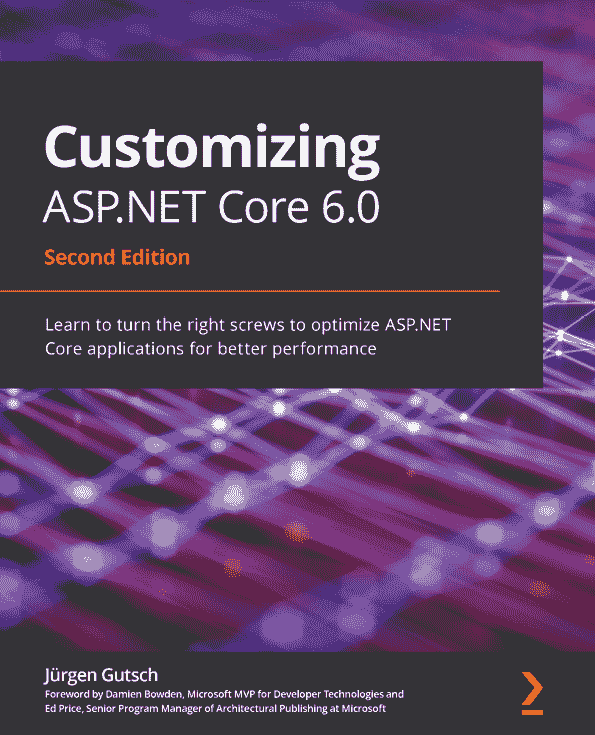

嗨！

我是陈家栋，著有《.NET 开发者用 Unity 进行游戏开发》。我真心希望您喜欢阅读这本书，并发现它对提高您使用 Unity 和 Microsoft Azure 云开发游戏的生产力和效率有所帮助。

如果您能在 Amazon 上留下对《.NET 开发者用 Unity 进行游戏开发》的评论，分享您的想法，这将对我们（以及其他潜在读者！）非常有帮助！

点击以下链接或扫描二维码留下您的评论：

[`packt.link/r/1801078076`](https://packt.link/r/1801078076)

您的评论将帮助我们了解这本书哪些地方做得好，哪些地方可以改进以供未来版本使用，所以您的评论真的非常受重视。

祝好，

[Packt.com](http://Packt.com)

订阅我们的在线数字图书馆，全面访问超过 7000 本书籍和视频，以及行业领先的工具，帮助您规划个人发展并提升职业生涯。更多信息，请访问我们的网站。

# 第十二章：为什么订阅？

+   使用来自 4000 多名行业专业人士的实用电子书和视频，节省学习时间，增加编码时间

+   通过为您量身定制的技能计划提高您的学习效果

+   每月免费获得一本电子书或视频

+   全文可搜索，方便快速获取关键信息

+   复制粘贴、打印和收藏内容

您知道 Packt 为每本书都提供电子书版本，包括 PDF 和 ePub 文件吗？您可以在[packt.com](http://packt.com)升级到电子书版本，并且作为印刷书客户，您有权获得电子书副本的折扣。有关更多信息，请联系我们 customercare@packtpub.com。

在[www.packt.com](http://www.packt.com)，您还可以阅读一系列免费的技术文章，订阅各种免费通讯，并享受 Packt 书籍和电子书的独家折扣和优惠。

# 您可能还会喜欢以下书籍

如果您喜欢这本书，您可能会对 Packt 出版的以下其他书籍感兴趣：

**Unity 2018.1 实战游戏开发**

Raymundo Barrera

ISBN: 978-1-78646-543-6

+   通过使用行业标准技术，在 Unity 中建立游戏开发的基础

+   设计和实现原型，快速迭代

+   建立可重用的框架，使开发更加顺畅

+   掌握 Unity 的最新功能，保持领先

+   掌握您在 Unity 中从概念到发布开发专业游戏所需的最佳实践和技术

**定制 ASP.NET Core 6.0**

Jürgen Gutsch

ISBN: 978-1-80323-360-4

+   探索 ASP.NET Core 6 中的各种应用程序配置和提供者

+   启用并使用缓存来提高您应用程序的性能

+   了解 .NET 中的依赖注入，并学习如何添加第三方 DI 容器

+   发现中间件的概念，并为 ASP.NET Core 应用编写您的中间件

+   在您的 API 驱动型项目中创建各种 API 输出格式

+   熟悉为您的 ASP.NET Core 应用选择不同的托管模型

# Packt 正在寻找像您这样的作者

如果您有兴趣成为 Packt 的作者，请访问 [authors.packtpub.com](http://authors.packtpub.com) 并今天申请。我们已与成千上万的开发者和技术专业人士合作，就像您一样，帮助他们将见解与全球技术社区分享。您可以提交一般申请，申请我们正在招募作者的特定热门话题，或者提交您自己的想法。

您可能还会喜欢的其他书籍
