# 第一章。你好，BizTalk 服务

随着公司构建和扩展其 IT 信息资产，需要集成应用程序以交换数据。虽然使用自定义代码进行点对点应用程序集成是可能的，但它无法解决大规模应用程序集成的问题，包括数据重复和管理的复杂性。BizTalk 是本地系统和服务在 Azure 上基于消息的集成的事实选择，适用于应用程序和业务。

在这本书中，我们将向您介绍 BizTalk 服务，这是微软在 Windows Azure 上托管的新集成中间件。本书假设您已经理解了集成需求以及使用专业集成软件而不是构建定制的点对点集成解决方案的许多好处。我们将探讨为什么云托管集成服务如此吸引人，以及这些服务在哪些场景下最有意义。虽然对 BizTalk Server 的先验知识不是必需的，但它将帮助您快速理解本书中的某些主题。我们假设您是一位熟悉集成异构系统和应用程序挑战的专业开发者、架构师或解决方案设计师。本书还假设您熟悉微软的开发者工具集，特别是.NET、Visual Studio 和 SQL。

在本章中，我们将开始回答一些关于 BizTalk 服务是什么以及它如何帮助您构建集成解决方案的基本问题。具体来说，以下主题将被讨论：

+   Azure 上 BizTalk 服务的商业和技术驱动因素

+   BizTalk 服务的概念和架构

+   使用 BizTalk 服务实现简单的采购订单场景

# 背景

首先，一些背景信息是必要的。在 2008 年的**专业开发者大会**（**PDC**）上，微软揭幕了 Windows Azure——一个专为云设计的操作系统。在随后的几年里，Windows Azure 已成为微软的事实上的云平台，涵盖了服务、媒体、网站、移动应用程序等等。虽然 BizTalk Server 已经是一个超过十年（和八个版本）的成熟产品，但云的采用正在推动不同服务和业务线应用程序的连接系统。为了满足对基于云的集成不断增长的需求，微软 BizTalk 团队于 2011 年 12 月 17 日发布了 BizTalk 服务的第一个版本，名为 Service Bus EAI 和 EDI Labs 社区技术预览（CTP）。目标是让客户能够在共享环境中注册并设置简单的 XML/EDI 流，而无需担心安装和维护。这些功能足够丰富，可以支持简单的点对点集成场景；在次年 4 月 9 日，CTP 进行了更新，通过提供额外的功能来吸收客户的反馈。

CTP 环境托管在公共共享服务上，因此对运行用户自定义代码有限制。集成很少是直接的，开发者编写自定义代码并将其作为集成解决方案的一部分部署的能力是一个关键要求。客户还需要关于性能和服务级别协议（SLAs）的保证。通过切换到按租户部署，将用户组件作为云服务的一部分托管成为现实。因此，名为 BizTalk Services 的云产品于 2013 年 6 月 3 日诞生。像许多 Azure 服务一样，BizTalk Services 预计将定期更新。截至本文撰写时的最新更新是在 2014 年 2 月 20 日。这项技术正在开启新的集成可能性；随着微软持续的投资，它将在不久的将来与本地部署的同类产品 BizTalk Server 的能力相当。

# 业务驱动因素

在 Azure 上构建解决方案今天有许多实际的好处。其中一些包括根据可预测或动态变化的应用程序负载和吞吐量需求调整平台规模的能力，无需担心硬件采购时间和设置，按使用付费，将费用作为运营支出（OpEx）而不是资本支出（CapEx），以及某些集成场景的覆盖范围增加。

对于 Azure 上的集成，有四个因素推动其采用：

+   **专注于业务运营，而非 IT**：通过利用规模经济下运行的平台，降低了成本，使客户能够以更高的服务质量以更低的价格获得它们。当务之急是简化 IT 部署和管理，专注于业务服务而不是配置软件或硬件。

+   **外部服务管理的简单性**：企业通常在地理和组织边界之外提供服务。许多这些服务需要更改公司防火墙以允许或拒绝应用程序。这个过程对于许多组织来说是一个 IT 噩梦。通过 Azure 集成服务，如 B2B，这些服务本质上需要外部通信，所有这些都可以转移到云端，并且必要的访问和控制策略可以集中管理所有内部服务。这也使得对应用程序进行自助服务配置更改成为可能，从而显著提高对业务变化的响应速度。

+   **绿色云应用**：移动设备（如智能手机和平板电脑）以及销售点（POS）系统的普及，催生了本质上基于云的服务。想想一个 POS 系统将每日交易日志传输到其后端业务系统，或者一个 RFID 服务将零售店购物车中每个商品的详细信息传输到库存应用程序。随着新服务的推出，组织希望能够使用 Azure 在更短的时间内开发和部署这些服务。

+   对于云服务，另一个需要考虑的因素是利用现有的本地投资。企业已经在各种本地系统上进行了投资，包括传统的 ERP 系统、遗留的主机以及运行业务的定制系统。

# 技术驱动因素

BizTalk 服务的首要技术目标是减少交换信息时源和目标系统之间的阻抗不匹配。这种阻抗可能存在于不同的级别：

+   **传输协议阻抗**：源可能通过一种传输方式（例如 FTP）发送消息，而目标可能仅接受通过另一种传输方式（例如 POP3）发送的消息。也可能出现消息从一个业务线（LOB）发送到另一个业务线的情况，例如，一端通过销售力适配器发送消息，而另一端通过 SAP 适配器接收消息。BizTalk 服务提供适配器的概念来解决这个问题。

+   **应用协议阻抗**：源可能发送 EDIFACT 消息，而目标可能仅接受 XML 格式的消息。BizTalk 服务为 X12、EDIFACT 和平面文件等协议提供原生支持，以解决这种阻抗问题。

+   **格式阻抗**：源可能发送一种 XML 格式的消息，而目标可能仅接受另一种 XML 格式的消息。BizTalk 服务提供转换功能来解决这个问题。

+   **时间阻抗**：源可以在一天中的任何时间发送消息，但目标仅接受在下午 4 点到 7 点之间的消息。源发送消息的速度是目标处理速度的两倍。

+   **大小阻抗**：源可以发送任何大小的消息，但目标最多只能接受 1 MB 大小的消息。

BizTalk 服务提供连接到服务总线、批处理和去批处理的功能，以解决最后两个阻抗问题。

# 核心场景

上述驱动因素导致了 BizTalk 服务三个核心场景：

+   **企业应用集成**：这些主要是涉及平面文件或基于 XML 的数据，且在两个或更多应用程序之间的消息传递场景，其中至少有一个应用程序运行在云端。一个很好的例子是一个连接到多家航空公司订票系统的旅行门户。

+   **业务对业务集成**：这是两个组织之间具有结构化平面文件/XML 的消息场景。一个例子是 IT 公司从 HP、Dell 或联想等供应商采购硬件。

+   **与混合应用程序的连接**：这是 Azure 和本地应用程序之间的消息场景。这里的例子是将 Salesforce 应用程序连接到运行在您内部 IT 环境中的 SAP 应用程序。

我们将在本书的单独章节中详细探讨这些场景。

# 概念

下图展示了从 FTP 源到 LOB 目标的基本集成流程。BizTalk Services（由中间的框表示）是一系列处理步骤。

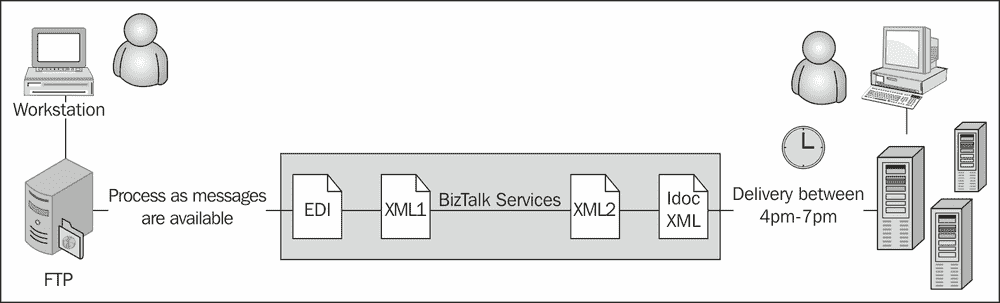

BizTalk Services 的作用

BizTalk Services 引入了几个关键概念，以简化在 Azure 上构建集成解决方案：

+   **桥梁**：桥梁是 BizTalk Services 中的处理单元，可以解决阻抗不匹配问题。它包含三个单元：一个或多个源位置（例如，FTP）用于读取消息，一个管道用于处理消息，以及一个或多个目标（例如，队列）用于写入处理后的消息。管道被划分为具有各自功能的独立处理单元，称为阶段（例如，管道中的一个阶段可以验证消息是否符合模式）。一系列阶段代表桥梁模式或桥梁模板。默认情况下，BizTalk Services v1 附带三个模板：XML、EDI 和 AS2。

+   **适配器**：适配器是传输介质，可以发送消息（到目的地）或接收消息（从源），并将它们通过桥梁传递到管道中；例如，业务线适配器如 SAP 和 Oracle EBS 或传输适配器如 FTP 和 SFTP。

+   **转换**：转换将消息从一种格式转换为另一种格式，有助于结构转换。转换包含可以执行常用转换的操作，如字符串操作、循环结构、列表操作以及算术和逻辑表达式。

+   **应用协议**：协议定义了消息格式和处理语义，例如发送和关联消息确认的要求。

+   **路由**：路由定义了基于指定标准将消息发送到的目标端点。路由标准基于 SQL-92 表达式语法进行评估。

+   **批处理**：基于选择标准的消息聚合称为批处理。批次的释放（发送）由大小、数量或时间，或这些参数的组合来控制。

+   **提升属性**：提升属性是名称-值对，其中名称是用户定义的，而值是从消息头、消息体或桥梁中的上下文中派生的。提升属性通常用于批处理和路由，以指定它们的条件。

+   **工件**：工件是指任何有助于在桥接器中处理消息的东西。XML 模式、映射、自定义程序集和证书是 XML 和 EDI 桥接器中使用的工件。在 BizTalk 服务中，每个工件都存储在工件存储中，并且可以通过一个唯一的 URL 访问。

# 生命周期和架构

与大多数其他 Azure 服务部署不同，BizTalk 服务为存储和计算实例分配了专用资源，这些资源在租户之间是隔离的。这意味着两个部署之间没有任何共同之处。优点是您可以编写任何自定义代码，并确信您不会影响其他部署的性能或可用性。这种专用部署还提供了在存储级别上的数据隔离，从而增加了数据的隐私性和服务的 SLA。

广义上讲，在您拥有一个活跃可用的部署之前，需要经历三个步骤。第一步是使用标准 Azure 工具配置服务，包括使用 Azure 门户创建服务；第二步是使用 Visual Studio 和 BizTalk 服务门户部署在 *BizTalk 服务概念* 部分中概述的必要工件和配置；第三步是发送或接收消息。

BizTalk 服务的架构包含三个关键组件：

+   **配置服务**：这是一组微软服务，用于管理 BizTalk 服务部署的生命周期以及监控其健康状况。它还包括基于 BizTalk 服务使用情况向最终用户计费的功能组件。服务的管理界面通过 **Red Dog 前端**（**RDFE**）公共 API 公开。Azure 管理门户或用户从 PowerShell 脚本通过 RDFE API 进行访问。使用此服务，您可以扩展或缩减您的部署，以及跨数据中心备份和恢复部署。

    ### **注意**

    Red Dog 是 Azure 的原始代号，其中的 "FE" 代表公开可访问的前端，用户可以直接通过 Azure 门户或服务管理 API 与其交互。

+   **按租户 BizTalk 服务**：这是在用户的 Azure 订阅中创建的按租户部署。BizTalk 服务部署通过部署名称进行标识，并通过访问控制服务（ACS）加密的 URL 可访问。所有如桥接器和模式等工件都添加到部署中，其 URL 是部署 URL 的子路径。例如，桥接器添加到 `<deployment URL>/default/<bridgeName>` 下。这里的 default 是工件分组到的命名空间名称。

+   **按租户依赖项**：这些依赖项是用于跟踪、故障排除和安全的 Azure 服务。例如，BizTalk Services 提供了一个跟踪存储库，这是一个 Azure SQL 数据库，其中存储了消息的处理状态以及相关的属性，当消息通过桥接器时。跟踪存储库中的信息显示在 BizTalk Services 门户跟踪视图中。存档和监控存储在 Azure 存储 blob 和表中。存档消息存储在基于存档日期的 blob 容器中。存储还包含 Azure 表 WADLogsTable，其中可以获取桥接器的跟踪信息。最后，访问控制服务管理对部署中所有端点的访问。在创建部署期间，配置服务使用管理服务凭据以编程方式访问 ACS，为 BizTalk Services 部署创建一个信任方，为发送、监听和管理声明添加规则组，并创建具有直接与 ACS 通信所需密码的服务标识。这些组件之间的交互在以下图中说明：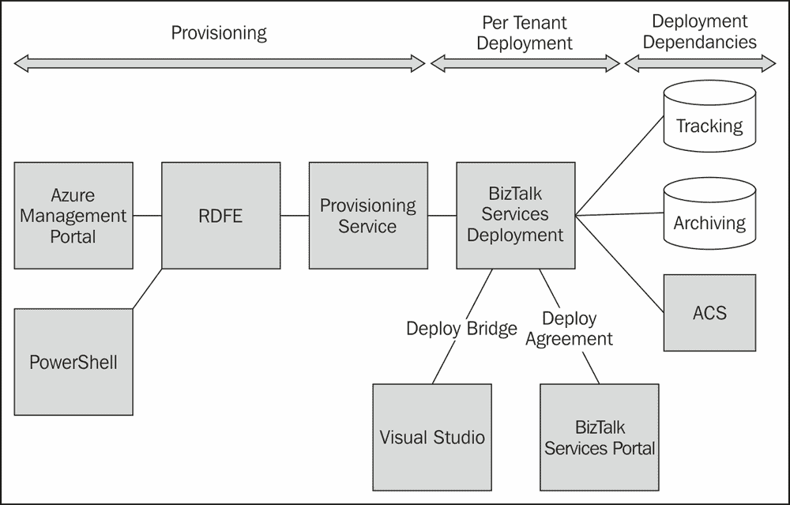

    BizTalk Services 共享和按租户服务的框图

# 角色和工具

BizTalk Services 为不同的角色提供不同的用户体验，以促进优化的基于任务的解决方案。主要角色包括：

| 角色 | 描述 | 主要工具 |
| --- | --- | --- |
| 开发者 | 创建集成解决方案和组件，如转换和模式的人员 | Visual Studio |
| IT 专业人员 | 管理环境的人员，包括部署、设置和配置等任务 | Azure 门户和仪表板 |
| 合作伙伴管理员 | 设置和管理贸易伙伴的人员 | 贸易伙伴/BizTalk 门户 |

## 开发者

开发者通常会专注于使用 Visual Studio 创建解决方案。BizTalk Services VS 2012 项目模板提供，以实现快速创建 EAI 和 EDI 解决方案。这些模板提供了一个图形工作界面，用于创建和配置桥接，以促进企业与贸易伙伴之间的通信。此外，还提供了高级工具，包括图形映射界面和模式编辑器。

## IT 专业人员

Windows Azure 平台管理门户提供访问权限以创建 BizTalk Services 部署和管理任务，以及提供有关所有部署和账户整体健康状况的快速查看状态信息。除了服务部署外，Windows Azure 平台管理门户还提供了一个用于配置 Azure SQL 数据库、移动服务、Service Bus 实体等的接口。

## 合作伙伴管理员

合作伙伴管理员角色使用 BizTalk 服务门户执行多项管理功能，例如创建和管理贸易伙伴、配置包括所需转换、路由和确认、跟踪消息以及异常处理。

BizTalk 服务门户允许创建贸易伙伴及其之间的协议。这使您可以设置和管理用于交换数据（例如，X12 和 AS2）的协议以及要使用的消息格式，包括转换和路由功能。通过这种方式，非 IT 人员可以快速轻松地将贸易伙伴上线并配置，而无需使用如 Visual Studio 等开发工具，所有操作都通过基于 Web 的门户完成。

此外，管理门户还提供了设置和查看消息流跟踪数据的能力，包括上下文细节（发送者、消息类型等）以及消息体本身。作为服务的一部分，还提供了存档和导出消息数据的功能。

此外，还实现了 RESTful API，以提供与门户的完全兼容性，使活动可以脚本化，部署可以自动化。此外，使用此 API 还可以实现与客户系统（如 SharePoint）的集成，用于跟踪数据、可视化或本地存储。

# 部署注意事项

您需要考虑为您的生产使用所需的 BizTalk 服务版本，以及用于测试和/或预演的环境。这取决于以下决策点：

+   目标系统上的预期消息负载

+   现在所需的功能与 6 个月后的需求

+   与合规性、安全和灾难恢复相关的 IT 要求

不同版本的功能列表可以在 Windows Azure 文档页面 [`www.windowsazure.com/en-us/documentation/articles/biztalk-editions-feature-chart`](http://www.windowsazure.com/en-us/documentation/articles/biztalk-editions-feature-chart) 中找到。

### 注意

**关于 BizTalk 服务版本和注册的说明**

BizTalk 服务目前有四个版本：开发者版、基本版、标准版和高级版，每个版本都有不同的功能和价格。您可以从 Azure 门户注册 BizTalk 服务。开发者 SKU 包含尝试和评估所需的所有功能，无需担心生产就绪性。我们在本书的所有示例中都使用开发者版。

# 配置 BizTalk 服务

BizTalk 服务的部署可以使用 Windows Azure 管理门户或使用 PowerShell 创建。在本例中，我们将使用前者。

## 证书和 ACS

使用 SSL 进行通信需要证书，并且访问控制服务用于保护 BizTalk 服务部署的端点。首先，您需要知道是否需要为 BizTalk 服务部署自定义域名。对于测试或开发者部署，答案通常是“不”。BizTalk 服务部署将自动生成一个有效期接近 5 年的自签名证书。用于部署的 ACS 也将自动创建。发送消息到网关和协议需要证书和访问控制服务详情，这些可以在部署后的仪表板页面上检索。

## 存储需求

您需要创建一个 Azure SQL 数据库用于跟踪数据。建议使用具有适当大小的商业版；对于测试目的，可以从 1 GB 的 Web 版开始。您还需要传递存储账户凭据以存档消息数据。建议只为 BizTalk 服务创建一个新的 Azure SQL 数据库和存储账户。

## BizTalk 服务创建向导

现在我们已经解决了安全和存储的细节，让我们从 Azure 管理门户创建一个 BizTalk 服务部署：

1.  从管理门户导航到**新建** | **应用服务** | **BizTalk 服务** | **自定义创建**。

1.  为部署输入一个唯一的名称，同时保留以下值—**版本**：**开发者**，**区域**：**东美国**，**跟踪数据库**：**创建新的 SQL 数据库实例**。

1.  在下一页，保留默认数据库名称，选择 SQL 服务器，并输入服务器登录名和密码。

    ### 备注

    到本书编写时，每个 Azure 订阅可以有六个 SQL 服务器实例。

1.  在下一页，选择用于存档和监控信息的存储账户。

1.  部署解决方案。

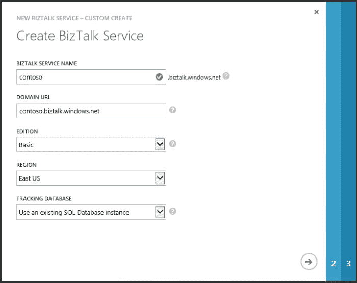

Windows Azure 管理门户中的 BizTalk 服务创建向导

部署过程大约需要 30 分钟来完成。完成后，您将看到部署状态为“Active”。导航到部署仪表板页面；点击**连接信息**并记下 ACS 凭据以及下载部署 SSL 证书。SSL 证书需要安装到将使用 Visual Studio SDK 的客户端机器上。

## BizTalk 门户注册

我们还剩下一项步骤，那就是配置 BizTalk 服务管理门户以查看协议、网关及其跟踪数据。为此，执行以下步骤：

1.  从仪表板屏幕点击**管理**。

1.  这将启动`<mydeployment>.portal.biztalk.windows.net`，其中托管了 BizTalk 门户。

1.  一些字段，如用户的 Live ID 和部署名称，将自动填充。

1.  输入上一步中记录的**ACS 发行者名称**和**ACS 发行者密钥**，然后点击**注册**。

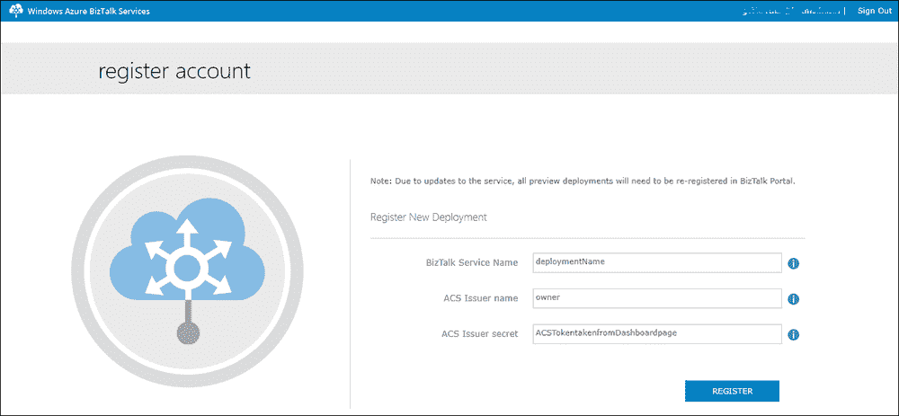

BizTalk Services 门户注册

# 创建您的第一个 BizTalk Services 解决方案

让我们付诸实践，并使用之前创建的部署来处理一个现实世界的多渠道销售场景。

## 场景描述

一位交易员，Northwind，管理着一个电子商务网站，用于在线客户购买。他们还从活动公司和公司接收大量订单。Northwind 需要开发一个解决方案来验证订单并将请求路由到正确的库存位置以交付商品。传入请求是一个包含订单详细信息的 XML 文件。活动公司和公司的请求通过 FTP 进行，而电子商务网站的请求通过 HTTP 进行。如果客户位置在美国境内，则订单后处理请求将转发到美国地址的中继服务。对于所有其他位置，订单需要发送到中央站点，并使用位置作为提升属性发送到 IntlAddress 的 Service Bus 队列。

## 前提条件

在我们开始之前，我们需要通过以下步骤设置客户端机器以连接到之前创建的部署：

1.  将从部署下载的证书安装到您的客户端机器上的受信任根存储中。这验证了您客户端和 Azure 上的集成解决方案之间的任何 SSL 流量。

1.  下载并安装 BizTalk Services SDK ([`go.microsoft.com/fwLink/?LinkID=313230`](https://go.microsoft.com/fwLink/?LinkID=313230))，以便在 Visual Studio 2012 中启用开发者项目体验。

1.  从 MSDN 代码库中下载 BizTalk Services EAI 工具的消息发送器和消息接收器示例，该代码库位于 [`code.msdn.microsoft.com/windowsazure`](http://code.msdn.microsoft.com/windowsazure)。

## 实现解决方案

我们将实现细节分解为定义传入格式和创建桥梁，包括处理传入消息的传输以及创建目标端点、中继和 Service Bus 队列。

### 创建 BizTalk Services 项目

您可以在 Visual Studio 2012 中创建一个新的 BizTalk Services 项目。

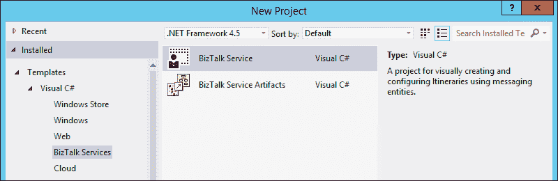

Visual Studio 中的 BizTalk Services 项目

### 创建订单架构

在您的项目中，右键单击项目名称，点击 **添加** | **新建项**，然后添加一个新的 **平面文件架构**。

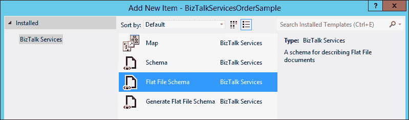

将平面文件架构添加到 BizTalk Services 项目中

将以下节点添加到架构中，以便结构如下所示：

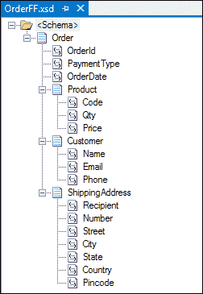

平面文件架构结构

对于 XSD 文件中的每个记录，确保正确添加了分隔符：

```cs
<b:recordInfo structure="delimited" child_delimiter_type="char" child_delimiter="," child_order="postfix" preserve_delimiter_for_empty_data="true" suppress_trailing_delimiters="false" sequence_number="4" />
```

您可以通过运行实例文件来验证架构。通过在解决方案资源管理器中右键单击创建的架构文件，可以使用**验证实例**命令。在两个单独的文件中添加以下平面文件和 XML 实例，使用**验证实例**命令，并验证架构是否验证这些实例。对于每次命令运行，请确保架构属性窗口具有正确的**验证实例输入类型**（在这种情况下为 XML）：

```cs
OrderId|PaymentType|OrderDate|Code,Qty,Price,|Name,Email,Phone,|Recipient,Number,Street,City,State,Country,Pincode,|

<ns0:Order >
  <OrderId>MyOrder</OrderId>
  <PaymentType>CreditCard</PaymentType>
  <OrderDate>09-08-2013 22:50:00</OrderDate>
  <Product>
    <Code>100</Code>
    <Qty>1</Qty>
    <Price>500</Price>
  </Product>
  <Customer>
    <Name>Karthik</Name>
    <Email>user@hotmail.com</Email>
    <Phone>1-111-1111</Phone>
  </Customer>
  <ShippingAddress>
    <Recipient>Jon</Recipient>
    <Number>Building 1</Number>
    <Street>One Redmond Way</Street>
    <City>Redmond</City>
    <State>Washington</State>
    <Country>US</Country>
    <Pincode>98052</Pincode>
  </ShippingAddress>
</ns0:Order>
```

### 小贴士

**下载示例代码**

您可以从[`www.packtpub.com`](http://www.packtpub.com)您购买的所有 Packt 书籍的账户下载示例代码文件。如果您在其他地方购买了此书，您可以访问[`www.packtpub.com/support`](http://www.packtpub.com/support)并注册以直接将文件通过电子邮件发送给您。

### 创建 BizTalk 服务解决方案

打开桥接器配置界面（通常是`MessageFlowItinerary.bcs`文件）。Visual Studio Toolbox 应显示以下实体：

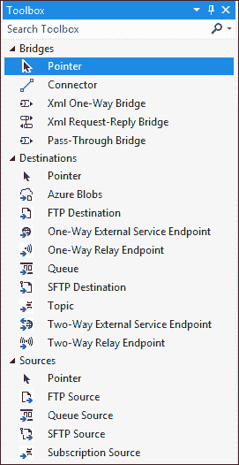

BizTalk 服务项目 Visual Studio Toolbox

使用 VS 工具箱拖放**FTP 源**、**Xml 单向桥接**、**单向中继端点**和**队列**，并使用**连接器**将它们连接起来，如图所示：

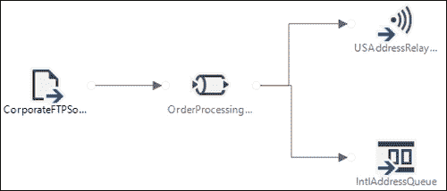

BizTalk 服务项目中的桥接消息流

在消息流中配置以下内容：

1.  选择 FTP 服务器，并正确配置地址、用户名和密码。

1.  双击桥接器以打开**Xml 单向桥接**配置：

    +   在**消息类型**块中，添加之前创建的`OrderFF.xsd`实例。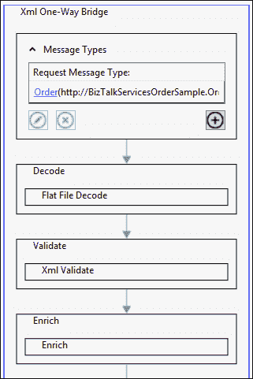

        桥接器配置

    +   在第一个富化阶段，添加一个 XPath 类型属性，从`/*[local-name()='Order' and namespace-uri()='http://BizTalkServicesOrderSample.OrderFF']/*[local-name()='ShippingAddress' and namespace-uri()='']/*[local-name()='Country' and namespace-uri()='']`读取并作为字符串写入位置。XPath 值可以通过在 VS 中打开架构，点击相关记录，并从记录属性窗口复制 XPath 值来获取。

    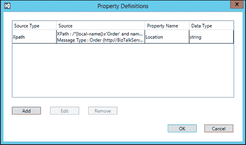

    在桥接器的富化阶段提升属性配置

1.  在父`MessageFlowitinerary.bcs`视图中，点击从**OrderProcessingBridge**到**USAddressRelay**的路由链接，并将过滤器条件设置为**location='US'**；对于其他链接，设置位置为`US`。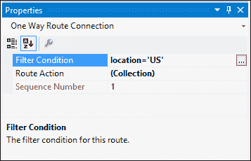

    消息流的路由属性

1.  编辑`MessageFlowitinerary.bcs`下的队列`.config`文件，并更新`<tokenProvider>`和`<endpoint>`细节以包含服务总线信息。

1.  编辑位于 `MessageFlowitinerary.bcs` 下的 Relay 服务 `.config` 文件，并更新 `<endpoint>` 详细信息以包含 Service Bus 中继信息。

1.  构建和部署解决方案。

1.  如果部署成功，将您的浏览器指向 `https://<yourdeployment>/default/OrderProcessingBridge`；您应该看到一个 401 HTTP 错误代码，表明此操作需要管理声明。

# 验证解决方案

我们需要测试发送两种类型的消息：一种来自企业，另一种来自网站：

+   在 VS 中加载 MessageReceiver 示例并构建解决方案。从输出 bin 文件夹中，在命令提示符窗口中运行以下命令：

    ```cs
    MessageReceiver.exe ServiceBusNS owner issuerkey USAddressRelay OneWayRelay
    ```

    在这里，`ServiceBusNS` 是中继运行所在的命名空间，`MyRelayTestSvc1` 是在桥接配置中配置的端点信息。

+   在新的命令窗口中加载另一个 MessageReceiver。

    ```cs
    MessageReceiver.exe ServiceBusNS owner issuerkey IntlAddressQueue Queue
    ```

    在这里，`ServiceBusNS` 是已预先创建队列的命名空间，`IntlAddressQueue` 是与桥接器配置的端点信息。

+   在 VS 中加载 MessageSender 示例并构建解决方案。《yourdeployment》是 BizTalk 服务之前配置的 URL。

    ```cs
    MessageSender.exe BizTalkSvcACS owner issuerkey https://<yourdeployment>/default/OrderProcessingBridge instance.xml application/xml
    ```

    在这里，`BizTalkSvcACS` 是 BizTalk 服务部署 ACS 的命名空间，`owner` 和 `issuerkey` 是该命名空间的 ACS 凭证，而 `instance.xml` 是 XML 格式的 `OrderFF.xsd` 实例。

+   输出将在中继的 MessageReceiver 中观察到。

+   使用 `location=EU` 编辑 `instance.xml` 并再次运行 `MessageSender` 命令。这次输出将在队列的 MessageReceiver 中观察到。

+   在 FTP 中放置一个平面文件，指定 `location=US` 并在中继服务窗口中观察输出。

+   在 FTP 中放置一个平面文件，指定 `location=EU` 并在消息接收队列中观察输出。

Northwind 现在可以从 HTTP 或 FTP 端点处理平面文件和 XML 订单。您可以从 BizTalk 服务门户的桥接视图或使用 PowerShell 删除桥接器。

# 摘要

在本章中，我们介绍了 BizTalk 服务的基础知识以及可用于构建集成解决方案的概念、架构、角色和工具。我们还通过 BizTalk 服务和 Service Bus 中继以及队列的简单订单处理场景练习了所有学到的概念。该示例可以进一步扩展，包括转换、路由到其他桥接器如 EDI、自定义代码等。在下一章中，我们将更详细地探讨一些 BizTalk 服务功能。
