# 第二章。消息和转换

在第一章 *Hello BizTalk Services* 中，我们讨论了**BizTalk Services**的基础知识和桥梁提供的数据接收和发送的中央概念，通过其内置的管道通过端点适配器（源和目的地）。在本章中，我们将讨论消息方面，重点关注消息的一个特定方面：转换，或映射。集成最常见的一个方面是将一种消息格式转换为另一种格式；我们在第一章 *Hello BizTalk Services* 中提到的结构阻抗。这是任何集成人员工具箱中的基本工具，BizTalk Services 提供了一个全新的、现代化的映射引擎，以及图形工具来构建复杂和强大的转换。在本章中，我们将详细探讨 BizTalk Service 的映射和转换功能及其提供的灵活性。总结来说，本章将涵盖以下内容：

+   为什么转换和映射很重要

+   BizTalk Services 中的映射功能

+   创建您的第一个映射

+   理解映射操作

# 问题

BizTalk Services 的职责是让您将此连接到彼。实际上，这个“此”和“彼”可能并不总是清晰、明确，或者标准化为某种国际认可的协议。因此，映射功能至关重要——一种将此转换为彼的方法。在许多情况下，映射需求可能很复杂；例如，需要基本改变消息的形状或结构，或者需要用对接收者有意义的内容替换源消息中的数据值。我们可以将这些问题分为两类：一类需要解决消息的结构，即转换；另一类需要解决其内容，即转码或翻译。两种类型的映射，转换和翻译，在 BizTalk Services 中都是可能的，正如我们将在本章中看到的。

# 映射器

到目前为止，我们故意保持模糊，并且有很好的理由。通常，映射需求并不明确，并且随着对涉及的消息格式的细微差别及其变体的了解越来越多，它们会发生变化。熟悉处理基于 XML 的消息的人可能会惊讶地发现，仅仅使用 XML Schema Definition ([`www.w3.org/XML/Schema`](http://www.w3.org/XML/Schema))来描述它们的有效性，结果可能比最初看起来要复杂。不幸的是，这有时与单个架构可以创建或生成的不同生产或 XML 消息实例有关，这往往是无意中发生的。XSD 有时不够精确，因此集成通常很混乱，需要良好的工具来使事情适应，而标准和规范的纯洁性并没有足够深入，以避免在实现中的歧义。这是我们将在本书中多次回顾的主题：为了成功，任何集成技术都必须灵活，以适应手头的特定问题，适应它，不要改变，适应，转换，并集成。映射是工具箱中的一个工具，并且对于满足这些要求非常重要。因此，它值得有一个专门的章节。

# 映射设计器

看一下下面的屏幕截图。这显示了可以从 Visual Studio 2012 访问的新图形映射设计器。对于那些熟悉**BizTalk Server**的人来说，不要被误导。虽然它可能看起来和感觉与 BizTalk Server 映射器相似，但这个工具有显著的不同；主导的设计美学是尽可能简化常见的映射任务，因此映射器经历了重大的改造。

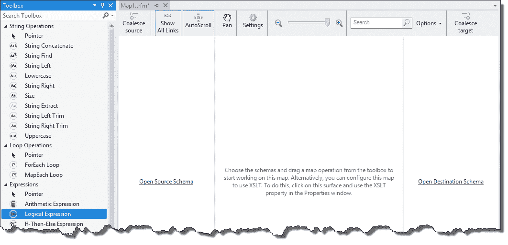

图形映射设计器

# 架构

然而，我们可能有些过于急切了。为了将一种消息格式或结构映射到另一种，例如翻译其内容，我们首先需要理解这些消息本身。这其中的基础是架构。

BizTalk Services 区分两种类型的消息：XML 和非 XML。所有 XML 消息格式都使用 XSD 表达，所有非 XML 消息格式都使用 XSD 表达。因此，XSD 很重要！本书的目的不是提供 XSD 的入门指南；如果您需要我们提到的技术的背景信息，我们会参考其他参考资料。相反，我们将提供足够的信息，以展示 BizTalk Services 如何使用这些技术，以便那些不太熟悉的人也能理解正在发生的事情。

现在，你可能想知道你所能想到的任何消息格式如何能在 XSD 中定义。让我们看看一个例子。

# 一个例子

让我们扩展一下我们在第一章中看到的示例，*Hello BizTalk Services*。如果你还记得，这个示例通过 SFTP 接收了一个文件并将其路由到 Service Bus 端点。现在我们将向解决方案中添加一个映射。这个映射将把传入的消息转换成接收者期望的另一种格式。然而，正如之前所提到的，如果我们要把一种消息格式转换为另一种格式，我们需要首先定义目标消息的架构，以便我们能够将其映射到它。

要这样做，请右键单击项目，导航到**添加** | **新建项**，从项目列表中选择**架构**，并给出名称`OrderUS.xsd`。点击**添加**以创建架构并将其添加到解决方案中。

架构设计器现在将打开。正如你在第一章中看到的，*Hello BizTalk Services*，添加节点到架构以构建它，如下截图所示：

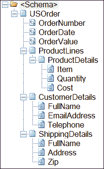

修改订单架构

现在，右键单击项目并导航到**添加** | **新建项**。从项目列表中选择**映射**，并给出名称`FFtoUS.trfm`。点击**添加**以创建映射并将其添加到解决方案中。

映射设计器现在将打开；第一个任务是设置架构。由于映射的职责是将一种格式转换为另一种格式，因此至少需要两个架构：输入和输出。

点击**开源架构**链接，展开树形结构，选择`OrderFF.xsd`，然后点击**确定**。现在点击**打开目标架构**链接，选择`OrderUS.xsd`架构，然后点击**确定**。

设计器现在将看起来如下截图所示：

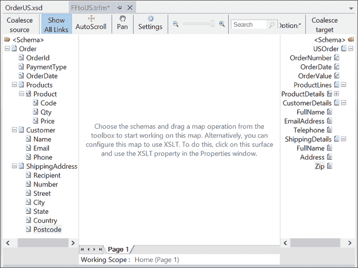

使用设计器选择架构

现在我们需要将一种格式映射到另一种格式。我们通过连接节点来实现，通常是从左到右工作。

通过点击并按住鼠标左键，将左侧的`OrderId`节点拖动到右侧的`OrderNumber`节点上，并在指针位于目标字段上时释放按钮，将左侧的`OrderId`节点连接到右侧的`OrderNumber`节点。

现在请注意，目标架构和源中的客户信息不同；只有元素名称不同，但结构相同。映射器提供了一个快速映射字段的快捷方式，以避免逐个连接它们。为此，请按住鼠标左键在左侧源架构中的父 `Customer` 节点上，并将其拖动到目标 `CustomerDetails` 节点上。下一张截图所示的下拉菜单将弹出。在这里，我们提供了以下截图所示的一些选项。选择 **按结构链接** 并注意，尽管它们的名称不同，但所有节点都自动连接在一起。这是因为此选项按出现的顺序连接字段，而不管节点名称如何，当两个架构的结构相同时非常有用。您可以使用相同的方法来映射字段名称匹配的情况（**按名称链接**）或选择 **简单链接**，这将简单地连接顶级节点。当映射大量字段时，这种技术非常有用。

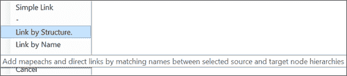

链接选项

# 映射操作

我们可以继续这样做，连接任意数量的节点，单独或成组连接。然而，我们往往需要做的不仅仅是将一个节点的值映射到另一个节点。为此，我们可以转向映射操作。对于那些熟悉 BizTalk 服务器的人来说，您将熟悉 **functoids**；在 BizTalk 服务中，概念类似。然而，尽管有相似之处，它们在实现上存在许多差异。产品组的主要目标之一是简化常见任务，例如循环，这些任务以前往往很难或耗时。这就是我们现在将关注的重点。

BizTalk 服务提供了总共 37 个映射操作，这些操作在工具箱中按功能分组。这里没有足够的空间涵盖每个映射操作，所以我们只关注一些最有用的。要获取完整参考，请查看 MSDN 文档，网址为 [`msdn.microsoft.com/en-us/library/windowsazure/hh689870.aspx`](http://msdn.microsoft.com/en-us/library/windowsazure/hh689870.aspx)。其理念是所有映射操作都以相同的方式进行配置和连接；因此，一旦你学会了可用的操作，使用它们的组合来完成映射任务就变得简单直接。映射操作类别如下表所示：

| **类别** | **用途** |
| --- | --- |
| 字符串操作 | 将节点值作为字符串进行操作，例如连接、修剪和子字符串操作 |
| 循环操作 | 在源中循环重复节点的操作 |
| 表达式 | 执行计算或决策的算术和逻辑表达式 |
| 列表操作 | 对可以由节点内容以条件方式创建的项目列表进行处理 |
| 累计操作 | 用于累计值，如总和、计数和平均值 |
| 日期和时间操作 | 操作日期和时间值 |
| 其他操作 | 用于检索上下文属性、格式化数字以及在映射中包含 C#的各种操作 |

一种非常常见的转换类型是展平。这是指需要将多个重复的项目（通常是一个列表）合并（或展平）成一个单一值，通常需要应用一些计算（例如，求和）。BizTalk Services 提供了一些映射操作，以简单直接的方式实现这一点。

看看下面的 XML，你可以看到`<Product>`元素是重复的，也就是说，可以指定多个产品。假设我们想要计算所有产品价格（`Price`）乘以订购数量（`Qty`）的总和，以计算出订单的总价值：

```cs
<ns0:Order >
  <OrderId>OrderId_0</OrderId>
  <PaymentType>PaymentType_0</PaymentType>
  <OrderDate>OrderDate_0</OrderDate>
  <Products>
    <Product>
      <Code>Code_0</Code>
      <Qty>Qty_0</Qty>
      <Price>Price_0</Price>
    </Product>
    <Product>
      <Code>Code_0</Code>
      <Qty>Qty_0</Qty>
      <Price>Price_0</Price>
    </Product>
    <Product>
      <Code>Code_0</Code>
      <Qty>Qty_0</Qty>
      <Price>Price_0</Price>
    </Product>
  </Products>
  <Customer>
    <Name>Name_0</Name>
    <Email>Email_0</Email>
    <Phone>Phone_0</Phone>
  </Customer>
  <ShippingAddress>
    <Recipient>Recipient_0</Recipient>
    <Number>Number_0</Number>
    <Street>Street_0</Street>
    <City>City_0</City>
    <State>State_0</State>
    <Country>Country_0</Country>
    <Postcode>Postcode_0</Postcode>
  </ShippingAddress>
</ns0:Order>
```

最终结果，即订单的总价值，需要映射到目标架构中的单个字段。我们可以使用映射操作轻松实现这一点。成功使用映射操作的关键是将需求分解，并选择最合适的映射操作来实现目标。正如我的解释已经暗示的那样，这个问题有几个部分。首先是意识到我们需要对每个`Qty * Price`字段计算保持累计总和——每个`Product`元素一个。让我们先处理这个问题。

BizTalk Services 提供了一套基于列表的映射操作，允许创建一个临时列表来存储项目并操作列表中的项目。

首先将一个**创建列表**映射操作拖动到设计表面上。对于 BizTalk Server 开发者来说，第一个明显的改变可能是 BizTalk Services 中的映射操作提供了嵌套功能。这是简化复杂任务的关键，因为这种嵌套行为提供了一种自然的方式来分组和组织所需的映射任务。

**创建列表**操作将用于存储我们计算的临时结果。我们将把每个产品的总价值推送到列表中，然后稍后计算这些列表项值的总和。双击**创建列表**来配置它。在对话框中，输入一个**成员名称**，例如`total`，并从下拉菜单中选择**数字**作为**成员类型**，如图所示。这是一个将用于存储我们计算值的变量。点击**确定**关闭对话框。

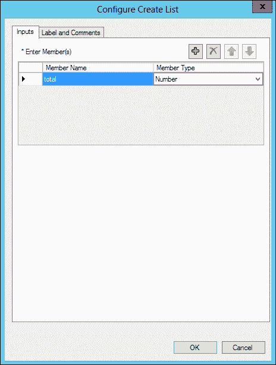

配置创建列表操作

下一步是遍历所有的`Product`元素。为此，拖动一个**For Each**映射操作并将其放入**创建列表**操作内部。注意我们还可以在这个操作中放置额外的操作。这就是我们将放置每行项目总值的计算的地方。

现在将左侧架构中的`Product`节点连接到**ForEach**操作。这告诉操作在`Products`中循环每个`Product`节点。

将一个**算术表达式**操作拖动到设计器中，并将其放入**ForEach**操作中。现在将`Qty`和`Price`字段连接到这个操作上。这些将成为我们的输入参数；我们想要使用数据的输入消息中的节点。依次拖动每个节点，将连接拖到画布上的**算术表达式**操作上。现在双击新的**算术表达式**来配置它。在这里，我们可以指定基于连接到操作的字段进行的计算，在这种情况下是`Qty`和`Price`。输入以下截图所示的公式：

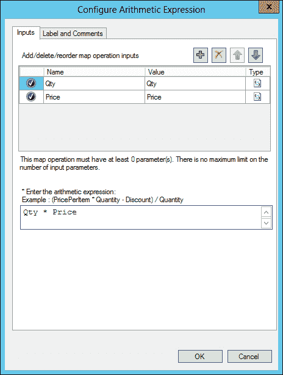

**算术表达式**操作的配置

我们现在需要存储这个结果；为此，我们将它添加到外部的列表操作中。拖动一个**向列表添加项**操作并将其放置在**算术表达式**操作的右侧，在**ForEach**操作内。然后，通过从一侧拖动一条线到另一侧来将**算术表达式**操作连接到**向列表添加项**操作。双击**向列表添加项**操作来配置它。对话框应该已经预先填充，因此我们只需点击**确定**来保存设置。映射现在应该看起来像以下截图所示：

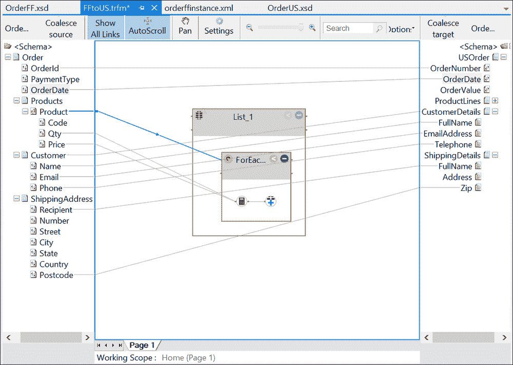

部分完成的映射

好的，任务的第一部分已经完成；我们正在计算每个产品的总价值。我们现在需要将这些总和相加以获得订单的总计。这非常简单。拖动一个**选择条目**映射操作并将其放置在**创建列表**操作的右侧。将**创建列表**操作连接到**选择条目**。双击**选择条目**以打开它，勾选`total`旁边的**已选择**复选框，并按以下截图所示点击**确定**。在这里，我们指定要从我们创建的列表中提取哪些变量。在这种情况下，我们只有一个，所以选择很简单。

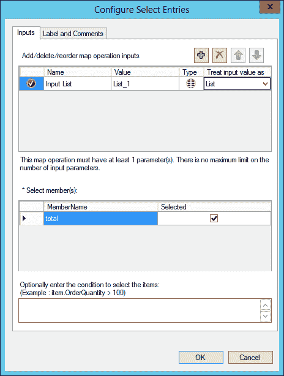

**选择条目**操作的配置

最后，拖动一个**累计求和**操作并将其放置在**选择条目**操作的右侧。将**选择条目**操作连接到**累计求和**操作。现在将**累计求和**操作连接到目标架构中的`TotalValue`字段。双击您刚刚添加的**累计求和**操作，并在表达式文本框中输入`item.total`，如以下截图所示。在这里，我们指定从**选择条目**操作传递的列表条目中的总变量：

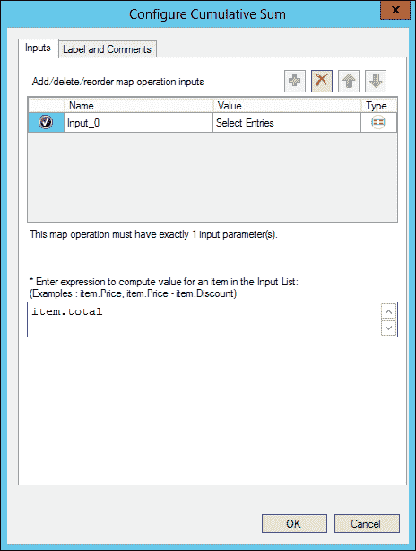

累计求和操作的配置

完成的映射应该看起来像以下截图：

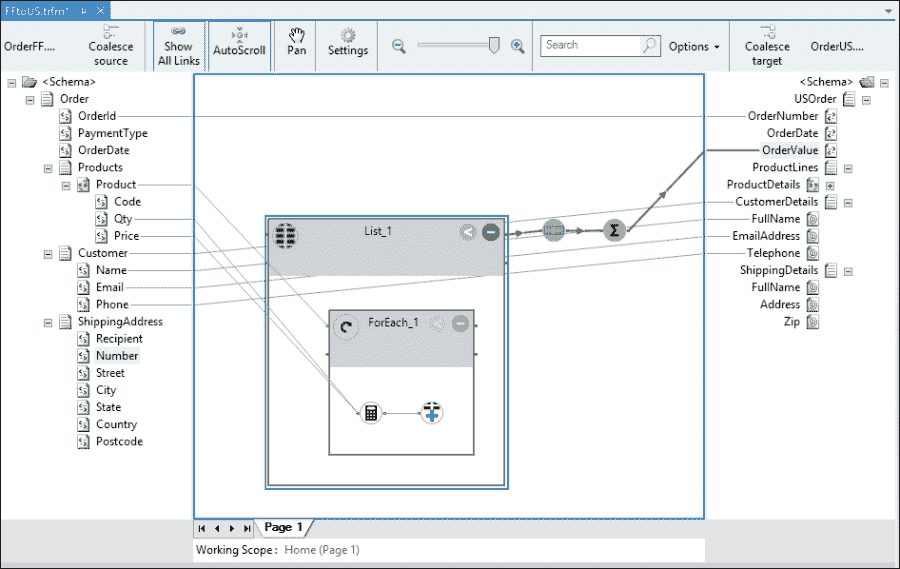

带有循环和计算节点的映射

我们几乎完成了地图的创建。让我们来处理`ShippingAddress`节点。注意，左侧的字段比右侧多。因此，我们将通过连接其中一些字段来合并它们。有几种方法可以做到这一点；例如，我们可以使用**String Concatenate**映射操作，它可以接受任意数量的输入并生成一个连接的单字符串输出。

然而，让我们看看一些更有趣的东西。当没有满足你需求的操作时，你可以转向**CSharp Scripting**操作。正如其名称所暗示的，这个操作允许你在其配置中包含 C#，这给了你.NET 框架的全部力量，以便能够实现你需要的任何映射功能。

将**CSharp Scripting**操作拖动到映射设计表面上，并将其放置在**Create List**操作下方。将`Number`、`Street`、`City`、`State`和`Country`节点连接到它。你可能已经意识到了，这是操作在特定数据项上工作的方式，对于脚本操作也是如此。通过将这些项连接到它，它们就可供我们编写的脚本使用。双击**CSharp Scripting**操作以打开其配置。

在对话框中，注意有一个**Script Text**多行文本框。在这里，我们可以定义一个 C#函数，该函数将节点作为输入参数并返回一个值。在这个简单的例子中，你可以从下一张截图看到，我只是将输入参数与一些格式化信息连接起来，并将结果返回到地图中。输入以下代码以实现相同的功能：

```cs
public string CreateAddress (string Number, string Street, string City, string State, string Country)
{
   return Number + " " +
          Street + "," +
          City + "," +
          State + "," +
          Country;
}
```

注意，脚本操作的输入节点名称必须与代码中的参数名称匹配。如果名称不同，地图将无法编译。一旦我们通过点击**OK**保存，我们就可以将操作连接到目标架构的`Address`节点。

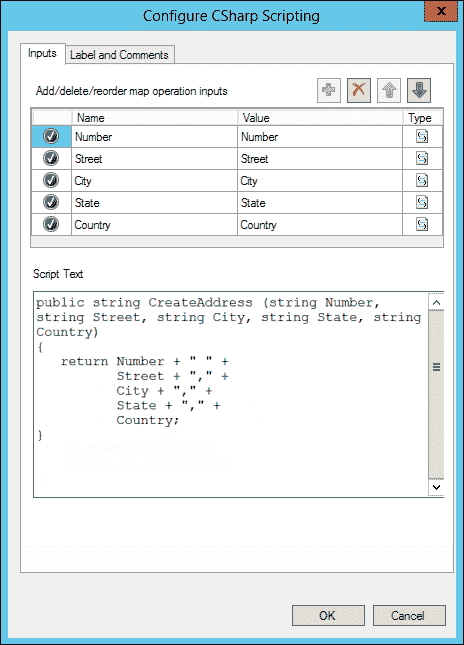

使用 C#进行映射

现在只剩下几个字段需要映射。只需将`Recipient`连接到`FullName`，将`PostCode`连接到`Zip`。我们将要查看的最后一个操作以完成此地图是**日期时间重新格式化**操作。将其拖放到**创建列表**操作上方的布局表面。将两个模式中的`OrderDate`节点连接到该操作，然后双击**日期时间重新格式化**操作以进行配置。当处理发送者和接收者之间不同的日期格式要求时，此操作非常有用。这个操作的好处是它不仅支持一组固定的日期和时间格式，而且您还可以输入自己的格式。对于**输入格式**字段，在**格式**字段中输入`d/M/yyyy`。请注意，这并不是下拉菜单中提供的选项之一，因此您需要将其输入到文本框中，如下面的截图所示。此外，请确保字母`M`是大写的，如下所示。然后，对于**输出格式**字段，选择**M/d/yyyy**。这将把输入日期解释为日/月/年格式，例如，`2/9/2013`，并将输出转换为月/日/年格式，例如，`9/2/2013`。

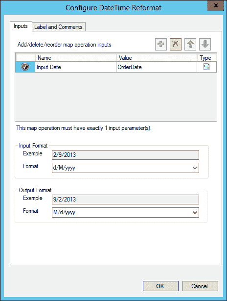

日期格式化

地图现在已完成。它应该看起来与以下截图相似：

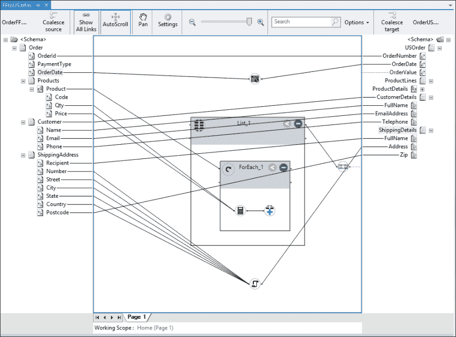

完成的地图

# 测试

呼！这看起来可能相当复杂，但一旦分解开来，实际上非常简单。下一步是测试地图，看看它是否产生了正确的结果。测试直接集成在 Visual Studio 中，因此无需编译和部署解决方案到 Windows Azure 以查看其是否工作。这很重要，因为创建任何非平凡地图都是一个非常迭代的过程。通过逐步构建地图的功能并检查测试结果，这个过程变得更容易。这样，任何错误都更加明显且易于纠正。

要测试一个映射，我们需要一些输入。这最简单的方法是在 Visual Studio 本身中生成。在**解决方案资源管理器**窗口中右键单击`OrderFF.xsd`模式，并选择**生成实例**。打开创建的文件，并编辑值以匹配以下代码中显示的内容（别忘了，您可以从网站上下载此示例的源代码）：

```cs
<ns0:Order >
  <OrderId>123</OrderId>
  <PaymentType>ACCOUNT</PaymentType>
  <OrderDate>2/9/2013</OrderDate>
  <Products>
    <Product>
      <Code>AB12</Code>
      <Qty>4</Qty>
      <Price>1.50</Price>
    </Product>
    <Product>
      <Code>AC01</Code>
      <Qty>2</Qty>
      <Price>3.99</Price>
    </Product>
    <Product>
      <Code>DE4</Code>
      <Qty>10</Qty>
      <Price>12.25</Price>
    </Product>
  </Products>
  <Customer>
    <Name>John Doe</Name>
    <Email>john.doe@contoso.com</Email>
    <Phone>425-123456</Phone>
  </Customer>
  <ShippingAddress>
    <Recipient>Jane Smith</Recipient>
    <Number>1</Number>
    <Street>East Street</Street>
    <City>New York</City>
    <State>New York</State>
    <Country>USA</Country>
    <Postcode>NY12345</Postcode>
  </ShippingAddress>
</ns0:Order>
```

**生成实例**操作默认创建一个 XML 格式的消息——这是地图本身所需要的。然而，这个模式是一个平面文件模式，如果我们想生成一个传递给桥接器的消息，我们需要以这种格式生成消息。在模式属性中，有一个名为**生成实例输出类型**的属性，可以将其设置为**原生**而不是**XML**。当选择**原生**时，模式将根据其类型创建一个测试消息，无论是平面文件还是 XML。以下截图显示了将此设置为**原生**与`OrderFF.xsd`模式相比的结果：

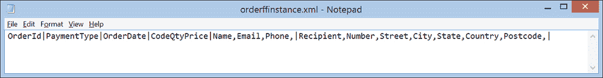

生成实例：本地

一旦我们有了测试消息，我们就可以将其分配给映射来尝试。在 **解决方案资源管理器** 窗口中单击 `FFtoUS.trfm` 映射；在 **属性** 窗口中，将文件的路径输入到 **测试映射输入文件** 属性中。现在右键单击映射并选择 **测试映射**。如果有幸，您应该在输出窗口中看到以下片段类似的内容。这意味着映射执行成功！

```cs
Test Map succeeded.
Output is written to the file 'C:\Users\Jon\AppData\Local\Temp\tmp3817.xml'.
```

通过 **文件** 菜单打开文件，导航到 **打开** | **文件** 并浏览到前一个输出中的文件位置（在本例中：`C:\Users\Jon\AppData\Local\Temp\tmp3817.xml`）。如果您一切都做得正确，它应该看起来与以下 XML 代码相同：

```cs
<?xml version="1.0" encoding="utf-8"?>
<ns1:USOrder  >
  <OrderNumber>123</OrderNumber>
  <OrderDate>9/2/2013</OrderDate>
  <OrderValue>136.48</OrderValue>
  <CustomerDetails FullName="John Doe" EmailAddress="john.doe@contoso.com" Telephone="425-123456">
  </CustomerDetails>
  <ShippingDetails FullName="Jane Smith" Address="1 East Street,New York,New York,USA" Zip="NY12345" />
</ns1:USOrder>
```

注意这个 XML 文档与您用作输入的文档有多么不同，您可能开始欣赏 BizTalk Services 映射器的强大功能。

# 配置桥接器

然而，一个映射本身并没有什么用。我们需要能够在集成解决方案中使用它。希望这不会让人感到惊讶，我们这样做是通过配置桥接器。下一个截图显示了桥接器配置的一部分。此配置表示可以配置的处理管道。正如在 第一章 中提到的，该管道有多个阶段，*Hello BizTalk Services*。在管道的中间有一个 **转换** 阶段；正是在这里，我们可以指定要执行的映射。

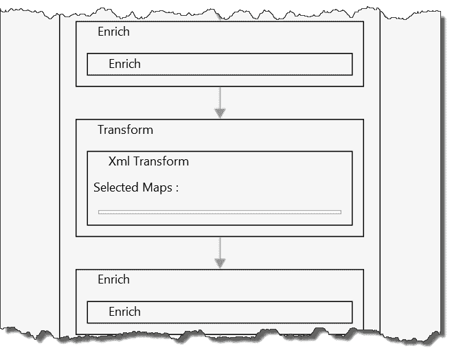

配置带有映射的桥接器

在 **解决方案资源管理器** 窗口中双击 `MessageFlowItinerary.bcs` 文件以打开它。在设计器中，通过双击它来打开 `OrderProcessing` 桥接器配置。单击 **转换** 阶段并查看 **属性** 窗口。在这里，我们可以通过单击 **映射** 属性旁边的省略号（**…**）来选择映射，打开配置的映射。这将显示解决方案中包含的所有映射。

我们可以通过勾选它旁边的 **选中** 复选框来选择我们之前创建的映射，如图所示。单击 **确定** 将返回到桥接器配置，此时应该显示在 **转换** 阶段中选中的映射，即 `FFtoUS`。

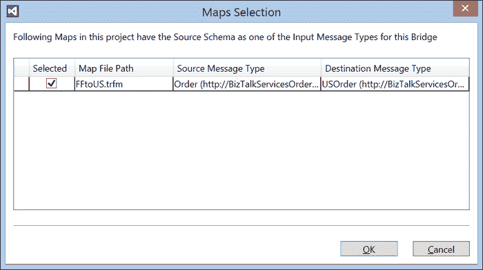

选择映射对话框

# 整合所有内容

解决方案现在已准备就绪。像以前一样构建和部署，一旦部署，将浏览器指向 `https://<yourdeployment>/default/OrderProcessingBridge`，您应该看到一个 401 HTTP 错误代码，表示此操作需要管理声明。

现在，您将使用 BizTalk Services SDK 提供的两个工具。这些是 MessageSender 和 MessagerReceiver，您可以从以下链接下载它们。这些工具允许您向您创建的桥接器发送消息并从桥接器接收消息：

+   [`code.msdn.microsoft.com/windowsazure/Windows-Azure-BizTalk-EAI-e01a5b64`](http://code.msdn.microsoft.com/windowsazure/Windows-Azure-BizTalk-EAI-e01a5b64)

+   [`code.msdn.microsoft.com/windowsazure/Windows-Azure-BizTalk-EAI-af9bc99f`](http://code.msdn.microsoft.com/windowsazure/Windows-Azure-BizTalk-EAI-af9bc99f)

解压这两个解决方案，并在 Visual Studio 2012 中打开 MessageReceiver 示例并构建它。通过在命令提示符中键入以下内容并按*Enter*键来运行它。

```cs
<path>MessageReceiver.exe ServiceBusNS owner <issuerkey> USAddressRelay OneWayRelay

```

在前面的命令中，`<path>`是从 Visual Studio 构建输出到 exe 的路径，`ServiceBusNS`是中继运行时的命名空间，`USAddressRelay`是在桥接配置中配置的端点信息。请注意，您还需要将`<issuerkey>`值替换为您自己的订阅详情。

现在在 Visual Studio 2012 中打开 MessageSender 示例（从上一个链接下载）并构建它。按照以下代码运行以向桥接发送消息：

```cs
<path>MessageSender.exe BizTalkSvcACS owner issuerkey https://<yourdeployment>/default/OrderProcessingBridge instance.xml application/xml

```

在前面的代码中，`BizTalkSvcACS`是 BizTalk 服务部署的 ACS 命名空间。和之前一样，`owner`和`issuerkey`是该命名空间的 ACS 凭证，而`instance.xml`是 XML 格式的`OrderFF.xsd`实例。

确保在中继的 MessageReceiver 示例中观察到输出。检查输出消息并注意映射是如何将其转换的。

# 更多关于映射

到目前为止，我们已经覆盖了很多内容，但在 BizTalk 服务中关于映射的内容还有很多，除了我们在这里没有使用的其他 27 个操作之外。还有两组其他操作值得讨论。

这些中的第一个是**获取上下文属性**映射操作。这为 BizTalk 服务器提供了一个经常被询问的功能——从消息上下文中检索属性并将其包含在映射中。这种方式是通过配置它，指定要检索的属性名称，然后将其连接到目标节点来实现的；不需要输入节点。我们还没有详细讲解上下文属性，但到目前为止，请记住它们是一组包含当前消息流上下文信息的键值对；例如，接收到的消息的传输细节（例如，文件名），甚至是消息本身的属性，这些属性已经被提取。如果您想知道如何像我们之前那样在 Visual Studio 中测试它，团队也想到了这一点。在映射上提供了一个属性，**上下文属性测试数据**，允许您指定要执行的测试名称/值属性。对话框如图所示。在 BizTalk 服务映射中使用上下文属性的能力是一个非常受欢迎的添加。当测试映射时，也可以显示此对话框来更改使用的值。

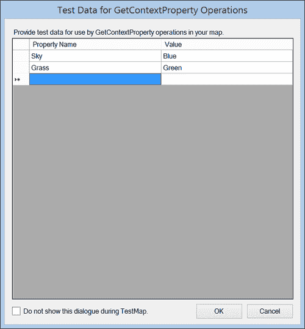

选择映射对话框

第二个改进的领域是在表达式操作上。例如，提供了一个**If-Then-Else** **表达式**操作。这极大地简化了测试条件的常见需求；如果它评估为真，则采取一条路径，否则采取另一条路径。在 BizTalk Server 中，这很复杂，需要很多 functoids。这突出了产品团队在这里为简化常见任务所付出的努力，正如我在本章开头提到的。对于其他逻辑操作，如**逻辑** **表达式**也是如此。在这里，可以提供一个评估为真或假的表达式。同样，对于那些熟悉 BizTalk Server 的人来说，这个操作用简单配置和使用的单个操作替换了大量的 functoids。

另一个开始变得明显的问题是复杂性，这可以通过早期截图中的地图来参考。地图绘制者提供了页面的概念，以便在不同的页面上拆分操作和链接。你可以在设计器底部标签旁边的区域右键单击来添加新页面，如下面的截图所示：

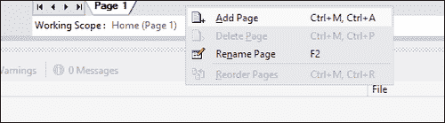

使用页面

将地图拆分成不同的页面是在可读性和复杂性之间的一种权衡。理想情况下，你会在单页面上看到尽可能多的清晰可读的细节，以避免总是需要在不同的页面之间跳转。对于可能包含数千个链接和操作的复杂地图，这是不可能的；添加页面可以大大降低复杂性并提高清晰度，特别是对于那些需要维护解决方案的人来说。

最后一点是，正如你可能已经注意到的，新的 BizTalk Services 地图绘制器不是基于可扩展样式表语言和 XSLT（如 BizTalk Server 的那个）。然而，仍然可以在地图中包含 XSLT（仅限 1.0），这在你有现有的需要重用的 XSLT 转换时很有用。通过在设计器网格上单击并打开**XSLT**属性在**属性**窗口中访问 XSLT 属性。关于重用的话题，BizTalk Services 还提供了一个有用的工具，即 BizTalk Server 地图转换器。这会将 BizTalk Server 的`.btm`地图文件转换为 BizTalk Services 映射格式，当你有现有的需要重用的地图时可以节省时间，并避免从头开始的需要。由于两个之间的功能差异，它不能进行 100%的转换，但仍然是一个节省时间的巨大工具。

# 处理失败

开发者必须考虑的一个非常重要的问题是如何处理发生的失败。在集成解决方案中，失败尤其重要，因为它可能很难隔离和诊断。在映射中，可以配置在特定操作失败时应采取什么行动，通常是由于提供给它的数据有问题。当点击设计器顶部的**设置**按钮时，会显示如下截图所示的对话框。

在这里，每个操作（或在某些情况下是一组操作）都可以设置为在错误发生时**失败映射**，或者继续并输出一个空值。这非常有用；我们将在稍后的章节中更详细地探讨错误处理。

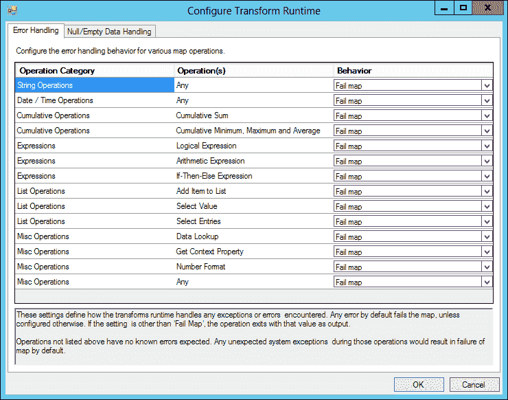

设置运行时属性

# 摘要

在本章中，我们探讨了 BizTalk 服务的映射功能。您已经看到了如何创建映射，使用许多提供的强大操作，以及如何测试它们。虽然我们没有能够涵盖每个操作，但许多都是自我解释的，易于理解；毕竟，映射器的整个目的就是使格式和内容转换的工作更加容易。我们敦促您自己进行实验，看看您能想出什么。

在下一章中，我们将探讨 BizTalk 服务提供的不同类型的桥接，从 EDI 开始。
