# 第四章：创建我们的地形

在上一章中，我们设计了我们的游戏，以便我们有开发工作的计划。我们设计了游戏的所有功能，如何使用玩家角色，非玩家角色将扮演什么角色，我们将使用哪些资产，以及我们在游戏中将使用哪些动画。我们还模拟了主游戏屏幕以及我们的抬头显示。除此之外，我们还对我们游戏的难度平衡做出了关键决策。随着设计工作的完成，我们准备开始创建我们的游戏。

在本章中，我们将创建我们游戏的地形，并根据我们在第三章“设计游戏”中的设计草图对地形进行定制操作。我们将使用塑造工具并添加水和植被特征来完成我们的游戏环境。

具体来说，在本章中我们将涵盖以下主题：

+   创建地形

+   地形塑造

+   绘制地形

+   添加水

+   添加植被

# 创建地形

Unity 地形本质上是你游戏环境中的地面；它是你的景观。Unity 有几个我们可以用来创建、塑造和自定义地形的工具。我们将在本章后面使用这些工具。

对于我们的游戏，我们将使用从高度图创建并随后在 Photoshop 中编辑的地形。如果您对如何完成这项工作感兴趣，请阅读*导入地形*部分。否则，您可以跳过这个简短的部分，并继续阅读关于导入地形的部分。

# 使用高度图

您可以通过简单的网络搜索找到许多免费的高度图。一旦您找到了您想要的，请执行以下步骤：

此子部分不是必需的，仅提供信息目的。游戏的地形文件将随附说明，说明如何将其纳入我们的游戏。

1.  打开 PhotoShop 并选择**文件** | **新建**。使用以下设置：

| **组件** | **设置** |
| --- | --- |
| 宽度 | 512 像素 |
| 高度 | 512 像素 |
| 分辨率 | 72 像素 |
| 颜色模式 | 灰度 8 位 |

1.  将您下载的高度图拖放到新的 Photoshop 图像中。

1.  进行任何必要的放置调整并提交变换。

1.  选择**图像** | **自动色调**。进行任何你认为必要的亮度和对比度调整。

1.  将文件保存为 Photoshop 原始文件。

# 导入地形

在我们导入地形之前，我们需要设置一个新的 Unity 3D 项目。为此，请按照以下步骤操作：

1.  启动 Unity。

1.  点击**新建**图标。

1.  输入项目名称并选择 3D。

1.  点击**创建项目**按钮。

1.  使用顶部菜单，选择**游戏对象** | **3D 对象** | **地形**。这会创建一个默认的地形，称为`terrain`。

1.  在选择地形后，在检查器面板的地形下方点击设置齿轮图标：

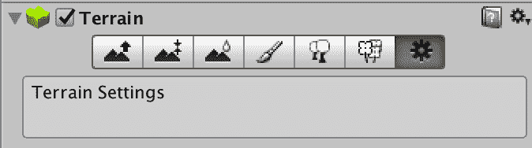

1.  将**地形高度**更改为`200`。

1.  仍然在检查器面板中，向下滚动直到您看到**导入原始...**按钮。点击该按钮，导航到上一节中创建的 Photoshop 原始文件。或者，您也可以从出版商的配套网站上下载`terrain.raw`文件：

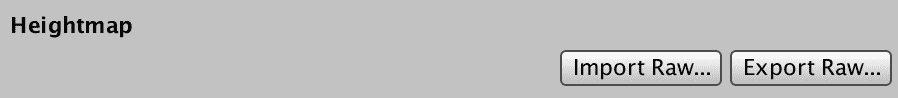

1.  选择**Mac**作为**字节顺序**在**导入高度图**对话框窗口中，然后点击**导入**按钮。即使您在运行 Windows 的计算机上，使用此选项也很重要：

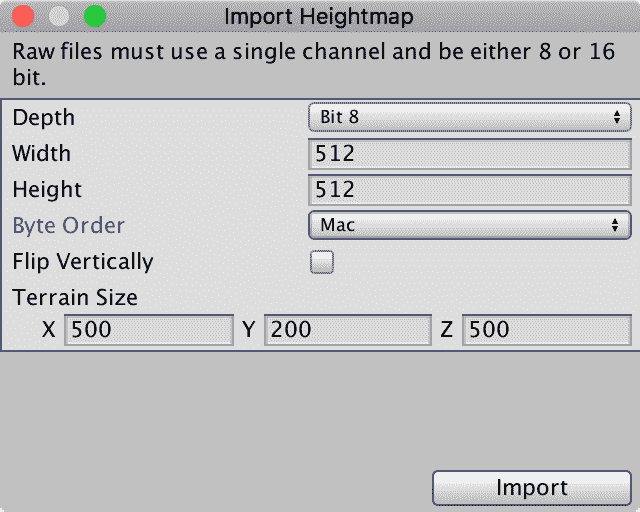

一旦您点击**导入**按钮，请观察 Unity 界面的右下角。导入过程可能需要几分钟。观察该部分界面将指示您的进度。请看以下示例。请耐心等待：

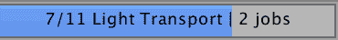

一旦导入过程完成，您的地形将反映导入的高度图。正如您在这里看到的，它将有一些尖锐的山峰和边缘。我们将在下一节中处理这些问题：

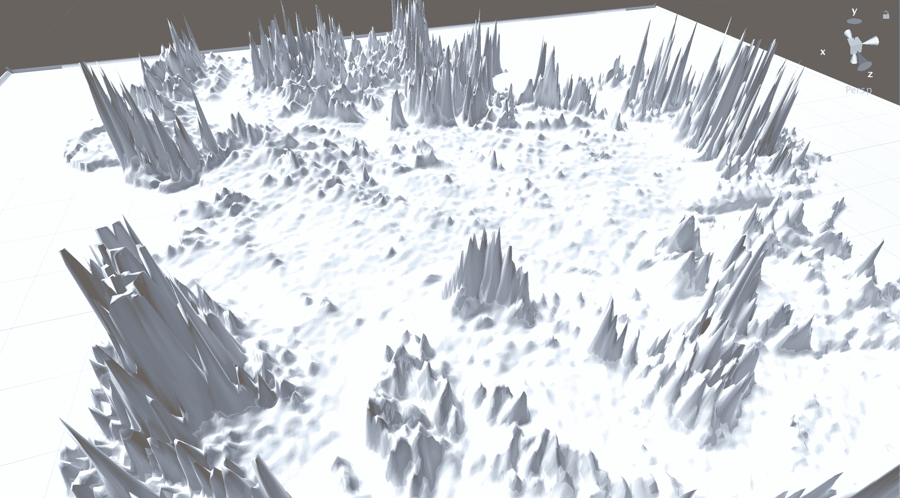

# 塑造地形

在本节中，我们将采取几个动作来塑造我们的地形。我们将从平滑开始，然后创建我们的五个出生点。

# 平滑地形

正如我们在上一节中确定的，我们的地形目前有一些凹凸不平的边缘和尖锐的山峰。我们将使用检查器面板地形部分中可用的平滑工具。正如您在这里看到的，它是从左数第三个图标：

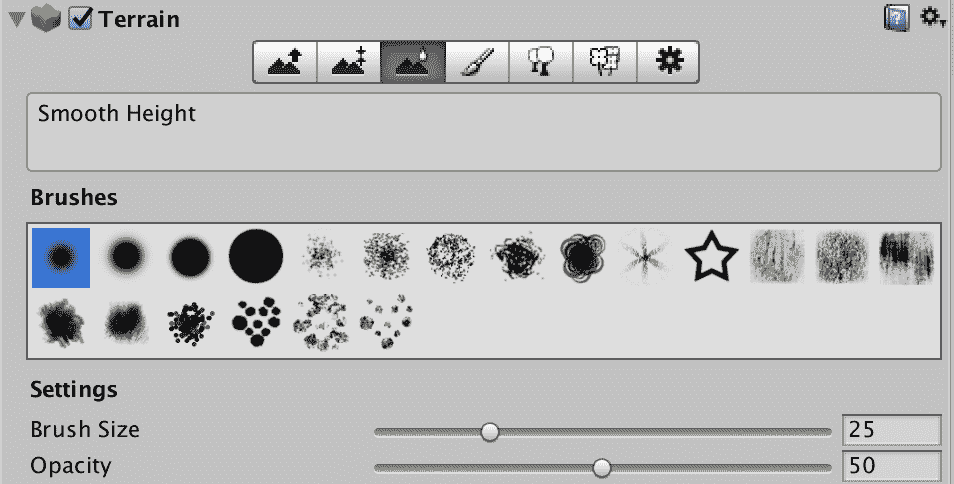

当选择平滑工具时，您将看到不同的刷子类型和大小。一旦做出选择，只需使用鼠标的左键来平滑地形。

以下截图显示了应用了显著平滑后的地形结果：

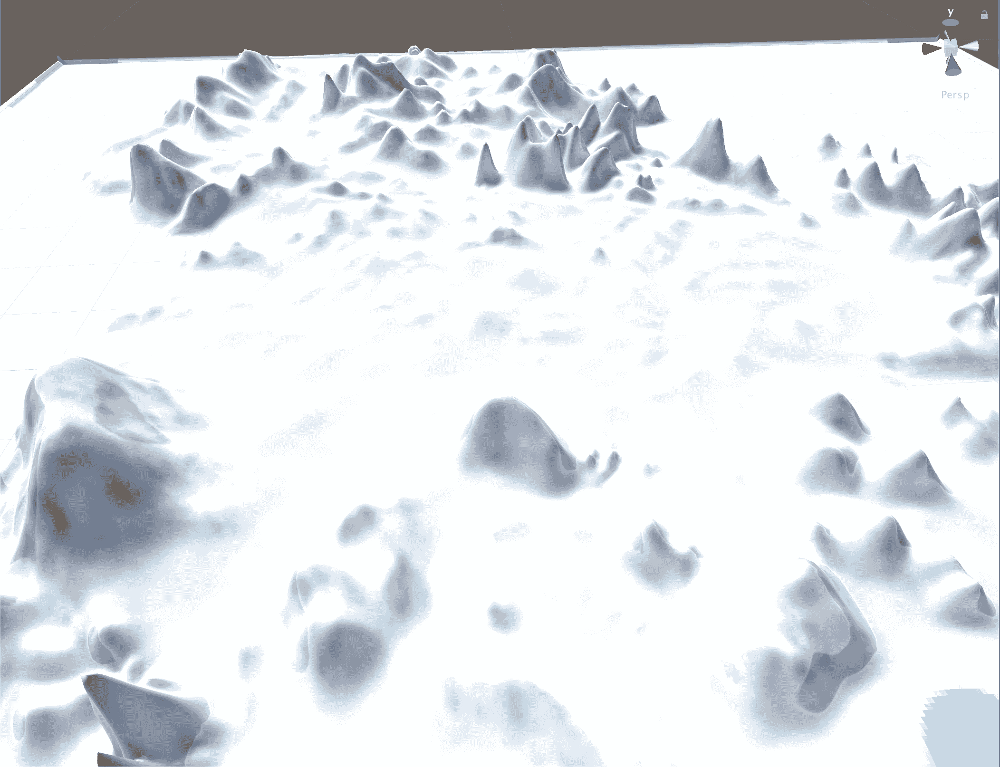

如果您正在 Unity 中按照这些步骤进行，您的结果可能会有所不同，这是正常的。精确的地形构建不是跟随本节和其他章节剩余步骤所必需的。

# 创建我们的出生点

我们的游戏设计需要五个出生点：一个在中心，每个角落一个。我们的游戏环境不是一个完美的正方形，因此我们将在地形的中心创建一个出生点，并在地形中创建四个额外的出生点。

我们目前还没有编写出生点的脚本；这将在第十一章“编写胜利与失败”中进行。现在，我们将简单地使用地形塑造工具创建区域。具体来说，我们将使用**绘制高度**工具。正如您在这里看到的，它是检查器面板地形部分中的第二个图标：

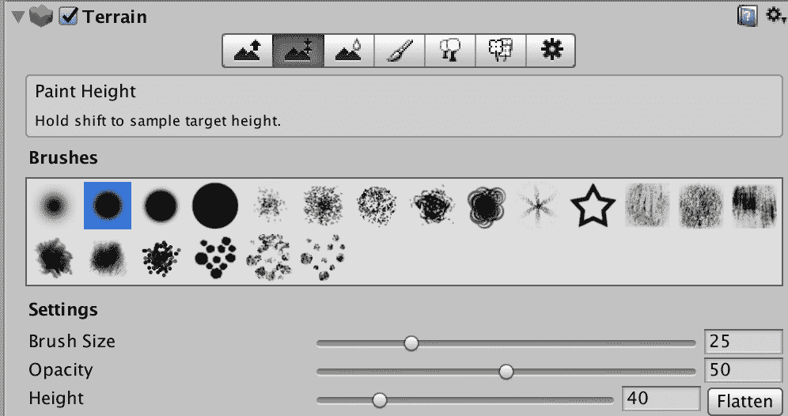

选择**画笔大小**为`25`，我们只需点击并绘制我们想要生成点的五个区域。我们将在游戏开始时使用中心的那个作为默认的起始点，然后在游戏中随机选择五个中的一个进行生成。

在制作生成点时，我们希望它们是升高的，但不要太高。以下截图显示了散布在整个地形上的五个生成点：

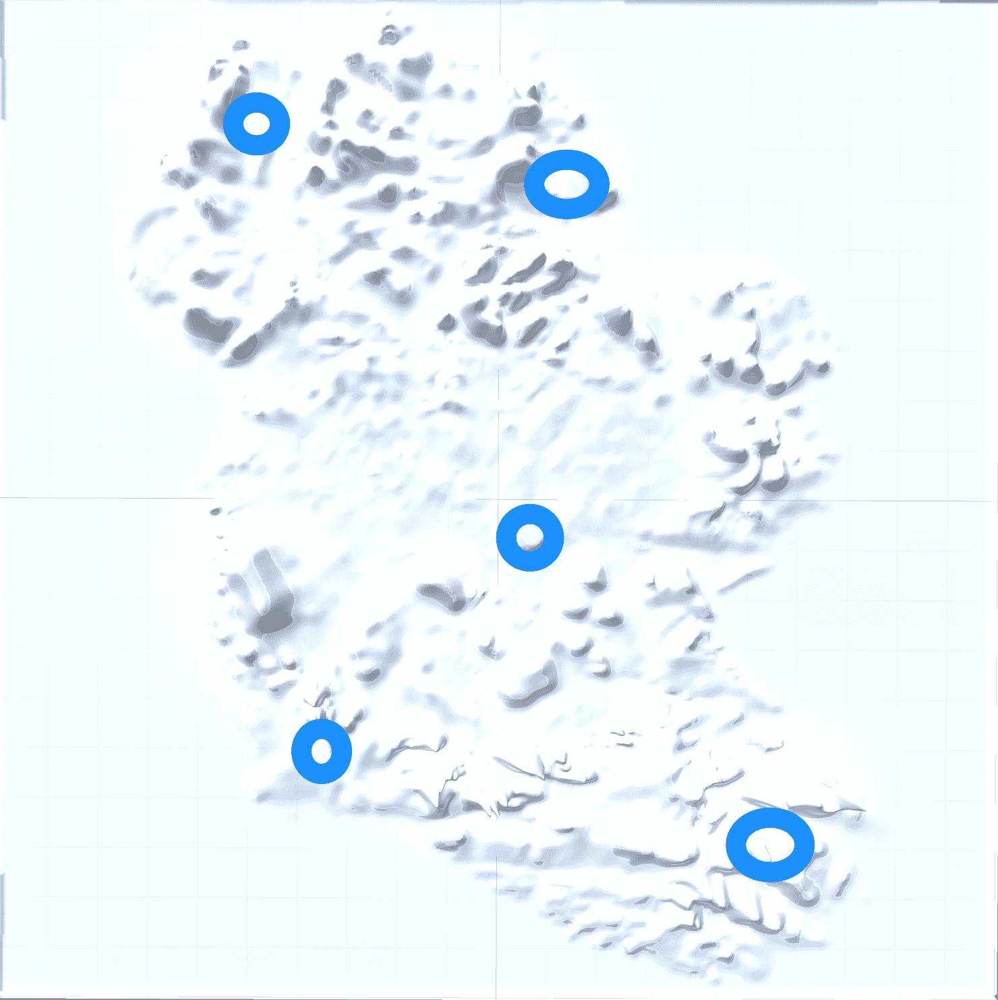

# 绘制地形

我们现在准备给我们的地形添加一些颜色。我们将首先用草纹理覆盖整个地形。为了完成这个任务，确保在层次结构面板中选择地形。然后，在检查器面板中，选择**绘制纹理**工具。如您所见，这是检查器面板地形部分中的第四个图标：

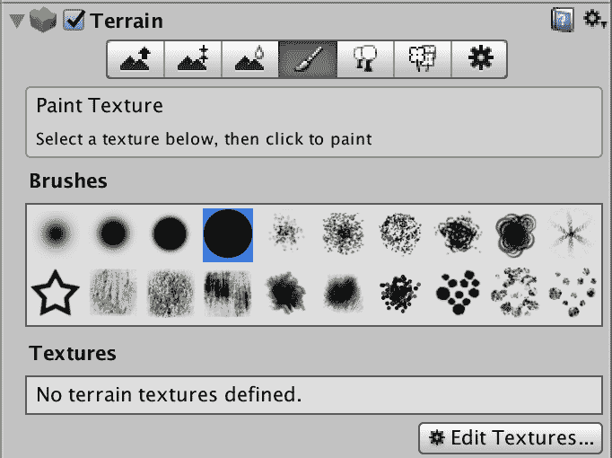

如您所见，我们还没有定义任何纹理。实际上，在我们的项目中还没有合适的纹理，所以让我们通过几个简单的步骤来解决这个问题：

1.  在项目面板中，点击`Assets`文件夹。

1.  在右侧部分，右键单击并选择**创建** | **文件夹**。将文件夹命名为`Textures`。

1.  从出版商的配套网站上下载`grass_starter_texture.jpg`文件。

1.  将`grass_starter_texture.jpg`文件从您的文件系统拖到步骤 1 中创建的`Textures`文件夹中。

现在您已经在 Unity 项目中有了草纹理，让我们将其应用到我们的地形上。以下是步骤：

1.  在层次结构面板中选择**地形**。

1.  在检查器面板中，点击**编辑纹理**按钮，然后**添加纹理**。这将显示**添加地形纹理**对话框窗口，如图所示：

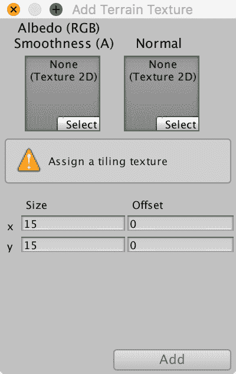

1.  点击左侧的**选择**按钮以显示一组纹理。

1.  双击`grass_starter_texture`。

1.  将 x 和 y 的**大小**从`15`改为`2`。

1.  点击添加按钮。

您会看到，您的地形现在被草覆盖了。当您放大时，您可以看到草的质量有所提高。

在下一节中，我们将向我们的地形添加水。

# 添加水

我们下一步是添加围绕我们岛屿的水。我们并不打算在水中游泳或放置物体，所以我们可以用一个简单的方法来处理。我们将在第六章，*为我们的游戏创建和导入 3D 对象*中完善我们的水。

执行以下步骤以创建一个材料和水面，然后将材料应用到平面上：

1.  在项目面板中，点击`Assets`文件夹。

1.  在右侧部分，右键单击并选择**创建** | **文件夹**。将文件夹命名为`Materials`。

1.  双击您刚刚创建的`Materials`文件夹。

1.  在“材料”文件夹中右键单击并选择**创建** | **材料**。将材料命名为`temp_water`。

1.  在检查器面板中，选择`temp_water`材料，点击左侧眼药水图标旁边的白色色块：

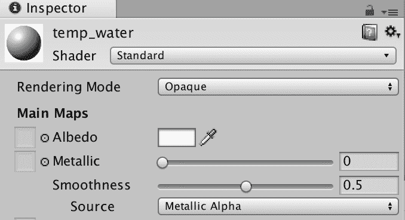

1.  在颜色对话框窗口中，选择蓝色作为您的水面颜色，然后关闭对话框窗口。您现在应该在项目面板和检查器面板中看到您的颜色选择：

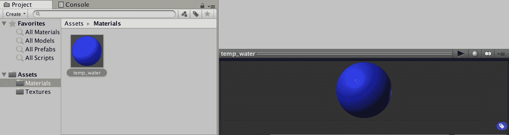

现在我们已经准备好了材质，让我们创建一个 GameObject 来模拟我们的水。按照以下步骤操作：

1.  从顶部菜单中选择**GameObject** | **3D Object** | **Plane**。

1.  使用变换工具，增加平面的尺寸以匹配整个游戏世界的尺寸。

1.  提高或降低平面，直到它看起来类似于这个：

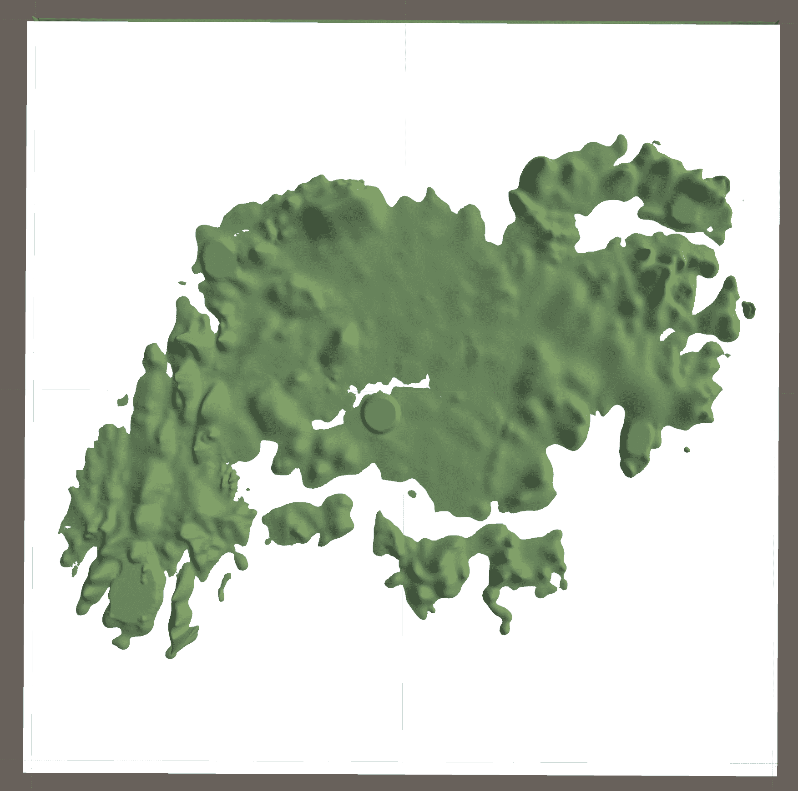

1.  在选择平面的情况下，点击检查器面板中网格渲染器部分右侧的`Default-Material`旁边的小圆圈。以下截图显示了该部分：

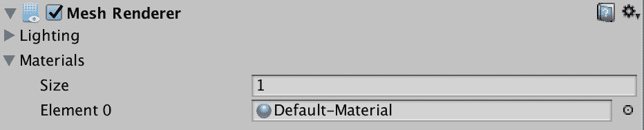

1.  您现在应该看到选择材质对话框窗口。选择您创建的`temp_water`纹理，然后关闭对话框窗口。

1.  在层次结构面板中，右键单击“Pane”对象并重命名为`WaterPane`。这将帮助我们保持整洁，并使我们能够识别我们的游戏对象。

您的游戏环境现在应该看起来类似于这个：

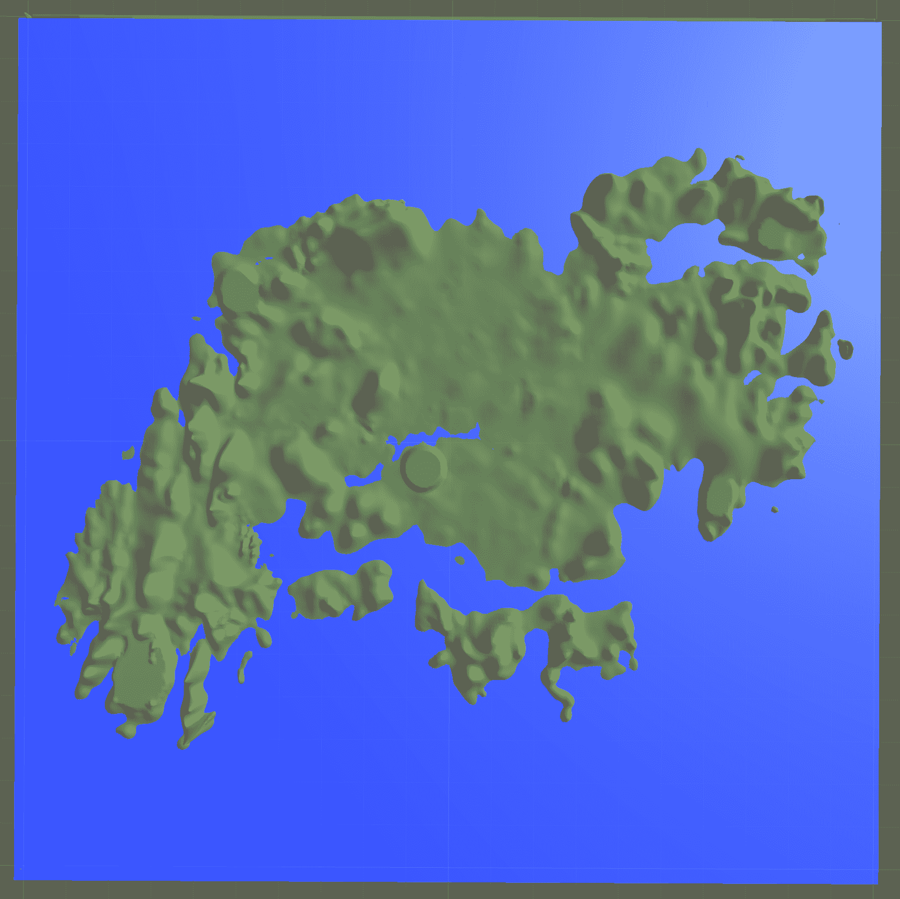

# 保存您的作品

现在是保存您工作的好时机。为了保持整洁，让我们在`Assets`下创建一个名为`Scenes`的文件夹。以下是完成此任务的步骤：

1.  在项目面板中，点击`Assets`文件夹。

1.  在右侧部分，右键单击并选择**创建** | **文件夹**。将文件夹命名为`Scenes`。

现在您已经准备好保存您的作品。从顶部菜单中选择文件 | 保存项目。您可以使用**文件** | **保存场景**或**文件** | **另存为...**选项来保存您的场景。另外，当您未保存场景而退出时，系统会提示您输入名称。使用这些选项中的任何一个保存场景，将场景命名为`Main`，并确保它保存在`Assets` | `Scenes`文件夹中。

# 添加植被

到目前为止，我们的游戏环境只由覆盖着草的土地组成，周围是水。如您从第三章，*设计游戏*中记得的那样，我们计划整合以下与地形相关的游戏对象：

+   樱桃树

+   黄瓜田

+   黄瓜

我们将在第六章，*创建和导入游戏中的 3D 对象*中添加这些游戏对象。现在，我们可以添加一些常规树木，开始填充我们的游戏环境。

我们不会简单地导入别人制作的树木，而是将逐步创建我们自己的树木。按照以下步骤从零开始创建 Unity 中的第一个 3D 树：

1.  从顶部菜单中选择 GameObject | 3D Object | Tree。这将创建一个新的树并将其放置在您的游戏世界中的变换 0, 0, 0 位置。

双击层次面板中的对象将在场景视图中将其聚焦于中心。它还将提供对象的放大视图。

1.  使用变换工具，增加 Y 轴，使树位于你的水面之上。它将只包含一个分支：

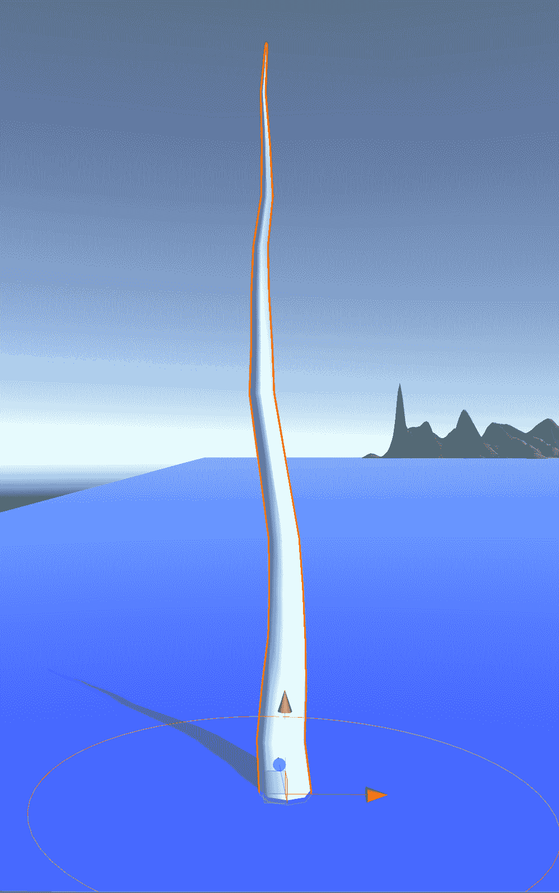

在选择了树之后，我们将注意力转向检查器面板中的树窗口。以下图表显示了我们将使用以继续创建我们的树的各个按钮：

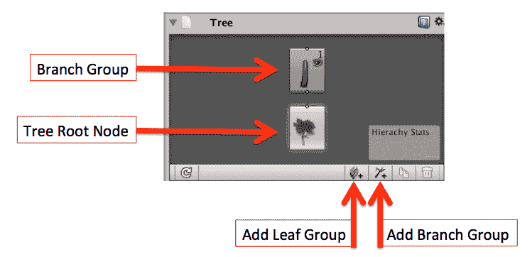

1.  在树窗口中选择分支组图标。接下来，点击添加分支组按钮。你会看到主分支上已经添加了一个分支，它作为树的主干。正如你所见，在检查器面板中你可以调整长度设置：

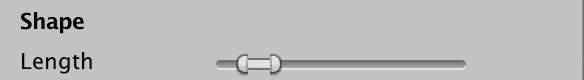

有三个额外的工具可以帮助你制作独特的树。以下按钮所示，它们是移动分支、旋转分支和自由手绘：

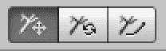

1.  继续在你的树干上创建分支，直到它看起来是你想要的样子。记住，你可以单独移动、调整大小和旋转分支。你还可以在分支上添加分支。当你添加一个新的分支时，它会被添加到当前选中的分支上。

当你第一次创建一个新的分支时，最好在移动它之前改变其大小。一旦你重新定位了分支，你可能就会失去进行某些调整的能力。

当你完成添加和配置分支后，你的树看起来将非常独特。以下截图提供了一个示例：

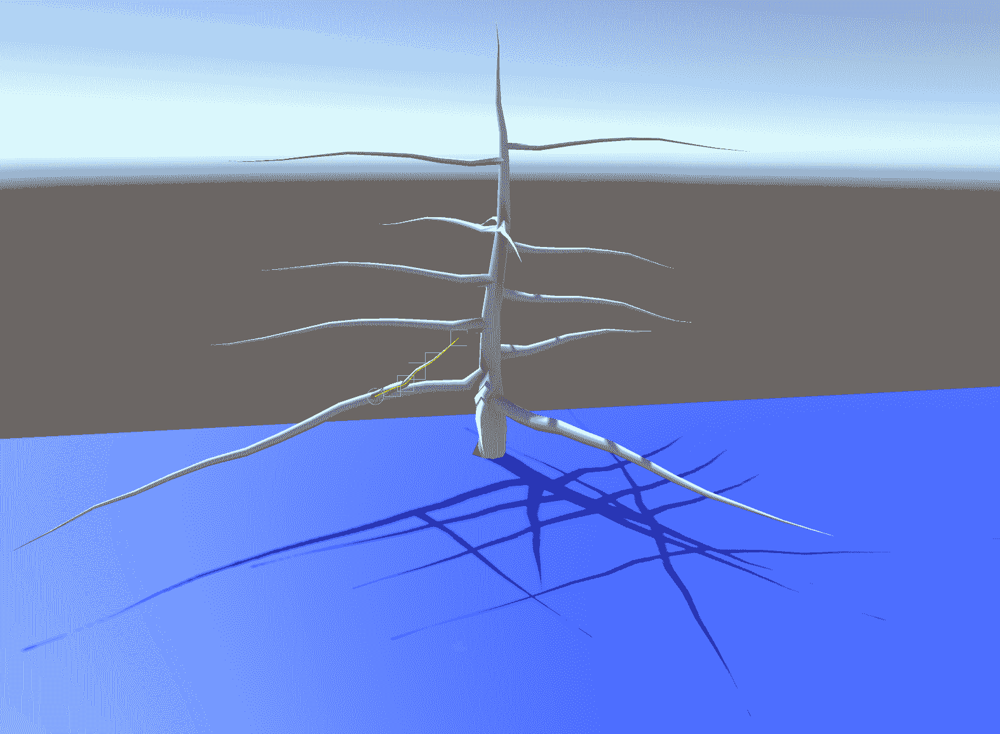

如你所见，这里有一根树干和几个分支。我们可以在树窗口中看到分支的层次结构：

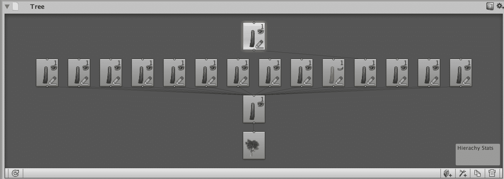

你的下一步是给你的树添加叶子。

1.  点击你想要应用叶子的分支，然后点击添加叶子组按钮。

1.  在检查器面板的分布部分，将频率更改为选择你想要在该分支上的叶子数量。此图像显示了频率滑块界面：

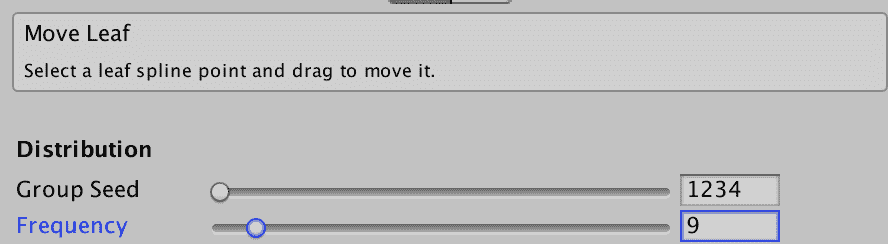

1.  继续向分支添加叶子，直到你得到你想要的外观。当你完成时，你的树看起来就像有纸叶子一样：

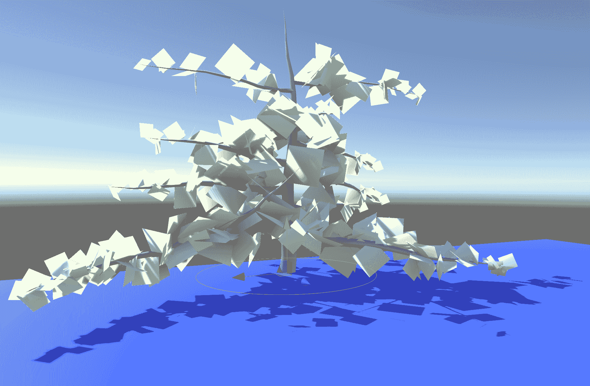

如你所见，这里有一根树干和几个分支以及叶子组。我们可以在树窗口中看到这一点：

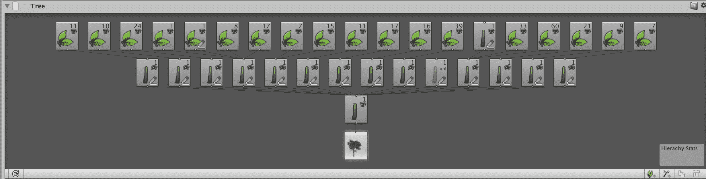

下一步将是将材质应用到树枝和树叶上。由于我们游戏项目中还没有这些材质，我们将保持树的原样。学习如何创建独特的树可以有助于创建独特的游戏环境。Unity Technologies 和其他内容创作者提供了几个高质量的树模型。我们将在第六章，*为我们的游戏创建和导入 3D 对象*中探索一些这些树，并将它们实际整合到我们的游戏中。

1.  在层次结构面板中，将`Tree`重命名为`Tree_Special`。

1.  使用变换工具，将树移动到干燥的土地上。你放置的位置不重要，只要它在干燥的土地上，而不是在出生点。

1.  在选择`Tree_Special`后，将比例从`1, 1, 1`更改为`3, 3, 3`。这样会使我们的树在我们的游戏世界中更加突出。

1.  不要忘记保存你的 Unity 项目。

# 摘要

在本章中，我们创建了游戏的地形，并根据第三章，*设计游戏*中的设计草图对地形进行了定制。我们使用了造型工具，绘制了地形，添加了水，甚至从头开始创建了自己的树。此外，我们还创建了一个材质并导入了一个纹理文件。

在第五章，*灯光、相机和阴影*中，我们将探索 Unity 中可用的不同类型的光照和相机。我们将使用灯光和相机在我们的*Cucumber Beetle*游戏中实现适当的光影效果。
