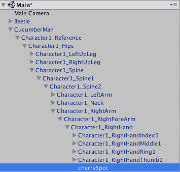
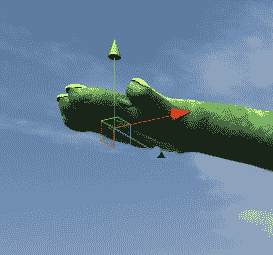
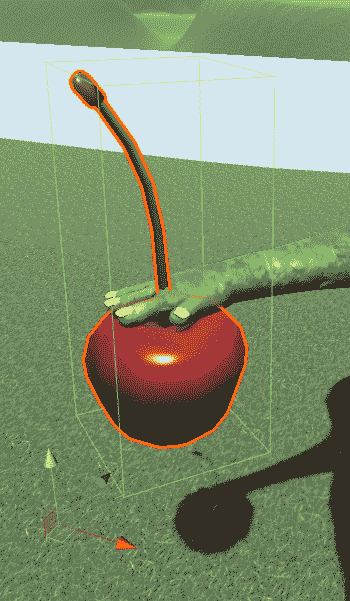

# 第十章：编写我们的积分系统脚本

在上一章中，我们设计、开发和整合了游戏中的 **抬头显示** (**HUD**)。我们使用画布 GameObject 创建文本和图形，提供关于积分、健康和额外信息的视觉指示，以帮助玩家在游戏过程中保持态势感知。此外，我们还编写了脚本以更新 HUD 的关键组件。我们还在游戏场景中使用第二个摄像头实现了迷你地图。

在本章中，我们将设计、编写脚本并实现游戏积分系统。这包括提供游戏 HUD 关键屏幕组件的逐帧更新。

在本章中，我们将编写以下脚本的脚本：

+   从树上收集樱桃

+   添加樱桃投掷功能

+   根据樱桃收集和战斗击中次数添加积分

# 从树上收集樱桃

在本节中，我们将对游戏对象和脚本功能进行必要的调整，以启用从樱桃树收集樱桃。更具体地说，我们将创建以下游戏玩法：

+   检测黄瓜人与樱桃树的碰撞

+   模拟樱桃收集

+   更新库存和 HUD 中的樱桃计数

在我们开始之前，你应该打开你的 Unity 游戏项目。或者，你也可以从出版商的配套网站上下载 Starting-Chapter-10 Unity 项目。

# 检测黄瓜人与樱桃树的碰撞

在本节中，我们将启用并测试黄瓜人与樱桃树之间的碰撞。我们的第一步是确保沙盒区域中的樱桃树都具有 `CherryTree` 标签。我们之前创建了标签名称，所以我们只需要将其应用到沙盒中的树上。以下是步骤：

1.  在层次结构面板中，选择沙盒区域内的一个樱桃树

1.  在检查器面板中，点击标签标签左侧的下拉框

1.  选择樱桃树标签

1.  对于沙盒区域中的每个樱桃树 GameObject，重复步骤 1 到 3

1.  可选地，对于层次结构视图中的所有樱桃树 GameObject，重复步骤 1 到 3，而不仅仅是你的沙盒区域中的那些

接下来，我们将创建一个 `CucumberManManager` 脚本来处理与樱桃树的碰撞。以下是创建该脚本的步骤：

1.  在层次结构面板中，选择 CumcuberMan 玩家角色

1.  在检查器面板中，滚动到最底部并点击添加组件按钮

1.  选择新建脚本

1.  将脚本命名为 `CucumberManManager`

1.  点击创建和添加按钮

1.  在项目面板中，点击收藏 | 所有脚本

1.  将 `CucumberManManager` 脚本拖到 `Assets` | `Custom Scripts` 文件夹

1.  双击 `CucumberManManager` 脚本来在编辑器中打开它

1.  编辑脚本以匹配此处提供的代码：

```cs
     using System.Collections;
     using System.Collections.Generic;
     using UnityEngine;

     public class CucumberManManager : MonoBehaviour {

         void OnTriggerEnter(Collider theObject) {
             if (theObject.gameObject.CompareTag ("CherryTree")) {

                 // Do something

                 }
         }
     } 
```

前面的脚本是一个 C# 脚本，包含一个 `OnTriggerEnter()` 方法。正如你所见，我们检查了与黄瓜人碰撞的对象的标签，以查看该游戏对象是否具有 `CherryTree` 标签。

接下来，我们需要在检测到碰撞时执行某些操作。我们将在下一节中处理这个问题。

# 模拟樱桃的收集

在本节中，我们将继续在`CucumberManManager`脚本上工作，以模拟樱桃的收集。

如果您尚未打开脚本，现在在编辑器中打开它。我们将按顺序审查更新的代码的五个部分。

如下所示，我们的第一部分导入了三个必要的命名空间。

```cs
using System.Collections;
    using System.Collections.Generic;
    using UnityEngine;

    public class CucumberManManager : MonoBehaviour {

       public static int currentCherryCount;
       public int tempCurrentCherryCount;
       public bool collectingCherries; 
```

代码的第四行是类声明语句。本节最后三行代码是该类的变量。以下是每个变量的简要描述：

+   `currentCherryCount`: 保持黄瓜人库存中的当前樱桃数量

+   `tempCurrentCherryCount`: 用于限制樱桃收集每秒最多一个

+   `collectingCherries`: 用于确定库存计数器是否应该激活

如下所示，我们的第二部分包含`Awake()`方法。此方法用于在游戏开始时初始化我们的变量：

```cs
     void Awake () {

         currentCherryCount = 0;
         tempCurrentCherryCount = 0;
         collectingCherries = false;

     } 
```

如下所示，我们的第三部分包含`Update()`方法。此方法每帧执行一次。我们在外层 if 语句中嵌套了一个 if/else 语句。外层语句检查`collectingCherries`布尔值是否为真。如果是，则评估内层 if/else 语句块。

内层 if/else 块检查`tempCurrentCherryCount`变量的值是否大于或等于`60`。如果是，则将`currentCherryCount`值增加一；否则，将`tempCurrentCherryCount`值增加一。`Update()`方法每帧调用一次，帧率可能不同。因此，我们实际上每 60 帧向黄瓜人的库存中添加一个樱桃：

```cs
     void Update () {

         if (collectingCherries) {
             if (tempCurrentCherryCount >= 60) {
                 currentCherryCount = currentCherryCount + 1;
                 tempCurrentCherryCount = 0;

             } else {
                 tempCurrentCherryCount = tempCurrentCherryCount + 1;
             }
         }

     } 
```

如下所示代码块中的第四部分包含我们在上一节中开始的`OnTriggerEnter()`方法。我们编辑了此方法，包括一个 if 语句，检查黄瓜人是否进入与樱桃树的碰撞。如果是，则将`collectingCherries`布尔变量设置为`true`，并将一个樱桃添加到库存中：

```cs
     void OnTriggerEnter(Collider theObject) {
         if (theObject.gameObject.CompareTag ("CherryTree")) {

             collectingCherries = true; 
             currentCherryCount = currentCherryCount + 1;
             }
     } 
```

如下所示，我们的第五部分包含`OnTriggerExit()`方法。当黄瓜人停止与樱桃树碰撞时，将触发此事件。当发生这种情况时，我们将`collectingCherries`布尔值设置为`false`：

```cs

     void OnTriggerExit(Collider theObject) {
         if (theObject.gameObject.CompareTag ("CherryTree")) {
             collectingCherries = false;
         }
     }

 } // end of CucumberManManager.cs
```

# 更新库存和 HUD 上的樱桃计数

我们现在已经建立了一个系统，可以根据黄瓜人与樱桃树的碰撞向黄瓜人的库存中添加樱桃。接下来，我们需要更新适当的 UI 文本组件以显示当前库存量。我们将在这个部分处理这个重要任务。

下面是创建该脚本的步骤：

1.  在层次结构面板中，选择`HUD_Canvas` | `Cherries_Count` UI 文本组件

1.  在检查器面板中，滚动到最底部并点击“添加组件”按钮

1.  选择“新建脚本”

1.  将脚本命名为`CherryManager`

1.  点击“创建并添加”按钮

1.  在项目面板中，单击收藏夹 | 所有脚本

1.  将 `CherryManager` 脚本拖到 `Assets` | `Custom Scripts` 文件夹

1.  双击 `CherryManager` 脚本以在编辑器中打开它

1.  编辑脚本，使其与这里提供的代码匹配

代码块后面的代码提供了对此代码的解释：

```cs
 using System.Collections;
 using System.Collections.Generic;
 using UnityEngine;
 using UnityEngine.UI;

 public class CherryManager : MonoBehaviour {

     Text Cherries_Count;

     void Awake () {

         Cherries_Count = GetComponent<Text> ();

     }

     void Update () {

         Cherries_Count.text = CucumberManManager.currentCherryCount.ToString ();

     }
 } 
```

代码的前四行导入适当的命名空间。

下一行代码是类声明：`public class CherryManager : MonoBehaviour {`。

接下来是单个类变量，一个名为 `Cherries_Count` 的 `text` 对象。

类中的第一个方法是 `Awake()` 方法。我们使用此方法创建对 `Cherries_Count` UI 文本组件的引用。

我们 `CherryManager` 类的最后一部分是 `Update()` 方法。该方法有一个用于将 `currentCherryCount` 从 `int` 转换为字符串并更新 HUD 的单个语句。

您可以玩测试游戏以验证功能。只需将黄瓜人导航到樱桃树旁，并观察樱桃库存增加。对我们来说，有一个收集樱桃的方法很重要，因为玩家可以按键盘上的 *E* 键扔出樱桃。我们将在下一节中编写该功能。

现在是保存您的场景和项目的绝佳时机。

# 添加樱桃投掷功能

在 第七章，*实现我们的玩家角色*中，我们展示了使用 *E* 键盘键的黄瓜人投掷动画。在本节中，我们将进行必要的更改，以便在按下 *E* 键盘键时在黄瓜人右手内部实例化一个樱桃，并允许它被发射。我们将检查黄瓜人是否至少有一个樱桃在库存中，这样我们就可以知道是否应该实例化樱桃。好的，让我们开始吧。

# 创建樱桃的位置

以下步骤演示了如何在黄瓜人右手创建樱桃的位置。

1.  在层次结构面板中，展开 `CucumberMan` 对象，直到看到 `Character1_RightHand`。

1.  右键单击 `Character1_RightHand` 并选择创建空对象。

1.  将新游戏对象重命名为 `cherrySpot`。这将是我们渲染樱桃的位置。

您的 `CucumberMan` 对象的层次结构应如下所示：



1.  使用变换工具，将 `cherrySpot` 游戏对象移动到黄瓜人右手内部。您的放置应类似于以下显示：



我们需要将 `Rigidbody` 添加到 `Cherry` 预制件中，以便在运行时实例化和投掷它。

1.  在项目面板中，选择资产 | 樱桃 | `Cherry.Prefab`

1.  在检查器面板中，单击添加组件按钮

1.  选择物理 | 刚体

1.  取消选中使用重力选项

1.  展开刚体组件的约束部分

1.  选择所有冻结位置和冻结旋转框

接下来，我们将把樱桃预制件添加到我们的场景中。

1.  将樱桃预制件从项目面板拖动到层次结构面板，使其成为 cherrySpot 游戏对象的子对象。

1.  在场景视图中，放大并调整 cherrySpot 的位置，使樱桃看起来像黄瓜人拿着它。建议的位置如下：



# 编写 CherryControl 脚本

接下来，我们将为樱桃预制件添加一个脚本，以支持根据黄瓜人手的位置创建和释放樱桃。

1.  在项目面板中，选择资产 | 樱桃 | `Cherry.Prefab`

1.  在检查器面板中，点击添加组件按钮

1.  选择新建脚本并命名为 CherryControl

1.  点击创建并添加按钮

1.  在项目面板中，将新脚本拖动到`Assets` | `Custom Scripts`文件夹

1.  编辑脚本以匹配以下代码块

脚本的第一部分由命名空间导入语句和类声明组成：

```cs
 using System.Collections;
 using System.Collections.Generic;
 using UnityEngine;

 public class CherryControl : MonoBehaviour {

```

下一个部分包含类变量。我们有一个`Rigidbody`，两个浮点数和一个`GameObject`：

```cs
     public Rigidbody cherry;
     public float throwDistance = 2000000000f;
     public float time2Die = 4.0f;

     GameObject cucumberHand;
```

这里显示的`Update()`方法检查是否按下了*E*键，以及黄瓜人是否至少有一个樱桃：

```cs
     void Update () {

         int count = CucumberManManager.currentCherryCount;

         if (Input.GetKeyDown (KeyCode.E)) {

             if (count >= 1) {

                 ThrowACherry ();
             }
         }
     }

```

代码的最后部分是`ThrowACherry()`方法。如您所见，我们在黄瓜人手中克隆了樱桃，打开重力，释放约束，并使用`AddForce()`方法将其向前推。接下来，我们使用`Destroy()`方法在四秒后销毁克隆的樱桃。最后一条语句减少黄瓜人的樱桃库存：

```cs
     public void ThrowACherry () {

         Rigidbody cherryClone = (Rigidbody)Instantiate 
               (cherry, transform.position, transform.rotation);
         cherryClone.useGravity = true;
         cherryClone.constraints = RigidbodyConstraints.None;
         cherryClone.AddForce(transform.forward * throwDistance);
         Destroy (cherryClone.gameObject, time2Die);

         CucumberManManager.currentCherryCount = CucumberManManager.currentCherryCount - 1;
     }
 } 
```

# 根据樱桃收集和战斗击中添加积分

在本节中，我们将编辑适当的脚本，以便黄瓜人可以根据以下标准获得与樱桃收集和战斗击中相关的积分：

| **游戏内事件** | **积分** |
| --- | --- |
| 黄瓜人捡起樱桃 | + 5 |
| 黄瓜人用樱桃击中甲虫 | + 10 |

# 创建积分管理器脚本

在本节中，我们将创建和编辑一个脚本以管理我们的积分并在游戏 HUD 上显示它们。以下是步骤：

1.  在层次结构面板中，选择 HUD_Canvas | Score_Value

1.  在检查器面板中，点击添加组件按钮

1.  选择新建脚本并命名为`PointsManager`

1.  在项目面板中，点击收藏 | 所有脚本

1.  将 PointsManager 脚本拖动到`Assets` | `Custom Scripts`文件夹

1.  双击 PointsManager 脚本以在编辑器中打开它

1.  编辑脚本以匹配以下代码

代码的第一部分包含命名空间导入语句和`PointsManager`类声明：

```cs
 using System.Collections;
 using System.Collections.Generic;
 using UnityEngine;

 using UnityEngine.UI;

 public class PointsManager : MonoBehaviour {

```

脚本的下一部分声明了两个类变量；一个用于当前分数，另一个是显示游戏过程中分数的`Text` UI 组件的引用：

```cs
     public static int currentScore;
     Text score;

```

我们类中的第一个方法是`Awake()`方法。我们使用此方法来初始化我们的变量：

```cs
     void Awake () {
         score = GetComponent<Text> ();
         currentScore = 0;

     }

```

我们类中的最后一部分是`Update()`方法。在这里，我们有一个将当前分数转换为字符串并更新 HUD 的单一语句：

```cs
     void Update () {

         score.text = currentScore.ToString ();

     }
 } 
```

# 为每次摘取的樱桃增加分数

在本节中，我们将编辑适当的脚本，为每次摘取的樱桃增加 5 分。以下是步骤：

1.  在项目面板中，选择自定义脚本 | CucumberManManager

1.  编辑脚本

1.  添加以下类变量：public `PointsManager _ptsManager;`

1.  在`Update()`方法中的嵌套 if 语句内添加以下代码行：

```cs
_ptsManager = GameObject.Find ("Score_Value").GetComponent<PointsManager> ();
PointsManager.currentScore = PointsManager.currentScore + 5;  
```

前两行代码创建了对`PointsManager`脚本的引用，并在第二行将`currentScore`增加了 5 分。

更新后的`CucumberManManager`脚本应如下所示：

```cs
 using System.Collections;
 using System.Collections.Generic;
 using UnityEngine;

 public class CucumberManManager : MonoBehaviour {

     public static int currentCherryCount;
     public int tempCurrentCherryCount;
     public bool collectingCherries;
     public PointsManager _ptsManager;

     void Awake () {
         currentCherryCount = 0;
         tempCurrentCherryCount = 0;
         collectingCherries = false;
     }

     void Update () {
         if (collectingCherries) {
             if (tempCurrentCherryCount >= 60) {
                 currentCherryCount = currentCherryCount + 1;
                 tempCurrentCherryCount = 0;

                 _ptsManager = GameObject.Find    
  ("Score_Value").GetComponent<PointsManager> ();
                 PointsManager.currentScore =   
    PointsManager.currentScore + 5; 

             } else {
                 tempCurrentCherryCount = tempCurrentCherryCount + 1;
             }
         }
     }

     void OnTriggerEnter(Collider theObject) {
         if (theObject.gameObject.CompareTag ("CherryTree")) {

             collectingCherries = true; 
             currentCherryCount = currentCherryCount + 1;
             }
     }

     void OnTriggerExit(Collider theObject) {
         if (theObject.gameObject.CompareTag ("CherryTree")) {
             collectingCherries = false;
         }
     }
 } 
```

# 为用樱桃击中甲虫增加分数

我们最后一个与分数相关任务是更新 BeetleNPC 脚本，以便当樱桃击中黄瓜甲虫时添加适当的分数。以下是步骤：

1.  在项目面板中，选择自定义脚本 | BeetleNPC

1.  编辑脚本

1.  添加以下类变量：`public PointsManager _ptsManager;`

1.  在`OnTriggerEnter()`方法中的嵌套 else if 语句内添加以下代码行：

```cs
_ptsManager = GameObject.Find ("Score_Value").GetComponent<PointsManager> ();
PointsManager.currentScore = PointsManager.currentScore + 10;  

```

前两行代码创建了对`PointsManager`脚本的引用，并在第二行将`currentScore`增加了 10 分。

更新后的`BeetleNPC`脚本的`OnTriggerEnter()`方法应如下所示：

```cs
     void OnTriggerEnter(Collider theObject) {
         if (theObject.gameObject.CompareTag ("Cucumber")) {

             cucumberToDestroy = theObject.gameObject;
             BeetlePatrol.isEating = true;
             animator.Play ("Eating on Ground");
             StartCoroutine ("DestroyCucumber");
         } else if (theObject.gameObject.CompareTag ("Cherry")) {
             _ptsManager = GameObject.Find    
   ("Score_Value").GetComponent<PointsManager> ();
          PointsManager.currentScore = PointsManager.currentScore + 10;  
             BeetlePatrol.isAttacking = true;
             cherryHit = true;
             animator.Play ("Stand");
         }
     } 
```

# 摘要

在本章中，我们设计、编写和实现了游戏分数系统。这包括为游戏 HUD 的关键屏幕组件提供逐帧更新。我们的脚本使收集樱桃树上的樱桃成为可能，为我们的 Cucumber Man 添加了樱桃投掷功能。我们还根据樱桃的收集和战斗击中添加了分数。

在第十一章，*脚本编写胜利与失败*中，我们将设计和编写游戏胜利和失败条件的脚本。这包括管理 Cucumber Man 的生命值、剩余生命和玩家角色的重生。
