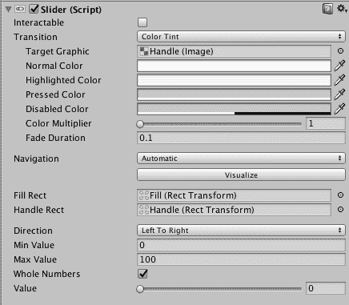
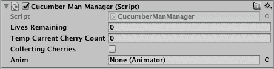
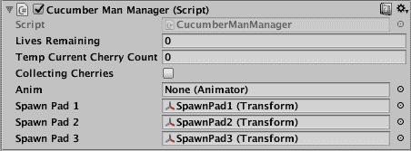

# 第十一章：编写胜利和失败脚本

在第十章，*编写我们的得分系统*中，我们设计、编写和实现了游戏的得分系统。我们对适当的 GameObject 进行了更改，并编写了几个脚本来管理得分系统。我们确保每帧游戏中的得分都更新到我们的**抬头显示**（**HUD**）上。此外，我们还增加了 Cucumber Man 从樱桃树上收集樱桃并将其用作对抗 Cucumber Beetles 武器的功能。

在本章中，我们将设计和编写游戏的胜利和失败条件。我们将更新在其他章节中创建的脚本，以管理 Cucumber Man 的健康状况，提供逐帧的屏幕更新，并在健康耗尽时确保玩家生命值丢失。我们将通过脚本管理剩余的生命值。我们还将设计和编写玩家角色的重生脚本。

具体来说，本章将涵盖以下内容：

+   设计失败和胜利条件

+   更新玩家的健康

+   实现胜利逻辑

+   实现游戏结束逻辑

+   更新剩余生命值的 HUD

+   编写玩家角色重生的脚本

# 设计胜利和失败条件

目前，我们的游戏没有明确的结束，也没有为玩家的行为实现任何奖励。在本节中，我们将设计游戏的胜利和失败条件，以便有一个明确的目标或获胜的方式。

在第三章，*设计游戏*中，我们确定了三种游戏结束条件：Cucumber Man 有两种结束条件以失败告终，而 Cucumber Beetles 只有一种结果会导致失败。

这里是我们游戏的胜利条件：

+   如果以下条件满足，Cucumber Beetles 获胜：

    +   游戏中没有剩余的黄瓜

    +   Cucumber Man 的生命值耗尽

+   如果以下条件满足，Cucumber Man 获胜：

    +   游戏中没有剩余的 Cucumber Beetles

这些胜利和失败条件相当简单，只有一个赢家。如果 Cucumber Beetles 获胜，Cucumber Man 就会失败。

为了实现这些条件，我们需要通过脚本跟踪以下内容：

+   黄瓜的数量

+   Cucumber Beetles 的数量

+   Cucumber Man 剩余的生命值

在第十章，*编写我们的得分系统*中，我们编写了必要的脚本来跟踪黄瓜和 Cucumber Beetles。我们还确保 HUD 持续更新这些计数。对于玩家来说，了解他们在游戏中的表现感非常重要。除了得分之外，玩家还希望不断查看游戏中有多少黄瓜和 Cucumber Beetles。玩家还想知道 Cucumber Man 剩余的生命值。

在下一节中，我们将更新我们的游戏，以便更新生命值并开始使用玩家的健康条。这些将为玩家在游戏过程中提供所需的 HUD 视觉组件。

# 更新玩家的健康

在本节中，我们将完全实现玩家的健康系统。我们将让 Cucumber Man 从三个生命开始，每个生命都有满值的 100 健康点。我们将更新脚本，以便当 Cucumber Man 被黄瓜甲虫攻击时，它会失去健康。我们的方法是从 Cucumber Man 的健康中扣除每秒钟与黄瓜甲虫碰撞的分数。我们还将编写 HUD 健康条的脚本，并在下一节中开始这个任务。

在我们开始之前，你应该打开你的 Unity 游戏项目。或者，你也可以从出版商的配套网站上下载可用的 *Starting-Chapter-11 Unity* 项目。

# 编写健康条脚本

在本节中，我们将创建一个新的脚本并将其附加到我们的 HUD 健康条上。我们将编辑脚本并使用它来管理 Cucumber Man 的健康和 HUD 健康条的可见状态。

让我们先来回顾一下我们的健康条：

1.  在层次结构面板中，选择 `HUD_Canvas` | `Health_Slider`。

1.  在检查器面板中，查看滑块（脚本）组件。正如你在以下截图中所见，界面底部有一个带有滑块的值组件：



1.  点击游戏视图标签，这样你就可以在不进入游戏模式的情况下看到 HUD。

1.  在检查器面板中，拖动值滑块并观察健康条的功能。

你可以看到健康条已经可以正常工作；我们只需要给滑块添加一个脚本，以便它跟踪玩家的健康并在游戏过程中更新 HUD。以下是这些步骤：

1.  在检查器面板中，点击添加组件按钮

1.  选择新建脚本并命名为 `HealthManager`

1.  在项目面板中，点击收藏夹 | 所有脚本

1.  将 `HealthManager` 脚本拖到 `Assets` | `Custom Scripts` 文件夹

1.  双击 `HealthManager` 脚本来在编辑器中打开它

1.  编辑脚本以匹配以下代码，代码的第一部分包含 `import` 语句和 `HealthManager` 类声明：

```cs
 using System.Collections;
 using System.Collections.Generic;
 using UnityEngine;
 using UnityEngine.UI;

 public class HealthManager : MonoBehaviour { 

```

下一段代码声明了我们的类变量。我们将使用 `currentHealth` 来保存 Cucumber Man 的最新健康值。我们将使用 `healthBar` 作为对滑块的引用：

```cs
public static int currentHealth;
public Slider healthBar;

```

我们的 `HealthManager` 类有三个方法；第一个是 `Awake()` 方法。在这个方法中的第一条语句获取了对 `Slider` 组件的引用。第二条语句将 `currentHealth` 设置为 `100`。这是 Cucumber Man 的最大健康起始点：

```cs
void Awake () {
healthBar = GetComponent&lt;Slider> ();
currentHealth = 100;
}

```

我们的第二个方法是 `ReduceHealth()` 方法。这个方法将被其他脚本用来请求健康减少。正如你所见，第一条语句只是将 `currentHealth` 值减一。第二条语句更新屏幕上的滑块：

```cs
void ReduceHealth () {
currentHealth = currentHealth - 1;
healthBar.value = currentHealth;
}

```

这个类最后的 `Update()` 方法中有一句用于每帧更新滑块的语句。这导致滑块准确地显示玩家的健康值：

```cs
void Update () {
healthBar.value = currentHealth;
}
 }
```

在下一节中，我们将修改适当的脚本，以便当黄瓜人被黄瓜甲虫咬时调用 `ReduceHealth()` 方法。

# 减少健康值

我们的 `BeetleNPC` 脚本已经检测到与黄瓜人的碰撞，因此我们可以简单地更新该脚本，在检测到碰撞时从黄瓜人的健康值中减去一点。我们将通过调用 `HealthManager` 脚本的 `ReduceHealth()` 方法来完成此操作。以下是步骤：

1.  在项目面板中，选择 Assets | Custom Scripts 并双击 `BeetleNPC` 脚本。

1.  在脚本的类变量部分添加以下语句。这创建了一个我们可以用来引用 `HealthManager` 类的变量：

```cs
      public HealthManager _healthManager;
```

1.  在第一个 `if` 语句之后，在 `OnCollisionEnter()` 方法中添加以下两个语句：

```cs
      _healthManager = GameObject.Find 
      ("Health_Slider").GetComponent&lt;HealthManager>();
      _healthManager.ReduceHealth(); 
```

通过这两个语句，我们获得了对 `Health_Slider` 的 `HealthManager` 脚本的引用，然后调用 `ReduceHealth()` 方法。

现在，您可以测试您的游戏，并观察生命条随黄瓜甲虫开始攻击黄瓜人而变化。

# 实现胜利

在本节中，我们将实现黄瓜人的胜利条件。黄瓜人的唯一胜利条件是黄瓜甲虫的数量为零。我们的 `BeetleManager` 脚本已经提供了计数黄瓜甲虫的功能。如您所回忆的，这就是我们在我们的 HUD 上更新我们的黄瓜甲虫计数的方式。我们将对该脚本进行一些修改，并在本节中创建一个新的脚本。

让我们从创建一个屏幕文本组件开始，当黄瓜甲虫的数量达到零时显示“你赢了！”以下是步骤：

1.  在层次结构面板的空白区域右键单击。

1.  选择创建空对象。

1.  在检查器面板中，将新的 GameObject 重命名为 `EndofGame`。我们将使用它作为胜利和失败文本标签的容器。

1.  在层次结构面板中，将 `EndofGame` GameObject 拖动以使其从属我们的 `HUD_Canvas`。

1.  选择 `EndofGame` GameObject，在检查器面板中，选择 Transform 下拉菜单并单击重置。这将重置对象的变换。

1.  在层次结构面板中，右键单击并选择 UI | Text。

1.  将新的文本对象从 `EndofGame` GameObject 下属。

1.  将新的文本对象重命名为 `Victory`。

下面的四个步骤用于在检查器面板中配置胜利文本对象：

1.  将文本属性更改为 `You Won!`

1.  将字体样式设置为粗体

1.  将字体大小增加到 24。

1.  选择一个明亮的文本颜色

通过单击游戏选项卡或将游戏置于游戏模式，您可以看到新的胜利文本显示在屏幕中央。我们只想在玩家赢得游戏时显示该文本。让我们解决这个问题：

1.  确保选择胜利文本组件

1.  在检查器面板中，点击添加组件按钮

1.  选择新建脚本，并将脚本命名为 `VictoryManager`

1.  在项目面板中，点击收藏夹 | 所有脚本

1.  将 `VictoryManager` 脚本拖到 `Assets` | `Custom Scripts` 文件夹

1.  双击 `VictoryManager` 脚本来在编辑器中打开它

1.  编辑脚本，使其与以下代码匹配，代码的第一部分包含命名空间 `import` 语句和 `VictoryManager` 类声明：

```cs
using System.Collections;
 using System.Collections.Generic;
 using UnityEngine;
 using UnityEngine.UI;

 public class VictoryManager : MonoBehaviour {
```

我们脚本的下一部分包含两个类变量声明和 `Awake()` 方法。在 `Awake()` 方法中，我们获取 `Victory` UI 对象的文本组件引用。我们还设置初始文本为空，这样就不会显示任何内容：

```cs
     Text Victory;
     int beetleCount;

     void Awake () {

         Victory = GetComponent&lt;Text> ();
         Victory.text = "";
     }
```

我们脚本的最后一部分是 `Update()` 方法。在这里，我们将计数值设置为当前黄瓜甲虫的数量，然后测试计数值是否为零。如果 `(count == 0)` 条件为真，我们将在屏幕上显示胜利文本：

```cs
     void Update () {

         beetleCount = BeetleManager.currentBeetleCount;

         if (beetleCount == 0) {
             Victory.text = ("You won!"); 
         }
     }
 } 

```

我们接下来的任务是更新 `BeetleManager` 脚本。我们将对该脚本进行三项更改：

1.  将 `static` 修饰符添加到 `currentBeetleCount` 类变量。新的一行代码应该是：

```cs
      public static int currentBeetleCount;
```

1.  在 `Awake()` 方法中，将 `currentBeetleCount = 0;` 改为 `currentBeetleCount = 1;`。这将有助于确保游戏在开始时不会认为没有黄瓜甲虫。

1.  在 `Update()` 方法中添加以下语句作为最后的语句：`currentBeetleCount = beetles.Length;`。这将更新每个帧的 `currentBeetleCount` 变量。

现在你可以测试游戏了。杀死所有的黄瓜甲虫来测试你做的代码更改。如果某些东西没有正确工作或你收到错误，请参考以下更新的 `BeetleManager` 脚本：

```cs
 using System.Collections;
 using System.Collections.Generic;
 using UnityEngine;
 using UnityEngine.UI;

 public class BeetleManager : MonoBehaviour {

     public static int currentBeetleCount;
     Text Beetle_Count;
     public GameObject[] beetles;

     void Awake () {

         Beetle_Count = GetComponent&lt;Text> ();
         currentBeetleCount = 1;
     }

     void Update () {

         beetles = GameObject.FindGameObjectsWithTag ("Beetle");
         Beetle_Count.text = beetles.Length.ToString();
         currentBeetleCount = beetles.Length;
     }
 } 
```

现在胜利条件已经实现，我们准备实现我们的失败条件。我们将在下一节中这样做。

# 实现失败

有两种游戏条件会导致玩家输掉游戏。第一个条件是游戏中没有剩余的黄瓜。第二个条件是如果所有三个生命都消失了。让我们分别看看这些失败条件。

# 基于剩余黄瓜数量实现脚本失败

我们的 `CucumberManager` 脚本已经跟踪了游戏中的黄瓜数量，所以我们只需要给该脚本的 `currentCucumberCount` 类变量添加静态修饰符，然后更新我们的 `VictoryManager` 脚本。以下是步骤。

1.  编辑 `CucumberManager` 脚本，使 `currentCucumberCount` 变量声明如下：

```cs
      public static int currentCucumberCount;
```

1.  在 `Awake()` 方法中，将 `currentCucumberCount = 0;` 改为 `currentCucumberCount = 1;`。这将有助于确保游戏在开始时不会认为没有黄瓜。

1.  在 `Update()` 方法的末尾添加以下语句，`currentCucumberCount = cucumbers.Length;`。这将保持计数器在每个帧中更新。

这些就是 `CucumberManager` 脚本所需的唯一更改。接下来，我们将编辑 `VictoryManager` 脚本：

1.  通过添加 `int cucumberCount;` 类变量来编辑 `VictoryManager` 脚本。

1.  将以下代码行添加到 `Update()` 方法的底部。这些行将不断检查是否没有剩余的黄瓜，并在计数等于零时显示“你输了！”文本：

```cs
         cucumberCount = CucumberManager.currentCucumberCount;

         if (cucumberCount == 0) {
             Victory.text = ("You Lost!");
         } 
```

您现在可以测试这个失败条件。

您可以通过在游戏模式下从层次结构面板中删除黄瓜来加快测试速度。当您退出游戏模式时，所有已删除的对象将被恢复。

# 编写无生命剩余的失败脚本

我们将使用 `CucumberManManager` 脚本来跟踪剩余的 Cucumber Man 生命值。编辑该脚本并做出以下更改：

1.  添加 `public static int livesRemaining;` 类变量。我们将使用这个变量来跟踪剩余的生命值。

1.  添加 `public Animator anim;` 类变量。我们将使用它来播放 Cucumber Man 的死亡动画。

1.  将 `livesRemaining = 3;` 语句添加到 `Awake()` 方法的底部。

1.  将以下 `if` 语句块添加到 `Update()` 方法的底部：

```cs
         if (livesRemaining == 0) {
             anim = GetComponent&lt;Animator> ();
             anim.Play ("CM_Die"); 
         } 
```

如您在 `Update()` 方法的更改中看到的，我们只是检查 `livesRemaining` 的值，当没有生命剩余时，播放相应的死亡动画。

您可以通过以下步骤测试这个失败条件：

1.  从 `public static int livesRemaining` 语句中移除 `static` 修饰符

1.  将游戏置于游戏模式

1.  在层次结构面板中，点击 `CucumberMan` GameObject

1.  在检查器面板中，滚动到 Cucumber Man Manager (Script) 组件

1.  将剩余生命值改为 `0`（零）。以下截图提供了详细信息：



1.  当您的测试完成时，将步骤 1 中的语句的 `static` 修饰符放回

# 更新显示剩余生命值的 HUD

在上一节中，我们修改了 `CucumberManManager` 脚本来跟踪玩家剩余的生命值，当没有生命剩余时，播放相应的动画。在本节中，我们将继续修改 `CucumberManManager` 脚本来更新 HUD 中的剩余生命值。

我们只需要修改 `CucumberManManager` 脚本的 `Update()` 方法。下面提供了修改后的 `Update()` 方法及其更改说明：

```cs
     void Update () {

         if (collectingCherries) {
             if (tempCurrentCherryCount ></span>= 60) {
                 currentCherryCount = currentCherryCount + 1;
                 tempCurrentCherryCount = 0;

                 _ptsManager = GameObject.Find 
                 ("Score_Value").GetComponent&lt;PointsManager>();
                 PointsManager.currentScore = 
                 PointsManager.currentScore + 5;

             } else {
                 tempCurrentCherryCount = tempCurrentCherryCount + 1;
             }
         }

         if (livesRemaining == 2) {
             Destroy (GameObject.Find ("Life3"));
         }
         if (livesRemaining == 1) {
             Destroy (GameObject.Find ("Life2"));
         }
         if (livesRemaining == 0) {
             Destroy (GameObject.Find ("Life1"));
             anim = GetComponent&lt;Animator> ();
             anim.Play ("CM_Die"); 
         }
     } 
```

我们添加了条件语句来检查剩余的生命值。当剩下两个生命时，我们销毁第三个生命图像。当只剩下一个生命时，我们销毁第二个生命图像，当没有生命剩余时，我们销毁第一个生命图像。我们使用 `Destroy()` 方法来完成这个任务。

# 编写玩家角色复活脚本

在上一节中，我们修改了 `CucumberManManager` 脚本来跟踪剩余的生命数量，并在适当的时候销毁 UI 图像元素。在本节中，我们将修改该脚本，以便在生命丢失时完成以下操作：

+   播放死亡动画

+   在重生垫上重生玩家

让我们先修改 `CucumberManManager` 脚本：

1.  添加以下类变量：

```cs
     public Transform SpawnPad1;
     public Transform SpawnPad2;
     public Transform SpawnPad3;
```

1.  在 Hierarchy 面板中，选择 `CucumberMan` GameObject，然后在 Inspector 面板中滚动，直到找到 Cucumber Man Manager (Script) 组件。

1.  将 `SpawnPad1`、`SpawnPad2` 和 `SpawnPad3` 从 Hierarchy 视图中拖动到 Inspector 面板中指定的位置。以下为详细信息：



1.  修改 `Update()` 方法的底部部分，如下所示：

```cs
         if (livesRemaining == 2) {
             Destroy (GameObject.Find ("Life3"));
             anim = GetComponent&lt;Animator> ();
             anim.Play ("CM_Die");

             StartCoroutine ("ReSpawnCucumberMan");
         }

         if (livesRemaining == 1) {
             Destroy (GameObject.Find ("Life2"));
             anim = GetComponent&lt;Animator> ();
             anim.Play ("CM_Die");

             StartCoroutine ("ReSpawnCucumberMan");
         }

         if (livesRemaining == 0) {
             Destroy (GameObject.Find ("Life1"));
             anim = GetComponent&lt;Animator> ();
             anim.Play ("CM_Die");
         } 
```

检查前面的代码可以发现，根据 `livesRemaining` 变量的值，有三种条件正在被检查。在每种情况下，适当的 UI 图像组件都会从 HUD 中移除，并且播放 `CM_Die` 动画。对于前两种情况（`livesRemaining` 等于两或一），我们有一个 `StartCoroutine("RespawnCucumberMan");` 方法调用。我们将在下一节中编写该方法：

1.  编写 `ReSpawnCucumberMan()` 方法。在 `CucumberManManager` 类中的 `OnTriggerEnter()` 方法之后输入以下代码：

```cs
     IEnumerator ReSpawnCucumberMan() {

         int randomNumber = Random.Range (1, 4);

         if (randomNumber == 1) {
             yield return new WaitForSecondsRealtime (4);
             this.transform.position = SpawnPad1.transform.position;
         } else if (randomNumber == 2) {
             yield return new WaitForSecondsRealtime (4);
             this.transform.position = SpawnPad2.transform.position;
         } else {
             yield return new WaitForSecondsRealtime (4);
             this.transform.position = SpawnPad3.transform.position;
         }

         anim.Play ("CM_Idle");
     }
```

我们的 `ReSpawnCucumberMan()` 方法首先获取一个随机的 `1`、`2` 或 `3`。然后我们检查生成了哪个随机数，并相应地进行分支。我们有一个四秒的延迟，以便死亡动画完成。然后我们将 Cucumber Man 重生到与随机生成的数字相对应的重生垫上。最后，我们播放空闲动画。

# 摘要

在本章中，我们设计和编写了游戏的胜利和失败条件。我们更新了游戏脚本以管理 Cucumber Man 的健康，包括更新 HUD 的健康条。我们通过脚本实现了胜利和游戏结束的逻辑。我们还实现了剩余生命和屏幕上的生命指示器。最后，我们编写了玩家角色的重生脚本。

在下一章中，我们将计划和实现游戏中的音效和视觉效果，以增强整体游戏体验。具体来说，我们将为战斗系统中的关键事件添加音效，并使用 Unity 的粒子系统添加几个特殊效果，以增加游戏的可视吸引力。
