# 第十三章：优化我们的游戏以进行部署

在上一章中，我们计划和实现了音频和视觉效果到我们的游戏中，以增强整体游戏体验。具体来说，我们在战斗系统的关键事件中添加了音频，并添加了照明和粒子特效。我们从 Unity 音频系统的概述开始，然后计划和实现了我们的游戏音频。然后转向 Unity 中灯光和阴影的介绍，并涵盖了 Unity 中的选择特效。最后，我们在樱桃树上添加了一个点光源，并在出生点添加了一个特效。

本章有两个重点领域：优化和部署。在优化部分，你将学习如何诊断你的 Unity 游戏性能问题，以及如何优化脚本和图形渲染。在部署部分，你将了解 Unity 的构建过程，如何创建独立玩家，以及如何将你的游戏部署到多个平台。

具体来说，在本章中，我们将涵盖以下主题：

+   使用 Profiler 窗口

+   优化脚本

+   优化图形渲染

+   额外的优化

+   创建构建

# 使用 Profiler 窗口

Unity 有一个本机工具帮助我们检查游戏性能。这是一个 Profiler 工具，可以通过 Window | Profiler 顶级菜单选项访问。正如你在以下插图中所见，Profiler 窗口中有 13 个组件可用：

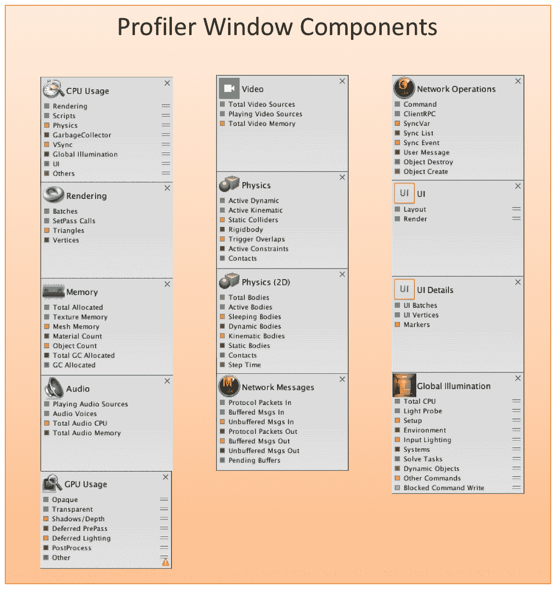

Profiler 组件

单个 Profiler 名称清楚地表明正在分析的性能度量。为了完全探索 Profiler 窗口，让我们按照以下步骤启动它：

1.  打开你的 Unity 游戏项目。或者，你也可以从出版商的配套网站上下载可用的 Starting-Chapter-13 Unity 项目。

1.  使用顶级菜单，选择 Window | Profiler。根据你的系统，这可以打开 Profiler 在新窗口或作为标签页。

1.  在 Profiler 窗口或标签页中，使用添加 Profiler 按钮添加任何默认未加载的 Profiler。已加载的 Profiler 将以灰色显示，未加载的 Profiler 将以黑色显示。

1.  将你的游戏置于游戏模式。

1.  滚动 Profiler，并使用 Profiler 框右上角的*x*关闭提供少量或无数据的 Profiler。例如，网络操作和网络消息 Profiler 不适用于 Cucumber Man 游戏。你可以在 Profiler 窗口中保留以下 Profiler：

    +   CPU 使用情况

    +   GPU 使用情况

    +   渲染

    +   内存

    +   音频

    +   物理引擎

    +   用户界面

    +   全局照明

1.  让你的游戏运行至少一分钟或更长时间，然后退出游戏。无论你在游戏运行时玩游戏还是只是坐下来观看瓜蚜虫寻找和吃黄瓜，你都可以在游戏停止后获得 Profiler 数据。

我们可以检查每个分析器，以帮助确定我们的游戏性能，并识别任何性能问题。让我们通过在分析器窗口中单击它来查看 GPU 使用分析器。当我们选择一个分析器时，详细的信息将显示在分析器窗口的底部部分。

通过审查提供详细信息的详细信息，例如此处显示的 GPU 使用信息，我们可以确定组件级别的性能。在以下示例中，我们可以看到我们的`Camera.Renderer`对 GPU 的绘制需求最大。我们还可以通过单击每个组件左侧的灰色三角形来进一步深入到更高的保真度：

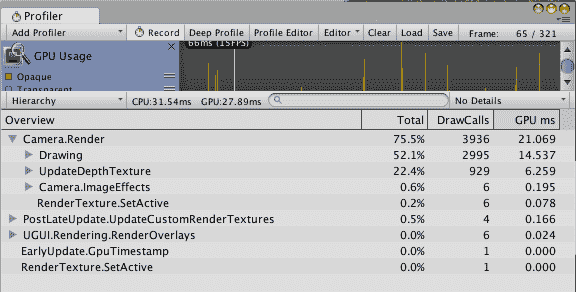

# 充分利用分析器

分析器窗口有几个控件，分为界面的左侧、中间和右侧部分。正如您可以从以下屏幕截图中看到的那样，添加分析器下拉按钮消耗了分析器窗口工具栏的最左侧部分。我们可以使用该按钮向窗口添加额外的分析器：

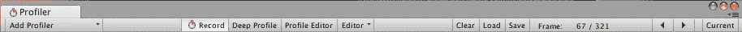

分析器工具栏

界面的中间部分包含四个功能，如下详细说明：

+   记录：此按钮默认启用，用于记录或停止记录活动游戏的配置文件信息。当您在游戏的特定部分进行故障排除时，此按钮可以轻松地开始和停止记录。

+   深度分析：当启用此功能时，将分析所有脚本使用情况，包括函数调用。

+   分析器编辑器：此功能允许您切换分析器的分析。

+   编辑器：您可以使用此功能为分析器指定 IP 地址，并将日志数据发送。默认情况下，它将发送到编辑器。

分析器窗口工具栏的最右侧部分包括清除、加载和保存分析器信息的控件。如果您选择了一个帧，帧信息将显示出来。您还可以使用本节中的导航按钮遍历帧。

如果您在使用分析工具时注意到游戏性能明显受到影响，请不要感到惊讶。

# 优化脚本

Unity 游戏每秒运行多个帧，并且我们的大多数脚本在每个帧都会执行。即使是简单的游戏，如黄瓜人，也可能在每个帧运行多个脚本，导致计算机的 CPU 非常忙碌。目标是确保我们的脚本不会造成任何不必要的 CPU 负载。

我们的游戏有 145 个脚本，但其中大多数是标准资产包的一部分，并且没有分配给任何游戏对象。我们想要审查的脚本是我们放在`Assets` | `Custom Scripts`文件夹中的脚本。审查该文件夹显示，其中只有 14 个脚本：

+   BeetleManager

+   BeetleNPC

+   BeetlePatrol

+   CameraFollower

+   CherryControl

+   CherryManager

+   CucumberManager

+   CucumberManManager

+   HealthManager

+   PlayerController

+   PlayerMotor

+   PointsManager

+   ThrowCherry

+   VictoryManager

我们的目标是减少 CPU 需要执行的指令数量，尤其是在我们每帧处理多个执行并且每秒多个帧的情况下。在审查你的 Unity 脚本时，以下是一些需要检查的事项：

+   确保所有函数调用都是必要的。

+   根据需要，将函数调用移出`Update()`方法。

+   根据需要，将语句移出循环以限制它们执行的次数。

+   只在需要时使用 NPC。我们的游戏相对简单，我们没有成群的黄瓜甲虫。你可能尝试一个实验，在你的游戏中放置 10,000 个黄瓜甲虫。由于每个甲虫都有与 AI 相关的代码，CPU 将会非常忙碌。

# 优化代码示例

以下脚本未经过优化。请审查脚本，看看可以采取哪些措施来优化它。然后，审查脚本之后提供的信息：

```cs
public class CucumberManager : MonoBehavior {
     public static int currentCucumberCount;
     Text Cucumber_Count;
     public GameObject[] cucumbers;

     void Update() {
          Cucumber_Count = GetComponent<Text>();
          currentCucumberCount = 1;
          cucumbers = GameObject.FindGameObjectsWithTag("Cucumber");
          Cucumber_Count.text = cucumbers.Length.ToString();
          currentCucumberCount = cucumbers.Length;
     }
}
```

希望你能够发现脚本中低效、未优化的部分。在上面的例子中，除了变量声明之外的所有语句都发生在`Update()`方法中。考虑以下脚本的优化版本：

```cs
public class CucumberManager : MonoBehavior {
     public static int currentCucumberCount;
     Text Cucumber_Count;
     public GameObject[] cucumbers;

     void Awake() {
          Cucumber_Count = GetComponent<Text>();
          currentCucumberCount = 1;
     }

      void Update() {
           cucumbers = GameObject.FindGameObjectsWithTag("Cucumber");
           Cucumber_Count.text = cucumbers.Length.ToString();
           currentCucumberCount = cucumbers.Length;
      }
}
```

在此脚本的优化版本中，`GetComponent()`方法调用和`currentCucumberCount`变量初始化被移动到`Awake()`方法。这些语句只需要运行一次。将它们放在`Update()`方法中会给 CPU 带来不必要的压力。

对于游戏的整体性能来说，拥有经过优化的脚本非常重要。在项目结束时检查脚本优化是一个好主意。理想情况下，你将在编写脚本时确保它们已经优化，而不是在之后进行审查。

# 优化图形渲染

当试图提高游戏性能时，应该探索以下三个图形渲染概念：遮挡消除、照明和网格渲染器。这些概念将在以下各节中介绍。

# 漏洞消除

在我们的 Unity 游戏中，摄像机是一个关键的游戏对象。它们允许玩家看到游戏环境。Unity 在游戏过程中勤奋地渲染摄像机视锥体内的对象。图形渲染可能代表一个巨大的性能问题。因此，我们特别关注摄像机的遮挡消除参数非常重要。当启用时，Unity 将不会渲染被遮挡的对象，或者摄像机看不到的对象。一个例子是建筑物内的对象。如果摄像机目前只能看到建筑物的外部墙壁，那么那些墙壁内的所有对象都看不到。因此，不渲染这些对象是有意义的。我们只想渲染绝对必要的对象，以确保我们的游戏具有流畅的游戏体验和没有延迟。

# 照明

当我们在 Unity 中创建场景时，我们有三种光照选项。我们可以使用实时动态光、烘焙光照方法或实时与烘焙的混合。与实时动态光照相比，烘焙光照可以使游戏性能更优，所以如果性能是关注点，尝试在可能的情况下使用烘焙光照。

区域光源与其他类型的光源不同，它们只能烘焙。这意味着在游戏过程中不会进行实时渲染。这样做的原因是在游戏开始之前完成所有关于区域光源的处理。如果在游戏中实时完成这些处理，很可能会产生足够的延迟。

# 网格渲染器

游戏对象的网格渲染器组件可以在检查器面板中查看。有多个可调整的设置，可以用来提高性能。

投影阴影设置可以设置为开启、关闭、双面或仅阴影。默认设置为开启，所以你应该为所有不需要投射阴影的对象禁用此设置。

接收阴影是一个切换选项，用于告诉 Unity 是否希望该对象接收阴影。正如你所预期的那样，这需要额外的处理来在游戏过程中显示。因此，如果你不需要对象接收阴影，取消选择此选项以获得更好的性能。

# 额外的优化

你可以在两个额外的区域优化你的游戏：级别细节和使用静态碰撞体。这两个概念将在接下来的章节中讨论。

# 级别细节

级别细节指的是在任意游戏对象上渲染的细节程度。多边形数量越多，游戏对象的细节级别就越高。为了减少渲染时间，你应该考虑哪些细节元素需要包含在 3D 模型中，哪些可以简单地包含在纹理中。

此外，还有**级别细节**（**LOD**）模型。这是在游戏中使用同一对象的多个模型，每个模型具有不同的细节级别。想象一下，玩家站在海岸上，望着地平线。距离 12 英里的船不需要与距离仅几码时的同样细节级别。

# 静态碰撞体

静态碰撞体是具有碰撞器但没有刚体的游戏对象。正如其名所示，这些游戏对象不会移动。因为物理引擎知道这些对象不会移动，可以预先计算以使游戏更高效。

因此，为了提高效率，你应该尽可能使用静态碰撞体。

# 创建构建

当您在自己的项目上工作时，为您的游戏创建构建并不复杂。您本质上确保您的资产（例如，3D 模型、纹理、动画和脚本）在您的计算机上，并使用 Unity 创建构建。当您在大型和分布式团队上工作时，这个过程要复杂得多。本节涵盖了单个开发者，其中所有资产都在一台计算机上。

# 理解 Unity 构建过程

Unity 的构建过程看起来相当简单。我们只需从顶部菜单中选择文件 | 构建 & 运行，就能得到很好的结果。Unity 实际上做了很多工作来创建构建。以下是 Unity 游戏引擎创建游戏构建的基本步骤：

1.  生成一个空白构建副本的游戏

1.  按顺序遍历场景列表，在将其集成到构建之前对其进行优化

1.  计算并存储有关每个场景需要哪些资产的数据

构建过程中还有一些额外的方面我们应该注意。例如，如果我们将 EditorOnly 标签分配给一个游戏对象，它将不会集成到构建中。

一旦您完成了您的游戏，您可以从文件下拉菜单中选择构建 & 运行或构建设置选项：

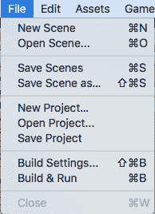

# 构建设置

我们通过文件 | 构建 & 运行顶部菜单选项访问构建设置对话框窗口。当该界面打开时，显示如下，我们可以就我们的构建做出几个决定：

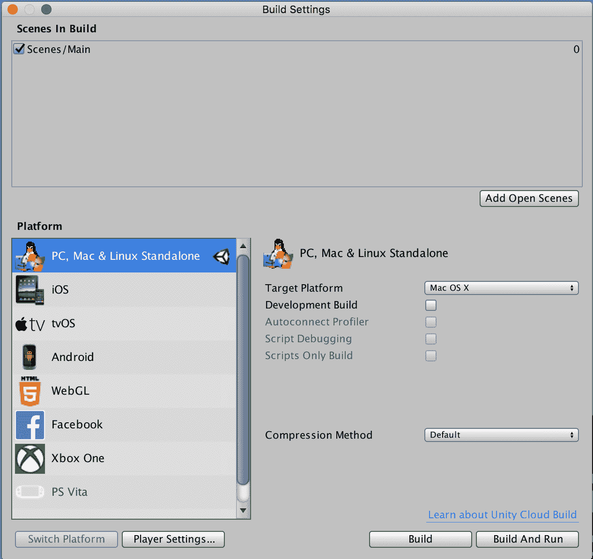

构建设置界面的顶部列出了将包含在构建中的场景。您可以使用添加打开场景按钮快速将这些场景添加到构建中。您还可以选择和取消选择场景，以确保您只包含构建所需的场景。

在构建设置界面的下一部分，您将选择一个平台。接下来的几个部分将涵盖每个平台选项。

# PC、Mac 和 Linux 独立平台

对于这个平台组，您需要选择 Mac OS X、Windows 或 Linux。正如您可以从下面的截图中所见，每个操作系统选择都有自己的选项集：

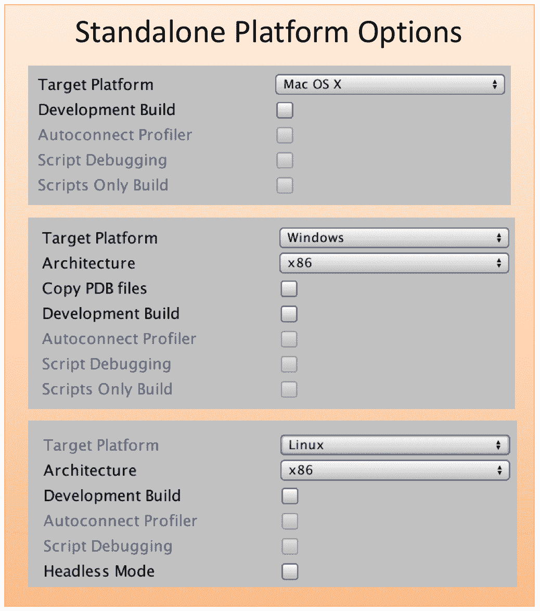

对于 Mac OS X，您将决定这是一个开发构建还是不是。如果是，您将拥有自动连接分析器、脚本调试和仅脚本构建的附加选项。

对于 Windows，您将选择它是 32 位还是 64 位构建，并选择是否要复制 PDB 文件。您还将决定这是否是一个开发构建。如果是，您将拥有自动连接分析器、脚本调试和仅脚本构建的附加选项。

对于 Linux，您将选择它是 32 位、64 位还是通用构建。您还将决定这是否是一个开发版本。如果是，您将拥有额外的选项，包括自动连接分析器、脚本调试和仅脚本构建。最后，您将选择您的构建是否支持无头模式。

无头模式指的是不包含视觉元素的基于服务器的游戏。

# iOS

当为 iOS 设备（iPad、iPad Pro、iPad Mini、iPhone、iPod Touch）开发时，您需要在您的计算机上安装 Xcode。开发 macOS 设备也需要 Xcode。

您可以在此处获取 Xcode 的最新版本：[`developer.apple.com/develop/`](https://developer.apple.com/develop/)。

使用构建设置界面，您可以识别您的 Xcode 版本并决定是否以发布或调试模式运行它。您可以决定是否希望您的 Xcode 项目直接从 Unity 编辑器的安装位置引用 Unity iOS 运行时库。这通过选择“链接 Unity 库”复选框来完成。您不应该在最终构建中使用此选项：

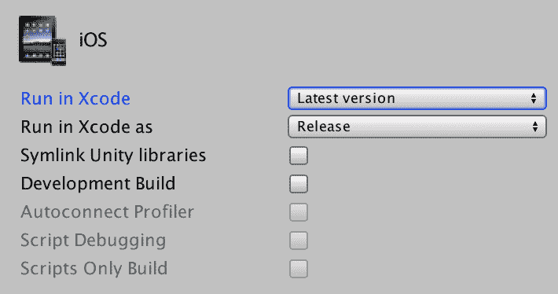

您还将决定这是否是一个开发版本。如果是，您将拥有额外的选项，包括自动连接分析器、脚本调试和仅脚本构建。

# tvOS

如您在此处所见，tvOS 的选项与 iOS 相同：

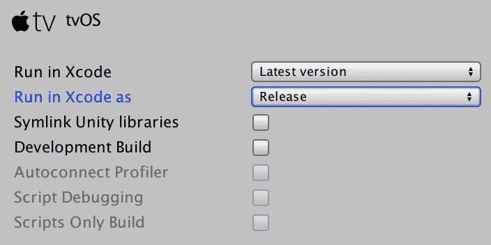

# Android

当为 Android 设备开发时，您可以从多个纹理压缩选项中进行选择。您还可以将 16 位、32 位或 32 位半分辨率识别为 ETC2 回退。您可以使用内部构建系统或 Gradle，Gradle 是 Android Studio 和其他地方使用的构建工具：

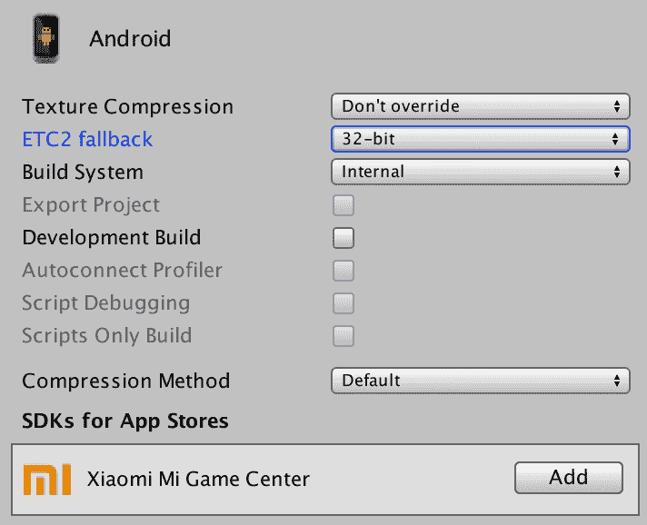

您还将决定这是否是一个开发版本。如果是，您将拥有额外的选项，包括自动连接分析器、脚本调试和仅脚本构建。

您可以在此处了解更多关于为 Android 设备开发的信息：[`developer.android.com/`](https://developer.android.com/)。

# HTML 5/WebGL

当开发 HTML 5/Web GL 时，您将决定这是否是一个开发版本。如果是，您将拥有额外的选项，包括自动连接分析器和仅脚本构建：


# Facebook

当开发将在 Facebook 上发布的 Unity 游戏时，您将需要 Facebook SDK 和一个 App ID。对于目标平台，您可以选择 Gameroom（Windows）或 WebGL：

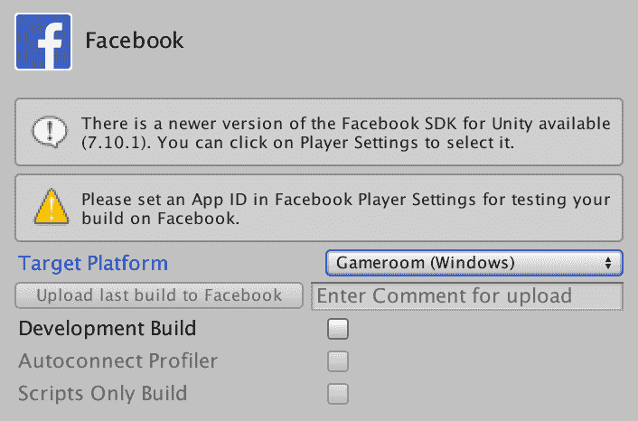

您还将决定这是否是一个开发版本。如果是，您将拥有额外的选项，包括自动连接分析器和仅脚本构建。

有关如何注册和配置 Facebook 应用的说明，请参阅以下 URL：[`developers.facebook.com/docs/apps/register`](https://developers.facebook.com/docs/apps/register)。

# Xbox One

Xbox One 玩家的访问通过 Microsoft ID@Xbox 计划处理。

访问以下链接了解如何为 Xbox One 开发游戏：[`www.xbox.com/en-US/developers`](https://www.xbox.com/en-US/developers)。

# PlayStation 4 和 PlayStation Vita

PlayStation 4 和 PlayStation Vita 玩家的访问通过 Dev NET 处理，需要 Unity Plus 或 Unity Pro 许可证。

# 玩家设置

使用 Edit | Project Settings | Player 菜单选项，你可以在检查器面板中访问 Unity 玩家设置。在这个上下文中，术语玩家并不指玩游戏的人，而是指运行游戏的软件。

如以下截图所示，有公司名称和游戏标题的数据字段。图标和光标也在此上传：


在 PlayerSettings 界面的一般设置区域下方有六个按钮。如图所示，每个平台都有一个按钮，Unity 可以为它生成玩家。这不包括 Xbox 或 PlayStation 玩家：

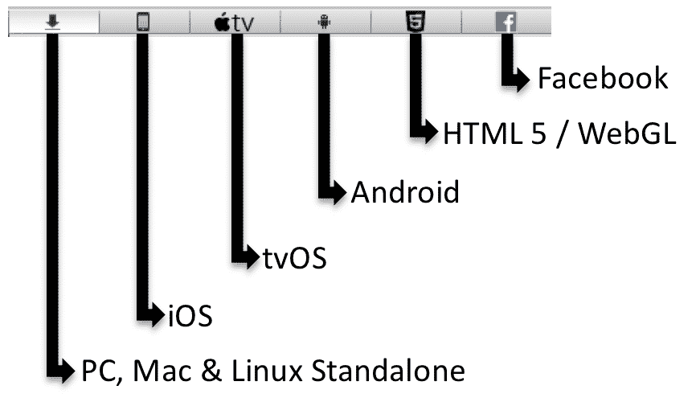

对于每个平台，都有一组玩家配置设置部分。这包括以下内容：

+   分辨率和展示

+   图标

+   启动图像

+   调试和崩溃报告

+   其他设置

并非每个设置部分都适用于所有平台类型。此外，其他设置内容根据你正在为哪个平台开发而有所不同。

如果你正在为多个平台开发，你需要审查每种平台类型的设置。

# 摘要

在本章中，我们专注于优化和部署。我们学习了如何诊断 Unity 游戏中的性能问题，以及如何优化脚本和图形渲染。我们还探讨了如何部署我们的 Unity 游戏，包括了解 Unity 构建过程、如何创建独立玩家以及如何将游戏部署到多个平台。

在第十四章“虚拟现实”中，我们将探讨 Unity 在虚拟现实方面的能力。我们将从虚拟现实的快速介绍开始，包括硬件要求，然后看看如何使用 Unity 游戏引擎创建虚拟现实游戏。我们还将查看 Unity 资产商店中可用的起始内容。
