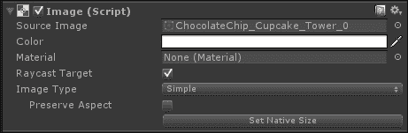
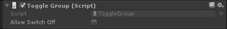

# 第三章. 与玩家沟通 - 用户界面

用户界面，通常简称为 UI，在游戏中扮演着至关重要的角色，因为它是与玩家交换信息的主要方式之一。通常，游戏提供有关游戏和玩家的信息，玩家通过 UI 进行输入与游戏互动。

本章将解释为什么 UI 在游戏中扮演如此重要的角色，以及我们在设计和/或实现 UI 时需要考虑的不同事项。当然，本章将专注于 Unity 框架来构建 UI，并解释如何使用它。

在本章的最后部分，我们将从实际的角度出发，通过在我们的游戏 UI 中实现两个重要的游戏元素来了解如何开始 UI 编程。然而，我们将在第五章“The Secret Ingredient Is a Dash of Physics”中看到更多关于 UI 编程的内容，我们将对游戏进行润色，并基于前几章构建的元素实现整个游戏玩法。

最后，你绝对应该考虑购买一本专门关于 UI 的书籍。在撰写这本书之前，我写了一本名为《Unity UI 食谱》的书，由 Packt 出版。它提供了一套现成的完美食谱。在那里，你可以找到这里提到的所有概念以及更多内容，例如不同的技巧和窍门。你可以在[`www.packtpub.com/game-development/unity-ui-cookbook`](https://www.packtpub.com/game-development/unity-ui-cookbook)找到它。

因此，在本章中，我们将学习如何设计和在 Unity 中实现 UI：

+   设计用户界面

+   通过详细查看每个组件来理解 Unity 框架以构建 UI

+   操作和放置 UI 元素

+   为我们的塔防游戏设计 UI

+   在我们的游戏中实现一个生命值条

+   在我们的游戏中实现一个糖量计

就像本书的所有其他章节一样，你将在结尾找到“作业”部分。它包含一系列不同的练习，以提高你的技能并将各种不同的功能实现到你的游戏中。所以，让我们准备好学习很多关于 UI 的知识。

# 准备工作

我们将使用上一章相同包中的图形来构建我们的 UI。因此，请确保已将其导入，并将图像作为精灵导入，以便在 UI 中使用。

# 设计用户界面

当你阅读一本书时，文本或图像通常位于页面中央，页码通常位于角落，并且页面是连续编号的。整个过程相当直接且无烦恼。玩家期望获得相同体验，不仅是在游戏玩法上，还包括其他屏幕元素，如用户界面（UI）。设计 UI 需要考虑许多因素。例如，你正在为的平台有局限性，比如屏幕尺寸，以及它能支持哪些类型的交互（是否使用触摸或鼠标指针？）。但界面可能给玩家带来的生理反应也需要考虑，因为玩家将是最终消费者。实际上，还有另一件事需要记住，有些人用母语从右到左阅读，UI 也应该反映这一点。

另一件事需要记住的是，如果你为多个设备设计，尽量保持相同的体验。随着许多应用成为多平台，你不想用户在手机上习惯了某种体验，然后登录到电脑版本，却发现完全不同。因此，在设计 UI 时，确定它在每个设备上的外观。是否在手机上主图标太小，以至于无法理解它是什么？是否导航菜单在桌面版本中太大？确保 UI 优化将确保使用你应用的多设备用户能够无缝过渡，无需再次尝试弄清楚如何访问功能。

就像我们的书籍示例一样，玩家或应用用户习惯于某些约定和格式。例如，房屋图标通常表示主页或主屏幕，电子邮件图标通常表示联系，而指向右方的箭头通常表示将继续到列表中的下一项，或下一个问题，等等。因此，为了提高易用性和导航性，最好坚持这些或至少在设计过程中牢记这些。除此之外，用户如何导航应用也很重要。如果从主页到某个选项只有一种方式，而且需要通过一大堆屏幕，整个体验将会很累人。因此，务必尽早创建导航图，以确定体验各部分的路线。如果一个用户必须通过六个屏幕才能到达某个页面，那么他们不太可能长时间这样做。

响亮的声音可以立即吸引人们的注意。UI 元素也是如此。因此，你想要使更重要的元素成为焦点。关键是要有更少的元素，如果不是只有一个元素，以减少玩家感到不知所措。例如，在游戏中，你可能希望生命条是主要关注的对象。因此，把它放在一个容易被注意到的地方，而不是在玩家的视野角落里。实现这一目标的一种方法是将 UI 元素与环境形成对比，理想情况下是在同一色系内，这样它们就会突出，但不会引起太多的注意而分散玩家的注意力。

一个创建出色配色方案的优秀网站是 Adobe Color ([`color.adobe.com/`](https://color.adobe.com/))。以下截图展示了它的一个例子：


在说所有这些的时候，不要让设计超过用户体验的实用性。例如，你可能有一个漂亮的用户界面，但它确实使得玩游戏变得非常困难，或者它造成了太多的困惑。尤其是在快节奏的游戏过程中，你不想让玩家不得不筛选二十个不同的屏幕元素来找到他们想要的东西。你希望关卡掌握集中在游戏玩法上，而不是理解用户界面。限制任何时刻存在的 UI 元素数量的另一种方法是有滑动窗口或弹出窗口，其中包含其他 UI 元素。例如，如果你的玩家可以选择解锁许多不同类型的技能，但在游戏过程中任何时刻只能使用其中的一到两个，那么显示所有这些技能是没有意义的。因此，有一个 UI 元素供他们点击，然后显示所有其他技能，他们可以用来替换现有的技能，这是最小化 UI 设计的一种方法。当然，你不想有多个弹出窗口，否则改变游戏中的设置本身就成了一个任务。

用户界面可以提供的一种东西是反馈。反馈不一定是显示在屏幕中央的弹出窗口；它可能只是像仪表增加/减少那样简单，例如健康条，或者玩家的头像随时间变化；例如，随着玩家在游戏中的进展，他们开始变老。关于添加反馈的下一件事是如何让玩家意识到用户界面的变化。在某些情况下，并不一定是要提醒玩家，它只是过程的一个自然部分；在另一些情况下，他们需要知道已经发生或正在发生的变化。向玩家指示变化的一种方式是动画化相关的用户界面元素。这可以像发光效果一样简单；例如，每次玩家被攻击时，他们的健康条都会随着减少而发光或脉动。另一种选择是用声音来指示用户界面中的变化；例如，每次玩家的货币增加时，都会播放一个柔和的铃声。音频可以和动画一样有效，但也要记住，基于音频的反馈并不总是会被听到。例如，有时，如果玩家在公共场所且没有耳机，他们可能会选择禁用声音，所以如果您将声音作为唯一指示玩家用户界面变化的方式，请记住这一点。除了反馈类型之外，每个动作都需要有反应，如果玩家做了他们不应该做的事情，他们需要被告知。所以每次玩家提供输入、点击按钮或与用户界面交互时，都应该发生一些事情。它有多突出取决于您；只需确保它清晰且不过分即可。

本节为您介绍了设计良好用户界面背后的问题。有许多其他因素需要考虑，以至于专门关于用户界面的书籍都已被撰写。例如，其中之一就是本地化，这是一个如此庞大的概念，以至于需要整整一章来描述它（您可以在第八章中找到关于本地化的简要介绍，“蛋糕之外是什么？”）。

然而，在继续之前，我想指出一个关于用户界面的技术术语，因为它也出现在 Unity 的官方文档中。有些用户界面并不是固定在屏幕上的，而是在游戏环境中有一个实际的空间。一些设计师将这些用户界面称为“diegetic”，与传统的“non-diegetic”界面相对。这是一个从其他学科借用的术语，因此并不是所有关于用户界面的说法都被普遍接受。事实上，它甚至可能引起一些混淆。为了给您提供更多历史背景，这个术语来源于单词“diegesis”。我们可以在 Merriam-Webster 词典中看到它的定义：

> “由叙述者讲述的故事，叙述者总结情节事件并对角色的对话、思想等进行评论。”

一个叙事界面或简化地说，放置在游戏世界中的 UI 的例子是游戏《死亡空间》（Visceral Games，前 EA Redwood Shores）中的小地图，我们可以在下面的屏幕截图中看到：


# 编程用户界面

如前文所述，设计用户界面可能是一项艰巨的任务，需要经验才能掌握，尤其是当你考虑到所有应该考虑的元素时，例如受众的心理。然而，这仅仅是开始的一半。实际上，设计是一回事，让它有效运行则是另一回事。通常，在大团队中，有艺术家负责设计 UI，而程序员则负责实现它。

UI 编程真的有那么不同吗？答案是：不，编程还是编程；然而，它是编程领域中的一个相当有趣的分支。如果你是从零开始构建你的游戏引擎，实现一个处理输入的整个系统并不是几个小时就能完成的。捕捉玩家在游戏和 UI 中进行的所有事件并不容易实现，需要大量的实践。幸运的是，在 Unity 的背景下，大多数 UI 的后端工作已经完成。此外，正如我们将在下一节中看到的，Unity 提供了一个稳固的框架，用于处理 UI 的前端工作。这个框架包括不同的组件，可以很容易地使用，无需了解任何编程知识。但如果我们真的对解锁 Unity 框架在 UI 方面的潜力感兴趣，我们不仅需要理解它，还需要在其中进行编程。

即使有一个稳固的框架，比如 Unity 中的那个，UI 编程仍然需要考虑许多因素，足以在大型团队中为这个角色设定一个特定的位置。精确地实现设计师的意图，同时尽可能不牺牲性能，是 UI 程序员（至少在使用 Unity 时）的主要工作。

掌握这些技能需要时间和耐心，而本章只是对这个领域的入门介绍。希望你会喜欢阅读这一章。

# 用户界面系统

现在我们已经对如何设计 UI 有了基本的了解，是时候学习 Unity 如何处理所有这些内容了。从 Unity 4.6 版本开始，可以使用一个专门的 UI 系统，称为 UI。本节的目标是理解它是如何工作的。

### 注意

值得注意的是，在版本 4.6 之前，Unity 使用了一个名为 GUI 的旧系统。最近，Unity 开发者并没有完全摒弃这个系统，而是稍作修改并将其更名为**IMGUI**，即**Immediate Mode GUI**。正如我们可以在官方文档中看到的那样，它并不打算用于游戏，而是供程序员快速调试使用。此外，它还用于在通过脚本扩展 Unity 时创建窗口或自定义检查器，这是一个肯定超出了本书介绍范围的话题。然而，如果你对了解更多内容感兴趣，我邀请你阅读官方文档：[`docs.unity3d.com/Manual/ExtendingTheEditor.html`](https://docs.unity3d.com/Manual/ExtendingTheEditor.html)。同时，也可以观看这个视频教程：[`unity3d.com/learn/tutorials/topics/interface-essentials/building-custom-inspector?playlist=17090`](https://unity3d.com/learn/tutorials/topics/interface-essentials/building-custom-inspector?playlist=17090)。

然而，你可能觉得这一部分有点像百科全书。实际上，你可以将这一部分作为所需 UI 元素的快速参考。因此，如果你已经对 Unity UI 有一定的了解，可以自由地跳过其中的一部分。

此外，这一部分的结构是这样的，基本内容在开头，然后逐渐处理更复杂的话题，直到超出本书的范围。实际上，当你达到这个水平，真正的问题只是微调或实现一个非常具体的效果时，这一部分将给你一个如何工作的总体概念，以便从那里进一步扩展你的知识，特别是通过官方文档。

## 画布

如果你想知道什么是画布，让我们先从一些背景信息开始。根据 Merriam-Webster 词典，画布被认为是以下内容：

> *"一种紧密编织的布料，通常由亚麻、大麻或棉花制成，用于服装，以前常用于帐篷和帆布。"*

但可能最接近 Unity 所定义的画布定义是这样的，同样来自 Merriam-Webster 词典：

> *"一块背面或框架作为绘画表面的布料；也指这样的表面上的绘画。"*

在计算机图形学中，画布的含义略有不同，我们可以在维基百科上看到其定义：

> *"在计算机科学和可视化中，画布是一个容器，包含各种绘图元素（线条、形状、文本、包含其他元素的框架等）。它得名于视觉艺术中使用的画布。有时也称为场景图，因为它安排用户界面或图形场景的逻辑表示。某些实现还定义了空间表示，并允许用户通过图形用户界面与元素交互。"*

在 Unity 中，画布是 UI 系统的一个重要组件。由于 UI 在 Unity 中内部渲染的方式与场景中的其他部分不同，我们需要指定场景中哪些元素属于 UI。特别是，所有 UI 元素都应该是一个带有画布组件的游戏对象的子元素。我们可以通过在**层次结构**面板上右键单击并导航到**UI | 画布**来创建一个画布。

因此，在我们的场景中将会创建两个对象，如下面的截图所示：


然而，现在让我们只关注画布，将**事件系统**留到以后再讨论。

### 注意

创建一个新的 UI 元素，例如一个图像，可以通过在**层次结构**上右键单击然后选择**UI** | **图像**来实现，如果场景中还没有**画布**，则会自动创建一个画布（以及一个事件系统）。这个 UI 元素被创建为该画布的子元素。

场景中的画布以白色矩形的形式呈现。这有助于我们在不切换到游戏视图的情况下编辑 UI。

如果**场景**视图未设置为 2D，例如我们在 3D 游戏中工作，画布将出现扭曲，如下所示：


由于 UI 将以正交方式渲染，处理 UI 的一个经验法则是将场景视图切换到 2D（如我们在第一章中学习的），如下所示：


如果我们选择画布，我们应该能在**检查器**中看到以下内容：


主要设置是**渲染模式**，它允许我们指定我们打算如何使用我们的 UI。让我们更仔细地看看这些选项。

### 屏幕空间 - 覆盖

这种渲染模式是最常用的。实际上，它通过在场景上渲染 UI 元素来将 UI 元素放置在屏幕上，就像许多游戏一样。这意味着 UI 元素被完美地正交渲染。

此外，如果屏幕分辨率改变或被调整大小，画布也会改变大小以自动适应新的比例。

### 屏幕空间 - 相机

相反，这种渲染模式与一个特定的相机相关联，UI 将渲染在这个相机之上。这意味着画布被放置在所选相机前方的一个给定距离处。因此，UI 元素将受到所有相机参数和效果的影响。这包括如果**相机**设置为**透视**时的透视失真，这是由**相机视野**参数控制的。

与之前一样，画布的大小可能会根据屏幕分辨率和相机视锥体进行调整。

如果你想知道相机视锥体是什么，请继续阅读这个信息框。当你选择一个相机时，你会看到一个截顶的棱锥体（如果相机处于透视模式，否则它具有平行六面体的形状），就像下面截图中的那样：


这就是相机视锥体，其中所有内容都将由相机渲染。离相机较近的平面称为**近裁剪面**，而较远的称为**远裁剪面**。理解透视相机为什么有这种形状并不难，但这超出了本书的范围。然而，在文档中，你可以找到两个有趣的页面，讨论了这一点。它们很容易理解，为了你的方便，这里提供了链接：[`docs.unity3d.com/Manual/UnderstandingFrustum.html`](https://docs.unity3d.com/Manual/UnderstandingFrustum.html) 和 [`docs.unity3d.com/Manual/FrustumSizeAtDistance.html`](https://docs.unity3d.com/Manual/FrustumSizeAtDistance.html)。

### 世界空间

这种渲染模式将使画布表现得像场景中的任何其他游戏对象。这意味着画布在世界上有一个精确的位置（因此得名，因为它放置在世界空间中）。因此，UI 可能会被场景中的其他对象遮挡。其尺寸是通过 Rect Transform 组件手动设置的（见下文的一些段落）。这种模式对于打算成为世界一部分的 UI 很有用。正如我们之前讨论的，这也被称为**叙事界面**。

## UI 元素的绘制顺序

正如我们将在下一段落中看到的，UI 元素将是屏幕上渲染的图像或文本。然而，当两个这些组件重叠时会发生什么？有一个顺序，所以画布中的 UI 元素将以它们在层次结构中出现的顺序绘制。这意味着第一个子元素首先绘制，然后是第二个子元素，依此类推。因此，当两个 UI 元素重叠时，在层次结构中较晚的那个将出现在较早的那个之上。

要改变哪个元素显示在其他元素之上，只需通过拖动它们在**层次结构**中重新排序元素即可。

为了更好地理解这一点，请看下面的截图，它代表了两种不同情况下的两个图像。为了你的方便，相应的**层次结构**面板被叠加在图像旁边。


柠檬纸杯蛋糕被渲染在巧克力纸杯蛋糕之上，因为柠檬纸杯蛋糕是画布的最后一个子元素

顺序也可以通过在变换组件上使用这些方法从脚本中控制：

+   **SetAsFirstSibling()**: 将游戏对象放置为其父对象的第一个子元素。因此，它将首先渲染（相对于其兄弟），因此将被发送到后面（所有其他 UI 元素都将位于其上方）。

+   **SetAsLastSibling()**：将游戏对象放置为其父对象的最后一个子对象。因此，它将在渲染时最后（相对于其兄弟），因此被带到前面（所有其他 UI 元素都将位于其后）。

+   **SetSiblingIndex()**：将游戏对象放置到特定索引，允许决定该游戏对象将在渲染层次结构中的哪个位置。

## 视觉组件

Unity UI 自带不同的预置组件来构建我们的 UI。最常用的组件是视觉组件，它允许在屏幕上渲染自定义内容。

### 图像组件

图像组件，正如其名所示，允许我们在屏幕上渲染图像。实际上，我们需要指定一个**源图像**，这是我们想要渲染的图像。以下截图是一个例子：



### 注意

至于精灵，我们打算在项目中用于 UI 的图像资源必须设置为精灵（2D 和 UI），正如第一章 *Unity 中的平面世界* 所解释的。

然后，我们可以调整颜色，这是精灵的乘数，以及如果我们需要的话，分配一个材质。

一旦设置了**源图像**，我们可以通过选择**图像类型**来定义精灵的外观。选项如下：

+   **简单**：只是均匀地缩放图像或精灵。

+   **切片**：如果精灵已经被 9 切片（正如第一章 *Unity 中的平面世界* 所解释），图像的九个不同部分将被不同地缩放。

+   **平铺**：这与上一个类似，但 9 宫格的中心部分是平铺而不是拉伸。

+   **填充**：这与简单类似，但允许我们显示图像的一部分，就像它被填充一样。这由填充的起点、方法和数量等参数控制。我们将在本章后面使用这个功能，并会发现它对于创建视频游戏中的条形图非常有用：


### 注意

一些高级条形图，如《王国之心》风格的血量条，可以在之前提到的书中找到：*Unity UI CookBook*，*Packt publishing* 在第二章末尾的 *Implementing Counters and Health Bars*。

此外，当图像是**简单**或**填充**时，**设置原生大小**按钮可见。它只是恢复图像的原始大小。当你分配一个新的**源图像**时，这非常有用，你可以使用此按钮恢复原始比例，然后再将其缩放到适合 UI 的正确大小。

### 文本组件

文本组件，正如其名所示，允许我们在屏幕上渲染任何文本。有时，在某些书中，它被称为标签，因为它通常用于给其他 UI 组件添加标签。以下截图是一个例子：


它包含一个文本区域，可以使用矩形工具（见下一段）进行扩展。在组件中，你可以找到所有基本的**文本**转换，例如设置字体、字体样式和字体大小。此外，你可以启用或禁用富文本功能，默认情况下是启用的。

### 注意

如果你想知道什么是富文本功能，请继续阅读这个信息框。

富文本功能允许我们在文本中放置一些 HTML 标签，以仅更改文本的特定部分。用非技术术语来说，你可以改变单个单词的颜色或将其字体样式改为斜体。例如，你可以在**文本**区域中看到像*这本书真的很棒*这样的内容，但在文本组件中，它被写成`This book <b>is really</b> amazing`。

由于它们是 HTML 标签，它们必须放置在开始处，指定设置，并在你想要应用更改的文本部分的末尾。

这些是 Unity 支持的主要标签：

`<b>这些标签之间的文本将显示为粗体</b>`

`<i>这些标签之间的文本将显示为斜体</i>`

`<size=50>这些标签之间的文本大小将为 50，你可以将数字更改为任何数字</size>`

`<color= #rrggbbaa>这些标签之间的文本将使用开头指定的十六进制颜色进行着色</color>`

如果你不知道什么是十六进制颜色，它只是一个十六进制数值（因此，它还包含一些字母），代表一种颜色；你可以在维基百科页面这里了解更多：[`en.wikipedia.org/wiki/Web_colors`](https://en.wikipedia.org/wiki/Web_colors)。

然而，请记住，你不需要了解所有这些颜色背后的详细理论就可以使用这些颜色。实际上，有很多在线颜色选择器可以为你提供特定颜色的十六进制数值。然后，你只需将代码复制并粘贴到 Unity 中的文本中即可。此外，你不必一定使用十六进制代码来指定颜色，Unity 中还有一些预设。实际上，你只需使用`<color=red>word</color>`这样的代码来使单词变红，而不必指定整个十六进制代码。所有这些颜色快捷方式的列表可以通过点击此信息框末尾的链接找到。另外，你也可以从在线工具中选择十六进制颜色，例如：[`www.w3schools.com/colors/colors_picker.asp`](http://www.w3schools.com/colors/colors_picker.asp) 或 [`htmlcolorcodes.com`](http://htmlcolorcodes.com)。

有一些特殊的标签，如材质和四边形，它们有非常特定的用途。如果你想了解更多，请点击此信息框末尾的链接。

这些标签的另一个酷炫功能是你可以嵌套它们！这意味着你可以同时使用多个标签。例如，你可以有部分文本是蓝色、粗体和斜体的。然而，它们必须以相反的顺序关闭，否则它们将不起作用。

如果您想了解更多信息，请点击此链接：[`docs.unity3d.com/Manual/StyledText.html`](https://docs.unity3d.com/Manual/StyledText.html)。

此外，您还可以找到更改文本对齐方式以及垂直和水平溢出的选项，这意味着控制当文本大于文本区域时会发生什么。**最佳拟合**选项将文本缩放以适应文本区域的可用空间。

## 基本变换

我们已经看到了一些基本的 UI 元素，但我们如何放置和操作它们？在下一节中，我们将学习各种不同的实现变换的形式。

### 矩形工具

由于 UI 元素类似于精灵（两者都是 2D），快速操作它们最好的方式是使用矩形工具。

快速回顾，您可以在 Unity 编辑器的左上角找到矩形工具，它是右侧的最后一个，如下所示：


在我们的精灵或 UI 元素周围应该出现一个边框。因此，我们可以以下列方式对其进行转换：

+   如果我们在矩形内点击并拖动，我们可以移动对象，如下面的图片所示（为了学习目的，在图像组件中使用了一个美味的纸杯蛋糕）：


+   如果我们点击中间的蓝色点，即旋转点，我们可以改变其位置（在这本书中，我们不会改变任何旋转点，因为我们不需要这样做）：


+   如果我们点击并拖动一个边缘，我们可以沿该方向缩放，就像我们在这里看到的那样：


+   如果我们点击并拖动一个角，则可以沿两个方向自由缩放。此外，如果您在拖动时按住**Shift**键，则缩放将是均匀的，这意味着它将在两个轴上以相同的数量增加大小，同时保持对象的比率不变：


+   最后，如果我们把光标放在矩形外的角上，即矩形外面，会出现一个小旋转图标。通过点击并拖动它，可以绕旋转点旋转对象：


这就是关于矩形工具的所有内容。

### 矩形变换

Unity 处理精灵和 UI 元素的方式有很大的不同。实际上，精灵有通常的变换组件，用来表示位置、旋转和缩放。相反，UI 元素有一个矩形变换（2D 布局的对应物），它更复杂并存储更多信息。实际上，变换表示空间中的一个点，而矩形变换表示一个 UI 元素可以放置的矩形。以下截图显示了这一点：


### 小贴士

Unity 在每一帧结束时执行所有不同矩形变换位置的计算，以确保相对于帧的其余部分具有最新的值。因此，当您使用 `Start()` 函数时，矩形变换的这些值可能不正确。为了解决这个问题，您可以通过调用 `Canvas.ForceUpdateCanvases()` 函数强制更新画布。

此外，如果矩形变换的父元素也是一个矩形变换，子矩形变换也可以指定它相对于父矩形的定位和大小。这种层次结构使得矩形变换非常强大，尤其是在您需要为多个分辨率设计时。

除了缩放，矩形变换还可以调整大小。这些操作类似，但区别在于调整大小保持局部缩放不变，并改变高度和宽度。因此，字体大小、切片图像的边框等不会受到调整大小的影响，而在缩放的情况下则会受到影响。

与 2D 精灵类似，矩形变换通过 UI 元素的锚点应用缩放、旋转和调整大小。然而，您可以直接在场景视图中通过拖动它（小蓝色圆圈）在 UI 元素内直接更改它。

关于这个组件最重要的概念之一是锚点，它允许我们指定 UI 元素相对于画布及其父元素的关系。它们在场景视图中显示为四个小三角形手柄。与这些锚点相关的信息在检查器中的矩形变换组件中显示。

很遗憾，没有简单的方法可以解释锚点，除非看到它们在动态中的效果，比如在视频或动画 gif 中。由于这是一本书，它无法包含这样的动画媒体，这会立即向您阐明这个概念。因此，为了避免在复杂的锚点解释上浪费时间，这些解释可能并不完全理解，我邀请您访问官方文档，在这里的锚点部分：[`docs.unity3d.com/Manual/UIBasicLayout.html`](https://docs.unity3d.com/Manual/UIBasicLayout.html)。不用担心，您从网页回来时我还在这里。

如果您已经阅读了网页，除了看到动画 gif，您还看到了锚点预设，如下面的截图所示：


这些是快速正确锚定 UI 元素的快捷方式。当然，我邀请您在需要时手动更改游戏中此配置。

## 布局组件

在上一节中，我们看到了如何将 UI 元素放置在屏幕上。然而，有时，在满足一定标准的情况下自动将它们放置在屏幕上非常有用，尤其是在不知道 UI 元素的数量，并且运行时发生变化的情况下。这可以通过手动脚本实现，但 Unity 提供了一系列布局组件，有助于基本的布局定位。

自动布局系统由两种不同类型的元素组成：布局元素和布局控制器。为了理解前者，请注意，每个具有 Rect Transform 的游戏对象，以及最终的其他组件，都是一个布局元素。这些类型对它们应该有多大有一定的了解，但它们并不直接控制它。相反，布局控制器是控制一个或多个布局元素的大小和位置的组件。它们可以控制自己的布局元素或它们附加的游戏对象的子布局元素。

### 小贴士

布局控制器以难以恢复先前状态的方式更改 Rect Transform。因此，在添加布局控制器和/或修改之前，请确保处于播放模式，以便在不造成任何不希望的布局更改的情况下进行更改。一旦您对更改满意，停止播放模式，并插入您找到的适合您需求的值。

布局控制器分为适配器和布局组。

### Fitters

Fitters 只控制其自身布局元素的大小。在调整 UI 元素大小时，请记住，这是围绕我们之前讨论的枢轴点发生的。因此，您也可以使用它来对齐 UI 元素。例如，如果枢轴点位于中心，则元素将在所有方向上均匀缩放，而如果它放置在角落，例如左上角，则元素将向右下方缩放。所有其他位置都会在元素缩放的四条方向上给出不同的权重。

说到这里，让我们来看看 Fitters 控制器：

+   **内容大小适配器**：控制其自身布局元素的大小。大小由游戏对象上的布局元素组件提供的最小大小或首选大小确定。这样的布局元素可以是图像或文本组件、布局组或布局元素组件：


+   **宽高比适配器**：可以调整高度以适应宽度或反之亦然，或者它可以使元素适应其父元素或包围其父元素。宽高比适配器不考虑布局信息，例如最小大小和首选大小：


### 布局组

相反，布局组控制其子元素的布局元素，而不是它们自己的。它们用于有序地放置 UI 元素。它们有不同的选项来控制子元素之间的间距，并定义首选的高度和/或宽度。其他选项包括强制子元素扩展以适应可用空间的可能性，或者决定当它们大于可用空间时会发生什么。它们如下所示：

+   **垂直布局组**：允许我们将子元素沿着垂直轴堆叠，并将它们堆叠在一起：


+   **水平布局组**：允许我们将子元素沿着水平轴堆叠，并将它们并排放置：


+   **网格布局组**：这允许我们将子元素在网格中堆叠，垂直和水平都可以：


### 布局元素组件

还有一个组件，即 **布局元素** 组件。正如其名所示，它不是一个控制器，而是允许我们从 Rect Transform 中更改布局元素设置。实际上，当放置在布局元素上时，它允许我们覆盖设置，例如最小值、首选值和弹性，对于高度和宽度都是如此。此外，它有一个标志来忽略控制器。所以，想象一下在网格布局组件内部有一个标签，你不想让标签与其他所有元素一起堆叠在网格中，而是放在顶部，定义网格的内容。在这种情况下，忽略控制器对于将标签放置在网格外部，同时仍然是网格的子元素非常有用，这样就可以作为一个独特的块移动它，而无需每次都替换标签。

这就是该组件的外观：


## 交互组件

Unity UI 比视觉组件部分提供了更强大的预制组件。实际上，有许多用户可以与之交互的组件。这些交互可以是鼠标或触摸/点击事件，也可以是键盘或控制器事件。

然而，这些组件本身是不可见的，并且必须与一个或多个视觉组件结合使用才能正确工作。

### 可选择基类

在了解单个交互组件的工作方式之前，我们需要了解一些所有这些组件共有的基本设置。特别是，这些设置来自 Selectable 基类，它具有过渡和导航选项。

#### 交互选项

这只是一个标志，用于确定交互组件是否启用交互。当勾选时，交互组件将处于 **禁用** 状态（见下一节）。

#### 过渡选项

通常，交互组件需要向玩家发送一些反馈，以便他们可以理解动作是否已执行。

在这个 Unity 实现中，交互组件可能有四种状态。它们如下：

+   **Normal**: 交互组件未被触摸

+   **Highlighted**: 当指针在交互组件上，但尚未执行点击（或触摸屏上的触摸/轻触）时

+   **Pressed**: 当点击（或触摸/轻触）发生在交互组件上时

+   **Disable**: 当交互组件不可交互时

这些过渡和这些状态的规定可以通过四种不同的方式发生：

+   **None**: 交互组件不会改变状态。当我们需要以自定义方式实现与组件的交互时，这非常有用：


+   **Color Tint**: 此选项默认选中，并为前面的每个状态定义了一种颜色色调。此外，它包含一个**淡入淡出持续时间**来调节组件从一种颜色变为另一种颜色的速度，以及一个**颜色乘数**。因此，交互组件将为每个状态平滑地改变颜色：


+   **Sprite Swap**: 通常，交互组件还附有一个图像组件，它定义了基本图形。在此过渡模式中，不是改变颜色，而是每个状态都有一个不同的 Sprite。当您为每个状态都有自定义图形时，这非常有用：


+   **Animation**: 这是最高效的过渡模式，因为它允许您为每个状态自定义动画（我们将在接下来的章节中更多地讨论动画）：


#### 导航选项

导航选项决定了玩家在游戏模式期间如何导航 UI 元素。以下是可用的不同选项：

+   **None**: 无键盘导航。这在您想在游戏中实现自己的导航系统时非常有用。此外，在此模式下设置的交互组件不会因点击（或轻触）而获得焦点。

+   **Horizontal**: 水平导航。

+   **Vertical**: 垂直导航。

+   **Automatic**: Unity 将尝试根据 UI 元素的位置猜测正确的导航。

+   **Explicit**: 在此模式下，您可以指定每个箭头键要选择的下一个 UI 元素。这允许精细的导航控制：


此外，**可视化**按钮允许在**场景视图**中可视化导航方案。以下截图展示了这种可视化的一个例子：


### 按钮图

这是任何游戏中都可以找到的经典交互组件。它只包含一个事件，`OnClick()`，当按钮被点击/轻触时触发。当然，您可以将任何动作链接到事件。以下截图是一个示例：


### 注意

请记住，如果指针在点击/轻触释放之前移离按钮，则动作不会执行。您可以在*作业*部分找到一个关于这个的练习。

### 切换和切换组

切换组件允许玩家关闭或打开一个选项。以下截图是一个示例：


如按钮一样，切换有一个单一的事件`OnValueChanged()`，每次切换改变其状态时都会调用；新状态值作为事件数据中的布尔参数传递（见下一段）。此组件与另一个称为切换组的组件配合良好，该组件控制是否只有一个选项在切换组中被打开，如下面的截图所示：



您可以通过将其添加到所有希望加入组的切换的**组**属性中，来设置一个切换组。例如，这对于互斥选择非常有用，如角色或职业选择。其他常见用途是调整游戏设置，如游戏速度、难度或配色方案。当然，您可以在场景中同时使用多个切换组；然而，一个切换只能属于一个组。

### 滑块

如其名所示，滑块是一个带有手柄的条，手柄可以从条的开始处滑动，即被认为是**最小值**，到条尾，即被认为是**最大值**。条中间的所有值都与手柄在条上的位置成比例。默认情况下，手柄从左到右增加其值，但通过调整**方向**属性，可以改变其他方向，不仅可以从右到左，还可以沿垂直轴。以下截图是一个示例：


滑块有一个单一的事件，`OnValueChanged()`，当滑块的手柄被拖动时触发，并将滑块的新值作为浮点数传递给触发动作。

### 滚动条

这个组件与滑块非常相似，因为它在一条条上有一个手柄，最小值始终是 0.0，最大值是 1.0。所有介于两者之间的值代表手柄将所在的不同百分比。同样，滚动条可以通过调整**方向**属性来定位。以下截图是一个示例：


与滑块的区别在于，根据某些内容（如文本区域）可以拉伸滚动条的把手。当文本增加时，把手会变小，以便在更多内容之间滑动，这代表了可滚动的量。另一方面，当内容不大时，把手会增加其尺寸以完全填充条形，不允许滚动。

滚动条有一个单独的事件，称为`OnValueChanged()`，它的工作方式与滑块上的同名列事件完全相同。

### 下拉菜单

**下拉菜单**是 Unity UI 中相对较新的组件，因为它自 Unity 5.2 以来就已经发布/实现了。这个组件允许玩家从一系列选项中选择。组件只显示当前选中的选项，当玩家点击/轻触它时，完整的列表出现。一旦从列表中选择了另一个项目，列表就会关闭，新项目被选中。此外，如果玩家在其他组件外部点击，他或她可以关闭列表而不更改项目。以下截图是一个例子：


使用检查器中的下拉菜单非常直观，即使你需要熟悉层次结构中的模板才能改变其外观。不幸的是，我们没有时间详细说明这个组件的工作原理，但我相信通过访问官方文档你可以轻松理解它：[`docs.unity3d.com/Manual/script-Dropdown.html`](https://docs.unity3d.com/Manual/script-Dropdown.html)。

无论如何，我们不会在我们的游戏中使用这个组件，但在*作业*部分，你可以挑战自己更好地理解这个组件。

### 输入字段

**输入字段**组件允许玩家在游戏中输入文本，具体来说是在文本区域内。当然，你需要与文本组件或其他视觉元素一起使用它。以下截图是一个例子：


### 注意

**输入字段**也可以添加到已经存在的**文本**组件中，使其可编辑。为此，在**层次结构**面板中选择**文本**组件，然后在**检查器**中导航到**添加组件** | **UI** | **输入字段**。然后，将**文本**组件（游戏对象本身也可以）拖放到**输入字段**的**文本**组件变量中。此外，你可能还想添加一个占位符。因此，我建议你创建一个**输入字段**并研究它与其原始结构一起如何工作，然后添加现有的文本区域。

当玩家在输入时，**文本**组件的**文本**属性将改变，并且可以从脚本中检索。

此外，**输入字段**有不同的选项来定义允许的字符类型，是否应该被屏蔽（例如，如果是一个密码或 PIN），是否有数量限制，或者是否允许多行编辑。你可以在官方文档中了解更多关于这些附加功能的信息：[`docs.unity3d.com/Manual/script-InputField.html`](https://docs.unity3d.com/Manual/script-InputField.html)。

**输入字段**组件有两个事件：`OnValueChanged()`，每次玩家输入时都会触发，以及`OnEndEdit()`，只有当玩家停止输入时才会触发。在这两种情况下，整个**文本**组件中的文本都会通过字符串参数传递给动作函数。

请记住，**富文本**默认是关闭的。你可以启用它，但对于**输入字段**来说，它并不很好地支持，因为文本中的导航包括标记，而视觉上没有。因此，对于将要输入的人来说，这真的很令人困惑。通常，你不需要**富文本**功能来编辑文本；因此，作为一个经验法则，只需保持**富文本**关闭。

### Scroll Rect

当你的内容比它应该占据的区域大时，这个组件会被使用。Scroll Rect 允许我们在一个矩形内使内容可滚动，并在相对较小的区域内显示所有内容。通常，这个组件会与**遮罩**组件一起使用；这样，矩形外的所有内容都将不可见，你将实现一个滚动视图。以下截图是一个示例：


此外，你可以分配滚动条（水平和垂直轴上的滚动条）以轻松滚动内容。你可以在组件中找到更多可调整的选项，如果你真的想了解它们，我邀请你查阅官方文档：[`docs.unity3d.com/Manual/script-ScrollRect.html`](https://docs.unity3d.com/Manual/script-ScrollRect.html)。

最后，Scroll Rect 只有一个事件，`OnValueChanged()`，当 Scroll Rect 的位置改变时触发，这表示玩家已经滚动。

## 更多关于 UI 渲染的信息

我们已经看到了很多关于 UI 的内容，但这并不是全部。本节介绍了 Unity UI 中的一些相对高级主题。你可以自由地跳过这一节，或者在不集中注意力的情况下阅读，以便完全理解所写的内容，你总是可以稍后回来。

### 画布渲染器

仔细的读者已经注意到，在所有 UI 元素中，总是附有一个 Canvas Renderer，如下面的截图所示：


这个组件为什么不允许我们更改任何选项呢？它允许 Unity 知道特定的 UI 元素应该在 Canvas 中渲染。在非常特殊的情况下，当 UI 元素是从头开始构建时，我们需要手动添加这个组件。然而，如果您不打算从头开始构建自定义 UI 元素，只是使用 Unity 提供的那些（这些足以构建非常复杂的 UI），您可以忽略这个组件。实际上，每次我们创建一个 UI 元素时，它都会自动创建。

即使**Canvas Renderer**在检查器中没有选项，它也有一些可以通过脚本访问的属性。对于这些函数和变量，您可以在以下位置找到详细信息：[`docs.unity3d.com/ScriptReference/CanvasRenderer.html`](https://docs.unity3d.com/ScriptReference/CanvasRenderer.html)。

### 更多视觉组件

我们已经分析了主要视觉组件；然而，还有更多视觉组件，它们在特殊情况下很少使用：


最常见的是**遮罩**组件。它与**Scroll Rect**一起用于创建滚动视图。它强制子元素具有父元素的形状。然而，它不支持 alpha 通道。这意味着子元素的一部分将是可见的或不可见的，而无需在遮罩中指定任何类型的透明度。

### 注意

如果您想知道为什么不支持 alpha 通道，我们需要提及 Unity 下面遮罩的实现。

当您使用 GPU 编程时，您被限制只能使用某些缓冲区来渲染事物。现代 GPU 有一个名为 Stencil Buffer 的缓冲区，它与**Color Buffer**和**Depth Buffer**一起使用，它只能假设整数值并在像素级别上工作。通常，它用于避免渲染屏幕的某些部分，并提高整体性能，Unity 也是如此。这种高级使用可能包括根据深度缓冲区动态更改它。然而，Unity 只是使用这个缓冲区来不渲染遮罩未覆盖的屏幕部分，特别是将值 1 分配给应该渲染的像素。

此外，Unity 允许嵌套遮罩，特别是使用 AND（`&`）操作符对它们进行操作。结果，只有当像素位于所有嵌套遮罩内时，像素才会被渲染。您可以通过将不同的纸张遮罩重叠到绘图上来轻松想象这一点，只有当所有纸张遮罩重叠的部分才是可见的。

最近，Unity 还引入了另一种类型的遮罩，**Rect Mask 2D**：


与之前的遮罩组件相比，它有一些限制，例如它仅在 2D 环境和共面元素（非共面仍然可能，但组件可能无法按预期工作）。然而，这种方法带来了一些优点，例如不需要使用模板缓冲区（参见前面的信息框），从而带来性能提升，因为没有额外的绘制调用。


另一个非常特殊的视觉组件是**原始图像**。它在某些方面与**图像**组件有限制，但也有一些其他功能。实际上，**原始图像**没有动画图像的选项。然而，它直接与字节工作，正如其名称所暗示的。因此，它不仅能够显示图像作为精灵，还能显示纹理。为了理解这有什么用，想象一下纹理只是一个字节数组，并且它们可以在运行时更改。这意味着你可以在运行时从 URL 下载纹理，并在**原始图像**中显示它。其他用途可能包括使用**渲染纹理**（从 Unity 5.x 开始，它们也适用于个人版，而不仅仅是专业版），并流式传输游戏世界中另一个相机所看到的画面。这可能被用来快速创建游戏中的小地图。你可以在本章开头建议的*Unity UI 食谱*的最后一章中找到此过程的详细描述。关于原始图像还有一点：它们有一个**UV 矩形**选项。这意味着你可以按需缩放和缩放图像/纹理，而不会改变纹理本身。

### UI 效果组件

除了视觉组件和交互组件之外，Unity 还有一类特殊的组件，称为效果组件。在一些书籍和文档中，你可能将它们视为视觉组件的子类。

这些组件如下：

+   **阴影**：这允许我们为图像或文本组件添加阴影效果。它必须附加到文本或图像组件相同的游戏对象上。其选项改变阴影的距离和颜色。此外，在图像的情况下，一个布尔值控制创建阴影的组件是否也应该使用图像的 alpha 通道：


+   **轮廓**：这与阴影组件的工作方式类似，但不是添加阴影，而是添加轮廓。控制选项与阴影组件相同：


+   **作为 UV1 的位置**：当这个选项在图像组件上时，Unity 会将画布位置传递到第一个 UV 通道。这意味着如果你有一个自定义着色器，你可以使用这个功能来创建折射或 UV 偏移采样。

### UI 和灯光

除了我们已经发现的关于 UI 的所有内容之外，您还可以在 UI 上使用灯光。它们用于使 UI 感觉更真实，尤其是在 UI 放置在 3D 世界中，或者当它具有某种透视效果时。然而，请记住，添加灯光可能会降低性能。

如果 UI 在 3D 世界中，你可能希望它受到世界光线的影响，但如果它有透视效果，比如画布的 **Screen Space - Camera** 的情况，你可能只想让它受到某些光线的影响。因此，你需要创建一些图层来过滤哪些光线会影响 UI。

然而，将灯光放置在场景中以使 UI 组件受到光照影响并不那么简单，因为您需要一个对光照有响应的材料。在这种情况下，Unity 为 UI 提供了特定的着色器。无论如何，这超出了本书的范围，因为它更多地涉及 3D 游戏开发，而不是 2D。但如果您想了解更多，在 *Unity UI 烹饪书* 的 *第二章*，*为菜单创建面板* 中，您会找到一个处理 UI 中灯光的食谱。这是在 UI 中玩灯光的好起点。

### 画布组件

在本章的开头，我们讨论了画布及其主要属性 **渲染模式**。然而，如果我们查看检查器中的画布，我们可以看到它实际上有三个不同的组件，通常它们一起使用来创建一个画布。为了您的方便，以下截图显示了它们在检查器中的样子：


让我们简要看看它们的职能：

+   **画布**：这是主要组件，它实际上创建画布，因此 Unity 知道其中的一切都应该作为 UI 渲染。

+   **画布缩放器**：这个组件控制画布内 UI 元素的整体缩放和像素密度。这种缩放会影响画布上的所有内容，包括字体大小和图像边框。更多详细信息请参阅官方文档：[`docs.unity3d.com/Manual/script-CanvasScaler.html`](https://docs.unity3d.com/Manual/script-CanvasScaler.html)。

+   **图形射线投射器**：这个组件属于事件系统，允许我们根据图形检测鼠标或触摸事件。有关此组件的更多信息，您可以查看官方文档：[`docs.unity3d.com/Manual/script-GraphicRaycaster.html`](https://docs.unity3d.com/Manual/script-GraphicRaycaster.html)。

如果您将要面对这个话题，我建议您研究 Unity 提供的整个事件系统框架（参见下一节）。

### 画布组

除了我们已经看到的 UI 组件之外，还有一个叫做 **Canvas Group** 的组件。它允许我们在画布内定义一个组，或者如果你更喜欢，是 UI 元素的子集。这就是在检查器中的样子：


此外，它还提供了一些通用的功能，可以应用于属于该组的所有元素。这些可能包括 alpha，例如，如果您想平滑地使界面的一部分出现或消失，或者如果它是可交互的（或禁用的）。

**Canvas Group**的另一个常见用途是在 UI 的某些区域不阻止鼠标事件，这意味着玩家可以点击一个位于**Canvas Group**下的按钮，该**Canvas Group**的**Blocks Raycast**属性设置为 false。

## 事件系统

正如我们在*Canvas*部分所指出的，每次我们在新场景中创建 Canvas 时，也会创建一个事件系统。实际上，游戏对象包含一系列组件，允许我们在游戏的各个部分之间交换消息。在 UI 的情况下，交换的消息是用户的输入和 UI 本身。没有这个事件系统，交互组件将无法工作。这就是事件系统在**检查器**中的样子：


如您所见，它被分为模块（这可能会根据您的游戏针对的平台而有所不同；有关更多信息，请参阅第六章，“在糖果雨中穿梭——人工智能导航”）。这里公开的基本功能允许您定义哪些是主要的交互按钮/事件（在独立游戏的情况下）。

然而，就我们的目的而言，我们不需要深入了解事件系统的工作原理，如何更改其设置，或者如何设置自定义消息。为此，我建议您在此处阅读官方文档：[`docs.unity3d.com/Manual/EventSystem.html`](https://docs.unity3d.com/Manual/EventSystem.html)。

就我们而言，我们只保留默认设置，每次我们在脚本中使用事件系统时，我们只会使用其基本功能，这些功能将在我们遇到它们时进行解释。

如此一来，我们已经了解了关于 UI 的很多内容，尤其是如果您是一口气阅读这一整节的话。如果是这样，我建议您在继续下一节之前稍作休息，下一节将指导我们如何在游戏中实际使用 UI 界面。

# 脚本化用户界面

在进入我们的游戏之前，让我们谈谈 Unity 中的通用 UI 编程。我们在上一节中遇到的每个元素都有一个类，该类公开了一些变量和一些我们可以在脚本中使用的功能。然而，所有这些类都在不同的命名空间中。因此，每次我们想要使用这些类时，我们都需要在脚本的开头添加以下代码行：

```cs
using UnityEngine.UI; 

```

### 注意

实际上，我们可以通过每次显式调用命名空间来使用类而不使用`using`语句。然而，这种方法只有在我们需要很少次使用命名空间时才适用。由于我们正在用 UI 编程，因此添加之前显示的代码行来导入命名空间是一种良好的实践。

# 设计我们游戏的界面

下一步是开始设计我们游戏的布局。您可以在纸上或电脑上完成这项工作；这取决于您最舒适的方式。

在塔防游戏中，UI 通常提供了与游戏交互的方式。通过 UI，可以建造塔、出售它们或升级它们。此外，UI 还用于可视化统计数据，如金钱和生命值。

这里是为我们的纸杯塔防御游戏设计 UI 的初步草图：


如您所见，已经绘制出了一些关键组件。这些主要围绕玩家的交互，以及他们的对手——熊猫在地图上的移动和被攻击的方式。例如，玩家可以放置塔的地方大致标示出来，玩家可以前进的方向也显示了出来。UI 元素，如健康、分数和塔升级，也包括在内。

当然，在这个阶段，一切都是关于从交互角度和外观上尝试什么感觉更好。通过“感觉更好”，并不是直接指美学，而是 UI 的布局。一个地方有太多 UI 元素可能会让屏幕显得拥挤，尤其是如果它们没有被正确解释的话。现在，这并不是说您不能有很多 UI 元素。在某些情况下，游戏（如*MMORPG*）可以有大量的 UI 元素，但它们需要以有意义和逻辑的方式放置。在一边放购买塔按钮，在另一边放升级按钮是没有意义的。考虑 UI 最简单的方式是基于常规。如果您首先购买一个塔，然后升级它，那么您需要在 UI 中遵循这个过程。

如您所见，我们已经将所有关键组件放置在屏幕顶部。这样，焦点就在地图上。健康状态用大心脏表示，分数用大字体表示，纸杯塔位于屏幕中央。然而，缺少的是一些关于什么是什么的标签，比如分数和购买塔的选项。在下面的截图中，您可以看到最终版本，其中对这些以及一些 UI 调整已经完成：


如你所见，生命值变成了健康条，这在策略游戏中确实更有意义（而对于平台游戏，可能生命值更适合）。由于我们针对的是西方受众，我们开始将重要元素放在左侧。（对于从右到左阅读的读者，我表示歉意，但出于学习目的，我不得不做出选择。另一方面，如果你正在阅读这本书，这意味着你对英语和从左到右阅读的语言的理解已经足够高，可以证明我们正在开发的这个界面是合理的）。

此外，糖的量是玩家可以用来升级和购买新塔楼的货币。它也是另一个重要的资源，因此被放置在健康条下方。

接下来，你可以找到一个 UI 部分，玩家可以从三个可用的塔楼中选择一个购买。而下面的框则是针对单个塔楼的，当玩家选择一个塔楼时会出现。它允许玩家出售和升级纸杯蛋糕塔。

最后，在右侧是关卡名称，这是玩家会想要考虑的信息，但不如健康和糖那么频繁。

话虽如此，我们为游戏设计了 UI，接下来让我们在下一节开始实现它。

# 准备 UI 场景

现在我们已经对 UI 系统有了很好的理解，是时候在我们的游戏中实现一些内容来练习一下了。但本章最重要的成果是理解如何在 Unity 框架内编程 UI。

首先，我们需要在我们的场景中创建一个 Canvas，因此，一个事件系统也会被创建。你可以通过在**层次**面板上右键点击，然后导航到**UI** | **Canvas**来实现。从**检查器**中选择**Canvas**对象，并根据你的需求调整检查器中的选项。这完全取决于你的目标平台（关于这一点，本书的最后一章有更多介绍），了解哪些选项适合你的需求最好的方式是测试，测试，再测试。

下一步是为我们的界面添加一个漂亮的背景。在我们的包中有一个非常漂亮的蓝色条，你可以在`Graphics/UI`文件夹中找到它。为了将其放置在我们的界面中，让我们创建一个新的图像。

在**层次**面板上右键点击，然后导航到**UI** | **Image**。我们可以将对象重命名为`UI_Background`。从项目面板中将`ui_blue_top_with_text`拖放到图像组件的 Sprite 变量中。由于我们的包已经与我们在第一章中决定的分辨率成比例，*Unity 中的平面世界*，我们可以直接按下**设置原生大小**按钮来恢复原始比例。然后，调整条形的大小，并按照以下截图所示放置：


在游戏视图中，它看起来会是这样：


### 注意

为了您的方便，这个包包含了一个已经放置了标签的 UI 实例。这将使我们节省一些时间。然而，如果您想创建自己的 UI，请记住放置标签并使用正确的字体格式化它们。

因此，我们得到了一个地方来开始开发我们在上一节中设计的 UI。

# 创建生命条

在我们的游戏世界中，可怕的甜食爱好者熊猫给我们的玩家带来了很多麻烦，尤其是在他们到达渴望已久的蛋糕时。因此，每当它们咬一口，玩家就会失去一些生命。然而，玩家需要一种方式，游戏也需要，来跟踪他的或她的生命。在我们的设计中，我们选择了一个生命条，我们将在本节中实现它。

## 创建和放置生命条

在我们之前创建的`UI_Background`中，让我们通过选择**UI** | **Image**（您可以直接右键单击`UI_Background`以将新图像作为其子项）来创建另一个图像。然后，将其重命名为`Health_Bar`。

将`ui_health_bar_frame`作为`Graphics/UI`文件夹中的 Sprite。再次，适当地缩放（如果您愿意，也可以使用**设置原生大小**按钮，就像我们对条形图所做的那样）并将其放置如下截图所示：


现在，我们需要创建生命条填充。创建一个新的图像并将其命名为`Health_Bar_Filling`。将`ui_health_bar_filling`分配给图像 Sprite，并按照以下方式将其放置在场景中：


最后，您应该在**层次结构**面板中看到以下内容：


现在，在**检查器**中，我们需要将`Health_Bar_Filling`的**图像类型**设置为**填充**。然后，将**填充方法**设置为**水平**和**填充原点**设置为**左**，如图所示：


结果，如果我们改变数量变量（您可以在检查器中使用滑块进行操作），条将根据生命条应有的方式或多或少地填充。

现在我们已经准备好通过使用特定的脚本来使生命条实际工作。

## 编写生命条脚本

最后，在许多关于 UI 的页面之后，我们开始在本章中看到一些代码。再次，正如我们在上一章所说，不要害怕代码，但努力理解为什么它以这种方式工作，这样您将获得编程游戏的能力，在我看来这并不坏。

好的，让我们在脚本文件夹中创建一个新的脚本。如果您愿意，您也可以创建一个名为`UI_Scripts`的子文件夹，但这取决于您。我们可以将脚本命名为`HealthbarScript`。

双击脚本以打开它。为了使用 UI 类，我们需要导入命名空间。这可以通过在代码开头添加以下行来完成，正如我们之前所指出的：

```cs
using UnityEngine.UI; 

```

现在我们也可以使用 UI 类了，我们需要三个变量。一个是公共变量，允许我们决定玩家可以拥有的最大生命值。另外两个是私有的，用于跟踪附加到`Health_Bar_Filling`的图像组件，以便更改条形填充，以及玩家拥有的当前生命值：

```cs
public int maxHealth; *//The maximum amount of health that the player can possess*
private Image fillingImage; *//The reference to "Health_Bar_Filling" Image component* 
private int health;  *//The current amount of health of the player* 

```

接下来，我们必须在`Start()`函数中设置一些变量，特别是使用`GetComponentInChildren()`函数引用`Health_Bar_Filling`的 UI Image。我们还需要将当前生命值设置为最大值。这样，玩家将以最大生命值开始，这很有意义。最后，我们调用一个函数来更新生命条的图形，我们将在接下来的几个步骤中实现它：

```cs
void Start () { 
  *//Get the reference to the filling image* 
  fillingImage = GetComponentInChildren<Image>(); 

 * //set the health to the maximum* 
  health = maxHealth; 

  *//Update the graphics of the Health Bar* 
  updateHealthBar(); 
} 

```

然后，我们需要公开一个方法来减少玩家拥有的生命值，基于我们传递给它的整数参数。当甜食熊猫咬蛋糕时，或者在最坏的情况下，它会跳进蛋糕里，这个函数将被调用。同时，该函数还应检查生命值是否已达到零。在这种情况下，对于玩家来说，游戏就结束了。因此，这个函数将返回一个布尔值，如果为真，则表示没有更多的蛋糕：甜食熊猫已经吃完了！当然，我们还需要在更改生命值时更新生命条的图形。此外，为了使代码稍微更健壮，当生命值达到零或以下时，当前的生命值将设置为零，而不是负值。因此，我们可以编写以下代码：

```cs
*//Function to apply damage to the player* 
public bool ApplyDamage(int value) { 
 * //Apply damage to the player* 
  health -= value; 

  *//Check if the player has still health and update the Health Bar* 
  if(health > 0) { 
    updateHealthBar(); 
    return false; 
  } 

    *//In case the player has no health left, set health to zero and
      return true* 
    health = 0; 
    updateHealthBar(); 
    return true; 
} 

```

最后，我们需要编写一个函数来更新生命值条图形，这是我们之前函数中调用过的那个。首先，基于当前的生命值和最大可用值，该函数计算玩家生命值的百分比（从 0%到 100%），并以浮点数形式在`0.0`和`1.0`之间表示。请注意，`*1f`是将数字转换为浮点数的一种快速方法，因此可以在浮点数之间进行除法，而不是在整数之间。然后，该函数将这个百分比赋值给图像组件的`fillingAmount`：

```cs
*//Function to update the Health Bar Graphic* 
void updateHealthBar() { 
 * //Calculate the percentage (from 0% to 100%) of the current amount of
    health of the player* 
  float percentage = health * 1f / maxHealth; 
 * //Assign the percentage to the fillingAmount variable of the
    "Health_Bar_Filling"* 
  fillingImage.fillAmount = percentage; 
} 

```

保存脚本后，它就准备好了。记住在检查器中分配最大生命值。为了我们游戏的目的，我们将其设置为`100`。最后，我们的脚本在**检查器**中将如下所示：


现在玩家有了生命值，我们需要关注存储和显示玩家收集的糖量。

# 实现糖量计

如果在前一节中我们看到了甜食熊猫如何击败玩家，那么现在是时候给玩家一个阻止它们的方法了。第一步是拥有足够的糖来建造纸杯蛋糕塔。因此，我们需要一个糖量计来跟踪玩家拥有的糖量。

正如我们在设计中看到的，这将是一个数字，而不是像健康那样是一个条形。因此，即使概念相似，实现上略有不同。

## 创建和放置

创建糖量计的过程与健康条相似，所以让我们开始创建一个新的 Image，将其作为 Canvas 的父级，命名为`Sugar_Meter`。作为一个 Sprite，你可以使用`Graphic/UI`文件夹中的`ui_sugar_meter`文件。将其放置在场景中，并在必要时调整其大小以匹配以下截图：


接下来，创建一个 Text 组件，将其作为`Sugar_Meter`的父级，并命名为`Sugar_Meter_Text`。你可以设置你喜欢的字体和颜色。最后，你应该有类似以下的内容：


最后，我们应该在**层次结构**面板中看到以下内容：


现在，让我们通过脚本让它工作。

## 糖量计的脚本编写

糖量计的脚本与健康条脚本的工作方式相似。为了使用 UI 类，让我们在脚本开头添加以下行来导入命名空间：

```cs
using UnityEngine.UI; 

```

我们需要两个私有变量来存储对`Sugar_Meter_Text`的引用以及玩家拥有的实际糖量。正如你所看到的，我们没有最大值，因为在理论上玩家可以累积无限的糖量：

```cs
private Text sugarMeter; *//Reference to the Text component* 
private int sugar; *//Amount of sugar that the player possesses* 

```

在`Start()`函数中，只需获取 UI 文本的引用并通过一个函数更新图形，这个函数我们将分几步实现：

```cs
void Start () { 
  *//Get the reference to the Sugar_Meter_Text* 
  sugarMeter = GetComponentInChildren<Text>(); 
 * //Update the Sugar Meter graphic * 
  updateSugarMeter(); 
} 

```

现在，我们需要一个通用函数来增加或减少玩家任意数量的糖。我们还需要考虑不可能有负数的糖量。这更多的是为了代码的稳健性，而不是游戏的真实需求。事实上，唯一减少糖量的方式是如果玩家购买了纸杯蛋糕塔（或升级他们的塔），但如果没有足够的糖，他们不会这样做。最后一件要做的事情是更新糖量计的图形：

```cs
*//Function to increase or decrease the amount of sugar* 
public void ChangeSugar(int value) { 
  *//Increase (or decrease, if value is negative) the amount of sugar* 
  sugar += value; 
  *//Check if the amount of sugur is negative, is so set it to zero 
*  if(sugar < 0) { 
    sugar = 0; 
  } 
  *//Update the Sugar Meter graphic * 
  updateSugarMeter(); 
} 

```

由于我们将在接下来的章节中需要检索玩家拥有的糖量，主要是为了检查他或她是否有足够的糖来购买升级或塔，我们需要一个函数来检索这个值。创建这个函数的原因是糖量是一个私有变量，我们不希望将其公开，因为为了稳健性，我们希望它只通过`ChangeSugar()`函数来改变，该函数也会更新图形：

```cs
*//Function to return the amount of sugur, since it is a private
  variable* 
public int getSugarAmount() { 
  return sugar; 
} 

```

最后，我们需要一个函数来更新图形。这个函数将玩家拥有的糖量转换为字符串，并将字符串分配给`Sugar_Meter_Text`的**文本**组件：

```cs
*//Function to update the Sugar Meter graphic * 
void updateSugarMeter() { 
 * //Assign the amount of sugar converted to a string to the text in the
    Sugar Meter* 
  sugarMeter.text = sugar.ToString(); 
} 

```

一旦脚本保存，我们就不需要在**检查器**中设置任何参数。因此，我们的糖量计已经准备好测量糖的量。

# 关于 UI 脚本编写的更多内容——处理程序

我们还需要讨论最后一个话题，因为我们将在第七章中使用这项技术，*交易纸杯蛋糕和终极蛋糕之战 – 游戏玩法编程*。

假设你想创建一个 UI 组件，当它被点击时执行某些操作。我们可以创建一个带有公共函数的脚本，然后将按钮组件附加到游戏对象上。最后，我们应该在按钮组件上创建一个新的`OnClick()`事件，以触发我们之前编写的函数。这没问题，但似乎有点繁琐？

另一个例子是，假设你需要拖动一个 UI 组件，因为它是一个浮动窗口。你将如何做？根据我们迄今为止所看到的，这似乎是一个艰巨的任务；但有一个简单的解决方案。

实际上，在我们的脚本中，我们可以直接包含事件系统，通过使用以下代码行：

```cs
using UnityEngine.EventSystems; 

```

因此，你将能够通过一些（C#）接口扩展你的脚本。

### 注意

如果你不了解 C#接口或者不知道如何使用它，你可以查阅任何 C#手册。然而，我推荐观看 Unity 官方文档中的这个视频，因为它直接将接口应用于 Unity：[`unity3d.com/learn/tutorials/topics/scripting/interfaces`](https://unity3d.com/learn/tutorials/topics/scripting/interfaces)。

这些接口允许你在脚本中创建一个函数，每当特定事件发生时，该函数就会被触发。此外，该函数在`PointerEventData`类中作为参数提供了关于该特定事件的一些信息。例如，要实现我们之前的拖拽行为，我们需要在类声明旁边添加一个处理程序/接口，如下所示：

```cs
public class DragTest : MonoBehaviour, IDragHandler {
```

然后，你需要实现具有特定功能的接口。在这种情况下，我们有：

```cs
    public void OnDrag(PointerEventData eventData) { 
    } 

```

### 小贴士

如果你使用 Visual Studio 作为代码编辑器，你可以右键单击接口的名称，然后从快速操作菜单中选择**实现接口**来自动创建我们需要实现的函数。

在这个阶段，实现拖拽行为很简单，因为`eventData`变量中包含了关于事件的全部数据，例如鼠标位置。因此，我们可以编写以下代码行：

```cs
transform.position = eventData.position; 

```

### 注意

或者，你也可以使用`Input`类，如下所示：`transform.position = Input.mousePosition;`

要获取事件列表的完整列表，您可以在此处查阅官方文档：[`docs.unity3d.com/ScriptReference/EventSystems.EventTrigger.html`](https://docs.unity3d.com/ScriptReference/EventSystems.EventTrigger.html)。

关于`PointerEventData`类及其包含的事件信息的详细信息，这里有一个链接到官方文档：[`docs.unity3d.com/ScriptReference/EventSystems.PointerEventData.html`](https://docs.unity3d.com/ScriptReference/EventSystems.PointerEventData.html)。

# 那么，其他所有内容呢？

那么，书中承诺的所有酷炫菜单界面，以及所有用于购买/出售塔的游戏玩法界面呢？嗯，您不觉得我们在本章中学到了很多吗？

事实上，本章提供了大量关于用户界面的信息，我建议您花些时间熟悉所有这些概念，以及完成下一节中的练习。然后，当我们构建第五章中的游戏玩法时，我们将回到实现所有这些内容，“秘密成分是物理学的一点点”。

# 作业

在本章中，我们首先在第一部分探讨了用户界面的许多方面，而在第二部分，通过在我们的游戏中实现用户界面，我们变得得心应手。然而，在进入下一章之前，我邀请您查看这些练习，以提高您的用户界面设计/编程技能。为了您的方便，它们被分为两部分：第一部分用于提高设计技能，第二部分用于提高编程技能。

提高用户界面设计技能：

1.  **一个很好的练习**：一个很好的练习是找到三款您喜欢的不同类型的游戏，例如策略、冒险和解谜游戏。接下来，对于每一款游戏，写下或绘制并标注每个用户界面元素的功能，以及当用户与之交互时会发生什么。例如，如果用户按下下一个按钮，会发生什么？他们会转到新屏幕，还是会出现一个弹出窗口？您不需要为整个游戏都这样做，但足以了解用户界面是如何工作的，以及图标的位置如何影响用户体验。接下来，尝试实验改变用户界面的位置，甚至用户界面元素的类型。例如，如果左侧有一个生命条，将其移到右侧，或者用文本替换条，看看这会如何改变感觉。这个练习的主要目的是不断尝试不同的用户界面方法。当您屏幕上元素过多，需要删除一些元素时，这特别有用。这样，您就开始发展不同的想法和方法来修改用户界面，以实现不同类型的交互。最后，记录您所做的一切，并为您的成就和学习感到自豪。

1.  **框架界面（第一部分）**：使用这本书的包中提供的地图（或你目前正在使用的地图）。现在想象一下，除了顶部有一个用于 UI 的条形栏之外，你还有一个右侧的栏。此外，想象一下有 20 多种蛋糕塔，两种玩家可以收集的糖，棕色和白色，以及玩家可以为每个塔选择两种不同的升级，除了出售之外。在这种情况下，设计一个界面，可以轻松地向玩家展示他们所需的所有内容。特别是要确保界面直观，即使没有解释也可以使用。最后，请你的朋友看看你界面的纸模型原型，并检查它是否真的实现了你的想法。小贴士：不可能一次在界面上放入 20 种塔；因此，你可能想要将它们分成类别，或者有一个可以滚动显示所有塔的区域。

1.  **框架界面（第二部分）**：一旦你设计了上一练习的界面，仔细观察我们包中提供的地图颜色（或你目前正在使用的地图）。现在，仔细选择你的 UI 的颜色调色板，以便在不需要太多努力的情况下能够阅读界面，同时它看起来也很愉快，因为它与地图的颜色相协调。

1.  **框架界面（第三部分）**：现在是你创建在上一两个练习中创建的设计所需的所有图形的时候了。你可以从头开始创建图形，或者从这本书的图形包中取一部分。一旦创建，将它们导入 Unity 中，包括切片、分割成精灵等。

提高你的 UI 编程技能：

1.  **一个邪恶的按钮**：我们已经看到，按钮上的事件只有在指针释放且仍在按钮内时才会触发。实际上，如果玩家将指针移出组件，事件将不会触发。在邪恶按钮的情况下，一旦玩家点击它，就完成了，动作将被执行。然而，在普通按钮的情况下，动作不是在玩家点击时执行，而是在释放时执行。实现一个邪恶按钮，即使玩家将指针从按钮移开并释放，按钮仍然会触发动作。

1.  **选中的切换**：不幸的是，目前 Unity 没有函数可以检索从切换组中选中的切换。如果你在阅读这本书的时候，Unity 发布了新版本并添加了这个函数，你仍然可以通过完成这个练习并忽略 Unity 的新预置函数来提高你的技能。实际上，能够检索活动切换在许多情况下以及在你的许多游戏中都非常实用。因此，实现一个脚本，该脚本能够根据任意数量的切换的切换组检索并返回选中的切换（如果有；实际上，可能没有）。

1.  **运行时下拉菜单（第一部分）**：仔细阅读下拉组件的官方文档，并实现一个可以在运行时更改选项数量的下拉菜单。特别是放置一个切换组，允许玩家选择一组。每组都包含下拉菜单的不同选项。一旦玩家选择了一组，该组的选项就会被加载到下拉菜单中（场景中应该只有一个下拉菜单，你需要动态加载新的选项）。小贴士：由于每组的选项数量是可变的，最简单的方法是清除下拉菜单中所有之前的选项，然后加载新的选项。

1.  **运行时下拉菜单（第二部分）**：如果你想更进一步，将之前的练习与输入字段和按钮结合起来，允许玩家向当前选定的组添加选项。

1.  **运行时下拉菜单（第三部分）**：如果你对完成之前的练习感到自信，继续通过实现从组中删除选项的可能性来推进。

1.  **光照指针**：如果你已经阅读了 UI 效果组件部分，你会知道存在一个可以创建阴影的特殊组件。在你的场景中间放置一个文本，并应用阴影组件。稍微调整其值，以了解它们是如何工作的，以及如何模拟来自不同方向的光线。现在，实现一个脚本，根据指针位置改变阴影组件，使得指针似乎在文本上有某种光线。因此，如果指针在文本上方，阴影将在下方；如果指针在左侧，阴影将在右侧。顺便说一下，我警告你，完成这个练习的可能后果是创建一些你可能需要花费相当多的时间去玩弄的东西，因为玩弄它可能会变得上瘾！

1.  **再次预制**：我们在上一节中遇到了预制，在游戏开发中它们总是非常有用，尤其是当你有多个场景，我们不想为每个级别再次实现整个 UI 时。由于我们将在最后一章创建不同的级别，因此为每个主要 UI 功能创建预制是一个好主意和好习惯。因此，为生命条创建一个预制，为糖量计创建一个，为 UI 的购买部分创建一个，为 UI 的升级/出售部分创建一个。此外，创建一个包含所有 UI（基本上是画布及其所有子项）的最后一个预制。这样，我们就可以在下一级别的场景中放置这个最后一个预制。然而，请记住，然后在新的场景中手动添加一个事件系统。

1.  **帧界面（第四部分）**：如果你至少完成了这个练习的第一部分，你已经设计了一个界面。调整地图的大小，以便你可以创建第一部分中描述的框架。然后，实现这个界面。之后，再次与你的朋友一起测试这个界面，以检查它现在是否感觉数字化。最终，根据朋友的建议进行修改，并且不要忘记分享你的工作，如果你愿意的话，也可以与我分享。如果你还引用了这本书，我会很高兴。

1.  **负伤害**：当我们创建我们的生命条脚本时，我们编写了一个函数来应用伤害，并检查生命值是否达到零。然而，负伤害怎么办？在这种情况下，玩家的生命值会增加，这是不应该发生的。因此，添加一个控制来避免负伤害，例如，如果伤害值低于零，则将其设置为零。

1.  **治疗玩家**：如果你已经完成了之前的练习，那并不是因为我们虐待玩家，而是因为这个功能应该只应用于造成伤害。要治疗玩家，请创建另一个函数，该函数接受一个参数来治疗玩家，并检查生命值是否不超过最大值。如果是这样，它就只将生命值限制在最大值。

1.  **警告玩家 I**：当生命值低于 30%时，意味着甜食熊猫正在吞噬蛋糕，玩家应该收到警告。当生命值低于 30%时，通过在屏幕上仅出现一次的弹出窗口来警告玩家。

1.  **警告玩家 II**：与之前的练习类似，弹出菜单可能会打扰游戏体验。因此，以这种方式警告玩家：当生命值在 20%到 40%之间时，将生命条的颜色变为黄色；当生命值低于 20%时，变为红色。当然，一旦生命值超过 40%，恢复绿色颜色。

# 摘要

本章从 UI 设计和编程的介绍开始，以便理解 UI 背后的主要复杂性以及为什么它们如此重要。然后，在本章的第一部分，我们详细了解了 Unity UI 系统的工作原理。特别是，我们分析了 Unity 框架的每个组件，并学习了它们的使用和功能。此外，一个部分解释了框架中存在的一些特殊组件，但我们在本书中不需要它们。

你可以在《*Unity 5.x 游戏化*》这本书中找到更多关于 UI 设计和编程的信息（尽管主要关注游戏化），包括如何使用 Illustrator 创建自己的图形。这本书由*劳伦·S·费罗*编写，由*Packt 出版公司*出版。你可以在这里找到这本书：[`www.packtpub.com/game-development/gamification-unity-5x`](https://www.packtpub.com/game-development/gamification-unity-5x)。

在第二部分，我们开始创建塔防游戏的 UI。特别是，我们实现了健康条和糖量计的逻辑。然而，我们将在第五章 *《秘密成分是一点物理学》* 中实现更多内容。

在下一章中，我们将不再孤单。事实上，我们终于要见到我们一直期待着的可怕的甜食爱好者熊猫了。
