# 第五章。秘密成分是一点点物理

> “糖果可能看起来很柔软，但它们是对甜食熊猫的绝佳锐利武器，它们试图偷走你美味的蛋糕！”

本章解释了 Unity 如何处理 2D 物理，并为每个组件提供了描述，以及一些有用的使用示例。虽然我们只为我们的游戏使用 Unity 物理引擎的一小部分，但在本章中，你可以找到一些物理的基础知识，以更好地面对所涵盖的主题，以及 Unity 中 2D 物理的全面洞察。

在本章的第一部分，我们将掌握一些关于物理的基本概念，以便更好地面对即将到来的主题。我们将学习质量、力和扭矩，仅足够理解 Unity 中的物理。

然后，本章的大部分内容将逐步解释 Unity 的 2D 物理引擎及其所有组件和功能。将提供许多示例，以方便学习。

最后，在本章的最后部分，我们将运用所学的概念并将它们应用到我们的游戏中。实际上，我们将通过启用和处理两个物体之间的碰撞，将简单的糖果变成对抗甜食熊猫的可怕武器。

因此，我们将学习以下这些主题：

+   物理学的基本概念

+   理解 Unity 的物理引擎

+   物理设置，这是整个项目/游戏的一般属性

+   不同身体类型和它们的使用方式的刚体组件

+   碰撞体及其使用方法

+   用于对刚体施加约束的关节

+   在游戏世界的特定区域改变物理属性的效果器

+   用于确定碰撞体摩擦和弹性的物理材料

+   在我们的游戏中使用物理组件

就像本书中的其他所有章节一样，你将在结尾找到“作业”部分。它包含了一系列不同的练习，帮助你提高技能并将各种不同的功能实现到你的游戏中。

# 准备工作

本章学习关于物理引擎的内容不需要任何特定的先决条件。然而，在本章的结尾，我们将继续我们在第四章中留下的塔防游戏，“不再孤单——甜食熊猫出击”。因此，如果你想继续开发“塔防”游戏，你需要完成前几章中的所有其他步骤。

对于那些刚开始学习物理的新手来说，需要大量的耐心，但一旦你掌握了这些概念，你自己的游戏将打开一个全新的可能性世界。所以不要放弃！

# 游戏中的物理

从不同速度和轨迹飞行的子弹到重力在让你保持在地面上和让你漂浮之间发挥作用，视频游戏中的物理学在使体验更加真实和绝对有趣（大部分情况下）中扮演着至关重要的角色。想象一下，如果每种武器发射的子弹都以相同的方式发射，无论火力如何，那么狙击步枪和左轮手枪之间的区别又在哪里呢？这仅仅是物理学在游戏中扮演角色的一个方面。游戏中的物理学不仅仅围绕轨迹和力；它还可以包括重力、时间旅行和流体动力学。

一些使用物理学的优秀游戏例子包括 *World of Goo*，*Portal 1* 和 *2*，*Mario Galaxy*，以及 *Kerbal Space Program*。

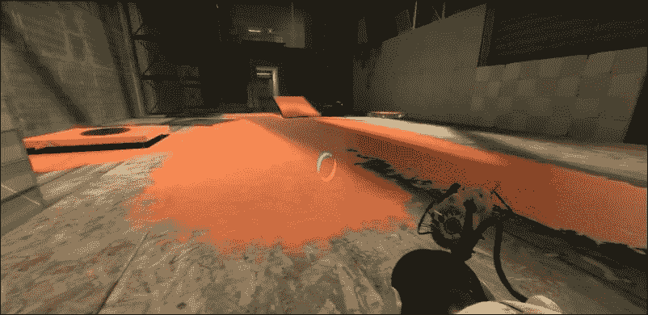

图片来自 Portal 2 - 一种减少摩擦的橙色液体，可以给你提供很大的助推

当然，在光谱的另一端，游戏并不总是以最准确的方式复制物理学，而是夸张它或完全忽略它，以允许创新和独特的游戏玩法。一个例子就是在 *Assassin's Creed* 中从很高的地方跳下，跳进方便放置的干草堆（甚至水）。有些人甚至研究了为了生存这样的跳跃你需要多少干草，你可以在这里找到：[`www.kotaku.com.au/2009/06/kotaku-bureau-of-weights-measures-studies-fallout-physics-also-beer/`](http://www.kotaku.com.au/2009/06/kotaku-bureau-of-weights-measures-studies-fallout-physics-also-beer/)

当涉及到在你的游戏中添加物理学时，你必须问自己你希望你的游戏体验有多真实。如果你想你的游戏与现实 100%相同，那么你也必须考虑像死亡这样的事情。如果一个角色可以被子弹击中，他们会出血吗？或者他们可以自己治愈？在某些情况下，如果你的游戏互动过于真实，游戏本身可能最终更像是一个模拟而不是游戏。一个例子是**永久死亡**（玩家在死后必须从游戏开始重新开始），你可能或可能不在你的游戏/模拟中想要这个。在将物理学添加到游戏中时，所有这些因素都需要考虑，因为原因和结果都会对游戏的可信度和最终的可玩性产生影响。

# 物理学 – 基础

在本节中，我们将学习一些基本的物理学概念，以便更好地理解 Unity 的物理引擎，并总体上成为更好的游戏开发者。

首先，什么是物理学？亚里士多德（与上一章中提到的那个人同一个人）写了一篇题为 *ta physika* 的论文，字面意思是自然事物。从这篇论文（尽管在亚里士多德之前许多人已经写过关于自然现象的文章），物理学成为了一门科学。如今，物理学通过数学模型研究物质，它在时间和空间中的运动。最终，物理学的目标是描述整个宇宙是如何运作的。物理学分为四个主要分支：

+   **经典力学**：这涉及物体的运动

+   **热力学**：这涉及物体的温度

+   **电磁学**：这涉及电磁波/粒子

+   **量子力学**：这涉及亚原子粒子的研究

你不需要将这些看作是独立的实体，而只是同一枚硬币的不同面，这是物理学几个世纪以来试图揭示的世界模型。因此，许多主题跨越了所有这些分支，因此这种划分并不是绝对的。但是，这对于物理学的新手来说是一个很好的概述。

在本章中，我们将只涉及经典力学，特别是刚体的运动。然而，物理学的其他分支和子分支在游戏开发中也非常有用。例如，我们可以使用在着色器中实现的灯光方程，或者流体动力学来模拟海洋和波浪。即使邪恶的巫师施放他最可怕的火球，我们也需要计算许多不同的物理方程，以实现逼真的行为和外观。想象一下只是模拟球体周围的火焰。

大多数情况下，如果你已经有一个像 Unity（或 Unreal）这样的游戏引擎，你不需要深入了解细节。实际上，他们的程序员会为你处理这些。然而，有时你可能会有特殊的需求，需要编写自己的着色器或编写一些基于物理的行为代码。因此，对物理学的了解非常有帮助，并且极其重要。

当然，这并不是一门物理学课程，也不是一本专门介绍物理学编程（例如，可以模拟更多或更少、更高效地模拟某些物理行为的算法）的书。然而，在本章中，我们将巩固物理学的基本概念，以便我们能够大致了解它们是如何共同工作的。因此，本章和接下来的部分将致力于建立对物理学的坚实基础，以便我们更好地理解 Unity 背后的物理引擎。

### 注意

我知道你们中的一些人可能会觉得物理有点无聊。如果它唤醒了高中的一些不良记忆（或记忆），可能会是这样。但我的个人观点是，了解物理对于成为一名优秀的游戏开发者来说非常重要，尤其是在你需要编写现实行为时。有了这个前提，我保证在本节中，我会尽可能地清晰，并使用非正式的语言而不是严格的数学语言，以便任何人都能理解这些概念。

刚体经典力学可以分为两个子分支：

+   运动学：它涉及对运动的研究。

+   动力学：它涉及运动的原因。

当然，再次强调，它们是同一枚硬币的两面。实际上，动态方程需要运动学方程，以便描述和预测刚体的运动。我们很快就会更详细地了解它们，但首先让我们关注一些基本概念。

## 世界坐标系和局部坐标系

正如我们在第二章中已经看到的[*制作纸杯蛋糕塔*]，使用世界坐标系和局部坐标系之间存在差异。这也是物理学中的一个重要概念：你的参考系（或坐标系）是哪一个？这个问题是确定不同物理量值的关键。因此，每次你有一个物理量时，你都需要问自己你正在哪个参考系中工作。

在任何情况下，没有一个坐标系相对于另一个坐标系具有特权（尽管有些物理系统在某些坐标系中比在其他坐标系中更容易描述）。因此，按照惯例，当我们开始描述一个物理系统时，就定义了一个世界坐标系。例如，如果你在开车，你的速度是多少？嗯，答案取决于我描述汽车运动时所使用的坐标系或参考系。在汽车本身中，汽车的速度是零，而是世界正在向汽车靠近。而对于行人来说，汽车在移动，而世界没有移动。月球上的宇航员会看到行人以非常快的速度移动，包括整个地球，以及汽车，以不同的速度。所有这些描述都是物理上正确的。因此，物理学中的所有量都依赖于参考系。

在 Unity 和/或 Unreal 等游戏引擎中，始终有一个定义好的世界坐标系（当你有以世界坐标系中心为零的位置时），如下面的图所示：

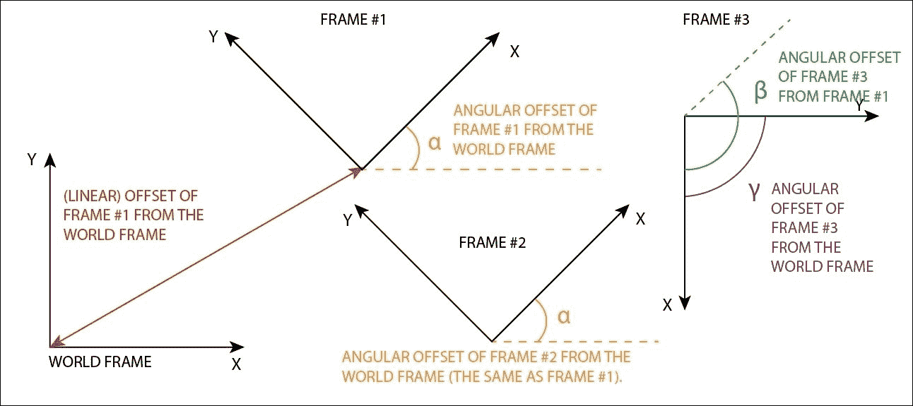

上述图表显示了如何用线性偏移和角偏移来描述相对于世界坐标系的其它坐标系。此外，你还可以用另一个坐标系来描述一个坐标系，而这个坐标系不是世界坐标系（在上述图表中，看看框架**#3**的角偏移）。在 Unity 中，你可以将世界坐标系视为全局坐标，而不同的坐标系视为游戏中游戏对象的局部坐标。游戏对象的孩子将以父框架的形式表示。

## 速度

物理学中的速度描述了一个物体空间和时间之间的关系；换句话说，物体如何随时间变化相对于参考系的位置。当物体不加速时，速度被定义为空间内覆盖的距离除以时间。

### 注意

对于那些好奇的人，当一个物体在每个瞬间改变其速度，并且我们需要获取特定瞬间的速度时，可以通过使用导数来获取它（这是一个微积分的话题，我不会在这本书中深入探讨）。

速度是一个矢量，因此它在 2D 世界中有两个坐标（在 3D 世界中是三个坐标），表示方向和强度。速度的强度也称为**速度**。所以不要混淆这两个概念。实际上，速度是一个标量，只是一个数字，如果我们处理的是 2D 或 3D 游戏，它独立起作用；相反，速度会变化（从两个数字变为三个数字，分别表示 2D 或 3D 矢量）。

无论何时我们使用速度这个术语，我们指的是定义好的世界坐标系中的速度（或坐标）。当我们使用相对速度这个术语时，我们是指相对于另一个参考系的速度。例如，想象有两辆汽车朝相反方向行驶，速度都是 50 公里/小时（在世界坐标系中，因为当你看你的转速表时，按照惯例，这是相对于地球的速度）。对于两位驾驶员中的任何一位，他驾驶的汽车没有移动（实际上，当你开车时，你的方向盘并不是以 50 公里/小时的速度远离你的手，但它始终与你保持相同的距离）。然而，他会看到另一辆汽车和另一位驾驶员以 100 公里/小时的速度向他驶来。

## 质量

在经典力学中，每个刚体都有一个质量，你可以想象成构成该物体的物质的数量。因此，它被认为是物理体的一个属性。在口语中，质量经常与重量混淆。实际上，质量在国际单位制中以千克（kg）为单位测量，而重量在国际单位制中以牛顿（N）为单位测量。因此，秤不是测量你的重量，而是你的质量。重量是一种力，取决于你所在的位置。你在月球上的重量不同，但你的质量是相同的。

有时候，质量也被定义为物体对加速度（当施加力时其运动状态的变化）的抵抗程度的度量。实际上，你需要施加更多的力才能移动一辆卡车，而不是你的笔记本电脑。

然而，值得注意的是，例如，笔记本电脑和卡车（在没有其他外部力的情况下）都受到地球引力的吸引，并且它们都会同时落地接触地面。实际上，当应用牛顿的万有引力方程时，作用在两个物体上的力是不同的，但它们的重力加速度是相同的（因为质量在方程中被简化了）。

### 注意

对于你们中更好奇的人，这个发现是由著名的意大利天文学家、物理学家、工程师、哲学家和数学家伽利略·伽利莱（Galileo Galilei）在牛顿正式化引力之前很久就发现的。有一个轶事说伽利略曾从比萨斜塔上扔下不同质量但材质相同的球体，以证明它们的下落时间与质量无关。通过这种方式，他证明了亚里士多德的观点——重的物体比轻的物体下落得快，与重量（当时指的是质量）成正比——是错误的，如下面的图所示：

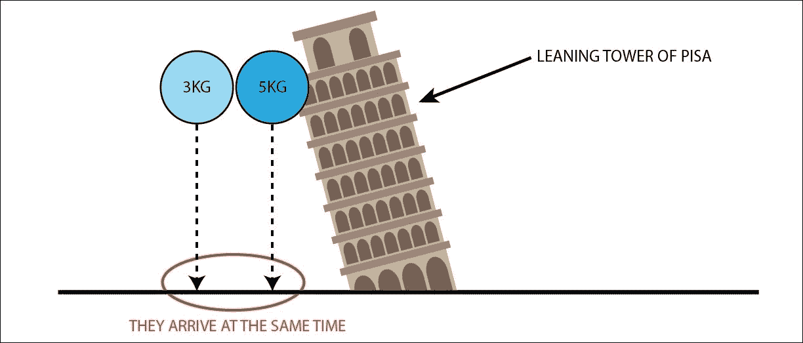

### 质心

假设你需要计算或预测箭矢的轨迹。考虑到箭矢的整体形状，并知道在每一个点都有不同的力作用，最终会导致一个非常复杂的计算（尽管是可能的）。因此，质心是一个对刚体来说非常有效的近似。它包括将一个物体的全部质量集中到一个点上（这是一个抽象，想象这个物体的所有质量都集中在这个点上）。这个点的位置取决于物体的形状（因为它在物体组成的所有点中是加权的），并且这个点提供了足够的信息来进行非常精确的计算。特别是在实时应用中，这一点变得至关重要，因为运动计算大大简化了。实际上，Unity 只会使用质心来计算。

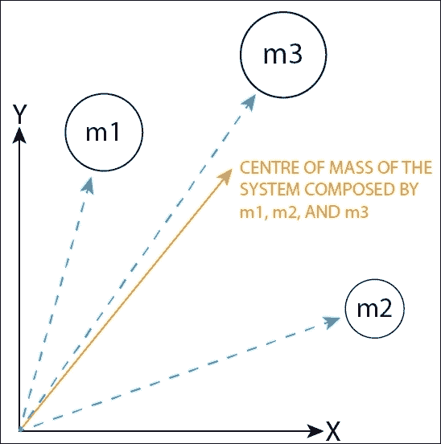

质心是系统中所有点的重量平均值，其中权重是不同的质量。从图中我们可以看出，质心更靠近 m1 和 m3，因为它们更大（质量更大）于 m2。

## 运动学

术语“运动学”首次在 1840 年左右被使用，作为法语术语*cinématique*的翻译，该术语由*安德烈-玛丽·安培*（著名的法国物理学家，经典电磁学的创始人之一——如此著名，以至于国际单位制中的电流单位安培是以他的名字命名的）。然而，这个术语的起源来自希腊语单词*kinesis*，意为运动或运动。

为了更好地理解物理学中的运动学是什么，让我们参考维基百科：

> *"运动学是经典力学的一个分支，它描述了点（或粒子）、物体（对象）和物体系统的运动，而不考虑这些物体的质量或可能引起运动的力。作为研究领域的运动学通常被称为运动几何。"*

运动学只考虑物体的运动，而不考虑运动的成因。这在游戏开发中带来了一些优势。首先，从计算的角度来看，只考虑物体的运动学要便宜得多。然后，我们可能不想在我们的场景中有一个完全逼真的物体，因此我们可以只定义其运动学属性。我们将在后面详细讨论在 Unity 中处理运动学物体时看到这一点。

### 注意

当然，在我们的世界中，一个纯粹的动力学物体是不存在的；它们都是动态的。然而，仅仅研究一个物体的运动学，就能让我们对其运动有所了解。

## 动力学

术语“动态”在 19 世纪被用来表示与产生运动的力量相关，与静态相对。再次强调，它起源于法语术语*dynamique*，尽管它是由著名的德国数学家和哲学家戈特弗里德·威廉·莱布尼茨引入的。然而，这个术语的起源再次来自希腊语单词*dynamikos*，意为强大的，以及来自*dynamis*（力量）和*dynasthai*（能够，拥有力量，足够强大）。

如果没有明确指出，每次我们处理物理学中的动态事物时，我们都在处理力（它们具有移动物体的某种能力）。从维基百科中我们可以读到：

> *"动力学是应用数学的一个分支（特别是经典力学），它研究力和扭矩及其对运动的影响，与运动学相对，运动学研究物体运动而不考虑其成因。艾萨克·牛顿定义了支配物理中动力学的根本物理定律，特别是他的运动第二定律。"*

因此，动力学建立在运动学之上，并给出了对物体如何运动的更好描述/预测。实际上，通过考虑力、质量、重力、阻力等许多其他因素，它们变得非常重要和相关。

## 力和扭矩

> **"力是那些允许运动的事物；它们负责产生运动*。"*

每个力都会对物体施加一个加速度，这是用牛顿第二定律计算的。它如此简单而优雅，以至于很容易理解。我们可以这样看待这条定律：

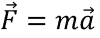

其中 *F* 代表力，它是一个矢量（因此公式上方的箭头），*m* 是质量，*a* 是加速度，它也是一个矢量（因此公式中其符号上方的箭头）。

这意味着如果你对一个质量为 *m* 的物体施加力，你知道加速度是 *F/m*。所以，只需将力除以物体的质量，你就可以计算出它将加速多少。请注意，如果我们对两个物体施加相同的力，但它们的质量不同，质量较大的物体将具有较低的加速度，因为力被除以一个更大的数字。

力的概念很重要，因为它是运动的原因，许多物理引擎（包括 Unity 的引擎）允许你指定力。

另一个重要的概念是扭矩，也称为力矩或简称矩，它在某种程度上表示一种使物体沿轴旋转而不是移动的力。如果你把力想象成拉或推，你可以把扭矩想象成扭转。

### 注意

对于那些对向量叉积有所了解的人来说，扭矩被定义为力向量和力作用点的距离向量之间的叉积。因此，它倾向于产生旋转运动。因此，公式是：

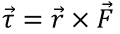

其中 *τ*（读作 tau）是扭矩，*F* 是力向量，*r* 是距离向量，也称为偏移量。

在国际单位制中，扭矩以 *N·m*（牛顿米）为单位测量。

扭矩的公式稍微复杂一些，因为它涉及到叉积，对于那些刚开始在视频游戏中处理物理并使用 Unity 这样的图形引擎的人来说，不需要立即了解/理解这个公式。然而，重要的是要理解这个量与旋转有关，对刚体施加扭矩意味着它将根据扭矩施加的位置沿轴旋转。只需记住，扭矩不是力，尽管由于我们在 Unity 中处理它的方式，它可能看起来像力。

## 碰撞

在经典力学中，刚体之间可能发生不同类型的碰撞。它们被分为两类：

+   弹性碰撞，其中所有动能都得到保存。

+   非弹性碰撞，其中部分动能转化为其他形式的能量。

要通过这一章，并不需要很好地理解它们，但重要的是要理解碰撞的类型可能会改变碰撞后的行为。想象两个球：一个向第二个球滚动，而第二个球是静止的。在某个时刻，第一个球会与第二个球相撞。根据发生的是哪种碰撞，结果可能会有所不同。在一个场景中，两个球会向同一方向滚动，它们就像被连接在一起。在另一个场景中，第一个球停止，第二个球开始滚动。在第三个场景中，它们在碰撞后以不同的速度和方向滚动。

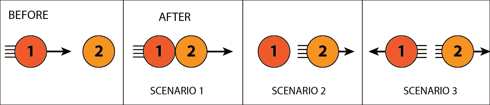

三种可能的碰撞后场景

如果你想了解更多，有一个网页以相当简单的方式解释了不同碰撞的基本概念，[`hyperphysics.phy-astr.gsu.edu/hbase/elacol.html`](http://hyperphysics.phy-astr.gsu.edu/hbase/elacol.html)。然而，它是为那些已经清楚了解物理学的基本概念和公式的读者准备的。

### 备注

本身，[`hyperphysics.phy-astr.gsu.edu`](http://hyperphysics.phy-astr.gsu.edu) 网站是一个快速参考物理学主要概念的良好来源。然而，要完全理解其内容，需要一定的先决条件。最好的开始方式始终是阅读一本物理书，这可能很无聊，但掌握这些概念是一个巨大的优势。

## 刚体

正如其名所示，刚体是一个整体平移和旋转的物体。例如，圣诞球、电视或飞盘都是刚体，因为它们的各个部分一起移动。笔记本电脑不是，因为其盖子可以旋转，如果你把框架也视为整体的一部分，门也是如此。但是，这类物体可以用两个不同的刚体来描述，例如门框和门本身，它们可能相互约束（在这种情况下是铰链）。水、空气、牙膏或连衣裙不被视为刚体，因为它们的各个部分不会一起移动。

你游戏中的大多数物体将是刚体（我这样写是因为这是 Unity 将引用它们的方式），或者它们可以被近似为刚体，因此了解它们对于学习 Unity 中的物理至关重要。实际上，Unity 的 2D 物理引擎的大部分内容都集中在刚体上（我们很快就会看到），因此本章就是关于它们的。

模拟衣服、液体和其他非刚体物理实体通常更困难，尽管是可能的。但它们通常用于 3D 游戏，我们不会在本章中处理这些方面。

### 备注

对于最好奇的你们，这里有一个更精确的定义：**刚体**是对固体物体的理想化，其中忽略了变形。因此，刚体内部任意两点之间的距离在时间上保持恒定，独立于将作用于刚体的力。

当然，在我们的世界中，这样的物体是不存在的。实际上，它们是理想化模型，但它们很好地近似了固体物体的行为（除非物体的速度接近光速）。

## 摩擦——线性阻力和角阻力

如果一个孩子问我，“什么是摩擦？”我会回答，“摩擦是那种没有它所有东西都不会停止运动的东西”。即使这不是一个正式的定义，但它有助于理解摩擦是什么。当你考虑物体的动力学时，它就会发挥作用，因为摩擦会产生一个与物理体运动相反的力。有许多种摩擦，它们取决于不同的因素。例如，空气阻力取决于物体的速度，而干摩擦取决于法向力（这取决于表面、物体的位置、其重量，因此也与其质量有关）。

在游戏中，除非有特定需求，否则你不需要所有这些类型的摩擦和阻力。例如，在 Unity 中，你可以控制线性阻力和角阻力。第一个与物体沿轨迹（或者更好，物体的质心轨迹；否则在实时中做会很复杂）的运动相反，而角阻力与物体的旋转相反。因此，在 Unity 中，一个具有非零线性阻力和角阻力的物体最终会停止运动和旋转（在没有其他力的作用下）。

# Unity 物理引擎

Unity 集成了物理引擎，能够处理刚体动力学和动力学类型的刚体以及其他物理实体，如衣物。它分为两部分：2D 物理和 3D 物理。重要的是要理解，尽管它们可以在同一场景中共存，但它们是两个独立的实体；它们之间不能相互通信。2D 物理下的物理对象不会与 3D 物理下的物理对象相互作用。

在本节中，我们将探讨 Unity 中大部分的 2D 物理引擎。虽然我们不会使用这里展示的所有组件，但掌握它们对于成为一名更好的 Unity 开发者来说非常重要。

## 理解 Unity 中的物理

在第二章“制作纸杯蛋糕塔”中，我们学习了脚本排序及其执行方式。我们可能会问的第一个问题是，当渲染帧时物理引擎何时发生？答案是并不直接，因为物理引擎在帧渲染期间会运行多次。无论如何，除了特定情况（例如应用已暂停或在该帧中某些游戏对象被启用/禁用）之外，物理引擎在初始化（因此所有`Awake()`、`Start()`和`OnEnable()`函数）之后运行，并在从玩家那里收集输入和更新游戏逻辑之前。

因此，当我们进行物理计算（我们将在本章后面看到这些）时，我们需要使用`FixedUpdate()`函数，该函数在每个帧中调用多次，并且所有调用都在物理引擎执行计算之前。因此，如果我们需要获取时间，我们不能使用`Time.deltaTime`；相反，我们需要使用`Time.fixedDeltaTime`。

我们可能还会问的一个问题是何时应该使用 Unity 的物理引擎。从理论上讲，您不需要使用它，因为您可以从头开始编写所有碰撞和/或物理行为。在实践中，它以最少的编码解决了许多常见问题，确实很有用。这些问题不一定是物理问题。实际上，其中一些包括某些游戏机制，当使用物理方法时可能会提高您游戏的质量（例如角色的移动）。其他包括从环境中收集信息以编写其他行为（例如需要知道区域内有多少目标的脚本）。

## Unity 中的物理设置

首先，Unity 的物理引擎有一些通用设置，应该予以考虑。它们定义了您游戏的全局物理属性，例如重力值、什么会与什么相撞，以及物理模拟应该有多精确。

您可以通过在 Unity 中导航到**编辑 | 项目设置 | 物理设置 2D**来访问物理设置，如下面的截图所示：

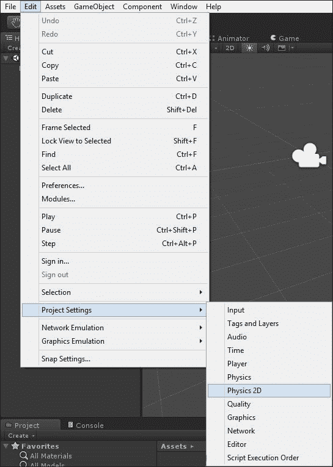

### 注意

同样，您可以通过在 Unity 中导航到**编辑 | 项目设置 | 物理**来访问 3D 物理设置。

以下屏幕将出现在**检查器**视图中（最重要的参数被突出显示，我们将在本节中详细说明）：


如您所见，有许多可调整的选项。大多数情况下，特别是对于简单的游戏（如我们正在构建的游戏），默认设置将足够好。但 Unity 为您提供机会根据您的游戏调整它们。

其中大部分涉及 Unity 物理引擎的精确度。因此，在精确度和效率之间有一个权衡，因为更精确意味着从计算角度来看成本更高。

让我们详细说明主要的内容（如果您对其他内容也感兴趣，请参阅本章后面的可选部分“关于物理的其他事项”）：

+   **重力**：定义重力加速度的向量。默认情况下，它仅在 *y* 轴上具有负值。特别是，9.81 的绝对值对应于地球上的重力，如果我们让 Unity 的单位是米。

+   **默认材质**：所有未设置物理材质的碰撞体和刚体所使用的物理材质（我们将在后面了解更多关于物理材质的内容）。

+   **睡眠时间**：Rigidbody 2D 进入睡眠状态之前需要经过的时间，这意味着它不再由物理引擎更新（我们将在后面了解更多关于刚体及其睡眠的内容）。

+   **线性睡眠容忍度**：这是在**睡眠时间**后刚体进入睡眠状态的线性速度。想象一下，你的游戏中有很多对象正在减速，现在它们的速度非常慢，以至于玩家几乎无法感知它们的运动。因此，在物理引擎中持续更新它们是浪费计算资源。因此，这个变量限制了对象在进入睡眠状态（不再从物理引擎接收更新）之前可以有的最低速度。这个值越低，模拟将越精确，但如果有很多对象以高于这个速度移动，成本也会更高。

+   **角速度睡眠容忍度**：在**睡眠时间**后，刚体进入睡眠状态的角速度。想象一下之前相同的情况，但这次身体旋转得非常慢。同样的推理适用：值越低，模拟越精确，但通常成本也更高。

+   **层碰撞矩阵**：这决定了哪些类型的对象会相互碰撞。默认情况下，所有选项都被选中，但你可能希望让两种特定的对象之间不发生碰撞。对象是根据它们所在的物理层来区分的。如果你还记得，我们在第一章“Unity 中的二维世界”中讨论了层和标签。因此，通过层菜单，你可以创建新的层，在**检查器**中，你可以将层分配给特定的游戏对象。为了使事情更简单，**层碰撞矩阵**在下面的截图中有展示：

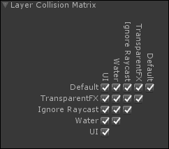

对于我们的游戏，我们可以保留所有默认值，因为它们对我们所需的功能来说已经足够好了。

# 物理组件

Unity 的物理引擎通过组件工作。一些描述对象本身的属性，一些描述相互之间的关系，还有一些甚至在游戏世界的某个区域内。

它们可以按以下方式划分：

+   刚体：在物理引擎中定义刚体的组件

+   碰撞体：为刚体定义物理形状

+   关节：对刚体施加一个或多个约束

+   效应器：在游戏世界的某个区域内改变物理属性，影响该区域内所有的刚体

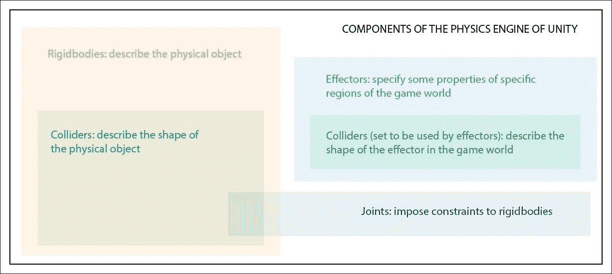

Unity 2D 物理引擎不同组件的总结图

现在，让我们更详细地看看它们。

# 刚体

刚体，与碰撞体一起，是 Unity 物理引擎的核心。当它们附加到游戏对象上时，它们将游戏对象置于物理引擎的控制之下，物理引擎将负责正确地移动其变换。实际上，它们应该通过其他函数来移动，脚本不应该直接操作变换。我们将在稍后详细讨论这一点。

组件的确切名称是**Rigidbody 2D**（而**Rigidbody**用于 3D 物理引擎，但为了简洁，我们经常使用术语刚体来指定**Rigidbody 2D**组件）。

### 注意

从 Unity 5.4 开始，然后在 Unity 5.5 中，**Rigidbody 2D**组件略有变化。实际上，Unity 的物理引擎已经进行了许多改进。

一旦将组件添加到游戏对象中，它看起来就像这样：

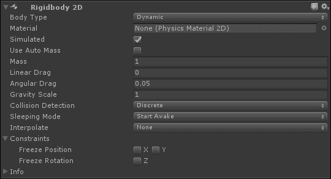

## Rigidbody 2D 的工作原理

每次我们想要定位一个对象（或其子对象）或移动它时，我们都会改变其变换，这定义了它在空间中的位置以及它是如何旋转或缩放的。然而，物理引擎将模拟对象在模拟物理的世界中的交互。因此，如果对象与另一个对象发生碰撞，它将改变方向或速度。这意味着物理引擎必须以某种方式改变对象的变换（这就是为什么我们不应该用脚本触摸物理对象；我们稍后会看到如何通过脚本处理它们）。这种方式是刚体组件，它是一种在物理引擎和对象的属性（包括变换）之间的枢纽。

因此，在物理引擎完成计算后，它会与刚体通信，刚体需要处于其下一个位置，而刚体组件提供改变变换以匹配新位置。

同样的规则适用于碰撞体（我们很快会详细讨论）。每个连接到刚体相同对象（或其子对象之一）的碰撞体都将与刚体链接，我们不应该修改碰撞体或移动它，而应该移动整个刚体。这些与刚体链接的碰撞体实际上允许刚体与另一个刚体的碰撞体发生碰撞，并在物理世界中赋予它们形状。

## 身体类型

在**Rigidbody 2D**中最重要的变量是**身体类型**，以下屏幕截图中已突出显示：

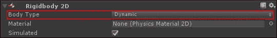

### 注意

如果你使用的是 Unity 的早期版本（低于 5.5），这个变量将不可用。然而，你仍然可以通过检查**Is Kinematic**参数来获取运动学模式，该参数在旧版本中可用（从 5.4 及以下版本）。你可以在以下屏幕截图中看到这一点（Unity 5.4）：

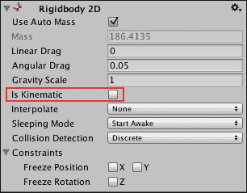

在 Unity 5.3 中也是如此：

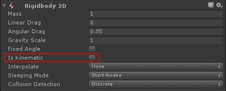

旧版本，如 5.2 及以下版本，与 5.3 类似。

实际上，根据**身体类型**的设置，它会影响组件上可用的其他设置。此外，重要的是要记住，任何连接到**Rigidbody 2D**的**Collider 2D**都会继承**Rigidbody 2D**组件的**身体类型**。

**身体类型**决定了对象将如何移动，碰撞体将如何交互，因此也决定了刚体将有多大的计算成本。

在运行时更改**Rigidbody 2D**的**Body Type**可能很复杂。你需要考虑一些事情；例如，当**Body Type**发生变化时，与质量相关的各种内部属性会立即重新计算。此外，附加到 Rigidbody 2D 的 Collider 2D 组件的所有现有接触都需要在 GameObject 的下一个`FixedUpdate`期间重新评估。因此，根据附加到身体的接触和 Collider 2D 组件的数量，当你更改刚体的**Body Type**时，可能会引起性能的变化。

### 注意

值得注意的是，有时刚体被描述为相互碰撞。虽然当我们谈论物理时（因此当我们谈论刚体时）这是真的，但在 Unity 的 Rigidbody 2D（组件）的情况下并不成立。实际上，在 Unity 的物理引擎中，只有附加到刚体上的碰撞体才会发生碰撞。然而，说两个刚体发生了碰撞，只是说它们的碰撞体相互碰撞的简短说法。

**Body Type**可以设置为三种类型之一。让我们详细看看：

+   **动态**: 这意味着刚体将遵循所有动态计算，这意味着处理导致运动的力。实际上，刚体将具有质量，以及线性和角动量阻力。此外，身体将受到重力的影响。实际上，这是默认的身体类型，因为它是最常用的，并且与所有东西发生碰撞。但正因为如此，它也是计算成本最高的身体类型。

+   **运动学**: 这意味着物体仍然能够作为一个物理对象移动，但没有运动所需的力，因此也不受重力的影响。实际上，你需要用任何公式（我们稍后会看到）来编写它的运动脚本，这可能或可能不是物理上现实的（或者也许是在你的游戏世界中）。然而，它仍然能够发生碰撞，这意味着物理引擎将通知你的脚本刚体已经发生了碰撞，然后接下来发生什么就取决于我们了。在遇到动态类型的物体时，运动学类型的物体被认为是不可移动的，这意味着具有无限的质量。实际上，所有动态属性，如质量，都是不可用的。从计算的角度来看，运动学类型的物体比动态类型的物体更快，因为不需要计算所有动态力，这要求物理引擎的资源更少。

+   **静态**: 这意味着刚体在物理引擎（或模拟）下不应该移动。这适用于具有无限质量的物体。在模拟下，静态刚体 2D 被设计为不移动。如果发生碰撞，静态刚体 2D 的行为就像一个不可移动的物体（好像它具有无限质量）。它也是使用最少的资源密集型身体类型。静态身体只与动态刚体 2D 发生碰撞。不支持两个静态刚体 2D 发生碰撞。这仅仅是因为它们不是设计来移动的。因此，对于这种身体类型，可用的属性数量有限。

为了更好地理解这些身体类型之间的差异，这里有一个表格，列出了每个身体类型可用的不同功能（我们将在下一节中详细了解它们）：

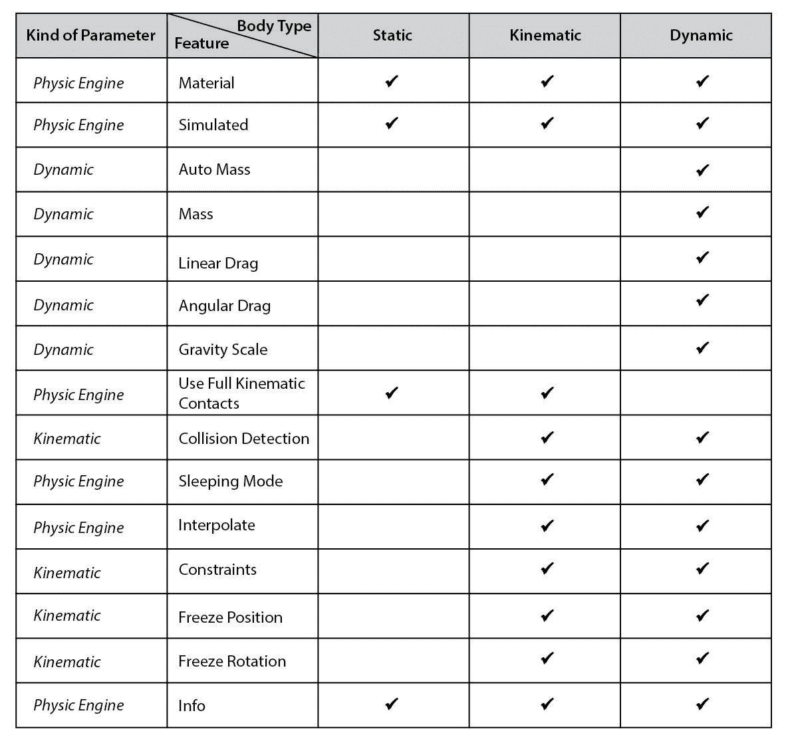

## 刚体属性

在前面的表格中，我们看到了许多属性；它们可能对某些身体类型可用，也可能不可用。但它们实际上做什么，以及它们为刚体确定什么？让我们详细探讨这些属性：

+   **材料**: 一种物理材料，用于确定碰撞属性，例如摩擦和弹跳（我们将在后面了解更多关于物理材料的内容）。此材料将应用于受刚体控制的全部碰撞器（我们将在下一节中了解更多关于碰撞器的内容）。当你需要具有相同物理材料的许多碰撞器时，这很有用。

+   **模拟**: 一个复选框，用于启用刚体与物理引擎的交互。如果未勾选，则刚体以及所有引用它的碰撞器将禁用并透明，对物理引擎来说就像它们不存在一样。这在运行时启用和禁用许多碰撞器时很有用（请参阅可选的“更多关于物理”部分以了解更多信息）。

+   **使用自动质量**: 一个复选框，如果启用，允许 Unity 自行计算物体的质量。这些计算基于每个引用该特定刚体的碰撞器的尺寸和密度。

+   **质量**: 如果前面的复选框被禁用，我们可以手动为我们的刚体指定一个质量。

+   **线性阻力**: 影响刚体的线性阻力值。如果它不为零，物体最终会停止移动。

+   **角阻力**: 影响刚体的角阻力值。如果它不为零，物体最终会停止旋转。

+   **重力比例**：这是特定刚体的重力值的乘数。这意味着`0.4`的值将重力减少到原始值的 40%。这在你的游戏中，当有对象以不同的方式对重力做出反应时很有用。想象一下你的法师发出的火球；你可能希望它有一个相当直的轨迹（即使它仍然是一个抛物线，除非轨迹完全直线且**重力比例**设置为`0`，这意味着没有重力影响刚体）。而你可能希望你的士兵的手榴弹有一个清晰的抛物线轨迹，因为它受到重力的影响。大于`1`的值会导致比原始值更强的重力，如以下图所示：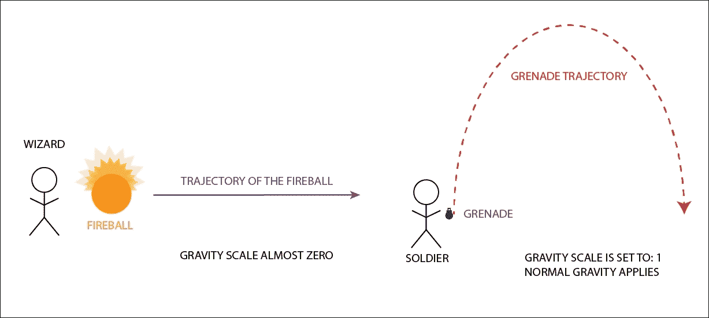

    在前面的图中，左侧是一个火球，当重力比例设置为零时，它不受重力影响，导致直线轨迹。右侧是一个手榴弹，它受到重力的影响（因为重力比例大于零；在这种情况下，它正好是`1`，这意味着正常重力）。在没有其他力的作用下，具有线性速度并受到重力影响的刚体具有抛物线轨迹。

+   **使用完整运动学接触**：仅适用于运动学身体类型的复选框。如果启用，它允许运动学刚体与其他运动学刚体发生碰撞。默认情况下，它设置为 false，这意味着刚体将仅与动态刚体（除了设置为触发器的碰撞器）发生碰撞。

+   **碰撞检测**：Unity 检测碰撞的方式。它可以是**离散**或**连续**的。在前一种情况下，碰撞检测仅基于物理对象的当前位置计算，如果它们发生碰撞（这意味着如果对象位置更新后碰撞器重叠，则 Unity 计算碰撞）。相反，连续碰撞检测是基于轨迹本身，而不仅仅是物体的位置。想象一下，你有一个非常快的子弹，它正对着一堵非常薄的墙。由于游戏是离散的（游戏逐帧渲染），当子弹靠近墙时，在下一个更新中，它可能移动得太快，以至于它的新位置在墙的后面。因此，使用离散碰撞检测时，子弹可以无问题地穿过墙，因为物理引擎没有检测到任何碰撞。相反，使用连续碰撞检测时，物理引擎知道子弹所跟随的轨迹，并对它进行计算。因此，即使子弹的最终位置在墙后面，碰撞也会被检测到，并且由物理引擎正确处理，如以下图所示：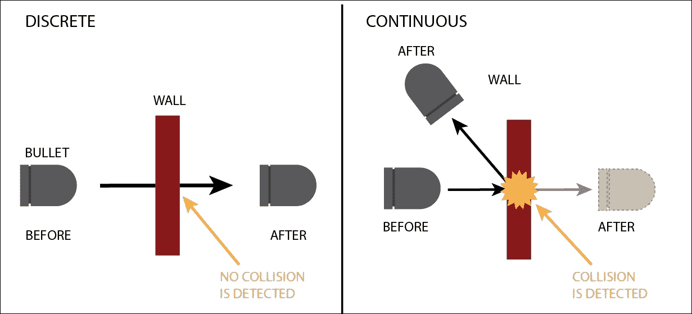

    在前面的图中，左侧是离散方法，其中只考虑帧之间的不同位置。因此，如果子弹在下一帧的位置在墙后面，离散方法将不会检测到碰撞。右侧是连续方法，其中考虑了子弹的整个轨迹。因此，即使子弹在下一帧的位置在墙后面，也会检测到碰撞，并基于碰撞计算一个新的位置。第二种方法在计算上稍微昂贵一些。

+   **睡眠模式**：这是 Unity 处理刚体在开始时应该处于唤醒状态还是睡眠状态，或者是否有睡眠可能性的方式。这个变量的可能选择，具有自解释的名称，包括：**永不睡眠**、**开始唤醒**和**开始睡眠**。当刚体没有被物理引擎完全考虑时，它处于睡眠状态（这与没有被模拟不同，现在我们知道了原因）。想象一下，你的游戏中可能有多少物体正在有力地移动，但此刻它们并没有移动。例如，想象一个有数千个球的水球池，但此刻没有任何一个球在移动。在这种情况下，在物理引擎中对每个球进行空计算是无用的。另一个例子：想象一个停止摆动的摆锤，其摆动弧线太小，玩家无法感知。计算摆锤在这个弧线上的确切位置是浪费计算资源。更好的做法是停止摆锤或球（将它们设置为睡眠模式），直到发生某个事件，例如玩家跳入水球池或推动摆锤。因此，出于性能考虑，并非所有刚体在任何时刻都是唤醒状态。然而，它们可以通过事件被唤醒，这在物理引擎中通常是自动的。但也可以通过脚本由你控制（我们将在下一节中看到更多关于这个的细节）。

+   **插值**：当一个刚体在移动时，可能受到力的作用，物理引擎会对其下一个位置进行一些计算。然而，物理引擎并不完美，无法复制我们的物理。事实上，算法会受到数值不稳定性的影响，这可能导致我们案例中的运动出现颠簸。因此，Unity 为你提供了两种平滑运动并使其不那么颠簸的方法，以及**无**选项，其中不执行任何平滑。第一种方法，称为**插值**，考虑了刚体的先前位置。相反，第二种方法，称为**外推**，考虑了对象的下一个位置的预测。两种方法都很好，你可以感知它们与**无**之间的区别。然而，两种方法之间的区别可能难以理解，特别是它们的行性行为非常相似，有时理解哪种更适合你的游戏可能只能通过试错（除非你有非常具体的需求）。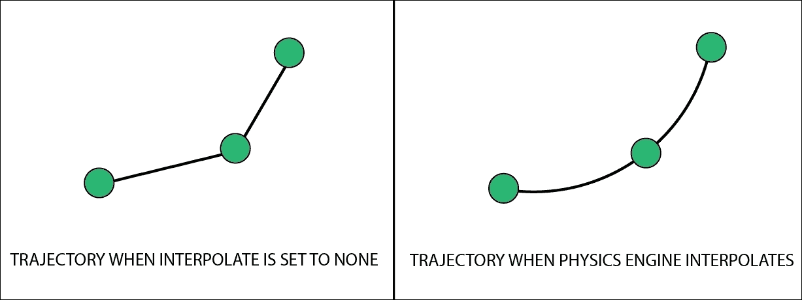

    在左侧，轨迹没有插值；这导致轨迹碎片化。在右侧，轨迹被插值，其曲线被平滑化。

+   **约束**：这些可以防止刚体以某种方式（如果不是完全）移动或旋转。在 2D 的情况下，你可以冻结沿*x*或*y*或两个轴的运动，以及沿*z*轴的旋转。所有这些都是独立的复选框，可以以任何组合选择。当然，选择所有这些意味着刚体将无法移动。想象你正在开发一个益智游戏，你的主要角色需要移动一个盒子，可能通过推它。然而，我们不想让盒子在没有推到盒子的中间点时开始自身旋转。因此，我们可以冻结盒子的旋转，同时仍然允许盒子移动并被主要角色推挤。

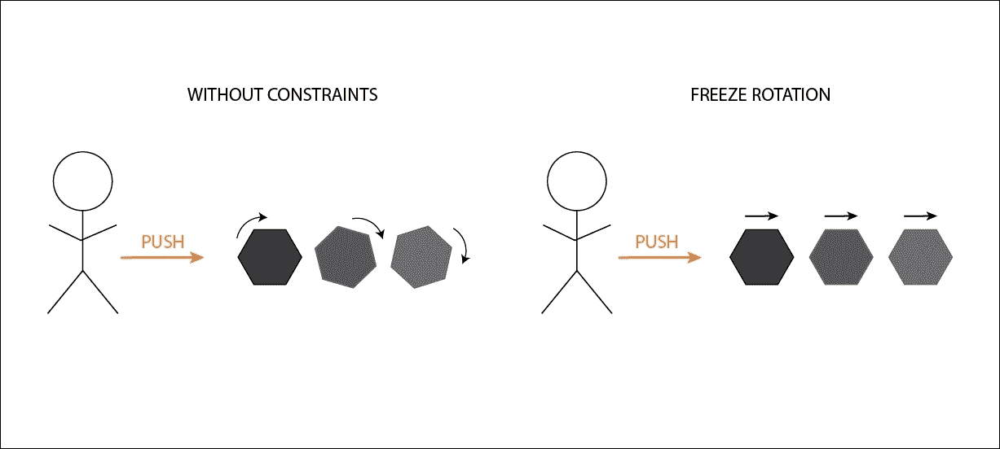

在左侧，没有约束，因此当玩家推挤时，物体可能会旋转。在右侧，旋转被冻结，当玩家推挤时，物体不会旋转。选择哪种行为取决于你游戏的设计。

### 注意

**信息**：一个展开图，显示了刚体的所有其他变量，这在调试中非常有用。

## 处理刚体

现在我们已经详细探讨了 Rigidbody 2D 组件，让我们看看我们如何在脚本中处理它。如前所述，脚本不应该改变刚体的 Transform。那么我们如何移动它们呢？答案是存在一些特殊函数。

这些函数需要在刚体上调用；因此，你可能想要有一个 Rigidbody 2D 的引用，如下面的脚本片段所示：

```cs
*//Reference to the RigidBody2D component * 
public Rigidbody2D rb2D;

void Start() { 
 * //Get the reference to the Rigidbody2D component* 
  rb2D = GetComponent<Rigidbody2D>(); 
} 

```

因此，你可以这样调用函数：

```cs
Rb2D.NameOfTheFunction() 

```

当然，这里 `NameOfTheFunction` 将被下面列出的函数之一所替代。然而，如果你记得，物理引擎可能会在每一帧被调用多次，因此所有这些函数都应该在 `FixedUpdate()` 中调用。

那么，我们实际上如何移动一个刚体呢？对于动态刚体类型，我们可以让它们在外部力（如重力、碰撞等）的 mercy 下自由移动，或者我们可以施加一个特定的力。

为了向刚体施加力，有以下有用的函数：

+   `AddForce(Vector2 force, ForceMode2D mode = ForceMode2D.Force)`: 应用在 `force` 参数中指定的力。此外，枚举 `ForceMode2D` 是一个可选参数，用于指定力是否应该作为冲量作用。默认情况下，它不是冲量。

+   `AddForceAtPosition(Vector2 force, Vector2 position, ForceMode2D mode = ForceMode2D.Force)`: 与前面的函数行为类似，但你可以指定力的应用点。

+   `AddRelativeForce(Vector2 relativeForce, ForceMode2D mode = ForceMode2D.Force)`: 与第一个函数行为类似，但力是在局部坐标系中指定的。

+   `AddTorque(float torque, ForceMode2D mode = ForceMode2D.Force)`: 向刚体施加扭矩；同样，第一个函数施加的是力。

对于运动学刚体类型，我们有两个函数来明确移动这些类型的刚体，同时仍然允许物理引擎正确执行碰撞检测。在这些函数内部，我们直接传递一个位置和一个旋转，这些可以通过任何公式计算得出。因此，它们可以遵循你想要的任何物理定律（或游戏中有意义的定律）：

+   `public void MovePosition(Vector2 position)`: 将刚体移动到指定的位置

+   `public void MoveRotation(float angle)`: 将刚体旋转到指定的角度

### 注意

最简单的例子是将经典运动学定律应用于速度，使运动学刚体无限期地沿直线移动。对于最好奇的你们，公式如下：

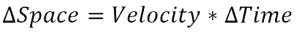

在物理学中，∆（读作 delta）表示最终值减去初始值，可以通过显式分离空间的变化来重写为：

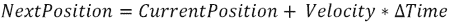

我们可以用以下代码片段将此翻译成 Unity（而不是 `Time.deltaTime`，我们需要使用 `Time.deltaFixedTime`）：

```cs
public Vector2 velocity;
void FixedUpdate () {
  rb2D.MovePosition(rb2D.position + velocity * Time.fixedDeltaTime);
} 

```

此外，我们为所有类型的刚体都有一些或另一些函数：

+   `IsAwake()`: 如果刚体处于唤醒状态，则返回 true。

+   `IsSleeping()`: 如果刚体处于休眠状态，则返回 true。

+   `IsTouching(Collider2D collider)`: 如果碰撞体接触刚体（这意味着刚体上附加的任何碰撞体），则返回 true。

+   `OverlapPoint(Vector2 point)`: 如果点与刚体重叠（这意味着刚体上附加的任何碰撞体），则返回 true。

+   `Sleep()`: 使刚体进入休眠状态

+   `WakeUp()`: 禁用刚体的睡眠模式

### 注意

要查看 Rigidbody 2D 组件的完整函数和变量列表，您可以在此处查阅官方文档：[`docs.unity3d.com/ScriptReference/Rigidbody2D.html`](https://docs.unity3d.com/ScriptReference/Rigidbody2D.html)。

# 碰撞体

想象一下，你的游戏中的女主角在一个复杂的环境中移动；这里的复杂是指详细的，例如，国王城堡的厨房。如果物理引擎非常逼真，它应该考虑女主角的手可以越过桌子，只要她的身体保持在侧面。然而，这在实时运行中是不可能的（或者至少对于玩家当前的硬件来说是不可能的）。因此，碰撞体为需要某种物理交互的对象和角色提供了一个近似的形状，例如碰撞。例如，角色通常被近似为胶囊形状的碰撞体，而具有球形或盒形碰撞体的物体。当然，如果需要更详细的级别，不同的碰撞体可以充当更复杂的碰撞体。最终，3D 模型的全部多边形（或 2D 精灵的周界）都可以成为碰撞体的一部分，从而获得更高的真实感，但代价是性能。因此，你想要确保在每种情况下都保持正确的细节级别。

在 Unity 中，碰撞体可以是五种类型，它们是：

| **名称** | **在**检查器**中的显示** | **描述** |
| --- | --- | --- |
| **二维圆形碰撞体** | 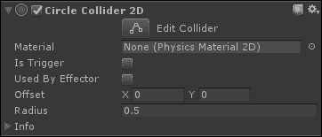 | 碰撞体的形状是一个圆形，由局部坐标系中的一个位置和一个半径定义。 |
| **二维盒子碰撞体** | 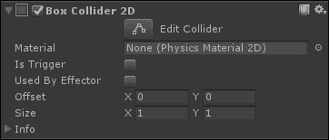 | 碰撞体的形状是一个与世界轴（*x* 和 *y*）对齐的矩形，它在局部坐标系中由宽度和高度定义。 |
| **二维多边形碰撞体** | 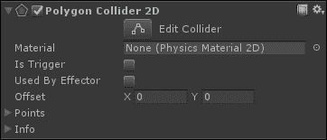 | 碰撞体的形状由由线段组成的自由形状边缘定义。这样，你可以调整它以非常精确地适应 Sprite 图形的形状。请注意，此碰撞体的边缘必须完全包围一个区域（与**二维边缘碰撞体**不同）。 |
| **二维边缘碰撞体** | 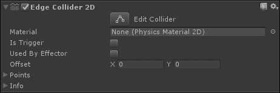 | 碰撞体的形状由由线段组成的自由形状边缘定义。这样，你可以调整它以非常精确地适应 Sprite 图形的形状。与**二维多边形碰撞体**不同，其边缘不一定包围一个区域。例如，可以创建一个*N*形状或只是一条直线。 |
| **二维胶囊碰撞体** | 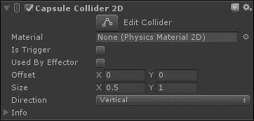 | 碰撞体的形状是一个无顶点的胶囊（因此它很难卡在顶点或其他碰撞体的角落之间）。此外，它是一个实体碰撞体，所以如果一个物体完全在这个碰撞体内部，它会被推出来并被检测为碰撞。 |

它们都共享相同的核心设置，以及一些额外的设置来定制碰撞体的形状。例如，对于**二维圆形碰撞体**，我们可以决定中心点和半径。然而，Unity 会自动尝试将精灵或 3D 模型包含在碰撞体内部，尽管可能需要手动调整（有关在视觉上编辑碰撞体的方法，请参阅以下内容）。

### 注意

由于本书专注于 2D 世界，为了简洁起见，我们将省略碰撞体的 2D 后缀，假设我们总是指代 2D 组件，而不是具有相同名称的 3D 组件。例如，**二维盒形碰撞体**变为**盒形碰撞体**。

让我们来探索每个碰撞体的核心选项：

+   **密度**：这会影响所引用的刚体的质量。零值意味着碰撞体将在刚体质量计算中完全被忽略。值越高，碰撞体对刚体质量的贡献就越大。

    ### 注意

    如果你没有看到**密度**选项，这是正常的。实际上，只有当关联的刚体（即附着在同一个游戏对象上的刚体或其层次结构中的某些父级）上的**自动质量**选项被启用时，它才会可见。实际上，当刚体组件自动计算质量时，它会考虑所有连接到该刚体的碰撞体及其密度。

+   **材料**：一个物理材料，它决定了碰撞的性质，例如摩擦和反弹（我们将在后面了解更多关于物理材料的内容）。

+   **是否触发**：如果您希望碰撞体作为触发器行为，请勾选此选项。这意味着碰撞体不会用于执行碰撞，而是当另一个碰撞体进入此碰撞体时触发某些操作（有关更多详细信息，请参阅下一节）。

+   **由效应器使用**：如果您希望碰撞体被附加的效应器使用，请勾选此选项（我们将在后面了解更多关于效应器的内容）。

+   **偏移**：这是以局部坐标表示的碰撞体几何形状的偏移量；换句话说，碰撞体在附着游戏对象的位置上*x*和*y*方向上应该离多远。

+   **信息**：一个展开的窗口，显示碰撞体的所有其他变量。这在调试中非常有用。

然后，还有每个碰撞体的特定选项：

+   **半径**：仅用于圆形碰撞体，它决定了圆的半径。

+   **大小**：这仅用于盒形和胶囊形碰撞体。在前者的情况下，它决定了盒子的大小，在后者的情况下，它决定了胶囊填充的盒子的大小（因此间接决定了胶囊的大小），如下面的图所示：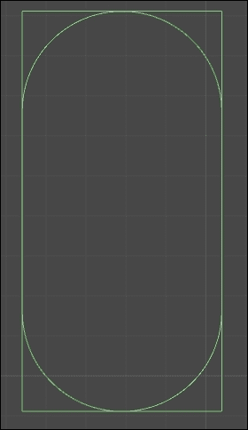

+   **点**：这是多边形或边缘碰撞体的不可编辑信息，关于它们的复杂性。它描述了碰撞体的所有点以及它们如何连接成路径。

+   **方向**：这仅用于胶囊碰撞器，可以设置为**垂直**或**水平**。这控制胶囊的方向；具体来说，它定义了半圆形端盖的位置。

此外，您还可以通过点击以下图标来直观地编辑碰撞器，该图标在所有碰撞器中都是可用的：

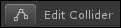

因此，您可以直接在**场景**视图中修改碰撞器。这相当直观，所以我会让您自己探索这个功能。

### 小贴士

您可以通过点击边缘之一为边缘或多边形碰撞器创建顶点。

## 处理碰撞器

通常，在视频游戏中，当碰撞器碰撞时，我们希望触发一些动作并运行特定的代码。例如，想象一颗子弹击中墙壁的表面，我们可能想在那个点实例化一个粒子效果并移除子弹。同样的情况也适用于火球，但会有火效果。或者想象玩家穿过一扇门并触发一个场景。在这种情况下，有一个体积触发器（一个将**is Trigger**设置为 true 的碰撞器），当玩家进入时，体积触发器会触发场景。另一个例子是一个充满有毒气体的区域，玩家在该区域停留的时间越长，他的健康就会逐渐减少。

所有这些都可以通过使用一些特殊函数来实现。如果您还记得，在第二章中，*烘焙纸杯蛋糕塔*，我们看到了从 monobehaviour 派生的每个脚本都可以有一些函数，例如`Start()`和`Update()`，这些函数会被 Unity 自动调用。在这些函数中，有一些是由 Unity 的物理引擎调用的。

对于触发体积，有以下函数：

+   `OnTriggerEnter2D(Collider2D other)`: 当前者进入后者时，在刚体和体积触发器上都会调用此函数。其他碰撞器的信息作为参数通过`other`变量传递。

+   `OnTriggerStay2D(Collider2D other)`: 这在刚体和体积触发器上每帧都会被调用，只要前者在后者内部。其他碰撞器的信息作为参数通过`other`变量传递。

+   `OnTriggerExit2D(Collider2D other)`: 当前者离开/退出后者时，在刚体和触发体积上都会调用此函数。其他碰撞器的信息作为参数通过`other`变量传递。

对于未设置为触发器的碰撞体，有类似的功能。然而，不是只有关于另一个碰撞体的信息，通过`Collision2D`类可以获得关于整个碰撞的信息，该类除了碰撞体之外还存储了接触点、相对速度等信息。更多关于这方面的信息可以在官方文档中找到：[`docs.unity3d.com/ScriptReference/Collision2D.html`](https://docs.unity3d.com/ScriptReference/Collision2D.html)

因此，碰撞体的函数是：

+   `OnCollisionEnter2D(Collision2D coll)`: 当刚体/碰撞体刚刚接触（发生碰撞）时，这个方法会被调用。关于碰撞的信息可以在`coll`变量中找到。

+   `OnCollisionStay2D(Collision2D coll)`: 当两个刚体/碰撞体持续接触时，每一帧都会调用这个方法。关于碰撞的信息可以在`coll`变量中找到。

+   `OnCollisionExit2D(Collision2D coll)`: 当两个刚体/碰撞体停止接触时，这个方法会被调用。它们碰撞的信息可以在`coll`变量中找到。

在我们的特定情况下，我们需要这些函数（触发器函数）来检测当糖果击中敌人时，减少他们的健康，并最终触发正确的动画。我们将在本章的末尾看到这一点。

# 关节

到目前为止，我们讨论了刚体和碰撞体，但它们只是单个物理体。那么更复杂的机械系统呢？想象一下一根绳子，它正拉着装有骨架和钥匙的笼子。所以，我们的主人公决定切断绳子，让笼子掉落。一旦绳子被切断，笼子就会掉下来。然而，即使在绳子被切断之前，笼子就已经受到重力的作用。事实上，如果我们的主人公推笼子而不是切断绳子，那么笼子就会开始振荡。原因是绳子给笼子施加了一个约束——它只允许在半径等于绳子长度的圆（或如果我们在 3D 中，则是球）内移动。当然，当它振荡时，重力使得笼子在圆（或球）的边缘移动。如果绳子是一根刚性的金属棒呢？那么笼子会有更严格的约束，因为现在它被迫只位于圆（或球）的边缘。如果绳子是弹簧呢？这又是一种约束，如以下图所示：

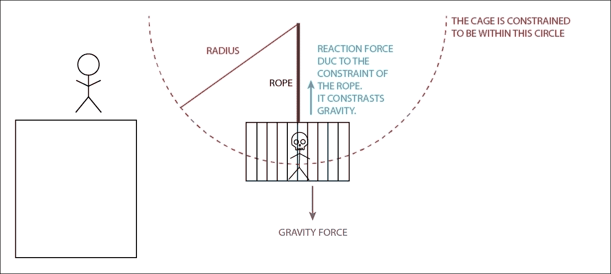

尽管笼子受到重力的作用，但绳子施加了一个反作用力。因此，笼子不会掉落。因此，绳子对笼子施加了一个约束。特别是，它限制了笼子的运动，使其保持在半径等于绳子长度的圆内。

现在，想象一下将这些约束放在一起。例如，你将笼子系在一个悬挂的弹簧上，从笼子的底部拉出一根绳索，绳索悬挂着一个金属球。系统将开始变得更加复杂。但 Unity 是如何处理所有这些的呢？答案是，使用关节组件。

### 注意

注意，所有以 2D 结尾的关节都属于 2D 物理引擎；否则它们属于 3D 物理引擎。所以请小心，不要混淆或连接错误的关节。然而，从现在开始，我们将始终将其称为 Joint 2D，即使没有 2D，除非另有说明。这个决定是为了使章节更清晰、更流畅地阅读。

## 关节的主体属性

通过使用关节组件，你可以将一个刚体连接到另一个刚体上，以便为它们提供特定的约束，同时仍然为运动留下一些自由度。特别是，Unity 提供了九个 Joint 2D 组件。但在我们逐一介绍它们之前，让我们先探索一下 Unity 中关节的一些通用属性。

### 另一个刚体

正如我们之前所说的，一个关节涉及两个刚体（**目标关节 2D**除外）。第一个是连接到关节相同物体的。另一个可以任意选择。因此，在关节组件内部有这两个选项：

+   **启用碰撞**：两个刚体都将有碰撞器。如果这个切换为真，这意味着两个刚体将根据物理引擎和我们在前两个部分中看到的进行碰撞。大多数情况下，具有关节的刚体属于同一个大系统，你不想它与自己碰撞。因此，默认值是 false。

+   **连接的刚体**：这是对关节第二个刚体的引用，正如其名所示。

然后，大多数的关节（除了**相对关节 2D**和**目标关节 2D**）需要两个应用关节的点。再次想象一下笼子悬挂在绳索上的例子。绳索连接到笼子的位置是一个重要因素，因为如果绳索连接到笼子的一个角落，这将导致旋转，如图所示：

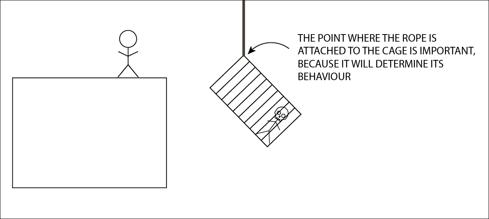

我们将绳索系在了笼子上，这是很重要的，因为它将影响笼子对力的反应。然而，值得注意的是，无论你在哪里附加一个刚体，绳索的线始终会通过刚体的质心（重心）。

此外，你需要考虑可能存在其他可能移动笼子的力，而绳索连接的位置是一个重要的信息。同样适用于另一个刚体；在笼子的例子中，另一个刚体是天花板。

因此，有一些选项可用于确定这两个应用点，在 Unity 中被称为**锚点**：

+   **自动配置连接锚点**：如果勾选了这个选项，Unity 将负责确定两个锚点的位置。当然，如果你已经有一个特定的关节应用点并且想要在那里放置锚点，请将其关闭。

+   **锚点**：相对于刚体，关节在连接的刚体上的锚点的 *x* 和 *y* 位置。

+   **连接锚点**：这是相对于另一个物体的刚体，在**连接刚体**变量指定的刚体上，关节锚点的 *x* 和 *y* 位置。

### 破坏关节

回到悬挂笼子的例子，想象一下，英雄决定尝试跳到笼子的顶部，然后再跳到另一个平台上。然而，他没有考虑到绳子真的很旧（实际上笼子里有一具骨架！），一旦他落在笼子上，绳子断裂，导致笼子和我们的英雄一起坠落。因此，确实，关节施加了约束，但它们也有局限性。出于同样的原因，如果你用太大的力拉扯橡皮筋，橡皮筋最终也会断裂。

在 Unity 中，关节也可以被破坏。特别是，在它们的组件中，有两个变量：

+   **断裂力**：所有关节都有这个属性，它表示关节断裂后的力数值。在 Unity 中破坏关节意味着从对象中删除关节组件。默认情况下，它被设置为无限大，这意味着关节是不可破坏的。否则，数值越低，关节越容易断裂。在笼子的例子中，如果我们选择为模拟绳子的关节设置一个非常低的值，那么绳子很可能真的很旧，当我们的英雄跳到笼子的顶部时，他们两人都会掉进城堡的地牢中。

+   **断裂扭矩**：除了**二维距离关节**、**二维弹簧关节**和**二维目标关节**之外的所有关节都有这个属性。它表示关节断裂后的扭矩数值。正如我们之前所看到的，刚体不仅可以移动，还可以旋转。默认情况下，它被设置为无限大，这意味着关节是不可破坏的。否则，它可以被设置为有限值，允许关节在超过指定值的扭矩下断裂。

### 注意

对于一个在扭矩作用下断裂的关节的例子，你可以想象一些正在旋转但运动被阻止的东西，比如当你使用螺丝刀并继续直到木头（作为约束）断裂时。然而，这里还有一个不那么直观但更常见的例子（甚至在视频游戏中）。想象你把自己附加在架子/边缘上。由于你的附加点与架子的质心之间有一个偏移（如果架子是平的，它们很可能是垂直的），架子上会施加一个扭矩。在扭矩的作用下，架子应该围绕其质心旋转，但由于墙壁阻止了它，它并没有旋转。如果你足够重，这意味着你施加在架子上的力更大（或者如果你以某种方式能够增加偏移），扭矩会增加，直到达到断裂点。然后约束将断裂，这可能导致架子或墙壁断裂，具体取决于哪一个有更大的阻力（最可能的是架子会断裂，而墙壁仍然站立）。以下图表应该有助于你理解这个例子：

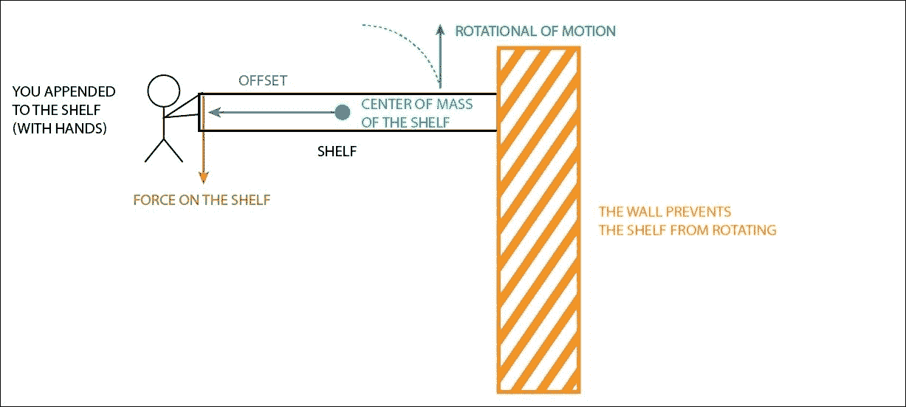

## 特定关节

到目前为止，我们只看到了 Unity 中关节的一般特性，但现在我们将更深入地了解所有九种 2D 关节组件。

值得注意的是，关节分为两类：弹簧关节和电机关节。前者使用弹簧施加约束，可能完全刚硬，以模拟刚性杆。电机关节则可以主动对刚体施加力。一些关节既是弹簧又是电机，例如带有电机的弹簧。

### 小贴士

Unity 中的所有关节都有一个图标（例如，当你将组件放置在 **检查器** 中时可见）。在这本书中，你可以在关节图像的右上角看到这个图标（在下一节中）。这个图标非常有用，可以帮助你记住关节的作用以及它是如何工作的。因此，在阅读下一节或编写你的游戏时，请注意这个图标，它可能有助于你更好地理解关节。

### 距离关节 2D

此关节保持两个刚体之间的特定距离。此关节的目的是在游戏世界中保持两个刚体或一个刚体与固定点之间的特定距离。实际上，如果你将 **连接刚体** 变量设置为 `None`，你可以在 **连接锚点** 中指定固定点的位置。

它应该看起来像以下这样在 **检查器** 中：

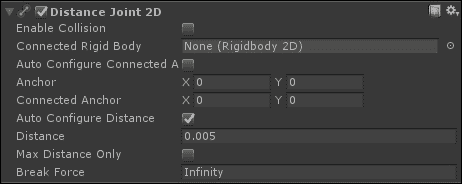

此关节向两个刚体（或如果使用固定点，则仅向其附加的刚体）施加线性力，使用一个非常刚硬的模拟弹簧（不可配置）以保持距离。该关节不施加任何扭矩。

除了我们在上一节中看到的参数之外，**二维距离关节**还有以下选项：

+   **自动配置距离**：如果设置为 true，Unity 将计算两个刚体（或刚体和固定点）之间的当前距离，并将其值放置在**距离**变量中。

+   距离：指定两个刚体（或刚体和固定点）不能超过的距离。

+   **仅最大距离**：如果启用，两个刚体（或刚体和固定点）之间的距离可以小于在距离中指定的值。如果此选项被禁用，则距离是固定的，两个点不能比距离更远或更近。

### 备注

记住，如果关节的**断裂力**是一个有限值，即使将**仅最大距离**选项设置为 false，它最终也会断裂。

当**仅最大距离**为 false 时，两点之间的约束是刚性的，所以你可以想象它们通过一个金属绳索/杆和铰链连接在一起（因为它们仍然可以相对于彼此旋转）。这种用法的一个例子是当你需要将火车上的两个沙发连接在一起时，因为它们不能比特定的距离更远或更近。如果**仅最大距离**为 true，那么它们可以比**距离**更近，但不能更远。这是我们的绳索的行为，它支撑着笼子，可以靠近绳索系的地方，但不能更远。另一个例子是拴着绳索的狗。

然而，重要的是要记住，两个刚体都可以相对于彼此自由旋转。实际上，此关节仅对两个刚体的相对位置施加约束。

### 二维固定关节

此关节的目的是在游戏世界中保持两个刚体或刚体和固定点之间的一定相对偏移（线性和角偏移）（你可以通过将**连接刚体**设置为`None`来指定它）。

它在**检查器**中应如下所示：

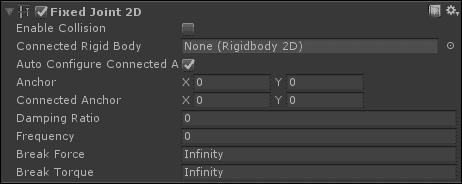

此关节同时施加一个线性力来补偿线性偏移，以及一个扭矩来补偿角偏移。与**二维距离关节**类似，它使用一个非常刚性的模拟弹簧，但你也可以调整弹簧的值，例如频率。

因此，除了我们在上一节中看到的参数之外，**二维固定关节**还有以下选项：

+   **阻尼比**：这定义了弹簧振荡被抑制的程度。其值范围从 0 到 1；值越高，运动越少。正如你所期望的，弹簧会超过期望的距离然后反弹回来，导致弹簧振荡。**阻尼比**决定了振荡被阻尼（减少）的速度，从而决定了弹簧回到其静止位置的速度。

+   **频率**：这定义了当刚体达到分离距离时弹簧振动的频率。它以每秒周期数来衡量，其值范围从 1 到 100 万。值越高，弹簧越硬，这意味着运动越少。值得注意的是，零值意味着弹簧完全僵硬。

另一种思考这个关节的方法是将 GameObject 在**层次结构**中视为父级，这样子级就可以相对于父级固定。然而，这个关节为你提供了比简单父级更多的选项，包括打破它的可能性。

这个关节的使用示例之一是当你有一系列刚体（例如从天花板悬挂的真实链条，或者你可以想象由部分组成的桥梁），并且你想要将它们刚性连接在一起。优点是你可以允许关节有一定的灵活性，因此，在桥梁的情况下，它仍然可以在你设定的限制内稍微弯曲。

### 2D 摩擦关节

这个关节的目的是通过减慢两个刚体之间或刚体与游戏世界中的固定点（你可以通过将**连接刚体**设置为`None`来指定）之间的运动来使线性偏移和角偏移都保持为零。

**2D 摩擦关节**在**检查器**中应该看起来像这样：

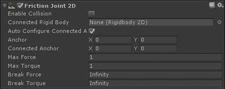

除了我们在上一节中看到的参数之外，**2D 摩擦关节**还有以下选项：

+   **最大力**：这决定了连接两个刚体的直线上的线性阻力。高值（最大值为 1,000,000）会产生强烈的线性阻力；因此，两个刚体不会在它们连接的直线上移动很多。相反，低值允许更多的运动。

+   **最大扭矩**：这决定了两个刚体之间的角阻力。高值（最大值为 1 百万）会产生强烈的角阻力；因此，两个刚体不会相对旋转很多。相反，低值允许更多的运动。

这个关节的使用示例之一是当游戏中存在需要摩擦力来显得逼真的物理对象时。想象一个平台，它固定在背景中的一个大轮子上。由于游戏是 2D 的，这个轮子只是一个美学元素；它实际上并不影响平台。因此，我们需要模拟平台和轮子之间的摩擦力，我们可以通过使用**2D 摩擦关节**来实现这一点。这样，我们可以在平台上产生一个角阻力；因此，它仍然可以旋转，但不是那么容易。也许，玩家可能会在平台的边缘放下一个重箱子，使其旋转足够，以便玩家可以通过。

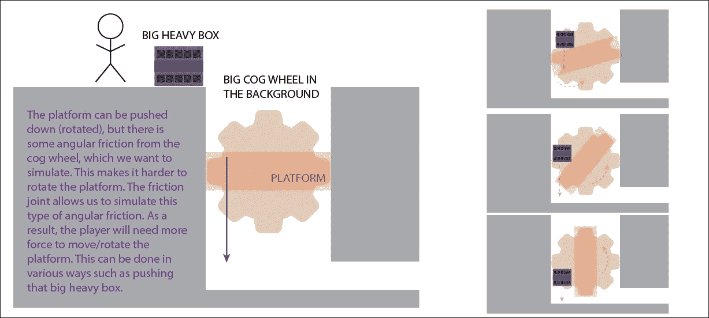

左边是系统的表示。右边是当箱子被扔到平台上时会发生的情况，由于角摩擦，平台会缓慢旋转。

### 2D 铰链关节

此关节的目的是将刚体约束在围绕另一个刚体或空间中的固定点（如果将**连接刚体**设置为`None`，则始终由**连接锚点**指定）旋转。旋转可以是被动发生的（例如，响应碰撞或在重力作用下）或由电机主动提供扭矩，该电机为刚体提供扭矩。此外，可以设置限制以仅允许铰链在特定角度旋转，或允许围绕其轴旋转超过一整圈。

在**检查器**中看起来如下截图所示：

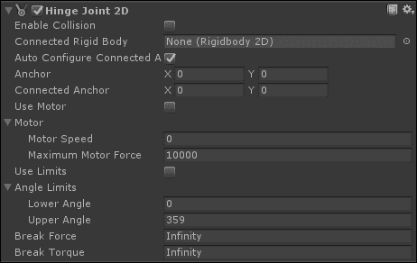

除了我们在上一节中看到的参数之外，**Hinge Joint 2D**还有以下选项：

+   **使用电机:** 如果启用，它允许关节在刚体上主动施加扭矩，模拟电机。

+   **电机速度:** 这指定模拟电机应以每秒多少度旋转。因此，值为 30 表示电机将在 12 秒内完成一整圈旋转（*360/30=12*）。

+   **最大电机力:** 这指定电机可以达到**电机速度**的最大力。想象一个非常重的物体需要更大的力来旋转并达到**电机速度**。如果电机不够强大，它将无法使刚体达到**电机速度**。此外，如果指定了**断力矩**，它可能会破坏关节。

+   **使用限制:** 如果为真，则关节限制刚体可以旋转的角度。

+   **下角:** 这设置由限制允许的旋转弧的下端。

+   **上角:** 这设置由限制允许的旋转弧的上端。

使用此关节的一个清晰的例子是与门一起使用。它们可以围绕铰链旋转，铰链将门与框架连接起来。我们可以限制门可以如何旋转，例如，你可能只想让它旋转 90 度。此外，如果门是自动的，我们可以模拟一个电机，该电机主动使门旋转。实际上，电机可能由脚本触发。最后，如果玩家想要将门推过其限制（例如，90 度），并且指定了**断力矩**，玩家可能用足够的力破坏铰链。

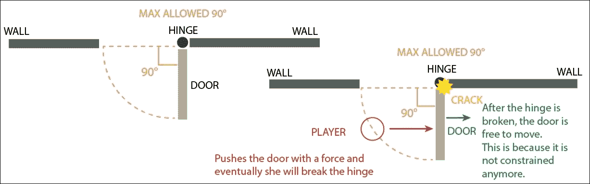

俯视图（鸟瞰图）。在左侧是系统的表示。在右侧是玩家推门超过其限制时会发生的情况。

### 相对关节 2D

这个关节使两个刚体保持基于彼此位置的相对位置。实际上，这个关节的目标与**固定关节 2D**相同；区别在于它们是如何实现的。**固定关节 2D**，正如我们之前看到的，是一种弹簧式的关节，只有当两个刚体处于指定的偏移和旋转位置时，它才会停止振荡，弹簧处于静止位置。相反，**相对关节 2D**是一种电机式的关节，它对刚体施加直接力和扭矩，使它们处于相同的偏移和旋转位置。

与**固定关节 2D**类似，**相对关节 2D**也可以与这两个一起工作：

+   两个刚体

+   一个刚体和一个固定点

要使用第二种情况，将**连接刚体**设置为`None`，然后在**线性偏移**变量中指定固定点的坐标。

它在**检查器**中显示如下：

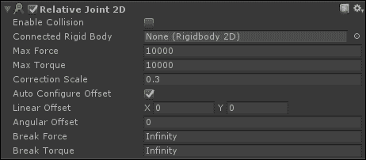

除了上一节中看到的参数外，**相对关节 2D**还有以下选项：

+   **最大力**: 这指定了关节/电机可以用来校正两个刚体之间偏移的最大力。值越高，模拟的电机越能有效地校正偏移。默认情况下，**最大力**设置为`10000`，这意味着一个非常强大的电机。

+   **最大扭矩**: 这指定了关节/电机可以用来校正两个刚体之间角偏移的最大扭矩。值越高，模拟的电机越能有效地校正角偏移。默认情况下，**最大扭矩**设置为`10000`，这意味着一个非常强大的电机。

+   **校正比例**: 调整关节以确保其按预期行为。这可以通过增加**最大力**或**最大扭矩**来实现，这可能会影响行为（因此关节可能无法达到其目标）。因此，您可以使用此设置进行校正。默认设置`0.3`通常是合适的（因为平均而言，关节的行为符合您的预期；这是一个可能通过试错找到的值）。但可能需要在 0 到 1 的范围内进行调整。

+   **自动配置偏移**: 当选中时，这将获取两个刚体的当前线性偏移和角偏移，将它们存储在**线性偏移**和**角偏移**变量中，并保持它们。

+   **线性偏移**: 这指定了两个刚体应具有的线性偏移，以局部坐标表示。

+   **角偏移**: 这指定了两个刚体应具有的角偏移，以局部坐标表示。

这种关节的一个使用示例是在游戏中的摄像机和 Avatar 之间。这样，摄像机可以稍微延迟地跟随 Avatar（因为如果摄像机是父级，它将与 Avatar 瞬间移动）。但它的振荡不会像**固定关节 2D**那样大，因为它是弹簧类型，可能会让玩家感到沮丧（当然，这也取决于**固定关节 2D**的配置，可能是一个真正的刚性弹簧；但通常在这种情况下使用**相对关节 2D**）。

这种关节的另一个典型使用示例是当某些东西应该跟随玩家时，例如她头上的生命计数器或她肩膀后面的友好精神。

### 滑块关节 2D

假设你想要限制刚体的运动仅沿一条线，这样它只能滑动到那条线上。这就是**滑块关节 2D**允许你做到的。至于其他关节，这条线可以在两个刚体之间，或者是一个刚体和游戏世界中的一个固定点之间。

它在**检查器**中看起来是这样的：

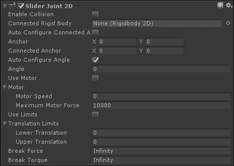

除了上一节中我们看到的参数之外，**滑块关节 2D**还有以下选项：

+   **角度**：这指定了刚体被约束保持的角度。在二维世界中，一个角度完全指定了一个方向，这个角度指定了运动受约束的方向。

    ### 注意

    为了完全确定关节允许运动的那条线，还需要考虑刚体的当前位置。因此，一个点（刚体的当前位置）和一个方向（从**角度**变量指定）唯一地确定了一个运动受约束的线，如下面的图所示：

    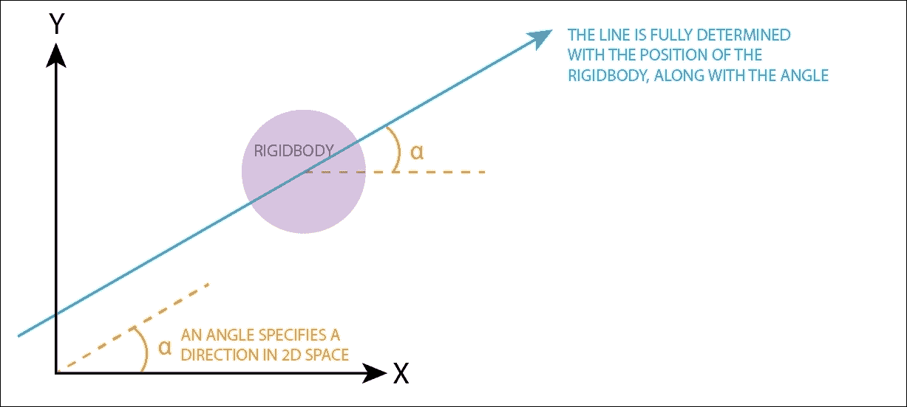

+   **使用电机**：如果为真，该关节还会使用模拟电机。

+   **电机速度**：这指定了电机应该达到的刚体速度。

+   **最大电机力**：这指定了电机为了达到刚体的电机速度所能使用/施加的最大力。

+   **使用限制**：如果为真，这允许对刚体沿线的某一段进行进一步的约束。

+   **下限**：这指定了刚体应从**连接锚点**处保持的最小距离。

+   **上平移**：这指定了刚体应从**连接锚点**处保持的最大距离。

你可能想要使用这种关节的典型场景包括滑动门，它可以上下移动，以及平台，它可以左右、上下甚至对角移动。

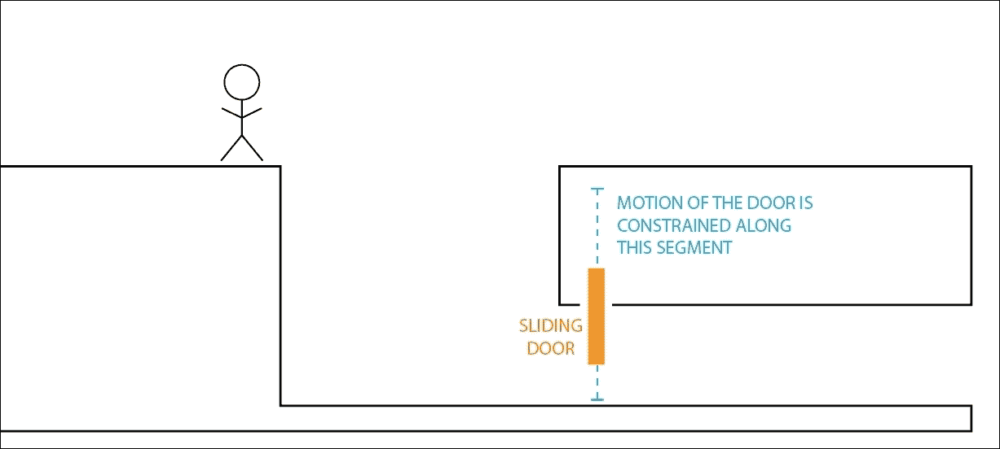

图中的滑动门沿着一段被约束

### 2D 弹簧关节

如其名所示，这是一个纯二维弹簧关节。它实际上模拟了连接在两个刚体之间，或刚体和固定点之间的弹簧。实际上，这个关节为你提供了弹簧关节的所有功能，因此你可以模拟所有其他纯（不带电机）的弹簧关节。

### 注意

事实上，**二维距离关节**是通过使用**二维弹簧关节**来模拟的，其中**频率**设置为`0`，**阻尼比**设置为`1`。

它在**检查器**中看起来如下所示：

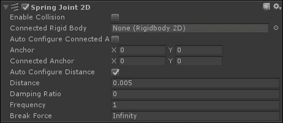

除了上一节中我们看到的参数外，**二维弹簧关节**还有以下选项：

+   **距离**：这指定了两个刚体（或刚体和固定点）应保持的距离。你可以想象它也像弹簧在静止状态下的长度，这意味着没有施加力时弹簧的长度。

+   **阻尼比**：这指定了你想要抑制弹簧运动的程度。其值范围从 0 到 1。较低的值意味着可移动的弹簧，较高的值意味着硬弹簧。如果设置为 1，则弹簧不可移动。

+   **频率**：这指定了当物体接近指定的分离距离（即弹簧在静止状态下的长度）时，弹簧振动的频率（以每秒周期数衡量）。其范围从 0 到 1,000,000。数值越高，弹簧越硬。

无论何时你需要在你的游戏中放置一个弹簧，这个关节就是正确的选择。所以，一个例子可能是一个物理上逼真的发射台，你需要压缩弹簧，以便在跳跃时给它一个助推。然而，你不必一定将这个关节视为一个普通的弹簧。事实上，你可以将这个关节推向极限（例如一个非常硬的弹簧）。这样，你就能创建出在现实中没有弹簧，但在游戏中通过弹簧连接看起来很棒的其他行为。你玩过**雷曼**吗？这个角色的身体部位是分开的，但在游戏中它们仍然以协调的方式移动。如果你计划创建一个类似的角色，弹簧关节可以是一个将身体部位以逼真方式连接起来的有效解决方案。以下是**雷曼**的图像：


**雷曼**的图像。正如你所见，这个角色没有腿或手臂，但有手和脚。在你的游戏中，你可以通过一个弹簧关节将它们附着在胸部。

### 目标关节 2D

**目标关节 2D**是一种特殊的弹簧型关节，它没有第二个刚体，而是有一个目标。目标是保持组件附着在刚体上的距离一定距离。它只施加线性力；因此不会给刚体提供扭矩。

它在**检查器**中看起来是这样的：

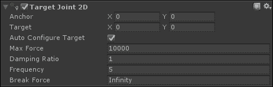

由于此组件没有第二个刚体，有一些变量允许你指定目标：

+   **锚点**：在局部坐标系中定义，相对于刚体，关节附着在刚体上的位置。

+   **目标**：在局部坐标系中定义，相对于刚体，关节的另一端试图移动的位置。

+   **自动配置目标**：当勾选时，将**目标**设置为刚体的当前位置，这在我们的刚体被移动时很有用，可能是由其他力驱动的。此外，当选择此选项时，**目标**会随着刚体的移动而改变；相反，如果没有选择此选项，则不会改变。

此外，可以使用常规参数来控制弹簧的特性：

+   **最大力**：这指定了关节可以对刚体使用的最大力

+   **阻尼比**：这指定了弹簧运动被抑制的程度（有关更多详细信息，请参阅*弹簧 2D 关节*或*固定 2D 关节*部分）

+   **频率**：这指定了弹簧的频率（有关更多详细信息，请参阅*弹簧 2D 关节*或*固定 2D 关节*部分）

此关节的一个使用示例是在玩家需要用鼠标拖动对象时。在这种情况下，你可以将拖动的对象的目标设置为光标，这样它就会跟随光标，而不会有一个刚性的运动（就像我们会逐帧设置对象的位置到鼠标坐标一样）。此外，你可以使用**锚点**来指定对象应该连接的位置。例如，如果玩家从对象的角落开始拖动，你可以将**锚点**设置为那里，结果，对象将从那个点悬挂。

### 注意

你可以在上一章的某个练习中找到这个关节，以改善你游戏的外观。

### 轮关节 2D

轮关节 2D 是一种弹簧和马达类型关节的组合，它有非常特定的用途。正如其名所示，它模拟了车轮对物体施加的约束。特别是，它可以使用马达（车轮移动）旋转车轮，并使用弹簧模拟悬挂。

更具体地说，关节对两个连接的刚体施加线性力以保持它们在一条线上，一个角马达以在线旋转它们，以及一个弹簧来模拟车轮悬挂。

### 注意

有趣的是，你可以通过组合**滑块关节 2D**（两个**使用马达**和**使用限制**都关闭）和**铰链关节 2D**（**使用限制**关闭）来重建**轮关节 2D**。

它在**检查器**中看起来如下：

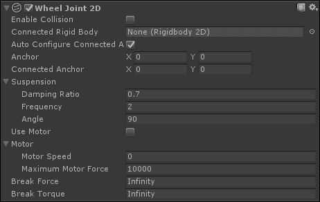

如您从前面的截图中所见，参数分为**悬挂**，它定义了一个弹簧和一个马达。两者都使用我们之前已经看到的相同参数（除了**角度**）和马达。

悬挂由以下定义：

+   **角度**：这指定了悬挂发生的角度（以世界坐标中的度数表示）。默认情况下，它设置为`90`度，这意味着悬挂将向上发生，就像通常发生的那样（汽车的车身位于车轮之上，因此悬挂的方向沿着正*y*轴，这意味着 90 度），如下面的图所示：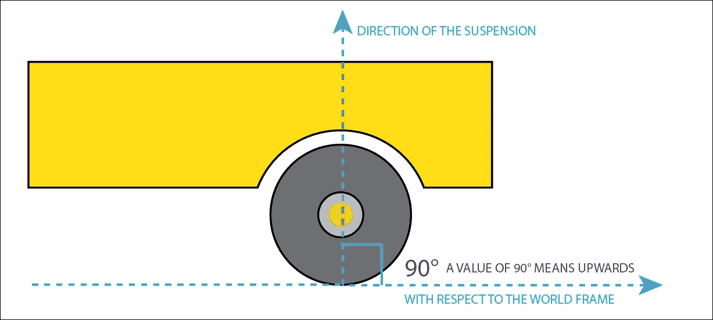

    在这个图中，我们可以看到汽车的轮子悬挂角度为 90 度，这意味着在游戏世界中向上。这是默认值。想象一下，如果你想有一辆能够通过磁力轮在天花板上行驶的汽车；你可能需要考虑改变悬挂的角度。在这种情况下，它与正常情况相反，因此角度将是 270 度。

+   **阻尼比**：这指定了弹簧运动被抑制的程度（有关更多详细信息，请参阅*2D 弹簧关节*或*固定 2D 关节*部分）。

+   **频率**：这指定了弹簧的频率（有关更多详细信息，请参阅*2D 弹簧关节*或*固定 2D 关节*部分）。

电机由以下定义：

+   **电机速度**：这指定了电机在轮子上应达到的速度

+   **最大电机力**：这指定了电机在轮子上施加的最大力，以便在轮子上达到**电机速度**

无需告诉你这个关节最常用的用途。每次在你的游戏中有一个轮子并且需要以逼真的方式移动时，这个关节就是你的最佳选择。

### 小贴士

如果你想创建一个由玩家控制的汽车，你可以将这个关节连接到车轮上，并将**电机速度**设置为`0`，以便通过你的脚本根据玩家的输入来控制这个变量。此外，你可以使用**最大电机力**来模拟不同的档位。

# 效果器

想象一下我们的英雄正在穿越一个魔法房间，因此他开始因为一个强大的咒语而漂浮。在这种情况下，当英雄在这个房间里时，重力应该被一种（魔法）力量所抵消。因此，我们需要指定在那个房间里，有一种使我们的英雄悬浮的力。

类似地，想象一下英雄在湖中扔下一个箱子。箱子不会以与它下落相同的速度下沉；此外，它可能会漂浮。因此，在我们的游戏中，我们需要指定湖所界定的区域具有特殊的物理属性。

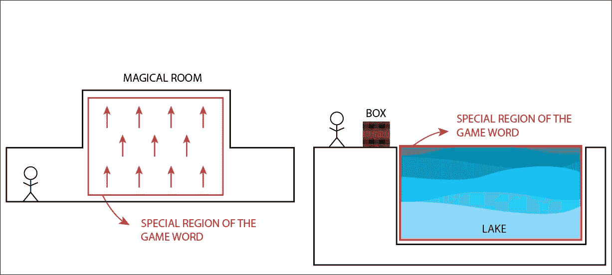

游戏世界中有一些特殊的区域，那里的物理定律可能与其他游戏世界不同；在 Unity 中，这些区域可以通过效果器来指定

在 Unity 中，这可以通过使用作用力来实现。作用力是一些组件，它们会影响游戏世界中特定区域刚体的行为。它们之间真的很不同，因为它们做不同的事情，尽管核心概念是相同的：它们影响一个或多个进入它们控制区域的刚体。

作用力使用碰撞检测来知道它们区域内有哪些刚体，因此，正如我们之前提到的，刚体需要有一个碰撞器。否则，它们不会受到作用力的影响。

此外，作用力本身也需要它们自己的碰撞器才能工作。为了被作用力使用，它们应该将**由作用力使用**属性设置为 true。否则，作用力将不会影响任何刚体。作用力的碰撞器是否应该设置为触发器取决于作用力的类型以及你试图实现的目标，尽管有一个默认的方式去设置它（实际上，Unity 会在你以不寻常的方式使用作用力时给你一个警告）。

我们将逐个分析，这里有一个总结表，列出了作用力，说明了是否应该使用**is Trigger**：

| **作用力** | **链接的碰撞器应该是触发器吗？** |
| --- | --- |
| 二维恒力 | 此组件连接到刚体，而不是碰撞器 |
| 区域作用力 2D | True |
| 浮力作用力 2D | True |
| 点作用力 2D | True |
| 平台作用力 2D | False |
| 表面作用力 2D | False |

所有这些（除了二维恒力之外）都有几个变量来确定哪些刚体受到作用力的影响，这些变量是：

+   **使用碰撞器掩码**：如果启用，这允许你通过在下一个变量中指定的层来区分进入区域的碰撞器。

+   **碰撞器掩码**：这决定了哪些层会受到作用力的影响。再次提醒，你可以通过第二章，*制作纸杯蛋糕塔*来学习如何添加层。因此，在这个变量中，你可以通过使用下拉菜单来指定其中一个。

让我们详细看看每一个，以便更好地理解它们是如何工作的。

## 二维恒力

这不是一个合适的作用力，因为它不是在区域或区域内起作用，而是直接作用于刚体。因此，它需要连接到具有刚体组件的同一游戏对象。

在**检查器**中，它看起来是这样的：

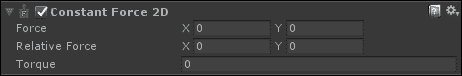

### 注意

出于好奇，对于这个组件，有一个 3D 对应物：**恒力**。

如其名称所示，它对刚体施加恒定力。通常这用于测试，以便容易地从 **检查器** 中施加力，但也可以在正常游戏玩法中使用，如果我们需要一个始终受到恒定力控制的物体（这样它就会持续推动）。当然，其值可以通过脚本更改以使其成为非恒定力，但在那种情况下，最好通过脚本中的函数直接施加力。该组件应仅用于恒定力或随时间不改变的力（力可以改变，但长时间内保持恒定）。

此外，此组件还可以用于对刚体施加扭矩。

这里是三个变量的示例：

+   **力**: 施加到刚体上的恒定力。

+   **相对力**: 以刚体坐标为基准施加到刚体上的恒定力

+   **扭矩**: 施加到刚体上的恒定扭矩

这里是一个非测试用例的示例。假设你正在制作一个游戏，其中不同的物体受到不同的重力影响。例如，棕色箱子将像往常一样在地面上跟随，但绿色箱子将向右跟随，因为根据你的游戏设计，它们应该这样做。原因可能是一种实验性血清，用于改变绿色物体的重力。在这种情况下，绿色箱子不能受到正常重力的影响，因此你可以在它们上面放置一个刚体并将 **重力缩放** 设置为 `0`。这样，它就不会受到正常重力的影响。然后，放置 **恒定 2D** 力组件并设置你的重力。此外，如果所有物体都有不同的 **恒定 2D** 力，你可以在实时更改它们的重力力，也许是在发明另一种血清之后，这种血清改变了左边的重力而不是右边。

## 面积效应器 2D

此组件定义了一个区域，在该区域内对区域内的所有刚体施加力。你可以配置以特定大小和在该大小上的随机变化的角度的力。你还可以施加线性拖动力和角拖动力来减慢刚体 2D 的速度。

为了工作，此效应器需要一个具有 **Used By Effector** 和 **is Trigger** 都设置为 true 的碰撞器。实际上，刚体应该能够进入其中。

该组件有两个折叠菜单（可展开的菜单选项）用于设置相对选项，**力** 和 **阻尼**，正如我们从这张图中可以看到的，它显示了 **检查器** 中的组件：

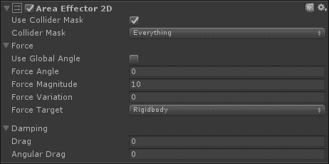

### 注意

这两个折叠菜单只出现在 Unity 的最新版本中。所以如果你使用的是旧版本并且没有看到它们，请不要担心；选项只是重新排序了，但它们仍然按此处描述的方式工作。

所有变量都有直观的名称，但让我们快速浏览一下：

+   **使用全局角度**：如果勾选，则下一个变量将在世界坐标中解释，否则在局部坐标中。

+   **力角度**：这是要应用力的角度，因此它定义了方向。

+   **力大小**：这是大小，意味着力的强度。

+   **力变化**：这是力大小的变化，以便不是始终有恒定的力并提高现实感。请注意不要给出过高值，这可能会导致不希望的行为。

+   **力目标**：这可以是**刚体**或**碰撞器**。在第一种情况下，力将始终作用于质心。在第二种情况下，如果碰撞器不在质心上，力也会为刚体产生扭矩。

+   **阻力**：这是在区域内部应用线性阻力。

+   **角阻力**：这是在区域内部应用的角度阻力。

这里是一个使用此组件的例子。假设有一个特殊的设备，能够推动主角的磁性鞋子以对抗重力。因此，在这个设备正上方的区域，您可以放置一个区域效应用户指定向上的力。请注意，如果力的强度小于重力，那么您的角色将会有一个大跳跃，但最终她会掉下来。而如果力值更大，即使没有跳跃，她也会开始向上漂浮，直到遇到障碍物或区域效应用户指定结束。

## Buoyancy Effector 2D

此组件用于模拟流体，因此它可以使刚体漂浮。它需要一个同时设置了**由效应用户使用**和**是触发器**的碰撞器。实际上，刚体应该能够进入它。

它在**检查器**中看起来如下：

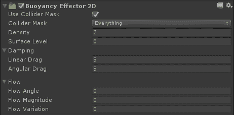

### 注意

从这张截图我们可以看到，有两个折叠部分有助于组件的逻辑顺序。如果它们不在那里，请不要担心。您可能在使用 Unity 的较旧版本。

主要变量如下：

+   **密度**：这表示流体的密度，并且它会影响不同刚体根据刚体密度受到效应对象的影响。实际上，密度较高的刚体会下沉，密度较低的刚体会漂浮，而与流体密度相同的刚体将在流体中悬浮。

+   **表面水平**：这表示流体表面相对于附加效应对象的 Transform（位置）的位置。零值表示表面将位于物体的中心，并且它位于碰撞器的中间（仅当碰撞器没有偏移时）。您可以从**场景**视图中的蓝色线条中识别它。

+   **阻力**：这是在表面下方区域内部应用的线性阻力。

+   **角阻力**：这是在表面下方区域应用的角度阻力。

+   **流动角度**：这指定了力场流动力应用的世界坐标角度。因此，它定义了力的方向。

+   **流动大小**：这指定了流动力的强度，因此力场的浮力水平。它可以取负值，在这种情况下，就像**流动角度**旋转了 180 度一样。

+   **流动变化**：这表示**流动大小**可以变化多少，以便不是恒定的，从而实现更高的现实感。

在**场景**视图中，组件看起来是这样的，以实际显示表面层级：

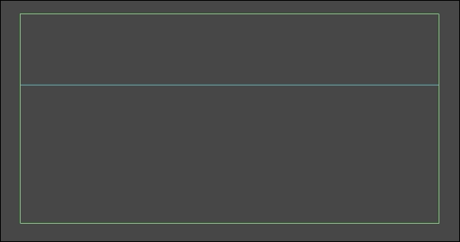

此外，这里是其使用的一个示例。假设在你的 2D 游戏中有一个海洋，主要角色必须跳到港口的一些平台上。将此力场放置在海洋水平将使其行为更加逼真。例如，主要角色可以将一个木箱推入海中，使其浮起，然后她可以跳到浮动的箱子上以穿越。

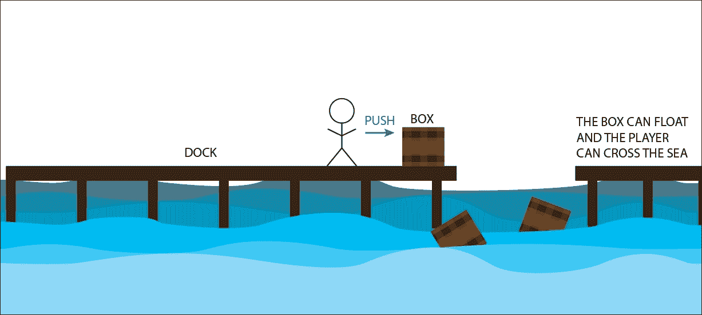

Buoyancy Effector 2D 的一个使用示例，它可以模拟海洋并使木箱浮起；因此，玩家可以跳到木箱上并穿越海洋

## 点力场 2D

你可以将这个组件想象成一个刚体的磁铁，因此它可以推动/排斥或吸引它们，就像力场的名字所暗示的那样，集中在一个点上。这个点可以通过碰撞器（最常用）或附加到力场相同游戏对象的刚体来确定。

组件需要一个具有**由力场使用**和**是触发器**设置为 true 的碰撞器。实际上，刚体应该能够进入其中。

它在**检查器**中看起来是这样的：

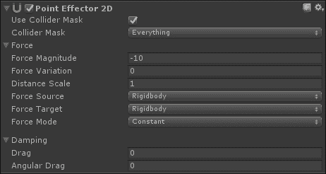

### 注意

再次强调，展开图只存在于 Unity 的最近版本中。

主要变量如下：

+   **力的大小**：力的大小，即力的强度。

+   **力变化**：力的强度变化，以便不是始终有恒定的力并提高现实感。注意不要给出过高值，这可能会导致不希望的行为。

+   **距离缩放**：当计算刚体和吸引或排斥点之间的距离时，它会被**距离缩放**缩放（乘以）。这样，你可以修改力场的行为（参见此列表中的**力模式**）。

+   **力源**：这可以是**刚体**或**碰撞器**。在第一种情况下，吸引或排斥的点将放置在刚体的中心（这意味着在其质心）。在第二种情况下，它将放置在碰撞器的中间。

+   **力目标**：这可以是**刚体**或**碰撞器**。在第一种情况下，力将始终应用于进入效应器的刚体的质心。在第二种情况下，如果碰撞器没有在质心中心，力也会为刚体产生扭矩。

+   **力模式**：这指定了力的计算方式，它可以是三种类型之一。**恒定**是最直观的。力始终是恒定的，无论受到效应器影响的刚体与排斥或吸引点之间的距离如何。这意味着只有刚体和点之间的相对位置被考虑来确定力的方向，该方向位于两者之间。相反，在**逆线性**中，力根据刚体和点之间的距离改变其强度。距离加倍，力强度减半。最后，**逆平方**，这在大多数情况下是最物理现实的，考虑了距离的平方。这意味着距离加倍，力强度减为四分之一。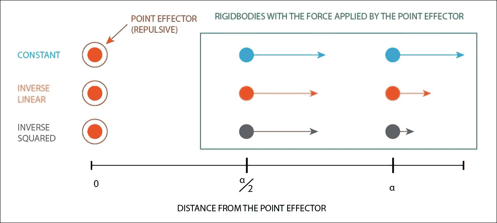

    不同力模式之间的差异

    在这个图中，左边是一个排斥点效应器。下面是一个距离刻度，所有这些都包含在点效应器的范围内。假设在距离半 alpha 处，三个不同的刚体从效应点的位置受到相同的应用力。在 alpha 距离处，恒定模式将保持其全部力应用于刚体。**逆线性**模式将力减半，因为距离加倍。最后，**逆平方**模式（这是最物理现实的，因为重力和电磁力都有这种行为）将力强度减为距离一半处的四分之一。

+   **阻力**：这是在效应器区域内要应用的线性阻力。

+   **角阻力**：这是在效应器区域内要应用的角阻力。

下面是它用法的一个例子。假设主要角色有一个特殊的戒指，当激活时，会吸引金属（当戒指未激活时，它会吸引主要角色的妻子）。因此，每当玩家激活戒指时，游戏就会在主要角色上激活一个点效应器，并通过**碰撞掩码**变量，只可以选择金属。

## 平台效应器 2D

此组件为 2D 游戏提供了一个平台效果。例如，它实现了单向碰撞。所以如果角色从平台下方跳起，他将穿越平台，但当他落在平台上时，平台将产生碰撞，保持角色在平台上方。此外，它可以用来去除侧面摩擦/反弹。

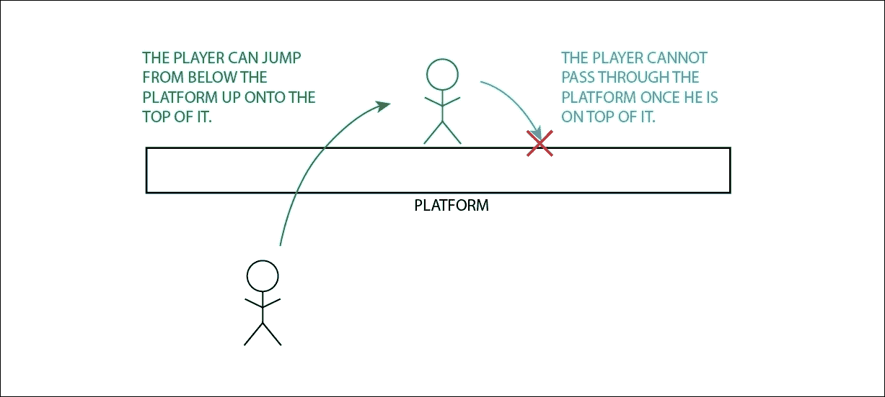

使用这个效应器，玩家可以单向穿越碰撞器，但不能反向穿越。在一些平台游戏中，玩家可以从下面跳到平台上，但不能从上面跳下来。

实际上，这是构建平台游戏最常用的组件。想想像《Braid》这样的游戏，玩家可以从下面的平台上跳到上面的平台上。

该组件需要一个设置为**由效应器使用**但不是**是触发器**的碰撞器。实际上，刚体应该能够与之碰撞。

这就是它在**检查器**中的显示方式：

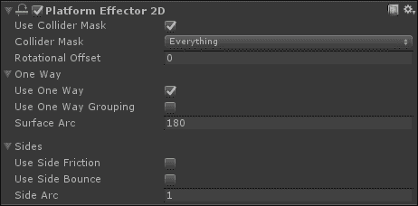

### 注意

再次强调，展开项仅存在于 Unity 的最新版本中。此外，旋转偏移是一个最近添加的参数。

在这里，你可以看到这个组件在**场景视图**中的一个可能实例。

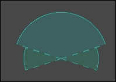

这是在其 Gizmo 激活时在场景视图中显示的效应器。

顶部的较大弧线定义了平台/碰撞器不可穿越的方向，而两侧的两个小弧线定义了平台的一侧。

主要变量如下：

+   **旋转偏移**：这表示整个平台效应器的角度偏移（以度为单位）。这是最近在 Unity 中添加的，多亏了它，可以旋转平台效应器，使其平台倾斜，或者墙壁可以单向穿越。例如，你也可以用它来创建单向穿越的魔法传送门。

+   **使用单向**：如果勾选，平台将只在单向发生碰撞。

+   **使用单向分组**：这确保了所有由单向行为禁用的接触都会作用于所有碰撞器。当在穿过平台的对象上使用多个碰撞器，并且它们都需要作为一个组一起作用时，这很有用。

+   **表面弧线**：这指定了在顶部进行碰撞的弧线的宽度（以度为单位）。在其他所有方向上，如果**使用单向**被启用，则不允许任何碰撞，允许任何刚体通过，例如你的角色。

+   **使用侧面摩擦**：如果为真，则对平台效应器的侧面应用摩擦。

+   **使用侧面弹跳**：如果为真，则对平台效应器的侧面应用弹跳。

+   **侧面弧线**：这指定了平台效应器两侧（如果**旋转偏移**设置为`0`；否则可能表示上下）的度数，这些被认为是平台效应器的一侧。因此，如果**使用侧面摩擦**或**使用侧面弹跳**被启用，这将应用于此处指定的弧线上。

除了使用这个组件创建平台游戏的传统用途之外，让我们看看另一个可能需要使用它的例子。想象一个解谜游戏，其中一些传送门只能单向穿越。因此，我们可以放置一个平台效应器，并设置其**旋转偏移**，以便只有传送门的一侧发生碰撞。结果，角色只能单向穿越魔法传送门，而不能像以下图中所示的反方向穿越：

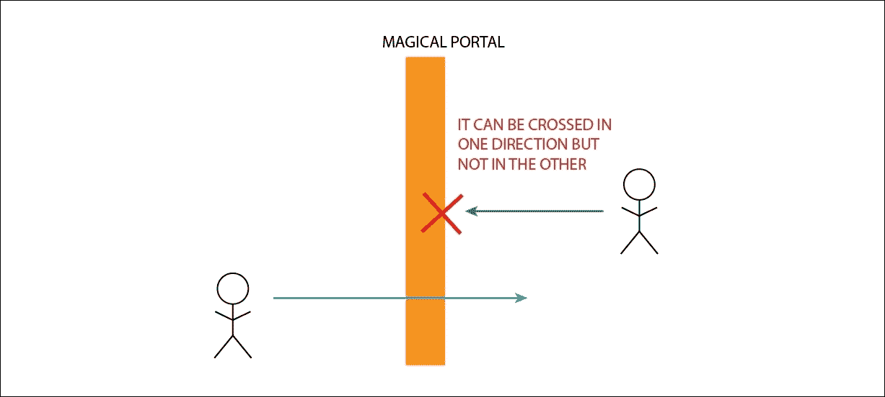

这就是如何以另一种方式使用这个效应器，而不是传统的平台方式的一个例子。通过旋转组件的**旋转偏移**，可以制作一个单向可穿越但另一方向不可穿越的魔法传送门。这可能是一个解谜游戏中的有趣游戏机制。

## 表面效应器 2D

此组件将切向力应用到由与该效应器关联的碰撞器指定的表面上。换句话说，您可以将其想象成一个传送带，它将刚体沿着力的方向运输，只要它们接触表面。

这就是它在**检查器**中的样子：

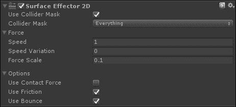

您可以通过两个折叠菜单访问**表面效应器 2D**的选项，并且您可以找到这里可以设置的参数：

+   **速度**：切向力应保持的速度。换句话说，它是传送带的速度。

+   **速度变化**：速度的最大变化，以便不是始终有恒定的速度，尤其是如果您有很多这样的效应器。随机变化范围从零到**速度变化**中的值。因此，正值带来随机的增量，而负值带来随机的减量。

+   **速度缩放**：这允许您缩放当效应器尝试将接触的刚体加速到沿表面的指定速度时施加的切向力。如果设置为`0`，则实际上不会应用任何力，这就像组件被禁用一样。另一方面，如果设置为`1`，则表示施加了全部力量。考虑这个参数的一个有用方法是考虑与表面接触的刚体加速到指定速度的速度有多快；较低的值意味着需要更多的时间，而较高的值意味着可以更快地达到速度。然而，您应该小心使用全部力量，因为刚体可能会遇到其他力，导致刚体产生不希望的运动。

+   **使用接触力**：如果为真，将使用接触力。尽管这更符合物理现实，但它可能会对接触表面的刚体施加扭矩。因此，在现实感取决于设计的视频游戏中，你可以选择启用它，因为默认是禁用的。一个简单的想象方法是，你正在一个真正的传送带上跳跃。传送带的接触力和切向力会使你的腿向前移动，但由于惯性，你的胸部会保持在后面，这可能会导致你跌倒。这意味着你的身体已经开始因为扭矩而旋转，如下面的图所示：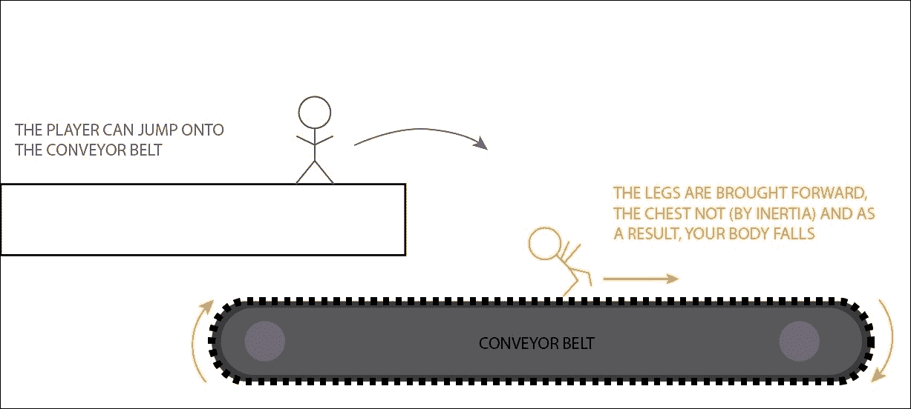

在这个例子中，当你跳上传送带时，你的腿会被传送带的切向力向前推。而你的胸部由于惯性而保持在后面，导致对你的身体施加了扭矩，因此你会跌倒。在 Unity 中，可以禁用接触力，以确保进入与传送带接触的刚体不会受到扭矩。

+   **使用摩擦力**：如果为真，表面将有摩擦力

+   **使用弹力**：如果为真，表面将有弹力

当然，自然的使用例子是在你的游戏中使用传送带。但让我们尝试找到另一个例子。假设你的游戏的主角有一个特殊的手套，当它接触金属墙时，能够通过产生磁场来对抗重力。你可以垂直放置一个表面感应器，并向上施加力，直到玩家触摸到那堵墙。

# 物理材料 2D

Unity 还提供了创建物理材料的功能，以便在物理对象与另一个对象碰撞时调整其摩擦力和弹性。在 2D 情况下，这是通过 **Physics Material 2D** 实现的。

您可以通过从顶部菜单选择 **Assets | Create | Physics Material 2D** 来创建一个 **Physics Material 2D**，如下面的截图所示：

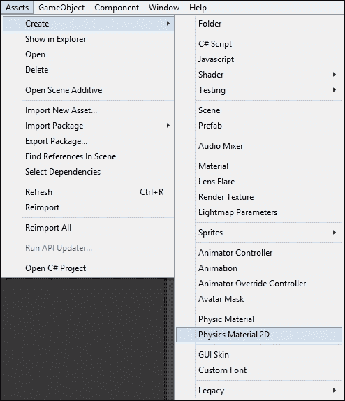

一旦在项目面板中选中，我们可以在 **Inspector** 中调整其两个值，如下所示：

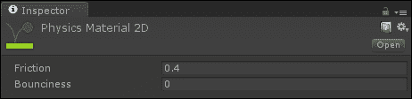

值得注意的是，我们在本章中看到了许多变量来分配一个 **Physics Material 2D**，并且它们被组织在一个简单的层次结构中：

1.  如果一个 **Collider** 有 **Physics Material 2D**，则它具有优先级，并将设置为 **Collider**。

1.  如果一个 **Collider** 没有分配 **Physics Material 2D**，则它将分配 **Rigidbody2D** 中的那个。

1.  即使没有 **Rigidbody2D** 的 **Physics Material 2D**，也会分配默认的 **Physics Material 2D**。默认的 **Physics Material 2D** 可以在 **Physics Settings** 中设置。

# 处理 Unity 中的物理

到目前为止，一切都很顺利，我们学习了 Unity 物理引擎的所有单个组件。然而，当涉及到构建自己的游戏时，处理物理可能有点棘手。实际上，只要在一些力上输入一些错误的值，整个场景就会很快变得混乱。解决这个问题的最佳方法是试错法。你实验得越多，你对物理引擎就越熟悉，你将发展出对如何在游戏中平衡所有值的直觉。结果，你将能够使你的场景按照游戏设计文档（或几乎）所描述的那样行动。

处理物理不仅仅是放置不同的组件，还包括如何编程它们。我们已经看到了一些有用的函数，可以应用于刚体以及当两个碰撞体相撞时的一些事件。但还有更多。首先，重要的是要理解，我们看到的所有组件的变量（如刚体、碰撞体、关节和效应器）都可以在运行时通过脚本动态分配。你只需要获取该组件的引用，然后你就可以更改其内部参数。

另一件可能很有用的事情是，可以通过一些函数查询物理引擎，以收集有关周围环境的信息。这些是`Physics2D`类的静态函数，因此可以使用以下代码片段来调用：

```cs
Physics2D.NameOfTheFunction(); 

```

当然，你需要将`NameOfTheFunction`替换为函数。`Physics2D`类公开了许多这些函数，但让我们只探索主要的一些：

+   `OverlapCircleAll(Vector2 point, float radius, [*可选参数]*)`: 这个函数返回所有在由`radius`和`point`（圆的中心）变量指定的圆内的`Collider2D`数组。换句话说，它检测所有在指定圆内的碰撞体。从碰撞体中，还可以检索到游戏对象本身。我们的纸杯蛋糕塔将使用这个函数来检测周围有多少敌人。此外，该函数的其他可选参数还可以用来指定要搜索的层掩码以及深度（*z*轴）的最小和最大值。

+   `OverlapCircle(Vector2 point, float radius, [*可选参数]*)`: 与之前的函数相同，但它不是返回完整的数组，而是返回第一次出现的结果。这在只需要检测某个物体是否在圆内时非常有用。

+   `RaycastAll(Vector2 origin, Vector2 direction, [*可选参数]*)`: 从 `origin` 向 `direction` 射出射线，并返回射线在 `RayCastHit2D` 数组（见后文）中击中的所有不同碰撞体，这是一个指定击中详细信息的类，包括碰撞体。此函数在您需要验证空间中是否存在某个物体时非常有用。此外，其他可选参数可以指定射线可以达到的最大距离、层掩码以及深度（*z* 轴）的最小和最大值。

+   `Raycast(Vector2 origin, Vector2 direction, [*可选参数]*)`: 与上一个函数相同，但不是返回完整数组，而是只返回第一次击中的结果。

### 注意

您可以在官方文档中找到 `Physics2D` 类的所有功能：[`docs.unity3d.com/ScriptReference/Physics2D.html`](https://docs.unity3d.com/ScriptReference/Physics2D.html)。

关于 `RayCastHit2D` 类，以下是我们可以检索的信息列表：

+   `centroid`: 执行投射所使用的原初体的质心

+   `collider`: 被射线击中的碰撞体

+   `distance`: 射线原点到击中点的距离

+   `fraction`: 击中发生沿射线的距离分数

+   `normal`: 被射线击中的表面的法向量

+   `point`: 射线在全局空间中击中碰撞体表面的点

+   `rigidbody`: 附着在击中对象的 `Rigidbody2D`

+   `transform`: 被击中对象的变换

总之，查询物理引擎是收集信息的一种常见做法，我们将在我们的 *塔防* 游戏中这样做。

# 物理学的其他事项

与其他章节一样，这是一个可选部分，其中包含对章节中主题的更深入见解。所以，如果您不感兴趣，请随意跳过本节，直接进入下一节。否则，就再喝点咖啡，继续阅读。

## 碰撞体上的 Simulate 设置

本节的目标是解释在刚体上启用和禁用物理组件，以及在刚体组件上启用和禁用 **Simulate** 设置之间的区别。

每次物理组件被添加、启用、删除或禁用时，物理引擎的内部内存都会更新（分别将组件添加到或从内存中删除）。当 **Simulate** 设置被禁用时，物理引擎只是停止对其执行计算——它不会从内存中删除对象。因此，当 **Simulate** 再次被选中时，物理引擎已经将所有对象/组件放入内存中，它不需要从头创建它们，从而提高了性能。

当然，如果你需要永久地从场景中移除刚体，那么只需删除组件即可，因为如果你只是取消选择**模拟**，组件仍然会在内存中，导致内存管理不佳。

## 2D 物理射线投射器组件

回到第三章，“与玩家通信——用户界面”，我们看到了 Unity UI 系统，在可选部分有画布的不同组件。其中之一是**图形射线投射器**，它能够检测屏幕上的用户输入。此组件检查玩家是否真的滑过了滑块或点击了按钮，然后通过与事件系统交换消息来触发事件。

如果我们有物理对象并且想要以类似于**图形射线投射器**为 UI 做的方式交换它们的事件，我们可以在相机上使用一个物理射线投射器 2D 组件来处理这些事件。

一旦添加了此组件，你就可以在物理对象的脚本中实现不同的接口。结果，当触发相应的事件时，它们将自动调用所实现的函数。

例如，一个事件可能是某个关节断裂，当这种情况发生时，你可能想要运行一些代码。此外，一些信息将被提供给函数；在关节的情况下，断裂关节的力的大小作为参数传递。

## 其他物理设置

在这里你可以找到其他物理设置：

+   **速度迭代次数**：在更新期间确定物理体速度所进行的迭代次数。数字越高，模拟越精确。缺点是计算成本。默认值是 `8`。

+   **位置迭代次数**：在更新期间确定物理体位置所进行的迭代次数。数字越高，模拟越精确。缺点是计算成本。默认值是 `3`。

+   **速度阈值**：与相对速度低于此值的碰撞被视为非弹性碰撞，这意味着碰撞的物体不会相互弹开。

+   **最大线性校正**：在解决约束时使用的最大线性位置校正。它可以是 `0.0001` 到 `1000000` 之间的任何值。它有助于防止超调。

+   **最大角校正**：在解决约束时使用的最大角校正。它可以是 `0.0001` 到 `1000000` 之间的任何值。它有助于防止超调。

+   **最大平移速度**：这是你的游戏中一个物体可能具有的最大（平移）速度。这个值是上限，这意味着任何试图达到更快速度的对象都将被限制在这个值。

+   **最大旋转速度**：这是你的游戏中一个物体可能具有的最大（旋转）速度。与之前相同的推理适用，只是用旋转代替平移。

+   **最小穿透量以应用罚力**：在应用任何分离冲量力之前允许的最小接触穿透半径。

+   **Baumgarte 比例尺**：这是一个比例因子，用于确定碰撞重叠解决的速度（见信息框）。

+   **Baumgarte 碰撞时间比例尺**：一个比例因子，用于确定碰撞时间重叠解决的速度（见信息框）。

### 注意

Baumgarte 的约束稳定化方法（有时简称为 Baumgarte 方法）是由 J. Baumgarte 在 1972 年发明的一种用于解决某些碰撞约束的算法，例如与关节。它足够快，可以在实时应用中使用，如视频游戏或机器人技术。这个技巧在于利用一些导出的微分方程的解析形式，这些形式是数值解决的。这使得算法不仅比其前辈运行得更快，而且精度更高。

**Baumgarte 比例尺**是算法的重要参数，它表示要应用的校正比率。一个常见的值，通常作为默认值给出，是 `0.2`，也是 Unity 的默认值。

值越高，你的关节越容易失控。另一方面，值越低，你的关节动作越少，可能会导致弹簧感。

+   **查询击中触发器**：这是一个切换按钮，如果设置为真，允许射线投射物击中触发体积。默认情况下，它是真的，但如果不想射线投射物击中触发体积，只想击中碰撞器，则可以取消选中。何时取消选中此框实际上取决于你游戏的设计，以及你打算如何编程它。其他物理设置

    当“查询击中触发器”设置为假（图的上半部分）时，触发体积不会被射线投射检测到。相反，当“查询击中触发器”设置为真（图的下半部分）时，触发体积也会被射线投射检测到，并作为碰撞返回。

+   **碰撞器内查询开始**：这是一个切换按钮，如果设置为真，允许从碰撞器内开始的射线投射物检测到碰撞器。默认情况下，它是真的，但如果许多射线投射物在碰撞器内开始并且你不想它们被返回为碰撞，则可以取消选中。再次强调，何时取消选中此框实际上取决于你游戏的设计，以及你打算如何编程它。其他物理设置

    当“查询开始于碰撞器”设置为假（图的上半部分）且射线投射物的来源在碰撞器内时，这个碰撞不会返回。相反，当“查询开始于碰撞器”设置为真（图的下半部分）时，射线投射物的来源所在的碰撞器也会被返回为碰撞。

+   **停止播放更改**：这是一个切换按钮，如果设置为真，则如果任何参与碰撞的 GameObject 被删除或移动，则立即停止报告碰撞回调。默认情况下，它是假的。

+   **Gizmos**: (本折叠图的描述将在下一节中介绍。)

### 碰撞体的 Gizmos

本节描述了**物理 2D**设置中之前菜单项**Gizmos**。

**Gizmos**是一个折叠图，显示你在编辑器内关于碰撞体可视化的额外选项。这些选项在调试中非常有用。这是它在**检查器**中的外观：

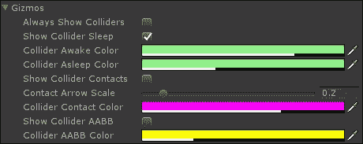

这里是对显示的选项及其用法的解释：

+   **Always Show Colliders**: 默认情况下，你只能在游戏对象（或其子对象之一）包含此类碰撞体时才能看到碰撞体。如果你启用此选项，你将始终能够看到碰撞体（无论何时**Gizmos**可见）。

+   **Show Collider Sleep**: 当启用时，它允许你在物理引擎中的睡眠模式下看到碰撞体。

+   **Collider Awake Color**: 这指定了当显示时唤醒（非睡眠）碰撞体应具有的颜色。默认情况下，它是一种浅绿色，其 alpha 通道（不透明度）设置为`192`。

+   **Collider Sleep Color**: 这指定了当显示时睡眠碰撞体应具有的颜色。默认情况下，它与碰撞体唤醒时的相同浅绿色，但 alpha 通道（不透明度）设置为`92`。

+   **Show Collider Contacts**: 当启用时，这允许你在碰撞体碰撞时看到接触点。它们显示为箭头（如下一图所示）。

+   **Contact Arrow Scale**: 此值允许你缩小由碰撞体的接触点显示的箭头。默认情况下，其值为`0.2`（如下一图所示）。

+   **Collider Contact Color**: 这指定了表示碰撞体接触点的此类箭头的颜色。默认情况下，它设置为浅紫色（如下一图所示）：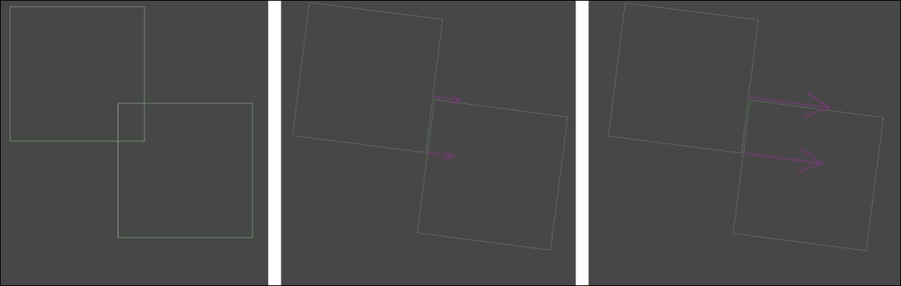

    左边有两个相互重叠的碰撞体。在中间，物理引擎更新碰撞体以模拟碰撞（因为它们不能重叠）。同时显示两个箭头之间的接触点。在右侧，是中间的相同图，但**Contact Arrow Scale**设置为`0.6`而不是`0.2`，因此箭头更大。

+   **Show Collider AABB**: 当启用时，这允许你看到碰撞体的**轴对齐边界框**（**AABB**）。正如其名称所暗示的，它是一个完全包含碰撞体的盒子，并且它与世界坐标系的轴对齐。例如，多边形碰撞体的边界框如下（在左侧）：

左边是具有其 AABB 的多边形碰撞体；右边是前一个图的相同图，但显示了其 AABB。

+   **Collider AABB Color**: 这指定了当显示时碰撞体 AABB 的颜色。

# 我们游戏中的物理

在本节中，我们将将本章的一些概念应用到我们的游戏中。特别是，我们将看到如何使用物理引擎检测当喷雾击中熊猫并对其造成伤害的情况。

## 设置 Pandas 为刚体

由于我们将利用物理引擎，我们需要正确设置熊猫，使其在场景中成为一个物理对象。这意味着给它一个刚体组件。

因此，我们可以先给 Panda 预制件添加一个 **Rigidbody2D** 组件，并将其 **Body Type** 设置为 **Kinematic**，如下截图所示：

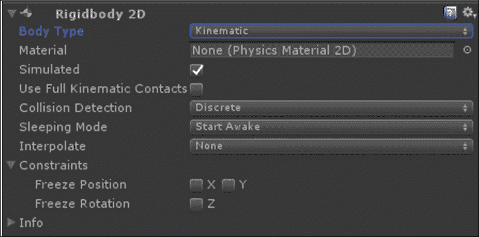

理论上，我们应该已经完成了，因为熊猫现在被视为一个物理对象。然而，在上一章中，我们编写了一个函数，允许熊猫通过直接在它的 Transform 上分配新位置来移动。由于现在熊猫有一个 **Rigidbody2D** 组件，我们不能再这样做（就像我们之前在 *刚体* 部分中解释的那样）。因此，我们需要稍微修改 `PandaScript`。特别是，我们需要获取熊猫刚体的引用，然后使用 `MovePosition()` 函数为 Kinematic 刚体。基本上，我们正在应用我们在 *处理刚体* 部分中学到的知识。

因此，打开脚本，并添加以下私有变量：

```cs
*//Private variable to store the rigidbody2D*
private Rigidbody2D rb2D;
```

然后，在 `Start()` 函数的末尾添加以下行：

```cs
*//Get the reference to the Rigidbody2d*
rb2D = GetComponent<Rigidbody2D>();
```

在 `MoveTowards()` 函数中，我们需要在熊猫的刚体上使用 `MovePosition()` 函数来改变其位置。此外，我们不再使用 `deltaTime`，而是用 `fixedDeltaTime` 替换它。因此，这里突出显示了与上一章相比的变化：

```cs
*//Function that based on the speed of the Panda makes it moving towards the destination point, specified as Vector3*
private void MoveTowards(Vector3 destination) {
 *//Create a step and then move in towards destination of one step*
  float step = speed * Time.fixedDeltaTime;
 rb2D.MovePosition(Vector3.MoveTowards(transform.position,
    destination, step)); }
```

### 注意

我们需要记住，现在应该调用 `MoveTowards()` 函数是在 `FixedUpdate()` 中，而不是在 `Update()` 中。我们将在 [第七章](https://cdp.packtpub.com/b03794gettingstartedwithunity2dgamedevelopmentsecondedition/wp-admin/post.php?post=220&action=edit#post_247) 中看到这一点，“交易纸杯蛋糕和终极蛋糕争夺战 – 游戏玩法编程”。但下一个部分可以有一个例子。

最后，我们可以保存脚本，我们就完成了熊猫的设置。

## 设置弹射体为刚体

与我们为 Pandas 做的类似，我们需要给所有弹射体添加一个 **Rigidbody2D** 组件，并将 **Body Type** 再次设置为 **Kinematic**。

如果你还记得，弹射体过去是通过直接改变它们的 Transforms 来移动的，我们需要修复这个问题，因为它们也有一个 **Rigidbody2D** 组件。

打开脚本，就像我们为 Pandas 做的那样，添加以下私有变量：

```cs
*//Private variable to store the rigidbody2D*
private Rigidbody2D rb2D;
```

然后，在 `Start()` 函数中，让我们获取它的引用：

```cs
*//Get the reference to the Rigidbody2d*
rb2D = GetComponent<Rigidbody2D>();
```

现在，我们需要将 `Update()` 函数替换为 `FixedUpdate()` 函数，因为我们正在处理物理引擎。此外，我们还需要稍微修改一下代码（注意也使用了 `fixedDeltaTime`）：

```cs
*// Update the position of the projectile according to time and speed*
void FixedUpdate() {
  rb2D.MovePosition(transform.position + direction *
    Time.fixedDeltaTime * speed);
}
```

### 注意

一个细心的读者会注意到，我们正在应用“处理刚体”部分信息框中解释的运动方程。特别是，这里我们将速度分解为方向和速度（将它们相乘后得到速度）。

保存脚本，接下来让我们看看如何在下一节中检测到水滴击中熊猫。

## 检测水滴

为了检测水滴与熊猫之间的碰撞，我们需要给它们都添加一个**Collider2D**。你可以选择最适合你需求的，我会选择**Box2D**碰撞器。然后，你需要让其中一个对象充当触发器，在我们的例子中，我们可以选择熊猫。

下一步是实现`OnTriggerEnter2D()`函数，该函数由 Unity 的物理引擎在`PandaScript`中调用。结果，我们能够检测到有什么东西击中熊猫，并检查它是否是实际的水滴，以便使用上一章中编写的`Hit()`函数对熊猫造成伤害。

```cs
*//Function that detects projectiles*
void OnTriggerEnter2D(Collider2D other) {
  *//Check if the other object is a projectile*
  if(other.tag == "Projectile") {
  *  //Apply damage to this panda with the Hit function*
    Hit(other.GetComponent<ProjectileScript>().damage);
  }
}
```

### 注意

当然，我们需要确保带有“Projectile”标签的每个对象都附加了**ProjectileScript**组件。这个检查留作练习。

最后，保存脚本，我们至少在这一章中完成了游戏中的物理部分。实际上，在下一章中，我们还会再次使用物理引擎，但出于其他原因。

# 作业

正如每一章一样，这里有一些练习可以帮助你练习你的技能：

1.  **被遗忘的刚体**：有时在**检查器**中的组件可能会被遗忘。然而，我们可以通过在代码中创建警告来简化这个过程。对于我们的熊猫和水滴，在其脚本中创建一个检查，当游戏对象初始化时，如果缺少**Rigidbody2D**组件，则添加它，并将其设置为**Kinematic**。此外，你可以打印一条警告信息（参见第八章，“蛋糕之外是什么？”，了解更多关于调试信息）。

1.  **对加速度的热情**：在第八章中，我们看到了如何为我们的**Kinematic**刚体实现运动方程。特别是，本章展示了一个速度方程的实现。现在，尝试为**Kinematic**刚体实现加速度方程。

1.  **关节大师**：对于 Unity 提供的每一个关节，思考一个可能的用途和示例（可能不同于章节中已经展示的）。然后，在纸上绘制物理系统，确定哪些是刚体以及锚点在哪里。最后，在 Unity 中重现你所想象的内容，并调整所有设置，直到它按你决定的方式工作。

1.  **《效果器大师》**：对于 Unity 提供的每个效果器，思考可能的用途和示例（可能不同于章节中已经展示的）。然后，在纸上绘制效果器应该如何工作的草图，并确定不同的刚体如何与之交互。最后，在 Unity 中重现你的想象，并调整所有设置，直到它按你决定的方式工作。

1.  **《不那么胆怯的大熊猫（第三部分）》**：如果你也完成了第四章中的这个练习的第二部分，*不再孤单——甜食爱好者的大熊猫出击*，一些大熊猫会被击晕，而另一些则不会，这取决于布尔值。不要在**检查器**中暴露这个布尔值，而是将这个属性添加到`Projectile`类中，这样大熊猫是否被击晕就取决于它被哪种投射物击中（我们将在第六章，*穿过糖果雨——人工智能中的导航*中看到这一点）。

1.  **《不那么胆怯的大熊猫（第四部分）》**：在你完成了这个练习的第三部分之后，如果可怜的大熊猫被太多的糖果雨攻击，它可能不会再移动，因为它总是处于击晕状态。结果，它也无法避开糖果雨。为了避免这种情况，我们需要修改大熊猫脚本，使得如果另一个糖果雨在大熊猫被击晕时击中它，它会从大熊猫那里扣除健康值；但不会从开始就触发击中动画和/或击晕阶段。

1.  **《不那么胆怯的大熊猫（第五部分）》**：既然你已经完成了这个练习的第三部分，让我们改进整个击晕大熊猫的系统。给每个投射物添加一个变量，表示这个投射物击晕大熊猫的概率。最后，根据前面的变量以概率触发大熊猫的击晕阶段。

    最后，如果你喜欢挑战，这里有一个挑战给你：

1.  **《冻结的传送带（第一部分）》**：想象一条由一大块冰制成的传送带，它滚动得相当快。思考并描述当一个箱子掉到上面时会发生什么。记住，冰上的摩擦力非常低，需要考虑惯性。如果掉下去的不是箱子，而是一个球体呢？解决方案在书的末尾。

1.  **《冻结的传送带（第二部分）》**：一旦你完成了第一部分，就在 Unity 的物理引擎中重现冻结的传送带，并用箱子和球体进行测试。

# 摘要

在本章中，我们首先学习了物理学的一些基本概念，以便更好地开发我们的游戏。然后，我们了解了 Unity 的物理引擎，它分为几个组件。刚体和碰撞体描述了游戏中物理对象的特点，而关节和效果器则影响它们在环境中的相互作用方式。

最后，我们学习了如何处理物理问题，并从我们的 *塔防* 游戏中提取了所需内容，以便实现洒水器和熊猫之间的碰撞（并调用正确的函数来更新熊猫的健康状态和动画）。
