# 第六章. 穿越糖霜之海 – 人工智能中的导航

在为我们的熊猫赋予渲染（第四章，*不再孤单 – 甜食熊猫出击*）和物理形状（第五章，*秘密成分是物理学的一点点*）之后，现在是时候赋予它们智能了。特别是，让它们能够通过地图走向玩家的蛋糕并吃掉它的能力。实际上，正如我们已经指出的，**人工智能**（**AI**）是赋予 NPC 生命力的核心，使它们能够在世界中移动和行动。然而，本章将专注于导航。

特别是，我们将为我们的熊猫实现一个航点系统。我们将做两次，这样我们可以从不同的角度看待同一件事，并突出每种方法的优缺点。

下面是我们将要讨论的主题概览：

+   人工智能在视频游戏中的重要性

+   视频游戏中的导航及主要技术概述

+   将航点系统作为静态列表实现

+   将航点系统作为游戏对象的动态池实现（并在地图上显示为图标）

+   了解导航之外的领域

正如本书的所有其他章节一样，你可以在作业部分练习你的技能。所以，让我们准备开始吧！

# 准备工作

本章的唯一要求是，你已经完成了书中所有关于`PandaScript`的部分。

# 人工智能简介

**人工智能**（**AI**）是一个广泛的话题，即使我们只限制在视频游戏领域。实际上，由于其复杂性，它是视频游戏编程中最难的部分之一。一个优秀的 AI 程序员应该具备数学（如图论、贝叶斯网络、运筹学等）、物理（如运动方程）和心理（以理解玩家对游戏中 AI 的反应）的知识。前两者是众所周知的，而最后一个有时会被忽视，但同样重要。事实上，有时 NPC 角色的最可信行为并不是玩家最享受的。如果你对了解更多感兴趣，我写了一篇文章，你可以在我的网站上找到：[francescosapio.com](http://francescosapio.com/)

然而，我不希望因为我引用了这样的数学概念而吓到你。实际上，在这些部分，我们不会涉及这样复杂的事情，但了解我们将要做什么的基础是有用的，即使我们只是创建一个简单的地面来使我们的塔防游戏工作。无论如何，我邀请你更多地了解视频游戏中的人工智能，因为你可以实现的事情真的很棒！

# 人工智能在视频游戏中的重要性

想象一下一款没有敌人可以竞争的塔防游戏，只有你和一堆塔。像 *SimCity* ([www.simcity.com](http://www.simcity.com)) 这样的游戏将不复存在。游戏将变成可预测的体验，它们的重玩价值将大大降低，MMO 游戏将变得普通。这将是一场动态游戏玩法的大灾难，尽管不至于太过戏剧化。因此，为了使任何游戏提供动态和不断增长的经验，AI 是必不可少的。

人工智能，简称 AI，允许系统像人类或动物一样思考和行动。随着时间的推移，这些系统可以从其用户的行为中学习；例如，如果它们进展得太容易，或者如果它们在挣扎，那么系统就能够调整游戏（实时）以使游戏适应玩家。这个概念指的是**机器学习**。

计算机游戏中的 AI 指的是游戏组件（如非玩家角色，简称 NPC）的行为和决策过程。在现代游戏中，存在实时、非常动态的 AI，在某些情况下感觉就像你在与其他真实玩家对战。这样，做得好的 AI 允许你快速、明智地做出决定，以便在游戏中取得进步和成就。游戏中 AI 的例子可以从早期的街机游戏如 *Pac-Man*，到第一人称射击游戏中的敌人，如 *Battlefield*、*Call of Duty* 和 *Alpha Protocol*；或者策略游戏中的 *魔兽世界* 和 *剑网 3* 中的成群结队的兽人怪物和野兽。

在一本关于人工智能的书（《游戏人工智能》由 Ian Millington 和 John Funge 所著），我推荐你看看，我们可以将 AI 视为具有以下状态：

+   **移动**：这指的是涉及 NPC 做出决定，然后产生某种运动（如攻击或逃离玩家）的 AI。

+   **决策**：正如其名所示，这要求 NPC 做出决定，决定下一步要做什么。例如，如果敌人看到你，它会攻击、逃跑还是呼救？

+   **策略**：想象一下试图协调一个整个团队，比如在 *S.W.A.T* 或汤姆·克兰西的 *Rainbow Six* 中。在这些情况下，AI 不仅影响一个或两个角色，还影响整个团队，而团队本身可能有自己的决策树，比如在看到敌人时该做什么；是自己解决他们，还是通知你？

+   **基础设施**：这指的是 AI 的结构方式，这最终将决定它在游戏中的表现效果。这不仅仅是关于创建正确的算法来使 NPC 执行某些动作，还涉及到以高效的方式利用计算机资源。

+   **基于代理的 AI**：这指的是创建自主的非玩家角色（NPC），它们从游戏数据中获取信息，确定要采取的行动，然后执行这些行动的概念。

### 小贴士

一个值得查看的网站是英特尔网站：[`tinyurl.com/IntelAI`](http://tinyurl.com/IntelAI)，它提供了关于在游戏中使用人工智能的精彩解释和介绍。

# 导航

现在，我们应该更好地理解为什么人工智能对视频游戏如此重要和关键，但这是一个如此广泛的话题，无法在这个小章节中处理。因此，我们将专注于一个特定的方面，即导航。由于这是一个关于该主题的入门章节，我们希望理解导航的基本概念，但只实现我们将要在游戏中使用的一种简单技术。

## 导航方面

游戏角色在游戏及其关卡内移动。移动可以非常简单，例如街机游戏或 NPC 跟随或瞄准你，而其他角色则可以非常复杂，就像在快节奏的动作和冒险游戏中。在游戏中实现固定路线很简单，但请注意，当物体和其他角色挡道时，可能会打破它们的幻觉。例如，在 NPC 高度密集的游戏中（如*刺客信条*），在环境中漫游的角色可能会卡在环境物体上，看起来像是在月球行走，或者说是在移动但并没有去任何地方。在更动态的情况下，跟随你或向你走来（朋友或敌人）的角色将不知道你的未来移动，因此必须相应地行动，就像你一样。这可以从实时策略游戏中的敌人波到你需要避开以渗透高级安全建筑物的守卫。

对于这些角色（和情况）中的每一个，人工智能必须能够在游戏关卡内计算出一条合适的路径，确保它能够对进入其路径的物体做出反应，以达到其目标。理想情况下，你希望角色尽可能自然地行动。

### 注意

在更大的背景下，导航可以用于一个空间，它可以代表环境，也可以代表更抽象的事物，如问题的移动空间。例如，在著名的*八皇后*游戏中（在棋盘上放置八个皇后，使得它们中的每一个都不会攻击另一个；你应该试一试），在移动空间中找到路径可能等同于找到解决方案。

在视频游戏中，导航可以以各种形式存在，例如：

+   **转向行为**：这些行为为智能体找到一条避免碰撞的即时路径。它可以用于基本的障碍物避让，也可以在多智能体系统环境中使用。由于这些行为处于低级别，在视频游戏中，它们一直是以运动学方式实现的（就像我们在第五章，*物理学的小调料*中看到的那样）。然而，最近，游戏开发世界中出现了某些动态转向行为，使得游戏更加逼真。

+   **路径查找**：这种查找从起始位置到目的地找到一条路径。这个级别是最常用的，已经发现/发明并实现了许多技术。本章将重点关注这种类型的导航。

+   **驱动路径查找**：这种查找根据某些驱动行为找到一条或多条路径。这在游戏行业中从未被实现，但在学术界是游戏开发的研究领域，因此值得提及。这个级别位于决策和路径查找之间。实际上，在路径查找时做出一些决策，这带来了更智能的路径查找和决策过程中的效率。

### 注意

更多关于不同类型导航的信息可以在我的网站上找到更详细的介绍。此外，我的研究涉及直接驱动的路径查找，例如 BDP（我们将在本章后面看到）。以下是链接：[francescosapio.com](http://francescosapio.com)。

## 路径查找及其技术

在过去的几十年里，已经探索了许多路径查找算法和技术。最早发明的路径查找算法之一是**Dijkstra 算法**，它为现代路径查找算法奠定了基础。当然，自从 Dijkstra 以来，取得了很大的进步，算法变得更加高效（尤其是在我们处理特定信息或我们有关于问题的先验知识可以使用时）。在视频游戏中最常用的是**A*算法**（及其所有衍生算法），它使用一些关于地图的额外信息。Dijkstra 的主要概念是在所有方向上探索，直到找到一条路线；A*的主要概念是朝着目的地方向探索（这听起来可能很简单，但并不总是容易确定一个函数，以某种方式告诉你朝向目的地的方向）。当然，这是一个简化，但已经足够获得更好的概述。

上述提到的算法在许多情况下都有效，但如果我们要找到的路线足够简单，可以在一个小地图上找到，那么开发这样的算法就不再值得，因为还有更简单的技术。其中一种技术是使用航路点，这是我们游戏将使用的技术。主要概念是将地图分成一个图，这个图可能非常小（足够用手绘），路径查找可以以分布式的方式进行。当然，分布式路径查找之外还有另一个广阔的世界（一个实际应用是需要在互联网上穿越世界的 IP 数据包，不同路由器之间的路径是以分布式方式确定的，因为网络地图不断变化）。

另一个影响寻路（但也是 AI 的其他技术）的重要因素是算法是否需要在线工作或离线工作。在线意味着算法需要实时找到解决方案，而离线意味着解决方案可以在事先找到。在视频游戏中，有些情况下我们需要使用在线解决方案（例如为 NPC 找到路径），而有些情况下我们需要离线解决方案（例如，在回合制游戏中，或者当某些 AI 计算在加载时执行时）。

不幸的是，我们可能需要另一本书来描述视频游戏中的导航，但这一章为你提供了一个美好而温和的介绍，让你可以继续学习游戏中的 AI，并可以使用参考（建议的书籍和链接）继续你的学习之旅。

# 敌人路径点

路径点是在地图上的一个特殊点，NPCs 会改变方向移动到另一个路径点。它们可以包含逻辑，实际上引导角色移动到随时间变化的具体位置，例如靠近玩家。例如，在射击游戏中，敌人想要靠近玩家射击。路径点还可以执行决策过程的一部分。例如，想象一个塔防关卡，敌人的路径分为两个方向。在这种情况下，路径点可以用来决定特定敌人应该走哪个方向（我们将在本书的最后一章中看到这一点）。路径点的优点是，在某些情况下，它们可能比实现完整的寻路算法更有效率。

### 注意

在更复杂的实现中，路径点可以通过不同的方式连接，并且这些连接也可以通过让路径点相互寻找来自动创建。此外，它们还可以包含其他信息，例如哪个路径点是玩家最近的。在这里，敌人可以询问或查询路径点，以确定前往玩家的方向，而无需在地图本身上运行完整的寻路算法。

目前，我们不需要在路径点后面实现特定的逻辑。然而，它们是一个有用的工具，因为它们允许我们轻松地在地图上移动敌人，并且它们足够模块化，以便能够创建游戏的其他级别而不会遇到太多问题。

在本节中，我们将学习如何创建路径点。特别是，我们将看到两种实现路径点的方法。

# 获取路径点坐标

在我们开始创建路径点之前，我们首先需要决定在地图上放置它们的位置。因此，我们需要找到所有我们的 Pandas 改变方向的地方。在这个简单的地图上，它们位于路径的所有角落。在下面的图像中，它们由红色圆点表示：

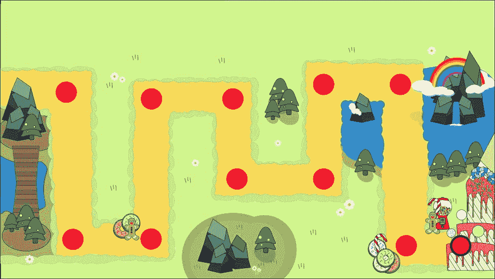

如我们所见，有 11 个航点，我们需要一个位于地图蛋糕上的航点。这个最终的航点是熊猫成功完成偷吃玩家蛋糕任务的终点。

现在我们已经发现了它们，我们需要记录它们在地图上的坐标。一种快速的方法是在 **场景** 视图中拖动 Panda Prefab，然后记录航点的位置。在这种情况下，我们可以获得以下数据：

| **航点编号** | **X 坐标** | **Y 坐标** |
| --- | --- | --- |
| 1 | `-28` | `8` |
| 2 | `-28` | `-16` |
| 3 | `-16` | `-16` |
| 4 | `-16` | `7` |
| 5 | `-2` | `7` |
| 6 | `-2` | `-6` |
| 7 | `12` | `-6` |
| 8 | `12` | `9` |
| 9 | `25` | `9` |
| 10 | `25` | `-17` |
| 11 | `32` | `-17` |

# 实现航点 – 第一种/静态方法

现在我们已经拥有了所有的航点坐标，我们可以实现它们。在本节中，我们将探讨实现它们的第一种方法。这种方法的主要优势是实现简单，以及有机会了解更多关于静态变量和遍历航点。

## 在游戏管理器中实现航点

在这个航点的首次实现中，它们在游戏中不会是独立的实体，而是一系列按特定顺序排列的位置。所有敌人都会查阅这个列表，并根据它们当前所在的航点，选择列表中的下一个航点。

当然，这种方法有一些限制，例如我们无法在航点中实现自定义功能，正如我们将在第八章 What Is beyond the Cake?中看到的。然而，它更容易实现，并给我们提供了探索如何使用静态变量的机会。

首先，我们需要创建另一个脚本，并将其命名为 `GameManagerScript`。我们将在下一章中在这个脚本中实现更多功能。但到目前为止，我们需要存储航点。实际上，目前我们只需要添加一个位置数组，所以你可以在脚本中写下以下内容：

```cs
*//public waypoint list as an array of positions* 
public Vector3[] waypoints; 

```

它是一个 `Vector3` 数组，基本上只是按特定顺序存储一组位置。保存代码，并在 **场景** 中创建一个空的游戏对象，你可以将其重命名为 `Game Manager`。将脚本附加到它上，在 **检查器** 中你应该看到如下内容：

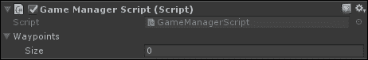

我们需要将数组的元素数量设置为找到的航点数量，在本例中为 11。因此，我们的 **检查器** 看起来如下：

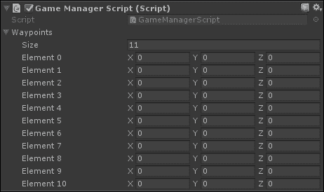

最后，我们可以用航点位置填充所有这些值。那么 *z* 轴怎么办呢？由于我们不希望 Pandas 改变它们的 *z* 轴，我们可以将其值设置为与 `PandaPrefab` 的相同 *z* 轴值，即 `-1`。最后，我们应该得到如下所示的内容：

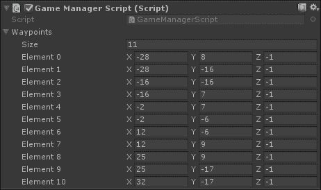

### 注意

读者可能会想知道使用 `Vector2` 而不是 `Vector3` 是否值得。答案是：由你决定。没有任何东西阻止你使用 `Vector2` 而忽略 `Vector3`。但是，既然我们已经选择了用 z 缓冲区来处理游戏中的深度，我个人更倾向于直接控制 *z* 轴，因此请确保实现预期的行为。

## 沿着设计的路径移动 – 静态

接下来，我们需要给敌人一个访问存储在 `GameManagerScript` 中的航点的机会。因此，我们需要获取它的引用。有好多方法可以做到这一点，但为了学习的目的，我们将使用一个静态变量（以便揭示此类变量的用途）。实际上，所有的 Pandas 都共享同一个游戏管理器，如果每次创建 Pandas 时都需要搜索 `Game Manager`，那么这将是计算资源的浪费。静态变量是一个在 `PandaScript` 的所有实例之间共享的值。当然，我们需要小心不要多次分配这个变量。

### 注意

记住，静态变量在不同的场景/级别之间是持久的。因此，如果你计划发布一个包含多个级别的游戏，那么在改变级别时，你很可能需要重置这个变量。我们将在第八章 What Is beyond the Cake? 中更好地探讨这一点。

打开 `PandaScript`，让我们添加一个静态变量来存储对 `Game Manager` 的引用：

```cs
*//Private static variable to store the Game Manager* 
private static GameManagerScript gameManager; 

```

在 `Start()` 函数的开始处，我们需要检查是否已经有一个实例（另一个 Pandas）分配了这个变量。如果没有，我们将通过在场景中找到它的引用来分配它，尽管当时场景中只有一个游戏管理器。因此，这个 Pandas 实际上会初始化这个变量。这样，所有将要创建的其他 Pandas 实例都将有一个对 `Game Manager` 的引用准备就绪，并且由于这个检查，我们可以确信我们只分配了一次：

```cs
*//If the reference to the Game Manager is missing, the script gets it* 
if(gameManager == null) { 
  gameManager = FindObjectOfType<GameManagerScript>(); 
} 

```

现在，我们必须让 Pandas 移动。但首先，我们需要一个变量来存储 Pandas 正在前往的当前航点：

```cs
*//Private counter for the waypoints* 
private int currentWaypointNumber; 

```

然后，我们需要一个常量来设置一个阈值，超过这个阈值航点就被认为是已经到达了。实际上，存在数值不稳定性，我们不能直接检查航点的距离是否实际上是零，而只能是一个非常接近零的值。正如你所见，分配给这个常量的值非常低：

```cs
*//Private constant under which a waypoint is considered reached* 
private const float changeDist = 0.001f; 

```

最后，我们需要实现熊猫向右的航点移动机制，并在到达前一个航点后改变方向前往下一个航点。由于我们将使用的`MoveTowards()`函数处理物理问题，我们需要在`FixedUpdate()`函数内实现整个航点机制，正如我们在第五章《物理的调味品》中学到的那样。因此，我们可以开始编写以下代码：

```cs
void FixedUpdate() { 
  *//Add here the rest of the code of this section* 
} 

```

特别地，在`FixedUpdate()`函数内我们需要做三件事情。第一件事是检查熊猫是否到达了航点列表的末尾，这意味着它已经站在美味玩家蛋糕的前面。如果是这样，我们需要以与在第四章《不再孤单——甜食熊猫出击》中触发其他动画相同的方式触发吃动画。然后，我们需要从这个熊猫上移除这个脚本。实际上，我们在第四章《不再孤单——甜食熊猫出击》中编写的`状态机行为`脚本将负责将熊猫从场景中移除。最后，我们返回，这样函数的其余部分就不会被执行：

```cs
*//if the Panda has reached the cake, then it will eat it, by triggering
  the right animation,*
*//and remove this script, since the State Machine Behaviour will take
  care of removing the Panda* 
if (currentWaypointNumber == gameManager.waypoints.Length) { 
  animator.SetTrigger(AnimEatTriggerHash); 
  Destroy(this); 
  return; 
} 

```

第二件事，如果熊猫还没有到达最后一个航点，就是计算当前熊猫位置（通过其 Transform）与它正前往的航点之间的距离。这个值存储在一个局部变量`dist`中：

```cs
*//Calculate the distance between the Panda and the waypoint that the
  Panda is moving towards* 
float dist = Vector2.Distance(transform.position,
  gameManager.waypoints[currentWaypointNumber]); 

```

最后一件事情是检查熊猫是否足够接近航点。足够的意思是低于存储在`changeDist`中的常量阈值。如果是这样，我们就增加航点的计数器，这样在下一个迭代中，熊猫就会前往下一个航点。否则，我们只需使用上一章中实现的`MoveTowards()`函数将熊猫移动到航点：

```cs
*//If the waypoint is considered reached because below the threshold of
  the constant changeDist*
*//the counter of waypoints is increased, otherwise the Panda moves
  towards the waypoint* 
if(dist <= changeDist) { 
  currentWaypointNumber++; 
}else { 
  MoveTowards(gameManager.waypoints[currentWaypointNumber]); 
} 

```

我们可以保存我们的脚本并测试它。通过在场景中某个位置放置一个熊猫，靠近第一个航点，然后按下播放，我们将看到它沿着路径移动。

# 实现航点——第二种/动态方法

在本节中，我们将探讨实现游戏航点系统的第二种方法。当然，结果将是相同的，但这种方法提供了许多其他优点。首先，对于设计师来说，在地图本身中定位、更改、移动和替换航点更容易。其次，它允许在行为上具有很大的灵活性，可以以这种方式实现，使设计师更容易使用创建的脚本。我们将在本书的最后一章中利用这个系统的某些潜力。

然而，这种方法确实存在一些缺点，就像生活中的每一个选择一样。特别是，系统的复杂性增加了。此外，它为每个航点使用不同的游戏对象，如果航点的数量真的很多，这一点至关重要。

### 注意

为了克服为每个航点使用不同游戏对象的问题，我们有多种可能性，但让每一个都工作是一个挑战，同时对于设计师来说也很容易使用。实际上，航点仍然可以存储为列表，不是位置，而是`waypoint`类，同时提供功能，允许设计师在**场景**视图中编辑和放置它们。这被留在了*作业*部分作为一个挑战。

## 将航点作为独立实体实现

到目前为止，我们已经看到了航点的简单实现。现在，我们将再次实现它们，但这次作为独立的实体。因此，在第八章，*蛋糕之后是什么？*中，我们将探讨如何在游戏中解锁航点的潜力。实际上，在本节结束时，对我们游戏的影响将是相同的；然而，我们将通过实现更多功能来改变第八章，*蛋糕之后是什么？*中的脚本。

首先，我们需要从`GameManagerScript`中删除`waypoints`变量（但不要删除脚本，即使它是空的，因为我们还会使用它；出于同样的原因，不要从`PandaScript`中删除`gameManager`变量）。

现在，我们需要创建一个新的脚本，它将是实际上的航点。因此，我们可以将其重命名为`Waypoint`。

我们需要一个相同类的变量来存储下一个航点。这样，每个航点都将能够指向/引用另一个航点。目标是构建一个熊猫将跟随的链。由于变量是私有的，但我们仍然需要在**检查器**中访问它，我们需要添加可序列化的属性。因此，我们可以向我们的脚本中添加以下内容：

```cs
*//Private variable to store the next waypoint in the chain 
//It is serializable, so it can be set in the Inspector* 
[SerializeField] 
private Waypoint nextWaypoint; 

```

现在，从航点出发，熊猫想要在到达当前航点后检索其位置和下一个要跟随的航点。为了实现这一点，我们可以从我们的`Waypoint`脚本中公开两个函数。

`GetPosition()`函数将返回一个包含航点位置的`Vector3`，在这个特定的实现中，位置存储在航点的 Transform 中。代码如下：

```cs
*//Function to retrieve the position of the waypoint* 
public Vector3 GetPosition() { 
  return transform.position; 
} 

```

相反，`GetNextWaypoint()`函数将仅返回下一个航点（至少目前是这样），存储在`nextWaypoint`变量中。实际上，`nextWaypoint`变量是私有的，因此熊猫需要一个函数来检索它。因此，我们可以简单地编写以下代码：

```cs
*//Function to retrieve the next waypoint in the chain* 
public Waypoint GetNextWaypoint() { 
  return nextWaypoint; 
} 

```

目前我们已经完成了这个脚本，所以我们可以保存它。

下一步是创建我们的路标点的 Prefab。创建一个空 GameObject 并附加 `Waypoint` 脚本。然后，在 **项目** 面板中创建一个名为 `WaypointPrefab` 的 Prefab，并将你创建的空 GameObject 拖放到那里。最后，从场景中删除空 GameObject，因为我们已经有了我们的 Prefab。

拖放与已识别路标点数量相同的 Prefabs；在我们的例子中，有 11 个。为了方便起见，我建议你按顺序重命名它们，如下面的截图所示：

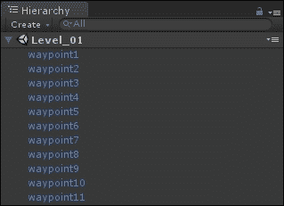

现在，我们需要将它们相互链接。特别是，`waypoint1` 将链接到 `waypoint2`，`waypoint2` 将链接到 `waypoint3`，依此类推。例如，`waypoint4` 在 **检查器** 中应该看起来如下链接：

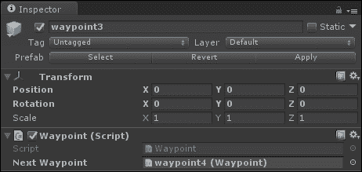

唯一的例外是在最后一个路标点，`nextWaypoint` 变量中没有内容，如下面的截图所示：

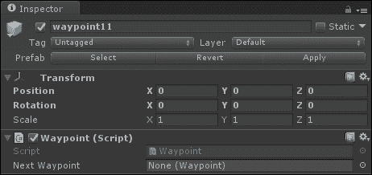

最后，我们需要将它们放置在 *获取路标坐标* 部分中我们已确定的坐标上。为了快速识别它们，我建议你添加一个 Gizmo 图标。正如其名所示，Gizmo 是一个在场景视图中显示的图标，可以快速轻松地识别特定对象，但在游戏构建后不可见。最近，Unity 还增加了在 **游戏** 视图中查看它们的可能性。

插入 Gizmo 最简单的方式是点击 GameObject 名称旁边的立方体形状图标，如下面的截图所示：

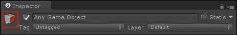

### 注意

对于 Prefabs 也是如此，但它们的图标是一个蓝色立方体。

一旦点击此图标，就会出现一个菜单，如下面的截图所示：

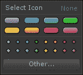

通过选择一个椭圆形状的图标，你将为对象放置一个带有其名称的标签。我们将选择这些之一用于我们的路标点。如果你点击圆形或水晶形状的图标，Gizmo 将看起来像一个圆圈或水晶，没有任何文本。如果你点击 **其他…** 按钮，你可以使用你自己的图形。

### 注意

插入 Gizmos 的更复杂方式是通过脚本。实际上，有一个名为 `OnDrawGizmos()` 的特殊函数，当启用 Gizmos 渲染时，Unity 会调用该函数。在这个函数内部，你可以使用 [`docs.unity3d.com/ScriptReference/Gizmos.html`](https://docs.unity3d.com/ScriptReference/Gizmos.html) 中列出的任何函数，这些函数允许你在屏幕上绘制形状。这是一个非常强大的工具，因为它可以极大地增强你脚本的可用性。例如，在我们的特定案例中，我们可以绘制 Pandas 将会跟随的路径。这被留作 *作业* 部分的练习。

在我们的情况下，我们可以为所有航点选择一个椭圆形图标。因此，我们能够在**场景**视图中看到它们（即使它们没有任何显式的渲染组件，因此在最终游戏中将无法以任何方式可见）并快速放置它们。

最后，你的**场景**视图应该看起来像以下这样：

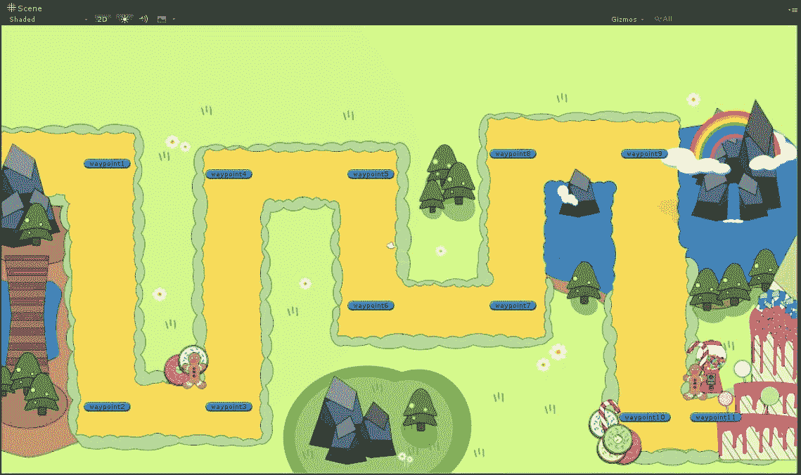

现在，我们需要告诉游戏，这些航点中的哪一个是最初的链。为此，我们可以在`游戏管理器`中存储这些信息。所以，让我们向`GameManagerScript`添加以下变量：

```cs
*//The first waypoint of the chain* 
public Waypoint firstWaypoint; 

```

最后，在保存脚本后，在**检查器**中设置变量，如图下截图所示：


总之，我们已经创建了一个航点链，这正是我们游戏所需要的。然而，我们仍然需要定义熊猫如何到达它们。

## 沿着设计的路径移动 - 动态

下一步是稍微修改`PandaScript`以处理这个新的航点系统。所以，让我们再次打开脚本。

首先，我们需要用适当的航点变量替换整数变量`currentWaypointNumber`，如图所示：

```cs
*//Private reference to the current waypoint* 
private Waypoint currentWaypoint; 

```

然后，我们需要初始化这个新变量；我们可以在`Start()`函数中完成，通过从`游戏管理器`获取第一个航点，如图所示：

```cs
*//Get the first waypoint from the Game Manager* 
currentWaypoint = gameManager.firstWaypoint; 

```

然后，在`FixedUpdate()`函数的第一个检查中，我们需要检查变量本身是否为 null（这意味着熊猫已经到达了蛋糕，因为最后一个航点将返回一个 null 指针）。以下是代码，其中修改的部分已突出显示：

```cs
if (currentWaypoint == null) { 
  animator.SetTrigger(AnimEatTriggerHash); 
  Destroy(this); 
  return; 
} 

```

在`FixedUpdate()`函数中继续进行，我们需要更改距离的计算方式，通过以下方式使用我们的航点的`GetPosition()`函数：

```cs
float dist = Vector2.Distance(transform.position,
  currentWaypoint.GetPosition()); 

```

最后，我们需要更改`FixedUpdate()`函数中的最后一个`if`语句，以便在到达前一个航点时获取下一个航点。我们还需要决定应该将哪个参数提供给我们的`MoveTowards()`函数。再次，修改的部分已突出显示：

```cs
if(dist <= changeDist) { 
  currentWaypoint = currentWaypoint.GetNextWaypoint(); 
}else { 
  MoveTowards(currentWaypoint.GetPosition()); 
} 

```

保存脚本。我们已经完成了第二种实现航点的方式。第八章，“蛋糕之后是什么？”，将建议一些利用这种结构来实现更复杂行为的方法。

# 关于游戏中的更多人工智能内容

在前面的章节中，我们看到了几个在游戏环境中移动角色的航标系统实现。然而，正如我们在引言中已经说过的，这甚至没有触及游戏 AI 的表面。本节介绍了几个技术，但不会深入细节，因为它们对我们开发塔防游戏不是必需的。实际上，要掌握游戏中的 AI，你需要一本专门关于它的书。因此，您可以自由地跳过这一节，或者阅读它。您总是可以稍后回来，也许在您完成这本书后，更深入地了解其内容。本节的主要目标只是让您对游戏中的 AI 有一个基本的了解。

## 在寻路级别上的其他导航技术

本章开头关于**寻路及其技术**的部分绝不是详尽的，当然，在寻路级别上还有成千上万的其他技术被用于视频游戏中。

然而，特别值得一提的是：导航网格。这是重要的，因为它内置在 Unity 引擎的 3D 游戏中。这种技术背后的主要概念是对级别几何形状的预分析，以提取一个图（这是一个离线算法），其他寻路算法可以在需要时从中提取路径（这些算法是在线工作的）。

您可以通过在顶部菜单栏中点击**窗口 | 导航**来设置一些参数以生成这样的图表。具体来说，您可以在**烘焙**选项卡中设置通用选项，如下面的截图所示：

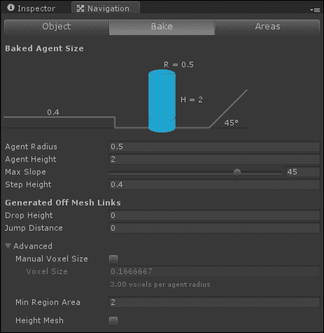

一旦构建了这个图表，代理可以通过脚本中的特定类来访问它。

无论如何，这都属于 Unity 的 3D 部分，我们不会进一步深入。但如果您想了解更多，可以从官方文档开始：[`docs.unity3d.com/Manual/Navigation.html`](https://docs.unity3d.com/Manual/Navigation.html)（如您从目录中注意到的，这是 Unity 中一个相当庞大且功能强大的工具，但非常强大）。

## 转向行为级别的导航

记得我们如何在第五章，“物理学的小秘诀”中实现 Unity 中的物理方程吗？我们可以实现所有运动方程，我们将获得任何类型的运动。如果然后，我们将这个与目标、目的地或甚至只是一个方向混合，再加上一些避障技术，我们就已经实现了一种转向行为。

例如，如果你将障碍物避免实现为排斥 NPC 的磁铁，将目标实现为吸引磁铁，你将获得相当不错的转向行为。角色可以在没有路径寻找算法的情况下到达目的地。注意我说的是“可以”。实际上，他们可能会陷入困境，并且与转向行为作为最终解决方案相关的问题还有很多。但是，将转向行为整合到路径寻找算法中（第一个处理高级导航，例如从一个房间到另一个房间，第二个可以在房间内导航以到达下一个房间的门）是一个很好的补充，这可以带来非常逼真的行为，并且性能开销非常低。

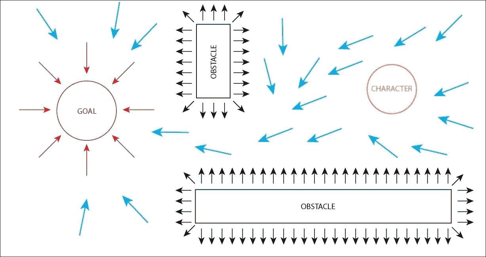

磁铁转向行为的示例

通常，目标的吸引力范围扩展到整个地图，而障碍物的排斥力仅限于局部。此外，这些力可以遵循不同的势能定律，并具有不同的形状。为了帮助你可视化磁场，你可以看看 Dayna Mason 提供的图片：[`www.flickr.com/photos/daynoir/2180507211`](https://www.flickr.com/photos/daynoir/2180507211)。每个指南针代表当角色处于该位置时所受到的力的类型。在我们的例子中也是如此，角色被障碍物推开，被目标吸引。值得注意的是，我们的目标和障碍物是单极磁铁，但在我们的物理世界中它们并不存在（只有磁偶极子存在）。

## 导航在路径寻找/决策制定层面 – 基于信念的路径寻找

正如我之前提到的，学术界最近开始将路径寻找中的决策部分进行整合。我的一个关于**基于信念的路径寻找**（**BDP**）的出版物就是这样一个例子。

关键概念是 NPC 不一定知道整个地图。想象一下有一条桥可以跨越河流，但玩家已经摧毁了这座桥；因此，当角色在环境中导航时，角色应该将地图视为桥还在那里，因为他不知道桥已经塌陷。只有当他接近河流时，他才意识到桥已经塌陷，因此，采取行动（例如找到另一条路，建造另一座桥，用木头制作一艘筏子，或者游泳）。这就是为什么它是基于信念的，因为角色按照他/她相信的环境进行导航，并据此做出假设。

### 注意

如果你对了解更多关于 BDP（行为决策规划）感兴趣，你可以查看我的网站：[francescosapio.com](http://francescosapio.com)。

## 超越导航

游戏中的 AI 不仅限于导航，正如我们在引言中提到的，AI 在视频游戏中可以应用于许多层面。想象一下回合制游戏，其中 NPC 需要做出战略决策。

但人工智能不仅适用于非玩家角色。有些游戏实现了适应游戏难度的算法（自适应和学习算法），有些处理摄像机应该如何移动以在玩家中唤起特定的情感状态（例如，在 Georgios N. Yannakakis 的工作中特别如此，在论文《空间迷宫：基于经验的游戏摄像机控制》中）。其他游戏有**程序内容生成**（**PCG**）的算法，如著名的*Temple Run*（Imangi 工作室，2011 年）通过程序生成关卡，或者甚至是*Minecraft*（Mojang，2011 年）中整个世界都是通过程序生成的。

人工智能也应用于游戏和玩家的分析，例如研究游戏的内部结构或收集玩家的心理档案。关于后者，您需要想象在严肃游戏中的应用，在这些游戏中，游戏可以用来评估特定环境中人们的表现。您可以在 Lauren S. Ferro 撰写的有趣的开篇论文《迈向个性化的游戏化系统：对游戏设计、个性和玩家类型的调查》中找到相关信息（可在[`dl.acm.org/citation.cfm?id=2513024`](http://dl.acm.org/citation.cfm?id=2513024)找到）。

最后，值得一提的是，游戏与人工智能之间的关系不是单向的。事实上，不仅游戏使用人工智能，反之亦然。一些关于人工智能的研究和研究表明，视频游戏有助于提供完美的模拟环境（例如，为机器人），并且还可以创建替代玩家并玩游戏（不涉及作弊，因为游戏中的 AI 总是使用额外的数据来收集游戏的具体状态）。

在任何情况下，请记住，当人工智能应用于游戏时，最重要的目标不是追求现实感，而是为玩家创造一个沉浸式和娱乐性的体验（如果游戏设计包含这一目标，这也可能导致学习体验）。

# 作业

在本章中，我们概述了游戏中的人工智能。然而，我们只关注了导航，特别是为我们的游戏实现航点系统。但您仍然可以对其进行改进，本节提出了一些练习来实现这一点。因此，在下一章之前，我邀请您完成以下练习，以进一步提高您的技能：

1.  **成为 AI 设计师和程序员**：想想你玩的五款游戏，并选择其中包含非玩家角色（NPC）的部分，比如敌人或甚至 Boss。现在，列出它们各自的行为清单。现在，移除一些行为，甚至添加一些，并思考这会如何改变体验。它是改善了体验，还是完全改变了氛围？你能通过改变一些行为，将相对真实的行为变成智能的，反之亦然吗？通过这样做，你将开始理解某些行为在不仅为你的角色提供生命，而且在为玩家提供情感方面的重要性。

1.  **航点作为碰撞体**：在前一章中，我们学习了如何使用碰撞体和检测碰撞。特别是，我们看到了糖果是如何与熊猫碰撞以触发动作的（在这种情况下，是射下熊猫）。然而，同样的原理也可以应用在这里。相反，为了使用 `changeDist` 常数并检查熊猫到航点的距离，我们可以再次使用 `OnTriggerEnter2D()` 函数来检查熊猫何时到达航点。以这种方式实现航点的改变，无论你使用的是第一个还是第二个实现。小提示：你可能需要为航点设置一个新的标签（记得如何在第二章中设置标签，*制作纸杯蛋糕塔*？），并在它们上添加碰撞体。

1.  **自动到达的航点**：在更复杂的航点系统中，你不应该手动创建链（即使当地图变大时，解决方案变得难以扩展）。因此，尝试设计和实现一个系统，其中航点一旦放置就会自动连接。

1.  **创建 Gizmo 路径显示器**：在第二章中，我们介绍了如何使用一些 Gizmo 函数在场景上绘制有用的东西。使用这些函数，特别是 `Gizmos.DrawLine()`，可以在 **场景** 视图中显示航点的链。

    最后，有一个挑战给你：

1.  **简单航点**：在第二个实现中，我们为每个航点使用不同的游戏对象。设计和实现一个系统，它对设计师来说尽可能简单（这样他们可以在 **场景** 视图中拖动航点，并可能看到之前练习中的链），同时效率高，因为它不会使用游戏对象作为航点（而是存储在某个地方的数组）。

# 摘要

在本章中，我们学习了视频游戏中人工智能的非常基础的知识。我们概述了导航和一些常用的技术。

然后，我们基于航点构建了我们游戏的导航系统。特别是，我们为我们的游戏实现了两种类型的航点系统，以学习实现相同结果的不同方法。

最后，我们对游戏中的 AI 又进行了另一个总的概述。

在下一章中，我们将完成我们的游戏！已经兴奋了吗？好吧，你在等什么呢？下一章就在一页之隔。
